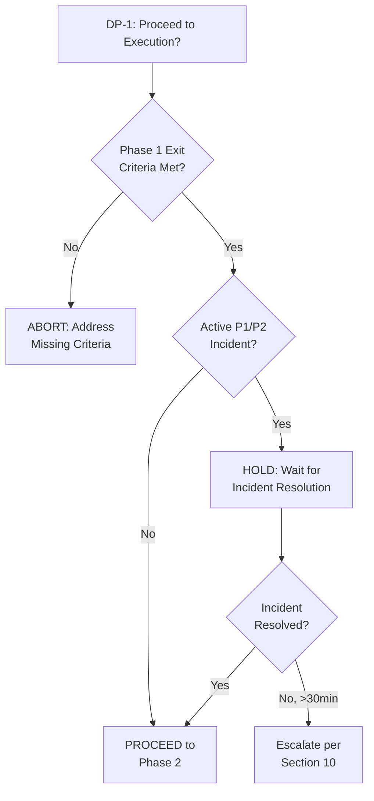
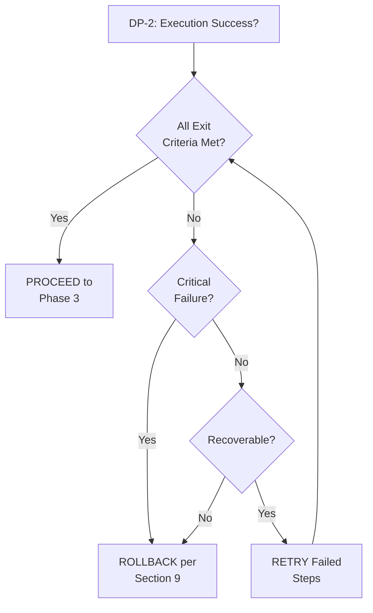

# Playbook: {{TITLE}}

<!--
TEMPLATE: Playbook
SOURCE: EN-003 Design Documentation Standards - Phase 2 Synthesis Section 8
VERSION: 1.0.0
STATUS: ACTIVE

DESCRIPTION:
  Operational playbook template for documenting standardized procedures with
  phase-based organization, decision points, verification checkpoints, and
  rollback procedures. Designed for planned changes, deployments, migrations,
  and complex operational tasks.

DOCUMENT TYPE POSITIONING:
  - TDD: WHY decisions were made (design rationale, architecture)
  - Playbook (THIS): HOW to execute planned operations (procedures, phases, checkpoints)
  - Runbook: HOW to troubleshoot and respond (diagnostics, incident response)

MULTI-PERSPECTIVE DOCUMENTATION (L0/L1/L2):
  - L0 (ELI5): Quick Start section - 5-minute understanding
  - L1 (Engineer): Detailed procedures with commands and verification
  - L2 (Architect): Context, rationale, and design decisions

REQUIREMENTS TRACEABILITY:
  This template satisfies 33 requirements (REQ-PB-*):
  - REQ-PB-STRUCT-*: 9 structure requirements
  - REQ-PB-PREREQ-*: 8 prerequisites requirements
  - REQ-PB-VERIF-*: 8 verification requirements
  - REQ-PB-DECIDE-*: 8 decision point requirements

TARGET LENGTH: 500-700 lines (instantiated)
-->

---

## Frontmatter

```yaml
# === IDENTITY ===
# REQ-PB-STRUCT-001: YAML Frontmatter
id: "PB-{{SYSTEM}}-{{SEQ}}"           # Format: PB-{SYSTEM}-{NNN} (e.g., PB-DEPLOY-001)
title: "Playbook: {{TITLE}}"          # Human-readable title
version: "1.0.0"                      # Semantic versioning
status: "DRAFT"                       # DRAFT | ACTIVE | DEPRECATED | SUPERSEDED

# === OWNERSHIP ===
owner: "{{TEAM_OR_ROLE}}"             # Team or role responsible for this playbook
author: "{{AUTHOR}}"                  # Original author
reviewers:                            # List of reviewers
  - "{{REVIEWER_1}}"
  - "{{REVIEWER_2}}"

# === CLASSIFICATION ===
classification: "L1"                  # L0=Executive, L1=Operator, L2=Architect
criticality: "HIGH"                   # CRITICAL | HIGH | MEDIUM | LOW
change_type: "{{CHANGE_TYPE}}"        # STANDARD | NORMAL | EMERGENCY

# === TIMING ===
estimated_duration: "2-4 hours"       # Expected execution time
automation_level: "manual"            # manual | semi-automated | automated
review_cycle: "quarterly"             # Review frequency

# === TIMESTAMPS ===
created: "{{CREATED_ISO8601}}"        # ISO 8601: 2026-01-26T00:00:00Z
updated: "{{UPDATED_ISO8601}}"        # ISO 8601
last_tested: "{{LAST_TESTED}}"        # When playbook was last executed/tested
next_review: "{{NEXT_REVIEW}}"        # Scheduled review date

# === TRACEABILITY ===
work_items:
  epic: "EPIC-{{NNN}}"                # Related Epic
  feature: "FEAT-{{NNN}}"             # Related Feature
  enabler: "EN-{{NNN}}"               # Related Enabler (if applicable)

# === METADATA ===
tags:
  - "{{TAG_1}}"                       # e.g., "deployment"
  - "{{TAG_2}}"                       # e.g., "production"
  - "{{TAG_3}}"                       # e.g., "kubernetes"

# === SUPERSESSION (if applicable) ===
supersedes: null                      # ID of playbook this supersedes
superseded_by: null                   # ID of playbook that supersedes this
```

---

## Table of Contents

1. [Quick Start (L0 - ELI5)](#1-quick-start-l0---eli5)
2. [Overview](#2-overview)
3. [RACI Matrix](#3-raci-matrix)
4. [Prerequisites](#4-prerequisites)
5. [Phase 1: Preparation](#5-phase-1-preparation)
6. [Phase 2: Execution](#6-phase-2-execution)
7. [Phase 3: Verification](#7-phase-3-verification)
8. [Post-Execution Verification](#8-post-execution-verification)
9. [Rollback Procedures](#9-rollback-procedures)
10. [Escalation](#10-escalation)
11. [Decision Points Summary](#11-decision-points-summary)
12. [Failure Actions](#12-failure-actions)
13. [Related Documentation](#13-related-documentation)
14. [Revision History](#14-revision-history)
15. [Requirements Traceability Matrix](#appendix-a-requirements-traceability-matrix)

---

## 1. Quick Start (L0 - ELI5)

<!--
REQ-PB-STRUCT-002 (partial): Overview for quick understanding
PURPOSE: Enable anyone to understand in 5 minutes what this playbook does,
who should use it, and what the expected outcome is.
ANALOGY: Like the summary on a recipe card before the detailed instructions.
-->

### 1.1 What This Playbook Does

> **Simple Analogy:** {{SIMPLE_ANALOGY}}
>
> Example: "This playbook is like a pilot's pre-flight checklist - it ensures
> all safety checks are completed before and after a critical operation."

**In Plain Terms:**
{{PLAIN_LANGUAGE_DESCRIPTION}}

### 1.2 Who Should Use It

| Role | Why They Need This |
|------|-------------------|
| {{ROLE_1}} | {{REASON_1}} |
| {{ROLE_2}} | {{REASON_2}} |
| {{ROLE_3}} | {{REASON_3}} |

### 1.3 Expected Outcome

**Before Running This Playbook:**
- {{BEFORE_STATE_1}}
- {{BEFORE_STATE_2}}

**After Running This Playbook:**
- {{AFTER_STATE_1}}
- {{AFTER_STATE_2}}

### 1.4 Time Commitment

| Phase | Duration | Can Be Interrupted? |
|-------|----------|---------------------|
| Preparation | {{PREP_DURATION}} | Yes |
| Execution | {{EXEC_DURATION}} | {{EXEC_INTERRUPT}} |
| Verification | {{VERIFY_DURATION}} | Yes |
| **Total** | **{{TOTAL_DURATION}}** | |

### 1.5 Risk Level

- **Risk Level:** {{HIGH/MEDIUM/LOW}}
- **Rollback Available:** {{YES/NO}}
- **Downtime Required:** {{YES/NO - DURATION}}

---

## 2. Overview

<!-- REQ-PB-STRUCT-002: Overview Section -->

### 2.1 Purpose

{{PURPOSE_DESCRIPTION}}

**This playbook addresses:**
- {{PROBLEM_1}}
- {{PROBLEM_2}}
- {{PROBLEM_3}}

### 2.2 Scope

**In Scope:**
- {{IN_SCOPE_1}}
- {{IN_SCOPE_2}}
- {{IN_SCOPE_3}}

**Out of Scope:**
- {{OUT_OF_SCOPE_1}}
- {{OUT_OF_SCOPE_2}}

### 2.3 Audience

| Audience | Level | Sections to Read |
|----------|-------|------------------|
| Executive/Manager | L0 | Quick Start, Outcome |
| Operator/Engineer | L1 | All procedure sections |
| Architect/Lead | L2 | Context & Rationale, Decision Points |

### 2.4 When to Use This Playbook

**Use this playbook when:**
- [ ] {{TRIGGER_CONDITION_1}}
- [ ] {{TRIGGER_CONDITION_2}}
- [ ] {{TRIGGER_CONDITION_3}}

**Do NOT use this playbook when:**
- {{EXCLUSION_1}} - Use {{ALTERNATIVE_1}} instead
- {{EXCLUSION_2}} - Use {{ALTERNATIVE_2}} instead

---

## 3. RACI Matrix

<!-- REQ-PB-STRUCT-005: RACI Matrix -->

### 3.1 Roles Definition

| Role | Description | Contact |
|------|-------------|---------|
| {{ROLE_1}} | {{ROLE_1_DESC}} | {{CONTACT_1}} |
| {{ROLE_2}} | {{ROLE_2_DESC}} | {{CONTACT_2}} |
| {{ROLE_3}} | {{ROLE_3_DESC}} | {{CONTACT_3}} |
| {{ROLE_4}} | {{ROLE_4_DESC}} | {{CONTACT_4}} |

### 3.2 Responsibility Matrix

<!-- R=Responsible, A=Accountable, C=Consulted, I=Informed -->

| Activity | {{ROLE_1}} | {{ROLE_2}} | {{ROLE_3}} | {{ROLE_4}} |
|----------|------------|------------|------------|------------|
| Approve execution | I | A | R | I |
| Execute playbook | R | I | C | I |
| Verify completion | R | A | C | I |
| Handle escalations | C | A | R | I |
| Approve rollback | I | A | R | I |
| Post-execution review | R | A | C | I |

---

## 4. Prerequisites

<!-- REQ-PB-PREREQ-001 through REQ-PB-PREREQ-008 -->

### 4.1 Prerequisites Checklist

<!-- REQ-PB-PREREQ-001: Prerequisites Checklist -->

**Complete ALL items before proceeding. Do not skip any item.**

- [ ] Change ticket approved: `CHG-{{TICKET_NUMBER}}`
- [ ] Maintenance window scheduled: `{{DATETIME_ISO8601}}`
- [ ] Stakeholders notified (see Section 4.8)
- [ ] Backup completed and verified (see Section 4.7)
- [ ] Environment verification passed (see Section 4.6)
- [ ] Required tools available (see Section 4.2)
- [ ] Required access confirmed (see Section 4.3)
- [ ] Required knowledge/training completed (see Section 4.4)
- [ ] Communication plan reviewed (see Section 4.8)

### 4.2 Required Tools

<!-- REQ-PB-PREREQ-002: Required Tools List -->

| Tool | Minimum Version | Purpose | How to Obtain |
|------|-----------------|---------|---------------|
| {{TOOL_1}} | {{VERSION_1}} | {{PURPOSE_1}} | {{OBTAIN_1}} |
| {{TOOL_2}} | {{VERSION_2}} | {{PURPOSE_2}} | {{OBTAIN_2}} |
| {{TOOL_3}} | {{VERSION_3}} | {{PURPOSE_3}} | {{OBTAIN_3}} |

**Tool Verification Commands:**

```bash
# Verify {{TOOL_1}}
{{TOOL_1_VERSION_CMD}}
# Expected: {{TOOL_1_EXPECTED}}

# Verify {{TOOL_2}}
{{TOOL_2_VERSION_CMD}}
# Expected: {{TOOL_2_EXPECTED}}
```

### 4.3 Required Access/Permissions

<!-- REQ-PB-PREREQ-003: Required Access/Permissions -->

| Resource | Access Level | How to Obtain | Verification |
|----------|--------------|---------------|--------------|
| {{RESOURCE_1}} | {{ACCESS_LEVEL_1}} | {{OBTAIN_ACCESS_1}} | {{VERIFY_ACCESS_1}} |
| {{RESOURCE_2}} | {{ACCESS_LEVEL_2}} | {{OBTAIN_ACCESS_2}} | {{VERIFY_ACCESS_2}} |
| {{RESOURCE_3}} | {{ACCESS_LEVEL_3}} | {{OBTAIN_ACCESS_3}} | {{VERIFY_ACCESS_3}} |

**Access Verification Commands:**

```bash
# Verify {{RESOURCE_1}} access
{{ACCESS_VERIFY_CMD_1}}
# Expected: {{ACCESS_EXPECTED_1}}
```

### 4.4 Required Knowledge/Training

<!-- REQ-PB-PREREQ-004: Required Knowledge/Training -->

| Topic | Level | Training Resource | Certification Required |
|-------|-------|-------------------|------------------------|
| {{TOPIC_1}} | {{LEVEL_1}} | {{RESOURCE_1}} | {{CERT_1}} |
| {{TOPIC_2}} | {{LEVEL_2}} | {{RESOURCE_2}} | {{CERT_2}} |

### 4.5 Change Management Requirements

<!-- REQ-PB-PREREQ-005: Change Management Requirements -->

**Required Approvals:**
- [ ] Change Advisory Board (CAB) approval: `{{CAB_TICKET}}`
- [ ] Technical review completed: `{{REVIEW_DATE}}`
- [ ] Security review completed: `{{SECURITY_REVIEW}}`

**Required Documentation:**
- [ ] Risk assessment completed
- [ ] Rollback plan documented (Section 9)
- [ ] Test results available

### 4.6 Environment Verification Commands

<!-- REQ-PB-PREREQ-006: Environment Verification Commands -->

Run these commands to verify the environment is ready:

```bash
# === Environment Health Check ===

# Step 1: Verify connectivity
{{ENV_CONNECTIVITY_CMD}}
# Expected: {{ENV_CONNECTIVITY_EXPECTED}}

# Step 2: Verify service status
{{ENV_SERVICE_CMD}}
# Expected: {{ENV_SERVICE_EXPECTED}}

# Step 3: Verify resource availability
{{ENV_RESOURCE_CMD}}
# Expected: {{ENV_RESOURCE_EXPECTED}}
```

**Environment Verification Checklist:**
- [ ] All connectivity tests passed
- [ ] All services in expected state
- [ ] Sufficient resources available

### 4.7 Backup Requirements

<!-- REQ-PB-PREREQ-007: Backup Requirements -->

**What to Backup:**

| Component | Backup Method | Retention | Verification Command |
|-----------|---------------|-----------|---------------------|
| {{COMPONENT_1}} | {{METHOD_1}} | {{RETENTION_1}} | {{BACKUP_VERIFY_1}} |
| {{COMPONENT_2}} | {{METHOD_2}} | {{RETENTION_2}} | {{BACKUP_VERIFY_2}} |

**Backup Procedure:**

```bash
# Step 1: Create backup of {{COMPONENT_1}}
{{BACKUP_CMD_1}}
# Expected: {{BACKUP_EXPECTED_1}}

# Step 2: Verify backup
{{BACKUP_VERIFY_CMD_1}}
# Expected: {{BACKUP_VERIFY_EXPECTED_1}}
```

**Backup Checklist:**
- [ ] All components backed up
- [ ] Backups verified successfully
- [ ] Backup location documented: `{{BACKUP_LOCATION}}`

### 4.8 Communication Plan

<!-- REQ-PB-PREREQ-008: Communication Plan -->

**Notification Schedule:**

| When | Who | Method | Template |
|------|-----|--------|----------|
| 24h before | {{STAKEHOLDERS_1}} | {{METHOD_1}} | See below |
| At start | {{STAKEHOLDERS_2}} | {{METHOD_2}} | See below |
| At completion | {{STAKEHOLDERS_3}} | {{METHOD_3}} | See below |
| On issue | {{STAKEHOLDERS_4}} | {{METHOD_4}} | See below |

**Notification Template (Pre-Execution):**

```
Subject: [PLANNED] {{PLAYBOOK_TITLE}} - {{DATE}}

Team,

This is notification of planned maintenance:
- What: {{BRIEF_DESCRIPTION}}
- When: {{START_TIME}} - {{END_TIME}}
- Impact: {{EXPECTED_IMPACT}}
- Contact: {{CONTACT_INFO}}

No action required unless you have concerns.
```

---

## 5. Phase 1: Preparation

<!-- REQ-PB-STRUCT-003: Phase-Based Organization -->
<!-- REQ-PB-VERIF-001: Entry Criteria, REQ-PB-VERIF-002: Exit Criteria -->

### 5.1 Entry Criteria

<!-- REQ-PB-VERIF-001: Entry Criteria Verification -->

Before starting Phase 1, verify ALL conditions:

- [ ] All prerequisites from Section 4 completed
- [ ] Change ticket in "Approved" status
- [ ] Maintenance window active (current time within scheduled window)
- [ ] On-call team notified and standing by
- [ ] Rollback contact available

**If any entry criteria not met:** STOP - Do not proceed. Address missing criteria first.

### 5.2 Procedure Steps

<!-- REQ-PB-STRUCT-004: Step Numbering System -->

#### Step 1.1: {{STEP_1_1_TITLE}}

<!-- REQ-PB-VERIF-003: Step-Level Verification -->
<!-- REQ-PB-VERIF-004: Expected Output Documentation -->

**Purpose:** {{STEP_1_1_PURPOSE}}

**L2 Context:** {{STEP_1_1_RATIONALE}}

**Command:**

```bash
{{STEP_1_1_CMD}}
```

**Expected Output:**

```
{{STEP_1_1_EXPECTED_OUTPUT}}
```

**Verification:**
- [ ] Output matches expected pattern
- [ ] No error messages present
- [ ] {{STEP_1_1_VERIFICATION_ITEM}}

**If Verification Fails:**
1. STOP - Do not proceed
2. Document current state: `{{DOCUMENT_CMD}}`
3. See Section 12 (Failure Actions) for guidance
4. If unresolved, escalate per Section 10

---

#### Step 1.2: {{STEP_1_2_TITLE}}

**Purpose:** {{STEP_1_2_PURPOSE}}

**L2 Context:** {{STEP_1_2_RATIONALE}}

**Command:**

```bash
{{STEP_1_2_CMD}}
```

**Expected Output:**

```
{{STEP_1_2_EXPECTED_OUTPUT}}
```

**Verification:**
- [ ] {{STEP_1_2_VERIFICATION_1}}
- [ ] {{STEP_1_2_VERIFICATION_2}}

**If Verification Fails:**
1. STOP - Do not proceed
2. Document current state
3. Refer to Section 12 (Failure Actions)

---

#### Step 1.3: {{STEP_1_3_TITLE}}

**Purpose:** {{STEP_1_3_PURPOSE}}

**Command:**

```bash
{{STEP_1_3_CMD}}
```

**Expected Output:**

```
{{STEP_1_3_EXPECTED_OUTPUT}}
```

**Verification:**
- [ ] {{STEP_1_3_VERIFICATION}}

---

### 5.3 Phase 1 Checkpoint

<!-- Verification checkpoint after Phase 1 -->

**Phase 1 Completion Checklist:**
- [ ] Step 1.1 completed and verified
- [ ] Step 1.2 completed and verified
- [ ] Step 1.3 completed and verified
- [ ] No errors encountered
- [ ] Ready for Phase 2

### 5.4 Exit Criteria

<!-- REQ-PB-VERIF-002: Exit Criteria Verification -->

Phase 1 is complete when ALL conditions are met:

- [ ] All preparation steps executed successfully
- [ ] All verifications passed
- [ ] System in expected pre-execution state
- [ ] Team ready to proceed

### 5.5 Decision Point: DP-1

<!-- REQ-PB-DECIDE-001: Decision Point Identification -->

#### DP-1: Proceed to Execution Phase?

<!-- REQ-PB-DECIDE-002: Decision Criteria Documentation -->

**Decision Criteria:**

| Condition | Action |
|-----------|--------|
| All Phase 1 exit criteria met AND no active P1/P2 incidents | **PROCEED** to Phase 2 |
| Phase 1 complete BUT active P1/P2 incident | **HOLD** - Wait for incident resolution |
| Phase 1 criteria NOT met | **ABORT** - Return to Preparation |

<!-- REQ-PB-DECIDE-003: Decision Tree Diagrams -->

**Decision Tree:**



<!-- REQ-PB-DECIDE-008: Time-Boxed Decisions -->

**Time Limit:** Decision must be made within 15 minutes. If HOLD state exceeds 30 minutes, escalate per Section 10.

<!-- REQ-PB-DECIDE-006: Decision Rationale Capture -->

**Document Your Decision:**

```
Decision Point: DP-1
Timestamp: {{TIMESTAMP}}
Decision: PROCEED / HOLD / ABORT
Rationale: {{YOUR_RATIONALE}}
Decided by: {{YOUR_NAME}}
```

---

## 6. Phase 2: Execution

### 6.1 Entry Criteria

Before starting Phase 2, verify ALL conditions:

- [ ] DP-1 decision: PROCEED
- [ ] All Phase 1 exit criteria still valid
- [ ] Team members in position
- [ ] Communication channels open

### 6.2 Procedure Steps

#### Step 2.1: {{STEP_2_1_TITLE}}

**Purpose:** {{STEP_2_1_PURPOSE}}

**L2 Context (Architect):** {{STEP_2_1_DESIGN_RATIONALE}}

**Command:**

```bash
{{STEP_2_1_CMD}}
```

**Expected Output:**

```
{{STEP_2_1_EXPECTED_OUTPUT}}
```

**Verification:**
- [ ] {{STEP_2_1_VERIFICATION_1}}
- [ ] {{STEP_2_1_VERIFICATION_2}}

**Error Indicators:**
- `{{ERROR_PATTERN_1}}` - Indicates {{ERROR_MEANING_1}}
- `{{ERROR_PATTERN_2}}` - Indicates {{ERROR_MEANING_2}}

**If Verification Fails:**
1. Capture output: `{{CAPTURE_CMD}}`
2. Evaluate rollback per Section 9
3. If unclear, escalate per Section 10

---

#### Step 2.2: {{STEP_2_2_TITLE}}

**Purpose:** {{STEP_2_2_PURPOSE}}

**Command:**

```bash
{{STEP_2_2_CMD}}
```

**Expected Output:**

```
{{STEP_2_2_EXPECTED_OUTPUT}}
```

**Verification:**
- [ ] {{STEP_2_2_VERIFICATION}}

---

#### Step 2.3: {{STEP_2_3_TITLE}}

**Purpose:** {{STEP_2_3_PURPOSE}}

**Command:**

```bash
{{STEP_2_3_CMD}}
```

**Expected Output:**

```
{{STEP_2_3_EXPECTED_OUTPUT}}
```

**Verification:**
- [ ] {{STEP_2_3_VERIFICATION}}

---

### 6.3 Phase 2 Checkpoint

**Phase 2 Completion Checklist:**
- [ ] Step 2.1 completed and verified
- [ ] Step 2.2 completed and verified
- [ ] Step 2.3 completed and verified
- [ ] No errors requiring rollback
- [ ] Ready for verification phase

### 6.4 Exit Criteria

Phase 2 is complete when ALL conditions are met:

- [ ] All execution steps completed successfully
- [ ] All verifications passed
- [ ] System responding normally
- [ ] No critical errors logged

### 6.5 Decision Point: DP-2

#### DP-2: Execution Successful?

**Decision Criteria:**

| Condition | Action |
|-----------|--------|
| All Phase 2 exit criteria met | **PROCEED** to Phase 3 (Verification) |
| Partial completion with recoverable errors | **RETRY** specific steps |
| Critical failure detected | **ROLLBACK** per Section 9 |

**Go/No-Go Criteria:**

<!-- REQ-PB-DECIDE-005: Go/No-Go Criteria -->

| Criterion | Go | No-Go |
|-----------|-----|-------|
| Service availability | >= 99% | < 99% |
| Error rate | < 1% | >= 1% |
| Response time | < {{THRESHOLD}}ms | >= {{THRESHOLD}}ms |

**Decision Tree:**



---

## 7. Phase 3: Verification

### 7.1 Entry Criteria

Before starting Phase 3, verify:

- [ ] DP-2 decision: PROCEED
- [ ] All Phase 2 steps completed
- [ ] No pending operations

### 7.2 Procedure Steps

#### Step 3.1: Verify Service Health

**Purpose:** Confirm all services are operational.

**Command:**

```bash
{{SERVICE_HEALTH_CMD}}
```

**Expected Output:**

```
{{SERVICE_HEALTH_EXPECTED}}
```

**Verification:**
- [ ] All services report healthy status
- [ ] No degraded components
- [ ] Health check endpoints responding

---

#### Step 3.2: Verify Data Integrity

**Purpose:** Confirm data consistency after changes.

**Command:**

```bash
{{DATA_INTEGRITY_CMD}}
```

**Expected Output:**

```
{{DATA_INTEGRITY_EXPECTED}}
```

**Verification:**
- [ ] Data integrity checks pass
- [ ] No data loss detected
- [ ] Checksums match expected values

---

#### Step 3.3: Verify Functionality

**Purpose:** Confirm key functionality works as expected.

**Test Cases:**

| Test | Command | Expected Result | Actual | Pass/Fail |
|------|---------|-----------------|--------|-----------|
| {{TEST_1}} | `{{TEST_1_CMD}}` | {{TEST_1_EXPECTED}} | | |
| {{TEST_2}} | `{{TEST_2_CMD}}` | {{TEST_2_EXPECTED}} | | |
| {{TEST_3}} | `{{TEST_3_CMD}}` | {{TEST_3_EXPECTED}} | | |

---

### 7.3 Phase 3 Checkpoint

**Phase 3 Completion Checklist:**
- [ ] Service health verified
- [ ] Data integrity confirmed
- [ ] Functionality tests passed
- [ ] Ready for post-execution

### 7.4 Exit Criteria

Phase 3 is complete when ALL conditions are met:

- [ ] All verification steps passed
- [ ] No anomalies detected
- [ ] System operating normally

---

## 8. Post-Execution Verification

<!-- REQ-PB-VERIF-006: Post-Execution Verification -->

### 8.1 Success Checklist

**Verify ALL items before closing:**

- [ ] All phases completed successfully
- [ ] All verification checkpoints passed
- [ ] No errors in logs: `{{LOG_CHECK_CMD}}`
- [ ] Monitoring shows normal metrics
- [ ] Stakeholders notified of completion
- [ ] Change ticket updated to "Implemented"
- [ ] Documentation updated (if needed)

### 8.2 Health Check Commands

<!-- REQ-PB-VERIF-007: Health Check Commands -->

Run these commands to verify overall system health:

```bash
# === Post-Execution Health Checks ===

# Check 1: Service availability
{{POST_HEALTH_CMD_1}}
# Expected: {{POST_HEALTH_EXPECTED_1}}

# Check 2: Performance metrics
{{POST_HEALTH_CMD_2}}
# Expected: {{POST_HEALTH_EXPECTED_2}}

# Check 3: Error rates
{{POST_HEALTH_CMD_3}}
# Expected: {{POST_HEALTH_EXPECTED_3}}
```

### 8.3 Monitoring Verification

**Verify these monitoring dashboards show normal operation:**

| Dashboard | URL | Expected State |
|-----------|-----|----------------|
| {{DASHBOARD_1}} | {{URL_1}} | {{STATE_1}} |
| {{DASHBOARD_2}} | {{URL_2}} | {{STATE_2}} |

---

## 9. Rollback Procedures

<!-- REQ-PB-STRUCT-006: Rollback Section -->

### 9.1 Rollback Triggers

**Initiate rollback if ANY of these conditions occur:**

| Trigger | Description | Severity |
|---------|-------------|----------|
| Service unavailable | Primary service not responding for > 5 minutes | Critical |
| Data corruption | Data integrity checks failing | Critical |
| Performance degradation | Response time > {{THRESHOLD}} for > 10 minutes | High |
| Error spike | Error rate > {{ERROR_THRESHOLD}}% | High |
| Security alert | Security monitoring triggered | Critical |

### 9.2 Rollback Decision Point: DP-R

#### DP-R: Should Rollback Be Initiated?

**Decision Criteria:**

| Condition | Action |
|-----------|--------|
| Critical trigger activated | **IMMEDIATE ROLLBACK** |
| High severity trigger AND not recoverable in 15 min | **ROLLBACK** |
| Issue recoverable without rollback | **CONTINUE** with remediation |

<!-- REQ-PB-DECIDE-007: Escalation Decision Points -->

**Escalation Required For:**
- Any Critical trigger
- Multiple High severity triggers simultaneously
- Uncertainty about impact

### 9.3 Rollback Steps

**Estimated Rollback Duration:** {{ROLLBACK_DURATION}}

#### Step R.1: Announce Rollback

```bash
# Notify team
{{ROLLBACK_NOTIFY_CMD}}
```

---

#### Step R.2: Stop Current Operations

```bash
{{ROLLBACK_STOP_CMD}}
```

**Verification:**
- [ ] Operations halted
- [ ] No in-flight transactions

---

#### Step R.3: Restore from Backup

```bash
# Restore {{COMPONENT_1}}
{{ROLLBACK_RESTORE_CMD_1}}

# Restore {{COMPONENT_2}}
{{ROLLBACK_RESTORE_CMD_2}}
```

**Verification:**
- [ ] Restore completed without errors
- [ ] Data integrity verified

---

#### Step R.4: Restart Services

```bash
{{ROLLBACK_RESTART_CMD}}
```

**Verification:**
- [ ] Services started successfully
- [ ] Health checks passing

---

### 9.4 Rollback Verification

<!-- REQ-PB-VERIF-005: Rollback Verification -->

After rollback, verify:

```bash
# Verify system state matches pre-execution
{{ROLLBACK_VERIFY_CMD}}
```

**Rollback Success Checklist:**
- [ ] System in pre-execution state
- [ ] All services operational
- [ ] Data integrity confirmed
- [ ] No ongoing errors
- [ ] Stakeholders notified of rollback

---

## 10. Escalation

<!-- REQ-PB-STRUCT-007: Escalation Section -->

### 10.1 Escalation Triggers

**Escalate IMMEDIATELY if:**
- Critical issue with no documented resolution
- Rollback fails or is not possible
- Decision required beyond operator authority
- Multiple systems affected
- Data loss suspected
- Security incident suspected

### 10.2 Escalation Contacts

<!-- Contacts should be role-based, not person-specific -->

| Level | Role | Contact Method | Response SLA |
|-------|------|----------------|--------------|
| L1 | On-Call Engineer | {{L1_CONTACT}} | 15 minutes |
| L2 | Technical Lead | {{L2_CONTACT}} | 30 minutes |
| L3 | Engineering Manager | {{L3_CONTACT}} | 1 hour |
| L4 | Director/VP | {{L4_CONTACT}} | 2 hours |

**Emergency Contacts (Critical Issues Only):**

| Role | Phone | Pager |
|------|-------|-------|
| {{EMERGENCY_ROLE_1}} | {{PHONE_1}} | {{PAGER_1}} |
| {{EMERGENCY_ROLE_2}} | {{PHONE_2}} | {{PAGER_2}} |

### 10.3 Escalation Decision Points

<!-- REQ-PB-DECIDE-007: Escalation Decision Points -->

The following decision points MAY require escalation:

| Decision Point | Escalation Condition |
|----------------|---------------------|
| DP-1 | HOLD state > 30 minutes |
| DP-2 | Critical failure requiring rollback |
| DP-R | Rollback fails |

### 10.4 Escalation Procedure

1. **Gather Information:**
   - Current state of playbook execution
   - Errors encountered (with logs)
   - Actions already taken
   - Impact assessment

2. **Contact Escalation Path:**
   - Start at appropriate level based on severity
   - Use contact method specified above
   - If no response within SLA, escalate to next level

3. **Provide Context:**
   ```
   Escalation Summary:
   - Playbook: {{PLAYBOOK_ID}}
   - Current Phase: {{PHASE}}
   - Issue: {{BRIEF_DESCRIPTION}}
   - Impact: {{IMPACT_DESCRIPTION}}
   - Actions Taken: {{ACTIONS}}
   - Help Needed: {{SPECIFIC_REQUEST}}
   ```

4. **Document Escalation:**
   - Record in change ticket
   - Note time, contact, and outcome

---

## 11. Decision Points Summary

<!-- REQ-PB-DECIDE-001: Decision Point Identification -->

### 11.1 All Decision Points

| ID | Location | Decision | Options |
|----|----------|----------|---------|
| DP-1 | Section 5.5 | Proceed to Execution? | PROCEED / HOLD / ABORT |
| DP-2 | Section 6.5 | Execution Successful? | PROCEED / RETRY / ROLLBACK |
| DP-R | Section 9.2 | Initiate Rollback? | ROLLBACK / CONTINUE |

### 11.2 Decision Criteria Summary

<!-- REQ-PB-DECIDE-002: Decision Criteria Documentation -->

| ID | Go Criteria | No-Go Criteria |
|----|-------------|----------------|
| DP-1 | All Phase 1 exit criteria met, no P1/P2 incidents | Criteria not met OR active incident |
| DP-2 | All Phase 2 exit criteria met | Critical failure OR persistent errors |
| DP-R | Rollback trigger activated | Issue recoverable without rollback |

### 11.3 Go/No-Go Criteria

<!-- REQ-PB-DECIDE-005: Go/No-Go Criteria -->

**Critical Go/No-Go Gates:**

| Gate | Metric | Go Threshold | No-Go Threshold |
|------|--------|--------------|-----------------|
| Service Availability | Uptime % | >= 99.9% | < 99.0% |
| Error Rate | Errors/min | < 10 | > 50 |
| Response Time | P95 latency | < {{P95_THRESHOLD}}ms | > {{P95_LIMIT}}ms |
| Data Integrity | Checksum match | 100% | < 100% |

### 11.4 Branching Paths

<!-- REQ-PB-DECIDE-004: Branching Path Documentation -->

**Navigation Guide:**

| From | Decision | Navigate To |
|------|----------|-------------|
| DP-1 | PROCEED | Section 6 (Phase 2) |
| DP-1 | HOLD | Wait, then re-evaluate DP-1 |
| DP-1 | ABORT | Section 9 (Rollback), then end |
| DP-2 | PROCEED | Section 7 (Phase 3) |
| DP-2 | RETRY | Repeat failed Phase 2 steps |
| DP-2 | ROLLBACK | Section 9 (Rollback) |
| DP-R | ROLLBACK | Section 9.3 (Rollback Steps) |
| DP-R | CONTINUE | Continue with remediation |

### 11.5 Decision Rationale Capture

<!-- REQ-PB-DECIDE-006: Decision Rationale Capture -->

**For each decision point, capture:**

```
==============================
DECISION RECORD
==============================
Decision Point: DP-{{N}}
Timestamp: {{ISO8601_TIMESTAMP}}
Decided By: {{NAME_AND_ROLE}}
Decision: {{PROCEED/HOLD/ABORT/ROLLBACK/CONTINUE}}
Rationale: {{WHY_THIS_DECISION}}
Evidence: {{SUPPORTING_DATA}}
==============================
```

---

## 12. Failure Actions

<!-- REQ-PB-VERIF-008: Failure Action Documentation -->

### 12.1 Failure Action Matrix

For each verification checkpoint, take the following actions on failure:

| Checkpoint | Failure Symptom | Immediate Action | Next Step |
|------------|-----------------|------------------|-----------|
| Step 1.1 Verification | {{SYMPTOM_1_1}} | {{ACTION_1_1}} | {{NEXT_1_1}} |
| Step 1.2 Verification | {{SYMPTOM_1_2}} | {{ACTION_1_2}} | {{NEXT_1_2}} |
| Step 2.1 Verification | {{SYMPTOM_2_1}} | {{ACTION_2_1}} | {{NEXT_2_1}} |
| Step 2.2 Verification | {{SYMPTOM_2_2}} | {{ACTION_2_2}} | {{NEXT_2_2}} |
| Phase 2 Exit Criteria | {{SYMPTOM_P2}} | {{ACTION_P2}} | {{NEXT_P2}} |
| Post-Execution Health | {{SYMPTOM_POST}} | {{ACTION_POST}} | {{NEXT_POST}} |

### 12.2 Common Failure Patterns

#### Pattern 1: {{FAILURE_PATTERN_1}}

**Symptoms:**
- {{SYMPTOM_1A}}
- {{SYMPTOM_1B}}

**Root Cause:** {{ROOT_CAUSE_1}}

**Resolution:**
```bash
{{RESOLUTION_CMD_1}}
```

**Prevention:** {{PREVENTION_1}}

---

#### Pattern 2: {{FAILURE_PATTERN_2}}

**Symptoms:**
- {{SYMPTOM_2A}}
- {{SYMPTOM_2B}}

**Root Cause:** {{ROOT_CAUSE_2}}

**Resolution:**
```bash
{{RESOLUTION_CMD_2}}
```

**Prevention:** {{PREVENTION_2}}

---

## 13. Related Documentation

<!-- REQ-PB-STRUCT-008: Related Documentation Section -->

### 13.1 Related Playbooks

| Playbook | ID | When to Use |
|----------|----|-------------|
| {{RELATED_PB_1}} | PB-{{ID_1}} | {{USE_CASE_1}} |
| {{RELATED_PB_2}} | PB-{{ID_2}} | {{USE_CASE_2}} |

### 13.2 Related Runbooks

| Runbook | ID | When to Use |
|---------|----|-------------|
| {{RELATED_RB_1}} | RB-{{ID_1}} | {{USE_CASE_1}} |
| {{RELATED_RB_2}} | RB-{{ID_2}} | {{USE_CASE_2}} |

### 13.3 Reference Documentation

| Document | Location | Purpose |
|----------|----------|---------|
| Architecture TDD | {{TDD_LINK}} | Design rationale and context |
| API Documentation | {{API_LINK}} | API reference |
| System Configuration | {{CONFIG_LINK}} | Configuration reference |

---

## 14. Revision History

<!-- REQ-PB-STRUCT-009: Revision History Section -->

| Version | Date | Author | Changes |
|---------|------|--------|---------|
| 1.0.0 | {{DATE}} | {{AUTHOR}} | Initial version |
| | | | |

---

## Appendix A: Requirements Traceability Matrix

<!-- Traceability to REQ-PB-* requirements -->

### A.1 Structure Requirements (REQ-PB-STRUCT-*)

| Requirement | Description | Section | Status |
|-------------|-------------|---------|--------|
| REQ-PB-STRUCT-001 | YAML frontmatter | Frontmatter | Satisfied |
| REQ-PB-STRUCT-002 | Overview Section | Sections 1, 2 | Satisfied |
| REQ-PB-STRUCT-003 | Phase-Based Organization | Sections 5, 6, 7 | Satisfied |
| REQ-PB-STRUCT-004 | Step Numbering System | All procedure steps | Satisfied |
| REQ-PB-STRUCT-005 | RACI Matrix | Section 3 | Satisfied |
| REQ-PB-STRUCT-006 | Rollback Section | Section 9 | Satisfied |
| REQ-PB-STRUCT-007 | Escalation Section | Section 10 | Satisfied |
| REQ-PB-STRUCT-008 | Related Documentation | Section 13 | Satisfied |
| REQ-PB-STRUCT-009 | Revision History | Section 14 | Satisfied |

### A.2 Prerequisites Requirements (REQ-PB-PREREQ-*)

| Requirement | Description | Section | Status |
|-------------|-------------|---------|--------|
| REQ-PB-PREREQ-001 | Prerequisites Checklist | Section 4.1 | Satisfied |
| REQ-PB-PREREQ-002 | Required Tools List | Section 4.2 | Satisfied |
| REQ-PB-PREREQ-003 | Required Access/Permissions | Section 4.3 | Satisfied |
| REQ-PB-PREREQ-004 | Required Knowledge/Training | Section 4.4 | Satisfied |
| REQ-PB-PREREQ-005 | Change Management Requirements | Section 4.5 | Satisfied |
| REQ-PB-PREREQ-006 | Environment Verification Commands | Section 4.6 | Satisfied |
| REQ-PB-PREREQ-007 | Backup Requirements | Section 4.7 | Satisfied |
| REQ-PB-PREREQ-008 | Communication Plan | Section 4.8 | Satisfied |

### A.3 Verification Requirements (REQ-PB-VERIF-*)

| Requirement | Description | Section | Status |
|-------------|-------------|---------|--------|
| REQ-PB-VERIF-001 | Entry Criteria Verification | Sections 5.1, 6.1, 7.1 | Satisfied |
| REQ-PB-VERIF-002 | Exit Criteria Verification | Sections 5.4, 6.4, 7.4 | Satisfied |
| REQ-PB-VERIF-003 | Step-Level Verification | All procedure steps | Satisfied |
| REQ-PB-VERIF-004 | Expected Output Documentation | All procedure steps | Satisfied |
| REQ-PB-VERIF-005 | Rollback Verification | Section 9.4 | Satisfied |
| REQ-PB-VERIF-006 | Post-Execution Verification | Section 8 | Satisfied |
| REQ-PB-VERIF-007 | Health Check Commands | Section 8.2 | Satisfied |
| REQ-PB-VERIF-008 | Failure Action Documentation | Section 12 | Satisfied |

### A.4 Decision Point Requirements (REQ-PB-DECIDE-*)

| Requirement | Description | Section | Status |
|-------------|-------------|---------|--------|
| REQ-PB-DECIDE-001 | Decision Point Identification | Sections 5.5, 6.5, 9.2, 11.1 | Satisfied |
| REQ-PB-DECIDE-002 | Decision Criteria Documentation | Sections 5.5, 6.5, 11.2 | Satisfied |
| REQ-PB-DECIDE-003 | Decision Tree Diagrams | Sections 5.5, 6.5 | Satisfied |
| REQ-PB-DECIDE-004 | Branching Path Documentation | Section 11.4 | Satisfied |
| REQ-PB-DECIDE-005 | Go/No-Go Criteria | Sections 6.5, 11.3 | Satisfied |
| REQ-PB-DECIDE-006 | Decision Rationale Capture | Section 11.5 | Satisfied |
| REQ-PB-DECIDE-007 | Escalation Decision Points | Sections 9.2, 10.3 | Satisfied |
| REQ-PB-DECIDE-008 | Time-Boxed Decisions | Section 5.5 | Satisfied |

---

## Appendix B: L2 Architect Context

<!-- Additional context for architects reviewing or modifying this playbook -->

### B.1 Why This Playbook Exists

{{ARCHITECT_CONTEXT_WHY}}

### B.2 Design Decisions

| Decision | Rationale | Trade-offs |
|----------|-----------|------------|
| {{DECISION_1}} | {{RATIONALE_1}} | {{TRADEOFFS_1}} |
| {{DECISION_2}} | {{RATIONALE_2}} | {{TRADEOFFS_2}} |

### B.3 Performance Implications

{{PERFORMANCE_CONSIDERATIONS}}

### B.4 Security Considerations

{{SECURITY_CONSIDERATIONS}}

### B.5 Future Improvements

- {{IMPROVEMENT_1}}
- {{IMPROVEMENT_2}}

---

<!--
TEMPLATE NOTES:

1. INSTANTIATION GUIDANCE:
   - Replace all {{PLACEHOLDER}} values with actual content
   - Delete sections not applicable (e.g., extra phases)
   - Add additional phases/steps as needed
   - Customize decision points for your specific workflow

2. QUALITY CHECKLIST:
   Before finalizing, verify:
   - [ ] All placeholders replaced
   - [ ] All 33 REQ-PB-* requirements addressed
   - [ ] Decision trees render correctly in Mermaid
   - [ ] YAML frontmatter parses without errors
   - [ ] All internal links work
   - [ ] Contact information is role-based (not person-specific)
   - [ ] Rollback procedures tested

3. MAINTENANCE:
   - Review quarterly (or per review_cycle in frontmatter)
   - Test playbook execution at least annually
   - Update contacts when roles change
   - Update commands when systems change

4. MULTI-PERSPECTIVE COVERAGE:
   - L0 (ELI5): Section 1 provides 5-minute understanding
   - L1 (Engineer): Sections 4-8 provide detailed procedures
   - L2 (Architect): Appendix B provides design context

REQUIREMENTS SATISFIED: 33/33 REQ-PB-* requirements
TEMPLATE VERSION: 1.0.0
CREATED: 2026-01-26
-->
