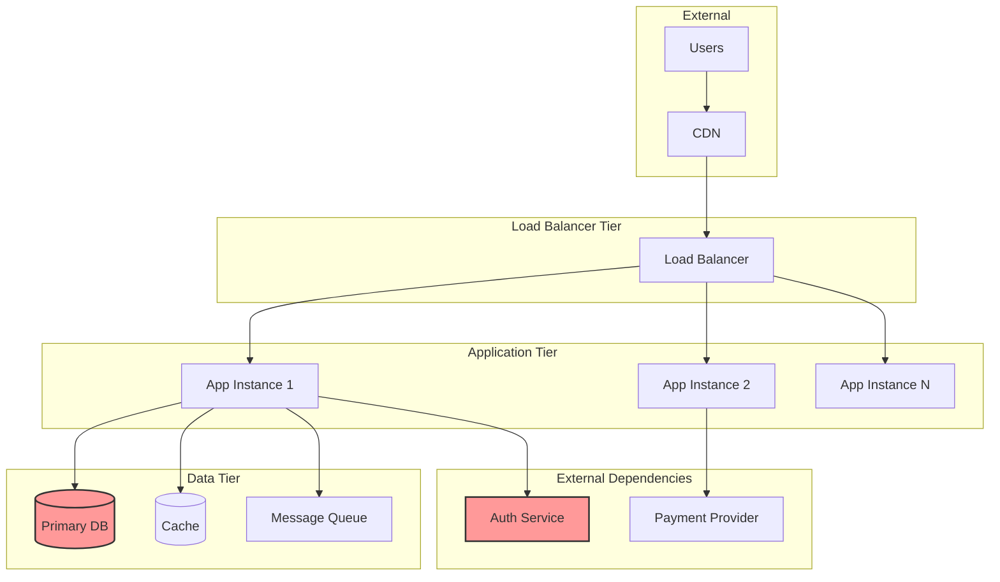
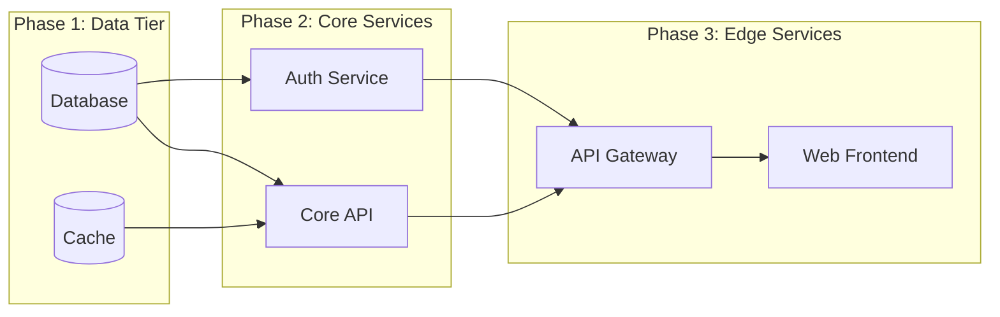

# Runbook: {{TITLE}}

<!--
TEMPLATE: Runbook (v1.0.0)
SOURCE: EN-003 Design Documentation Standards - Phase 3 Template Creation
METHODOLOGY: Unified specification from PS (5W2H, 8D, Pareto, FMEA) + NSE (NASA SE) synthesis
VERSION: 1.0.0
STATUS: ACTIVE
CREATED: 2026-01-25

DESIGN RATIONALE:
  This template provides a comprehensive runbook format for troubleshooting and
  incident response. It synthesizes industry best practices from:
  - SkeltonThatcher operational runbook patterns
  - AWS runbook structure
  - ITIL operational standards
  - PagerDuty incident response
  - Google SRE practices

L0/L1/L2 PERSPECTIVE ORGANIZATION:
  - L0 (Operational Overview): ELI5 summary for quick orientation
  - L1 (Diagnostic Procedures): Engineer-focused technical procedures
  - L2 (System Context): Architect-level dependencies and failure domains

KEY FEATURES:
  - Mermaid decision trees with ASCII fallback
  - Symptom-Cause-Resolution mapping tables
  - Tiered escalation matrix (L1/L2/L3/L4)
  - Role-based contacts (not individual names)
  - Recovery Time Objectives (RTOs)
  - Service restoration order

REFERENCES:
  - REQ-RB-STRUCT-001 through REQ-RB-STRUCT-009
  - REQ-RB-DIAG-001 through REQ-RB-DIAG-009
  - REQ-RB-ESCAL-001 through REQ-RB-ESCAL-008
  - REQ-RB-RECOV-001 through REQ-RB-RECOV-008
  - REQ-COMMON-META-001 through REQ-COMMON-META-004
-->

---

## Frontmatter

```yaml
# === IDENTITY ===
id: "RB-{{SYSTEM}}-{{SEQ}}"              # Format: RB-{SYSTEM}-{NNN} (e.g., RB-API-001)
title: "Runbook: {{TITLE}}"               # Descriptive title
work_type: RUNBOOK                        # Immutable discriminator

# === VERSION CONTROL ===
version: "1.0.0"                          # SemVer: MAJOR.MINOR.PATCH
status: DRAFT                             # DRAFT | ACTIVE | DEPRECATED
owner: "{{TEAM_OR_ROLE}}"                 # Team or role responsible

# === OPERATIONAL METADATA ===
automation_level: manual                  # manual | semi-automated | automated
estimated_duration: "15-30 minutes"       # Expected time to complete runbook
review_cycle: quarterly                   # quarterly | monthly | annually

# === TIMESTAMPS ===
created: "{{CREATED_AT}}"                 # ISO 8601: 2026-01-25T00:00:00Z
updated: "{{UPDATED_AT}}"                 # ISO 8601 datetime
last_tested: "{{LAST_TESTED}}"            # ISO 8601: When runbook was last validated

# === SCOPE ===
systems:
  - "{{SYSTEM_1}}"                        # e.g., "api-gateway"
  - "{{SYSTEM_2}}"                        # e.g., "database-cluster"
severity_applicability:
  - "P1"                                  # Severities this runbook applies to
  - "P2"

# === TRACEABILITY ===
work_items:
  epic: "{{EPIC_ID}}"                     # EPIC-XXX reference
  feature: "{{FEATURE_ID}}"               # FEAT-XXX reference
  enabler: "{{ENABLER_ID}}"               # EN-XXX reference (if applicable)
related_playbooks:
  - "{{PLAYBOOK_ID}}"                     # PB-XXX references
related_runbooks:
  - "{{RELATED_RUNBOOK_ID}}"              # RB-XXX references

# === TAGS ===
tags:
  - "incident-response"
  - "troubleshooting"
  - "{{DOMAIN_TAG}}"
```

---

## L0: Operational Overview

<!--
AUDIENCE: On-call engineers, incident commanders, stakeholders
PURPOSE: Rapid orientation - understand runbook purpose in < 30 seconds
REQ-RB-STRUCT-002: Objective with purpose, when-to-use, expected outcome
REQ-COMMON-L012-004: L0 ELI5 summary
-->

### What This Runbook Covers

{{ELI5_DESCRIPTION}}

<!--
ELI5 EXAMPLE:
"This runbook helps you fix issues when users can't log into our application.
Think of it like a troubleshooting guide for a broken door lock - we'll check
the key (credentials), the lock mechanism (auth service), and the door frame
(network connectivity) to find and fix the problem."
-->

### When to Use This Runbook

Use this runbook when:

- [ ] {{TRIGGER_CONDITION_1}} (e.g., "Users report HTTP 503 errors")
- [ ] {{TRIGGER_CONDITION_2}} (e.g., "PagerDuty alert: `service-unhealthy`")
- [ ] {{TRIGGER_CONDITION_3}} (e.g., "Grafana dashboard shows latency > 5s")

Do **NOT** use this runbook when:

- {{EXCLUSION_CONDITION_1}} (e.g., "Issue is with third-party CDN")
- {{EXCLUSION_CONDITION_2}} (e.g., "Problem affects only staging environment")

### Expected Outcome

After completing this runbook:

1. Service is restored to healthy state
2. Root cause is identified or escalated
3. Incident timeline is documented

### Emergency Contacts

| Role | Contact Method | When to Use |
|------|----------------|-------------|
| **On-Call Engineer** | PagerDuty: `#{{TEAM}}-oncall` | First response |
| **Incident Commander** | Slack: `#incident-{{SYSTEM}}` | P1/P2 incidents |
| **Security On-Call** | PagerDuty: `security-oncall` | Security-related issues |

---

## L2: System Context

<!--
AUDIENCE: Architects, senior engineers, incident commanders
PURPOSE: Strategic understanding of system architecture and failure domains
REQ-COMMON-L012-004: L2 Architect perspective
-->

### Architecture Overview

#### Mermaid Diagram



#### ASCII Fallback

```
┌─────────────────────────────────────────────────────────────────────────────┐
│                         SYSTEM ARCHITECTURE                                  │
├─────────────────────────────────────────────────────────────────────────────┤
│                                                                              │
│    EXTERNAL                  LOAD BALANCER              APPLICATION          │
│  ┌──────────┐               ┌──────────┐            ┌──────────────┐        │
│  │  Users   │──────────────►│    LB    │───────────►│  App Tier    │        │
│  └──────────┘               └──────────┘            │  (N instances)│        │
│       │                                              └──────┬───────┘        │
│       │                                                     │                │
│       ▼                                                     ▼                │
│  ┌──────────┐                                       ┌──────────────┐        │
│  │   CDN    │                                       │  DATA TIER   │        │
│  └──────────┘                                       │  ┌────────┐  │        │
│                                                     │  │   DB   │  │        │
│                                                     │  └────────┘  │        │
│                                                     │  ┌────────┐  │        │
│                                                     │  │ Cache  │  │        │
│                                                     │  └────────┘  │        │
│                                                     └──────────────┘        │
│                                                                              │
│  Legend: ─────► Request flow    ═══════► Critical path                       │
│                                                                              │
└─────────────────────────────────────────────────────────────────────────────┘
```

### Dependencies

| Dependency | Type | Impact if Unavailable | Fallback |
|------------|------|----------------------|----------|
| {{DEPENDENCY_1}} | Internal | {{IMPACT_1}} | {{FALLBACK_1}} |
| {{DEPENDENCY_2}} | External | {{IMPACT_2}} | {{FALLBACK_2}} |
| {{DEPENDENCY_3}} | Database | {{IMPACT_3}} | {{FALLBACK_3}} |

### Failure Domains

| Domain | Components | Blast Radius | Recovery Priority |
|--------|------------|--------------|-------------------|
| **Zone A** | App instances 1-3, Cache A | 33% traffic | High |
| **Zone B** | App instances 4-6, Cache B | 33% traffic | High |
| **Zone C** | App instances 7-9, Cache C | 34% traffic | High |
| **Primary DB** | PostgreSQL Primary | 100% writes | Critical |
| **Auth Service** | OAuth Provider | All logins | Critical |

---

## Troubleshooting Decision Tree

<!--
PURPOSE: Visual navigation through symptom → diagnosis → resolution
REQ-RB-DIAG-001: Decision tree diagrams (MUST)
REQ-RB-DIAG-008: Mermaid flowchart support (MUST)
-->

### Decision Tree Diagram

Use this decision tree to navigate to the appropriate resolution:

#### Mermaid

```mermaid
flowchart TD
    START[Symptom: {{PRIMARY_SYMPTOM}}] --> A{Can you reach the service?}

    A -->|No| B{DNS resolves?}
    A -->|Yes| C{HTTP response?}

    B -->|No| D[DNS Issue<br/>Go to Section 4.3.1]
    B -->|Yes| E{TCP connection?}

    E -->|No| F[Network Issue<br/>Go to Section 4.3.2]
    E -->|Yes| G[Firewall/Security<br/>Go to Section 4.3.3]

    C -->|200 OK| H{Latency normal?}
    C -->|5xx Error| I{Which error code?}
    C -->|4xx Error| J[Client Error<br/>Go to Section 4.3.4]

    H -->|Yes| K[Check upstream<br/>dependencies]
    H -->|No| L[Performance Issue<br/>Go to Section 4.3.5]

    I -->|500| M[Application Error<br/>Go to Section 4.3.6]
    I -->|502| N[Backend Unhealthy<br/>Go to Section 4.3.7]
    I -->|503| O[Service Unavailable<br/>Go to Section 4.3.8]
    I -->|504| P[Gateway Timeout<br/>Go to Section 4.3.9]

    style START fill:#f9f,stroke:#333,stroke-width:2px
    style D fill:#fcc,stroke:#333
    style F fill:#fcc,stroke:#333
    style G fill:#fcc,stroke:#333
    style L fill:#fcc,stroke:#333
    style M fill:#fcc,stroke:#333
    style N fill:#fcc,stroke:#333
    style O fill:#fcc,stroke:#333
    style P fill:#fcc,stroke:#333
```

#### ASCII Fallback

```
┌─────────────────────────────────────────────────────────────────────────────┐
│                    TROUBLESHOOTING DECISION TREE                             │
├─────────────────────────────────────────────────────────────────────────────┤
│                                                                              │
│                        {{PRIMARY_SYMPTOM}}                                   │
│                               │                                              │
│                    Can you reach the service?                                │
│                         /              \                                     │
│                       No                Yes                                  │
│                        │                  │                                  │
│                 DNS resolves?       HTTP response?                           │
│                   /      \           /    |    \                             │
│                 No        Yes      200   5xx   4xx                           │
│                  │         │        │     │     │                            │
│             DNS Issue  TCP conn?  Latency Which Client                       │
│             (4.3.1)      /   \   normal? code? Error                         │
│                        No    Yes   / \    │   (4.3.4)                        │
│                         │     │  Yes  No  │                                  │
│                    Network Firewall │  │  ├── 500 → App Error (4.3.6)       │
│                    (4.3.2) (4.3.3)  │  │  ├── 502 → Backend (4.3.7)         │
│                                     │  │  ├── 503 → Unavail (4.3.8)         │
│                                 Check Perf └── 504 → Timeout (4.3.9)        │
│                                 upstream (4.3.5)                             │
│                                                                              │
└─────────────────────────────────────────────────────────────────────────────┘
```

### Symptom-Cause-Resolution Table

<!--
REQ-RB-DIAG-009: Symptom-Cause-Resolution mapping (MUST)
-->

| Symptom | Likely Cause | Verification | Resolution | See Section | Escalate? |
|---------|--------------|--------------|------------|-------------|-----------|
| Service returns 503 | Pod crash loop | `kubectl get pods -n {{NS}}` | Restart deployment | 4.3.8 | L1 > 15min |
| Latency > 5s | DB connection pool exhaustion | `SELECT count(*) FROM pg_stat_activity` | Scale read replicas | 4.3.5 | L2 if persists |
| Memory OOM kills | Memory leak in application | `kubectl top pods` | Rolling restart | 4.3.6 | L2 |
| Connection refused | Network policy blocking | `kubectl get networkpolicy` | Update policy | 4.3.2 | L2 |
| SSL handshake failure | Certificate expired | `openssl s_client -connect` | Renew certificate | 4.3.3 | L2 (security) |
| {{SYMPTOM_1}} | {{CAUSE_1}} | {{VERIFICATION_1}} | {{RESOLUTION_1}} | {{SECTION_1}} | {{ESCALATE_1}} |

---

## L1: Diagnostic Procedures

<!--
AUDIENCE: On-call engineers, SREs, DevOps engineers
PURPOSE: Step-by-step diagnostic and resolution procedures
REQ-RB-DIAG-002: Command documentation format (MUST)
REQ-RB-DIAG-003: Expected output documentation (MUST)
REQ-RB-DIAG-004: Code block formatting (MUST)
REQ-RB-DIAG-005: Platform-specific commands (MUST)
-->

### Health Check Commands

#### CMD-001: Check Service Health

**Purpose:** Verify the overall health status of the service.

**Command:**

```bash
curl -s -o /dev/null -w "%{http_code}" https://{{SERVICE_ENDPOINT}}/health
```

**Expected Output (Healthy):**

```
200
```

**Expected Output (Unhealthy):**

```
503
```

**If Unexpected:**

1. If `000`: Network connectivity issue - proceed to Section 4.3.2
2. If `401/403`: Authentication issue - check service account
3. If `500`: Application error - proceed to Section 4.3.6

---

#### CMD-002: Check Pod Status (Kubernetes)

**Purpose:** Verify current state of pods in the affected namespace.

**Command:**

```bash
kubectl get pods -n {{NAMESPACE}} -o wide
```

**Expected Output (Healthy):**

```
NAME                         READY   STATUS    RESTARTS   AGE   IP            NODE
{{SERVICE}}-7d4f8c6b9-abc12  1/1     Running   0          7d    10.0.1.23     node-1
{{SERVICE}}-7d4f8c6b9-def34  1/1     Running   0          7d    10.0.1.24     node-2
{{SERVICE}}-7d4f8c6b9-ghi56  1/1     Running   0          7d    10.0.1.25     node-3
```

**Output Interpretation:**

| Pattern | Meaning | Action |
|---------|---------|--------|
| `1/1 Running` | Pod healthy | No action needed |
| `0/1 CrashLoopBackOff` | Pod crashing repeatedly | See 4.3.6 - Check logs |
| `1/1 Terminating` | Pod being deleted | Wait 60s or force delete |
| `0/1 Pending` | Pod not scheduled | Check node resources |
| `0/1 ImagePullBackOff` | Cannot pull image | Verify image tag/registry |
| `0/1 Init:Error` | Init container failed | Check init container logs |

**If Verification Fails:**

1. If no pods returned: `kubectl get deployments -n {{NAMESPACE}}`
2. If pods in Error state: `kubectl logs {{POD_NAME}} -n {{NAMESPACE}}`
3. If pods in Pending: `kubectl describe pod {{POD_NAME}} -n {{NAMESPACE}}`

---

#### CMD-003: Check Resource Usage

**Purpose:** Identify resource constraints causing issues.

**Command:**

```bash
kubectl top pods -n {{NAMESPACE}}
```

**Expected Output:**

```
NAME                         CPU(cores)   MEMORY(bytes)
{{SERVICE}}-7d4f8c6b9-abc12  50m          128Mi
{{SERVICE}}-7d4f8c6b9-def34  45m          125Mi
```

**Thresholds:**

| Metric | Warning | Critical | Action |
|--------|---------|----------|--------|
| CPU | > 80% of limit | > 95% of limit | Scale or optimize |
| Memory | > 70% of limit | > 90% of limit | Scale or investigate leak |

---

### Log Locations

| Log Type | Location | Command to Access |
|----------|----------|-------------------|
| Application logs | Pod stdout/stderr | `kubectl logs -f {{POD}} -n {{NS}}` |
| Previous container | Pod (crashed) | `kubectl logs --previous {{POD}} -n {{NS}}` |
| System logs | Node journal | `journalctl -u kubelet -f` |
| Ingress logs | Ingress controller | `kubectl logs -n ingress-nginx -l app=ingress-nginx` |
| Database logs | CloudWatch/Stackdriver | See {{CLOUD_LOGGING_URL}} |

### Metrics to Monitor

| Metric | Normal Range | Alert Threshold | Dashboard |
|--------|--------------|-----------------|-----------|
| Request rate | 100-500 rps | < 50 rps (drop) | {{GRAFANA_URL}}/d/requests |
| Error rate | < 0.1% | > 1% | {{GRAFANA_URL}}/d/errors |
| P99 latency | < 200ms | > 1000ms | {{GRAFANA_URL}}/d/latency |
| Pod count | 3-6 | < 2 | {{GRAFANA_URL}}/d/pods |
| Memory usage | < 70% | > 90% | {{GRAFANA_URL}}/d/resources |

### Common Diagnostic Queries

#### Query-001: Database Connection Status

**Purpose:** Check active database connections.

```sql
SELECT
    state,
    count(*) as connection_count,
    max(age(now(), query_start)) as max_duration
FROM pg_stat_activity
WHERE datname = '{{DATABASE_NAME}}'
GROUP BY state;
```

**Expected Output:**

```
  state  | connection_count | max_duration
---------+------------------+--------------
 active  |               10 | 00:00:00.5
 idle    |               20 | 00:05:00
```

**Warning Signs:**

- `idle in transaction` with high count = connection leak
- `active` with duration > 60s = slow query
- Total connections near `max_connections` = pool exhaustion

---

### 4.3 Common Issues

#### 4.3.1 Issue: DNS Resolution Failure

**Symptom:** Service cannot be reached by hostname.

**Diagnosis:**

```bash
# Check DNS resolution
nslookup {{SERVICE_HOSTNAME}}

# Check CoreDNS pods
kubectl get pods -n kube-system -l k8s-app=kube-dns
```

**Resolution:**

1. Verify DNS entry exists
2. Check CoreDNS health
3. Verify network policies allow DNS traffic (port 53)

---

#### 4.3.2 Issue: Network Connectivity

**Symptom:** TCP connection fails after DNS resolves.

**Diagnosis:**

```bash
# Test TCP connectivity
nc -zv {{SERVICE_IP}} {{PORT}}

# Check network policies
kubectl get networkpolicy -n {{NAMESPACE}}

# Check service endpoints
kubectl get endpoints {{SERVICE_NAME}} -n {{NAMESPACE}}
```

**Resolution:**

1. Verify service has healthy endpoints
2. Check network policies are not blocking traffic
3. Verify firewall rules in cloud provider

---

#### 4.3.3 Issue: Security/Firewall

**Symptom:** Connection refused or SSL errors.

**Diagnosis:**

```bash
# Check SSL certificate
openssl s_client -connect {{HOST}}:{{PORT}} -servername {{HOST}}

# Check certificate expiry
echo | openssl s_client -connect {{HOST}}:443 2>/dev/null | openssl x509 -noout -dates
```

**Resolution:**

1. Renew certificate if expired
2. Update security group rules
3. Check mTLS configuration

---

#### 4.3.4 Issue: Client Error (4xx)

**Symptom:** Service returns 401, 403, or 404.

**Diagnosis:**

```bash
# Check authentication
curl -v -H "Authorization: Bearer {{TOKEN}}" https://{{ENDPOINT}}/api/health

# Verify route configuration
kubectl get ingress -n {{NAMESPACE}} -o yaml
```

**Resolution:**

1. 401: Verify authentication credentials
2. 403: Check RBAC/authorization policies
3. 404: Verify route/path configuration

---

#### 4.3.5 Issue: Performance Degradation

**Symptom:** Latency exceeds acceptable thresholds.

**Diagnosis:**

```bash
# Check pod resource usage
kubectl top pods -n {{NAMESPACE}}

# Check horizontal pod autoscaler
kubectl get hpa -n {{NAMESPACE}}

# Check database slow queries
# (Platform-specific)
```

**Resolution:**

1. Scale up if CPU/memory constrained
2. Investigate slow database queries
3. Check for downstream service degradation

---

#### 4.3.6 Issue: Application Error (500)

**Symptom:** Service returns HTTP 500 errors.

**Diagnosis:**

```bash
# Check application logs
kubectl logs -f deployment/{{DEPLOYMENT}} -n {{NAMESPACE}} --tail=100

# Check for crash loops
kubectl get events -n {{NAMESPACE}} --sort-by='.lastTimestamp'
```

**Resolution:**

1. Check logs for stack traces
2. Verify environment variables/config maps
3. Rolling restart: `kubectl rollout restart deployment/{{DEPLOYMENT}} -n {{NAMESPACE}}`

---

#### 4.3.7 Issue: Backend Unhealthy (502)

**Symptom:** Load balancer cannot reach backend pods.

**Diagnosis:**

```bash
# Check backend pod health
kubectl exec -it {{POD}} -n {{NAMESPACE}} -- curl localhost:{{PORT}}/health

# Check readiness probe
kubectl describe pod {{POD}} -n {{NAMESPACE}} | grep -A5 "Readiness"
```

**Resolution:**

1. Fix failing health checks
2. Adjust readiness probe thresholds
3. Check for OOM kills

---

#### 4.3.8 Issue: Service Unavailable (503)

**Symptom:** Service explicitly returns 503.

**Diagnosis:**

```bash
# Check for circuit breaker
kubectl logs deployment/{{DEPLOYMENT}} -n {{NAMESPACE}} | grep -i circuit

# Check dependencies
curl -s https://{{DEPENDENCY_ENDPOINT}}/health
```

**Resolution:**

1. Identify and restore failing dependency
2. Reset circuit breaker if needed
3. Scale up if overloaded

---

#### 4.3.9 Issue: Gateway Timeout (504)

**Symptom:** Request times out at gateway/load balancer.

**Diagnosis:**

```bash
# Check response time
time curl -s https://{{ENDPOINT}}/api/slow-endpoint

# Check timeout settings
kubectl get ingress {{INGRESS}} -n {{NAMESPACE}} -o yaml | grep timeout
```

**Resolution:**

1. Increase timeout if legitimate long operation
2. Optimize slow code paths
3. Implement async processing for long operations

---

## Interactive Debugging

<!--
REQ-RB-DIAG-007: Interactive debugging commands (SHOULD)
-->

### Exec into Pod

**Purpose:** Debug from inside the container.

```bash
kubectl exec -it {{POD}} -n {{NAMESPACE}} -- /bin/sh
```

**Common debug commands inside container:**

```bash
# Check network
curl -v localhost:{{PORT}}/health

# Check environment
env | sort

# Check filesystem
df -h
ls -la /app

# Check processes
ps aux

# Check memory
cat /proc/meminfo
```

### Port Forward

**Purpose:** Access service directly bypassing ingress.

```bash
kubectl port-forward svc/{{SERVICE}} -n {{NAMESPACE}} 8080:{{PORT}}
# Then test: curl localhost:8080/health
```

### Debug Container

**Purpose:** Use ephemeral debug container for troubleshooting.

```bash
kubectl debug {{POD}} -n {{NAMESPACE}} -it --image=busybox --target={{CONTAINER}}
```

---

## Escalation

<!--
REQ-RB-STRUCT-007: Escalation section (MUST)
REQ-RB-ESCAL-001: Tiered escalation matrix (MUST)
REQ-RB-ESCAL-002: Severity-based triggers (MUST)
REQ-RB-ESCAL-003: Time-based triggers (MUST)
REQ-RB-ESCAL-004: Role-based contacts (MUST)
REQ-RB-ESCAL-005: Escalation communication template (MUST)
REQ-RB-ESCAL-006: On-call schedule integration (SHOULD)
REQ-RB-ESCAL-007: Functional vs hierarchical escalation (MUST)
REQ-RB-ESCAL-008: External escalation paths (SHOULD)
-->

### Tiered Escalation Matrix

| Tier | Role | Responsibilities | Contact Method | Response SLA |
|------|------|------------------|----------------|--------------|
| **L1** | On-Call Engineer | First response, triage, basic resolution | PagerDuty: `{{TEAM}}-oncall` | 15 min |
| **L2** | Domain SME | Complex troubleshooting, architecture decisions | Slack: `@{{DOMAIN}}-sme` | 30 min |
| **L3** | Engineering Lead | Incident commander, cross-team coordination | Phone: See on-call schedule | 15 min |
| **L4** | Vendor Support | Cloud provider, third-party service | Support portal | Per vendor SLA |

### Severity-Based Triggers

| Severity | Definition | Initial Tier | Auto-Escalate To | Auto-Escalate After |
|----------|------------|--------------|------------------|---------------------|
| **P1** | Complete service outage, all users affected | L2 | L3 | 30 min |
| **P2** | Major feature degraded, >25% users affected | L1 | L2 | 30 min |
| **P3** | Minor feature degraded, <25% users affected | L1 | L2 | 2 hours |
| **P4** | Cosmetic/non-urgent issue | L1 | N/A | N/A |

### Time-Based Triggers

| Elapsed Time | Severity | Action |
|--------------|----------|--------|
| 0 minutes | P1/P2/P3/P4 | Page L1 on-call |
| 15 minutes | P1/P2 | Page backup on-call |
| 30 minutes | P1/P2 | Escalate to L2/L3 |
| 1 hour | P1 | Escalate to L3, notify leadership |
| 2 hours | P2/P3 | Review resolution progress |
| 4 hours | All | Mandatory shift handoff |

### Role-Based Contacts

<!--
IMPORTANT: Use role-based contacts, NOT individual names
This ensures contacts remain valid across personnel changes
-->

| Role | Team | Slack Channel | PagerDuty Service | Hours |
|------|------|---------------|-------------------|-------|
| On-Call DBA | Database Team | `#db-oncall` | `database-oncall` | 24/7 |
| On-Call SRE | Platform Team | `#sre-oncall` | `sre-oncall` | 24/7 |
| On-Call Backend | {{TEAM}} | `#{{TEAM}}-oncall` | `{{TEAM}}-oncall` | 24/7 |
| Security On-Call | Security Team | `#security-oncall` | `security-oncall` | 24/7 |
| On-Call Manager | Engineering Mgmt | `#eng-leadership` | `eng-manager-oncall` | Business hours |

### On-Call Schedule Reference

**Primary Schedule:** {{PAGERDUTY_URL}}/schedules/{{SCHEDULE_ID}}

**Backup Schedule:** {{PAGERDUTY_URL}}/schedules/{{BACKUP_SCHEDULE_ID}}

### Functional vs Hierarchical Escalation

#### Functional Escalation (Horizontal)

Use when specialized expertise is needed:

```
L1 On-Call → Database SME (for DB issues)
L1 On-Call → Network SME (for network issues)
L1 On-Call → Security Team (for security issues)
```

#### Hierarchical Escalation (Vertical)

Use when authority or additional resources needed:

```
L1 On-Call → L2 Domain Expert → L3 Engineering Lead → VP Engineering
```

### External Escalation Paths

| Provider | Support Level | Contact Method | Account ID | SLA |
|----------|---------------|----------------|------------|-----|
| AWS | Business Support | AWS Console → Support | {{AWS_ACCOUNT}} | 1 hour (P1) |
| {{VENDOR_1}} | Enterprise | {{VENDOR_PORTAL}} | {{ACCOUNT_ID}} | 4 hours |
| {{VENDOR_2}} | Premium | {{VENDOR_EMAIL}} | {{CONTRACT_ID}} | 24 hours |

### Escalation Communication Template

When escalating, provide the following information:

```
ESCALATION: [SERVICE] - [SEVERITY]
================================================
Incident ID:     INC-{{INCIDENT_ID}}
Severity:        P1/P2/P3/P4
Start Time:      {{ISO_8601_TIMESTAMP}}
Duration:        XX minutes

Impact:
- Users affected: [Number or percentage]
- Geographic scope: [All regions / Specific regions]
- Business impact: [Revenue/Operations/Security]

Current Status:
- What is happening: [Symptom description]
- What we've tried: [Actions taken from runbook]
- What we need: [Specific request for help]

Evidence:
- Error message: [Exact error text]
- Log snippet: [Relevant log lines with timestamps]
- Dashboard link: [URL to relevant dashboard]
- Relevant commands run and output: [Summary]

Contact:
- Current handler: [Your role] - [Slack handle]
- Preferred contact: [Slack channel / Phone]
================================================
```

---

## Recovery Procedures

<!--
REQ-RB-RECOV-001: Recovery procedure structure (MUST)
REQ-RB-RECOV-005: Data recovery procedures (SHOULD)
REQ-RB-RECOV-006: Service restoration order (MUST)
REQ-RB-RECOV-008: Recovery Time Objectives (MUST)
-->

### Service Restoration Order

<!--
Dependencies must be respected during recovery
-->



**Restoration Order:**

1. **Phase 1 - Data Tier** (RTO: 15 min)
   - Database (primary, then replicas)
   - Cache cluster

2. **Phase 2 - Core Services** (RTO: 10 min)
   - Authentication service
   - Core API services

3. **Phase 3 - Edge Services** (RTO: 5 min)
   - API Gateway
   - Web frontend

### Recovery Time Objectives

| Service | RTO | RPO | Recovery Priority |
|---------|-----|-----|-------------------|
| Database | 15 min | 5 min | Critical |
| Auth Service | 10 min | N/A | Critical |
| Core API | 10 min | N/A | High |
| Cache | 5 min | N/A | Medium |
| Web Frontend | 5 min | N/A | Medium |

### Scenario 1: Pod Crash Loop Recovery

**Detection:**

```bash
kubectl get pods -n {{NAMESPACE}} | grep -E "(CrashLoopBackOff|Error)"
```

**Containment:**

```bash
# Scale down to stop crash loops
kubectl scale deployment/{{DEPLOYMENT}} -n {{NAMESPACE}} --replicas=0
```

**Recovery Steps:**

1. Check logs for root cause:
   ```bash
   kubectl logs {{POD}} -n {{NAMESPACE}} --previous
   ```

2. Fix configuration if needed:
   ```bash
   kubectl get configmap {{CONFIG}} -n {{NAMESPACE}} -o yaml
   kubectl edit configmap {{CONFIG}} -n {{NAMESPACE}}
   ```

3. Scale back up:
   ```bash
   kubectl scale deployment/{{DEPLOYMENT}} -n {{NAMESPACE}} --replicas=3
   ```

**Verification:**

```bash
kubectl rollout status deployment/{{DEPLOYMENT}} -n {{NAMESPACE}}
kubectl get pods -n {{NAMESPACE}} -w
```

---

### Scenario 2: Database Connection Pool Exhaustion

**Detection:**

```sql
SELECT count(*) FROM pg_stat_activity WHERE datname = '{{DATABASE}}';
-- If close to max_connections, pool is exhausted
```

**Containment:**

```sql
-- Terminate idle connections
SELECT pg_terminate_backend(pid)
FROM pg_stat_activity
WHERE datname = '{{DATABASE}}'
  AND state = 'idle'
  AND query_start < now() - interval '5 minutes';
```

**Recovery Steps:**

1. Identify connection leak source
2. Restart affected application pods
3. Consider increasing pool size if legitimate load

**Verification:**

```sql
SELECT state, count(*) FROM pg_stat_activity
WHERE datname = '{{DATABASE}}'
GROUP BY state;
```

---

### Scenario 3: {{SCENARIO_3_NAME}}

**Detection:**

```bash
{{DETECTION_COMMAND}}
```

**Containment:**

```bash
{{CONTAINMENT_COMMAND}}
```

**Recovery Steps:**

1. {{STEP_1}}
2. {{STEP_2}}
3. {{STEP_3}}

**Verification:**

```bash
{{VERIFICATION_COMMAND}}
```

---

## Rollback

<!--
REQ-RB-STRUCT-006: Rollback section (MUST)
REQ-RB-RECOV-002: Rollback triggers (MUST)
REQ-RB-RECOV-003: Rollback step documentation (MUST)
-->

### Rollback Triggers

Initiate rollback when:

- [ ] Error rate exceeds 5% for > 5 minutes after change
- [ ] P1/P2 incident directly caused by recent deployment
- [ ] Customer-facing functionality completely broken
- [ ] Security vulnerability discovered in new release
- [ ] {{CUSTOM_TRIGGER}}

### Rollback Steps

#### Kubernetes Deployment Rollback

**Step 1: Check rollout history**

```bash
kubectl rollout history deployment/{{DEPLOYMENT}} -n {{NAMESPACE}}
```

**Step 2: Rollback to previous version**

```bash
kubectl rollout undo deployment/{{DEPLOYMENT}} -n {{NAMESPACE}}
```

**Or rollback to specific revision:**

```bash
kubectl rollout undo deployment/{{DEPLOYMENT}} -n {{NAMESPACE}} --to-revision={{REVISION}}
```

**Step 3: Verify rollback**

```bash
kubectl rollout status deployment/{{DEPLOYMENT}} -n {{NAMESPACE}}
kubectl get pods -n {{NAMESPACE}}
```

#### Database Migration Rollback

**Step 1: Check current migration state**

```bash
{{MIGRATION_TOOL}} status
```

**Step 2: Rollback migration**

```bash
{{MIGRATION_TOOL}} rollback --step={{N}}
```

**Step 3: Verify data integrity**

```sql
-- Run data verification queries
{{DATA_VERIFICATION_QUERY}}
```

### Post-Rollback Verification

- [ ] All pods healthy
- [ ] Error rate returned to baseline
- [ ] Key user flows working
- [ ] No data corruption
- [ ] Monitoring alerts resolved

---

## Verification

<!--
REQ-RB-STRUCT-008: Verification section (MUST)
REQ-RB-RECOV-004: Post-recovery verification (MUST)
-->

### Success Criteria

The runbook is successful when:

- [ ] Service health endpoint returns 200
- [ ] Error rate < {{ERROR_THRESHOLD}}%
- [ ] P99 latency < {{LATENCY_THRESHOLD}}ms
- [ ] All pods in Running state
- [ ] No critical alerts firing

### Verification Commands

**Health Check:**

```bash
curl -s https://{{SERVICE_ENDPOINT}}/health | jq .
```

**Expected Response:**

```json
{
  "status": "healthy",
  "version": "{{VERSION}}",
  "dependencies": {
    "database": "healthy",
    "cache": "healthy"
  }
}
```

**Smoke Tests:**

```bash
# Run basic functionality tests
{{SMOKE_TEST_COMMAND}}
```

### Post-Recovery Checklist

- [ ] Service responding to health checks
- [ ] No error alerts in monitoring
- [ ] Sample user requests succeeding
- [ ] Database connections stable
- [ ] Cache hit rate recovering
- [ ] Incident timeline documented
- [ ] Stakeholders notified of resolution

---

## Post-Incident Actions

### Documentation Requirements

After resolving the incident:

1. **Update incident ticket** with:
   - Timeline of events
   - Actions taken
   - Root cause (if identified)
   - Resolution applied

2. **Create follow-up items** for:
   - Permanent fix (if temporary workaround applied)
   - Monitoring improvements
   - Runbook updates

3. **Schedule post-mortem** if:
   - P1 or P2 incident
   - Duration > 1 hour
   - Customer impact > 100 users
   - Significant financial impact

### Follow-up Tasks

| Task | Owner | Due | Status |
|------|-------|-----|--------|
| Update this runbook with lessons learned | {{OWNER}} | +3 days | [ ] |
| Add missing monitoring | {{OWNER}} | +1 sprint | [ ] |
| Implement permanent fix | {{OWNER}} | TBD | [ ] |
| Post-mortem meeting | {{OWNER}} | +5 days | [ ] |

---

## Feedback

<!--
REQ-RB-STRUCT-009: Feedback section (MUST)
-->

### How to Improve This Runbook

Found an issue or have a suggestion? Please help improve this runbook:

1. **Quick Fix:** Edit directly and submit PR to `{{REPO_URL}}`
2. **Discussion Needed:** Open issue at `{{ISSUE_URL}}`
3. **Urgent Update:** Contact `#{{TEAM}}-docs` Slack channel

**When providing feedback, include:**

- What you were trying to do
- What didn't work
- Suggested improvement

### Known Limitations

| Limitation | Impact | Workaround | Tracking Issue |
|------------|--------|------------|----------------|
| {{LIMITATION_1}} | {{IMPACT_1}} | {{WORKAROUND_1}} | {{ISSUE_1}} |
| {{LIMITATION_2}} | {{IMPACT_2}} | {{WORKAROUND_2}} | {{ISSUE_2}} |

---

## Related Documentation

### Related Runbooks

| Runbook | Purpose | When to Use |
|---------|---------|-------------|
| [RB-{{SYSTEM}}-002](./RB-{{SYSTEM}}-002.md) | {{RELATED_RB_1_PURPOSE}} | {{RELATED_RB_1_WHEN}} |
| [RB-{{RELATED}}-001](./RB-{{RELATED}}-001.md) | {{RELATED_RB_2_PURPOSE}} | {{RELATED_RB_2_WHEN}} |

### Related Playbooks

| Playbook | Purpose | Duration |
|----------|---------|----------|
| [PB-{{SYSTEM}}-001](./PB-{{SYSTEM}}-001.md) | {{RELATED_PB_1_PURPOSE}} | {{DURATION}} |

### Reference Documentation

| Document | Description | Link |
|----------|-------------|------|
| Architecture Overview | System design document | {{TDD_LINK}} |
| API Documentation | API reference | {{API_DOCS_LINK}} |
| SLO Dashboard | Service level objectives | {{GRAFANA_LINK}} |
| On-Call Handbook | On-call procedures | {{HANDBOOK_LINK}} |

---

## Revision History

| Version | Date | Author | Changes |
|---------|------|--------|---------|
| 1.0.0 | {{CREATED_AT}} | {{AUTHOR}} | Initial creation |

---

## Requirements Traceability Matrix

<!--
This section provides traceability between template sections and requirements.
-->

| Requirement ID | Requirement Summary | Template Section | Status |
|----------------|---------------------|------------------|--------|
| REQ-RB-STRUCT-001 | YAML frontmatter | Frontmatter | Satisfied |
| REQ-RB-STRUCT-002 | Objective section | L0: Operational Overview | Satisfied |
| REQ-RB-STRUCT-003 | Scope section | L2: System Context | Satisfied |
| REQ-RB-STRUCT-004 | Prerequisites section | L1: Diagnostic Procedures | Satisfied |
| REQ-RB-STRUCT-005 | Troubleshooting section | Troubleshooting Decision Tree | Satisfied |
| REQ-RB-STRUCT-006 | Rollback section | Rollback | Satisfied |
| REQ-RB-STRUCT-007 | Escalation section | Escalation | Satisfied |
| REQ-RB-STRUCT-008 | Verification section | Verification | Satisfied |
| REQ-RB-STRUCT-009 | Feedback section | Feedback | Satisfied |
| REQ-RB-DIAG-001 | Decision tree diagrams | Troubleshooting Decision Tree | Satisfied |
| REQ-RB-DIAG-002 | Command documentation format | L1: Diagnostic Procedures | Satisfied |
| REQ-RB-DIAG-003 | Expected output documentation | L1: Diagnostic Procedures | Satisfied |
| REQ-RB-DIAG-004 | Code block formatting | All command sections | Satisfied |
| REQ-RB-DIAG-005 | Platform-specific commands | L1: Diagnostic Procedures | Satisfied |
| REQ-RB-DIAG-006 | Output interpretation tables | L1: Diagnostic Procedures | Satisfied |
| REQ-RB-DIAG-007 | Interactive debugging commands | Interactive Debugging | Satisfied |
| REQ-RB-DIAG-008 | Mermaid flowchart support | Decision Tree Diagram | Satisfied |
| REQ-RB-DIAG-009 | Symptom-Cause-Resolution mapping | Symptom-Cause-Resolution Table | Satisfied |
| REQ-RB-ESCAL-001 | Tiered escalation matrix | Tiered Escalation Matrix | Satisfied |
| REQ-RB-ESCAL-002 | Severity-based triggers | Severity-Based Triggers | Satisfied |
| REQ-RB-ESCAL-003 | Time-based triggers | Time-Based Triggers | Satisfied |
| REQ-RB-ESCAL-004 | Role-based contacts | Role-Based Contacts | Satisfied |
| REQ-RB-ESCAL-005 | Escalation communication template | Escalation Communication Template | Satisfied |
| REQ-RB-ESCAL-006 | On-call schedule integration | On-Call Schedule Reference | Satisfied |
| REQ-RB-ESCAL-007 | Functional vs hierarchical escalation | Functional vs Hierarchical | Satisfied |
| REQ-RB-ESCAL-008 | External escalation paths | External Escalation Paths | Satisfied |
| REQ-RB-RECOV-001 | Recovery procedure structure | Recovery Procedures | Satisfied |
| REQ-RB-RECOV-002 | Rollback triggers | Rollback Triggers | Satisfied |
| REQ-RB-RECOV-003 | Rollback step documentation | Rollback Steps | Satisfied |
| REQ-RB-RECOV-004 | Post-recovery verification | Verification | Satisfied |
| REQ-RB-RECOV-005 | Data recovery procedures | Recovery Procedures | Satisfied |
| REQ-RB-RECOV-006 | Service restoration order | Service Restoration Order | Satisfied |
| REQ-RB-RECOV-007 | Partial recovery options | Recovery Procedures (scenarios) | Satisfied |
| REQ-RB-RECOV-008 | Recovery Time Objectives | Recovery Time Objectives | Satisfied |
| REQ-COMMON-META-001 | Version number | Frontmatter | Satisfied |
| REQ-COMMON-META-002 | Last updated timestamp | Frontmatter | Satisfied |
| REQ-COMMON-META-003 | Owner | Frontmatter | Satisfied |
| REQ-COMMON-META-004 | Work item traceability | Frontmatter | Satisfied |
| REQ-COMMON-L012-004 | L0/L1/L2 perspectives | L0/L1/L2 sections | Satisfied |

---

<!--
TEMPLATE USAGE NOTES:

1. Replace all {{PLACEHOLDER}} values with actual content
2. Remove sections not applicable to your service
3. Add additional common issues specific to your service
4. Update contacts to use your team's actual role-based contacts
5. Test all commands before publishing
6. Schedule regular reviews (quarterly recommended)

ACCEPTANCE CRITERIA VERIFICATION:
- AC-001: Unified Runbook specification followed (all sections present)
- AC-002: L0 operational overview included
- AC-003: L1 diagnostic procedures included
- AC-004: L2 system context included
- AC-005: Mermaid troubleshooting decision tree included
- AC-006: Diagnostic commands section included
- AC-007: Symptom-Cause-Resolution table included
- AC-008: Escalation matrix with contacts included
- AC-009: Metrics/logs monitoring section included
- AC-010: Recovery procedures with step-by-step included
- AC-011: Requirements traceability matrix at end
- AC-012: YAML frontmatter is valid and parseable
-->
