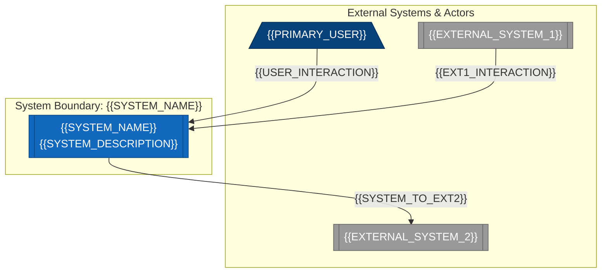
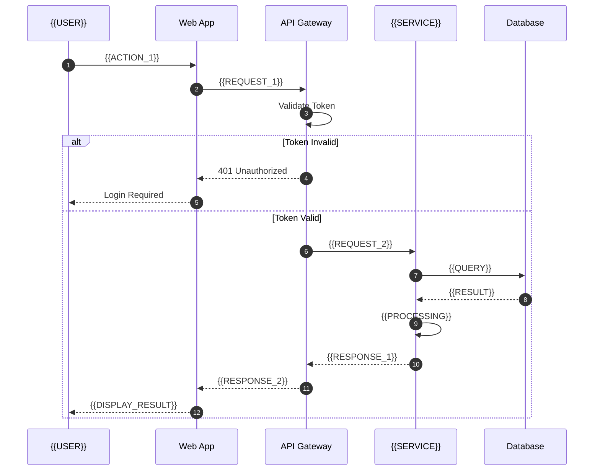
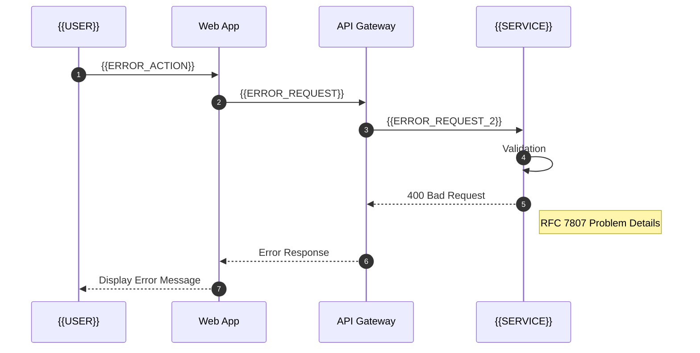
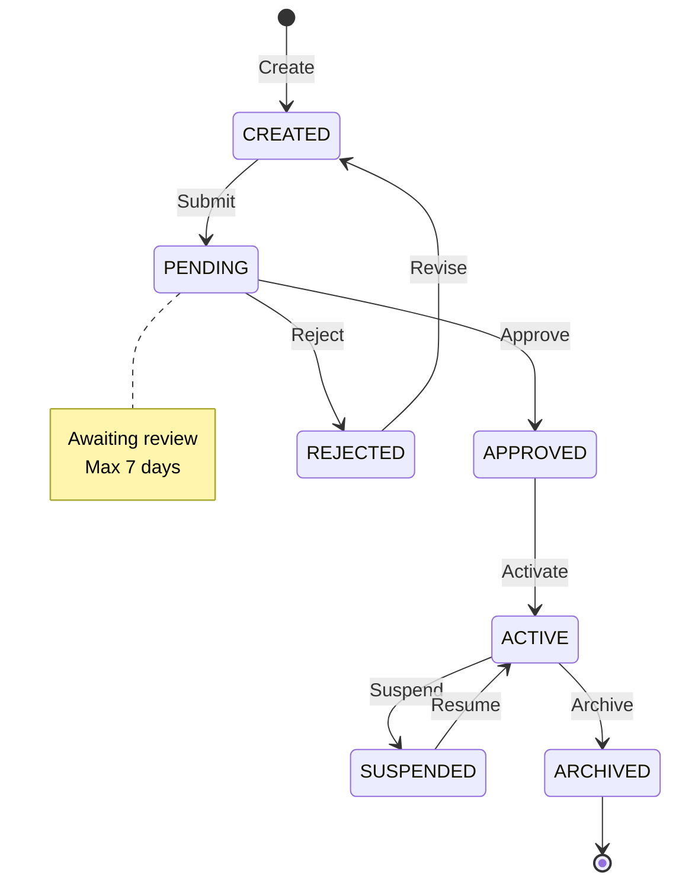
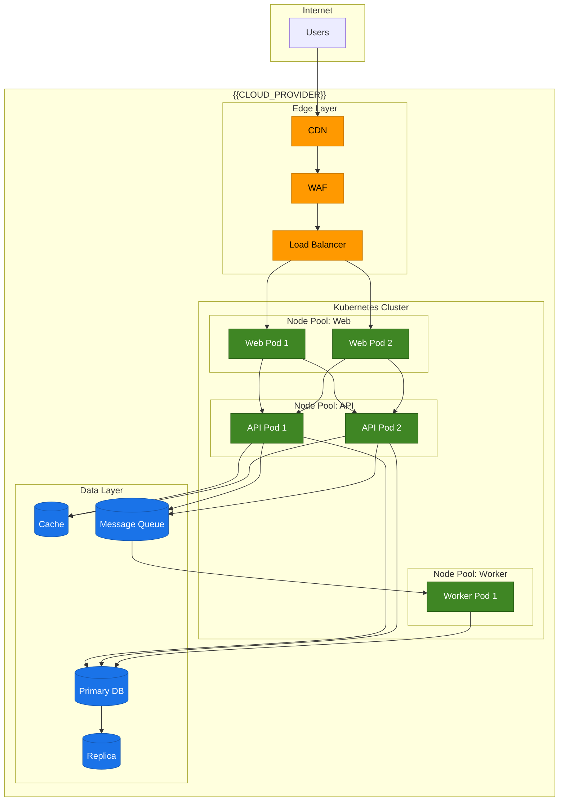

# Technical Design Document: {{TITLE}}

<!--
TEMPLATE: Technical Design Document (TDD)
SOURCE: EN-003 Design Documentation Standards - Phase 2 Synthesis
VERSION: 1.0.0
STATUS: APPROVED
CREATED: 2026-01-26
AUTHOR: ps-architect-001

DESIGN RATIONALE:
  This template synthesizes industry best practices from:
  - arc42 architecture documentation framework
  - C4 Model (Context, Container, Component, Code)
  - Google Design Docs format
  - IEEE 1016 Software Design Descriptions
  - ADR (Architecture Decision Records) by Michael Nygard
  - NASA TBD/TBR tracking patterns

  The L0/L1/L2 perspective structure serves three distinct audiences:
  - L0 (ELI5): Executives, stakeholders, new team members
  - L1 (Engineer): Implementation teams, developers
  - L2 (Architect): Principal architects, tech leads, reviewers

REQUIREMENTS IMPLEMENTED:
  - 35 REQ-TDD-* requirements (see Traceability Matrix)
  - 10 REQ-COMMON-* requirements
  - Pareto P0 sections (80% of value)

FMEA MITIGATIONS:
  - FM-001: Template incompleteness -> Comprehensive section checklist
  - FM-002: User adoption failure -> Minimal required sections, clear guidance
  - FM-005: L0/L1/L2 clarity failure -> Explicit audience labels
  - FM-006: Diagram rendering failure -> Mermaid + ASCII fallbacks
  - FM-008: Contact obsolescence -> Role-based, not individual-based

REFERENCES:
  - Phase 2 Synthesis: en-003-design-docs-20260126-001/synthesis/phase-2-synthesis.md
  - Requirements Spec: en-003-design-docs-20260126-001/nse/phase-1/nse-requirements-001/requirements-specification.md
-->

---

## Frontmatter

```yaml
# === IDENTITY ===
# Source: REQ-TDD-STRUCT-001, REQ-COMMON-META-001
id: "TDD-{{PROJECT}}-{{SEQ}}"       # Format: TDD-{PROJECT}-{SEQ} (e.g., TDD-FORGE-001)
title: "{{TITLE}}"                   # Clear, descriptive title
work_type: TDD                       # Immutable discriminator

# === VERSION CONTROL ===
# Source: REQ-COMMON-META-001, REQ-COMMON-META-002
version: "1.0.0"                     # SemVer: MAJOR.MINOR.PATCH
status: "DRAFT"                      # DRAFT | REVIEW | APPROVED | DEPRECATED
created: "{{CREATED_AT}}"            # ISO 8601: 2026-01-26T00:00:00Z
updated: "{{UPDATED_AT}}"            # ISO 8601: 2026-01-26T00:00:00Z
review_cycle: "quarterly"            # quarterly | semi-annual | annual

# === OWNERSHIP ===
# Source: REQ-COMMON-META-003
owner: "{{TEAM_OR_INDIVIDUAL}}"      # Team or individual responsible
author: "{{AUTHOR}}"                 # Original author
reviewers:
  - "{{REVIEWER_1}}"
  - "{{REVIEWER_2}}"

# === WORK ITEM TRACEABILITY ===
# Source: REQ-COMMON-META-004, REQ-TDD-XREF-006
work_items:
  epic: "EPIC-{{NNN}}"               # Parent Epic ID
  feature: "FEAT-{{NNN}}"            # Parent Feature ID
  enabler: "EN-{{NNN}}"              # Optional: Enabler ID
  story: "STORY-{{NNN}}"             # Optional: Story ID

# === ADR REFERENCES ===
# Source: REQ-TDD-XREF-001
related_adrs:
  - "ADR-{{NNN}}"                    # Architecture Decision Records

# === CLASSIFICATION ===
scope: "{{SYSTEM_NAME}}"             # System or subsystem being designed
domain: "{{DOMAIN}}"                 # Business domain (e.g., AUTH, KM, SYNC)

# === METADATA ===
tags:
  - "architecture"
  - "design"
  - "{{TAG_1}}"
```

---

## Table of Contents

1. [L0: Executive Summary](#1-l0-executive-summary)
2. [Scope and Context](#2-scope-and-context)
3. [Goals and Non-Goals](#3-goals-and-non-goals)
4. [L1: Technical Design](#4-l1-technical-design)
5. [Runtime Behavior](#5-runtime-behavior)
6. [Deployment Architecture](#6-deployment-architecture)
7. [L2: Architectural Decisions](#7-l2-architectural-decisions)
8. [Quality Attributes](#8-quality-attributes)
9. [Risk Assessment](#9-risk-assessment)
10. [Open Items](#10-open-items)
11. [Traceability](#11-traceability)
12. [Glossary](#12-glossary)
13. [References](#13-references)
14. [Revision History](#14-revision-history)
15. [Appendix: Requirements Traceability Matrix](#15-appendix-requirements-traceability-matrix)

---

## Audience Guide

<!--
Source: REQ-COMMON-L012-004
Purpose: Help readers navigate to the sections most relevant to their role.
-->

| Audience | Primary Sections | Time to Read |
|----------|------------------|--------------|
| **Executive / Stakeholder** (L0) | Sections 1, 3, 9 | 5-10 minutes |
| **Engineer** (L1) | Sections 4, 5, 6, 12 | 30-60 minutes |
| **Architect** (L2) | Sections 7, 8, 9, 10 | 20-30 minutes |
| **Operations** | Sections 6, 8.2-8.4 | 15-20 minutes |
| **QA / Test** | Sections 5.2, 8, 11 | 20-30 minutes |

---

## 1. L0: Executive Summary

<!--
Audience: Executives, stakeholders, new team members
Purpose: Quick understanding without technical details
Target: Readable in < 5 minutes
Source: REQ-TDD-STRUCT-002, REQ-TDD-STRUCT-003, REQ-COMMON-L012-001
-->

### 1.1 Problem Statement

<!--
Source: REQ-TDD-CONT-001
Document: current state, desired state, and the gap being addressed
-->

**Current State:**
{{CURRENT_STATE_DESCRIPTION}}

**Desired State:**
{{DESIRED_STATE_DESCRIPTION}}

**Gap:**
{{GAP_DESCRIPTION}}

**Simple Analogy:**
Think of this like {{SIMPLE_ANALOGY}} - currently we have {{ANALOGY_CURRENT}}, but we need {{ANALOGY_DESIRED}}.

### 1.2 Proposed Solution

<!--
Keep to 2-3 sentences maximum
-->

{{PROPOSED_SOLUTION_SUMMARY}}

### 1.3 Key Benefits

| Benefit | Description | Business Impact |
|---------|-------------|-----------------|
| {{BENEFIT_1}} | {{BENEFIT_1_DESCRIPTION}} | {{BENEFIT_1_IMPACT}} |
| {{BENEFIT_2}} | {{BENEFIT_2_DESCRIPTION}} | {{BENEFIT_2_IMPACT}} |
| {{BENEFIT_3}} | {{BENEFIT_3_DESCRIPTION}} | {{BENEFIT_3_IMPACT}} |

### 1.4 Timeline

| Milestone | Target Date | Description |
|-----------|-------------|-------------|
| Design Approval | {{DATE_1}} | TDD reviewed and approved |
| Implementation Start | {{DATE_2}} | Development begins |
| MVP Release | {{DATE_3}} | Minimum viable product deployed |
| GA Release | {{DATE_4}} | General availability |

### 1.5 Stakeholders

<!--
Source: REQ-TDD-CONT-003
-->

| Stakeholder | Role | Primary Concern |
|-------------|------|-----------------|
| {{STAKEHOLDER_1}} | {{ROLE_1}} | {{CONCERN_1}} |
| {{STAKEHOLDER_2}} | {{ROLE_2}} | {{CONCERN_2}} |
| {{STAKEHOLDER_3}} | {{ROLE_3}} | {{CONCERN_3}} |

### 1.6 System Context Diagram

<!--
Source: REQ-TDD-DIAG-001, REQ-TDD-DIAG-006, REQ-TDD-DIAG-007
Purpose: Show system in its environment with external actors/systems
C4 Model Level 1: System Context
-->

#### Mermaid



#### ASCII Fallback

```
+-----------------------------------------------------------------------------------+
|                            SYSTEM CONTEXT DIAGRAM                                  |
+-----------------------------------------------------------------------------------+
|                                                                                    |
|     EXTERNAL ACTORS                       EXTERNAL SYSTEMS                         |
|     +-----------------+                   +---------------------+                  |
|     |                 |                   |                     |                  |
|     | {{PRIMARY_USER}}|                   | {{EXTERNAL_SYSTEM_1}}                  |
|     |                 |                   |                     |                  |
|     +--------+--------+                   +----------+----------+                  |
|              |                                       |                             |
|              | {{USER_INTERACTION}}                  | {{EXT1_INTERACTION}}        |
|              v                                       v                             |
|     +----------------------------------------------------------+                   |
|     |                                                          |                   |
|     |                    {{SYSTEM_NAME}}                       |                   |
|     |                                                          |                   |
|     |              {{SYSTEM_DESCRIPTION}}                      |                   |
|     |                                                          |                   |
|     +----------------------------+-----------------------------+                   |
|                                  |                                                 |
|                                  | {{SYSTEM_TO_EXT2}}                              |
|                                  v                                                 |
|                        +---------------------+                                     |
|                        | {{EXTERNAL_SYSTEM_2}}                                     |
|                        +---------------------+                                     |
|                                                                                    |
|     Legend:                                                                        |
|     [/ \]  = Human Actor                                                           |
|     [[ ]]  = System                                                                |
|     -----> = Data/Control Flow                                                     |
|                                                                                    |
+-----------------------------------------------------------------------------------+
```

---

## 2. Scope and Context

<!--
Source: REQ-TDD-STRUCT-004
Purpose: Define clear boundaries for the design work
-->

### 2.1 In-Scope

<!--
List what this design WILL address
-->

| Item | Description | Rationale |
|------|-------------|-----------|
| {{IN_SCOPE_1}} | {{IN_SCOPE_1_DESC}} | {{IN_SCOPE_1_RATIONALE}} |
| {{IN_SCOPE_2}} | {{IN_SCOPE_2_DESC}} | {{IN_SCOPE_2_RATIONALE}} |
| {{IN_SCOPE_3}} | {{IN_SCOPE_3_DESC}} | {{IN_SCOPE_3_RATIONALE}} |

### 2.2 Out-of-Scope

<!--
List what this design WILL NOT address (equally important!)
-->

| Item | Description | Rationale |
|------|-------------|-----------|
| {{OUT_SCOPE_1}} | {{OUT_SCOPE_1_DESC}} | {{OUT_SCOPE_1_RATIONALE}} |
| {{OUT_SCOPE_2}} | {{OUT_SCOPE_2_DESC}} | {{OUT_SCOPE_2_RATIONALE}} |

### 2.3 External Dependencies

<!--
Systems, services, or teams this design depends on
-->

| Dependency | Type | Owner | Impact if Unavailable |
|------------|------|-------|----------------------|
| {{DEPENDENCY_1}} | {{TYPE_1}} | {{OWNER_1}} | {{IMPACT_1}} |
| {{DEPENDENCY_2}} | {{TYPE_2}} | {{OWNER_2}} | {{IMPACT_2}} |

### 2.4 Constraints

<!--
Source: REQ-TDD-CONT-004
Document all constraints that shape design decisions
-->

#### Technical Constraints

| Constraint | Description | Source | Impact on Design |
|------------|-------------|--------|------------------|
| {{TECH_CONSTRAINT_1}} | {{TECH_DESC_1}} | {{TECH_SOURCE_1}} | {{TECH_IMPACT_1}} |
| {{TECH_CONSTRAINT_2}} | {{TECH_DESC_2}} | {{TECH_SOURCE_2}} | {{TECH_IMPACT_2}} |

#### Organizational Constraints

| Constraint | Description | Source | Impact on Design |
|------------|-------------|--------|------------------|
| {{ORG_CONSTRAINT_1}} | {{ORG_DESC_1}} | {{ORG_SOURCE_1}} | {{ORG_IMPACT_1}} |

#### Regulatory/Compliance Constraints

| Constraint | Regulation | Requirement | Impact on Design |
|------------|------------|-------------|------------------|
| {{REG_CONSTRAINT_1}} | {{REG_NAME_1}} | {{REG_REQ_1}} | {{REG_IMPACT_1}} |

#### Resource Constraints

| Constraint | Limit | Justification |
|------------|-------|---------------|
| Budget | {{BUDGET_LIMIT}} | {{BUDGET_REASON}} |
| Timeline | {{TIMELINE_LIMIT}} | {{TIMELINE_REASON}} |
| Team Size | {{TEAM_SIZE}} | {{TEAM_REASON}} |

---

## 3. Goals and Non-Goals

<!--
Source: REQ-TDD-CONT-002
Purpose: Explicitly state what we WILL and WILL NOT achieve
-->

### 3.1 Goals (WILL Achieve)

<!--
Measurable outcomes this design will deliver
-->

| ID | Goal | Success Metric | Priority |
|----|------|----------------|----------|
| G-001 | {{GOAL_1}} | {{METRIC_1}} | P0 (Critical) |
| G-002 | {{GOAL_2}} | {{METRIC_2}} | P1 (High) |
| G-003 | {{GOAL_3}} | {{METRIC_3}} | P2 (Medium) |

### 3.2 Non-Goals (WILL NOT Address)

<!--
Explicitly state what is NOT being solved - prevents scope creep
-->

| ID | Non-Goal | Rationale | Future Consideration |
|----|----------|-----------|----------------------|
| NG-001 | {{NON_GOAL_1}} | {{NG_RATIONALE_1}} | {{NG_FUTURE_1}} |
| NG-002 | {{NON_GOAL_2}} | {{NG_RATIONALE_2}} | {{NG_FUTURE_2}} |

---

## 4. L1: Technical Design

<!--
Audience: Engineers implementing this design
Purpose: Detailed technical specification for implementation
Source: REQ-TDD-STRUCT-006, REQ-COMMON-L012-002
-->

### 4.1 Component Architecture

<!--
Source: REQ-TDD-DIAG-002, REQ-TDD-DIAG-003
C4 Model Level 2 (Container) and Level 3 (Component)
-->

#### 4.1.1 Container Diagram

<!--
Shows deployable units and how they communicate
-->

##### Mermaid

```mermaid
graph TB
    subgraph SystemBoundary["{{SYSTEM_NAME}}"]
        subgraph Web["Web Tier"]
            WEB[["Web Application<br/>[Container: {{WEB_TECH}}]<br/>{{WEB_DESCRIPTION}}"]]
        end

        subgraph API["API Tier"]
            API_GW[["API Gateway<br/>[Container: {{API_GW_TECH}}]<br/>{{API_GW_DESCRIPTION}}"]]
            SVC1[["{{SERVICE_1_NAME}}<br/>[Container: {{SVC1_TECH}}]<br/>{{SVC1_DESCRIPTION}}"]]
            SVC2[["{{SERVICE_2_NAME}}<br/>[Container: {{SVC2_TECH}}]<br/>{{SVC2_DESCRIPTION}}"]]
        end

        subgraph Data["Data Tier"]
            DB[(("{{DB_NAME}}<br/>[Container: {{DB_TECH}}]<br/>{{DB_DESCRIPTION}}"))]
            CACHE[(("Cache<br/>[Container: {{CACHE_TECH}}]"))]
        end
    end

    WEB -->|"HTTPS/REST"| API_GW
    API_GW -->|"gRPC"| SVC1
    API_GW -->|"gRPC"| SVC2
    SVC1 -->|"SQL"| DB
    SVC1 -->|"TCP"| CACHE
    SVC2 -->|"SQL"| DB

    classDef container fill:#438dd5,stroke:#2e6295,color:#ffffff
    classDef database fill:#438dd5,stroke:#2e6295,color:#ffffff
    class WEB,API_GW,SVC1,SVC2 container
    class DB,CACHE database
```

##### ASCII Fallback

```
+-----------------------------------------------------------------------------------+
|                            CONTAINER DIAGRAM                                       |
+-----------------------------------------------------------------------------------+
|                                                                                    |
|                           {{SYSTEM_NAME}}                                          |
|   +------------------------------------------------------------------------+      |
|   |                                                                        |      |
|   |   WEB TIER                                                             |      |
|   |   +---------------------------+                                        |      |
|   |   | Web Application           |                                        |      |
|   |   | [{{WEB_TECH}}]            |                                        |      |
|   |   +-------------+-------------+                                        |      |
|   |                 |                                                      |      |
|   |                 | HTTPS/REST                                           |      |
|   |                 v                                                      |      |
|   |   API TIER                                                             |      |
|   |   +---------------------------+                                        |      |
|   |   | API Gateway               |                                        |      |
|   |   | [{{API_GW_TECH}}]         |                                        |      |
|   |   +-------------+-------------+                                        |      |
|   |                 |                                                      |      |
|   |        +--------+--------+                                             |      |
|   |        | gRPC            | gRPC                                        |      |
|   |        v                 v                                             |      |
|   |   +-----------+    +-----------+                                       |      |
|   |   | Service 1 |    | Service 2 |                                       |      |
|   |   +-----------+    +-----------+                                       |      |
|   |        |                 |                                             |      |
|   |        +--------+--------+                                             |      |
|   |                 | SQL                                                  |      |
|   |                 v                                                      |      |
|   |   DATA TIER                                                            |      |
|   |   +---------------------------+    +---------------+                   |      |
|   |   |  {{DB_NAME}}              |    |  Cache        |                   |      |
|   |   |  [{{DB_TECH}}]            |    |  [{{CACHE}}]  |                   |      |
|   |   +---------------------------+    +---------------+                   |      |
|   |                                                                        |      |
|   +------------------------------------------------------------------------+      |
|                                                                                    |
+-----------------------------------------------------------------------------------+
```

#### 4.1.2 Component Diagram

<!--
Shows internal structure of a container
-->

##### Mermaid

```mermaid
classDiagram
    direction TB

    class Controller {
        <<interface>>
        +handleRequest(request) Response
    }

    class Service {
        <<interface>>
        +execute(command) Result
    }

    class Repository {
        <<interface>>
        +save(entity) void
        +find(id) Entity
    }

    class {{COMPONENT_1}} {
        +{{METHOD_1}}()
        +{{METHOD_2}}()
    }

    class {{COMPONENT_2}} {
        +{{METHOD_3}}()
        +{{METHOD_4}}()
    }

    class {{COMPONENT_3}} {
        +{{METHOD_5}}()
    }

    Controller <|-- {{COMPONENT_1}}
    Service <|-- {{COMPONENT_2}}
    Repository <|-- {{COMPONENT_3}}

    {{COMPONENT_1}} --> {{COMPONENT_2}} : uses
    {{COMPONENT_2}} --> {{COMPONENT_3}} : uses
```

##### ASCII Fallback

```
+-----------------------------------------------------------------------------------+
|                            COMPONENT DIAGRAM                                       |
+-----------------------------------------------------------------------------------+
|                                                                                    |
|   +-------------------+     +-------------------+     +-------------------+        |
|   |   <<interface>>   |     |   <<interface>>   |     |   <<interface>>   |        |
|   |    Controller     |     |     Service       |     |    Repository     |        |
|   +-------------------+     +-------------------+     +-------------------+        |
|           ^                         ^                         ^                    |
|           |                         |                         |                    |
|           | implements              | implements              | implements         |
|           |                         |                         |                    |
|   +-------------------+     +-------------------+     +-------------------+        |
|   | {{COMPONENT_1}}   |     | {{COMPONENT_2}}   |     | {{COMPONENT_3}}   |        |
|   +-------------------+     +-------------------+     +-------------------+        |
|   | + {{METHOD_1}}()  |     | + {{METHOD_3}}()  |     | + {{METHOD_5}}()  |        |
|   | + {{METHOD_2}}()  |---->| + {{METHOD_4}}()  |---->|                   |        |
|   +-------------------+ uses+-------------------+ uses+-------------------+        |
|                                                                                    |
+-----------------------------------------------------------------------------------+
```

### 4.2 Data Models

<!--
Source: REQ-TDD-STRUCT-006, REQ-TDD-DIAG-008 (optional data flow)
-->

#### 4.2.1 Entity Relationship Diagram

##### Mermaid

```mermaid
erDiagram
    {{ENTITY_1}} ||--o{ {{ENTITY_2}} : "{{RELATIONSHIP_1}}"
    {{ENTITY_1}} ||--|| {{ENTITY_3}} : "{{RELATIONSHIP_2}}"
    {{ENTITY_2}} }o--|| {{ENTITY_4}} : "{{RELATIONSHIP_3}}"

    {{ENTITY_1}} {
        uuid id PK "Primary key"
        string {{FIELD_1_1}} "{{FIELD_1_1_DESC}}"
        datetime {{FIELD_1_2}} "{{FIELD_1_2_DESC}}"
        enum status "ACTIVE | INACTIVE | DELETED"
    }

    {{ENTITY_2}} {
        uuid id PK
        uuid {{FK_1}} FK "Reference to {{ENTITY_1}}"
        string {{FIELD_2_1}}
        jsonb {{FIELD_2_2}}
    }

    {{ENTITY_3}} {
        uuid id PK
        string {{FIELD_3_1}}
    }

    {{ENTITY_4}} {
        uuid id PK
        string {{FIELD_4_1}}
    }
```

#### 4.2.2 Entity Definitions

| Entity | Description | Primary Key | Indexes |
|--------|-------------|-------------|---------|
| {{ENTITY_1}} | {{ENTITY_1_DESC}} | `id` (UUID) | `idx_{{ENTITY_1}}_status` |
| {{ENTITY_2}} | {{ENTITY_2_DESC}} | `id` (UUID) | `idx_{{ENTITY_2}}_fk1` |
| {{ENTITY_3}} | {{ENTITY_3_DESC}} | `id` (UUID) | N/A |

### 4.3 Interface Definitions

<!--
Source: REQ-TDD-CONT-005
API contracts, data formats, protocols, error handling
-->

#### 4.3.1 API Endpoints

| Method | Endpoint | Description | Request Body | Response | Auth |
|--------|----------|-------------|--------------|----------|------|
| GET | `/api/v1/{{RESOURCE}}` | List all {{RESOURCE}} | N/A | `{{RESOURCE}}[]` | Bearer |
| GET | `/api/v1/{{RESOURCE}}/{id}` | Get single {{RESOURCE}} | N/A | `{{RESOURCE}}` | Bearer |
| POST | `/api/v1/{{RESOURCE}}` | Create {{RESOURCE}} | `Create{{RESOURCE}}Request` | `{{RESOURCE}}` | Bearer |
| PUT | `/api/v1/{{RESOURCE}}/{id}` | Update {{RESOURCE}} | `Update{{RESOURCE}}Request` | `{{RESOURCE}}` | Bearer |
| DELETE | `/api/v1/{{RESOURCE}}/{id}` | Delete {{RESOURCE}} | N/A | 204 No Content | Bearer |

#### 4.3.2 Request/Response Schemas

##### Create{{RESOURCE}}Request

```json
{
  "$schema": "http://json-schema.org/draft-07/schema#",
  "type": "object",
  "required": ["{{REQUIRED_FIELD_1}}", "{{REQUIRED_FIELD_2}}"],
  "properties": {
    "{{REQUIRED_FIELD_1}}": {
      "type": "string",
      "description": "{{FIELD_DESCRIPTION_1}}",
      "minLength": 1,
      "maxLength": 255
    },
    "{{REQUIRED_FIELD_2}}": {
      "type": "string",
      "description": "{{FIELD_DESCRIPTION_2}}"
    },
    "{{OPTIONAL_FIELD_1}}": {
      "type": "string",
      "description": "{{OPTIONAL_FIELD_DESCRIPTION}}"
    }
  }
}
```

##### {{RESOURCE}} Response

```json
{
  "id": "550e8400-e29b-41d4-a716-446655440000",
  "{{REQUIRED_FIELD_1}}": "{{EXAMPLE_VALUE_1}}",
  "{{REQUIRED_FIELD_2}}": "{{EXAMPLE_VALUE_2}}",
  "createdAt": "2026-01-26T12:00:00Z",
  "updatedAt": "2026-01-26T12:00:00Z"
}
```

#### 4.3.3 Error Response Format

<!--
All errors follow RFC 7807 Problem Details format
-->

```json
{
  "type": "https://{{DOMAIN}}/errors/{{ERROR_TYPE}}",
  "title": "{{ERROR_TITLE}}",
  "status": 400,
  "detail": "{{ERROR_DETAIL}}",
  "instance": "/api/v1/{{RESOURCE}}/{{ID}}",
  "traceId": "{{TRACE_ID}}"
}
```

| Error Code | HTTP Status | Type | Description |
|------------|-------------|------|-------------|
| ERR-001 | 400 | `validation-error` | Request validation failed |
| ERR-002 | 401 | `authentication-error` | Invalid or missing credentials |
| ERR-003 | 403 | `authorization-error` | Insufficient permissions |
| ERR-004 | 404 | `not-found` | Resource not found |
| ERR-005 | 409 | `conflict` | Resource conflict (duplicate) |
| ERR-006 | 500 | `internal-error` | Unexpected server error |

### 4.4 API Design

#### 4.4.1 Authentication

| Method | Description | Use Case |
|--------|-------------|----------|
| Bearer Token (JWT) | OAuth 2.0 access token | API requests |
| API Key | Static key in header | Service-to-service |
| mTLS | Mutual TLS certificates | High-security integrations |

#### 4.4.2 Rate Limiting

| Tier | Requests/Minute | Burst | Scope |
|------|-----------------|-------|-------|
| Free | 60 | 10 | Per API Key |
| Standard | 300 | 50 | Per API Key |
| Enterprise | 1000 | 200 | Per API Key |

#### 4.4.3 Versioning Strategy

- **URL-based versioning:** `/api/v1/`, `/api/v2/`
- **Deprecation policy:** Minimum 6 months notice before major version retirement
- **Header support:** `Accept: application/vnd.{{company}}.v1+json`

### 4.5 Error Handling

#### 4.5.1 Error Handling Strategy

```
ERROR HANDLING FLOW
================================================================================

1. DETECTION
   └── Exception caught at operation boundary

2. CLASSIFICATION
   ├── Transient (retry possible)
   │   └── Network timeout, rate limit, temporary unavailability
   ├── Client Error (4xx)
   │   └── Validation, authentication, authorization
   └── Server Error (5xx)
       └── Internal failure, dependency failure

3. RESPONSE
   ├── Log with correlation ID
   ├── Return RFC 7807 Problem Details
   └── Update metrics (error rate, latency)

4. RECOVERY (for transient)
   ├── Exponential backoff: base=100ms, max=30s
   ├── Jitter: random(0, retry_interval * 0.1)
   └── Max retries: 3

================================================================================
```

#### 4.5.2 Circuit Breaker Configuration

| Parameter | Value | Rationale |
|-----------|-------|-----------|
| Failure Threshold | 5 failures in 60s | Prevent cascading failures |
| Open Duration | 30 seconds | Allow recovery time |
| Half-Open Requests | 3 | Test recovery gradually |

---

## 5. Runtime Behavior

<!--
Source: REQ-TDD-STRUCT-007, REQ-TDD-DIAG-004
Documents dynamic behavior: workflows, sequences, state transitions
-->

### 5.1 Key Workflows

#### 5.1.1 {{WORKFLOW_1_NAME}}

**Description:** {{WORKFLOW_1_DESCRIPTION}}

**Trigger:** {{WORKFLOW_1_TRIGGER}}

**Outcome:** {{WORKFLOW_1_OUTCOME}}

### 5.2 Sequence Diagrams

<!--
Source: REQ-TDD-DIAG-004
Document critical interaction sequences
-->

#### 5.2.1 Happy Path: {{SCENARIO_1_NAME}}

##### Mermaid



##### ASCII Fallback

```
+-----------------------------------------------------------------------------------+
|                    SEQUENCE: {{SCENARIO_1_NAME}}                                   |
+-----------------------------------------------------------------------------------+
|                                                                                    |
|  {{USER}}         Web App         API Gateway        {{SERVICE}}      Database     |
|     |                |                |                 |               |          |
|     | {{ACTION_1}}   |                |                 |               |          |
|     |--------------->|                |                 |               |          |
|     |                | {{REQUEST_1}}  |                 |               |          |
|     |                |--------------->|                 |               |          |
|     |                |                |--+              |               |          |
|     |                |                |  | Validate     |               |          |
|     |                |                |<-+ Token        |               |          |
|     |                |                |                 |               |          |
|     |                |                | {{REQUEST_2}}   |               |          |
|     |                |                |---------------->|               |          |
|     |                |                |                 | {{QUERY}}     |          |
|     |                |                |                 |-------------->|          |
|     |                |                |                 |   {{RESULT}}  |          |
|     |                |                |                 |<--------------|          |
|     |                |                |  {{RESPONSE_1}} |               |          |
|     |                |                |<----------------|               |          |
|     |                | {{RESPONSE_2}} |                 |               |          |
|     |                |<---------------|                 |               |          |
|     | {{DISPLAY}}    |                |                 |               |          |
|     |<---------------|                |                 |               |          |
|     |                |                |                 |               |          |
|                                                                                    |
+-----------------------------------------------------------------------------------+
```

#### 5.2.2 Error Path: {{ERROR_SCENARIO_NAME}}



### 5.3 State Transitions

#### 5.3.1 {{ENTITY_NAME}} State Machine

##### Mermaid



##### ASCII Fallback

```
+-----------------------------------------------------------------------------------+
|                    STATE MACHINE: {{ENTITY_NAME}}                                  |
+-----------------------------------------------------------------------------------+
|                                                                                    |
|                              +----------+                                          |
|                   Create     | CREATED  |                                          |
|              [*] ---------> +-----+----+                                           |
|                                   |                                                |
|                            Submit |                                                |
|                                   v                                                |
|                              +----------+                                          |
|                   Revise     | PENDING  |                                          |
|              +-------------->+-----+----+                                          |
|              |                     |                                               |
|              |        +------------+------------+                                  |
|              |        |                         |                                  |
|              |   Approve                   Reject                                  |
|              |        v                         v                                  |
|         +----------+                       +----------+                            |
|         | APPROVED |                       | REJECTED |                            |
|         +-----+----+                       +----------+                            |
|               |                                  |                                 |
|         Activate                              Revise                               |
|               v                                                                    |
|         +----------+          +----------+                                         |
|         |  ACTIVE  |<-------->| SUSPENDED|                                         |
|         +-----+----+ Resume   +----------+                                         |
|               |     Suspend                                                        |
|          Archive                                                                   |
|               v                                                                    |
|         +----------+                                                               |
|         | ARCHIVED |-------> [*]                                                   |
|         +----------+                                                               |
|                                                                                    |
+-----------------------------------------------------------------------------------+
```

#### 5.3.2 State Transition Rules

| From State | To State | Trigger | Guard Condition | Action |
|------------|----------|---------|-----------------|--------|
| CREATED | PENDING | Submit | All required fields present | Send notification |
| PENDING | APPROVED | Approve | Reviewer has authority | Log approval |
| PENDING | REJECTED | Reject | Reviewer has authority | Log rejection reason |
| APPROVED | ACTIVE | Activate | Resources available | Provision resources |
| ACTIVE | SUSPENDED | Suspend | Admin action | Release resources |
| ACTIVE | ARCHIVED | Archive | Retention period expired | Backup data |

---

## 6. Deployment Architecture

<!--
Source: REQ-TDD-STRUCT-008, REQ-TDD-DIAG-005
Infrastructure requirements, deployment topology, environment configurations
-->

### 6.1 Infrastructure Requirements

#### 6.1.1 Compute Requirements

| Component | Type | Size | Count | Scaling |
|-----------|------|------|-------|---------|
| Web Tier | Container | 2 CPU, 4 GB RAM | 3 | HPA: 3-10 |
| API Tier | Container | 4 CPU, 8 GB RAM | 3 | HPA: 3-20 |
| Worker Tier | Container | 2 CPU, 4 GB RAM | 2 | HPA: 2-10 |

#### 6.1.2 Storage Requirements

| Component | Type | Size | IOPS | Backup |
|-----------|------|------|------|--------|
| Primary Database | {{DB_TECH}} | 500 GB | 3000 | Daily + WAL |
| Cache | {{CACHE_TECH}} | 10 GB | N/A | None |
| Object Storage | S3-compatible | 1 TB | N/A | Cross-region |

#### 6.1.3 Network Requirements

| Requirement | Specification | Rationale |
|-------------|---------------|-----------|
| Load Balancer | Layer 7 (HTTP/2) | TLS termination, routing |
| Service Mesh | {{MESH_TECH}} | mTLS, observability |
| CDN | {{CDN_PROVIDER}} | Static asset delivery |
| DNS | Route 53 / Cloud DNS | Geo-based routing |

### 6.2 Deployment Diagram

<!--
Source: REQ-TDD-DIAG-005
-->

#### Mermaid



#### ASCII Fallback

```
+-----------------------------------------------------------------------------------+
|                         DEPLOYMENT DIAGRAM                                         |
+-----------------------------------------------------------------------------------+
|                                                                                    |
|   INTERNET                                                                         |
|   +-------+                                                                        |
|   | Users |                                                                        |
|   +---+---+                                                                        |
|       |                                                                            |
|       v                                                                            |
|   {{CLOUD_PROVIDER}}                                                               |
|   +--------------------------------------------------------------------+          |
|   |                                                                    |          |
|   |   EDGE LAYER                                                       |          |
|   |   +--------+    +--------+    +---------------+                    |          |
|   |   |  CDN   |--->|  WAF   |--->| Load Balancer |                    |          |
|   |   +--------+    +--------+    +-------+-------+                    |          |
|   |                                       |                            |          |
|   |   KUBERNETES CLUSTER                  |                            |          |
|   |   +-----------------------------------+------------------------+   |          |
|   |   |                                                            |   |          |
|   |   |   Web Node Pool          API Node Pool      Worker Pool    |   |          |
|   |   |   +------------+         +------------+     +----------+   |   |          |
|   |   |   | Web Pod 1  |         | API Pod 1  |     | Worker 1 |   |   |          |
|   |   |   | Web Pod 2  |-------->| API Pod 2  |--+->| Worker 2 |   |   |          |
|   |   |   +------------+         +------------+  |  +----------+   |   |          |
|   |   |                                          |                 |   |          |
|   |   +------------------------------------------|-----------------+   |          |
|   |                                              |                     |          |
|   |   DATA LAYER                                 |                     |          |
|   |   +------+  +--------+  +-------+  +------+  |                     |          |
|   |   | DB   |<-| Replica|  | Cache |<-+  MQ  |<-+                     |          |
|   |   +------+  +--------+  +-------+  +------+                        |          |
|   |                                                                    |          |
|   +--------------------------------------------------------------------+          |
|                                                                                    |
+-----------------------------------------------------------------------------------+
```

### 6.3 Environment Configuration

#### 6.3.1 Environment Matrix

| Environment | Purpose | Data | Scale | Access |
|-------------|---------|------|-------|--------|
| Development | Local development | Synthetic | 1x | Developers |
| Staging | Pre-production testing | Anonymized prod | 0.5x | QA + Dev |
| Production | Live traffic | Production | 1x+ | Operations |

#### 6.3.2 Configuration Management

| Configuration | Source | Environment Override |
|---------------|--------|---------------------|
| Feature Flags | {{FLAG_SERVICE}} | Per-environment |
| Secrets | {{SECRET_MANAGER}} | Per-environment |
| App Config | ConfigMap / Environment | Per-environment |

### 6.4 Migration Strategy

<!--
Source: REQ-TDD-CONT-009
-->

#### 6.4.1 Migration Phases

| Phase | Description | Duration | Rollback Point |
|-------|-------------|----------|----------------|
| Phase 1: Shadow | Deploy new system, shadow traffic | 1 week | Disable shadow |
| Phase 2: Canary | Route 5% traffic to new system | 1 week | Route 0% |
| Phase 3: Progressive | Increase to 25%, 50%, 75% | 2 weeks | Reduce % |
| Phase 4: Cutover | Route 100% to new system | 1 day | Revert routing |
| Phase 5: Decommission | Remove old system | 1 week | Re-enable old |

#### 6.4.2 Data Migration

| Dataset | Size | Strategy | Duration | Validation |
|---------|------|----------|----------|------------|
| {{DATASET_1}} | {{SIZE_1}} | Bulk export/import | {{DURATION_1}} | Row count + checksum |
| {{DATASET_2}} | {{SIZE_2}} | CDC (Change Data Capture) | Continuous | Lag monitoring |

---

## 7. L2: Architectural Decisions

<!--
Audience: Principal architects, tech leads, system designers
Purpose: Strategic context, trade-offs, design rationale
Source: REQ-TDD-STRUCT-009, REQ-COMMON-L012-003
-->

### 7.1 Key Decisions

<!--
Summary of significant architectural decisions
-->

| Decision ID | Decision | Date | Status | Owner |
|-------------|----------|------|--------|-------|
| DEC-001 | {{DECISION_1_SUMMARY}} | {{DATE_1}} | APPROVED | {{OWNER_1}} |
| DEC-002 | {{DECISION_2_SUMMARY}} | {{DATE_2}} | APPROVED | {{OWNER_2}} |
| DEC-003 | {{DECISION_3_SUMMARY}} | {{DATE_3}} | PROPOSED | {{OWNER_3}} |

### 7.2 ADR Cross-References

<!--
Source: REQ-TDD-XREF-001
Link to full Architecture Decision Records
-->

| ADR ID | Title | Status | Supersedes |
|--------|-------|--------|------------|
| [ADR-{{NNN}}]({{ADR_LINK_1}}) | {{ADR_1_TITLE}} | Accepted | N/A |
| [ADR-{{NNN}}]({{ADR_LINK_2}}) | {{ADR_2_TITLE}} | Accepted | ADR-{{OLD}} |

### 7.3 Trade-off Analysis

<!--
Source: REQ-TDD-CONT-008
Document alternatives considered and rationale for choices
-->

#### 7.3.1 {{TRADEOFF_1_NAME}}

**Context:** {{TRADEOFF_1_CONTEXT}}

| Option | Pros | Cons | Cost | Complexity |
|--------|------|------|------|------------|
| **Option A: {{OPTION_A}}** | {{OPTION_A_PROS}} | {{OPTION_A_CONS}} | {{OPTION_A_COST}} | {{OPTION_A_COMPLEXITY}} |
| **Option B: {{OPTION_B}}** | {{OPTION_B_PROS}} | {{OPTION_B_CONS}} | {{OPTION_B_COST}} | {{OPTION_B_COMPLEXITY}} |
| **Option C: {{OPTION_C}}** | {{OPTION_C_PROS}} | {{OPTION_C_CONS}} | {{OPTION_C_COST}} | {{OPTION_C_COMPLEXITY}} |

**Decision:** Option {{CHOSEN_OPTION}}

**Rationale:** {{DECISION_RATIONALE}}

**Consequences:**
- Positive: {{POSITIVE_CONSEQUENCE}}
- Negative: {{NEGATIVE_CONSEQUENCE}}
- Neutral: {{NEUTRAL_CONSEQUENCE}}

### 7.4 Alternatives Considered

| Alternative | Why Not Chosen | Reconsideration Trigger |
|-------------|----------------|------------------------|
| {{ALT_1}} | {{ALT_1_REASON}} | {{ALT_1_TRIGGER}} |
| {{ALT_2}} | {{ALT_2_REASON}} | {{ALT_2_TRIGGER}} |

### 7.5 One-Way Door Decisions

<!--
Decisions that are difficult or impossible to reverse - require extra scrutiny
-->

| Decision | Why One-Way | Mitigation | Approval Required |
|----------|-------------|------------|-------------------|
| {{OWD_1}} | {{OWD_1_REASON}} | {{OWD_1_MITIGATION}} | {{OWD_1_APPROVAL}} |
| {{OWD_2}} | {{OWD_2_REASON}} | {{OWD_2_MITIGATION}} | {{OWD_2_APPROVAL}} |

### 7.6 Performance Implications

| Decision | Performance Impact | Measurement | Acceptable Threshold |
|----------|-------------------|-------------|----------------------|
| {{DECISION_1}} | {{PERF_IMPACT_1}} | {{MEASUREMENT_1}} | {{THRESHOLD_1}} |
| {{DECISION_2}} | {{PERF_IMPACT_2}} | {{MEASUREMENT_2}} | {{THRESHOLD_2}} |

---

## 8. Quality Attributes

<!--
Source: REQ-TDD-CONT-006
Non-functional requirements with measurable targets
Based on arc42 Section 10, ISO 25010 quality model
-->

### 8.1 Performance

| Metric | Target | Measurement | Rationale |
|--------|--------|-------------|-----------|
| Response Time (P50) | < 100ms | APM | User experience |
| Response Time (P99) | < 500ms | APM | Worst case acceptable |
| Throughput | > {{TPS}} req/sec | Load test | Peak traffic handling |
| Batch Processing | < {{BATCH_TIME}} | Monitoring | SLA compliance |

### 8.2 Scalability

| Dimension | Current | Target | Scaling Strategy |
|-----------|---------|--------|------------------|
| Concurrent Users | {{CURRENT_USERS}} | {{TARGET_USERS}} | Horizontal pod autoscaling |
| Data Volume | {{CURRENT_DATA}} | {{TARGET_DATA}} | Sharding + archival |
| Requests/Second | {{CURRENT_RPS}} | {{TARGET_RPS}} | Read replicas + caching |

### 8.3 Reliability

| Metric | Target | Measurement | Recovery Strategy |
|--------|--------|-------------|-------------------|
| Availability | 99.9% (3 nines) | Uptime monitoring | Multi-AZ deployment |
| MTTR | < 30 minutes | Incident logs | Runbooks + automation |
| MTBF | > 30 days | Incident tracking | Proactive monitoring |
| RPO | < 1 hour | Backup verification | WAL + point-in-time |
| RTO | < 4 hours | DR drill | Automated failover |

### 8.4 Security

| Requirement | Implementation | Verification |
|-------------|----------------|--------------|
| Authentication | OAuth 2.0 + OIDC | Penetration test |
| Authorization | RBAC with least privilege | Access audit |
| Data at Rest | AES-256 encryption | Compliance scan |
| Data in Transit | TLS 1.3 | SSL Labs A+ |
| Secrets Management | {{SECRET_MANAGER}} | Secret rotation logs |
| Audit Logging | Immutable audit trail | Log integrity check |

### 8.5 Maintainability

| Aspect | Target | Measurement |
|--------|--------|-------------|
| Code Coverage | > 80% | CI pipeline |
| Cyclomatic Complexity | < 10 per function | Static analysis |
| Documentation Coverage | All public APIs | Doc generator |
| Technical Debt | < 5% of sprint capacity | Debt tracking |

---

## 9. Risk Assessment

<!--
Source: REQ-TDD-CONT-007
Risk register with impact assessment, mitigation strategies, and residual risk
-->

### 9.1 Risk Register

| Risk ID | Risk Description | Probability | Impact | Risk Score | Category |
|---------|------------------|-------------|--------|------------|----------|
| RISK-001 | {{RISK_1_DESC}} | {{PROB_1}} (1-5) | {{IMPACT_1}} (1-5) | {{SCORE_1}} | Technical |
| RISK-002 | {{RISK_2_DESC}} | {{PROB_2}} | {{IMPACT_2}} | {{SCORE_2}} | Schedule |
| RISK-003 | {{RISK_3_DESC}} | {{PROB_3}} | {{IMPACT_3}} | {{SCORE_3}} | Resource |
| RISK-004 | {{RISK_4_DESC}} | {{PROB_4}} | {{IMPACT_4}} | {{SCORE_4}} | External |

**Risk Score = Probability x Impact**

| Score Range | Classification | Action |
|-------------|----------------|--------|
| 1-4 | Low | Monitor |
| 5-12 | Medium | Mitigate |
| 15-25 | High | Escalate + Active Mitigation |

### 9.2 Mitigation Strategies

| Risk ID | Mitigation Strategy | Owner | Status | Due Date |
|---------|---------------------|-------|--------|----------|
| RISK-001 | {{MITIGATION_1}} | {{OWNER_1}} | {{STATUS_1}} | {{DUE_1}} |
| RISK-002 | {{MITIGATION_2}} | {{OWNER_2}} | {{STATUS_2}} | {{DUE_2}} |
| RISK-003 | {{MITIGATION_3}} | {{OWNER_3}} | {{STATUS_3}} | {{DUE_3}} |

### 9.3 Residual Risk Acceptance

| Risk ID | Residual Risk | Accepted By | Date | Conditions |
|---------|---------------|-------------|------|------------|
| RISK-001 | {{RESIDUAL_1}} | {{ACCEPTOR_1}} | {{ACCEPT_DATE_1}} | {{CONDITIONS_1}} |

---

## 10. Open Items

<!--
Source: REQ-TDD-STRUCT-010
Track TBDs, TBRs, and open questions per NASA patterns
-->

### 10.1 TBDs (To Be Determined)

<!--
Items requiring decision or information before implementation can proceed
-->

| ID | Item | Description | Owner | Target Date | Impact if Unresolved |
|----|------|-------------|-------|-------------|---------------------|
| TBD-001 | {{TBD_1_ITEM}} | {{TBD_1_DESC}} | {{TBD_1_OWNER}} | {{TBD_1_DATE}} | {{TBD_1_IMPACT}} |
| TBD-002 | {{TBD_2_ITEM}} | {{TBD_2_DESC}} | {{TBD_2_OWNER}} | {{TBD_2_DATE}} | {{TBD_2_IMPACT}} |

### 10.2 TBRs (To Be Resolved)

<!--
Known issues or conflicts requiring resolution
-->

| ID | Item | Current State | Resolution Path | Owner | Target Date |
|----|------|---------------|-----------------|-------|-------------|
| TBR-001 | {{TBR_1_ITEM}} | {{TBR_1_STATE}} | {{TBR_1_PATH}} | {{TBR_1_OWNER}} | {{TBR_1_DATE}} |

### 10.3 Open Questions

| ID | Question | Context | Proposed Answer | Status |
|----|----------|---------|-----------------|--------|
| OQ-001 | {{QUESTION_1}} | {{CONTEXT_1}} | {{PROPOSED_1}} | Pending |
| OQ-002 | {{QUESTION_2}} | {{CONTEXT_2}} | {{PROPOSED_2}} | Answered |

---

## 11. Traceability

<!--
Source: REQ-TDD-XREF-002, REQ-TDD-XREF-003, REQ-TDD-XREF-004, REQ-TDD-XREF-005, REQ-TDD-XREF-006
-->

### 11.1 Requirements Traceability

| Requirement ID | Description | TDD Section | Implementation | Test |
|----------------|-------------|-------------|----------------|------|
| {{REQ_1}} | {{REQ_1_DESC}} | Section {{N}} | {{MODULE_1}} | {{TEST_1}} |
| {{REQ_2}} | {{REQ_2_DESC}} | Section {{N}} | {{MODULE_2}} | {{TEST_2}} |

### 11.2 Work Item Links

| Work Item | Type | Status | Relationship |
|-----------|------|--------|--------------|
| [EPIC-{{NNN}}]({{EPIC_LINK}}) | Epic | {{STATUS}} | Parent |
| [FEAT-{{NNN}}]({{FEAT_LINK}}) | Feature | {{STATUS}} | Parent |
| [EN-{{NNN}}]({{EN_LINK}}) | Enabler | {{STATUS}} | Parent |
| [TASK-{{NNN}}]({{TASK_LINK}}) | Task | {{STATUS}} | Implementation |

### 11.3 Related Documents

| Document | Type | Relationship | Link |
|----------|------|--------------|------|
| {{PLAYBOOK_NAME}} | Playbook | Implements operations | [Link]({{PLAYBOOK_LINK}}) |
| {{RUNBOOK_NAME}} | Runbook | Implements troubleshooting | [Link]({{RUNBOOK_LINK}}) |
| {{API_DOC}} | API Documentation | Details API contracts | [Link]({{API_LINK}}) |
| {{TEST_PLAN}} | Test Plan | Verification approach | [Link]({{TEST_LINK}}) |

---

## 12. Glossary

<!--
Source: REQ-TDD-STRUCT-005
Define all domain-specific terms, acronyms, and technical vocabulary
-->

| Term | Definition | Context |
|------|------------|---------|
| **ADR** | Architecture Decision Record | Documents a single architecture decision with context and consequences |
| **C4 Model** | Context, Container, Component, Code | Architecture visualization methodology by Simon Brown |
| **CDC** | Change Data Capture | Pattern for capturing database changes in real-time |
| **HPA** | Horizontal Pod Autoscaler | Kubernetes resource that scales pods based on metrics |
| **MTBF** | Mean Time Between Failures | Average time between system failures |
| **MTTR** | Mean Time To Recovery | Average time to restore service after failure |
| **RPO** | Recovery Point Objective | Maximum acceptable data loss (time) |
| **RTO** | Recovery Time Objective | Maximum acceptable downtime |
| **{{TERM_1}}** | {{DEFINITION_1}} | {{CONTEXT_1}} |
| **{{TERM_2}}** | {{DEFINITION_2}} | {{CONTEXT_2}} |
| **{{TERM_3}}** | {{DEFINITION_3}} | {{CONTEXT_3}} |

---

## 13. References

<!--
Source: REQ-TDD-CONT-010, REQ-COMMON-QUAL-001
All claims must have supporting references with citations
-->

### 13.1 Internal References

| Reference | Description | Location |
|-----------|-------------|----------|
| {{INTERNAL_REF_1}} | {{INTERNAL_DESC_1}} | {{INTERNAL_LINK_1}} |
| {{INTERNAL_REF_2}} | {{INTERNAL_DESC_2}} | {{INTERNAL_LINK_2}} |

### 13.2 External References

| Reference | Author/Source | URL | Accessed |
|-----------|---------------|-----|----------|
| arc42 Template | Gernot Starke, Peter Hruschka | https://arc42.org/ | {{ACCESS_DATE}} |
| C4 Model | Simon Brown | https://c4model.com/ | {{ACCESS_DATE}} |
| IEEE 1016-2009 | IEEE | Software Design Descriptions | {{ACCESS_DATE}} |
| ADR Format | Michael Nygard | https://cognitect.com/blog/2011/11/15/documenting-architecture-decisions | {{ACCESS_DATE}} |
| {{EXT_REF_1}} | {{EXT_AUTHOR_1}} | {{EXT_URL_1}} | {{EXT_DATE_1}} |

### 13.3 Standards Compliance

| Standard | Version | Requirement | Compliance |
|----------|---------|-------------|------------|
| {{STANDARD_1}} | {{VERSION_1}} | {{REQUIREMENT_1}} | {{COMPLIANCE_1}} |

---

## 14. Revision History

<!--
Source: REQ-TDD-XREF-007
Track all changes to the document
-->

| Version | Date | Author | Change Description | Reviewer |
|---------|------|--------|-------------------|----------|
| 1.0.0 | {{CREATED_AT}} | {{AUTHOR}} | Initial TDD creation | {{REVIEWER}} |
| {{VERSION_2}} | {{DATE_2}} | {{AUTHOR_2}} | {{CHANGE_2}} | {{REVIEWER_2}} |

---

## 15. Appendix: Requirements Traceability Matrix

<!--
Maps all REQ-TDD-* requirements to template sections
This section satisfies AC-011 from TASK-007
-->

### 15.1 REQ-TDD-STRUCT-* (Structure Requirements)

| Requirement ID | Description | Priority | Section | Status |
|----------------|-------------|----------|---------|--------|
| REQ-TDD-STRUCT-001 | YAML Frontmatter | Must Have | Frontmatter | SATISFIED |
| REQ-TDD-STRUCT-002 | L0/L1/L2 Section Organization | Must Have | Sections 1, 4, 7 | SATISFIED |
| REQ-TDD-STRUCT-003 | Executive Summary Section | Must Have | Section 1 | SATISFIED |
| REQ-TDD-STRUCT-004 | Scope and Context Section | Must Have | Section 2 | SATISFIED |
| REQ-TDD-STRUCT-005 | Glossary Section | Must Have | Section 12 | SATISFIED |
| REQ-TDD-STRUCT-006 | Technical Design Section | Must Have | Section 4 | SATISFIED |
| REQ-TDD-STRUCT-007 | Runtime Behavior Section | Must Have | Section 5 | SATISFIED |
| REQ-TDD-STRUCT-008 | Deployment Architecture Section | Must Have | Section 6 | SATISFIED |
| REQ-TDD-STRUCT-009 | Architecture Decisions Section | Must Have | Section 7 | SATISFIED |
| REQ-TDD-STRUCT-010 | Open Items Section | Must Have | Section 10 | SATISFIED |

### 15.2 REQ-TDD-CONT-* (Content Requirements)

| Requirement ID | Description | Priority | Section | Status |
|----------------|-------------|----------|---------|--------|
| REQ-TDD-CONT-001 | Problem Statement | Must Have | Section 1.1 | SATISFIED |
| REQ-TDD-CONT-002 | Goals and Non-Goals | Must Have | Section 3 | SATISFIED |
| REQ-TDD-CONT-003 | Stakeholder Identification | Should Have | Section 1.5 | SATISFIED |
| REQ-TDD-CONT-004 | Constraints Documentation | Must Have | Section 2.4 | SATISFIED |
| REQ-TDD-CONT-005 | Interface Definitions | Must Have | Section 4.3 | SATISFIED |
| REQ-TDD-CONT-006 | Quality Attributes | Should Have | Section 8 | SATISFIED |
| REQ-TDD-CONT-007 | Risk Assessment | Must Have | Section 9 | SATISFIED |
| REQ-TDD-CONT-008 | Trade-off Analysis | Must Have | Section 7.3 | SATISFIED |
| REQ-TDD-CONT-009 | Migration Strategy | Should Have | Section 6.4 | SATISFIED |
| REQ-TDD-CONT-010 | References Section | Must Have | Section 13 | SATISFIED |

### 15.3 REQ-TDD-DIAG-* (Diagram Requirements)

| Requirement ID | Description | Priority | Section | Status |
|----------------|-------------|----------|---------|--------|
| REQ-TDD-DIAG-001 | System Context Diagram | Must Have | Section 1.6 | SATISFIED |
| REQ-TDD-DIAG-002 | Container Diagram | Must Have | Section 4.1.1 | SATISFIED |
| REQ-TDD-DIAG-003 | Component Diagram | Should Have | Section 4.1.2 | SATISFIED |
| REQ-TDD-DIAG-004 | Sequence Diagrams | Must Have | Section 5.2 | SATISFIED |
| REQ-TDD-DIAG-005 | Deployment Diagram | Must Have | Section 6.2 | SATISFIED |
| REQ-TDD-DIAG-006 | Mermaid Format Support | Must Have | All Diagrams | SATISFIED |
| REQ-TDD-DIAG-007 | ASCII Fallback Support | Should Have | All Diagrams | SATISFIED |
| REQ-TDD-DIAG-008 | Data Flow Diagrams | Should Have | Section 4.2 (ER) | SATISFIED |

### 15.4 REQ-TDD-XREF-* (Cross-Reference Requirements)

| Requirement ID | Description | Priority | Section | Status |
|----------------|-------------|----------|---------|--------|
| REQ-TDD-XREF-001 | ADR Cross-References | Must Have | Section 7.2 | SATISFIED |
| REQ-TDD-XREF-002 | Requirements Traceability | Must Have | Section 11.1 | SATISFIED |
| REQ-TDD-XREF-003 | Implementation Traceability | Should Have | Section 11.1 | SATISFIED |
| REQ-TDD-XREF-004 | Test Traceability | Should Have | Section 11.1 | SATISFIED |
| REQ-TDD-XREF-005 | Related Document Links | Must Have | Section 11.3 | SATISFIED |
| REQ-TDD-XREF-006 | Work Item Traceability | Must Have | Frontmatter + 11.2 | SATISFIED |
| REQ-TDD-XREF-007 | Version History Links | Should Have | Section 14 | SATISFIED |

### 15.5 REQ-COMMON-* (Common Requirements)

| Requirement ID | Description | Priority | Section | Status |
|----------------|-------------|----------|---------|--------|
| REQ-COMMON-META-001 | Semantic Version | Must Have | Frontmatter | SATISFIED |
| REQ-COMMON-META-002 | ISO 8601 Timestamp | Must Have | Frontmatter | SATISFIED |
| REQ-COMMON-META-003 | Owner Identification | Must Have | Frontmatter | SATISFIED |
| REQ-COMMON-META-004 | Work Item Traceability | Must Have | Frontmatter | SATISFIED |
| REQ-COMMON-L012-001 | L0 Perspective | Must Have | Section 1 | SATISFIED |
| REQ-COMMON-L012-002 | L1 Perspective | Must Have | Sections 4, 5, 6 | SATISFIED |
| REQ-COMMON-L012-003 | L2 Perspective | Must Have | Sections 7, 8, 9 | SATISFIED |
| REQ-COMMON-L012-004 | Audience Guidance | Should Have | Audience Guide | SATISFIED |
| REQ-COMMON-QUAL-001 | Citations | Must Have | Section 13 | SATISFIED |
| REQ-COMMON-QUAL-002 | Review Cycle | Should Have | Frontmatter | SATISFIED |

---

## Appendix: Quality Checklist

<!--
Pre-submission checklist for TDD authors
Source: Phase 2 Synthesis Section 7.4
-->

### Before Submitting for Review

- [ ] **Frontmatter complete:** All YAML fields populated with valid values
- [ ] **L0 readable by executive:** < 5 minutes to understand problem and solution
- [ ] **L1 sufficient for implementation:** Engineer can implement without clarification
- [ ] **L2 captures rationale:** Future maintainers understand "why" behind decisions
- [ ] **Diagrams render correctly:** Tested Mermaid in viewer, ASCII fallbacks present
- [ ] **All TBDs have owners:** No orphaned open items
- [ ] **Risk assessment complete:** All significant risks identified with mitigations
- [ ] **References cited:** No unsourced claims in the document
- [ ] **Work items linked:** Traceability to EPIC/FEAT/EN/STORY established
- [ ] **Glossary complete:** No undefined technical terms in document

---

<!--
TEMPLATE END

IMPLEMENTATION NOTES FOR TEMPLATE USERS:
1. Replace all {{PLACEHOLDER}} values with actual content
2. Remove or collapse sections that don't apply (with "N/A - reason" note)
3. All diagrams must have both Mermaid and ASCII versions
4. Timestamps must be ISO 8601 format (2026-01-26T12:00:00Z)
5. Update revision history with each change
6. Run through quality checklist before review

FEEDBACK:
If you encounter issues with this template or have suggestions for improvement,
create a work item in the project tracker referencing this template.
-->
