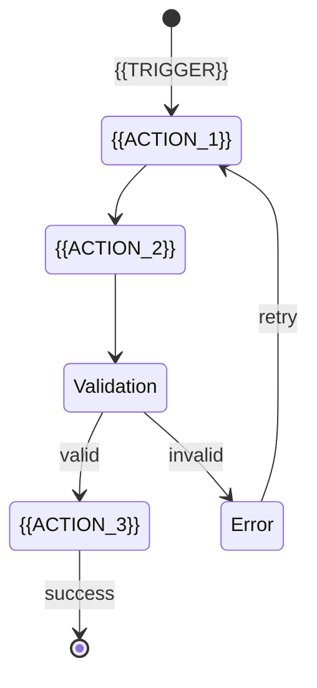
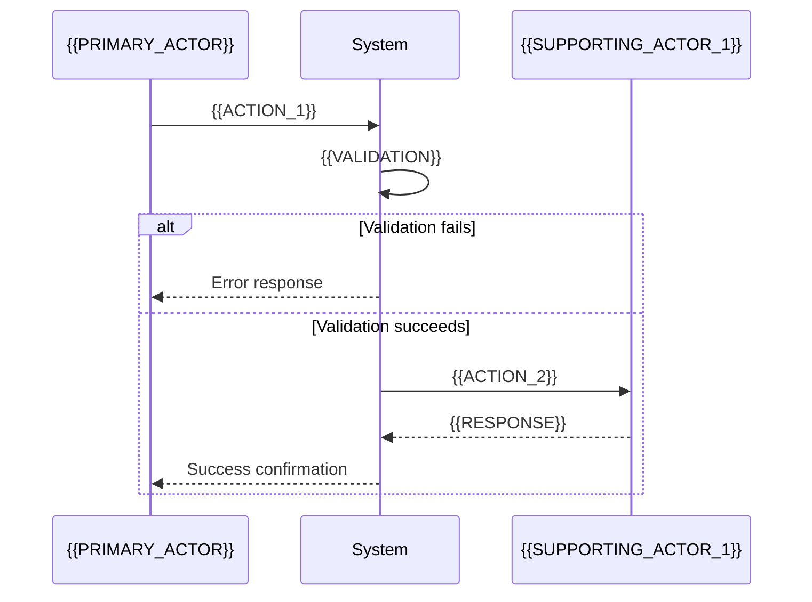

# USE CASE: {{TITLE}}

<!--
TEMPLATE: Use Case (v3.0.0)
SOURCE: Phase 0.12 Template Revision - Diagrams Enhancement
METHODOLOGY: Hybrid Cockburn + Jacobson Use Case 2.0
VERSION: 3.0.0
STATUS: DRAFT - Awaiting user approval
CREATED: 2026-01-24

DESIGN RATIONALE (v3):
  This template builds on v2's prose-based format and adds:
  - MANDATORY: Use Case Dependency Graph (shows UC-to-UC relationships)
  - MANDATORY: Actor/System Dependency Graph (shows actors and system boundary)
  - OPTIONAL: Activity Diagram (encouraged for complex flows)
  - diagram_mode: cockburn (default) | full_uml (opt-in)

KEY DECISIONS:
  - DEC-001: Default to Cockburn (avoid extends), Full UML opt-in
  - DISC-003: Use standard UML vocabulary, not custom terms

REFERENCES:
  - Cockburn, A. (2001). "Writing Effective Use Cases"
  - Jacobson, I. et al. (2011). "Use Case 2.0: The Guide to Succeeding with Use Cases"
  - OMG UML 2.5.1 Specification
  - Delinea.Registration/docs/design/Readme.LongLivedTokenDesign.template.md

GOAL LEVELS (Cockburn Sea Metaphor):
  - Summary (+): Multi-session, orchestration-level (Kite/Cloud)
  - User Goal (!): One person, one sitting, one goal (Sea) - DEFAULT
  - Subfunction (-): Supporting steps, reusable components (Fish)
-->

---

## Frontmatter

```yaml
# === IDENTITY ===
id: "UC-{{DOMAIN}}-{{NNN}}"         # Format: UC-{DOMAIN}-{NNN} (e.g., UC-KM-001)
title: "{{TITLE}}"                   # {Verb} + {Noun} + {Context}
work_type: USE_CASE                  # Immutable discriminator

# === VERSION CONTROL ===
version: "1.0.0"                     # SemVer: MAJOR.MINOR.PATCH
status: DRAFT                        # DRAFT | REVIEW | APPROVED | DEPRECATED

# === CLASSIFICATION ===
level: USER_GOAL                     # SUMMARY | USER_GOAL | SUBFUNCTION
level_symbol: "!"                    # + (summary) | ! (user goal) | - (subfunction)
scope: "{{SYSTEM_BOUNDARY}}"         # Knowledge | Forge | Downstream Service | etc.
domain: "{{DOMAIN}}"                 # KM (Knowledge Management), AUTH, SYNC, etc.

# === ACTORS ===
primary_actor: "{{PRIMARY_ACTOR}}"
supporting_actors:
  - "{{SUPPORTING_ACTOR_1}}"
  - "{{SUPPORTING_ACTOR_2}}"

# === TIMESTAMPS ===
created_at: "{{CREATED_AT}}"         # ISO 8601 datetime
updated_at: "{{UPDATED_AT}}"         # ISO 8601 datetime
created_by: "{{CREATED_BY}}"

# === TRACEABILITY ===
parent_id: null                      # Parent use case (if subfunction)
related_use_cases: []                # UC-XXX references
requirements: []                     # REQ-XXX references
pdd_refs: []                         # PDD-XXXX references
rule_refs: []                        # RULE-XXX references

# === METADATA ===
priority: P1                         # P0 (Critical) | P1 (High) | P2 (Medium) | P3 (Low)
frequency: "{{FREQUENCY}}"           # Per day/week/month
channel: "{{CHANNEL}}"               # Web | API | CLI | Manual | etc.

# === DIAGRAM SETTINGS ===
diagram_mode: cockburn               # cockburn (default) | full_uml

# === TAGS ===
tags:
  - "{{TAG_1}}"
  - "{{TAG_2}}"
```

---

## L0: ELI5 Summary

<!--
AUDIENCE: Non-technical stakeholders, new team members
PURPOSE: Quick understanding of what this use case accomplishes
-->

### What Is This?

{{ELI5_SUMMARY}}

### Simple Analogy

{{SIMPLE_ANALOGY}}

### Why Does It Matter?

{{WHY_IT_MATTERS}}

---

## L1: Engineer Details

<!--
AUDIENCE: Software engineers implementing or using this process
FORMAT: Cockburn fully-dressed format with PROSE (not tables)
-->

<b>Context of Use:</b> {{CONTEXT_OF_USE}}

<b>Design Scope:</b> {{SYSTEM_BOUNDARY}}

<b>Goal Level:</b> {{LEVEL}} (Summary + | User Goal ! | Subfunction -)

<b>Release:</b> {{RELEASE_TARGET}}

<b>Status:</b> {{STATUS}}

<b>Primary Actor:</b> {{PRIMARY_ACTOR}}

<b>Secondary Actor(s):</b> {{SUPPORTING_ACTORS}}

<b>Stakeholders and Interests:</b>
- {{STAKEHOLDER_1}} - {{INTEREST_1}}
- {{STAKEHOLDER_2}} - {{INTEREST_2}}
- {{STAKEHOLDER_3}} - {{INTEREST_3}}

<b>Preconditions:</b>
- {{PRECONDITION_1}}
- {{PRECONDITION_2}}
- {{PRECONDITION_3}}

<b>Success End Condition:</b> {{SUCCESS_END_CONDITION}}

<b>Failed End Condition:</b> {{FAILED_END_CONDITION}}

<b>Trigger:</b> {{TRIGGER}}

<b>Main Success Scenario:</b>
1. <b>{{ACTOR_1}}</b> {{ACTION_1}}.
2. <b>{{ACTOR_2}}</b> {{ACTION_2}}.
3. <b>{{ACTOR_3}}</b> {{ACTION_3}}, submitting:
   1. {{FIELD_1}}
   2. {{FIELD_2}}
   3. {{FIELD_3}}
4. <b>{{ACTOR_4}}</b> verifies:
   1. {{VERIFICATION_1}}
   2. {{VERIFICATION_2}}
5. <b>{{ACTOR_5}}</b> {{ACTION_5}}.

<!--
COCKBURN RULES FOR MSS:
- Each step follows: <Actor> <verb> <object>
- Active voice, present tense
- Steps should be observable behaviors
- 3-9 steps is ideal (max 15)
- Use sub-steps for complex operations
-->

<b>Extensions:</b>
- Network goes down:
    - i. System retries 3 times, backing off exponentially.
    - ii. If still failing, logs error and notifies operator.
- 2a. {{EXTENSION_2A_CONDITION}}:
    - i. <b>System</b> {{EXTENSION_2A_HANDLING_1}}.
    - ii. <b>{{ACTOR}}</b> {{EXTENSION_2A_HANDLING_2}}.
    - iii. <b>{{ACTOR}}</b> resends request.
- 3a. {{EXTENSION_3A_CONDITION}}:
    - i. <b>System</b> {{EXTENSION_3A_HANDLING}}.
    - ii. Un-recoverable.
- *a. {{GLOBAL_EXTENSION_CONDITION}}:
    - i. <b>System</b> {{GLOBAL_EXTENSION_HANDLING}}.
    - ii. Use case ends.

<!--
EXTENSION NUMBERING CONVENTION (Cockburn):
- {step#}a: First extension at step #
- {step#}b: Second extension at step #
- i, ii, iii: Sub-steps within extension
- *a: Extension that can happen at ANY step
-->

<b>Technology & Data Variations:</b>
- Request submitted through {{CHANNEL}} ({{PROTOCOL}})
- Content type is `{{CONTENT_TYPE}}`
- Error Responses <b><i>MUST</i></b> abide by [RFC7807](https://datatracker.ietf.org/doc/html/rfc7807).

---

## L2: Architect Perspective

<!--
AUDIENCE: Principal architects, tech leads, system designers
PURPOSE: Strategic context, trade-offs, design rationale
-->

### Stakeholders & Interests

| Stakeholder | Interest | Concern |
|-------------|----------|---------|
| {{STAKEHOLDER_1}} | {{INTEREST_1}} | {{CONCERN_1}} |
| {{STAKEHOLDER_2}} | {{INTEREST_2}} | {{CONCERN_2}} |

### Design Rationale

#### Why This Approach?

{{DESIGN_RATIONALE}}

#### Alternatives Considered

| Alternative | Pros | Cons | Why Not Chosen |
|-------------|------|------|----------------|
| {{ALT_1}} | {{ALT_1_PROS}} | {{ALT_1_CONS}} | {{ALT_1_REASON}} |

### Trade-offs

| Trade-off | Option A | Option B | Decision | Rationale |
|-----------|----------|----------|----------|-----------|
| {{TRADEOFF_1}} | {{OPTION_A1}} | {{OPTION_B1}} | {{DECISION_1}} | {{RATIONALE_1}} |

### Dependencies & Constraints

| Type | Item | Description | Impact |
|------|------|-------------|--------|
| **Depends On** | {{DEPENDENCY_1}} | {{DEP_DESC_1}} | Sequential |
| **Enables** | {{ENABLES_1}} | {{ENABLES_DESC_1}} | {{ENABLES_IMPACT_1}} |
| **Constraint** | {{CONSTRAINT_1}} | {{CONSTRAINT_DESC_1}} | {{CONSTRAINT_IMPACT_1}} |

---

## Diagrams

<!--
DIAGRAM REQUIREMENTS (v3):
- MANDATORY: Use Case Dependency Graph
- MANDATORY: Actor/System Dependency Graph
- OPTIONAL (encouraged): Activity Diagram
- OPTIONAL: Sequence Diagram

Per Cockburn: "Spend time writing clear text... not worrying about diagrams."
Include diagrams when they add value that text cannot convey.
-->

### Use Case Dependency Graph (MANDATORY)

<!--
PURPOSE: Show how this use case relates to other use cases in the lifecycle.
         This is critical for understanding the strategic flow.

COCKBURN MODE (default):
- Show sequence/flow: UC-001 → UC-002 → UC-003
- Show includes (mandatory sub-cases)
- Do NOT show extends (per Cockburn's advice)

FULL UML MODE (opt-in via diagram_mode: full_uml):
- Show all relationships: includes, extends, generalize
-->

#### Mermaid

```mermaid
flowchart LR
    subgraph "Ceremony: {{CEREMONY_NAME}}"
        UC_PREV([UC-{{PREV}}: {{PREV_TITLE}}])
        UC_THIS([UC-{{ID}}: {{TITLE}}])
        UC_NEXT([UC-{{NEXT}}: {{NEXT_TITLE}}])

        UC_PREV -->|"triggers"| UC_THIS
        UC_THIS -->|"triggers"| UC_NEXT
    end

    %% Includes (mandatory sub-cases) - Cockburn mode
    UC_THIS -->|"includes"| UC_SUB([UC-{{SUB}}: {{SUB_TITLE}}])

    %% Style
    classDef current fill:#9cf,stroke:#333,stroke-width:2px
    class UC_THIS current
```

#### ASCII Art (Alternative)

```
┌─────────────────────────────────────────────────────────────────────────────┐
│                    USE CASE DEPENDENCY GRAPH                                 │
├─────────────────────────────────────────────────────────────────────────────┤
│                                                                              │
│   ┌───────────────┐         ┌───────────────┐         ┌───────────────┐    │
│   │ UC-{{PREV}}   │────────►│ UC-{{ID}}     │────────►│ UC-{{NEXT}}   │    │
│   │ {{PREV_TITLE}}│ triggers│ {{TITLE}}     │ triggers│ {{NEXT_TITLE}}│    │
│   └───────────────┘         └───────┬───────┘         └───────────────┘    │
│                                     │                                       │
│                                     │ includes                              │
│                                     ▼                                       │
│                             ┌───────────────┐                               │
│                             │ UC-{{SUB}}    │                               │
│                             │ {{SUB_TITLE}} │                               │
│                             └───────────────┘                               │
│                                                                              │
│   Legend:                                                                    │
│   ────────► triggers (this UC must complete before next can start)          │
│   --------► includes (mandatory sub-case, always executed)                  │
│                                                                              │
└─────────────────────────────────────────────────────────────────────────────┘
```

<!--
FULL UML MODE ONLY (when diagram_mode: full_uml):

Add these relationships if needed:
- - - - -► extends (optional behavior, shown with [condition])
- ═══════► generalize (inheritance to parent use case)

Example:
  UC-002b - - - -► UC-002 [condition: urgent_flag]
  UC-002 ═══════► UC-000 (parent)
-->

---

### Actor/System Dependency Graph (MANDATORY)

<!--
PURPOSE: Show the actors involved and the system boundary.
         Actors OUTSIDE the system, use cases INSIDE.
-->

#### Mermaid

```mermaid
flowchart LR
    subgraph Actors
        A1[/"{{PRIMARY_ACTOR}}"/]
        A2[/"{{SUPPORTING_ACTOR_1}}"/]
    end

    subgraph "{{SYSTEM_BOUNDARY}}"
        UC([{{TITLE}}])
    end

    A1 -->|"initiates"| UC
    A2 -->|"supports"| UC
```

#### ASCII Art (Alternative)

```
┌─────────────────────────────────────────────────────────────────────────────┐
│                    ACTOR/SYSTEM DEPENDENCY GRAPH                             │
├─────────────────────────────────────────────────────────────────────────────┤
│                                                                              │
│   ACTORS                           SYSTEM: {{SYSTEM_BOUNDARY}}               │
│   ┌─────────────────┐         ┌─────────────────────────────────────────┐   │
│   │                 │         │                                         │   │
│   │  ┌───────────┐  │         │    ┌─────────────────────────────┐     │   │
│   │  │{{PRIMARY  │  │────────►│    │                             │     │   │
│   │  │_ACTOR}}   │  │initiates│    │   UC-{{ID}}: {{TITLE}}      │     │   │
│   │  └───────────┘  │         │    │                             │     │   │
│   │                 │         │    └─────────────────────────────┘     │   │
│   │  ┌───────────┐  │         │                                         │   │
│   │  │{{SUPPORT  │  │────────►│                                         │   │
│   │  │_ACTOR_1}} │  │ supports│                                         │   │
│   │  └───────────┘  │         │                                         │   │
│   │                 │         │                                         │   │
│   └─────────────────┘         └─────────────────────────────────────────┘   │
│                                                                              │
└─────────────────────────────────────────────────────────────────────────────┘
```

---

### Activity Diagram (OPTIONAL - Encouraged)

<!--
PURPOSE: Show the flow of the Main Success Scenario with decision points.
         Per Cockburn: Use when visualization adds value text cannot.

WHEN TO INCLUDE:
- Complex workflows with parallel activities
- Multiple decision points
- Processes spanning multiple actors
- When timing/ordering is critical
-->

#### Mermaid (stateDiagram-v2)



#### ASCII Art (Alternative)

```
┌─────────────────────────────────────────────────────────────────────────────┐
│                         ACTIVITY DIAGRAM                                     │
├─────────────────────────────────────────────────────────────────────────────┤
│                                                                              │
│                         ┌─────────┐                                          │
│                         │  START  │                                          │
│                         └────┬────┘                                          │
│                              │                                               │
│                              ▼                                               │
│                    ┌─────────────────┐                                       │
│                    │ {{ACTION_1}}    │                                       │
│                    └────────┬────────┘                                       │
│                              │                                               │
│                              ▼                                               │
│                    ┌─────────────────┐                                       │
│                    │ {{ACTION_2}}    │                                       │
│                    └────────┬────────┘                                       │
│                              │                                               │
│                     ┌────────┴────────┐                                      │
│                     │   Valid?        │                                      │
│                     └───┬─────────┬───┘                                      │
│                    Yes  │         │  No                                      │
│                         ▼         ▼                                          │
│              ┌─────────────┐ ┌─────────────┐                                 │
│              │ {{ACTION_3}}│ │  Error      │                                 │
│              └──────┬──────┘ └──────┬──────┘                                 │
│                     │               │                                        │
│                     ▼               └────────► Retry                         │
│              ┌─────────────┐                                                 │
│              │    END      │                                                 │
│              └─────────────┘                                                 │
│                                                                              │
└─────────────────────────────────────────────────────────────────────────────┘
```

---

### Sequence Diagram (OPTIONAL)

<!--
PURPOSE: Show actor-system interactions with message timing.
WHEN TO INCLUDE: When message order and timing matter.
-->



---

## Supplementary

### Use Case Slices (Jacobson 2.0)

```yaml
slices:
  - slice_id: "{{UC_ID}}-S1"
    name: "{{SLICE_1_NAME}}"
    scope: "MSS steps 1-5"
    stories:
      - "As a {{ACTOR}}, I can {{ACTION}} so that {{BENEFIT}}"
    sprint: 1
    status: PLANNED

  - slice_id: "{{UC_ID}}-S2"
    name: "{{SLICE_2_NAME}}"
    scope: "Extension 2a, 3a"
    stories:
      - "As a {{ACTOR}}, I am {{OUTCOME}} when {{CONDITION}}"
    sprint: 1
    status: PLANNED
```

### Test Cases

| Test ID | Scenario | Input | Expected Outcome | Slice |
|---------|----------|-------|------------------|-------|
| TC-001 | Happy path | {{INPUT_1}} | {{EXPECTED_1}} | MSS |
| TC-002 | {{EXTENSION_SCENARIO}} | {{INPUT_2}} | {{EXPECTED_2}} | Ext-2a |

---

## INVEST Checklist

| Criterion | Met? | Evidence |
|-----------|------|----------|
| **I**ndependent | [ ] | {{INDEPENDENT_EVIDENCE}} |
| **N**egotiable | [ ] | {{NEGOTIABLE_EVIDENCE}} |
| **V**aluable | [ ] | {{VALUABLE_EVIDENCE}} |
| **E**stimable | [ ] | {{ESTIMABLE_EVIDENCE}} |
| **S**mall (or sliceable) | [ ] | {{SMALL_EVIDENCE}} |
| **T**estable | [ ] | {{TESTABLE_EVIDENCE}} |

---

## Related Information

| Field | Value |
|-------|-------|
| **Priority** | {{PRIORITY}} |
| **Frequency** | {{FREQUENCY}} |
| **Performance** | {{PERFORMANCE_REQUIREMENT}} |
| **Channel** | {{CHANNEL}} |
| **Related Use Cases** | {{RELATED_UCS}} |
| **PDD References** | {{PDD_REFS}} |

---

## History

| Date | Version | Author | Status | Notes |
|------|---------|--------|--------|-------|
| {{CREATED_AT}} | 1.0.0 | {{CREATED_BY}} | DRAFT | Initial creation |

---

## Review & Approval

### Approvals

| Role | Name | Date | Decision |
|------|------|------|----------|
| Author | {{AUTHOR}} | {{DATE}} | Submitted |
| Reviewer | - | - | Pending |
| User | - | - | Pending |
