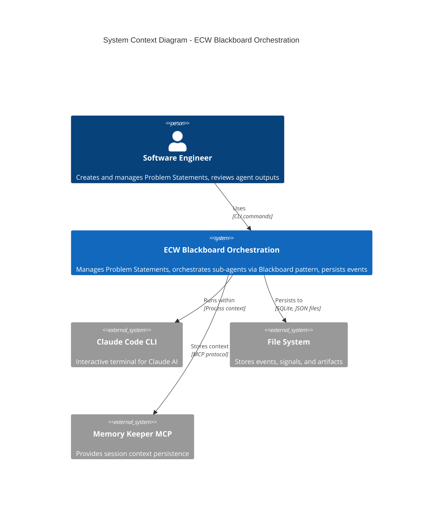
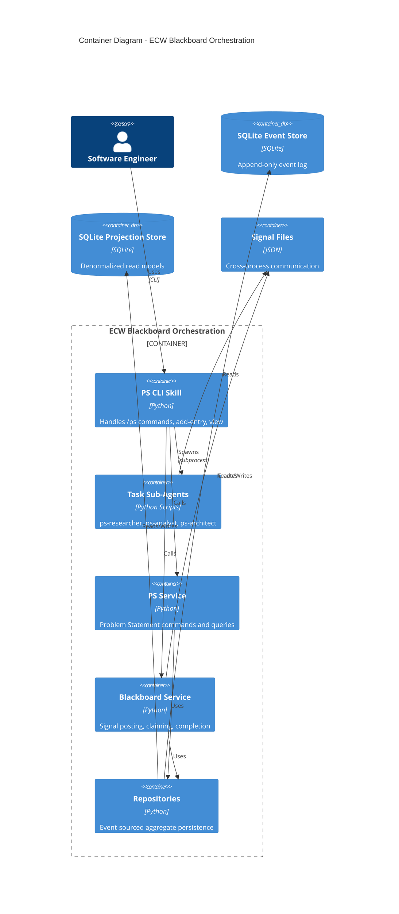

# Phase 38.17 C4 Context Diagram

> **Phase:** 38.17
> **SOP Compliance:** SOP-DES (Diagrams)
> **Related:** blackboard-agent-orchestration-design.md

---

## 1. C4 Model Overview

The C4 model provides four levels of abstraction for software architecture:
1. **Context** - System in its environment (this document)
2. **Container** - High-level technology choices
3. **Component** - Internal components
4. **Code** - Implementation details

---

## 2. System Context Diagram (Level 1)

### ASCII Representation

```
┌─────────────────────────────────────────────────────────────────────────────────┐
│                              SYSTEM CONTEXT                                      │
│                    Blackboard Agent Orchestration System                         │
└─────────────────────────────────────────────────────────────────────────────────┘

                          ┌─────────────────────┐
                          │       User          │
                          │  (Software Engr)    │
                          │                     │
                          └──────────┬──────────┘
                                     │
                          Manages Problem Statements
                          Creates Exploration Entries
                                     │
                                     ▼
┌─────────────────────────────────────────────────────────────────────────────────┐
│                                                                                  │
│                     ┌───────────────────────────────────────┐                    │
│                     │     ECW Blackboard Orchestration      │                    │
│                     │                                       │                    │
│                     │  - Problem Statement Management       │                    │
│                     │  - Sub-Agent Orchestration            │                    │
│                     │  - Signal-based Communication         │                    │
│                     │  - Event Sourced Persistence          │                    │
│                     │                                       │                    │
│                     └───────────────┬───────────────────────┘                    │
│                                     │                                            │
│                                     │                                            │
│      ┌──────────────────────────────┼──────────────────────────────┐            │
│      │                              │                              │            │
│      ▼                              ▼                              ▼            │
│ ┌────────────┐               ┌────────────┐               ┌────────────┐        │
│ │Claude Code │               │  File      │               │ Memory     │        │
│ │   CLI      │               │  System    │               │ Keeper MCP │        │
│ │            │               │            │               │            │        │
│ │ Interactive│               │ .ecw/      │               │ Session    │        │
│ │ Terminal   │               │ events.db  │               │ Context    │        │
│ └────────────┘               └────────────┘               └────────────┘        │
│                                                                                  │
└─────────────────────────────────────────────────────────────────────────────────┘

LEGEND:
┌─────────────────────────────────────────────────────────────────────────────────┐
│  ┌─────────┐                                                                    │
│  │ Person  │  User or stakeholder                                               │
│  └─────────┘                                                                    │
│                                                                                  │
│  ┌─────────────────────┐                                                        │
│  │ Software System     │  The system under design                               │
│  └─────────────────────┘                                                        │
│                                                                                  │
│  ┌─────────┐                                                                    │
│  │ External│  External systems that interact                                    │
│  │ System  │                                                                    │
│  └─────────┘                                                                    │
└─────────────────────────────────────────────────────────────────────────────────┘
```

### Mermaid Representation



---

## 3. Container Diagram (Level 2)

### ASCII Representation

```
┌─────────────────────────────────────────────────────────────────────────────────┐
│                              CONTAINER DIAGRAM                                   │
│                    Blackboard Agent Orchestration System                         │
└─────────────────────────────────────────────────────────────────────────────────┘

                          ┌─────────────────────┐
                          │       User          │
                          └──────────┬──────────┘
                                     │
                     ┌───────────────┴───────────────┐
                     ▼                               ▼
         ┌─────────────────────┐         ┌─────────────────────┐
         │    PS CLI Skill     │         │   Task Sub-Agents   │
         │                     │         │                     │
         │ [Python Script]     │         │ [Python Scripts]    │
         │                     │         │                     │
         │ - /ps commands      │────────▶│ - ps-researcher     │
         │ - add-entry         │ spawns  │ - ps-analyst        │
         │ - view/history      │         │ - ps-architect      │
         └──────────┬──────────┘         └──────────┬──────────┘
                    │                               │
                    │ writes                        │ reads/writes
                    │                               │
                    ▼                               ▼
         ┌─────────────────────────────────────────────────────────┐
         │                  Application Core                        │
         │                                                          │
         │  ┌─────────────────┐  ┌─────────────────┐               │
         │  │ PS Service      │  │ Blackboard      │               │
         │  │                 │  │ Service         │               │
         │  │ - Commands      │  │                 │               │
         │  │ - Queries       │  │ - Post Signal   │               │
         │  └────────┬────────┘  │ - Claim/Complete│               │
         │           │           └────────┬────────┘               │
         │           │                    │                        │
         │           └────────┬───────────┘                        │
         │                    ▼                                    │
         │           ┌─────────────────┐                           │
         │           │  Repositories   │                           │
         │           │                 │                           │
         │           │ - PS Repository │                           │
         │           │ - BB Repository │                           │
         │           └────────┬────────┘                           │
         └────────────────────┼────────────────────────────────────┘
                              │
            ┌─────────────────┼─────────────────┐
            │                 │                 │
            ▼                 ▼                 ▼
   ┌─────────────────┐ ┌─────────────────┐ ┌─────────────────┐
   │ SQLite Event    │ │ SQLite          │ │ Signal Files    │
   │ Store           │ │ Projection      │ │                 │
   │                 │ │ Store           │ │ .ecw/signals/   │
   │ .ecw/events.db  │ │ .ecw/           │ │ pending/        │
   │                 │ │ projections.db  │ │ sig-*.json      │
   └─────────────────┘ └─────────────────┘ └─────────────────┘
```

### Mermaid Representation



---

## 4. Component Diagram (Level 3)

### ASCII Representation

```
┌─────────────────────────────────────────────────────────────────────────────────┐
│                              COMPONENT DIAGRAM                                   │
│                         Application Core Container                               │
└─────────────────────────────────────────────────────────────────────────────────┘

┌─────────────────────────────────────────────────────────────────────────────────┐
│                            APPLICATION LAYER                                     │
│                                                                                  │
│  ┌──────────────────────────┐    ┌──────────────────────────┐                   │
│  │  ProblemStatementService │    │    BlackboardService     │                   │
│  │                          │    │                          │                   │
│  │  Commands:               │    │  Commands:               │                   │
│  │  - CreatePS              │    │  - PostSignal            │                   │
│  │  - AddConstraint         │    │  - ClaimSignal           │                   │
│  │  - AddQuestion           │    │  - CompleteSignal        │                   │
│  │  - AddExplorationEntry   │    │                          │                   │
│  │  - AnswerQuestion        │    │  Queries:                │                   │
│  │                          │    │  - GetSignals            │                   │
│  │  Queries:                │    │  - GetSignalStatus       │                   │
│  │  - GetPS                 │    │                          │                   │
│  │  - ListConstraints       │    └──────────────┬───────────┘                   │
│  │  - ListQuestions         │                   │                               │
│  │  - ListExplorations      │                   │                               │
│  └──────────────┬───────────┘                   │                               │
│                 │                               │                               │
└─────────────────┼───────────────────────────────┼───────────────────────────────┘
                  │                               │
┌─────────────────┼───────────────────────────────┼───────────────────────────────┐
│                 │         DOMAIN LAYER          │                               │
│                 ▼                               ▼                               │
│  ┌──────────────────────────┐    ┌──────────────────────────┐                   │
│  │ ProblemStatementAggregate│    │   BlackboardAggregate    │                   │
│  │                          │    │                          │                   │
│  │  State:                  │    │  State:                  │                   │
│  │  - constraints[]         │    │  - signals{}             │                   │
│  │  - questions[]           │    │  - ps_id                 │                   │
│  │  - explorations[]        │    │                          │                   │
│  │  - status                │    │  Events:                 │                   │
│  │                          │    │  - BlackboardCreated     │                   │
│  │  Events:                 │    │  - AgentSignalPosted     │                   │
│  │  - PSCreated             │    │  - AgentSignalClaimed    │                   │
│  │  - ConstraintAdded       │    │  - AgentSignalCompleted  │                   │
│  │  - QuestionAdded         │    │                          │                   │
│  │  - ExplorationAdded      │    └──────────────────────────┘                   │
│  │  - QuestionAnswered      │                                                   │
│  └──────────────────────────┘                                                   │
│                                                                                  │
└──────────────────────────────────────────────────────────────────────────────────┘

┌─────────────────────────────────────────────────────────────────────────────────┐
│                           INFRASTRUCTURE LAYER                                   │
│                                                                                  │
│  ┌──────────────────────────┐    ┌──────────────────────────┐                   │
│  │   SQLite3EventStore      │    │ SQLite3ProjectionStore   │                   │
│  │                          │    │                          │                   │
│  │  - append(events)        │    │  - save(projection)      │                   │
│  │  - read(stream_id)       │    │  - get(projection_id)    │                   │
│  │  - get_version()         │    │  - list()                │                   │
│  └──────────────────────────┘    └──────────────────────────┘                   │
│                                                                                  │
│  ┌──────────────────────────┐    ┌──────────────────────────┐                   │
│  │   SignalFileBridge       │    │    EventConverter        │                   │
│  │                          │    │                          │                   │
│  │  - write_signal(signal)  │    │  - domain_to_cloudevent  │                   │
│  │  - read_pending()        │    │  - cloudevent_to_domain  │                   │
│  │  - archive_signal()      │    │                          │                   │
│  └──────────────────────────┘    └──────────────────────────┘                   │
│                                                                                  │
└──────────────────────────────────────────────────────────────────────────────────┘
```

---

## 5. Key Relationships

### Domain Relationships

```
┌──────────────────┐       1        ┌──────────────────┐
│ ProblemStatement │───────────────▶│   Blackboard     │
│   Aggregate      │ has exactly 1  │   Aggregate      │
└──────────────────┘                └──────────────────┘
         │                                   │
         │ contains *                        │ contains *
         ▼                                   ▼
┌──────────────────┐                ┌──────────────────┐
│  Exploration     │                │   AgentSignal    │
│     Entry        │                │                  │
└──────────────────┘                └──────────────────┘
         │                                   │
         │ triggers (if RESEARCH/ANALYSIS)   │
         └───────────────────────────────────┘
```

### Data Flow

```
User Input ──▶ CLI ──▶ Service ──▶ Aggregate ──▶ Event Store
                │                      │
                │                      └──▶ Signal File
                │                               │
                └───────────────────────────────┼──▶ Sub-Agent
                                                │
                                         Agent Output ──▶ Artifact
```

---

## 6. Technology Stack

| Layer | Technology | Purpose |
|-------|------------|---------|
| Presentation | Python CLI | User interface |
| Application | Python Services | Business logic orchestration |
| Domain | Python Aggregates | Business rules, event sourcing |
| Infrastructure | SQLite | Event and projection persistence |
| Communication | JSON Files | Cross-process signaling |

---

## 7. References

- **blackboard-agent-orchestration-design.md** - Core design
- **phase-38.17-deployment-diagram.md** - Physical deployment
- **phase-38.17-disaster-recovery-runbook.md** - Recovery procedures

---

*Generated per SOP-DES.6 - Design Diagrams*
