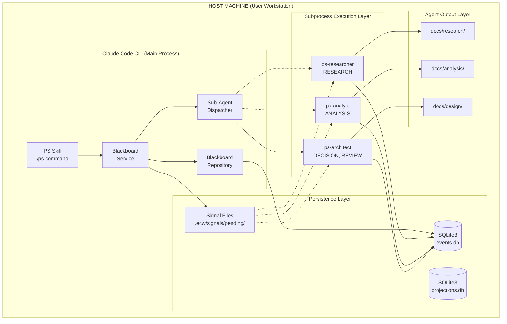

# Phase 38.17 Deployment Diagram

> **Phase:** 38.17
> **SOP Compliance:** SOP-DES.6.e (Deployment Diagrams)
> **Related:** blackboard-agent-orchestration-design.md

---

## 1. Executive Summary

This document provides the deployment architecture for the Blackboard Agent Orchestration system, showing how components are distributed across execution contexts and how they communicate.

**Key Deployment Decisions:**
- File-based Signal Bridge for cross-process communication (LES-044)
- Shared SQLite Event Store for event persistence
- Claude Subprocess execution model for agents

---

## 2. Deployment Context Overview

### ASCII Deployment Diagram

```
┌─────────────────────────────────────────────────────────────────────────────────┐
│                           HOST MACHINE (User Workstation)                        │
│                                                                                  │
│  ┌────────────────────────────────────────────────────────────────────────────┐ │
│  │                        CLAUDE CODE CLI CONTEXT                              │ │
│  │                    (Main Process - User Interactive)                        │ │
│  │                                                                             │ │
│  │  ┌─────────────────┐    ┌─────────────────┐    ┌─────────────────────────┐ │ │
│  │  │   PS Skill      │    │  Blackboard     │    │   Sub-Agent Dispatcher  │ │ │
│  │  │ /ps command     │───▶│  Service        │───▶│   (File Monitor)        │ │ │
│  │  │                 │    │                 │    │                         │ │ │
│  │  └────────┬────────┘    └────────┬────────┘    └────────────┬────────────┘ │ │
│  │           │                      │                          │              │ │
│  │           │                      ▼                          │              │ │
│  │           │             ┌─────────────────┐                 │              │ │
│  │           │             │  Blackboard     │                 │              │ │
│  │           └────────────▶│  Repository     │                 │              │ │
│  │                         │                 │                 │              │ │
│  │                         └────────┬────────┘                 │              │ │
│  └──────────────────────────────────┼──────────────────────────┼──────────────┘ │
│                                     │                          │                │
│  ┌──────────────────────────────────┼──────────────────────────┼──────────────┐ │
│  │             PERSISTENCE LAYER    │                          │              │ │
│  │                                  ▼                          ▼              │ │
│  │  ┌─────────────────┐    ┌─────────────────┐    ┌─────────────────────────┐ │ │
│  │  │  SQLite3        │    │   .ecw/         │    │  .ecw/signals/pending/  │ │ │
│  │  │  Event Store    │    │   projections.db│    │  (Signal Files)         │ │ │
│  │  │  (.ecw/events.db)│    │                │    │  sig-*.json             │ │ │
│  │  └─────────────────┘    └─────────────────┘    └─────────────────────────┘ │ │
│  │                                                              ▲              │ │
│  └──────────────────────────────────────────────────────────────┼──────────────┘ │
│                                                                 │                │
│  ┌──────────────────────────────────────────────────────────────┼──────────────┐ │
│  │                    SUBPROCESS EXECUTION LAYER                │              │ │
│  │                                                              │              │ │
│  │  ┌─────────────┐  ┌─────────────┐  ┌─────────────┐          │              │ │
│  │  │ ps-researcher│  │ ps-analyst  │  │ ps-architect│          │              │ │
│  │  │ subprocess   │  │ subprocess  │  │ subprocess  │──────────┘              │ │
│  │  │             │  │             │  │             │ (Read pending signals)  │ │
│  │  │ Capabilities:│  │ Capabilities:│  │ Capabilities:│                       │ │
│  │  │ - RESEARCH   │  │ - ANALYSIS  │  │ - DECISION  │                        │ │
│  │  │             │  │             │  │ - REVIEW    │                        │ │
│  │  └──────┬──────┘  └──────┬──────┘  └──────┬──────┘                        │ │
│  │         │                │                │                               │ │
│  │         │                │                │                               │ │
│  │         │    ┌───────────┴────────────────┘                               │ │
│  │         │    │                                                            │ │
│  │         ▼    ▼                                                            │ │
│  │  ┌─────────────────────────────────────────────────────────────────────┐  │ │
│  │  │                    AGENT OUTPUT LAYER                                │  │ │
│  │  │  ┌─────────────────┐  ┌─────────────────┐  ┌─────────────────────┐  │  │ │
│  │  │  │ docs/research/  │  │ docs/analysis/  │  │ docs/design/        │  │  │ │
│  │  │  │ phase-38.17-*.md│  │ phase-38.17-*.md│  │ phase-38.17-*.md    │  │  │ │
│  │  │  └─────────────────┘  └─────────────────┘  └─────────────────────┘  │  │ │
│  │  └─────────────────────────────────────────────────────────────────────┘  │ │
│  └───────────────────────────────────────────────────────────────────────────┘ │
│                                                                                  │
└──────────────────────────────────────────────────────────────────────────────────┘
```

---

## 3. Mermaid Deployment Diagram



---

## 4. Component Placement

| Component | Execution Context | Process Type | Communication |
|-----------|-------------------|--------------|---------------|
| PS Skill | Main Claude CLI | Interactive | Direct method call |
| Blackboard Service | Main Claude CLI | Interactive | Direct method call |
| Blackboard Repository | Main Claude CLI | Interactive | SQLite access |
| Sub-Agent Dispatcher | Main Claude CLI | Interactive | File creation + subprocess |
| ps-researcher | Subprocess | Batch | File read + write |
| ps-analyst | Subprocess | Batch | File read + write |
| ps-architect | Subprocess | Batch | File read + write |
| SQLite3 Event Store | Persistence | Data | File I/O |
| Signal Files | Persistence | Data | File I/O |

---

## 5. Communication Protocols

### 5.1 Signal Posting (Main → Persistence)

```
┌────────────┐     ┌────────────┐     ┌────────────┐     ┌────────────┐
│ PS Skill   │────▶│ Blackboard │────▶│ Event Store│────▶│Signal File │
│            │     │ Service    │     │ (append)   │     │ (write)    │
└────────────┘     └────────────┘     └────────────┘     └────────────┘
      │                  │                  │                  │
      │ post_signal()    │ save(aggregate)  │ append(events)   │ write JSON
      │                  │                  │                  │
```

### 5.2 Signal Processing (Subprocess → Persistence)

```
┌────────────┐     ┌────────────┐     ┌────────────┐     ┌────────────┐
│ Sub-Agent  │────▶│ Signal File│────▶│ Processing │────▶│ Artifact   │
│ (spawn)    │     │ (read)     │     │ (execute)  │     │ (write)    │
└────────────┘     └────────────┘     └────────────┘     └────────────┘
      │                  │                  │                  │
      │ start subprocess │ parse JSON       │ research/analyze │ docs/*.md
      │                  │                  │                  │
```

---

## 6. Deployment Constraints

### 6.1 Process Isolation

- **Constraint:** Sub-agents run as separate Python subprocesses
- **Reason:** Claude Task tool spawns separate execution contexts
- **Impact:** No shared memory; file-based communication required

### 6.2 Database Access

- **Constraint:** SQLite supports only one writer at a time
- **Mitigation:** Write-ahead logging (WAL) mode for concurrent reads
- **Fallback:** Signal file bridge for cross-process signaling

### 6.3 Signal File Bridge (LES-044)

- **Purpose:** Enable cross-process agent orchestration
- **Location:** `.ecw/signals/pending/sig-{uuid}.json`
- **Lifecycle:**
  1. Created by main context when signal posted
  2. Read by subprocess agents
  3. Deleted after processing complete

---

## 7. Scalability Considerations

### 7.1 Current Design (Single Host)

- All components run on single user workstation
- SQLite sufficient for typical PS exploration volumes
- File-based signals adequate for sequential agent dispatch

### 7.2 Future Scaling (If Needed)

| Growth Path | Trigger | Approach |
|-------------|---------|----------|
| Many signals | >100 pending | Redis queue |
| Multi-user | Shared codebase | PostgreSQL event store |
| Parallel agents | CPU bottleneck | Distributed workers |

---

## 8. Monitoring Points

### 8.1 Health Indicators

| Metric | Location | Threshold | Action |
|--------|----------|-----------|--------|
| Pending signals | `.ecw/signals/pending/` | >10 | Investigate stale signals |
| Event store size | `.ecw/events.db` | >100MB | Consider archiving |
| Agent output | `docs/{type}/` | Present | Verify artifacts created |

### 8.2 Troubleshooting

1. **No signal files created:**
   - Check CLI `--type` flag usage
   - Verify agent-triggering types (RESEARCH, ANALYSIS)

2. **Signals not processed:**
   - Check subprocess execution permissions
   - Verify signal file JSON format

3. **Events not persisted:**
   - Check database file permissions
   - Verify stream namespace format

---

## 9. References

- **blackboard-agent-orchestration-design.md** - Core design document
- **LES-044** - Signal file bridge lesson learned
- **PAT-074** - Factory-wired cross-service integration
- **e-158** - Implementation decision exploration

---

*Generated per SOP-DES.6.e - Deployment Diagrams*
