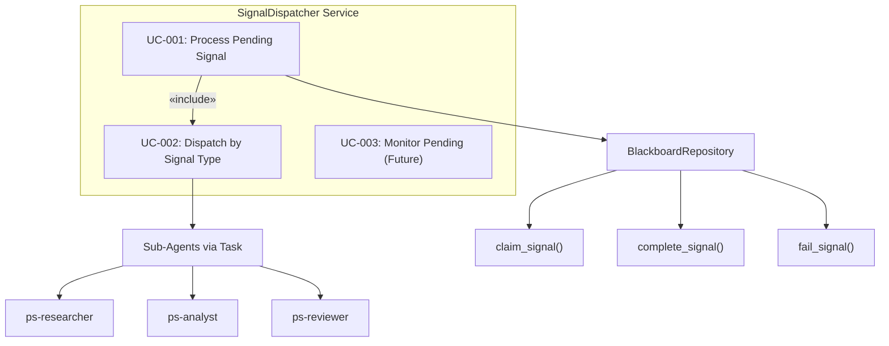
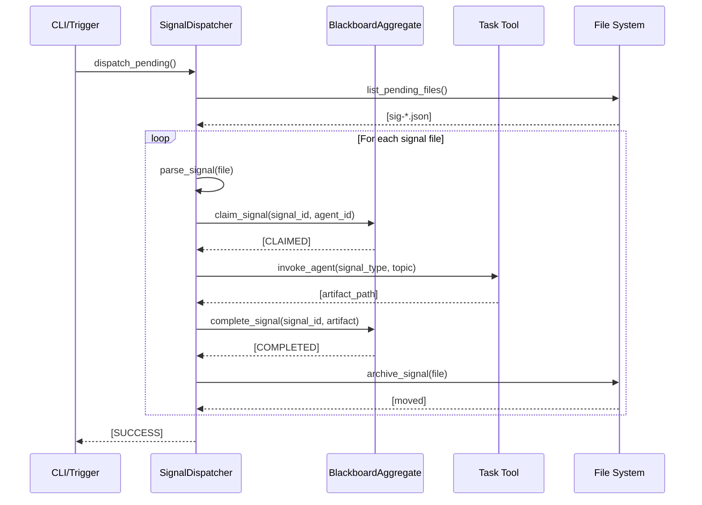

# Phase 38.17 SignalDispatcher Design

> **Phase:** 38.17
> **SOP Compliance:** SOP-DES.6 (Design Artifacts)
> **Constraint:** c-030 - SignalDispatcher MUST exist to complete E2E flow
> **Discovery:** e-167 - CRITICAL: SignalDispatcher Component Missing

---

## 1. Executive Summary

The SignalDispatcher is the missing Application Layer component that bridges the
Domain Layer (BlackboardAggregate) with Infrastructure Layer (signal files) to
enable automatic sub-agent dispatch.

**Problem Statement:** Signals are posted to `.ecw/signals/pending/` but never
processed because no component exists to read files, dispatch agents, and manage
the claim/complete lifecycle.

**Solution:** Implement SignalDispatcher as an Application Service that:
1. Monitors pending signal files
2. Dispatches appropriate sub-agents via Claude Task tool
3. Manages signal lifecycle (claim → complete/fail)
4. Archives processed signals

---

## 2. Use Cases (SOP-DES.6.a)

### UC-001: Process Pending Signal

**Actor:** SignalDispatcher (Application Service)
**Precondition:** Signal file exists in `.ecw/signals/pending/`
**Postcondition:** Sub-agent invoked, signal completed, file archived

**Main Flow:**
1. Dispatcher reads signal file from pending directory
2. Dispatcher parses signal JSON to extract signal_type, topic, ps_id, entry_id
3. Dispatcher maps signal_type to agent capability
4. Dispatcher calls `claim_signal()` on BlackboardAggregate
5. Dispatcher invokes sub-agent via Task tool
6. Sub-agent produces artifact
7. Dispatcher calls `complete_signal()` with artifact path
8. Dispatcher archives signal file to `.ecw/signals/archived/`

**Alternative Flows:**

**A1: Agent Fails**
- At step 6, agent encounters error
- Dispatcher calls `fail_signal()` with error details
- Dispatcher archives signal file with failure marker

**A2: No Matching Agent**
- At step 3, signal_type has no registered agent
- Dispatcher logs warning
- Dispatcher leaves signal file pending (manual intervention required)

**A3: Signal Already Claimed**
- At step 4, signal already claimed by another agent
- Dispatcher skips signal (concurrent dispatch scenario)

---

### UC-002: Dispatch by Signal Type

**Actor:** SignalDispatcher
**Precondition:** Signal claimed successfully
**Postcondition:** Correct sub-agent invoked based on signal_type

**Signal Type → Agent Mapping:**

| Signal Type | Agent | Subagent Type | Capability |
|-------------|-------|---------------|------------|
| RESEARCH | ps-researcher | general-purpose | RESEARCH |
| ANALYSIS | ps-analyst | general-purpose | ANALYSIS |
| REVIEW | ps-reviewer | general-purpose | REVIEW |
| SYNTHESIS | ps-synthesizer | general-purpose | SYNTHESIS |
| INVESTIGATION | ps-investigator | general-purpose | INVESTIGATION |
| DECISION | ps-architect | general-purpose | DECISION |
| VALIDATION | ps-validator | general-purpose | VALIDATION |

---

### UC-003: Monitor Pending Signals (Optional - Future)

**Actor:** SignalDispatcher
**Trigger:** Timer or file system watcher
**Postcondition:** Newly posted signals discovered and processed

**Note:** Initial implementation uses on-demand invocation. Background monitoring
is a future enhancement (Phase 38.18+).

---

## 3. Use Case Diagram (SOP-DES.6.b)

### ASCII Representation

```
┌─────────────────────────────────────────────────────────────────────────────────┐
│                         SIGNAL DISPATCHER USE CASES                              │
└─────────────────────────────────────────────────────────────────────────────────┘

        ┌─────────────────────────────────────────────────────────────────────────┐
        │                      «system»                                            │
        │               SignalDispatcher Service                                   │
        │                                                                          │
        │   ┌─────────────────┐   ┌─────────────────┐   ┌─────────────────┐       │
        │   │   UC-001:       │   │   UC-002:       │   │   UC-003:       │       │
        │   │ Process Pending │   │ Dispatch by     │   │ Monitor Pending │       │
        │   │    Signal       │   │ Signal Type     │   │    (Future)     │       │
        │   └────────┬────────┘   └────────┬────────┘   └─────────────────┘       │
        │            │                     │                                       │
        │            │    «include»        │                                       │
        │            └────────────────────►│                                       │
        │                                                                          │
        └─────────────────────────────────────────────────────────────────────────┘
                     │                                           │
                     ▼                                           ▼
        ┌─────────────────┐                           ┌─────────────────┐
        │ BlackboardRepo  │                           │  Sub-Agents     │
        │                 │                           │ (Task tool)     │
        │ claim_signal    │                           │                 │
        │ complete_signal │                           │ ps-researcher   │
        │ fail_signal     │                           │ ps-analyst      │
        └─────────────────┘                           │ ps-reviewer     │
                                                      │ etc.            │
                                                      └─────────────────┘
```

### Mermaid Representation



---

## 4. Sequence Diagram (SOP-DES.6.i)

### UC-001: Process Pending Signal - Happy Path

#### ASCII Representation

```
┌─────────────┐     ┌─────────────┐     ┌─────────────┐     ┌─────────────┐     ┌─────────────┐
│ CLI/Trigger │     │ Dispatcher  │     │ Blackboard  │     │ Task Tool   │     │ File System │
└──────┬──────┘     └──────┬──────┘     └──────┬──────┘     └──────┬──────┘     └──────┬──────┘
       │                   │                   │                   │                   │
       │ dispatch_pending()│                   │                   │                   │
       │──────────────────>│                   │                   │                   │
       │                   │                   │                   │                   │
       │                   │ list_pending_files()                  │                   │
       │                   │──────────────────────────────────────────────────────────>│
       │                   │                   │                   │       [sig-*.json]│
       │                   │<──────────────────────────────────────────────────────────│
       │                   │                   │                   │                   │
       │                   │ parse_signal(file)│                   │                   │
       │                   │───────────────────│                   │                   │
       │                   │                   │                   │                   │
       │                   │ claim_signal(signal_id, agent_id)     │                   │
       │                   │──────────────────>│                   │                   │
       │                   │                   │ [CLAIMED]         │                   │
       │                   │<──────────────────│                   │                   │
       │                   │                   │                   │                   │
       │                   │ invoke_agent(signal_type, topic)      │                   │
       │                   │──────────────────────────────────────>│                   │
       │                   │                   │                   │ [artifact path]   │
       │                   │<──────────────────────────────────────│                   │
       │                   │                   │                   │                   │
       │                   │ complete_signal(signal_id, artifact)  │                   │
       │                   │──────────────────>│                   │                   │
       │                   │                   │ [COMPLETED]       │                   │
       │                   │<──────────────────│                   │                   │
       │                   │                   │                   │                   │
       │                   │ archive_signal(file)                  │                   │
       │                   │──────────────────────────────────────────────────────────>│
       │                   │                   │                   │      [moved]      │
       │                   │<──────────────────────────────────────────────────────────│
       │                   │                   │                   │                   │
       │       [SUCCESS]   │                   │                   │                   │
       │<──────────────────│                   │                   │                   │
       │                   │                   │                   │                   │
```

#### Mermaid Representation



---

## 5. Component Diagram (SOP-DES.6.d)

### ASCII Representation

```
┌─────────────────────────────────────────────────────────────────────────────────┐
│                             APPLICATION LAYER                                    │
│                                                                                  │
│  ┌───────────────────────────────────────────────────────────────────────────┐  │
│  │                      SignalDispatcherService                               │  │
│  │                                                                            │  │
│  │  ┌─────────────────┐  ┌─────────────────┐  ┌─────────────────────────────┐│  │
│  │  │ SignalFileReader│  │ AgentInvoker    │  │ SignalLifecycleManager     ││  │
│  │  │                 │  │                 │  │                            ││  │
│  │  │ - list_pending()│  │ - invoke()      │  │ - claim()                  ││  │
│  │  │ - parse()       │  │ - get_agent()   │  │ - complete()               ││  │
│  │  │ - archive()     │  │                 │  │ - fail()                   ││  │
│  │  └────────┬────────┘  └────────┬────────┘  └────────────┬───────────────┘│  │
│  │           │                    │                        │                 │  │
│  └───────────┼────────────────────┼────────────────────────┼─────────────────┘  │
│              │                    │                        │                    │
└──────────────┼────────────────────┼────────────────────────┼────────────────────┘
               │                    │                        │
               ▼                    ▼                        ▼
┌──────────────────────┐ ┌────────────────────┐ ┌─────────────────────────────────┐
│  INFRASTRUCTURE      │ │  CLAUDE RUNTIME    │ │  DOMAIN LAYER                   │
│                      │ │                    │ │                                 │
│  .ecw/signals/       │ │  Task tool         │ │  BlackboardAggregate            │
│    pending/          │ │  (sub-agents)      │ │    - claim_signal()             │
│    archived/         │ │                    │ │    - complete_signal()          │
│                      │ │                    │ │    - fail_signal()              │
└──────────────────────┘ └────────────────────┘ └─────────────────────────────────┘
```

---

## 6. Class Diagram (SOP-DES.6.c)

### ASCII Representation

```
┌─────────────────────────────────────────────────────────────────────────────────┐
│                          SignalDispatcher Classes                                │
└─────────────────────────────────────────────────────────────────────────────────┘

┌──────────────────────────────────────────────────────────────────────────────────┐
│ «interface»                                                                      │
│ ISignalDispatcher                                                                │
├──────────────────────────────────────────────────────────────────────────────────┤
│ + dispatch_pending() -> DispatchResult                                           │
│ + dispatch_signal(signal_id: str) -> DispatchResult                              │
│ + get_pending_count() -> int                                                     │
└──────────────────────────────────────────────────────────────────────────────────┘
                                      △
                                      │
                                      │ implements
                                      │
┌──────────────────────────────────────────────────────────────────────────────────┐
│ SignalDispatcherService                                                          │
├──────────────────────────────────────────────────────────────────────────────────┤
│ - _blackboard_repo: IBlackboardRepository                                        │
│ - _signal_file_reader: SignalFileReader                                          │
│ - _agent_invoker: AgentInvoker                                                   │
│ - _signals_dir: Path                                                             │
│ - _dispatcher_id: str                                                            │
├──────────────────────────────────────────────────────────────────────────────────┤
│ + dispatch_pending() -> DispatchResult                                           │
│ + dispatch_signal(signal_id: str) -> DispatchResult                              │
│ + get_pending_count() -> int                                                     │
│ - _process_signal(signal_file: SignalFile) -> SignalOutcome                      │
│ - _map_signal_to_agent(signal_type: str) -> AgentConfig                          │
└──────────────────────────────────────────────────────────────────────────────────┘
                │                       │                       │
                │ uses                  │ uses                  │ uses
                ▼                       ▼                       ▼
┌───────────────────────┐ ┌───────────────────────┐ ┌───────────────────────────────┐
│ SignalFileReader      │ │ AgentInvoker          │ │ IBlackboardRepository         │
├───────────────────────┤ ├───────────────────────┤ ├───────────────────────────────┤
│ + list_pending()      │ │ + invoke(config)      │ │ + claim_signal()              │
│ + parse(path) -> dict │ │ + get_agent_id()      │ │ + complete_signal()           │
│ + archive(path)       │ │                       │ │ + fail_signal()               │
└───────────────────────┘ └───────────────────────┘ └───────────────────────────────┘

┌──────────────────────────────────────────────────────────────────────────────────┐
│ «dataclass»                                                                      │
│ DispatchResult                                                                   │
├──────────────────────────────────────────────────────────────────────────────────┤
│ + total_pending: int                                                             │
│ + processed: int                                                                 │
│ + succeeded: int                                                                 │
│ + failed: int                                                                    │
│ + skipped: int                                                                   │
│ + outcomes: List[SignalOutcome]                                                  │
└──────────────────────────────────────────────────────────────────────────────────┘

┌──────────────────────────────────────────────────────────────────────────────────┐
│ «dataclass»                                                                      │
│ SignalOutcome                                                                    │
├──────────────────────────────────────────────────────────────────────────────────┤
│ + signal_id: str                                                                 │
│ + status: str  # COMPLETED | FAILED | SKIPPED                                    │
│ + artifact_path: Optional[str]                                                   │
│ + error_message: Optional[str]                                                   │
│ + duration_ms: int                                                               │
└──────────────────────────────────────────────────────────────────────────────────┘

┌──────────────────────────────────────────────────────────────────────────────────┐
│ «dataclass»                                                                      │
│ AgentConfig                                                                      │
├──────────────────────────────────────────────────────────────────────────────────┤
│ + agent_id: str          # e.g., "ps-researcher"                                 │
│ + subagent_type: str     # Claude Task subagent_type                             │
│ + capability: str        # Primary capability                                    │
│ + prompt_template: str   # Template for agent prompt                             │
└──────────────────────────────────────────────────────────────────────────────────┘
```

---

## 7. Agent Configuration Registry

```python
AGENT_REGISTRY = {
    "RESEARCH": AgentConfig(
        agent_id="ps-researcher",
        subagent_type="general-purpose",
        capability="RESEARCH",
        prompt_template="Research the following topic: {topic}\n\nPS: {ps_id}, Entry: {entry_id}",
    ),
    "ANALYSIS": AgentConfig(
        agent_id="ps-analyst",
        subagent_type="general-purpose",
        capability="ANALYSIS",
        prompt_template="Analyze the following: {topic}\n\nPS: {ps_id}, Entry: {entry_id}",
    ),
    "REVIEW": AgentConfig(
        agent_id="ps-reviewer",
        subagent_type="general-purpose",
        capability="REVIEW",
        prompt_template="Review the following: {topic}\n\nPS: {ps_id}, Entry: {entry_id}",
    ),
    "SYNTHESIS": AgentConfig(
        agent_id="ps-synthesizer",
        subagent_type="general-purpose",
        capability="SYNTHESIS",
        prompt_template="Synthesize findings for: {topic}\n\nPS: {ps_id}, Entry: {entry_id}",
    ),
    "INVESTIGATION": AgentConfig(
        agent_id="ps-investigator",
        subagent_type="general-purpose",
        capability="INVESTIGATION",
        prompt_template="Investigate: {topic}\n\nPS: {ps_id}, Entry: {entry_id}",
    ),
    "DECISION": AgentConfig(
        agent_id="ps-architect",
        subagent_type="general-purpose",
        capability="DECISION",
        prompt_template="Make a decision on: {topic}\n\nPS: {ps_id}, Entry: {entry_id}",
    ),
    "VALIDATION": AgentConfig(
        agent_id="ps-validator",
        subagent_type="general-purpose",
        capability="VALIDATION",
        prompt_template="Validate: {topic}\n\nPS: {ps_id}, Entry: {entry_id}",
    ),
}
```

---

## 8. State Machine Diagram (SOP-DES.6.h)

### Signal Lifecycle with Dispatcher

```
                    ┌─────────────────────────────────────────────────────────────────┐
                    │                SIGNAL LIFECYCLE STATE MACHINE                    │
                    └─────────────────────────────────────────────────────────────────┘

                                          CLI add-entry
                                               │
                                               ▼
                                    ┌─────────────────────┐
                                    │      POSTED         │
                                    │   (Signal file      │
                                    │    written)         │
                                    └──────────┬──────────┘
                                               │
                                    Dispatcher reads file
                                    & claims signal
                                               │
                                               ▼
                                    ┌─────────────────────┐
                                    │      CLAIMED        │
                                    │   (Agent working)   │
                                    └──────────┬──────────┘
                                               │
                        ┌──────────────────────┼──────────────────────┐
                        │                      │                      │
                 Agent succeeds          Agent fails            Timeout
                        │                      │                      │
                        ▼                      ▼                      ▼
              ┌─────────────────┐   ┌─────────────────┐   ┌─────────────────┐
              │   COMPLETED     │   │     FAILED      │   │    EXPIRED      │
              │ (Artifact       │   │ (Error logged)  │   │ (Auto-cleanup)  │
              │  produced)      │   │                 │   │                 │
              └─────────────────┘   └─────────────────┘   └─────────────────┘
                        │                      │                      │
                        └──────────────────────┴──────────────────────┘
                                               │
                                    Signal file archived
                                               │
                                               ▼
                                    ┌─────────────────────┐
                                    │     ARCHIVED        │
                                    │ (.ecw/signals/      │
                                    │  archived/)         │
                                    └─────────────────────┘
```

---

## 9. Deployment Context (SOP-DES.6.e)

### Where SignalDispatcher Runs

```
┌─────────────────────────────────────────────────────────────────────────────────┐
│                           HOST MACHINE (User Workstation)                        │
│                                                                                  │
│  ┌────────────────────────────────────────────────────────────────────────────┐ │
│  │                        CLAUDE CODE CLI CONTEXT                              │ │
│  │                    (Main Process - User Interactive)                        │ │
│  │                                                                             │ │
│  │  ┌─────────────────┐    ┌─────────────────────────────────────────────────┐│ │
│  │  │   PS Skill      │    │         SignalDispatcher                        ││ │
│  │  │ /ps add-entry   │───▶│                                                 ││ │
│  │  │                 │    │  - Runs in main Claude context                  ││ │
│  │  │ posts signal    │    │  - Invokes Task tool for sub-agents            ││ │
│  │  └─────────────────┘    │  - Updates BlackboardAggregate                  ││ │
│  │                         │  - Archives signal files                        ││ │
│  │                         └──────────────────────────────┬──────────────────┘│ │
│  │                                                        │                   │ │
│  └────────────────────────────────────────────────────────┼───────────────────┘ │
│                                                           │                     │
│  ┌────────────────────────────────────────────────────────┼───────────────────┐ │
│  │             SUBPROCESS EXECUTION LAYER                  │                   │ │
│  │                                                         │                   │ │
│  │  ┌─────────────┐  ┌─────────────┐  ┌─────────────┐     │                   │ │
│  │  │ ps-researcher│  │ ps-analyst  │  │ ps-reviewer │◄────┘                   │ │
│  │  │ subprocess   │  │ subprocess  │  │ subprocess  │  (Task tool invokes)   │ │
│  │  └──────────────┘  └─────────────┘  └─────────────┘                        │ │
│  │                                                                             │ │
│  └─────────────────────────────────────────────────────────────────────────────┘ │
│                                                                                  │
└──────────────────────────────────────────────────────────────────────────────────┘
```

**Key Insight:** SignalDispatcher runs in the MAIN Claude context (where PS skill runs),
not as a separate process. This enables it to use the Task tool for sub-agent dispatch.

---

## 10. References

- **e-167:** Critical discovery - SignalDispatcher missing
- **c-030:** SignalDispatcher requirement constraint
- **LES-052:** Lesson learned - E2E claims invalid
- **wiz-013:** Wisdom - Stale artifacts diagnostic
- **wiz-014:** Wisdom - E2E claims require proof
- **PAT-079:** Anti-pattern - Mocked integration claims
- **blackboard-agent-orchestration-design.md:** Core Blackboard design
- **phase-38.17-c4-context-diagram.md:** C4 architecture

---

*Generated per SOP-DES.6 - Design Artifacts*
