# Work-Tracker v3.0 Strategic Design Plan

> **Initiative:** 2 - Work-Tracker v3.0 Ground-Up Rewrite
> **Status:** Planning
> **Approach:** Architecture-First, Ground-Up Rewrite, Breaking Changes Acceptable
> **Created:** 2026-01-07

## Executive Summary

This plan outlines a **ground-up architectural rewrite** of the work-tracker skill from v2.1.0 to v3.0, implementing pure DDD, Hexagonal Architecture, Event Sourcing, and CQRS with ideal CLI/commands/sub-agents. Breaking changes are acceptable to achieve architectural purity.

**Key Design Decisions:**
- **4 Bounded Contexts**: Work Management, Knowledge Capture, Identity & Access, Reporting
- **Event Sourcing**: All state changes via immutable CloudEvents 1.0
- **CQRS**: Completely separate command and query paths
- **Sub-agent Integration**: First-class support for Claude sub-agents with permissions

---

## 1. Problem Framing (5W1H Analysis)

### WHO is affected?
- **Primary:** Claude Code instances tracking multi-phase work
- **Secondary:** Users reviewing work progress across sessions
- **Tertiary:** Future maintainers of the skill codebase

### WHAT is the problem?
- 128 tests fail due to global state pollution (test isolation)
- 46 migration tests expect deprecated scripts
- Event sourcing infrastructure defined but never activated
- Mixed old (pre-Hexagonal) and new (Hexagonal) architecture patterns
- JSON SSOT works but markdown sync has edge case failures

### WHERE is it happening?
- `.claude/skills/work-tracker/` - skill implementation
- `.ecw/plans/` - JSON state files (SSOT)
- `docs/plans/` - Markdown derived views
- `tests/` - comprehensive but failing test suite

### WHEN did it start?
- D-040 (Hexagonal Architecture) introduced new patterns
- Rapid iteration left legacy scripts incompletely deprecated
- Test isolation issues accumulated over Initiative 16-19

### WHY does it matter?
- Unreliable tests undermine confidence in changes
- Mixed architectures create maintenance burden
- Missing event sourcing prevents audit trails
- Users experience inconsistent behavior

### HOW is it manifesting?
- `pytest` suite: 151 failures out of 5204 (97.1% pass rate)
- wt.py commands fail on edge cases
- Markdown regeneration loses data in specific scenarios

---

## 2. Problem Classification (Cynefin)

| Aspect | Classification | Rationale |
|--------|----------------|-----------|
| Test Isolation | **Complicated** | Known causes (global fixtures), expert analysis required |
| Architecture Migration | **Complex** | Emergent behaviors, multiple valid approaches |
| Event Sourcing | **Complicated** | Well-understood patterns, implementation gap |
| User Adoption | **Complex** | Behavior unpredictable, probe-sense-respond needed |

**Strategy:** Start with COMPLICATED fixes (deterministic), then probe COMPLEX areas (architecture, adoption).

---

## 3. Ideal Domain Entity Model

### 3.1 Base Entity Design (AWorkItem Pattern)

Following the proven `ARegistrationDefinition` pattern from the Registration domain, all work tracking entities extend a common abstract base:

```
┌─────────────────────────────────────────────────────────────────────────────────┐
│                        AWorkItem (Abstract Base Class)                           │
├─────────────────────────────────────────────────────────────────────────────────┤
│                                                                                  │
│  IDENTITY:                          AUDIT (IAuditable):                          │
│  ─────────                          ────────────────────                         │
│  + canonical_id: UUID               + created_at: DateTime                       │
│  + display_id: string               + created_by: Actor                          │
│  + tenant_id: TenantId              + modified_at: DateTime                      │
│  + partition_key: string            + modified_by: Actor                         │
│                                                                                  │
│  METADATA:                          STATE:                                       │
│  ─────────                          ──────                                       │
│  + title: string                    + status: Status                             │
│  + description: string              + enabled: bool                              │
│  + version: string                  + archived: bool                             │
│  + fingerprint: string              + archived_at: DateTime?                     │
│                                                                                  │
│  BEHAVIOR (Template Methods):                                                    │
│  ────────────────────────────                                                    │
│  + validate() → ValidationResult         # Sync validation                       │
│  + validate_async() → Task<Result>       # Async validation                      │
│  + generate_id(display_name) → string    # Deterministic ID generation           │
│  + get_partition_key() → string          # CosmosDB/SQLite partitioning          │
│  + emit_event(event) → void              # Event sourcing hook                   │
│  + apply_event(event) → void             # Event replay                          │
│                                                                                  │
│  INTERFACES IMPLEMENTED:                                                         │
│  ───────────────────────                                                         │
│  IAuditable, IAsyncValidatable, IEquatable<T>, IPointReadable, IEventSourced    │
│                                                                                  │
└─────────────────────────────────────────────────────────────────────────────────┘
```

### 3.2 Entity Hierarchy (TPH - Table Per Hierarchy)

```
                                    AWorkItem
                                        │
            ┌───────────────────────────┼───────────────────────────┐
            │                           │                           │
            ▼                           ▼                           ▼
      ┌──────────┐              ┌──────────────┐            ┌─────────────┐
      │Initiative│              │     Plan     │            │  Evidence   │
      └────┬─────┘              └──────┬───────┘            └─────────────┘
           │                           │
           │ references                │ contains (composition)
           ▼                           ▼
      ┌──────────┐              ┌──────────────┐
      │  Plan    │              │    Phase     │
      │ Reference│              └──────┬───────┘
      └──────────┘                     │
                                       │ contains
                                       ▼
                                ┌──────────────┐
                                │     Task     │
                                └──────┬───────┘
                                       │
                                       │ contains
                                       ▼
                                ┌──────────────┐
                                │   Subtask    │
                                └──────────────┘

    PARTITION STRATEGY:
    ───────────────────
    Initiative  → partition_key = "Initiative"          (type-based)
    Plan        → partition_key = tenant_id             (tenant-based)
    Evidence    → partition_key = tenant_id             (tenant-based)

    TPH DISCRIMINATOR:
    ──────────────────
    All entities stored in same container with discriminator field
    Enables polymorphic queries: "SELECT * FROM c WHERE c.type = 'Task'"
```

### 3.3 Domain Entity State Machines

#### 3.3.1 Initiative Status State Machine

```
                                    ┌─────────────┐
                                    │   DRAFT     │
                                    └──────┬──────┘
                                           │ activate()
                                           ▼
┌─────────┐   pause()    ┌─────────────────────────────────┐   resume()   ┌─────────┐
│ PAUSED  │◄────────────│          ACTIVE                  │─────────────►│ PAUSED  │
└────┬────┘              └──────────────┬──────────────────┘              └─────────┘
     │                                  │
     │ resume()                         │ complete()
     │                                  ▼
     │                          ┌──────────────┐
     └─────────────────────────►│  COMPLETE    │
                                └──────┬───────┘
                                       │ archive()
                                       ▼
                                ┌──────────────┐
                                │  ARCHIVED    │
                                └──────────────┘

    Valid Transitions:
    DRAFT    → ACTIVE
    ACTIVE   → PAUSED, COMPLETE
    PAUSED   → ACTIVE, COMPLETE
    COMPLETE → ARCHIVED
    ARCHIVED → (terminal state)
```

#### 3.3.2 Phase Status State Machine

```
                    ┌──────────────┐
                    │   PENDING    │
                    └──────┬───────┘
                           │ start()
                           ▼
    ┌─────────────────────────────────────────────────────┐
    │                                                     │
    │   ┌──────────────┐  block()  ┌──────────────┐      │
    │   │ IN_PROGRESS  │──────────►│   BLOCKED    │      │
    │   └──────┬───────┘           └──────┬───────┘      │
    │          │                          │              │
    │          │ complete()               │ unblock()    │
    │          │                          │              │
    │          ▼                          ▼              │
    │   ┌──────────────┐           ┌──────────────┐      │
    │   │   COMPLETE   │◄──────────│ IN_PROGRESS  │      │
    │   └──────────────┘           └──────────────┘      │
    │                                                     │
    └─────────────────────────────────────────────────────┘

    Constraints:
    - Cannot complete phase if any task is BLOCKED
    - Cannot complete phase if any task is IN_PROGRESS
    - All tasks must be COMPLETE or SKIPPED
```

#### 3.3.3 Task Status State Machine

```
                         ┌──────────────┐
                         │   PENDING    │
                         └──────┬───────┘
                                │
              ┌─────────────────┼─────────────────┐
              │ start()         │ skip()          │ block()
              ▼                 ▼                 ▼
       ┌──────────────┐  ┌──────────────┐  ┌──────────────┐
       │ IN_PROGRESS  │  │   SKIPPED    │  │   BLOCKED    │
       └──────┬───────┘  └──────────────┘  └──────┬───────┘
              │                                    │
              │ complete()                         │ unblock()
              │ [requires evidence]                │
              │ [requires consent]                 │
              ▼                                    ▼
       ┌──────────────┐                    ┌──────────────┐
       │   COMPLETE   │                    │   PENDING    │
       └──────────────┘                    └──────────────┘
                │
                │ reopen()
                ▼
       ┌──────────────┐
       │ IN_PROGRESS  │
       └──────────────┘

    Completion Guards:
    ┌─────────────────────────────────────────────────────┐
    │ 1. All subtasks checked OR task has no subtasks     │
    │ 2. Evidence attached (if settings.require_evidence) │
    │ 3. User consent granted (per SOP-WT.2)              │
    │    - OR blanket approval active                     │
    └─────────────────────────────────────────────────────┘
```

#### 3.3.4 Subtask Status State Machine

```
       ┌──────────────┐
       │   PENDING    │
       └──────┬───────┘
              │
              │ check()
              ▼
       ┌──────────────┐
       │   COMPLETE   │
       └──────┬───────┘
              │
              │ uncheck()
              ▼
       ┌──────────────┐
       │   PENDING    │
       └──────────────┘

    Simple binary state - checked or unchecked
    No blocking state at subtask level
```

### 3.4 Network Representation (JSON Schema)

```
┌─────────────────────────────────────────────────────────────────────────────────┐
│                           JSON WIRE FORMAT                                       │
├─────────────────────────────────────────────────────────────────────────────────┤
│                                                                                  │
│  {                                                                               │
│    "$schema": "https://ecw.dev/schemas/work-tracker/v3.0/plan.json",            │
│    "version": "3.0.0",                                                           │
│    "type": "Plan",                                                               │
│                                                                                  │
│    "identity": {                                                                 │
│      "canonical_id": "550e8400-e29b-41d4-a716-446655440000",                    │
│      "display_id": "P-001",                                                      │
│      "tenant_id": "default",                                                     │
│      "partition_key": "default"                                                  │
│    },                                                                            │
│                                                                                  │
│    "metadata": {                                                                 │
│      "title": "API Performance Optimization",                                    │
│      "description": "Benchmark and optimize...",                                 │
│      "fingerprint": "wt-v3.0.0-sha256:abc123..."                                │
│    },                                                                            │
│                                                                                  │
│    "state": {                                                                    │
│      "status": "ACTIVE",                                                         │
│      "progress": 45.5,                                                           │
│      "enabled": true,                                                            │
│      "archived": false                                                           │
│    },                                                                            │
│                                                                                  │
│    "audit": {                                                                    │
│      "created_at": "2026-01-07T10:00:00Z",                                      │
│      "created_by": { "type": "CLAUDE", "id": "main", "name": "Claude" },        │
│      "modified_at": "2026-01-07T14:30:00Z",                                     │
│      "modified_by": { "type": "HUMAN", "id": "adam", "name": "Adam" }           │
│    },                                                                            │
│                                                                                  │
│    "relationships": {                                                            │
│      "initiative_ref": "550e8400-e29b-41d4-a716-446655440001",                  │
│      "predecessor_ref": null,                                                    │
│      "successor_refs": []                                                        │
│    },                                                                            │
│                                                                                  │
│    "phases": [                                                                   │
│      {                                                                           │
│        "canonical_id": "...",                                                    │
│        "display_id": "1",                                                        │
│        "title": "Foundation",                                                    │
│        "status": "COMPLETE",                                                     │
│        "tasks": [...]                                                            │
│      }                                                                           │
│    ],                                                                            │
│                                                                                  │
│    "events": [                                                                   │
│      {                                                                           │
│        "specversion": "1.0",                                                     │
│        "type": "ecw.work_tracker.plan.created.v1",                              │
│        "source": "/work-tracker/plans/P-001",                                   │
│        "id": "evt-001",                                                          │
│        "time": "2026-01-07T10:00:00Z",                                          │
│        "data": { "title": "API Performance Optimization" }                       │
│      }                                                                           │
│    ]                                                                             │
│  }                                                                               │
│                                                                                  │
└─────────────────────────────────────────────────────────────────────────────────┘
```

---

## 4. Detailed Bounded Context Diagrams

### 4.1 Work Management Bounded Context (Full Detail)

```
╔════════════════════════════════════════════════════════════════════════════════════╗
║                     WORK MANAGEMENT BOUNDED CONTEXT                                 ║
║                     ─────────────────────────────────                               ║
║                     Aggregate Root: Plan                                            ║
╠════════════════════════════════════════════════════════════════════════════════════╣
║                                                                                     ║
║  ┌─────────────────────────────────────────────────────────────────────────────┐   ║
║  │                    «Aggregate Root» PLAN                                     │   ║
║  ├─────────────────────────────────────────────────────────────────────────────┤   ║
║  │  IDENTITY (Value Objects):                                                   │   ║
║  │  ─────────────────────────                                                   │   ║
║  │  • canonical_id: CanonicalId (UUID)          [Immutable, Required]           │   ║
║  │  • display_id: PlanDisplayId ("P-001")       [Immutable, Required]           │   ║
║  │  • tenant_id: TenantId                       [Immutable, Required]           │   ║
║  │  • partition_key: PartitionKey               [Computed from tenant_id]       │   ║
║  │                                                                              │   ║
║  │  METADATA:                                                                   │   ║
║  │  ─────────                                                                   │   ║
║  │  • title: string (1-200 chars)               [Required]                      │   ║
║  │  • description: string (0-5000 chars)        [Optional]                      │   ║
║  │  • version: SemanticVersion                  [Auto-increment on change]      │   ║
║  │  • fingerprint: Fingerprint (SHA-256)        [Computed on save]              │   ║
║  │                                                                              │   ║
║  │  STATE:                                                                      │   ║
║  │  ──────                                                                      │   ║
║  │  • status: PlanStatus                        [Required, State Machine]       │   ║
║  │  • progress: Percentage (0-100)              [Computed from phases]          │   ║
║  │  • enabled: bool                             [Default: true]                 │   ║
║  │  • archived: bool                            [Default: false]                │   ║
║  │  • archived_at: DateTime?                    [Set when archived]             │   ║
║  │                                                                              │   ║
║  │  AUDIT (IAuditable):                                                         │   ║
║  │  ───────────────────                                                         │   ║
║  │  • created_at: DateTime (UTC)                [Immutable, Required]           │   ║
║  │  • created_by: Actor                         [Immutable, Required]           │   ║
║  │  • modified_at: DateTime (UTC)               [Auto-update on change]         │   ║
║  │  • modified_by: Actor                        [Auto-update on change]         │   ║
║  │                                                                              │   ║
║  │  RELATIONSHIPS:                                                              │   ║
║  │  ──────────────                                                              │   ║
║  │  • initiative_ref: CanonicalId?              [FK to Initiative, Optional]    │   ║
║  │  • predecessor_ref: CanonicalId?             [FK to Plan, Optional]          │   ║
║  │  • successor_refs: List<CanonicalId>         [FKs to Plans, Optional]        │   ║
║  │                                                                              │   ║
║  │  COLLECTIONS (Composition):                                                  │   ║
║  │  ──────────────────────────                                                  │   ║
║  │  • phases: List<Phase>                       [0..N, Ordered]                 │   ║
║  │  • pending_events: List<DomainEvent>         [Transient, cleared on save]    │   ║
║  │                                                                              │   ║
║  │  BEHAVIORS:                                                                  │   ║
║  │  ──────────                                                                  │   ║
║  │  + create(tenant_id, title, actor) → Plan                                    │   ║
║  │  + add_phase(title, actor) → Phase                                           │   ║
║  │  + remove_phase(phase_id, actor) → void                                      │   ║
║  │  + reorder_phases(new_order, actor) → void                                   │   ║
║  │  + calculate_progress() → Percentage                                         │   ║
║  │  + complete(actor) → void [Guard: all phases complete]                       │   ║
║  │  + archive(actor) → void                                                     │   ║
║  │  + validate() → ValidationResult                                             │   ║
║  │  + apply_event(event) → void [Event Sourcing]                                │   ║
║  │  + emit_event(event) → void [Event Sourcing]                                 │   ║
║  └──────────────────────────────────────────────────────────────────────────────┘   ║
║                                          │                                          ║
║                                          │ contains (1..N)                          ║
║                                          ▼                                          ║
║  ┌─────────────────────────────────────────────────────────────────────────────┐   ║
║  │                         «Entity» PHASE                                       │   ║
║  ├─────────────────────────────────────────────────────────────────────────────┤   ║
║  │  IDENTITY:                                                                   │   ║
║  │  • canonical_id: CanonicalId (UUID)          [Immutable, Required]           │   ║
║  │  • display_id: PhaseDisplayId ("1", "2")     [Mutable, Auto-numbered]        │   ║
║  │                                                                              │   ║
║  │  METADATA:                                                                   │   ║
║  │  • title: string (1-200 chars)               [Required]                      │   ║
║  │  • description: string (0-2000 chars)        [Optional]                      │   ║
║  │  • target_date: Date?                        [Optional]                      │   ║
║  │                                                                              │   ║
║  │  STATE:                                                                      │   ║
║  │  • status: PhaseStatus                       [Required, State Machine]       │   ║
║  │  • progress: Percentage                      [Computed from tasks]           │   ║
║  │  • blocking_info: BlockingInfo?              [Set when blocked]              │   ║
║  │                                                                              │   ║
║  │  AUDIT (IAuditable):                                                         │   ║
║  │  • created_at, created_by, modified_at, modified_by                          │   ║
║  │                                                                              │   ║
║  │  COLLECTIONS:                                                                │   ║
║  │  • tasks: List<Task>                         [0..N, Ordered]                 │   ║
║  │                                                                              │   ║
║  │  BEHAVIORS:                                                                  │   ║
║  │  + add_task(title, actor) → Task                                             │   ║
║  │  + start(actor) → void                                                       │   ║
║  │  + complete(actor) → void [Guard: all tasks complete/skipped]                │   ║
║  │  + block(actor, reason) → void                                               │   ║
║  │  + unblock(actor) → void                                                     │   ║
║  │  + calculate_progress() → Percentage                                         │   ║
║  └──────────────────────────────────────────────────────────────────────────────┘   ║
║                                          │                                          ║
║                                          │ contains (0..N)                          ║
║                                          ▼                                          ║
║  ┌─────────────────────────────────────────────────────────────────────────────┐   ║
║  │                          «Entity» TASK                                       │   ║
║  ├─────────────────────────────────────────────────────────────────────────────┤   ║
║  │  IDENTITY:                                                                   │   ║
║  │  • canonical_id: CanonicalId                 [Immutable, Required]           │   ║
║  │  • display_id: TaskDisplayId ("1.1", "2.3")  [Mutable, Auto-numbered]        │   ║
║  │                                                                              │   ║
║  │  METADATA:                                                                   │   ║
║  │  • title: string (1-500 chars)               [Required]                      │   ║
║  │  • description: string (0-5000 chars)        [Optional]                      │   ║
║  │  • verification: string (0-2000 chars)       [Optional, How to verify]       │   ║
║  │  • priority: Priority (P0-P3)                [Default: P2]                   │   ║
║  │  • tags: List<Tag>                           [0..N]                          │   ║
║  │                                                                              │   ║
║  │  STATE:                                                                      │   ║
║  │  • status: TaskStatus                        [Required, State Machine]       │   ║
║  │  • progress: Percentage                      [Computed from subtasks]        │   ║
║  │  • blocking_info: BlockingInfo?              [Set when blocked]              │   ║
║  │                                                                              │   ║
║  │  AUDIT: created_at, created_by, modified_at, modified_by                     │   ║
║  │                                                                              │   ║
║  │  COLLECTIONS:                                                                │   ║
║  │  • subtasks: List<Subtask>                   [0..N, Ordered]                 │   ║
║  │  • evidence_refs: List<CanonicalId>          [0..N, FK to Evidence]          │   ║
║  │                                                                              │   ║
║  │  BEHAVIORS:                                                                  │   ║
║  │  + add_subtask(title, actor) → Subtask                                       │   ║
║  │  + start(actor) → void                                                       │   ║
║  │  + complete(actor) → void [Guards: subtasks checked, evidence, consent]      │   ║
║  │  + block(actor, reason) → void                                               │   ║
║  │  + skip(actor, reason) → void                                                │   ║
║  │  + reopen(actor) → void                                                      │   ║
║  │  + attach_evidence(evidence_id) → void                                       │   ║
║  └──────────────────────────────────────────────────────────────────────────────┘   ║
║                                          │                                          ║
║                                          │ contains (0..N)                          ║
║                                          ▼                                          ║
║  ┌─────────────────────────────────────────────────────────────────────────────┐   ║
║  │                        «Entity» SUBTASK                                      │   ║
║  ├─────────────────────────────────────────────────────────────────────────────┤   ║
║  │  IDENTITY:                                                                   │   ║
║  │  • canonical_id: CanonicalId                 [Immutable, Required]           │   ║
║  │  • display_id: SubtaskDisplayId ("1.1.1")    [Mutable, Auto-numbered]        │   ║
║  │                                                                              │   ║
║  │  METADATA:                                                                   │   ║
║  │  • title: string (1-500 chars)               [Required]                      │   ║
║  │                                                                              │   ║
║  │  STATE:                                                                      │   ║
║  │  • checked: bool                             [Default: false]                │   ║
║  │  • status: SubtaskStatus (PENDING/COMPLETE)  [Derived from checked]          │   ║
║  │                                                                              │   ║
║  │  AUDIT: created_at, created_by, modified_at, modified_by                     │   ║
║  │                                                                              │   ║
║  │  BEHAVIORS:                                                                  │   ║
║  │  + check(actor) → void                                                       │   ║
║  │  + uncheck(actor) → void                                                     │   ║
║  └──────────────────────────────────────────────────────────────────────────────┘   ║
║                                                                                     ║
╠═════════════════════════════════════════════════════════════════════════════════════╣
║  VALUE OBJECTS IN THIS CONTEXT:                                                     ║
║  ──────────────────────────────                                                     ║
║                                                                                     ║
║  ┌────────────────────┐  ┌────────────────────┐  ┌────────────────────┐            ║
║  │ «VO» CanonicalId   │  │ «VO» DisplayId     │  │ «VO» Actor         │            ║
║  ├────────────────────┤  ├────────────────────┤  ├────────────────────┤            ║
║  │ • value: UUID      │  │ • value: string    │  │ • type: ActorType  │            ║
║  │ + generate() →     │  │ • prefix: string   │  │ • id: string       │            ║
║  │   CanonicalId      │  │ + parse(s) →       │  │ • name: string     │            ║
║  │ + equals(other)    │  │   DisplayId        │  │ + to_dict() → dict │            ║
║  └────────────────────┘  └────────────────────┘  └────────────────────┘            ║
║                                                                                     ║
║  ┌────────────────────┐  ┌────────────────────┐  ┌────────────────────┐            ║
║  │ «VO» BlockingInfo  │  │ «VO» Percentage    │  │ «VO» TimeMetadata  │            ║
║  ├────────────────────┤  ├────────────────────┤  ├────────────────────┤            ║
║  │ • reason: string   │  │ • value: float     │  │ • created_at: dt   │            ║
║  │ • blocked_at: dt   │  │   (0.0 - 100.0)    │  │ • created_by: Actor│            ║
║  │ • blocked_by:Actor │  │ + from_ratio(n,d)  │  │ • modified_at: dt  │            ║
║  │ • external_ref: str│  │   → Percentage     │  │ • modified_by:Actor│            ║
║  └────────────────────┘  └────────────────────┘  └────────────────────┘            ║
║                                                                                     ║
║  ┌────────────────────┐  ┌────────────────────┐  ┌────────────────────┐            ║
║  │ «VO» TenantId      │  │ «VO» PartitionKey  │  │ «VO» Fingerprint   │            ║
║  ├────────────────────┤  ├────────────────────┤  ├────────────────────┤            ║
║  │ • value: string    │  │ • value: string    │  │ • algorithm: str   │            ║
║  │ + default() →      │  │ + from_tenant(tid) │  │ • hash: string     │            ║
║  │   TenantId         │  │   → PartitionKey   │  │ + compute(data)    │            ║
║  └────────────────────┘  └────────────────────┘  └────────────────────┘            ║
║                                                                                     ║
╠═════════════════════════════════════════════════════════════════════════════════════╣
║  ENUMERATIONS:                                                                      ║
║  ─────────────                                                                      ║
║                                                                                     ║
║  «enum» PlanStatus       «enum» PhaseStatus      «enum» TaskStatus                  ║
║  ┌─────────────────┐    ┌─────────────────┐     ┌─────────────────┐                ║
║  │ DRAFT           │    │ PENDING         │     │ PENDING         │                ║
║  │ ACTIVE          │    │ IN_PROGRESS     │     │ IN_PROGRESS     │                ║
║  │ COMPLETE        │    │ BLOCKED         │     │ BLOCKED         │                ║
║  │ ARCHIVED        │    │ COMPLETE        │     │ SKIPPED         │                ║
║  └─────────────────┘    └─────────────────┘     │ COMPLETE        │                ║
║                                                  └─────────────────┘                ║
║  «enum» ActorType        «enum» Priority                                            ║
║  ┌─────────────────┐    ┌─────────────────┐                                        ║
║  │ HUMAN           │    │ P0 (Critical)   │                                        ║
║  │ CLAUDE_MAIN     │    │ P1 (High)       │                                        ║
║  │ CLAUDE_SUBAGENT │    │ P2 (Medium)     │                                        ║
║  │ SYSTEM          │    │ P3 (Low)        │                                        ║
║  └─────────────────┘    └─────────────────┘                                        ║
║                                                                                     ║
╚════════════════════════════════════════════════════════════════════════════════════╝
```

### 4.2 Evidence Bounded Context (Aggregate Root)

```
╔════════════════════════════════════════════════════════════════════════════════════╗
║                       EVIDENCE BOUNDED CONTEXT                                      ║
║                       ────────────────────────                                      ║
║                       Aggregate Root: Evidence                                      ║
╠════════════════════════════════════════════════════════════════════════════════════╣
║                                                                                     ║
║  ┌─────────────────────────────────────────────────────────────────────────────┐   ║
║  │                   «Aggregate Root» EVIDENCE                                  │   ║
║  ├─────────────────────────────────────────────────────────────────────────────┤   ║
║  │  IDENTITY:                                                                   │   ║
║  │  • canonical_id: CanonicalId                 [Immutable, Required]           │   ║
║  │  • display_id: EvidenceDisplayId             [Auto-generated]                │   ║
║  │  • tenant_id: TenantId                       [Immutable, Required]           │   ║
║  │  • partition_key: PartitionKey               [Computed from tenant_id]       │   ║
║  │                                                                              │   ║
║  │  METADATA:                                                                   │   ║
║  │  • type: EvidenceType                        [Required]                      │   ║
║  │  • task_ref: CanonicalId                     [FK to Task, Required]          │   ║
║  │                                                                              │   ║
║  │  5W1H EVIDENCE MODEL:                                                        │   ║
║  │  ────────────────────                                                        │   ║
║  │  • who: Actor                                [Who captured evidence]         │   ║
║  │  • what: string (1-5000 chars)               [What was captured]             │   ║
║  │  • when_captured: DateTime                   [When evidence obtained]        │   ║
║  │  • where_path: string?                       [File path if applicable]       │   ║
║  │  • why_context: string (0-2000 chars)        [Why this evidence matters]     │   ║
║  │  • how_obtained: string (0-1000 chars)       [How evidence was obtained]     │   ║
║  │                                                                              │   ║
║  │  CONTENT (Type-Specific):                                                    │   ║
║  │  • command: string?                          [For command_output type]       │   ║
║  │  • output: string?                           [Command output text]           │   ║
║  │  • exit_code: int?                           [Command exit code]             │   ║
║  │  • file_path: string?                        [For file_reference type]       │   ║
║  │  • file_hash: string?                        [SHA-256 of file content]       │   ║
║  │  • file_size: int?                           [File size in bytes]            │   ║
║  │  • note: string?                             [For manual_note type]          │   ║
║  │                                                                              │   ║
║  │  STATE:                                                                      │   ║
║  │  • verified: bool                            [Default: false]                │   ║
║  │  • verified_at: DateTime?                    [When verified]                 │   ║
║  │  • verified_by: Actor?                       [Who verified]                  │   ║
║  │                                                                              │   ║
║  │  AUDIT: created_at, created_by, modified_at, modified_by                     │   ║
║  │                                                                              │   ║
║  │  BEHAVIORS:                                                                  │   ║
║  │  + create_command_output(command, output, exit_code, actor) → Evidence       │   ║
║  │  + create_file_reference(path, actor) → Evidence                             │   ║
║  │  + create_manual_note(note, actor) → Evidence                                │   ║
║  │  + verify(actor) → void                                                      │   ║
║  │  + unverify(actor) → void                                                    │   ║
║  └──────────────────────────────────────────────────────────────────────────────┘   ║
║                                                                                     ║
║  «enum» EvidenceType                                                                ║
║  ┌──────────────────────┐                                                          ║
║  │ COMMAND_OUTPUT       │  Command execution with stdout/stderr                    ║
║  │ FILE_REFERENCE       │  Reference to artifact file                              ║
║  │ MANUAL_NOTE          │  Manual verification note                                ║
║  │ TEST_RESULT          │  Test execution result                                   ║
║  │ BUILD_ARTIFACT       │  Build output reference                                  ║
║  │ SCREENSHOT           │  Visual evidence                                         ║
║  └──────────────────────┘                                                          ║
║                                                                                     ║
╚════════════════════════════════════════════════════════════════════════════════════╝
```

### 4.3 Identity & Access Bounded Context

```
╔════════════════════════════════════════════════════════════════════════════════════╗
║                    IDENTITY & ACCESS BOUNDED CONTEXT                                ║
║                    ─────────────────────────────────                                ║
║                    Aggregate Root: ConsentState                                     ║
╠════════════════════════════════════════════════════════════════════════════════════╣
║                                                                                     ║
║  ┌─────────────────────────────────────────────────────────────────────────────┐   ║
║  │                «Aggregate Root» CONSENT_STATE                                │   ║
║  ├─────────────────────────────────────────────────────────────────────────────┤   ║
║  │  IDENTITY:                                                                   │   ║
║  │  • canonical_id: CanonicalId                 [Immutable, Required]           │   ║
║  │  • session_id: SessionId                     [Immutable, Required]           │   ║
║  │  • tenant_id: TenantId                       [Immutable, Required]           │   ║
║  │                                                                              │   ║
║  │  STATE:                                                                      │   ║
║  │  • mode: ConsentMode                         [Required]                      │   ║
║  │  • blanket_approval: bool                    [Default: false]                │   ║
║  │  • granted_by: Actor?                        [Who granted blanket]           │   ║
║  │  • granted_at: DateTime?                     [When granted]                  │   ║
║  │  • expires_at: DateTime?                     [Optional expiry]               │   ║
║  │                                                                              │   ║
║  │  COLLECTIONS:                                                                │   ║
║  │  • approved_items: Set<CanonicalId>          [Items with explicit consent]   │   ║
║  │  • approval_log: List<ConsentDecision>       [Audit trail of decisions]      │   ║
║  │                                                                              │   ║
║  │  BEHAVIORS:                                                                  │   ║
║  │  + grant_blanket(actor) → void                                               │   ║
║  │  + revoke_blanket(actor) → void                                              │   ║
║  │  + approve_item(item_id, actor) → void                                       │   ║
║  │  + deny_item(item_id, actor, reason) → void                                  │   ║
║  │  + check_consent(item_id) → bool                                             │   ║
║  │  + can_complete(item_id, actor) → ConsentCheckResult                         │   ║
║  └──────────────────────────────────────────────────────────────────────────────┘   ║
║                                          │                                          ║
║                                          │ logs (0..N)                              ║
║                                          ▼                                          ║
║  ┌─────────────────────────────────────────────────────────────────────────────┐   ║
║  │                    «Value Object» CONSENT_DECISION                           │   ║
║  ├─────────────────────────────────────────────────────────────────────────────┤   ║
║  │  • item_id: CanonicalId                      [What was decided on]           │   ║
║  │  • decision: Decision (APPROVED/DENIED)      [The decision]                  │   ║
║  │  • decided_by: Actor                         [Who decided]                   │   ║
║  │  • decided_at: DateTime                      [When decided]                  │   ║
║  │  • reason: string?                           [Why, if denied]                │   ║
║  └──────────────────────────────────────────────────────────────────────────────┘   ║
║                                                                                     ║
║  ┌─────────────────────────────────────────────────────────────────────────────┐   ║
║  │                    «Value Object» AGENT_CONTEXT                              │   ║
║  ├─────────────────────────────────────────────────────────────────────────────┤   ║
║  │  • actor: Actor                              [Current actor]                 │   ║
║  │  • permissions: Set<Permission>              [Granted permissions]           │   ║
║  │  • parent_agent_id: CanonicalId?             [If sub-agent]                  │   ║
║  │  • is_subagent: bool                         [Computed from parent_agent_id] │   ║
║  │  • consent_state: ConsentState               [Current consent context]       │   ║
║  │                                                                              │   ║
║  │  + can_perform(action, resource) → bool                                      │   ║
║  │  + with_elevated_permissions() → AgentContext                                │   ║
║  │  + with_restricted_permissions() → AgentContext                              │   ║
║  └──────────────────────────────────────────────────────────────────────────────┘   ║
║                                                                                     ║
║  ┌─────────────────────────────────────────────────────────────────────────────┐   ║
║  │                    «Value Object» PERMISSION                                 │   ║
║  ├─────────────────────────────────────────────────────────────────────────────┤   ║
║  │  • type: PermissionType                      [CREATE/READ/UPDATE/DELETE/etc] │   ║
║  │  • resource: ResourceType                    [PLAN/PHASE/TASK/EVIDENCE/etc]  │   ║
║  │  • scope: Scope                              [OWN/TENANT/GLOBAL]             │   ║
║  │                                                                              │   ║
║  │  + matches(action, resource) → bool                                          │   ║
║  └──────────────────────────────────────────────────────────────────────────────┘   ║
║                                                                                     ║
║  «enum» ConsentMode          «enum» PermissionType     «enum» ResourceType          ║
║  ┌─────────────────┐        ┌─────────────────┐       ┌─────────────────┐          ║
║  │ PER_ITEM        │        │ CREATE          │       │ INITIATIVE      │          ║
║  │ BLANKET         │        │ READ            │       │ PLAN            │          ║
║  │ SESSION_BLANKET │        │ UPDATE          │       │ PHASE           │          ║
║  └─────────────────┘        │ DELETE          │       │ TASK            │          ║
║                             │ COMPLETE        │       │ SUBTASK         │          ║
║                             │ CONSENT         │       │ EVIDENCE        │          ║
║                             │ DELEGATE        │       │ KNOWLEDGE       │          ║
║                             └─────────────────┘       │ CONSENT         │          ║
║                                                       └─────────────────┘          ║
║                                                                                     ║
╚════════════════════════════════════════════════════════════════════════════════════╝
```

### 4.4 Knowledge Capture Bounded Context

```
╔════════════════════════════════════════════════════════════════════════════════════╗
║                     KNOWLEDGE CAPTURE BOUNDED CONTEXT                               ║
║                     ─────────────────────────────────                               ║
║                     Aggregate Root: KnowledgeItem                                   ║
╠════════════════════════════════════════════════════════════════════════════════════╣
║                                                                                     ║
║  ┌─────────────────────────────────────────────────────────────────────────────┐   ║
║  │              «Abstract Aggregate Root» KNOWLEDGE_ITEM                        │   ║
║  ├─────────────────────────────────────────────────────────────────────────────┤   ║
║  │  IDENTITY:                                                                   │   ║
║  │  • canonical_id: CanonicalId                 [Immutable, Required]           │   ║
║  │  • display_id: KnowledgeDisplayId            [Auto-generated]                │   ║
║  │  • tenant_id: TenantId                       [Immutable, Required]           │   ║
║  │                                                                              │   ║
║  │  METADATA:                                                                   │   ║
║  │  • type: KnowledgeType                       [Required, Discriminator]       │   ║
║  │  • title: string (1-200 chars)               [Required]                      │   ║
║  │  • content: string (1-10000 chars)           [Required]                      │   ║
║  │  • tags: Set<Tag>                            [0..N]                          │   ║
║  │                                                                              │   ║
║  │  RELATIONSHIPS:                                                              │   ║
║  │  • related_work_items: Set<CanonicalId>      [FKs to work items]             │   ║
║  │  • related_knowledge: Set<CanonicalId>       [FKs to other knowledge]        │   ║
║  │                                                                              │   ║
║  │  AUDIT: created_at, created_by, modified_at, modified_by                     │   ║
║  │                                                                              │   ║
║  │  BEHAVIORS:                                                                  │   ║
║  │  + link_to_work_item(work_item_id) → void                                    │   ║
║  │  + unlink_from_work_item(work_item_id) → void                                │   ║
║  │  + add_tag(tag) → void                                                       │   ║
║  │  + remove_tag(tag) → void                                                    │   ║
║  └──────────────────────────────────────────────────────────────────────────────┘   ║
║                                          △                                          ║
║                  ┌───────────────────────┴───────────────────────┐                  ║
║                  │                                               │                  ║
║  ┌───────────────┴───────────────┐           ┌───────────────────┴───────────┐     ║
║  │      «Entity» LESSON          │           │      «Entity» DECISION        │     ║
║  ├───────────────────────────────┤           ├───────────────────────────────┤     ║
║  │ • what_happened: string       │           │ • decision_text: string       │     ║
║  │ • root_cause: string          │           │ • rationale: string           │     ║
║  │ • prevention_steps: string    │           │ • alternatives: List<string>  │     ║
║  │ • impact: ImpactLevel         │           │ • consequences: string        │     ║
║  │ • recurrence_prevention: str  │           │ • status: DecisionStatus      │     ║
║  └───────────────────────────────┘           │   (PROPOSED/ACCEPTED/etc)     │     ║
║                                              └───────────────────────────────┘     ║
║                  │                                               │                  ║
║  ┌───────────────┴───────────────┐           ┌───────────────────┴───────────┐     ║
║  │     «Entity» ASSUMPTION       │           │     «Entity» DISCOVERY        │     ║
║  ├───────────────────────────────┤           ├───────────────────────────────┤     ║
║  │ • assumption_text: string     │           │ • discovery_text: string      │     ║
║  │ • validation_status:          │           │ • source: string              │     ║
║  │   AssumptionStatus            │           │ • impact: DiscoveryImpact     │     ║
║  │   (UNVALIDATED/VALID/INVALID) │           │ • evidence: string            │     ║
║  │ • validation_evidence: string │           │ • actionable: bool            │     ║
║  │ • risk_if_invalid: string     │           └───────────────────────────────┘     ║
║  └───────────────────────────────┘                                                  ║
║                                                                                     ║
║  «enum» KnowledgeType                                                               ║
║  ┌────────────────────┐                                                            ║
║  │ LESSON             │  Learned from experience                                   ║
║  │ PATTERN            │  Identified pattern                                        ║
║  │ DECISION           │  Architecture Decision Record                              ║
║  │ ASSUMPTION         │  Documented assumption                                     ║
║  │ DISCOVERY          │  Research finding                                          ║
║  │ QUESTION           │  Open question                                             ║
║  └────────────────────┘                                                            ║
║                                                                                     ║
╚════════════════════════════════════════════════════════════════════════════════════╝
```

### 4.5 Context Map (Relationships Between Bounded Contexts)

```
╔════════════════════════════════════════════════════════════════════════════════════╗
║                              CONTEXT MAP                                            ║
╠════════════════════════════════════════════════════════════════════════════════════╣
║                                                                                     ║
║                     ┌──────────────────────────────────┐                           ║
║                     │      WORK MANAGEMENT              │                           ║
║                     │      ────────────────              │                           ║
║                     │  AR: Plan                         │                           ║
║                     │  E: Phase, Task, Subtask          │                           ║
║                     │                                   │                           ║
║                     │  Publishes:                       │                           ║
║                     │  • PlanCreated                    │                           ║
║                     │  • TaskStatusChanged              │                           ║
║                     │  • PhaseCompleted                 │                           ║
║                     └────────────┬──────────────────────┘                           ║
║                                  │                                                  ║
║          ┌───────────────────────┼───────────────────────┐                         ║
║          │                       │                       │                         ║
║          │ references            │ publishes events      │ requires consent        ║
║          ▼                       ▼                       ▼                         ║
║  ┌───────────────────┐  ┌───────────────────┐  ┌───────────────────┐              ║
║  │    EVIDENCE       │  │    REPORTING      │  │  IDENTITY/ACCESS  │              ║
║  │    ────────       │  │    ─────────      │  │  ───────────────  │              ║
║  │  AR: Evidence     │  │  Projections:     │  │  AR: ConsentState │              ║
║  │                   │  │  • Progress       │  │  VO: Permission   │              ║
║  │  Attaches to:     │  │  • Timeline       │  │  VO: AgentContext │              ║
║  │  • Task           │  │  • Search         │  │                   │              ║
║  │                   │  │                   │  │  Guards:          │              ║
║  │  Subscribes:      │  │  Subscribes:      │  │  • CompleteTask   │              ║
║  │  • TaskCompleted  │  │  • ALL events     │  │  • CreateInit     │              ║
║  └───────────────────┘  └───────────────────┘  └───────────────────┘              ║
║          │                                               │                         ║
║          │ references                    references      │                         ║
║          ▼                                               ▼                         ║
║  ┌──────────────────────────────────────────────────────────────────┐              ║
║  │                     KNOWLEDGE CAPTURE                             │              ║
║  │                     ─────────────────                             │              ║
║  │  AR: KnowledgeItem (Abstract)                                    │              ║
║  │  E: Lesson, Decision, Assumption, Discovery, Pattern, Question   │              ║
║  │                                                                   │              ║
║  │  Links to: Plan, Phase, Task (via related_work_items)            │              ║
║  │  Links to: Evidence (via related_evidence)                        │              ║
║  └──────────────────────────────────────────────────────────────────┘              ║
║                                                                                     ║
║  LEGEND:                                                                            ║
║  ───────                                                                            ║
║  AR = Aggregate Root                                                                ║
║  E  = Entity                                                                        ║
║  VO = Value Object                                                                  ║
║  ──► = Relationship (references, subscribes, requires)                              ║
║                                                                                     ║
║  RELATIONSHIP TYPES:                                                                ║
║  ──────────────────                                                                 ║
║  • PUBLISHED LANGUAGE: Events shared via Event Bus                                  ║
║  • CUSTOMER-SUPPLIER: Work Management supplies events to Reporting                  ║
║  • CONFORMIST: Reporting conforms to Work Management's event schema                 ║
║  • ANTI-CORRUPTION LAYER: ADO Integration (future)                                  ║
║                                                                                     ║
╚════════════════════════════════════════════════════════════════════════════════════╝
```

---

## 5. ADO Anti-Corruption Layer Extensions

### 5.1 ADO Work Item Type Mapping

To enable future integration with Azure DevOps, domain entities include ACL extension points that map to ADO fields.

```
╔════════════════════════════════════════════════════════════════════════════════════╗
║                    ADO ANTI-CORRUPTION LAYER (ACL)                                  ║
║                    ───────────────────────────────                                  ║
║                    Mapping Work-Tracker ↔ Azure DevOps                              ║
╠════════════════════════════════════════════════════════════════════════════════════╣
║                                                                                     ║
║  WORK-TRACKER ENTITY          ADO WORK ITEM TYPE        MAPPING NOTES              ║
║  ─────────────────────        ──────────────────        ─────────────              ║
║  Initiative                   Epic                       Top-level grouping         ║
║  Plan                         Feature                    Deliverable container      ║
║  Phase                        (Custom: Phase)            Or use Tags                ║
║  Task                         User Story / Task          Depending on granularity   ║
║  Subtask                      Task (child)               Checklist item             ║
║  Evidence                     (Attachment/Link)          Work item attachment       ║
║  Knowledge                    Wiki Page / Link           External reference         ║
║                                                                                     ║
╠════════════════════════════════════════════════════════════════════════════════════╣
║                                                                                     ║
║  DOMAIN ENTITY ACL EXTENSION PROPERTIES:                                            ║
║  ────────────────────────────────────────                                           ║
║                                                                                     ║
║  ┌─────────────────────────────────────────────────────────────────────────────┐   ║
║  │                    «Interface» IAdoMappable                                  │   ║
║  ├─────────────────────────────────────────────────────────────────────────────┤   ║
║  │  ADO IDENTITY MAPPING:                                                       │   ║
║  │  • ado_id: int?                              [System.Id - ADO work item ID]  │   ║
║  │  • ado_url: string?                          [ADO work item URL]             │   ║
║  │  • ado_revision: int?                        [System.Rev - ADO revision]     │   ║
║  │                                                                              │   ║
║  │  ADO ORGANIZATION MAPPING:                                                   │   ║
║  │  • ado_area_path: string?                    [System.AreaPath]               │   ║
║  │  • ado_iteration_path: string?               [System.IterationPath]          │   ║
║  │  • ado_team_project: string?                 [System.TeamProject]            │   ║
║  │                                                                              │   ║
║  │  ADO STATE MAPPING:                                                          │   ║
║  │  • ado_state: string?                        [System.State]                  │   ║
║  │  • ado_reason: string?                       [System.Reason]                 │   ║
║  │                                                                              │   ║
║  │  ADO SYNC METADATA:                                                          │   ║
║  │  • ado_sync_enabled: bool                    [Is ADO sync active]            │   ║
║  │  • ado_last_synced_at: DateTime?             [Last sync timestamp]           │   ║
║  │  • ado_sync_direction: SyncDirection?        [PUSH/PULL/BIDIRECTIONAL]       │   ║
║  │  • ado_sync_conflict: SyncConflict?          [If conflict exists]            │   ║
║  │                                                                              │   ║
║  │  BEHAVIORS:                                                                  │   ║
║  │  + to_ado_patch_document() → JsonPatchDocument                               │   ║
║  │  + from_ado_work_item(work_item) → void                                      │   ║
║  │  + map_status_to_ado() → string                                              │   ║
║  │  + map_status_from_ado(ado_state) → Status                                   │   ║
║  └──────────────────────────────────────────────────────────────────────────────┘   ║
║                                                                                     ║
╠════════════════════════════════════════════════════════════════════════════════════╣
║                                                                                     ║
║  ADO FIELD MAPPING TABLE:                                                           ║
║  ────────────────────────                                                           ║
║                                                                                     ║
║  ┌─────────────────────┬────────────────────────┬─────────────────────────────┐   ║
║  │ Work-Tracker Field  │ ADO System Field       │ Notes                       │   ║
║  ├─────────────────────┼────────────────────────┼─────────────────────────────┤   ║
║  │ canonical_id        │ (custom: CanonicalId)  │ GUID stored as string       │   ║
║  │ display_id          │ (custom: DisplayId)    │ Human-readable ID           │   ║
║  │ title               │ System.Title           │ Required, 1-255 chars       │   ║
║  │ description         │ System.Description     │ HTML allowed                │   ║
║  │ status              │ System.State           │ Mapped via state machine    │   ║
║  │ created_at          │ System.CreatedDate     │ Read-only in ADO            │   ║
║  │ created_by          │ System.CreatedBy       │ Read-only in ADO            │   ║
║  │ modified_at         │ System.ChangedDate     │ Read-only in ADO            │   ║
║  │ modified_by         │ System.ChangedBy       │ Read-only in ADO            │   ║
║  │ priority            │ Microsoft.VSTS...      │ Priority field              │   ║
║  │ tags                │ System.Tags            │ Semicolon-separated         │   ║
║  │ blocking_info       │ (custom: BlockedReason)│ Custom field                │   ║
║  │ evidence_refs       │ (Links)                │ Related links               │   ║
║  └─────────────────────┴────────────────────────┴─────────────────────────────┘   ║
║                                                                                     ║
╠════════════════════════════════════════════════════════════════════════════════════╣
║                                                                                     ║
║  STATUS MAPPING (Plan/Phase/Task → ADO State):                                      ║
║  ─────────────────────────────────────────────                                      ║
║                                                                                     ║
║  Work-Tracker Status    ADO State (Agile)       ADO State (Scrum)                  ║
║  ──────────────────     ─────────────────       ─────────────────                  ║
║  DRAFT                  New                     New                                ║
║  PENDING                New                     New                                ║
║  IN_PROGRESS            Active                  In Progress                        ║
║  BLOCKED                Active (+ Blocked tag)  Impediment linked                  ║
║  SKIPPED                Removed                 Removed                            ║
║  COMPLETE               Closed                  Done                               ║
║  ARCHIVED               Closed (+ Archive tag)  Removed                            ║
║                                                                                     ║
╠════════════════════════════════════════════════════════════════════════════════════╣
║                                                                                     ║
║  ACL ADAPTER INTERFACE:                                                             ║
║  ──────────────────────                                                             ║
║                                                                                     ║
║  ┌─────────────────────────────────────────────────────────────────────────────┐   ║
║  │                    «Interface» IAdoAdapter                                   │   ║
║  ├─────────────────────────────────────────────────────────────────────────────┤   ║
║  │  + push_to_ado(entity: IAdoMappable) → AdoResult                             │   ║
║  │  + pull_from_ado(ado_id: int) → IAdoMappable                                 │   ║
║  │  + sync_bidirectional(entity: IAdoMappable) → SyncResult                     │   ║
║  │  + resolve_conflict(entity, ado_item, strategy) → IAdoMappable               │   ║
║  │  + get_ado_work_item(ado_id: int) → AdoWorkItem                              │   ║
║  │  + create_ado_work_item(entity) → int                                        │   ║
║  │  + update_ado_work_item(ado_id, patch) → void                                │   ║
║  │  + link_ado_work_items(parent_id, child_id, link_type) → void                │   ║
║  └──────────────────────────────────────────────────────────────────────────────┘   ║
║                                                                                     ║
║  «enum» SyncDirection           «enum» ConflictResolution                           ║
║  ┌─────────────────────┐       ┌─────────────────────┐                             ║
║  │ PUSH               │       │ LOCAL_WINS          │                             ║
║  │ PULL               │       │ REMOTE_WINS         │                             ║
║  │ BIDIRECTIONAL      │       │ MERGE               │                             ║
║  │ DISABLED           │       │ MANUAL              │                             ║
║  └─────────────────────┘       └─────────────────────┘                             ║
║                                                                                     ║
╚════════════════════════════════════════════════════════════════════════════════════╝
```

### 5.2 Extended Domain Entity with ADO Properties

```python
# Example: Task entity with ADO ACL extensions
class Task(Entity, IAdoMappable):
    """Task entity with ADO Anti-Corruption Layer extensions."""

    # Core Task Properties (as defined in Bounded Context)
    canonical_id: CanonicalId
    display_id: TaskDisplayId
    title: str
    description: Optional[str]
    status: TaskStatus
    # ... other core properties

    # ADO ACL Extension Properties
    ado_id: Optional[int] = None                    # System.Id
    ado_url: Optional[str] = None                   # ADO work item URL
    ado_revision: Optional[int] = None              # System.Rev
    ado_area_path: Optional[str] = None             # System.AreaPath
    ado_iteration_path: Optional[str] = None        # System.IterationPath
    ado_team_project: Optional[str] = None          # System.TeamProject
    ado_state: Optional[str] = None                 # System.State (cached)
    ado_reason: Optional[str] = None                # System.Reason (cached)
    ado_sync_enabled: bool = False
    ado_last_synced_at: Optional[datetime] = None
    ado_sync_direction: Optional[SyncDirection] = None
    ado_sync_conflict: Optional[SyncConflict] = None

    def to_ado_patch_document(self) -> list[dict]:
        """Convert to ADO JSON Patch Document for create/update."""
        return [
            {"op": "add", "path": "/fields/System.Title", "value": self.title},
            {"op": "add", "path": "/fields/System.Description", "value": self.description},
            {"op": "add", "path": "/fields/System.State", "value": self.map_status_to_ado()},
            {"op": "add", "path": "/fields/System.Tags", "value": ";".join(self.tags)},
            {"op": "add", "path": "/fields/Custom.CanonicalId", "value": str(self.canonical_id)},
            {"op": "add", "path": "/fields/Custom.DisplayId", "value": str(self.display_id)},
        ]

    def map_status_to_ado(self) -> str:
        """Map internal status to ADO state."""
        mapping = {
            TaskStatus.PENDING: "New",
            TaskStatus.IN_PROGRESS: "Active",
            TaskStatus.BLOCKED: "Active",  # With blocked tag
            TaskStatus.SKIPPED: "Removed",
            TaskStatus.COMPLETE: "Closed",
        }
        return mapping.get(self.status, "New")
```

---

## 6. v3.0 Target Architecture

### 4.1 Design Principles (from Research)

1. **Hexagonal Architecture (Ports & Adapters)**
   - Domain core isolated from external systems
   - Ports are capability surfaces (IPublicFacade, IAdminFacade)
   - Adapters are thin protocol converters (CLI, File, SQLite)

2. **Domain-Driven Design**
   - Bounded Contexts: WorkItem, Initiative, Knowledge
   - Aggregate Roots with clear boundaries
   - Domain Events (immutable facts)

3. **CQRS (Command Query Responsibility Segregation)**
   - Write path: Commands → Domain → Repository → Events
   - Read path: Queries → Projections → DTOs

4. **Event Sourcing Readiness**
   - Domain emits events (active in v3.0)
   - Event store persists all state changes
   - Projections rebuilt from event log

5. **Repository Pattern**
   - IWorkItemRepository, IInitiativeRepository, IKnowledgeRepository
   - File adapter with format sub-adapters (Markdown, JSON)

### 4.2 Target Architecture Diagram

```
┌─────────────────────────────────────────────────────────────────────────┐
│                      v3.0 TARGET ARCHITECTURE                            │
├─────────────────────────────────────────────────────────────────────────┤
│                                                                          │
│  PRIMARY ADAPTERS          PRIMARY PORTS          APPLICATION            │
│  ─────────────────         ─────────────          ───────────            │
│  CLI (wt.py)          →    IPublicFacade     →   Dispatcher              │
│  HTTP API (optional)  →    IAdminFacade      →   Commands/Queries        │
│                                               →   Handlers               │
│                                                       ↓                  │
│                                              DOMAIN LAYER                │
│                                              ────────────                │
│                                              WorkItem Aggregate          │
│                                              Initiative Aggregate        │
│                                              Knowledge Aggregate         │
│                                              Domain Events               │
│                                                       ↓                  │
│                            SECONDARY PORTS           ↓                   │
│                            ───────────────           ↓                   │
│                            IEventStore       ←───────┘                   │
│                            IWorkItemRepository                           │
│                            IReadModelStore                               │
│                            IEventBus                                     │
│                                   ↓                                      │
│  SECONDARY ADAPTERS              ↓                                       │
│  ──────────────────              ↓                                       │
│  EventLogAdapter (file-based)  ← IEventStore                             │
│  FileRepository                ← IWorkItemRepository                     │
│    ├── MarkdownAdapter                                                   │
│    └── JsonAdapter                                                       │
│  ProjectionBuilder             ← IReadModelStore                         │
│  InMemoryEventBus              ← IEventBus                               │
│                                                                          │
└─────────────────────────────────────────────────────────────────────────┘
```

---

## 5. Implementation Phases

### Phase 12: Bug Fixes (Current Priority)
Fix all known bugs to stabilize test suite and user experience.

### Phase 13: Technical Debt Reduction
Address architectural debt to enable v3.0 evolution.

### Phase 14: Event Sourcing Activation
Enable event store and replay for audit trails.

### Phase 15: v3.0 Core Features
New capabilities: advanced queries, knowledge integration, projections.

### Phase 16: Migration & Backward Compatibility
Ensure smooth upgrade path from v2.x to v3.0.

---

## 6. Research Sources & References

### Problem-Solving Frameworks Applied
- **5W1H**: Problem framing (Section 1)
- **Cynefin**: Mode classification (Section 2)
- **Reversibility Heuristic**: Prefer reversible decisions
- **Diverge/Converge**: Separate ideation from decision

### Architecture Patterns Applied
- **Hexagonal Architecture**: Snowdon & Boone (2007), Alistair Cockburn
- **DDD**: Eric Evans, Domain-Driven Design (2003)
- **CQRS**: Greg Young, Martin Fowler
- **Event Sourcing**: Martin Fowler, Greg Young

### Industry Best Practices
- NASA Systems Engineering Handbook
- Google SRE (Incident Management, Postmortem Culture)
- NIST SP 800-61 (Incident Response)

---

## 7. Complete Use Case Catalog (108+ Operations)

### 7.1 Actor Definitions

```
┌─────────────────────────────────────────────────────────────────────────────────┐
│                              ACTOR MODEL                                         │
├─────────────────────────────────────────────────────────────────────────────────┤
│                                                                                  │
│   PRIMARY ACTORS:                                                                │
│   ───────────────                                                                │
│   ┌───────────────┐   ┌───────────────┐   ┌───────────────┐                    │
│   │ Claude (Main) │   │Claude (Subagt)│   │  Human User   │                    │
│   │               │   │               │   │               │                    │
│   │ Full perms    │   │ Limited perms │   │ Consent owner │                    │
│   │ Can complete  │   │ Cannot complt │   │ Reviews work  │                    │
│   │ Can consent   │   │ Cannot consent│   │ Grants consent│                    │
│   └───────────────┘   └───────────────┘   └───────────────┘                    │
│                                                                                  │
│   SECONDARY ACTORS:                                                              │
│   ─────────────────                                                              │
│   ┌───────────────┐   ┌───────────────┐   ┌───────────────┐                    │
│   │ System Timer  │   │  Event Bus    │   │  ADO Gateway  │                    │
│   │               │   │               │   │               │                    │
│   │ Projections   │   │ Pub/Sub       │   │ External sync │                    │
│   │ Cleanup       │   │ Event routing │   │ (future ACL)  │                    │
│   └───────────────┘   └───────────────┘   └───────────────┘                    │
│                                                                                  │
└─────────────────────────────────────────────────────────────────────────────────┘
```

### 7.2 Use Case Summary Matrix

```
┌────────────────────────────────────────────────────────────────────────────────────┐
│                        USE CASE MATRIX (108 Operations)                             │
├────────────────────┬───────┬───────┬───────────┬──────────┬─────────────────────────┤
│ Category           │ Write │ Query │ Sub-agent │ Consent  │ Priority                │
│                    │ Ops   │ Ops   │ Allowed   │ Required │                         │
├────────────────────┼───────┼───────┼───────────┼──────────┼─────────────────────────┤
│ Initiative Mgmt    │   7   │   5   │ Partial   │ CREATE   │ P0 (Core)               │
│ Plan Management    │   8   │   5   │ YES       │ NO       │ P0 (Core)               │
│ Phase Management   │  10   │   5   │ YES       │ NO       │ P0 (Core)               │
│ Task Management    │  12   │   5   │ YES       │ COMPLETE │ P0 (Core)               │
│ Subtask Management │   6   │   3   │ YES       │ NO       │ P0 (Core)               │
│ Evidence Capture   │   5   │   4   │ YES       │ NO       │ P0 (Core)               │
│ Knowledge Capture  │   6   │   3   │ YES       │ NO       │ P1 (Enhanced)           │
│ Consent Management │   4   │   2   │ NO        │ N/A      │ P0 (Core)               │
│ Progress Reporting │   -   │   8   │ YES       │ NO       │ P0 (Core)               │
│ State & Sync       │   6   │   2   │ YES       │ NO       │ P0 (Core)               │
│ Versioning         │   3   │   2   │ NO        │ NO       │ P2 (Maintenance)        │
├────────────────────┼───────┼───────┼───────────┼──────────┼─────────────────────────┤
│ TOTAL              │  67   │  44   │           │          │                         │
└────────────────────┴───────┴───────┴───────────┴──────────┴─────────────────────────┘
```

### 7.3 Initiative Management Use Cases (12 Operations)

```
┌─────────────────────────────────────────────────────────────────────────────────┐
│                      INITIATIVE USE CASES                                        │
├─────────────────────────────────────────────────────────────────────────────────┤
│                                                                                  │
│  WRITE OPERATIONS:                                                               │
│  ─────────────────                                                               │
│  UC-I01: CreateInitiative      - Create new initiative (CONSENT REQUIRED)        │
│  UC-I02: UpdateInitiative      - Modify title, description                       │
│  UC-I03: ActivateInitiative    - DRAFT → ACTIVE transition                       │
│  UC-I04: PauseInitiative       - ACTIVE → PAUSED transition                      │
│  UC-I05: CompleteInitiative    - Mark all phases complete (CONSENT REQUIRED)     │
│  UC-I06: ArchiveInitiative     - Soft delete / archive                           │
│  UC-I07: LinkPlanToInitiative  - Associate plan with initiative                  │
│                                                                                  │
│  QUERY OPERATIONS:                                                               │
│  ─────────────────                                                               │
│  UC-I08: GetInitiative         - Retrieve by ID                                  │
│  UC-I09: ListInitiatives       - List all with filters                           │
│  UC-I10: GetInitiativeProgress - Calculate overall progress                      │
│  UC-I11: GetInitiativePlans    - List linked plans                               │
│  UC-I12: SearchInitiatives     - Full-text search                                │
│                                                                                  │
└─────────────────────────────────────────────────────────────────────────────────┘
```

### 7.4 Plan Management Use Cases (13 Operations)

```
┌─────────────────────────────────────────────────────────────────────────────────┐
│                         PLAN USE CASES                                           │
├─────────────────────────────────────────────────────────────────────────────────┤
│                                                                                  │
│  WRITE OPERATIONS:                                                               │
│  ─────────────────                                                               │
│  UC-P01: CreatePlan            - Create new work tracker                         │
│  UC-P02: UpdatePlan            - Modify plan metadata                            │
│  UC-P03: AddPhase              - Add phase with auto-numbering                   │
│  UC-P04: RemovePhase           - Delete phase (renumber remaining)               │
│  UC-P05: ReorderPhases         - Change phase sequence                           │
│  UC-P06: CompletePlan          - Mark plan complete (all phases done)            │
│  UC-P07: ArchivePlan           - Soft delete plan                                │
│  UC-P08: ClonePlan             - Duplicate plan structure                        │
│                                                                                  │
│  QUERY OPERATIONS:                                                               │
│  ─────────────────                                                               │
│  UC-P09: GetPlan               - Retrieve by ID with all phases                  │
│  UC-P10: ListPlans             - List plans with status filters                  │
│  UC-P11: GetPlanProgress       - Calculate completion percentage                 │
│  UC-P12: GetPlanTimeline       - Activity history                                │
│  UC-P13: SearchPlans           - Full-text search                                │
│                                                                                  │
└─────────────────────────────────────────────────────────────────────────────────┘
```

### 7.5 Phase Management Use Cases (15 Operations)

```
┌─────────────────────────────────────────────────────────────────────────────────┐
│                        PHASE USE CASES                                           │
├─────────────────────────────────────────────────────────────────────────────────┤
│                                                                                  │
│  WRITE OPERATIONS:                                                               │
│  ─────────────────                                                               │
│  UC-PH01: CreatePhase          - Create new phase                                │
│  UC-PH02: UpdatePhase          - Modify phase title, description                 │
│  UC-PH03: StartPhase           - PENDING → IN_PROGRESS                           │
│  UC-PH04: CompletePhase        - IN_PROGRESS → COMPLETE                          │
│  UC-PH05: BlockPhase           - Mark phase as blocked                           │
│  UC-PH06: UnblockPhase         - Remove block                                    │
│  UC-PH07: AddTask              - Add task with auto-numbering                    │
│  UC-PH08: RemoveTask           - Delete task (renumber remaining)                │
│  UC-PH09: ReorderTasks         - Change task sequence                            │
│  UC-PH10: MovePhase            - Move to different initiative                    │
│                                                                                  │
│  QUERY OPERATIONS:                                                               │
│  ─────────────────                                                               │
│  UC-PH11: GetPhase             - Retrieve by display ID                          │
│  UC-PH12: ListPhases           - List all phases in plan                         │
│  UC-PH13: GetPhaseProgress     - Calculate phase completion                      │
│  UC-PH14: GetPhaseTasks        - List all tasks in phase                         │
│  UC-PH15: GetPhaseBlockers     - List blocked items                              │
│                                                                                  │
└─────────────────────────────────────────────────────────────────────────────────┘
```

### 7.6 Task Management Use Cases (17 Operations)

```
┌─────────────────────────────────────────────────────────────────────────────────┐
│                         TASK USE CASES                                           │
├─────────────────────────────────────────────────────────────────────────────────┤
│                                                                                  │
│  WRITE OPERATIONS:                                                               │
│  ─────────────────                                                               │
│  UC-T01: CreateTask            - Create new task                                 │
│  UC-T02: UpdateTask            - Modify task title, description, verification    │
│  UC-T03: StartTask             - PENDING → IN_PROGRESS                           │
│  UC-T04: CompleteTask          - IN_PROGRESS → COMPLETE (CONSENT REQUIRED)       │
│  UC-T05: BlockTask             - Mark task as blocked with reason                │
│  UC-T06: UnblockTask           - Remove block                                    │
│  UC-T07: SkipTask              - PENDING → SKIPPED                               │
│  UC-T08: ReopenTask            - COMPLETE → IN_PROGRESS                          │
│  UC-T09: AddSubtask            - Add subtask with auto-numbering                 │
│  UC-T10: RemoveSubtask         - Delete subtask (renumber remaining)             │
│  UC-T11: ReorderSubtasks       - Change subtask sequence                         │
│  UC-T12: MoveTask              - Move to different phase                         │
│                                                                                  │
│  QUERY OPERATIONS:                                                               │
│  ─────────────────                                                               │
│  UC-T13: GetTask               - Retrieve by display ID                          │
│  UC-T14: ListTasks             - List all tasks in phase                         │
│  UC-T15: GetTaskProgress       - Calculate task completion                       │
│  UC-T16: GetTaskEvidence       - List attached evidence                          │
│  UC-T17: SearchTasks           - Search across tasks                             │
│                                                                                  │
│  COMPLETION GUARDS (Enforced by Domain):                                         │
│  ───────────────────────────────────────                                         │
│  [G1] All subtasks must be checked                                               │
│  [G2] Evidence must be attached (if settings.require_evidence = true)            │
│  [G3] User consent must be granted (per SOP-WT.2)                                │
│  [G4] Blanket approval bypasses G3                                               │
│                                                                                  │
└─────────────────────────────────────────────────────────────────────────────────┘
```

### 7.7 Subtask Management Use Cases (9 Operations)

```
┌─────────────────────────────────────────────────────────────────────────────────┐
│                       SUBTASK USE CASES                                          │
├─────────────────────────────────────────────────────────────────────────────────┤
│                                                                                  │
│  WRITE OPERATIONS:                                                               │
│  ─────────────────                                                               │
│  UC-S01: CreateSubtask         - Create new subtask                              │
│  UC-S02: UpdateSubtask         - Modify subtask title, description               │
│  UC-S03: CheckSubtask          - Mark subtask as done (checked)                  │
│  UC-S04: UncheckSubtask        - Mark subtask as not done                        │
│  UC-S05: DeleteSubtask         - Remove subtask                                  │
│  UC-S06: MoveSubtask           - Move to different task                          │
│                                                                                  │
│  QUERY OPERATIONS:                                                               │
│  ─────────────────                                                               │
│  UC-S07: GetSubtask            - Retrieve by display ID                          │
│  UC-S08: ListSubtasks          - List all subtasks for task                      │
│  UC-S09: GetSubtaskStatus      - Get checked/unchecked state                     │
│                                                                                  │
└─────────────────────────────────────────────────────────────────────────────────┘
```

### 7.8 Evidence Management Use Cases (9 Operations)

```
┌─────────────────────────────────────────────────────────────────────────────────┐
│                       EVIDENCE USE CASES                                         │
├─────────────────────────────────────────────────────────────────────────────────┤
│                                                                                  │
│  WRITE OPERATIONS:                                                               │
│  ─────────────────                                                               │
│  UC-E01: AttachCommandEvidence - Attach shell command + output                   │
│  UC-E02: AttachFileEvidence    - Attach reference to artifact file               │
│  UC-E03: AttachManualEvidence  - Attach manual verification note                 │
│  UC-E04: VerifyEvidence        - Mark evidence as verified                       │
│  UC-E05: RemoveEvidence        - Delete evidence entry                           │
│                                                                                  │
│  QUERY OPERATIONS:                                                               │
│  ─────────────────                                                               │
│  UC-E06: GetEvidence           - Retrieve evidence by ID                         │
│  UC-E07: ListTaskEvidence      - List all evidence for task                      │
│  UC-E08: GetEvidenceStats      - Count by type, verification status              │
│  UC-E09: SearchEvidence        - Search evidence content                         │
│                                                                                  │
│  EVIDENCE TYPES:                                                                 │
│  ───────────────                                                                 │
│  ┌─────────────────┐  ┌─────────────────┐  ┌─────────────────┐                 │
│  │ command_output  │  │ file_reference  │  │  manual_note    │                 │
│  │                 │  │                 │  │                 │                 │
│  │ + command: str  │  │ + path: str     │  │ + note: str     │                 │
│  │ + output: str   │  │ + hash: str     │  │ + timestamp: dt │                 │
│  │ + exit_code:int │  │ + size: int     │  │ + author: Actor │                 │
│  └─────────────────┘  └─────────────────┘  └─────────────────┘                 │
│                                                                                  │
└─────────────────────────────────────────────────────────────────────────────────┘
```

### 7.9 Knowledge Capture Use Cases (9 Operations)

```
┌─────────────────────────────────────────────────────────────────────────────────┐
│                      KNOWLEDGE USE CASES                                         │
├─────────────────────────────────────────────────────────────────────────────────┤
│                                                                                  │
│  WRITE OPERATIONS:                                                               │
│  ─────────────────                                                               │
│  UC-K01: CaptureLesson         - Record lesson learned                           │
│  UC-K02: CapturePattern        - Document identified pattern                     │
│  UC-K03: CaptureDecision       - Record ADR with rationale                       │
│  UC-K04: CaptureAssumption     - Document assumption with validation status      │
│  UC-K05: CaptureDiscovery      - Record research finding                         │
│  UC-K06: LinkKnowledge         - Cross-reference knowledge to work item          │
│                                                                                  │
│  QUERY OPERATIONS:                                                               │
│  ─────────────────                                                               │
│  UC-K07: GetKnowledge          - Retrieve by ID                                  │
│  UC-K08: ListKnowledge         - List by type, tags                              │
│  UC-K09: SearchKnowledge       - Full-text search                                │
│                                                                                  │
│  KNOWLEDGE TYPES:                                                                │
│  ────────────────                                                                │
│  Lesson | Pattern | Decision | Assumption | Discovery | Question                 │
│                                                                                  │
└─────────────────────────────────────────────────────────────────────────────────┘
```

### 7.10 Consent Management Use Cases (6 Operations)

```
┌─────────────────────────────────────────────────────────────────────────────────┐
│                       CONSENT USE CASES                                          │
├─────────────────────────────────────────────────────────────────────────────────┤
│                                                                                  │
│  WRITE OPERATIONS:                                                               │
│  ─────────────────                                                               │
│  UC-C01: GrantItemConsent      - Approve specific item completion                │
│  UC-C02: GrantBlanketConsent   - Enable auto-complete without per-item consent   │
│  UC-C03: RevokeConsent         - Revoke blanket approval                         │
│  UC-C04: LogConsentDecision    - Record approval/rejection                       │
│                                                                                  │
│  QUERY OPERATIONS:                                                               │
│  ─────────────────                                                               │
│  UC-C05: GetConsentState       - Check current consent status                    │
│  UC-C06: CheckCanComplete      - Verify if item can be marked complete           │
│                                                                                  │
│  CONSENT FLOW:                                                                   │
│  ─────────────                                                                   │
│  ┌────────────────────────────────────────────────────────────────────────┐    │
│  │                                                                        │    │
│  │  CompleteTask() ──► CheckConsentRequired() ──► ConsentGranted?        │    │
│  │                              │                      │                  │    │
│  │                              │                      ├── YES ──► Allow  │    │
│  │                              │                      │                  │    │
│  │                              │                      └── NO ──► Block   │    │
│  │                              │                                         │    │
│  │                              └── BlanketApproval? ─── YES ──► Allow    │    │
│  │                                                                        │    │
│  └────────────────────────────────────────────────────────────────────────┘    │
│                                                                                  │
└─────────────────────────────────────────────────────────────────────────────────┘
```

### 7.11 Progress & Reporting Use Cases (10 Operations)

```
┌─────────────────────────────────────────────────────────────────────────────────┐
│                      REPORTING USE CASES                                         │
├─────────────────────────────────────────────────────────────────────────────────┤
│                                                                                  │
│  UC-R01: ShowProgress          - Display completion % by phase/task              │
│  UC-R02: ShowRemaining         - List all incomplete items                       │
│  UC-R03: ShowBlocked           - List blocked items with reasons                 │
│  UC-R04: ShowCurrent           - Display item currently in progress              │
│  UC-R05: ShowTimeline          - Activity timeline with events                   │
│  UC-R06: ShowBurndown          - Burndown chart data                             │
│  UC-R07: ShowStatistics        - Aggregate stats (counts, averages)              │
│  UC-R08: ExportReport          - Generate markdown/JSON report                   │
│  UC-R09: ShowEvidence          - Display evidence for task                       │
│  UC-R10: ShowDependencies      - Task dependency graph                           │
│                                                                                  │
│  OUTPUT FORMATS:                                                                 │
│  ──────────────                                                                  │
│  ┌──────────┐ ┌──────────┐ ┌──────────┐ ┌──────────┐                           │
│  │   JSON   │ │  Table   │ │ Markdown │ │  Human   │                           │
│  │          │ │          │ │          │ │          │                           │
│  │ Machine  │ │ CLI      │ │ Docs     │ │ NL       │                           │
│  │ readable │ │ display  │ │ output   │ │ response │                           │
│  └──────────┘ └──────────┘ └──────────┘ └──────────┘                           │
│                                                                                  │
└─────────────────────────────────────────────────────────────────────────────────┘
```

### 7.12 State & Sync Use Cases (10 Operations)

```
┌─────────────────────────────────────────────────────────────────────────────────┐
│                      SYNC USE CASES                                              │
├─────────────────────────────────────────────────────────────────────────────────┤
│                                                                                  │
│  PERSISTENCE:                                                                    │
│  ────────────                                                                    │
│  UC-SY01: SyncToJson           - Write state to .ecw/plans/*.json               │
│  UC-SY02: LoadFromJson         - Read state from JSON SSOT                       │
│  UC-SY03: RegenerateMarkdown   - Rebuild markdown from JSON                      │
│  UC-SY04: VerifyIntegrity      - Checksum validation                             │
│  UC-SY05: CreateBackup         - Snapshot before modification                    │
│  UC-SY06: RestoreBackup        - Rollback to previous state                      │
│                                                                                  │
│  TODOWRITE INTEGRATION:                                                          │
│  ──────────────────────                                                          │
│  UC-SY07: InitTodoWrite        - Populate TodoWrite from work state              │
│  UC-SY08: SyncTodoWrite        - Bidirectional sync with TodoWrite               │
│                                                                                  │
│  EVENT STORE:                                                                    │
│  ────────────                                                                    │
│  UC-SY09: ReplayEvents         - Rebuild state from event log                    │
│  UC-SY10: ExportEvents         - Export event log for backup                     │
│                                                                                  │
│  DATA FLOW:                                                                      │
│  ──────────                                                                      │
│  ┌───────────┐    ┌───────────┐    ┌───────────┐    ┌───────────┐             │
│  │  Events   │───►│Event Store│───►│Projections│───►│ Read Model│             │
│  │           │    │  (SSOT)   │    │           │    │           │             │
│  └───────────┘    └───────────┘    └───────────┘    └───────────┘             │
│                          │                                │                     │
│                          │              ┌─────────────────┘                     │
│                          ▼              ▼                                       │
│                   ┌───────────┐  ┌───────────┐                                 │
│                   │   JSON    │  │ Markdown  │                                 │
│                   │   File    │  │   File    │                                 │
│                   └───────────┘  └───────────┘                                 │
│                                                                                  │
└─────────────────────────────────────────────────────────────────────────────────┘
```

### 7.13 Detailed Use Case: Track New Work (UC-P01)

**Actor:** Claude (Main) or Claude (Sub-agent with CREATE permission)

**Preconditions:**
- Tenant context established
- Initiative exists (or create permission granted)

**Main Flow:**
```
1. Actor: Request to create work tracker
2. System: Validate actor permissions
3. System: Parse work description (NL or structured)
4. System: Create Plan aggregate with phases/tasks
5. System: Emit PlanCreated, PhaseAdded, TaskAdded events
6. System: Persist to event store
7. System: Update projections (progress, timeline)
8. System: Generate derived markdown view
9. System: Return success with plan display ID
```

**Alternative Flows:**
- **2a.** Permission denied → Return error with required permission
- **3a.** Invalid syntax → Return validation error with suggestions
- **7a.** Projection fails → Log warning, return success (eventual consistency)

**Postconditions:**
- Plan aggregate persisted via events
- Markdown file generated at `docs/plans/{id}.md`

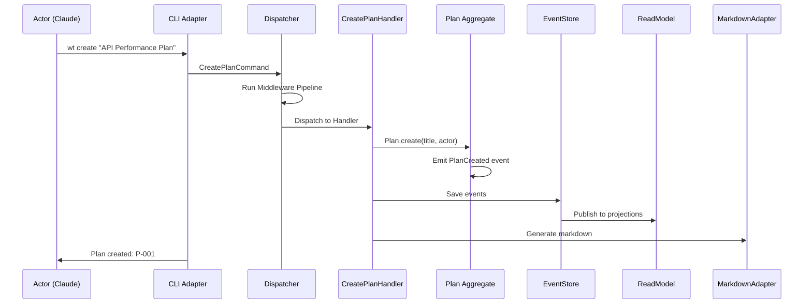

### 7.14 Detailed Use Case: Mark Task Complete (UC-T04)

**Actor:** Claude (Main), requires user consent per SOP-WT.2

**Preconditions:**
- Task exists and is in "In Progress" or "Pending" status
- Evidence attached (if required by settings)

**Main Flow:**
```
1. Actor: Request to mark task X.Y complete
2. System: Load Plan aggregate from event store
3. System: Validate task status transition is valid
4. System: Check evidence requirements
5. System: Check consent requirements
6. [If consent required] System: Request user consent
7. [User approves] System: Transition task status
8. System: Emit TaskStatusChanged event
9. System: Update phase progress
10. System: Persist events
11. System: Update projections
12. System: Return success
```

**Alternative Flows:**
- **3a.** Invalid transition → Return error with valid transitions
- **4a.** Evidence missing → Block completion, suggest attach evidence
- **6a.** Blanket approval active → Skip consent prompt
- **7a.** User denies → Return "completion pending approval"

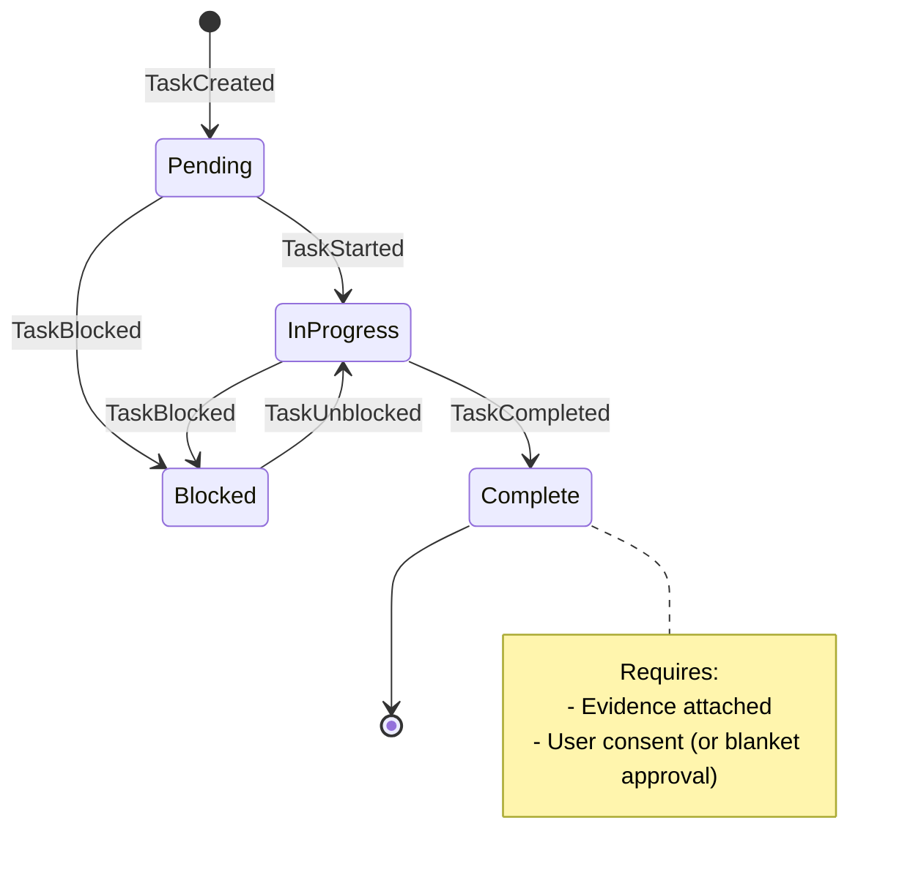

### 7.15 Detailed Use Case: Show Progress (UC-R01)

**Actor:** Any (read-only operation)

**Preconditions:**
- Plan exists

**Main Flow:**
```
1. Actor: Request progress for plan or initiative
2. System: Query read model (projection)
3. System: Calculate progress metrics
4. System: Format output per requested format
5. System: Return progress report
```

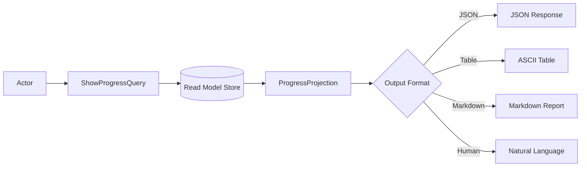

### 7.16 Detailed Use Case: Attach Evidence (UC-E01)

**Actor:** Claude (Main) or Claude (Sub-agent with WRITE permission)

**Preconditions:**
- Task exists
- Evidence type valid (command_output, file_reference, manual_note)

**Main Flow:**
```
1. Actor: Request to attach evidence to task X.Y
2. System: Validate evidence type
3. System: Create Evidence aggregate
4. System: Link evidence to task
5. System: Emit EvidenceCreated, EvidenceAttachedToTask events
6. System: Persist events
7. System: Return evidence ID
```

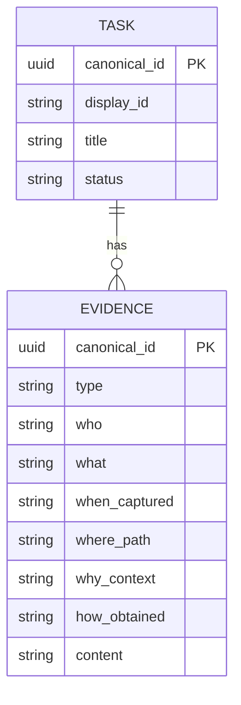

### 7.17 Detailed Use Case: Delegate to Sub-agent (UC-AG01)

**Actor:** Claude (Main)

**Preconditions:**
- Main agent has delegation permission
- Task suitable for delegation

**Main Flow:**
```
1. Main Agent: Spawn sub-agent via Task tool
2. System: Create sub-agent context with restricted permissions
3. Sub-agent: Receives work context
4. Sub-agent: Performs allowed operations (CREATE, READ, WRITE)
5. Sub-agent: Returns results to main agent
6. Main Agent: Reviews sub-agent work
7. Main Agent: Completes task (requires elevated permission)
```

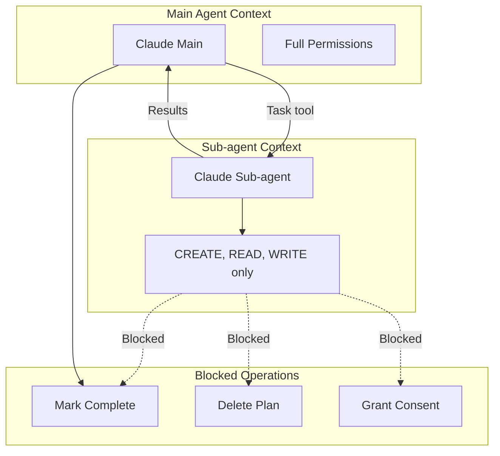

### 7.18 Detailed Use Case: Sync State Files (UC-SY01)

**Actor:** System or Claude (explicit sync)

**Preconditions:**
- JSON SSOT exists

**Main Flow:**
```
1. Trigger: State change or explicit sync command
2. System: Load current state from event store
3. System: Rebuild projections from event log
4. System: Generate full-fidelity markdown
5. System: Write to docs/plans/{id}.md
6. System: Emit SyncCompleted event
```

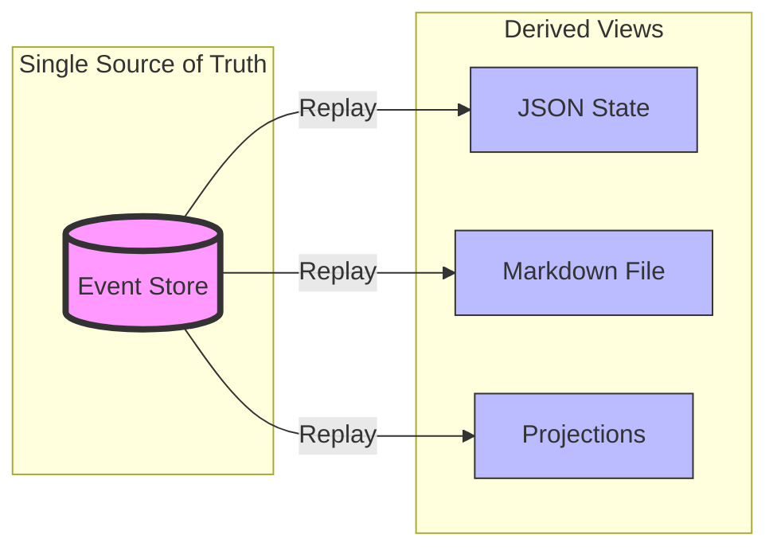

---

## 7.19 Full Cockburn-Style Use Case Specifications

> **Reference:** Alistair Cockburn, "Writing Effective Use Cases" (2000)
> **Source:** [cs.otago.ac.nz Use Case Template](https://www.cs.otago.ac.nz/coursework/cosc461/uctempla.htm)

The following use cases follow the complete Cockburn format with all required fields. These serve as exemplars for the remaining 100+ use cases.

### UC-P01: Create New Work Tracker Plan (Full Cockburn Format)

```
╔══════════════════════════════════════════════════════════════════════════════════════════╗
║                           USE CASE: UC-P01 Create Plan                                    ║
╠══════════════════════════════════════════════════════════════════════════════════════════╣
║                                                                                           ║
║  USE CASE:            Create Plan                                                         ║
║  ID:                  UC-P01                                                              ║
║  GOAL IN CONTEXT:     Claude or Human User creates a new work tracker plan to            ║
║                       organize and track phases, tasks, and subtasks for a project.      ║
║                                                                                           ║
║  SCOPE:               Work-Tracker Skill (System under design)                           ║
║  LEVEL:               User Goal (Primary Task) ⚫                                         ║
║                                                                                           ║
║  PRECONDITIONS:                                                                           ║
║  ───────────────                                                                          ║
║  1. Actor is authenticated (Claude main, Claude sub-agent, or Human)                     ║
║  2. Actor has CREATE permission on PLAN resource                                          ║
║  3. Tenant context is established (default or specified)                                  ║
║  4. [Optional] Initiative exists if linking plan to initiative                            ║
║                                                                                           ║
║  SUCCESS END CONDITION:                                                                   ║
║  ──────────────────────                                                                   ║
║  - Plan aggregate created with unique canonical_id and display_id                         ║
║  - PlanCreated domain event persisted to event store                                      ║
║  - Progress projection initialized at 0%                                                  ║
║  - Markdown view generated at docs/plans/{id}.md                                          ║
║  - JSON state persisted at .ecw/plans/{id}.json                                           ║
║                                                                                           ║
║  FAILED END CONDITION:                                                                    ║
║  ─────────────────────                                                                    ║
║  - No plan created                                                                        ║
║  - No events persisted                                                                    ║
║  - Error returned to actor with actionable message                                        ║
║  - System state unchanged (rollback on failure)                                           ║
║                                                                                           ║
║  PRIMARY ACTOR:       Claude (Main) | Claude (Sub-agent) | Human User                    ║
║  SUPPORTING ACTORS:   EventStore, FileSystem, ProjectionBuilder                          ║
║                                                                                           ║
║  TRIGGER:                                                                                 ║
║  ────────                                                                                 ║
║  - CLI command: `wt plan create "Title"`                                                  ║
║  - Natural language: "create a work tracker for API optimization"                         ║
║  - Slash command: `/track` (converts plan mode output to tracker)                        ║
║                                                                                           ║
╠══════════════════════════════════════════════════════════════════════════════════════════╣
║                              MAIN SUCCESS SCENARIO                                        ║
╠══════════════════════════════════════════════════════════════════════════════════════════╣
║                                                                                           ║
║  1. Actor submits CreatePlan request with title and optional description                  ║
║  2. System validates actor has CREATE permission on PLAN resource                         ║
║  3. System validates title meets constraints (1-200 chars, not empty)                     ║
║  4. System generates canonical_id (UUID v4) and display_id (P-{sequence})                ║
║  5. System creates Plan aggregate with:                                                   ║
║     - Identity: canonical_id, display_id, tenant_id, partition_key                        ║
║     - Metadata: title, description, version="1.0.0", fingerprint                          ║
║     - State: status=DRAFT, progress=0, enabled=true, archived=false                       ║
║     - Audit: created_at=now, created_by=actor                                             ║
║  6. Plan aggregate emits PlanCreated domain event                                         ║
║  7. System persists event to EventStore (append-only)                                     ║
║  8. EventBus publishes event to projection handlers                                       ║
║  9. ProgressProjection creates initial progress record (0%)                               ║
║  10. MarkdownAdapter generates docs/plans/{display_id}.md                                 ║
║  11. JsonAdapter persists state to .ecw/plans/{display_id}.json                           ║
║  12. System returns success response with plan display_id and URL                         ║
║                                                                                           ║
╠══════════════════════════════════════════════════════════════════════════════════════════╣
║                                    EXTENSIONS                                             ║
╠══════════════════════════════════════════════════════════════════════════════════════════╣
║                                                                                           ║
║  2a. Actor lacks CREATE permission:                                                       ║
║      2a1. System returns 403 Forbidden with required permission                           ║
║      2a2. Use case ends in failure                                                        ║
║                                                                                           ║
║  3a. Title validation fails (empty, too long, invalid characters):                        ║
║      3a1. System returns 400 Bad Request with validation errors                           ║
║      3a2. System suggests valid title format                                              ║
║      3a3. Use case ends in failure                                                        ║
║                                                                                           ║
║  4a. Display ID collision (extremely rare with sequence):                                 ║
║      4a1. System regenerates display_id with different sequence                           ║
║      4a2. Continue from step 5                                                            ║
║                                                                                           ║
║  7a. EventStore persistence fails:                                                        ║
║      7a1. System logs error with full context                                             ║
║      7a2. System returns 500 Internal Error                                               ║
║      7a3. No projections or files created (consistency maintained)                        ║
║      7a4. Use case ends in failure                                                        ║
║                                                                                           ║
║  9a. Projection handler fails (eventual consistency acceptable):                          ║
║      9a1. System logs warning                                                             ║
║      9a2. Continue to step 10 (projection will catch up on replay)                        ║
║                                                                                           ║
║  10a. Markdown generation fails:                                                          ║
║       10a1. System logs warning                                                           ║
║       10a2. Continue to step 11 (markdown can be regenerated)                             ║
║                                                                                           ║
║  *a. Actor includes phases/tasks in initial request:                                      ║
║      *a1. After step 6, system processes each phase:                                      ║
║           - Create Phase entity within Plan aggregate                                     ║
║           - Emit PhaseAdded event for each phase                                          ║
║           - For each task in phase, create Task and emit TaskAdded                        ║
║      *a2. Continue from step 7 with all events                                            ║
║                                                                                           ║
║  *b. Actor specifies initiative_ref to link plan:                                         ║
║      *b1. System validates initiative exists                                              ║
║      *b2. System sets initiative_ref in Plan                                              ║
║      *b3. System emits PlanLinkedToInitiative event                                       ║
║                                                                                           ║
╠══════════════════════════════════════════════════════════════════════════════════════════╣
║                                 SUB-VARIATIONS                                            ║
╠══════════════════════════════════════════════════════════════════════════════════════════╣
║                                                                                           ║
║  1a. Natural Language Input:                                                              ║
║      - Input: "create a work tracker for API optimization"                                ║
║      - NL Parser extracts: title="API optimization"                                       ║
║      - Proceeds as normal CreatePlan command                                              ║
║                                                                                           ║
║  1b. Structured CLI Input:                                                                ║
║      - Input: `wt plan create "API Performance" --initiative I-001`                       ║
║      - CLI parses flags and creates structured command                                    ║
║                                                                                           ║
║  1c. Slash Command Input:                                                                 ║
║      - Input: `/track` (in plan mode context)                                             ║
║      - System extracts plan content from plan mode file                                   ║
║      - Creates plan with phases/tasks from plan content                                   ║
║                                                                                           ║
╠══════════════════════════════════════════════════════════════════════════════════════════╣
║                              RELATED INFORMATION                                          ║
╠══════════════════════════════════════════════════════════════════════════════════════════╣
║                                                                                           ║
║  PRIORITY:            P0 (Core)                                                           ║
║  FREQUENCY:           Multiple times per day during active development                    ║
║  PERFORMANCE:         < 500ms for creation, < 2s including file generation                ║
║  CHANNEL:             CLI, Slash Command, Task Tool (sub-agent)                           ║
║                                                                                           ║
║  OPEN ISSUES:                                                                             ║
║  - Should we support plan templates for common project types?                             ║
║  - Should we auto-detect project type and suggest phases?                                 ║
║                                                                                           ║
║  SUPER USE CASE:      None (top-level)                                                    ║
║  SUB USE CASES:       UC-PH01 (AddPhase), UC-T01 (AddTask)                                ║
║                                                                                           ║
╚══════════════════════════════════════════════════════════════════════════════════════════╝
```

### UC-T04: Complete Task (Full Cockburn Format - Most Complex)

```
╔══════════════════════════════════════════════════════════════════════════════════════════╗
║                          USE CASE: UC-T04 Complete Task                                   ║
╠══════════════════════════════════════════════════════════════════════════════════════════╣
║                                                                                           ║
║  USE CASE:            Complete Task                                                       ║
║  ID:                  UC-T04                                                              ║
║  GOAL IN CONTEXT:     Claude marks a task as complete after all acceptance criteria      ║
║                       are met, evidence is attached, and user consent is granted.        ║
║                                                                                           ║
║  SCOPE:               Work-Tracker Skill (System under design)                           ║
║  LEVEL:               User Goal (Primary Task) ⚫                                         ║
║                                                                                           ║
║  PRECONDITIONS:                                                                           ║
║  ───────────────                                                                          ║
║  1. Task exists with status IN_PROGRESS or PENDING                                        ║
║  2. Actor is Claude (Main) - sub-agents CANNOT complete tasks                             ║
║  3. Plan containing task is not archived                                                  ║
║                                                                                           ║
║  SUCCESS END CONDITION:                                                                   ║
║  ──────────────────────                                                                   ║
║  - Task status changed to COMPLETE                                                        ║
║  - TaskStatusChanged event persisted with evidence reference                              ║
║  - Phase progress recalculated                                                            ║
║  - Plan progress recalculated                                                             ║
║  - Markdown view updated to show [x] completion                                           ║
║  - Consent decision logged if required                                                    ║
║                                                                                           ║
║  FAILED END CONDITION:                                                                    ║
║  ─────────────────────                                                                    ║
║  - Task status unchanged                                                                  ║
║  - No events persisted                                                                    ║
║  - Error returned indicating missing prerequisite:                                        ║
║    - Missing evidence (if required)                                                       ║
║    - Unchecked subtasks                                                                   ║
║    - Missing consent                                                                      ║
║    - Invalid state transition                                                             ║
║                                                                                           ║
║  PRIMARY ACTOR:       Claude (Main) ONLY                                                  ║
║  SUPPORTING ACTORS:   Human User (consent provider), ConsentState, EvidenceStore         ║
║                                                                                           ║
║  TRIGGER:                                                                                 ║
║  ────────                                                                                 ║
║  - CLI command: `wt task complete {plan_id} {task_id}`                                    ║
║  - Natural language: "mark task 5.3 complete"                                             ║
║  - After attaching evidence: automatic prompt to complete                                 ║
║                                                                                           ║
╠══════════════════════════════════════════════════════════════════════════════════════════╣
║                              MAIN SUCCESS SCENARIO                                        ║
╠══════════════════════════════════════════════════════════════════════════════════════════╣
║                                                                                           ║
║  1. Claude requests to complete task X.Y                                                  ║
║  2. System loads Plan aggregate from event store                                          ║
║  3. System locates Task by display_id within Plan                                         ║
║  4. System validates task status allows COMPLETE transition                               ║
║     (IN_PROGRESS or PENDING → COMPLETE is valid)                                          ║
║  5. System checks GUARD G1: All subtasks checked                                          ║
║     - Count subtasks where checked=false                                                  ║
║     - If count > 0, reject with list of unchecked subtasks                                ║
║  6. System checks GUARD G2: Evidence attached (if required)                               ║
║     - Load PlanSettings.require_evidence                                                  ║
║     - If true, verify task.evidence_refs is not empty                                     ║
║  7. System checks GUARD G3: User consent required (per SOP-WT.2)                          ║
║     - Load ConsentState for current session                                               ║
║     - Check if task.canonical_id in approved_items                                        ║
║  8. [Consent not granted] System prompts Human User for consent                           ║
║     - Display: "Evidence attached to task X.Y. Ready for your review."                    ║
║     - Wait for explicit "approved" or "yes" response                                      ║
║  9. Human User grants consent with "approved"                                             ║
║  10. System logs ConsentDecision (APPROVED, decided_by, decided_at)                       ║
║  11. Task.complete(actor) transitions status to COMPLETE                                  ║
║  12. Task emits TaskStatusChanged event with:                                             ║
║      - old_status: IN_PROGRESS                                                            ║
║      - new_status: COMPLETE                                                               ║
║      - evidence_refs: [list of attached evidence]                                         ║
║      - consent_ref: ConsentDecision.id                                                    ║
║  13. System persists event to EventStore                                                  ║
║  14. Phase.calculate_progress() updates phase completion percentage                       ║
║  15. Plan.calculate_progress() updates plan completion percentage                         ║
║  16. System updates projections and markdown                                              ║
║  17. System returns success with updated progress metrics                                 ║
║                                                                                           ║
╠══════════════════════════════════════════════════════════════════════════════════════════╣
║                                    EXTENSIONS                                             ║
╠══════════════════════════════════════════════════════════════════════════════════════════╣
║                                                                                           ║
║  2a. Plan not found:                                                                      ║
║      2a1. System returns 404 Not Found with plan_id                                       ║
║      2a2. Use case ends in failure                                                        ║
║                                                                                           ║
║  3a. Task not found in Plan:                                                              ║
║      3a1. System returns 404 Not Found with task display_id                               ║
║      3a2. System suggests nearby task IDs if typo suspected                               ║
║      3a3. Use case ends in failure                                                        ║
║                                                                                           ║
║  4a. Invalid status transition (BLOCKED → COMPLETE):                                      ║
║      4a1. System returns 400 Bad Request                                                  ║
║      4a2. System explains: "Task is BLOCKED. Unblock first."                              ║
║      4a3. Use case ends in failure                                                        ║
║                                                                                           ║
║  4b. Task already COMPLETE:                                                               ║
║      4b1. System returns 200 OK (idempotent)                                              ║
║      4b2. No new events emitted                                                           ║
║      4b3. Use case ends successfully (no-op)                                              ║
║                                                                                           ║
║  5a. Unchecked subtasks exist:                                                            ║
║      5a1. System returns 400 Bad Request                                                  ║
║      5a2. System lists unchecked subtasks by display_id                                   ║
║      5a3. System suggests: "Check subtasks or remove them first"                          ║
║      5a4. Use case ends in failure                                                        ║
║                                                                                           ║
║  6a. Evidence not attached (and required):                                                ║
║      6a1. System returns 400 Bad Request                                                  ║
║      6a2. System explains: "Evidence required. Use: wt evidence attach..."               ║
║      6a3. Use case ends in failure                                                        ║
║                                                                                           ║
║  7a. Blanket approval active (GUARD G4):                                                  ║
║      7a1. System checks ConsentState.blanket_approval = true                              ║
║      7a2. Skip steps 8-10 (no per-item consent needed)                                    ║
║      7a3. Continue from step 11                                                           ║
║                                                                                           ║
║  7b. Task already has per-item consent:                                                   ║
║      7b1. System finds task.canonical_id in approved_items                                ║
║      7b2. Skip steps 8-10                                                                 ║
║      7b3. Continue from step 11                                                           ║
║                                                                                           ║
║  9a. Human User denies consent:                                                           ║
║      9a1. User responds with "no", "denied", or "not yet"                                 ║
║      9a2. System logs ConsentDecision (DENIED)                                            ║
║      9a3. System returns "Completion pending user approval"                               ║
║      9a4. Use case ends in failure (reversible)                                           ║
║                                                                                           ║
║  9b. Human User requests changes:                                                         ║
║      9b1. User responds with feedback requiring changes                                   ║
║      9b2. System returns feedback to Claude                                               ║
║      9b3. Use case ends in failure (Claude addresses feedback)                            ║
║                                                                                           ║
║  *a. Sub-agent attempts completion:                                                       ║
║      *a1. System detects actor.is_subagent = true                                         ║
║      *a2. System returns 403 Forbidden                                                    ║
║      *a3. System explains: "Sub-agents cannot complete tasks"                             ║
║      *a4. Use case ends in failure                                                        ║
║                                                                                           ║
║  *b. All tasks in phase now complete:                                                     ║
║      *b1. After step 14, system detects phase.progress = 100%                             ║
║      *b2. System emits PhaseCompletionEligible notification                               ║
║      *b3. System suggests: "All tasks complete. Mark phase complete?"                     ║
║                                                                                           ║
╠══════════════════════════════════════════════════════════════════════════════════════════╣
║                                 SUB-VARIATIONS                                            ║
╠══════════════════════════════════════════════════════════════════════════════════════════╣
║                                                                                           ║
║  1a. Task has no subtasks:                                                                ║
║      - Guard G1 automatically passes (vacuously true)                                     ║
║                                                                                           ║
║  1b. Plan settings disable evidence requirement:                                          ║
║      - Guard G2 automatically passes                                                      ║
║      - Still recommended to attach evidence for auditability                              ║
║                                                                                           ║
║  1c. Completion with force flag (emergency use only):                                     ║
║      - Command: `wt task complete {id} --force --reason "Reason"`                         ║
║      - Bypasses G1, G2 (NOT G3 - consent still required)                                  ║
║      - Logs warning with reason                                                           ║
║      - Should trigger ADR capture for why guards were bypassed                            ║
║                                                                                           ║
╠══════════════════════════════════════════════════════════════════════════════════════════╣
║                              RELATED INFORMATION                                          ║
╠══════════════════════════════════════════════════════════════════════════════════════════╣
║                                                                                           ║
║  PRIORITY:            P0 (Core)                                                           ║
║  FREQUENCY:           Many times per day during active development                        ║
║  PERFORMANCE:         < 500ms for completion check, < 1s total                            ║
║  CHANNEL:             CLI, Natural Language, Task Tool (main agent only)                  ║
║                                                                                           ║
║  BUSINESS RULES:                                                                          ║
║  - BR-01: Sub-agents CANNOT mark tasks complete (permission model)                        ║
║  - BR-02: Evidence SHOULD be attached before requesting completion                        ║
║  - BR-03: User consent MUST be obtained unless blanket approval active                    ║
║  - BR-04: Completion is idempotent (safe to retry)                                        ║
║                                                                                           ║
║  RELATED SOPs:                                                                            ║
║  - SOP-WT.2: Consent Required Operations                                                  ║
║  - SOP-WT.5: Evidence Requirements                                                        ║
║  - SOP-IC: Initiative Consent                                                             ║
║                                                                                           ║
║  SUPER USE CASE:      UC-PH04 (CompletePhase)                                             ║
║  SUB USE CASES:       UC-E01 (AttachEvidence), UC-C01 (GrantItemConsent)                  ║
║                                                                                           ║
╚══════════════════════════════════════════════════════════════════════════════════════════╝
```

### UC-C02: Grant Blanket Consent (Full Cockburn Format)

```
╔══════════════════════════════════════════════════════════════════════════════════════════╗
║                       USE CASE: UC-C02 Grant Blanket Consent                              ║
╠══════════════════════════════════════════════════════════════════════════════════════════╣
║                                                                                           ║
║  USE CASE:            Grant Blanket Consent                                               ║
║  ID:                  UC-C02                                                              ║
║  GOAL IN CONTEXT:     Human User grants blanket approval for Claude to mark items        ║
║                       complete without per-item consent prompts for the session.         ║
║                                                                                           ║
║  SCOPE:               Work-Tracker Skill - Identity & Access Bounded Context             ║
║  LEVEL:               User Goal (Primary Task) ⚫                                         ║
║                                                                                           ║
║  PRECONDITIONS:                                                                           ║
║  ───────────────                                                                          ║
║  1. Actor is Human User (only humans can grant consent)                                   ║
║  2. Active Claude Code session exists                                                     ║
║  3. ConsentState aggregate exists or can be created for session                           ║
║                                                                                           ║
║  SUCCESS END CONDITION:                                                                   ║
║  ──────────────────────                                                                   ║
║  - ConsentState.blanket_approval = true                                                   ║
║  - ConsentState.granted_by = Human User actor                                             ║
║  - ConsentState.granted_at = current timestamp                                            ║
║  - BlanketConsentGranted event persisted                                                  ║
║  - Claude can now complete tasks without per-item prompts                                 ║
║                                                                                           ║
║  FAILED END CONDITION:                                                                    ║
║  ─────────────────────                                                                    ║
║  - ConsentState unchanged                                                                 ║
║  - Error returned (invalid actor, system error)                                           ║
║                                                                                           ║
║  PRIMARY ACTOR:       Human User ONLY                                                     ║
║  SUPPORTING ACTORS:   ConsentState aggregate, EventStore                                  ║
║                                                                                           ║
║  TRIGGER:                                                                                 ║
║  ────────                                                                                 ║
║  User speaks/types one of:                                                                ║
║  - "proceed without my consent"                                                           ║
║  - "complete as you see fit"                                                              ║
║  - "you have blanket approval"                                                            ║
║  - "auto-approve completions"                                                             ║
║  - "mark complete when done"                                                              ║
║  - `wt consent grant --blanket`                                                           ║
║                                                                                           ║
╠══════════════════════════════════════════════════════════════════════════════════════════╣
║                              MAIN SUCCESS SCENARIO                                        ║
╠══════════════════════════════════════════════════════════════════════════════════════════╣
║                                                                                           ║
║  1. Human User expresses blanket approval intent                                          ║
║  2. System recognizes blanket approval phrase from trigger list                           ║
║  3. System loads or creates ConsentState for current session                              ║
║  4. System validates actor is Human (not Claude or sub-agent)                             ║
║  5. ConsentState.grant_blanket(actor) executes:                                           ║
║     - Sets blanket_approval = true                                                        ║
║     - Sets granted_by = Human User actor                                                  ║
║     - Sets granted_at = current UTC timestamp                                             ║
║     - Sets mode = BLANKET                                                                 ║
║  6. ConsentState emits BlanketConsentGranted event                                        ║
║  7. System persists event to EventStore                                                   ║
║  8. System acknowledges: "Blanket approval granted. I can now complete items             ║
║     without asking for each one. Evidence will still be attached."                        ║
║  9. System updates .ecw/consent-state.json                                                ║
║                                                                                           ║
╠══════════════════════════════════════════════════════════════════════════════════════════╣
║                                    EXTENSIONS                                             ║
╠══════════════════════════════════════════════════════════════════════════════════════════╣
║                                                                                           ║
║  2a. Phrase not recognized as blanket approval:                                           ║
║      2a1. System interprets as regular conversation                                       ║
║      2a2. No consent state change                                                         ║
║      2a3. Use case does not execute                                                       ║
║                                                                                           ║
║  4a. Actor is Claude (attempting to grant own consent):                                   ║
║      4a1. System returns 403 Forbidden                                                    ║
║      4a2. System explains: "Only Human Users can grant consent"                           ║
║      4a3. Use case ends in failure                                                        ║
║                                                                                           ║
║  5a. Blanket approval already active:                                                     ║
║      5a1. System acknowledges: "Blanket approval already active since {time}"             ║
║      5a2. No new event emitted (idempotent)                                               ║
║      5a3. Use case ends successfully (no-op)                                              ║
║                                                                                           ║
║  *a. User specifies expiration:                                                           ║
║      *a1. User says "blanket approval for the next hour"                                  ║
║      *a2. System sets expires_at = now + 1 hour                                           ║
║      *a3. Approval auto-revokes when expires_at reached                                   ║
║                                                                                           ║
║  *b. User specifies scope limitation:                                                     ║
║      *b1. User says "blanket approval for this plan only"                                 ║
║      *b2. System sets scope = plan:{plan_id}                                              ║
║      *b3. Approval only applies to specified plan                                         ║
║                                                                                           ║
╠══════════════════════════════════════════════════════════════════════════════════════════╣
║                                 SUB-VARIATIONS                                            ║
╠══════════════════════════════════════════════════════════════════════════════════════════╣
║                                                                                           ║
║  1a. CLI explicit command:                                                                ║
║      - Input: `wt consent grant --blanket`                                                ║
║      - Structured command, no phrase recognition needed                                   ║
║                                                                                           ║
║  1b. Implicit during conversation:                                                        ║
║      - User: "just finish these tasks, I trust your judgment"                             ║
║      - System recognizes implicit blanket approval                                        ║
║                                                                                           ║
╠══════════════════════════════════════════════════════════════════════════════════════════╣
║                              RELATED INFORMATION                                          ║
╠══════════════════════════════════════════════════════════════════════════════════════════╣
║                                                                                           ║
║  PRIORITY:            P0 (Core - enables workflow efficiency)                             ║
║  FREQUENCY:           Once per session typically                                          ║
║  PERFORMANCE:         < 100ms                                                             ║
║  CHANNEL:             Natural Language (primary), CLI (secondary)                         ║
║                                                                                           ║
║  BUSINESS RULES:                                                                          ║
║  - BR-05: Only Human Users can grant consent (never Claude)                               ║
║  - BR-06: Blanket approval does NOT skip evidence requirements                            ║
║  - BR-07: Blanket approval is session-scoped by default                                   ║
║  - BR-08: Evidence quality expectations are HIGHER with blanket approval                  ║
║                                                                                           ║
║  REVOCATION:          UC-C03 (RevokeConsent)                                              ║
║  RELATED USE CASES:   UC-T04 (CompleteTask), UC-C01 (GrantItemConsent)                    ║
║                                                                                           ║
╚══════════════════════════════════════════════════════════════════════════════════════════╝
```

### UC-AG01: Delegate Work to Sub-agent (Full Cockburn Format)

```
╔══════════════════════════════════════════════════════════════════════════════════════════╗
║                       USE CASE: UC-AG01 Delegate to Sub-agent                             ║
╠══════════════════════════════════════════════════════════════════════════════════════════╣
║                                                                                           ║
║  USE CASE:            Delegate Work to Sub-agent                                          ║
║  ID:                  UC-AG01                                                             ║
║  GOAL IN CONTEXT:     Claude (Main) delegates a portion of work to a sub-agent via       ║
║                       the Task tool, with restricted permissions that prevent the        ║
║                       sub-agent from completing tasks or granting consent.               ║
║                                                                                           ║
║  SCOPE:               Work-Tracker Skill - Identity & Access Bounded Context             ║
║  LEVEL:               User Goal (Primary Task) ⚫                                         ║
║                                                                                           ║
║  PRECONDITIONS:                                                                           ║
║  ───────────────                                                                          ║
║  1. Claude (Main) has DELEGATE permission                                                 ║
║  2. Task exists and is suitable for delegation                                            ║
║  3. AgentContext.is_subagent = false (only main can delegate)                             ║
║                                                                                           ║
║  SUCCESS END CONDITION:                                                                   ║
║  ──────────────────────                                                                   ║
║  - Sub-agent spawned with restricted AgentContext                                         ║
║  - Sub-agent completes assigned work within permission bounds                             ║
║  - Results returned to main agent                                                         ║
║  - Main agent reviews and completes task (if appropriate)                                 ║
║  - AgentDelegation event recorded with sub-agent actions                                  ║
║                                                                                           ║
║  FAILED END CONDITION:                                                                    ║
║  ─────────────────────                                                                    ║
║  - Sub-agent encounters permission boundary                                               ║
║  - Sub-agent returns partial results with blocked operation noted                         ║
║  - Main agent must complete remaining work                                                ║
║                                                                                           ║
║  PRIMARY ACTOR:       Claude (Main)                                                       ║
║  SUPPORTING ACTORS:   Claude (Sub-agent), Task Tool, AgentContext                         ║
║                                                                                           ║
║  TRIGGER:                                                                                 ║
║  ────────                                                                                 ║
║  - Main agent uses Task tool with work-tracker context                                    ║
║  - Main agent assigns research or implementation subtask                                  ║
║                                                                                           ║
╠══════════════════════════════════════════════════════════════════════════════════════════╣
║                              MAIN SUCCESS SCENARIO                                        ║
╠══════════════════════════════════════════════════════════════════════════════════════════╣
║                                                                                           ║
║  1. Claude (Main) identifies subtask suitable for delegation                              ║
║  2. Main agent invokes Task tool with:                                                    ║
║     - Task description                                                                    ║
║     - Work tracker context (plan_id, task_id)                                             ║
║     - Expected deliverables                                                               ║
║  3. System creates sub-agent AgentContext with restricted permissions:                    ║
║     - permissions: [CREATE, READ, WRITE]                                                  ║
║     - excluded: [COMPLETE, DELETE, CONSENT]                                               ║
║     - parent_agent_id: main agent canonical_id                                            ║
║     - is_subagent: true                                                                   ║
║  4. Sub-agent receives work context and begins execution                                  ║
║  5. Sub-agent performs allowed operations:                                                ║
║     - READ: Load plans, tasks, existing code                                              ║
║     - WRITE: Create/modify files, add subtasks                                            ║
║     - CREATE: Add new tasks, evidence entries                                             ║
║  6. Sub-agent encounters natural completion point                                         ║
║  7. Sub-agent returns results to main agent:                                              ║
║     - Files created/modified                                                              ║
║     - Subtasks added                                                                      ║
║     - Evidence attached                                                                   ║
║     - Summary of work completed                                                           ║
║  8. Main agent reviews sub-agent work                                                     ║
║  9. Main agent marks task complete (using elevated permissions)                           ║
║  10. System records AgentDelegation event with full audit trail                           ║
║                                                                                           ║
╠══════════════════════════════════════════════════════════════════════════════════════════╣
║                                    EXTENSIONS                                             ║
╠══════════════════════════════════════════════════════════════════════════════════════════╣
║                                                                                           ║
║  3a. Sub-agent attempts blocked operation (COMPLETE):                                     ║
║      3a1. System intercepts complete_task command                                         ║
║      3a2. System returns 403 Forbidden to sub-agent                                       ║
║      3a3. Sub-agent notes: "Task completion requires main agent"                          ║
║      3a4. Sub-agent continues with allowed operations                                     ║
║      3a5. Sub-agent includes note in results for main agent                               ║
║                                                                                           ║
║  3b. Sub-agent attempts blocked operation (DELETE):                                       ║
║      3b1. System intercepts delete command                                                ║
║      3b2. System returns 403 Forbidden                                                    ║
║      3b3. Sub-agent suggests deletion to main agent instead                               ║
║                                                                                           ║
║  3c. Sub-agent attempts blocked operation (CONSENT):                                      ║
║      3c1. System intercepts consent command                                               ║
║      3c2. System returns 403 Forbidden                                                    ║
║      3c3. Sub-agent notes consent must come from Human User                               ║
║                                                                                           ║
║  5a. Sub-agent needs information from external system:                                    ║
║      5a1. Sub-agent uses allowed READ operations                                          ║
║      5a2. If external call blocked, sub-agent documents gap                               ║
║      5a3. Sub-agent returns partial results with noted gaps                               ║
║                                                                                           ║
║  8a. Main agent rejects sub-agent work:                                                   ║
║      8a1. Main agent provides feedback                                                    ║
║      8a2. Main agent may spawn new sub-agent or continue directly                         ║
║      8a3. Original sub-agent work may be partially used or discarded                      ║
║                                                                                           ║
║  *a. Sub-agent timeout:                                                                   ║
║      *a1. Task tool timeout reached                                                       ║
║      *a2. Sub-agent returns partial results                                               ║
║      *a3. Main agent decides whether to continue or retry                                 ║
║                                                                                           ║
╠══════════════════════════════════════════════════════════════════════════════════════════╣
║                                 SUB-VARIATIONS                                            ║
╠══════════════════════════════════════════════════════════════════════════════════════════╣
║                                                                                           ║
║  1a. Delegation for research only:                                                        ║
║      - Permissions: [READ] only                                                           ║
║      - Sub-agent cannot create or modify                                                  ║
║      - Returns information summary                                                        ║
║                                                                                           ║
║  1b. Delegation for implementation:                                                       ║
║      - Permissions: [CREATE, READ, WRITE]                                                 ║
║      - Sub-agent can create files, add subtasks                                           ║
║      - Cannot mark anything complete                                                      ║
║                                                                                           ║
║  1c. Delegation with elevated trust (future):                                             ║
║      - If sub-agent has established track record                                          ║
║      - Permissions could include COMPLETE for subtasks only                               ║
║      - Requires explicit Human User opt-in                                                ║
║                                                                                           ║
╠══════════════════════════════════════════════════════════════════════════════════════════╣
║                              RELATED INFORMATION                                          ║
╠══════════════════════════════════════════════════════════════════════════════════════════╣
║                                                                                           ║
║  PRIORITY:            P1 (Enhanced - enables parallel work)                               ║
║  FREQUENCY:           Multiple times per complex task                                     ║
║  PERFORMANCE:         Varies by delegated work complexity                                 ║
║  CHANNEL:             Task Tool (programmatic)                                            ║
║                                                                                           ║
║  BUSINESS RULES:                                                                          ║
║  - BR-09: Sub-agents inherit tenant context from main agent                               ║
║  - BR-10: Sub-agents CANNOT escalate their own permissions                                ║
║  - BR-11: All sub-agent actions are attributed to main agent for audit                    ║
║  - BR-12: Sub-agent work counts toward main agent's task progress                         ║
║                                                                                           ║
║  PERMISSION MODEL:                                                                        ║
║  ┌────────────────┬─────────────┬─────────────┐                                          ║
║  │ Operation      │ Main Agent  │ Sub-agent   │                                          ║
║  ├────────────────┼─────────────┼─────────────┤                                          ║
║  │ CREATE         │ ✓           │ ✓           │                                          ║
║  │ READ           │ ✓           │ ✓           │                                          ║
║  │ WRITE          │ ✓           │ ✓           │                                          ║
║  │ COMPLETE       │ ✓           │ ✗ BLOCKED   │                                          ║
║  │ DELETE         │ ✓           │ ✗ BLOCKED   │                                          ║
║  │ CONSENT        │ ✗ (Human)   │ ✗ BLOCKED   │                                          ║
║  │ DELEGATE       │ ✓           │ ✗ BLOCKED   │                                          ║
║  └────────────────┴─────────────┴─────────────┘                                          ║
║                                                                                           ║
║  RELATED USE CASES:   UC-T04 (CompleteTask), UC-T03 (StartTask)                           ║
║                                                                                           ║
╚══════════════════════════════════════════════════════════════════════════════════════════╝
```

### UC-E01: Attach Command Evidence (Full Cockburn Format)

```
╔══════════════════════════════════════════════════════════════════════════════════════════╗
║                       USE CASE: UC-E01 Attach Command Evidence                            ║
╠══════════════════════════════════════════════════════════════════════════════════════════╣
║                                                                                           ║
║  USE CASE:            Attach Command Evidence                                             ║
║  ID:                  UC-E01                                                              ║
║  GOAL IN CONTEXT:     Claude attaches shell command output as evidence of task           ║
║                       completion, capturing the full 5W1H audit trail.                   ║
║                                                                                           ║
║  SCOPE:               Work-Tracker Skill - Evidence Bounded Context                      ║
║  LEVEL:               Subfunction (supports UC-T04 CompleteTask) ◇                        ║
║                                                                                           ║
║  PRECONDITIONS:                                                                           ║
║  ───────────────                                                                          ║
║  1. Task exists                                                                           ║
║  2. Actor has WRITE permission on Evidence resource                                       ║
║  3. Command was executed (either just now or previously)                                  ║
║                                                                                           ║
║  SUCCESS END CONDITION:                                                                   ║
║  ──────────────────────                                                                   ║
║  - Evidence aggregate created with 5W1H data                                              ║
║  - Evidence linked to task via evidence_refs                                              ║
║  - EvidenceCreated and EvidenceAttachedToTask events persisted                            ║
║  - Evidence visible in task detail and markdown                                           ║
║                                                                                           ║
║  FAILED END CONDITION:                                                                    ║
║  ─────────────────────                                                                    ║
║  - No evidence created                                                                    ║
║  - Error returned with reason (task not found, invalid content)                           ║
║                                                                                           ║
║  PRIMARY ACTOR:       Claude (Main) | Claude (Sub-agent)                                  ║
║  SUPPORTING ACTORS:   EvidenceStore, Task aggregate                                       ║
║                                                                                           ║
║  TRIGGER:                                                                                 ║
║  ────────                                                                                 ║
║  - CLI: `wt evidence attach {plan_id} {task_id} --type command_output --content "..."`   ║
║  - NL: "attach evidence to task 5.3: command_output pytest tests/"                        ║
║  - After running command: automatic prompt to attach as evidence                          ║
║                                                                                           ║
╠══════════════════════════════════════════════════════════════════════════════════════════╣
║                              MAIN SUCCESS SCENARIO                                        ║
╠══════════════════════════════════════════════════════════════════════════════════════════╣
║                                                                                           ║
║  1. Claude executes verification command (e.g., pytest, dotnet test)                      ║
║  2. Claude requests to attach command output as evidence                                  ║
║  3. System validates task exists in plan                                                  ║
║  4. System creates Evidence aggregate with 5W1H model:                                    ║
║     - WHO: Claude (actor who captured)                                                    ║
║     - WHAT: Command output text (stdout + stderr)                                         ║
║     - WHEN: Timestamp of command execution                                                ║
║     - WHERE: Working directory path                                                       ║
║     - WHY: "Verification of task completion"                                              ║
║     - HOW: Shell command execution                                                        ║
║  5. System populates command-specific fields:                                             ║
║     - command: The executed command string                                                ║
║     - output: Full stdout/stderr                                                          ║
║     - exit_code: Command exit code (0 = success)                                          ║
║  6. Evidence.create() generates canonical_id and display_id                               ║
║  7. System emits EvidenceCreated event                                                    ║
║  8. System links evidence to task (adds to task.evidence_refs)                            ║
║  9. System emits EvidenceAttachedToTask event                                             ║
║  10. System persists all events                                                           ║
║  11. System updates markdown to show evidence attached                                    ║
║  12. System returns evidence ID and confirmation                                          ║
║                                                                                           ║
╠══════════════════════════════════════════════════════════════════════════════════════════╣
║                                    EXTENSIONS                                             ║
╠══════════════════════════════════════════════════════════════════════════════════════════╣
║                                                                                           ║
║  3a. Task not found:                                                                      ║
║      3a1. System returns 404 Not Found                                                    ║
║      3a2. Use case ends in failure                                                        ║
║                                                                                           ║
║  4a. Command output too large (> 100KB):                                                  ║
║      4a1. System truncates to first/last 50KB with "[...truncated...]"                    ║
║      4a2. System stores full output to file reference                                     ║
║      4a3. Continue with truncated evidence + file reference                               ║
║                                                                                           ║
║  5a. Exit code indicates failure (non-zero):                                              ║
║      5a1. System marks evidence.verified = false                                          ║
║      5a2. System adds warning: "Command exited with non-zero status"                      ║
║      5a3. Evidence still attached (failure evidence is valid)                             ║
║                                                                                           ║
║  *a. Multiple commands for same task:                                                     ║
║      *a1. System allows multiple evidence attachments                                     ║
║      *a2. Each gets unique evidence_id                                                    ║
║      *a3. All visible in task evidence list                                               ║
║                                                                                           ║
╠══════════════════════════════════════════════════════════════════════════════════════════╣
║                                 SUB-VARIATIONS                                            ║
╠══════════════════════════════════════════════════════════════════════════════════════════╣
║                                                                                           ║
║  1a. Evidence from previous command (not just executed):                                  ║
║      - Claude can reference output from earlier in session                                ║
║      - timestamp reflects original execution time                                         ║
║                                                                                           ║
║  1b. Evidence from file (test output file):                                               ║
║      - Claude reads test output from file                                                 ║
║      - Attaches as command_output type with file reference                                ║
║                                                                                           ║
╠══════════════════════════════════════════════════════════════════════════════════════════╣
║                              RELATED INFORMATION                                          ║
╠══════════════════════════════════════════════════════════════════════════════════════════╣
║                                                                                           ║
║  PRIORITY:            P0 (Core - required for task completion)                            ║
║  FREQUENCY:           Every task completion                                               ║
║  PERFORMANCE:         < 200ms for attachment                                              ║
║  CHANNEL:             CLI, Natural Language                                               ║
║                                                                                           ║
║  5W1H EVIDENCE MODEL:                                                                     ║
║  ┌─────────────────────────────────────────────────────────────────┐                     ║
║  │  WHO:   Claude (Main), session-123                              │                     ║
║  │  WHAT:  "pytest tests/ -v" → "42 passed, 0 failed"              │                     ║
║  │  WHEN:  2026-01-07T14:32:00Z                                    │                     ║
║  │  WHERE: /workspace/project/                                     │                     ║
║  │  WHY:   Verification of task 5.3 acceptance criteria            │                     ║
║  │  HOW:   Bash tool execution, exit code 0                        │                     ║
║  └─────────────────────────────────────────────────────────────────┘                     ║
║                                                                                           ║
║  SUPER USE CASE:      UC-T04 (CompleteTask)                                               ║
║  RELATED USE CASES:   UC-E02 (AttachFileEvidence), UC-E03 (AttachManualEvidence)          ║
║                                                                                           ║
╚══════════════════════════════════════════════════════════════════════════════════════════╝
```

---

## 8. Domain Model (Class Diagrams)

### 8.1 Work Management Bounded Context

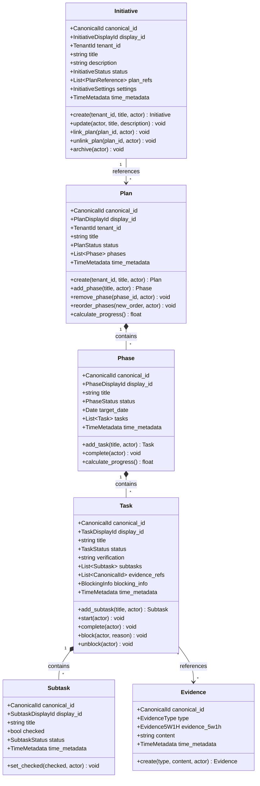

### 8.2 Knowledge Capture Bounded Context

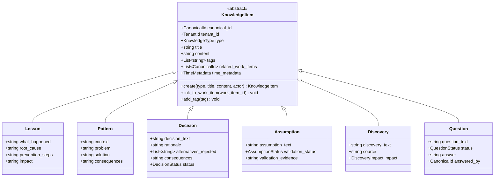

### 8.3 Identity & Access Bounded Context

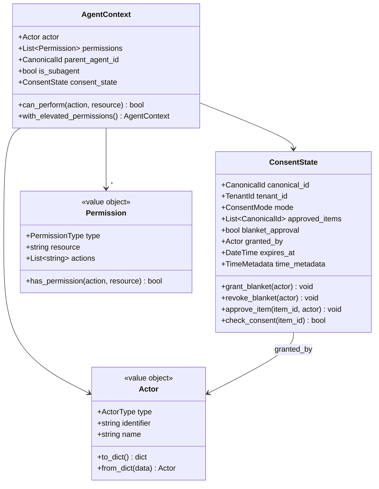

---

## 9. Architectural Diagrams (ASCII & Mermaid)

### 9.1 Bounded Contexts & Context Map

```
+----------------------------+     +----------------------------+
|    WORK MANAGEMENT         |     |    KNOWLEDGE CAPTURE       |
|    BOUNDED CONTEXT         |     |    BOUNDED CONTEXT         |
|                            |     |                            |
| - Initiative (Aggregate)   |     | - Lesson                   |
| - Plan (Aggregate)         |<--->| - Pattern                  |
|   - Phase (Entity)         |     | - Decision (ADR)           |
|   - Task (Entity)          |     | - Assumption               |
|   - Subtask (Entity)       |     | - Discovery                |
| - Evidence (Aggregate)     |     | - Question                 |
+----------------------------+     +----------------------------+
           |                                    |
           v                                    v
+----------------------------+     +----------------------------+
|    IDENTITY & ACCESS       |     |    REPORTING               |
|    BOUNDED CONTEXT         |     |    BOUNDED CONTEXT         |
|                            |     |                            |
| - Tenant                   |     | - ProgressProjection       |
| - Actor (Claude/Human)     |     | - BurndownView             |
| - ConsentState (Aggregate) |     | - SearchIndex              |
| - Permission               |     | - TimelineView             |
+----------------------------+     +----------------------------+
```

### 9.2 Middleware Pipeline (Command Path)

```
┌──────────────────────────────────────────────────────────────────────────────┐
│                        COMMAND MIDDLEWARE PIPELINE                            │
├──────────────────────────────────────────────────────────────────────────────┤
│                                                                               │
│  CLI Input                                                                    │
│      │                                                                        │
│      ▼                                                                        │
│  ┌─────────────────────────────────────────────────────────────────────┐     │
│  │  1. LOGGING MIDDLEWARE                                               │     │
│  │     - Log command entry: type, actor, timestamp                      │     │
│  │     - Log command exit: result, duration, errors                     │     │
│  └──────────────────────────────────┬──────────────────────────────────┘     │
│                                     │                                         │
│                                     ▼                                         │
│  ┌─────────────────────────────────────────────────────────────────────┐     │
│  │  2. AUTH/CONSENT MIDDLEWARE                                          │     │
│  │     - Validate actor permissions for operation                       │     │
│  │     - Check consent state (per-item or blanket)                      │     │
│  │     - Block if consent required and not granted                      │     │
│  │     EXIT: 403 Forbidden if unauthorized                              │     │
│  └──────────────────────────────────┬──────────────────────────────────┘     │
│                                     │                                         │
│                                     ▼                                         │
│  ┌─────────────────────────────────────────────────────────────────────┐     │
│  │  3. VALIDATION MIDDLEWARE                                            │     │
│  │     - Validate command structure (required fields)                   │     │
│  │     - Validate business rules (value ranges, formats)                │     │
│  │     - Validate references (IDs exist)                                │     │
│  │     EXIT: 400 Bad Request if invalid                                 │     │
│  └──────────────────────────────────┬──────────────────────────────────┘     │
│                                     │                                         │
│                                     ▼                                         │
│  ┌─────────────────────────────────────────────────────────────────────┐     │
│  │  4. IDEMPOTENCY MIDDLEWARE                                           │     │
│  │     - Check if command_id already processed                          │     │
│  │     - Return cached result if duplicate                              │     │
│  │     - Store command_id after successful processing                   │     │
│  │     EXIT: 200 OK (cached) if duplicate                               │     │
│  └──────────────────────────────────┬──────────────────────────────────┘     │
│                                     │                                         │
│                                     ▼                                         │
│  ┌─────────────────────────────────────────────────────────────────────┐     │
│  │  5. TRANSACTION MIDDLEWARE                                           │     │
│  │     - Begin transaction (optimistic locking)                         │     │
│  │     - Execute handler                                                │     │
│  │     - Commit on success, rollback on failure                         │     │
│  │     EXIT: 409 Conflict if concurrent modification                    │     │
│  └──────────────────────────────────┬──────────────────────────────────┘     │
│                                     │                                         │
│                                     ▼                                         │
│  ┌─────────────────────────────────────────────────────────────────────┐     │
│  │  COMMAND HANDLER                                                     │     │
│  │     - Load aggregate from event store                                │     │
│  │     - Execute domain operation                                       │     │
│  │     - Collect pending domain events                                  │     │
│  │     - Persist events to event store                                  │     │
│  └──────────────────────────────────┬──────────────────────────────────┘     │
│                                     │                                         │
│                                     ▼                                         │
│  ┌─────────────────────────────────────────────────────────────────────┐     │
│  │  6. EVENT PUBLISHER MIDDLEWARE                                       │     │
│  │     - Publish domain events to event bus                             │     │
│  │     - Trigger projection handlers                                    │     │
│  │     - Trigger side-effect handlers (markdown sync, etc.)             │     │
│  └──────────────────────────────────┬──────────────────────────────────┘     │
│                                     │                                         │
│                                     ▼                                         │
│  ┌─────────────────────────────────────────────────────────────────────┐     │
│  │  7. METRICS MIDDLEWARE                                               │     │
│  │     - Record command latency                                         │     │
│  │     - Increment command counter                                      │     │
│  │     - Track error rates                                              │     │
│  └──────────────────────────────────┬──────────────────────────────────┘     │
│                                     │                                         │
│                                     ▼                                         │
│  Response to CLI                                                              │
│                                                                               │
└──────────────────────────────────────────────────────────────────────────────┘
```

### 9.3 Event Sourcing Architecture

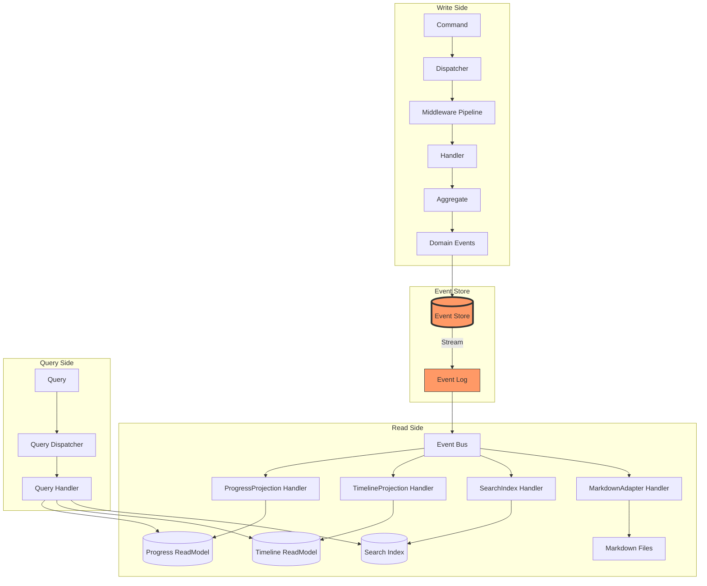

### 9.4 CQRS Separation Diagram

```
┌─────────────────────────────────────────────────────────────────────────────┐
│                           CQRS ARCHITECTURE                                  │
├─────────────────────────────────────────────────────────────────────────────┤
│                                                                              │
│   ┌─────────────────────────────┐     ┌─────────────────────────────┐      │
│   │      COMMAND SIDE           │     │       QUERY SIDE            │      │
│   │      (Write Model)          │     │       (Read Model)          │      │
│   ├─────────────────────────────┤     ├─────────────────────────────┤      │
│   │                             │     │                             │      │
│   │  CLI: "mark task 5.3 done"  │     │  CLI: "show progress"       │      │
│   │           │                 │     │           │                 │      │
│   │           ▼                 │     │           ▼                 │      │
│   │  ┌─────────────────┐        │     │  ┌─────────────────┐        │      │
│   │  │ CommandDispatcher│        │     │  │ QueryDispatcher │        │      │
│   │  └────────┬────────┘        │     │  └────────┬────────┘        │      │
│   │           │                 │     │           │                 │      │
│   │           ▼                 │     │           ▼                 │      │
│   │  ┌─────────────────┐        │     │  ┌─────────────────┐        │      │
│   │  │ Middleware       │        │     │  │ QueryHandler    │        │      │
│   │  │ - Auth           │        │     │  │ (NO middleware) │        │      │
│   │  │ - Validation     │        │     │  └────────┬────────┘        │      │
│   │  │ - Transaction    │        │     │           │                 │      │
│   │  └────────┬────────┘        │     │           ▼                 │      │
│   │           │                 │     │  ┌─────────────────┐        │      │
│   │           ▼                 │     │  │ ReadModelStore  │        │      │
│   │  ┌─────────────────┐        │     │  │ (Projections)   │        │      │
│   │  │ CommandHandler  │        │     │  └────────┬────────┘        │      │
│   │  └────────┬────────┘        │     │           │                 │      │
│   │           │                 │     │           ▼                 │      │
│   │           ▼                 │     │  ┌─────────────────┐        │      │
│   │  ┌─────────────────┐        │     │  │ DTO Response    │        │      │
│   │  │ Aggregate       │        │     │  └─────────────────┘        │      │
│   │  │ (Domain Logic)  │        │     │                             │      │
│   │  └────────┬────────┘        │     └─────────────────────────────┘      │
│   │           │                 │                   ▲                       │
│   │           ▼                 │                   │                       │
│   │  ┌─────────────────┐        │     ┌─────────────┴─────────────┐        │
│   │  │ Domain Events   │────────┼────►│ Projection Handlers       │        │
│   │  └────────┬────────┘        │     │ (Update Read Models)      │        │
│   │           │                 │     └───────────────────────────┘        │
│   │           ▼                 │                                          │
│   │  ┌─────────────────┐        │                                          │
│   │  │ EventStore      │        │                                          │
│   │  │ (Append-Only)   │        │                                          │
│   │  └─────────────────┘        │                                          │
│   │                             │                                          │
│   └─────────────────────────────┘                                          │
│                                                                              │
└─────────────────────────────────────────────────────────────────────────────┘
```

### 9.5 Hexagonal Architecture Layers

```
┌──────────────────────────────────────────────────────────────────────────────────┐
│                            HEXAGONAL ARCHITECTURE                                 │
├──────────────────────────────────────────────────────────────────────────────────┤
│                                                                                   │
│   ┌───────────────────────────────────────────────────────────────────────────┐  │
│   │                        INTERFACE LAYER                                     │  │
│   │                     (Primary Adapters - DRIVES)                            │  │
│   │                                                                            │  │
│   │   ┌──────────────┐  ┌──────────────┐  ┌──────────────┐  ┌─────────────┐  │  │
│   │   │  CLI (wt.py) │  │ Slash Cmds   │  │ REST API     │  │ Sub-agents  │  │  │
│   │   │  (/track)    │  │ (/complete)  │  │ (optional)   │  │ (Task tool) │  │  │
│   │   └──────┬───────┘  └──────┬───────┘  └──────┬───────┘  └──────┬──────┘  │  │
│   │          │                 │                 │                  │         │  │
│   └──────────┼─────────────────┼─────────────────┼──────────────────┼─────────┘  │
│              │                 │                 │                  │            │
│              └─────────────────┴────────┬────────┴──────────────────┘            │
│                                         │                                         │
│                                    PRIMARY PORTS                                  │
│                            ┌────────────┴────────────┐                           │
│                            │  IPublicFacade          │                           │
│                            │  IAdminFacade           │                           │
│                            └────────────┬────────────┘                           │
│                                         │                                         │
│   ┌─────────────────────────────────────┼─────────────────────────────────────┐  │
│   │                        APPLICATION LAYER                                   │  │
│   │                      (Orchestration & Coordination)                        │  │
│   │                                     │                                      │  │
│   │   ┌──────────────┐   ┌──────────────┴──────────────┐   ┌──────────────┐   │  │
│   │   │   Commands   │   │        DISPATCHER           │   │   Queries    │   │  │
│   │   │   Handlers   │◄──┤  + Middleware Pipeline      ├──►│   Handlers   │   │  │
│   │   └──────┬───────┘   └─────────────────────────────┘   └──────┬───────┘   │  │
│   │          │                                                    │           │  │
│   └──────────┼────────────────────────────────────────────────────┼───────────┘  │
│              │                                                    │              │
│              │           ┌─────────────────────────────┐          │              │
│              └──────────►│       DOMAIN LAYER          │◄─────────┘              │
│                          │      (Business Logic)       │                         │
│                          │                             │                         │
│                          │  ┌─────────┐ ┌─────────┐   │                         │
│                          │  │Aggregate│ │ Domain  │   │                         │
│                          │  │  Roots  │ │ Events  │   │                         │
│                          │  └─────────┘ └─────────┘   │                         │
│                          │                             │                         │
│                          │   SECONDARY PORTS           │                         │
│                          │  ┌──────────────────────┐   │                         │
│                          │  │ IEventStore          │   │                         │
│                          │  │ IPlanRepository      │   │                         │
│                          │  │ IReadModelStore      │   │                         │
│                          │  │ IEventBus            │   │                         │
│                          │  └──────────┬───────────┘   │                         │
│                          └─────────────┼───────────────┘                         │
│                                        │                                         │
│              ┌─────────────────────────┼─────────────────────────┐               │
│              │                         │                         │               │
│   ┌──────────┼─────────────────────────┼─────────────────────────┼────────────┐  │
│   │          │  INFRASTRUCTURE LAYER   │  (Secondary Adapters)   │            │  │
│   │          │                         │                         │            │  │
│   │   ┌──────┴──────┐   ┌──────────────┴──────────────┐   ┌─────┴─────┐     │  │
│   │   │ FileEvent   │   │ JsonRepository              │   │ Markdown  │     │  │
│   │   │ Store       │   │ Adapter                     │   │ Adapter   │     │  │
│   │   └─────────────┘   └─────────────────────────────┘   └───────────┘     │  │
│   │                                                                          │  │
│   └──────────────────────────────────────────────────────────────────────────┘  │
│                                                                                   │
└──────────────────────────────────────────────────────────────────────────────────┘
```

### 9.6 CLI Command Flow (Activity Diagram)

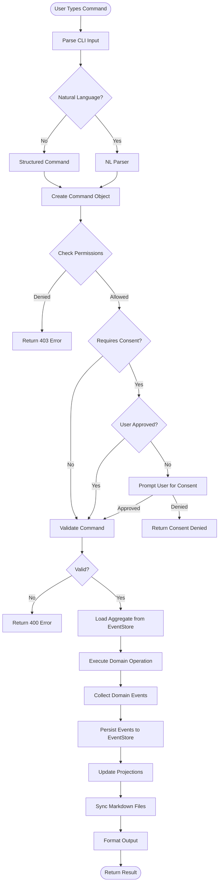

### 9.7 Event Flow (Domain Events)

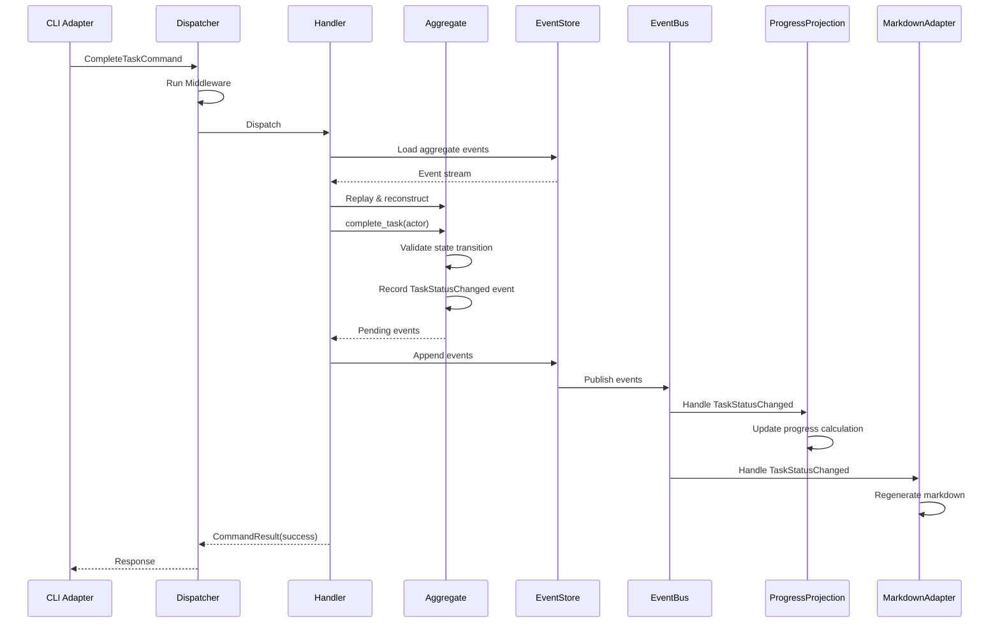

---

## 10. Command & Query Catalog

### 10.1 Commands (Write Operations)

| Command | Description | Requires Consent | Sub-agent Allowed |
|---------|-------------|------------------|-------------------|
| `CreateInitiative` | Create new initiative | YES (SOP-IC) | NO |
| `UpdateInitiative` | Update initiative title/description | NO | NO |
| `ArchiveInitiative` | Archive (soft delete) initiative | YES | NO |
| `CreatePlan` | Create new work tracker | NO | YES |
| `UpdatePlan` | Update plan title/description | NO | YES |
| `AddPhase` | Add phase to plan | NO | YES |
| `UpdatePhase` | Update phase details | NO | YES |
| `RemovePhase` | Remove phase from plan | NO | YES |
| `ReorderPhases` | Change phase order | NO | YES |
| `AddTask` | Add task to phase | NO | YES |
| `UpdateTask` | Update task details | NO | YES |
| `StartTask` | Mark task as In Progress | NO | YES |
| `CompleteTask` | Mark task as Complete | YES (SOP-WT.2) | NO |
| `BlockTask` | Mark task as Blocked | NO | YES |
| `UnblockTask` | Remove task block | NO | YES |
| `RemoveTask` | Remove task from phase | NO | YES |
| `AddSubtask` | Add subtask to task | NO | YES |
| `CheckSubtask` | Check/uncheck subtask | NO | YES |
| `RemoveSubtask` | Remove subtask | NO | YES |
| `AttachEvidence` | Attach evidence to task | NO | YES |
| `CreateKnowledge` | Create lesson/pattern/decision | NO | YES |
| `LinkKnowledge` | Link knowledge to work item | NO | YES |
| `GrantBlanketConsent` | Grant blanket approval | N/A | NO |
| `RevokeConsent` | Revoke blanket approval | N/A | NO |

### 10.2 Queries (Read Operations)

| Query | Description | Returns |
|-------|-------------|---------|
| `GetPlan` | Get plan by ID | PlanDTO |
| `ListPlans` | List plans for tenant | List[PlanSummaryDTO] |
| `GetPhase` | Get phase details | PhaseDTO |
| `GetTask` | Get task details | TaskDTO |
| `ShowProgress` | Calculate progress | ProgressDTO |
| `GetTimeline` | Get activity timeline | TimelineDTO |
| `SearchWork` | Search across work items | SearchResultDTO |
| `GetInitiative` | Get initiative by ID | InitiativeDTO |
| `ListInitiatives` | List initiatives | List[InitiativeSummaryDTO] |
| `GetEvidence` | Get evidence by ID | EvidenceDTO |
| `GetConsentState` | Get current consent state | ConsentStateDTO |
| `GetKnowledge` | Get knowledge item | KnowledgeItemDTO |
| `SearchKnowledge` | Search knowledge base | List[KnowledgeItemDTO] |

---

## 11. CLI Command Reference

### 11.1 Structured Commands

```bash
# Initiative Management
wt initiative create "Title"
wt initiative list
wt initiative show <id>
wt initiative archive <id>

# Plan Management
wt plan create "Title" [--initiative <id>]
wt plan list [--initiative <id>]
wt plan show <id>
wt plan sync <id>

# Phase Management
wt phase add <plan-id> "Title"
wt phase update <plan-id> <phase-num> --title "New Title"
wt phase reorder <plan-id> <from> <to>
wt phase remove <plan-id> <phase-num>

# Task Management
wt task add <plan-id> <phase-num> "Title"
wt task start <plan-id> <task-id>
wt task complete <plan-id> <task-id>
wt task block <plan-id> <task-id> --reason "Reason"
wt task unblock <plan-id> <task-id>
wt task update <plan-id> <task-id> --title "New Title"
wt task remove <plan-id> <task-id>

# Subtask Management
wt subtask add <plan-id> <task-id> "Title"
wt subtask check <plan-id> <subtask-id>
wt subtask uncheck <plan-id> <subtask-id>
wt subtask remove <plan-id> <subtask-id>

# Evidence Management
wt evidence attach <plan-id> <task-id> --type command_output --content "output"
wt evidence attach <plan-id> <task-id> --type file_reference --path "/path/to/file"
wt evidence list <plan-id> <task-id>
wt evidence show <evidence-id>

# Progress & Reporting
wt progress <plan-id> [--format json|table|markdown|human]
wt timeline <plan-id> [--since "2 days ago"]
wt search "query" [--scope plan|initiative|all]

# Consent Management
wt consent grant [--blanket]
wt consent revoke
wt consent status
```

### 11.2 Natural Language Commands

The CLI supports natural language input that maps to structured commands:

| Natural Language | Mapped Command |
|------------------|----------------|
| "mark task 5.3 complete" | `wt task complete <plan-id> 5.3` |
| "add subtask to task 5.1: Write tests" | `wt subtask add <plan-id> 5.1 "Write tests"` |
| "show progress" | `wt progress <plan-id>` |
| "check subtask 5.1.2" | `wt subtask check <plan-id> 5.1.2` |
| "block task 3.2 because waiting for API" | `wt task block <plan-id> 3.2 --reason "waiting for API"` |
| "attach evidence: pytest passed" | `wt evidence attach <plan-id> <current-task> --type command_output --content "pytest passed"` |

---

## 12. Implementation Phases

### Phase 1: Foundation & Domain Model (Week 1-2)
**Goal:** Establish domain core with zero external dependencies

| Task | Deliverable | Verification |
|------|-------------|--------------|
| 1.1 Create directory structure | `src/ecw/work_tracker/domain/` | Directory exists |
| 1.2 Implement value objects | `identifiers.py`, `status.py`, `actor.py` | Unit tests pass |
| 1.3 Implement AggregateRoot base | `aggregates/base.py` | Unit tests pass |
| 1.4 Implement Initiative aggregate | `aggregates/initiative.py` | Unit tests pass |
| 1.5 Implement Plan aggregate | `aggregates/plan.py` with Phase, Task, Subtask | Unit tests pass |
| 1.6 Implement Evidence aggregate | `aggregates/evidence.py` | Unit tests pass |
| 1.7 Define domain events | `events/*.py` (CloudEvents 1.0) | Schema validation |
| 1.8 Define secondary ports | `ports/repositories.py`, `ports/event_store.py` | Interface definition |

### Phase 2: Application Layer (Week 2-3)
**Goal:** Implement CQRS handlers and middleware pipeline

| Task | Deliverable | Verification |
|------|-------------|--------------|
| 2.1 Implement Dispatcher | `application/dispatcher.py` | Unit tests pass |
| 2.2 Implement middleware pipeline | `application/middleware/*.py` | Unit tests pass |
| 2.3 Implement command handlers | `application/handlers/commands/*.py` | Unit tests pass |
| 2.4 Implement query handlers | `application/handlers/queries/*.py` | Unit tests pass |
| 2.5 Define DTOs | `application/dtos/*.py` | Schema validation |
| 2.6 Define primary ports | `application/ports/primary/*.py` | Interface definition |

### Phase 3: Infrastructure Layer (Week 3-4)
**Goal:** Implement persistence adapters

| Task | Deliverable | Verification |
|------|-------------|--------------|
| 3.1 Implement FileEventStore | `infrastructure/persistence/file_event_store.py` | Integration tests |
| 3.2 Implement JsonRepository | `infrastructure/persistence/json_repository.py` | Integration tests |
| 3.3 Implement MarkdownAdapter | `infrastructure/persistence/markdown_adapter.py` | Integration tests |
| 3.4 Implement projection handlers | `infrastructure/projections/*.py` | Integration tests |
| 3.5 Implement InMemoryEventBus | `infrastructure/messaging/event_bus.py` | Integration tests |

### Phase 4: Interface Layer (Week 4-5)
**Goal:** Implement CLI and slash commands

| Task | Deliverable | Verification |
|------|-------------|--------------|
| 4.1 Implement CLI main entry | `cli/main.py` | E2E tests pass |
| 4.2 Implement subcommand groups | `cli/commands/*.py` | E2E tests pass |
| 4.3 Implement NL parser | `cli/nl/parser.py` | Unit tests pass |
| 4.4 Implement output formatters | `cli/output/*.py` | Unit tests pass |
| 4.5 Implement sub-agent context | `cli/agent/context.py` | Unit tests pass |
| 4.6 Implement slash commands | `/track`, `/progress`, `/complete` | E2E tests pass |

### Phase 5: Integration & Testing (Week 5-6)
**Goal:** Comprehensive testing and refinement

| Task | Deliverable | Verification |
|------|-------------|--------------|
| 5.1 BDD feature tests | `tests/features/*.feature` | All scenarios pass |
| 5.2 Integration tests | `tests/integration/` | All tests pass |
| 5.3 E2E CLI tests | `tests/e2e/` | All tests pass |
| 5.4 Architectural tests | `tests/architectural/` | No dependency violations |
| 5.5 Performance testing | Benchmark suite | Within acceptable limits |

### Phase 6: Migration & Documentation (Week 6)
**Goal:** v2.x compatibility and documentation

| Task | Deliverable | Verification |
|------|-------------|--------------|
| 6.1 Migration tool | `tools/migrate_v2_to_v3.py` | Existing data migrated |
| 6.2 Update SKILL.md | Complete skill documentation | Doc review |
| 6.3 Update CLAUDE.md | Updated SOPs | Doc review |
| 6.4 Create ADRs | `docs/adrs/` | All decisions documented |

---

## 13. File Structure (Target State)

```
src/ecw/work_tracker/
├── __init__.py
├── domain/
│   ├── __init__.py
│   ├── aggregates/
│   │   ├── __init__.py
│   │   ├── base.py                 # AggregateRoot base class
│   │   ├── initiative.py           # Initiative aggregate
│   │   ├── plan.py                 # Plan aggregate (Phase, Task, Subtask)
│   │   ├── evidence.py             # Evidence aggregate
│   │   ├── knowledge_item.py       # KnowledgeItem aggregate
│   │   └── consent_state.py        # ConsentState aggregate
│   ├── entities/
│   │   ├── __init__.py
│   │   ├── phase.py
│   │   ├── task.py
│   │   └── subtask.py
│   ├── value_objects/
│   │   ├── __init__.py
│   │   ├── identifiers.py          # CanonicalId, DisplayIds
│   │   ├── status.py               # Status enums with state machines
│   │   ├── actor.py                # Actor value object
│   │   ├── evidence_5w1h.py        # 5W1H evidence model
│   │   └── time_metadata.py        # TimeMetadata
│   ├── events/
│   │   ├── __init__.py
│   │   ├── base.py                 # DomainEvent base (CloudEvents 1.0)
│   │   ├── initiative_events.py
│   │   ├── plan_events.py
│   │   ├── evidence_events.py
│   │   └── consent_events.py
│   ├── services/
│   │   ├── __init__.py
│   │   ├── progress_calculation.py
│   │   └── evidence_requirement.py
│   └── ports/
│       ├── __init__.py
│       ├── repositories.py         # IRepository interfaces
│       ├── event_store.py          # IEventStore interface
│       └── event_bus.py            # IEventBus interface
├── application/
│   ├── __init__.py
│   ├── dispatcher.py               # Command/Query dispatcher
│   ├── middleware/
│   │   ├── __init__.py
│   │   ├── logging.py
│   │   ├── auth_consent.py
│   │   ├── validation.py
│   │   ├── idempotency.py
│   │   ├── transaction.py
│   │   ├── event_publisher.py
│   │   └── metrics.py
│   ├── handlers/
│   │   ├── __init__.py
│   │   ├── commands/
│   │   │   ├── __init__.py
│   │   │   ├── initiative_handlers.py
│   │   │   ├── plan_handlers.py
│   │   │   ├── task_handlers.py
│   │   │   └── evidence_handlers.py
│   │   └── queries/
│   │       ├── __init__.py
│   │       ├── plan_queries.py
│   │       └── progress_queries.py
│   ├── dtos/
│   │   ├── __init__.py
│   │   ├── plan_dto.py
│   │   ├── progress_dto.py
│   │   └── evidence_dto.py
│   └── ports/
│       ├── __init__.py
│       └── primary/
│           ├── public_facade.py
│           └── admin_facade.py
├── infrastructure/
│   ├── __init__.py
│   ├── persistence/
│   │   ├── __init__.py
│   │   ├── file_event_store.py
│   │   ├── json_repository.py
│   │   └── markdown_adapter.py
│   ├── projections/
│   │   ├── __init__.py
│   │   ├── progress_projection.py
│   │   └── timeline_projection.py
│   └── messaging/
│       ├── __init__.py
│       └── event_bus.py
└── cli/
    ├── __init__.py
    ├── main.py                     # CLI entry point
    ├── commands/
    │   ├── __init__.py
    │   ├── initiative.py
    │   ├── plan.py
    │   ├── task.py
    │   ├── subtask.py
    │   ├── evidence.py
    │   └── consent.py
    ├── nl/
    │   ├── __init__.py
    │   └── parser.py               # Natural language parser
    ├── agent/
    │   ├── __init__.py
    │   └── context.py              # Sub-agent context
    └── output/
        ├── __init__.py
        ├── json_formatter.py
        ├── table_formatter.py
        ├── markdown_formatter.py
        └── human_formatter.py
```

---

## 14. Key Architecture Decisions (ADRs)

### ADR-001: Ground-Up Rewrite vs Evolution
- **Decision:** Ground-up rewrite
- **Rationale:** v2.x has 128+ failing tests, mixed architectures, and incomplete event sourcing
- **Consequences:** Breaking changes accepted; migration tool required

### ADR-002: Four Bounded Contexts
- **Decision:** Work Management, Knowledge Capture, Identity & Access, Reporting
- **Rationale:** Clear boundaries enable independent evolution and testing
- **Consequences:** Cross-context communication via domain events only

### ADR-003: Event Sourcing as Primary Storage
- **Decision:** All state changes persisted as immutable CloudEvents 1.0
- **Rationale:** Complete audit trail, time-travel debugging, projection flexibility
- **Consequences:** Event schema versioning required from day 1

### ADR-004: CQRS with Separate Dispatchers
- **Decision:** Completely separate command and query paths
- **Rationale:** Commands need auth/consent/transactions; queries are read-only
- **Consequences:** Eventual consistency between write and read models

### ADR-005: Middleware Pipeline Pattern
- **Decision:** Cross-cutting concerns via composable middleware chain
- **Rationale:** Single responsibility, testability, configurability
- **Consequences:** Pipeline configuration complexity

### ADR-006: Sub-agent Permissions Model
- **Decision:** Role-based permissions with restricted sub-agent context
- **Rationale:** SOP-IC compliance, safe delegation, no unauthorized completions
- **Consequences:** Permission checking adds latency

### ADR-007: Dual-mode CLI (Structured + NL)
- **Decision:** Support both structured commands and natural language
- **Rationale:** Claude agents prefer NL; humans prefer structured
- **Consequences:** NL parser must be robust and testable

---

## 15. Success Criteria

| Criterion | Target | Measurement |
|-----------|--------|-------------|
| Test Pass Rate | 100% | `pytest` all green |
| Domain Test Coverage | > 95% | Coverage report |
| Dependency Violations | 0 | Architectural tests |
| Event Sourcing Active | All state changes | Event log inspection |
| CQRS Separation | Complete | Query handlers have no side effects |
| CLI Parity | All v2.x commands | Feature comparison matrix |
| Documentation | Complete | SKILL.md, CLAUDE.md, ADRs |
| Migration | v2.x data preserved | Migration test suite |

---

## 16. Risk Mitigation

| Risk | Impact | Probability | Mitigation |
|------|--------|-------------|------------|
| Scope creep | High | Medium | Strict phase gates, defer non-essential features |
| Event schema changes | Medium | High | Version events from day 1; plan migrations |
| Breaking changes | Medium | Certain | Document all changes; provide migration guide |
| Test coverage gaps | High | Low | BDD-first approach; no untested code |
| Context limit during implementation | Medium | Medium | Frequent checkpoints; detailed handoffs |
| NL parser brittleness | Medium | Medium | Comprehensive test suite; fallback to structured |

---

## 17. Next Steps

**Immediate Actions (after user approval):**
1. Create Initiative 2 work tracker via wt.py
2. Begin Phase 1: Foundation & Domain Model
3. Set up new `src/ecw/work_tracker/` directory structure
4. Create initial value objects with unit tests

**User Approval Required:**
- Confirm Initiative 2 creation: "Work-Tracker v3.0 Ground-Up Rewrite"
- Confirm directory structure: `src/ecw/work_tracker/`
- Confirm breaking changes acceptable

---

## APPENDIX A: Azure DevOps Entity Schema Reference

> **Source:** Microsoft Learn - Azure DevOps REST API Documentation (2025)
> **API Version:** 7.2
> **Reference:** [learn.microsoft.com/en-us/rest/api/azure/devops/wit/](https://learn.microsoft.com/en-us/rest/api/azure/devops/wit/)

### A.1 ADO Work Item Entity Model

```
╔════════════════════════════════════════════════════════════════════════════════════════════╗
║                        AZURE DEVOPS WORK ITEM ENTITY MODEL                                  ║
╠════════════════════════════════════════════════════════════════════════════════════════════╣
║                                                                                             ║
║  ┌───────────────────────────────────────────────────────────────────────────────────────┐ ║
║  │                              WORK ITEM (Core Entity)                                   │ ║
║  ├───────────────────────────────────────────────────────────────────────────────────────┤ ║
║  │                                                                                       │ ║
║  │  IDENTITY FIELDS (Read-Only):                                                         │ ║
║  │  ─────────────────────────────                                                        │ ║
║  │  • System.Id (integer)                    Unique work item identifier                 │ ║
║  │  • System.Rev (integer)                   Revision number (increments on change)      │ ║
║  │  • System.Watermark (integer)             Global watermark for sync                   │ ║
║  │                                                                                       │ ║
║  │  CLASSIFICATION FIELDS:                                                               │ ║
║  │  ──────────────────────                                                               │ ║
║  │  • System.WorkItemType (string)           Bug, Task, User Story, Epic, Feature        │ ║
║  │  • System.AreaPath (treePath)             Hierarchical area classification            │ ║
║  │  • System.IterationPath (treePath)        Sprint/iteration assignment                 │ ║
║  │  • System.TeamProject (string)            Project name (read-only)                    │ ║
║  │                                                                                       │ ║
║  │  CORE FIELDS:                                                                         │ ║
║  │  ────────────                                                                         │ ║
║  │  • System.Title (string, 1-255)           Required, displayed in lists                │ ║
║  │  • System.Description (html)              Rich text description                       │ ║
║  │  • System.State (string)                  State machine controlled                    │ ║
║  │  • System.Reason (string)                 Reason for last state change                │ ║
║  │  • System.Tags (string)                   Semicolon-separated tags                    │ ║
║  │                                                                                       │ ║
║  │  ASSIGNMENT FIELDS:                                                                   │ ║
║  │  ──────────────────                                                                   │ ║
║  │  • System.AssignedTo (identity)           Identity reference object                   │ ║
║  │    {                                                                                  │ ║
║  │      "displayName": "User Name",                                                      │ ║
║  │      "url": "https://...",                                                            │ ║
║  │      "id": "GUID",                                                                    │ ║
║  │      "uniqueName": "user@domain.com",                                                 │ ║
║  │      "imageUrl": "https://..."                                                        │ ║
║  │    }                                                                                  │ ║
║  │                                                                                       │ ║
║  │  AUDIT FIELDS (Read-Only):                                                            │ ║
║  │  ─────────────────────────                                                            │ ║
║  │  • System.CreatedDate (dateTime)          UTC timestamp of creation                   │ ║
║  │  • System.CreatedBy (identity)            Identity who created                        │ ║
║  │  • System.ChangedDate (dateTime)          UTC timestamp of last change                │ ║
║  │  • System.ChangedBy (identity)            Identity who last changed                   │ ║
║  │  • System.AuthorizedDate (dateTime)       Authorization timestamp                     │ ║
║  │  • System.RevisedDate (dateTime)          Revision timestamp                          │ ║
║  │                                                                                       │ ║
║  │  SCHEDULING FIELDS (Microsoft.VSTS.Scheduling.*):                                     │ ║
║  │  ────────────────────────────────────────────────                                     │ ║
║  │  • StartDate (dateTime)                   Planned start                               │ ║
║  │  • FinishDate (dateTime)                  Planned finish                              │ ║
║  │  • TargetDate (dateTime)                  Target completion                           │ ║
║  │  • OriginalEstimate (double)              Hours estimated                             │ ║
║  │  • RemainingWork (double)                 Hours remaining                             │ ║
║  │  • CompletedWork (double)                 Hours completed                             │ ║
║  │                                                                                       │ ║
║  │  COMMON FIELDS (Microsoft.VSTS.Common.*):                                             │ ║
║  │  ────────────────────────────────────────                                             │ ║
║  │  • Priority (integer, 1-4)                1=Critical, 2=High, 3=Medium, 4=Low         │ ║
║  │  • Severity (string)                      "1 - Critical" to "4 - Low"                 │ ║
║  │  • ValueArea (string)                     "Business" or "Architectural"               │ ║
║  │  • Risk (string)                          "1 - High", "2 - Medium", "3 - Low"         │ ║
║  │  • StackRank (double)                     Backlog ordering                            │ ║
║  │  • StateChangeDate (dateTime)             When state last changed                     │ ║
║  │  • ActivatedDate (dateTime)               When activated                              │ ║
║  │  • ActivatedBy (identity)                 Who activated                               │ ║
║  │  • ResolvedDate (dateTime)                When resolved                               │ ║
║  │  • ResolvedBy (identity)                  Who resolved                                │ ║
║  │  • ClosedDate (dateTime)                  When closed                                 │ ║
║  │  • ClosedBy (identity)                    Who closed                                  │ ║
║  │                                                                                       │ ║
║  └───────────────────────────────────────────────────────────────────────────────────────┘ ║
║                                                                                             ║
╚════════════════════════════════════════════════════════════════════════════════════════════╝
```

### A.2 ADO Field Data Types

| Type | Description | Example | WT Mapping |
|------|-------------|---------|------------|
| `integer` | 32-bit signed integer | `System.Id = 12345` | `int` |
| `string` | Unicode text (max 255 for single-line) | `System.Title = "Fix bug"` | `str` |
| `html` | Rich text with HTML formatting | `System.Description` | `str` |
| `plainText` | Plain text (no formatting) | Comments | `str` |
| `dateTime` | ISO 8601 UTC timestamp | `2026-01-07T14:30:00Z` | `datetime` |
| `treePath` | Hierarchical path | `Project\Area\SubArea` | `str` |
| `identity` | User identity object | `{ displayName, id, uniqueName }` | `Actor` |
| `double` | 64-bit floating point | `RemainingWork = 4.5` | `float` |
| `boolean` | True/False | Custom fields | `bool` |
| `guid` | 128-bit GUID | Internal references | `UUID` |
| `picklistString` | Constrained string from list | `State = "Active"` | `Enum` |

### A.3 ADO Work Item Type Hierarchy (Agile Process)

```
┌─────────────────────────────────────────────────────────────────────────────────────────┐
│                         ADO WORK ITEM TYPE HIERARCHY (Agile)                             │
├─────────────────────────────────────────────────────────────────────────────────────────┤
│                                                                                          │
│  PORTFOLIO BACKLOG:                                                                      │
│  ──────────────────                                                                      │
│                                                                                          │
│    ┌────────────────────────────────────────────────────────────────────────────┐       │
│    │                              EPIC                                           │       │
│    │  Purpose: Large business initiative spanning multiple releases              │       │
│    │  States: New → Active → Resolved → Closed                                   │       │
│    │  Fields: Title, Description, Priority, Risk, ValueArea, Tags               │       │
│    └───────────────────────────────────┬────────────────────────────────────────┘       │
│                                        │ Parent-Child                                    │
│                                        ▼                                                 │
│    ┌────────────────────────────────────────────────────────────────────────────┐       │
│    │                            FEATURE                                          │       │
│    │  Purpose: Shippable functionality, subset of Epic                           │       │
│    │  States: New → Active → Resolved → Closed                                   │       │
│    │  Fields: + TargetDate, StartDate, Priority                                  │       │
│    └───────────────────────────────────┬────────────────────────────────────────┘       │
│                                        │ Parent-Child                                    │
│                                        ▼                                                 │
│  REQUIREMENTS BACKLOG:                                                                   │
│  ─────────────────────                                                                   │
│                                                                                          │
│    ┌────────────────────────────────────────────────────────────────────────────┐       │
│    │                          USER STORY                                         │       │
│    │  Purpose: User-centric requirement, testable functionality                  │       │
│    │  States: New → Active → Resolved → Closed                                   │       │
│    │  Fields: + AcceptanceCriteria, StoryPoints                                  │       │
│    └───────────────────────────────────┬────────────────────────────────────────┘       │
│                                        │ Parent-Child                                    │
│                                        ▼                                                 │
│  TASK BACKLOG:                                                                           │
│  ─────────────                                                                           │
│                                                                                          │
│    ┌────────────────────────────────────────────────────────────────────────────┐       │
│    │                             TASK                                            │       │
│    │  Purpose: Work to complete a User Story                                     │       │
│    │  States: New → Active → Closed                                              │       │
│    │  Fields: + OriginalEstimate, RemainingWork, CompletedWork, Activity         │       │
│    └────────────────────────────────────────────────────────────────────────────┘       │
│                                                                                          │
│  DEFECT TRACKING:                                                                        │
│  ────────────────                                                                        │
│                                                                                          │
│    ┌────────────────────────────────────────────────────────────────────────────┐       │
│    │                              BUG                                            │       │
│    │  Purpose: Defect requiring fix                                              │       │
│    │  States: New → Active → Resolved → Closed                                   │       │
│    │  Fields: + ReproSteps, SystemInfo, FoundIn, IntegratedIn, Severity         │       │
│    └────────────────────────────────────────────────────────────────────────────┘       │
│                                                                                          │
└─────────────────────────────────────────────────────────────────────────────────────────┘
```

### A.4 ADO Link Types

```
╔════════════════════════════════════════════════════════════════════════════════════════════╗
║                              ADO WORK ITEM LINK TYPES                                       ║
╠════════════════════════════════════════════════════════════════════════════════════════════╣
║                                                                                             ║
║  HIERARCHICAL LINKS (Work Item → Work Item):                                                ║
║  ───────────────────────────────────────────                                                ║
║  │ Reference Name                      │ Forward Name    │ Reverse Name     │              ║
║  ├─────────────────────────────────────┼─────────────────┼──────────────────┤              ║
║  │ System.LinkTypes.Hierarchy-Forward  │ Parent          │ Child            │              ║
║  │ System.LinkTypes.Hierarchy-Reverse  │ Child           │ Parent           │              ║
║                                                                                             ║
║  DEPENDENCY LINKS (Work Item → Work Item):                                                  ║
║  ─────────────────────────────────────────                                                  ║
║  │ System.LinkTypes.Dependency-Forward │ Successor       │ Predecessor      │              ║
║  │ System.LinkTypes.Dependency-Reverse │ Predecessor     │ Successor        │              ║
║                                                                                             ║
║  RELATED LINKS (Work Item → Work Item):                                                     ║
║  ──────────────────────────────────────                                                     ║
║  │ System.LinkTypes.Related            │ Related         │ Related          │              ║
║  │ Microsoft.VSTS.Common.Affects       │ Affects         │ Affected By      │              ║
║  │ Microsoft.VSTS.TestCase.SharedSteps │ Test Case       │ Shared Steps     │              ║
║                                                                                             ║
║  REMOTE LINKS (Cross-Organization):                                                         ║
║  ──────────────────────────────────                                                         ║
║  │ System.LinkTypes.Remote.Related     │ Remote Related  │ Remote Related   │              ║
║  │ System.LinkTypes.Remote.Dependency  │ Consumes From   │ Produced For     │              ║
║                                                                                             ║
║  ARTIFACT LINKS (Work Item → External):                                                     ║
║  ──────────────────────────────────────                                                     ║
║  │ ArtifactLink                        │ Links to commits, PRs, builds, releases          ║
║  │ Hyperlink                           │ External URL reference                           ║
║  │ AttachedFile                        │ File attachment                                  ║
║                                                                                             ║
║  LINK STRUCTURE:                                                                            ║
║  ───────────────                                                                            ║
║  {                                                                                          ║
║    "rel": "System.LinkTypes.Hierarchy-Forward",                                             ║
║    "url": "https://dev.azure.com/{org}/_apis/wit/workItems/{id}",                          ║
║    "attributes": {                                                                          ║
║      "isLocked": false,                                                                     ║
║      "comment": "Parent user story",                                                        ║
║      "name": "Parent"                                                                       ║
║    }                                                                                        ║
║  }                                                                                          ║
║                                                                                             ║
╚════════════════════════════════════════════════════════════════════════════════════════════╝
```

### A.5 ADO REST API Operations

```
╔════════════════════════════════════════════════════════════════════════════════════════════╗
║                            ADO WORK ITEM REST API OPERATIONS                                ║
╠════════════════════════════════════════════════════════════════════════════════════════════╣
║                                                                                             ║
║  CREATE WORK ITEM:                                                                          ║
║  ─────────────────                                                                          ║
║  POST https://dev.azure.com/{org}/{project}/_apis/wit/workitems/${type}?api-version=7.2    ║
║  Content-Type: application/json-patch+json                                                  ║
║                                                                                             ║
║  Request Body (JSON Patch Document):                                                        ║
║  [                                                                                          ║
║    { "op": "add", "path": "/fields/System.Title", "value": "New Task" },                   ║
║    { "op": "add", "path": "/fields/System.Description", "value": "<html>...</html>" },     ║
║    { "op": "add", "path": "/fields/System.AssignedTo", "value": "user@domain.com" },       ║
║    { "op": "add", "path": "/fields/Microsoft.VSTS.Common.Priority", "value": 2 },          ║
║    { "op": "add", "path": "/fields/System.Tags", "value": "tag1; tag2" }                   ║
║  ]                                                                                          ║
║                                                                                             ║
║  UPDATE WORK ITEM:                                                                          ║
║  ─────────────────                                                                          ║
║  PATCH https://dev.azure.com/{org}/{project}/_apis/wit/workitems/{id}?api-version=7.2      ║
║  Content-Type: application/json-patch+json                                                  ║
║                                                                                             ║
║  Request Body:                                                                              ║
║  [                                                                                          ║
║    { "op": "replace", "path": "/fields/System.State", "value": "Active" },                 ║
║    { "op": "add", "path": "/fields/System.History", "value": "Updated status" }            ║
║  ]                                                                                          ║
║                                                                                             ║
║  ADD LINK:                                                                                  ║
║  ─────────                                                                                  ║
║  [                                                                                          ║
║    {                                                                                        ║
║      "op": "add",                                                                           ║
║      "path": "/relations/-",                                                                ║
║      "value": {                                                                             ║
║        "rel": "System.LinkTypes.Hierarchy-Forward",                                         ║
║        "url": "https://dev.azure.com/{org}/_apis/wit/workItems/{parentId}",                ║
║        "attributes": { "comment": "Parent task" }                                           ║
║      }                                                                                      ║
║    }                                                                                        ║
║  ]                                                                                          ║
║                                                                                             ║
║  GET WORK ITEM:                                                                             ║
║  ──────────────                                                                             ║
║  GET https://dev.azure.com/{org}/{project}/_apis/wit/workitems/{id}?api-version=7.2        ║
║      &$expand=relations,fields                                                              ║
║                                                                                             ║
║  QUERY (WIQL):                                                                              ║
║  ─────────────                                                                              ║
║  POST https://dev.azure.com/{org}/{project}/_apis/wit/wiql?api-version=7.2                 ║
║  { "query": "SELECT [System.Id] FROM WorkItems WHERE [System.State] = 'Active'" }          ║
║                                                                                             ║
╚════════════════════════════════════════════════════════════════════════════════════════════╝
```

---

## APPENDIX B: Gap Analysis Matrix

### B.1 Work-Tracker ↔ ADO Entity Mapping Gap Analysis

```
╔══════════════════════════════════════════════════════════════════════════════════════════════════════════════════╗
║                                    GAP ANALYSIS: DOMAIN ENTITIES VS ADO                                           ║
╠══════════════════════════════════════════════════════════════════════════════════════════════════════════════════╣
║                                                                                                                   ║
║  LEGEND:  ✓ = Direct mapping exists    ⚠ = Partial mapping (transformation needed)    ✗ = No ADO equivalent      ║
║           ★ = Extension field required in our domain    ◆ = Custom ADO field required                            ║
║                                                                                                                   ║
╠══════════════════════════════════════════════════════════════════════════════════════════════════════════════════╣
║                                                                                                                   ║
║  INITIATIVE ENTITY → ADO EPIC                                                                                     ║
║  ────────────────────────────                                                                                     ║
║  ┌──────────────────────────┬─────────────────────────────┬────────┬─────────────────────────────────────────┐  ║
║  │ Work-Tracker Field       │ ADO Field                   │ Status │ Gap / Action Required                   │  ║
║  ├──────────────────────────┼─────────────────────────────┼────────┼─────────────────────────────────────────┤  ║
║  │ canonical_id             │ (none)                      │ ◆      │ Create Custom.CanonicalId (GUID)        │  ║
║  │ display_id               │ (none)                      │ ◆      │ Create Custom.DisplayId (string)        │  ║
║  │ tenant_id                │ System.TeamProject          │ ⚠      │ Map tenant to project; multi-tenant?    │  ║
║  │ title                    │ System.Title                │ ✓      │ Direct mapping                          │  ║
║  │ description              │ System.Description          │ ✓      │ HTML conversion may be needed           │  ║
║  │ status                   │ System.State                │ ⚠      │ State machine mapping required          │  ║
║  │ plan_refs[]              │ Relations (Child links)     │ ⚠      │ Map to Feature children                 │  ║
║  │ created_at               │ System.CreatedDate          │ ✓      │ Read-only from ADO                      │  ║
║  │ created_by               │ System.CreatedBy            │ ⚠      │ Identity object transformation          │  ║
║  │ modified_at              │ System.ChangedDate          │ ✓      │ Read-only from ADO                      │  ║
║  │ modified_by              │ System.ChangedBy            │ ⚠      │ Identity object transformation          │  ║
║  │ archived                 │ (none)                      │ ◆★     │ Custom.Archived (boolean) or use Tags   │  ║
║  │ fingerprint              │ (none)                      │ ★      │ WT-only field, no ADO sync needed       │  ║
║  │ version                  │ System.Rev                  │ ⚠      │ ADO uses revision, WT uses SemVer       │  ║
║  │ settings                 │ (none)                      │ ★      │ WT-only, store in Custom field or skip  │  ║
║  └──────────────────────────┴─────────────────────────────┴────────┴─────────────────────────────────────────┘  ║
║                                                                                                                   ║
║  PLAN ENTITY → ADO FEATURE                                                                                        ║
║  ─────────────────────────                                                                                        ║
║  ┌──────────────────────────┬─────────────────────────────┬────────┬─────────────────────────────────────────┐  ║
║  │ Work-Tracker Field       │ ADO Field                   │ Status │ Gap / Action Required                   │  ║
║  ├──────────────────────────┼─────────────────────────────┼────────┼─────────────────────────────────────────┤  ║
║  │ canonical_id             │ (none)                      │ ◆      │ Create Custom.CanonicalId               │  ║
║  │ display_id               │ (none)                      │ ◆      │ Create Custom.DisplayId                 │  ║
║  │ tenant_id                │ System.TeamProject          │ ⚠      │ See Initiative mapping                  │  ║
║  │ title                    │ System.Title                │ ✓      │ Direct mapping                          │  ║
║  │ status                   │ System.State                │ ⚠      │ DRAFT→New, ACTIVE→Active, etc.          │  ║
║  │ progress                 │ (computed)                  │ ⚠      │ ADO calculates from child rollup        │  ║
║  │ phases[]                 │ (none - flat hierarchy)     │ ★◆     │ Use Tags or Custom.Phase field          │  ║
║  │ initiative_ref           │ Parent link to Epic         │ ✓      │ System.LinkTypes.Hierarchy-Forward      │  ║
║  │ predecessor_ref          │ Predecessor link            │ ✓      │ System.LinkTypes.Dependency-Reverse     │  ║
║  │ successor_refs[]         │ Successor links             │ ✓      │ System.LinkTypes.Dependency-Forward     │  ║
║  │ enabled                  │ (none)                      │ ◆★     │ Custom.Enabled or infer from State      │  ║
║  │ archived_at              │ (none)                      │ ◆★     │ Custom.ArchivedAt (datetime)            │  ║
║  └──────────────────────────┴─────────────────────────────┴────────┴─────────────────────────────────────────┘  ║
║                                                                                                                   ║
║  PHASE ENTITY → ADO (No Direct Equivalent)                                                                        ║
║  ─────────────────────────────────────────                                                                        ║
║  ┌──────────────────────────┬─────────────────────────────┬────────┬─────────────────────────────────────────┐  ║
║  │ Work-Tracker Field       │ ADO Field                   │ Status │ Gap / Action Required                   │  ║
║  ├──────────────────────────┼─────────────────────────────┼────────┼─────────────────────────────────────────┤  ║
║  │ (Phase as entity)        │ (none)                      │ ✗      │ Option A: Tags on child tasks           │  ║
║  │                          │                             │        │ Option B: Custom "Phase" picklist       │  ║
║  │                          │                             │        │ Option C: AreaPath hierarchy            │  ║
║  │                          │                             │        │ Option D: Skip Phase sync entirely      │  ║
║  │ canonical_id             │ (none)                      │ ★      │ WT-only, no ADO representation          │  ║
║  │ display_id               │ (none)                      │ ★      │ WT-only, no ADO representation          │  ║
║  │ title                    │ Custom.PhaseName on tasks   │ ◆      │ Denormalized to child tasks             │  ║
║  │ status                   │ (computed from tasks)       │ ⚠      │ Computed from task states               │  ║
║  │ target_date              │ Custom.PhaseTargetDate      │ ◆      │ On tasks or parent Feature              │  ║
║  │ blocking_info            │ (none)                      │ ★      │ WT-only blocking semantics              │  ║
║  └──────────────────────────┴─────────────────────────────┴────────┴─────────────────────────────────────────┘  ║
║                                                                                                                   ║
║  TASK ENTITY → ADO TASK                                                                                           ║
║  ──────────────────────────                                                                                       ║
║  ┌──────────────────────────┬─────────────────────────────┬────────┬─────────────────────────────────────────┐  ║
║  │ Work-Tracker Field       │ ADO Field                   │ Status │ Gap / Action Required                   │  ║
║  ├──────────────────────────┼─────────────────────────────┼────────┼─────────────────────────────────────────┤  ║
║  │ canonical_id             │ (none)                      │ ◆      │ Create Custom.CanonicalId               │  ║
║  │ display_id               │ (none)                      │ ◆      │ Create Custom.DisplayId                 │  ║
║  │ title                    │ System.Title                │ ✓      │ Direct mapping                          │  ║
║  │ description              │ System.Description          │ ✓      │ HTML conversion                         │  ║
║  │ status                   │ System.State                │ ⚠      │ See status mapping table below          │  ║
║  │ verification             │ (none)                      │ ◆★     │ Custom.VerificationCriteria (html)      │  ║
║  │ priority                 │ Microsoft.VSTS.Common.Pri.  │ ✓      │ P0→1, P1→2, P2→3, P3→4                  │  ║
║  │ tags[]                   │ System.Tags                 │ ✓      │ Semicolon-separated                     │  ║
║  │ subtasks[]               │ (none - Tasks have no sub)  │ ★◆     │ Option: Checklist extension             │  ║
║  │                          │                             │        │ Option: Description markdown checkboxes │  ║
║  │ evidence_refs[]          │ AttachedFile links          │ ⚠      │ Map evidence to attachments             │  ║
║  │ blocking_info.reason     │ (none)                      │ ◆      │ Custom.BlockedReason (string)           │  ║
║  │ blocking_info.blocked_by │ (none)                      │ ◆      │ Custom.BlockedBy (identity)             │  ║
║  │ blocking_info.blocked_at │ (none)                      │ ◆      │ Custom.BlockedAt (datetime)             │  ║
║  │ phase_id (parent)        │ Custom.Phase                │ ◆      │ Denormalized phase reference            │  ║
║  └──────────────────────────┴─────────────────────────────┴────────┴─────────────────────────────────────────┘  ║
║                                                                                                                   ║
║  SUBTASK ENTITY → ADO (No Direct Equivalent)                                                                      ║
║  ───────────────────────────────────────────                                                                      ║
║  ┌──────────────────────────┬─────────────────────────────┬────────┬─────────────────────────────────────────┐  ║
║  │ Work-Tracker Field       │ ADO Field                   │ Status │ Gap / Action Required                   │  ║
║  ├──────────────────────────┼─────────────────────────────┼────────┼─────────────────────────────────────────┤  ║
║  │ (Subtask as entity)      │ (none)                      │ ✗      │ Options:                                │  ║
║  │                          │                             │        │ A: Markdown checklist in Description    │  ║
║  │                          │                             │        │ B: Child Task work items                │  ║
║  │                          │                             │        │ C: Checklist extension (3rd party)      │  ║
║  │                          │                             │        │ D: Custom JSON field                    │  ║
║  │ canonical_id             │ (none)                      │ ★      │ WT-only                                 │  ║
║  │ display_id               │ (none)                      │ ★      │ WT-only                                 │  ║
║  │ title                    │ (in checklist/description)  │ ⚠      │ Parse from markdown                     │  ║
║  │ checked                  │ (in checklist/description)  │ ⚠      │ Parse checkbox state                    │  ║
║  └──────────────────────────┴─────────────────────────────┴────────┴─────────────────────────────────────────┘  ║
║                                                                                                                   ║
║  EVIDENCE ENTITY → ADO ATTACHMENT                                                                                 ║
║  ────────────────────────────────                                                                                 ║
║  ┌──────────────────────────┬─────────────────────────────┬────────┬─────────────────────────────────────────┐  ║
║  │ Work-Tracker Field       │ ADO Field                   │ Status │ Gap / Action Required                   │  ║
║  ├──────────────────────────┼─────────────────────────────┼────────┼─────────────────────────────────────────┤  ║
║  │ canonical_id             │ (none)                      │ ★      │ WT-only                                 │  ║
║  │ type                     │ (infer from file type)      │ ⚠      │ Store type in filename or comment       │  ║
║  │ who (5W1H)               │ System.ChangedBy            │ ⚠      │ Use uploader identity                   │  ║
║  │ what (5W1H)              │ Attachment content          │ ⚠      │ File or inline text                     │  ║
║  │ when_captured (5W1H)     │ (in filename/comment)       │ ⚠      │ Store timestamp in attachment metadata  │  ║
║  │ where_path (5W1H)        │ (none)                      │ ★      │ Store in attachment comment             │  ║
║  │ why_context (5W1H)       │ AttachedFile.comment        │ ⚠      │ Use link comment field                  │  ║
║  │ how_obtained (5W1H)      │ (none)                      │ ★      │ Store in attachment comment             │  ║
║  │ command                  │ (in file content)           │ ⚠      │ Text file attachment                    │  ║
║  │ output                   │ (in file content)           │ ⚠      │ Text file attachment                    │  ║
║  │ exit_code                │ (in file content)           │ ⚠      │ Include in text output                  │  ║
║  │ verified                 │ (none)                      │ ★      │ WT-only verification flag               │  ║
║  └──────────────────────────┴─────────────────────────────┴────────┴─────────────────────────────────────────┘  ║
║                                                                                                                   ║
╚══════════════════════════════════════════════════════════════════════════════════════════════════════════════════╝
```

### B.2 Status Mapping Matrix

```
┌───────────────────────────────────────────────────────────────────────────────────────────┐
│                         STATUS MAPPING: WORK-TRACKER ↔ ADO                                 │
├───────────────────────────────────────────────────────────────────────────────────────────┤
│                                                                                            │
│  INITIATIVE/PLAN STATUS → ADO EPIC/FEATURE STATE:                                          │
│  ┌─────────────────────┬─────────────────────┬─────────────────────────────────────────┐  │
│  │ Work-Tracker        │ ADO (Agile)         │ Notes                                   │  │
│  ├─────────────────────┼─────────────────────┼─────────────────────────────────────────┤  │
│  │ DRAFT               │ New                 │ Not yet started                         │  │
│  │ ACTIVE              │ Active              │ In progress                             │  │
│  │ PAUSED              │ Active + Tag        │ ADO has no Paused; use "paused" tag     │  │
│  │ COMPLETE            │ Closed              │ Resolved → Closed (Reason: Completed)   │  │
│  │ ARCHIVED            │ Removed             │ Or Closed with "archived" tag           │  │
│  └─────────────────────┴─────────────────────┴─────────────────────────────────────────┘  │
│                                                                                            │
│  TASK STATUS → ADO TASK STATE:                                                             │
│  ┌─────────────────────┬─────────────────────┬─────────────────────────────────────────┐  │
│  │ Work-Tracker        │ ADO (Agile)         │ Notes                                   │  │
│  ├─────────────────────┼─────────────────────┼─────────────────────────────────────────┤  │
│  │ PENDING             │ New                 │ Default initial state                   │  │
│  │ IN_PROGRESS         │ Active              │ Work has started                        │  │
│  │ BLOCKED             │ Active + Tag        │ ADO Task has no Blocked; use tag        │  │
│  │                     │                     │ + Custom.BlockedReason field            │  │
│  │ SKIPPED             │ Removed             │ Work item removed from scope            │  │
│  │ COMPLETE            │ Closed              │ Reason: Completed                       │  │
│  └─────────────────────┴─────────────────────┴─────────────────────────────────────────┘  │
│                                                                                            │
│  REVERSE MAPPING (ADO → Work-Tracker):                                                     │
│  ┌─────────────────────┬─────────────────────┬─────────────────────────────────────────┐  │
│  │ ADO State           │ Work-Tracker        │ Disambiguation                          │  │
│  ├─────────────────────┼─────────────────────┼─────────────────────────────────────────┤  │
│  │ New                 │ PENDING             │ Always maps to pending                  │  │
│  │ Active              │ IN_PROGRESS         │ Unless "blocked" tag present            │  │
│  │ Active + "blocked"  │ BLOCKED             │ Check for tag                           │  │
│  │ Active + "paused"   │ PAUSED              │ Check for tag (Initiative only)         │  │
│  │ Resolved            │ COMPLETE            │ Intermediate state before Closed        │  │
│  │ Closed              │ COMPLETE            │ Final state                             │  │
│  │ Removed             │ SKIPPED/ARCHIVED    │ Check context (Task=SKIPPED, else ARCH) │  │
│  └─────────────────────┴─────────────────────┴─────────────────────────────────────────┘  │
│                                                                                            │
└───────────────────────────────────────────────────────────────────────────────────────────┘
```

### B.3 Required Custom ADO Fields

| Custom Field Reference | Display Name | Type | Purpose | Used By |
|------------------------|--------------|------|---------|---------|
| `Custom.CanonicalId` | Canonical ID | GUID (string) | WT primary key | All entities |
| `Custom.DisplayId` | Display ID | String | WT human-readable ID | All entities |
| `Custom.BlockedReason` | Blocked Reason | String | Why blocked | Task |
| `Custom.BlockedBy` | Blocked By | Identity | Who blocked | Task |
| `Custom.BlockedAt` | Blocked At | DateTime | When blocked | Task |
| `Custom.VerificationCriteria` | Verification | HTML | Acceptance criteria | Task |
| `Custom.Phase` | Phase | String (picklist) | Phase grouping | Task, Feature |
| `Custom.PhaseTargetDate` | Phase Target | DateTime | Phase deadline | Feature |
| `Custom.Archived` | Archived | Boolean | Soft delete flag | All entities |
| `Custom.ArchivedAt` | Archived At | DateTime | When archived | All entities |
| `Custom.SyncEnabled` | Sync Enabled | Boolean | ADO sync active | All entities |
| `Custom.LastSyncedAt` | Last Synced | DateTime | Sync timestamp | All entities |

---

## 18. Anti-Corruption Layer Design (Detailed)

> **Reference:** Eric Evans, *Domain-Driven Design* (2003), Chapter 14
> **Reference:** Microsoft Azure Architecture Center, Anti-Corruption Layer Pattern
> **Source:** [learn.microsoft.com/en-us/azure/architecture/patterns/anti-corruption-layer](https://learn.microsoft.com/en-us/azure/architecture/patterns/anti-corruption-layer)

### 18.1 ACL Architecture Overview

```
╔════════════════════════════════════════════════════════════════════════════════════════════════════════════════════╗
║                              ANTI-CORRUPTION LAYER ARCHITECTURE                                                     ║
║                              ───────────────────────────────────                                                     ║
║                              Work-Tracker v3.0 ↔ Azure DevOps                                                        ║
╠════════════════════════════════════════════════════════════════════════════════════════════════════════════════════╣
║                                                                                                                     ║
║                                                                                                                     ║
║  ┌─────────────────────────────────────────────────────────────────────────────────────────────────────────────┐   ║
║  │                                    WORK-TRACKER BOUNDED CONTEXTS                                             │   ║
║  │                                    (Clean Domain - Protected)                                                │   ║
║  │                                                                                                              │   ║
║  │   ┌──────────────────┐  ┌──────────────────┐  ┌──────────────────┐  ┌──────────────────┐                    │   ║
║  │   │ Work Management  │  │ Evidence         │  │ Identity/Access  │  │ Knowledge        │                    │   ║
║  │   │ Context          │  │ Context          │  │ Context          │  │ Context          │                    │   ║
║  │   │                  │  │                  │  │                  │  │                  │                    │   ║
║  │   │ • Initiative     │  │ • Evidence       │  │ • ConsentState   │  │ • Lesson         │                    │   ║
║  │   │ • Plan           │  │                  │  │ • AgentContext   │  │ • Decision       │                    │   ║
║  │   │ • Phase          │  │                  │  │                  │  │ • Discovery      │                    │   ║
║  │   │ • Task           │  │                  │  │                  │  │                  │                    │   ║
║  │   │ • Subtask        │  │                  │  │                  │  │                  │                    │   ║
║  │   └────────┬─────────┘  └────────┬─────────┘  └──────────────────┘  └──────────────────┘                    │   ║
║  │            │                     │                                                                           │   ║
║  │            │    Secondary Ports (Interfaces)                                                                 │   ║
║  │            ▼                     ▼                                                                           │   ║
║  │   ┌────────────────────────────────────────────────────────────────────────────────────────────┐            │   ║
║  │   │  IAdoSyncPort                     IAdoQueryPort                    IAdoCommandPort         │            │   ║
║  │   │  ─────────────                    ─────────────                    ───────────────         │            │   ║
║  │   │  + sync_to_ado(entity)            + get_ado_item(id)               + create_ado_item()     │            │   ║
║  │   │  + sync_from_ado(ado_id)          + query_ado_items(wiql)          + update_ado_item()     │            │   ║
║  │   │  + resolve_conflict()             + get_ado_links(id)              + link_ado_items()      │            │   ║
║  │   └────────────────────────────────────────────────────────────────────────────────────────────┘            │   ║
║  │                                                                                                              │   ║
║  └──────────────────────────────────────────────────────────────────────────────────────────────────────────────┘   ║
║                                                          │                                                          ║
║                                                          │ Domain Contracts Only                                    ║
║                                                          ▼                                                          ║
║  ┌──────────────────────────────────────────────────────────────────────────────────────────────────────────────┐   ║
║  │                                                                                                               │   ║
║  │                             ╔═══════════════════════════════════════════════════════════════╗                │   ║
║  │                             ║          ANTI-CORRUPTION LAYER (ACL)                          ║                │   ║
║  │                             ║          ──────────────────────────                          ║                │   ║
║  │                             ║                                                               ║                │   ║
║  │                             ║  ┌─────────────────────────────────────────────────────────┐ ║                │   ║
║  │                             ║  │                    FACADE                                │ ║                │   ║
║  │                             ║  │                    ──────                                │ ║                │   ║
║  │                             ║  │  AdoIntegrationFacade                                   │ ║                │   ║
║  │                             ║  │  • Simplified API for domain layer                      │ ║                │   ║
║  │                             ║  │  • Hides ADO complexity                                 │ ║                │   ║
║  │                             ║  │  • Orchestrates sync operations                         │ ║                │   ║
║  │                             ║  └─────────────────────────────────────────────────────────┘ ║                │   ║
║  │                             ║                           │                                   ║                │   ║
║  │                             ║                           ▼                                   ║                │   ║
║  │                             ║  ┌─────────────────────────────────────────────────────────┐ ║                │   ║
║  │                             ║  │                   ADAPTERS                               │ ║                │   ║
║  │                             ║  │                   ────────                               │ ║                │   ║
║  │                             ║  │                                                          │ ║                │   ║
║  │                             ║  │  ┌─────────────────┐ ┌─────────────────┐ ┌────────────┐ │ ║                │   ║
║  │                             ║  │  │ InitiativeAdoAd │ │ PlanAdoAdapter  │ │TaskAdoAdapt│ │ ║                │   ║
║  │                             ║  │  │ (Epic adapter)  │ │ (Feature adapt) │ │ (Task adpt)│ │ ║                │   ║
║  │                             ║  │  └─────────────────┘ └─────────────────┘ └────────────┘ │ ║                │   ║
║  │                             ║  │                                                          │ ║                │   ║
║  │                             ║  │  ┌─────────────────┐ ┌─────────────────┐                │ ║                │   ║
║  │                             ║  │  │ EvidenceAdoAdap │ │ LinkAdapter     │                │ ║                │   ║
║  │                             ║  │  │ (Attachment)    │ │ (Relations)     │                │ ║                │   ║
║  │                             ║  │  └─────────────────┘ └─────────────────┘                │ ║                │   ║
║  │                             ║  │                                                          │ ║                │   ║
║  │                             ║  └─────────────────────────────────────────────────────────┘ ║                │   ║
║  │                             ║                           │                                   ║                │   ║
║  │                             ║                           ▼                                   ║                │   ║
║  │                             ║  ┌─────────────────────────────────────────────────────────┐ ║                │   ║
║  │                             ║  │                  TRANSLATORS                             │ ║                │   ║
║  │                             ║  │                  ───────────                             │ ║                │   ║
║  │                             ║  │                                                          │ ║                │   ║
║  │                             ║  │  ┌─────────────────────────────────────────────────────┐│ ║                │   ║
║  │                             ║  │  │ EntityTranslator                                    ││ ║                │   ║
║  │                             ║  │  │ • to_ado_work_item(entity) → AdoWorkItem           ││ ║                │   ║
║  │                             ║  │  │ • from_ado_work_item(ado) → DomainEntity           ││ ║                │   ║
║  │                             ║  │  └─────────────────────────────────────────────────────┘│ ║                │   ║
║  │                             ║  │  ┌─────────────────────────────────────────────────────┐│ ║                │   ║
║  │                             ║  │  │ StatusTranslator                                    ││ ║                │   ║
║  │                             ║  │  │ • to_ado_state(status) → string                    ││ ║                │   ║
║  │                             ║  │  │ • from_ado_state(state, tags) → Status             ││ ║                │   ║
║  │                             ║  │  └─────────────────────────────────────────────────────┘│ ║                │   ║
║  │                             ║  │  ┌─────────────────────────────────────────────────────┐│ ║                │   ║
║  │                             ║  │  │ IdentityTranslator                                  ││ ║                │   ║
║  │                             ║  │  │ • to_ado_identity(actor) → AdoIdentityRef          ││ ║                │   ║
║  │                             ║  │  │ • from_ado_identity(ref) → Actor                   ││ ║                │   ║
║  │                             ║  │  └─────────────────────────────────────────────────────┘│ ║                │   ║
║  │                             ║  │  ┌─────────────────────────────────────────────────────┐│ ║                │   ║
║  │                             ║  │  │ PatchDocumentBuilder                                ││ ║                │   ║
║  │                             ║  │  │ • build_create_patch(entity) → JsonPatchDocument   ││ ║                │   ║
║  │                             ║  │  │ • build_update_patch(old, new) → JsonPatchDocument ││ ║                │   ║
║  │                             ║  │  └─────────────────────────────────────────────────────┘│ ║                │   ║
║  │                             ║  │                                                          │ ║                │   ║
║  │                             ║  └─────────────────────────────────────────────────────────┘ ║                │   ║
║  │                             ║                           │                                   ║                │   ║
║  │                             ╚═══════════════════════════╪═══════════════════════════════════╝                │   ║
║  │                                                          │                                                    │   ║
║  └──────────────────────────────────────────────────────────┼────────────────────────────────────────────────────┘   ║
║                                                             │ ADO REST API Calls                                    ║
║                                                             ▼                                                       ║
║  ┌──────────────────────────────────────────────────────────────────────────────────────────────────────────────┐   ║
║  │                                    AZURE DEVOPS (External System)                                             │   ║
║  │                                    ──────────────────────────────                                             │   ║
║  │                                                                                                               │   ║
║  │   ┌────────────────┐  ┌────────────────┐  ┌────────────────┐  ┌────────────────┐  ┌────────────────┐         │   ║
║  │   │ Epic           │  │ Feature        │  │ User Story     │  │ Task           │  │ Bug            │         │   ║
║  │   │ Work Items     │  │ Work Items     │  │ Work Items     │  │ Work Items     │  │ Work Items     │         │   ║
║  │   └────────────────┘  └────────────────┘  └────────────────┘  └────────────────┘  └────────────────┘         │   ║
║  │                                                                                                               │   ║
║  │   API: https://dev.azure.com/{org}/{project}/_apis/wit/workitems                                              │   ║
║  │   Auth: OAuth 2.0 / PAT                                                                                       │   ║
║  │   Format: JSON Patch Document (application/json-patch+json)                                                   │   ║
║  │                                                                                                               │   ║
║  └──────────────────────────────────────────────────────────────────────────────────────────────────────────────┘   ║
║                                                                                                                     ║
╚════════════════════════════════════════════════════════════════════════════════════════════════════════════════════╝
```

### 18.2 ACL Component Responsibilities

```
┌─────────────────────────────────────────────────────────────────────────────────────────────┐
│                              ACL COMPONENT RESPONSIBILITIES                                  │
├─────────────────────────────────────────────────────────────────────────────────────────────┤
│                                                                                              │
│  1. FACADE (AdoIntegrationFacade)                                                            │
│  ────────────────────────────────                                                            │
│  Purpose: Single entry point for domain layer to interact with ADO                           │
│                                                                                              │
│  Responsibilities:                                                                           │
│  • Provide simplified API hiding ADO complexity                                              │
│  • Orchestrate multi-step sync operations                                                    │
│  • Handle retry logic and circuit breaker                                                    │
│  • Coordinate adapter selection based on entity type                                         │
│  • Manage sync state and conflict detection                                                  │
│                                                                                              │
│  Interface:                                                                                  │
│  ┌──────────────────────────────────────────────────────────────────────────────────────┐   │
│  │  class AdoIntegrationFacade:                                                          │   │
│  │      def sync_entity(entity: AWorkItem, direction: SyncDirection) -> SyncResult       │   │
│  │      def fetch_updates(since: datetime) -> List[AdoChange]                            │   │
│  │      def resolve_conflict(entity: AWorkItem, ado_item: AdoWorkItem,                   │   │
│  │                           strategy: ConflictStrategy) -> AWorkItem                    │   │
│  │      def get_sync_status(entity_id: CanonicalId) -> SyncStatus                        │   │
│  │      def configure(settings: AdoSyncSettings) -> None                                 │   │
│  └──────────────────────────────────────────────────────────────────────────────────────┘   │
│                                                                                              │
│  2. ADAPTERS (Entity-Specific)                                                               │
│  ─────────────────────────────                                                               │
│  Purpose: Translate between domain entities and ADO work item types                          │
│                                                                                              │
│  ┌────────────────────────────────────────────────────────────────────────────────────────┐ │
│  │  Adapter                  │ Domain Entity    │ ADO Type    │ Special Handling           │ │
│  ├────────────────────────────────────────────────────────────────────────────────────────┤ │
│  │  InitiativeAdoAdapter     │ Initiative       │ Epic        │ Plan refs → Child links    │ │
│  │  PlanAdoAdapter           │ Plan             │ Feature     │ Initiative → Parent link   │ │
│  │  TaskAdoAdapter           │ Task             │ Task        │ Subtasks → Description     │ │
│  │  EvidenceAdoAdapter       │ Evidence         │ Attachment  │ 5W1H → File + comment      │ │
│  │  LinkAdapter              │ *_refs           │ Relations   │ Hierarchical + related     │ │
│  └────────────────────────────────────────────────────────────────────────────────────────┘ │
│                                                                                              │
│  3. TRANSLATORS (Data Transformation)                                                        │
│  ────────────────────────────────────                                                        │
│  Purpose: Pure functions for data format conversion                                          │
│                                                                                              │
│  ┌──────────────────────────────────────────────────────────────────────────────────────┐   │
│  │  class EntityTranslator:                                                              │   │
│  │      """Bi-directional entity translation"""                                          │   │
│  │                                                                                        │   │
│  │      @staticmethod                                                                     │   │
│  │      def to_ado_work_item(entity: AWorkItem) -> AdoWorkItemPatch:                     │   │
│  │          """Convert domain entity to ADO JSON Patch document"""                       │   │
│  │          return PatchDocumentBuilder.build_from_entity(entity)                        │   │
│  │                                                                                        │   │
│  │      @staticmethod                                                                     │   │
│  │      def from_ado_work_item(ado_item: AdoWorkItem,                                    │   │
│  │                              entity_type: Type[AWorkItem]) -> AWorkItem:              │   │
│  │          """Convert ADO work item to domain entity"""                                 │   │
│  │          # Extract custom fields for WT properties                                    │   │
│  │          # Map System.State to domain status via StatusTranslator                     │   │
│  │          # Preserve canonical_id from Custom.CanonicalId                              │   │
│  │                                                                                        │   │
│  │  class StatusTranslator:                                                              │   │
│  │      """Status/State bi-directional mapping with tag handling"""                      │   │
│  │                                                                                        │   │
│  │      STATUS_TO_ADO = {                                                                │   │
│  │          TaskStatus.PENDING: ("New", []),                                             │   │
│  │          TaskStatus.IN_PROGRESS: ("Active", []),                                      │   │
│  │          TaskStatus.BLOCKED: ("Active", ["blocked"]),                                 │   │
│  │          TaskStatus.SKIPPED: ("Removed", []),                                         │   │
│  │          TaskStatus.COMPLETE: ("Closed", []),                                         │   │
│  │      }                                                                                │   │
│  │                                                                                        │   │
│  │      @staticmethod                                                                     │   │
│  │      def to_ado_state(status: TaskStatus) -> Tuple[str, List[str]]:                  │   │
│  │          return StatusTranslator.STATUS_TO_ADO[status]                                │   │
│  │                                                                                        │   │
│  │      @staticmethod                                                                     │   │
│  │      def from_ado_state(state: str, tags: List[str]) -> TaskStatus:                  │   │
│  │          if state == "Active" and "blocked" in tags:                                  │   │
│  │              return TaskStatus.BLOCKED                                                │   │
│  │          # ... other mappings                                                         │   │
│  └──────────────────────────────────────────────────────────────────────────────────────┘   │
│                                                                                              │
│  4. PATCH DOCUMENT BUILDER                                                                   │
│  ─────────────────────────                                                                   │
│  Purpose: Construct JSON Patch documents for ADO REST API                                    │
│                                                                                              │
│  ┌──────────────────────────────────────────────────────────────────────────────────────┐   │
│  │  class PatchDocumentBuilder:                                                          │   │
│  │      """Build JSON Patch documents for ADO API"""                                     │   │
│  │                                                                                        │   │
│  │      def build_create_patch(self, entity: AWorkItem) -> List[Dict]:                  │   │
│  │          ops = []                                                                     │   │
│  │          # Required fields                                                            │   │
│  │          ops.append({"op": "add", "path": "/fields/System.Title",                    │   │
│  │                      "value": entity.title})                                          │   │
│  │          ops.append({"op": "add", "path": "/fields/System.Description",              │   │
│  │                      "value": self._to_html(entity.description)})                     │   │
│  │          # Custom fields for WT identity                                              │   │
│  │          ops.append({"op": "add", "path": "/fields/Custom.CanonicalId",              │   │
│  │                      "value": str(entity.canonical_id)})                              │   │
│  │          ops.append({"op": "add", "path": "/fields/Custom.DisplayId",                │   │
│  │                      "value": str(entity.display_id)})                                │   │
│  │          # Status with tag handling                                                   │   │
│  │          state, tags = StatusTranslator.to_ado_state(entity.status)                  │   │
│  │          ops.append({"op": "add", "path": "/fields/System.State",                    │   │
│  │                      "value": state})                                                 │   │
│  │          if tags:                                                                     │   │
│  │              ops.append({"op": "add", "path": "/fields/System.Tags",                 │   │
│  │                          "value": "; ".join(tags)})                                   │   │
│  │          return ops                                                                   │   │
│  │                                                                                        │   │
│  │      def build_update_patch(self, old: AWorkItem, new: AWorkItem) -> List[Dict]:     │   │
│  │          """Generate minimal patch with only changed fields"""                        │   │
│  │          ops = []                                                                     │   │
│  │          if old.title != new.title:                                                   │   │
│  │              ops.append({"op": "replace", "path": "/fields/System.Title",            │   │
│  │                          "value": new.title})                                         │   │
│  │          if old.status != new.status:                                                 │   │
│  │              state, _ = StatusTranslator.to_ado_state(new.status)                    │   │
│  │              ops.append({"op": "replace", "path": "/fields/System.State",            │   │
│  │                          "value": state})                                             │   │
│  │          # ... diff other fields                                                      │   │
│  │          return ops                                                                   │   │
│  └──────────────────────────────────────────────────────────────────────────────────────┘   │
│                                                                                              │
└─────────────────────────────────────────────────────────────────────────────────────────────┘
```

### 18.3 Sync Flow Sequence Diagrams

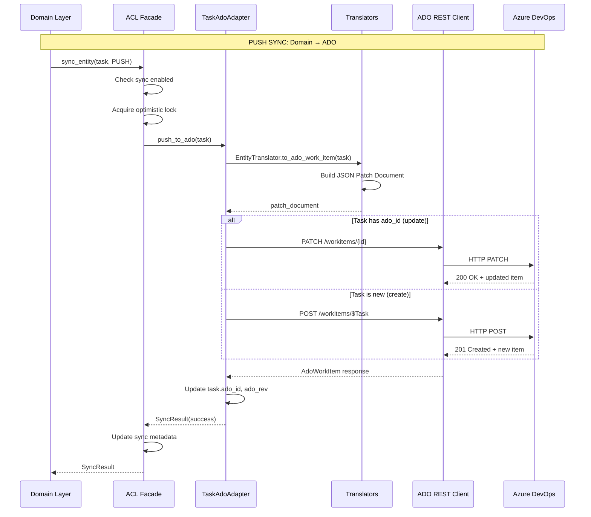

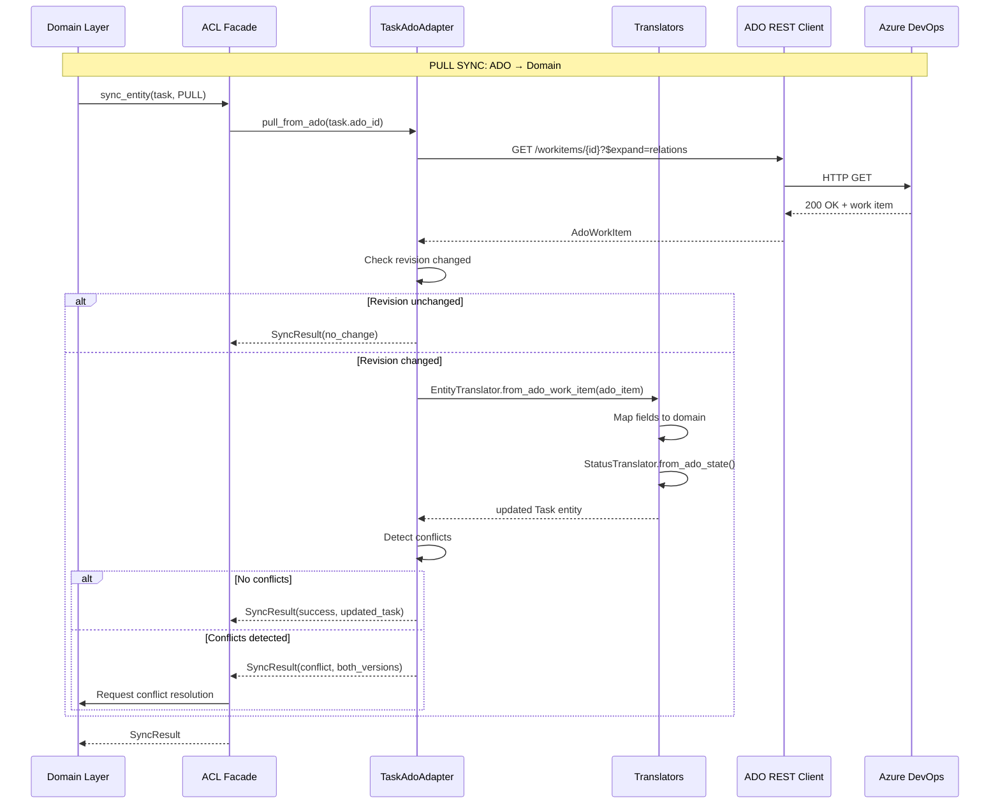

### 18.4 Conflict Resolution Strategies

```
┌─────────────────────────────────────────────────────────────────────────────────────────────┐
│                              CONFLICT RESOLUTION STRATEGIES                                  │
├─────────────────────────────────────────────────────────────────────────────────────────────┤
│                                                                                              │
│  CONFLICT DETECTION:                                                                         │
│  ───────────────────                                                                         │
│  A conflict occurs when:                                                                     │
│  1. Local entity modified since last sync (local_modified_at > last_synced_at)              │
│  2. ADO item revision > cached ado_revision                                                  │
│  3. Both have changes to the same fields                                                     │
│                                                                                              │
│  RESOLUTION STRATEGIES:                                                                      │
│  ──────────────────────                                                                      │
│                                                                                              │
│  ┌────────────────────────────────────────────────────────────────────────────────────────┐ │
│  │ Strategy          │ Behavior                          │ Use Case                       │ │
│  ├────────────────────────────────────────────────────────────────────────────────────────┤ │
│  │ LOCAL_WINS        │ Local changes overwrite ADO       │ Work-Tracker is source of     │ │
│  │                   │ Discard ADO changes               │ truth, ADO is read-only view   │ │
│  ├────────────────────────────────────────────────────────────────────────────────────────┤ │
│  │ REMOTE_WINS       │ ADO changes overwrite local       │ ADO is source of truth,       │ │
│  │                   │ Discard local changes             │ Work-Tracker follows ADO       │ │
│  ├────────────────────────────────────────────────────────────────────────────────────────┤ │
│  │ MERGE             │ Field-level merge                 │ Both systems are valid         │ │
│  │                   │ Non-conflicting fields merged     │ Preserves both contributions   │ │
│  │                   │ Conflicting fields → MANUAL       │                                │ │
│  ├────────────────────────────────────────────────────────────────────────────────────────┤ │
│  │ MANUAL            │ Require human decision            │ Complex conflicts              │ │
│  │                   │ Present diff to user              │ Business-critical fields       │ │
│  │                   │ Block sync until resolved         │                                │ │
│  ├────────────────────────────────────────────────────────────────────────────────────────┤ │
│  │ LAST_WRITE_WINS   │ Most recent timestamp wins        │ Simple resolution              │ │
│  │                   │ Compare modified_at               │ Risk of data loss              │ │
│  └────────────────────────────────────────────────────────────────────────────────────────┘ │
│                                                                                              │
│  FIELD-LEVEL CONFLICT HANDLING:                                                              │
│  ──────────────────────────────                                                              │
│                                                                                              │
│  ┌────────────────────────────────────────────────────────────────────────────────────────┐ │
│  │ Field            │ Conflict Strategy  │ Rationale                                     │ │
│  ├────────────────────────────────────────────────────────────────────────────────────────┤ │
│  │ title            │ MANUAL             │ User-visible, critical                        │ │
│  │ description      │ MERGE (append)     │ Can combine both descriptions                 │ │
│  │ status           │ LAST_WRITE_WINS    │ State machine, most recent is valid           │ │
│  │ priority         │ REMOTE_WINS        │ ADO often managed by PM/Scrum Master          │ │
│  │ assigned_to      │ REMOTE_WINS        │ Assignment usually managed in ADO             │ │
│  │ tags             │ MERGE (union)      │ Combine tags from both sources                │ │
│  │ evidence_refs    │ LOCAL_WINS         │ Evidence is WT-specific                       │ │
│  │ subtasks         │ LOCAL_WINS         │ Subtasks don't sync to ADO                    │ │
│  │ blocking_info    │ LOCAL_WINS         │ WT-specific blocking semantics                │ │
│  └────────────────────────────────────────────────────────────────────────────────────────┘ │
│                                                                                              │
│  CONFLICT RESOLUTION FLOW:                                                                   │
│  ─────────────────────────                                                                   │
│                                                                                              │
│    ┌─────────────┐                                                                           │
│    │ Detect      │                                                                           │
│    │ Conflict    │                                                                           │
│    └──────┬──────┘                                                                           │
│           │                                                                                  │
│           ▼                                                                                  │
│    ┌─────────────────────────────────────────────┐                                          │
│    │ Load both versions (local + remote)         │                                          │
│    └──────┬──────────────────────────────────────┘                                          │
│           │                                                                                  │
│           ▼                                                                                  │
│    ┌─────────────────────────────────────────────┐                                          │
│    │ Calculate field-level diff                  │                                          │
│    └──────┬──────────────────────────────────────┘                                          │
│           │                                                                                  │
│           ▼                                                                                  │
│    ┌──────────────┐   ┌──────────────┐   ┌──────────────┐   ┌──────────────┐                │
│    │ Auto-merge   │   │ Apply        │   │ Apply        │   │ Escalate to  │                │
│    │ non-conflict │──▶│ LOCAL_WINS   │──▶│ REMOTE_WINS  │──▶│ MANUAL       │                │
│    │ fields       │   │ fields       │   │ fields       │   │ resolution   │                │
│    └──────────────┘   └──────────────┘   └──────────────┘   └──────────────┘                │
│           │                                                         │                        │
│           └─────────────────────────────────────────────────────────┤                        │
│                                                                     ▼                        │
│                                                        ┌──────────────────────┐             │
│                                                        │ Store resolved       │             │
│                                                        │ entity + sync        │             │
│                                                        └──────────────────────┘             │
│                                                                                              │
└─────────────────────────────────────────────────────────────────────────────────────────────┘
```

### 18.5 ACL File Structure

```
src/ecw/work_tracker/
├── infrastructure/
│   └── ado/                            # Anti-Corruption Layer
│       ├── __init__.py
│       ├── facade.py                   # AdoIntegrationFacade
│       ├── client.py                   # ADO REST API client wrapper
│       ├── config.py                   # ADO connection settings
│       │
│       ├── adapters/                   # Entity-specific adapters
│       │   ├── __init__.py
│       │   ├── base.py                 # BaseAdoAdapter (abstract)
│       │   ├── initiative_adapter.py   # Initiative ↔ Epic
│       │   ├── plan_adapter.py         # Plan ↔ Feature
│       │   ├── task_adapter.py         # Task ↔ Task
│       │   ├── evidence_adapter.py     # Evidence ↔ Attachment
│       │   └── link_adapter.py         # Relations management
│       │
│       ├── translators/                # Data transformation
│       │   ├── __init__.py
│       │   ├── entity_translator.py    # Entity ↔ AdoWorkItem
│       │   ├── status_translator.py    # Status ↔ State + Tags
│       │   ├── identity_translator.py  # Actor ↔ IdentityRef
│       │   └── patch_builder.py        # JSON Patch document builder
│       │
│       ├── models/                     # ADO data transfer objects
│       │   ├── __init__.py
│       │   ├── ado_work_item.py        # ADO work item DTO
│       │   ├── ado_identity.py         # ADO identity reference
│       │   ├── ado_link.py             # ADO relation/link
│       │   └── ado_patch.py            # JSON Patch operations
│       │
│       ├── sync/                       # Sync orchestration
│       │   ├── __init__.py
│       │   ├── sync_service.py         # Bidirectional sync logic
│       │   ├── conflict_resolver.py    # Conflict resolution
│       │   ├── sync_state.py           # Sync metadata tracking
│       │   └── change_detector.py      # ADO change detection
│       │
│       └── tests/                      # ACL-specific tests
│           ├── __init__.py
│           ├── test_translators.py     # Unit tests for translators
│           ├── test_adapters.py        # Adapter tests with mocks
│           ├── test_sync.py            # Sync logic tests
│           └── test_integration.py     # Integration tests (ADO sandbox)
```

---

## 19. Wisdom for Future Self

> **Purpose:** Knowledge transfer and context preservation for session continuity
> **Audience:** Future Claude instance continuing this work
> **Format:** Actionable guidance with reasoning

### 19.1 Critical Context to Preserve

```
╔════════════════════════════════════════════════════════════════════════════════════════════╗
║                         CRITICAL CONTEXT FOR FUTURE SESSIONS                                ║
╠════════════════════════════════════════════════════════════════════════════════════════════╣
║                                                                                             ║
║  PROJECT IDENTITY:                                                                          ║
║  ─────────────────                                                                          ║
║  • Name: Work-Tracker v3.0                                                                  ║
║  • Type: Ground-up architectural rewrite (not evolution)                                    ║
║  • Breaking changes: ACCEPTABLE                                                             ║
║  • Previous version: v2.1.0 (mixed architecture, 128+ failing tests)                        ║
║                                                                                             ║
║  DESIGN PHILOSOPHY:                                                                         ║
║  ──────────────────                                                                         ║
║  • Pure DDD with 4 bounded contexts                                                         ║
║  • Hexagonal Architecture (Ports & Adapters)                                                ║
║  • Event Sourcing as primary storage (CloudEvents 1.0)                                      ║
║  • CQRS with completely separate command/query paths                                        ║
║  • JSON as Single Source of Truth (SSOT), Markdown as derived view                          ║
║                                                                                             ║
║  NON-NEGOTIABLE REQUIREMENTS:                                                               ║
║  ────────────────────────────                                                               ║
║  1. Sub-agents CANNOT mark tasks complete (permission model)                                ║
║  2. User consent REQUIRED for completions (SOP-WT.2)                                        ║
║  3. Evidence MUST be attached before completion                                             ║
║  4. Tests MUST be real (no placeholders or stubs)                                           ║
║  5. BDD Red/Green/Refactor is MANDATORY                                                     ║
║                                                                                             ║
║  TRACKING REQUIREMENTS:                                                                     ║
║  ──────────────────────                                                                     ║
║  • docs/PLAN.md - Master planning document                                                  ║
║  • docs/WORKTRACKER.md - Task tracking with phases                                          ║
║  • META phases MUST exist: BUGS, TECHDEBT, DISCOVERY                                        ║
║  • TODO list MUST stay in sync with WORKTRACKER.md                                          ║
║                                                                                             ║
╚════════════════════════════════════════════════════════════════════════════════════════════╝
```

### 19.2 Architectural Decisions (Summary)

| ADR | Decision | Rationale | Confidence |
|-----|----------|-----------|------------|
| ADR-001 | Ground-up rewrite | v2.x technical debt too high | HIGH |
| ADR-002 | 4 Bounded Contexts | Clear separation, independent evolution | HIGH |
| ADR-003 | Event Sourcing primary | Complete audit trail, time travel | HIGH |
| ADR-004 | CQRS separate dispatchers | Different concerns, different optimizations | HIGH |
| ADR-005 | Middleware pipeline | Composable cross-cutting concerns | MEDIUM |
| ADR-006 | Sub-agent restrictions | Safety, SOP compliance, prevent unauthorized | HIGH |
| ADR-007 | Dual CLI (structured + NL) | Claude prefers NL, humans prefer structured | MEDIUM |
| ADR-008 | JSON as SSOT | Markdown regeneration causes data loss | HIGH |
| ADR-009 | Phase entity (no ADO equiv) | WT concept, use tags/custom fields in ADO | MEDIUM |
| ADR-010 | ACL for ADO integration | Isolate external system, protect domain | HIGH |

### 19.3 Known Challenges and Mitigations

```
┌─────────────────────────────────────────────────────────────────────────────────────────────┐
│                              KNOWN CHALLENGES & MITIGATIONS                                  │
├─────────────────────────────────────────────────────────────────────────────────────────────┤
│                                                                                              │
│  CHALLENGE 1: Phase Entity Has No ADO Equivalent                                             │
│  ────────────────────────────────────────────────                                            │
│  Problem: ADO has Epic → Feature → User Story → Task, no "Phase" concept                    │
│  Impact: Cannot directly sync Phase entity                                                   │
│  Mitigation Options:                                                                         │
│    A. Use Tags on child tasks (e.g., "Phase:Foundation")                                    │
│    B. Create custom "Custom.Phase" picklist field                                           │
│    C. Use AreaPath hierarchy (Phase as sub-area)                                            │
│    D. Skip Phase sync, compute from task states                                             │
│  Recommendation: Option A (Tags) for simplicity, Option B for richer queries                │
│                                                                                              │
│  CHALLENGE 2: Subtask Sync                                                                   │
│  ─────────────────────────                                                                   │
│  Problem: ADO Tasks don't have native subtasks (checklist)                                  │
│  Impact: Cannot represent WT subtasks in ADO                                                │
│  Mitigation Options:                                                                         │
│    A. Markdown checklist in Description field                                               │
│    B. Child Task work items (over-engineering?)                                             │
│    C. Third-party checklist extension                                                       │
│    D. Custom JSON field (Custom.Subtasks)                                                   │
│  Recommendation: Option A for simplicity, renders in ADO UI                                 │
│                                                                                              │
│  CHALLENGE 3: Evidence 5W1H Model                                                            │
│  ────────────────────────────                                                                │
│  Problem: ADO attachments don't have structured 5W1H metadata                               │
│  Impact: Rich evidence context lost in ADO sync                                             │
│  Mitigation:                                                                                 │
│    • Store 5W1H as JSON header in attachment file                                           │
│    • Use attachment comment for summary                                                      │
│    • Accept that ADO view is degraded (ACL boundary)                                        │
│                                                                                              │
│  CHALLENGE 4: Blocked Status                                                                 │
│  ─────────────────────────                                                                   │
│  Problem: ADO Task doesn't have BLOCKED state in Agile process                              │
│  Impact: Cannot represent blocking info in ADO state machine                                │
│  Mitigation:                                                                                 │
│    • Use "Active" state + "blocked" tag                                                     │
│    • Store blocking_info in custom fields                                                   │
│    • StatusTranslator handles bidirectional mapping                                         │
│                                                                                              │
│  CHALLENGE 5: Context Limit During Implementation                                            │
│  ────────────────────────────────────────────────                                            │
│  Problem: Large implementation may exceed context window                                    │
│  Impact: Loss of context, inconsistent implementation                                       │
│  Mitigation:                                                                                 │
│    • Keep docs/WORKTRACKER.md updated                                                       │
│    • Checkpoint progress in SESSION-HANDOFF.md                                              │
│    • Use memory-keeper MCP for session state                                                │
│    • Phase implementation into small, complete units                                        │
│                                                                                              │
└─────────────────────────────────────────────────────────────────────────────────────────────┘
```

### 19.4 Implementation Priorities

```
PHASE PRIORITY ORDER:
─────────────────────

1. [P0] Domain Layer (Foundation)
   - Value objects first (immutable, testable)
   - Then aggregates with state machines
   - Pure domain, no dependencies
   - 95%+ test coverage required

2. [P0] Application Layer (Orchestration)
   - Dispatcher and middleware pipeline
   - Command handlers (write side)
   - Query handlers (read side)
   - CQRS separation must be complete

3. [P1] Infrastructure Layer (Persistence)
   - File-based event store first
   - JSON repository adapter
   - Markdown adapter (derived view)
   - Projection handlers

4. [P1] Interface Layer (CLI)
   - Structured commands first
   - NL parser second
   - Sub-agent context handling
   - Output formatters

5. [P2] ADO Integration (Anti-Corruption Layer)
   - Design is complete in this plan
   - Implement AFTER core is stable
   - Can be deferred to v3.1

6. [P2] Migration (v2.x Compatibility)
   - Migration tool last
   - Only after v3.0 proven stable
```

### 19.5 Testing Strategy Reminders

```
TEST PYRAMID (MANDATORY):
─────────────────────────

┌─────────────────────────────────────────────────────────────────────────┐
│                              E2E Tests                                   │
│                         (Full workflow tests)                            │
│                              ~5% of tests                                │
├─────────────────────────────────────────────────────────────────────────┤
│                         Integration Tests                                │
│                    (Component interaction tests)                         │
│                             ~15% of tests                                │
├─────────────────────────────────────────────────────────────────────────┤
│                         Contract Tests                                   │
│                    (API contract verification)                           │
│                             ~10% of tests                                │
├─────────────────────────────────────────────────────────────────────────┤
│                       Architecture Tests                                 │
│                  (Dependency rule enforcement)                           │
│                             ~5% of tests                                 │
├─────────────────────────────────────────────────────────────────────────┤
│                           Unit Tests                                     │
│              (Isolated function/class tests)                             │
│                            ~65% of tests                                 │
└─────────────────────────────────────────────────────────────────────────┘

CRITICAL: No placeholders, no stubs with false data, all tests must be real and validatable.
```

### 19.6 Key Resources and References

| Resource | Location | Purpose |
|----------|----------|---------|
| Plan File | `.claude/plans/glimmering-brewing-lake.md` | This comprehensive design |
| CLAUDE.md | `CLAUDE.md` | SOPs and project policies |
| SKILL.md | `.claude/skills/work-tracker/SKILL.md` | Skill documentation |
| ADO REST API | [learn.microsoft.com](https://learn.microsoft.com/en-us/rest/api/azure/devops/wit/) | ADO API reference |
| ACL Pattern | [Azure Architecture](https://learn.microsoft.com/en-us/azure/architecture/patterns/anti-corruption-layer) | ACL pattern guidance |
| Cockburn Use Cases | [cs.otago.ac.nz](https://www.cs.otago.ac.nz/coursework/cosc461/uctempla.htm) | Use case format |
| Eric Evans DDD | Domain-Driven Design (2003) | DDD patterns |
| Context7 | MCP Server | Library documentation |

### 19.7 Final Advice

```
╔════════════════════════════════════════════════════════════════════════════════════════════╗
║                              ADVICE FOR FUTURE SELF                                         ║
╠════════════════════════════════════════════════════════════════════════════════════════════╣
║                                                                                             ║
║  1. START SMALL, VERIFY OFTEN                                                               ║
║     • Implement one aggregate fully before moving to the next                               ║
║     • Run tests after every small change                                                    ║
║     • Don't accumulate technical debt                                                       ║
║                                                                                             ║
║  2. HONOR THE BOUNDARIES                                                                    ║
║     • Domain layer has NO external dependencies                                             ║
║     • Application layer depends only on domain                                              ║
║     • Infrastructure implements ports, doesn't define them                                  ║
║     • ACL isolates ADO completely from domain                                               ║
║                                                                                             ║
║  3. PRIORITIZE USER EXPERIENCE                                                              ║
║     • Claude agents are primary users                                                       ║
║     • NL commands should feel natural                                                       ║
║     • Error messages should be actionable                                                   ║
║     • Progress feedback should be continuous                                                ║
║                                                                                             ║
║  4. PRESERVE AUDIT TRAIL                                                                    ║
║     • Every state change is an event                                                        ║
║     • Events are immutable facts                                                            ║
║     • Projections can be rebuilt                                                            ║
║     • Evidence is first-class citizen                                                       ║
║                                                                                             ║
║  5. DOCUMENT AS YOU GO                                                                      ║
║     • Update WORKTRACKER.md with every task change                                          ║
║     • Keep TODO in sync                                                                     ║
║     • Capture discoveries immediately                                                       ║
║     • Write ADRs for significant decisions                                                  ║
║                                                                                             ║
║  6. RESPECT THE USER                                                                        ║
║     • Consent is sacred - never bypass it                                                   ║
║     • Evidence before completion - always                                                   ║
║     • Be transparent about progress and blockers                                            ║
║     • Ask questions rather than assume                                                      ║
║                                                                                             ║
║  7. PREPARE FOR COMPACTION                                                                  ║
║     • Context limit is real - plan for it                                                   ║
║     • SESSION-HANDOFF.md is your lifeline                                                   ║
║     • memory-keeper MCP preserves state                                                     ║
║     • This plan file is your north star                                                     ║
║                                                                                             ║
║  8. THE ACL IS YOUR SHIELD                                                                  ║
║     • ADO is a different domain with different semantics                                    ║
║     • Don't let ADO concepts leak into Work-Tracker domain                                  ║
║     • Translators handle the impedance mismatch                                             ║
║     • Conflicts are resolved at the boundary, not in domain                                 ║
║                                                                                             ║
║  REMEMBER: This is a ground-up rewrite. The goal is architectural purity, not feature      ║
║  parity with v2.x. Better to ship fewer features done right than many features done        ║
║  poorly. Trust the design, follow the patterns, and verify with tests.                     ║
║                                                                                             ║
║  Good luck, future me. You've got this.                                                     ║
║                                                                                             ║
╚════════════════════════════════════════════════════════════════════════════════════════════╝
```

---

*Plan Version: 3.0*
*Created: 2026-01-07*
*Updated: 2026-01-07*
*Status: Ready for User Approval*
*Appendices: A (ADO Schema), B (Gap Analysis)*
*ACL Design: Complete*
*Wisdom: Captured*
