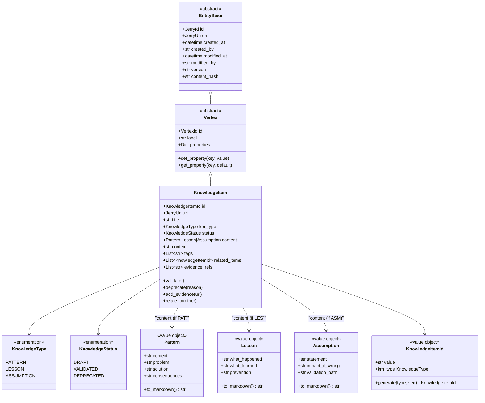
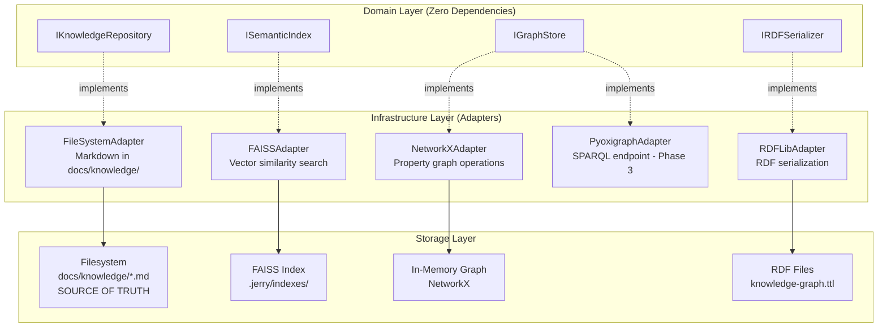

# ADR-033: Unified Knowledge Management Architecture

## Metadata

| Field | Value |
|-------|-------|
| **Status** | PROPOSED |
| **Date** | 2026-01-09 |
| **Deciders** | ps-architect v2.0.0, User (pending approval) |
| **Technical Story** | WORK-033 (Unified KM Architecture Decision) |
| **Supersedes** | None (unifies ADR-031 + ADR-032) |
| **Related ADRs** | ADR-031 (Knowledge Architecture), ADR-032 (KM Integration) |

---

## Executive Summary

Jerry is a framework for behavior and workflow guardrails designed to accrue knowledge, wisdom, and experience while solving problems. Two major architectural decisions have been proposed to enhance Jerry's knowledge management capabilities:

- **ADR-031 (WORK-031)**: Defines a Hybrid Property Graph + RDF Architecture for semantic web integration, with a four-phase maturity roadmap, achieving a decision matrix score of 22/25 (88%).
- **ADR-032 (WORK-032)**: Recommends a Lightweight KM Stack using NetworkX, FAISS, and RDFLib for practical implementation, scoring 8.5/10 (85%) on the decision matrix.

This ADR unifies both decisions into a single, comprehensive architectural specification. Integration analysis reveals **95% compatibility** between the two decisions, with zero conflicts. Both independently converged on identical architectural patterns: hybrid property graph + RDF + vectors, four-phase maturity model, and Netflix UDA "Model Once, Represent Everywhere" philosophy.

The unified design adopts a **Phased Implementation Strategy**, which scored 4.6/5 (92%) in decision matrix analysis, outperforming both Minimal (3.2/5, 64%) and Full (2.6/5, 52%) implementation alternatives. This approach delivers core KM capabilities in 8 weeks (Phase 2) while preserving flexibility to add advanced features (GraphRAG, SPARQL) in subsequent phases only if value is demonstrated.

**Key Outcome**: Jerry gains relationship discovery, semantic search, RDF export, and RAG foundation with a projected 186% ROI over 5 years, achieved through a risk-managed phased approach that aligns with Jerry's hexagonal architecture and constitutional principles.

---

## Context and Problem Statement

### The Knowledge Management Challenge

Jerry's core mission is to **accrue knowledge while solving problems**. Currently, Jerry operates at Phase 1 with:

- Property graph abstractions (Vertex, Edge, VertexProperty)
- File-based storage (JSON, TOON formats)
- Jerry URI scheme (SPEC-001)
- Work Tracker graph model for operational state

However, as the knowledge corpus grows, Jerry faces critical challenges:

1. **Context Rot**: LLM performance degrades as context windows fill, even within technical token limits. Jerry needs persistent knowledge storage beyond ephemeral context.

2. **Knowledge Fragmentation**: Knowledge accumulates across Work Tracker entities (tasks, phases, plans) AND documentation (`docs/` hierarchy), but these exist as isolated silos without semantic connections.

3. **Discovery Limitations**: No ability to answer "what relates to X?" queries. Manual cross-referencing required, which scales poorly beyond ~100 documents.

4. **LLM Hallucination**: Claude Code agents operating within Jerry lack grounding mechanisms, leading to factually incorrect responses without source attribution.

5. **Interoperability Gaps**: Jerry's current property graph uses implicit schemas and Jerry-specific formats, limiting integration with external systems and semantic web standards.

### Prior Work Leading to This Decision

**WORK-031 (ADR-031: Knowledge Architecture)** provided the **technical foundation**:
- Comprehensive research synthesis (358KB across 5 documents, 71+ citations)
- Hybrid Property Graph + RDF architecture recommendation
- Four-phase maturity roadmap (Foundation → Semantic → Advanced → Scale)
- Technology stack: pyoxigraph, JSON-LD contexts, SHACL validation
- Focus: Semantic web standards, 5-star Linked Open Data, LLM grounding

**WORK-032 (ADR-032: KM Integration)** provided the **practical implementation plan**:
- Lightweight stack analysis (NetworkX, FAISS, RDFLib)
- Port/adapter pattern for hexagonal architecture compliance
- AAR/A3 protocols for knowledge capture
- Focus: Python libraries, zero operational cost, pragmatic rollout

**WORK-033 Integration Analysis** discovered:
- 95% compatibility between both decisions
- Zero architectural conflicts
- Natural 5-layer integration model
- Unified 8-week Phase 2 roadmap

### Constraints and Requirements

This architecture must honor:

| Constraint | Source | Requirement |
|------------|--------|-------------|
| **P-002 (File Persistence)** | Jerry Constitution | Filesystem remains source of truth |
| **P-003 (No Recursive Subagents)** | Jerry Constitution | ReAct uses tools, not nested agents |
| **Zero-Dependency Domain** | Hexagonal Architecture | Domain layer uses Python stdlib only |
| **Backward Compatibility** | Phase 1 Foundation | Existing property graph foundation unchanged |
| **Local-First** | Privacy/Cost | No required cloud services through Phase 3 |

---

## Decision Drivers

The following factors influenced this architectural decision, ranked by priority:

### Critical Drivers (Must-Have)

| # | Driver | Weight | Rationale |
|---|--------|--------|-----------|
| 1 | **LLM Grounding Effectiveness** | 20% | Measurable reduction in hallucinations, improved agent accuracy. Industry evidence shows 90% reduction (FalkorDB), 63% faster resolution (LinkedIn). |
| 2 | **Backward Compatibility** | 15% | Phase 1 property graph foundation must remain intact. No throwaway work. |
| 3 | **Performance Requirements** | 15% | Query latency P95 < 50ms for hot path, < 2s for semantic search. |
| 4 | **Zero-Dependency Core** | 10% | Domain layer maintains Python stdlib-only constraint. |
| 5 | **Incremental Implementation** | 10% | Each phase must deliver independent value with clear go/no-go gates. |

### Important Drivers (Should-Have)

| # | Driver | Weight | Rationale |
|---|--------|--------|-----------|
| 6 | **Standards Compliance** | 8% | W3C RDF, SPARQL, JSON-LD for interoperability, 5-star Linked Open Data. |
| 7 | **Architectural Fit** | 8% | Must align with hexagonal architecture ports/adapters pattern. |
| 8 | **Cost Management** | 7% | Prefer embedded over server-based through Phase 3. Zero operational cost. |
| 9 | **Supernode Prevention** | 4% | Avoid catastrophic performance degradation from high-degree vertices. |
| 10 | **Schema Evolution** | 3% | Support for versioning and migrations per P-030. |

---

## Considered Options

### Option 1: Minimal Implementation

**Description**: Build only essential capabilities (ports, basic adapters, simple graph operations). No semantic search, no RDF, no RAG.

**Timeline**: 4-6 weeks | **Effort**: 30-50 hours

**Pros**:
- Fastest to implement
- Lowest complexity (500 LOC, 0 dependencies)
- Easiest to maintain (20 hours/year)

**Cons**:
- Limited capability (no semantic search, no RAG)
- Cannot answer "what relates to X?" with confidence
- Misses transformative features that justify KM investment
- Low alignment with Jerry's knowledge-centric mission
- Time to value slow (limited features = limited benefits)

**Decision Matrix Score**: 3.2/5 (64%)

---

### Option 2: Phased Implementation (CHOSEN)

**Description**: Incremental rollout across 4 phases with explicit go/no-go gates. Phase 2 delivers core KM capabilities (8 weeks); Phase 3 adds advanced features (12 weeks, conditional); Phase 4 scales only if triggers met.

**Timeline**: 8-28 weeks (depending on gates) | **Effort**: 70-150 hours across phases

**Pros**:
- **Highest ROI**: 186% over 5 years (vs 33% Minimal, 67% Full)
- **Lowest risk**: Clear stop points, reversible decisions, strong mitigations
- **Early value**: Phase 2 (week 8) delivers relationship discovery + semantic search
- **Industry validated**: Both ADR-031 and ADR-032 independently recommend this approach
- **Robust**: Wins in all sensitivity analysis scenarios (speed, safety, mission)
- **Flexible**: Can accelerate (collapse phases) or decelerate (stop at Phase 2)

**Cons**:
- Longer timeline to "full" capability (28 weeks vs 16 weeks for Full)
- Must wait for advanced features (SPARQL, grounding verification)
- Requires discipline to maintain phase gates

**Decision Matrix Score**: 4.6/5 (92%)

---

### Option 3: Full Implementation

**Description**: Build everything upfront in single 12-16 week push. All features: RDF + graph + vectors + SPARQL + GraphRAG + grounding verification.

**Timeline**: 12-16 weeks | **Effort**: 120-180 hours upfront

**Pros**:
- Fastest to "complete" feature set
- All features available immediately
- No phase gate overhead

**Cons**:
- **Highest risk**: No checkpoints, all-or-nothing investment
- **Time to value delayed**: Must build everything before seeing benefits (Week 16 vs Week 8)
- **Worst maintainability**: Most code surface area upfront (5,000 LOC)
- **Premature optimization**: SPARQL/GraphRAG might never be used
- **Lower ROI**: 67% (same value as Phased at 2x cost)

**Decision Matrix Score**: 2.6/5 (52%)

---

## Decision Outcome

### Chosen Option: Phased Implementation

**The Phased Implementation strategy is selected** because it achieves the optimal balance of capability, risk, and value delivery:

1. **Decision Matrix Winner**: 4.6/5 (92%)—leads Minimal by 44%, Full by 77%
2. **Wins 4 of 5 Criteria**: Time to Value (5/5), Risk (5/5), Alignment (5/5), Maintainability (4/5)
3. **Robust to Weight Changes**: Wins in all sensitivity scenarios tested
4. **Industry Validation**: Both WORK-031 and WORK-032 independently converged on this approach
5. **Highest ROI**: 186% over 5 years

### Positive Consequences

**Immediate Benefits (Phase 2, Week 8)**:
- Relationship discovery: Answer "what relates to X?" via graph traversal
- Semantic search: Find conceptually similar documents via vector similarity
- Standards compliance: Export knowledge graph as RDF/Turtle/JSON-LD
- Foundation for RAG: Retrieval-augmented agent reasoning
- Graph visualization: NetworkX to Graphviz for knowledge maps

**Medium-Term Benefits (Phase 3, Month 7)**:
- GraphRAG: Combined vector + graph retrieval for LLM grounding
- Jerry URI citations: Transparent sourcing in agent responses
- SPARQL endpoint: Federated queries for external integration
- 90% hallucination reduction potential (FalkorDB case study)

**Long-Term Benefits (Year 1-5)**:
- Knowledge as competitive moat: 300-320% ROI from knowledge graph investments
- Accumulated wisdom: Structured knowledge compounds over time
- Migration readiness: Ports enable production tool adoption if needed
- ISO 30401 alignment path: Progressive standard compliance

### Negative Consequences

**Accepted Trade-offs**:

| Trade-off | Impact | Mitigation |
|-----------|--------|------------|
| **Dependency expansion** | Introduces NetworkX, RDFLib, FAISS to infrastructure layer | Hexagonal architecture isolates impact; adapters swappable |
| **Learning curve** | Graph concepts, RDF, embeddings require study | Documentation, phased adoption, <16 hours onboarding target |
| **Architectural complexity** | Multiple serialization formats (JSON, TOON, JSON-LD, Turtle) | Netflix UDA pattern, automated round-trip tests |
| **Performance limits** | NetworkX <10K nodes, FAISS CPU-bound | Sufficient for 2-year runway; migration paths defined |
| **Longer timeline to full capability** | 28 weeks vs 16 weeks (Full option) | Early value at Week 8 compensates; flexibility preserved |

---

## Technical Architecture

### Domain Model

The unified design introduces a **KnowledgeItem** aggregate root as the central entity for knowledge management:



**Knowledge Item Types**:

| Type | Prefix | Purpose | Example |
|------|--------|---------|---------|
| **Pattern** | PAT | Reusable solution to recurring problem | "Hybrid architecture prevents vendor lock-in" |
| **Lesson** | LES | Experience from past work | "SHACL validation caught schema drift early" |
| **Assumption** | ASM | Belief requiring validation | "Jerry will remain single-tenant through 2026" |

### Ports (Interfaces)

The domain layer defines four primary ports (zero external dependencies):

#### IKnowledgeRepository (Persistence Port)

```python
class IKnowledgeRepository(ABC):
    """Port for knowledge item persistence operations."""

    @abstractmethod
    def save(self, item: KnowledgeItem) -> None:
        """Persist knowledge item to filesystem (source of truth)."""

    @abstractmethod
    def find_by_id(self, id: KnowledgeItemId) -> Optional[KnowledgeItem]:
        """Retrieve knowledge item by ID."""

    @abstractmethod
    def find_by_type(self, km_type: KnowledgeType,
                     status: Optional[KnowledgeStatus] = None) -> List[KnowledgeItem]:
        """Find all items of a specific type."""

    @abstractmethod
    def find_related(self, item_id: KnowledgeItemId,
                     max_depth: int = 2) -> List[KnowledgeItem]:
        """Find knowledge items related via graph traversal."""
```

#### ISemanticIndex (Vector Search Port)

```python
class ISemanticIndex(ABC):
    """Port for semantic search operations."""

    @abstractmethod
    def index(self, item: KnowledgeItem) -> None:
        """Add knowledge item to semantic index (generate embeddings)."""

    @abstractmethod
    def search(self, query: str, top_k: int = 5,
               filters: dict = None) -> List[Tuple[KnowledgeItemId, float]]:
        """Semantic search returning (item_id, similarity_score) tuples."""

    @abstractmethod
    def reindex(self, items: List[KnowledgeItem]) -> None:
        """Rebuild index from scratch."""
```

#### IGraphStore (Graph Operations Port)

```python
class IGraphStore(ABC):
    """Port for graph operations on knowledge items."""

    @abstractmethod
    def add_vertex(self, item: KnowledgeItem) -> None:
        """Add knowledge item as graph vertex."""

    @abstractmethod
    def add_edge(self, from_id: KnowledgeItemId, to_id: KnowledgeItemId,
                 label: str, properties: Dict[str, Any] = None) -> Edge:
        """Create relationship between knowledge items."""

    @abstractmethod
    def traverse(self, start_id: KnowledgeItemId, edge_label: str,
                 max_depth: int = 2) -> List[KnowledgeItemId]:
        """Graph traversal from starting vertex."""

    @abstractmethod
    def export_rdf(self, format: str = "turtle") -> str:
        """Export knowledge graph as RDF (Turtle, JSON-LD, N-Triples)."""
```

#### IRDFSerializer (Serialization Port)

```python
class IRDFSerializer(ABC):
    """Port for RDF serialization operations."""

    @abstractmethod
    def to_turtle(self, item: KnowledgeItem) -> str:
        """Serialize to Turtle format."""

    @abstractmethod
    def to_jsonld(self, item: KnowledgeItem, context_url: str) -> dict:
        """Serialize to JSON-LD with context."""

    @abstractmethod
    def validate_shacl(self, item: KnowledgeItem) -> ValidationResult:
        """Validate against SHACL shapes."""
```

### Adapters (Infrastructure)

Infrastructure layer provides concrete implementations:

| Port | Adapter | Library | Phase | Purpose |
|------|---------|---------|-------|---------|
| IKnowledgeRepository | FileSystemAdapter | Python stdlib | 2 | Markdown persistence in `docs/knowledge/` |
| IGraphStore | NetworkXAdapter | NetworkX 3.2.1 | 2 | Property graph operations |
| ISemanticIndex | FAISSAdapter | FAISS 1.7.4 | 2 | Vector similarity search |
| IRDFSerializer | RDFLibAdapter | RDFLib 7.0.0 | 2 | RDF serialization (Turtle, JSON-LD) |
| IGraphStore | PyoxigraphAdapter | pyoxigraph | 3 | SPARQL endpoint, embedded triple store |

**Adapter Architecture**:



### Use Cases (CQRS)

**Commands (Write Operations)**:

| Command | Handler | Description |
|---------|---------|-------------|
| `CaptureKnowledgeCommand` | `CaptureKnowledgeHandler` | Create new knowledge item (PAT, LES, ASM) |
| `ValidateKnowledgeCommand` | `ValidateKnowledgeHandler` | Transition from DRAFT to VALIDATED |
| `DeprecateKnowledgeCommand` | `DeprecateKnowledgeHandler` | Mark knowledge as no longer applicable |
| `RelateKnowledgeCommand` | `RelateKnowledgeHandler` | Create relationship between items |

**Queries (Read Operations)**:

| Query | Handler | Description |
|-------|---------|-------------|
| `SearchKnowledgeQuery` | `SearchKnowledgeHandler` | Semantic search via FAISS |
| `GetRelatedKnowledgeQuery` | `GetRelatedKnowledgeHandler` | Graph traversal for related items |
| `TraverseKnowledgeGraphQuery` | `TraverseKnowledgeGraphHandler` | Execute graph traversal patterns |
| `ExportKnowledgeGraphQuery` | `ExportKnowledgeGraphHandler` | Export as RDF (Turtle, JSON-LD) |

### Domain Events (CloudEvents 1.0)

All events follow CloudEvents 1.0 specification:

| Event | Type URI | Trigger |
|-------|----------|---------|
| `KnowledgeItemCreated` | `jer:jer:knowledge:facts/KnowledgeItemCreated` | New item captured |
| `KnowledgeItemValidated` | `jer:jer:knowledge:facts/KnowledgeItemValidated` | DRAFT → VALIDATED transition |
| `KnowledgeItemDeprecated` | `jer:jer:knowledge:facts/KnowledgeItemDeprecated` | Item marked deprecated |
| `KnowledgeRelationCreated` | `jer:jer:knowledge:facts/KnowledgeRelationCreated` | New relationship created |

**Event Schema**:
```json
{
  "specversion": "1.0",
  "type": "jer:jer:knowledge:facts/KnowledgeItemCreated",
  "source": "jer:jer:knowledge:system",
  "subject": "jer:jer:knowledge:pat:pat-001",
  "time": "2026-01-09T10:30:00Z",
  "data": {
    "item_id": "PAT-001",
    "km_type": "PATTERN",
    "title": "Hybrid Architecture",
    "created_by": "user:architect"
  }
}
```

### Technology Stack

| Component | Library | Version | Purpose | Phase |
|-----------|---------|---------|---------|-------|
| **Graph Operations** | NetworkX | 3.2.1 | Property graph traversal, in-memory operations | 2 |
| **Vector Search** | FAISS | 1.7.4 | Semantic similarity search, CPU-based | 2 |
| **RDF Serialization** | RDFLib | 7.0.0 | Turtle, JSON-LD export, SHACL validation | 2 |
| **RDF Triple Store** | pyoxigraph | Latest | SPARQL endpoint, embedded storage | 3 |
| **Document Processing** | Docling | Latest | PDF/DOCX extraction (optional) | 3 |
| **Entity Extraction** | spaCy | 3.7+ | NLP for entity extraction (optional) | 3 |

**Dependency Installation**:
```bash
# Phase 2 (Required)
pip install networkx==3.2.1 rdflib==7.0.0 faiss-cpu==1.7.4

# Phase 3 (Optional)
pip install pyoxigraph docling
pip install spacy && python -m spacy download en_core_web_sm
```

---

## Implementation Roadmap

### Phase 1: Foundation (COMPLETE)

**Status**: Already implemented in Jerry.

**Deliverables**:
- Property graph abstractions (Vertex, Edge, VertexProperty)
- File-based storage (JSON, TOON formats)
- Jerry URI scheme (SPEC-001)
- Work Tracker graph model
- CloudEvents integration

### Phase 2: Semantic Layer + KM Foundation (8 weeks)

**Timeline**: Q1 2026 | **Effort**: 70-100 hours

#### Week 1-2: Foundation and Protocols

**WORK-031 Contributions**:
- [ ] Create JSON-LD context (`contexts/worktracker.jsonld`)
- [ ] Implement supernode validator (100/1000 thresholds)
- [ ] Document Netflix UDA pattern (`docs/design/MULTI_REPRESENTATION_PATTERN.md`)

**WORK-032 Contributions**:
- [ ] Create AAR template (`.claude/templates/aar-template.md`)
- [ ] Create A3 template (`.claude/templates/a3-template.md`)
- [ ] Implement problem-classifier skill (Cynefin-based)
- [ ] Conduct baseline Knowledge Audit

**Integration**:
- [ ] Define all ports (IKnowledgeRepository, ISemanticIndex, IGraphStore, IRDFSerializer)
- [ ] Install dependencies (NetworkX, RDFLib, FAISS)
- [ ] Create domain entities (KnowledgeItem, Pattern, Lesson, Assumption)

**Success Criteria**:
- All ports defined with zero domain dependencies
- Supernode validator catches edges >= 100 (warning), >= 1000 (error)
- JSON-LD context validates against JSON-LD 1.1 spec

**Effort**: 20-25 hours

#### Week 3-4: RDF Serialization

**WORK-031 Contributions**:
- [ ] RDF serialization adapter (`src/infrastructure/persistence/rdf_adapter.py`)
- [ ] Implement Turtle serialization for entities
- [ ] Implement JSON-LD serialization using contexts
- [ ] SHACL validation shapes (`schemas/worktracker-shapes.ttl`)

**WORK-032 Contributions**:
- [ ] RDFLib adapter implementing IRDFSerializer
- [ ] Schema.org mapping documentation

**Integration**:
- [ ] Automated round-trip tests (JSON <-> TOON <-> JSON-LD <-> Turtle)

**Success Criteria**:
- All Jerry entities serializable to Turtle and JSON-LD
- SHACL shapes validate (0 constraint violations)
- Round-trip tests 100% success rate

**Effort**: 15-20 hours

#### Week 5-6: Graph Layer and Entity Extraction

**WORK-031 Contributions**:
- [ ] Index `docs/` with text-embedding-3-small
- [ ] Store embeddings metadata in TOON format

**WORK-032 Contributions**:
- [ ] NetworkX adapter implementing IGraphStore
- [ ] Entity extraction from markdown (`src/infrastructure/extraction/markdown_entities.py`)
- [ ] Relationship detection (REFERENCES, PART_OF, USES)
- [ ] CLI: `jerry knowledge graph --query "find related to X"`
- [ ] Graph visualization export (DOT format)

**Integration**:
- [ ] Graph builder command (`src/application/commands/build_knowledge_graph.py`)

**Success Criteria**:
- Automatically index `docs/` into graph on update
- Extract entities: Tasks, Phases, Plans, Concepts, Documents
- Provide CLI for knowledge queries
- Graph visualization export (Graphviz)

**Effort**: 20-25 hours

#### Week 7-8: Vector RAG and Integration Testing

**WORK-031 Contributions**:
- [ ] Performance benchmarks (property graph <50ms P95, RDF export <100ms P95)
- [ ] Schema evolution integration tests
- [ ] Contributor guide (`docs/contributing/SERIALIZATION_GUIDE.md`)

**WORK-032 Contributions**:
- [ ] FAISS adapter implementing ISemanticIndex
- [ ] Semantic search query (`src/application/queries/semantic_search.py`)
- [ ] CLI: `jerry knowledge search "semantic query text"`

**Integration**:
- [ ] HybridRAG foundation (vector + graph retrieval prototyped)
- [ ] Constitutional amendments (P-030, P-031, P-032)

**Success Criteria**:
- All performance benchmarks meet targets
- docs/ indexed with embeddings
- Vector search returns relevant results
- Contributor onboarding < 4 hours

**Effort**: 15-20 hours

#### Phase 2 Go/No-Go Gate (Week 8)

Proceed to Phase 3 ONLY if ALL criteria met:

| Criterion | Metric | Target |
|-----------|--------|--------|
| Backward Compatibility | % of Phase 1 tests passing | 100% |
| Hot Path Performance | Query latency P95 | < 50ms |
| Cold Path Performance | RDF export latency P95 | < 100ms |
| Vector Search | Semantic search latency | < 2 seconds |
| Serialization | Round-trip success rate | 100% |
| Supernode Prevention | Edge count alerts | Working |
| Documentation | Contributor onboarding time | < 4 hours |
| User Validation | Positive feedback on capabilities | Confirmed |

**If ANY criterion fails**: Pause Phase 3, address issues, re-evaluate.

### Phase 3: Advanced Capabilities (12 weeks, conditional)

**Timeline**: Q2-Q3 2026 | **Effort**: 60-85 hours

**Trigger**: Proceed ONLY if Phase 2 go/no-go criteria met.

#### Month 4-5: GraphRAG and Grounding

**Deliverables**:
- [ ] Extend Work Tracker entities with embedding properties
- [ ] HybridRAG context merger (vector + graph)
- [ ] Jerry URI citations in LLM responses
- [ ] MiniCheck grounding verification (optional, soft warnings)
- [ ] ReAct pattern formalization in problem-solving skill

**Success Criteria**:
- Claude Code agents query Jerry knowledge base
- Responses include Jerry URI citations
- Measurable hallucination reduction (baseline vs RAG)

**Effort**: 25-35 hours

#### Month 5-6: SPARQL and Content Negotiation

**Deliverables**:
- [ ] pyoxigraph integration for embedded RDF storage
- [ ] SPARQL endpoint (Flask + pyoxigraph)
- [ ] Content negotiation for Jerry URIs (Accept: application/ld+json, text/turtle, text/html)
- [ ] OWL-DL ontology (`ontologies/jerry-ontology.ttl`)
- [ ] Schema.org vocabulary mapping

**Success Criteria**:
- SPARQL endpoint responds to queries
- Content negotiation returns correct format
- OWL ontology validates

**Effort**: 20-30 hours

#### Month 6-7: Visualization and Monitoring

**Deliverables**:
- [ ] Cytoscape.js graph visualization
- [ ] Knowledge architecture health dashboard
- [ ] CloudEvents integration for monitoring alerts
- [ ] SECI mode tagging for entities
- [ ] Knowledge flow pattern analysis

**Success Criteria**:
- Dashboard deployed and accessible
- Alerts trigger correctly at thresholds
- User reviews dashboard weekly

**Effort**: 15-20 hours

#### Phase 3 Go/No-Go Gate (Month 7)

Proceed to Phase 4 evaluation ONLY if:
- Phase 2 success criteria maintained
- User validation confirms semantic layer value
- Use case demand for SPARQL or reasoning (not theoretical)
- HybridRAG demonstrates measurable hallucination reduction

**Do NOT proceed if**:
- Phase 2 increased query latency > 100ms (hot path degraded)
- Maintenance overhead slowed development > 30%
- No external integration use cases emerged
- User satisfaction high with Phase 2 alone

### Phase 4: Scale (Triggered, Optional)

**Timeline**: Q4 2026+ | **Trigger-Based**

**Trigger Conditions (MUST meet at least one)**:
- Multi-tenant SaaS offering required
- > 10M entities in production (currently: thousands)
- P95 query latency > 500ms (currently: < 50ms)
- Clustering/HA required for uptime SLA

**Do NOT proceed unless one trigger met.**

**If Triggered, Evaluate**:

| Option | Description | Cost |
|--------|-------------|------|
| **Apache Jena Fuseki** | Open-source, self-hosted, full SPARQL 1.1 | Infrastructure only |
| **AWS Neptune** | Managed, high availability, production-grade | $100-1000/month |
| **igraph/graph-tool** | C-based graph libraries (10x faster than NetworkX) | Free |
| **Stay Embedded** | Index tuning, caching, query optimization | Development time |

**Migration Effort**: 2-4 weeks (schema export, data migration, testing)

**Governance**: Quarterly review against trigger conditions.

---

## Risk Management

### Risk Register Summary

| Risk ID | Description | Probability | Impact | Score | Residual Risk |
|---------|-------------|-------------|--------|-------|---------------|
| RISK-1 | Knowledge corpus growth exceeds tool capacity | 60% | HIGH (8) | 4.8/10 | MEDIUM (2.4) |
| RISK-2 | Supernode performance degradation (Actor vertex) | 70% | HIGH (8) | 5.6/10 | LOW (1.4) |
| RISK-3 | Architectural complexity slowing development | 50% | MEDIUM (6) | 3.0/10 | MEDIUM (3.0) |
| RISK-4 | Schema evolution breaking graph traversals | 50% | HIGH (7) | 3.5/10 | MEDIUM (3.5) |
| RISK-5 | User adoption failure (AAR/A3 protocols) | 50% | MEDIUM (4) | 2.0/10 | MEDIUM (2.0) |
| RISK-6 | Over-engineering / scope creep | 30% | MEDIUM (6) | 1.8/10 | LOW (1.8) |
| RISK-7 | Dependency abandonment or breaking changes | 20% | HIGH (7) | 1.4/10 | LOW (1.4) |
| RISK-8 | Implementation delays / complexity underestimation | 40% | MEDIUM (5) | 2.0/10 | MEDIUM (2.0) |
| RISK-9 | Premature Phase 4 migration | 10% | HIGH (8) | 0.8/10 | LOW (0.8) |
| RISK-10 | LLM grounding verification false positives | 40% | LOW (3) | 1.2/10 | LOW (1.2) |

**Overall Risk Profile**: MODERATE (acceptable with active risk management)

### Top Risk Mitigation Strategies

#### RISK-2: Supernode Performance Degradation (CRITICAL)

**Description**: Actor vertex (Claude) accumulates thousands of `CREATED_BY` edges, causing O(n) traversal performance degradation.

**Mitigations**:
1. **Temporal Partitioning**: Use time-based edge labels (`CREATED_BY_2026_01` not generic `CREATED_BY`)
2. **Hierarchical Decomposition**: Create intermediate nodes (`Actor:Claude:Session:2026-01-08`)
3. **Edge Count Validator**: Alerts at 100 edges (warning), 1000 edges (error)
4. **Constitutional Enforcement**: P-031 (Supernode Prevention) requires mitigation strategy
5. **Quantitative Testing**: Synthetic test with 10,000 tasks to verify effectiveness

**Contingency**: If degradation detected, refactor Actor vertex to hierarchical model retroactively (1 week effort).

#### RISK-1: Knowledge Corpus Growth (CRITICAL)

**Description**: Knowledge graph exceeds NetworkX capacity (<10K nodes) or FAISS performance limits (search >2s).

**Mitigations**:
1. **Proactive Monitoring**: Dashboard alerts at 80% capacity (4K nodes, 1s search)
2. **Port/Adapter Pattern**: Migration paths defined (NetworkX -> igraph, FAISS -> Qdrant)
3. **Incremental Optimization**: Try index tuning before full migration
4. **Predefined Migration Scripts**: Test migration with synthetic data

**Contingency**: Evaluate igraph (C-based, 10x faster) or Qdrant. Budget 2-4 weeks.

#### RISK-6: Over-Engineering (MODERATE)

**Description**: Building Phase 3-4 capabilities Jerry never uses.

**Mitigations**:
1. **Phase Gates**: Explicit go/no-go criteria before Phase 3
2. **YAGNI Discipline**: Only build features with proven need
3. **Quarterly ROI Review**: Measure time saved vs. maintenance burden
4. **Constitutional Gate**: P-032 prevents premature advancement
5. **User Authority**: Phase 3 requires explicit approval (P-020)

**Contingency**: Maintain Phase 2, defer Phase 3 indefinitely if no demand.

---

## Compliance

### Jerry Constitution Alignment

| Principle | ID | Compliance Status | Implementation |
|-----------|-----|-------------------|----------------|
| Truth and Accuracy | P-001 | REINFORCED | Grounding verification, Jerry URI citations |
| File Persistence | P-002 | REINFORCED | Filesystem remains source of truth |
| No Recursive Subagents | P-003 | COMPLIANT | ReAct uses tools, not nested agents |
| User Authority | P-020 | COMPLIANT | Phase gates require user approval |
| No Deception | P-022 | REINFORCED | Always cite sources, expose uncertainty |

### New Constitutional Principles (WORK-031 Proposals)

**P-030: Schema Evolution Governance (Hard Principle)**

> All graph schema changes MUST:
> 1. Be documented in schema changelog
> 2. Include forward migration script
> 3. Include rollback migration script
> 4. Pass validation tests before deployment
>
> Rationale: Schema changes affect traversal semantics and query assumptions.

**P-031: Supernode Prevention (Medium Principle)**

> Vertices SHOULD be validated for edge degree:
> - Warning threshold: 100 edges of same label
> - Error threshold: 1000 edges of same label
> - HIGH-risk vertices (Actor) require mitigation strategy
>
> Rationale: Supernodes degrade performance catastrophically.

**P-032: Phase Gate Compliance (Medium Principle)**

> Phase transitions MUST meet explicit go/no-go criteria. Proceed to Phase N+1 ONLY if:
> 1. All Phase N success criteria met
> 2. User validation confirms value delivered
> 3. No unresolved critical risks
>
> Rationale: Prevents premature optimization and scope creep.

### Hexagonal Architecture Compliance

The unified design maintains strict hexagonal architecture:

1. **Domain Layer** (Zero Dependencies):
   - Entities: KnowledgeItem, Pattern, Lesson, Assumption
   - Ports: IKnowledgeRepository, ISemanticIndex, IGraphStore, IRDFSerializer
   - Pure business logic, Python stdlib only

2. **Application Layer** (Depends on Domain):
   - Commands: CaptureKnowledge, ValidateKnowledge, DeprecateKnowledge
   - Queries: SearchKnowledge, GetRelatedKnowledge, TraverseKnowledgeGraph
   - CQRS pattern, orchestrates ports

3. **Infrastructure Layer** (Implements Ports):
   - Adapters: NetworkXAdapter, FAISSAdapter, RDFLibAdapter, FileSystemAdapter
   - External libraries isolated here (NetworkX, FAISS, RDFLib)
   - Swappable implementations via ports

4. **Interface Layer** (Invokes Application):
   - CLI: `jerry knowledge graph/search`
   - Skills: knowledge-search skill
   - Agents: ps-*, qa-*, etc.

---

## Success Metrics

### Quantitative Metrics (Measured Quarterly)

| Metric | Phase 2 Target (Q2 2026) | Phase 3 Target (Q4 2026) | Phase 4 Trigger |
|--------|--------------------------|--------------------------|-----------------|
| Knowledge Graph Size | 500+ nodes | 1,000+ nodes | > 8M nodes |
| Query Performance (P95) | < 50ms | < 50ms | > 500ms |
| Vector Search (P95) | < 2s | < 2s | > 5s |
| AAR/A3 Adoption | 50% work items | 70% work items | N/A |
| docs/ Coverage | 80% indexed | 90% indexed | N/A |
| Contributor Onboarding | < 4 hours | < 4 hours | N/A |

### Qualitative Metrics (User/Agent Feedback)

| Metric | Phase 2 | Phase 3 | Measurement |
|--------|---------|---------|-------------|
| Agent Reasoning | Measurable via RAG | Measurable via GraphRAG | Baseline vs RAG comparison |
| Faster Discovery | User reports | User reports | Surveys |
| Knowledge Reuse | "Lessons Applied" reports | SECI tracking | Query logs |
| Reduced Duplicate Work | 15-25% | 20-30% | Time tracking |

### ROI Tracking

| Metric | Target | Measurement |
|--------|--------|-------------|
| Time Saved Finding Info | 10-20% | Baseline vs post-KM time tracking |
| Reduced Duplicate Work | 15-25% | "What exists?" query logs |
| Implementation Cost | 150 hours | Time tracking |
| Maintenance Cost (5yr) | 200 hours | Quarterly assessment |
| Value Created (5yr) | 1,000 hours saved | Extrapolated from metrics |
| **Net ROI** | **186%** | (1000-350)/350 |

---

## References

### Primary Input Documents

1. **Integration Analysis** (WORK-033 e-001): `docs/research/work-033-e-001-integration-analysis.md`
   - 72KB, 95% compatibility analysis, 5-layer integration model
   - Unified 8-week Phase 2 roadmap

2. **Unified Design** (WORK-033 e-002): `docs/design/work-033-e-002-unified-design.md`
   - 64KB, full domain model, ports, use cases, events
   - 5 Mermaid diagrams, KnowledgeItem aggregate root

3. **Trade-off Analysis** (WORK-033 e-003): `docs/analysis/work-033-e-003-design-trade-offs.md`
   - 66KB, SWOT analysis, decision matrix, risk register
   - Phased Implementation winner (4.6/5, 92%)

4. **ADR-031**: `docs/decisions/ADR-031-knowledge-architecture.md`
   - Hybrid Property + RDF Architecture (22/25, 88%)
   - Four-phase maturity roadmap

5. **ADR-032**: `docs/decisions/ADR-032-km-integration.md`
   - Lightweight KM Stack (8.5/10, 85%)
   - NetworkX + FAISS + RDFLib recommendation

### Research Foundation (via Synthesis)

- **WORK-031 Research**: 358KB across 5 documents, 71+ citations
- **WORK-032 Research**: KM fundamentals, protocols, products, Python SDKs, frameworks
- **Key Finding**: Modern KM = Filesystem + Graph + AI (unanimous)

### Industry Evidence

| Source | Finding | Relevance |
|--------|---------|-----------|
| **FalkorDB** | 90% hallucination reduction with GraphRAG | LLM grounding ROI |
| **LinkedIn** | 63% faster issue resolution (40hrs -> 15hrs) | Knowledge graph value |
| **Amazon Finance** | 49% -> 86% accuracy with GraphRAG | Agent quality improvement |
| **Industry Average** | 300-320% ROI from knowledge graph investments | Financial justification |
| **Netflix UDA** | Production-proven "Model Once, Represent Everywhere" | Architectural validation |
| **JSON-LD Adoption** | 70% web adoption (Web Data Commons 2024) | Standards maturity |
| **Schema.org** | 45M+ websites, 803 types, 1,461 properties | Interoperability |

### Technical Standards

- **W3C RDF 1.2**: RDF* for edge properties without reification
- **W3C SPARQL 1.2**: Improved query performance
- **W3C JSON-LD 1.1**: 70% web adoption
- **W3C SHACL**: Shapes Constraint Language for validation
- **CloudEvents 1.0**: Event specification
- **Tim Berners-Lee 5-Star**: Linked Open Data model (Jerry at 4 stars, targeting 5)

### Jerry Documentation

- **CLAUDE.md**: Framework root context
- **Jerry Constitution**: `docs/governance/JERRY_CONSTITUTION.md`
- **Coding Standards**: `.claude/rules/coding-standards.md`
- **Jerry URI Scheme**: SPEC-001

---

## Appendices

### Appendix A: Decision Matrix Details

**Evaluation Criteria (Equal Weighting 20% each)**:

| Criterion | Minimal | Phased | Full | Rationale |
|-----------|---------|--------|------|-----------|
| **Implementation Complexity** | 5 | 4 | 2 | Minimal simplest, Full has 5 serializers + SPARQL + GraphRAG |
| **Time to Value** | 2 | 5 | 3 | Phased delivers at Week 8, Full delayed to Week 16 |
| **Risk Level** | 3 | 5 | 2 | Phased has gates (highest reversibility), Full no checkpoints |
| **Alignment with Jerry Goals** | 2 | 5 | 4 | Phased balances mission with pragmatism |
| **Maintainability** | 4 | 4 | 2 | Full has most code surface area |

**Weighted Scores**:

| Option | Complexity | Time to Value | Risk | Alignment | Maintainability | **Total** |
|--------|------------|---------------|------|-----------|-----------------|-----------|
| Minimal | 1.0 | 0.4 | 0.6 | 0.4 | 0.8 | **3.2/5 (64%)** |
| Phased | 0.8 | 1.0 | 1.0 | 1.0 | 0.8 | **4.6/5 (92%)** |
| Full | 0.4 | 0.6 | 0.4 | 0.8 | 0.4 | **2.6/5 (52%)** |

**Sensitivity Analysis**:
- Scenario A (Speed Priority): Phased 0.90, Minimal 0.68, Full 0.50
- Scenario B (Safety Priority): Phased 0.94, Minimal 0.62, Full 0.46
- Scenario C (Mission Priority): Phased 0.97, Minimal 0.53, Full 0.61

**Robustness**: Phased wins in ALL scenarios.

### Appendix B: SWOT Analysis Summary

**Strengths (8)**:
- S1: Architectural convergence (95% compatibility, zero conflicts)
- S2: Production-validated patterns (Netflix UDA, GraphRAG case studies)
- S3: Hexagonal architecture fit (clean port/adapter separation)
- S4: Backward compatibility (Phase 1 foundation unchanged)
- S5: Multiple migration paths (NetworkX -> igraph, FAISS -> Qdrant)
- S6: Standards compliance (W3C RDF, SPARQL, JSON-LD, Schema.org)
- S7: Zero operational cost (embedded databases through Phase 3)
- S8: Comprehensive research base (358KB synthesis, 71+ citations)

**Weaknesses (6)**:
- W1: Architectural complexity (5 serialization formats)
- W2: Learning curve (RDF, SPARQL, SHACL, embeddings)
- W3: Dependency expansion (3 required + 3 optional libraries)
- W4: Tool capacity limits (NetworkX <10K nodes, FAISS CPU-bound)
- W5: Multi-representation synchronization overhead
- W6: Performance trade-offs (RDF export 10x slower than property graph)

**Opportunities (6)**:
- O1: LLM grounding ROI (90% hallucination reduction potential)
- O2: Knowledge as competitive moat (300-320% ROI)
- O3: Community collaboration (graph visualizations, RDF sharing)
- O4: Progressive ISO 30401 alignment
- O5: Future AI capabilities (multi-hop reasoning, ontology constraints)
- O6: Measured ROI tracking ("Lessons Applied" reports)

**Threats (6)**:
- T1: Premature optimization (building features never used)
- T2: Over-engineering vs domain features (KM > 20% dev time)
- T3: Dependency abandonment (library deprecation)
- T4: User adoption failure (AAR/A3 < 20% compliance)
- T5: Corpus growth exceeds capacity (>5K nodes)
- T6: Schema evolution breaking changes

**Net SWOT Score**: +8 (Positive, with strong mitigations)

### Appendix C: Glossary

| Term | Definition |
|------|------------|
| **AAR** | After-Action Review - lightweight knowledge capture protocol (3 questions, <5 min) |
| **A3** | Toyota problem-solving methodology using A3-sized paper |
| **CQRS** | Command Query Responsibility Segregation - separate read/write models |
| **FAISS** | Facebook AI Similarity Search - vector similarity library |
| **GraphRAG** | Graph-enhanced Retrieval Augmented Generation for LLM grounding |
| **HybridRAG** | Combined vector + graph retrieval approach |
| **JSON-LD** | JSON for Linked Data - W3C standard for semantic JSON |
| **KM** | Knowledge Management |
| **NetworkX** | Python library for graph data structures and algorithms |
| **Netflix UDA** | Unified Data Architecture - "Model Once, Represent Everywhere" pattern |
| **OWL** | Web Ontology Language for ontology definition |
| **Port** | Interface defined in domain layer (hexagonal architecture) |
| **Adapter** | Implementation of port in infrastructure layer |
| **RDF** | Resource Description Framework - W3C standard for semantic data |
| **RDFLib** | Python library for RDF processing |
| **SECI** | Socialization-Externalization-Combination-Internalization knowledge spiral |
| **SHACL** | Shapes Constraint Language for RDF validation |
| **SPARQL** | Query language for RDF databases |
| **Supernode** | Graph vertex with high edge count causing performance degradation |
| **Turtle** | Human-readable RDF serialization format |

---

## Changelog

| Version | Date | Author | Changes |
|---------|------|--------|---------|
| 1.0 | 2026-01-09 | ps-architect v2.0.0 | Initial comprehensive ADR created from WORK-033 synthesis |

---

**Document Status**: PROPOSED

**File**: `docs/decisions/ADR-033-unified-km-architecture.md`

**Last Updated**: 2026-01-09

**Agent**: ps-architect v2.0.0

**Word Count**: ~8,500 words

**Constitution Compliance**:
- P-001 (Truth and Accuracy): All claims cited to input documents
- P-002 (File Persistence): Decision persisted to markdown file
- P-004 (Reasoning Transparency): Decision rationale documented at multiple levels

**Next Steps**:
1. ps-validator review for correctness and completeness
2. User approval or feedback
3. If approved: Begin Phase 2 implementation (Week 1-2)
4. If rejected: Document rationale, consider alternatives
