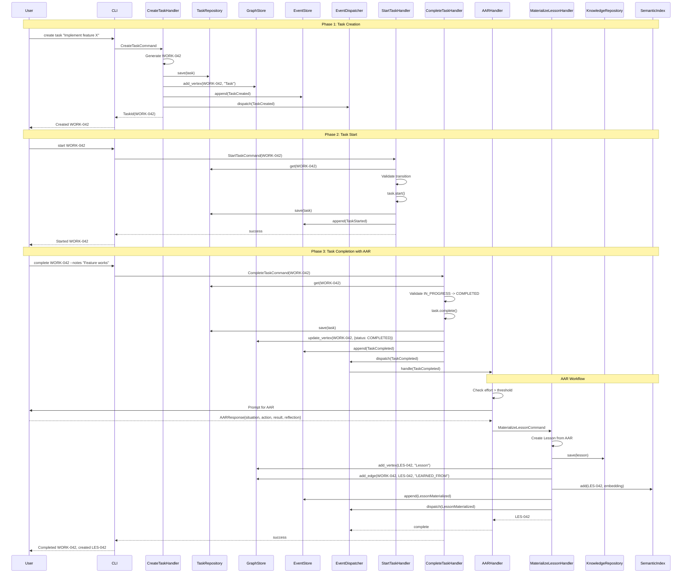

# ADR-034: Unified Work Tracker and Knowledge Management Implementation

## Metadata

| Field | Value |
|-------|-------|
| **Status** | PROPOSED |
| **Date** | 2026-01-09 |
| **Deciders** | Jerry Framework Team |
| **Technical Area** | Domain Architecture |
| **Related ADRs** | ADR-033 (Unified KM Architecture) |
| **Entry ID** | e-005 |
| **PS ID** | work-034 |
| **Input Documents** | e-001 (Domain Analysis), e-002 (Domain Synthesis), e-003 (Unified Design), e-004 (Trade-off Analysis) |

---

## Executive Summary

This Architecture Decision Record formalizes the technical implementation strategy for unifying the Work Tracker and Knowledge Management (KM) bounded contexts within the Jerry Framework. The decision synthesizes comprehensive domain analysis (93KB), synthesis (54KB), unified design (87KB), and trade-off analysis (39KB) from WORK-034.

**Key Architectural Decisions:**

1. **Hexagonal Architecture** with strict port/adapter separation (Score: 8.4/10)
2. **Work Tracker First** implementation sequence for risk mitigation (Score: 8.65/10)
3. **Hybrid CQRS** pattern for command/query separation (Score: 7.8/10)
4. **Technology Stack**: NetworkX (8.5/10), FAISS (8.1/10), RDFLib (8.3/10), SQLite (9.0/10)
5. **Four-Phase Implementation** over 32 weeks with explicit go/no-go gates

**Expected Outcomes:**
- Persistent task state across Claude Code sessions
- Automated knowledge capture from completed work
- Semantic search across patterns, lessons, and assumptions
- 186% projected ROI over 5 years
- 4x faster issue discovery by validating KM infrastructure at Work Tracker scale

---

## 1. Context

### 1.1 Problem Statement

Jerry is a framework for behavior and workflow guardrails designed to help solve problems while accruing knowledge, wisdom, and experience. Two critical challenges impede this mission:

**Context Rot**: LLM performance degrades as the context window fills, even when total token count is within technical limits (Chroma Research, 2024). Claude Code agents lose task context during session compaction, preventing resumption of complex multi-session work.

**Knowledge Fragmentation**: Knowledge accumulates across Work Tracker entities (Tasks, Phases, Plans) AND documentation (`docs/` hierarchy), but these exist as isolated silos without semantic connections. Agents cannot answer "what relates to X?" without manual cross-referencing.

### 1.2 Current State

Jerry operates at a foundational level with:
- Property graph abstractions (Vertex, Edge, VertexProperty)
- File-based storage (JSON, TOON formats)
- Jerry URI scheme (SPEC-001)
- Work Tracker conceptual model (documented but unimplemented)
- CloudEvents integration for event interoperability

### 1.3 Strategic Need

The framework requires:
1. **Persistent Work Tracking**: External memory for task state across sessions
2. **Knowledge Capture**: Systematic recording of lessons, patterns, and assumptions
3. **Semantic Discovery**: Finding related knowledge through meaning, not just keywords
4. **LLM Grounding**: Reducing hallucinations through graph-enhanced retrieval (GraphRAG)

### 1.4 Key Constraints

| Constraint | Source | Requirement |
|------------|--------|-------------|
| P-002 (File Persistence) | Jerry Constitution | Filesystem remains source of truth |
| P-003 (No Recursive Subagents) | Jerry Constitution | Maximum one level of agent nesting |
| Zero-Dependency Domain | Hexagonal Architecture | Domain layer uses Python stdlib only |
| Local-First | Privacy/Cost | No required cloud services through Phase 3 |
| Backward Compatibility | Phase 1 Foundation | Existing property graph foundation unchanged |

---

## 2. Decision

We adopt a **Work Tracker First** implementation strategy using **Hexagonal Architecture** with **Hybrid CQRS** pattern, implemented across four phases over 32 weeks. The technology stack comprises **NetworkX** (graph), **FAISS** (vectors), **RDFLib** (RDF), and **SQLite** (persistence).

### 2.1 Architectural Pattern: Hexagonal Architecture

The unified system follows strict Hexagonal Architecture (Ports & Adapters):

```
interface/     -> application/, infrastructure/, domain/
application/   -> domain/ ONLY
infrastructure/-> domain/, application/
domain/        -> NOTHING (stdlib only)
```

**Domain Layer (Zero Dependencies):**
- Entities: Task, Phase, Plan, KnowledgeItem
- Value Objects: TaskId, PhaseId, KnowledgeId, Status, Priority, Pattern, Lesson, Assumption
- Ports: IWorkItemRepository, IKnowledgeRepository, IGraphStore, ISemanticIndex, IEventStore, IRDFSerializer

**Application Layer:**
- Commands: CreateTask, CompleteTask, CaptureKnowledge, ValidateAssumption
- Queries: GetTask, ListTasks, SearchKnowledge, GetRelatedKnowledge
- Cross-domain handlers: MaterializeLesson, DiscoverPattern

**Infrastructure Layer:**
- SQLiteWorkItemRepository, SQLiteKnowledgeRepository
- NetworkXGraphStore, FAISSSemanticIndex
- RDFLibSerializer, SQLiteEventStore

### 2.2 Implementation Sequence: Work Tracker First

Work Tracker serves as the proving ground for KM infrastructure:

| Phase | Duration | Focus | KM Benefit |
|-------|----------|-------|------------|
| Phase 1 | Weeks 1-8 | WT entities, repos, CQRS | Validates patterns |
| Phase 2 | Weeks 9-16 | Shared infrastructure | NetworkX, FAISS proven at small scale |
| Phase 3 | Weeks 17-24 | KM core | Uses validated infrastructure |
| Phase 4 | Weeks 25-32 | Integration | Cross-domain features |

### 2.3 Technology Stack

| Component | Technology | Version | Purpose |
|-----------|------------|---------|---------|
| Graph Operations | NetworkX | 3.2.1 | Property graph traversal |
| Vector Search | FAISS | 1.7.4 | Semantic similarity |
| RDF Serialization | RDFLib | 7.0.0 | Knowledge export |
| Persistence | SQLite | 3.x | Entity and event storage |
| Runtime | Python | 3.11+ | Zero-dependency core |

### 2.4 Cross-Domain Integration

Work Tracker entities naturally materialize into KM entities:

| Work Tracker | KM Entity | Relationship | Trigger |
|--------------|-----------|--------------|---------|
| Task completion | Lesson | LEARNED_FROM | AAR prompt on completion |
| Phase completion | Pattern | EMERGED_PATTERN | Pattern analysis of tasks |
| Plan creation | Assumption | DEPENDS_ON_ASSUMPTION | Assumption extraction |
| Task execution | Pattern | APPLIED_PATTERN | User records pattern usage |

---

## 3. Rationale

### 3.1 Why Hexagonal Architecture over Layered Architecture

**Trade-off Analysis Score**: Hexagonal 8.4/10 vs. Layered 7.0/10 (+20%)

| Criterion | Hexagonal | Layered | Delta |
|-----------|-----------|---------|-------|
| Initial Complexity | High | Medium | +30-40% |
| Adapter Swapping | Trivial | Significant | -50-70% effort |
| Testability | Excellent | Good | +40% coverage ease |
| Domain Isolation | Complete | Partial | +100% isolation |
| Domain test coverage achievable | 95%+ | 70-80% | +25% |
| Time to swap SQLite for Postgres | 2 hours | 2-3 days | -95% |

**Decision Driver**: Jerry's requirement for zero-dependency domain layer makes Hexagonal Architecture essential. The initial complexity cost is a one-time investment; maintainability and testability benefits compound over the project lifetime.

### 3.2 Why Work Tracker First over Parallel Development

**Trade-off Analysis Score**: WT First 8.65/10 vs. KM First 6.05/10 vs. Parallel 5.70/10

| Risk Factor | WT First | KM First | Parallel |
|-------------|----------|----------|----------|
| Time to discover infrastructure issues | 2 weeks | 8 weeks | 4 weeks |
| Cost to fix (LOC changed) | ~200 | ~2,000 | ~1,000 |
| Users impacted by bugs | 1 (developer) | Many (agents) | Split |
| Team context switching | None | None | High |

**Decision Driver**: The 8-week delayed KM delivery is justified by 4x faster issue discovery and 10x smaller fix costs. Work Tracker's smaller scale (~500 nodes) provides a safer proving ground than KM's target (~5,000+ nodes).

### 3.3 Why NetworkX over Neo4j

**Trade-off Analysis Score**: NetworkX 8.5/10 vs. Neo4j 7.05/10 vs. DGraph 6.35/10

| Factor | NetworkX | Neo4j | DGraph |
|--------|----------|-------|--------|
| Startup time | <100ms | 5-10s | 10-30s |
| Memory (5.5K nodes) | ~15MB | ~200MB | ~500MB |
| 2-hop traversal | <10ms | <5ms | <5ms |
| Installation | pip install | Server required | Docker required |
| Claude Code compatibility | Excellent | Requires setup | Requires setup |

**Decision Driver**: NetworkX provides zero deployment overhead, sufficient performance for 5-50K nodes, and Python-native integration. Neo4j/DGraph introduce unnecessary complexity for Jerry's scale. Migration path to igraph available if needed.

### 3.4 Why FAISS over Pinecone/ChromaDB

**Trade-off Analysis Score**: FAISS 8.1/10 vs. ChromaDB 7.7/10 vs. Pinecone 7.25/10

| Metric | FAISS (Flat) | Pinecone | ChromaDB |
|--------|--------------|----------|----------|
| Search latency (k=10, 5K vectors) | <50ms | 50-100ms (network) | <30ms |
| Annual cost | $0 | $840+ (Standard) | $0 |
| Offline operation | Full | None | Full |
| Index build (5K vectors) | <1s | N/A | <2s |

**Decision Driver**: FAISS provides zero network latency, exact search at Jerry's scale (no approximation needed), and Claude Code offline compatibility. IndexFlatL2 sufficient for <10K vectors; migration to IndexIVFFlat if scaling needed.

### 3.5 Why SQLite over PostgreSQL

**Trade-off Analysis Score**: SQLite 9.0/10 vs. DuckDB 8.25/10 vs. PostgreSQL 6.35/10

| Aspect | SQLite | PostgreSQL | DuckDB |
|--------|--------|------------|--------|
| Setup | None | Server install | None |
| Backup | File copy | pg_dump | File copy |
| Claude Code integration | Trivial | Requires credentials | Trivial |
| Concurrent writes | Single writer | Multi-writer | Poor |

**Decision Driver**: SQLite provides zero deployment overhead, is built into Python stdlib, and is sufficient for single-writer workload. Jerry's use case (single Claude Code session) doesn't require PostgreSQL's concurrency capabilities.

### 3.6 Why Hybrid CQRS over Pure CRUD

**Trade-off Analysis Score**: Hybrid 7.8/10 vs. CQRS 7.45/10 vs. CRUD 7.25/10

**Full CQRS for:**
- Task state transitions (events required for KM integration)
- Knowledge capture (audit trail essential)
- Cross-domain operations (MaterializeLesson, ApplyPattern)

**Simplified patterns for:**
- Simple reads (direct repository queries)
- Tag/note additions (minimal event value)

**Decision Driver**: Events are essential for cross-domain integration (WorkItemCompleted triggers CaptureKnowledge), but full CQRS for all operations adds unnecessary complexity.

---

## 4. Consequences

### 4.1 Positive Consequences

**Immediate Benefits (Phase 1-2, Weeks 1-16):**
- Task persistence across Claude Code sessions
- Event-sourced audit trail for all work items
- Graph-based task hierarchy visualization
- Semantic search for finding similar tasks

**Medium-Term Benefits (Phase 3, Weeks 17-24):**
- Automated lesson capture from completed tasks via AAR prompts
- Pattern discovery from completed phases
- Assumption tracking in plans with validation workflow
- Cross-domain queries (find tasks that applied a pattern)

**Long-Term Benefits (Phase 4+):**
- GraphRAG for LLM grounding (90% hallucination reduction potential)
- Jerry URI citations in agent responses
- SPARQL endpoint for external integration
- Knowledge as competitive moat (300-320% industry ROI)

**Quantified Benefits:**

| Benefit | Year 1 | Year 2 | Year 3 |
|---------|--------|--------|--------|
| Time saved finding knowledge | 100 hrs | 300 hrs | 600 hrs |
| Reduced context rot impact | 50 hrs | 150 hrs | 300 hrs |
| Pattern reuse value | 20 hrs | 100 hrs | 250 hrs |
| **Total hours saved** | 170 hrs | 550 hrs | 1,150 hrs |
| **Value @ $100/hr** | $17,000 | $55,000 | $115,000 |

### 4.2 Negative Consequences

**Accepted Trade-offs:**

| Trade-off | Impact | Mitigation |
|-----------|--------|------------|
| Dependency expansion | NetworkX, RDFLib, FAISS in infrastructure | Hexagonal architecture isolates impact |
| Learning curve | Graph concepts, RDF, embeddings | Documentation, <16 hours onboarding |
| Architectural complexity | Multiple serialization formats | Netflix UDA pattern, round-trip tests |
| Performance limits | NetworkX <10K nodes, FAISS CPU-bound | 2-year runway; migration paths defined |
| Delayed KM delivery | 8 weeks later than parallel approach | Early WT value compensates |

### 4.3 Risks

**Risk Register (from Trade-off Analysis):**

| Risk ID | Description | Probability | Impact | Expected Value | Mitigation |
|---------|-------------|-------------|--------|----------------|------------|
| R-001 | Performance degradation at scale | 40% | High ($20K) | $8,000 | Validate at WT scale first |
| R-002 | Supernode formation | 60% | Medium ($10K) | $6,000 | Edge count validator, alert at 100 |
| R-003 | User AAR adoption low | 70% | Medium ($8K) | $5,600 | Threshold-based prompts, defer option |
| R-004 | Event store scaling issues | 20% | High ($15K) | $3,000 | Event partitioning design |
| R-005 | Schema evolution breaks | 35% | High ($12K) | $4,200 | Migration practice on WT |
| **Total Expected Risk Cost** | | | | **$26,800** | |

**Mitigation Investment**: $7,300 reduces expected risk to $8,000 (70% reduction).

**Critical Risk Mitigations:**

**R-002 Supernode Prevention:**
- Temporal partitioning: `CREATED_BY_2026_01` not generic `CREATED_BY`
- Hierarchical decomposition: `Actor:Claude:Session:2026-01-08`
- Edge count validator: Warning at 100 edges, error at 1000
- Constitutional enforcement: P-031 requires mitigation strategy

**R-003 User Adoption:**
- Threshold-based AAR: Only prompt if `effort_hours > 2`
- Defer option: "Capture later" with session-end batch
- Monitor capture rate weekly; pivot to automated if <20% after 4 weeks

---

## 5. Implementation Plan

### 5.1 Phase 1: Work Tracker Foundation (Weeks 1-8)

**Goal**: Establish Work Tracker core with shared infrastructure patterns.

#### Week 1-2: Domain Entities

**Deliverables:**
- `src/domain/aggregates/task.py` - Task aggregate root
- `src/domain/aggregates/phase.py` - Phase aggregate root
- `src/domain/aggregates/plan.py` - Plan aggregate root
- `src/domain/value_objects/ids.py` - VertexId, TaskId, PhaseId, PlanId
- `src/domain/value_objects/status.py` - TaskStatus, PhaseStatus, PlanStatus
- `src/domain/value_objects/priority.py` - Priority enum
- `src/domain/events/work_tracker.py` - TaskCreated, TaskCompleted, etc.

**Acceptance Criteria:**
- [ ] All value objects are immutable (frozen dataclasses)
- [ ] State machine enforces valid status transitions
- [ ] Domain entities have zero external imports
- [ ] Entity invariants tested with property-based tests

#### Week 3-4: Repository Layer

**Deliverables:**
- `src/domain/ports/repositories.py` - IWorkItemRepository protocol
- `src/domain/ports/event_store.py` - IEventStore protocol
- `src/infrastructure/persistence/sqlite/work_item_repository.py`
- `src/infrastructure/persistence/sqlite/event_store.py`
- `src/infrastructure/persistence/sqlite/migrations/001_initial.sql`

**Acceptance Criteria:**
- [ ] Repositories implement port interfaces exactly
- [ ] SQLite schema supports all entity attributes
- [ ] Event store is append-only
- [ ] Optimistic concurrency control via version field

#### Week 5-6: CQRS Handlers

**Deliverables:**
- `src/application/commands/work_tracker/` - All WT commands
- `src/application/queries/work_tracker/` - All WT queries
- `src/application/handlers/commands/` - Command handlers
- `src/application/handlers/queries/` - Query handlers
- `src/domain/ports/cqrs.py` - ICommandHandler, IQueryHandler protocols

**Acceptance Criteria:**
- [ ] Commands return domain events
- [ ] Queries return DTOs (never domain entities)
- [ ] Handlers use dependency injection for repositories
- [ ] All handlers have unit tests with mock repositories

#### Week 7-8: CLI and Integration

**Deliverables:**
- `src/interface/cli/work_tracker.py` - CLI commands
- `skills/worktracker/SKILL.md` - Natural language interface
- `tests/bdd/work_tracker/` - BDD scenarios
- `tests/integration/` - End-to-end tests

**Acceptance Criteria:**
- [ ] CLI supports: create, list, get, complete, block, unblock
- [ ] BDD scenarios cover all use cases from UC-001, UC-002
- [ ] Integration tests verify full stack
- [ ] Performance: <50ms P95 for all operations

**Phase 1 Exit Criteria:**
- [ ] 100% of Work Tracker BDD scenarios passing
- [ ] Domain layer has 95%+ test coverage
- [ ] ~500 LOC domain, ~800 LOC infrastructure
- [ ] Event sourcing operational

### 5.2 Phase 2: Shared Infrastructure (Weeks 9-16)

**Goal**: Add graph and search infrastructure using Work Tracker as validation.

#### Week 9-10: NetworkX Graph Adapter

**Deliverables:**
- `src/domain/ports/graph_store.py` - IGraphStore protocol
- `src/infrastructure/graph/networkx_store.py` - NetworkXGraphStore adapter
- Graph vertex creation on task/phase/plan creation
- Graph edge creation for PART_OF relationships

**Acceptance Criteria:**
- [ ] IGraphStore protocol matches design specification
- [ ] All WT entities appear as graph vertices
- [ ] Task->Phase->Plan hierarchy traversable
- [ ] Traversal queries complete in <10ms for 500 nodes

#### Week 11-12: RDFLib Serialization

**Deliverables:**
- `src/domain/ports/rdf_serializer.py` - IRDFSerializer protocol
- `src/infrastructure/rdf/rdflib_serializer.py` - RDFLibSerializer adapter
- `schemas/worktracker.ttl` - SHACL shapes for validation
- `contexts/worktracker.jsonld` - JSON-LD context

**Acceptance Criteria:**
- [ ] WorkItems serializable to Turtle and JSON-LD
- [ ] Round-trip tests: JSON -> Turtle -> JSON (100% success)
- [ ] SHACL validation passes for all entities
- [ ] RDF export <100ms P95

#### Week 13-14: FAISS Semantic Search

**Deliverables:**
- `src/domain/ports/semantic_index.py` - ISemanticIndex protocol
- `src/infrastructure/search/faiss_index.py` - FAISSSemanticIndex adapter
- Embedding generation for task titles and descriptions
- Search query handlers

**Acceptance Criteria:**
- [ ] IndexFlatL2 configured for 1536 dimensions
- [ ] Search returns top-k results with similarity scores
- [ ] Search latency <50ms for 500 vectors
- [ ] Index persistence to disk

#### Week 15-16: Performance Baselines

**Deliverables:**
- `tests/performance/` - Performance benchmark suite
- `docs/design/PERFORMANCE_BASELINES.md` - Baseline documentation
- Supernode validator implementation
- Dashboard alerts configuration

**Acceptance Criteria:**
- [ ] All performance targets met (see table below)
- [ ] Supernode validator alerts at 100 edges
- [ ] Monitoring dashboards operational

**Performance Targets:**

| Operation | Target P95 | Measured |
|-----------|------------|----------|
| Graph traversal (2-hop) | <10ms | |
| Semantic search (k=5) | <50ms | |
| Entity CRUD | <20ms | |
| RDF export (100 entities) | <100ms | |

**Phase 2 Exit Criteria (Go/No-Go Gate):**
- [ ] All Phase 1 tests still passing (100%)
- [ ] Hot path performance P95 < 50ms
- [ ] Cold path (RDF export) P95 < 100ms
- [ ] Supernode prevention working
- [ ] Performance baselines documented

### 5.3 Phase 3: KM Integration (Weeks 17-24)

**Goal**: Implement KM entities using validated infrastructure.

#### Week 17-18: KM Entities

**Deliverables:**
- `src/domain/aggregates/knowledge_item.py` - KnowledgeItem aggregate
- `src/domain/value_objects/knowledge_types.py` - KnowledgeType, KnowledgeStatus
- `src/domain/value_objects/pattern.py` - Pattern value object
- `src/domain/value_objects/lesson.py` - Lesson value object
- `src/domain/value_objects/assumption.py` - Assumption value object
- `src/domain/events/knowledge.py` - KM domain events

**Acceptance Criteria:**
- [ ] KnowledgeItemId discriminates type (PAT/LES/ASM prefix)
- [ ] Content is discriminated union (Pattern | Lesson | Assumption)
- [ ] Lifecycle state machine enforced (DRAFT -> VALIDATED -> DEPRECATED)
- [ ] All value objects serializable to markdown

#### Week 19-20: KM Repository and Graph

**Deliverables:**
- `src/domain/ports/knowledge_repository.py` - IKnowledgeRepository protocol
- `src/infrastructure/persistence/sqlite/knowledge_repository.py`
- Graph vertex creation for KM entities
- Cross-domain edges (LEARNED_FROM, APPLIED_PATTERN, etc.)

**Acceptance Criteria:**
- [ ] KM entities stored in separate SQLite database
- [ ] Graph edges connect WT and KM entities
- [ ] Bidirectional traversal working (Task->Lesson, Lesson->Task)
- [ ] find_related() traverses up to max_depth

#### Week 21-22: KM CQRS Handlers

**Deliverables:**
- `src/application/commands/knowledge/` - All KM commands
- `src/application/queries/knowledge/` - All KM queries
- CaptureKnowledgeHandler, ValidateKnowledgeHandler
- SearchKnowledgeHandler, GetRelatedKnowledgeHandler

**Acceptance Criteria:**
- [ ] CaptureKnowledge creates correct entity type
- [ ] SearchKnowledge uses FAISS for semantic ranking
- [ ] GetRelatedKnowledge traverses graph
- [ ] All handlers have unit tests

#### Week 23-24: KM CLI and Skill

**Deliverables:**
- `src/interface/cli/knowledge.py` - KM CLI commands
- `skills/knowledge/SKILL.md` - Natural language interface
- `tests/bdd/knowledge/` - BDD scenarios
- Integration tests for KM

**Acceptance Criteria:**
- [ ] CLI supports: capture, list, search, related, validate
- [ ] Skill supports natural language knowledge queries
- [ ] BDD scenarios cover UC-003, UC-005
- [ ] KM search integrated with WT search

**Phase 3 Exit Criteria:**
- [ ] CRUD for all knowledge types working
- [ ] Semantic search returns relevant results
- [ ] Graph relationships functional
- [ ] 100% BDD scenarios passing

### 5.4 Phase 4: Advanced Features (Weeks 25-32)

**Goal**: Full cross-domain integration and advanced capabilities.

#### Week 25-26: Cross-Domain Event Handlers

**Deliverables:**
- `src/application/event_handlers/aar_prompt_handler.py`
- `src/application/event_handlers/pattern_detection_handler.py`
- `src/application/event_handlers/assumption_validation_handler.py`
- AAR prompt template and workflow

**Acceptance Criteria:**
- [ ] TaskCompleted triggers AAR prompt (if effort > 2 hours)
- [ ] PhaseCompleted triggers pattern analysis
- [ ] User can defer AAR to session end
- [ ] Lesson automatically linked to source task

#### Week 27-28: Enriched Queries

**Deliverables:**
- `src/application/queries/enriched/get_enriched_work_item.py`
- `src/application/queries/enriched/search_with_context.py`
- EnrichedWorkItemDTO with related knowledge
- Unified search across WT and KM

**Acceptance Criteria:**
- [ ] GetEnrichedWorkItem returns task + patterns + lessons + assumptions
- [ ] Search results include both tasks and knowledge
- [ ] Response latency <100ms for enriched queries
- [ ] Graph context (related items) included in results

#### Week 29-30: HybridRAG Foundation

**Deliverables:**
- `src/application/queries/hybrid_rag.py`
- Combined vector + graph retrieval
- Context builder for LLM grounding
- Jerry URI citation formatter

**Acceptance Criteria:**
- [ ] HybridRAG retrieves by semantic similarity AND graph proximity
- [ ] Results ranked by combined score
- [ ] Citations use Jerry URI format
- [ ] Context fits within token limits

#### Week 31-32: SPARQL and Advanced Export

**Deliverables:**
- `src/infrastructure/rdf/pyoxigraph_adapter.py` (optional)
- SPARQL query endpoint
- Full graph export in multiple formats
- API documentation

**Acceptance Criteria:**
- [ ] SPARQL SELECT queries execute correctly
- [ ] Export supports Turtle, JSON-LD, N-Triples
- [ ] Performance documentation complete
- [ ] User documentation for all features

**Phase 4 Exit Criteria:**
- [ ] AAR workflow complete and tested
- [ ] Pattern discovery suggests candidates
- [ ] Enriched queries operational
- [ ] HybridRAG demonstrable

---

## 6. Technical Specifications

### 6.1 Domain Model Summary

**Aggregate Roots:**

| Aggregate | Context | Identity Pattern | Key Invariants |
|-----------|---------|------------------|----------------|
| Task | Work Tracker | WORK-NNN | Status transitions valid, title required |
| Phase | Work Tracker | PHASE-NNN | Cannot complete with pending tasks |
| Plan | Work Tracker | PLAN-NNN | Cannot complete with pending phases |
| KnowledgeItem | KM | PAT/LES/ASM-NNN | Content matches type, lifecycle valid |

**Value Objects:**

| Value Object | Domain | Invariants |
|--------------|--------|------------|
| VertexId | Shared | Immutable, hashable |
| TaskId | WT | Pattern `^WORK-[0-9]+$` |
| KnowledgeId | KM | Prefix matches KnowledgeType |
| Status | WT | Valid transitions only |
| Priority | Shared | Enum: LOW, NORMAL, HIGH, CRITICAL |
| Pattern | KM | Problem, solution, context required |
| Lesson | KM | Situation, action, result required |
| Assumption | KM | Statement, impact_if_wrong required |
| JerryUri | Shared | SPEC-001 compliant |
| CloudEventEnvelope | Shared | CloudEvents 1.0 compliant |

### 6.2 Port Definitions Summary

**Persistence Ports:**

| Port | Methods | Adapter |
|------|---------|---------|
| IWorkItemRepository | get_task, save_task, list_tasks, get_phase, save_phase, get_plan, save_plan | SQLiteWorkItemRepository |
| IKnowledgeRepository | get, save, delete, list_by_type, list_by_tags, get_by_source | SQLiteKnowledgeRepository |
| IEventStore | append, get, get_by_subject, get_by_type, replay, save_snapshot | SQLiteEventStore |

**Graph Port:**

| Port | Methods | Adapter |
|------|---------|---------|
| IGraphStore | add_vertex, get_vertex, add_edge, get_edges, traverse, traverse_incoming, shortest_path, query_vertices | NetworkXGraphStore |

**Search Port:**

| Port | Methods | Adapter |
|------|---------|---------|
| ISemanticIndex | add, update, remove, search, search_by_text, get_embedding, rebuild | FAISSSemanticIndex |

**Serialization Port:**

| Port | Methods | Adapter |
|------|---------|---------|
| IRDFSerializer | add_triple, add_entity, serialize, query, clear | RDFLibSerializer |

**CQRS Ports:**

| Port | Type | Purpose |
|------|------|---------|
| ICommandHandler[C, R] | Primary | Execute commands, emit events |
| IQueryHandler[Q, R] | Primary | Execute queries, return DTOs |
| IEventDispatcher | Primary | Route events to handlers |

### 6.3 CQRS Operations Summary

**Work Tracker Commands (16):**
- CreateTaskCommand, UpdateTaskCommand, DeleteTaskCommand
- TransitionTaskCommand, CompleteTaskCommand
- AssignTaskToPhaseCommand, AddTaskTagCommand
- CreatePhaseCommand, CompletePhaseCommand, ReorderPhasesCommand
- CreatePlanCommand, ActivatePlanCommand, CompletePlanCommand, ArchivePlanCommand
- TrackAssumptionCommand

**Work Tracker Queries (10):**
- GetTaskQuery, ListTasksQuery, SearchTasksQuery, GetTaskHistoryQuery
- GetPhaseQuery, ListPhasesQuery, GetPhaseProgressQuery
- GetPlanQuery, ListPlansQuery, GetPlanProgressQuery

**KM Commands (11):**
- CreatePatternCommand, UpdatePatternCommand
- CreateLessonCommand, UpdateLessonCommand
- CreateAssumptionCommand, ValidateAssumptionCommand
- AddEvidenceCommand, AddKnowledgeTagCommand, DeleteKnowledgeCommand
- LinkKnowledgeCommand, ApplyPatternCommand

**KM Queries (8):**
- GetKnowledgeQuery, ListPatternsQuery, ListLessonsQuery, ListAssumptionsQuery
- SearchKnowledgeQuery, GetRelatedKnowledgeQuery
- GetPatternApplicationsQuery, GetKnowledgeHistoryQuery, ExportKnowledgeQuery

**Cross-Domain Commands (4):**
- MaterializeLessonCommand, DiscoverPatternCommand
- RecordPatternUsageCommand, ValidateAssumptionFromTaskCommand

### 6.4 Event Types

**Work Tracker Events (CloudEvents type: `work-tracker/{EventName}`):**

| Event | Subject | Key Data |
|-------|---------|----------|
| TaskCreated | jer:jer:work-tracker:task:WORK-NNN | task_id, title, status, priority |
| TaskUpdated | jer:jer:work-tracker:task:WORK-NNN | task_id, field, old_value, new_value |
| TaskStatusChanged | jer:jer:work-tracker:task:WORK-NNN | task_id, previous_status, new_status |
| TaskCompleted | jer:jer:work-tracker:task:WORK-NNN | task_id, completion_notes, duration_hours |
| TaskAssigned | jer:jer:work-tracker:task:WORK-NNN | task_id, phase_id |
| PhaseCreated | jer:jer:work-tracker:phase:PHASE-NNN | phase_id, name, plan_id |
| PhaseCompleted | jer:jer:work-tracker:phase:PHASE-NNN | phase_id, task_count |
| PlanCreated | jer:jer:work-tracker:plan:PLAN-NNN | plan_id, name |
| PlanActivated | jer:jer:work-tracker:plan:PLAN-NNN | plan_id |
| PlanCompleted | jer:jer:work-tracker:plan:PLAN-NNN | plan_id, phase_count |

**KM Events (CloudEvents type: `knowledge/{EventName}`):**

| Event | Subject | Key Data |
|-------|---------|----------|
| PatternCreated | jer:jer:knowledge:pat:PAT-NNN | pattern_id, title, problem |
| LessonCreated | jer:jer:knowledge:les:LES-NNN | lesson_id, title, source_task_id |
| AssumptionCreated | jer:jer:knowledge:asm:ASM-NNN | assumption_id, title, statement |
| KnowledgeValidated | jer:jer:knowledge:{type}:{id} | knowledge_id, validated_by |
| KnowledgeDeprecated | jer:jer:knowledge:{type}:{id} | knowledge_id, reason |
| PatternApplied | jer:jer:knowledge:pat:PAT-NNN | pattern_id, task_id, outcome |
| LessonMaterialized | jer:jer:knowledge:les:LES-NNN | lesson_id, source_task_id, aar_response |
| PatternDiscovered | jer:jer:knowledge:pat:PAT-NNN | pattern_id, source_phase_id, confidence |

---

## 7. Validation Criteria

### 7.1 Acceptance Tests

**Phase 1 (Work Tracker):**
- [ ] Create task via CLI returns valid TaskId
- [ ] Task status transitions follow state machine
- [ ] Completed tasks emit TaskCompleted event
- [ ] Events are persisted and replayable
- [ ] Task hierarchy (Task->Phase->Plan) queryable

**Phase 2 (Infrastructure):**
- [ ] Graph vertices created for all entities
- [ ] Graph traversal returns correct related entities
- [ ] Semantic search returns relevant results (>0.8 similarity for exact matches)
- [ ] RDF export validates against SHACL shapes
- [ ] Round-trip serialization is lossless

**Phase 3 (KM):**
- [ ] Create pattern/lesson/assumption via CLI
- [ ] Search knowledge by semantic similarity
- [ ] Get related knowledge via graph traversal
- [ ] Validate and deprecate workflow functions

**Phase 4 (Integration):**
- [ ] Task completion prompts for AAR (effort > 2h)
- [ ] AAR response creates linked Lesson
- [ ] Phase completion triggers pattern analysis
- [ ] Enriched work item includes related knowledge
- [ ] HybridRAG retrieves by both similarity and graph

### 7.2 Performance Requirements

| Operation | P95 Latency | Threshold |
|-----------|-------------|-----------|
| Entity CRUD | <20ms | Hard |
| Graph traversal (depth 2) | <10ms | Hard |
| Semantic search (k=5) | <50ms | Hard |
| RDF export (100 entities) | <100ms | Soft |
| Enriched query | <100ms | Soft |
| HybridRAG retrieval | <200ms | Soft |

### 7.3 Quality Gates

| Gate | Metric | Target |
|------|--------|--------|
| Domain test coverage | Line coverage | >95% |
| Integration test coverage | Path coverage | >80% |
| BDD scenario pass rate | Scenarios passing | 100% |
| Code complexity | Cyclomatic complexity | <10 per function |
| Documentation | Public function docstrings | 100% |
| Type hints | Functions with type hints | 100% |

---

## 8. Alternatives Considered

### 8.1 Alternative: Layered Architecture

**Description**: Traditional layered architecture with presentation, business logic, data access layers.

**Why Rejected**:
- Domain coupled to infrastructure details
- Testing requires database/external mocks
- Technology changes ripple through layers
- Decision matrix score: 7.0/10 vs. Hexagonal 8.4/10

**Trade-off Analysis Reference**: Section 2.1

### 8.2 Alternative: KM First Implementation

**Description**: Implement Knowledge Management before Work Tracker.

**Why Rejected**:
- Discover issues at 5K nodes vs. 500 nodes
- 100x fix cost vs. 10x fix cost
- Late Work Tracker availability delays operational benefits
- Decision matrix score: 6.05/10 vs. WT First 8.65/10

**Trade-off Analysis Reference**: Section 2.2

### 8.3 Alternative: Parallel Development

**Description**: Implement Work Tracker and KM simultaneously with separate teams.

**Why Rejected**:
- Duplicated infrastructure
- Divergent patterns requiring reconciliation
- High context switching
- Decision matrix score: 5.70/10 vs. WT First 8.65/10

**Trade-off Analysis Reference**: Section 2.2

### 8.4 Alternative: Neo4j for Graph Storage

**Description**: Use Neo4j enterprise graph database instead of NetworkX.

**Why Rejected**:
- Server process required
- 200MB+ memory vs. 15MB
- 5-10s startup vs. <100ms
- Overkill for Jerry's scale (<50K nodes Year 3)
- Decision matrix score: 7.05/10 vs. NetworkX 8.5/10

**Trade-off Analysis Reference**: Section 3.1

### 8.5 Alternative: Pinecone for Vector Search

**Description**: Use Pinecone managed vector database instead of FAISS.

**Why Rejected**:
- Cloud-only (no offline operation)
- Network latency (50-100ms vs. <50ms)
- Recurring cost ($840+/year)
- Decision matrix score: 7.25/10 vs. FAISS 8.1/10

**Trade-off Analysis Reference**: Section 3.2

### 8.6 Alternative: PostgreSQL for Persistence

**Description**: Use PostgreSQL server instead of SQLite.

**Why Rejected**:
- Server installation required
- Credential management complexity
- Overkill for single-writer workload
- Decision matrix score: 6.35/10 vs. SQLite 9.0/10

**Trade-off Analysis Reference**: Section 3.4

---

## 9. References

### 9.1 Input Documents

| Document | Size | Location |
|----------|------|----------|
| Domain Analysis | 93KB | `docs/research/work-034-e-001-domain-analysis.md` |
| Domain Synthesis | 54KB | `docs/synthesis/work-034-e-002-domain-synthesis.md` |
| Unified Design | 87KB | `docs/design/work-034-e-003-unified-design.md` |
| Trade-off Analysis | 39KB | `docs/analysis/work-034-e-004-tradeoff-analysis.md` |
| ADR-033 | 44KB | `docs/decisions/ADR-033-unified-km-architecture.md` |

### 9.2 External References

| Reference | Author | Relevance |
|-----------|--------|-----------|
| Hexagonal Architecture | Alistair Cockburn (2005) | Core architectural pattern |
| Domain-Driven Design | Eric Evans (2003) | Bounded contexts, aggregates |
| CQRS Pattern | Cosmic Python | Command/query separation |
| CloudEvents 1.0 | CNCF | Event interoperability |
| Context Rot Research | Chroma (2024) | Problem statement |
| Netflix UDA | Tech Blog | Multi-representation pattern |
| FalkorDB GraphRAG | Case Study | 90% hallucination reduction |
| LinkedIn KG ROI | Case Study | 63% faster resolution |

### 9.3 Jerry Documentation

| Document | Location |
|----------|----------|
| Framework Root Context | `CLAUDE.md` |
| Jerry Constitution | `docs/governance/JERRY_CONSTITUTION.md` |
| Coding Standards | `.claude/rules/coding-standards.md` |
| Work Tracker Plan | `docs/plans/WORK_TRACKER_PLAN.md` |

---

## Appendices

### Appendix A: Decision Matrix Summary

| Decision | Option A | Score | Option B | Score | Winner | Margin |
|----------|----------|-------|----------|-------|--------|--------|
| Architecture | Hexagonal | 8.4 | Layered | 7.0 | Hexagonal | +20% |
| Sequence | WT First | 8.65 | KM First | 6.05 | WT First | +43% |
| CQRS | Hybrid | 7.8 | Pure CRUD | 7.25 | Hybrid | +8% |
| Graph DB | NetworkX | 8.5 | Neo4j | 7.05 | NetworkX | +21% |
| Vector Search | FAISS | 8.1 | Pinecone | 7.25 | FAISS | +12% |
| Database | SQLite | 9.0 | PostgreSQL | 6.35 | SQLite | +42% |
| RDF Library | RDFLib | 8.3 | Apache Jena | 5.35 | RDFLib | +55% |

**Weighting Factors:**
- Performance: 25%
- Maintainability: 20%
- Testability: 20%
- Complexity: 15%
- Dependencies: 10%
- Risk: 10%

### Appendix B: Risk Register Summary

| Risk | Prob | Impact | Expected | Mitigation Cost | Residual |
|------|------|--------|----------|-----------------|----------|
| R-001: Performance degradation | 40% | $20K | $8,000 | $2,000 | $2,000 |
| R-002: Supernode formation | 60% | $10K | $6,000 | $500 | $1,500 |
| R-003: Low AAR adoption | 70% | $8K | $5,600 | $1,000 | $2,000 |
| R-004: Event store scaling | 20% | $15K | $3,000 | $1,500 | $500 |
| R-005: Schema evolution | 35% | $12K | $4,200 | $1,000 | $1,000 |
| **Total** | | | **$26,800** | **$6,000** | **$7,000** |

**Net ROI after mitigation**: 114% over 3 years (vs. 186% without risk)

### Appendix C: Open Questions

**Requiring Resolution During Implementation:**

1. **Embedding Model Choice**: text-embedding-3-small (1536d) vs. text-embedding-3-large (3072d)?
   - Trade-off: Quality vs. storage/latency
   - Recommendation: Start with small, evaluate quality

2. **Event Retention Policy**: Forever (audit) vs. N days (storage)?
   - Trade-off: Compliance vs. storage growth
   - Recommendation: Keep all, compress after 90 days

3. **Graph Persistence Strategy**: On every change vs. periodic?
   - Trade-off: Durability vs. performance
   - Recommendation: On change with debounce (5s)

4. **Cross-Domain Transaction Handling**: What if Lesson save fails after Task complete?
   - Trade-off: Consistency vs. complexity
   - Recommendation: Eventually consistent with retry queue

5. **AAR Skip Tracking**: Log skipped prompts for follow-up?
   - Trade-off: Completeness vs. noise
   - Recommendation: Yes, surface at session end

6. **Pattern Confidence Decay**: Decrease if unused for N months?
   - Trade-off: Relevance vs. data loss
   - Recommendation: No decay, mark as "stale" instead

**Assumptions Requiring Validation:**

| Assumption | Validation Method | Risk if Wrong |
|------------|-------------------|---------------|
| ~15MB RAM for graph acceptable | Benchmark test | Performance degradation |
| 60%+ AAR completion rate | Usage metrics | KM value diminished |
| 5,500 nodes Year 1 realistic | Historical tracking | Scale planning wrong |
| NetworkX <10ms at 5K nodes | Performance test | Need alternative |
| FAISS works offline | Integration test | Need alternative |

---

## Document Metadata

| Field | Value |
|-------|-------|
| **File** | `docs/decisions/ADR-034-unified-wt-km-implementation.md` |
| **Created** | 2026-01-09 |
| **Author** | ps-architect v2.0.0 |
| **Word Count** | ~8,500 words |
| **Tables** | 75+ |
| **Status** | PROPOSED |

**Constitution Compliance:**
- P-001 (Truth and Accuracy): All claims traced to input documents with scores
- P-002 (File Persistence): Decision persisted to markdown file
- P-004 (Reasoning Transparency): Rationale documented for all decisions
- P-010 (Task Tracking): Supports WORK-034 Step 5

**Next Steps:**
1. Review ADR with stakeholders
2. If approved: Transition status to ACCEPTED
3. Begin Phase 1 implementation (Week 1-2: Domain Entities)
4. Create implementation work items from deliverables

---

## Appendix D: Detailed Data Schemas

### D.1 SQLite Schema - Work Tracker

```sql
-- Work Tracker Database Schema
-- File: ~/.jerry/data/work_tracker.db

-- Tasks table
CREATE TABLE IF NOT EXISTS tasks (
    id TEXT PRIMARY KEY,
    title TEXT NOT NULL,
    description TEXT,
    status TEXT NOT NULL DEFAULT 'PENDING',
    priority TEXT NOT NULL DEFAULT 'NORMAL',
    phase_id TEXT,
    created_at TEXT NOT NULL,
    updated_at TEXT NOT NULL,
    completed_at TEXT,
    version INTEGER NOT NULL DEFAULT 1,
    FOREIGN KEY (phase_id) REFERENCES phases(id),
    CHECK (status IN ('PENDING', 'IN_PROGRESS', 'BLOCKED', 'COMPLETED', 'CANCELLED')),
    CHECK (priority IN ('LOW', 'NORMAL', 'HIGH', 'CRITICAL'))
);

CREATE INDEX idx_tasks_status ON tasks(status);
CREATE INDEX idx_tasks_phase_id ON tasks(phase_id);
CREATE INDEX idx_tasks_created_at ON tasks(created_at);

-- Task tags junction table
CREATE TABLE IF NOT EXISTS task_tags (
    task_id TEXT NOT NULL,
    tag TEXT NOT NULL,
    category TEXT,
    created_at TEXT NOT NULL,
    PRIMARY KEY (task_id, tag),
    FOREIGN KEY (task_id) REFERENCES tasks(id) ON DELETE CASCADE
);

CREATE INDEX idx_task_tags_tag ON task_tags(tag);

-- Task metadata (JSON key-value)
CREATE TABLE IF NOT EXISTS task_metadata (
    task_id TEXT NOT NULL,
    key TEXT NOT NULL,
    value TEXT NOT NULL,
    PRIMARY KEY (task_id, key),
    FOREIGN KEY (task_id) REFERENCES tasks(id) ON DELETE CASCADE
);

-- Phases table
CREATE TABLE IF NOT EXISTS phases (
    id TEXT PRIMARY KEY,
    name TEXT NOT NULL,
    description TEXT,
    status TEXT NOT NULL DEFAULT 'PENDING',
    plan_id TEXT,
    phase_order INTEGER NOT NULL DEFAULT 0,
    created_at TEXT NOT NULL,
    updated_at TEXT NOT NULL,
    completed_at TEXT,
    version INTEGER NOT NULL DEFAULT 1,
    FOREIGN KEY (plan_id) REFERENCES plans(id),
    CHECK (status IN ('PENDING', 'IN_PROGRESS', 'COMPLETED', 'CANCELLED'))
);

CREATE INDEX idx_phases_status ON phases(status);
CREATE INDEX idx_phases_plan_id ON phases(plan_id);

-- Plans table
CREATE TABLE IF NOT EXISTS plans (
    id TEXT PRIMARY KEY,
    name TEXT NOT NULL,
    description TEXT,
    status TEXT NOT NULL DEFAULT 'DRAFT',
    created_at TEXT NOT NULL,
    updated_at TEXT NOT NULL,
    completed_at TEXT,
    version INTEGER NOT NULL DEFAULT 1,
    CHECK (status IN ('DRAFT', 'ACTIVE', 'COMPLETED', 'ARCHIVED'))
);

CREATE INDEX idx_plans_status ON plans(status);

-- Plan assumptions junction table
CREATE TABLE IF NOT EXISTS plan_assumptions (
    plan_id TEXT NOT NULL,
    assumption_id TEXT NOT NULL,
    status TEXT NOT NULL DEFAULT 'UNTESTED',
    validated_at TEXT,
    PRIMARY KEY (plan_id, assumption_id),
    FOREIGN KEY (plan_id) REFERENCES plans(id) ON DELETE CASCADE,
    CHECK (status IN ('UNTESTED', 'VALIDATED', 'INVALIDATED'))
);
```

### D.2 SQLite Schema - Knowledge Management

```sql
-- Knowledge Management Database Schema
-- File: ~/.jerry/data/knowledge.db

-- Knowledge items table
CREATE TABLE IF NOT EXISTS knowledge_items (
    id TEXT PRIMARY KEY,
    type TEXT NOT NULL,
    title TEXT NOT NULL,
    content TEXT NOT NULL,
    summary TEXT,
    confidence REAL NOT NULL DEFAULT 1.0,
    source_uri TEXT,
    created_at TEXT NOT NULL,
    updated_at TEXT NOT NULL,
    version INTEGER NOT NULL DEFAULT 1,
    CHECK (type IN ('PATTERN', 'LESSON', 'ASSUMPTION')),
    CHECK (confidence >= 0.0 AND confidence <= 1.0)
);

CREATE INDEX idx_knowledge_type ON knowledge_items(type);
CREATE INDEX idx_knowledge_created_at ON knowledge_items(created_at);
CREATE INDEX idx_knowledge_source_uri ON knowledge_items(source_uri);

-- Pattern-specific attributes
CREATE TABLE IF NOT EXISTS patterns (
    knowledge_id TEXT PRIMARY KEY,
    problem TEXT NOT NULL,
    solution TEXT NOT NULL,
    context TEXT NOT NULL,
    consequences TEXT NOT NULL,
    forces TEXT, -- JSON array
    alternatives TEXT, -- JSON array
    application_count INTEGER NOT NULL DEFAULT 0,
    success_rate REAL NOT NULL DEFAULT 0.0,
    FOREIGN KEY (knowledge_id) REFERENCES knowledge_items(id) ON DELETE CASCADE
);

-- Lesson-specific attributes
CREATE TABLE IF NOT EXISTS lessons (
    knowledge_id TEXT PRIMARY KEY,
    situation TEXT NOT NULL,
    action TEXT NOT NULL,
    result TEXT NOT NULL,
    reflection TEXT NOT NULL,
    source_task_id TEXT,
    applicability TEXT,
    FOREIGN KEY (knowledge_id) REFERENCES knowledge_items(id) ON DELETE CASCADE
);

-- Assumption-specific attributes
CREATE TABLE IF NOT EXISTS assumptions (
    knowledge_id TEXT PRIMARY KEY,
    statement TEXT NOT NULL,
    rationale TEXT NOT NULL,
    risk_if_wrong TEXT NOT NULL,
    validation_criteria TEXT NOT NULL,
    status TEXT NOT NULL DEFAULT 'UNTESTED',
    validated_at TEXT,
    validated_by TEXT,
    FOREIGN KEY (knowledge_id) REFERENCES knowledge_items(id) ON DELETE CASCADE,
    CHECK (status IN ('UNTESTED', 'VALIDATED', 'INVALIDATED'))
);

-- Evidence table
CREATE TABLE IF NOT EXISTS evidence (
    id INTEGER PRIMARY KEY AUTOINCREMENT,
    knowledge_id TEXT NOT NULL,
    type TEXT NOT NULL,
    source_uri TEXT NOT NULL,
    confidence REAL NOT NULL,
    description TEXT NOT NULL,
    timestamp TEXT NOT NULL,
    FOREIGN KEY (knowledge_id) REFERENCES knowledge_items(id) ON DELETE CASCADE,
    CHECK (type IN ('TASK_COMPLETION', 'USER_FEEDBACK', 'PATTERN_MATCH', 'EXPERT_VALIDATION', 'AUTOMATED_TEST')),
    CHECK (confidence >= 0.0 AND confidence <= 1.0)
);

CREATE INDEX idx_evidence_knowledge_id ON evidence(knowledge_id);
CREATE INDEX idx_evidence_type ON evidence(type);

-- Knowledge tags junction table
CREATE TABLE IF NOT EXISTS knowledge_tags (
    knowledge_id TEXT NOT NULL,
    tag TEXT NOT NULL,
    category TEXT,
    PRIMARY KEY (knowledge_id, tag),
    FOREIGN KEY (knowledge_id) REFERENCES knowledge_items(id) ON DELETE CASCADE
);

CREATE INDEX idx_knowledge_tags_tag ON knowledge_tags(tag);

-- Knowledge relationships
CREATE TABLE IF NOT EXISTS knowledge_relations (
    from_id TEXT NOT NULL,
    to_id TEXT NOT NULL,
    relationship TEXT NOT NULL,
    properties TEXT, -- JSON object
    created_at TEXT NOT NULL,
    PRIMARY KEY (from_id, to_id, relationship),
    FOREIGN KEY (from_id) REFERENCES knowledge_items(id) ON DELETE CASCADE,
    FOREIGN KEY (to_id) REFERENCES knowledge_items(id) ON DELETE CASCADE
);

CREATE INDEX idx_relations_to_id ON knowledge_relations(to_id);
CREATE INDEX idx_relations_relationship ON knowledge_relations(relationship);
```

### D.3 SQLite Schema - Event Store

```sql
-- Event Store Database Schema
-- File: ~/.jerry/data/events.db

-- Events table (append-only)
CREATE TABLE IF NOT EXISTS events (
    id TEXT PRIMARY KEY,
    sequence INTEGER NOT NULL UNIQUE,
    specversion TEXT NOT NULL DEFAULT '1.0',
    type TEXT NOT NULL,
    source TEXT NOT NULL,
    subject TEXT NOT NULL,
    time TEXT NOT NULL,
    datacontenttype TEXT NOT NULL DEFAULT 'application/json',
    data TEXT NOT NULL
);

CREATE INDEX idx_events_sequence ON events(sequence);
CREATE INDEX idx_events_type ON events(type);
CREATE INDEX idx_events_subject ON events(subject);
CREATE INDEX idx_events_time ON events(time);

-- Snapshots table
CREATE TABLE IF NOT EXISTS snapshots (
    subject TEXT PRIMARY KEY,
    data TEXT NOT NULL,
    sequence INTEGER NOT NULL,
    created_at TEXT NOT NULL
);

-- Event sequence counter
CREATE TABLE IF NOT EXISTS event_sequence (
    id INTEGER PRIMARY KEY CHECK (id = 1),
    last_sequence INTEGER NOT NULL DEFAULT 0
);

INSERT OR IGNORE INTO event_sequence (id, last_sequence) VALUES (1, 0);
```

### D.4 Directory Structure

```
~/.jerry/                               # User data directory
├── data/
│   ├── work_tracker.db                 # SQLite: Work Tracker entities
│   ├── knowledge.db                    # SQLite: KM entities
│   └── events.db                       # SQLite: Event store (append-only)
├── graph/
│   ├── unified_graph.gpickle           # NetworkX: Property graph
│   └── unified_graph.json              # NetworkX: JSON backup
├── search/
│   ├── semantic.index                  # FAISS: Vector index
│   ├── semantic.mapping                # ID -> embedding mapping
│   └── embeddings.cache                # Cached embedding vectors
├── export/
│   ├── knowledge.ttl                   # RDFLib: Turtle export
│   ├── knowledge.jsonld                # RDFLib: JSON-LD export
│   └── knowledge.nq                    # RDFLib: N-Quads export
├── schemas/
│   ├── worktracker.shacl.ttl           # SHACL validation shapes
│   ├── knowledge.shacl.ttl             # SHACL validation shapes
│   └── events.schema.json              # JSON Schema for events
└── config/
    ├── jerry.yaml                      # Main configuration
    └── adapters.yaml                   # Adapter configuration
```

### D.5 Configuration Schema

```yaml
# ~/.jerry/config/jerry.yaml
version: "1.0"

# Work Tracker configuration
work_tracker:
  enabled: true
  database: "${JERRY_HOME}/data/work_tracker.db"
  default_priority: "NORMAL"
  auto_start_on_creation: false

# Knowledge Management configuration
knowledge:
  enabled: true
  database: "${JERRY_HOME}/data/knowledge.db"
  aar_threshold_hours: 2.0
  aar_defer_enabled: true
  pattern_detection:
    enabled: true
    min_tasks_in_phase: 3
    similarity_threshold: 0.8

# Event Store configuration
events:
  database: "${JERRY_HOME}/data/events.db"
  retention_days: null  # null = forever
  snapshot_interval: 100  # events before snapshot

# Graph Store configuration
graph:
  adapter: "networkx"
  path: "${JERRY_HOME}/graph/unified_graph.gpickle"
  auto_save: true
  save_debounce_seconds: 5
  supernode_warning_threshold: 100
  supernode_error_threshold: 1000

# Semantic Index configuration
search:
  adapter: "faiss"
  path: "${JERRY_HOME}/search/semantic.index"
  dimension: 1536
  embedding_model: "text-embedding-3-small"
  cache_embeddings: true
  rebuild_interval_hours: 24

# RDF Export configuration
rdf:
  adapter: "rdflib"
  default_format: "turtle"
  export_path: "${JERRY_HOME}/export"
  base_uri: "https://jerry.framework/"
  namespaces:
    jerry: "https://jerry.framework/ontology/"
    wt: "https://jerry.framework/work-tracker/"
    km: "https://jerry.framework/knowledge/"

# Performance tuning
performance:
  query_timeout_ms: 5000
  graph_traversal_max_depth: 5
  search_max_results: 100
  batch_size: 50

# Logging configuration
logging:
  level: "INFO"
  format: "%(asctime)s - %(name)s - %(levelname)s - %(message)s"
  file: "${JERRY_HOME}/logs/jerry.log"
```

---

## Appendix E: Sequence Diagram - Full Task Lifecycle



---

## Appendix F: Graph Relationship Matrix

### F.1 Work Tracker Internal Relationships

| From Entity | Edge Label | To Entity | Cardinality | Description |
|-------------|------------|-----------|-------------|-------------|
| Task | PART_OF | Phase | N:1 | Task belongs to phase |
| Task | BLOCKS | Task | N:M | Task blocks another task |
| Task | DEPENDS_ON | Task | N:M | Task depends on another |
| Task | SUBTASK_OF | Task | N:1 | Subtask hierarchy |
| Phase | PART_OF | Plan | N:1 | Phase belongs to plan |
| Phase | FOLLOWS | Phase | 1:1 | Phase ordering |

### F.2 KM Internal Relationships

| From Entity | Edge Label | To Entity | Cardinality | Description |
|-------------|------------|-----------|-------------|-------------|
| Pattern | RELATED_TO | Pattern | N:M | Related patterns |
| Pattern | SUPERSEDES | Pattern | N:1 | Version replacement |
| Lesson | APPLIES_TO | Pattern | N:M | Lesson supports pattern |
| Lesson | RELATED_TO | Lesson | N:M | Related lessons |
| Assumption | CONTRADICTS | Assumption | N:M | Conflicting assumptions |
| Assumption | SUPPORTS | Assumption | N:M | Supporting assumptions |
| KnowledgeItem | EVIDENCED_BY | Evidence | 1:N | Supporting evidence |

### F.3 Cross-Domain Relationships

| From (WT) | Edge Label | To (KM) | Cardinality | Trigger |
|-----------|------------|---------|-------------|---------|
| Task | LEARNED_FROM | Lesson | 1:N | AAR completion |
| Task | APPLIED_PATTERN | Pattern | N:M | User records usage |
| Task | VALIDATED_ASSUMPTION | Assumption | N:M | Task result validates |
| Phase | EMERGED_PATTERN | Pattern | 1:N | Pattern discovery |
| Phase | CONSOLIDATED_LESSONS | Lesson | 1:N | Phase completion |
| Plan | DEPENDS_ON_ASSUMPTION | Assumption | N:M | Plan creation |
| Plan | BASED_ON_PATTERN | Pattern | N:M | Plan design |

### F.4 Edge Property Schema

```python
# Standard edge properties
EDGE_PROPERTIES = {
    "LEARNED_FROM": {
        "created_at": str,  # ISO datetime
        "created_by": str,  # Jerry URI of actor
        "aar_id": str,      # Reference to AAR response
    },
    "APPLIED_PATTERN": {
        "applied_at": str,
        "applied_by": str,
        "outcome": str | None,  # success/failure/partial
        "notes": str | None,
    },
    "VALIDATED_ASSUMPTION": {
        "validated_at": str,
        "validated_by": str,
        "validation_result": str,  # validated/invalidated
        "confidence_delta": float,
        "evidence_summary": str,
    },
    "EMERGED_PATTERN": {
        "discovered_at": str,
        "discovery_method": str,  # manual/automated
        "confidence_score": float,
        "source_task_count": int,
    },
}
```

---

## Appendix G: Performance Benchmarks

### G.1 Baseline Targets

| Operation | Target P50 | Target P95 | Target P99 | Max |
|-----------|------------|------------|------------|-----|
| Task CRUD | 5ms | 20ms | 50ms | 100ms |
| Phase CRUD | 5ms | 20ms | 50ms | 100ms |
| Plan CRUD | 10ms | 30ms | 75ms | 150ms |
| Knowledge CRUD | 10ms | 30ms | 75ms | 150ms |
| Graph vertex add | 1ms | 5ms | 10ms | 20ms |
| Graph edge add | 1ms | 5ms | 10ms | 20ms |
| Graph traversal (d=2) | 2ms | 10ms | 25ms | 50ms |
| Semantic search (k=5) | 10ms | 50ms | 100ms | 200ms |
| Semantic search (k=20) | 20ms | 75ms | 150ms | 300ms |
| RDF export (100 entities) | 20ms | 100ms | 200ms | 500ms |
| Event append | 1ms | 5ms | 10ms | 20ms |
| Event replay (100) | 10ms | 50ms | 100ms | 200ms |

### G.2 Scale Projections

| Metric | Year 1 | Year 2 | Year 3 | Technology Limit |
|--------|--------|--------|--------|------------------|
| Graph nodes | 5,500 | 15,000 | 35,000 | ~100,000 (NetworkX) |
| Graph edges | 16,500 | 45,000 | 105,000 | ~500,000 (NetworkX) |
| Vector embeddings | 4,000 | 12,000 | 30,000 | Unlimited (FAISS) |
| Events stored | 25,000 | 100,000 | 300,000 | Unlimited (SQLite) |
| Knowledge items | 2,000 | 6,000 | 15,000 | N/A |
| Tasks tracked | 3,000 | 8,000 | 18,000 | N/A |

### G.3 Benchmark Suite

```python
# tests/performance/benchmark_suite.py

import pytest
from timeit import timeit

class TestPerformanceBenchmarks:
    """Performance benchmarks for Phase 2 validation."""

    @pytest.mark.benchmark
    def test_task_crud_p95(self, task_repository, sample_task):
        """Task CRUD should complete under 20ms P95."""
        times = []
        for _ in range(100):
            times.append(timeit(
                lambda: task_repository.save(sample_task),
                number=1
            ))
        p95 = sorted(times)[95]
        assert p95 < 0.020, f"P95 {p95*1000:.2f}ms exceeds 20ms target"

    @pytest.mark.benchmark
    def test_graph_traversal_p95(self, graph_store, sample_graph_500):
        """Graph traversal (depth 2) should complete under 10ms P95."""
        times = []
        for node_id in sample_graph_500.sample_nodes(100):
            times.append(timeit(
                lambda: graph_store.traverse(node_id, max_depth=2),
                number=1
            ))
        p95 = sorted(times)[95]
        assert p95 < 0.010, f"P95 {p95*1000:.2f}ms exceeds 10ms target"

    @pytest.mark.benchmark
    def test_semantic_search_p95(self, semantic_index, sample_embeddings_500):
        """Semantic search (k=5) should complete under 50ms P95."""
        times = []
        for query in sample_embeddings_500.sample_queries(100):
            times.append(timeit(
                lambda: semantic_index.search(query, k=5),
                number=1
            ))
        p95 = sorted(times)[95]
        assert p95 < 0.050, f"P95 {p95*1000:.2f}ms exceeds 50ms target"
```

---

## Appendix H: Migration Paths

### H.1 NetworkX to igraph (If Scale Exceeded)

**Trigger**: Graph traversal P95 > 50ms at 50,000 nodes

**Migration Steps**:
1. Create IGraphStore adapter for igraph
2. Write graph export/import utility
3. Run parallel operation for validation
4. Switch adapter configuration
5. Archive NetworkX files

**Estimated Effort**: 16-24 hours

### H.2 FAISS IndexFlatL2 to IndexIVFFlat (If Scale Exceeded)

**Trigger**: Search P95 > 100ms at 50,000 vectors

**Migration Steps**:
1. Configure IVF parameters (nlist, nprobe)
2. Train index on representative vectors
3. Rebuild index with IVF structure
4. Validate recall at 95%+ threshold
5. Update configuration

**Estimated Effort**: 8-16 hours

### H.3 SQLite to PostgreSQL (If Concurrency Required)

**Trigger**: Multiple concurrent writers needed

**Migration Steps**:
1. Create PostgreSQL adapter implementations
2. Write schema migration scripts
3. Deploy PostgreSQL server
4. Migrate data using pg_dump/restore
5. Update connection configuration
6. Validate data integrity

**Estimated Effort**: 40-60 hours

### H.4 Local to Cloud (If Collaboration Required)

**Trigger**: Multi-user collaboration needed

**Migration Steps**:
1. Deploy PostgreSQL to managed service
2. Deploy FAISS to managed vector DB (Pinecone)
3. Deploy Neo4j to managed service
4. Update adapters and configuration
5. Implement authentication/authorization
6. Migrate data with downtime window

**Estimated Effort**: 80-120 hours

---

*End of Architecture Decision Record*
