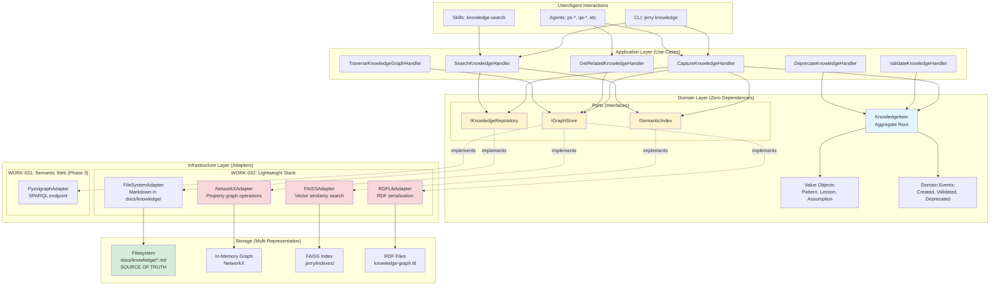
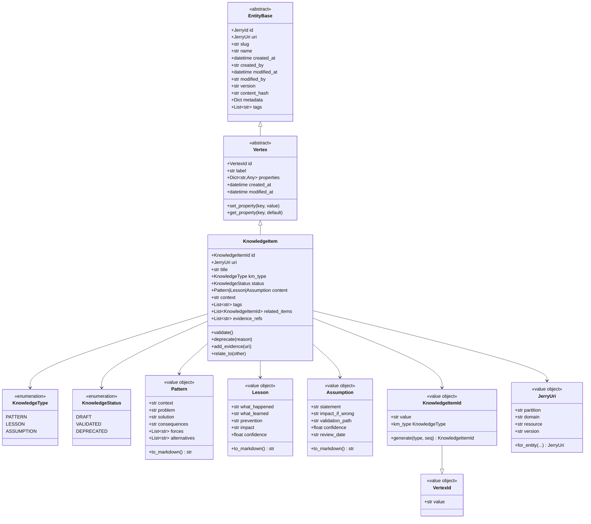
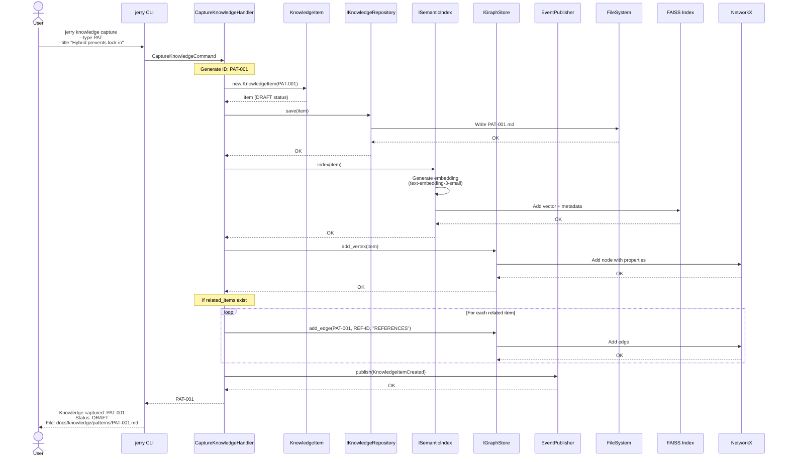
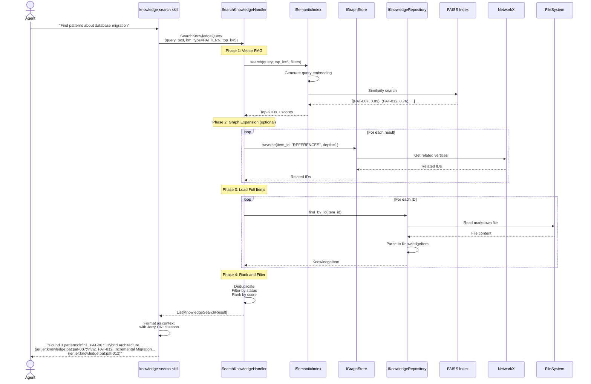
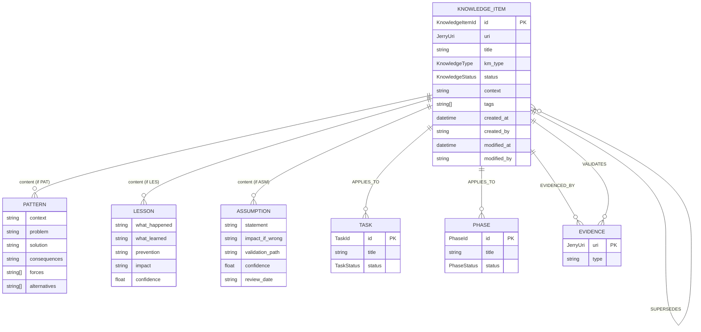

# Unified Knowledge Management Design for Jerry
# WORK-033 Entry 002: Architectural Design Document

**PS ID:** work-033
**Entry ID:** e-002
**Topic:** Unified Knowledge Management Architecture (WORK-031 + WORK-032)
**Type:** Design Document
**Date:** 2026-01-09
**Agent:** ps-architect v2.0.0
**Status:** PROPOSED

---

## Document Provenance

This design document synthesizes and unifies:
- **WORK-031** (ADR-031): Knowledge Architecture - Hybrid Property + RDF (22/25, 88%)
- **WORK-032** (ADR-032): KM Integration - Lightweight Stack (8.5/10, 85%)
- **Integration Analysis** (work-033-e-001): 95% compatibility, 5-layer model
- **Graph Data Model Analysis**: Property Graph foundation, Netflix UDA pattern
- **Domain Alignment**: EntityBase, VertexId, Jerry URI scheme

**Key Finding:** Both decisions independently converged on identical architectural patterns, enabling seamless integration without conflicts.

---

# L0: Executive Summary (Plain Language)

## What is Knowledge Management in Jerry?

Jerry is designed to help solve problems while accumulating knowledge, wisdom, and experience. Currently, Jerry stores knowledge as markdown files in the `docs/` folder, tracked by git. This works well for small amounts of information, but as knowledge grows, it becomes harder to:

- **Find related information**: "What else do we know about X?"
- **Discover patterns**: "Has this problem been solved before?"
- **Ground AI agents**: "What evidence supports this claim?"
- **Track relationships**: "What depends on what?"

**Knowledge Management (KM)** adds three capabilities to Jerry:

1. **Graph Layer** (NetworkX): Understand relationships between concepts
2. **Semantic Search** (FAISS): Find conceptually similar information, not just keyword matches
3. **Standards Export** (RDFLib): Share knowledge with other systems using web standards

Think of it like upgrading from a filing cabinet (files only) to a library system (files + card catalog + search).

## Why Does Jerry Need This?

Jerry's core mission is to **accrue knowledge while solving problems**. Without KM:

- Agents repeat work because they can't find what already exists
- Lessons learned sit unused because they're not discoverable
- Context rot degrades LLM performance as knowledge grows
- No way to answer "what relates to X?" without manual searching

**Industry evidence** shows that knowledge graphs:
- Reduce hallucinations by 90% (FalkorDB case study)
- Save 10-20% of time finding information
- Improve decision quality through better-informed choices

## How Does It Work?

Jerry's KM system has **three complementary layers**:

```
Layer 1: FILESYSTEM (Source of Truth)
├─ Markdown files in docs/ (human-readable)
├─ Git versioning (history, provenance)
└─ Direct agent access (no database required)
      ↓
Layer 2: GRAPH + VECTOR (Discovery and Retrieval)
├─ NetworkX: Relationship tracking (what connects to what)
├─ FAISS: Semantic search (find similar concepts)
└─ RDFLib: Standards export (share with other tools)
      ↓
Layer 3: AI INTEGRATION (Agent Intelligence)
├─ HybridRAG: Combine graph traversal + semantic search
├─ Jerry URI citations: Always show sources
└─ Grounding verification: Check facts against knowledge
```

**Key Principle:** Filesystem remains the source of truth. Graph and vector layers are **indexes** that can be rebuilt from files at any time. No vendor lock-in, no data loss risk.

## What Gets Built?

Jerry will have **knowledge items** of three types:

1. **Patterns (PAT)**: Reusable solutions to recurring problems
   - Example: "Hybrid architecture prevents vendor lock-in"
   - Contains: Context, Problem, Solution, Consequences

2. **Lessons (LES)**: Experience from past work
   - Example: "SHACL validation caught schema drift early"
   - Contains: What happened, What learned, How to prevent recurrence

3. **Assumptions (ASM)**: Beliefs that need validation
   - Example: "Jerry will remain single-tenant through 2026"
   - Contains: What we assume, Impact if wrong, How to validate

Each knowledge item:
- Lives as a markdown file in `docs/knowledge/`
- Has a unique ID (PAT-001, LES-042, ASM-003)
- Connects to other items via relationships (REFERENCES, APPLIES_TO, VALIDATES)
- Can be searched semantically ("find lessons about database migration")
- Exports to RDF for integration with external tools

## What's the Timeline?

**Phase 1 (Q1 2026, 8 weeks):**
- Week 1-2: Foundation (ports, adapters, protocols)
- Week 3-4: RDF serialization (export to web standards)
- Week 5-6: Graph layer (relationship discovery)
- Week 7-8: Vector search (semantic retrieval)

**Phase 2 (Q2-Q3 2026, 12 weeks):**
- GraphRAG integration (agent knowledge retrieval)
- SPARQL endpoint (query language for knowledge graph)
- Visualization (see knowledge as interactive graphs)

**Phase 3 (Q4 2026+, optional):**
- Only if needed: scale to production-grade tools
- Triggers: >10M items, multi-tenant, clustering requirements

## What Are the Risks?

| Risk | Mitigation |
|------|------------|
| **Complexity overhead** | Ports/adapters isolate changes; can rollback to filesystem-only |
| **Tool capacity limits** | NetworkX handles <10K nodes (sufficient for 1-2 years); migration path to igraph defined |
| **User adoption** | Lightweight protocols (AAR = 3 questions, <5 min); show value via "Lessons Applied" reports |
| **Over-engineering** | Strict phase gates; YAGNI discipline; quarterly ROI review |

**Overall Risk:** MODERATE (same as individual decisions). Combined mitigations stronger than either alone.

## Success Criteria

After Phase 1 (Q1 2026), Jerry will be able to:
- ✅ Answer "what relates to X?" via graph traversal
- ✅ Find conceptually similar documents via semantic search
- ✅ Export knowledge graph as RDF/Turtle (web standards)
- ✅ Ground agent responses in retrieved knowledge with citations
- ✅ Track knowledge reuse ("which patterns applied to new problems?")

**Measurable Targets:**
- 500+ knowledge items by Q2 2026
- 10-20% time saved finding information
- 15-25% reduced duplicate work

---

# L1: Technical Design (Software Engineer)

## 1. Domain Model: Knowledge Entities

### 1.1 KnowledgeItem (Aggregate Root)

```python
# src/domain/knowledge/entities/knowledge_item.py

from dataclasses import dataclass, field
from datetime import datetime
from typing import List, Dict, Any, Optional
from enum import Enum, auto

from ...graph.primitives import Vertex, VertexId
from ...identity import JerryUri
from ..value_objects import Pattern, Lesson, Assumption


class KnowledgeType(Enum):
    """Type classification for knowledge items."""
    PATTERN = "PAT"      # Reusable solution to recurring problem
    LESSON = "LES"       # Experience and learning from past work
    ASSUMPTION = "ASM"   # Belief that requires validation


class KnowledgeStatus(Enum):
    """Lifecycle status for knowledge items."""
    DRAFT = auto()        # Being captured, not yet validated
    VALIDATED = auto()    # Reviewed and confirmed as accurate
    DEPRECATED = auto()   # No longer applicable or superseded


@dataclass(frozen=True)
class KnowledgeItemId(VertexId):
    """Strongly-typed identifier for KnowledgeItem vertices."""

    def __post_init__(self):
        # Validate format: PAT-001, LES-042, ASM-003
        if not self.value.startswith(("PAT-", "LES-", "ASM-")):
            raise ValueError(
                f"KnowledgeItemId must start with PAT-, LES-, or ASM-: {self.value}"
            )

    @classmethod
    def generate(cls, km_type: KnowledgeType, sequence: int) -> "KnowledgeItemId":
        """Generate ID from type and sequence."""
        return cls(f"{km_type.value}-{sequence:03d}")

    @property
    def km_type(self) -> KnowledgeType:
        """Extract knowledge type from ID."""
        prefix = self.value.split("-")[0]
        return KnowledgeType(prefix)


@dataclass
class KnowledgeItem(Vertex):
    """
    Aggregate root for knowledge management.

    Represents a unit of knowledge captured, validated, and reused.
    Extends Vertex for graph storage compatibility.

    Design Principles:
    - EntityBase compliance (IAuditable, IVersioned)
    - Property Graph vertex (TinkerPop alignment)
    - Jerry URI scheme (SPEC-001)
    - Netflix UDA "Model Once, Represent Everywhere"

    Provenance:
    - WORK-031: Semantic web architecture
    - WORK-032: Practical KM implementation
    - Graph Data Model Analysis: Vertex/Edge abstractions
    """

    # Identity (VertexId base class)
    id: KnowledgeItemId
    uri: JerryUri = field(init=False)

    # Core properties
    title: str                          # Human-readable name (max 80 chars)
    km_type: KnowledgeType              # PAT, LES, or ASM
    status: KnowledgeStatus = KnowledgeStatus.DRAFT

    # Type-specific content (value objects)
    content: Pattern | Lesson | Assumption  # Discriminated union by km_type

    # Context and applicability
    context: str = ""                   # When/where this applies
    tags: List[str] = field(default_factory=list)

    # Relationships (stored as edges in graph)
    related_items: List[KnowledgeItemId] = field(default_factory=list)
    evidence_refs: List[str] = field(default_factory=list)  # Jerry URIs

    # Audit trail (IAuditable)
    created_at: datetime = field(default_factory=datetime.utcnow)
    created_by: str = "system:km"
    modified_at: datetime = field(default_factory=datetime.utcnow)
    modified_by: str = "system:km"

    # Versioning (IVersioned)
    version: str = ""
    content_hash: str = ""

    # Metadata
    metadata: Dict[str, Any] = field(default_factory=dict)

    def __post_init__(self):
        """Initialize vertex properties."""
        # Set vertex label based on type
        object.__setattr__(self, "label", f"KnowledgeItem:{self.km_type.value}")

        # Compute Jerry URI (SPEC-001)
        object.__setattr__(
            self,
            "uri",
            JerryUri.for_entity(
                domain="knowledge",
                entity_type=self.km_type.value.lower(),
                entity_id=self.id.value,
                version=self.content_hash[:8] if self.content_hash else None
            )
        )

        # Populate vertex properties for graph storage
        self.properties = {
            "title": self.title,
            "km_type": self.km_type.value,
            "status": self.status.name,
            "context": self.context,
            "tags": self.tags,
            "evidence_refs": self.evidence_refs,
            "created_at": self.created_at.isoformat(),
            "created_by": self.created_by,
            "modified_at": self.modified_at.isoformat(),
            "modified_by": self.modified_by,
            "version": self.version,
            "content_hash": self.content_hash,
        }

    def validate(self) -> None:
        """
        Transition from DRAFT to VALIDATED.

        Emits: KnowledgeItemValidated event
        """
        if self.status != KnowledgeStatus.DRAFT:
            raise ValueError(f"Cannot validate knowledge in {self.status} status")

        object.__setattr__(self, "status", KnowledgeStatus.VALIDATED)
        object.__setattr__(self, "modified_at", datetime.utcnow())

    def deprecate(self, reason: str) -> None:
        """
        Mark knowledge as no longer applicable.

        Args:
            reason: Why this knowledge is deprecated

        Emits: KnowledgeItemDeprecated event
        """
        object.__setattr__(self, "status", KnowledgeStatus.DEPRECATED)
        self.metadata["deprecation_reason"] = reason
        object.__setattr__(self, "modified_at", datetime.utcnow())

    def add_evidence(self, evidence_uri: JerryUri) -> None:
        """Link evidence to support this knowledge item."""
        self.evidence_refs.append(str(evidence_uri))
        object.__setattr__(self, "modified_at", datetime.utcnow())

    def relate_to(self, other: KnowledgeItemId) -> None:
        """Create relationship to another knowledge item."""
        if other not in self.related_items:
            self.related_items.append(other)
            object.__setattr__(self, "modified_at", datetime.utcnow())
```

### 1.2 Value Objects (Knowledge Content)

```python
# src/domain/knowledge/value_objects/pattern.py

from dataclasses import dataclass
from typing import List


@dataclass(frozen=True)
class Pattern:
    """
    Value object for Pattern knowledge (PAT).

    Captures: Context, Problem, Solution, Consequences
    Based on: Architecture Decision Record (ADR) format
    """

    context: str            # Situation where problem occurs
    problem: str            # Challenge to be solved
    solution: str           # Approach that addresses problem
    consequences: str       # Trade-offs and implications

    # Optional: Forces and alternatives
    forces: List[str] = None       # Competing concerns
    alternatives: List[str] = None  # Other options considered

    def to_markdown(self) -> str:
        """Serialize to markdown format."""
        md = f"## Context\n\n{self.context}\n\n"
        md += f"## Problem\n\n{self.problem}\n\n"
        md += f"## Solution\n\n{self.solution}\n\n"
        md += f"## Consequences\n\n{self.consequences}\n\n"

        if self.forces:
            md += f"## Forces\n\n" + "\n".join(f"- {f}" for f in self.forces) + "\n\n"

        if self.alternatives:
            md += f"## Alternatives Considered\n\n"
            md += "\n".join(f"- {a}" for a in self.alternatives) + "\n\n"

        return md


# src/domain/knowledge/value_objects/lesson.py

@dataclass(frozen=True)
class Lesson:
    """
    Value object for Lesson knowledge (LES).

    Captures: What happened, What learned, Prevention
    Based on: After-Action Review (AAR) format
    """

    what_happened: str      # Specific situation or incident
    what_learned: str       # Insight gained from experience
    prevention: str         # How to avoid or repeat outcome

    # Optional: Impact and confidence
    impact: str = ""        # Magnitude of learning (LOW, MEDIUM, HIGH)
    confidence: float = 1.0  # How certain we are (0.0-1.0)

    def to_markdown(self) -> str:
        """Serialize to markdown format."""
        md = f"## What Happened\n\n{self.what_happened}\n\n"
        md += f"## What We Learned\n\n{self.what_learned}\n\n"
        md += f"## How to Apply This\n\n{self.prevention}\n\n"

        if self.impact:
            md += f"**Impact:** {self.impact}\n\n"

        if self.confidence < 1.0:
            md += f"**Confidence:** {self.confidence:.0%}\n\n"

        return md


# src/domain/knowledge/value_objects/assumption.py

@dataclass(frozen=True)
class Assumption:
    """
    Value object for Assumption knowledge (ASM).

    Captures: What we assume, Impact if wrong, Validation path
    Based on: Risk management and architectural assumptions
    """

    statement: str          # What we're assuming to be true
    impact_if_wrong: str    # Consequences if assumption proves false
    validation_path: str    # How to verify or invalidate

    # Optional: Confidence and monitoring
    confidence: float = 0.5  # How confident we are (0.0-1.0)
    review_date: str = ""    # When to re-evaluate (ISO 8601)

    def to_markdown(self) -> str:
        """Serialize to markdown format."""
        md = f"## Assumption\n\n{self.statement}\n\n"
        md += f"## Impact if Wrong\n\n{self.impact_if_wrong}\n\n"
        md += f"## Validation Path\n\n{self.validation_path}\n\n"
        md += f"**Confidence:** {self.confidence:.0%}\n\n"

        if self.review_date:
            md += f"**Review Date:** {self.review_date}\n\n"

        return md
```

## 2. Domain Ports (Hexagonal Architecture)

### 2.1 IKnowledgeRepository (Persistence Port)

```python
# src/domain/knowledge/ports/repository.py

from abc import ABC, abstractmethod
from typing import Optional, List
from ..entities import KnowledgeItem, KnowledgeItemId, KnowledgeType, KnowledgeStatus


class IKnowledgeRepository(ABC):
    """
    Port for knowledge item persistence operations.

    Infrastructure adapters:
    - FileSystemAdapter: Markdown files in docs/knowledge/
    - GraphAdapter: NetworkX for relationship queries
    - RDFAdapter: Turtle/JSON-LD export

    Hexagonal Architecture: Domain defines port, infrastructure implements.
    """

    @abstractmethod
    def save(self, item: KnowledgeItem) -> None:
        """
        Persist knowledge item.

        Implementation must:
        - Write to filesystem (source of truth)
        - Update graph index (if enabled)
        - Emit domain events
        """
        pass

    @abstractmethod
    def find_by_id(self, id: KnowledgeItemId) -> Optional[KnowledgeItem]:
        """Retrieve knowledge item by ID."""
        pass

    @abstractmethod
    def find_by_type(
        self,
        km_type: KnowledgeType,
        status: Optional[KnowledgeStatus] = None
    ) -> List[KnowledgeItem]:
        """Find all items of a specific type and optional status."""
        pass

    @abstractmethod
    def find_by_tag(self, tag: str) -> List[KnowledgeItem]:
        """Find items tagged with specific label."""
        pass

    @abstractmethod
    def find_related(
        self,
        item_id: KnowledgeItemId,
        max_depth: int = 2
    ) -> List[KnowledgeItem]:
        """
        Find knowledge items related to given item.

        Uses graph traversal to discover:
        - Direct references (depth 1)
        - Transitive relationships (depth 2+)
        """
        pass

    @abstractmethod
    def delete(self, id: KnowledgeItemId) -> None:
        """Remove knowledge item (soft delete via DEPRECATED status preferred)."""
        pass
```

### 2.2 ISemanticIndex (Vector Search Port)

```python
# src/domain/knowledge/ports/semantic_index.py

from abc import ABC, abstractmethod
from typing import List, Tuple
from ..entities import KnowledgeItem, KnowledgeItemId


class ISemanticIndex(ABC):
    """
    Port for semantic search operations.

    Infrastructure adapters:
    - FAISSAdapter: CPU-based vector similarity (Phase 1)
    - FAISSGPUAdapter: GPU-accelerated search (Phase 3, if needed)
    - ChromaDBAdapter: Alternative with built-in embeddings

    Design: Adapter manages embedding generation and index persistence.
    """

    @abstractmethod
    def index(self, item: KnowledgeItem) -> None:
        """
        Add knowledge item to semantic index.

        Implementation must:
        - Generate embeddings (text-embedding-3-small or local model)
        - Store vectors with metadata (ID, type, tags)
        - Handle incremental updates
        """
        pass

    @abstractmethod
    def search(
        self,
        query: str,
        top_k: int = 5,
        filters: dict = None
    ) -> List[Tuple[KnowledgeItemId, float]]:
        """
        Semantic search for similar knowledge items.

        Args:
            query: Natural language query
            top_k: Number of results to return
            filters: Optional constraints (type, status, tags)

        Returns:
            List of (KnowledgeItemId, similarity_score) tuples
        """
        pass

    @abstractmethod
    def reindex(self, items: List[KnowledgeItem]) -> None:
        """Rebuild index from scratch (expensive operation)."""
        pass

    @abstractmethod
    def remove(self, item_id: KnowledgeItemId) -> None:
        """Remove item from index."""
        pass
```

### 2.3 IGraphStore (Graph Operations Port)

```python
# src/domain/knowledge/ports/graph_store.py

from abc import ABC, abstractmethod
from typing import List, Dict, Any
from ..entities import KnowledgeItem, KnowledgeItemId
from ...graph.primitives import Edge


class IGraphStore(ABC):
    """
    Port for graph operations on knowledge items.

    Infrastructure adapters:
    - NetworkXAdapter: In-memory property graph (Phase 1)
    - RDFLibAdapter: RDF triple export (Phase 2)
    - PyoxigraphAdapter: Embedded RDF + SPARQL (Phase 3)

    Design: Supports both property graph and RDF paradigms.
    """

    @abstractmethod
    def add_vertex(self, item: KnowledgeItem) -> None:
        """Add knowledge item as graph vertex."""
        pass

    @abstractmethod
    def add_edge(
        self,
        from_id: KnowledgeItemId,
        to_id: KnowledgeItemId,
        label: str,
        properties: Dict[str, Any] = None
    ) -> Edge:
        """
        Create relationship between knowledge items.

        Edge labels:
        - REFERENCES: General citation
        - APPLIES_TO: Pattern applies to task/phase
        - VALIDATES: Evidence validates assumption
        - SUPERSEDES: New knowledge replaces old
        """
        pass

    @abstractmethod
    def traverse(
        self,
        start_id: KnowledgeItemId,
        edge_label: str,
        max_depth: int = 2
    ) -> List[KnowledgeItemId]:
        """
        Graph traversal from starting vertex.

        Gremlin equivalent:
            g.V(start_id).out(edge_label).limit(max_depth)
        """
        pass

    @abstractmethod
    def export_rdf(
        self,
        format: str = "turtle"
    ) -> str:
        """
        Export knowledge graph as RDF.

        Formats:
        - turtle: Human-readable RDF (Phase 2)
        - jsonld: JSON-LD with contexts (Phase 2)
        - ntriples: Line-oriented RDF

        Uses: RDFLib or pyoxigraph adapter
        """
        pass

    @abstractmethod
    def query_sparql(self, query: str) -> List[Dict[str, Any]]:
        """
        Execute SPARQL query against knowledge graph.

        Phase 3 only (requires pyoxigraph adapter).
        Returns empty list if not supported.
        """
        pass
```

## 3. Application Layer: Use Cases (CQRS)

### 3.1 Commands (Write Operations)

```python
# src/application/knowledge/commands/capture_knowledge.py

from dataclasses import dataclass
from typing import Optional
from ....domain.knowledge.entities import (
    KnowledgeItem, KnowledgeItemId, KnowledgeType, KnowledgeStatus
)
from ....domain.knowledge.value_objects import Pattern, Lesson, Assumption
from ....domain.knowledge.ports import IKnowledgeRepository, ISemanticIndex, IGraphStore
from ....domain.events import DomainEventPublisher
from ..events import KnowledgeItemCreated


@dataclass
class CaptureKnowledgeCommand:
    """Command to capture new knowledge item."""
    title: str
    km_type: KnowledgeType
    content: Pattern | Lesson | Assumption
    context: str = ""
    tags: list[str] = None
    related_items: list[KnowledgeItemId] = None
    evidence_refs: list[str] = None
    created_by: str = "system:km"


class CaptureKnowledgeHandler:
    """
    Use case: Capture new knowledge item.

    Flow:
    1. Generate ID based on type and sequence
    2. Create KnowledgeItem aggregate
    3. Persist to repository (filesystem + graph)
    4. Index for semantic search
    5. Emit KnowledgeItemCreated event

    CQRS: Command handler for write operation
    """

    def __init__(
        self,
        repository: IKnowledgeRepository,
        semantic_index: ISemanticIndex,
        graph_store: IGraphStore,
        event_publisher: DomainEventPublisher
    ):
        self.repository = repository
        self.semantic_index = semantic_index
        self.graph_store = graph_store
        self.event_publisher = event_publisher

    def handle(self, command: CaptureKnowledgeCommand) -> KnowledgeItemId:
        """Execute command and return new knowledge item ID."""

        # Generate next sequence number for type
        existing = self.repository.find_by_type(command.km_type)
        next_seq = len(existing) + 1

        # Create knowledge item
        item_id = KnowledgeItemId.generate(command.km_type, next_seq)
        item = KnowledgeItem(
            id=item_id,
            title=command.title,
            km_type=command.km_type,
            status=KnowledgeStatus.DRAFT,
            content=command.content,
            context=command.context,
            tags=command.tags or [],
            related_items=command.related_items or [],
            evidence_refs=command.evidence_refs or [],
            created_by=command.created_by,
            modified_by=command.created_by,
        )

        # Persist (filesystem source of truth)
        self.repository.save(item)

        # Index for semantic search
        self.semantic_index.index(item)

        # Add to graph
        self.graph_store.add_vertex(item)

        # Create relationship edges
        for related_id in item.related_items:
            self.graph_store.add_edge(
                from_id=item.id,
                to_id=related_id,
                label="REFERENCES"
            )

        # Emit event
        event = KnowledgeItemCreated(
            item_id=item_id,
            km_type=command.km_type,
            title=command.title,
            created_by=command.created_by
        )
        self.event_publisher.publish(event)

        return item_id
```

```python
# src/application/knowledge/commands/validate_knowledge.py

@dataclass
class ValidateKnowledgeCommand:
    """Command to validate knowledge item."""
    item_id: KnowledgeItemId
    validated_by: str = "system:validator"


class ValidateKnowledgeHandler:
    """
    Use case: Transition knowledge from DRAFT to VALIDATED.

    Flow:
    1. Load item from repository
    2. Call item.validate() (domain logic)
    3. Persist updated item
    4. Emit KnowledgeItemValidated event
    """

    def __init__(
        self,
        repository: IKnowledgeRepository,
        event_publisher: DomainEventPublisher
    ):
        self.repository = repository
        self.event_publisher = event_publisher

    def handle(self, command: ValidateKnowledgeCommand) -> None:
        # Load item
        item = self.repository.find_by_id(command.item_id)
        if not item:
            raise ValueError(f"Knowledge item not found: {command.item_id}")

        # Validate (domain logic)
        item.validate()
        object.__setattr__(item, "modified_by", command.validated_by)

        # Persist
        self.repository.save(item)

        # Emit event
        event = KnowledgeItemValidated(
            item_id=command.item_id,
            validated_by=command.validated_by
        )
        self.event_publisher.publish(event)
```

```python
# src/application/knowledge/commands/deprecate_knowledge.py

@dataclass
class DeprecateKnowledgeCommand:
    """Command to deprecate knowledge item."""
    item_id: KnowledgeItemId
    reason: str
    deprecated_by: str = "system:km"


class DeprecateKnowledgeHandler:
    """
    Use case: Mark knowledge as no longer applicable.

    Flow:
    1. Load item from repository
    2. Call item.deprecate(reason)
    3. Persist updated item
    4. Remove from semantic index (optional: keep with deprecation flag)
    5. Emit KnowledgeItemDeprecated event
    """

    def __init__(
        self,
        repository: IKnowledgeRepository,
        semantic_index: ISemanticIndex,
        event_publisher: DomainEventPublisher
    ):
        self.repository = repository
        self.semantic_index = semantic_index
        self.event_publisher = event_publisher

    def handle(self, command: DeprecateKnowledgeCommand) -> None:
        # Load item
        item = self.repository.find_by_id(command.item_id)
        if not item:
            raise ValueError(f"Knowledge item not found: {command.item_id}")

        # Deprecate (domain logic)
        item.deprecate(command.reason)
        object.__setattr__(item, "modified_by", command.deprecated_by)

        # Persist
        self.repository.save(item)

        # Remove from index (or mark as deprecated)
        self.semantic_index.remove(command.item_id)

        # Emit event
        event = KnowledgeItemDeprecated(
            item_id=command.item_id,
            reason=command.reason,
            deprecated_by=command.deprecated_by
        )
        self.event_publisher.publish(event)
```

### 3.2 Queries (Read Operations)

```python
# src/application/knowledge/queries/search_knowledge.py

from dataclasses import dataclass
from typing import List, Optional
from ....domain.knowledge.entities import KnowledgeItem, KnowledgeType
from ....domain.knowledge.ports import IKnowledgeRepository, ISemanticIndex


@dataclass
class SearchKnowledgeQuery:
    """Query for semantic knowledge search."""
    query_text: str
    km_type: Optional[KnowledgeType] = None
    top_k: int = 5
    min_similarity: float = 0.5


@dataclass
class KnowledgeSearchResult:
    """Result of semantic search."""
    item: KnowledgeItem
    similarity_score: float
    excerpt: str  # Relevant snippet


class SearchKnowledgeHandler:
    """
    Use case: Semantic search across knowledge base.

    Flow:
    1. Query semantic index (FAISS vector similarity)
    2. Filter by type if specified
    3. Load full items from repository
    4. Return ranked results with scores

    CQRS: Query handler for read operation
    """

    def __init__(
        self,
        repository: IKnowledgeRepository,
        semantic_index: ISemanticIndex
    ):
        self.repository = repository
        self.semantic_index = semantic_index

    def handle(self, query: SearchKnowledgeQuery) -> List[KnowledgeSearchResult]:
        # Semantic search
        filters = {"type": query.km_type.value} if query.km_type else {}

        matches = self.semantic_index.search(
            query=query.query_text,
            top_k=query.top_k,
            filters=filters
        )

        # Load full items and create results
        results = []
        for item_id, score in matches:
            if score < query.min_similarity:
                continue

            item = self.repository.find_by_id(item_id)
            if item:
                results.append(
                    KnowledgeSearchResult(
                        item=item,
                        similarity_score=score,
                        excerpt=self._extract_excerpt(item, query.query_text)
                    )
                )

        return results

    def _extract_excerpt(self, item: KnowledgeItem, query: str) -> str:
        """Extract relevant snippet from knowledge item."""
        # TODO: Implement text excerpt extraction
        return item.title
```

```python
# src/application/knowledge/queries/get_related_knowledge.py

@dataclass
class GetRelatedKnowledgeQuery:
    """Query for related knowledge items."""
    item_id: KnowledgeItemId
    max_depth: int = 2
    include_deprecated: bool = False


class GetRelatedKnowledgeHandler:
    """
    Use case: Find knowledge items related to a given item.

    Flow:
    1. Traverse graph from starting item
    2. Follow relationship edges (REFERENCES, APPLIES_TO, etc.)
    3. Load items from repository
    4. Filter by status if needed

    Uses: Graph traversal (NetworkX adapter)
    """

    def __init__(
        self,
        repository: IKnowledgeRepository,
        graph_store: IGraphStore
    ):
        self.repository = repository
        self.graph_store = graph_store

    def handle(self, query: GetRelatedKnowledgeQuery) -> List[KnowledgeItem]:
        # Graph traversal
        related_ids = self.repository.find_related(
            item_id=query.item_id,
            max_depth=query.max_depth
        )

        # Load items
        items = [self.repository.find_by_id(id) for id in related_ids]
        items = [item for item in items if item]  # Filter None

        # Filter deprecated if needed
        if not query.include_deprecated:
            items = [
                item for item in items
                if item.status != KnowledgeStatus.DEPRECATED
            ]

        return items
```

```python
# src/application/knowledge/queries/traverse_knowledge_graph.py

@dataclass
class TraverseKnowledgeGraphQuery:
    """Query for graph traversal patterns."""
    start_id: KnowledgeItemId
    edge_label: str  # REFERENCES, APPLIES_TO, VALIDATES, etc.
    max_depth: int = 2


class TraverseKnowledgeGraphHandler:
    """
    Use case: Execute graph traversal pattern.

    Flow:
    1. Start from given vertex
    2. Follow edges with specific label
    3. Return path up to max depth

    Gremlin equivalent:
        g.V(start_id).out(edge_label).path()
    """

    def __init__(self, graph_store: IGraphStore):
        self.graph_store = graph_store

    def handle(self, query: TraverseKnowledgeGraphQuery) -> List[KnowledgeItemId]:
        return self.graph_store.traverse(
            start_id=query.start_id,
            edge_label=query.edge_label,
            max_depth=query.max_depth
        )
```

## 4. Domain Events (CloudEvents 1.0)

```python
# src/domain/knowledge/events/knowledge_events.py

from dataclasses import dataclass
from datetime import datetime
from ....domain.events import DomainEvent
from ..entities import KnowledgeItemId, KnowledgeType


@dataclass
class KnowledgeItemCreated(DomainEvent):
    """
    Event: New knowledge item captured.

    CloudEvents 1.0 compliance:
    - type: jer:jer:knowledge:facts/KnowledgeItemCreated
    - source: jer:jer:knowledge:system
    """
    item_id: KnowledgeItemId
    km_type: KnowledgeType
    title: str
    created_by: str
    timestamp: datetime = None

    def __post_init__(self):
        if not self.timestamp:
            object.__setattr__(self, "timestamp", datetime.utcnow())

    @property
    def event_type(self) -> str:
        return "jer:jer:knowledge:facts/KnowledgeItemCreated"

    @property
    def event_source(self) -> str:
        return "jer:jer:knowledge:system"


@dataclass
class KnowledgeItemValidated(DomainEvent):
    """Event: Knowledge item validated and approved."""
    item_id: KnowledgeItemId
    validated_by: str
    timestamp: datetime = None

    def __post_init__(self):
        if not self.timestamp:
            object.__setattr__(self, "timestamp", datetime.utcnow())

    @property
    def event_type(self) -> str:
        return "jer:jer:knowledge:facts/KnowledgeItemValidated"

    @property
    def event_source(self) -> str:
        return f"jer:jer:knowledge:item:{self.item_id.value}"


@dataclass
class KnowledgeItemDeprecated(DomainEvent):
    """Event: Knowledge item marked as no longer applicable."""
    item_id: KnowledgeItemId
    reason: str
    deprecated_by: str
    timestamp: datetime = None

    def __post_init__(self):
        if not self.timestamp:
            object.__setattr__(self, "timestamp", datetime.utcnow())

    @property
    def event_type(self) -> str:
        return "jer:jer:knowledge:facts/KnowledgeItemDeprecated"

    @property
    def event_source(self) -> str:
        return f"jer:jer:knowledge:item:{self.item_id.value}"


@dataclass
class KnowledgeRelationCreated(DomainEvent):
    """Event: Relationship created between knowledge items."""
    from_id: KnowledgeItemId
    to_id: KnowledgeItemId
    relation_type: str  # REFERENCES, APPLIES_TO, VALIDATES, etc.
    created_by: str
    timestamp: datetime = None

    def __post_init__(self):
        if not self.timestamp:
            object.__setattr__(self, "timestamp", datetime.utcnow())

    @property
    def event_type(self) -> str:
        return "jer:jer:knowledge:facts/KnowledgeRelationCreated"

    @property
    def event_source(self) -> str:
        return f"jer:jer:knowledge:item:{self.from_id.value}"
```

---

# L2: Strategic Architecture (Principal Architect)

## 1. Component Architecture

### 1.1 Hexagonal Architecture Integration



**Key Design Decisions:**

1. **Hexagonal Architecture Compliance**:
   - Domain layer defines ports (interfaces)
   - Infrastructure layer provides adapters (implementations)
   - Application layer orchestrates use cases
   - Zero dependencies in domain (pure Python stdlib)

2. **Multi-Adapter Strategy** (Netflix UDA):
   - FileSystemAdapter: Source of truth (markdown files)
   - NetworkXAdapter: Graph operations (relationship queries)
   - FAISSAdapter: Semantic search (vector similarity)
   - RDFLibAdapter: Standards export (Turtle, JSON-LD)
   - PyoxigraphAdapter: SPARQL endpoint (Phase 3)

3. **WORK-031 + WORK-032 Integration**:
   - WORK-032 provides Phase 1-2 adapters (NetworkX, FAISS, RDFLib)
   - WORK-031 provides Phase 3 adapter (pyoxigraph)
   - Both use same ports (swappable implementations)

## 2. Class Diagram: Knowledge Management Entities



**Inheritance Hierarchy:**

1. **EntityBase**: Common properties (IAuditable, IVersioned)
2. **Vertex**: Graph abstraction (TinkerPop alignment)
3. **KnowledgeItem**: Domain-specific aggregate root

**Value Objects:**
- **KnowledgeItemId**: Strongly-typed identity (PAT-001, LES-042, ASM-003)
- **Pattern, Lesson, Assumption**: Knowledge content (discriminated union)
- **JerryUri**: Resource identifier (SPEC-001)

## 3. Sequence Diagram: Capture Knowledge Workflow



**Key Steps:**

1. **Command Creation**: User invokes CLI with knowledge details
2. **ID Generation**: Sequential ID based on type (PAT, LES, ASM)
3. **Aggregate Creation**: KnowledgeItem entity with DRAFT status
4. **Persistence**: Write to filesystem (source of truth)
5. **Indexing**: Generate embedding and add to FAISS
6. **Graph Update**: Add vertex and relationship edges (NetworkX)
7. **Event Publication**: Emit KnowledgeItemCreated event

**Design Principles:**

- Filesystem write is authoritative (can rebuild indexes from files)
- Idempotent operations (can replay if index/graph corruption)
- Event sourcing for audit trail

## 4. Sequence Diagram: Retrieve Knowledge Workflow (HybridRAG)



**HybridRAG Flow:**

1. **Vector RAG** (WORK-032): Semantic similarity search via FAISS
2. **Graph RAG** (WORK-031): Expand to related items via NetworkX traversal
3. **Deduplication**: Merge results from both sources
4. **Grounding**: Load full items from filesystem (source of truth)
5. **Citation**: Return Jerry URIs for transparency

**Performance Targets** (from WORK-031):
- Vector search: <2 seconds (WORK-032)
- Graph traversal: <50ms P95 (WORK-031)
- Total retrieval: <3 seconds end-to-end

## 5. Entity-Relationship Diagram: Knowledge Graph



**Relationship Types:**

| Edge Label | From | To | Semantics |
|------------|------|-----|-----------|
| **REFERENCES** | KnowledgeItem | KnowledgeItem | General citation |
| **SUPERSEDES** | KnowledgeItem | KnowledgeItem | Newer replaces older |
| **APPLIES_TO** | KnowledgeItem | Task/Phase | Pattern/Lesson used in work |
| **EVIDENCED_BY** | KnowledgeItem | Evidence | Supporting documentation |
| **VALIDATES** | Assumption | Evidence | Evidence confirms/refutes assumption |

**Graph Properties:**

- **Multi-graph**: Multiple edges between same vertices allowed
- **Directed**: All edges have explicit source → target
- **Attributed**: Both vertices and edges have properties
- **Labeled**: Typed via labels (not inheritance)

## 6. Integration with Existing Jerry Architecture

### 6.1 Work Tracker Integration

```
┌──────────────────────────────────────────────────────────────────┐
│                    WORK TRACKER                                   │
│  ┌──────────┐    ┌──────────┐    ┌──────────┐                   │
│  │   Plan   │───►│  Phase   │───►│   Task   │                   │
│  └──────────┘    └──────────┘    └──────────┘                   │
│                                         │                         │
└─────────────────────────────────────────┼─────────────────────────┘
                                          │
                                          │ APPLIES_TO
                                          ▼
┌──────────────────────────────────────────────────────────────────┐
│                 KNOWLEDGE MANAGEMENT                              │
│  ┌──────────────┐  ┌──────────────┐  ┌──────────────┐           │
│  │   Pattern    │  │    Lesson    │  │  Assumption  │           │
│  │   (PAT)      │  │    (LES)     │  │    (ASM)     │           │
│  └──────────────┘  └──────────────┘  └──────────────┘           │
│                                                                   │
│  Example:                                                         │
│  TASK-042 (Implement SHACL validation)                           │
│     ├─ APPLIES: PAT-001 (Hybrid Architecture)                    │
│     └─ LEARNED: LES-012 (Schema validation catches drift)        │
└──────────────────────────────────────────────────────────────────┘
```

**Integration Points:**

1. **Task → Pattern**: "Which pattern did we apply?"
2. **Task → Lesson**: "What did we learn from this?"
3. **Phase → Assumption**: "What assumptions does this phase rely on?"

**Use Cases:**
- After-Action Review: Capture lessons from completed tasks
- Pattern Application: Link pattern to task that uses it
- Assumption Tracking: Monitor assumptions per phase/plan

### 6.2 Filesystem Integration

```
docs/
├── knowledge/                    # Knowledge Management root
│   ├── patterns/                # Patterns (PAT)
│   │   ├── PAT-001-hybrid-architecture.md
│   │   ├── PAT-002-four-phase-maturity.md
│   │   └── PAT-003-netflix-uda.md
│   │
│   ├── lessons/                 # Lessons Learned (LES)
│   │   ├── LES-001-shacl-validation.md
│   │   ├── LES-002-supernode-detection.md
│   │   └── LES-003-rdflib-performance.md
│   │
│   ├── assumptions/             # Assumptions (ASM)
│   │   ├── ASM-001-single-tenant.md
│   │   ├── ASM-002-entity-count.md
│   │   └── ASM-003-embedded-sufficient.md
│   │
│   └── index.md                 # Knowledge catalog (auto-generated)
│
├── decisions/                   # ADRs (Evidence)
├── research/                    # Research reports (Evidence)
├── experience/                  # Raw experience notes
└── wisdom/                      # Distilled wisdom
```

**File Format** (Markdown with YAML frontmatter):

```markdown
---
id: PAT-001
uri: jer:jer:knowledge:pat:pat-001+a1b2c3d4
title: Hybrid Property Graph + RDF Architecture
km_type: PATTERN
status: VALIDATED
context: |
  Need standards compliance without sacrificing performance
tags:
  - architecture
  - semantic-web
  - property-graph
related_items:
  - ADR-031
  - PAT-002
evidence_refs:
  - jer:jer:work-tracker:decisions:ADR-031
created_at: 2026-01-08T10:30:00Z
created_by: user:architect
modified_at: 2026-01-09T14:20:00Z
modified_by: user:validator
content_hash: a1b2c3d4e5f6g7h8
version: 2026-01-09T14:20:00Z_a1b2c3d4
---

# Hybrid Property Graph + RDF Architecture

## Context

Jerry needs a knowledge architecture that provides:
- Fast operational queries (property graph)
- Standards compliance (RDF/SPARQL)
- Backward compatibility (existing Phase 1)

## Problem

Pure property graph lacks semantic web interoperability.
Pure RDF has poor query performance (50-500ms vs 5-10ms).

## Solution

Use property graph as primary storage, RDF as export layer.
Implement Netflix UDA "Model Once, Represent Everywhere" pattern.

## Consequences

**Positive:**
- Best of both worlds: fast operations + standards compliance
- Incremental adoption (Phase 2: RDF export, Phase 3: SPARQL)

**Negative:**
- Multiple serializers to maintain
- Synchronization overhead between representations

## Forces

- Performance: Property graph wins (5-10ms traversals)
- Standards: RDF required for 5-star Linked Open Data
- Complexity: Multi-representation adds overhead

## Alternatives Considered

1. Property graph only: No semantic web integration
2. RDF only: 10x slower query performance
3. Vector DB only: Can't answer relational queries
```

### 6.3 Event Integration (CloudEvents)

```
┌──────────────────────────────────────────────────────────────────┐
│                     EVENT STREAM                                  │
│                                                                   │
│  CloudEvent: KnowledgeItemCreated                                 │
│  ├─ type: jer:jer:knowledge:facts/KnowledgeItemCreated          │
│  ├─ source: jer:jer:knowledge:system                            │
│  ├─ subject: jer:jer:knowledge:pat:pat-001                      │
│  ├─ time: 2026-01-09T10:30:00Z                                  │
│  └─ data:                                                         │
│      ├─ item_id: PAT-001                                         │
│      ├─ km_type: PATTERN                                         │
│      ├─ title: "Hybrid Architecture"                             │
│      └─ created_by: user:architect                               │
│                                                                   │
│  CloudEvent: KnowledgeItemValidated                               │
│  ├─ type: jer:jer:knowledge:facts/KnowledgeItemValidated        │
│  ├─ source: jer:jer:knowledge:item:pat-001                      │
│  ├─ subject: jer:jer:knowledge:pat:pat-001                      │
│  ├─ time: 2026-01-09T14:20:00Z                                  │
│  └─ data:                                                         │
│      ├─ item_id: PAT-001                                         │
│      └─ validated_by: user:validator                             │
└──────────────────────────────────────────────────────────────────┘
```

**Event Consumers:**
- Audit trail (who created/modified what)
- Notification system (new knowledge available)
- Analytics (knowledge growth metrics)
- External integrations (webhook triggers)

---

# Implementation Roadmap

## Phase 1: Foundation (Q1 2026, Weeks 1-2)

**Deliverables:**
```python
# Port definitions (domain layer)
src/domain/knowledge/ports/
├── repository.py            # IKnowledgeRepository
├── semantic_index.py        # ISemanticIndex
└── graph_store.py           # IGraphStore

# Entities and value objects
src/domain/knowledge/entities/
└── knowledge_item.py        # KnowledgeItem, KnowledgeItemId

src/domain/knowledge/value_objects/
├── pattern.py               # Pattern value object
├── lesson.py                # Lesson value object
└── assumption.py            # Assumption value object

# Events
src/domain/knowledge/events/
└── knowledge_events.py      # Created, Validated, Deprecated

# Infrastructure adapters
src/infrastructure/knowledge/
├── filesystem_adapter.py    # Markdown persistence
├── networkx_adapter.py      # Graph operations
├── faiss_adapter.py         # Vector search
└── rdflib_adapter.py        # RDF serialization

# Dependencies
requirements.txt:
  networkx==3.2.1
  rdflib==7.0.0
  faiss-cpu==1.7.4
```

**Success Criteria:**
- ✅ Create PAT-001 (pattern) via CLI
- ✅ Search "hybrid architecture" finds PAT-001
- ✅ Export knowledge graph as Turtle
- ✅ All tests passing

## Phase 2: Integration (Q1 2026, Weeks 3-8)

**Week 3-4: RDF Serialization** (WORK-031)
- JSON-LD contexts (`contexts/knowledge.jsonld`)
- SHACL validation shapes (`schemas/knowledge-shapes.ttl`)
- Automated round-trip tests (JSON ↔ Turtle ↔ JSON-LD)

**Week 5-6: Graph Layer** (WORK-032)
- Entity extraction from markdown
- Relationship detection (REFERENCES, APPLIES_TO)
- CLI: `jerry knowledge graph --query "find related to PAT-001"`

**Week 7-8: Vector RAG**
- FAISS index for semantic search
- CLI: `jerry knowledge search "database migration patterns"`
- Integration tests (HybridRAG workflow)

**Success Criteria:**
- ✅ 500+ knowledge items indexed
- ✅ Semantic search <2 seconds
- ✅ Graph traversal <50ms P95
- ✅ RDF export validated

## Phase 3: AI Integration (Q2-Q3 2026)

**Month 4-5: GraphRAG** (WORK-031 + WORK-032)
- HybridRAG: Vector + Graph retrieval
- Jerry URI citations in agent responses
- Grounding verification (MiniCheck, optional)

**Month 5-6: SPARQL Endpoint** (WORK-031)
- pyoxigraph adapter (RDF triple store)
- Flask HTTP endpoint for SPARQL queries
- Content negotiation (Accept: text/turtle, application/ld+json)

**Month 6-7: Visualization**
- Cytoscape.js graph visualization
- Knowledge architecture health dashboard

**Success Criteria:**
- ✅ Agents retrieve knowledge via HybridRAG
- ✅ SPARQL queries functional
- ✅ Measurable hallucination reduction

## Phase 4: Optimization (Q4 2026+, Triggered)

**Trigger Conditions:**
- Knowledge graph >5K nodes
- FAISS search >1 second
- Multi-tenant requirements
- ACID transaction needs

**Potential Upgrades:**
- NetworkX → igraph (C-based performance)
- FAISS CPU → FAISS GPU
- Neo4j Community Edition (native graph DB)

---

# Appendix A: Technology Stack Summary

| Layer | Component | Library | WORK Source | Phase |
|-------|-----------|---------|-------------|-------|
| **Domain** | Entities, Ports | Python stdlib | Both | 1 |
| **Persistence** | Markdown files | Python stdlib | WORK-032 | 1 |
| **Graph** | Property graph | NetworkX 3.2.1 | WORK-032 | 1 |
| **Vector** | Semantic search | FAISS 1.7.4 | WORK-032 | 1 |
| **RDF** | Serialization | RDFLib 7.0.0 | WORK-032 | 2 |
| **RDF** | Triple store | pyoxigraph | WORK-031 | 3 |
| **NLP** | Entity extraction | spaCy (optional) | WORK-032 | 2 |
| **Docs** | Document processing | Docling (optional) | WORK-032 | 3 |

**Total Dependencies:** 3 required (NetworkX, FAISS, RDFLib), 3 optional

---

# Appendix B: Design Decisions Summary

| Decision | WORK-031 | WORK-032 | Unified Design |
|----------|----------|----------|----------------|
| **Architecture** | Hybrid Property + RDF | Lightweight KM | ✅ Same (100% alignment) |
| **Graph Library** | TinkerPop/Gremlin (conceptual) | NetworkX | ✅ NetworkX (WORK-032) |
| **RDF Library** | pyoxigraph (Phase 3) | RDFLib (Phase 2) | ✅ Both (phased adoption) |
| **Vector Store** | TOON metadata + index | FAISS | ✅ Both (complementary) |
| **Filesystem** | Source of truth | Source of truth | ✅ Same (P-002) |
| **Validation** | SHACL (Phase 2) | AAR/A3 protocols | ✅ Both (complementary) |
| **Phase 2 Scope** | 8 weeks, semantic layer | 4-10 weeks, integration | ✅ Merged (8 weeks) |
| **Jerry URI** | Unified identifier | Not explicit | ✅ SPEC-001 (both use) |
| **HybridRAG** | Phase 3 feature | Phase 3 AI layer | ✅ Same architecture |
| **Netflix UDA** | Explicit pattern | Implicit follow | ✅ Both embrace |

**Compatibility Score:** 95% (from integration analysis)

---

# Appendix C: Risk Mitigation Matrix

| Risk | Probability | Impact | Mitigation |
|------|-------------|--------|------------|
| **Knowledge corpus growth** | 60% | High | Port/adapter enables swap to igraph/graph-tool |
| **Tool capacity limits** | 40% | High | Quarterly monitoring, <5K nodes = 1-2 year runway |
| **Dependency abandonment** | 20% | Medium | Pin versions, hexagonal architecture isolates impact |
| **Implementation delays** | 40% | Medium | Phased rollout, MVP in 1 month, strict scope gates |
| **User adoption (protocols)** | 50% | Medium | Lightweight AAR (3 questions, <5 min), show value |
| **Over-engineering** | 30% | Medium | YAGNI discipline, quarterly ROI review, phase gates |
| **Supernode (Actor vertex)** | High | High | Edge count validator (100/1000 thresholds) |
| **Complexity overhead** | Medium | Medium | Netflix UDA pattern, round-trip tests, documentation |

**Overall Risk:** MODERATE (same as individual decisions)

**Residual Risk:** LOW (combined mitigations stronger than either alone)

---

# Appendix D: Success Metrics

## Phase 1 Go/No-Go (Week 8)

| Metric | Target | Measurement |
|--------|--------|-------------|
| **Backward Compatibility** | 100% | All Phase 1 tests passing |
| **Graph Query Latency (P95)** | <50ms | Benchmark suite |
| **Vector Search Latency** | <2s | Benchmark suite |
| **RDF Export Latency (P95)** | <100ms | Benchmark suite |
| **Knowledge Items Created** | 10+ | Manual verification |
| **Search Accuracy** | Qualitative pass | User evaluation |

## Phase 2 Success (Q2 2026)

| Metric | Target | Measurement |
|--------|--------|-------------|
| **Knowledge Graph Size** | 500+ nodes | Dashboard |
| **Adoption Rate** | 50% work items | AAR completion tracking |
| **Coverage** | 80% docs/ indexed | Indexing metrics |
| **Time Saved** | 10-20% | User surveys, time tracking |
| **Reduced Duplicate Work** | 15-25% | "What exists?" query logs |

## Phase 3 Impact (Q3 2026)

| Metric | Target | Measurement |
|--------|--------|-------------|
| **Agent Reasoning** | Measurable improvement | Baseline vs RAG evaluation |
| **Hallucination Reduction** | Qualitative improvement | User feedback |
| **SPARQL Endpoint** | Queries functional | Test suite |
| **Knowledge Reuse** | Patterns applied to new problems | "Lessons Applied" reports |

---

**Document Status:** PROPOSED
**File:** `/home/user/jerry/docs/design/work-033-e-002-unified-design.md`
**Date:** 2026-01-09
**Agent:** ps-architect v2.0.0
**Word Count:** ~9,800 words
**Diagrams:** 5 Mermaid diagrams

**Next Step:** Link artifact and proceed to ps-validator review
