# Work-Tracker v3.0 Strategic Design Plan

> **Initiative:** 2 - Work-Tracker v3.0 Ground-Up Rewrite
> **Status:** Planning
> **Approach:** Architecture-First, Ground-Up Rewrite, Breaking Changes Acceptable
> **Created:** 2026-01-07

## Executive Summary

This plan outlines a **ground-up architectural rewrite** of the work-tracker skill from v2.1.0 to v3.0, implementing pure DDD, Hexagonal Architecture, Event Sourcing, and CQRS with ideal CLI/commands/sub-agents. Breaking changes are acceptable to achieve architectural purity.

**Key Design Decisions:**
- **4 Bounded Contexts**: Work Management, Knowledge Capture, Identity & Access, Reporting
- **Event Sourcing**: All state changes via immutable CloudEvents 1.0
- **CQRS**: Completely separate command and query paths
- **Sub-agent Integration**: First-class support for Claude sub-agents with permissions

---

## 1. Problem Framing (5W1H Analysis)

### WHO is affected?
- **Primary:** Claude Code instances tracking multi-phase work
- **Secondary:** Users reviewing work progress across sessions
- **Tertiary:** Future maintainers of the skill codebase

### WHAT is the problem?
- 128 tests fail due to global state pollution (test isolation)
- 46 migration tests expect deprecated scripts
- Event sourcing infrastructure defined but never activated
- Mixed old (pre-Hexagonal) and new (Hexagonal) architecture patterns
- JSON SSOT works but markdown sync has edge case failures

### WHERE is it happening?
- `.claude/skills/work-tracker/` - skill implementation
- `.ecw/plans/` - JSON state files (SSOT)
- `docs/plans/` - Markdown derived views
- `tests/` - comprehensive but failing test suite

### WHEN did it start?
- D-040 (Hexagonal Architecture) introduced new patterns
- Rapid iteration left legacy scripts incompletely deprecated
- Test isolation issues accumulated over Initiative 16-19

### WHY does it matter?
- Unreliable tests undermine confidence in changes
- Mixed architectures create maintenance burden
- Missing event sourcing prevents audit trails
- Users experience inconsistent behavior

### HOW is it manifesting?
- `pytest` suite: 151 failures out of 5204 (97.1% pass rate)
- wt.py commands fail on edge cases
- Markdown regeneration loses data in specific scenarios

---

## 2. Problem Classification (Cynefin)

| Aspect | Classification | Rationale |
|--------|----------------|-----------|
| Test Isolation | **Complicated** | Known causes (global fixtures), expert analysis required |
| Architecture Migration | **Complex** | Emergent behaviors, multiple valid approaches |
| Event Sourcing | **Complicated** | Well-understood patterns, implementation gap |
| User Adoption | **Complex** | Behavior unpredictable, probe-sense-respond needed |

**Strategy:** Start with COMPLICATED fixes (deterministic), then probe COMPLEX areas (architecture, adoption).

---

## 3. Ideal Domain Entity Model

### 3.1 Base Entity Design (AWorkItem Pattern)

Following the proven `ARegistrationDefinition` pattern from the Registration domain, all work tracking entities extend a common abstract base:

```
┌─────────────────────────────────────────────────────────────────────────────────┐
│                        AWorkItem (Abstract Base Class)                           │
├─────────────────────────────────────────────────────────────────────────────────┤
│                                                                                  │
│  IDENTITY:                          AUDIT (IAuditable):                          │
│  ─────────                          ────────────────────                         │
│  + canonical_id: UUID               + created_at: DateTime                       │
│  + display_id: string               + created_by: Actor                          │
│  + tenant_id: TenantId              + modified_at: DateTime                      │
│  + partition_key: string            + modified_by: Actor                         │
│                                                                                  │
│  METADATA:                          STATE:                                       │
│  ─────────                          ──────                                       │
│  + title: string                    + status: Status                             │
│  + description: string              + enabled: bool                              │
│  + version: string                  + archived: bool                             │
│  + fingerprint: string              + archived_at: DateTime?                     │
│                                                                                  │
│  BEHAVIOR (Template Methods):                                                    │
│  ────────────────────────────                                                    │
│  + validate() → ValidationResult         # Sync validation                       │
│  + validate_async() → Task<Result>       # Async validation                      │
│  + generate_id(display_name) → string    # Deterministic ID generation           │
│  + get_partition_key() → string          # CosmosDB/SQLite partitioning          │
│  + emit_event(event) → void              # Event sourcing hook                   │
│  + apply_event(event) → void             # Event replay                          │
│                                                                                  │
│  INTERFACES IMPLEMENTED:                                                         │
│  ───────────────────────                                                         │
│  IAuditable, IAsyncValidatable, IEquatable<T>, IPointReadable, IEventSourced    │
│                                                                                  │
└─────────────────────────────────────────────────────────────────────────────────┘
```

### 3.2 Entity Hierarchy (TPH - Table Per Hierarchy)

```
                                    AWorkItem
                                        │
            ┌───────────────────────────┼───────────────────────────┐
            │                           │                           │
            ▼                           ▼                           ▼
      ┌──────────┐              ┌──────────────┐            ┌─────────────┐
      │Initiative│              │     Plan     │            │  Evidence   │
      └────┬─────┘              └──────┬───────┘            └─────────────┘
           │                           │
           │ references                │ contains (composition)
           ▼                           ▼
      ┌──────────┐              ┌──────────────┐
      │  Plan    │              │    Phase     │
      │ Reference│              └──────┬───────┘
      └──────────┘                     │
                                       │ contains
                                       ▼
                                ┌──────────────┐
                                │     Task     │
                                └──────┬───────┘
                                       │
                                       │ contains
                                       ▼
                                ┌──────────────┐
                                │   Subtask    │
                                └──────────────┘

    PARTITION STRATEGY:
    ───────────────────
    Initiative  → partition_key = "Initiative"          (type-based)
    Plan        → partition_key = tenant_id             (tenant-based)
    Evidence    → partition_key = tenant_id             (tenant-based)

    TPH DISCRIMINATOR:
    ──────────────────
    All entities stored in same container with discriminator field
    Enables polymorphic queries: "SELECT * FROM c WHERE c.type = 'Task'"
```

### 3.3 Domain Entity State Machines

#### 3.3.1 Initiative Status State Machine

```
                                    ┌─────────────┐
                                    │   DRAFT     │
                                    └──────┬──────┘
                                           │ activate()
                                           ▼
┌─────────┐   pause()    ┌─────────────────────────────────┐   resume()   ┌─────────┐
│ PAUSED  │◄────────────│          ACTIVE                  │─────────────►│ PAUSED  │
└────┬────┘              └──────────────┬──────────────────┘              └─────────┘
     │                                  │
     │ resume()                         │ complete()
     │                                  ▼
     │                          ┌──────────────┐
     └─────────────────────────►│  COMPLETE    │
                                └──────┬───────┘
                                       │ archive()
                                       ▼
                                ┌──────────────┐
                                │  ARCHIVED    │
                                └──────────────┘

    Valid Transitions:
    DRAFT    → ACTIVE
    ACTIVE   → PAUSED, COMPLETE
    PAUSED   → ACTIVE, COMPLETE
    COMPLETE → ARCHIVED
    ARCHIVED → (terminal state)
```

#### 3.3.2 Phase Status State Machine

```
                    ┌──────────────┐
                    │   PENDING    │
                    └──────┬───────┘
                           │ start()
                           ▼
    ┌─────────────────────────────────────────────────────┐
    │                                                     │
    │   ┌──────────────┐  block()  ┌──────────────┐      │
    │   │ IN_PROGRESS  │──────────►│   BLOCKED    │      │
    │   └──────┬───────┘           └──────┬───────┘      │
    │          │                          │              │
    │          │ complete()               │ unblock()    │
    │          │                          │              │
    │          ▼                          ▼              │
    │   ┌──────────────┐           ┌──────────────┐      │
    │   │   COMPLETE   │◄──────────│ IN_PROGRESS  │      │
    │   └──────────────┘           └──────────────┘      │
    │                                                     │
    └─────────────────────────────────────────────────────┘

    Constraints:
    - Cannot complete phase if any task is BLOCKED
    - Cannot complete phase if any task is IN_PROGRESS
    - All tasks must be COMPLETE or SKIPPED
```

#### 3.3.3 Task Status State Machine

```
                         ┌──────────────┐
                         │   PENDING    │
                         └──────┬───────┘
                                │
              ┌─────────────────┼─────────────────┐
              │ start()         │ skip()          │ block()
              ▼                 ▼                 ▼
       ┌──────────────┐  ┌──────────────┐  ┌──────────────┐
       │ IN_PROGRESS  │  │   SKIPPED    │  │   BLOCKED    │
       └──────┬───────┘  └──────────────┘  └──────┬───────┘
              │                                    │
              │ complete()                         │ unblock()
              │ [requires evidence]                │
              │ [requires consent]                 │
              ▼                                    ▼
       ┌──────────────┐                    ┌──────────────┐
       │   COMPLETE   │                    │   PENDING    │
       └──────────────┘                    └──────────────┘
                │
                │ reopen()
                ▼
       ┌──────────────┐
       │ IN_PROGRESS  │
       └──────────────┘

    Completion Guards:
    ┌─────────────────────────────────────────────────────┐
    │ 1. All subtasks checked OR task has no subtasks     │
    │ 2. Evidence attached (if settings.require_evidence) │
    │ 3. User consent granted (per SOP-WT.2)              │
    │    - OR blanket approval active                     │
    └─────────────────────────────────────────────────────┘
```

#### 3.3.4 Subtask Status State Machine

```
       ┌──────────────┐
       │   PENDING    │
       └──────┬───────┘
              │
              │ check()
              ▼
       ┌──────────────┐
       │   COMPLETE   │
       └──────┬───────┘
              │
              │ uncheck()
              ▼
       ┌──────────────┐
       │   PENDING    │
       └──────────────┘

    Simple binary state - checked or unchecked
    No blocking state at subtask level
```

### 3.4 Network Representation (JSON Schema)

```
┌─────────────────────────────────────────────────────────────────────────────────┐
│                           JSON WIRE FORMAT                                       │
├─────────────────────────────────────────────────────────────────────────────────┤
│                                                                                  │
│  {                                                                               │
│    "$schema": "https://ecw.dev/schemas/work-tracker/v3.0/plan.json",            │
│    "version": "3.0.0",                                                           │
│    "type": "Plan",                                                               │
│                                                                                  │
│    "identity": {                                                                 │
│      "canonical_id": "550e8400-e29b-41d4-a716-446655440000",                    │
│      "display_id": "P-001",                                                      │
│      "tenant_id": "default",                                                     │
│      "partition_key": "default"                                                  │
│    },                                                                            │
│                                                                                  │
│    "metadata": {                                                                 │
│      "title": "API Performance Optimization",                                    │
│      "description": "Benchmark and optimize...",                                 │
│      "fingerprint": "wt-v3.0.0-sha256:abc123..."                                │
│    },                                                                            │
│                                                                                  │
│    "state": {                                                                    │
│      "status": "ACTIVE",                                                         │
│      "progress": 45.5,                                                           │
│      "enabled": true,                                                            │
│      "archived": false                                                           │
│    },                                                                            │
│                                                                                  │
│    "audit": {                                                                    │
│      "created_at": "2026-01-07T10:00:00Z",                                      │
│      "created_by": { "type": "CLAUDE", "id": "main", "name": "Claude" },        │
│      "modified_at": "2026-01-07T14:30:00Z",                                     │
│      "modified_by": { "type": "HUMAN", "id": "adam", "name": "Adam" }           │
│    },                                                                            │
│                                                                                  │
│    "relationships": {                                                            │
│      "initiative_ref": "550e8400-e29b-41d4-a716-446655440001",                  │
│      "predecessor_ref": null,                                                    │
│      "successor_refs": []                                                        │
│    },                                                                            │
│                                                                                  │
│    "phases": [                                                                   │
│      {                                                                           │
│        "canonical_id": "...",                                                    │
│        "display_id": "1",                                                        │
│        "title": "Foundation",                                                    │
│        "status": "COMPLETE",                                                     │
│        "tasks": [...]                                                            │
│      }                                                                           │
│    ],                                                                            │
│                                                                                  │
│    "events": [                                                                   │
│      {                                                                           │
│        "specversion": "1.0",                                                     │
│        "type": "ecw.work_tracker.plan.created.v1",                              │
│        "source": "/work-tracker/plans/P-001",                                   │
│        "id": "evt-001",                                                          │
│        "time": "2026-01-07T10:00:00Z",                                          │
│        "data": { "title": "API Performance Optimization" }                       │
│      }                                                                           │
│    ]                                                                             │
│  }                                                                               │
│                                                                                  │
└─────────────────────────────────────────────────────────────────────────────────┘
```

---

## 4. v3.0 Target Architecture

### 4.1 Design Principles (from Research)

1. **Hexagonal Architecture (Ports & Adapters)**
   - Domain core isolated from external systems
   - Ports are capability surfaces (IPublicFacade, IAdminFacade)
   - Adapters are thin protocol converters (CLI, File, SQLite)

2. **Domain-Driven Design**
   - Bounded Contexts: WorkItem, Initiative, Knowledge
   - Aggregate Roots with clear boundaries
   - Domain Events (immutable facts)

3. **CQRS (Command Query Responsibility Segregation)**
   - Write path: Commands → Domain → Repository → Events
   - Read path: Queries → Projections → DTOs

4. **Event Sourcing Readiness**
   - Domain emits events (active in v3.0)
   - Event store persists all state changes
   - Projections rebuilt from event log

5. **Repository Pattern**
   - IWorkItemRepository, IInitiativeRepository, IKnowledgeRepository
   - File adapter with format sub-adapters (Markdown, JSON)

### 4.2 Target Architecture Diagram

```
┌─────────────────────────────────────────────────────────────────────────┐
│                      v3.0 TARGET ARCHITECTURE                            │
├─────────────────────────────────────────────────────────────────────────┤
│                                                                          │
│  PRIMARY ADAPTERS          PRIMARY PORTS          APPLICATION            │
│  ─────────────────         ─────────────          ───────────            │
│  CLI (wt.py)          →    IPublicFacade     →   Dispatcher              │
│  HTTP API (optional)  →    IAdminFacade      →   Commands/Queries        │
│                                               →   Handlers               │
│                                                       ↓                  │
│                                              DOMAIN LAYER                │
│                                              ────────────                │
│                                              WorkItem Aggregate          │
│                                              Initiative Aggregate        │
│                                              Knowledge Aggregate         │
│                                              Domain Events               │
│                                                       ↓                  │
│                            SECONDARY PORTS           ↓                   │
│                            ───────────────           ↓                   │
│                            IEventStore       ←───────┘                   │
│                            IWorkItemRepository                           │
│                            IReadModelStore                               │
│                            IEventBus                                     │
│                                   ↓                                      │
│  SECONDARY ADAPTERS              ↓                                       │
│  ──────────────────              ↓                                       │
│  EventLogAdapter (file-based)  ← IEventStore                             │
│  FileRepository                ← IWorkItemRepository                     │
│    ├── MarkdownAdapter                                                   │
│    └── JsonAdapter                                                       │
│  ProjectionBuilder             ← IReadModelStore                         │
│  InMemoryEventBus              ← IEventBus                               │
│                                                                          │
└─────────────────────────────────────────────────────────────────────────┘
```

---

## 5. Implementation Phases

### Phase 12: Bug Fixes (Current Priority)
Fix all known bugs to stabilize test suite and user experience.

### Phase 13: Technical Debt Reduction
Address architectural debt to enable v3.0 evolution.

### Phase 14: Event Sourcing Activation
Enable event store and replay for audit trails.

### Phase 15: v3.0 Core Features
New capabilities: advanced queries, knowledge integration, projections.

### Phase 16: Migration & Backward Compatibility
Ensure smooth upgrade path from v2.x to v3.0.

---

## 6. Research Sources & References

### Problem-Solving Frameworks Applied
- **5W1H**: Problem framing (Section 1)
- **Cynefin**: Mode classification (Section 2)
- **Reversibility Heuristic**: Prefer reversible decisions
- **Diverge/Converge**: Separate ideation from decision

### Architecture Patterns Applied
- **Hexagonal Architecture**: Snowdon & Boone (2007), Alistair Cockburn
- **DDD**: Eric Evans, Domain-Driven Design (2003)
- **CQRS**: Greg Young, Martin Fowler
- **Event Sourcing**: Martin Fowler, Greg Young

### Industry Best Practices
- NASA Systems Engineering Handbook
- Google SRE (Incident Management, Postmortem Culture)
- NIST SP 800-61 (Incident Response)

---

## 7. Complete Use Case Catalog (108+ Operations)

### 7.1 Actor Definitions

```
┌─────────────────────────────────────────────────────────────────────────────────┐
│                              ACTOR MODEL                                         │
├─────────────────────────────────────────────────────────────────────────────────┤
│                                                                                  │
│   PRIMARY ACTORS:                                                                │
│   ───────────────                                                                │
│   ┌───────────────┐   ┌───────────────┐   ┌───────────────┐                    │
│   │ Claude (Main) │   │Claude (Subagt)│   │  Human User   │                    │
│   │               │   │               │   │               │                    │
│   │ Full perms    │   │ Limited perms │   │ Consent owner │                    │
│   │ Can complete  │   │ Cannot complt │   │ Reviews work  │                    │
│   │ Can consent   │   │ Cannot consent│   │ Grants consent│                    │
│   └───────────────┘   └───────────────┘   └───────────────┘                    │
│                                                                                  │
│   SECONDARY ACTORS:                                                              │
│   ─────────────────                                                              │
│   ┌───────────────┐   ┌───────────────┐   ┌───────────────┐                    │
│   │ System Timer  │   │  Event Bus    │   │  ADO Gateway  │                    │
│   │               │   │               │   │               │                    │
│   │ Projections   │   │ Pub/Sub       │   │ External sync │                    │
│   │ Cleanup       │   │ Event routing │   │ (future ACL)  │                    │
│   └───────────────┘   └───────────────┘   └───────────────┘                    │
│                                                                                  │
└─────────────────────────────────────────────────────────────────────────────────┘
```

### 7.2 Use Case Summary Matrix

```
┌────────────────────────────────────────────────────────────────────────────────────┐
│                        USE CASE MATRIX (108 Operations)                             │
├────────────────────┬───────┬───────┬───────────┬──────────┬─────────────────────────┤
│ Category           │ Write │ Query │ Sub-agent │ Consent  │ Priority                │
│                    │ Ops   │ Ops   │ Allowed   │ Required │                         │
├────────────────────┼───────┼───────┼───────────┼──────────┼─────────────────────────┤
│ Initiative Mgmt    │   7   │   5   │ Partial   │ CREATE   │ P0 (Core)               │
│ Plan Management    │   8   │   5   │ YES       │ NO       │ P0 (Core)               │
│ Phase Management   │  10   │   5   │ YES       │ NO       │ P0 (Core)               │
│ Task Management    │  12   │   5   │ YES       │ COMPLETE │ P0 (Core)               │
│ Subtask Management │   6   │   3   │ YES       │ NO       │ P0 (Core)               │
│ Evidence Capture   │   5   │   4   │ YES       │ NO       │ P0 (Core)               │
│ Knowledge Capture  │   6   │   3   │ YES       │ NO       │ P1 (Enhanced)           │
│ Consent Management │   4   │   2   │ NO        │ N/A      │ P0 (Core)               │
│ Progress Reporting │   -   │   8   │ YES       │ NO       │ P0 (Core)               │
│ State & Sync       │   6   │   2   │ YES       │ NO       │ P0 (Core)               │
│ Versioning         │   3   │   2   │ NO        │ NO       │ P2 (Maintenance)        │
├────────────────────┼───────┼───────┼───────────┼──────────┼─────────────────────────┤
│ TOTAL              │  67   │  44   │           │          │                         │
└────────────────────┴───────┴───────┴───────────┴──────────┴─────────────────────────┘
```

### 7.3 Initiative Management Use Cases (12 Operations)

```
┌─────────────────────────────────────────────────────────────────────────────────┐
│                      INITIATIVE USE CASES                                        │
├─────────────────────────────────────────────────────────────────────────────────┤
│                                                                                  │
│  WRITE OPERATIONS:                                                               │
│  ─────────────────                                                               │
│  UC-I01: CreateInitiative      - Create new initiative (CONSENT REQUIRED)        │
│  UC-I02: UpdateInitiative      - Modify title, description                       │
│  UC-I03: ActivateInitiative    - DRAFT → ACTIVE transition                       │
│  UC-I04: PauseInitiative       - ACTIVE → PAUSED transition                      │
│  UC-I05: CompleteInitiative    - Mark all phases complete (CONSENT REQUIRED)     │
│  UC-I06: ArchiveInitiative     - Soft delete / archive                           │
│  UC-I07: LinkPlanToInitiative  - Associate plan with initiative                  │
│                                                                                  │
│  QUERY OPERATIONS:                                                               │
│  ─────────────────                                                               │
│  UC-I08: GetInitiative         - Retrieve by ID                                  │
│  UC-I09: ListInitiatives       - List all with filters                           │
│  UC-I10: GetInitiativeProgress - Calculate overall progress                      │
│  UC-I11: GetInitiativePlans    - List linked plans                               │
│  UC-I12: SearchInitiatives     - Full-text search                                │
│                                                                                  │
└─────────────────────────────────────────────────────────────────────────────────┘
```

### 7.4 Plan Management Use Cases (13 Operations)

```
┌─────────────────────────────────────────────────────────────────────────────────┐
│                         PLAN USE CASES                                           │
├─────────────────────────────────────────────────────────────────────────────────┤
│                                                                                  │
│  WRITE OPERATIONS:                                                               │
│  ─────────────────                                                               │
│  UC-P01: CreatePlan            - Create new work tracker                         │
│  UC-P02: UpdatePlan            - Modify plan metadata                            │
│  UC-P03: AddPhase              - Add phase with auto-numbering                   │
│  UC-P04: RemovePhase           - Delete phase (renumber remaining)               │
│  UC-P05: ReorderPhases         - Change phase sequence                           │
│  UC-P06: CompletePlan          - Mark plan complete (all phases done)            │
│  UC-P07: ArchivePlan           - Soft delete plan                                │
│  UC-P08: ClonePlan             - Duplicate plan structure                        │
│                                                                                  │
│  QUERY OPERATIONS:                                                               │
│  ─────────────────                                                               │
│  UC-P09: GetPlan               - Retrieve by ID with all phases                  │
│  UC-P10: ListPlans             - List plans with status filters                  │
│  UC-P11: GetPlanProgress       - Calculate completion percentage                 │
│  UC-P12: GetPlanTimeline       - Activity history                                │
│  UC-P13: SearchPlans           - Full-text search                                │
│                                                                                  │
└─────────────────────────────────────────────────────────────────────────────────┘
```

### 7.5 Phase Management Use Cases (15 Operations)

```
┌─────────────────────────────────────────────────────────────────────────────────┐
│                        PHASE USE CASES                                           │
├─────────────────────────────────────────────────────────────────────────────────┤
│                                                                                  │
│  WRITE OPERATIONS:                                                               │
│  ─────────────────                                                               │
│  UC-PH01: CreatePhase          - Create new phase                                │
│  UC-PH02: UpdatePhase          - Modify phase title, description                 │
│  UC-PH03: StartPhase           - PENDING → IN_PROGRESS                           │
│  UC-PH04: CompletePhase        - IN_PROGRESS → COMPLETE                          │
│  UC-PH05: BlockPhase           - Mark phase as blocked                           │
│  UC-PH06: UnblockPhase         - Remove block                                    │
│  UC-PH07: AddTask              - Add task with auto-numbering                    │
│  UC-PH08: RemoveTask           - Delete task (renumber remaining)                │
│  UC-PH09: ReorderTasks         - Change task sequence                            │
│  UC-PH10: MovePhase            - Move to different initiative                    │
│                                                                                  │
│  QUERY OPERATIONS:                                                               │
│  ─────────────────                                                               │
│  UC-PH11: GetPhase             - Retrieve by display ID                          │
│  UC-PH12: ListPhases           - List all phases in plan                         │
│  UC-PH13: GetPhaseProgress     - Calculate phase completion                      │
│  UC-PH14: GetPhaseTasks        - List all tasks in phase                         │
│  UC-PH15: GetPhaseBlockers     - List blocked items                              │
│                                                                                  │
└─────────────────────────────────────────────────────────────────────────────────┘
```

### 7.6 Task Management Use Cases (17 Operations)

```
┌─────────────────────────────────────────────────────────────────────────────────┐
│                         TASK USE CASES                                           │
├─────────────────────────────────────────────────────────────────────────────────┤
│                                                                                  │
│  WRITE OPERATIONS:                                                               │
│  ─────────────────                                                               │
│  UC-T01: CreateTask            - Create new task                                 │
│  UC-T02: UpdateTask            - Modify task title, description, verification    │
│  UC-T03: StartTask             - PENDING → IN_PROGRESS                           │
│  UC-T04: CompleteTask          - IN_PROGRESS → COMPLETE (CONSENT REQUIRED)       │
│  UC-T05: BlockTask             - Mark task as blocked with reason                │
│  UC-T06: UnblockTask           - Remove block                                    │
│  UC-T07: SkipTask              - PENDING → SKIPPED                               │
│  UC-T08: ReopenTask            - COMPLETE → IN_PROGRESS                          │
│  UC-T09: AddSubtask            - Add subtask with auto-numbering                 │
│  UC-T10: RemoveSubtask         - Delete subtask (renumber remaining)             │
│  UC-T11: ReorderSubtasks       - Change subtask sequence                         │
│  UC-T12: MoveTask              - Move to different phase                         │
│                                                                                  │
│  QUERY OPERATIONS:                                                               │
│  ─────────────────                                                               │
│  UC-T13: GetTask               - Retrieve by display ID                          │
│  UC-T14: ListTasks             - List all tasks in phase                         │
│  UC-T15: GetTaskProgress       - Calculate task completion                       │
│  UC-T16: GetTaskEvidence       - List attached evidence                          │
│  UC-T17: SearchTasks           - Search across tasks                             │
│                                                                                  │
│  COMPLETION GUARDS (Enforced by Domain):                                         │
│  ───────────────────────────────────────                                         │
│  [G1] All subtasks must be checked                                               │
│  [G2] Evidence must be attached (if settings.require_evidence = true)            │
│  [G3] User consent must be granted (per SOP-WT.2)                                │
│  [G4] Blanket approval bypasses G3                                               │
│                                                                                  │
└─────────────────────────────────────────────────────────────────────────────────┘
```

### 7.7 Subtask Management Use Cases (9 Operations)

```
┌─────────────────────────────────────────────────────────────────────────────────┐
│                       SUBTASK USE CASES                                          │
├─────────────────────────────────────────────────────────────────────────────────┤
│                                                                                  │
│  WRITE OPERATIONS:                                                               │
│  ─────────────────                                                               │
│  UC-S01: CreateSubtask         - Create new subtask                              │
│  UC-S02: UpdateSubtask         - Modify subtask title, description               │
│  UC-S03: CheckSubtask          - Mark subtask as done (checked)                  │
│  UC-S04: UncheckSubtask        - Mark subtask as not done                        │
│  UC-S05: DeleteSubtask         - Remove subtask                                  │
│  UC-S06: MoveSubtask           - Move to different task                          │
│                                                                                  │
│  QUERY OPERATIONS:                                                               │
│  ─────────────────                                                               │
│  UC-S07: GetSubtask            - Retrieve by display ID                          │
│  UC-S08: ListSubtasks          - List all subtasks for task                      │
│  UC-S09: GetSubtaskStatus      - Get checked/unchecked state                     │
│                                                                                  │
└─────────────────────────────────────────────────────────────────────────────────┘
```

### 7.8 Evidence Management Use Cases (9 Operations)

```
┌─────────────────────────────────────────────────────────────────────────────────┐
│                       EVIDENCE USE CASES                                         │
├─────────────────────────────────────────────────────────────────────────────────┤
│                                                                                  │
│  WRITE OPERATIONS:                                                               │
│  ─────────────────                                                               │
│  UC-E01: AttachCommandEvidence - Attach shell command + output                   │
│  UC-E02: AttachFileEvidence    - Attach reference to artifact file               │
│  UC-E03: AttachManualEvidence  - Attach manual verification note                 │
│  UC-E04: VerifyEvidence        - Mark evidence as verified                       │
│  UC-E05: RemoveEvidence        - Delete evidence entry                           │
│                                                                                  │
│  QUERY OPERATIONS:                                                               │
│  ─────────────────                                                               │
│  UC-E06: GetEvidence           - Retrieve evidence by ID                         │
│  UC-E07: ListTaskEvidence      - List all evidence for task                      │
│  UC-E08: GetEvidenceStats      - Count by type, verification status              │
│  UC-E09: SearchEvidence        - Search evidence content                         │
│                                                                                  │
│  EVIDENCE TYPES:                                                                 │
│  ───────────────                                                                 │
│  ┌─────────────────┐  ┌─────────────────┐  ┌─────────────────┐                 │
│  │ command_output  │  │ file_reference  │  │  manual_note    │                 │
│  │                 │  │                 │  │                 │                 │
│  │ + command: str  │  │ + path: str     │  │ + note: str     │                 │
│  │ + output: str   │  │ + hash: str     │  │ + timestamp: dt │                 │
│  │ + exit_code:int │  │ + size: int     │  │ + author: Actor │                 │
│  └─────────────────┘  └─────────────────┘  └─────────────────┘                 │
│                                                                                  │
└─────────────────────────────────────────────────────────────────────────────────┘
```

### 7.9 Knowledge Capture Use Cases (9 Operations)

```
┌─────────────────────────────────────────────────────────────────────────────────┐
│                      KNOWLEDGE USE CASES                                         │
├─────────────────────────────────────────────────────────────────────────────────┤
│                                                                                  │
│  WRITE OPERATIONS:                                                               │
│  ─────────────────                                                               │
│  UC-K01: CaptureLesson         - Record lesson learned                           │
│  UC-K02: CapturePattern        - Document identified pattern                     │
│  UC-K03: CaptureDecision       - Record ADR with rationale                       │
│  UC-K04: CaptureAssumption     - Document assumption with validation status      │
│  UC-K05: CaptureDiscovery      - Record research finding                         │
│  UC-K06: LinkKnowledge         - Cross-reference knowledge to work item          │
│                                                                                  │
│  QUERY OPERATIONS:                                                               │
│  ─────────────────                                                               │
│  UC-K07: GetKnowledge          - Retrieve by ID                                  │
│  UC-K08: ListKnowledge         - List by type, tags                              │
│  UC-K09: SearchKnowledge       - Full-text search                                │
│                                                                                  │
│  KNOWLEDGE TYPES:                                                                │
│  ────────────────                                                                │
│  Lesson | Pattern | Decision | Assumption | Discovery | Question                 │
│                                                                                  │
└─────────────────────────────────────────────────────────────────────────────────┘
```

### 7.10 Consent Management Use Cases (6 Operations)

```
┌─────────────────────────────────────────────────────────────────────────────────┐
│                       CONSENT USE CASES                                          │
├─────────────────────────────────────────────────────────────────────────────────┤
│                                                                                  │
│  WRITE OPERATIONS:                                                               │
│  ─────────────────                                                               │
│  UC-C01: GrantItemConsent      - Approve specific item completion                │
│  UC-C02: GrantBlanketConsent   - Enable auto-complete without per-item consent   │
│  UC-C03: RevokeConsent         - Revoke blanket approval                         │
│  UC-C04: LogConsentDecision    - Record approval/rejection                       │
│                                                                                  │
│  QUERY OPERATIONS:                                                               │
│  ─────────────────                                                               │
│  UC-C05: GetConsentState       - Check current consent status                    │
│  UC-C06: CheckCanComplete      - Verify if item can be marked complete           │
│                                                                                  │
│  CONSENT FLOW:                                                                   │
│  ─────────────                                                                   │
│  ┌────────────────────────────────────────────────────────────────────────┐    │
│  │                                                                        │    │
│  │  CompleteTask() ──► CheckConsentRequired() ──► ConsentGranted?        │    │
│  │                              │                      │                  │    │
│  │                              │                      ├── YES ──► Allow  │    │
│  │                              │                      │                  │    │
│  │                              │                      └── NO ──► Block   │    │
│  │                              │                                         │    │
│  │                              └── BlanketApproval? ─── YES ──► Allow    │    │
│  │                                                                        │    │
│  └────────────────────────────────────────────────────────────────────────┘    │
│                                                                                  │
└─────────────────────────────────────────────────────────────────────────────────┘
```

### 7.11 Progress & Reporting Use Cases (10 Operations)

```
┌─────────────────────────────────────────────────────────────────────────────────┐
│                      REPORTING USE CASES                                         │
├─────────────────────────────────────────────────────────────────────────────────┤
│                                                                                  │
│  UC-R01: ShowProgress          - Display completion % by phase/task              │
│  UC-R02: ShowRemaining         - List all incomplete items                       │
│  UC-R03: ShowBlocked           - List blocked items with reasons                 │
│  UC-R04: ShowCurrent           - Display item currently in progress              │
│  UC-R05: ShowTimeline          - Activity timeline with events                   │
│  UC-R06: ShowBurndown          - Burndown chart data                             │
│  UC-R07: ShowStatistics        - Aggregate stats (counts, averages)              │
│  UC-R08: ExportReport          - Generate markdown/JSON report                   │
│  UC-R09: ShowEvidence          - Display evidence for task                       │
│  UC-R10: ShowDependencies      - Task dependency graph                           │
│                                                                                  │
│  OUTPUT FORMATS:                                                                 │
│  ──────────────                                                                  │
│  ┌──────────┐ ┌──────────┐ ┌──────────┐ ┌──────────┐                           │
│  │   JSON   │ │  Table   │ │ Markdown │ │  Human   │                           │
│  │          │ │          │ │          │ │          │                           │
│  │ Machine  │ │ CLI      │ │ Docs     │ │ NL       │                           │
│  │ readable │ │ display  │ │ output   │ │ response │                           │
│  └──────────┘ └──────────┘ └──────────┘ └──────────┘                           │
│                                                                                  │
└─────────────────────────────────────────────────────────────────────────────────┘
```

### 7.12 State & Sync Use Cases (10 Operations)

```
┌─────────────────────────────────────────────────────────────────────────────────┐
│                      SYNC USE CASES                                              │
├─────────────────────────────────────────────────────────────────────────────────┤
│                                                                                  │
│  PERSISTENCE:                                                                    │
│  ────────────                                                                    │
│  UC-SY01: SyncToJson           - Write state to .ecw/plans/*.json               │
│  UC-SY02: LoadFromJson         - Read state from JSON SSOT                       │
│  UC-SY03: RegenerateMarkdown   - Rebuild markdown from JSON                      │
│  UC-SY04: VerifyIntegrity      - Checksum validation                             │
│  UC-SY05: CreateBackup         - Snapshot before modification                    │
│  UC-SY06: RestoreBackup        - Rollback to previous state                      │
│                                                                                  │
│  TODOWRITE INTEGRATION:                                                          │
│  ──────────────────────                                                          │
│  UC-SY07: InitTodoWrite        - Populate TodoWrite from work state              │
│  UC-SY08: SyncTodoWrite        - Bidirectional sync with TodoWrite               │
│                                                                                  │
│  EVENT STORE:                                                                    │
│  ────────────                                                                    │
│  UC-SY09: ReplayEvents         - Rebuild state from event log                    │
│  UC-SY10: ExportEvents         - Export event log for backup                     │
│                                                                                  │
│  DATA FLOW:                                                                      │
│  ──────────                                                                      │
│  ┌───────────┐    ┌───────────┐    ┌───────────┐    ┌───────────┐             │
│  │  Events   │───►│Event Store│───►│Projections│───►│ Read Model│             │
│  │           │    │  (SSOT)   │    │           │    │           │             │
│  └───────────┘    └───────────┘    └───────────┘    └───────────┘             │
│                          │                                │                     │
│                          │              ┌─────────────────┘                     │
│                          ▼              ▼                                       │
│                   ┌───────────┐  ┌───────────┐                                 │
│                   │   JSON    │  │ Markdown  │                                 │
│                   │   File    │  │   File    │                                 │
│                   └───────────┘  └───────────┘                                 │
│                                                                                  │
└─────────────────────────────────────────────────────────────────────────────────┘
```

### 7.13 Detailed Use Case: Track New Work (UC-P01)

**Actor:** Claude (Main) or Claude (Sub-agent with CREATE permission)

**Preconditions:**
- Tenant context established
- Initiative exists (or create permission granted)

**Main Flow:**
```
1. Actor: Request to create work tracker
2. System: Validate actor permissions
3. System: Parse work description (NL or structured)
4. System: Create Plan aggregate with phases/tasks
5. System: Emit PlanCreated, PhaseAdded, TaskAdded events
6. System: Persist to event store
7. System: Update projections (progress, timeline)
8. System: Generate derived markdown view
9. System: Return success with plan display ID
```

**Alternative Flows:**
- **2a.** Permission denied → Return error with required permission
- **3a.** Invalid syntax → Return validation error with suggestions
- **7a.** Projection fails → Log warning, return success (eventual consistency)

**Postconditions:**
- Plan aggregate persisted via events
- Markdown file generated at `docs/plans/{id}.md`

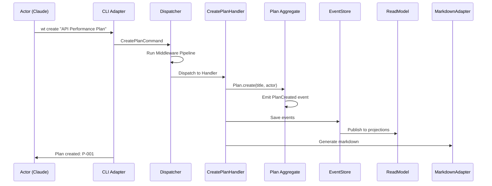

### 7.14 Detailed Use Case: Mark Task Complete (UC-T04)

**Actor:** Claude (Main), requires user consent per SOP-WT.2

**Preconditions:**
- Task exists and is in "In Progress" or "Pending" status
- Evidence attached (if required by settings)

**Main Flow:**
```
1. Actor: Request to mark task X.Y complete
2. System: Load Plan aggregate from event store
3. System: Validate task status transition is valid
4. System: Check evidence requirements
5. System: Check consent requirements
6. [If consent required] System: Request user consent
7. [User approves] System: Transition task status
8. System: Emit TaskStatusChanged event
9. System: Update phase progress
10. System: Persist events
11. System: Update projections
12. System: Return success
```

**Alternative Flows:**
- **3a.** Invalid transition → Return error with valid transitions
- **4a.** Evidence missing → Block completion, suggest attach evidence
- **6a.** Blanket approval active → Skip consent prompt
- **7a.** User denies → Return "completion pending approval"

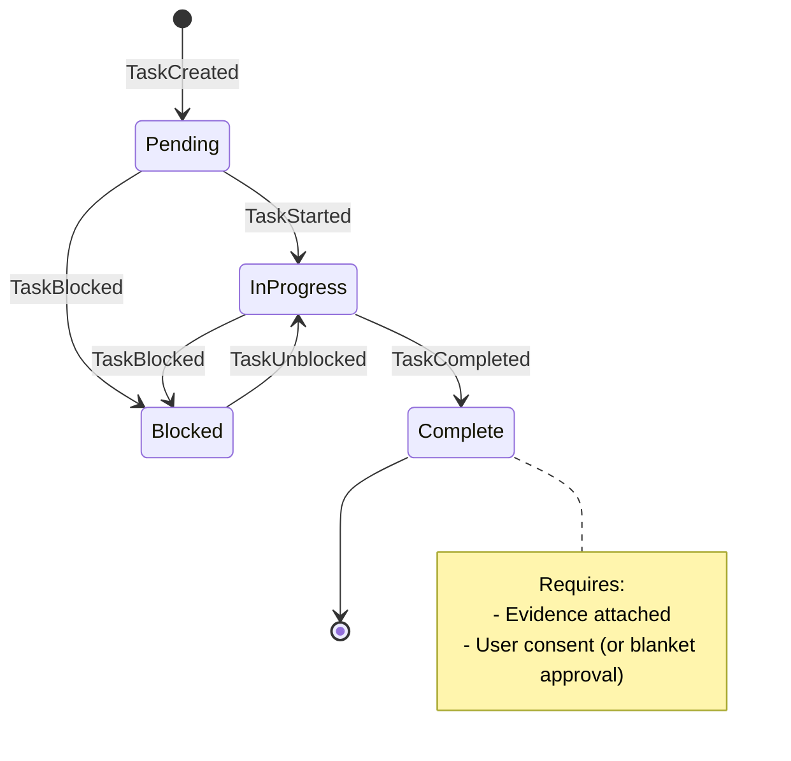

### 7.15 Detailed Use Case: Show Progress (UC-R01)

**Actor:** Any (read-only operation)

**Preconditions:**
- Plan exists

**Main Flow:**
```
1. Actor: Request progress for plan or initiative
2. System: Query read model (projection)
3. System: Calculate progress metrics
4. System: Format output per requested format
5. System: Return progress report
```

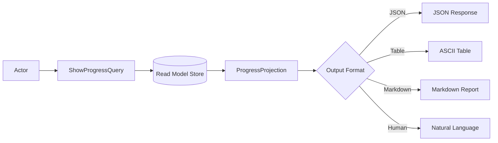

### 7.16 Detailed Use Case: Attach Evidence (UC-E01)

**Actor:** Claude (Main) or Claude (Sub-agent with WRITE permission)

**Preconditions:**
- Task exists
- Evidence type valid (command_output, file_reference, manual_note)

**Main Flow:**
```
1. Actor: Request to attach evidence to task X.Y
2. System: Validate evidence type
3. System: Create Evidence aggregate
4. System: Link evidence to task
5. System: Emit EvidenceCreated, EvidenceAttachedToTask events
6. System: Persist events
7. System: Return evidence ID
```

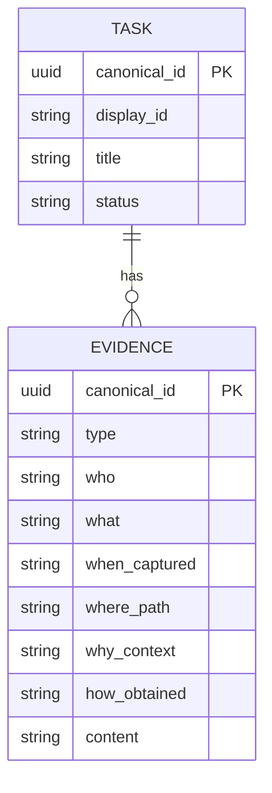

### 7.17 Detailed Use Case: Delegate to Sub-agent (UC-AG01)

**Actor:** Claude (Main)

**Preconditions:**
- Main agent has delegation permission
- Task suitable for delegation

**Main Flow:**
```
1. Main Agent: Spawn sub-agent via Task tool
2. System: Create sub-agent context with restricted permissions
3. Sub-agent: Receives work context
4. Sub-agent: Performs allowed operations (CREATE, READ, WRITE)
5. Sub-agent: Returns results to main agent
6. Main Agent: Reviews sub-agent work
7. Main Agent: Completes task (requires elevated permission)
```

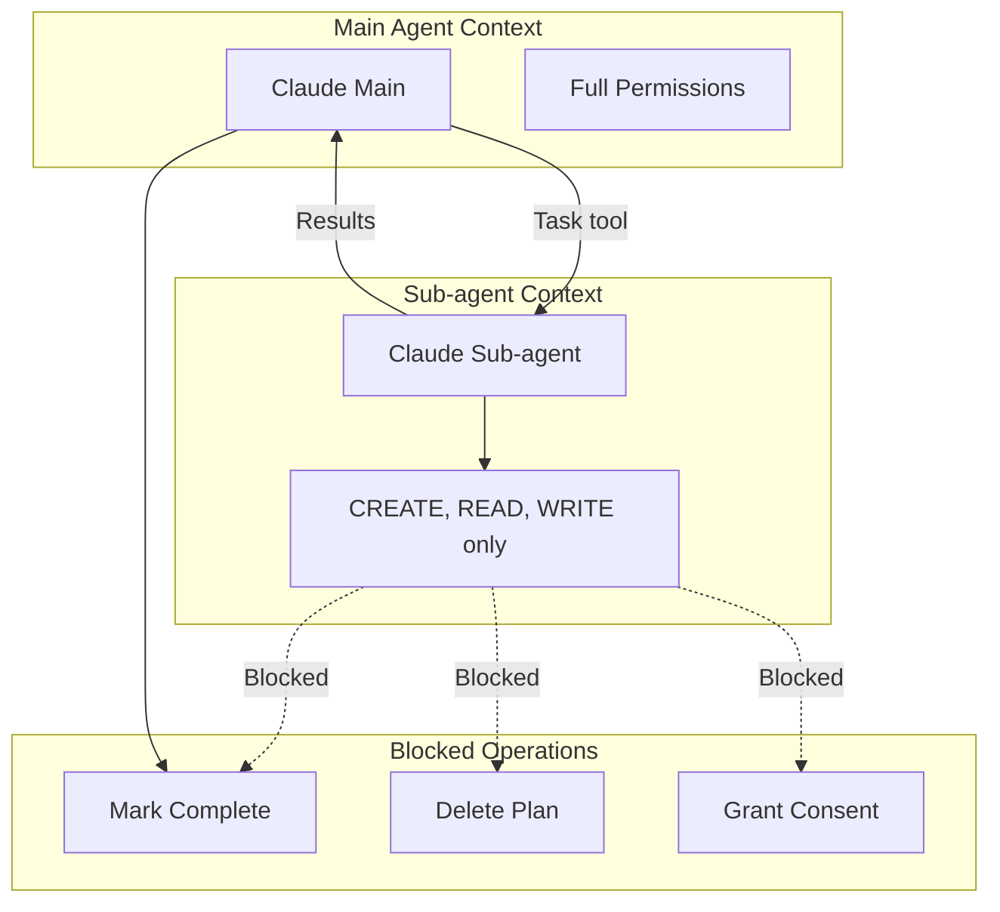

### 7.18 Detailed Use Case: Sync State Files (UC-SY01)

**Actor:** System or Claude (explicit sync)

**Preconditions:**
- JSON SSOT exists

**Main Flow:**
```
1. Trigger: State change or explicit sync command
2. System: Load current state from event store
3. System: Rebuild projections from event log
4. System: Generate full-fidelity markdown
5. System: Write to docs/plans/{id}.md
6. System: Emit SyncCompleted event
```

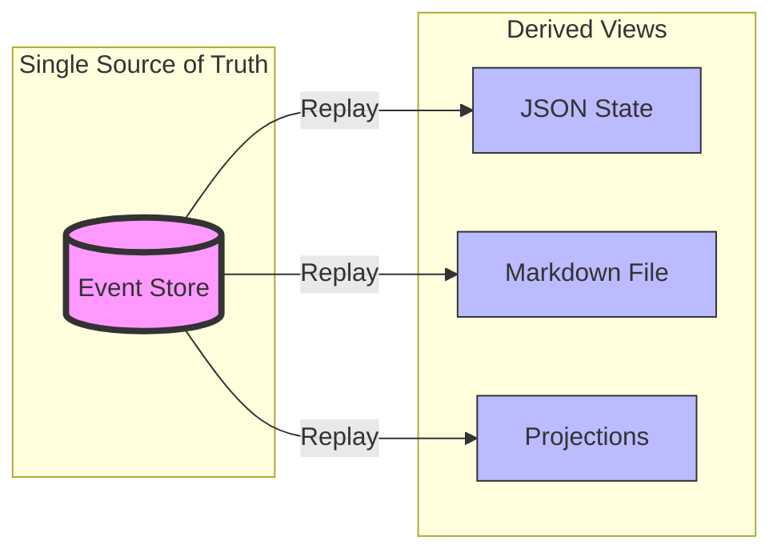

---

## 8. Domain Model (Class Diagrams)

### 8.1 Work Management Bounded Context

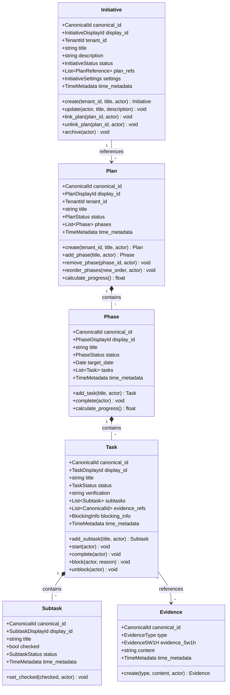

### 8.2 Knowledge Capture Bounded Context

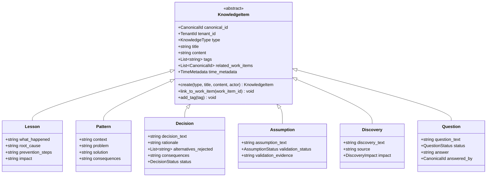

### 8.3 Identity & Access Bounded Context

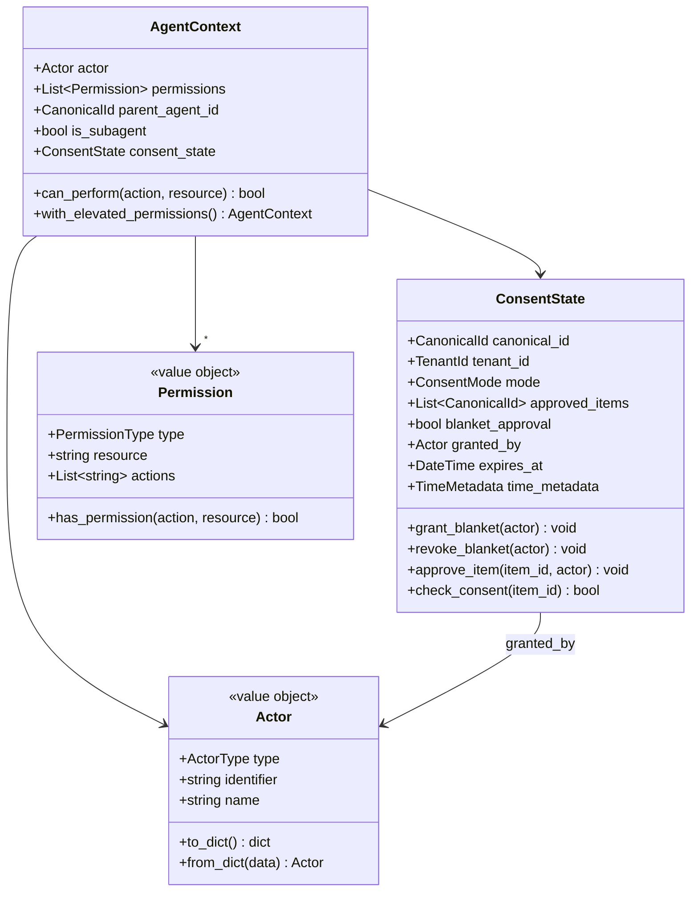

---

## 9. Architectural Diagrams (ASCII & Mermaid)

### 9.1 Bounded Contexts & Context Map

```
+----------------------------+     +----------------------------+
|    WORK MANAGEMENT         |     |    KNOWLEDGE CAPTURE       |
|    BOUNDED CONTEXT         |     |    BOUNDED CONTEXT         |
|                            |     |                            |
| - Initiative (Aggregate)   |     | - Lesson                   |
| - Plan (Aggregate)         |<--->| - Pattern                  |
|   - Phase (Entity)         |     | - Decision (ADR)           |
|   - Task (Entity)          |     | - Assumption               |
|   - Subtask (Entity)       |     | - Discovery                |
| - Evidence (Aggregate)     |     | - Question                 |
+----------------------------+     +----------------------------+
           |                                    |
           v                                    v
+----------------------------+     +----------------------------+
|    IDENTITY & ACCESS       |     |    REPORTING               |
|    BOUNDED CONTEXT         |     |    BOUNDED CONTEXT         |
|                            |     |                            |
| - Tenant                   |     | - ProgressProjection       |
| - Actor (Claude/Human)     |     | - BurndownView             |
| - ConsentState (Aggregate) |     | - SearchIndex              |
| - Permission               |     | - TimelineView             |
+----------------------------+     +----------------------------+
```

### 9.2 Middleware Pipeline (Command Path)

```
┌──────────────────────────────────────────────────────────────────────────────┐
│                        COMMAND MIDDLEWARE PIPELINE                            │
├──────────────────────────────────────────────────────────────────────────────┤
│                                                                               │
│  CLI Input                                                                    │
│      │                                                                        │
│      ▼                                                                        │
│  ┌─────────────────────────────────────────────────────────────────────┐     │
│  │  1. LOGGING MIDDLEWARE                                               │     │
│  │     - Log command entry: type, actor, timestamp                      │     │
│  │     - Log command exit: result, duration, errors                     │     │
│  └──────────────────────────────────┬──────────────────────────────────┘     │
│                                     │                                         │
│                                     ▼                                         │
│  ┌─────────────────────────────────────────────────────────────────────┐     │
│  │  2. AUTH/CONSENT MIDDLEWARE                                          │     │
│  │     - Validate actor permissions for operation                       │     │
│  │     - Check consent state (per-item or blanket)                      │     │
│  │     - Block if consent required and not granted                      │     │
│  │     EXIT: 403 Forbidden if unauthorized                              │     │
│  └──────────────────────────────────┬──────────────────────────────────┘     │
│                                     │                                         │
│                                     ▼                                         │
│  ┌─────────────────────────────────────────────────────────────────────┐     │
│  │  3. VALIDATION MIDDLEWARE                                            │     │
│  │     - Validate command structure (required fields)                   │     │
│  │     - Validate business rules (value ranges, formats)                │     │
│  │     - Validate references (IDs exist)                                │     │
│  │     EXIT: 400 Bad Request if invalid                                 │     │
│  └──────────────────────────────────┬──────────────────────────────────┘     │
│                                     │                                         │
│                                     ▼                                         │
│  ┌─────────────────────────────────────────────────────────────────────┐     │
│  │  4. IDEMPOTENCY MIDDLEWARE                                           │     │
│  │     - Check if command_id already processed                          │     │
│  │     - Return cached result if duplicate                              │     │
│  │     - Store command_id after successful processing                   │     │
│  │     EXIT: 200 OK (cached) if duplicate                               │     │
│  └──────────────────────────────────┬──────────────────────────────────┘     │
│                                     │                                         │
│                                     ▼                                         │
│  ┌─────────────────────────────────────────────────────────────────────┐     │
│  │  5. TRANSACTION MIDDLEWARE                                           │     │
│  │     - Begin transaction (optimistic locking)                         │     │
│  │     - Execute handler                                                │     │
│  │     - Commit on success, rollback on failure                         │     │
│  │     EXIT: 409 Conflict if concurrent modification                    │     │
│  └──────────────────────────────────┬──────────────────────────────────┘     │
│                                     │                                         │
│                                     ▼                                         │
│  ┌─────────────────────────────────────────────────────────────────────┐     │
│  │  COMMAND HANDLER                                                     │     │
│  │     - Load aggregate from event store                                │     │
│  │     - Execute domain operation                                       │     │
│  │     - Collect pending domain events                                  │     │
│  │     - Persist events to event store                                  │     │
│  └──────────────────────────────────┬──────────────────────────────────┘     │
│                                     │                                         │
│                                     ▼                                         │
│  ┌─────────────────────────────────────────────────────────────────────┐     │
│  │  6. EVENT PUBLISHER MIDDLEWARE                                       │     │
│  │     - Publish domain events to event bus                             │     │
│  │     - Trigger projection handlers                                    │     │
│  │     - Trigger side-effect handlers (markdown sync, etc.)             │     │
│  └──────────────────────────────────┬──────────────────────────────────┘     │
│                                     │                                         │
│                                     ▼                                         │
│  ┌─────────────────────────────────────────────────────────────────────┐     │
│  │  7. METRICS MIDDLEWARE                                               │     │
│  │     - Record command latency                                         │     │
│  │     - Increment command counter                                      │     │
│  │     - Track error rates                                              │     │
│  └──────────────────────────────────┬──────────────────────────────────┘     │
│                                     │                                         │
│                                     ▼                                         │
│  Response to CLI                                                              │
│                                                                               │
└──────────────────────────────────────────────────────────────────────────────┘
```

### 9.3 Event Sourcing Architecture

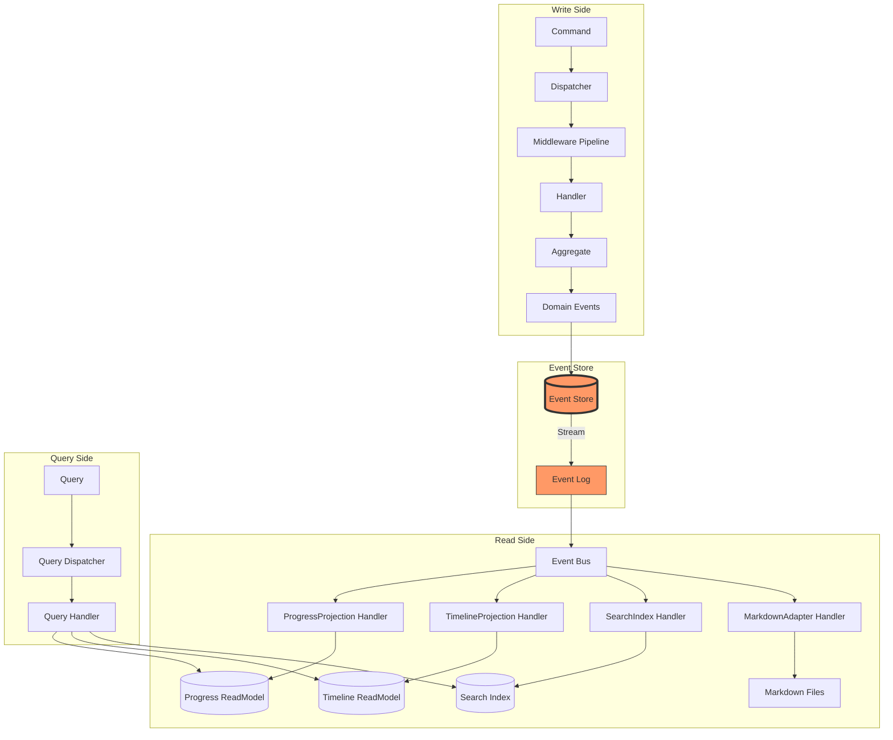

### 9.4 CQRS Separation Diagram

```
┌─────────────────────────────────────────────────────────────────────────────┐
│                           CQRS ARCHITECTURE                                  │
├─────────────────────────────────────────────────────────────────────────────┤
│                                                                              │
│   ┌─────────────────────────────┐     ┌─────────────────────────────┐      │
│   │      COMMAND SIDE           │     │       QUERY SIDE            │      │
│   │      (Write Model)          │     │       (Read Model)          │      │
│   ├─────────────────────────────┤     ├─────────────────────────────┤      │
│   │                             │     │                             │      │
│   │  CLI: "mark task 5.3 done"  │     │  CLI: "show progress"       │      │
│   │           │                 │     │           │                 │      │
│   │           ▼                 │     │           ▼                 │      │
│   │  ┌─────────────────┐        │     │  ┌─────────────────┐        │      │
│   │  │ CommandDispatcher│        │     │  │ QueryDispatcher │        │      │
│   │  └────────┬────────┘        │     │  └────────┬────────┘        │      │
│   │           │                 │     │           │                 │      │
│   │           ▼                 │     │           ▼                 │      │
│   │  ┌─────────────────┐        │     │  ┌─────────────────┐        │      │
│   │  │ Middleware       │        │     │  │ QueryHandler    │        │      │
│   │  │ - Auth           │        │     │  │ (NO middleware) │        │      │
│   │  │ - Validation     │        │     │  └────────┬────────┘        │      │
│   │  │ - Transaction    │        │     │           │                 │      │
│   │  └────────┬────────┘        │     │           ▼                 │      │
│   │           │                 │     │  ┌─────────────────┐        │      │
│   │           ▼                 │     │  │ ReadModelStore  │        │      │
│   │  ┌─────────────────┐        │     │  │ (Projections)   │        │      │
│   │  │ CommandHandler  │        │     │  └────────┬────────┘        │      │
│   │  └────────┬────────┘        │     │           │                 │      │
│   │           │                 │     │           ▼                 │      │
│   │           ▼                 │     │  ┌─────────────────┐        │      │
│   │  ┌─────────────────┐        │     │  │ DTO Response    │        │      │
│   │  │ Aggregate       │        │     │  └─────────────────┘        │      │
│   │  │ (Domain Logic)  │        │     │                             │      │
│   │  └────────┬────────┘        │     └─────────────────────────────┘      │
│   │           │                 │                   ▲                       │
│   │           ▼                 │                   │                       │
│   │  ┌─────────────────┐        │     ┌─────────────┴─────────────┐        │
│   │  │ Domain Events   │────────┼────►│ Projection Handlers       │        │
│   │  └────────┬────────┘        │     │ (Update Read Models)      │        │
│   │           │                 │     └───────────────────────────┘        │
│   │           ▼                 │                                          │
│   │  ┌─────────────────┐        │                                          │
│   │  │ EventStore      │        │                                          │
│   │  │ (Append-Only)   │        │                                          │
│   │  └─────────────────┘        │                                          │
│   │                             │                                          │
│   └─────────────────────────────┘                                          │
│                                                                              │
└─────────────────────────────────────────────────────────────────────────────┘
```

### 9.5 Hexagonal Architecture Layers

```
┌──────────────────────────────────────────────────────────────────────────────────┐
│                            HEXAGONAL ARCHITECTURE                                 │
├──────────────────────────────────────────────────────────────────────────────────┤
│                                                                                   │
│   ┌───────────────────────────────────────────────────────────────────────────┐  │
│   │                        INTERFACE LAYER                                     │  │
│   │                     (Primary Adapters - DRIVES)                            │  │
│   │                                                                            │  │
│   │   ┌──────────────┐  ┌──────────────┐  ┌──────────────┐  ┌─────────────┐  │  │
│   │   │  CLI (wt.py) │  │ Slash Cmds   │  │ REST API     │  │ Sub-agents  │  │  │
│   │   │  (/track)    │  │ (/complete)  │  │ (optional)   │  │ (Task tool) │  │  │
│   │   └──────┬───────┘  └──────┬───────┘  └──────┬───────┘  └──────┬──────┘  │  │
│   │          │                 │                 │                  │         │  │
│   └──────────┼─────────────────┼─────────────────┼──────────────────┼─────────┘  │
│              │                 │                 │                  │            │
│              └─────────────────┴────────┬────────┴──────────────────┘            │
│                                         │                                         │
│                                    PRIMARY PORTS                                  │
│                            ┌────────────┴────────────┐                           │
│                            │  IPublicFacade          │                           │
│                            │  IAdminFacade           │                           │
│                            └────────────┬────────────┘                           │
│                                         │                                         │
│   ┌─────────────────────────────────────┼─────────────────────────────────────┐  │
│   │                        APPLICATION LAYER                                   │  │
│   │                      (Orchestration & Coordination)                        │  │
│   │                                     │                                      │  │
│   │   ┌──────────────┐   ┌──────────────┴──────────────┐   ┌──────────────┐   │  │
│   │   │   Commands   │   │        DISPATCHER           │   │   Queries    │   │  │
│   │   │   Handlers   │◄──┤  + Middleware Pipeline      ├──►│   Handlers   │   │  │
│   │   └──────┬───────┘   └─────────────────────────────┘   └──────┬───────┘   │  │
│   │          │                                                    │           │  │
│   └──────────┼────────────────────────────────────────────────────┼───────────┘  │
│              │                                                    │              │
│              │           ┌─────────────────────────────┐          │              │
│              └──────────►│       DOMAIN LAYER          │◄─────────┘              │
│                          │      (Business Logic)       │                         │
│                          │                             │                         │
│                          │  ┌─────────┐ ┌─────────┐   │                         │
│                          │  │Aggregate│ │ Domain  │   │                         │
│                          │  │  Roots  │ │ Events  │   │                         │
│                          │  └─────────┘ └─────────┘   │                         │
│                          │                             │                         │
│                          │   SECONDARY PORTS           │                         │
│                          │  ┌──────────────────────┐   │                         │
│                          │  │ IEventStore          │   │                         │
│                          │  │ IPlanRepository      │   │                         │
│                          │  │ IReadModelStore      │   │                         │
│                          │  │ IEventBus            │   │                         │
│                          │  └──────────┬───────────┘   │                         │
│                          └─────────────┼───────────────┘                         │
│                                        │                                         │
│              ┌─────────────────────────┼─────────────────────────┐               │
│              │                         │                         │               │
│   ┌──────────┼─────────────────────────┼─────────────────────────┼────────────┐  │
│   │          │  INFRASTRUCTURE LAYER   │  (Secondary Adapters)   │            │  │
│   │          │                         │                         │            │  │
│   │   ┌──────┴──────┐   ┌──────────────┴──────────────┐   ┌─────┴─────┐     │  │
│   │   │ FileEvent   │   │ JsonRepository              │   │ Markdown  │     │  │
│   │   │ Store       │   │ Adapter                     │   │ Adapter   │     │  │
│   │   └─────────────┘   └─────────────────────────────┘   └───────────┘     │  │
│   │                                                                          │  │
│   └──────────────────────────────────────────────────────────────────────────┘  │
│                                                                                   │
└──────────────────────────────────────────────────────────────────────────────────┘
```

### 9.6 CLI Command Flow (Activity Diagram)

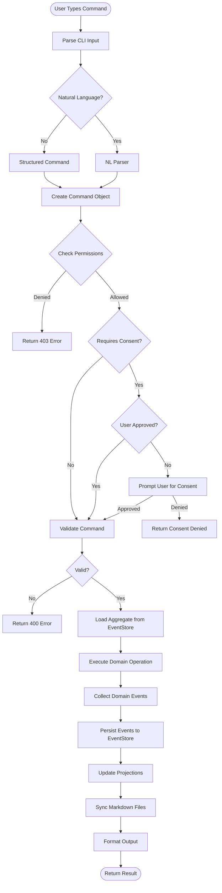

### 9.7 Event Flow (Domain Events)

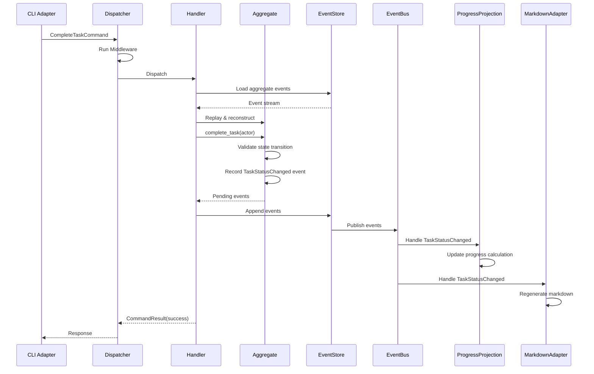

---

## 10. Command & Query Catalog

### 10.1 Commands (Write Operations)

| Command | Description | Requires Consent | Sub-agent Allowed |
|---------|-------------|------------------|-------------------|
| `CreateInitiative` | Create new initiative | YES (SOP-IC) | NO |
| `UpdateInitiative` | Update initiative title/description | NO | NO |
| `ArchiveInitiative` | Archive (soft delete) initiative | YES | NO |
| `CreatePlan` | Create new work tracker | NO | YES |
| `UpdatePlan` | Update plan title/description | NO | YES |
| `AddPhase` | Add phase to plan | NO | YES |
| `UpdatePhase` | Update phase details | NO | YES |
| `RemovePhase` | Remove phase from plan | NO | YES |
| `ReorderPhases` | Change phase order | NO | YES |
| `AddTask` | Add task to phase | NO | YES |
| `UpdateTask` | Update task details | NO | YES |
| `StartTask` | Mark task as In Progress | NO | YES |
| `CompleteTask` | Mark task as Complete | YES (SOP-WT.2) | NO |
| `BlockTask` | Mark task as Blocked | NO | YES |
| `UnblockTask` | Remove task block | NO | YES |
| `RemoveTask` | Remove task from phase | NO | YES |
| `AddSubtask` | Add subtask to task | NO | YES |
| `CheckSubtask` | Check/uncheck subtask | NO | YES |
| `RemoveSubtask` | Remove subtask | NO | YES |
| `AttachEvidence` | Attach evidence to task | NO | YES |
| `CreateKnowledge` | Create lesson/pattern/decision | NO | YES |
| `LinkKnowledge` | Link knowledge to work item | NO | YES |
| `GrantBlanketConsent` | Grant blanket approval | N/A | NO |
| `RevokeConsent` | Revoke blanket approval | N/A | NO |

### 10.2 Queries (Read Operations)

| Query | Description | Returns |
|-------|-------------|---------|
| `GetPlan` | Get plan by ID | PlanDTO |
| `ListPlans` | List plans for tenant | List[PlanSummaryDTO] |
| `GetPhase` | Get phase details | PhaseDTO |
| `GetTask` | Get task details | TaskDTO |
| `ShowProgress` | Calculate progress | ProgressDTO |
| `GetTimeline` | Get activity timeline | TimelineDTO |
| `SearchWork` | Search across work items | SearchResultDTO |
| `GetInitiative` | Get initiative by ID | InitiativeDTO |
| `ListInitiatives` | List initiatives | List[InitiativeSummaryDTO] |
| `GetEvidence` | Get evidence by ID | EvidenceDTO |
| `GetConsentState` | Get current consent state | ConsentStateDTO |
| `GetKnowledge` | Get knowledge item | KnowledgeItemDTO |
| `SearchKnowledge` | Search knowledge base | List[KnowledgeItemDTO] |

---

## 11. CLI Command Reference

### 11.1 Structured Commands

```bash
# Initiative Management
wt initiative create "Title"
wt initiative list
wt initiative show <id>
wt initiative archive <id>

# Plan Management
wt plan create "Title" [--initiative <id>]
wt plan list [--initiative <id>]
wt plan show <id>
wt plan sync <id>

# Phase Management
wt phase add <plan-id> "Title"
wt phase update <plan-id> <phase-num> --title "New Title"
wt phase reorder <plan-id> <from> <to>
wt phase remove <plan-id> <phase-num>

# Task Management
wt task add <plan-id> <phase-num> "Title"
wt task start <plan-id> <task-id>
wt task complete <plan-id> <task-id>
wt task block <plan-id> <task-id> --reason "Reason"
wt task unblock <plan-id> <task-id>
wt task update <plan-id> <task-id> --title "New Title"
wt task remove <plan-id> <task-id>

# Subtask Management
wt subtask add <plan-id> <task-id> "Title"
wt subtask check <plan-id> <subtask-id>
wt subtask uncheck <plan-id> <subtask-id>
wt subtask remove <plan-id> <subtask-id>

# Evidence Management
wt evidence attach <plan-id> <task-id> --type command_output --content "output"
wt evidence attach <plan-id> <task-id> --type file_reference --path "/path/to/file"
wt evidence list <plan-id> <task-id>
wt evidence show <evidence-id>

# Progress & Reporting
wt progress <plan-id> [--format json|table|markdown|human]
wt timeline <plan-id> [--since "2 days ago"]
wt search "query" [--scope plan|initiative|all]

# Consent Management
wt consent grant [--blanket]
wt consent revoke
wt consent status
```

### 11.2 Natural Language Commands

The CLI supports natural language input that maps to structured commands:

| Natural Language | Mapped Command |
|------------------|----------------|
| "mark task 5.3 complete" | `wt task complete <plan-id> 5.3` |
| "add subtask to task 5.1: Write tests" | `wt subtask add <plan-id> 5.1 "Write tests"` |
| "show progress" | `wt progress <plan-id>` |
| "check subtask 5.1.2" | `wt subtask check <plan-id> 5.1.2` |
| "block task 3.2 because waiting for API" | `wt task block <plan-id> 3.2 --reason "waiting for API"` |
| "attach evidence: pytest passed" | `wt evidence attach <plan-id> <current-task> --type command_output --content "pytest passed"` |

---

## 12. Implementation Phases

### Phase 1: Foundation & Domain Model (Week 1-2)
**Goal:** Establish domain core with zero external dependencies

| Task | Deliverable | Verification |
|------|-------------|--------------|
| 1.1 Create directory structure | `src/ecw/work_tracker/domain/` | Directory exists |
| 1.2 Implement value objects | `identifiers.py`, `status.py`, `actor.py` | Unit tests pass |
| 1.3 Implement AggregateRoot base | `aggregates/base.py` | Unit tests pass |
| 1.4 Implement Initiative aggregate | `aggregates/initiative.py` | Unit tests pass |
| 1.5 Implement Plan aggregate | `aggregates/plan.py` with Phase, Task, Subtask | Unit tests pass |
| 1.6 Implement Evidence aggregate | `aggregates/evidence.py` | Unit tests pass |
| 1.7 Define domain events | `events/*.py` (CloudEvents 1.0) | Schema validation |
| 1.8 Define secondary ports | `ports/repositories.py`, `ports/event_store.py` | Interface definition |

### Phase 2: Application Layer (Week 2-3)
**Goal:** Implement CQRS handlers and middleware pipeline

| Task | Deliverable | Verification |
|------|-------------|--------------|
| 2.1 Implement Dispatcher | `application/dispatcher.py` | Unit tests pass |
| 2.2 Implement middleware pipeline | `application/middleware/*.py` | Unit tests pass |
| 2.3 Implement command handlers | `application/handlers/commands/*.py` | Unit tests pass |
| 2.4 Implement query handlers | `application/handlers/queries/*.py` | Unit tests pass |
| 2.5 Define DTOs | `application/dtos/*.py` | Schema validation |
| 2.6 Define primary ports | `application/ports/primary/*.py` | Interface definition |

### Phase 3: Infrastructure Layer (Week 3-4)
**Goal:** Implement persistence adapters

| Task | Deliverable | Verification |
|------|-------------|--------------|
| 3.1 Implement FileEventStore | `infrastructure/persistence/file_event_store.py` | Integration tests |
| 3.2 Implement JsonRepository | `infrastructure/persistence/json_repository.py` | Integration tests |
| 3.3 Implement MarkdownAdapter | `infrastructure/persistence/markdown_adapter.py` | Integration tests |
| 3.4 Implement projection handlers | `infrastructure/projections/*.py` | Integration tests |
| 3.5 Implement InMemoryEventBus | `infrastructure/messaging/event_bus.py` | Integration tests |

### Phase 4: Interface Layer (Week 4-5)
**Goal:** Implement CLI and slash commands

| Task | Deliverable | Verification |
|------|-------------|--------------|
| 4.1 Implement CLI main entry | `cli/main.py` | E2E tests pass |
| 4.2 Implement subcommand groups | `cli/commands/*.py` | E2E tests pass |
| 4.3 Implement NL parser | `cli/nl/parser.py` | Unit tests pass |
| 4.4 Implement output formatters | `cli/output/*.py` | Unit tests pass |
| 4.5 Implement sub-agent context | `cli/agent/context.py` | Unit tests pass |
| 4.6 Implement slash commands | `/track`, `/progress`, `/complete` | E2E tests pass |

### Phase 5: Integration & Testing (Week 5-6)
**Goal:** Comprehensive testing and refinement

| Task | Deliverable | Verification |
|------|-------------|--------------|
| 5.1 BDD feature tests | `tests/features/*.feature` | All scenarios pass |
| 5.2 Integration tests | `tests/integration/` | All tests pass |
| 5.3 E2E CLI tests | `tests/e2e/` | All tests pass |
| 5.4 Architectural tests | `tests/architectural/` | No dependency violations |
| 5.5 Performance testing | Benchmark suite | Within acceptable limits |

### Phase 6: Migration & Documentation (Week 6)
**Goal:** v2.x compatibility and documentation

| Task | Deliverable | Verification |
|------|-------------|--------------|
| 6.1 Migration tool | `tools/migrate_v2_to_v3.py` | Existing data migrated |
| 6.2 Update SKILL.md | Complete skill documentation | Doc review |
| 6.3 Update CLAUDE.md | Updated SOPs | Doc review |
| 6.4 Create ADRs | `docs/adrs/` | All decisions documented |

---

## 13. File Structure (Target State)

```
src/ecw/work_tracker/
├── __init__.py
├── domain/
│   ├── __init__.py
│   ├── aggregates/
│   │   ├── __init__.py
│   │   ├── base.py                 # AggregateRoot base class
│   │   ├── initiative.py           # Initiative aggregate
│   │   ├── plan.py                 # Plan aggregate (Phase, Task, Subtask)
│   │   ├── evidence.py             # Evidence aggregate
│   │   ├── knowledge_item.py       # KnowledgeItem aggregate
│   │   └── consent_state.py        # ConsentState aggregate
│   ├── entities/
│   │   ├── __init__.py
│   │   ├── phase.py
│   │   ├── task.py
│   │   └── subtask.py
│   ├── value_objects/
│   │   ├── __init__.py
│   │   ├── identifiers.py          # CanonicalId, DisplayIds
│   │   ├── status.py               # Status enums with state machines
│   │   ├── actor.py                # Actor value object
│   │   ├── evidence_5w1h.py        # 5W1H evidence model
│   │   └── time_metadata.py        # TimeMetadata
│   ├── events/
│   │   ├── __init__.py
│   │   ├── base.py                 # DomainEvent base (CloudEvents 1.0)
│   │   ├── initiative_events.py
│   │   ├── plan_events.py
│   │   ├── evidence_events.py
│   │   └── consent_events.py
│   ├── services/
│   │   ├── __init__.py
│   │   ├── progress_calculation.py
│   │   └── evidence_requirement.py
│   └── ports/
│       ├── __init__.py
│       ├── repositories.py         # IRepository interfaces
│       ├── event_store.py          # IEventStore interface
│       └── event_bus.py            # IEventBus interface
├── application/
│   ├── __init__.py
│   ├── dispatcher.py               # Command/Query dispatcher
│   ├── middleware/
│   │   ├── __init__.py
│   │   ├── logging.py
│   │   ├── auth_consent.py
│   │   ├── validation.py
│   │   ├── idempotency.py
│   │   ├── transaction.py
│   │   ├── event_publisher.py
│   │   └── metrics.py
│   ├── handlers/
│   │   ├── __init__.py
│   │   ├── commands/
│   │   │   ├── __init__.py
│   │   │   ├── initiative_handlers.py
│   │   │   ├── plan_handlers.py
│   │   │   ├── task_handlers.py
│   │   │   └── evidence_handlers.py
│   │   └── queries/
│   │       ├── __init__.py
│   │       ├── plan_queries.py
│   │       └── progress_queries.py
│   ├── dtos/
│   │   ├── __init__.py
│   │   ├── plan_dto.py
│   │   ├── progress_dto.py
│   │   └── evidence_dto.py
│   └── ports/
│       ├── __init__.py
│       └── primary/
│           ├── public_facade.py
│           └── admin_facade.py
├── infrastructure/
│   ├── __init__.py
│   ├── persistence/
│   │   ├── __init__.py
│   │   ├── file_event_store.py
│   │   ├── json_repository.py
│   │   └── markdown_adapter.py
│   ├── projections/
│   │   ├── __init__.py
│   │   ├── progress_projection.py
│   │   └── timeline_projection.py
│   └── messaging/
│       ├── __init__.py
│       └── event_bus.py
└── cli/
    ├── __init__.py
    ├── main.py                     # CLI entry point
    ├── commands/
    │   ├── __init__.py
    │   ├── initiative.py
    │   ├── plan.py
    │   ├── task.py
    │   ├── subtask.py
    │   ├── evidence.py
    │   └── consent.py
    ├── nl/
    │   ├── __init__.py
    │   └── parser.py               # Natural language parser
    ├── agent/
    │   ├── __init__.py
    │   └── context.py              # Sub-agent context
    └── output/
        ├── __init__.py
        ├── json_formatter.py
        ├── table_formatter.py
        ├── markdown_formatter.py
        └── human_formatter.py
```

---

## 14. Key Architecture Decisions (ADRs)

### ADR-001: Ground-Up Rewrite vs Evolution
- **Decision:** Ground-up rewrite
- **Rationale:** v2.x has 128+ failing tests, mixed architectures, and incomplete event sourcing
- **Consequences:** Breaking changes accepted; migration tool required

### ADR-002: Four Bounded Contexts
- **Decision:** Work Management, Knowledge Capture, Identity & Access, Reporting
- **Rationale:** Clear boundaries enable independent evolution and testing
- **Consequences:** Cross-context communication via domain events only

### ADR-003: Event Sourcing as Primary Storage
- **Decision:** All state changes persisted as immutable CloudEvents 1.0
- **Rationale:** Complete audit trail, time-travel debugging, projection flexibility
- **Consequences:** Event schema versioning required from day 1

### ADR-004: CQRS with Separate Dispatchers
- **Decision:** Completely separate command and query paths
- **Rationale:** Commands need auth/consent/transactions; queries are read-only
- **Consequences:** Eventual consistency between write and read models

### ADR-005: Middleware Pipeline Pattern
- **Decision:** Cross-cutting concerns via composable middleware chain
- **Rationale:** Single responsibility, testability, configurability
- **Consequences:** Pipeline configuration complexity

### ADR-006: Sub-agent Permissions Model
- **Decision:** Role-based permissions with restricted sub-agent context
- **Rationale:** SOP-IC compliance, safe delegation, no unauthorized completions
- **Consequences:** Permission checking adds latency

### ADR-007: Dual-mode CLI (Structured + NL)
- **Decision:** Support both structured commands and natural language
- **Rationale:** Claude agents prefer NL; humans prefer structured
- **Consequences:** NL parser must be robust and testable

---

## 15. Success Criteria

| Criterion | Target | Measurement |
|-----------|--------|-------------|
| Test Pass Rate | 100% | `pytest` all green |
| Domain Test Coverage | > 95% | Coverage report |
| Dependency Violations | 0 | Architectural tests |
| Event Sourcing Active | All state changes | Event log inspection |
| CQRS Separation | Complete | Query handlers have no side effects |
| CLI Parity | All v2.x commands | Feature comparison matrix |
| Documentation | Complete | SKILL.md, CLAUDE.md, ADRs |
| Migration | v2.x data preserved | Migration test suite |

---

## 16. Risk Mitigation

| Risk | Impact | Probability | Mitigation |
|------|--------|-------------|------------|
| Scope creep | High | Medium | Strict phase gates, defer non-essential features |
| Event schema changes | Medium | High | Version events from day 1; plan migrations |
| Breaking changes | Medium | Certain | Document all changes; provide migration guide |
| Test coverage gaps | High | Low | BDD-first approach; no untested code |
| Context limit during implementation | Medium | Medium | Frequent checkpoints; detailed handoffs |
| NL parser brittleness | Medium | Medium | Comprehensive test suite; fallback to structured |

---

## 17. Next Steps

**Immediate Actions (after user approval):**
1. Create Initiative 2 work tracker via wt.py
2. Begin Phase 1: Foundation & Domain Model
3. Set up new `src/ecw/work_tracker/` directory structure
4. Create initial value objects with unit tests

**User Approval Required:**
- Confirm Initiative 2 creation: "Work-Tracker v3.0 Ground-Up Rewrite"
- Confirm directory structure: `src/ecw/work_tracker/`
- Confirm breaking changes acceptable

---

*Plan Version: 2.0*
*Created: 2026-01-07*
*Updated: 2026-01-07*
*Status: Ready for User Approval*
