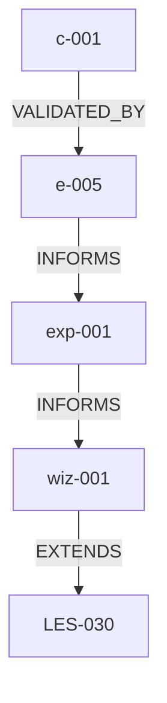

# PS Export Specification v2.1

> **Purpose:** Define enhanced export format for Problem Statements meeting ECW quality standards
> **Phase:** 38.11.17.1 (v1.0), 38.13.7.2 (v2.0), 38.13.7.2.1 (v2.1 - Common Properties)
> **Created:** 2025-12-31
> **Updated:** 2026-01-01 (v2.1 - Common properties, full Domain Entity parity)
> **Prior Art:** LES-NNN format, docs/exemplars/, docs/knowledge/lessons.md

---

## Executive Summary

The PS export format must produce **evidence-based, accountable, verifiable** documentation.
Each claim must have:
1. **Evidence** - Test path, commit hash, or verifiable reference
2. **Accountability** - Who validated, when, in which session
3. **Traceability** - Links to related knowledge (ADR/LES/PAT)

---

## I. Common Properties (v2.1)

> **Purpose:** All PS entities share these common properties for consistency, traceability, and change detection.
> **Added:** Phase 38.13.7.2.1

### A. Required Common Properties

Every PS entity (Constraint, Question, Exploration, Experience, Wisdom, Relationship) MUST include:

| Property | Format | Description | Example |
|----------|--------|-------------|---------|
| `id` | `{prefix}-NNN` | Unique identifier within entity type | `c-001`, `exp-003` |
| `slug` | `kebab-case` | URL-safe identifier for linking | `empty-string-validation` |
| `name` | Free text (≤80 chars) | Human-readable display name | `Empty String Validation Fix` |
| `short_description` | Free text (≤200 chars) | Brief summary (1 sentence) | `Fixes aggregate rejection of empty optional fields` |
| `long_description` | Markdown | Detailed content (scales to any length) | Multi-paragraph explanation |
| `created_on` | ISO 8601 + Session | Creation timestamp with session provenance | `2026-01-01T14:30:00Z (Session 024)` |
| `updated_on` | ISO 8601 + Session | Last modification timestamp | `2026-01-01T16:45:00Z (Session 024)` |
| `session_id` | String | Session where entity was created/modified | `ecw-2026-01-01-024` |
| `hash` | Hex (16 chars) | Content hash for change detection | `a1b2c3d4e5f67890` |

### B. ID Prefix Registry

| Entity Type | Prefix | Example |
|-------------|--------|---------|
| Constraint | `c` | `c-001` |
| Question | `q` | `q-005` |
| Exploration | `e` | `e-012` |
| Experience | `exp` | `exp-003` |
| Wisdom | `wiz` | `wiz-001` |
| Relationship | `rel` | `rel-007` |
| Knowledge (ADR) | `ADR` | `ADR-001` |
| Knowledge (LES) | `LES` | `LES-030` |
| Knowledge (PAT) | `PAT` | `PAT-039` |
| Knowledge (ANTI) | `ANTI` | `ANTI-001` |
| Knowledge (ASM) | `ASM` | `ASM-058` |

### C. Hash Computation

The `hash` property enables change detection between exports. Computed from **content fields only** (excludes timestamps):

```python
import hashlib
import json

def compute_entity_hash(entity: dict, content_fields: list[str]) -> str:
    """
    Compute content-based hash for change detection.

    Args:
        entity: Full entity dictionary
        content_fields: List of field names to include in hash

    Returns:
        16-character hexadecimal hash
    """
    content = {k: v for k, v in entity.items() if k in content_fields}
    serialized = json.dumps(content, sort_keys=True, default=str)
    return hashlib.sha256(serialized.encode()).hexdigest()[:16]

# Content fields per entity type
HASH_FIELDS = {
    "constraint": ["text", "status", "priority_level", "category_type", "kbrefs"],
    "question": ["text", "status", "answer", "confidence_level"],
    "exploration": ["content", "entry_type", "severity", "resolution_status"],
    "experience": ["context", "insight", "applicability", "exp_tags"],
    "wisdom": ["title", "insight", "applicability", "confidence"],
    "relationship": ["source_type", "source_id", "target_type", "target_id", "relationship_type"],
}
```

### D. Common Properties Template

```markdown
### {prefix}-NNN: `[STATUS]` `[PRIORITY]` `(CATEGORY)`
**ID:** {prefix}-NNN
**Slug:** [kebab-case-slug]
**Name:** [Human-readable name]
**Short Description:** [One sentence summary]

**Long Description:**
[Detailed content - can span multiple paragraphs with full markdown support]

**Provenance:**
- **Created:** YYYY-MM-DD HH:MM UTC (Session NNN)
- **Updated:** YYYY-MM-DD HH:MM UTC (Session NNN) *(if modified)*
- **Session:** [session-id]
- **Hash:** [16-char-hex]
```

---

## II. YAML Frontmatter (Required)

```yaml
---
title: "[PS Title]"
phase: [phase-id]
status: [EXPLORATION | UNDERSTOOD | CLOSED]
version: [event count]
validated: [YYYY-MM-DD]
validator: "[Claude|User] (Session NNN)"
constraints_validated: [N/M]
constraints_deferred: [N]
questions_decided: [N/M]
explorations_resolved: [N/M]
experiences_captured: [N]        # v2.0 - Experience count
wisdoms_synthesized: [N]         # v2.0 - Wisdom count
relationships_created: [N]       # v2.0 - Relationship count
exported: [ISO timestamp]
---
```

### Field Definitions

| Field | Required | Description |
|-------|----------|-------------|
| `validated` | YES (if CLOSED) | Date validation completed |
| `validator` | YES (if CLOSED) | Who performed validation |
| `constraints_validated` | YES (if CLOSED) | Count of VALIDATED vs total |
| `constraints_deferred` | YES (if CLOSED) | Count deferred with DEBT-NNN |
| `experiences_captured` | NO | Count of experiences recorded (v2.0) |
| `wisdoms_synthesized` | NO | Count of wisdoms synthesized (v2.0) |
| `relationships_created` | NO | Count of entity relationships (v2.0) |

---

## II. Validation Summary Section (Required for CLOSED)

```markdown
## Validation Summary

| Metric | Count | Validated | Deferred | Evidence |
|--------|-------|-----------|----------|----------|
| Constraints | NN | NN | NN | See §Constraints |
| Questions | NN | NN | 0 | See §Questions |
| Explorations | NN | NN | NN | See §Exploration |
| Experiences | NN | - | - | See §Experiences |
| Wisdoms | NN | - | - | See §Wisdoms |
| Relationships | NN | - | - | See §Relationships |

### Validation Methodology
- **Architecture Tests:** `python3 -m pytest tests/architecture/ -v`
- **Domain Tests:** `python3 -m pytest .claude/tests/lib/ecw/unit/domain/ -v`
- **Integration Tests:** `python3 -m pytest .claude/tests/lib/ecw/integration/ -v`
- **BDD Tests:** `behave tests/bdd/features/`
```

---

## III. Constraint Format (v2.1)

> **Updated:** v2.1 - Added common properties, full Domain Entity parity

### A. VALIDATED Constraint

```markdown
### c-NNN: [VALIDATED] `[PRIORITY]` `(CATEGORY)`
**ID:** c-NNN
**Slug:** [kebab-case-constraint-slug]
**Name:** [Human-readable constraint name]
**Short Description:** [One sentence summary of constraint]

**Long Description:**
[Constraint text - detailed explanation, can span multiple paragraphs]

**Classification:**
- **Priority:** HIGH | MEDIUM | LOW
- **Priority Rationale:** [Why this priority level]
- **Category:** [ARCHITECTURAL | PERFORMANCE | SECURITY | OPERATIONAL | BEHAVIORAL]
- **Subcategory:** [More specific classification]
- **Knowledge Refs:** `kb:type:id`, `kb:type:id`

**Verification:**
- **Method:** TEST | REVIEW | DEMO | INSPECTION
- **Description:** [What is being verified]
- **Acceptance Criteria:** [Specific pass/fail criteria]

**Validation:**
- **Test Path:** `[exact file path]`
- **Test Functions:** `[function_name_1]`, `[function_name_2]`
- **Result:** PASS (YYYY-MM-DD)
- **Validator:** [Who validated] (Session NNN)
- **Validation Notes:** [Additional context about validation]
- **Evidence:**
  ```bash
  $ [exact command that can be re-run]
  [actual output, truncated if >10 lines]
  ```

**Evidence Links:** *(v2.1 - structured list)*
| Type | Reference | Description | Verified | Verified By |
|------|-----------|-------------|----------|-------------|
| TEST | `path:function` | Test description | YES/NO | [Who] |
| COMMIT | `hash` | Commit description | YES/NO | [Who] |

**Provenance:**
- **Created:** YYYY-MM-DD HH:MM UTC (Session NNN)
- **Updated:** YYYY-MM-DD HH:MM UTC (Session NNN)
- **Session:** [session-id]
- **Hash:** [16-char-hex]
```

### B. DEFERRED Constraint

```markdown
### c-NNN: [DEFERRED] `[PRIORITY]` `(CATEGORY)`
**ID:** c-NNN
**Slug:** [kebab-case-constraint-slug]
**Name:** [Human-readable constraint name]
**Short Description:** [One sentence summary]

**Long Description:**
[Constraint text - detailed explanation]

**Classification:**
- **Priority:** HIGH | MEDIUM | LOW
- **Priority Rationale:** [Why this priority level]
- **Category:** [CATEGORY]
- **Subcategory:** [Subcategory]
- **Knowledge Refs:** `kb:type:id`

**Deferral:**
- **Reason:** [Why this cannot be validated now]
- **Debt ID:** DEBT-NNN
- **Resolution Phase:** Phase NN.N ([description])
- **Deferred By:** [Who deferred] (Session NNN)
- **Deferred At:** YYYY-MM-DD
- **Estimated Validation:** [date or TBD]

**Provenance:**
- **Created:** YYYY-MM-DD HH:MM UTC (Session NNN)
- **Updated:** YYYY-MM-DD HH:MM UTC (Session NNN)
- **Session:** [session-id]
- **Hash:** [16-char-hex]
```

### C. REJECTED Constraint

```markdown
### c-NNN: [REJECTED] `[PRIORITY]` `(CATEGORY)`
**ID:** c-NNN
**Slug:** [kebab-case-constraint-slug]
**Name:** [Human-readable constraint name]
**Short Description:** [One sentence summary]

**Long Description:**
[Constraint text - detailed explanation]

**Classification:**
- **Priority:** HIGH | MEDIUM | LOW
- **Category:** [CATEGORY]
- **Knowledge Refs:** `kb:type:id`

**Rejection:**
- **Reason:** [Why constraint was rejected]
- **Rejected By:** [Who rejected] (Session NNN)
- **Rejected At:** YYYY-MM-DD
- **Alternative:** [What replaced this, if anything]

**Provenance:**
- **Created:** YYYY-MM-DD HH:MM UTC (Session NNN)
- **Updated:** YYYY-MM-DD HH:MM UTC (Session NNN)
- **Session:** [session-id]
- **Hash:** [16-char-hex]
```

### D. Evidence Types

| Type | Format | Example |
|------|--------|---------|
| TEST | `path:function_name` | `.claude/tests/lib/ecw/unit/domain/test_ps_aggregate.py:test_add_constraint` |
| COMMIT | `hash` | `f018283` |
| FILE | `path:line_range` | `.claude/lib/ecw/domain/events/problem_statement_events.py:45-67` |
| PR | `#number` | `#42` |
| ISSUE | `#number` | `#123` |
| URL | `https://...` | `https://docs.example.com/spec` |
| DOC | `path` | `docs/contracts/entity-spec.md` |
| LOG | `path:line_range` | `.claude/logs/session-024.log:145-160` |
| REVIEW | `[reviewer] (Session NNN)` | `User (Session 017)` |

---

## IV. Question Format (v2.1)

> **Updated:** v2.1 - Added common properties, research artifacts, full Domain Entity parity

### A. DECIDED Question (with full context)

```markdown
### q-NNN: [DECIDED] `[CONFIDENCE]`
**ID:** q-NNN
**Slug:** [kebab-case-question-slug]
**Name:** [Human-readable question name]
**Short Description:** [One sentence summary]

**Question:**
[Question text - detailed formulation]

**Answer:**
[Answer text - comprehensive response]

**Decision Context:**
- **Decided By:** [Who made decision] (Session NNN)
- **Decided At:** YYYY-MM-DD
- **Confidence:** HIGH | MEDIUM | LOW
- **Confidence Rationale:** [Why this confidence level - 1-2 sentences]
- **Evidence Count:** [N] artifacts supporting this decision

**Alternatives Rejected:**
| # | Alternative | Rejection Reason |
|---|-------------|------------------|
| 1 | [Alternative 1] | [Why rejected] |
| 2 | [Alternative 2] | [Why rejected] |

**ADR Reference:** [ADR-NNN if applicable]
**Evidence:** `[test path or commit that proves decision]`

**Research Artifacts:** *(v2.1 - structured list)*
| Type | Path | Description | Line Range |
|------|------|-------------|------------|
| FILE | `path/to/file` | What was researched | `45-67` |
| URL | `https://...` | External resource | - |
| COMMIT | `hash` | Related commit | - |

**Provenance:**
- **Created:** YYYY-MM-DD HH:MM UTC (Session NNN)
- **Updated:** YYYY-MM-DD HH:MM UTC (Session NNN)
- **Session:** [session-id]
- **Hash:** [16-char-hex]
```

### B. OPEN Question

```markdown
### q-NNN: [OPEN]
**ID:** q-NNN
**Slug:** [kebab-case-question-slug]
**Name:** [Human-readable question name]
**Short Description:** [One sentence summary]

**Question:**
[Question text - detailed formulation]

**Status:**
- **Blocking:** YES | NO
- **Research Needed:** [What needs to be investigated]
- **Assigned To:** [Claude | User | TBD]

**Research Artifacts:** *(if any research started)*
| Type | Path | Description | Line Range |
|------|------|-------------|------------|
| FILE | `path/to/file` | What was researched | `45-67` |

**Provenance:**
- **Created:** YYYY-MM-DD HH:MM UTC (Session NNN)
- **Updated:** YYYY-MM-DD HH:MM UTC (Session NNN)
- **Session:** [session-id]
- **Hash:** [16-char-hex]
```

---

## V. Exploration Format (v2.1)

> **Updated:** v2.1 - Added common properties, artifacts, work tracker links, full Domain Entity parity

### A. RESOLVED Entry

```markdown
### e-NNN: [RESOLVED] `[TYPE]` `[SEVERITY]`
**ID:** e-NNN
**Slug:** [kebab-case-exploration-slug]
**Name:** [Human-readable exploration name]
**Short Description:** [One sentence summary]

**Long Description:**
[What was discovered - detailed explanation, can span multiple paragraphs]

**Classification:**
- **Type:** DISCOVERY | ANALYSIS | DECISION | INSIGHT | BLOCKER | RESEARCH
- **Type Context:** [Additional context about the type classification]
- **Severity:** CRITICAL | HIGH | MEDIUM | LOW
- **Severity Rationale:** [Why this severity level]
- **Severity Assessed By:** [Who assessed] (Session NNN)
- **Severity Assessed At:** YYYY-MM-DD
- **Knowledge Refs:** `kb:type:id`, `kb:type:id`

**Root Cause:**
[Why it happened - detailed analysis]

**Resolution:**
- **Status:** RESOLVED | WONT_FIX
- **Fix Commit:** `[hash]`
- **Files Changed:** `[path]` (+NN lines)
- **Regression Test:** `[test path]`
- **Resolved By:** [Who resolved] (Session NNN)
- **Resolved At:** YYYY-MM-DD

**Verification:**
```bash
$ [command that proves fix]
[output showing success]
```

**Artifacts:** *(v2.1 - linked files/commits)*
| Type | Path | Description | Line Range |
|------|------|-------------|------------|
| FILE | `path/to/file` | What was analyzed | `45-67` |
| COMMIT | `hash` | Related commit | - |
| TEST | `path:function` | Regression test | - |

**Work Tracker Links:** *(v2.1 - anti-corruption layer)*
| Work ID | Phase | Task ID | Description |
|---------|-------|---------|-------------|
| `work-001` | 38 | `t-001` | Related task |

**Provenance:**
- **Created:** YYYY-MM-DD HH:MM UTC (Session NNN)
- **Updated:** YYYY-MM-DD HH:MM UTC (Session NNN)
- **Session:** [session-id]
- **Hash:** [16-char-hex]
```

### B. UNRESOLVED Entry

```markdown
### e-NNN: [UNRESOLVED] `[TYPE]` `[SEVERITY]`
**ID:** e-NNN
**Slug:** [kebab-case-exploration-slug]
**Name:** [Human-readable exploration name]
**Short Description:** [One sentence summary]

**Long Description:**
[What was discovered - detailed explanation]

**Classification:**
- **Type:** DISCOVERY | ANALYSIS | DECISION | INSIGHT | BLOCKER | RESEARCH
- **Type Context:** [Additional context]
- **Severity:** CRITICAL | HIGH | MEDIUM | LOW
- **Severity Rationale:** [Why this severity level]
- **Severity Assessed By:** [Who assessed] (Session NNN)
- **Severity Assessed At:** YYYY-MM-DD
- **Knowledge Refs:** `kb:type:id`

**Blocker:**
- **Issue:** [What prevents resolution]
- **Dependency:** [What this is blocked on]
- **Resolution Path:** Phase NN.N or [action]

**Artifacts:** *(if any analysis done)*
| Type | Path | Description | Line Range |
|------|------|-------------|------------|
| FILE | `path/to/file` | What was analyzed | `45-67` |

**Work Tracker Links:** *(if linked to tasks)*
| Work ID | Phase | Task ID | Description |
|---------|-------|---------|-------------|
| `work-001` | 38 | `t-001` | Related task |

**Provenance:**
- **Created:** YYYY-MM-DD HH:MM UTC (Session NNN)
- **Updated:** YYYY-MM-DD HH:MM UTC (Session NNN)
- **Session:** [session-id]
- **Hash:** [16-char-hex]
```

### C. Entry Types

| Type | Description | Example |
|------|-------------|---------|
| DISCOVERY | New information found | Bug, gap, undocumented behavior |
| ANALYSIS | Systematic examination | Performance analysis, audit |
| DECISION | Choice made during exploration | Architecture selection |
| INSIGHT | Pattern or lesson identified | Best practice discovered |
| BLOCKER | Impediment identified | Dependency, limitation |
| RESEARCH | Investigation conducted | Prior art review |

---

## VI. Experience Format (v2.1)

> **Purpose:** Capture practical know-how gained through problem-solving work.
> **Added:** Phase 38.13.7.2
> **Updated:** v2.1 - Added common properties, exp_description, metadata visibility, full Domain Entity parity

### A. Experience Entry

```markdown
### exp-NNN: `[CATEGORY]`
**ID:** exp-NNN
**Slug:** [kebab-case-slug]
**Name:** [Experience name - short identifier]
**Short Description:** [One sentence summary]

**Long Description:**
[Detailed description of the experience - can span multiple paragraphs with full context]

**Context:**
[When/where this experience was gained - detailed situational context]

**Insight:**
[What was learned - the practical wisdom - detailed explanation]

**Applicability:**
[When to apply this experience - conditions, scope, and prerequisites]

**Classification:**
- **Category:** IMPLEMENTATION | ARCHITECTURE | PROCESS | DEBUGGING | TESTING | INTEGRATION
- **Confidence:** HIGH | MEDIUM | LOW
- **Tags:** `[tag1]`, `[tag2]`, `[tag3]`

**Phase Context:**
- **Phase ID:** [phase-id] (e.g., 38.13.7)
- **Phase Slug:** [phase-slug] (e.g., ps-domain-model-extension)

**Related Entities:**
- **Constraints:** c-NNN, c-NNN
- **Questions:** q-NNN
- **Explorations:** e-NNN
- **Knowledge:** LES-NNN, PAT-NNN, ASM-NNN

**Metadata:** *(v2.1 - arbitrary key-value pairs)*
| Key | Value |
|-----|-------|
| `source_file` | `path/to/file.py` |
| `complexity` | `high` |
| `reusability` | `cross-phase` |

**Provenance:**
- **Created:** YYYY-MM-DD HH:MM UTC (Session NNN)
- **Updated:** YYYY-MM-DD HH:MM UTC (Session NNN)
- **Session:** [session-id]
- **Hash:** [16-char-hex]
```

### B. Experience Categories

| Category | Description | Example |
|----------|-------------|---------|
| IMPLEMENTATION | Hands-on coding insight | TDD workflow, debugging approach |
| ARCHITECTURE | Design pattern application | Hexagonal layer boundaries |
| PROCESS | Workflow or methodology | SOP compliance patterns |
| DEBUGGING | Problem-solving technique | Root cause analysis method |
| TESTING | Test strategy insight | Contract test patterns |
| INTEGRATION | System integration learning | Hook-to-service communication |

### C. Experience Evidence Types

| Type | Format | Example |
|------|--------|---------|
| CODE | `path:line_range` | `.claude/lib/ecw/domain/aggregates/problem_statement_aggregate.py:245-280` |
| TEST | `path:function_name` | `.claude/tests/lib/ecw/integration/test_ps_cli.py:test_record_experience` |
| COMMIT | `hash` | `4642b0b` |
| SESSION | `Session NNN` | `Session 024` |

---

## VII. Wisdom Format (v2.1)

> **Purpose:** Capture high-level insights that transcend specific problems.
> **Added:** Phase 38.13.7.2
> **Updated:** v2.1 - Added common properties, wiz_name/wiz_description, metadata visibility, full Domain Entity parity

### A. Wisdom Entry

```markdown
### wiz-NNN: `[CONFIDENCE]`
**ID:** wiz-NNN
**Slug:** [kebab-case-slug]
**Name:** [Wisdom name - internal identifier]
**Title:** [Wisdom title - the key insight statement]
**Short Description:** [One sentence summary]

**Long Description:**
[Detailed description of the wisdom - context, background, full explanation]

**Insight:**
[The distilled wisdom - what we now understand - core insight in 2-3 sentences]

**Applicability:**
[When and where this wisdom applies - scope, conditions, prerequisites, and limitations]

**Classification:**
- **Category:** ARCHITECTURAL | METHODOLOGICAL | OPERATIONAL | QUALITY | ORGANIZATIONAL
- **Confidence:** HIGH | MEDIUM | LOW
- **Confidence Rationale:** [Why this confidence level - specific evidence]
- **Tags:** `[tag1]`, `[tag2]`, `[tag3]`

**Source Experiences:**
| Exp ID | Name | Contribution |
|--------|------|--------------|
| exp-NNN | [Experience name] | [How it contributed to this wisdom] |
| exp-NNN | [Experience name] | [How it contributed to this wisdom] |

**Related Knowledge:**
- **Lessons:** LES-NNN ([title])
- **Patterns:** PAT-NNN ([title])
- **Decisions:** ADR-NNN ([title])
- **Assumptions:** ASM-NNN ([title])

**Metadata:** *(v2.1 - arbitrary key-value pairs)*
| Key | Value |
|-----|-------|
| `domain` | `event-sourcing` |
| `maturity` | `production-validated` |
| `scope` | `cross-project` |

**Provenance:**
- **Created:** YYYY-MM-DD HH:MM UTC (Session NNN)
- **Updated:** YYYY-MM-DD HH:MM UTC (Session NNN)
- **Session:** [session-id]
- **Hash:** [16-char-hex]
```

### B. Wisdom Confidence Levels

| Level | Criteria | Evidence Required |
|-------|----------|-------------------|
| HIGH | Multiple experiences confirm, tested in production | 3+ experiences, test evidence |
| MEDIUM | Some experiences support, partially validated | 1-2 experiences, some testing |
| LOW | Single experience, hypothesis stage | 1 experience, needs validation |

### C. Wisdom Categories

| Category | Description | Example |
|----------|-------------|---------|
| ARCHITECTURAL | System design principles | "Pure domain layer enables testability" |
| METHODOLOGICAL | Process or approach | "TDD prevents integration failures" |
| OPERATIONAL | Production operations | "Lock-step documents prevent drift" |
| QUALITY | Quality assurance | "Evidence-based claims are verifiable" |
| ORGANIZATIONAL | Team/workflow patterns | "SOP compliance requires explicit rules" |

---

## VIII. Relationship Format (v2.1)

> **Purpose:** Model typed, bidirectional relationships between PS entities.
> **Added:** Phase 38.13.7.2
> **Updated:** v2.1 - Added common properties, metadata visibility, full Domain Entity parity

### A. Relationship Entry

```markdown
### rel-NNN: `[RELATIONSHIP_TYPE]`
**ID:** rel-NNN
**Slug:** [kebab-case-relationship-slug]
**Name:** [Human-readable relationship name]
**Short Description:** [One sentence summary of the relationship]

**Source:**
- **Type:** [entity_type]
- **ID:** [entity_id]
- **Name:** [entity name or brief description]

**Target:**
- **Type:** [entity_type]
- **ID:** [entity_id]
- **Name:** [entity name or brief description]

**Long Description:**
[How the source relates to the target - detailed explanation of the relationship]

**Classification:**
- **Type:** [RELATIONSHIP_TYPE]
- **Bidirectional:** YES | NO
- **Strength:** STRONG | MODERATE | WEAK

**Metadata:** *(v2.1 - arbitrary key-value pairs)*
| Key | Value |
|-----|-------|
| `discovered_during` | `phase-38.13.7` |
| `confidence` | `high` |
| `validation_status` | `verified` |

**Provenance:**
- **Created:** YYYY-MM-DD HH:MM UTC (Session NNN)
- **Updated:** YYYY-MM-DD HH:MM UTC (Session NNN)
- **Session:** [session-id]
- **Hash:** [16-char-hex]
```

### B. Entity Types

| Type | ID Format | Description |
|------|-----------|-------------|
| `constraint` | c-NNN | Problem constraint |
| `question` | q-NNN | Research question |
| `exploration` | e-NNN | Exploration entry |
| `experience` | exp-NNN | Practical experience |
| `wisdom` | wiz-NNN | Synthesized wisdom |
| `knowledge` | LES/PAT/ADR/ASM-NNN | External knowledge |

### C. Relationship Types

| Type | Direction | Description | Example |
|------|-----------|-------------|---------|
| `INFORMS` | A → B | A provides input/context to B | exp-001 INFORMS wiz-001 |
| `VALIDATES` | A → B | A proves/confirms B | e-005 VALIDATES c-012 |
| `CONTRADICTS` | A ↔ B | A conflicts with B | c-003 CONTRADICTS c-015 |
| `EXTENDS` | A → B | A builds upon B | wiz-002 EXTENDS LES-030 |
| `IMPLEMENTS` | A → B | A realizes/implements B | e-010 IMPLEMENTS ADR-001 |
| `REFERENCES` | A → B | A mentions/cites B | q-005 REFERENCES PAT-039 |
| `DISCOVERED_BY` | A ← B | A was found during B | c-020 DISCOVERED_BY e-008 |
| `RESOLVES` | A → B | A provides solution to B | e-015 RESOLVES q-012 |
| `DEPENDS_ON` | A → B | A requires B | c-015 DEPENDS_ON c-001 |
| `BLOCKS` | A → B | A prevents B | e-003 BLOCKS c-010 |
| `ENABLES` | A → B | A makes B possible | wiz-001 ENABLES c-020 |
| `REVEALED` | A → B | A uncovered/exposed B | e-008 REVEALED c-025 |
| `ANSWERED_BY` | A ← B | A was answered by B | q-005 ANSWERED_BY e-012 |
| `RESOLVED_BY` | A ← B | A was resolved by B | e-003 RESOLVED_BY e-015 |
| `VALIDATED_BY` | A ← B | A was validated by B | c-001 VALIDATED_BY e-005 |
| `DERIVED_FROM` | A ← B | A was derived from B | wiz-003 DERIVED_FROM exp-001 |
| `APPLIES` | A → B | A applies/uses B | exp-005 APPLIES PAT-039 |
| `SYNTHESIZES` | A → B | A synthesizes from B | wiz-001 SYNTHESIZES exp-001 |
| `CONTRIBUTES_TO` | A → B | A contributes to B | exp-002 CONTRIBUTES_TO wiz-001 |

### D. Relationship Graph Section

```markdown
## Relationship Graph

### By Source Type

#### Constraints
| Source | Slug | Relationship | Target | Description | Hash |
|--------|------|--------------|--------|-------------|------|
| c-001 | constraint-001 | VALIDATED_BY | e-005 | Test evidence confirms constraint | a1b2c3d4 |
| c-003 | constraint-003 | DISCOVERED_BY | e-002 | Found during exploration | e5f6a7b8 |

#### Experiences
| Source | Slug | Relationship | Target | Description | Hash |
|--------|------|--------------|--------|-------------|------|
| exp-001 | tdd-workflow | INFORMS | wiz-001 | Contributed to wisdom synthesis | c9d0e1f2 |
| exp-002 | sop-compliance | REFERENCES | LES-030 | Applied lesson learned | a3b4c5d6 |

#### Wisdoms
| Source | Slug | Relationship | Target | Description | Hash |
|--------|------|--------------|--------|-------------|------|
| wiz-001 | domain-purity | EXTENDS | PAT-039 | Builds on existing pattern | e7f8a9b0 |

### Cross-Entity Dependencies


```

---

## IX. Knowledge References Section

```markdown
## Knowledge References

### Architectural Decisions
- **ADR-NNN:** [Title]
  - **Applied In:** c-NNN, q-NNN, e-NNN
  - **Source:** `docs/knowledge/decisions.md#ADR-NNN`
  - **Summary:** [One-sentence summary]

### Lessons Learned
- **LES-NNN:** [Title]
  - **Applied In:** c-NNN, e-NNN
  - **Source:** `docs/knowledge/lessons.md#LES-NNN`
  - **Summary:** [One-sentence summary]

### Patterns
- **PAT-NNN:** [Title]
  - **Applied In:** c-NNN
  - **Source:** `docs/knowledge/patterns.md#PAT-NNN`

### Anti-Patterns
- **ANTI-NNN:** [Title]
  - **Violation In:** e-NNN
  - **Source:** `docs/knowledge/patterns.md#ANTI-NNN`

### Assumptions (v2.0)
- **ASM-NNN:** [Title]
  - **Applied In:** c-NNN, q-NNN, exp-NNN
  - **Source:** `docs/knowledge/assumptions.md#ASM-NNN`
  - **Status:** VALIDATED | PENDING | INVALIDATED
  - **Impact if Wrong:** [What changes if assumption is wrong]
```

---

## X. Deferred Items Section (Debt Log)

```markdown
## Deferred Items (Debt Log)

| ID | Constraint | Reason | Resolution Phase | Owner |
|----|------------|--------|------------------|-------|
| DEBT-001 | c-NNN ([text]) | [Why deferred] | NN.N | [Claude/User] |
| DEBT-002 | c-NNN ([text]) | [Why deferred] | NN.N | [Claude/User] |

### Debt Resolution Tracking
- **Total Debt Items:** N
- **Blocking Debt:** N (items blocking future phases)
- **Tech Debt:** N (nice-to-have improvements)
```

---

## XI. Reopening Risk Assessment (Required for CLOSED)

```markdown
## Reopening Risk Assessment

| Risk | Likelihood | Impact | Mitigation |
|------|------------|--------|------------|
| [Risk description] | HIGH/MEDIUM/LOW | CRITICAL/HIGH/MEDIUM/LOW | [How to prevent] |

### Maintenance Plan
- **Architecture Tests:** Run on every commit (`tests/architecture/`)
- **Integration Tests:** Run before merge (`tests/integration/`)
- **Regression Tests:** [Specific tests that catch common regressions]

### Reopening Triggers
- [ ] New domain events added without converter update → LES-030
- [ ] Performance constraints not validated → Phase 38.13
- [ ] Architecture patterns violated → Architecture tests
```

---

## XII. Quality Checklist

Before marking PS export complete, verify:

### Frontmatter
- [ ] All required fields present
- [ ] `validated` and `validator` filled (if CLOSED)
- [ ] Counts match actual content
- [ ] Experience/Wisdom/Relationship counts accurate (v2.0)

### Constraints
- [ ] Each VALIDATED has: test path, test output, date, validator
- [ ] Each DEFERRED has: DEBT-NNN, reason, resolution phase
- [ ] No HYPOTHESIS constraints remain (all transitioned)

### Questions
- [ ] Each DECIDED has: date, confidence, rationale, rejected alternatives
- [ ] Each OPEN has: blocking status, research needed, owner

### Explorations
- [ ] Each RESOLVED has: discovery date, session, fix commit, verification
- [ ] Each UNRESOLVED has: blocker, resolution path

### Experiences (v2.0)
- [ ] Each experience has: context, insight, applicability
- [ ] Related entities linked (constraints, questions, explorations, knowledge)
- [ ] Category assigned from valid list
- [ ] Metadata complete (recorded date, session, phase)

### Wisdoms (v2.0)
- [ ] Each wisdom has: title, insight, applicability
- [ ] Source experiences linked with descriptions
- [ ] Confidence level with rationale
- [ ] Related knowledge (LES/PAT/ADR) linked

### Relationships (v2.0)
- [ ] Each relationship has: source, target, type, description
- [ ] Entity types use valid format (c-NNN, q-NNN, exp-NNN, wiz-NNN)
- [ ] Relationship types from valid list
- [ ] Bidirectionality and strength specified

### Knowledge References
- [ ] All ADR/LES/PAT/ANTI/ASM referenced are linked in-context
- [ ] Sources point to actual file paths
- [ ] ASM entries have status and impact (v2.0)

### Debt Log
- [ ] All deferred items have DEBT-NNN IDs
- [ ] Resolution phases identified

### Reopening Risk
- [ ] Risk assessment present
- [ ] Mitigation strategies defined
- [ ] Maintenance plan documented

---

## XIII. Anti-Patterns

### What NOT to Do

```markdown
### c-001: [HYPOTHESIS] `[HIGH]` `(TECHNICAL)`
Must use CloudEvents 1.0 format for all events

**Verification:** TEST
```

**Problems:**
- Status still HYPOTHESIS (never transitioned)
- No test file path
- No test function names
- No test output
- No validation date
- No validator identity
- "TEST" is meaningless without path

### Comparison

| Attribute | Anti-Pattern | Quality Export |
|-----------|--------------|----------------|
| Status | HYPOTHESIS | VALIDATED |
| Test Path | (none) | `.claude/tests/.../test_file.py` |
| Test Functions | (none) | `test_function_name` |
| Test Output | (none) | Captured bash command + output |
| Date | (none) | 2025-12-31 |
| Validator | (none) | Claude (Session 017) |

---

## XIV. Template (v2.1)

> **Updated:** v2.1 - All entities include common properties (id, slug, name, descriptions, provenance, hash)

```markdown
---
title: "[Title]"
phase: [phase-id]
status: CLOSED
version: [N]
validated: YYYY-MM-DD
validator: [validator] (Session NNN)
constraints_validated: N/M
constraints_deferred: N
questions_decided: N/M
explorations_resolved: N/M
experiences_captured: N
wisdoms_synthesized: N
relationships_created: N
export_spec_version: v2.1
exported: [ISO timestamp]
---

# [Title]

**Phase:** [phase-id]
**Status:** CLOSED
**Version:** [N]
**Export Spec:** v2.1

## Validation Summary

| Metric | Count | Validated | Deferred | Evidence |
|--------|-------|-----------|----------|----------|
| Constraints | N | N | N | See §Constraints |
| Questions | N | N | 0 | See §Questions |
| Explorations | N | N | N | See §Exploration |
| Experiences | N | - | - | See §Experiences |
| Wisdoms | N | - | - | See §Wisdoms |
| Relationships | N | - | - | See §Relationships |

## Constraints (v2.1)

[Constraint entries per §III format - include common properties]

Example entry structure:
- ID, Slug, Name, Short Description
- Long Description (constraint text)
- Classification (priority, category, kbrefs)
- Verification & Validation
- Evidence Links table
- Provenance (created, updated, session, hash)

## Questions (v2.1)

[Question entries per §IV format - include common properties]

## Exploration Log (v2.1)

[Exploration entries per §V format - include common properties]

## Experiences (v2.1)

[Experience entries per §VI format - include common properties]

## Wisdoms (v2.1)

[Wisdom entries per §VII format - include common properties]

## Relationships (v2.1)

[Relationship entries per §VIII format - include common properties]

## Knowledge References

[References per §IX format]

## Deferred Items (Debt Log)

[Debt log per §X format]

## Reopening Risk Assessment

[Risk assessment per §XI format]
```

---

## XV. Prior Art Alignment

This specification derives from:

| Source | Quality Attribute Adopted |
|--------|---------------------------|
| `docs/knowledge/lessons.md` | Metadata blocks, prevention checklists, severity |
| `docs/exemplars/contract-audit.md` | Systematic categorization (D-NN-N), confidence levels |
| `docs/exemplars/deep-adr.md` | Alternatives with rejection reasons, code examples |
| LES-030 | Evidence-based claims, verification commands |
| LES-031 | Honest completion accounting (no theater) |
| Phase 38.13.7.1 | Experience/Wisdom/Relationship domain model (v2.0) |
| Phase 38.13.7.2.1 | Common properties, full Domain Entity parity (v2.1) |

---

## XVI. Version History

| Version | Date | Phase | Changes |
|---------|------|-------|---------|
| v1.0 | 2025-12-31 | 38.11.17.1 | Initial specification |
| v2.0 | 2026-01-01 | 38.13.7.2 | Added Experience (§VI), Wisdom (§VII), Relationship (§VIII) formats; ASM knowledge refs; updated Quality Checklist and Template |
| v2.1 | 2026-01-01 | 38.13.7.2.1 | **Common Properties (§I):** Added standardized properties for all entities (id, slug, name, short_description, long_description, created_on, updated_on, session_id, hash). **ID Prefix Registry:** Standardized ID formats. **Hash Computation:** Content-based change detection. **All Entity Formats Updated:** Constraint (§III), Question (§IV), Exploration (§V), Experience (§VI), Wisdom (§VII), Relationship (§VIII) now include full common properties and provenance. **Evidence Links:** Structured tables for constraint evidence. **Research Artifacts:** Structured tables for question research. **Artifacts & Work Tracker Links:** Tables for exploration artifacts and task links. **Metadata Tables:** Visible key-value pairs for Experience, Wisdom, Relationship. **Expanded Relationship Types:** 19 relationship types (was 8). **Template (§XIV):** Updated with v2.1 structure. **Full Domain Entity Parity:** All export fields now match Domain Entity fields. |

---

**Specification Status:** COMPLETE (v2.1)
**Full Domain Entity Parity:** YES - All export fields match Domain Entity fields
**Updated:** 2026-01-01 (Session 024)
**Author:** Claude Opus 4.5 (Distinguished NASA Systems Engineer)
**Next Step:** Apply to verbose discovery (38.13.7.3-5)
