# EN-001 Fix Plugin Validation: Orchestration Mermaid Diagrams

> **Document ID:** PROJ-001-ORCH-MERMAID
> **Project:** PROJ-001-oss-release
> **Workflow ID:** `en001-bugfix-20260210-001`
> **Status:** PLANNED
> **Version:** 1.0
> **Created:** 2026-02-10
> **Source of Truth:** `ORCHESTRATION.yaml` (schema v2.0.0)
> **Companion Files:** `ORCHESTRATION_PLAN.md`, `ORCHESTRATION_WORKTRACKER.md`

---

## Document Sections

| Section | Purpose |
|---------|---------|
| [Diagram 1: Main Workflow Flowchart](#diagram-1-main-workflow-flowchart-primary) | Complete top-down orchestration workflow with all 12 agents, 3 critique cycles, barrier, parallel fan-out, checkpoints, and escalation paths |
| [Diagram 2: Critique Cycle State Machine](#diagram-2-critique-cycle-state-machine) | State diagram showing the create-critique-revise-validate feedback loop mechanics with pass/fail branching |
| [Diagram 3: Feedback Loop Detail](#diagram-3-feedback-loop-detail-left-to-right) | Left-to-right view of critic feedback flowing back to the reviser, with artifact paths and evaluation criteria |
| [Legend](#legend) | Explanation of all colors, node shapes, line styles, and symbols used across diagrams |
| [Entity Inventory Table](#entity-inventory-table) | Full listing of all 12 agents with their IDs, roles, phases, statuses, critique modes, artifact paths, and dependency chains |

---

## Diagram 1: Main Workflow Flowchart (PRIMARY)

This is the primary Single Source of Truth diagram. It captures every entity from `ORCHESTRATION.yaml`: all 12 agents, their roles, dependency chains, critique modes, the sync barrier with 3 gate conditions, parallel fan-out in Phase 2, 3 checkpoints, execution groups, quality thresholds, and escalation paths.

```mermaid
flowchart TD
    %% =====================================================================
    %% STYLE DEFINITIONS
    %% =====================================================================
    classDef completed fill:#90EE90,stroke:#2E8B57,stroke-width:2px,color:#000
    classDef inprogress fill:#87CEEB,stroke:#4682B4,stroke-width:2px,color:#000
    classDef pending fill:#D3D3D3,stroke:#808080,stroke-width:2px,color:#000
    classDef blocked fill:#FFD700,stroke:#DAA520,stroke-width:2px,color:#000
    classDef failed fill:#FF6B6B,stroke:#CC0000,stroke-width:2px,color:#fff
    classDef decision fill:#DDA0DD,stroke:#8B008B,stroke-width:2px,color:#000
    classDef barrier fill:#E0FFFF,stroke:#008B8B,stroke-width:3px,color:#000
    classDef checkpoint fill:#FFFACD,stroke:#BDB76B,stroke-width:2px,color:#000
    classDef phase fill:#F0F8FF,stroke:#4169E1,stroke-width:3px,color:#000
    classDef workflow fill:#FFF5EE,stroke:#CD853F,stroke-width:3px,color:#000
    classDef creator fill:#B0E0E6,stroke:#5F9EA0,stroke-width:2px,color:#000
    classDef critic fill:#FFB6C1,stroke:#DB7093,stroke-width:2px,color:#000
    classDef reviser fill:#98FB98,stroke:#3CB371,stroke-width:2px,color:#000
    classDef validator fill:#FFDAB9,stroke:#CD853F,stroke-width:2px,color:#000
    classDef escalation fill:#FF6B6B,stroke:#CC0000,stroke-width:2px,stroke-dasharray:5 5,color:#fff
    classDef group fill:#F5F5F5,stroke:#A9A9A9,stroke-width:1px,color:#000

    %% =====================================================================
    %% WORKFLOW START
    %% =====================================================================
    START(["WORKFLOW START<br/>en001-bugfix-20260210-001<br/>Status: PLANNED<br/>Patterns: SEQUENTIAL + FAN_OUT<br/>+ BARRIER_SYNC + ADVERSARIAL_CRITIQUE<br/>Constraints: max_nesting=1, max_concurrent=2<br/>quality_threshold=0.85, max_iterations=1"])
    START:::workflow

    %% =====================================================================
    %% EXECUTION GROUP 1: Phase 1 Critique Cycle (SEQUENTIAL)
    %% =====================================================================
    START ==> G1_LABEL

    G1_LABEL["EXECUTION GROUP 1<br/>Mode: SEQUENTIAL<br/>Status: READY"]
    G1_LABEL:::group

    G1_LABEL ==> P1_HEADER

    %% --- PHASE 1 HEADER ---
    P1_HEADER["PHASE 1: Root Cause Fix<br/>Task: TASK-001 - Add keywords to marketplace schema<br/>Path: ps/phase-1-root-cause-fix/<br/>Status: PENDING<br/>Critique Cycle: create-critique-revise-validate<br/>max_iterations: 1 | quality_threshold: 0.85"]
    P1_HEADER:::phase

    P1_HEADER ==> A1

    %% --- STEP 1: CREATE (TASK-001) ---
    A1["STEP 1: CREATE<br/>Agent: ps-architect-task001<br/>Role: creator<br/>Spec: ps-architect.md<br/>Status: PENDING<br/><br/>Task: Add keywords property to<br/>marketplace.schema.json matching<br/>plugin.schema.json definition<br/><br/>Inputs:<br/>- TASK-001-add-keywords-to-marketplace-schema.md<br/>- schemas/marketplace.schema.json<br/>- schemas/plugin.schema.json<br/><br/>Output Artifact:<br/>ps-architect-task001-implementation.md"]
    A1:::creator

    A1 -->|"produces implementation artifact"| A2

    %% --- STEP 2: ADVERSARIAL CRITIQUE (TASK-001) ---
    A2["STEP 2: ADVERSARIAL CRITIQUE<br/>Agent: ps-critic-task001<br/>Role: critic<br/>Spec: ps-critic.md<br/>Status: PENDING<br/>depends_on: ps-architect-task001<br/><br/>CRITIQUE MODES (4 of 4):<br/>1. Devils Advocate: Challenge assumptions<br/>2. Steelman: Strongest counter-arguments<br/>3. Red Team: Attack for vulnerabilities<br/>4. Blue Team: Defend and validate<br/><br/>EVALUATION CRITERIA:<br/>Correctness: 0.30 weight<br/>Completeness: 0.25 weight<br/>Consistency: 0.20 weight<br/>Safety: 0.15 weight<br/>Clarity: 0.10 weight<br/><br/>Input: ps-architect-task001-implementation.md<br/>Output: ps-critic-task001-critique.md"]
    A2:::critic

    A2 -.->|"FEEDBACK: critique findings<br/>with scored evaluation<br/>fed back to creator for revision"| A3

    %% --- STEP 3: REVISE (TASK-001) ---
    A3["STEP 3: REVISE<br/>Agent: ps-architect-task001-rev<br/>Role: reviser<br/>Spec: ps-architect.md<br/>Status: PENDING<br/>depends_on: ps-critic-task001<br/><br/>Consumes BOTH:<br/>- Original: ps-architect-task001-implementation.md<br/>- Critique: ps-critic-task001-critique.md<br/><br/>Action: Address each critique issue,<br/>document what changed and why<br/><br/>Output: ps-architect-task001-rev-revision.md"]
    A3:::reviser

    A3 -->|"produces revised artifact"| A4

    %% --- STEP 4: VALIDATE (TASK-001) ---
    A4["STEP 4: VALIDATE<br/>Agent: ps-validator-task001<br/>Role: validator<br/>Spec: ps-validator.md<br/>Status: PENDING<br/>depends_on: ps-architect-task001-rev<br/><br/>VALIDATION SCOPE:<br/>1. keywords property present in marketplace.schema.json<br/>2. keywords definition matches plugin.schema.json format<br/>3. uv run python scripts/validate_plugin_manifests.py<br/>   passes all 3 manifests<br/>4. Schema is valid JSON<br/><br/>Input: ps-architect-task001-rev-revision.md<br/>       + TASK-001 acceptance criteria<br/>Output: ps-validator-task001-validation.md"]
    A4:::validator

    A4 --> V1_DECISION

    %% --- VALIDATION DECISION POINT (TASK-001) ---
    V1_DECISION{"VALIDATION GATE<br/>TASK-001<br/><br/>quality_score >= 0.85?<br/>All validation scope items PASS?"}
    V1_DECISION:::decision

    V1_DECISION -->|"PASS: VALIDATED<br/>All criteria met"| CP1
    V1_DECISION -.->|"FAIL: FAILED<br/>max_iterations=1 reached<br/>Circuit breaker triggered"| ESCALATE_T1

    %% --- ESCALATION PATH (TASK-001) ---
    ESCALATE_T1["ESCALATION: TASK-001<br/>Validator reported FAILED<br/>Single iteration exhausted<br/><br/>ACTION: Escalate to USER<br/>P-020: User Authority<br/>User decides: rework or override"]
    ESCALATE_T1:::escalation

    %% --- CHECKPOINT 1 ---
    CP1["CHECKPOINT CP-001<br/>Trigger: PHASE_COMPLETE<br/>Phase 1 validated<br/><br/>Captures:<br/>- All Phase 1 agent statuses<br/>- All Phase 1 artifacts<br/>- Critique scores<br/>- Validation results<br/><br/>Purpose: Phase-level rollback point"]
    CP1:::checkpoint

    CP1 ==> G2_LABEL

    %% =====================================================================
    %% EXECUTION GROUP 2: Barrier-1 Gate Check (SEQUENTIAL)
    %% =====================================================================
    G2_LABEL["EXECUTION GROUP 2<br/>Mode: SEQUENTIAL<br/>Status: BLOCKED<br/>blocked_by: group-1<br/>Task: verify-barrier-1-conditions"]
    G2_LABEL:::group

    G2_LABEL ==> BARRIER1

    %% --- SYNC BARRIER 1 ---
    BARRIER1["SYNC BARRIER 1: TASK-001 Completion Gate<br/>ID: barrier-1<br/>Status: PENDING<br/>depends_on: ps.phase.1<br/>releases: ps.phase.2<br/><br/>GATE CONDITIONS (all 3 must pass):<br/>1. ps-validator-task001 reports VALIDATED<br/>2. marketplace.schema.json contains keywords property<br/>3. uv run python scripts/validate_plugin_manifests.py<br/>   passes ALL 3 manifests<br/><br/>Gate Artifact:<br/>barriers/barrier-1/barrier-1-gate-check.md"]
    BARRIER1:::barrier

    BARRIER1 --> B1_DECISION

    %% --- BARRIER DECISION ---
    B1_DECISION{"BARRIER GATE CHECK<br/><br/>All 3 conditions met?<br/><br/>1. Validator VALIDATED?<br/>2. Keywords in schema?<br/>3. All manifests pass?"}
    B1_DECISION:::decision

    B1_DECISION -->|"ALL PASS<br/>Barrier status -> COMPLETE<br/>Phase 2 agents UNBLOCKED"| CP2
    B1_DECISION -.->|"ANY FAIL<br/>Debug failing condition<br/>Re-run Phase 1 validation"| BARRIER_FAIL

    %% --- BARRIER FAILURE ---
    BARRIER_FAIL["BARRIER FAILURE<br/><br/>ACTION: Debug specific failing condition<br/>RECOVERY: Re-run Phase 1 validation<br/>or roll back schema to pre-change state<br/><br/>Escalate to USER if unresolvable<br/>P-020: User Authority"]
    BARRIER_FAIL:::escalation

    %% --- CHECKPOINT 2 ---
    CP2["CHECKPOINT CP-002<br/>Trigger: BARRIER_COMPLETE<br/>Barrier 1 gate passed<br/><br/>Captures:<br/>- Barrier gate check results<br/>- All Phase 1 final state<br/>- Confidence level before fan-out<br/><br/>Purpose: Confidence gate before<br/>parallel fan-out"]
    CP2:::checkpoint

    CP2 ==> G3_LABEL

    %% =====================================================================
    %% EXECUTION GROUP 3: Phase 2 Fan-Out (PARALLEL)
    %% =====================================================================
    G3_LABEL["EXECUTION GROUP 3<br/>Mode: PARALLEL (fan-out)<br/>Status: BLOCKED<br/>blocked_by: group-2<br/>max_concurrent_agents: 2<br/><br/>Two parallel tracks execute simultaneously:<br/>TASK-002 Critique Cycle || TASK-003 Critique Cycle"]
    G3_LABEL:::group

    G3_LABEL ==> P2_HEADER

    %% --- PHASE 2 HEADER ---
    P2_HEADER["PHASE 2: Parallel Improvements<br/>Tasks: TASK-002 + TASK-003<br/>Path: ps/phase-2-parallel-improvements/<br/>Status: BLOCKED (by barrier-1)<br/>Execution Mode: PARALLEL<br/>max_iterations: 1 | quality_threshold: 0.85 (per task)"]
    P2_HEADER:::phase

    P2_HEADER --> FORK_START

    %% --- PARALLEL FORK ---
    FORK_START(["PARALLEL FORK<br/>Fan-Out Point<br/>TASK-002 and TASK-003<br/>execute simultaneously"])

    FORK_START --> B1_T2
    FORK_START --> B1_T3

    %% =================================================================
    %% PARALLEL TRACK A: TASK-002 Critique Cycle
    %% =================================================================
    B1_T2["TASK-002 TRACK<br/>Add Validation Tests<br/>Pattern: create-critique-revise-validate<br/>max_iterations: 1 | threshold: 0.85"]
    B1_T2:::group

    B1_T2 --> T2_A1

    %% --- STEP 1: CREATE (TASK-002) ---
    T2_A1["STEP 1: CREATE<br/>Agent: ps-architect-task002<br/>Role: creator<br/>Spec: ps-architect.md<br/>Status: BLOCKED<br/><br/>Task: Add validation tests for<br/>plugin manifests covering keywords<br/>acceptance, unknown property rejection,<br/>and all-manifest validation<br/><br/>Inputs:<br/>- TASK-002-add-validation-tests.md<br/>- schemas/marketplace.schema.json<br/><br/>Output:<br/>ps-architect-task002-implementation.md"]
    T2_A1:::creator

    T2_A1 -->|"produces implementation"| T2_A2

    %% --- STEP 2: ADVERSARIAL CRITIQUE (TASK-002) ---
    T2_A2["STEP 2: ADVERSARIAL CRITIQUE<br/>Agent: ps-critic-task002<br/>Role: critic<br/>Spec: ps-critic.md<br/>Status: BLOCKED<br/>depends_on: ps-architect-task002<br/><br/>CRITIQUE MODES (2 of 4):<br/>1. Devils Advocate<br/>2. Red Team<br/><br/>Input: ps-architect-task002-implementation.md<br/>Output: ps-critic-task002-critique.md"]
    T2_A2:::critic

    T2_A2 -.->|"FEEDBACK: critique findings<br/>fed back for revision"| T2_A3

    %% --- STEP 3: REVISE (TASK-002) ---
    T2_A3["STEP 3: REVISE<br/>Agent: ps-architect-task002-rev<br/>Role: reviser<br/>Spec: ps-architect.md<br/>Status: BLOCKED<br/>depends_on: ps-critic-task002<br/><br/>Consumes BOTH:<br/>- Original implementation<br/>- Critique findings<br/><br/>Output:<br/>ps-architect-task002-rev-revision.md"]
    T2_A3:::reviser

    T2_A3 -->|"produces revised artifact"| T2_A4

    %% --- STEP 4: VALIDATE (TASK-002) ---
    T2_A4["STEP 4: VALIDATE<br/>Agent: ps-validator-task002<br/>Role: validator<br/>Spec: ps-validator.md<br/>Status: BLOCKED<br/>depends_on: ps-architect-task002-rev<br/><br/>VALIDATION SCOPE:<br/>1. Test verifies keywords accepted<br/>2. Test verifies unknown properties rejected<br/>3. Test verifies all 3 manifests pass<br/>4. uv run pytest passes with new tests<br/><br/>Output:<br/>ps-validator-task002-validation.md"]
    T2_A4:::validator

    T2_A4 --> V2_DECISION

    %% --- VALIDATION DECISION (TASK-002) ---
    V2_DECISION{"VALIDATION GATE<br/>TASK-002<br/><br/>quality_score >= 0.85?<br/>All scope items PASS?"}
    V2_DECISION:::decision

    V2_DECISION -->|"PASS"| T2_DONE
    V2_DECISION -.->|"FAIL<br/>Circuit breaker"| ESCALATE_T2

    T2_DONE(["TASK-002<br/>VALIDATED"])
    T2_DONE:::completed

    ESCALATE_T2["ESCALATION: TASK-002<br/>Escalate to USER"]
    ESCALATE_T2:::escalation

    %% =================================================================
    %% PARALLEL TRACK B: TASK-003 Critique Cycle
    %% =================================================================
    B1_T3["TASK-003 TRACK<br/>Specify Validator Class<br/>Pattern: create-critique-revise-validate<br/>max_iterations: 1 | threshold: 0.85"]
    B1_T3:::group

    B1_T3 --> T3_A1

    %% --- STEP 1: CREATE (TASK-003) ---
    T3_A1["STEP 1: CREATE<br/>Agent: ps-architect-task003<br/>Role: creator<br/>Spec: ps-architect.md<br/>Status: BLOCKED<br/><br/>Task: Specify cls=jsonschema<br/>.Draft202012Validator at all 3<br/>jsonschema.validate call sites in<br/>validate_plugin_manifests.py<br/><br/>Inputs:<br/>- TASK-003-specify-validator-class.md<br/>- DEC-001-json-schema-validator-class.md<br/>- scripts/validate_plugin_manifests.py<br/><br/>Output:<br/>ps-architect-task003-implementation.md"]
    T3_A1:::creator

    T3_A1 -->|"produces implementation"| T3_A2

    %% --- STEP 2: ADVERSARIAL CRITIQUE (TASK-003) ---
    T3_A2["STEP 2: ADVERSARIAL CRITIQUE<br/>Agent: ps-critic-task003<br/>Role: critic<br/>Spec: ps-critic.md<br/>Status: BLOCKED<br/>depends_on: ps-architect-task003<br/><br/>CRITIQUE MODES (2 of 4):<br/>1. Devils Advocate<br/>2. Red Team<br/><br/>Input: ps-architect-task003-implementation.md<br/>Output: ps-critic-task003-critique.md"]
    T3_A2:::critic

    T3_A2 -.->|"FEEDBACK: critique findings<br/>fed back for revision"| T3_A3

    %% --- STEP 3: REVISE (TASK-003) ---
    T3_A3["STEP 3: REVISE<br/>Agent: ps-architect-task003-rev<br/>Role: reviser<br/>Spec: ps-architect.md<br/>Status: BLOCKED<br/>depends_on: ps-critic-task003<br/><br/>Consumes BOTH:<br/>- Original implementation<br/>- Critique findings<br/><br/>Output:<br/>ps-architect-task003-rev-revision.md"]
    T3_A3:::reviser

    T3_A3 -->|"produces revised artifact"| T3_A4

    %% --- STEP 4: VALIDATE (TASK-003) ---
    T3_A4["STEP 4: VALIDATE<br/>Agent: ps-validator-task003<br/>Role: validator<br/>Spec: ps-validator.md<br/>Status: BLOCKED<br/>depends_on: ps-architect-task003-rev<br/><br/>VALIDATION SCOPE:<br/>1. validate_plugin_json uses<br/>   cls=jsonschema.Draft202012Validator<br/>2. validate_marketplace_json uses<br/>   cls=jsonschema.Draft202012Validator<br/>3. validate_hooks_json uses<br/>   cls=jsonschema.Draft202012Validator<br/>4. uv run python scripts/<br/>   validate_plugin_manifests.py passes<br/><br/>Output:<br/>ps-validator-task003-validation.md"]
    T3_A4:::validator

    T3_A4 --> V3_DECISION

    %% --- VALIDATION DECISION (TASK-003) ---
    V3_DECISION{"VALIDATION GATE<br/>TASK-003<br/><br/>quality_score >= 0.85?<br/>All scope items PASS?"}
    V3_DECISION:::decision

    V3_DECISION -->|"PASS"| T3_DONE
    V3_DECISION -.->|"FAIL<br/>Circuit breaker"| ESCALATE_T3

    T3_DONE(["TASK-003<br/>VALIDATED"])
    T3_DONE:::completed

    ESCALATE_T3["ESCALATION: TASK-003<br/>Escalate to USER"]
    ESCALATE_T3:::escalation

    %% =================================================================
    %% PARALLEL JOIN
    %% =================================================================
    T2_DONE --> JOIN
    T3_DONE --> JOIN

    JOIN(["PARALLEL JOIN<br/>Both TASK-002 and TASK-003<br/>must be VALIDATED"])

    JOIN ==> CP3

    %% --- CHECKPOINT 3 ---
    CP3["CHECKPOINT CP-003<br/>Trigger: WORKFLOW_COMPLETE<br/>All Phase 2 validators done<br/><br/>Captures:<br/>- All 12 agent statuses (final)<br/>- All 13 artifacts created<br/>- All 3 critique quality scores<br/>- All 3 validation results<br/>- Timing metrics<br/><br/>Purpose: Final state snapshot"]
    CP3:::checkpoint

    CP3 ==> WF_COMPLETE

    %% --- WORKFLOW COMPLETE ---
    WF_COMPLETE(["WORKFLOW COMPLETE<br/>en001-bugfix-20260210-001<br/><br/>All 3 tasks VALIDATED<br/>All phases COMPLETE<br/>Barrier-1 COMPLETE<br/>12/12 agents executed<br/>13/13 artifacts created<br/><br/>CI Plugin Validation should PASS<br/>PR #6 can merge"])
    WF_COMPLETE:::completed

    %% =====================================================================
    %% METRICS SIDEBAR (linked to workflow complete)
    %% =====================================================================
    WF_COMPLETE -.- METRICS

    METRICS["FINAL METRICS<br/>phases_complete: 2/2<br/>barriers_complete: 1/1<br/>agents_executed: 12/12<br/>artifacts_created: 13/13<br/>task001_validated: true<br/>task002_validated: true<br/>task003_validated: true"]
    METRICS:::completed
```

---

## Diagram 2: Critique Cycle State Machine

This diagram shows the internal mechanics of the adversarial critique feedback loop as a state machine. It applies to each of the 3 task cycles (TASK-001, TASK-002, TASK-003). The key detail is that the critic's output feeds BACK to the reviser -- this is not a linear flow but a directed feedback loop.

```mermaid
stateDiagram-v2
    direction LR

    %% =====================================================================
    %% STATE TRANSITIONS
    %% =====================================================================

    [*] --> IDLE: Cycle begins

    IDLE --> CREATING: Execute creator agent

    CREATING --> CREATED: Implementation artifact produced

    CREATED --> CRITIQUING: Execute critic agent

    CRITIQUING --> CRITIQUED: Critique artifact produced

    CRITIQUED --> REVISING: FEEDBACK LOOP — critique fed back to creator

    REVISING --> REVISED: Revised artifact produced

    REVISED --> VALIDATING: Execute validator agent

    VALIDATING --> VALIDATION_CHECK: Validation result produced

    state VALIDATION_CHECK <<choice>>

    VALIDATION_CHECK --> VALIDATED: quality >= 0.85 AND all scope PASS
    VALIDATION_CHECK --> FAILED: quality < 0.85 OR any scope FAIL

    VALIDATED --> [*]: Cycle complete, proceed to next stage

    FAILED --> ESCALATED: Escalate to user (P-020)

    ESCALATED --> [*]: User resolves

    %% =====================================================================
    %% STATE ANNOTATIONS
    %% =====================================================================

    note right of IDLE
        Agent cycle not yet started.
        Waiting for dependencies
        to be satisfied.
    end note

    note right of CREATING
        STEP 1: CREATE
        Agent: ps-architect-{task}
        Role: creator
        ___
        Reads task spec + source files
        Produces implementation artifact
        ___
        TASK-001: 3 input files
        TASK-002: 2 input files
        TASK-003: 3 input files
    end note

    note right of CRITIQUING
        STEP 2: ADVERSARIAL CRITIQUE
        Agent: ps-critic-{task}
        Role: critic
        ___
        Reads: creator implementation
        ___
        TASK-001 modes (4/4):
          Devils Advocate + Steelman
          + Red Team + Blue Team
        TASK-002 modes (2/4):
          Devils Advocate + Red Team
        TASK-003 modes (2/4):
          Devils Advocate + Red Team
        ___
        EVALUATION WEIGHTS:
          Correctness  0.30
          Completeness 0.25
          Consistency  0.20
          Safety       0.15
          Clarity      0.10
        ___
        Produces: critique artifact
        with scored evaluation
    end note

    note right of REVISING
        STEP 3: REVISE (FEEDBACK TARGET)
        Agent: ps-architect-{task}-rev
        Role: reviser
        Spec: SAME as creator (ps-architect.md)
        ___
        ** CRITICAL FEEDBACK LOOP **
        Consumes BOTH artifacts:
          1. Original implementation
          2. Critique findings
        ___
        Actions:
          Address each identified issue
          Document what changed and why
          Incorporate critique feedback
        ___
        Produces: revised implementation
    end note

    note right of VALIDATING
        STEP 4: VALIDATE
        Agent: ps-validator-{task}
        Role: validator
        ___
        Reads: revised implementation
          + original task acceptance criteria
        ___
        Binary PASS/FAIL evaluation
        Evidence-based verification
        Reports gaps if any
    end note

    note right of VALIDATED
        Cycle complete.
        Agent reports VALIDATED.
        Artifact: validation report.
        ___
        Triggers checkpoint if
        this is the final validator
        in the phase.
    end note

    note right of FAILED
        CIRCUIT BREAKER TRIGGERED
        max_iterations: 1 (exhausted)
        ___
        No additional loops permitted.
        Implementation needs fundamental
        rework beyond iteration scope.
        ___
        ACTION: Escalate to USER
        P-020: User Authority
        ___
        User options:
          1. Rework task manually
          2. Override gate (with caveats)
          3. Abandon workflow
    end note
```

---

## Diagram 3: Feedback Loop Detail (Left-to-Right)

This diagram zooms into the feedback loop mechanics specifically, showing how the critic's output artifact flows back as input to the reviser alongside the original implementation. It explicitly shows the bidirectional data flow that makes this an adversarial critique loop rather than a simple linear pipeline.

```mermaid
flowchart LR
    %% =====================================================================
    %% STYLE DEFINITIONS
    %% =====================================================================
    classDef creator fill:#B0E0E6,stroke:#5F9EA0,stroke-width:2px,color:#000
    classDef critic fill:#FFB6C1,stroke:#DB7093,stroke-width:2px,color:#000
    classDef reviser fill:#98FB98,stroke:#3CB371,stroke-width:2px,color:#000
    classDef validator fill:#FFDAB9,stroke:#CD853F,stroke-width:2px,color:#000
    classDef artifact fill:#FFFFF0,stroke:#DAA520,stroke-width:1px,color:#000
    classDef criteria fill:#E6E6FA,stroke:#9370DB,stroke-width:1px,color:#000
    classDef decision fill:#DDA0DD,stroke:#8B008B,stroke-width:2px,color:#000
    classDef failed fill:#FF6B6B,stroke:#CC0000,stroke-width:2px,color:#fff

    %% =====================================================================
    %% TASK SPEC INPUT
    %% =====================================================================
    TASK_SPEC[/"TASK SPEC<br/>(acceptance criteria,<br/>source files,<br/>schemas)"/]
    TASK_SPEC:::artifact

    %% =====================================================================
    %% STEP 1: CREATOR
    %% =====================================================================
    CREATOR["CREATOR<br/>ps-architect-{task}<br/>Role: creator<br/><br/>Reads task spec<br/>+ source files<br/>Produces implementation"]
    CREATOR:::creator

    TASK_SPEC -->|"input"| CREATOR

    %% =====================================================================
    %% IMPLEMENTATION ARTIFACT
    %% =====================================================================
    IMPL[/"ARTIFACT A<br/>Implementation<br/>{agent}-implementation.md<br/><br/>Contains:<br/>- Code changes<br/>- Rationale<br/>- Evidence"/]
    IMPL:::artifact

    CREATOR ==>|"produces"| IMPL

    %% =====================================================================
    %% STEP 2: CRITIC
    %% =====================================================================
    CRITIC["ADVERSARIAL CRITIC<br/>ps-critic-{task}<br/>Role: critic<br/>depends_on: creator<br/><br/>TASK-001 MODES:<br/>1. Devils Advocate<br/>2. Steelman<br/>3. Red Team<br/>4. Blue Team<br/><br/>TASK-002/003 MODES:<br/>1. Devils Advocate<br/>2. Red Team<br/><br/>EVALUATION CRITERIA:<br/>Correctness: 0.30<br/>Completeness: 0.25<br/>Consistency: 0.20<br/>Safety: 0.15<br/>Clarity: 0.10"]
    CRITIC:::critic

    IMPL -->|"reads implementation<br/>to challenge"| CRITIC

    %% =====================================================================
    %% CRITIQUE ARTIFACT
    %% =====================================================================
    CRITIQUE[/"ARTIFACT B<br/>Critique Report<br/>{agent}-critique.md<br/><br/>Contains:<br/>- Identified issues<br/>- Scored evaluation<br/>- Per-criterion scores<br/>- Recommendations"/]
    CRITIQUE:::artifact

    CRITIC ==>|"produces"| CRITIQUE

    %% =====================================================================
    %% THE FEEDBACK LOOP (CRITICAL PATH)
    %% =====================================================================
    %% Both artifacts flow to the reviser

    IMPL -.->|"FEEDBACK INPUT 1<br/>Original implementation<br/>(what was created)"| REVISER
    CRITIQUE -.->|"FEEDBACK INPUT 2<br/>Critique findings<br/>(what needs fixing)"| REVISER

    %% =====================================================================
    %% STEP 3: REVISER
    %% =====================================================================
    REVISER["REVISER<br/>ps-architect-{task}-rev<br/>Role: reviser<br/>Spec: SAME as creator<br/>depends_on: critic<br/><br/>** FEEDBACK CONSUMER **<br/><br/>Actions:<br/>1. Read original implementation<br/>2. Read critique findings<br/>3. Address each issue identified<br/>4. Document what changed + why<br/>5. Produce revised implementation"]
    REVISER:::reviser

    %% =====================================================================
    %% REVISED ARTIFACT
    %% =====================================================================
    REVISED[/"ARTIFACT C<br/>Revised Implementation<br/>{agent}-rev-revision.md<br/><br/>Contains:<br/>- Updated code changes<br/>- Response to critique items<br/>- Change justifications"/]
    REVISED:::artifact

    REVISER ==>|"produces"| REVISED

    %% =====================================================================
    %% STEP 4: VALIDATOR
    %% =====================================================================
    VALIDATOR["VALIDATOR<br/>ps-validator-{task}<br/>Role: validator<br/>depends_on: reviser<br/><br/>Binary PASS/FAIL<br/>against acceptance criteria<br/><br/>Reads:<br/>- Revised implementation<br/>- Original task spec<br/><br/>quality_threshold: 0.85"]
    VALIDATOR:::validator

    REVISED -->|"reads revised output"| VALIDATOR
    TASK_SPEC -->|"reads acceptance criteria"| VALIDATOR

    %% =====================================================================
    %% VALIDATION ARTIFACT
    %% =====================================================================
    VALIDATION[/"ARTIFACT D<br/>Validation Report<br/>{agent}-validation.md<br/><br/>Contains:<br/>- PASS or FAIL verdict<br/>- Per-criterion evidence<br/>- Gaps if any"/]
    VALIDATION:::artifact

    VALIDATOR ==>|"produces"| VALIDATION

    %% =====================================================================
    %% DECISION
    %% =====================================================================
    VALIDATION --> GATE

    GATE{"QUALITY GATE<br/><br/>score >= 0.85?<br/>all scope items PASS?"}
    GATE:::decision

    GATE -->|"PASS<br/>VALIDATED"| NEXT["Proceed to<br/>next stage<br/>(barrier or join)"]
    GATE -.->|"FAIL<br/>max_iterations=1<br/>EXHAUSTED"| ESC["ESCALATE<br/>to USER<br/>P-020"]
    ESC:::failed
```

---

## Legend

### Node Colors

| Color | Hex Code | Meaning | Used For |
|-------|----------|---------|----------|
| Powder Blue | `#B0E0E6` | Creator agent | `ps-architect-{task}` agents in STEP 1 (CREATE) |
| Light Pink | `#FFB6C1` | Critic agent | `ps-critic-{task}` agents in STEP 2 (CRITIQUE) |
| Pale Green | `#98FB98` | Reviser agent | `ps-architect-{task}-rev` agents in STEP 3 (REVISE) |
| Peach Puff | `#FFDAB9` | Validator agent | `ps-validator-{task}` agents in STEP 4 (VALIDATE) |
| Green | `#90EE90` | Completed item | Validated tasks, workflow complete, final metrics |
| Sky Blue | `#87CEEB` | In-progress item | Currently executing agents (none yet -- workflow is PLANNED) |
| Light Gray | `#D3D3D3` | Pending item | Phase 1 agents (not yet started) |
| Gold | `#FFD700` | Blocked item | Phase 2 agents (blocked by barrier-1) |
| Salmon Red | `#FF6B6B` | Failed / Escalation | Circuit breaker triggered, escalation to user |
| Plum | `#DDA0DD` | Decision point | Validation gates, barrier gate checks |
| Light Cyan | `#E0FFFF` | Barrier / Gate | Sync barrier-1 (TASK-001 Completion Gate) |
| Lemon Chiffon | `#FFFACD` | Checkpoint | CP-001, CP-002, CP-003 phase/workflow checkpoints |
| Alice Blue | `#F0F8FF` | Phase header | Phase 1 and Phase 2 header blocks |
| Seashell | `#FFF5EE` | Workflow header | Workflow start block |
| White Smoke | `#F5F5F5` | Execution group | Group 1, Group 2, Group 3 labels |

### Line Styles

| Style | Mermaid Syntax | Meaning | Example |
|-------|----------------|---------|---------|
| Solid arrow (`-->`) | `-->` | Data flow / sequence | Creator produces artifact consumed by critic |
| Thick solid arrow (`==>`) | `==>` | Critical path / phase transition | Phase 1 to Barrier to Phase 2 progression |
| Dashed arrow (`-.->`) | `-.->` | Feedback loop / conditional path | Critic findings fed back to reviser; failure escalation |
| Dotted link (`-.-`) | `-.-` | Informational reference | Metrics sidebar linked to workflow complete |

### Node Shapes

| Shape | Mermaid Syntax | Meaning |
|-------|----------------|---------|
| Rectangle `[" "]` | `["text"]` | Agent, phase header, execution group, checkpoint |
| Stadium/pill `(["text"])` | `(["text"])` | Workflow start, workflow complete, fork/join points, validated terminal |
| Rhombus `{"text"}` | `{"text"}` | Decision / gate (validation gate, barrier gate) |
| Trapezoid `[/"text"/]` | `[/"text"/]` | Artifact (input or output document) |

### Abbreviations Used in Diagrams

| Abbreviation | Full Meaning |
|--------------|--------------|
| `ps` | Problem-Solving pipeline |
| `rev` | Revision (revised implementation) |
| `impl` | Implementation |
| `TASK-001` | Add keywords property to marketplace.schema.json |
| `TASK-002` | Add validation tests for plugin manifests |
| `TASK-003` | Specify cls=jsonschema.Draft202012Validator at all call sites |
| `CP-001` | Checkpoint 1: Phase 1 complete |
| `CP-002` | Checkpoint 2: Barrier 1 complete |
| `CP-003` | Checkpoint 3: Workflow complete |
| `P-003` | Jerry Constitution principle: No Recursive Subagents |
| `P-020` | Jerry Constitution principle: User Authority |
| `P-022` | Jerry Constitution principle: No Deception |

---

## Entity Inventory Table

Complete listing of all 12 agents from `ORCHESTRATION.yaml` with their full properties.

### Phase 1 Agents (TASK-001: Root Cause Fix -- 4 agents)

| # | Agent ID | Name | Role | Phase | Exec Group | Status | Agent Spec | Critique Modes | Depends On | Input Artifacts | Output Artifact |
|---|----------|------|------|-------|------------|--------|------------|----------------|------------|-----------------|-----------------|
| 1 | `ps-architect-task001` | TASK-001 Creator | creator | 1 | Group 1 (SEQ) | PENDING | ps-architect.md | N/A | (none) | TASK-001 spec, marketplace.schema.json, plugin.schema.json | ps-architect-task001-implementation.md |
| 2 | `ps-critic-task001` | TASK-001 Adversarial Critic | critic | 1 | Group 1 (SEQ) | PENDING | ps-critic.md | Devils Advocate, Steelman, Red Team, Blue Team (4/4) | ps-architect-task001 | ps-architect-task001-implementation.md | ps-critic-task001-critique.md |
| 3 | `ps-architect-task001-rev` | TASK-001 Revision | reviser | 1 | Group 1 (SEQ) | PENDING | ps-architect.md | N/A | ps-critic-task001 | ps-architect-task001-implementation.md + ps-critic-task001-critique.md | ps-architect-task001-rev-revision.md |
| 4 | `ps-validator-task001` | TASK-001 Validator | validator | 1 | Group 1 (SEQ) | PENDING | ps-validator.md | N/A | ps-architect-task001-rev | ps-architect-task001-rev-revision.md + TASK-001 acceptance criteria | ps-validator-task001-validation.md |

### Phase 2, Track A Agents (TASK-002: Validation Tests -- 4 agents)

| # | Agent ID | Name | Role | Phase | Exec Group | Status | Agent Spec | Critique Modes | Depends On | Input Artifacts | Output Artifact |
|---|----------|------|------|-------|------------|--------|------------|----------------|------------|-----------------|-----------------|
| 5 | `ps-architect-task002` | TASK-002 Creator | creator | 2 | Group 3 (PAR) | BLOCKED | ps-architect.md | N/A | barrier-1 | TASK-002 spec, marketplace.schema.json | ps-architect-task002-implementation.md |
| 6 | `ps-critic-task002` | TASK-002 Adversarial Critic | critic | 2 | Group 3 (PAR) | BLOCKED | ps-critic.md | Devils Advocate, Red Team (2/4) | ps-architect-task002 | ps-architect-task002-implementation.md | ps-critic-task002-critique.md |
| 7 | `ps-architect-task002-rev` | TASK-002 Revision | reviser | 2 | Group 3 (PAR) | BLOCKED | ps-architect.md | N/A | ps-critic-task002 | ps-architect-task002-implementation.md + ps-critic-task002-critique.md | ps-architect-task002-rev-revision.md |
| 8 | `ps-validator-task002` | TASK-002 Validator | validator | 2 | Group 3 (PAR) | BLOCKED | ps-validator.md | N/A | ps-architect-task002-rev | ps-architect-task002-rev-revision.md + TASK-002 acceptance criteria | ps-validator-task002-validation.md |

### Phase 2, Track B Agents (TASK-003: Validator Class -- 4 agents)

| # | Agent ID | Name | Role | Phase | Exec Group | Status | Agent Spec | Critique Modes | Depends On | Input Artifacts | Output Artifact |
|---|----------|------|------|-------|------------|--------|------------|----------------|------------|-----------------|-----------------|
| 9 | `ps-architect-task003` | TASK-003 Creator | creator | 2 | Group 3 (PAR) | BLOCKED | ps-architect.md | N/A | barrier-1 | TASK-003 spec, DEC-001.md, validate_plugin_manifests.py | ps-architect-task003-implementation.md |
| 10 | `ps-critic-task003` | TASK-003 Adversarial Critic | critic | 2 | Group 3 (PAR) | BLOCKED | ps-critic.md | Devils Advocate, Red Team (2/4) | ps-architect-task003 | ps-architect-task003-implementation.md | ps-critic-task003-critique.md |
| 11 | `ps-architect-task003-rev` | TASK-003 Revision | reviser | 2 | Group 3 (PAR) | BLOCKED | ps-architect.md | N/A | ps-critic-task003 | ps-architect-task003-implementation.md + ps-critic-task003-critique.md | ps-architect-task003-rev-revision.md |
| 12 | `ps-validator-task003` | TASK-003 Validator | validator | 2 | Group 3 (PAR) | BLOCKED | ps-validator.md | N/A | ps-architect-task003-rev | ps-architect-task003-rev-revision.md + TASK-003 acceptance criteria | ps-validator-task003-validation.md |

### Barrier Inventory (1 barrier)

| Barrier ID | Name | Status | Depends On | Gate Conditions | Releases | Artifact |
|------------|------|--------|------------|-----------------|----------|----------|
| `barrier-1` | TASK-001 Completion Gate | PENDING | ps.phase.1 | 1. ps-validator-task001 VALIDATED; 2. marketplace.schema.json contains keywords; 3. validate_plugin_manifests.py passes all 3 | ps.phase.2 | barrier-1-gate-check.md |

### Checkpoint Inventory (3 checkpoints)

| Checkpoint ID | Trigger | When | Purpose |
|---------------|---------|------|---------|
| `CP-001` | PHASE_COMPLETE | After ps-validator-task001 VALIDATED | Phase-level rollback point |
| `CP-002` | BARRIER_COMPLETE | After barrier-1 gate passes | Confidence gate before parallel fan-out |
| `CP-003` | WORKFLOW_COMPLETE | After all Phase 2 validators VALIDATED | Final state snapshot |

### Execution Group Summary

| Group | Name | Mode | Status | Blocked By | Agents/Tasks |
|-------|------|------|--------|------------|--------------|
| 1 | Phase 1: TASK-001 Critique Cycle | SEQUENTIAL | READY | (none) | ps-architect-task001 -> ps-critic-task001 -> ps-architect-task001-rev -> ps-validator-task001 |
| 2 | Barrier 1: TASK-001 Completion Gate | SEQUENTIAL | BLOCKED | group-1 | verify-barrier-1-conditions |
| 3 | Phase 2: TASK-002 + TASK-003 Parallel Critique Cycles | PARALLEL (fan-out) | BLOCKED | group-2 | Track A: ps-architect-task002 -> ps-critic-task002 -> ps-architect-task002-rev -> ps-validator-task002; Track B: ps-architect-task003 -> ps-critic-task003 -> ps-architect-task003-rev -> ps-validator-task003 |

### Critique Mode Distribution

| Task | Devils Advocate | Steelman | Red Team | Blue Team | Total Modes |
|------|:-:|:-:|:-:|:-:|:-:|
| TASK-001 | Yes | Yes | Yes | Yes | 4 |
| TASK-002 | Yes | -- | Yes | -- | 2 |
| TASK-003 | Yes | -- | Yes | -- | 2 |

### Evaluation Criteria (Applied at All Critique Steps)

| Criterion | Weight | Description |
|-----------|--------|-------------|
| Correctness | 0.30 | Does the change correctly address the root cause / task objective? |
| Completeness | 0.25 | Are all acceptance criteria addressed? |
| Consistency | 0.20 | Is the change consistent with existing patterns (plugin.schema.json)? |
| Safety | 0.15 | Does the change introduce any regressions or vulnerabilities? |
| Clarity | 0.10 | Is the implementation clear and maintainable? |
| **Total** | **1.00** | Weighted sum must meet quality_threshold of **0.85** to PASS |

### Circuit Breaker Parameters

| Parameter | Value | Effect |
|-----------|-------|--------|
| max_iterations | 1 | Single create-critique-revise-validate cycle; no additional loops |
| quality_threshold | 0.85 | Minimum weighted quality score for PASS |
| On FAIL | Escalate to USER | P-020 User Authority -- user decides rework, override, or abandon |

---

*Document ID: PROJ-001-ORCH-MERMAID*
*Workflow ID: en001-bugfix-20260210-001*
*Version: 1.0*
*Generated: 2026-02-10*
*Source: ORCHESTRATION.yaml (schema v2.0.0) + ORCHESTRATION_PLAN.md (v2.0)*
