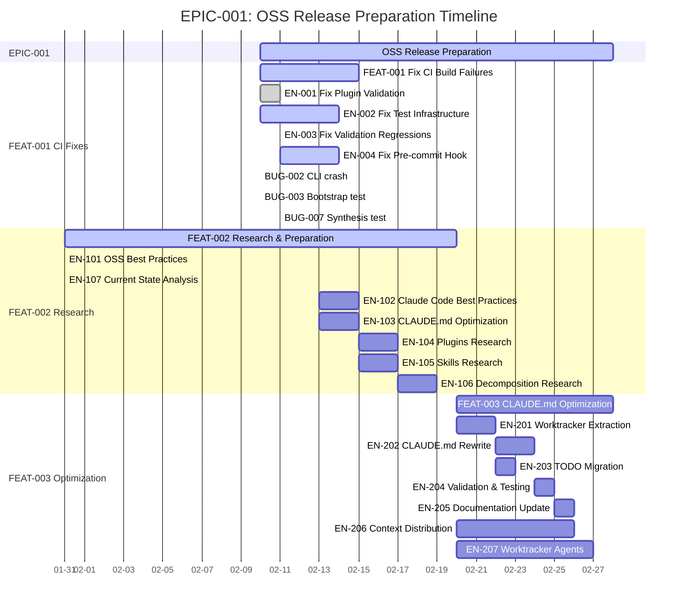
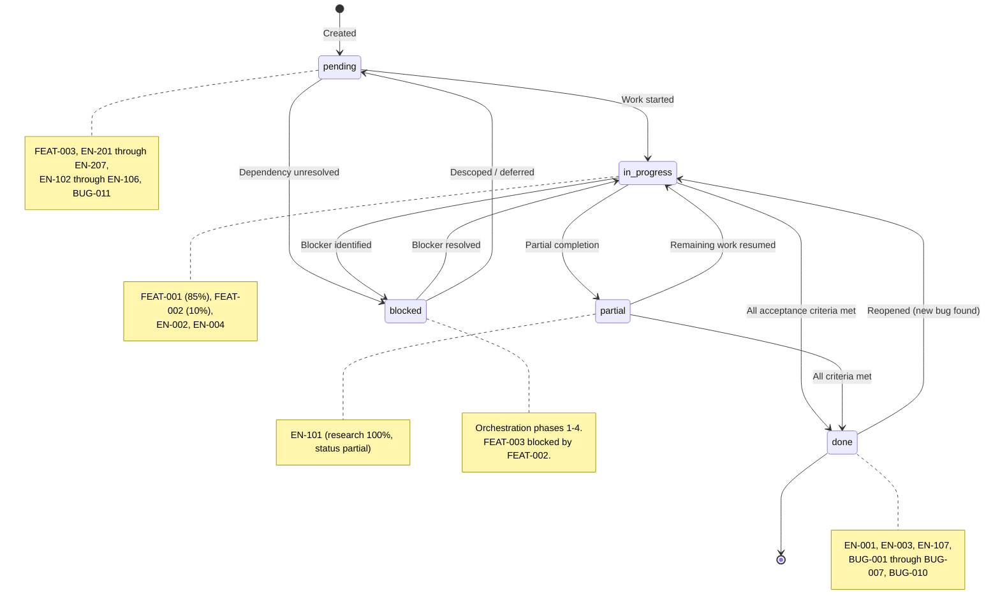
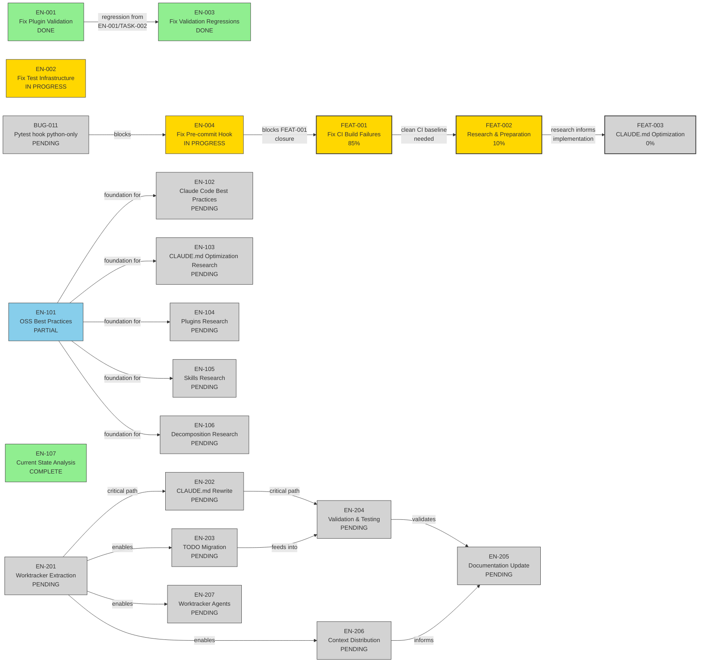
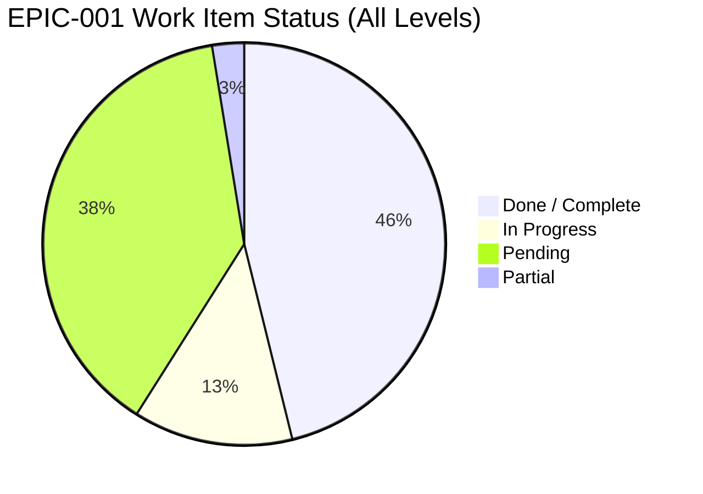
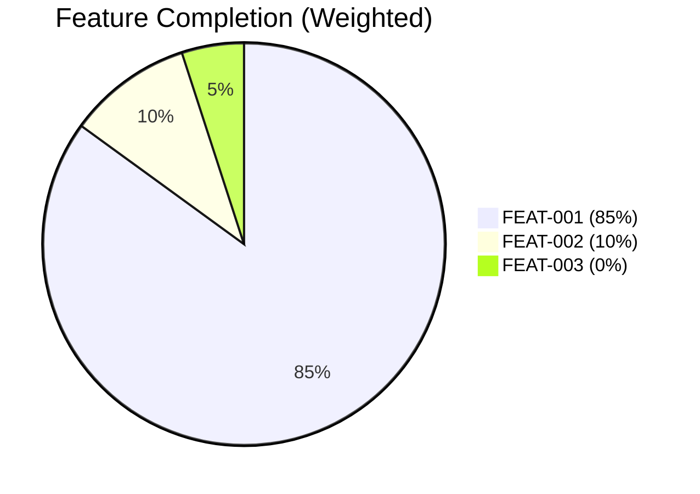
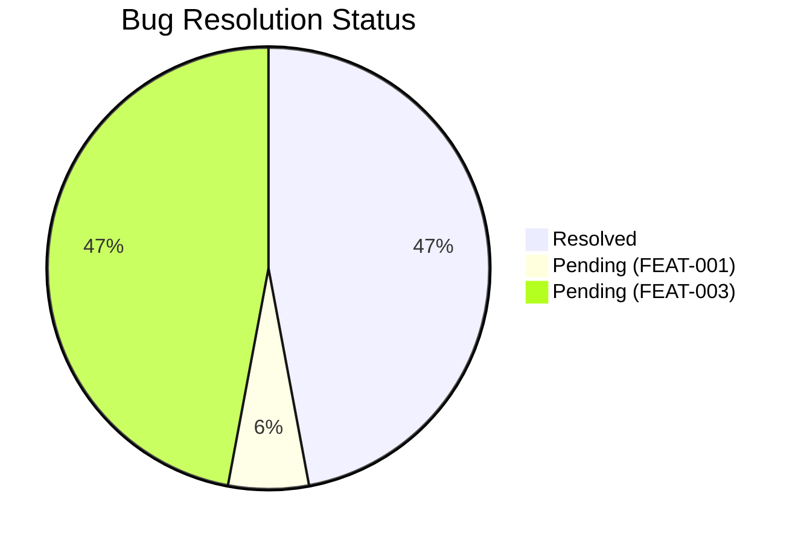
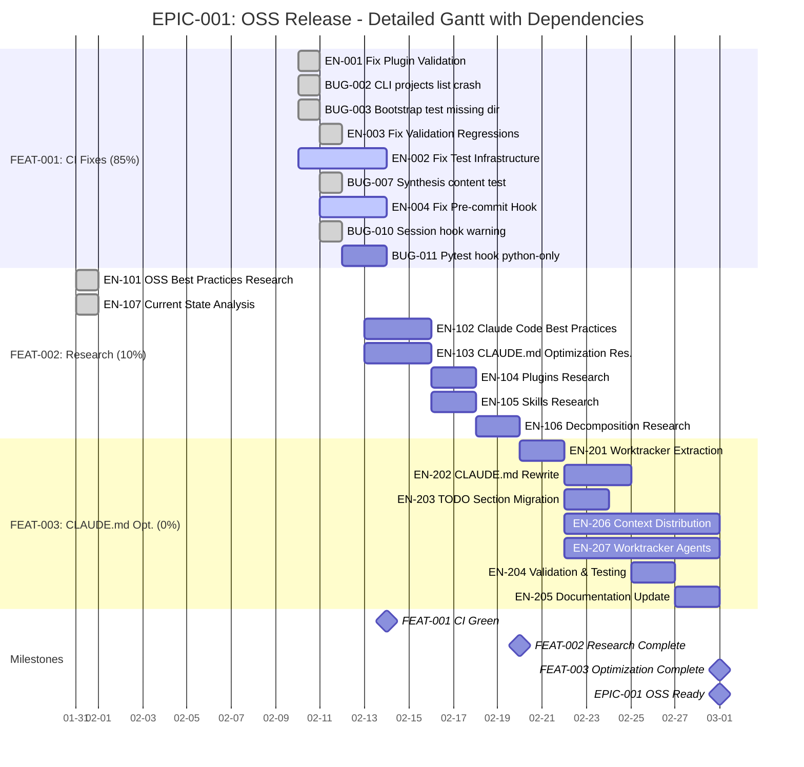

# EPIC-001: OSS Release Preparation — Visual Dashboard

> **Generated:** 2026-02-12
> **Agent:** wt-visualizer v1.0.0
> **Root Entity:** EPIC-001
> **Project:** PROJ-001-oss-release
> **Total Entities:** 42

---

## Document Sections

| Section | Purpose |
|---------|---------|
| [1. Hierarchy](#1-hierarchy) | Full parent-child entity tree (flowchart TD) |
| [2. Timeline](#2-timeline) | Project schedule grouped by Feature (gantt) |
| [3. Status Lifecycle](#3-status-lifecycle) | Work item state machine (stateDiagram-v2) |
| [4. Dependencies](#4-dependencies) | Blocking relationships and critical paths (flowchart LR) |
| [5. Progress](#5-progress) | Completion breakdown pie charts |
| [6. Gantt with Dependencies](#6-gantt-with-dependencies) | Detailed schedule with dependency chains and milestones |
| [Legend](#legend) | Color coding and status definitions |
| [Warnings](#warnings) | Data integrity notes |

---

## Legend

| Color | Status | Hex |
|-------|--------|-----|
| Green | done / complete | #90EE90 |
| Gold | in_progress | #FFD700 |
| Light Gray | pending | #D3D3D3 |
| Light Blue | partial | #87CEEB |
| Red | blocked | #FF6B6B |

---

## 1. Hierarchy

> Full EPIC-001 parent-child tree. 42 entities across 3 features, 18 enablers, bugs, decisions, and discoveries.

```mermaid
flowchart TD
    EPIC001["EPIC-001<br/>OSS Release Preparation<br/>35%"]

    %% Features
    FEAT001["FEAT-001<br/>Fix CI Build Failures<br/>85%"]
    FEAT002["FEAT-002<br/>Research & Preparation<br/>10%"]
    FEAT003["FEAT-003<br/>CLAUDE.md Optimization<br/>0%"]

    %% FEAT-001 Enablers
    EN001["EN-001<br/>Fix Plugin Validation"]
    EN002["EN-002<br/>Fix Test Infrastructure"]
    EN003["EN-003<br/>Fix Validation Test Regressions"]
    EN004["EN-004<br/>Fix Pre-commit Hook Coverage"]

    %% FEAT-001 Feature-Level Bugs
    BUG002F1["BUG-002<br/>CLI projects list crash"]
    BUG003F1["BUG-003<br/>Bootstrap test missing dir"]
    BUG007F1["BUG-007<br/>Synthesis content test"]

    %% EN-004 Children
    BUG010["BUG-010<br/>Session hook warning"]
    BUG011["BUG-011<br/>Pytest hook python-only"]
    DEC001E4["DEC-001<br/>Pre-commit install strategy"]
    DEC002E4["DEC-002<br/>Pytest hook file types"]

    %% FEAT-002 Enablers
    EN101["EN-101<br/>OSS Best Practices Research"]
    EN102["EN-102<br/>Claude Code Best Practices"]
    EN103["EN-103<br/>CLAUDE.md Optimization Research"]
    EN104["EN-104<br/>Plugins Research"]
    EN105["EN-105<br/>Skills Research"]
    EN106["EN-106<br/>Decomposition Research"]
    EN107["EN-107<br/>Current State Analysis"]

    %% FEAT-002 Decisions and Discoveries
    DEC001F2["DEC-001<br/>Transcript Decisions"]
    DEC002F2["DEC-002<br/>Orchestration Execution"]
    DEC003F2["DEC-003<br/>Phase 2 Execution Strategy"]
    DISC001F2["DISC-001<br/>Missed Research Scope"]

    %% FEAT-003 Enablers
    EN201["EN-201<br/>Worktracker Skill Extraction"]
    EN202["EN-202<br/>CLAUDE.md Rewrite"]
    EN203["EN-203<br/>TODO Section Migration"]
    EN204["EN-204<br/>Validation & Testing"]
    EN205["EN-205<br/>Documentation Update"]
    EN206["EN-206<br/>Context Distribution Strategy"]
    EN207["EN-207<br/>Worktracker Agent Implementation"]

    %% FEAT-003 Decisions and Discoveries
    DEC001F3["DEC-001<br/>Navigation Table Standard"]
    DISC001F3["DISC-001<br/>Navigation Tables LLM"]

    %% Hierarchy Connections
    EPIC001 --> FEAT001
    EPIC001 --> FEAT002
    EPIC001 --> FEAT003

    FEAT001 --> EN001
    FEAT001 --> EN002
    FEAT001 --> EN003
    FEAT001 --> EN004
    FEAT001 --> BUG002F1
    FEAT001 --> BUG003F1
    FEAT001 --> BUG007F1

    EN004 --> BUG010
    EN004 --> BUG011
    EN004 --> DEC001E4
    EN004 --> DEC002E4

    FEAT002 --> EN101
    FEAT002 --> EN102
    FEAT002 --> EN103
    FEAT002 --> EN104
    FEAT002 --> EN105
    FEAT002 --> EN106
    FEAT002 --> EN107
    FEAT002 --> DEC001F2
    FEAT002 --> DEC002F2
    FEAT002 --> DEC003F2
    FEAT002 --> DISC001F2

    FEAT003 --> EN201
    FEAT003 --> EN202
    FEAT003 --> EN203
    FEAT003 --> EN204
    FEAT003 --> EN205
    FEAT003 --> EN206
    FEAT003 --> EN207
    FEAT003 --> DEC001F3
    FEAT003 --> DISC001F3

    %% Status Color Coding
    style EPIC001 fill:#FFD700,stroke:#333,stroke-width:2px
    style FEAT001 fill:#FFD700,stroke:#333,stroke-width:2px
    style FEAT002 fill:#FFD700,stroke:#333,stroke-width:2px
    style FEAT003 fill:#D3D3D3,stroke:#333,stroke-width:2px

    style EN001 fill:#90EE90,stroke:#333
    style EN002 fill:#FFD700,stroke:#333
    style EN003 fill:#90EE90,stroke:#333
    style EN004 fill:#FFD700,stroke:#333

    style BUG002F1 fill:#90EE90,stroke:#333
    style BUG003F1 fill:#90EE90,stroke:#333
    style BUG007F1 fill:#90EE90,stroke:#333

    style BUG010 fill:#90EE90,stroke:#333
    style BUG011 fill:#D3D3D3,stroke:#333
    style DEC001E4 fill:#90EE90,stroke:#333
    style DEC002E4 fill:#90EE90,stroke:#333

    style EN101 fill:#87CEEB,stroke:#333
    style EN102 fill:#D3D3D3,stroke:#333
    style EN103 fill:#D3D3D3,stroke:#333
    style EN104 fill:#D3D3D3,stroke:#333
    style EN105 fill:#D3D3D3,stroke:#333
    style EN106 fill:#D3D3D3,stroke:#333
    style EN107 fill:#90EE90,stroke:#333

    style DEC001F2 fill:#90EE90,stroke:#333
    style DEC002F2 fill:#90EE90,stroke:#333
    style DEC003F2 fill:#90EE90,stroke:#333
    style DISC001F2 fill:#90EE90,stroke:#333

    style EN201 fill:#D3D3D3,stroke:#333
    style EN202 fill:#D3D3D3,stroke:#333
    style EN203 fill:#D3D3D3,stroke:#333
    style EN204 fill:#D3D3D3,stroke:#333
    style EN205 fill:#D3D3D3,stroke:#333
    style EN206 fill:#D3D3D3,stroke:#333
    style EN207 fill:#D3D3D3,stroke:#333

    style DEC001F3 fill:#90EE90,stroke:#333
    style DISC001F3 fill:#90EE90,stroke:#333


```



---

## 2. Timeline

> Project schedule grouped by Feature. Done/active/future markers. Pending dates are estimates.



---

## 3. Status Lifecycle

> Work item state machine showing all transitions observed in PROJ-001.



**Transitions observed in PROJ-001:**

| Transition | Count | Examples |
|------------|-------|---------|
| pending -> in_progress | 11+ | FEAT-001, EN-001, EN-002, EN-003, EN-004 |
| in_progress -> done | 10+ | EN-001, EN-003, BUG-001 through BUG-007, BUG-010 |
| done -> in_progress (reopened) | 3 | FEAT-001 (reopened 3x: BUG-007, EN-004, EN-002 PII) |
| in_progress -> partial | 1 | EN-101 |
| pending -> blocked | 3 | Orchestration phases 1-4 |

---

## 4. Dependencies

> Blocking relationships, critical paths, and cross-cutting concerns.



**Critical Paths:**

```
FEAT-001 closure:  BUG-011 -> EN-004 -> FEAT-001 milestone
Full project:      EN-106 -> EN-201 -> EN-202 -> EN-204 -> EN-205 -> EPIC-001 milestone
Parallel path:     EN-201 -> EN-206 (longest parallel path at 7 days)
```


---

## 5. Progress

> Work item completion breakdown across the entire project.



**Status Breakdown:**

| Status | Count | Items |
|--------|-------|-------|
| **Done / Complete** | 18 | EN-001, EN-003, EN-107, BUG-001 through BUG-007, BUG-010, 6 Decisions, DISC-001 (FEAT-002) |
| **In Progress** | 4 | FEAT-001, FEAT-002, EN-002, EN-004 |
| **Pending** | 15 | FEAT-003, EN-102 through EN-106, EN-201 through EN-207, BUG-011 |
| **Partial** | 1 | EN-101 |





**By Entity Type:**

| Type | Done | In Progress | Pending | Partial | Total |
|------|------|-------------|---------|---------|-------|
| Features | 0 | 2 | 1 | 0 | 3 |
| Enablers (FEAT-001) | 2 | 2 | 0 | 0 | 4 |
| Enablers (FEAT-002) | 1 | 0 | 5 | 1 | 7 |
| Enablers (FEAT-003) | 0 | 0 | 7 | 0 | 7 |
| Bugs (FEAT-001) | 8 | 0 | 1 | 0 | 9 |
| Bugs (FEAT-003) | 0 | 0 | 8 | 0 | 8 |
| Decisions | 6 | 0 | 0 | 0 | 6 |
| Discoveries | 2 | 0 | 0 | 0 | 2 |

---

## 6. Gantt with Dependencies

> Detailed schedule with dependency chains (`after` keyword), milestones, and today marker.



**Actual vs Estimated:**

| Item | Start | End | Duration | Basis |
|------|-------|-----|----------|-------|
| EN-001 | 2026-02-10 | 2026-02-11 | 1 day | actual |
| EN-003 | 2026-02-11 | 2026-02-11 | < 1 day | actual |
| BUG-002, BUG-003 | 2026-02-10 | 2026-02-10 | < 1 day | actual |
| BUG-007, BUG-010 | 2026-02-11 | 2026-02-11 | < 1 day | actual |
| EN-101, EN-107 | 2026-01-31 | 2026-01-31 | < 1 day | actual |
| EN-102 through EN-106 | 2026-02-13+ | — | 2-3 days each | estimated (effort pts) |
| EN-201 through EN-207 | 2026-02-20+ | — | 2-7 days each | estimated (effort pts) |

---

## Warnings

All diagrams follow **WORKTRACKER.md as the single source of truth**. State drift was detected:

| Entity | WORKTRACKER.md | Entity File | Delta |
|--------|---------------|-------------|-------|
| FEAT-002 | 10%, 5 EN pending | 100%, all EN complete | Entity file has more current state |
| FEAT-003 | 0%, all EN pending | 49%, 3 EN complete | Entity file has more current state |
| EN-101 | partial | partial (100% research) | Consistent but status vocabulary unclear |

A status reconciliation pass is recommended to align entity files with WORKTRACKER.md.

---

*Generated by wt-visualizer v1.0.0 — Consolidated by main context*
*Source diagrams: hierarchy, timeline, status, dependencies, progress, gantt*
