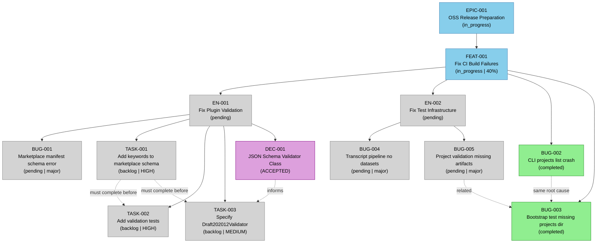
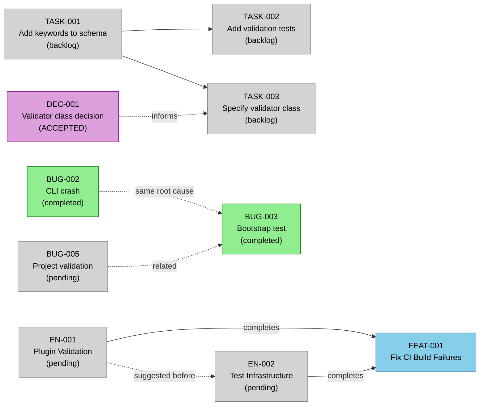
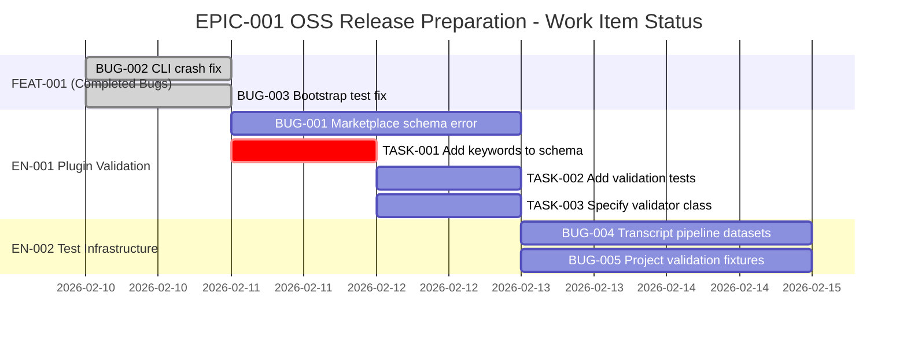
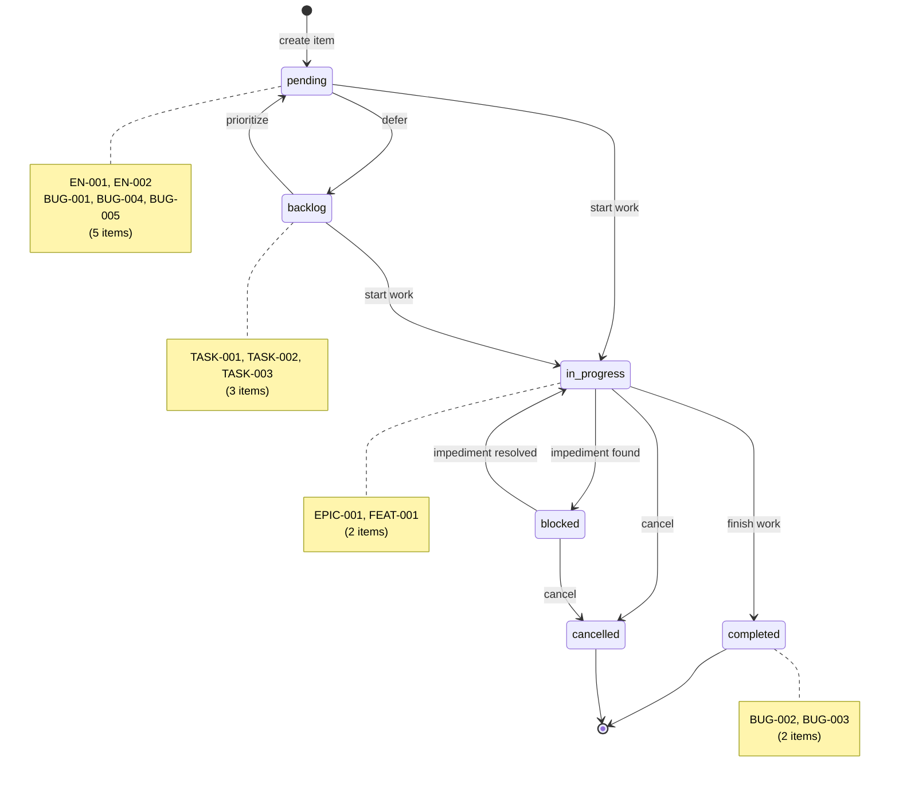
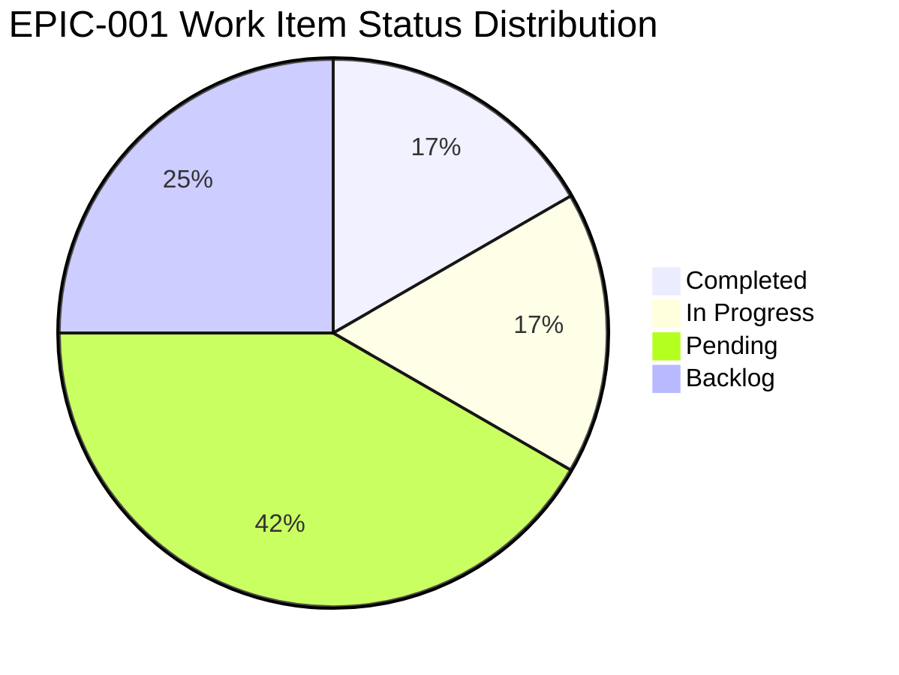

# EPIC-001 Hierarchy Visualization

**Generated:** 2026-02-10
**Root Entity:** EPIC-001
**Diagram Types:** hierarchy, dependencies, gantt, state, progress (pie)
**Entities Included:** 14
**Max Depth Reached:** 5 (EPIC -> FEAT -> EN -> BUG -> TASK)
**Scope:** Full EPIC-001 (OSS Release Preparation)

---

## Document Sections

| Section | Purpose |
|---------|---------|
| [1. Hierarchy Flowchart](#1-hierarchy-flowchart) | Complete Mermaid flowchart (TD) of EPIC-001 entity tree |
| [2. Dependency Map](#2-dependency-map) | Dependency chains (LR) between entities |
| [3. Gantt Chart](#3-gantt-chart) | Timeline/status view of all work items |
| [4. State Diagram](#4-state-diagram) | State machine showing status progression |
| [5. Pie Chart](#5-pie-chart) | Distribution of items by status |
| [Legend](#legend) | Color coding and line style explanation |
| [Entity Inventory](#entity-inventory) | Tabular listing of all entities with metadata |
| [Key Observations](#key-observations) | Critical path, progress, and blockers |
| [Metadata](#metadata) | Generation details |

---

## 1. Hierarchy Flowchart

Parent-child relationships from EPIC down to leaf tasks.



---

## 2. Dependency Map

Dependency chains and blocking relationships between entities.



---

## 3. Gantt Chart

Timeline and status view of all work items. Items are grouped by parent and show current status (done, active, or pending).



---

## 4. State Diagram

State machine showing the worktracker item status progression. Annotated with current item counts per state.



---

## 5. Pie Chart

Distribution of deliverable work items by status. DEC-001 excluded (decision artifact, not deliverable).



---

## Legend

| Symbol | Meaning |
|--------|---------|
| **Solid arrow** ( `-->` ) | Parent-child relationship |
| **Dashed arrow** ( `-.->` ) | Dependency or cross-reference |
|  **Blue (#87CEEB)** | In Progress |
|  **Green (#90EE90)** | Completed |
|  **Gray (#D3D3D3)** | Pending / Backlog |
|  **Purple (#DDA0DD)** | Decision (Accepted) |

---

## Entity Inventory

| # | ID | Type | Title | Status | Priority | Parent | Color |
|---|-----|------|-------|--------|----------|--------|-------|
| 1 | EPIC-001 | Epic | OSS Release Preparation | in_progress | high | -- | Blue |
| 2 | FEAT-001 | Feature | Fix CI Build Failures | in_progress | high | EPIC-001 | Blue |
| 3 | EN-001 | Enabler | Fix Plugin Validation | pending | high | FEAT-001 | Gray |
| 4 | EN-002 | Enabler | Fix Test Infrastructure | pending | medium | FEAT-001 | Gray |
| 5 | BUG-001 | Bug | Marketplace manifest schema error: `keywords` not allowed | pending | high | EN-001 | Gray |
| 6 | BUG-002 | Bug | CLI `projects list` crashes with unhandled exception | completed | high | FEAT-001 | Green |
| 7 | BUG-003 | Bug | Bootstrap test assumes `projects/` directory exists | completed | medium | FEAT-001 | Green |
| 8 | BUG-004 | Bug | Transcript pipeline test finds no datasets | pending | medium | EN-002 | Gray |
| 9 | BUG-005 | Bug | Project validation tests reference non-existent PROJ-001-plugin-cleanup | pending | medium | EN-002 | Gray |
| 10 | TASK-001 | Task | Add `keywords` property to marketplace plugin item schema | backlog | HIGH | BUG-001 / EN-001 | Gray |
| 11 | TASK-002 | Task | Add tests for plugin manifest validation | backlog | HIGH | BUG-001 / EN-001 | Gray |
| 12 | TASK-003 | Task | Specify Draft202012Validator in validation script | backlog | MEDIUM | BUG-001 / EN-001 | Gray |
| 13 | DEC-001 | Decision | JSON Schema Validator Class Selection | ACCEPTED | HIGH | EN-001 | Purple |
| 14 | -- | PR | PR #6: fix Windows CRLF line ending support in VTT validator | blocked (CI failing) | -- | EPIC-001 | -- |

### Status Distribution

| Status | Count | Percentage |
|--------|-------|------------|
| Completed | 2 | 17% |
| In Progress | 2 | 17% |
| Pending | 5 | 41% |
| Backlog | 3 | 25% |
| **Total** | **12** | **100%** |

(DEC-001 excluded from status distribution as it is a decision artifact, not a deliverable work item. EPIC-001 and FEAT-001 counted as in_progress containers.)

---

## Key Observations

### 1. Critical Path

The critical path to unblocking PR #6 is:

```
TASK-001 (add keywords to schema)
  -> TASK-002 (add validation tests)
  -> TASK-003 (specify validator class)
  -> BUG-001 resolved -> EN-001 complete
  -> BUG-004 fix (transcript pipeline)
  -> BUG-005 fix (project validation)
  -> EN-002 complete
  -> FEAT-001 complete
  -> EPIC-001 complete
```

**TASK-001 is the single most critical unstarted item.** It is the root cause fix for BUG-001 and blocks both TASK-002 and TASK-003. Completing TASK-001 would unblock the entire EN-001 work stream.

### 2. Progress Assessment

- **Overall Progress:** ~17% (2 of 12 deliverable items completed)
- **Completed:** BUG-002 and BUG-003 (both resolved by committing `projects/` directory to git -- same root cause, single fix)
- **Active Work:** None currently in_progress at the leaf level. EN-001 and BUG-001 have been corrected to `pending` (no task work has started).
- **Waiting:** EN-002 (BUG-004 + BUG-005) has not started yet

### 3. Blockers and Risks

| Risk | Severity | Mitigation |
|------|----------|------------|
| **TASK-001 not started** | HIGH | This is the root cause fix for the Plugin Validation CI failure. Must be started immediately. |
| **EN-002 has no tasks defined** | MEDIUM | BUG-004 and BUG-005 have fix options identified but no tasks created yet. Task decomposition needed before work begins. |
| **BUG-004 test data decision** | MEDIUM | Three options under consideration (skip, dynamic discovery, commit test data). Decision needed before implementation. |
| **Sequential dependency** | LOW | EN-001 and EN-002 are independent and could be worked in parallel to accelerate completion. |

### 4. Parallelization Opportunity

EN-001 (Plugin Validation) and EN-002 (Test Infrastructure) address different CI failure categories and have **no mutual dependencies**. They can be worked concurrently:

- **EN-001 track:** TASK-001 -> TASK-002 -> TASK-003 (fixes Plugin Validation CI check)
- **EN-002 track:** BUG-004 + BUG-005 (fixes Test pip/uv CI jobs)

Working both in parallel could reduce time-to-completion significantly.

### 5. Decision Status

DEC-001 (JSON Schema Validator Class Selection) is **ACCEPTED** but has an important addendum: the decision is valid as a best practice (TASK-003) but is **not** the root cause fix. The root cause fix is TASK-001 (adding `keywords` to the marketplace schema). This distinction was discovered through local verification after the initial analysis.

---

## Metadata

- **Entities Visualized:** EPIC-001, FEAT-001, EN-001, EN-002, BUG-001, BUG-002, BUG-003, BUG-004, BUG-005, TASK-001, TASK-002, TASK-003, DEC-001
- **Relationships Shown:** 11 parent-child, 5 dependency/cross-reference
- **Diagram Types Generated:** 5 (hierarchy flowchart, dependency map, gantt chart, state diagram, pie chart)
- **Status Color Coding:** Enabled (Blue=in_progress, Green=completed, Gray=pending/backlog, Purple=decision)
- **Status Corrections Applied:** EN-001 and BUG-001 corrected from `in_progress` to `pending` per source files
- **Warnings:** None

---

*Generated by wt-visualizer v1.0.0*
