# ORCHESTRATION_PLAN.md

> **Document ID:** PROJ-001-ORCH-PLAN
> **Project:** PROJ-001-oss-release
> **Workflow ID:** `oss-release-20260131-001`
> **Status:** ACTIVE - Phase 1 COMPLETE, Phase 2 READY
> **Version:** 5.0.0
> **Created:** 2026-01-31
> **Last Updated:** 2026-01-31T23:30:00Z
> **Approved:** 2026-01-31T19:00:00Z

## Changelog

### v5.0.0 (2026-01-31T23:30:00Z) - Phase 2 Restructure per DEC-003

| Change | Description |
|--------|-------------|
| **7 Separate ps-architect Agents** | ADR creation now uses 7 separate agents (ps-architect-001 through ps-architect-007) for quality isolation |
| **4-Tier ADR Execution** | ADRs organized by dependency: Tier 1 (ADR-001), Tier 2 (002/003/004/006), Tier 3 (005), Tier 4 (007) |
| **Per-Tier Quality Gates** | QG-2.1, QG-2.2, QG-2.3, QG-2.4 replace single QG-2 (D-004: Option B) |
| **Tiered Hybrid PS/NSE** | NSE agents interspersed at tier boundaries for cross-pollination (D-003: Option C) |
| **Explicit Mandatory Reads** | Priority-ordered artifact reads for each agent (D-005) |
| **Checkpoints at Tier Boundaries** | 4 checkpoints in Phase 2 (D-001) |
| **Agent Count Updated** | 30 total agents (24 original + 6 additional ps-architect instances) |
| **Decision Document Reference** | FEAT-001:DEC-003 captures 5 user decisions |

### v4.4.0 (2026-01-31T22:30:00Z) - Phase 1 Complete

| Change | Description |
|--------|-------------|
| Phase 1 Complete | All 4 tiers executed: Tier 1 (4 agents), Tier 2 (risk), Tier 3 (QG-1), Tier 4 (reports) |
| QG-1 Passed | ps-critic: 0.938, nse-qa: 0.946 (avg: 0.942 >= 0.92) |
| Barrier 2 Complete | Cross-pollination manifests created for PS and NSE pipelines |
| Phase 2 Unblocked | Ready for tiered ADR execution |

### v4.1.0 (2026-01-31T21:00:00Z) - Adversarial Feedback Loops Visualized

| Change | Description |
|--------|-------------|
| **Feedback Loops Added** | Mermaid diagram now shows adversarial critic feedback loops at each quality gate |
| QG-0 v1 FAIL Shown | Explicitly shows initial QG-0 failure (0.876 < 0.92) that triggered DISC-001 |
| DISC-001 Visualized | Discovery node shows the 5 missed research topics that were remediated |
| QG-0 v2 PASS Shown | Shows re-evaluation after remediation with +6.3% improvement |

### v4.0.0 (2026-01-31T20:25:00Z) - Phase 0 Complete

| Change | Description |
|--------|-------------|
| Phase 0 Complete | All 4 tiers executed: Tier 1a (4 agents), Tier 1b (5 agents), Tier 2 (risk), Tier 3 (QG), Tier 4 (reports) |
| QG-0 Passed | ps-critic: 0.931, nse-qa: 0.941 (avg: 0.936 >= 0.92) |
| DISC-001 Remediated | 5 expanded research agents completed (EN-102 through EN-106) |

---

## 1. Executive Summary

### L0: ELI5 Summary

We're preparing Jerry to be shared with the world as open-source software. Think of it like preparing a house for sale - we need to:

1. **Explore all options** (What's the best way to present the house?) - DONE
2. **Research what buyers want** (What do developers expect from OSS projects?) - DONE
3. **Understand our house** (What does Jerry look like today?) - DONE
4. **Plan the renovation** (What needs to change?) - IN PROGRESS
5. **Do the work** (Make the changes) - BLOCKED
6. **Inspect everything** (Quality checks at every step) - ONGOING

We have **30 specialized workers** (agents) who each do one job really well. Some research, some analyze, some design, some check quality. They all work together, sharing their findings so nothing gets missed.

**Key Safety Features:**
- Every step has TWO quality inspectors (one strict critic, one NASA-style auditor)
- Phase 2 has FOUR quality checkpoints instead of one (catch problems early!)
- A risk manager watches for problems at EVERY phase
- Full reports are generated after each phase so you know exactly what's happening

### L1: Engineer Summary

This orchestration coordinates a comprehensive multi-phase workflow using ALL available agents from `/problem-solving` (9 base + 5 expanded research + 7 Phase 2 ADR agents = 21 agents) and `/nasa-se` (10 agents) skills to prepare Jerry for OSS release.

**Architecture:**
- **2 Parallel Pipelines:** Pipeline A (Problem-Solving) and Pipeline B (NASA SE)
- **5 Sequential Phases:** Each phase has parallel agent execution within pipelines
- **Dual Quality Gates:** ps-critic (adversarial DISC-002) + nse-qa at each phase
- **Per-Tier Quality Gates (Phase 2):** QG-2.1, QG-2.2, QG-2.3, QG-2.4 (4 gates instead of 1)
- **Dual Reporting:** ps-reporter + nse-reporter at each phase completion
- **Continuous Risk Management:** nse-risk runs at every phase
- **Full Artifact Pass-Through:** Upstream artifacts passed downstream (not summaries)

**Agent Distribution (30 Total):**
- Phase 0: 14 agents (9 original + 5 expanded research)
- Phase 1: 5 agents (deep research, investigation, V&V)
- Phase 2: 13 agents (7 ps-architect + 4 nse + 2 shared) - **TIERED EXECUTION**
- Phase 3: 6 agents (validation, synthesis, review)
- Phase 4: 5 agents (final V&V, reporting)
- Quality Gates: ps-critic + nse-qa at each phase + 4 per-tier in Phase 2
- Reports: ps-reporter + nse-reporter at each phase

### L2: Architect Summary

**Orchestration Pattern:** Cross-Pollinated Pipeline with Tiered Hybrid Execution and Per-Tier Quality Gates

**Key Architectural Decisions (v5.0.0):**

1. **7 Separate ps-architect Agents:** Each ADR created by dedicated agent for quality isolation (prevents cross-contamination)
2. **4-Tier Dependency Analysis:** ADRs organized by dependency graph:
   - Tier 1: ADR-001 (CRITICAL foundation, RPN 280)
   - Tier 2: ADR-002, 003, 004, 006 (depend only on ADR-001)
   - Tier 3: ADR-005 (depends on ADR-001 + ADR-002)
   - Tier 4: ADR-007 (synthesis, depends on ALL)
3. **Per-Tier Quality Gates:** QG-2.1 through QG-2.4 catches foundational issues before building on them
4. **Tiered Hybrid PS/NSE:** NSE agents validate at tier boundaries (not wait until end)
5. **Explicit Mandatory Reads:** Priority-ordered artifact consumption for each agent

**Constitutional Compliance:**
- P-002 (File Persistence): All agent outputs persisted
- P-003 (No Recursion): Main context -> worker agents only
- P-020 (User Authority): User approval required at each quality gate
- P-022 (No Deception): Transparent reasoning, honest quality scores

**Current State:** Phase 1 COMPLETE, Phase 2 READY with 4-tier execution plan

---

## 2. Workflow Identification

| Field | Value | Source |
|-------|-------|--------|
| Workflow ID | `oss-release-20260131-001` | auto |
| ID Format | `{purpose}-{YYYYMMDD}-{NNN}` | semantic-date-seq |
| Base Path | `projects/PROJ-001-oss-release/work/EPIC-001-oss-release/FEAT-002-research-and-preparation/orchestration/oss-release-20260131-001/` | Dynamic |
| Total Agents | 30 (21 PS + 10 NSE, with 1 shared ps-critic) | Full coverage |
| Total Phases | 5 | Sequential with parallel tracks |
| Quality Gates | 8 (QG-0, QG-1, QG-2.1-2.4, QG-3, QG-4) | Including 4 per-tier |
| Barriers | 4 | Between each phase |

**Artifact Output Locations:**
```
projects/PROJ-001-oss-release/work/EPIC-001-oss-release/FEAT-002-research-and-preparation/orchestration/oss-release-20260131-001/
├── ps/                        # Pipeline A (Problem-Solving) artifacts
├── nse/                       # Pipeline B (NASA SE) artifacts
├── cross-pollination/         # Barrier handoff artifacts
├── quality-gates/             # Dual QG artifacts (including per-tier for Phase 2)
│   ├── qg-0/                  # Phase 0 gate
│   ├── qg-1/                  # Phase 1 gate
│   ├── qg-2/                  # Phase 2 per-tier gates
│   │   ├── tier-1/            # QG-2.1
│   │   ├── tier-2/            # QG-2.2
│   │   ├── tier-3/            # QG-2.3
│   │   └── tier-4/            # QG-2.4
│   ├── qg-3/                  # Phase 3 gate
│   └── qg-4/                  # Phase 4 gate
├── reports/                   # Phase completion reports
└── risks/                     # Evolving risk register
```

---

## 3. Agent Registry

### 3.1 Problem-Solving Agents (21 total)

#### Base PS Agents (9)

| ID | Agent | Role | Phase(s) | Output |
|----|-------|------|----------|--------|
| PS-01 | `ps-researcher` | Research Specialist | 0, 1 | Research reports with citations |
| PS-02 | `ps-analyst` | Analysis Specialist | 0, 1 | Gap analysis, 5 Whys, FMEA, trade-offs |
| PS-03 | `ps-architect` | Architecture Specialist (base) | - | See Phase 2 instances below |
| PS-04 | `ps-critic` | Quality Evaluator | QG 0-4 | Adversarial quality reviews (DISC-002) |
| PS-05 | `ps-validator` | Validation Specialist | 3 | Constraint verification with evidence |
| PS-06 | `ps-synthesizer` | Synthesis Specialist | 3 | Pattern extraction, knowledge synthesis |
| PS-07 | `ps-reviewer` | Review Specialist | 3 | Design/architecture review |
| PS-08 | `ps-investigator` | Investigation Specialist | 1 | Failure analysis, root cause |
| PS-09 | `ps-reporter` | Reporting Specialist | 0-4 | Phase status reports |

#### Expanded Research Agents (5) - DISC-001 Remediation

| ID | Agent | Role | Phase | Output |
|----|-------|------|-------|--------|
| PS-01a | `ps-researcher-claude-code` | Claude Code CLI Research | 0 | `claude-code-best-practices.md` |
| PS-01b | `ps-researcher-claude-md` | CLAUDE.md Optimization Research | 0 | `claude-md-best-practices.md` |
| PS-01c | `ps-researcher-plugins` | Plugin Architecture Research | 0 | `plugins-best-practices.md` |
| PS-01d | `ps-researcher-skills` | Skills Patterns Research | 0 | `skills-best-practices.md` |
| PS-01e | `ps-researcher-decomposition` | Decomposition with Imports | 0 | `decomposition-best-practices.md` |

#### Phase 2 ADR Agents (7) - NEW in v5.0.0

| ID | Agent | ADR | Priority | RPN | Tier | Dependencies |
|----|-------|-----|----------|-----|------|--------------|
| PS-03-001 | `ps-architect-001` | ADR-OSS-001: CLAUDE.md Decomposition | CRITICAL | 280 | 1 | None |
| PS-03-002 | `ps-architect-002` | ADR-OSS-002: Repository Sync Process | HIGH | 192 | 2 | ADR-001 |
| PS-03-003 | `ps-architect-003` | ADR-OSS-003: Work Tracker Extraction | HIGH | - | 2 | ADR-001 |
| PS-03-004 | `ps-architect-004` | ADR-OSS-004: Multi-Persona Documentation | MEDIUM | - | 2 | ADR-001 |
| PS-03-005 | `ps-architect-005` | ADR-OSS-005: Repository Migration | HIGH | - | 3 | ADR-001, ADR-002 |
| PS-03-006 | `ps-architect-006` | ADR-OSS-006: Transcript Templates | MEDIUM | - | 2 | ADR-001 |
| PS-03-007 | `ps-architect-007` | ADR-OSS-007: OSS Release Checklist | CRITICAL | - | 4 | ALL prior ADRs |

### 3.2 NASA SE Agents (10)

| ID | Agent | Role | Phase(s) | Output |
|----|-------|------|----------|--------|
| NSE-01 | `nse-requirements` | Requirements Engineer | 0, 2 | Shall-statements, traceability |
| NSE-02 | `nse-verification` | V&V Specialist | 1, 4 | VCRM, test planning |
| NSE-03 | `nse-risk` | Risk Manager | 0-4 | 5x5 risk matrix, risk register |
| NSE-04 | `nse-reviewer` | Technical Review Gate | 3 | Technical review findings |
| NSE-05 | `nse-integration` | System Integration | 2 | Interface control, integration plan |
| NSE-06 | `nse-configuration` | Config Management | 2, 3 | Baseline control, change mgmt |
| NSE-07 | `nse-architecture` | Technical Architect | 2 | Design decisions, decomposition |
| NSE-08 | `nse-explorer` | Exploration Engineer | 0 | Divergent alternatives, trade studies |
| NSE-09 | `nse-qa` | QA Specialist | QG 0-4 | Compliance audit, artifact validation |
| NSE-10 | `nse-reporter` | SE Status Reporter | 0-4 | SE metrics, health status |

### 3.3 Agent Phase Assignment Matrix (Updated for v5.0.0)

```
                    │ Phase 0 │ Phase 1 │     Phase 2      │ Phase 3 │ Phase 4 │
────────────────────┼─────────┼─────────┼──────────────────┼─────────┼─────────┤
ps-researcher       │    ●    │    ●    │                  │         │         │
ps-researcher-*     │    ●    │         │                  │         │         │  (5 expanded)
ps-analyst          │    ●    │    ●    │                  │         │         │
ps-architect-001    │         │         │ ● T1             │         │         │
ps-architect-002    │         │         │    ● T2          │         │         │
ps-architect-003    │         │         │    ● T2          │         │         │
ps-architect-004    │         │         │    ● T2          │         │         │
ps-architect-005    │         │         │       ● T3       │         │         │
ps-architect-006    │         │         │    ● T2          │         │         │
ps-architect-007    │         │         │          ● T4    │         │         │
ps-critic (QG)      │    ◆    │    ◆    │ ◆ ◆ ◆ ◆ (4x)    │    ◆    │    ◆    │
ps-validator        │         │         │                  │    ●    │         │
ps-synthesizer      │         │         │                  │    ●    │         │
ps-reviewer         │         │         │                  │    ●    │         │
ps-investigator     │         │    ●    │                  │         │         │
ps-reporter         │    ○    │    ○    │            ○     │    ○    │    ○    │
────────────────────┼─────────┼─────────┼──────────────────┼─────────┼─────────┤
nse-requirements    │    ●    │         │ ● T1             │         │         │
nse-verification    │         │    ●    │                  │         │    ●    │
nse-risk            │    ●    │    ●    │          ● T4    │    ●    │    ●    │
nse-reviewer        │         │         │                  │    ●    │         │
nse-integration     │         │         │       ● T3       │         │         │
nse-configuration   │         │         │          ● T4    │    ●    │         │
nse-architecture    │         │         │    ● T2          │         │         │
nse-explorer        │    ●    │         │                  │         │         │
nse-qa (QG)         │    ◆    │    ◆    │ ◆ ◆ ◆ ◆ (4x)    │    ◆    │    ◆    │
nse-reporter        │    ○    │    ○    │            ○     │    ○    │    ○    │

Legend: ● = Phase work  ◆ = Quality Gate  ○ = Phase Report  T1-T4 = Tier
```

---

## 4. Workflow Diagram (Mermaid)

> **Dark Mode Optimized:** Colors chosen for visibility in both light and dark IDE themes.
> **Current State:** Phase 1 COMPLETE, Phase 2 READY with 4-tier structure
> **v5.0.0 Update:** Phase 2 shows 4-tier execution with 7 separate ps-architect agents

```mermaid
%%{init: {'theme': 'base', 'themeVariables': { 'primaryColor': '#2d3748', 'primaryTextColor': '#e2e8f0', 'primaryBorderColor': '#4a5568', 'lineColor': '#718096', 'secondaryColor': '#1a202c', 'tertiaryColor': '#2d3748', 'background': '#1a202c', 'mainBkg': '#2d3748', 'textColor': '#e2e8f0'}}}%%
flowchart TB
    %% ═══════════════════════════════════════════════════════════════════
    %% PHASE 0 & 1 - COMPLETE
    %% ═══════════════════════════════════════════════════════════════════
    subgraph COMPLETE_PHASES["✅ PHASES 0-1 COMPLETE"]
        direction TB
        P0_DONE["✅ Phase 0 Complete<br/>9 research + 5 expanded<br/>21 risks identified"]
        QG0_DONE["✅ QG-0 PASSED<br/>0.936 avg"]
        P1_DONE["✅ Phase 1 Complete<br/>Deep research + V&V<br/>22 risks tracked"]
        QG1_DONE["✅ QG-1 PASSED<br/>0.942 avg"]
        B2_DONE["✅ Barrier 2 Complete<br/>Cross-pollination manifests"]

        P0_DONE --> QG0_DONE --> P1_DONE --> QG1_DONE --> B2_DONE
    end

    %% ═══════════════════════════════════════════════════════════════════
    %% PHASE 2: TIERED ADR CREATION (v5.0.0 RESTRUCTURE)
    %% ═══════════════════════════════════════════════════════════════════
    subgraph PHASE2["⏳ PHASE 2: Requirements & Architecture (4-Tier DEC-003)"]
        direction TB

        %% TIER 1: Foundation
        subgraph P2_T1["TIER 1: Foundation (PARALLEL)"]
            PS_ARCH_001["⏳ ps-architect-001<br/>ADR-OSS-001<br/>CLAUDE.md Decomposition<br/>CRITICAL (RPN 280)"]
            NSE_REQ["⏳ nse-requirements<br/>Requirements Spec"]
        end

        QG21["⏸️ QG-2.1<br/>Threshold ≥0.92"]

        %% TIER 2: Parallel ADRs
        subgraph P2_T2["TIER 2: Parallel ADRs (depend on ADR-001)"]
            PS_ARCH_002["⏸️ ps-architect-002<br/>ADR-002: Repo Sync"]
            PS_ARCH_003["⏸️ ps-architect-003<br/>ADR-003: Worktracker"]
            PS_ARCH_004["⏸️ ps-architect-004<br/>ADR-004: Multi-Persona"]
            PS_ARCH_006["⏸️ ps-architect-006<br/>ADR-006: Transcript"]
            NSE_ARCH["⏸️ nse-architecture<br/>Validate ADR-001"]
        end

        QG22["⏸️ QG-2.2<br/>Threshold ≥0.92"]

        %% TIER 3: Dependent ADR
        subgraph P2_T3["TIER 3: Dependent (ADR-001 + ADR-002)"]
            PS_ARCH_005["⏸️ ps-architect-005<br/>ADR-005: Migration"]
            NSE_INT["⏸️ nse-integration<br/>Integration Plan"]
        end

        QG23["⏸️ QG-2.3<br/>Threshold ≥0.92"]

        %% TIER 4: Synthesis
        subgraph P2_T4["TIER 4: Synthesis (ALL ADRs)"]
            PS_ARCH_007["⏸️ ps-architect-007<br/>ADR-007: OSS Checklist<br/>CRITICAL"]
            NSE_CFG["⏸️ nse-configuration<br/>Requirements Baseline"]
            NSE_RISK_P2["⏸️ nse-risk<br/>Phase 2 Risk Update"]
        end

        QG24["⏸️ QG-2.4<br/>Threshold ≥0.92"]

        %% Tier Flow
        P2_T1 --> QG21 --> P2_T2 --> QG22 --> P2_T3 --> QG23 --> P2_T4 --> QG24
    end

    %% ═══════════════════════════════════════════════════════════════════
    %% PHASES 3-4: BLOCKED
    %% ═══════════════════════════════════════════════════════════════════
    subgraph PHASE3_4["⏸️ PHASES 3-4 BLOCKED"]
        B3["⏸️ Barrier 3"]
        P3["⏸️ Phase 3<br/>Validation & Synthesis"]
        QG3["⏸️ QG-3"]
        B4["⏸️ Barrier 4"]
        P4["⏸️ Phase 4<br/>Final V&V"]
        QG4["⏸️ QG-4 FINAL"]
        DONE["🎯 COMPLETE<br/>OSS Ready"]

        B3 --> P3 --> QG3 --> B4 --> P4 --> QG4 --> DONE
    end

    %% Connections
    COMPLETE_PHASES --> PHASE2
    PHASE2 --> PHASE3_4

    %% Styles
    style COMPLETE_PHASES fill:#22543d,stroke:#68d391,stroke-width:3px,color:#c6f6d5
    style PHASE2 fill:#553c9a,stroke:#b794f4,stroke-width:3px,color:#e9d8fd
    style PHASE3_4 fill:#4a5568,stroke:#a0aec0,stroke-width:2px,color:#e2e8f0

    style P2_T1 fill:#744210,stroke:#f6e05e,stroke-width:2px,color:#fefcbf
    style P2_T2 fill:#2c5282,stroke:#63b3ed,stroke-width:2px,color:#bee3f8
    style P2_T3 fill:#285e61,stroke:#4fd1c5,stroke-width:2px,color:#b2f5ea
    style P2_T4 fill:#742a2a,stroke:#fc8181,stroke-width:2px,color:#fed7d7
```



### 4.1 Phase 2 Tier Dependency Diagram

```
PHASE 2 ADR DEPENDENCY GRAPH (DEC-003)
══════════════════════════════════════

TIER 1 (Foundation):
┌─────────────────────────────────────────────────────────────────────┐
│  ps-architect-001                    nse-requirements               │
│  ┌───────────────────────┐          ┌──────────────────────────┐   │
│  │ ADR-OSS-001           │          │ Requirements Spec        │   │
│  │ CLAUDE.md Decomp      │          │ (No ADR dependency)      │   │
│  │ CRITICAL (RPN 280)    │          │                          │   │
│  └───────────┬───────────┘          └──────────────────────────┘   │
│              │                                                      │
└──────────────│──────────────────────────────────────────────────────┘
               │
        ┌──────┴──────┬──────────────┬──────────────┬──────────────┐
        ▼             ▼              ▼              ▼              ▼
TIER 2 (Parallel - All depend on ADR-001):
┌─────────────────────────────────────────────────────────────────────┐
│  ps-architect   ps-architect   ps-architect   ps-architect  nse-   │
│       -002          -003           -004           -006     arch    │
│  ┌──────────┐  ┌──────────┐   ┌──────────┐   ┌──────────┐ ┌─────┐ │
│  │ ADR-002  │  │ ADR-003  │   │ ADR-004  │   │ ADR-006  │ │Valid│ │
│  │ Repo     │  │ Work     │   │ Multi-   │   │Transcript│ │ADR-1│ │
│  │ Sync     │  │ Tracker  │   │ Persona  │   │ Template │ │     │ │
│  └────┬─────┘  └──────────┘   └──────────┘   └──────────┘ └─────┘ │
│       │                                                            │
└───────│────────────────────────────────────────────────────────────┘
        │
        ├─────────────────────┐
        ▼                     ▼
TIER 3 (Dependent - Needs ADR-001 + ADR-002):
┌─────────────────────────────────────────────────────────────────────┐
│  ps-architect-005                    nse-integration                │
│  ┌───────────────────────┐          ┌──────────────────────────┐   │
│  │ ADR-OSS-005           │          │ Integration Plan         │   │
│  │ Repository Migration  │          │ (Uses ADR-001 + ADR-002) │   │
│  │ HIGH priority         │          │                          │   │
│  └───────────┬───────────┘          └──────────────────────────┘   │
│              │                                                      │
└──────────────│──────────────────────────────────────────────────────┘
               │
               └────────────────────────────┐
                                            ▼
TIER 4 (Synthesis - Needs ALL prior ADRs):
┌─────────────────────────────────────────────────────────────────────┐
│  ps-architect-007               nse-configuration    nse-risk      │
│  ┌─────────────────────────┐   ┌──────────────────┐ ┌──────────┐  │
│  │ ADR-OSS-007             │   │ Requirements     │ │ Phase 2  │  │
│  │ OSS Release Checklist   │   │ Baseline         │ │ Risk     │  │
│  │ CRITICAL (Synthesis)    │   │                  │ │ Update   │  │
│  └─────────────────────────┘   └──────────────────┘ └──────────┘  │
│                                                                     │
└─────────────────────────────────────────────────────────────────────┘
```

### 4.2 Current Execution State

```
WORKFLOW PROGRESS AS OF 2026-01-31T23:30:00Z
═════════════════════════════════════════════

Phase 0 (Exploration & Research):   ████████████████████ 100% COMPLETE
  ├─ Tier 1a (Original):            ████████████████████ 100% (4 agents)
  ├─ Tier 1b (Expanded/DISC-001):   ████████████████████ 100% (5 agents)
  ├─ Tier 2 (Risk):                 ████████████████████ 100% (21 risks)
  ├─ Tier 3 (QG-0):                 ████████████████████ 100% (0.936 avg)
  └─ Tier 4 (Reports):              ████████████████████ 100% (2 reports)

Barrier 1 (Cross-Pollination):      ████████████████████ 100% COMPLETE

Phase 1 (Deep Research):            ████████████████████ 100% COMPLETE
  ├─ Tier 1 (Research + V&V):       ████████████████████ 100% (4 agents)
  ├─ Tier 2 (Risk Update):          ████████████████████ 100% (22 risks)
  ├─ Tier 3 (QG-1):                 ████████████████████ 100% (0.942 avg)
  └─ Tier 4 (Reports):              ████████████████████ 100% (2 reports)

Barrier 2 (Cross-Pollination):      ████████████████████ 100% COMPLETE

Phase 2 (Requirements & Arch):      ░░░░░░░░░░░░░░░░░░░░   0% READY
  ├─ Tier 1 (ADR-001 + nse-req):    ░░░░░░░░░░░░░░░░░░░░ READY
  ├─ QG-2.1:                        ░░░░░░░░░░░░░░░░░░░░ BLOCKED
  ├─ Tier 2 (ADRs 002/003/004/006): ░░░░░░░░░░░░░░░░░░░░ BLOCKED
  ├─ QG-2.2:                        ░░░░░░░░░░░░░░░░░░░░ BLOCKED
  ├─ Tier 3 (ADR-005):              ░░░░░░░░░░░░░░░░░░░░ BLOCKED
  ├─ QG-2.3:                        ░░░░░░░░░░░░░░░░░░░░ BLOCKED
  ├─ Tier 4 (ADR-007 + baselines):  ░░░░░░░░░░░░░░░░░░░░ BLOCKED
  └─ QG-2.4:                        ░░░░░░░░░░░░░░░░░░░░ BLOCKED

Phase 3 (Validation & Synthesis):   ░░░░░░░░░░░░░░░░░░░░   0% BLOCKED
Phase 4 (Final V&V & Reporting):    ░░░░░░░░░░░░░░░░░░░░   0% BLOCKED

Overall Progress:                   ████████░░░░░░░░░░░░  40%

Quality Gates: 2/8 passed (QG-0: 0.936, QG-1: 0.942)
Barriers: 2/4 complete
Reports: 4/10 generated
Risks: 22 tracked (1 critical, 11 high)
```

---

## 5. Phase Definitions

### 5.1 Phase 0: Divergent Exploration & Initial Research - COMPLETE

**Status:** COMPLETE (2026-01-31T20:25:00Z)
**Results:** 9 original + 5 expanded research agents, 21 risks identified, QG-0 passed (0.936)

See v4.0.0 changelog for details.

---

### 5.2 Phase 1: Deep Research & Investigation - COMPLETE

**Status:** COMPLETE (2026-01-31T22:30:00Z)
**Results:** 4 PS agents + 2 NSE agents, 22 risks tracked, QG-1 passed (0.942)

See v4.4.0 changelog for details.

---

### 5.3 Phase 2: Requirements & Architecture (4-Tier DEC-003)

**Status:** READY
**Objective:** Create 7 ADRs using 7 separate ps-architect agents in tiered execution.

**Decision Reference:** `FEAT-001:DEC-003` captures 5 user decisions:
- D-001: Checkpoints at each tier boundary (4 checkpoints)
- D-002: ADR-006 executes in Tier 2 after ADR-001
- D-003: Tiered Hybrid PS/NSE coordination
- D-004: Per-tier quality gates (QG-2.1, QG-2.2, QG-2.3, QG-2.4)
- D-005: Explicit "read these first" with priority ordering

#### Tier 1: Foundation (PARALLEL)

| Agent | ADR/Task | Priority | Mandatory Reads (Priority Order) |
|-------|----------|----------|----------------------------------|
| **ps-architect-001** | ADR-OSS-001: CLAUDE.md Decomposition | CRITICAL (RPN 280) | 1. barrier-2/nse-to-ps/handoff-manifest.md<br/>2. ps/phase-1/ps-researcher/deep-research.md<br/>3. risks/phase-1-risk-register.md<br/>4. ps-researcher-claude-md output<br/>5. ps-researcher-decomposition output<br/>6. qg-1/ps-critic-review.md |
| **nse-requirements** | Requirements Specification | HIGH | 1. barrier-2/ps-to-nse/handoff-manifest.md<br/>2. ps/phase-1/ps-analyst/gap-analysis.md<br/>3. nse/phase-1/nse-verification/vv-planning.md |

**Quality Gate:** QG-2.1 (ps-critic + nse-qa, threshold ≥0.92)
**Checkpoint:** Yes (D-001)

#### Tier 2: Parallel ADRs (PARALLEL - All depend on ADR-001)

| Agent | ADR/Task | Priority | Key Dependencies |
|-------|----------|----------|------------------|
| **ps-architect-002** | ADR-OSS-002: Repository Sync Process | HIGH (RPN 192) | ADR-001, root-cause-5whys.md |
| **ps-architect-003** | ADR-OSS-003: Work Tracker Extraction | HIGH | ADR-001, problem-investigation.md |
| **ps-architect-004** | ADR-OSS-004: Multi-Persona Documentation | MEDIUM | ADR-001, deep-research.md |
| **ps-architect-006** | ADR-OSS-006: Transcript Skill Templates | MEDIUM | ADR-001, skills-best-practices.md (D-002) |
| **nse-architecture** | Validate ADR-001 against NASA SE | HIGH | ADR-001, 30 VRs from vv-planning.md |

**Quality Gate:** QG-2.2 (ps-critic + nse-qa, threshold ≥0.92)
**Checkpoint:** Yes (D-001)

#### Tier 3: Dependent ADR (PARALLEL - Depends on ADR-001 + ADR-002)

| Agent | ADR/Task | Priority | Key Dependencies |
|-------|----------|----------|------------------|
| **ps-architect-005** | ADR-OSS-005: Repository Migration Strategy | HIGH | ADR-001 (what migrates), ADR-002 (how syncs) |
| **nse-integration** | Integration Planning | HIGH | ADR-001, ADR-002 |

**Quality Gate:** QG-2.3 (ps-critic + nse-qa, threshold ≥0.92)
**Checkpoint:** Yes (D-001)

#### Tier 4: Synthesis (PARALLEL - Depends on ALL prior ADRs)

| Agent | ADR/Task | Priority | Key Dependencies |
|-------|----------|----------|------------------|
| **ps-architect-007** | ADR-OSS-007: OSS Release Checklist (Synthesis) | CRITICAL | ALL 6 prior ADRs, risk register |
| **nse-configuration** | Requirements Baseline | HIGH | All ADRs, requirements spec |
| **nse-risk** | Phase 2 Risk Register Update | HIGH | All Phase 2 outputs |

**Quality Gate:** QG-2.4 (ps-critic + nse-qa, threshold ≥0.92)
**Checkpoint:** Yes (D-001) - Final Phase 2 checkpoint before Barrier 3

#### Phase 2 Quality Gate Protocol

| Gate | Tier | Artifacts Reviewed | Special Criteria |
|------|------|-------------------|------------------|
| QG-2.1 | 1 | ADR-001, Requirements Spec | ADR-001 addresses RSK-P0-004 (CLAUDE.md bloat) |
| QG-2.2 | 2 | ADRs 002/003/004/006, Architecture | All Tier 2 ADRs properly reference ADR-001 |
| QG-2.3 | 3 | ADR-005, Integration Plan | ADR-005 integrates ADR-001 + ADR-002 correctly |
| QG-2.4 | 4 | ADR-007, Baseline, Risks | All 7 ADRs complete with L0/L1/L2, ready for Barrier 3 |

---

### 5.4 Phase 3: Validation & Synthesis - BLOCKED

Awaiting Phase 2 completion.

---

### 5.5 Phase 4: Final V&V & Reporting - BLOCKED

Awaiting Phase 3 completion.

---

## 6. Quality Gate Protocol (DISC-002)

### 6.1 Quality Gate Thresholds (DEC-OSS-001)

> **Decision:** Quality thresholds increased to ≥0.92 for ALL gates.
> **Rationale:** Mission-critical software - quality is king.

| Gate | Phase | Tier | ps-critic | nse-qa | Status |
|------|-------|------|-----------|--------|--------|
| QG-0 | 0 | - | ≥0.92 | ≥0.92 | ✅ PASSED (0.936) |
| QG-1 | 1 | - | ≥0.92 | ≥0.92 | ✅ PASSED (0.942) |
| QG-2.1 | 2 | 1 | ≥0.92 | ≥0.92 | ⏸️ BLOCKED |
| QG-2.2 | 2 | 2 | ≥0.92 | ≥0.92 | ⏸️ BLOCKED |
| QG-2.3 | 2 | 3 | ≥0.92 | ≥0.92 | ⏸️ BLOCKED |
| QG-2.4 | 2 | 4 | ≥0.92 | ≥0.92 | ⏸️ BLOCKED |
| QG-3 | 3 | - | ≥0.92 | ≥0.92 | ⏸️ BLOCKED |
| QG-4 | 4 | - | ≥0.92 | ≥0.92 | ⏸️ BLOCKED |

### 6.2 Per-Tier Quality Gates (Phase 2)

**Rationale (D-004):** Per-tier gates catch foundational issues before building on them. If ADR-001 has problems, we fix them before Tier 2 agents create ADRs that reference it.

**Benefits:**
- Early detection of foundational issues
- Prevents cascade of errors
- Aligns with dependency structure
- 4 opportunities for course correction

---

## 7. Sync Barrier Protocol

### 7.1 Barrier Status

| Barrier | After | Status | Completed |
|---------|-------|--------|-----------|
| Barrier 1 | Phase 0 | ✅ COMPLETE | 2026-01-31T21:45:00Z |
| Barrier 2 | Phase 1 | ✅ COMPLETE | 2026-01-31T22:30:00Z |
| Barrier 3 | Phase 2 | ⏸️ BLOCKED | - |
| Barrier 4 | Phase 3 | ⏸️ BLOCKED | - |

### 7.2 Cross-Pollination Manifests

Phase 2 agents receive mandatory reads from:
- **nse-to-ps manifest (barrier-2):** V&V requirements, risk register, NPR compliance status
- **ps-to-nse manifest (barrier-2):** Research findings, gap analysis, FMEA, investigation results

**Consumption Protocol (D-005):**
1. Read handoff-manifest.md FIRST (priority 1)
2. Follow priority ordering in mandatory_reads
3. Cite sources in ADR outputs

---

## 8. Resumption Context

### 8.1 Current Execution State

```
WORKFLOW STATUS AS OF 2026-01-31T23:30:00Z
==========================================

Status: ACTIVE - Phase 2 READY (4-Tier Execution per DEC-003)

Phase 0 (Exploration & Research):   ✅ COMPLETE
Phase 1 (Deep Research):            ✅ COMPLETE
Barrier 2:                          ✅ COMPLETE

Phase 2 (Requirements & Arch):      ⏳ READY (4-tier structure)
  ├─ Execution Mode:                TIERED_HYBRID (D-003)
  ├─ Tier 1 (ADR-001 + nse-req):    PENDING
  ├─ Tier 2 (ADRs 002-006 + arch):  BLOCKED on Tier 1 + QG-2.1
  ├─ Tier 3 (ADR-005 + int):        BLOCKED on Tier 2 + QG-2.2
  └─ Tier 4 (ADR-007 + baseline):   BLOCKED on Tier 3 + QG-2.3

Quality Gates Passed: 2/8 (QG-0: 0.936, QG-1: 0.942)
Barriers Passed: 2/4
Reports Generated: 4/10
Risks Tracked: 22 (1 critical, 11 high)
```

### 8.2 Key Metrics

| Metric | Value |
|--------|-------|
| Overall Progress | 40% |
| Agents Executed | 17 (Phase 0-1 complete) |
| Agents Remaining | 13 (Phase 2-4) |
| Quality Score Average | 0.939 |
| ADRs to Create | 7 |
| Research Citations | 130+ |

### 8.3 Next Actions

**Phase 2 Tier 1 Execution:**

1. **Launch ps-architect-001** (PARALLEL with nse-requirements):
   - Task: Create ADR-OSS-001 (CLAUDE.md Decomposition Strategy)
   - CRITICAL priority (RPN 280)
   - Must read cross-pollination manifests with priority ordering

2. **Launch nse-requirements** (PARALLEL with ps-architect-001):
   - Task: Create formal requirements specification
   - Convert 18 unique gaps from gap-analysis to shall-statements

3. **Execute QG-2.1** (after Tier 1 agents complete):
   - ps-critic: Adversarial review of ADR-001 + requirements
   - nse-qa: NASA audit of ADR-001 + requirements
   - Threshold: ≥0.92

4. **Checkpoint** (after QG-2.1 passes):
   - Save state for recovery
   - Proceed to Tier 2

---

## 9. Related Documents

- **Decision Document:** `FEAT-002--DEC-003-phase-2-execution-strategy.md` (5 user decisions)
- **Machine State:** `ORCHESTRATION.yaml` (SSOT, v5.0.0)
- **Execution Tracker:** `ORCHESTRATION_WORKTRACKER.md`
- **Cross-Pollination Manifests:**
  - `cross-pollination/barrier-2/nse-to-ps/handoff-manifest.md`
  - `cross-pollination/barrier-2/ps-to-nse/handoff-manifest.md`

---

*Document ID: PROJ-001-ORCH-PLAN*
*Workflow ID: oss-release-20260131-001*
*Version: 5.0.0*
*Status: ACTIVE - Phase 2 READY*
*Decision Reference: FEAT-001:DEC-003*
*Cross-Session Portable: All paths are repository-relative*
