# EMPTY-PROJECT Hierarchy Diagram

**Generated:** 2026-02-02T18:45:30Z
**Root Entity:** EMPTY-PROJECT
**Diagram Type:** hierarchy
**Entities Included:** 0
**Max Depth Reached:** 0

---

## Diagram Status

No work items found at `projects/EMPTY-PROJECT/work/`.

This is expected for a newly created or archived project. The wt-visualizer agent has gracefully handled the empty project state without error.

```mermaid
%% No entities to visualize - empty project
%% This placeholder diagram is generated when a project contains no work items.
%% To begin using this project, create work items following the worktracker structure.

graph TD
    subgraph Empty ["📭 Empty Project"]
        note["No work items found<br/>Ready for initialization"]
    end

    style Empty fill:#F0F0F0,stroke:#CCCCCC,color:#666
    style note fill:#FFFFFF,stroke:#CCCCCC,color:#666
```



---

## What This Means

Your project at `projects/EMPTY-PROJECT/` exists but contains no work items yet. This is a normal state for:

- **New projects** - Just created, awaiting first work items
- **Archived projects** - Completed work, historical reference only
- **Template projects** - Copy-from template, customize before use

---

## Next Steps

To begin populating this project with work, create work items using the worktracker entity structure:

### 1. Create Project Directory (if not exists)
```bash
mkdir -p projects/EMPTY-PROJECT/work
```

### 2. Create Your First EPIC
Create `projects/EMPTY-PROJECT/work/EPIC-001-your-epic-name.md`:

```markdown
# EPIC-001: Your Epic Name

> **Type:** epic
> **Status:** pending
> **Priority:** normal
> **Created:** 2026-02-02
> **Owner:** -
> **Effort:** 13

---

## Summary

Brief description of the epic and its strategic value.

## Acceptance Criteria

- [ ] Criterion 1
- [ ] Criterion 2
```

### 3. Create FEATUREs under the EPIC
Create `projects/EMPTY-PROJECT/work/EPIC-001-your-epic-name/FEAT-001-your-feature-name.md`

### 4. Create ENABLERs for infrastructure
Create `projects/EMPTY-PROJECT/work/EPIC-001-your-epic-name/EN-001-your-enabler-name.md`

### 5. Create TASKs for granular work
Create `projects/EMPTY-PROJECT/work/.../TASK-001-your-task-name.md`

---

## Entity Hierarchy Structure

```
projects/EMPTY-PROJECT/work/
├── EPIC-001-strategic-initiative.md
│   ├── FEAT-001-major-feature.md
│   │   ├── EN-001-infrastructure.md
│   │   │   ├── TASK-001-subtask.md
│   │   │   └── TASK-002-subtask.md
│   │   └── TASK-003-story.md
│   └── FEAT-002-another-feature.md
└── EPIC-002-another-initiative.md
```

---

## Templates

Use these templates to create work items consistently:

| Entity Type | File | Location |
|-------------|------|----------|
| Epic | `EPIC-nnn-{slug}.md` | `projects/{project}/work/` |
| Feature | `FEAT-nnn-{slug}.md` | `projects/{project}/work/EPIC-nnn-{slug}/` |
| Enabler | `EN-nnn-{slug}.md` | `projects/{project}/work/EPIC-nnn-{slug}/` |
| Task | `TASK-nnn-{slug}.md` | `projects/{project}/work/.../EN-nnn-{slug}/` |

---

## Metadata

- **Search Path:** projects/EMPTY-PROJECT/work/
- **Files Discovered:** 0
- **Directories Found:** 0
- **Status:** Empty/New Project
- **Message:** "No work items found"
- **Diagram Type:** Hierarchy (requested)
- **Fallback Used:** Yes (graceful degradation for empty projects)

---

## Constitutional Compliance

✓ **P-002: File Persistence** - This diagram file is persisted (not transient)
✓ **P-003: No Recursive Subagents** - No subagents spawned during generation

---

## Guardrails Applied

| Guardrail | Status | Details |
|-----------|--------|---------|
| Input validation | Passed | Diagram type valid, parameters acceptable |
| Path existence | Handled | Path doesn't exist → graceful empty state |
| Empty collection | Handled | 0 entities found → placeholder diagram |
| Error prevention | Success | No exceptions thrown |
| File persistence | Enabled | Diagram persisted to disk |
| Subagent constraint | Honored | No subagents invoked |

---

## How to Proceed

**Option 1: Start Fresh**
Begin creating work items in this project using the templates above.

**Option 2: Use This Template**
Copy content from another project as a starting template:
```bash
cp -r projects/PROJ-001-oss-release/work/* projects/EMPTY-PROJECT/work/
```

**Option 3: Import from Archive**
If this is an archive, consider your retention policy and whether visualization is still needed.

---

## Re-generate This Diagram

Once you've added work items, regenerate the hierarchy diagram:

```bash
/worktracker visualize hierarchy projects/EMPTY-PROJECT/work/ --depth 3
```

The updated diagram will show your project structure with all relationships, statuses, and dependencies visualized.

---

## Troubleshooting

**Q: My project has items but diagram still shows empty?**
A: Ensure work item files follow the naming convention: `{TYPE}-{NNN}-{slug}.md`

**Q: What if the path doesn't exist at all?**
A: Create it: `mkdir -p projects/EMPTY-PROJECT/work/`

**Q: Can I customize this diagram?**
A: Regenerate after adding work items. The visualization will automatically adapt.

---

## References

- [Worktracker Directory Structure](../../../skills/worktracker/rules/worktracker-directory-structure.md)
- [Worktracker Templates](../../../skills/worktracker/rules/worktracker-templates.md)
- [Entity Hierarchy](../../../skills/worktracker/rules/worktracker-entity-hierarchy.md)
- [wt-visualizer Agent](../../../skills/worktracker/agents/wt-visualizer.md)

---

*Generated by wt-visualizer v1.0.0*
*Agent Mode: Integration Test (VIS-005)*
*Generated At: 2026-02-02T18:45:30Z*
*Graceful Handling: Empty Project (No Crash, Clear Messaging)*
