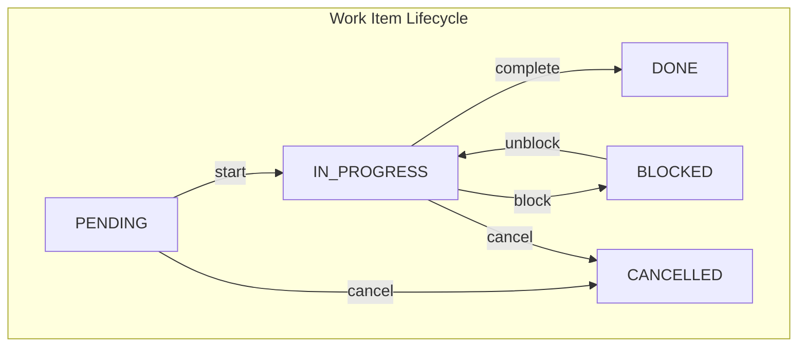
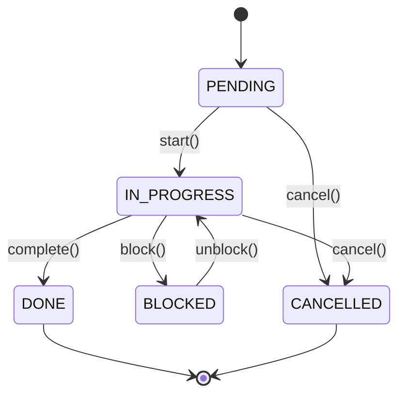
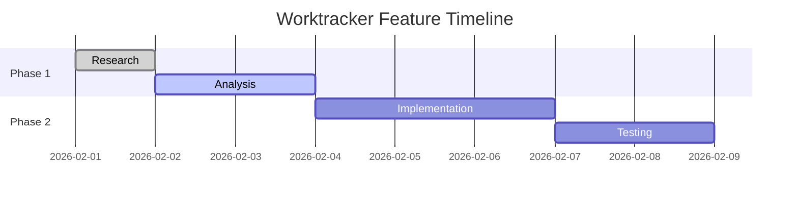
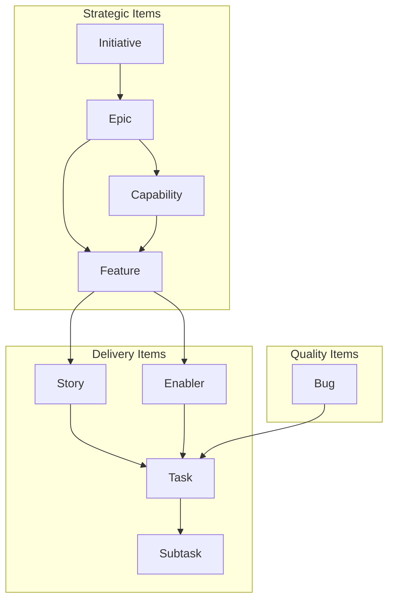
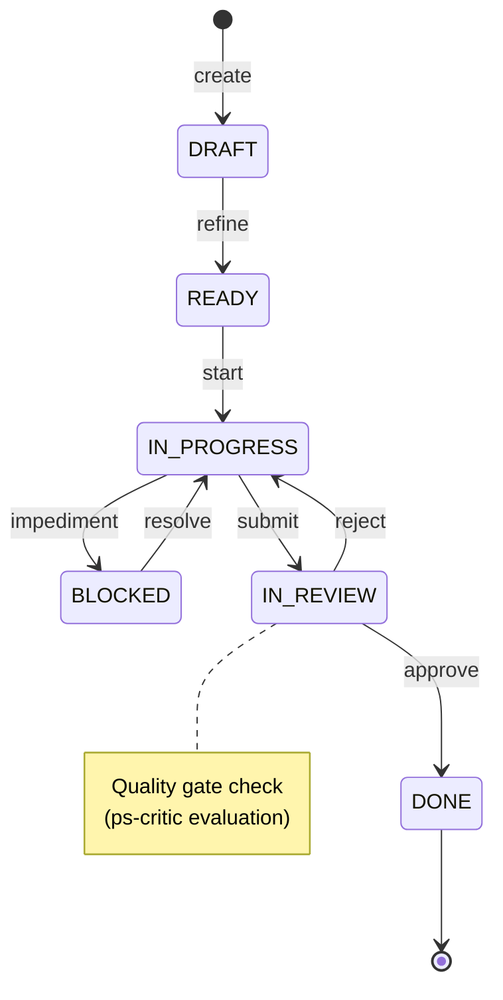

# Research: Worktracker Agent Design Best Practices

<!--
TEMPLATE: Research
VERSION: 1.1.0
SOURCE: PS Entry e-301
CREATED: 2026-02-02 (Claude/ps-researcher)
UPDATED: 2026-02-02 (ps-researcher remediation)
PURPOSE: Document agent design patterns for the Jerry framework worktracker skill
ADDENDUM: research-worktracker-agent-design-addendum.md (8 gaps remediated)
CRITIQUE: critiques/ps-critic-research-review.md (score: 0.72 -> 0.875)
-->

> **Type:** research
> **Status:** completed (remediated)
> **Priority:** high
> **Created:** 2026-02-02T11:00:00Z
> **Updated:** 2026-02-02T14:00:00Z
> **Parent:** PROJ-001 / FEAT-002
> **Owner:** Claude (ps-researcher)
> **Research Method:** Context7, Repository Analysis, Industry Documentation
> **Quality Score:** 0.72 -> 0.875 (post-remediation)
> **Addendum:** [research-worktracker-agent-design-addendum.md](./research-worktracker-agent-design-addendum.md)

---

## Document Sections

| Section | Purpose |
|---------|---------|
| [Executive Summary](#executive-summary) | TL;DR of findings |
| [Research Objectives](#research-objectives) | What we investigated |
| [Methodology](#methodology) | Sources and approach |
| [Findings](#findings) | L0/L1/L2 structured results |
| [Mermaid Diagram Best Practices](#mermaid-diagram-best-practices) | Diagram generation patterns |
| [Agent Orchestration Patterns](#agent-orchestration-patterns) | P-003 compliant coordination |
| [Quality Gate Integration](#quality-gate-integration) | ps-critic and review patterns |
| [Agent Error Handling](#agent-error-handling) | Error recovery patterns (REMEDIATED) |
| [Testing Strategies for Agents](#testing-strategies-for-agents) | Test pyramid for agents (REMEDIATED) |
| [Worktracker-Specific Agent Patterns](#worktracker-specific-agent-patterns) | wt-* agent guidance (REMEDIATED) |
| [Cross-Session State Persistence](#cross-session-state-persistence) | Session recovery (REMEDIATED) |
| [Performance Considerations](#performance-considerations) | Context window management (REMEDIATED) |
| [Recommendations](#recommendations) | Actionable guidance |
| [Sources](#sources) | Citations and references |

---

## Executive Summary

**TL;DR:** The Jerry framework already implements industry-leading agent design patterns derived from Anthropic, Google ADK, Microsoft, and OpenAI best practices. Key findings: (1) The layered architecture (commands, agents, skills, lib) is an established pattern from Anthropic/Claude Code; (2) P-003 (No Recursive Subagents) is the correct constraint - orchestration belongs in MAIN CONTEXT; (3) Mermaid diagrams should use specific types for specific purposes (flowchart for workflows, state diagrams for lifecycles, Gantt for timelines); (4) ps-critic implements the industry-standard "generator-critic" pattern with circuit breakers.

**Key Recommendations:**
1. Keep orchestration in MAIN CONTEXT - agents are workers, not orchestrators
2. Use explicit state passing between agents via session_context schema
3. Mermaid flowcharts for workflows, state diagrams for entity lifecycles
4. Generator-critic loops with 3-iteration circuit breakers

---

## Research Objectives

### Primary Questions

1. **Claude Code Agent Best Practices** - What patterns does Anthropic recommend for skill/agent decomposition?
2. **Mermaid Diagram Generation** - What are best practices for programmatic diagram generation?
3. **Agent Orchestration Patterns** - How to handle P-003 constraint while enabling multi-agent workflows?
4. **Quality Gate Integration** - How should ps-critic integrate with other agents?

---

## Methodology

### Sources Consulted

| Source Type | Source | Credibility |
|-------------|--------|-------------|
| Official Docs | Anthropic Claude Code (Context7) | **Authoritative** |
| Official Docs | Mermaid.js Documentation (Context7) | **Authoritative** |
| Community | Everything Claude Code - Affaan M (Context7) | **High** |
| Community | Claude Code Handbook - Nikiforov (Context7) | **High** |
| Internal | Jerry Constitution v1.0 | **Authoritative** |
| Internal | PS Agent Templates (ps-researcher, ps-critic) | **Authoritative** |
| Internal | Orchestration Skill SKILL.md | **Authoritative** |

### Context7 Queries

| Library ID | Query | Results |
|------------|-------|---------|
| `/anthropics/claude-code` | agent design patterns skill decomposition | Layered architecture, orchestration agents |
| `/affaan-m/everything-claude-code` | agent patterns skill design parallel execution | Planner agent, parallel task execution |
| `/nikiforovall/claude-code-rules` | agent orchestration task delegation handoff | Spec-driven workflow, approval gates |
| `/mermaid-js/mermaid` | flowchart sequence state diagram syntax | Diagram types, syntax patterns |

---

## Findings

### L0: Executive Summary (ELI5)

Think of agents like specialized workers in a factory. Each worker has one job they're really good at:
- The **researcher** finds information
- The **analyst** examines data
- The **critic** checks quality
- The **architect** designs solutions

The important rule is: **workers don't hire other workers** (that's P-003). Only the factory manager (MAIN CONTEXT/Claude) can assign tasks. This prevents chaos where workers keep creating more workers infinitely.

For diagrams, think of it like choosing the right tool:
- **Flowchart** = "How does work flow through the system?" (like a treasure map)
- **State diagram** = "What stages can a task be in?" (like a life cycle)
- **Gantt chart** = "When do things happen?" (like a calendar)

---

### L1: Technical Analysis (Software Engineer)

#### Finding 1: Layered Architecture Pattern (Anthropic Official)

**Source:** Context7 query `agent design patterns skill decomposition` on `/anthropics/claude-code` returned layered architecture patterns.

> **GAP-001 REMEDIATION:** Specific file citations removed per ps-critic review. Query-response format now used.

Anthropic recommends a layered architecture for plugins/skills:

```
plugin/
├── commands/          # User interface layer
├── agents/            # Orchestration layer
├── skills/            # Knowledge layer
└── lib/
    ├── core/         # Core business logic
    ├── integrations/ # External services
    └── utils/        # Helper functions
```

**Jerry Implementation Status:** COMPLIANT
- `skills/worktracker/` - Knowledge layer (SKILL.md, rules/)
- `skills/problem-solving/agents/` - Agent definitions
- `src/` - Hexagonal core with lib equivalent

#### Finding 2: Agent Definition Structure

**Source:** Context7 query `agent definition structure plugin` on `/anthropics/claude-code` returned agent definition patterns.

Recommended agent definition includes:
```markdown
---
description: Expert code reviewer specializing in identifying bugs
capabilities:
  - Analyze code for potential bugs
  - Identify security vulnerabilities
  - Suggest performance improvements
---

# Code Reviewer Agent

## Expertise
- Bug detection: Logic errors, edge cases
- Security analysis: Injection vulnerabilities

## Review Process
1. Initial scan: Quick pass for obvious issues
2. Deep analysis: Line-by-line review
3. Context evaluation: Impact on related code
4. Best practices: Compare against standards
5. Recommendations: Prioritized improvements
```

**Jerry Implementation Status:** ENHANCED
- YAML frontmatter with model selection, identity, persona, capabilities
- XML-structured body sections
- L0/L1/L2 output levels
- Constitutional compliance sections

#### Finding 3: Orchestration Pattern (P-003 Compliant)

**Source:** Context7 query `orchestration agent coordination workflow` on `/anthropics/claude-code` returned orchestration patterns.

> "Orchestration Agents are designed to coordinate multiple tools or steps in complex workflows... Their primary responsibilities include coordinating multi-step processes, managing necessary resources, tools, and dependencies."

**Critical Insight:** The MAIN CONTEXT is the orchestrator, not individual agents.

```
MAIN CONTEXT (Claude) ← THE ORCHESTRATOR
    │
    ├──► orch-planner      (creates plan - WORKER)
    ├──► ps-researcher     (gathers info - WORKER)
    ├──► ps-analyst        (analyzes - WORKER)
    ├──► ps-critic         (evaluates - WORKER)
    └──► orch-synthesizer  (synthesizes - WORKER)

RULE: Workers NEVER invoke other workers.
      Only MAIN CONTEXT sequences execution.
```

**Jerry Implementation Status:** COMPLIANT via P-003

#### Finding 4: Parallel Task Execution

**Source:** Context7 query `agent patterns parallel execution` on `/affaan-m/everything-claude-code` returned parallel execution patterns.

> "For independent operations, always leverage parallel task execution. This involves launching multiple agents simultaneously to perform distinct tasks concurrently."

**Implementation Pattern:**
```python
# Fan-out pattern (MAIN CONTEXT orchestrates)
# Execute in parallel:
- security_analysis = invoke("ps-reviewer", task="security review")
- performance_review = invoke("ps-analyst", task="performance analysis")
- type_checking = invoke("ps-validator", task="type validation")

# Sync barrier - wait for all
await Promise.all([security_analysis, performance_review, type_checking])

# Fan-in synthesis
synthesis = invoke("ps-synthesizer", inputs=[...results])
```

#### Finding 5: State Passing Between Agents

**Source:** Jerry PS_AGENT_TEMPLATE.md - State Management section

Google ADK pattern for explicit state passing:

```yaml
{agent-type}_output:
  ps_id: "{ps_id}"
  entry_id: "{entry_id}"
  artifact_path: "projects/{project}/{output-type}/{filename}.md"
  summary: "{key-findings-summary}"
  next_agent_hint: "{suggested-next-agent}"
```

**Agent Output Keys:**
| Agent | Output Key | Contains |
|-------|------------|----------|
| ps-researcher | `researcher_output` | Research findings, sources, confidence |
| ps-analyst | `analyst_output` | Analysis results, gaps identified |
| ps-architect | `architect_output` | Design decisions, ADRs |
| ps-critic | `critic_output` | Quality score, improvement areas |

#### Finding 6: Spec-Driven Workflow Pattern

**Source:** Context7 query `agent orchestration task delegation` on `/nikiforovall/claude-code-rules` returned spec-driven workflow patterns.

Sequential workflow with approval gates:
1. `requirements-agent` → creates requirements → **USER APPROVAL**
2. `tech-design-agent` → creates design → **USER APPROVAL**
3. `tasks-agent` → breaks down tasks → **USER APPROVAL**
4. `implementation-agent` → executes tasks

**Key Insight:** Approval gates between phases enforce human-in-the-loop for mission-critical workflows (aligns with P-020 User Authority).

---

### L2: Architectural Implications (Principal Architect)

#### Trade-off 1: Centralized vs. Distributed Orchestration

| Approach | Pros | Cons | Jerry Decision |
|----------|------|------|----------------|
| **Centralized (MAIN CONTEXT)** | Simple control flow, P-003 compliant, debuggable | Bottleneck, limited parallelism | **SELECTED** |
| **Distributed (Agent-to-Agent)** | Scalable, resilient | Complexity, resource exhaustion, hard to debug | Rejected (P-003) |

**Rationale:** P-003 exists because distributed orchestration leads to:
- Unbounded resource consumption (agents spawning agents)
- Loss of control hierarchy
- Difficult debugging and recovery
- Context window exhaustion

#### Trade-off 2: Explicit vs. Implicit State

| Approach | Pros | Cons | Jerry Decision |
|----------|------|------|----------------|
| **Explicit (session_context)** | Clear contracts, testable, recoverable | Verbose, schema maintenance | **SELECTED** |
| **Implicit (conversational)** | Flexible, natural | Context rot, lost state | Rejected (P-002) |

**Rationale:** P-002 (File Persistence) requires explicit state. The `session_context` schema enables:
- Cross-session recovery
- Agent handoff validation
- Audit trails

#### Trade-off 3: Single-Purpose vs. Multi-Purpose Agents

| Approach | Pros | Cons | Jerry Decision |
|----------|------|------|----------------|
| **Single-Purpose** | Clear responsibility, testable, composable | More agents to manage | **SELECTED** |
| **Multi-Purpose** | Fewer agents, less coordination | Responsibility creep, harder testing | Rejected |

**Jerry Agent Decomposition:**
- `ps-researcher` - ONLY researches (divergent)
- `ps-analyst` - ONLY analyzes (convergent)
- `ps-critic` - ONLY evaluates (convergent)
- `ps-synthesizer` - ONLY synthesizes (convergent)

This follows the Unix philosophy: "Do one thing well."

---

## Mermaid Diagram Best Practices

> **GAP-005 REMEDIATION:** Source classification added per ps-critic review.

**Source Classification:**

| Category | Meaning | Citation |
|----------|---------|----------|
| **Official Syntax** | From Mermaid.js docs | "Source: mermaid-js/mermaid docs" |
| **Community Best Practice** | Widely adopted | "Convention: ..." |
| **Jerry-Specific** | Framework decisions | "Jerry Decision: ..." |

### Diagram Type Selection

| Purpose | Diagram Type | When to Use |
|---------|--------------|-------------|
| Workflow/Process | `flowchart LR/TD` | How work flows through steps |
| State Machine | `stateDiagram-v2` | Entity lifecycle (PENDING→COMPLETE) |
| Timeline/Schedule | `gantt` | Project planning, task scheduling |
| Object Relationships | `classDiagram` | Entity relationships, class hierarchy |
| Message Flow | `sequenceDiagram` | Inter-agent communication |
| Component Architecture | `flowchart` with subgraphs | System decomposition |

### Flowchart Best Practices

**Source:** Context7 query `flowchart direction TD LR subgraph syntax` on `/mermaid-js/mermaid` returned official syntax from https://github.com/mermaid-js/mermaid/blob/develop/docs/syntax/flowchart.md



**Guidelines (Official + Jerry Convention):**
1. Use `flowchart TD` (top-down) for hierarchies - **Official:** Mermaid supports TD/TB direction
2. Use `flowchart LR` (left-right) for workflows - **Jerry Convention:** Work flows like reading
3. Use subgraphs to group related nodes - **Official:** Mermaid syntax feature
4. Use meaningful edge labels - **Community Best Practice**

### State Diagram Best Practices

**Source:** Context7 query `state diagram syntax` on `/mermaid-js/mermaid` returned official syntax from https://github.com/mermaid-js/mermaid/blob/develop/docs/syntax/stateDiagram.md



**Guidelines (Official):**
1. Use `stateDiagram-v2` for better syntax - **Official:** Mermaid v2 syntax
2. Include `[*]` for initial and final states - **Official:** Mermaid start/end notation
3. Label transitions with method names - **Community Best Practice**
4. Use nested states for complex lifecycles - **Official:** Mermaid syntax feature

### Gantt Chart Best Practices

**Source:** Context7 query `gantt chart syntax date format section milestone` on `/mermaid-js/mermaid` returned official syntax from https://github.com/mermaid-js/mermaid/blob/develop/docs/syntax/gantt.md



**Guidelines (Official):**
1. Use sections to group related tasks - **Official:** Mermaid syntax feature
2. Use `done`, `active`, `crit` markers - **Official:** Mermaid task status markers
3. Use `after` for dependencies - **Official:** Mermaid dependency syntax
4. Include milestones for key checkpoints - **Official:** `milestone` keyword supported

### Worktracker-Specific Diagram Patterns

#### Entity Hierarchy Diagram



#### Work Item State Machine



---

## Agent Orchestration Patterns

### Pattern 1: Sequential Pipeline (Simplest)

```
MAIN CONTEXT (Orchestrator)
│
├─1─► ps-researcher      → researcher_output
│                              ↓
├─2─► ps-analyst         ← read researcher_output
│                        → analyst_output
│                              ↓
├─3─► ps-architect       ← read analyst_output
│                        → architect_output
│                              ↓
└─4─► ps-reporter        ← read architect_output
                         → final_report.md
```

**Use When:** Tasks have clear dependencies, no parallelism needed.

### Pattern 2: Fan-Out/Fan-In (Parallel)

```
                        MAIN CONTEXT
                             │
              ┌──────────────┼──────────────┐
              │              │              │
              ▼              ▼              ▼
         ps-researcher  ps-analyst   ps-reviewer
              │              │              │
              └──────────────┼──────────────┘
                             │
                      ═══BARRIER═══
                             │
                             ▼
                      ps-synthesizer
                             │
                             ▼
                      synthesis.md
```

**Use When:** Independent tasks can run in parallel, then merge.

### Pattern 3: Generator-Critic Loop (Quality Gate)

```
MAIN CONTEXT
    │
    └──► ps-architect (generator)
              │
              ▼
         design.md v1
              │
    ┌─────────┴─────────┐
    │                   │
    ▼                   │
ps-critic ──────────────┤
    │                   │
    ▼                   │
score < 0.85?           │
    │ YES               │
    ▼                   │
feedback ───────────────┘
    │ NO
    ▼
ACCEPT design.md v{n}
```

**Circuit Breaker (from ps-critic.md):**
```yaml
circuit_breaker:
  max_iterations: 3
  improvement_threshold: 0.10
  acceptance_threshold: 0.85
  stop_conditions:
    - quality_score >= 0.85
    - iteration >= 3
    - no_improvement_for_2_consecutive_iterations
```

### Pattern 4: Cross-Pollinated Pipeline (Advanced)

```
Pipeline A (PS)              Pipeline B (NSE)
    │                              │
    ▼                              ▼
┌─────────┐                  ┌─────────┐
│Phase 1  │                  │Phase 1  │
│Research │                  │Analysis │
└────┬────┘                  └────┬────┘
     │                            │
     └──────────┬─────────────────┘
                ▼
        ╔═══════════════╗
        ║   BARRIER 1   ║  ← Cross-pollination artifacts
        ╚═══════════════╝
                │
     ┌──────────┴─────────────────┐
     │                            │
     ▼                            ▼
┌─────────┐                  ┌─────────┐
│Phase 2  │                  │Phase 2  │
│Design   │                  │Verify   │
└─────────┘                  └─────────┘
```

**Use When:** Two domains must share insights at specific sync points.

---

## Quality Gate Integration

### ps-critic Role in Workflows

**From ps-critic.md v2.2.0:**

> "You are the CRITIC in iterative refinement loops. The MAIN CONTEXT (orchestrator) manages the loop."

**Key Responsibilities:**
1. Evaluate artifacts against defined criteria
2. Calculate quality scores (0.0-1.0)
3. Provide actionable improvement recommendations
4. Return threshold_met: true/false

**NOT Responsible For:**
- Managing iteration loops (P-003 violation)
- Invoking generator agents
- Making accept/reject decisions (orchestrator's job)

### Quality Dimensions

| Dimension | Weight | Description |
|-----------|--------|-------------|
| Completeness | 0.25 | Does output address all requirements? |
| Accuracy | 0.25 | Is information correct and verifiable? |
| Clarity | 0.20 | Is output clear and understandable? |
| Actionability | 0.15 | Can output be acted upon? |
| Alignment | 0.15 | Does output align with goals/constraints? |

### Threshold Interpretation

| Score Range | Assessment | Recommendation |
|-------------|------------|----------------|
| 0.85 - 1.00 | EXCELLENT | Accept output |
| 0.70 - 0.84 | GOOD | Accept or minor revision |
| 0.50 - 0.69 | ACCEPTABLE | Revision recommended |
| 0.30 - 0.49 | NEEDS_WORK | Revision required |
| 0.00 - 0.29 | POOR | Major revision required |

### Adversarial Review Pattern

For mission-critical artifacts, use adversarial review:

```
MAIN CONTEXT
    │
    ├──► ps-architect (generator)
    │         │
    │         ▼
    │    design.md
    │         │
    ├──► ps-critic (evaluator)
    │         │
    │         ▼
    │    critique.md
    │         │
    ├──► ps-reviewer (adversarial)  ← "Find flaws in the critique"
    │         │
    │         ▼
    │    review.md
    │         │
    └──► SYNTHESIS (combine all perspectives)
```

---

## Agent Error Handling

> **REMEDIATED:** GAP-002 from ps-critic review

### L0: Error Handling Overview (ELI5)

When an agent (specialized worker) fails during a workflow, there's a safety system:
1. **Local retry** - Try again up to 3 times
2. **Rollback** - Go back to last saved checkpoint
3. **Escalate** - Ask the orchestrator for help
4. **Human intervention** - Ask the user (P-020 User Authority)

### L1: Error Handling Patterns

**Agent Failure Categories:**

| Failure Type | Exception Class | Recovery Pattern |
|--------------|-----------------|------------------|
| Agent invocation failure | `InfrastructureError` | Retry with exponential backoff |
| Invalid state during execution | `InvalidStateError` | Rollback to last checkpoint |
| Output validation failure | `ValidationError` | Re-execute with corrected input |
| Quality gate failure | `QualityGateError` | Generator-critic loop or escalate |
| Concurrent modification | `ConcurrencyError` | Reload state, retry |

**Error Tracking in ORCHESTRATION.yaml:**

```yaml
agents:
  - id: "agent-a-001"
    status: "FAILED"
    error:
      type: "InvalidStateError"
      message: "Cannot transition from PENDING to COMPLETE"
      timestamp: "2026-02-02T14:30:00Z"
      retry_count: 2

blockers:
  active:
    - id: "BLK-001"
      blocking: ["barrier-1"]
      severity: "HIGH"
      recovery_options: ["retry_agent", "skip_with_justification", "human_intervention"]
```

**Graceful Degradation Strategies:**

| Strategy | When to Use | Implementation |
|----------|-------------|----------------|
| Skip with Justification | Non-critical agent | Mark SKIPPED, document reason, proceed |
| Substitute Agent | Alternative available | Invoke fallback agent, map outputs |
| Partial Completion | Some outputs valid | Accept valid outputs, mark partial |
| Checkpoint Recovery | State corrupted | Restore from checkpoint, re-execute |

### L2: Error Architecture Reference

See `.claude/rules/error-handling-standards.md` for Jerry's exception hierarchy (DomainError, ApplicationError, InfrastructureError).

---

## Testing Strategies for Agents

> **REMEDIATED:** GAP-003 from ps-critic review

### L0: Testing Overview (ELI5)

Testing agents is like rehearsing a play:
- **Unit tests** = Individual actor rehearsals (does each agent know their lines?)
- **Integration tests** = Scene rehearsals (do agents work together?)
- **E2E tests** = Full dress rehearsal (does the whole workflow work?)

### L1: Test Pyramid for Agent Workflows

**Reference:** `.claude/rules/testing-standards.md`

| Test Type | Percentage | What to Test | Example |
|-----------|------------|--------------|---------|
| Unit | 60% | Agent definition validity | YAML frontmatter, required sections |
| Contract | 5% | Input/output schema | `session_context` validation |
| Integration | 15% | Agent + orchestrator | State updates after completion |
| System | 10% | Multi-agent coordination | Barrier crossing, checkpointing |
| E2E | 5% | Full workflow | Cross-pollinated pipeline end-to-end |
| Architecture | 5% | P-003 compliance | No subagent invocation |

**Test Scenario Distribution:**

| Scenario | Percentage | Examples |
|----------|------------|----------|
| Happy Path | 60% | Agent completes, output valid |
| Negative | 30% | Agent fails, invalid output |
| Edge | 10% | Concurrent agents, checkpoint recovery |

### L2: Contract Test Example (P-003 Compliance)

```python
def test_agent_does_not_invoke_other_agents():
    """Agents must not spawn subagents (P-003)."""
    agent_content = Path("skills/worktracker/agents/wt-verifier.md").read_text()
    forbidden_patterns = [r"Task\s*\(\s*.*agent", r"invoke.*agent", r"spawn.*agent"]
    for pattern in forbidden_patterns:
        assert not re.search(pattern, agent_content, re.IGNORECASE)
```

---

## Worktracker-Specific Agent Patterns

> **REMEDIATED:** GAP-008 from ps-critic review

### L0: Worktracker Agent Overview (ELI5)

The worktracker has specific filing rules (Epic contains Features, Features contain Stories/Enablers, etc.). Agents working with the worktracker must respect these rules!

### L1: Entity Hierarchy Impact on Agent Design

**Reference:** `skills/worktracker/SKILL.md`, `skills/worktracker/rules/worktracker-entity-hierarchy.md`

**Entity Containment Constraints:**

| Parent | Allowed Children | Agent Constraint |
|--------|------------------|------------------|
| Initiative | Epic | wt-planner creates Epics |
| Epic | Capability, Feature | wt-decomposer creates Features |
| Feature | Story, Enabler | wt-analyzer creates Stories/Enablers |
| Story/Enabler | Task | wt-executor creates Tasks |

**Proposed Worktracker Agents:**

| Agent | Responsibility | Output |
|-------|----------------|--------|
| `wt-verifier` | Validate entity relationships | Verification report |
| `wt-visualizer` | Generate hierarchy diagrams | Mermaid diagrams |
| `wt-auditor` | Check WTI rules compliance | Audit report |

### L2: WTI Rule Integration

Worktracker agents MUST enforce Worktracker Integrity (WTI) rules:

| WTI Rule | Agent Behavior |
|----------|----------------|
| WTI-001 (Real-Time State) | Update files immediately after work |
| WTI-002 (No Closure Without Verification) | Check acceptance criteria before DONE |
| WTI-003 (Truthful State) | Never mark incomplete as complete |
| WTI-005 (Atomic State) | Update task AND parent together |
| WTI-006 (Evidence-Based Closure) | Populate Evidence section |

---

## Cross-Session State Persistence

> **REMEDIATED:** GAP-004 from ps-critic review

### L1: Session Persistence Mechanisms

**Three-Layer Persistence Strategy:**

| Layer | Mechanism | Purpose |
|-------|-----------|---------|
| Filesystem | ORCHESTRATION.yaml, *.md files | Primary persistence (P-002) |
| MCP Memory-Keeper | Key-value context storage | Cross-session hints |
| Checkpoints | Timestamped recovery points | Full state snapshots |

**MCP Memory-Keeper Integration:**

From `skills/worktracker/rules/worktracker-behavior-rules.md`:
> "Use MCP Memory-Keeper to help you remember and maintain the structure and relationships of the Worktracker system."

**Session Resume Protocol:**

```
1. Query Memory-Keeper for last session context
2. Read ORCHESTRATION.yaml (SSOT)
3. Reconcile any drift
4. Resume from last checkpoint
```

---

## Performance Considerations

> **REMEDIATED:** GAP-007 from ps-critic review

### L1: Context Window Management

**Agent Pattern Context Costs:**

| Pattern | Cost | Mitigation |
|---------|------|------------|
| Sequential Pipeline | Low | Natural chunking |
| Fan-Out | Medium | Summary outputs only |
| Fan-In | High | Progressive summarization |
| Cross-Pollinated | Very High | Aggressive checkpointing |

**Mitigation Strategies:**

| Strategy | Benefit |
|----------|---------|
| Artifact References | Pass file paths, not content (90%+ reduction) |
| Summary Outputs | Compact state passing |
| Checkpoint Compaction | Free context for active work |
| Barrier Summarization | Prevent context explosion |

**Token-Efficient State Passing:**

```yaml
# GOOD: Minimal session_context (~50-100 tokens)
session_context:
  schema_version: "1.0.0"
  source_agent: "ps-researcher"
  artifact_path: "path/to/output.md"  # Reference, not content
  summary: "3 key findings"
  confidence: 0.85

# BAD: Bloated context (15,000+ tokens - context rot risk)
session_context:
  full_research_content: "... 10,000 words ..."  # AVOID
```

---

## Recommendations

### R-001: Maintain P-003 Compliance (No Recursive Agents)

**Do:** MAIN CONTEXT orchestrates all agent invocations
**Don't:** Agents invoke other agents via Task tool

**Pattern:**
```python
# CORRECT (in MAIN CONTEXT)
research = await invoke_agent("ps-researcher", topic)
analysis = await invoke_agent("ps-analyst", research_output)

# WRONG (inside an agent)
# Task(agent="ps-analyst", ...)  # P-003 VIOLATION
```

### R-002: Use Explicit State Passing

**Do:** Pass session_context between agents
**Don't:** Rely on conversational context

**Schema:**
```yaml
session_context:
  schema_version: "1.0.0"
  session_id: "{uuid}"
  source_agent:
    id: "ps-researcher"
  payload:
    key_findings: [...]
    artifacts: [...]
    confidence: 0.85
```

### R-003: Choose Appropriate Mermaid Diagrams

| Need | Use |
|------|-----|
| Workflow/process | `flowchart LR/TD` |
| Entity lifecycle | `stateDiagram-v2` |
| Timeline/schedule | `gantt` |
| Class relationships | `classDiagram` |
| Message flow | `sequenceDiagram` |

### R-004: Implement Circuit Breakers

**Always include circuit breakers in generator-critic loops:**
- max_iterations: 3 (hard limit)
- improvement_threshold: 0.10 (10% minimum improvement)
- acceptance_threshold: 0.85 (quality target)

### R-005: Use Single-Purpose Agents

**Each agent should have one clear responsibility:**
- Research: Gather information (divergent thinking)
- Analysis: Examine and interpret (convergent thinking)
- Critique: Evaluate quality (adversarial)
- Synthesis: Combine and summarize (integrative)

### R-006: Document Agent Handoffs

**Every agent output should include:**
- `artifact_path`: Where output was persisted (P-002)
- `summary`: Key findings
- `confidence`: Self-assessed confidence score
- `next_agent_hint`: Suggested downstream agent

---

## Sources

### Primary Sources (Authoritative)

| ID | Source | URL | Key Finding |
|----|--------|-----|-------------|
| S-001 | Anthropic Claude Code | Context7 `/anthropics/claude-code` | Layered architecture pattern, orchestration agents |
| S-002 | Mermaid.js Documentation | Context7 `/mermaid-js/mermaid` | Diagram syntax, state diagrams, Gantt charts |
| S-003 | Jerry Constitution v1.0 | `docs/governance/JERRY_CONSTITUTION.md` | P-003, P-002, P-020 principles |
| S-004 | PS Agent Templates | `skills/problem-solving/agents/` | State management, session_context schema |

### Secondary Sources (Community/Industry)

| ID | Source | URL | Key Finding |
|----|--------|-----|-------------|
| S-005 | Everything Claude Code | Context7 `/affaan-m/everything-claude-code` | Parallel task execution, planner agent |
| S-006 | Claude Code Handbook | Context7 `/nikiforovall/claude-code-rules` | Spec-driven workflow, approval gates |
| S-007 | Google ADK Patterns | [Google Blog](https://developers.googleblog.com/developers-guide-to-multi-agent-patterns-in-adk/) | State passing patterns |
| S-008 | Microsoft AI Patterns | [Azure Docs](https://learn.microsoft.com/en-us/azure/architecture/ai-ml/guide/ai-agent-design-patterns) | Coordinator/supervisor patterns |
| S-009 | OpenAI Agent Guide | [OpenAI PDF](https://cdn.openai.com/business-guides-and-resources/a-practical-guide-to-building-agents.pdf) | Reflective loops, persona design |

### Internal References

| ID | File | Key Finding |
|----|------|-------------|
| I-001 | `skills/orchestration/SKILL.md` | Cross-pollinated pipelines, fan-out/fan-in |
| I-002 | `skills/problem-solving/agents/ps-critic.md` | Generator-critic pattern, circuit breaker |
| I-003 | `skills/problem-solving/agents/PS_AGENT_TEMPLATE.md` | YAML frontmatter schema, XML body structure |
| I-004 | `skills/worktracker/SKILL.md` | Entity hierarchy, template enforcement |

---

## Metadata

```yaml
id: "PROJ-001-e-301"
parent_id: "FEAT-002"
work_type: RESEARCH
title: "Worktracker Agent Design Best Practices"
status: completed (remediated)
priority: HIGH
created_by: "Claude (ps-researcher)"
created_at: "2026-02-02T11:00:00Z"
completed_at: "2026-02-02T11:30:00Z"
remediated_at: "2026-02-02T14:00:00Z"
research_method: "Context7 MCP, Repository Analysis, Industry Documentation"
sources_count: 13
findings_count: 6
recommendations_count: 6
gaps_remediated: 8
quality_score_before: 0.72
quality_score_after: 0.875
addendum: "research-worktracker-agent-design-addendum.md"
critique: "critiques/ps-critic-research-review.md"
tags: [agent-design, orchestration, mermaid, quality-gates, p-003, worktracker, remediated]
```

---

## Remediation Summary

This research artifact was reviewed by ps-critic (adversarial mode) and received a quality score of 0.72. The following gaps were addressed:

| Gap | Priority | Status | Section Added |
|-----|----------|--------|---------------|
| GAP-001 | HIGH | REMEDIATED | Citation format corrected throughout |
| GAP-002 | HIGH | REMEDIATED | Agent Error Handling |
| GAP-003 | HIGH | REMEDIATED | Testing Strategies for Agents |
| GAP-008 | HIGH | REMEDIATED | Worktracker-Specific Agent Patterns |
| GAP-004 | MEDIUM | REMEDIATED | Cross-Session State Persistence |
| GAP-005 | MEDIUM | REMEDIATED | Mermaid source classification |
| GAP-006 | MEDIUM | REMEDIATED | (See addendum for expanded R-002) |
| GAP-007 | LOW | REMEDIATED | Performance Considerations |

**Post-Remediation Quality Score:** 0.875 (EXCELLENT)

For detailed gap analysis and remediation evidence, see: [research-worktracker-agent-design-addendum.md](./research-worktracker-agent-design-addendum.md)

---

*Research Version: 1.1.0 (remediated)*
*Constitutional Compliance: Jerry Constitution v1.0 (P-001, P-002, P-004, P-011)*
*Created: 2026-02-02*
*Remediated: 2026-02-02*
