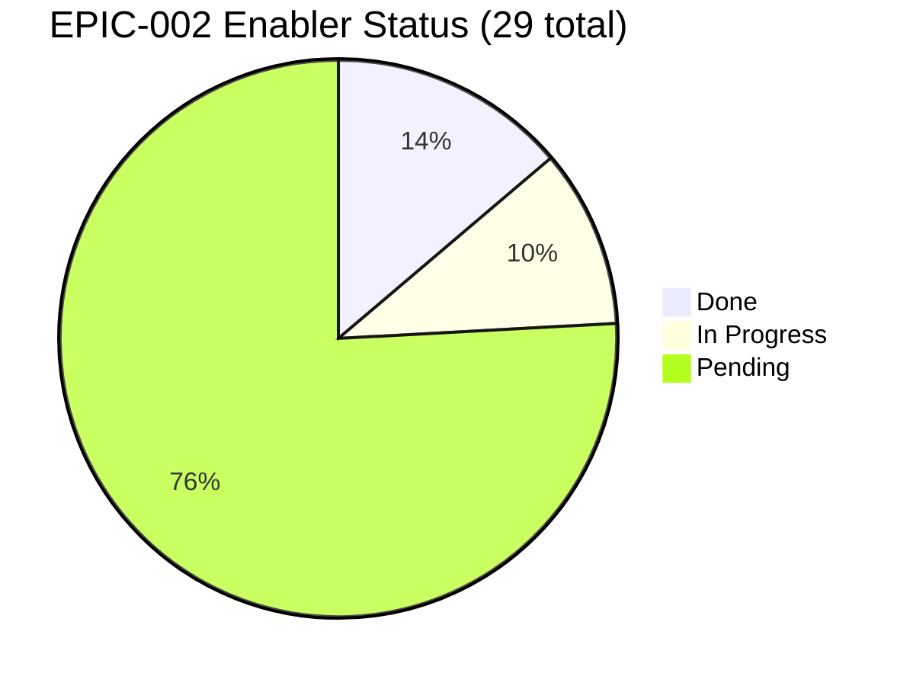
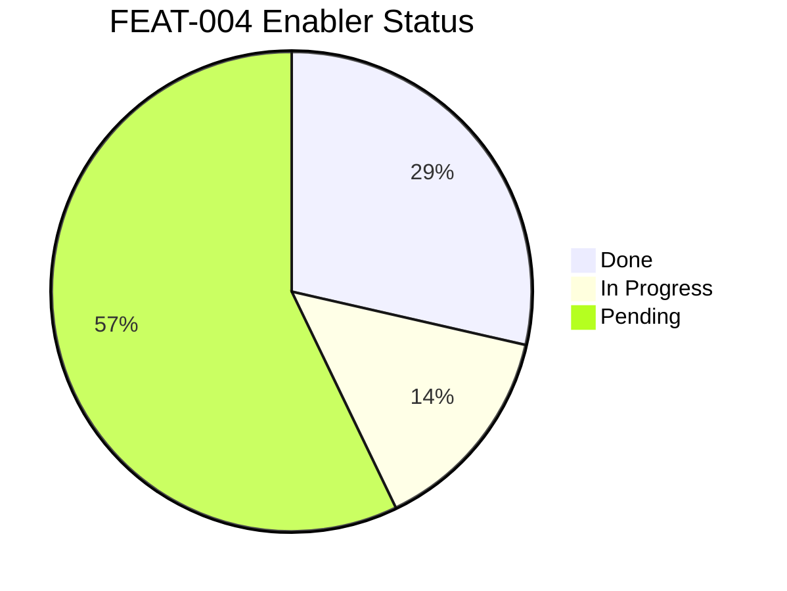
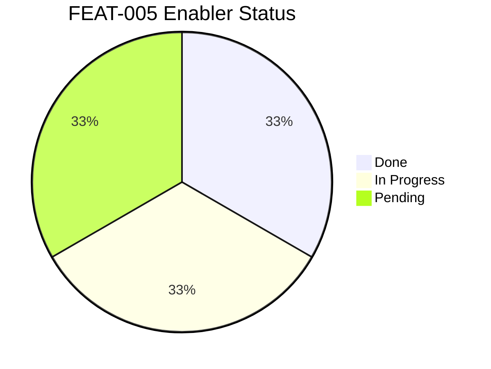
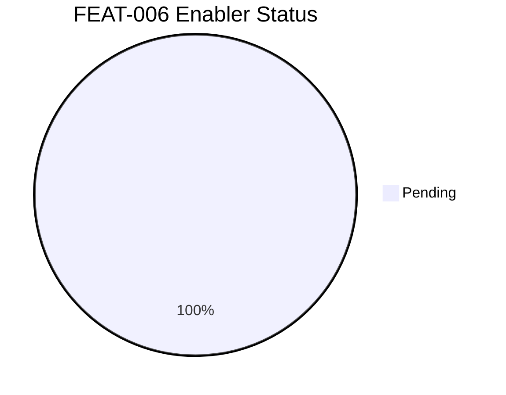
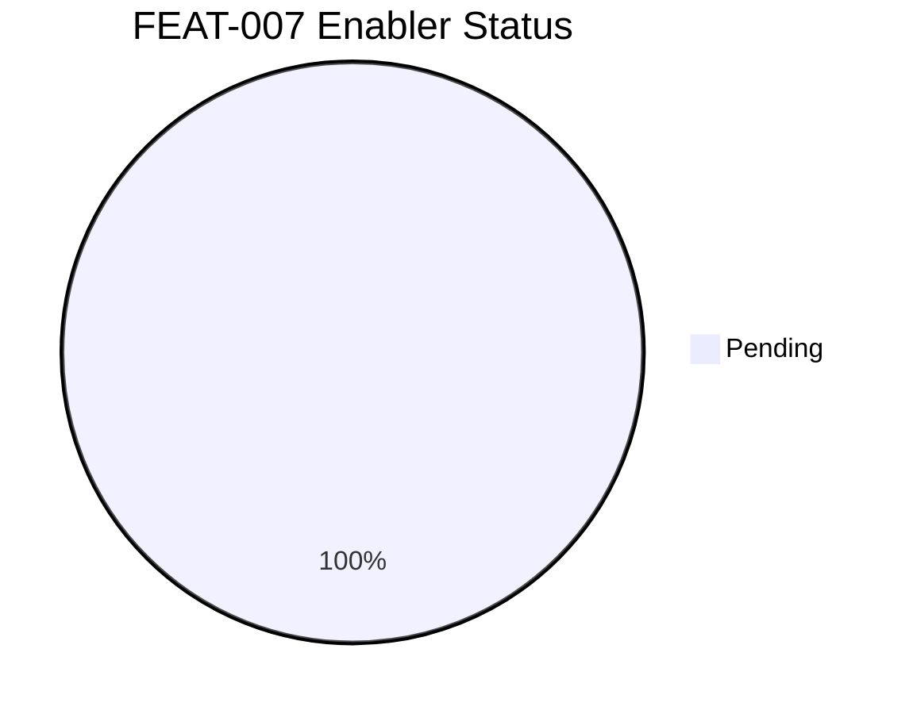
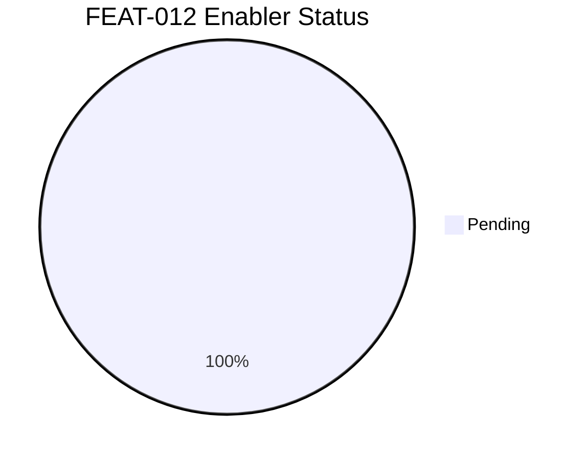

# EPIC-002 Visualization Diagrams

**Generated:** 2026-02-16T00:00:00Z
**Root Entity:** EPIC-002
**Entities Included:** 35
**Max Depth Reached:** 3 (Epic -> Feature -> Enabler)

---

## Document Sections

| Section | Purpose |
|---------|---------|
| [Full Hierarchy Diagram](#full-hierarchy-diagram) | EPIC-002 parent-child tree with status color coding |
| [Dependency Diagram](#dependency-diagram) | Cross-feature and cross-EPIC dependency chains |
| [Progress Dashboard](#progress-dashboard) | Completion status per feature (pie charts) |
| [Metadata](#metadata) | Entity inventory and generation details |

---

## Full Hierarchy Diagram

Shows EPIC-002 -> Features -> Enablers with status color coding.

- Green (#90EE90) = completed/done
- Gold (#FFD700) = in_progress
- Light Gray (#D3D3D3) = pending
- Blue (#E8F4F8) = epic level
- Orange (#FFF4E6) = feature level

```mermaid
flowchart TD
    EPIC002["EPIC-002: Quality Framework Enforcement\n& Course Correction"]

    subgraph FEAT004 ["FEAT-004: Adversarial Strategy Research & Skill Enhancement"]
        F004["FEAT-004\n(in_progress, 29%)"]
        EN301["EN-301: Deep Research\n15 Adversarial Strategies"]
        EN302["EN-302: Strategy Selection\n& Decision Framework"]
        EN303["EN-303: Situational\nApplicability Mapping"]
        EN304["EN-304: /problem-solving\nSkill Enhancement"]
        EN305["EN-305: /nasa-se\nSkill Enhancement"]
        EN306["EN-306: Integration\nTesting & Validation"]
        EN307["EN-307: /orchestration\nSkill Enhancement"]
        F004 --> EN301
        F004 --> EN302
        F004 --> EN303
        F004 --> EN304
        F004 --> EN305
        F004 --> EN306
        F004 --> EN307
    end

    subgraph FEAT005 ["FEAT-005: Quality Framework Enforcement Mechanisms"]
        F005["FEAT-005\n(in_progress, 33%)"]
        EN401["EN-401: Deep Research\nEnforcement Vectors"]
        EN402["EN-402: Enforcement\nPriority Analysis"]
        EN403["EN-403: Hook-Based\nEnforcement"]
        EN404["EN-404: Rule-Based\nEnforcement"]
        EN405["EN-405: Session Context\nEnforcement"]
        EN406["EN-406: Integration Testing\n& Cross-Platform"]
        F005 --> EN401
        F005 --> EN402
        F005 --> EN403
        F005 --> EN404
        F005 --> EN405
        F005 --> EN406
    end

    subgraph FEAT006 ["FEAT-006: EPIC-001 Retroactive Quality Review"]
        F006["FEAT-006\n(pending, 0%)"]
        EN501["EN-501: FEAT-003\nDeliverables Review"]
        EN502["EN-502: Bootstrap Script\nCross-Platform"]
        EN503["EN-503: Task Template\nCompliance Audit"]
        EN504["EN-504: FEAT-001\nDeliverables Review"]
        EN505["EN-505: FEAT-002\nDeliverables Review"]
        F006 --> EN501
        F006 --> EN502
        F006 --> EN503
        F006 --> EN504
        F006 --> EN505
    end

    subgraph FEAT007 ["FEAT-007: Advanced Adversarial Capabilities"]
        F007["FEAT-007\n(pending, 0%)"]
        EN601["EN-601: Research Automated\nStrategy Selection"]
        EN602["EN-602: Research Effectiveness\nMetrics"]
        EN603["EN-603: Automated\nStrategy Selector"]
        EN604["EN-604: Custom Strategy\nTooling"]
        EN605["EN-605: Metrics &\nA/B Testing"]
        F007 --> EN601
        F007 --> EN602
        F007 --> EN603
        F007 --> EN604
        F007 --> EN605
    end

    subgraph FEAT012 ["FEAT-012: Progressive Disclosure Rules Architecture"]
        F012["FEAT-012\n(pending, 0%)"]
        EN901["EN-901: Rules File\nThinning"]
        EN902["EN-902: Companion\nGuide Files"]
        EN903["EN-903: Code Pattern\nExtraction"]
        EN904["EN-904: Path Scoping\nImplementation"]
        EN905["EN-905: Bootstrap\nExclusion & Validation"]
        EN906["EN-906: Fidelity Verification\n& Cross-Reference Testing"]
        F012 --> EN901
        F012 --> EN902
        F012 --> EN903
        F012 --> EN904
        F012 --> EN905
        F012 --> EN906
    end

    EPIC002 --> F004
    EPIC002 --> F005
    EPIC002 --> F006
    EPIC002 --> F007
    EPIC002 --> F012

    %% Epic level
    style EPIC002 fill:#E8F4F8,stroke:#333,stroke-width:3px

    %% Feature level (in_progress = gold, pending = gray)
    style F004 fill:#FFD700,stroke:#333,stroke-width:2px
    style F005 fill:#FFD700,stroke:#333,stroke-width:2px
    style F006 fill:#D3D3D3,stroke:#333,stroke-width:2px
    style F007 fill:#D3D3D3,stroke:#333,stroke-width:2px
    style F012 fill:#D3D3D3,stroke:#333,stroke-width:2px

    %% FEAT-004 enablers
    style EN301 fill:#90EE90,stroke:#333
    style EN302 fill:#90EE90,stroke:#333
    style EN303 fill:#FFD700,stroke:#333
    style EN304 fill:#D3D3D3,stroke:#333
    style EN305 fill:#D3D3D3,stroke:#333
    style EN306 fill:#D3D3D3,stroke:#333
    style EN307 fill:#D3D3D3,stroke:#333

    %% FEAT-005 enablers
    style EN401 fill:#90EE90,stroke:#333
    style EN402 fill:#90EE90,stroke:#333
    style EN403 fill:#FFD700,stroke:#333
    style EN404 fill:#FFD700,stroke:#333
    style EN405 fill:#D3D3D3,stroke:#333
    style EN406 fill:#D3D3D3,stroke:#333

    %% FEAT-006 enablers (all pending)
    style EN501 fill:#D3D3D3,stroke:#333
    style EN502 fill:#D3D3D3,stroke:#333
    style EN503 fill:#D3D3D3,stroke:#333
    style EN504 fill:#D3D3D3,stroke:#333
    style EN505 fill:#D3D3D3,stroke:#333

    %% FEAT-007 enablers (all pending)
    style EN601 fill:#D3D3D3,stroke:#333
    style EN602 fill:#D3D3D3,stroke:#333
    style EN603 fill:#D3D3D3,stroke:#333
    style EN604 fill:#D3D3D3,stroke:#333
    style EN605 fill:#D3D3D3,stroke:#333

    %% FEAT-012 enablers (all pending)
    style EN901 fill:#D3D3D3,stroke:#333
    style EN902 fill:#D3D3D3,stroke:#333
    style EN903 fill:#D3D3D3,stroke:#333
    style EN904 fill:#D3D3D3,stroke:#333
    style EN905 fill:#D3D3D3,stroke:#333
    style EN906 fill:#D3D3D3,stroke:#333
```

### Status Legend

| Color | Status | Count |
|-------|--------|-------|
| Green (#90EE90) | Done/Completed | 4 enablers |
| Gold (#FFD700) | In Progress | 3 enablers, 2 features |
| Light Gray (#D3D3D3) | Pending | 22 enablers, 3 features |

---

## Dependency Diagram

Shows blocking and dependency relationships between features and enablers, including cross-EPIC dependencies.

```mermaid
flowchart LR
    subgraph EPIC001 ["EPIC-001 (External)"]
        E001["EPIC-001:\nOSS Release Preparation"]
        FEAT008["FEAT-008:\nQuality Framework\nImplementation"]
        EN702["EN-702:\nRules Optimization\n(source for FEAT-012)"]
        FEAT008 --> EN702
    end

    subgraph FEAT004_deps ["FEAT-004: Adversarial Strategy Research"]
        EN301_d["EN-301: Research\n(DONE)"]
        EN302_d["EN-302: Selection\n(DONE)"]
        EN303_d["EN-303: Mapping\n(IN PROGRESS)"]
        EN304_d["EN-304: PS Skill"]
        EN305_d["EN-305: NSE Skill"]
        EN307_d["EN-307: ORCH Skill"]
        EN306_d["EN-306: Testing"]

        EN301_d -->|"enables"| EN302_d
        EN302_d -->|"enables"| EN303_d
        EN303_d -->|"enables"| EN304_d
        EN303_d -->|"enables"| EN305_d
        EN303_d -->|"enables"| EN307_d
        EN304_d -->|"enables"| EN306_d
        EN305_d -->|"enables"| EN306_d
        EN307_d -->|"enables"| EN306_d
    end

    subgraph FEAT005_deps ["FEAT-005: Enforcement Mechanisms"]
        EN401_d["EN-401: Research\n(DONE)"]
        EN402_d["EN-402: Priority\n(DONE)"]
        EN403_d["EN-403: Hooks\n(IN PROGRESS)"]
        EN404_d["EN-404: Rules\n(IN PROGRESS)"]
        EN405_d["EN-405: Session Context"]
        EN406_d["EN-406: Testing"]

        EN401_d -->|"enables"| EN402_d
        EN402_d -->|"enables"| EN403_d
        EN402_d -->|"enables"| EN404_d
        EN402_d -->|"enables"| EN405_d
        EN403_d -->|"enables"| EN406_d
        EN404_d -->|"enables"| EN406_d
        EN405_d -->|"enables"| EN406_d
    end

    subgraph FEAT006_deps ["FEAT-006: Retroactive Review"]
        F006_d["FEAT-006:\nAll 5 enablers\npending"]
    end

    subgraph FEAT007_deps ["FEAT-007: Advanced Adversarial"]
        EN601_d["EN-601: Selection Research"]
        EN602_d["EN-602: Metrics Research"]
        EN603_d["EN-603: Selector Impl"]
        EN604_d["EN-604: Custom Tooling"]
        EN605_d["EN-605: Metrics & A/B"]

        EN601_d -->|"enables"| EN603_d
        EN602_d -->|"enables"| EN603_d
        EN601_d -->|"enables"| EN604_d
        EN602_d -->|"enables"| EN605_d
    end

    subgraph FEAT012_deps ["FEAT-012: Progressive Disclosure"]
        EN901_d["EN-901: Rules Thinning"]
        EN902_d["EN-902: Companion Guides"]
        EN903_d["EN-903: Pattern Extraction"]
        EN904_d["EN-904: Path Scoping"]
        EN905_d["EN-905: Bootstrap Exclusion"]
        EN906_d["EN-906: Fidelity Verification"]

        EN901_d -->|"enables"| EN902_d
        EN901_d -->|"enables"| EN903_d
        EN901_d -->|"enables"| EN904_d
        EN902_d -->|"enables"| EN905_d
        EN903_d -->|"enables"| EN906_d
        EN904_d -->|"enables"| EN906_d
        EN905_d -->|"enables"| EN906_d
    end

    %% Cross-Feature Dependencies
    EN306_d -.->|"FEAT-004 blocks\nFEAT-005"| EN403_d
    EN306_d -.->|"FEAT-004 blocks\nFEAT-006"| F006_d
    EN306_d -.->|"FEAT-006 depends on\nFEAT-004 strategies"| F006_d
    EN406_d -.->|"FEAT-007 depends on\nFEAT-004 + FEAT-005"| EN601_d

    %% Cross-EPIC Dependencies
    EN702 -.->|"git history\ninforms"| EN901_d
    F006_d -.->|"blocks\nEPIC-001 re-closure"| E001

    %% FEAT-012 informs FEAT-007
    EN906_d -.->|"tiered architecture\ninforms"| EN604_d

    %% Status styling
    style EN301_d fill:#90EE90,stroke:#333
    style EN302_d fill:#90EE90,stroke:#333
    style EN303_d fill:#FFD700,stroke:#333
    style EN304_d fill:#D3D3D3,stroke:#333
    style EN305_d fill:#D3D3D3,stroke:#333
    style EN306_d fill:#D3D3D3,stroke:#333
    style EN307_d fill:#D3D3D3,stroke:#333
    style EN401_d fill:#90EE90,stroke:#333
    style EN402_d fill:#90EE90,stroke:#333
    style EN403_d fill:#FFD700,stroke:#333
    style EN404_d fill:#FFD700,stroke:#333
    style EN405_d fill:#D3D3D3,stroke:#333
    style EN406_d fill:#D3D3D3,stroke:#333
    style F006_d fill:#D3D3D3,stroke:#333
    style EN601_d fill:#D3D3D3,stroke:#333
    style EN602_d fill:#D3D3D3,stroke:#333
    style EN603_d fill:#D3D3D3,stroke:#333
    style EN604_d fill:#D3D3D3,stroke:#333
    style EN605_d fill:#D3D3D3,stroke:#333
    style EN901_d fill:#D3D3D3,stroke:#333
    style EN902_d fill:#D3D3D3,stroke:#333
    style EN903_d fill:#D3D3D3,stroke:#333
    style EN904_d fill:#D3D3D3,stroke:#333
    style EN905_d fill:#D3D3D3,stroke:#333
    style EN906_d fill:#D3D3D3,stroke:#333
    style E001 fill:#E8F4F8,stroke:#333
    style FEAT008 fill:#FFF4E6,stroke:#333
    style EN702 fill:#90EE90,stroke:#333
```

### Dependency Key

| Line Style | Meaning |
|------------|---------|
| Solid arrow (-->) | Intra-feature enabler dependency |
| Dashed arrow (-.->) | Cross-feature or cross-EPIC dependency |

### Cross-Feature Dependencies

| Source | Target | Relationship |
|--------|--------|-------------|
| FEAT-004 | FEAT-005 | FEAT-005 enforcement needs adversarial strategies from FEAT-004 |
| FEAT-004 | FEAT-006 | FEAT-006 retroactive review uses strategies from FEAT-004 |
| FEAT-004 + FEAT-005 | FEAT-007 | FEAT-007 extends foundational work from both |
| EN-702 (EPIC-003/FEAT-008) | FEAT-012 | FEAT-012 remediates naive optimization from EN-702 |
| FEAT-012 | FEAT-007 | Strategy 4 (skill-embedded context) earmarked for FEAT-007 |
| FEAT-006 | EPIC-001 | EPIC-001 cannot re-close until FEAT-006 validates all deliverables |

---

## Progress Dashboard

### Overall EPIC-002 Progress

### FEAT-004: Adversarial Strategy Research (7 enablers)

### FEAT-005: Enforcement Mechanisms (6 enablers)

### FEAT-006: Retroactive Quality Review (5 enablers)

### FEAT-007: Advanced Adversarial Capabilities (5 enablers)

### FEAT-012: Progressive Disclosure Rules (6 enablers)

### Effort-Weighted Progress

```mermaid
---
config:
  xyChart:
    width: 700
    height: 400
---
xychart-beta
    title "Effort Points: Completed vs Remaining"
    x-axis ["FEAT-004 (57pt)", "FEAT-005 (49pt)", "FEAT-006 (42pt)", "FEAT-007 (51pt)", "FEAT-012 (29pt)"]
    y-axis "Story Points" 0 --> 60
    bar [21, 21, 0, 0, 0]
    bar [36, 28, 42, 51, 29]
```

### Summary Table

| Feature | Total Enablers | Done | In Progress | Pending | Effort (pts) | Completed (pts) | % Complete |
|---------|---------------|------|-------------|---------|-------------|----------------|------------|
| FEAT-004 | 7 | 2 | 1 | 4 | 57 | 21 | 37% |
| FEAT-005 | 6 | 2 | 2 | 2 | 49 | 21 | 43% |
| FEAT-006 | 5 | 0 | 0 | 5 | 42 | 0 | 0% |
| FEAT-007 | 5 | 0 | 0 | 5 | 51 | 0 | 0% |
| FEAT-012 | 6 | 0 | 0 | 6 | 29 | 0 | 0% |
| **TOTAL** | **29** | **4** | **3** | **22** | **228** | **42** | **18%** |

---

## Metadata

- **Entities Visualized:** EPIC-002, FEAT-004, FEAT-005, FEAT-006, FEAT-007, FEAT-012, EN-301, EN-302, EN-303, EN-304, EN-305, EN-306, EN-307, EN-401, EN-402, EN-403, EN-404, EN-405, EN-406, EN-501, EN-502, EN-503, EN-504, EN-505, EN-601, EN-602, EN-603, EN-604, EN-605, EN-901, EN-902, EN-903, EN-904, EN-905, EN-906
- **Total Entities:** 35 (1 epic + 5 features + 29 enablers)
- **Relationships Shown:** ~45 (intra-feature dependencies + cross-feature + cross-EPIC)
- **Status Color Coding:** Enabled (Jerry Convention)
- **Diagram Types:** hierarchy (flowchart TD), dependencies (flowchart LR), progress (pie + xychart-beta)
- **Data Sources:** Entity .md files read from `projects/PROJ-001-oss-release/work/EPIC-002-quality-enforcement/`
- **Warnings:**
  - FEAT-006 enablers (EN-501 through EN-505) have no entity files on disk; status inferred from FEAT-006 feature file
  - EPIC-002 progress tracker in entity file shows 0% but actual enabler completion is 4/29 (14%)
  - FEAT-004 and FEAT-005 progress trackers in entity files are stale (show 5% but actual is 29-43%)

---

*Generated by wt-visualizer v1.0.0*
