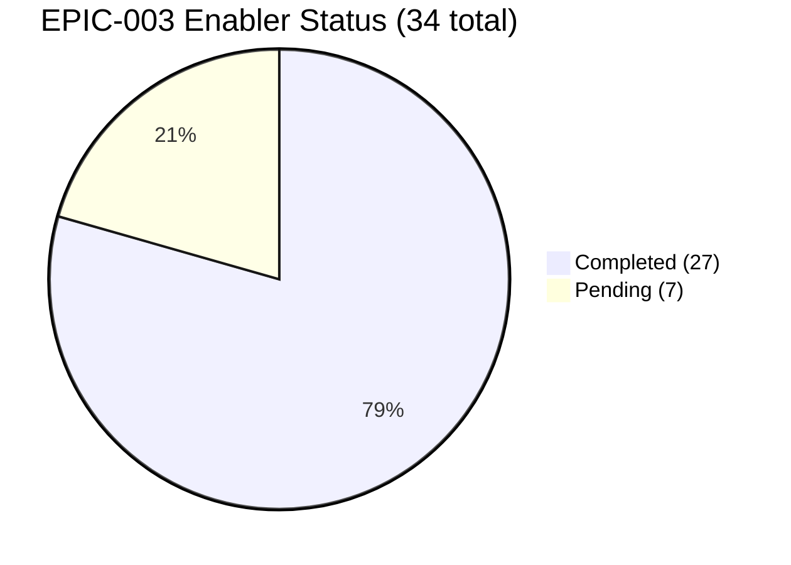
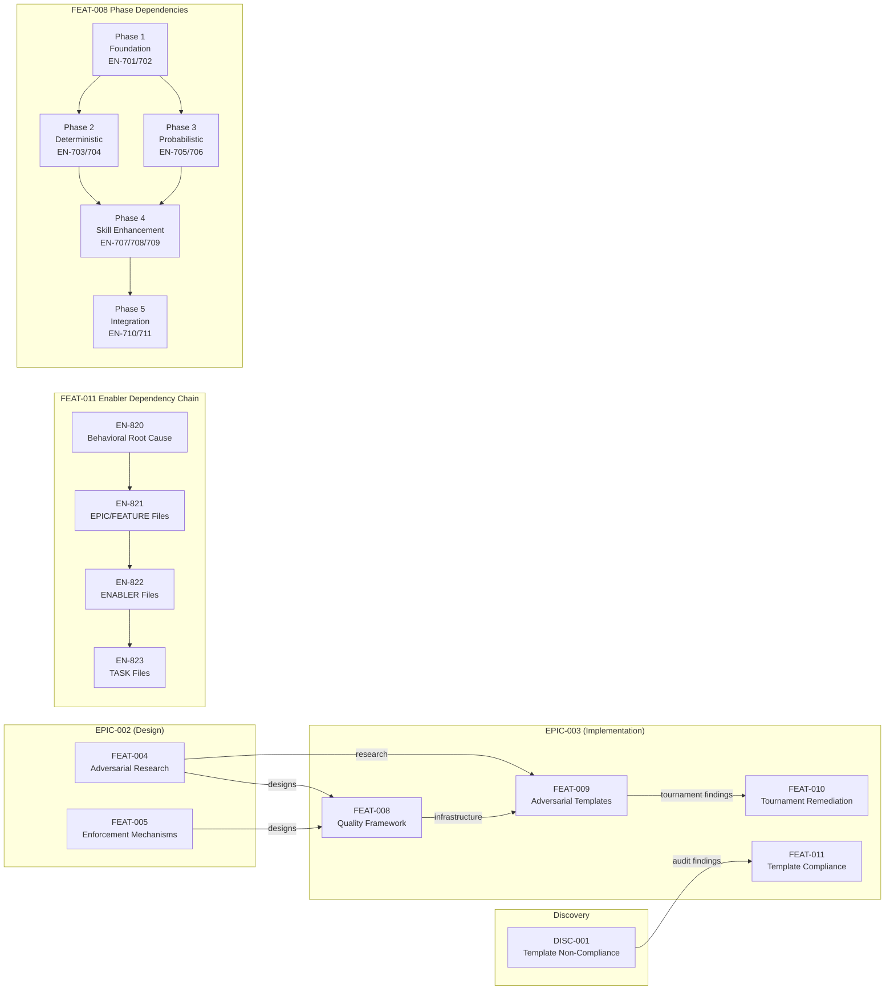

# EPIC-003: Quality Framework Implementation -- Diagrams

<!--
GENERATED: 2026-02-15
ROOT_ENTITY: EPIC-003
ENTITIES_INCLUDED: 1 epic, 4 features, 34 enablers
DATA_SOURCES:
  - EPIC-003-quality-implementation.md
  - FEAT-008-quality-framework-implementation.md (11 enablers: EN-701 to EN-711)
  - FEAT-009-adversarial-strategy-templates.md (12 enablers: EN-801 to EN-812)
  - FEAT-010-tournament-remediation.md (7 enablers: EN-813 to EN-819)
  - FEAT-011-template-compliance-remediation.md (4 enablers: EN-820 to EN-823)
-->

## Document Sections

| Section | Purpose |
|---------|---------|
| [Entity Summary](#entity-summary) | Counts and legend |
| [Diagram 1: Hierarchy](#diagram-1-hierarchy) | Full EPIC to Enabler hierarchy |
| [Diagram 2: Progress Pie Chart](#diagram-2-progress-pie-chart) | Enabler completion breakdown |
| [Diagram 3: Dependency Chain](#diagram-3-dependency-chain) | Feature and enabler dependencies |
| [Diagram 4: Status Overview](#diagram-4-status-overview) | Color-coded status for all entities |

---

## Entity Summary

| Entity Type | Count | Completed | In Progress | Pending |
|-------------|-------|-----------|-------------|---------|
| Epic | 1 | 0 | 1 | 0 |
| Feature | 4 | 2 | 1 | 1 |
| Enabler | 34 | 27 | 0 | 7 |
| **Total** | **39** | **29** | **1** | **8** |

### Status Legend

| Status | Color | Meaning |
|--------|-------|---------|
| DONE / completed | Green (#90EE90) | Work complete, quality gate passed |
| in_progress / IN_PROGRESS | Gold (#FFD700) | Actively being worked |
| pending / BACKLOG | Gray (#D3D3D3) | Not yet started |
| blocked | Red (#FF6B6B) | Blocked by dependency (none currently) |

---

## Diagram 1: Hierarchy

Full EPIC-003 hierarchy showing all 4 features and 34 enablers grouped by feature.

```mermaid
flowchart TD
    EPIC003["EPIC-003\nQuality Framework Implementation"]

    EPIC003 --> FEAT008
    EPIC003 --> FEAT009
    EPIC003 --> FEAT010
    EPIC003 --> FEAT011

    subgraph FEAT008_GROUP["FEAT-008: Quality Framework Implementation (11 enablers)"]
        FEAT008["FEAT-008"]

        subgraph P1["Phase 1: Foundation"]
            EN701["EN-701\nQuality Enforcement SSOT"]
            EN702["EN-702\nRule File Optimization"]
        end

        subgraph P2["Phase 2: Deterministic"]
            EN703["EN-703\nPreToolUse Enforcement"]
            EN704["EN-704\nPre-commit Quality Gates"]
        end

        subgraph P3["Phase 3: Probabilistic"]
            EN705["EN-705\nUserPromptSubmit Hook"]
            EN706["EN-706\nSessionStart Quality Context"]
        end

        subgraph P4["Phase 4: Skill Enhancement"]
            EN707["EN-707\nProblem-Solving Adversarial"]
            EN708["EN-708\nNASA-SE Adversarial"]
            EN709["EN-709\nOrchestration Adversarial"]
        end

        subgraph P5["Phase 5: Integration"]
            EN710["EN-710\nCI Pipeline Integration"]
            EN711["EN-711\nE2E Integration Testing"]
        end

        FEAT008 --> EN701
        FEAT008 --> EN702
        FEAT008 --> EN703
        FEAT008 --> EN704
        FEAT008 --> EN705
        FEAT008 --> EN706
        FEAT008 --> EN707
        FEAT008 --> EN708
        FEAT008 --> EN709
        FEAT008 --> EN710
        FEAT008 --> EN711
    end

    subgraph FEAT009_GROUP["FEAT-009: Adversarial Strategy Templates (12 enablers)"]
        FEAT009["FEAT-009"]

        subgraph F9P1["Phase 1: Foundation"]
            EN801["EN-801\nTemplate Format Standard"]
            EN802["EN-802\nAdversary Skill Skeleton"]
        end

        subgraph F9P2["Phase 2: Tier 1 Templates"]
            EN803["EN-803\nS-014 LLM-as-Judge"]
            EN804["EN-804\nS-010 Self-Refine"]
            EN805["EN-805\nS-007 Constitutional AI"]
        end

        subgraph F9P3["Phase 3: Tier 2 Templates"]
            EN806["EN-806\nS-002 Devil's Advocate"]
            EN807["EN-807\nS-003 Steelman"]
        end

        subgraph F9P4["Phase 4: Tier 3 Templates"]
            EN808["EN-808\nS-004/S-012/S-013 Risk"]
        end

        subgraph F9P5["Phase 5: Tier 4 Templates"]
            EN809["EN-809\nS-001/S-011 Security"]
        end

        subgraph F9P6["Phase 6: Skill Agents"]
            EN810["EN-810\nAdversary Skill Agents"]
        end

        subgraph F9P7["Phase 7: Integration"]
            EN811["EN-811\nAgent Extensions"]
            EN812["EN-812\nIntegration Testing"]
        end

        FEAT009 --> EN801
        FEAT009 --> EN802
        FEAT009 --> EN803
        FEAT009 --> EN804
        FEAT009 --> EN805
        FEAT009 --> EN806
        FEAT009 --> EN807
        FEAT009 --> EN808
        FEAT009 --> EN809
        FEAT009 --> EN810
        FEAT009 --> EN811
        FEAT009 --> EN812
    end

    subgraph FEAT010_GROUP["FEAT-010: Tournament Remediation (7 enablers)"]
        FEAT010["FEAT-010"]

        EN813["EN-813\nTemplate Context Optimization"]
        EN814["EN-814\nFinding ID Scoping"]
        EN815["EN-815\nDocumentation Navigation Fixes"]
        EN816["EN-816\nSkill Documentation Completeness"]
        EN817["EN-817\nRuntime Enforcement"]
        EN818["EN-818\nTemplate Validation CI Gate"]
        EN819["EN-819\nSSOT Consistency"]

        FEAT010 --> EN813
        FEAT010 --> EN814
        FEAT010 --> EN815
        FEAT010 --> EN816
        FEAT010 --> EN817
        FEAT010 --> EN818
        FEAT010 --> EN819
    end

    subgraph FEAT011_GROUP["FEAT-011: Template Compliance Remediation (4 enablers)"]
        FEAT011["FEAT-011"]

        EN820["EN-820\nFix Behavioral Root Cause"]
        EN821["EN-821\nEPIC & FEATURE Remediation"]
        EN822["EN-822\nENABLER Remediation"]
        EN823["EN-823\nTASK Remediation"]

        FEAT011 --> EN820
        FEAT011 --> EN821
        FEAT011 --> EN822
        FEAT011 --> EN823
    end
```

---

## Diagram 2: Progress Pie Chart

Enabler completion breakdown across all 34 enablers in EPIC-003.

---

## Diagram 3: Dependency Chain

Inter-feature dependencies and key enabler dependency chains.

---

## Diagram 4: Status Overview

Color-coded status for all features and their enablers.

```mermaid
flowchart TD
    EPIC003["EPIC-003\nQuality Framework\nImplementation\n(in_progress)"]

    EPIC003 --> FEAT008
    EPIC003 --> FEAT009
    EPIC003 --> FEAT010
    EPIC003 --> FEAT011

    subgraph FEAT008_S["FEAT-008: Quality Framework (DONE - 11/11)"]
        FEAT008["FEAT-008\n100% complete"]
        EN701["EN-701 SSOT"]
        EN702["EN-702 Rule Opt"]
        EN703["EN-703 PreToolUse"]
        EN704["EN-704 Pre-commit"]
        EN705["EN-705 UserPrompt"]
        EN706["EN-706 SessionStart"]
        EN707["EN-707 PS Adversarial"]
        EN708["EN-708 NSE Adversarial"]
        EN709["EN-709 ORCH Adversarial"]
        EN710["EN-710 CI Pipeline"]
        EN711["EN-711 E2E Testing"]
    end

    subgraph FEAT009_S["FEAT-009: Adversarial Templates (DONE - 12/12)"]
        FEAT009["FEAT-009\n100% complete"]
        EN801["EN-801 Format Std"]
        EN802["EN-802 Skill Skeleton"]
        EN803["EN-803 S-014 Judge"]
        EN804["EN-804 S-010 Refine"]
        EN805["EN-805 S-007 Const.AI"]
        EN806["EN-806 S-002 Devil"]
        EN807["EN-807 S-003 Steelman"]
        EN808["EN-808 Tier3 Risk"]
        EN809["EN-809 Tier4 Security"]
        EN810["EN-810 Skill Agents"]
        EN811["EN-811 Agent Ext"]
        EN812["EN-812 Integration"]
    end

    subgraph FEAT010_S["FEAT-010: Tournament Remediation (PENDING - 0/7)"]
        FEAT010["FEAT-010\n0% complete"]
        EN813["EN-813 Context Opt"]
        EN814["EN-814 Finding IDs"]
        EN815["EN-815 Doc/Nav Fixes"]
        EN816["EN-816 Skill Docs"]
        EN817["EN-817 Runtime Enf"]
        EN818["EN-818 CI Validation"]
        EN819["EN-819 SSOT Consistency"]
    end

    subgraph FEAT011_S["FEAT-011: Template Compliance (DONE - 4/4)"]
        FEAT011["FEAT-011\n100% complete"]
        EN820["EN-820 Root Cause"]
        EN821["EN-821 EPIC/FEAT"]
        EN822["EN-822 Enablers"]
        EN823["EN-823 Tasks"]
    end

    %% Status color coding
    style EPIC003 fill:#FFD700,stroke:#333,stroke-width:2px,color:#000

    %% FEAT-008: all completed
    style FEAT008 fill:#90EE90,stroke:#333,stroke-width:2px,color:#000
    style EN701 fill:#90EE90,stroke:#333,color:#000
    style EN702 fill:#90EE90,stroke:#333,color:#000
    style EN703 fill:#90EE90,stroke:#333,color:#000
    style EN704 fill:#90EE90,stroke:#333,color:#000
    style EN705 fill:#90EE90,stroke:#333,color:#000
    style EN706 fill:#90EE90,stroke:#333,color:#000
    style EN707 fill:#90EE90,stroke:#333,color:#000
    style EN708 fill:#90EE90,stroke:#333,color:#000
    style EN709 fill:#90EE90,stroke:#333,color:#000
    style EN710 fill:#90EE90,stroke:#333,color:#000
    style EN711 fill:#90EE90,stroke:#333,color:#000

    %% FEAT-009: all completed
    style FEAT009 fill:#90EE90,stroke:#333,stroke-width:2px,color:#000
    style EN801 fill:#90EE90,stroke:#333,color:#000
    style EN802 fill:#90EE90,stroke:#333,color:#000
    style EN803 fill:#90EE90,stroke:#333,color:#000
    style EN804 fill:#90EE90,stroke:#333,color:#000
    style EN805 fill:#90EE90,stroke:#333,color:#000
    style EN806 fill:#90EE90,stroke:#333,color:#000
    style EN807 fill:#90EE90,stroke:#333,color:#000
    style EN808 fill:#90EE90,stroke:#333,color:#000
    style EN809 fill:#90EE90,stroke:#333,color:#000
    style EN810 fill:#90EE90,stroke:#333,color:#000
    style EN811 fill:#90EE90,stroke:#333,color:#000
    style EN812 fill:#90EE90,stroke:#333,color:#000

    %% FEAT-010: all pending
    style FEAT010 fill:#D3D3D3,stroke:#333,stroke-width:2px,color:#000
    style EN813 fill:#D3D3D3,stroke:#333,color:#000
    style EN814 fill:#D3D3D3,stroke:#333,color:#000
    style EN815 fill:#D3D3D3,stroke:#333,color:#000
    style EN816 fill:#D3D3D3,stroke:#333,color:#000
    style EN817 fill:#D3D3D3,stroke:#333,color:#000
    style EN818 fill:#D3D3D3,stroke:#333,color:#000
    style EN819 fill:#D3D3D3,stroke:#333,color:#000

    %% FEAT-011: all completed
    style FEAT011 fill:#90EE90,stroke:#333,stroke-width:2px,color:#000
    style EN820 fill:#90EE90,stroke:#333,color:#000
    style EN821 fill:#90EE90,stroke:#333,color:#000
    style EN822 fill:#90EE90,stroke:#333,color:#000
    style EN823 fill:#90EE90,stroke:#333,color:#000
```

---

*Generated by wt-visualizer agent v1.0.0 on 2026-02-15.*
