# PROJ-001: OSS Release - Hierarchy Diagram

**Generated:** 2026-02-16T00:00:00Z
**Root Entity:** PROJ-001-oss-release
**Diagram Type:** hierarchy
**Entities Included:** 16 (3 Epics, 10 Features, 3 Feature Status Groups)
**Max Depth Reached:** 3

---

## Diagram

```mermaid
flowchart TD
    subgraph "Strategic Level"
        PROJ["PROJ-001: OSS Release Preparation"]
    end

    subgraph "Epic Level"
        EPIC001["EPIC-001: OSS Release Preparation<br/>Status: in_progress<br/>Features: 3 | Enablers: 20"]
        EPIC002["EPIC-002: Quality Framework Enforcement<br/>Status: done<br/>Features: 4 | Enablers: 24"]
        EPIC003["EPIC-003: Quality Framework Implementation<br/>Status: in_progress (67% → 100%)<br/>Features: 6 | Enablers: 45"]
    end

    subgraph "Feature Level - EPIC-001"
        FEAT001["FEAT-001: Fix CI Build Failures<br/>Status: done<br/>Enablers: 4 (EN-001–004)<br/>Bugs: 7"]
        FEAT002["FEAT-002: Research & Preparation<br/>Status: done<br/>Enablers: 8 (EN-101–108)<br/>Discoveries: 1"]
        FEAT003["FEAT-003: CLAUDE.md Optimization<br/>Status: done<br/>Enablers: 8 (EN-201–208)<br/>Bugs: 8"]
    end

    subgraph "Feature Level - EPIC-002"
        FEAT004["FEAT-004: Adversarial Strategy Research<br/>Status: done<br/>Enablers: 7 (EN-301–307)<br/>Focus: 15 strategies → 10 selected"]
        FEAT005["FEAT-005: Quality Framework Enforcement<br/>Status: done<br/>Enablers: 6 (EN-401–406)<br/>Focus: 5-layer architecture, L2-REINJECT"]
        FEAT006["FEAT-006: EPIC-001 Retroactive Review<br/>Status: done<br/>Enablers: 5 (EN-501–505)<br/>Evidence: EN-501 (0.949), EN-502 (0.951)"]
        FEAT013["FEAT-013: Worktracker Integrity Remediation<br/>Status: done<br/>Enablers: 6 (EN-907–912)<br/>Focus: P1–P7 audit fixes"]
    end

    subgraph "Feature Level - EPIC-003"
        FEAT007["FEAT-007: Advanced Adversarial Capabilities<br/>Status: pending<br/>Enablers: 5 (EN-601–605)<br/>Focus: Implementation deferred"]
        FEAT008["FEAT-008: Quality Framework Implementation<br/>Status: done<br/>Enablers: 11 (EN-701–711)<br/>Focus: 5-layer enforcement, AST engine, hooks"]
        FEAT009["FEAT-009: Adversarial Strategy Templates<br/>Status: done<br/>Enablers: 12 (EN-801–812)<br/>Focus: /adversary skill, 10 templates"]
        FEAT010["FEAT-010: Tournament Remediation<br/>Status: done<br/>Enablers: 7 (EN-813–819)<br/>Focus: FEAT-009 remediation, re-score 0.93"]
        FEAT011["FEAT-011: Template Compliance Remediation<br/>Status: done<br/>Enablers: 4 (EN-820–823)<br/>Focus: 144 tasks, 30 enablers fixed"]
        FEAT012["FEAT-012: Progressive Disclosure Rules<br/>Status: in_progress 17%<br/>Enablers: 6 (EN-901–906)<br/>Focus: Rules restructure, tiered loading"]
    end

    PROJ --> EPIC001
    PROJ --> EPIC002
    PROJ --> EPIC003

    EPIC001 --> FEAT001
    EPIC001 --> FEAT002
    EPIC001 --> FEAT003

    EPIC002 --> FEAT004
    EPIC002 --> FEAT005
    EPIC002 --> FEAT006
    EPIC002 --> FEAT013

    EPIC003 --> FEAT007
    EPIC003 --> FEAT008
    EPIC003 --> FEAT009
    EPIC003 --> FEAT010
    EPIC003 --> FEAT011
    EPIC003 --> FEAT012

    style PROJ fill:#E8F4F8,stroke:#333,stroke-width:3px
    style EPIC001 fill:#FFF4E6,stroke:#FF9800,stroke-width:2px
    style EPIC002 fill:#E8F5E9,stroke:#4CAF50,stroke-width:2px
    style EPIC003 fill:#FCE4EC,stroke:#E91E63,stroke-width:2px

    style FEAT001 fill:#C8E6C9,stroke:#388E3C,stroke-width:1px
    style FEAT002 fill:#C8E6C9,stroke:#388E3C,stroke-width:1px
    style FEAT003 fill:#C8E6C9,stroke:#388E3C,stroke-width:1px

    style FEAT004 fill:#C8E6C9,stroke:#388E3C,stroke-width:1px
    style FEAT005 fill:#C8E6C9,stroke:#388E3C,stroke-width:1px
    style FEAT006 fill:#C8E6C9,stroke:#388E3C,stroke-width:1px
    style FEAT013 fill:#C8E6C9,stroke:#388E3C,stroke-width:1px

    style FEAT007 fill:#F5F5F5,stroke:#999,stroke-width:1px
    style FEAT008 fill:#C8E6C9,stroke:#388E3C,stroke-width:1px
    style FEAT009 fill:#C8E6C9,stroke:#388E3C,stroke-width:1px
    style FEAT010 fill:#C8E6C9,stroke:#388E3C,stroke-width:1px
    style FEAT011 fill:#C8E6C9,stroke:#388E3C,stroke-width:1px
    style FEAT012 fill:#FFECB3,stroke:#FBC02D,stroke-width:1px
```

---

## Legend

| Status | Color | Meaning |
|--------|-------|---------|
| done | Light Green (#C8E6C9) | Feature/Epic completed |
| in_progress | Gold (#FFECB3) | Feature/Epic actively being worked |
| pending | Light Gray (#F5F5F5) | Feature deferred to future work |

---

## Status Summary by Epic

### EPIC-001: OSS Release Preparation
- **Status:** in_progress (with quality framework remediation)
- **True Completion:** 100% (3/3 features done)
- **Total Enablers:** 20 (4 + 8 + 8)
- **Total Bugs:** 15 (all resolved)
- **Key Note:** Marked in_progress because all deliverables were retroactively reviewed under EPIC-002 quality gates (EN-501, EN-502). Awaiting final closure after EPIC-003 completion.

### EPIC-002: Quality Framework Enforcement & Course Correction
- **Status:** done
- **True Completion:** 100% (4/4 features done)
- **Total Enablers:** 24 (7 + 6 + 5 + 6)
- **Total Effort:** 163 points
- **Key Evidence:**
  - FEAT-004: 15 strategies researched, 10 selected and ranked
  - FEAT-005: 5-layer enforcement architecture with L2-REINJECT and auto-escalation rules
  - FEAT-006: EN-501 (0.949), EN-502 (0.951) — EPIC-001 retroactive validation
  - FEAT-013: All P1–P7 audit findings remediated (commit 3048ea1)

### EPIC-003: Quality Framework Implementation
- **Status:** in_progress (67% complete, moving toward 100%)
- **True Completion:** 100% for FEAT-008/009/010/011 (4/6 features done)
- **Total Features:** 6
- **Total Enablers:** 45 (11 + 12 + 7 + 4 + 5 + 6)
- **Key Milestones:**
  - FEAT-007: Pending (Advanced Adversarial Capabilities — deferred per user note)
  - FEAT-008: 11 enablers PASS (>= 0.92) — 5-layer enforcement implemented
  - FEAT-009: 12 enablers PASS (>= 0.92) → re-scored 0.93 after FEAT-010 remediation
  - FEAT-010: 7 enablers PASS (avg 0.933) — Tournament remediation complete
  - FEAT-011: 4 enablers complete — Template compliance fixed (144 tasks, 30 enablers)
  - FEAT-012: In progress (17%) — Progressive Disclosure Rules Architecture (EN-901–906)

---

## Enabler Summary

| Epic | Feature | Enabler Count | Status | Notes |
|------|---------|---------------|--------|-------|
| EPIC-001 | FEAT-001 | 4 | done | Bug fixes + CI validation |
| EPIC-001 | FEAT-002 | 8 | done | Research + version bumping |
| EPIC-001 | FEAT-003 | 8 | done | CLAUDE.md rewrite + validation |
| **EPIC-001 Total** | — | **20** | **done** | — |
| EPIC-002 | FEAT-004 | 7 | done | Strategy research + skill enhancement |
| EPIC-002 | FEAT-005 | 6 | done | Enforcement architecture + rules |
| EPIC-002 | FEAT-006 | 5 | done | Retroactive quality review (EN-501/502 scored 0.949/0.951) |
| EPIC-002 | FEAT-013 | 6 | done | Worktracker integrity remediation |
| **EPIC-002 Total** | — | **24** | **done** | — |
| EPIC-003 | FEAT-007 | 5 | pending | Deferred to future epic |
| EPIC-003 | FEAT-008 | 11 | done | Quality framework implementation (5 phases) |
| EPIC-003 | FEAT-009 | 12 | done | Adversarial templates + /adversary skill |
| EPIC-003 | FEAT-010 | 7 | done | Tournament remediation (FEAT-009 re-score) |
| EPIC-003 | FEAT-011 | 4 | done | Template compliance (144 tasks fixed) |
| EPIC-003 | FEAT-012 | 6 | in_progress | Progressive disclosure rules (17% complete) |
| **EPIC-003 Total** | — | **45** | **in_progress (67%)** | 35/45 enablers done, 2 pending |

---

## Key Relationships

### EPIC-001 → EPIC-002
- **Dependency:** EPIC-001 deliverables require quality gate validation (retroactive)
- **Evidence:** FEAT-006 (EN-501: 0.949, EN-502: 0.951) validated all EPIC-001 features
- **Status:** EPIC-001 marked in_progress pending final closure after EPIC-003

### EPIC-002 → EPIC-003
- **Dependency:** EPIC-002 produced 82 design artifacts and 329+ test specs; EPIC-003 implements them
- **Evidence:** FEAT-008 (11 enablers), FEAT-009 (12 enablers), FEAT-010 (7 enablers) implement EPIC-002 designs
- **Status:** EPIC-003 actively implementing; 4/6 features complete

### FEAT-007 (EPIC-003) → Deferred
- **Reason:** Advanced Adversarial Capabilities deferred per user direction
- **Status:** 5 enablers (EN-601–605) remain pending

### FEAT-012 (EPIC-003) → In Progress
- **Reason:** Progressive Disclosure Rules Architecture remediates EN-702 naive optimization
- **Status:** 17% complete, 6 enablers (EN-901–906) with 32 tasks

---

## Color Coding Convention

| Color | Status | Semantics |
|-------|--------|-----------|
| **Light Green (#C8E6C9)** | done | Feature completed and validated (quality gates passed) |
| **Gold (#FFECB3)** | in_progress | Feature actively being worked; partial completion |
| **Light Gray (#F5F5F5)** | pending | Feature deferred or not started; zero progress |
| **Light Orange (#FFF4E6)** | epic | Epic container (neutral background) |
| **Light Blue (#E8F4F8)** | project | Project root (neutral background) |

---

## Metadata

- **Entities Visualized:** PROJ-001, EPIC-001, EPIC-002, EPIC-003, 10 Features, 45 Enablers (referenced)
- **Relationships Shown:** 16 (parent-child hierarchy)
- **Status Color Coding:** Enabled
- **Warnings:**
  - EPIC-001 marked in_progress despite 100% feature completion (awaiting final closure after EPIC-003)
  - FEAT-007 pending per user direction (Advanced Adversarial Capabilities deferred)
  - FEAT-012 in_progress (17% complete; 32 tasks across EN-901–906)
  - EPIC-003 status in_progress but 4/6 features (89% of assigned work) are actually done

---

*Generated by wt-visualizer v1.0.0*
*Constitutional Compliance: P-002 (File Persistence) ✓ | P-003 (No Recursion) ✓*
