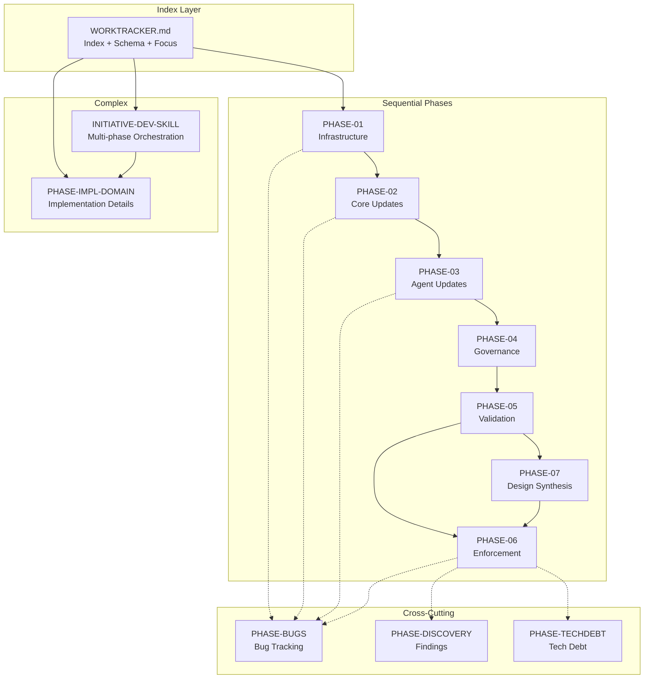

# DOC-001.R3: Pattern Extraction from work/ Files

> **Research Artifact ID**: DOC-001-R3
> **Date**: 2026-01-11
> **Agent**: ps-researcher
> **Objective**: Analyze the work/ folder structure to extract patterns and understand file purposes

---

## Executive Summary

The `work/` directory in `projects/PROJ-001-plugin-cleanup/` implements a **decomposed work tracking system** that separates concerns by phase, category, and lifecycle stage. This structure enables:

1. **Parallel execution** - Multiple agents can work on different phases simultaneously
2. **Context isolation** - Each file is self-contained with session resume protocols
3. **Graph-based dependencies** - Files explicitly declare predecessors and successors
4. **Scalable tracking** - Large initiatives split across multiple files to avoid context rot

---

## File Inventory

| # | File Name | Size | Lines | Purpose | Status |
|---|-----------|------|-------|---------|--------|
| 1 | `INITIATIVE-DEV-SKILL.md` | 29KB | 488 | Multi-phase initiative orchestration | IN PROGRESS |
| 2 | `PHASE-01-INFRASTRUCTURE.md` | 6KB | 222 | Phase 1: Project infrastructure setup | COMPLETED |
| 3 | `PHASE-02-CORE-UPDATES.md` | 5KB | 188 | Phase 2: Core configuration updates | COMPLETED |
| 4 | `PHASE-03-AGENT-UPDATES.md` | 5KB | 198 | Phase 3: Agent/skill definition updates | COMPLETED |
| 5 | `PHASE-04-GOVERNANCE.md` | 4KB | 163 | Phase 4: Governance document updates | COMPLETED |
| 6 | `PHASE-05-VALIDATION.md` | 6KB | 202 | Phase 5: Validation and commit | COMPLETED |
| 7 | `PHASE-06-ENFORCEMENT.md` | 35KB | 960 | Phase 6: Project enforcement implementation | IN PROGRESS |
| 8 | `PHASE-07-DESIGN-SYNTHESIS.md` | 15KB | 509 | Phase 7: Design document synthesis | COMPLETED |
| 9 | `PHASE-BUGS.md` | 3KB | 143 | Bug tracking across all phases | RESOLVED |
| 10 | `PHASE-DISCOVERY.md` | 3KB | 99 | Technical discoveries during work | ONGOING |
| 11 | `PHASE-IMPL-DOMAIN.md` | 20KB | 633 | Domain layer implementation tasks | IN PROGRESS |
| 12 | `PHASE-TECHDEBT.md` | 11KB | 341 | Technical debt tracking | COMPLETE |

**Total**: 12 files, ~142KB, ~4,146 lines

---

## File Type Classification

### Type 1: Sequential Phase Files

**Pattern**: `PHASE-{NN}-{NAME}.md`

**Files**:
- `PHASE-01-INFRASTRUCTURE.md`
- `PHASE-02-CORE-UPDATES.md`
- `PHASE-03-AGENT-UPDATES.md`
- `PHASE-04-GOVERNANCE.md`
- `PHASE-05-VALIDATION.md`
- `PHASE-06-ENFORCEMENT.md`
- `PHASE-07-DESIGN-SYNTHESIS.md`

**Purpose**: Track work items for a specific sequential phase of the project.

**Schema**:
```markdown
# Phase N: {Title}

> **Status**: [STATUS_EMOJI] {STATUS} ({PERCENT}%)
> **Goal**: {One-line goal description}

---

## Navigation
| Link | Description |
|------|-------------|
| [<- WORKTRACKER](../WORKTRACKER.md) | Back to index |
| [<- Phase N-1](PHASE-{N-1}-*.md) | Previous phase |
| [Phase N+1 ->](PHASE-{N+1}-*.md) | Next phase |

---

## Task Summary
| Task ID | Title | Status | Subtasks | Output |
|---------|-------|--------|----------|--------|

---

## {TASK-ID}: {Task Title} {STATUS_EMOJI}

> **Status**: {STATUS}
> **Output**: {artifact_path}

### Subtasks
| ID | Task | Status | Output |
|----|------|--------|--------|

### Acceptance Criteria
- [ ] Criterion 1
- [ ] Criterion 2

---

## Session Context
### For Resuming Work
{Instructions for context recovery}

### Key Files to Know
| File | Purpose |
|------|---------|

---

## Document History
| Date | Author | Changes |
|------|--------|---------|
```

**Key Characteristics**:
- Each phase has clear boundaries (start/end)
- Navigation links enable traversal
- Session Context section survives compaction
- Acceptance criteria are checkboxes (actionable)

---

### Type 2: Cross-Cutting Category Files

**Pattern**: `PHASE-{CATEGORY}.md`

**Files**:
- `PHASE-BUGS.md`
- `PHASE-DISCOVERY.md`
- `PHASE-TECHDEBT.md`

**Purpose**: Track items that span multiple phases or emerge during work.

**Schema (BUGS)**:
```markdown
# Phase BUGS: Bug Tracking

> **Status**: [STATUS_EMOJI] {STATUS} ({PERCENT}%)
> **Purpose**: Track bugs discovered during PROJ-001 development

---

## Bug Summary
| ID | Title | Severity | Status | Phase Found |
|----|-------|----------|--------|-------------|

---

## BUG-{NNN}: {Title} {STATUS_EMOJI}

> **Status**: {STATUS}
> **Resolution Date**: {DATE}
> **Severity**: {CRITICAL|HIGH|MEDIUM|LOW}

### Description
{What is the bug?}

### Root Cause
{Why did it happen?}

### Impact
{What broke?}

### Resolution
{How was it fixed?}

### Follow-up
{Any tech debt created?}
```

**Schema (DISCOVERY)**:
```markdown
# Phase DISCOVERY: Technical Discoveries

> **Status**: ONGOING
> **Purpose**: Track technical discoveries, insights, and findings

---

## Discovery Log

### DISC-{NNN}: {Title}

**Date**: YYYY-MM-DD
**Context**: {Where/how discovered}
**Finding**: {What was discovered}
**Impact**: {How this affects the project}
**Action**: {What should be done}
**Status**: LOGGED | INVESTIGATED | ACTIONED | ARCHIVED
```

**Schema (TECHDEBT)**:
```markdown
# Phase TECHDEBT: Technical Debt Tracking

> **Status**: [STATUS] ({PERCENT}%)
> **Purpose**: Track technical debt for future resolution

---

## Technical Debt Summary
| ID | Title | Priority | Status | Source |
|----|-------|----------|--------|--------|

---

## TD-{NNN}: {Title} {STATUS_EMOJI}

> **Status**: {STATUS}
> **Priority**: {HIGH|MEDIUM|LOW}
> **Source**: {Where discovered}

### Description
{What is the debt?}

### Root Cause
{Why does this exist?}

### Impact
{What happens if not fixed?}

### Proposed Solution
{How to address?}

### Files Affected
| File | Change |
|------|--------|

### Acceptance Criteria
- [ ] Criterion 1

### Effort Estimate
{T-shirt size}
```

**Key Characteristics**:
- Cross-reference to originating phase
- Priority/Severity for triage
- Explicit source tracking
- Templates included for consistency

---

### Type 3: Initiative Files

**Pattern**: `INITIATIVE-{NAME}.md`

**Files**:
- `INITIATIVE-DEV-SKILL.md`

**Purpose**: Track complex multi-phase initiatives with orchestration patterns.

**Schema**:
```markdown
# Initiative: {Title}

> **ID**: INIT-{SLUG}
> **PS ID**: {short-id}
> **Status**: [STATUS_EMOJI] {STATUS}
> **Created**: {DATE}
> **Branch**: {git_branch}

---

## Executive Summary
{1-2 paragraph description}

---

## Problem Statement
### What We're Solving
{Problem description}

### Why This Approach
{Rationale}

---

## Enforced Constraints
| ID | Constraint | Description | Validated In |
|----|------------|-------------|--------------|

---

## Workflow Orchestration
### Pattern Usage Summary
| Pattern | Name | Usage |
|---------|------|-------|
| Pattern 1 | Single Agent | {where used} |
| Pattern 2 | Sequential Chain | {where used} |
| Pattern 3 | Fan-Out (Parallel) | {where used} |
| Pattern 4 | Fan-In (Synthesis) | {where used} |
| Pattern 5 | Research->Decision->Validation | {where used} |

---

## Phase N: {Title} (Pattern X)

{ASCII diagram of agent orchestration}

### Tasks
| ID | Entry | Topic | Sources | Output |
|----|-------|-------|---------|--------|

---

## Artifact Dependency Graph
{ASCII diagram showing artifact flow}

---

## Execution Tracker
| Phase | Pattern | Agent | Entry | Status | Artifact |
|-------|---------|-------|-------|--------|----------|

---

## Iteration History
| Iteration | Date | Gaps Found | Status | Next Action |
|-----------|------|------------|--------|-------------|
```

**Key Characteristics**:
- Enforced constraints with validation tracking
- Multiple orchestration patterns (fan-out, fan-in, sequential)
- Visual dependency graphs (ASCII/Mermaid)
- Iteration tracking for loops
- Execution tracker for progress

---

### Type 4: Implementation Domain Files

**Pattern**: `PHASE-IMPL-{DOMAIN}.md`

**Files**:
- `PHASE-IMPL-DOMAIN.md`

**Purpose**: Track detailed implementation tasks with full test pyramid.

**Schema**:
```markdown
# Phase: {Domain} Layer Implementation

**ID**: PHASE-IMPL-{DOMAIN}
**Status**: [STATUS]
**Coverage Gate**: {N}%+ before proceeding

---

## Task Index
| Task ID | Title | Status | Tests | Coverage |
|---------|-------|--------|-------|----------|

---

## IMPL-{NNN}: {Component Name}

### R-{NNN}: Research (Complete)
- [x] 5W1H Analysis: {path}
- [x] ADR Reference: {adr}
- [x] Citations: {sources}

### I-{NNN}: Implementation

**Files to Create:**
- `path/to/file.py`

**Interface Contract:**
```python
class ClassName:
    """Docstring."""
    def method(self) -> ReturnType: ...
```

**Implementation Order (BDD Cycle):**
1. Feature file -> step definitions -> failing tests (RED)
2. Implement method -> tests pass (GREEN)
3. Refactor -> tests still pass (REFACTOR)

### T-{NNN}: Test Phase

**Feature File:** `tests/features/path/file.feature`
```gherkin
Feature: {Title}
  Scenario: {name}
    Given {precondition}
    When {action}
    Then {assertion}
```

**Unit Tests:** `tests/path/test_file.py`

| Test | Type | Description |
|------|------|-------------|
| `test_name` | Happy/Negative/Edge/Boundary | {description} |

### E-{NNN}: Evidence Phase
- [x] All N tests pass
- [x] Coverage N% for file
- [ ] Commit hash recorded
- [x] No regressions
```

**Key Characteristics**:
- R/I/T/E phase structure (Research, Implementation, Test, Evidence)
- BDD-driven with Gherkin feature files
- Test categorization (Happy, Negative, Edge, Boundary)
- Coverage gates enforced
- Interface contracts in Python

---

## Relationship to WORKTRACKER.md

The main `WORKTRACKER.md` serves as the **index** and **schema definition**, while `work/` files contain the **detailed implementation**.

```
                    WORKTRACKER.md
                    (Index + Schema + Current Focus)
                           |
    +----------------------+----------------------+
    |                      |                      |
    v                      v                      v
work/PHASE-NN-*.md    work/PHASE-{CAT}.md    work/INITIATIVE-*.md
(Sequential Work)     (Cross-Cutting)         (Complex Orchestration)
```

### WORKTRACKER.md Contains:

1. **Enforced Principles** - Non-negotiable rules for all work
2. **Work Item Schema** - Template for all tasks (R/I/T/E phases)
3. **Navigation Graph** - Visual index of all work files
4. **Full Dependency Graph** - Shows phase/task relationships
5. **Quick Status Dashboard** - Links to all phase files with status
6. **Current Focus** - What is actively being worked on
7. **Work Item Index** - All tasks with predecessors/successors
8. **Cross-Reference Index** - Runbooks, research, decisions, tests
9. **Session Resume Protocol** - How to continue after compaction
10. **Verification Checklist** - Required before marking tasks complete
11. **Document History** - Detailed change log

### work/ Files Contain:

1. **Task Details** - Subtasks, acceptance criteria, evidence
2. **Session Context** - Specific to that phase for resumption
3. **Implementation Specifics** - Code contracts, test lists
4. **Diagrams** - ASCII/Mermaid for workflows
5. **Templates** - For new items of that type

---

## Relationship Diagram



---

## Parallelization Patterns Enabled

### Pattern 1: Phase-Level Parallelization

Phases 6 and 7 can run in parallel because:
- Both depend on Phase 5 (not on each other)
- Phase 7 outputs unblock Phase 6 tasks (not Phase 6 itself)

```
Phase 5 (Validation)
       |
       +-----> Phase 6 (Enforcement) - Can work on ENFORCE-001 to ENFORCE-007
       |
       +-----> Phase 7 (Design Synthesis) - Full completion
                    |
                    v
              ENFORCE-008d (Unblocked after Phase 7)
```

### Pattern 2: Task-Level Parallelization

Within Phase 6, subtasks have explicit dependencies:

```
ENFORCE-008d.1 (Value Objects) ----+
                                   |--> ENFORCE-008d.4 (Infrastructure)
ENFORCE-008d.3 (New Objects) ------+
                                   |
           PARALLEL with           |
                                   v
ENFORCE-008d.2 (Entities) <-- depends on 008d.1
```

### Pattern 3: Agent-Level Parallelization (Fan-Out)

INITIATIVE-DEV-SKILL shows parallel research:

```
         +--> ps-researcher R1 --> e-001.md
         +--> ps-researcher R2 --> e-002.md
Phase 1 -+--> ps-researcher R3 --> e-003.md
         +--> ps-researcher R4 --> e-004.md
         +--> ps-researcher R5 --> e-005.md
         +--> ps-researcher R6 --> e-006.md
                      |
                      v (Fan-In)
              ps-synthesizer S1 --> e-007.md
```

### Pattern 4: Cross-Cutting Independence

BUGS, DISCOVERY, and TECHDEBT files can be updated at any time:
- No dependencies on phase progression
- Can capture issues during any phase
- Enable async issue tracking

---

## Naming Conventions

### File Naming

| Pattern | Example | Usage |
|---------|---------|-------|
| `PHASE-{NN}-{NAME}.md` | `PHASE-01-INFRASTRUCTURE.md` | Sequential phases (NN = 01-99) |
| `PHASE-{CATEGORY}.md` | `PHASE-BUGS.md` | Cross-cutting categories |
| `INITIATIVE-{NAME}.md` | `INITIATIVE-DEV-SKILL.md` | Complex multi-phase initiatives |
| `PHASE-IMPL-{DOMAIN}.md` | `PHASE-IMPL-DOMAIN.md` | Implementation detail files |

### Task ID Naming

| Pattern | Example | Usage |
|---------|---------|-------|
| `{PREFIX}-{NNN}` | `SETUP-001` | Phase-specific tasks |
| `{PREFIX}-{NNN}.{N}` | `008d.1` | Subtasks |
| `{PREFIX}-{NNN}.{N}.{N}` | `008d.1.1` | Sub-subtasks |
| `{PREFIX}-{NNN}{LETTER}` | `ENFORCE-008b` | Variants/iterations |
| `R-{ID}` | `R-008d.0` | Research phase |
| `I-{ID}` | `I-008d.1` | Implementation phase |
| `T-{ID}` | `T-008d.1.3` | Test phase |
| `E-{ID}` | `E-008d` | Evidence phase |

### Artifact ID Naming

| Pattern | Example | Usage |
|---------|---------|-------|
| `e-{NNN}` | `e-001` | Entry artifact |
| `e-{NNN}-v{N}` | `e-013-v2` | Versioned artifact |
| `BUG-{NNN}` | `BUG-001` | Bug entry |
| `TD-{NNN}` | `TD-005` | Tech debt entry |
| `DISC-{NNN}` | `DISC-002` | Discovery entry |
| `IMPL-{NNN}` | `IMPL-003` | Implementation task |
| `IMPL-{CAT}-{NNN}` | `IMPL-ES-001` | Categorized impl task |

---

## Key Insights

### Insight 1: Decomposition Reduces Context Rot

By splitting a large WORKTRACKER into multiple files:
- Each file stays under typical context window limits
- Session resume sections enable recovery after compaction
- Cross-references maintain cohesion without embedding

### Insight 2: Graph Structure Enables Automation

Explicit predecessor/successor declarations enable:
- Dependency validation before starting work
- Automatic unblocking detection
- Parallelization opportunity identification
- Critical path analysis

### Insight 3: Templates Ensure Consistency

Each file type includes a template section:
- Reduces cognitive load when adding new items
- Ensures required fields are captured
- Enables pattern matching for parsing

### Insight 4: Status Emojis Enable Quick Scanning

| Emoji | Meaning |
|-------|---------|
| ✅ | Done/Complete |
| 🔄 | In Progress |
| ⏳ | Pending/Waiting |
| 🐛 | Bug (open) |
| ⏳ | TODO |

### Insight 5: Cross-References Create Knowledge Graph

Files extensively link to:
- Other work files (navigation)
- Research artifacts (evidence)
- Decision records (rationale)
- Test suites (verification)
- Runbooks (reproducibility)

---

## Recommendations for Skill Development

Based on this analysis, a `worktracker-decomposition` skill should:

1. **Detect Large WORKTRACKERs** - Files exceeding threshold (e.g., 500 lines)
2. **Identify Phase Boundaries** - Find natural split points
3. **Generate Phase Files** - Create structured files with navigation
4. **Maintain Cross-References** - Update links bidirectionally
5. **Preserve Session Context** - Ensure each file is resumable
6. **Create Category Files** - Split BUGS, TECHDEBT, DISCOVERY if needed
7. **Generate Navigation Graph** - Update WORKTRACKER index

---

## Document History

| Date | Author | Changes |
|------|--------|---------|
| 2026-01-11 | ps-researcher (Claude) | Initial research artifact |
