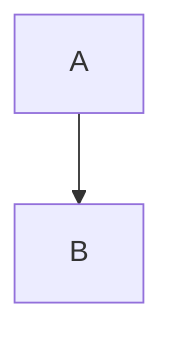

# SPIKE-001 Phase 1: Python Markdown AST Library Landscape Research

> ps-researcher-001 | Phase 1 | spike-eval-20260219-001
> Date: 2026-02-19

<!-- VERSION: 1.0.0 | DATE: 2026-02-19 | SOURCE: SPIKE-001 Phase 1 Research -->

## Document Sections

| Section | Purpose |
|---------|---------|
| [L0: Executive Summary](#l0-executive-summary) | Non-technical overview of findings |
| [L1: Technical Analysis](#l1-technical-analysis) | Per-library deep dives across 14 dimensions |
| [L2: Architectural Implications](#l2-architectural-implications) | Strategic assessment for Jerry framework |
| [References](#references) | All sources with URLs and Context7 references |

---

## L0: Executive Summary

The Python ecosystem offers a mature set of markdown parsing libraries, each with distinct trade-offs between CommonMark compliance, extensibility, performance, and roundtrip fidelity. This research evaluates seven libraries against Jerry's specific requirements: structured blockquote frontmatter, navigation tables, L2-REINJECT HTML comments, template placeholders, Mermaid code blocks, and ASCII art preservation.

Three libraries emerge as the most relevant candidates for Jerry's needs. **markdown-it-py** (v4.0.0) stands out for its 100% CommonMark compliance, rich plugin ecosystem (including frontmatter, tables, and custom syntax support via mdit-py-plugins), and its role as the parser underlying mdformat's roundtrip formatting. **mistletoe** (v1.5.1) offers a clean AST with a dedicated MarkdownRenderer for roundtrip operations, position tracking via `line_number` attributes, and an intuitive custom token API. **marko** (v2.2.2) provides full CommonMark v0.31.2 compliance with the most recent release among all candidates and a flexible extension system, though it lacks detailed roundtrip documentation.

Two supplementary libraries deserve attention: **mdformat** (v1.0.0), built on markdown-it-py, provides validated roundtrip formatting with AST-equality verification, and **mistune** (v3.2.0) offers the fastest pure-Python parsing with an AST mode and a large installed base. **pyromark** (v0.9.8) provides extreme speed via Rust bindings but lacks AST tree construction and extension APIs. **commonmark.py** is officially deprecated and should not be considered for new projects.

No single library handles all of Jerry's markdown dialect requirements out of the box. Jerry's blockquote frontmatter pattern (`> **Key:** Value`) and L2-REINJECT HTML comments require custom parsing logic regardless of which library is selected. The key architectural question for Phase 2 is whether to build a thin adaptation layer atop an existing library or construct a Jerry-specific parser.

---

## L1: Technical Analysis

### Library 1: markdown-it-py

**Overview:** Python port of the JavaScript markdown-it parser, maintained by the Executable Books organization. The most ecosystem-connected library, serving as the parser for mdformat, MyST-Parser, and numerous Sphinx documentation tools.

| Dimension | Findings |
|-----------|----------|
| **Basic Info** | v4.0.0 (Aug 11, 2025). Python >=3.10. MIT License. [PyPI](https://pypi.org/project/markdown-it-py/) |
| **GitHub Metrics** | ~1,200 stars, 91 forks, 33 open issues, 34 contributors. [GitHub](https://github.com/executablebooks/markdown-it-py) |
| **Maintenance Status** | Active. Maintained by Executable Books org. v4.0.0 dropped Python 3.8/3.9, added 3.13 support. Regular releases. |
| **CommonMark Compliance** | 100% CommonMark compliance (spec v0.31.2). This is a core design goal. Configurable presets: `commonmark`, `gfm-like`, `zero`. |
| **AST Access** | Token-based flat stream via `md.parse(text)`. Each token has `type`, `tag`, `nesting`, `map` (line numbers `[startLine, endLine]`), `children`, `attrs`, `content`, `markup`, `info`, `meta`, `block`, `hidden`. Flat stream can be converted to hierarchical `SyntaxTreeNode` tree via `markdown_it.tree.SyntaxTreeNode(tokens)`. Tree nodes expose `source_map` as `(line_begin, line_end)` tuple. |
| **Extension API** | Plugin architecture via `.use(plugin_fn)`. Rich ecosystem of plugins in `mdit-py-plugins` package (20+ plugins). Custom block/inline/core rules can be added. Supports rule enable/disable: `md.enable("table")`, `md.disable("code")`. |
| **Roundtrip Fidelity** | No built-in markdown renderer. However, mdformat (v1.0.0) provides validated roundtrip rendering built on markdown-it-py, with AST-equality verification between input and output. The `MDRenderer` in mdformat handles markdown-to-markdown conversion. |
| **Table Support** | GFM tables via `.enable("table")` or `gfm-like` preset. Cell alignment supported. |
| **Frontmatter** | YAML frontmatter via `mdit_py_plugins.front_matter.front_matter_plugin`. Parses `---` delimited blocks. |
| **Code Blocks** | Full fenced code block support with language info strings. Info string accessible in token's `info` attribute. Indented code blocks also supported. |
| **HTML Pass-through** | HTML blocks (including comments) are parsed as `html_block` tokens when `html` option is enabled. HTML comments (`<!-- -->`) are recognized per CommonMark spec (Type 2 HTML blocks). Content preserved in token's `content` attribute. |
| **Type Hints** | Modern Python codebase. Type annotations present. Token class is fully typed. |
| **Documentation Quality** | Good. ReadTheDocs site with using guide, plugin guide, API reference, design principles. Token structure well-documented. 220 code snippets in Context7. |
| **Performance** | 97.2ms mean on CommonMark spec benchmark (v3.0.0). Slower than mistune (80.4ms) but faster than commonmark-py (300.4ms). The Rust variant markdown-it-pyrs achieves 6.4ms. |

**Key Strengths:** Largest plugin ecosystem, proven CommonMark compliance, foundation for mdformat roundtrip, position tracking in tokens, hierarchical SyntaxTreeNode.

**Key Weaknesses:** No built-in markdown renderer (requires mdformat), flat token stream requires conversion for tree operations, Python >=3.10 requirement.

---

### Library 2: mistletoe

**Overview:** Pure Python markdown parser emphasizing speed, spec-compliance, and extensibility. Clean AST design with explicit block/span token hierarchy and a built-in MarkdownRenderer.

| Dimension | Findings |
|-----------|----------|
| **Basic Info** | v1.5.1 (Dec 7, 2025). Python ~=3.5. MIT License. [PyPI](https://pypi.org/project/mistletoe/) |
| **GitHub Metrics** | ~1,000 stars, 126 forks, 28 open issues, 34 contributors. [GitHub](https://github.com/miyuchina/mistletoe) |
| **Maintenance Status** | Active. Regular releases through 2025. 1,466+ dependents. |
| **CommonMark Compliance** | Follows CommonMark specification for ambiguity resolution. Claims to be "the fastest CommonMark-compliant Markdown parser in pure Python." |
| **AST Access** | True tree-based AST with `Document` root node. Two token categories: **block tokens** (Document, Heading, Paragraph, List, ListItem, Quote, BlockCode, CodeFence, ThematicBreak, HTMLBlock, Table) and **span tokens** (RawText, Link, Image, Emphasis, Strong, InlineCode, HTMLSpan, Strikethrough). Every token has `children` and `parent` properties for traversal. Block tokens have `line_number` attribute tracking starting line. JSON AST output via `AstRenderer`. |
| **Extension API** | Custom tokens via subclassing `SpanToken` or `BlockToken`. Define `pattern` (regex), `__init__()`, `parse_group`, `parse_inner`. `precedence` attribute controls parse order. Custom renderers via subclassing (e.g., `HtmlRenderer`). Renderer methods follow `render_{token_name}()` naming. |
| **Roundtrip Fidelity** | Built-in `MarkdownRenderer` for parse-modify-render workflows. Preserves original content spacing after list markers (configurable via `normalize_whitespace`). Designed for automated markdown transformations. |
| **Table Support** | Tables supported natively (not via extension). Part of core token set. |
| **Frontmatter** | No explicit frontmatter support found in documentation. Would require custom token implementation. |
| **Code Blocks** | `CodeFence` token for fenced code blocks with language info. `BlockCode` for indented code. |
| **HTML Pass-through** | `HTMLBlock` (block-level) and `HTMLSpan` (inline) tokens. Added by `HtmlRenderer` to parsing process. HTML comments would be captured as HTMLBlock or HTMLSpan content. |
| **Type Hints** | Includes `py.typed` marker file (PEP-561 compliant). Type annotations available for static type checking. |
| **Documentation Quality** | Moderate. GitHub README covers basics. Developer guide explains AST structure, custom tokens. No dedicated documentation site (uses GitHub markdown). 114 code snippets in Context7. |
| **Performance** | 99.6ms mean on CommonMark spec benchmark. Comparable to markdown-it-py (97.2ms). Significantly faster than commonmark-py (300.4ms). |

**Key Strengths:** True tree AST (not flat tokens), built-in MarkdownRenderer for roundtrip, clean extension API via subclassing, position tracking, py.typed support, broad Python version support (3.5+).

**Key Weaknesses:** No frontmatter support, smaller ecosystem than markdown-it-py, documentation is GitHub-only (no ReadTheDocs).

---

### Library 3: marko

**Overview:** Pure Python CommonMark parser with emphasis on extensibility. Most recent release among all candidates (Jan 2026). Clean extension API with both element and renderer extension points.

| Dimension | Findings |
|-----------|----------|
| **Basic Info** | v2.2.2 (Jan 5, 2026). Python >=3.9. MIT License. [PyPI](https://pypi.org/project/marko/) |
| **GitHub Metrics** | 447 stars, 49 forks, 5 open issues, 24 contributors. [GitHub](https://github.com/frostming/marko) |
| **Maintenance Status** | Active. Most recent release among all candidates. Low issue count (5 open) suggests stability. Maintained by frostming (also maintains PDM package manager). |
| **CommonMark Compliance** | Full compliance with CommonMark v0.31.2. Strict spec adherence is a primary design goal. |
| **AST Access** | True tree-based AST. `Document` root with `children` list. Block elements: Document, Heading, SetextHeading, Paragraph, List, ListItem, Quote, CodeBlock, FencedCode, ThematicBreak, HTMLBlock, LinkRefDef, BlankLine. Inline elements: Link, Image, Emphasis, StrongEmphasis, CodeSpan, LineBreak, AutoLink, InlineHTML, Literal, RawText. Each element has `children`, `priority`, `virtual`, `override` attributes. `ASTRenderer` outputs dict representation, `XMLRenderer` for XML format. |
| **Extension API** | Subclass `marko.inline.InlineElement` or `marko.block.BlockElement`. Define `pattern` (regex), `__init__()`. `priority` attribute (default 5, higher = earlier). `override = True` to replace built-in elements. Renderer mixins with `render_` + snake_cased_name methods. Extensions packaged via `MarkoExtension` combining elements + renderer mixins. Registration via `Markdown(extensions=[...])` or `markdown.use(ext)`. Publishable extensions via `make_extension()` function. |
| **Roundtrip Fidelity** | `MarkdownRenderer` available for markdown-to-markdown normalization: `Markdown(renderer=MarkdownRenderer)`. Normalizes formatting rather than preserving exact original whitespace. |
| **Table Support** | Available via GFM extension: `marko.ext.gfm.gfm`. Not in core but well-supported. |
| **Frontmatter** | No explicit frontmatter support found in documentation. Would require custom extension. |
| **Code Blocks** | `FencedCode` for fenced blocks with language info. `CodeBlock` for indented. |
| **HTML Pass-through** | `HTMLBlock` (block-level) and `InlineHTML` (inline) element types. HTML escaping by default (safe for untrusted input). |
| **Type Hints** | Upgraded from type comments to Python 3.5+ style annotations. `marko.source.Source` wrapper class typed. |
| **Documentation Quality** | Good. ReadTheDocs documentation with usage guide, extension guide, API reference. Clear extension examples. 447 stars suggest solid community. |
| **Performance** | Approximately 3x slower than Python-Markdown per documentation. Slowest among the actively maintained candidates. Spec compliance prioritized over speed. |

**Key Strengths:** Most recent release (Jan 2026), lowest open issue count, clean extension API with priority system, full CommonMark v0.31.2, `override` mechanism for replacing built-in elements, publishable extensions.

**Key Weaknesses:** Smallest community (447 stars), slowest performance, no frontmatter support, MarkdownRenderer normalizes rather than preserves.

---

### Library 4: mistune

**Overview:** Fast Python markdown parser with the largest installed base (368,000+ dependents). v3 introduced AST rendering mode and plugin architecture. Not fully CommonMark-compliant but follows "sane CommonMark rules."

| Dimension | Findings |
|-----------|----------|
| **Basic Info** | v3.2.0 (Dec 23, 2025). Python >=3.8. BSD-3-Clause License. [PyPI](https://pypi.org/project/mistune/) |
| **GitHub Metrics** | ~3,000 stars, 272 forks, 38 open issues, 48 contributors. [GitHub](https://github.com/lepture/mistune) |
| **Maintenance Status** | Active. Largest community. Regular releases. Supports Python 3.8-3.14 (CPython and PyPy). |
| **CommonMark Compliance** | Partial. Follows "sane CommonMark rules" but is NOT fully CommonMark compliant. Prioritizes speed over strict spec adherence. |
| **AST Access** | AST mode via `renderer=None` or `renderer='ast'`. Returns list of dict tokens: `[{"type": "paragraph", "children": [{"type": "text", "raw": "..."}]}]`. Token types include: text, emphasis, strong, codespan, linebreak, softbreak, link, image, paragraph, heading, thematic_break, block_code, block_quote, list, list_item, block_html, block_error. Plugin tokens: strikethrough, table, footnote_ref, footnote_item, task_list_item. |
| **Extension API** | Plugin functions registered via `mistune.create_markdown(plugins=[...])`. Block-level plugins use regex patterns starting with `^`. Inline-level plugins use regex without `^` anchor. Plugins register patterns with `md.inline.register(name, pattern, parse_fn, before=ref)` or `md.block.register(...)`. Built-in plugins: strikethrough, table, footnote, task_lists, abbr, def_list, math, spoiler, superscript, mark, insert, ruby_annotation. |
| **Roundtrip Fidelity** | Markdown renderer exists in test fixtures (`renderer_markdown.txt`) suggesting roundtrip capability. Documentation does not prominently feature markdown-to-markdown as a use case. Normalization-oriented rather than preservation-oriented. |
| **Table Support** | Via built-in `table` plugin. Also `table_in_quote` and `table_in_list` for tables inside blockquotes and lists. Column alignment supported. |
| **Frontmatter** | No explicit frontmatter plugin found in documentation. Would require custom plugin. |
| **Code Blocks** | `block_code` type in AST. Fenced code blocks with language info string. Info accessible via `info` attribute. |
| **HTML Pass-through** | `block_html` token type for HTML blocks. HTML comments handled as part of HTML block parsing. |
| **Type Hints** | Python codebase (99.8%). Type hint availability not explicitly documented. No `py.typed` marker found in search results. |
| **Documentation Quality** | Good. Dedicated documentation site at mistune.lepture.com. Guide, advanced guide, changelog. 254 code snippets in Context7. |
| **Performance** | 80.4ms mean on CommonMark spec benchmark -- fastest pure-Python parser. Significantly faster than markdown-it-py (97.2ms) and commonmark-py (300.4ms). |

**Key Strengths:** Fastest pure-Python parser, largest installed base (368K dependents), broadest Python version support (3.8-3.14), rich built-in plugin set (including table-in-blockquote), AST dict format is JSON-serializable.

**Key Weaknesses:** NOT fully CommonMark compliant, roundtrip capability poorly documented, AST is flat dicts (no tree traversal helpers), no py.typed marker found.

---

### Library 5: mdformat

**Overview:** CommonMark-compliant markdown formatter built on markdown-it-py. Unique in providing validated roundtrip formatting with AST-equality verification. Functions as both CLI tool and Python library.

| Dimension | Findings |
|-----------|----------|
| **Basic Info** | v1.0.0 (Oct 16, 2025). Python >=3.10. MIT License. [PyPI](https://pypi.org/project/mdformat/) |
| **GitHub Metrics** | 718 stars, 52 forks, 39 open issues, 15 contributors. [GitHub](https://github.com/hukkin/mdformat) |
| **Maintenance Status** | Active. Reached v1.0.0 milestone in Oct 2025. Last commit Feb 2025 on master. |
| **CommonMark Compliance** | CommonMark compliant (inherits from markdown-it-py parser). |
| **AST Access** | Uses markdown-it-py tokens internally. `RenderTreeNode` for tree representation. Plugin development uses `RenderContext` and `RenderTreeNode` for AST access. Not designed primarily as an AST library but provides access through its plugin API. |
| **Extension API** | Two plugin types: (1) **Parser extension plugins** implementing `ParserExtensionInterface` with `update_mdit(mdit)` to extend markdown-it-py parser and `render_*` functions for markdown output. (2) **Code formatter plugins** for formatting content within fenced code blocks (e.g., format Python code with Black). Entry points registered in `pyproject.toml`. |
| **Roundtrip Fidelity** | Core differentiator. **Validates that rendered HTML is consistent between input and output.** AST-equality verification ensures formatting changes never alter document meaning. Uses backslash escaping to ensure safety. Explicitly compared favorably to Prettier (which has numerous AST-altering bugs). |
| **Table Support** | Via `mdformat-gfm` plugin or `extensions={"tables"}` parameter. |
| **Frontmatter** | Via `mdformat-frontmatter` plugin. YAML frontmatter passes through formatting. |
| **Code Blocks** | Full support. Code formatter plugin API allows formatting code inside fenced blocks (e.g., Python with Black, JS with Prettier). |
| **HTML Pass-through** | CommonMark HTML block handling inherited from markdown-it-py. |
| **Type Hints** | Python codebase with modern tooling. Type annotations present in plugin API (`RenderContext`, `RenderTreeNode`, `Render` types). |
| **Documentation Quality** | Good. ReadTheDocs with user guide, plugin development guide, contributor guide. Clear API documentation. 102 code snippets in Context7 (Benchmark Score: 90.3 -- highest among all candidates). |
| **Performance** | Not benchmarked independently. Overhead on top of markdown-it-py parsing due to validation pass. Designed for correctness, not speed. |

**Key Strengths:** Only library with validated roundtrip fidelity, AST-equality verification, rich plugin ecosystem (gfm, frontmatter, code formatters), reached v1.0.0 stability milestone, highest Context7 benchmark score.

**Key Weaknesses:** Not a parser library per se (depends on markdown-it-py), limited AST access outside plugin API, requires separate plugin packages for GFM/frontmatter, performance overhead from validation.

---

### Library 6: pyromark

**Overview:** Rust-based Python markdown parser wrapping the pulldown-cmark crate. Extreme performance but limited Python-level extensibility.

| Dimension | Findings |
|-----------|----------|
| **Basic Info** | v0.9.8 (Nov 27, 2025). Python >=3.10. MIT License. [PyPI](https://pypi.org/project/pyromark/) |
| **GitHub Metrics** | 39 stars, 3 forks, 1 open issue, 7 contributors. [GitHub](https://github.com/monosans/pyromark) |
| **Maintenance Status** | Active but early-stage (v0.x). 33 releases suggest rapid iteration. Small community. |
| **CommonMark Compliance** | CommonMark compliant (inherits from pulldown-cmark). |
| **AST Access** | Event-based (pull parser) interface, NOT a tree AST. Iterates through `Event` objects (start/end tags, text). Events are fully type-annotated. Building an AST tree from events is possible but requires user implementation. No built-in AST tree structure. |
| **Extension API** | No Python-level extension API. Extensions must be implemented in Rust within pulldown-cmark. GFM extensions (tables, task lists, strikethrough, footnotes) supported via pulldown-cmark's built-in features. |
| **Roundtrip Fidelity** | No roundtrip/markdown rendering capability found. Output is HTML only (plus event stream). |
| **Table Support** | Supported via pulldown-cmark's GFM extension. |
| **Frontmatter** | No built-in support. A separate Rust crate (pulldown-cmark-frontmatter) exists but is not exposed in pyromark's Python API. |
| **Code Blocks** | Supported per CommonMark spec. Language info available in events. |
| **HTML Pass-through** | Handled per CommonMark spec via pulldown-cmark. |
| **Type Hints** | Full type annotations throughout. Enables IDE autocompletion and static type checking. |
| **Documentation Quality** | Minimal. ReadTheDocs site with basic API reference. Limited examples. |
| **Performance** | Fastest by far: 160x faster than markdown2, 130x faster than Markdown, 119x faster than mistletoe, 103x faster than markdown-it-py, 75x faster than mistune. Releases GIL for threading benefits. Estimated ~0.9ms on CommonMark spec benchmark (extrapolated from relative claims). |

**Key Strengths:** Extreme performance, GIL release for threading, full type annotations, CommonMark compliant.

**Key Weaknesses:** No Python-level extension API (deal-breaker for Jerry custom syntax), no AST tree (events only), no roundtrip capability, no frontmatter, very small community (39 stars), pre-1.0 stability.

---

### Library 7: commonmark.py

**Overview:** Python port of jgm's commonmark.js reference implementation. Officially deprecated.

| Dimension | Findings |
|-----------|----------|
| **Basic Info** | v0.9.1 (latest). Python version not specified. BSD License. [PyPI](https://pypi.org/project/commonmark/) |
| **GitHub Metrics** | Hosted at `readthedocs/commonmark.py`. [GitHub](https://github.com/readthedocs/commonmark.py) |
| **Maintenance Status** | **DEPRECATED.** Officially deprecated by maintainers. No new releases to PyPI in 12+ months. No PR activity. Maintainers recommend markdown-it-py as replacement. |
| **CommonMark Compliance** | Full CommonMark compliance (reference implementation port). |
| **AST Access** | Tree-based AST with node types. Reference implementation structure. |
| **Extension API** | Limited. Not designed for extensibility. |
| **Roundtrip Fidelity** | No markdown renderer. |
| **Table Support** | No GFM table support (CommonMark only). |
| **Frontmatter** | No frontmatter support. |
| **Code Blocks** | CommonMark fenced and indented code blocks. |
| **HTML Pass-through** | CommonMark HTML block handling. |
| **Type Hints** | Not available. |
| **Documentation Quality** | Minimal. |
| **Performance** | 300.4ms mean -- slowest of actively benchmarked libraries. |

**Key Strengths:** None for new projects.

**Key Weaknesses:** Deprecated, no maintenance, no extensions, no tables, slowest performance. **Not recommended for Jerry.**

---

### Supplementary: MyST-Parser

**Overview:** Extended CommonMark parser built on markdown-it-py, designed for technical documentation. Bridges to docutils/Sphinx AST. Included here because it demonstrates what can be built on the markdown-it-py foundation.

| Dimension | Findings |
|-----------|----------|
| **Basic Info** | v5.0.0 (Jan 15, 2026). MIT License. [PyPI](https://pypi.org/project/myst-parser/) |
| **GitHub Metrics** | 867 stars, 224 forks, 197 open issues. [GitHub](https://github.com/executablebooks/MyST-Parser) |
| **Relevance to Jerry** | Demonstrates that markdown-it-py can serve as a foundation for building domain-specific markdown dialects with custom syntax, custom directives, and structured metadata. MyST adds roles (`{role}`content``), directives (```{directive}`), and structured content to CommonMark via the markdown-it-py plugin system. This is analogous to what Jerry would need to do with blockquote frontmatter and L2-REINJECT comments. |

---

### Comparative Quick-Reference Table

| Library | Stars | Last Release | CommonMark | AST Access | Extensions | Roundtrip | License | Python |
|---------|-------|-------------|------------|------------|------------|-----------|---------|--------|
| **markdown-it-py** | ~1,200 | Aug 2025 (v4.0.0) | 100% v0.31.2 | Token stream + SyntaxTreeNode | Rich plugin ecosystem (20+) | Via mdformat | MIT | >=3.10 |
| **mistletoe** | ~1,000 | Dec 2025 (v1.5.1) | Yes (claims fastest compliant) | True tree AST (block/span tokens) | Subclass-based custom tokens | Built-in MarkdownRenderer | MIT | >=3.5 |
| **marko** | 447 | Jan 2026 (v2.2.2) | 100% v0.31.2 | True tree AST (block/inline elements) | Subclass + MarkoExtension | MarkdownRenderer (normalizing) | MIT | >=3.9 |
| **mistune** | ~3,000 | Dec 2025 (v3.2.0) | Partial ("sane rules") | Dict-based AST | Plugin functions | Exists but poorly documented | BSD-3 | >=3.8 |
| **mdformat** | 718 | Oct 2025 (v1.0.0) | Yes (via markdown-it-py) | RenderTreeNode (plugin API) | Parser ext + code formatter plugins | Validated AST-equality | MIT | >=3.10 |
| **pyromark** | 39 | Nov 2025 (v0.9.8) | Yes (via pulldown-cmark) | Event stream (no tree) | None (Rust only) | None | MIT | >=3.10 |
| **commonmark.py** | -- | DEPRECATED | Yes (reference impl) | Tree AST | None | None | BSD | -- |

### Performance Comparison (CommonMark spec file benchmark)

| Library | Mean (ms) | Relative Speed | Source |
|---------|-----------|----------------|--------|
| pyromark | ~0.9 (est.) | ~108x faster than markdown-it-py | [pyromark GitHub](https://github.com/monosans/pyromark) |
| markdown-it-pyrs | 6.4 | ~15x faster | [markdown-it-py benchmarks](https://markdown-it-py.readthedocs.io/en/latest/performance.html) |
| mistune | 80.4 | 1.2x faster | [markdown-it-py benchmarks](https://markdown-it-py.readthedocs.io/en/latest/performance.html) |
| markdown-it-py | 97.2 | baseline | [markdown-it-py benchmarks](https://markdown-it-py.readthedocs.io/en/latest/performance.html) |
| mistletoe | 99.6 | ~same | [markdown-it-py benchmarks](https://markdown-it-py.readthedocs.io/en/latest/performance.html) |
| commonmark-py | 300.4 | ~3x slower | [markdown-it-py benchmarks](https://markdown-it-py.readthedocs.io/en/latest/performance.html) |
| marko | ~290 (est.) | ~3x slower (per docs: "3x slower than Python-Markdown") | [marko docs](https://marko-py.readthedocs.io/) |

> **Note on performance relevance:** Jerry's markdown files are typically 30-250 lines. At these sizes, all pure-Python libraries parse in <1ms. Performance differences are only meaningful for batch operations across hundreds of files.

---

### Jerry Compatibility Assessment

This section evaluates each library against the six Jerry-specific markdown patterns identified in the mission brief. Ratings use a three-point scale: **Yes** (works out of the box), **Custom** (achievable with custom extension/plugin), **No** (not feasible or prohibitively difficult).

#### Pattern 1: Blockquote Frontmatter (`> **Key:** Value`)

Jerry uses blockquote blocks with bold keys as structured metadata (see EPIC-001-markdown-ast.md lines 3-12). Example:

```markdown
> **Type:** epic
> **Status:** pending
> **Priority:** high
```

| Library | Rating | Notes |
|---------|--------|-------|
| markdown-it-py | Custom | Parses as blockquote containing paragraph with strong + text. Would need custom plugin or post-parse tree walker to extract key-value pairs from `blockquote > paragraph > [strong, text]` pattern. |
| mistletoe | Custom | Parses as Quote > Paragraph > [Strong, RawText]. Custom span token or post-parse walker needed. |
| marko | Custom | Parses as Quote > Paragraph > [StrongEmphasis, RawText]. Custom extension or walker needed. |
| mistune | Custom | Parses as block_quote > paragraph > [strong, text]. Custom post-parse extraction needed. |
| mdformat | Custom | Inherits markdown-it-py parsing. Custom parser extension plugin needed. |
| pyromark | No | Event stream only, no tree. Building structured extraction from events is significantly harder. No extension API to add custom parsing. |

**Assessment:** All tree-based libraries can handle this pattern via post-parse tree walking. The blockquote, paragraph, strong, and text nodes are all standard CommonMark elements -- the challenge is recognizing the `**Key:** Value` pattern as structured data, which requires a semantic layer on top of any parser.

#### Pattern 2: Navigation Tables (`| Section | Purpose |` with anchor links)

Jerry requires markdown tables with section names as anchor links (see quality-enforcement.md lines 9-19). Example:

```markdown
| Section | Purpose |
|---------|---------|
| [Summary](#summary) | Brief description |
```

| Library | Rating | Notes |
|---------|--------|-------|
| markdown-it-py | Yes | Tables via `.enable("table")`. Cells contain inline tokens including links. Links have `href` attribute with anchor. |
| mistletoe | Yes | Tables natively supported. Table cells contain span tokens including Link with `target` attribute. |
| marko | Yes | Tables via GFM extension. Cells contain inline elements including Link. |
| mistune | Yes | Tables via `table` plugin. Cells parsed as inline content with links. |
| mdformat | Yes | Tables via `mdformat-gfm` plugin. Full roundtrip preservation. |
| pyromark | Yes | Tables via pulldown-cmark GFM extension. Events for table start/end, row, cell. |

**Assessment:** All libraries handle navigation tables. Table parsing is standard GFM functionality. Link content within cells is parsed as standard inline elements.

#### Pattern 3: L2-REINJECT HTML Comments (`<!-- L2-REINJECT: ... -->`)

Jerry uses structured HTML comments for context-rot-resistant rule injection (see quality-enforcement.md lines 27-37). Example:

```markdown
<!-- L2-REINJECT: rank=1, tokens=50, content="Constitutional constraints..." -->
```

| Library | Rating | Notes |
|---------|--------|-------|
| markdown-it-py | Custom | HTML comments parsed as `html_block` tokens with raw content preserved. Custom plugin or post-parse extraction needed to parse the structured `key=value` content within comments. Content string is accessible. |
| mistletoe | Custom | HTML comments captured as `HTMLBlock` tokens with raw content as `RawText` child. Content accessible for structured parsing. |
| marko | Custom | HTML comments as `HTMLBlock` elements. Content accessible. Structured parsing requires custom code. |
| mistune | Custom | HTML comments as `block_html` tokens. Raw content preserved. |
| mdformat | Custom | HTML comments preserved in roundtrip (CommonMark compliance). Content accessible via markdown-it-py tokens. |
| pyromark | Custom | HTML events emitted for HTML blocks. Content accessible but no extension API for structured parsing. |

**Assessment:** All CommonMark-compliant libraries preserve HTML comments in their AST/token stream. The structured content within comments (`rank=1, tokens=50, content="..."`) requires a custom extraction layer regardless of library choice. This is fundamentally a post-parse semantic operation, not a parsing problem.

#### Pattern 4: Template Placeholders (`{{PLACEHOLDER}}`)

Jerry templates use double-brace placeholders that must survive roundtrip. Example:

```markdown
> **Status:** {{STATUS}}
```

| Library | Rating | Notes |
|---------|--------|-------|
| markdown-it-py | Yes | `{{PLACEHOLDER}}` is plain text -- parsed as text content, survives parse-render cycle. No special handling needed unless braces trigger parser issues. |
| mistletoe | Yes | Plain text passes through. MarkdownRenderer preserves text content. |
| marko | Yes | Plain text in RawText elements. MarkdownRenderer preserves. |
| mistune | Yes | Plain text in text tokens. Survives AST round-trip. |
| mdformat | Yes | AST-equality verification ensures placeholders survive formatting. |
| pyromark | N/A | No roundtrip capability, but events preserve text. |

**Assessment:** Template placeholders are syntactically plain text in CommonMark. They do not conflict with any markdown syntax and should survive roundtrip in all libraries. Potential edge case: if a placeholder appears in a context where markdown processing could alter it (e.g., inside emphasis markers), but `{{...}}` does not match any CommonMark syntax rules.

#### Pattern 5: Mermaid Code Blocks (` ```mermaid `)

Jerry uses fenced code blocks with `mermaid` language for diagrams. Example:

````markdown

````

| Library | Rating | Notes |
|---------|--------|-------|
| markdown-it-py | Yes | Fenced code blocks with info string. `info` attribute contains `"mermaid"`. Content preserved verbatim. |
| mistletoe | Yes | `CodeFence` token with language attribute. Content preserved. |
| marko | Yes | `FencedCode` element with language info. Content preserved. |
| mistune | Yes | `block_code` token with `info` attribute. Content preserved. |
| mdformat | Yes | Fenced code blocks formatted. Code formatter plugin API could even format Mermaid content. |
| pyromark | Yes | Code block events with language info. Content preserved. |

**Assessment:** Fenced code blocks with language info strings are standard CommonMark. All libraries handle this natively. Content within code blocks is preserved verbatim by all parsers.

#### Pattern 6: ASCII Art in Code Blocks

Jerry uses ASCII art for progress bars and diagrams inside code blocks. Example:

```
+------------------------------------------------------------------+
|                     EPIC PROGRESS TRACKER                         |
+------------------------------------------------------------------+
| Features:  [....................] 0% (0/1 completed)              |
+------------------------------------------------------------------+
```

| Library | Rating | Notes |
|---------|--------|-------|
| markdown-it-py | Yes | Content inside fenced code blocks is preserved verbatim per CommonMark spec. |
| mistletoe | Yes | Code block content preserved verbatim. |
| marko | Yes | Code block content preserved verbatim. |
| mistune | Yes | Code block content preserved verbatim. |
| mdformat | Yes | Code block content preserved. AST-equality verification ensures no alteration. |
| pyromark | Yes | Code block content preserved verbatim. |

**Assessment:** Code block content is preserved verbatim by all CommonMark-compliant parsers. This is guaranteed by the spec. No special handling needed.

#### Jerry Compatibility Summary Table

| Library | Blockquote FM | Nav Tables | L2-REINJECT | Placeholders | Mermaid | ASCII Art | Score |
|---------|:------------:|:----------:|:-----------:|:------------:|:-------:|:---------:|:-----:|
| markdown-it-py | Custom | Yes | Custom | Yes | Yes | Yes | 4/6 native |
| mistletoe | Custom | Yes | Custom | Yes | Yes | Yes | 4/6 native |
| marko | Custom | Yes | Custom | Yes | Yes | Yes | 4/6 native |
| mistune | Custom | Yes | Custom | Yes | Yes | Yes | 4/6 native |
| mdformat | Custom | Yes | Custom | Yes | Yes | Yes | 4/6 native |
| pyromark | No | Yes | Custom | N/A | Yes | Yes | 3/6 native |

> **Key finding:** All tree-based libraries score identically on Jerry compatibility. The differentiator is NOT which patterns they handle natively, but how easy it is to build the custom extraction layer for blockquote frontmatter and L2-REINJECT comments. This favors libraries with strong extension APIs: **markdown-it-py** (plugin system), **mistletoe** (subclass tokens), and **marko** (MarkoExtension).

---

## L2: Architectural Implications

### Observation 1: No Library Solves Jerry's Core Problem Alone

Jerry's markdown dialect -- blockquote frontmatter, L2-REINJECT comments, navigation table semantics -- requires a semantic layer on top of any CommonMark parser. The parser provides the structural AST; Jerry must provide the domain interpretation. This means the library choice is about selecting the best foundation for building Jerry-specific abstractions, not finding a ready-made solution.

### Observation 2: Two Viable Architecture Paths

**Path A: markdown-it-py + mdformat stack.** Use markdown-it-py for parsing (100% CommonMark, rich plugin ecosystem), build Jerry-specific plugins using its established plugin API, and use mdformat for validated roundtrip rendering. This is the most ecosystem-connected approach, with MyST-Parser as a proof of concept that complex domain-specific markdown dialects can be built on this foundation. Trade-off: two-library dependency, Python >=3.10, flat token stream requires SyntaxTreeNode conversion for tree operations.

**Path B: mistletoe as single-library foundation.** Use mistletoe for parsing (true tree AST, built-in MarkdownRenderer, clean subclass-based extension API). Build Jerry tokens as custom SpanToken/BlockToken subclasses. Trade-off: smaller ecosystem, no frontmatter support (must build), less community validation of roundtrip fidelity.

**Path C (supplementary): marko as single-library foundation.** Similar to Path B but with marko's more formal extension packaging system (MarkoExtension). Most recent release. Trade-off: smallest community, slowest performance, normalizing rather than preserving MarkdownRenderer.

### Observation 3: Extension API Quality Is the Key Differentiator

Since all viable libraries handle 4/6 Jerry patterns natively and require custom work for the remaining 2, the quality of the extension API determines implementation effort:

- **markdown-it-py**: Function-based plugins. Register patterns and parse functions. Mature API proven by 20+ plugins and MyST-Parser. Most documentation and examples.
- **mistletoe**: Subclass-based tokens. Define `pattern` regex and `__init__`. Clean OOP design. `precedence` attribute for parse ordering.
- **marko**: Subclass-based elements with `MarkoExtension` packaging. `priority` attribute, `override` mechanism. Publishable via `make_extension()`.
- **mistune**: Function-based plugins. `md.inline.register()` / `md.block.register()` API. Rich built-in plugin set as examples.

### Observation 4: Roundtrip Fidelity Requires Careful Evaluation

Jerry needs to parse markdown, modify specific sections, and render back without corrupting other content. This is the roundtrip fidelity problem. The libraries vary significantly:

- **mdformat**: Only library with validated AST-equality verification. Gold standard for roundtrip.
- **mistletoe**: Built-in MarkdownRenderer designed for parse-modify-render workflows. Preserves list marker spacing.
- **marko**: MarkdownRenderer normalizes formatting. May alter whitespace.
- **mistune**: Markdown renderer exists but is not a primary use case.
- **markdown-it-py**: No built-in markdown renderer (relies on mdformat).

### Observation 5: Performance Is Not a Differentiator for Jerry

Jerry's markdown files are 30-250 lines. At these sizes, parsing takes <1ms for any library. Even batch operations across Jerry's entire file surface (~100 markdown files) would complete in <100ms with any pure-Python parser. Performance becomes relevant only if Jerry needs to parse thousands of files in real-time, which is not in the current scope.

### Observation 6: Position Tracking Varies by Library

For Jerry's AST operations (modify a specific section, update a table row), position tracking is valuable:

- **markdown-it-py**: `token.map` provides `[startLine, endLine]` for block tokens. SyntaxTreeNode has `source_map`.
- **mistletoe**: `line_number` attribute on all block tokens (starting line).
- **marko**: Position/line info not prominently documented. May be absent.
- **mistune**: Position info not documented in AST mode.

### Observation 7: The mdformat + markdown-it-py Combination Deserves Special Attention

mdformat is the only library that explicitly validates roundtrip fidelity. It is built on markdown-it-py and uses the same token structure. The combination provides: (1) parsing via markdown-it-py with full CommonMark compliance and rich plugin ecosystem, (2) tree access via SyntaxTreeNode, (3) validated roundtrip rendering via mdformat, (4) extension points via both markdown-it-py plugins and mdformat parser extension plugins. This stack is effectively what MyST-Parser uses for technical documentation, suggesting it can handle complex domain-specific markdown requirements.

---

## References

### Primary Sources (Web)

1. [markdown-it-py GitHub](https://github.com/executablebooks/markdown-it-py) - Repository metrics, README, release history
2. [markdown-it-py PyPI](https://pypi.org/project/markdown-it-py/) - v4.0.0, Aug 2025, Python >=3.10
3. [markdown-it-py Documentation](https://markdown-it-py.readthedocs.io/en/latest/index.html) - Using guide, token structure, plugin API
4. [markdown-it-py Performance Benchmarks](https://markdown-it-py.readthedocs.io/en/latest/performance.html) - Comparative benchmark data (6 libraries)
5. [mdit-py-plugins ReadTheDocs](https://mdit-py-plugins.readthedocs.io/) - 20+ plugin catalog
6. [mdit-py-plugins GitHub](https://github.com/executablebooks/mdit-py-plugins) - Plugin source, 38 stars
7. [mistletoe GitHub](https://github.com/miyuchina/mistletoe) - Repository metrics, README, dev guide
8. [mistletoe PyPI](https://pypi.org/project/mistletoe/) - v1.5.1, Dec 2025, Python ~=3.5
9. [mistletoe Developer Guide](https://github.com/miyuchina/mistletoe/blob/master/dev-guide.md) - AST structure, custom tokens, MarkdownRenderer
10. [marko GitHub](https://github.com/frostming/marko) - Repository metrics, README
11. [marko PyPI](https://pypi.org/project/marko/) - v2.2.2, Jan 2026, Python >=3.9
12. [marko Documentation](https://marko-py.readthedocs.io/) - Usage guide, extension guide, API reference
13. [marko Extension Guide](https://marko-py.readthedocs.io/en/latest/extend.html) - Custom elements, renderer mixins, MarkoExtension
14. [marko API Reference](https://marko-py.readthedocs.io/en/latest/api.html) - Full element type listing, node attributes
15. [mistune GitHub](https://github.com/lepture/mistune) - Repository metrics, 3,000 stars
16. [mistune PyPI](https://pypi.org/project/mistune/) - v3.2.0, Dec 2025, Python >=3.8
17. [mistune Guide](https://mistune.lepture.com/en/latest/guide.html) - AST rendering, plugins, table support
18. [mistune Advanced Guide](https://mistune.lepture.com/en/latest/advanced.html) - Custom plugins, block/inline syntax, AST tokens
19. [mdformat GitHub](https://github.com/hukkin/mdformat) - Repository metrics, roundtrip validation description
20. [mdformat PyPI](https://pypi.org/project/mdformat/) - v1.0.0, Oct 2025, Python >=3.10
21. [mdformat Documentation](https://mdformat.readthedocs.io/en/stable/) - Plugin API, usage guide
22. [mdformat Plugins Page](https://mdformat.readthedocs.io/en/stable/users/plugins.html) - Parser extension and code formatter plugin types
23. [mdformat-frontmatter GitHub](https://github.com/butler54/mdformat-frontmatter) - YAML frontmatter plugin
24. [pyromark GitHub](https://github.com/monosans/pyromark) - Repository metrics, performance claims
25. [pyromark PyPI](https://pypi.org/project/pyromark/) - v0.9.8, Nov 2025, Python >=3.10
26. [pyromark Documentation](https://pyromark.readthedocs.io/) - API reference, event-based interface
27. [commonmark.py GitHub](https://github.com/readthedocs/commonmark.py) - DEPRECATED status
28. [commonmark.py PyPI](https://pypi.org/project/commonmark/) - Deprecated, no recent releases
29. [MyST-Parser GitHub](https://github.com/executablebooks/MyST-Parser) - v5.0.0, Jan 2026, markdown-it-py foundation
30. [CommonMark Specification](https://spec.commonmark.org/0.29/) - HTML block types including comment handling (Type 2)

### Context7 Documentation References

31. Context7 `/executablebooks/markdown-it-py` - 220 code snippets. Token structure, SyntaxTreeNode, plugin usage, parsing examples.
32. Context7 `/lepture/mistune` - 254 code snippets, Benchmark Score 82.2. AST rendering, custom plugins, table plugin, code block rendering, highlight plugin example.
33. Context7 `/miyuchina/mistletoe` - 114 code snippets, Benchmark Score 67.1. AST JSON output, block/span token hierarchy, AstRenderer usage.
34. Context7 `/hukkin/mdformat` - 102 code snippets, Benchmark Score 90.3. Parser extension plugins, table/frontmatter extensions, roundtrip validation, custom syntax rendering.
35. Context7 `/executablebooks/mdit-py-plugins` - 294 code snippets, Benchmark Score 59.4. Front-matter plugin, footnote plugin, additional syntax extensions.
