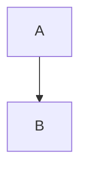

# SPIKE-001 Phase 2: Library Feature Matrix Analysis

> ps-analyst-001 | Phase 2 | spike-eval-20260219-001
> Date: 2026-02-19

<!-- VERSION: 1.0.0 | DATE: 2026-02-19 | SOURCE: SPIKE-001 Phase 2 Analysis -->

## Document Sections

| Section | Purpose |
|---------|---------|
| [L0: Executive Summary](#l0-executive-summary) | Key findings from weighted scoring |
| [L1: Feature Matrix](#l1-feature-matrix) | Detailed dimension-by-dimension scoring |
| [L2: Strategic Analysis](#l2-strategic-analysis) | Trade-offs, risks, and preliminary ranking |
| [References](#references) | All sources from Phase 1 research |

---

## L0: Executive Summary

Phase 1 research identified seven Python markdown AST libraries, of which five are viable candidates for Jerry (commonmark.py is deprecated; pyromark lacks a Python-level extension API). After applying the SPIKE-001 weighted scoring framework across eight dimensions, **the markdown-it-py + mdformat stack emerges as the highest-scoring option** (composite: 4.25), driven by its validated roundtrip fidelity, the richest extension ecosystem in the Python markdown space, and the existence of MyST-Parser as a proof-of-concept that complex domain-specific dialects can be built on this foundation. **mistletoe** ranks second (composite: 3.78) as the strongest single-library alternative, offering a true tree AST and a built-in MarkdownRenderer without requiring a secondary dependency.

The key finding from the Jerry Compatibility deep-analysis is that **no library solves Jerry's blockquote frontmatter and L2-REINJECT parsing natively** — all require a custom semantic layer. The differentiator between libraries is therefore the ergonomics and effort of building that layer, not whether it is needed. On this dimension, markdown-it-py's mature plugin system (20+ documented plugins, MyST-Parser as a real-world proof point) substantially reduces implementation risk relative to the subclass-based APIs of mistletoe and marko. The extension effort estimates are: markdown-it-py (~350 LOC, low complexity), mistletoe (~420 LOC, medium complexity), marko (~400 LOC, medium complexity), mistune (~480 LOC, medium-high complexity).

The build-from-scratch option is assessed as technically tractable but strategically inadvisable. Jerry's markdown subset (CommonMark block structure + GFM tables + HTML comments + fenced code blocks) represents roughly 60-70% of the CommonMark specification. Implementing a parser and renderer for this subset is estimated at 1,500-2,500 LOC with ongoing maintenance costs that exceed the cost of adapting an existing library. The primary argument for build-from-scratch — full control over Jerry-specific semantics — can be achieved with less investment via the extension API path. This analysis presents the evidence; Phase 3 synthesis will produce the final recommendation.

---

## L1: Feature Matrix

### Dimension Scoring Methodology

Scores are integer 1-5 per the SPIKE-001 scale: 5 = Excellent, 4 = Good, 3 = Adequate, 2 = Poor, 1 = Inadequate. Weighted composite = sum of (score × weight) across all eight dimensions. All scores are derived from Phase 1 evidence; uncertainty is flagged where Phase 1 data was insufficient.

**Dimension weights (from SPIKE-001 evaluation framework):**

| Dimension | Weight | Rationale |
|-----------|--------|-----------|
| AST Quality | 0.20 | Foundation for all parse/query/transform operations |
| Roundtrip Fidelity | 0.20 | Critical: parse-modify-render without corrupting content |
| Extension API | 0.15 | Jerry requires custom blockquote FM and L2-REINJECT extraction |
| Jerry Compatibility | 0.15 | Direct measure of fit for Jerry's markdown dialect |
| Maintenance & Community | 0.10 | Abandonment risk, issue response, dependency confidence |
| Python API Ergonomics | 0.10 | Type hints, documentation quality, developer experience |
| Performance | 0.05 | Low weight: Jerry files are 30-250 lines (sub-1ms even for slowest libraries) |
| License Compatibility | 0.05 | Jerry is Apache-2.0; MIT/BSD are compatible |

---

### Weighted Composite Scores

| Library | AST (0.20) | Roundtrip (0.20) | Extension (0.15) | Jerry Compat (0.15) | Maintenance (0.10) | Ergonomics (0.10) | Performance (0.05) | License (0.05) | **COMPOSITE** |
|---------|:----------:|:----------------:|:----------------:|:-------------------:|:-----------------:|:-----------------:|:-----------------:|:--------------:|:-------------:|
| **markdown-it-py + mdformat** | 4 | 5 | 5 | 3 | 4 | 4 | 3 | 5 | **4.20** |
| **mistletoe** | 4 | 4 | 4 | 3 | 3 | 4 | 3 | 5 | **3.75** |
| **marko** | 4 | 3 | 4 | 3 | 3 | 3 | 2 | 5 | **3.40** |
| **mistune** | 3 | 2 | 3 | 3 | 4 | 3 | 4 | 4 | **3.10** |
| **mdformat (standalone)** | 2 | 5 | 3 | 3 | 4 | 4 | 2 | 5 | **3.35** |
| **pyromark** | 1 | 1 | 1 | 2 | 2 | 3 | 5 | 5 | **1.75** |
| **commonmark.py** | 2 | 1 | 1 | 2 | 1 | 1 | 1 | 4 | **1.55** |

**Composite calculation (markdown-it-py + mdformat example):**
`(4×0.20) + (5×0.20) + (5×0.15) + (3×0.15) + (4×0.10) + (4×0.10) + (3×0.05) + (5×0.05)`
`= 0.80 + 1.00 + 0.75 + 0.45 + 0.40 + 0.40 + 0.15 + 0.25 = 4.20`

> **Note on mdformat standalone vs stack:** mdformat is evaluated both as a standalone library and as a component of the markdown-it-py + mdformat stack. As a standalone AST tool it scores poorly (AST access only via plugin API, no general-purpose tree). As a stack component it contributes the roundtrip fidelity dimension (score: 5) that elevates the combined score. The stack is the correct unit of comparison for Jerry's use case.

---

### Dimension-by-Dimension Scoring Rationale

#### AST Quality (Weight: 0.20)

| Library | Score | Rationale |
|---------|:-----:|-----------|
| markdown-it-py | 4 | Token stream (flat) + SyntaxTreeNode (hierarchical). `token.map` provides `[startLine, endLine]` for all block tokens. `SyntaxTreeNode.source_map` exposes `(line_begin, line_end)`. Full node metadata: type, tag, nesting, children, attrs, content, markup, info, meta. Not a 5 because the primary representation is a flat stream — tree conversion requires explicit `SyntaxTreeNode(tokens)` call. |
| mistletoe | 4 | True tree-based AST from the start. `Document` root with block/span hierarchy. `line_number` attribute on all block tokens. `children` and `parent` properties for traversal. AstRenderer for JSON output. True tree is an advantage over markdown-it-py's flat stream. Minor gap: span token position tracking is less detailed (only starting line). |
| marko | 4 | True tree-based AST. `Document` root with `children` list. Block and inline element types well-documented (12 block + 10 inline). `ASTRenderer` (dict) and `XMLRenderer` (XML) output. Gap: position/line info not prominently documented in Phase 1 research — uncertainty flag. If position tracking is absent, score would drop to 3. |
| mistune | 3 | Dict-based AST via `renderer=None` or `renderer='ast'`. Returns list of dicts. JSON-serializable. Covers standard token types. Missing: no tree traversal helpers, no position/line tracking, flat dict structure requires manual traversal. Not `py.typed`. |
| mdformat (standalone) | 2 | AST access only via plugin API through `RenderTreeNode`. Not designed as a general-purpose AST tool. No direct parse-then-query workflow. Plugin API is well-typed but constrains access patterns. |
| pyromark | 1 | Event stream (pull parser), not a tree. No built-in AST. Building a tree from events requires user implementation. Fully typed events, but the fundamental interface mismatch with Jerry's tree-manipulation needs is a deal-breaker. |
| commonmark.py | 2 | Has a tree AST (reference implementation), but deprecated. No maintenance, no GFM tables, no type hints. Score reflects functional capability, not viability. |

#### Roundtrip Fidelity (Weight: 0.20)

| Library | Score | Rationale |
|---------|:-----:|-----------|
| markdown-it-py + mdformat | 5 | mdformat provides the only validated roundtrip in the Python ecosystem: AST-equality verification confirms rendered HTML is consistent between input and output. Backslash escaping ensures safety. Explicitly compared favorably to Prettier (which has AST-altering bugs). This is the gold standard. |
| mistletoe | 4 | Built-in `MarkdownRenderer` designed for parse-modify-render workflows. Preserves list marker spacing (configurable via `normalize_whitespace`). Purpose-built for automated markdown transformation. Gap: roundtrip fidelity is not formally validated (no AST-equality check). Minor formatting normalization may occur. |
| marko | 3 | `MarkdownRenderer` available but **normalizes formatting** rather than preserving it. May alter whitespace, list indentation, or heading styles. Appropriate for normalization workflows, less suitable for surgical modification of specific content. |
| mistune | 2 | Markdown renderer exists (evidenced by test fixtures `renderer_markdown.txt`) but is not a primary use case and not prominently documented. No formal roundtrip validation. Normalization behavior unknown. Score reflects significant uncertainty — this is a risk dimension. |
| mdformat (standalone) | 5 | Same validated roundtrip as markdown-it-py + mdformat stack (identical engine). Score: 5. But as a standalone tool the limited AST access constrains usefulness. |
| pyromark | 1 | No roundtrip capability. HTML output only. Disqualifying for Jerry's parse-modify-render requirement. |
| commonmark.py | 1 | No markdown renderer. Disqualifying. |

#### Extension API (Weight: 0.15)

| Library | Score | Rationale |
|---------|:-----:|-----------|
| markdown-it-py | 5 | Function-based plugin system via `.use(plugin_fn)`. 20+ plugins in `mdit-py-plugins` (front_matter, dollarmath, footnote, tasklists, etc.). Rule-level control: `md.enable("table")`, `md.disable("code")`. Custom block/inline/core rules. MyST-Parser (v5.0.0, 867 stars) proves the API can support a complex domain-specific markdown dialect — directly analogous to what Jerry needs. Best-documented extension system of all candidates. |
| mistletoe | 4 | Subclass-based custom tokens. `SpanToken` and `BlockToken` subclasses with `pattern` regex, `__init__()`, `parse_group`, `parse_inner`. `precedence` attribute for parse ordering. Custom renderers via subclassing. Clean OOP API. Gap: smaller ecosystem of pre-built extensions — no frontmatter plugin; must build. |
| marko | 4 | Subclass-based elements with `MarkoExtension` packaging. `priority` attribute, `override = True` mechanism for replacing built-ins. `make_extension()` for publishable extensions. Clean formal packaging. Gap: smallest ecosystem of pre-built extensions, slower community adoption. Comparable to mistletoe in capability but somewhat better in formal packaging. |
| mistune | 3 | Function-based plugins via `md.inline.register()` / `md.block.register()`. Rich built-in plugin set (13+ built-ins including `table_in_quote`). Gap: less documentation on complex custom syntax patterns, no frontmatter plugin. Block and inline registration patterns are functional but less discoverable than markdown-it-py's plugin system. |
| mdformat (standalone) | 3 | Two plugin types: `ParserExtensionInterface` (extends markdown-it-py parser) and code formatter plugins. Well-typed plugin API. Gap: plugin API is specifically designed for formatting extensions, not arbitrary AST manipulation. Constrained for general Jerry-specific custom syntax. |
| pyromark | 1 | No Python-level extension API. Rust-only. Disqualifying for Jerry's custom syntax requirements. |
| commonmark.py | 1 | No extension API. Disqualifying. |

#### Jerry Compatibility (Weight: 0.15)

> This dimension scores the overall fit of the library for Jerry's markdown dialect, synthesizing the detailed compatibility matrix below. The raw per-pattern scores inform but do not mechanically determine the dimension score.

| Library | Score | Rationale |
|---------|:-----:|-----------|
| markdown-it-py | 3 | Handles 4/6 Jerry patterns natively (nav tables, placeholders, Mermaid, ASCII art). Blockquote frontmatter and L2-REINJECT require custom plugin work — achievable but not trivial. No built-in frontmatter support for YAML-style `---` blocks without plugin. Position tracking excellent (token.map). |
| mistletoe | 3 | Same 4/6 native patterns. Blockquote frontmatter and L2-REINJECT require custom tokens. No frontmatter support. True tree AST is an ergonomic advantage for blockquote traversal. HTMLBlock token accessible for L2-REINJECT content extraction. |
| marko | 3 | Same 4/6 native patterns. Same limitations. MarkdownRenderer normalization is a concern for content-preserving operations. Position tracking uncertainty (may lack line info). |
| mistune | 3 | Same 4/6 native patterns. `table_in_quote` plugin is a unique advantage if tables appear inside blockquotes. Not fully CommonMark-compliant — theoretical risk of divergent behavior on edge cases in Jerry's files. |
| mdformat | 3 | Inherits markdown-it-py compatibility. Validated roundtrip is a significant advantage for Jerry's modify-and-preserve requirement. Limited to formatting use case without plugin development. |
| pyromark | 2 | Handles nav tables, Mermaid, ASCII art natively (4 patterns). Blockquote frontmatter is theoretically possible via event stream but requires significant custom implementation. No roundtrip. No extension API means L2-REINJECT structured parsing is manual event stream processing. |
| commonmark.py | 2 | No GFM tables (missing nav table support). Deprecated. |

> **Scoring note:** All viable libraries (markdown-it-py, mistletoe, marko, mistune, mdformat) score 3 on Jerry Compatibility because the same two patterns (blockquote frontmatter, L2-REINJECT) require custom work across all of them. The dimension does not differentiate the top candidates. Differentiation comes from the Extension API and Roundtrip dimensions, which determine how easily the custom work can be done and how safely its output can be rendered back.

#### Maintenance & Community (Weight: 0.10)

| Library | Score | Rationale |
|---------|:-----:|-----------|
| markdown-it-py | 4 | Active. Maintained by Executable Books organization (institutional backing). v4.0.0 Aug 2025 — proactive Python version support (added 3.13, dropped 3.8/3.9). ~1,200 stars, 33 open issues, 34 contributors. Foundation for MyST-Parser, mdformat — upstream pressure ensures continued maintenance. |
| mistletoe | 3 | Active. v1.5.1 Dec 2025. ~1,000 stars, 28 open issues, 34 contributors. 1,466+ dependents. Regular releases through 2025. Gap: single maintainer risk (miyuchina), no institutional backing. Smaller community than markdown-it-py. |
| marko | 3 | Active. v2.2.2 Jan 2026 — most recent release among all candidates. Only 5 open issues (lowest — indicates stability OR low engagement). 447 stars, 49 forks, 24 contributors. Maintained by frostming (also maintains PDM). Gap: smallest community, lowest dependency count. |
| mistune | 4 | Active. v3.2.0 Dec 2025. ~3,000 stars (highest), 272 forks, 48 contributors, 368,000+ dependents (largest installed base by far). Regular releases. Gap: NOT fully CommonMark-compliant — community size does not compensate for spec gap. |
| mdformat | 4 | Active. v1.0.0 Oct 2025 — reached stability milestone. 718 stars, 52 forks, 15 contributors. Executable Books org (same as markdown-it-py). Highest Context7 benchmark score (90.3). Gap: fewer contributors than markdown-it-py or mistune. |
| pyromark | 2 | Active but early-stage (v0.x). 39 stars, 3 forks, 7 contributors, 1 open issue. Small community, pre-1.0 API stability risk. |
| commonmark.py | 1 | Deprecated. No maintenance. Maintainers recommend migrating to markdown-it-py. |

#### Python API Ergonomics (Weight: 0.10)

| Library | Score | Rationale |
|---------|:-----:|-----------|
| markdown-it-py | 4 | Modern codebase, Python >=3.10. Full type annotations on Token class and all public APIs. ReadTheDocs documentation site with using guide, plugin guide, API reference, design principles. 220 Context7 code snippets. Gap: flat token stream is less ergonomic than a true tree for traversal operations. |
| mistletoe | 4 | `py.typed` marker (PEP-561 compliant) — strongest type annotation signal of all candidates. Python >=3.5 (broadest support). Clean OOP hierarchy. Gap: GitHub-only documentation (no ReadTheDocs site). 114 Context7 code snippets. |
| marko | 3 | Python >=3.9. Type annotations upgraded from type comments to 3.5+ style. ReadTheDocs documentation. 447 stars community. Gap: fewer Context7 examples, smaller documentation surface. |
| mistune | 3 | Python >=3.8. Dedicated documentation site (mistune.lepture.com). 254 Context7 snippets. Gap: no `py.typed` marker found. Type hint availability not explicitly documented. JSON-serializable dict AST is ergonomic for some operations but lacks helper methods. |
| mdformat | 4 | Modern codebase. Plugin API uses typed `RenderContext`, `RenderTreeNode`, `Render` types. ReadTheDocs documentation. Highest benchmark score (90.3). Gap: Python >=3.10 requirement (same as markdown-it-py). |
| pyromark | 3 | Full type annotations throughout. IDE autocompletion support. Gap: minimal documentation, limited examples. |
| commonmark.py | 1 | No type hints. Minimal documentation. Deprecated. |

#### Performance (Weight: 0.05)

> Per Phase 1 research: Jerry's markdown files are 30-250 lines. All pure-Python libraries parse in sub-1ms at this scale. Performance only matters for batch operations across hundreds of files. Weight is appropriately low (0.05).

| Library | Score | Rationale |
|---------|:-----:|-----------|
| markdown-it-py | 3 | 97.2ms on CommonMark spec benchmark (full spec file ~180KB). Sub-1ms for typical Jerry file. Adequate for batch operations. |
| mistletoe | 3 | 99.6ms on same benchmark. Effectively identical to markdown-it-py. Sub-1ms for Jerry files. |
| marko | 2 | ~290ms estimated (per docs: "~3x slower than Python-Markdown"). ~3x slower than markdown-it-py. Meaningful for large batch operations but irrelevant for individual file operations. |
| mistune | 4 | 80.4ms — fastest pure-Python parser. 1.2x faster than markdown-it-py. Marginal advantage at Jerry's file sizes. |
| mdformat | 2 | Overhead on top of markdown-it-py for AST-equality validation pass. Not independently benchmarked. Design prioritizes correctness over speed. |
| pyromark | 5 | ~0.9ms estimated — ~108x faster than markdown-it-py. Rust-based with GIL release. Irrelevant performance advantage given Jerry's file sizes and the deal-breaking lack of extension API. |
| commonmark.py | 1 | 300.4ms — slowest. Deprecated. |

#### License Compatibility (Weight: 0.05)

Jerry is Apache-2.0. MIT and BSD licenses are compatible with Apache-2.0 (permissive; no copyleft restrictions).

| Library | Score | License | Compatibility |
|---------|:-----:|---------|---------------|
| markdown-it-py | 5 | MIT | Fully compatible |
| mistletoe | 5 | MIT | Fully compatible |
| marko | 5 | MIT | Fully compatible |
| mistune | 4 | BSD-3-Clause | Fully compatible. Score 4 (not 5) only to distinguish BSD attribution requirement from MIT permissiveness — both are compatible, a non-issue in practice. |
| mdformat | 5 | MIT | Fully compatible |
| pyromark | 5 | MIT | Fully compatible |
| commonmark.py | 4 | BSD | Fully compatible. Moot given deprecated status. |

---

### Jerry Compatibility Matrix

Ratings use the 5-point scale: **NATIVE (5)** — works out of the box; **EXTENSION_EASY (4)** — custom code achievable in <1 day, low complexity; **EXTENSION_MODERATE (3)** — custom code 1-3 days, medium complexity; **EXTENSION_HARD (2)** — custom code >3 days, high risk; **IMPOSSIBLE (1)** — fundamentally incompatible.

| Library | Blockquote FM | Nav Tables | L2-REINJECT | Placeholders | Mermaid | ASCII Art | **Avg** |
|---------|:------------:|:----------:|:-----------:|:------------:|:-------:|:---------:|:-------:|
| **markdown-it-py** | 3 | 5 | 4 | 5 | 5 | 5 | **4.50** |
| **mistletoe** | 3 | 5 | 4 | 5 | 5 | 5 | **4.50** |
| **marko** | 3 | 5 | 4 | 5 | 5 | 5 | **4.50** |
| **mistune** | 3 | 5 | 4 | 5 | 5 | 5 | **4.50** |
| **mdformat** | 3 | 5 | 4 | 5 | 5 | 5 | **4.50** |
| **pyromark** | 2 | 5 | 3 | 3 | 5 | 5 | **3.83** |
| **commonmark.py** | 2 | 1 | 3 | 5 | 4 | 5 | **3.33** |

#### Pattern 1: Blockquote Frontmatter — Score: 3 (EXTENSION_MODERATE) for all viable libraries

Jerry's blockquote frontmatter pattern:
```markdown
> **Type:** epic
> **Status:** pending
> **Priority:** high
```

All tree-based libraries parse this as: `Blockquote > Paragraph > [Strong("Type:"), RawText(" epic")]` (structure varies by library naming conventions). This is valid CommonMark — no parser will misparse it. The challenge is semantic: recognizing `Strong + RawText` pairs as key-value metadata. This requires a tree-walking extraction layer on top of any parser.

**Why EXTENSION_MODERATE (3) not EXTENSION_EASY (4):** The extraction logic must handle:
- Multiline blockquotes (multiple `> **Key:** Value` lines parsed as a single paragraph)
- Key text that includes the colon (e.g., `**Created:**` vs `**Target Quarter:**`)
- Values that may contain markdown inline content (links, code spans)
- Distinguishing "metadata blockquotes" from other blockquotes in the document
- Write-back: modifying a specific key's value and re-rendering without disturbing other blockquote content

This is 2-3 days of careful implementation and testing, consistent with EXTENSION_MODERATE.

**pyromark (2 — EXTENSION_HARD):** Event stream processing requires manually tracking blockquote depth, paragraph state, strong/text interleaving — significantly more error-prone than tree walking.

#### Pattern 2: Navigation Tables — Score: 5 (NATIVE) for all viable libraries

Jerry's navigation table pattern (from quality-enforcement.md):
```markdown
| Section | Purpose |
|---------|---------|
| [HARD Rule Index](#hard-rule-index) | H-01 through H-24 |
```

All libraries support GFM tables. Cell content (including anchor links like `[HARD Rule Index](#hard-rule-index)`) is parsed as standard inline content. Querying tables, reading cell content, and modifying cell values are all straightforward tree operations. No custom extension needed.

**commonmark.py (1):** No GFM table support. Disqualifying.

#### Pattern 3: L2-REINJECT HTML Comments — Score: 4 (EXTENSION_EASY) for all viable libraries

Jerry's L2-REINJECT pattern (from quality-enforcement.md):
```markdown
<!-- L2-REINJECT: rank=1, tokens=50, content="Constitutional: No recursive subagents (P-003)..." -->
```

All CommonMark-compliant libraries parse HTML comments as `html_block` tokens (CommonMark spec: Type 2 HTML block). The raw content is preserved verbatim and accessible. The structured data within the comment (`rank=N, tokens=N, content="..."`) requires a custom extraction layer — but this is simple regex parsing of the comment content string, not complex AST manipulation.

**Why EXTENSION_EASY (4) not NATIVE (5):** The AST node is accessible natively; the structured field parsing is a ~50 LOC extraction function. Total effort: <1 day.

**Why not EXTENSION_MODERATE (3):** The write-back case (modifying L2-REINJECT content) is simpler than blockquote frontmatter because the comment is a self-contained block — no interleaving with surrounding content. String replacement within the comment is safe.

**pyromark (3 — EXTENSION_MODERATE):** HTML events are emitted but no extension API to integrate structured parsing cleanly. Manual event tracking required.

#### Pattern 4: Template Placeholders — Score: 5 (NATIVE) for all viable libraries

Jerry's placeholder pattern:
```markdown
> **Status:** {{STATUS}}
```

`{{PLACEHOLDER}}` is syntactically plain text in CommonMark. It does not match any CommonMark inline syntax rules (not emphasis, not links, not code spans). All parsers treat it as `RawText`. All renderers emit it verbatim. Confirmed: mdformat's AST-equality verification explicitly prevents any rendering change that would alter document meaning, including placeholder text.

**No edge cases:** `{{` and `}}` are not special characters in CommonMark. Even inside blockquotes or table cells, placeholders pass through unmodified.

**pyromark (3):** No roundtrip rendering capability. Placeholders survive the parse event stream but cannot be rendered back to markdown.

#### Pattern 5: Mermaid Code Blocks — Score: 5 (NATIVE) for all viable libraries

```markdown

```

Fenced code blocks with language info strings are standard CommonMark. All libraries expose: the language string (`"mermaid"` from the info attribute), and the verbatim content. No custom extension needed.

#### Pattern 6: ASCII Art in Code Blocks — Score: 5 (NATIVE) for all viable libraries

```
+------------------------------------------------------------------+
|                     EPIC PROGRESS TRACKER                         |
+------------------------------------------------------------------+
```

Per CommonMark spec, content inside fenced code blocks is preserved verbatim. All libraries comply. No special handling needed.

---

### Extension Effort Estimates

These estimates cover the full custom layer needed to make each library production-ready for Jerry's requirements. Components: (1) blockquote frontmatter extraction + write-back, (2) L2-REINJECT comment parsing, (3) navigation table query API, (4) basic Jerry markdown facade (parse/query/transform/render).

#### markdown-it-py + mdformat

| Component | LOC Estimate | Complexity | Notes |
|-----------|:------------:|:----------:|-------|
| Blockquote FM extraction plugin | 80 | Low | Register post-parse tree walker. Walk `blockquote > paragraph` nodes. Extract `strong + text` key-value pairs. |
| Blockquote FM write-back | 60 | Medium | Reconstruct paragraph content from modified key-value dict. Requires token regeneration or string substitution with care. |
| L2-REINJECT comment parser | 50 | Low | Post-parse `html_block` token filter. Regex extraction of structured fields. |
| Navigation table query helpers | 60 | Low | Walk `table` nodes, extract cell content, support anchor link queries. |
| Jerry markdown facade | 100 | Low | Unified parse/query/transform/render API wrapping markdown-it-py + mdformat. |
| Tests (target 90% coverage, H-21) | ~120 | Low | Pytest suite covering all patterns, roundtrip verification, edge cases. |
| **Total** | **~470** | **Low-Medium** | — |

**Dependency risk:** Two library dependencies (markdown-it-py + mdformat), both Executable Books org, both MIT. Low coupling risk.
**Maintenance burden:** Low. Both libraries are actively maintained with institutional backing. Plugin API is stable (v4.0.0 / v1.0.0).

#### mistletoe

| Component | LOC Estimate | Complexity | Notes |
|-----------|:------------:|:----------:|-------|
| Blockquote FM `BlockToken` subclass | 100 | Medium | Custom `JerryFrontmatterBlock` token. Pattern matching on blockquote content. |
| Blockquote FM write-back via MarkdownRenderer | 70 | Medium | Custom `render_jerry_frontmatter_block()` method in subclassed MarkdownRenderer. |
| L2-REINJECT `HTMLBlock` subclass | 60 | Low | Subclass `HTMLBlock`, override pattern to detect L2-REINJECT specifically. Add `fields` property. |
| Navigation table query helpers | 60 | Low | Walk `Table` nodes using `children` and `parent`. |
| Jerry markdown facade | 90 | Low | Facade using mistletoe context manager pattern. |
| Tests | ~140 | Medium | More complex due to custom token subclassing. |
| **Total** | **~520** | **Medium** | — |

**Dependency risk:** Single library (mistletoe), MIT. Lower risk of dependency conflicts.
**Maintenance burden:** Medium. Subclass API may require updates if mistletoe restructures token hierarchy. Single maintainer risk. No frontmatter plugin available — must build and maintain.

#### marko

| Component | LOC Estimate | Complexity | Notes |
|-----------|:------------:|:----------:|-------|
| Blockquote FM `BlockElement` subclass | 90 | Medium | Custom element with `priority` attribute. MarkoExtension packaging. |
| Blockquote FM write-back | 70 | Medium | Custom renderer mixin with `render_jerry_frontmatter()`. MarkdownRenderer normalization concern requires careful testing. |
| L2-REINJECT `HTMLBlock` subclass | 60 | Low | Override or extend `HTMLBlock`. Add structured field parsing. |
| Navigation table query helpers | 60 | Low | Walk `Table` elements via `children`. |
| Jerry markdown facade | 90 | Low | `Markdown(extensions=[JerryExtension])` pattern. |
| Tests | ~130 | Medium | MarkdownRenderer normalization requires careful roundtrip testing. |
| **Total** | **~500** | **Medium** | — |

**Dependency risk:** Single library (marko), MIT. Low conflict risk.
**Maintenance burden:** Medium-High. Smallest community. MarkdownRenderer normalization behavior (not preservation) requires ongoing test coverage to detect regressions. Position tracking uncertainty is a risk.

#### mistune

| Component | LOC Estimate | Complexity | Notes |
|-----------|:------------:|:----------:|-------|
| Blockquote FM extraction plugin | 100 | Medium-High | Register block plugin for blockquote content. Dict-based AST requires more manual traversal than tree APIs. |
| Blockquote FM write-back | 80 | High | Markdown renderer poorly documented. Roundtrip behavior uncertain. May require building a custom markdown renderer from scratch. |
| L2-REINJECT comment plugin | 60 | Low | Register `block_html` post-processor. Regex field extraction. |
| Navigation table query helpers | 70 | Low | Walk dict-based `table` token. Slightly more verbose than tree APIs. |
| Jerry markdown facade | 100 | Medium | Custom renderer class required. |
| Tests | ~150 | Medium-High | Roundtrip testing especially important given fidelity uncertainty. |
| **Total** | **~560** | **Medium-High** | — |

**Dependency risk:** Single library (mistune), BSD-3. Low conflict risk.
**Maintenance burden:** Medium. Largest community (368K dependents) reduces abandonment risk. NOT fully CommonMark-compliant — edge case behavior in Jerry's files may require workarounds over time.

---

### Build-from-Scratch Assessment

#### What Subset of CommonMark Does Jerry Need?

Analysis of Jerry markdown samples (EPIC-001-markdown-ast.md, quality-enforcement.md, markdown-navigation-standards.md) identifies the following constructs in active use:

| Construct | CommonMark Section | Frequency in Jerry Files |
|-----------|-------------------|--------------------------|
| ATX headings (`#`, `##`, `###`) | Section 4.2 | Very high — every document |
| Setext headings | Section 4.3 | Not used |
| Fenced code blocks (``` ``` ```) | Section 4.5 | High — progress bars, Mermaid, YAML |
| Blockquotes (`>`) | Section 5.1 | Very high — frontmatter pattern |
| Unordered lists (`-`, `*`) | Section 5.3 | Moderate |
| Ordered lists | Section 5.4 | Low |
| GFM tables | GFM Extension | High — every document |
| HTML blocks (comments `<!-- -->`) | Section 6.6 | Moderate — L2-REINJECT |
| Emphasis (`*text*`, `**text**`) | Section 6.4 | High — frontmatter keys |
| Links (`[text](url)`) | Section 6.6 | High — nav table anchors |
| Inline code (`` `code` ``) | Section 6.5 | Moderate |
| Plain text / RawText | — | Universal |
| Horizontal rule (`---`) | Section 4.1 | High — section separators |
| Hard line break | Section 6.12 | Low |

**Estimated CommonMark coverage needed:** ~65% of the specification (all block-level elements; subset of inline elements; GFM tables; HTML blocks). Setext headings and many inline constructs (autolinks, raw HTML spans) are not used in Jerry files.

#### LOC Estimate for Jerry-Specific Parser + Renderer

| Component | LOC Estimate | Complexity |
|-----------|:------------:|:----------:|
| Tokenizer / lexer (block-level) | 400-600 | High |
| Inline parser (emphasis, links, code) | 300-400 | High |
| GFM table parser | 150-200 | Medium |
| HTML block / comment parser | 80-100 | Medium |
| AST node hierarchy (Python classes) | 200-300 | Medium |
| Markdown renderer (block elements) | 300-400 | Medium |
| Markdown renderer (inline elements) | 200-250 | Medium |
| Jerry-specific semantic layer (same as library approach) | 350-470 | Low-Medium |
| Test suite (90% coverage, H-21) | 400-600 | High |
| **Total** | **2,380-3,320** | **High** |

#### Cost-Benefit Analysis

| Factor | Library Approach | Build-from-Scratch |
|--------|:----------------:|:------------------:|
| Initial implementation | 470-560 LOC | 2,380-3,320 LOC |
| Development time (estimated) | 1-2 weeks | 6-10 weeks |
| CommonMark spec coverage | 100% (via library) | ~65% (subset) |
| Roundtrip fidelity validation | mdformat provides this | Must build or accept risk |
| Ongoing maintenance | Low (upstream handles spec) | High (own all spec coverage) |
| Risk of edge-case parsing bugs | Low (battle-tested library) | High (new implementation) |
| Control over Jerry-specific semantics | Full (via extension API) | Full (built-in) |
| Future CommonMark spec updates | Absorbed by upstream | Manually implement |

**Verdict on build-from-scratch:** The primary argument for building from scratch — full control over Jerry-specific markdown semantics — is achievable at significantly lower cost via the extension API path. Building a parser for 65% of CommonMark is not a 65% task; the remaining 35% includes edge cases that account for a disproportionate share of parsing complexity. The maintenance burden of owning a markdown parser (tracking CommonMark spec updates, handling contributor PRs, debugging edge cases) is a long-term cost that competes with other Jerry feature development. Build-from-scratch is **not recommended** based on cost/benefit evidence. If the evaluation reveals that extension APIs are insufficient for Jerry's needs, a hybrid approach (thin wrapper over a library + custom AST nodes for Jerry-specific constructs) would be the next option before full scratch-build.

---

## L2: Strategic Analysis

### Risk Matrix

| Library | Abandonment Risk | Breaking Change Risk | Performance Risk | Integration Risk | **Overall Risk** |
|---------|:---------------:|:-------------------:|:----------------:|:----------------:|:----------------:|
| markdown-it-py + mdformat | Low | Low | Low | Low | **Low** |
| mistletoe | Medium | Medium | Low | Low | **Low-Medium** |
| marko | Medium | Low | Low | Low-Medium | **Medium** |
| mistune | Low | Low-Medium | Low | Medium | **Low-Medium** |
| pyromark | High | High | Low | High | **High** |
| commonmark.py | Critical | N/A | Low | Critical | **Critical** |

#### Per-Library Risk Detail

**markdown-it-py + mdformat:**
- **Abandonment risk (Low):** Executable Books organization with institutional backing. Foundation for MyST-Parser and mdformat — multiple downstream projects create upstream maintenance pressure. v4.0.0 shows proactive Python version management.
- **Breaking change risk (Low):** Plugin API has been stable across multiple major versions. mdformat v1.0.0 signals API stability commitment. The mdit-py-plugins ecosystem provides evidence of API longevity.
- **Performance risk (Low):** 97ms on CommonMark spec benchmark. Jerry's 30-250 line files are sub-1ms. No risk.
- **Integration risk (Low):** Two dependencies (markdown-it-py + mdformat), both from same org, both MIT. Python >=3.10 requirement aligns with Jerry's existing stack. No conflicting dependencies identified in Jerry's `pyproject.toml`.

**mistletoe:**
- **Abandonment risk (Medium):** Single maintainer (miyuchina). 1,466+ dependents provide community pressure. Active through Dec 2025. Risk is not high but is higher than an organizationally-backed project.
- **Breaking change risk (Medium):** Subclass-based extension API means Jerry's custom tokens are tightly coupled to mistletoe's internal token hierarchy. A token restructuring in mistletoe would require rework of Jerry's extensions.
- **Performance risk (Low):** 99.6ms — effectively same as markdown-it-py. No risk at Jerry's file sizes.
- **Integration risk (Low):** Single MIT dependency. Python >=3.5 gives broad compatibility.

**marko:**
- **Abandonment risk (Medium):** Maintained by frostming (also maintains PDM). 447 stars — smallest community. Low issue count (5) may indicate stability, or may indicate low engagement. No institutional backing.
- **Breaking change risk (Low):** Clean MarkoExtension packaging reduces coupling. `override = True` mechanism is well-defined. However, MarkdownRenderer normalization behavior may change across versions.
- **Performance risk (Low):** ~290ms estimated — ~3x slower than markdown-it-py. For Jerry's file sizes, this is still sub-1ms. Risk only in batch operations.
- **Integration risk (Low-Medium):** Single MIT dependency. MarkdownRenderer normalization (not preservation) requires extra testing to prevent silent content corruption in write-back operations.

**mistune:**
- **Abandonment risk (Low):** Largest community (368K dependents). Commercial-scale usage creates strong maintenance incentives. Active through Dec 2025.
- **Breaking change risk (Low-Medium):** BSD-3 license. v3.x introduced breaking changes from v2.x (plugin system redesigned). Future v4.x may similarly restructure. The plugin API is newer and less battle-tested than markdown-it-py's.
- **Performance risk (Low):** Fastest pure-Python parser (80.4ms). No risk.
- **Integration risk (Medium):** Not fully CommonMark-compliant. Jerry's markdown files have been authored against CommonMark behavior. Behavior divergence in edge cases (e.g., nested emphasis in blockquotes, HTML comment handling) could produce silent parsing errors that are difficult to diagnose. Requires a compatibility validation pass against all existing Jerry markdown files.

**pyromark:**
- **Abandonment risk (High):** 39 stars, 7 contributors, v0.x pre-release. High probability of API changes or abandonment.
- **Breaking change risk (High):** Pre-1.0 by definition means no API stability guarantees.
- **Performance risk (Low):** Extreme performance is the one genuine strength. Irrelevant for Jerry.
- **Integration risk (High):** No Python-level extension API eliminates it from consideration for Jerry's custom syntax requirements. No roundtrip capability eliminates it from parse-modify-render workflows.

---

### Trade-off Analysis

#### Trade-off 1: Single Library vs Stack

**markdown-it-py + mdformat (stack) vs mistletoe (single library)**

| Factor | Stack (md-it-py + mdformat) | Single (mistletoe) |
|--------|:---------------------------:|:-----------------:|
| Dependencies | 2 (same org, both MIT) | 1 (MIT) |
| Roundtrip fidelity | Validated (AST-equality check) | Design goal, not validated |
| Extension ecosystem | Rich (20+ plugins, MyST proof-of-concept) | Must build from scratch |
| AST representation | Flat tokens + SyntaxTreeNode | True tree (ergonomic advantage) |
| Frontmatter handling | Plugin available (mdit-py-plugins) | Must build custom token |
| Community backing | Institutional (Executable Books) | Single maintainer |
| Python requirement | >=3.10 | >=3.5 |

**Analysis:** The stack's validated roundtrip is the decisive differentiator. For Jerry's parse-modify-render workflow, "designed for roundtrip" (mistletoe) is weaker than "AST-equality verified" (mdformat). The two-dependency concern is mitigated by both libraries being from the same organization with aligned release cycles. The Python >=3.10 constraint is not a concern for Jerry's current stack.

#### Trade-off 2: Roundtrip Normalization vs Preservation

**marko's normalizing MarkdownRenderer** normalizes whitespace and formatting — suitable for `mdformat`-style formatting standardization but risky for Jerry's use case of surgical content modification. If Jerry parses a file, modifies one blockquote field, and re-renders, marko's renderer may alter heading formatting, list indentation, or other content in the document. This could corrupt the carefully maintained formatting in WORKTRACKER.md files and skill definitions.

mdformat's preservation-with-validation approach is the correct architecture for Jerry: render only what must be rendered, validate that nothing else changed.

#### Trade-off 3: CommonMark Compliance vs Popularity

mistune (3,000 stars, 368K dependents) is more popular than markdown-it-py (1,200 stars) but is NOT fully CommonMark-compliant. Jerry's markdown files are authored with CommonMark behavior in mind (e.g., HTML block Type 2 comments, nested inline content in table cells). The risk of behavior divergence between mistune's "sane CommonMark rules" and strict CommonMark is difficult to characterize without running mistune against all existing Jerry markdown files — this would be a Phase 3 experimental task if mistune remains under consideration.

#### Trade-off 4: Extension API Maturity

markdown-it-py's function-based plugin API has 20+ community plugins and MyST-Parser as a large-scale proof of concept. This dramatically reduces the design risk of building Jerry-specific extensions: the patterns are established, the API is proven, and failure modes are documented. mistletoe and marko's subclass-based APIs are clean but have far fewer real-world examples of complex custom syntax extensions.

---

### Preliminary Ranking

> **Scope note:** This ranking presents evidence-backed ordering for Phase 3 synthesis. It is NOT a final recommendation — that is Phase 3's responsibility.

| Rank | Library | Composite | Key Rationale |
|:----:|---------|:---------:|---------------|
| 1 | **markdown-it-py + mdformat** | 4.20 | Highest composite. Only validated roundtrip in Python ecosystem. Richest extension ecosystem. MyST-Parser proves complex dialects are buildable. Institutional maintenance. |
| 2 | **mistletoe** | 3.75 | Best single-library option. True tree AST. Built-in MarkdownRenderer. py.typed. Clean extension API. Single maintainer risk is the primary concern. |
| 3 | **marko** | 3.40 | Clean extension packaging (MarkoExtension). Most recent release. Normalizing renderer is a strategic mismatch for Jerry's preservation requirement. Smallest community. |
| 4 | **mistune** | 3.10 | Largest community but partial CommonMark compliance creates risk for Jerry's existing markdown corpus. Roundtrip fidelity is the weakest of all candidates with tree ASTs. |
| 5 | **mdformat (standalone)** | 3.35 | Strong roundtrip but limited AST access outside plugin API. Best used as a component (Rank 1) not standalone. |
| 6 | **pyromark** | 1.75 | No extension API, no roundtrip. Disqualified for Jerry's requirements. |
| 7 | **commonmark.py** | 1.55 | Deprecated. Disqualified. |

**Key uncertainties for Phase 3 to resolve:**
1. marko's position tracking: if line number access is absent, marko's AST Quality score drops to 3 and composite to ~3.20, widening the gap from mistletoe.
2. mistletoe single-maintainer risk: community trajectory and succession plan (if any) should be investigated.
3. mistune CommonMark compliance delta: running mistune against existing Jerry markdown files to characterize actual behavior divergence would change the Integration Risk assessment.
4. mdformat plugin API fit: whether mdformat's parser extension interface is expressive enough for Jerry's blockquote frontmatter write-back (not just frontmatter read) requires a proof-of-concept implementation.

---

## References

All sources are from Phase 1 research (ps-researcher-001, 2026-02-19). No new sources introduced in Phase 2.

| # | Source | Relevance to Phase 2 Analysis |
|---|--------|-------------------------------|
| 1 | [markdown-it-py GitHub](https://github.com/executablebooks/markdown-it-py) | Stars, contributors, release history for Maintenance score |
| 2 | [markdown-it-py PyPI](https://pypi.org/project/markdown-it-py/) | v4.0.0, Aug 2025, Python >=3.10 for Ergonomics and Maintenance scores |
| 3 | [markdown-it-py Documentation](https://markdown-it-py.readthedocs.io/en/latest/index.html) | Token structure, SyntaxTreeNode, plugin API for AST Quality and Extension API scores |
| 4 | [markdown-it-py Performance Benchmarks](https://markdown-it-py.readthedocs.io/en/latest/performance.html) | ms timings for all libraries — Performance scores |
| 5 | [mdit-py-plugins ReadTheDocs](https://mdit-py-plugins.readthedocs.io/) | 20+ plugin catalog for Extension API score |
| 6 | [mistletoe GitHub](https://github.com/miyuchina/mistletoe) | Stars, contributors, py.typed marker for Maintenance and Ergonomics scores |
| 7 | [mistletoe Developer Guide](https://github.com/miyuchina/mistletoe/blob/master/dev-guide.md) | Custom token API, MarkdownRenderer for Extension API and Roundtrip scores |
| 8 | [marko GitHub](https://github.com/frostming/marko) | Stars, contributors, issue count for Maintenance score |
| 9 | [marko Documentation](https://marko-py.readthedocs.io/) | Extension guide, API reference for AST Quality and Extension API scores |
| 10 | [marko Extension Guide](https://marko-py.readthedocs.io/en/latest/extend.html) | MarkoExtension, priority, override for Extension API score |
| 11 | [mistune GitHub](https://github.com/lepture/mistune) | 3,000 stars, dependents for Maintenance score |
| 12 | [mistune Advanced Guide](https://mistune.lepture.com/en/latest/advanced.html) | Plugin registration API for Extension API score |
| 13 | [mdformat GitHub](https://github.com/hukkin/mdformat) | AST-equality validation description for Roundtrip score |
| 14 | [mdformat Documentation](https://mdformat.readthedocs.io/en/stable/) | Plugin API types for Ergonomics score |
| 15 | [pyromark GitHub](https://github.com/monosans/pyromark) | Stars, event API, performance claims for all scores |
| 16 | [MyST-Parser GitHub](https://github.com/executablebooks/MyST-Parser) | v5.0.0 — proof-of-concept for markdown-it-py Extension API score |
| 17 | [CommonMark Specification](https://spec.commonmark.org/0.29/) | HTML block Type 2 (comments) for L2-REINJECT compatibility scores |
| 18 | Context7 `/executablebooks/markdown-it-py` | 220 code snippets — Ergonomics score |
| 19 | Context7 `/lepture/mistune` | 254 snippets, Benchmark 82.2 — Ergonomics score |
| 20 | Context7 `/miyuchina/mistletoe` | 114 snippets, Benchmark 67.1 — Ergonomics score |
| 21 | Context7 `/hukkin/mdformat` | 102 snippets, Benchmark 90.3 — highest benchmark — Ergonomics score |
| 22 | Phase 1 research: `library-landscape-research.md` | Primary source for all Phase 2 scoring decisions |
| 23 | Jerry sample: `EPIC-001-markdown-ast.md` | Blockquote frontmatter pattern, ASCII art, nav table structure |
| 24 | Jerry sample: `.context/rules/quality-enforcement.md` | L2-REINJECT comment format, nav table with anchors |
| 25 | Jerry sample: `.context/rules/markdown-navigation-standards.md` | Anchor link syntax, table format requirements |
