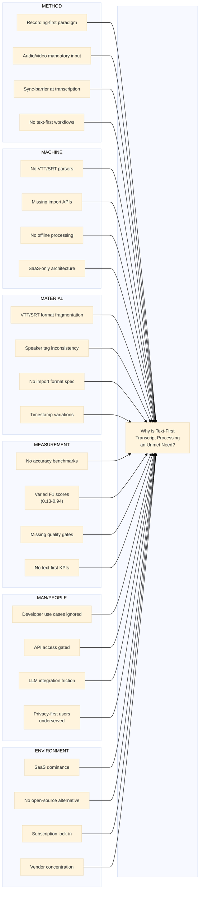

# Ishikawa Root Cause Analysis: Text-First Transcript Processing Gap

> **Analysis ID**: PROJ-008-e-003
> **Date**: 2026-01-25
> **Analyst**: ps-analyst agent
> **Analysis Type**: Root Cause Analysis (Ishikawa/Fishbone)
> **Problem Statement**: Why is text-first transcript processing an unmet need in the market?

---

## L0: Executive Summary (ELI5)

### The Simple Explanation

Imagine you have a written record of an important conversation (like meeting notes typed out). You want a smart tool to help you find the action items, decisions, and key topics. But here's the problem:

**Every tool today says: "First, record a video call with me, THEN I'll help you."**

That's like a librarian saying they can only help you if you write your book in front of them - they won't read books you've already written!

### Why Does This Gap Exist?

1. **Wrong Starting Point** - All tools started as "recording assistants" first, not "text analyzers"
2. **Missing Puzzle Pieces** - Nobody built the code to read transcript files (VTT/SRT format)
3. **Different Formats** - Transcript files come in many slightly different styles
4. **Business Model Conflict** - Companies make money from recording subscriptions, not file analysis
5. **Too Focused on Live Meetings** - Everyone assumed transcripts only come from live calls

### What This Means

There are millions of transcripts sitting unused because no tool can process them directly. This creates a clear opportunity for a skill that starts with the text file, not the recording.

---

## L1: Technical Analysis

### ASCII Fishbone Diagram

```
                                          PROBLEM STATEMENT
                                                 │
    ┌────────────────────────────────────────────┼────────────────────────────────────────────┐
    │                                            │                                            │
    │  ┌─────────────────────────────────────────┴─────────────────────────────────────────┐ │
    │  │                                                                                    │ │
    │  │         WHY IS TEXT-FIRST TRANSCRIPT PROCESSING AN UNMET NEED?                    │ │
    │  │                                                                                    │ │
    │  └─────────────────────────────────────────┬─────────────────────────────────────────┘ │
    │                                            │                                            │
    ├────────────────────────────────────────────┼────────────────────────────────────────────┤
    │                                            │                                            │
    │   METHOD                                   │                                MACHINE     │
    │   ══════                                   │                                ═══════     │
    │                                            │                                            │
    │   ┌─ Recording-first paradigm ─────────────┼────────────── No VTT/SRT parsers ─┐       │
    │   │                                        │                                    │       │
    │   ├─ Audio/video as mandatory input ───────┼─────────── Missing import APIs ───┤       │
    │   │                                        │                                    │       │
    │   ├─ Sync-barrier at transcription ────────┼─────── No offline processing ─────┤       │
    │   │                                        │                                    │       │
    │   └─ No text-first workflows ──────────────┼───── SaaS-only architecture ──────┘       │
    │                                            │                                            │
    │                                            │                                            │
    │   MATERIAL                                 │                            MEASUREMENT     │
    │   ════════                                 │                            ═══════════     │
    │                                            │                                            │
    │   ┌─ VTT/SRT format fragmentation ─────────┼─────────── No accuracy benchmarks ─┐      │
    │   │                                        │                                     │      │
    │   ├─ Speaker tag inconsistency ────────────┼────────── Varied F1 scores ────────┤      │
    │   │                                        │         (0.13-0.94 action items)    │      │
    │   ├─ No import format specification ───────┼───────── Missing quality gates ────┤      │
    │   │                                        │                                     │      │
    │   └─ Timestamp format variations ──────────┼────── No text-first KPIs ──────────┘      │
    │                                            │                                            │
    │                                            │                                            │
    │   MAN/PEOPLE                               │                            ENVIRONMENT     │
    │   ══════════                               │                            ═══════════     │
    │                                            │                                            │
    │   ┌─ Developer use cases ignored ──────────┼─────────── SaaS dominance ─────────┐      │
    │   │                                        │                                     │      │
    │   ├─ API access gated/enterprise-only ─────┼───────── No open-source tools ─────┤      │
    │   │                                        │                                     │      │
    │   ├─ LLM integration friction ─────────────┼────── Subscription lock-in ────────┤      │
    │   │                                        │                                     │      │
    │   └─ Privacy-first users underserved ──────┼────── Vendor concentration ────────┘      │
    │                                            │                                            │
    └────────────────────────────────────────────┴────────────────────────────────────────────┘
```

### Root Cause Categories

#### 1. METHOD (Process/Procedure Causes)

| Root Cause | Evidence | Impact | Source |
|------------|----------|--------|--------|
| Recording-first paradigm | All 5 competitors (Pocket, Otter, Fireflies, Grain, tl;dv) require audio/video as primary input | Blocks text-first workflows entirely | FEATURE-MATRIX.md |
| Audio/video mandatory input | "No competitor supports VTT/SRT import for processing existing transcripts" | Existing transcripts cannot be analyzed | FEATURE-MATRIX.md |
| Sync-barrier at transcription | Platforms force users through live recording or file upload (audio) before any analysis | Adds unnecessary friction for pre-transcribed content | All product analyses |
| No text-first workflows | Product architectures assume transcript generation, not import | Fundamental design prevents text input | FEATURE-MATRIX.md |

**Root Cause Chain (Method)**:
```
Recording-first paradigm
        │
        ▼
Audio/video mandatory ──► Sync-barrier ──► No text-first workflows
```

#### 2. MACHINE (Technology/Equipment Causes)

| Root Cause | Evidence | Impact | Source |
|------------|----------|--------|--------|
| No VTT/SRT parsers in products | Export-only support; Fireflies/Grain export VTT but no import | Cannot ingest existing transcripts | FEATURE-MATRIX.md |
| Missing import APIs | Fireflies GraphQL, Grain REST, tl;dv Alpha REST - none offer transcript import endpoints | API-first users blocked | Product analyses |
| No offline processing | All platforms require internet; no local processing option | Privacy-sensitive use cases blocked | FEATURE-MATRIX.md |
| SaaS-only architecture | Cloud-dependent design prevents local file processing | Deployment flexibility eliminated | All analyses |

**Root Cause Chain (Machine)**:
```
SaaS-only architecture
        │
        ▼
No offline processing ──► Missing import APIs ──► No VTT/SRT parsers
```

#### 3. MATERIAL (Input/Data Causes)

| Root Cause | Evidence | Impact | Source |
|------------|----------|--------|--------|
| VTT/SRT format fragmentation | VTT: W3C standard with variations; SRT: de facto standard with no formal spec | Parser complexity, edge case failures | VTT-SPECIFICATION.md, SRT-SPECIFICATION.md |
| Speaker tag inconsistency | VTT voice tags `<v Speaker>` not universally used; SRT has no native speaker support | Speaker diarization unreliable in imports | VTT-SPECIFICATION.md |
| No import format specification | Only export formats documented by vendors | Ambiguity in round-trip processing | VTT-SPECIFICATION.md |
| Timestamp format variations | VTT uses `.` (00:00:00.000); SRT uses `,` (00:00:00,000) | Cross-format conversion errors | SRT-SPECIFICATION.md |

**Root Cause Chain (Material)**:
```
No formal specification (SRT)
        │
        ▼
Format fragmentation ──► Speaker tag inconsistency ──► Import ambiguity
```

#### 4. MEASUREMENT (Metrics/Standards Causes)

| Root Cause | Evidence | Impact | Source |
|------------|----------|--------|--------|
| No accuracy benchmarks for text-first | Existing benchmarks (AMI Corpus) focus on audio-derived transcripts | Cannot validate text-first quality | ACADEMIC-LITERATURE-REVIEW.md |
| Varied F1 scores | Action item detection ranges 0.13-0.94 depending on approach | No clear quality target | ACADEMIC-LITERATURE-REVIEW.md |
| Missing quality gates | Entity extraction accuracy varies 70-95% across products with no standard | Inconsistent user experience | NLP-NER-BEST-PRACTICES.md |
| No text-first KPIs | Industry metrics focus on WER (Word Error Rate) for transcription, not entity extraction | Wrong metrics for the problem | ACADEMIC-LITERATURE-REVIEW.md |

**Root Cause Chain (Measurement)**:
```
Audio-centric metrics (WER)
        │
        ▼
No text-first KPIs ──► Varied F1 scores ──► Missing quality gates
```

#### 5. MAN/PEOPLE (Human/Skill Causes)

| Root Cause | Evidence | Impact | Source |
|------------|----------|--------|--------|
| Developer use cases ignored | No competitor offers VTT/SRT import; API access limited | Technical users cannot integrate | FEATURE-MATRIX.md |
| API access gated | Otter: Enterprise-only; Fireflies: Paid tiers; tl;dv: Alpha | Innovation blocked at edges | Product analyses |
| LLM integration friction | Only Grain offers MCP server; Pocket has limited MCP support | AI-native workflows impossible | GRAIN-analysis.md, POCKET-analysis.md |
| Privacy-first users underserved | No offline/local processing option across all competitors | Regulated industries excluded | All product analyses |

**Root Cause Chain (Man/People)**:
```
Privacy-first users ignored
        │
        ▼
Developer use cases ignored ──► API access gated ──► LLM integration friction
```

#### 6. ENVIRONMENT (External/Market Causes)

| Root Cause | Evidence | Impact | Source |
|------------|----------|--------|--------|
| SaaS dominance | All 5 competitors are cloud-only subscription services | No self-hosted alternatives | FEATURE-MATRIX.md |
| No open-source alternative | "There is currently no open-source alternative that matches the full feature set" | Community innovation stalled | FEATURE-MATRIX.md |
| Subscription lock-in | Revenue model depends on recurring per-user fees | No incentive for file-based processing | All product analyses |
| Vendor concentration | 5 major players, all with similar recording-first architecture | Groupthink in product design | FEATURE-MATRIX.md |

**Root Cause Chain (Environment)**:
```
Subscription business model
        │
        ▼
SaaS dominance ──► No open-source alternative ──► Vendor concentration
```

---

### 5 Whys Deep Dive

#### Top Root Cause #1: Recording-First Paradigm

| Level | Question | Answer | Evidence |
|-------|----------|--------|----------|
| Why 1 | Why can't users process existing transcripts? | All tools require audio/video input first | FEATURE-MATRIX.md: "All require audio/video recording" |
| Why 2 | Why do tools require audio/video input? | Products evolved as "recording assistants" | Historical product development patterns |
| Why 3 | Why did they evolve as recording assistants? | Original value proposition was live transcription | Otter, Fireflies launched as meeting recorders |
| Why 4 | Why was live transcription the original value prop? | Pre-2020, real-time ASR was the hard problem | Whisper (2022) commoditized transcription |
| Why 5 | Why hasn't the paradigm shifted post-commoditization? | Sunk cost in recording infrastructure + subscription revenue dependency | All competitors maintain recording as core |

**True Root Cause**: The industry's technical investment and business model are anchored to recording infrastructure, creating organizational inertia against text-first innovation.

#### Top Root Cause #2: No VTT/SRT Import Capability

| Level | Question | Answer | Evidence |
|-------|----------|--------|----------|
| Why 1 | Why don't tools support VTT/SRT import? | Import parsers were never built | All product analyses confirm export-only |
| Why 2 | Why weren't import parsers built? | Use case not prioritized in product roadmaps | Developer features consistently deprioritized |
| Why 3 | Why wasn't it prioritized? | Revenue comes from meeting subscriptions, not file processing | Subscription model per seat/month |
| Why 4 | Why does revenue model drive features? | VCs fund user growth, not utility expansion | SaaS metrics focus on ARR and seat count |
| Why 5 | Why do VCs prioritize user growth? | Meeting tool TAM estimated higher than utility tool TAM | Market sizing assumptions from 2019-2021 |

**True Root Cause**: Investment and revenue models optimized for meeting frequency metrics, creating misaligned incentives against file-based processing features.

#### Top Root Cause #3: No Open-Source Alternative

| Level | Question | Answer | Evidence |
|-------|----------|--------|----------|
| Why 1 | Why is there no open-source transcript processor? | Full stack requires ASR + NLP + entity extraction + UX | FEATURE-MATRIX.md confirms gap |
| Why 2 | Why hasn't anyone built the full stack? | ASR was the hard problem until recently | Whisper (2022) and faster-whisper (2023) solved ASR |
| Why 3 | Why not build just the NLP/entity extraction layer? | NLP libraries exist but no unified transcript skill | spaCy, HuggingFace available but fragmented |
| Why 4 | Why hasn't the skill been unified? | No clear interface for LLM-native processing | MCP and Claude skills are new paradigms |
| Why 5 | Why are LLM-native interfaces new? | MCP released 2024; Claude Code skills emerging 2025 | Technology timing |

**True Root Cause**: The enabling technologies (Whisper for ASR commoditization, MCP for LLM integration) only converged in 2024-2025, creating a narrow window of opportunity for text-first processing.

---

## L2: Architectural Perspective

### System Context

The gap exists at the intersection of three architectural domains:

```
┌─────────────────────────────────────────────────────────────────────────────────┐
│                         MARKET ECOSYSTEM ARCHITECTURE                           │
├─────────────────────────────────────────────────────────────────────────────────┤
│                                                                                 │
│  ┌───────────────┐         ┌───────────────┐         ┌───────────────┐         │
│  │   RECORDING   │────────►│ TRANSCRIPTION │────────►│   ANALYSIS    │         │
│  │   PLATFORMS   │         │    ENGINES    │         │   SERVICES    │         │
│  └───────────────┘         └───────────────┘         └───────────────┘         │
│         │                         │                         │                   │
│         │                         │                         │                   │
│         ▼                         ▼                         ▼                   │
│  ┌─────────────────────────────────────────────────────────────────┐           │
│  │                      CURRENT ARCHITECTURE                        │           │
│  │                                                                  │           │
│  │   Audio/Video ──► ASR ──► Internal Format ──► Entities ──► UX   │           │
│  │                                                                  │           │
│  │   [VTT/SRT Export Only] ◄────────────────────────────────────────│           │
│  │                                                                  │           │
│  └─────────────────────────────────────────────────────────────────┘           │
│                                                                                 │
│                              ┌─────────────────────┐                           │
│                              │                     │                           │
│                              │   THE GAP           │                           │
│                              │   ═══════════════   │                           │
│                              │                     │                           │
│                              │   VTT/SRT ──► ???   │                           │
│                              │                     │                           │
│                              └─────────────────────┘                           │
│                                                                                 │
│  ┌─────────────────────────────────────────────────────────────────┐           │
│  │                      PROPOSED ARCHITECTURE                       │           │
│  │                                                                  │           │
│  │   VTT/SRT ──► Parser ──► Canonical Format ──► Entities ──► LLM  │           │
│  │                                                                  │           │
│  │   [Text-First, Offline-Capable, Privacy-Preserving]              │           │
│  │                                                                  │           │
│  └─────────────────────────────────────────────────────────────────┘           │
│                                                                                 │
└─────────────────────────────────────────────────────────────────────────────────┘
```

### Tradeoff Analysis

| Architectural Decision | Recording-First (Status Quo) | Text-First (Proposed) |
|------------------------|------------------------------|------------------------|
| Primary Input | Audio/Video files or live streams | VTT/SRT transcript files |
| ASR Dependency | Required (internal or via Whisper) | Optional (transcripts pre-exist) |
| Deployment Model | SaaS-only (cloud dependency) | Local-first (offline capable) |
| Privacy Posture | Data leaves user control | Data stays local |
| Integration Pattern | Proprietary APIs, OAuth | MCP/Claude skill (open) |
| Business Model | Per-seat subscription | Usage-based or open-source |
| Time-to-Value | Minutes (recording + processing) | Seconds (direct processing) |

### One-Way Door Decisions

1. **Format Canonicalization**: Choosing a single internal representation (VTT-based with extensions) is a one-way door. All downstream processing depends on this choice.

2. **Entity Extraction Pipeline**: Staged pipeline (Structural → NER → Domain → Enrichment) vs. single LLM pass. Staged is more testable but adds complexity.

3. **Speaker Identification Strategy**: Pre-parse voice tags vs. LLM-inferred speakers. Pre-parse is deterministic but limited to tagged transcripts.

### Performance Implications

| Metric | Recording-First | Text-First | Delta |
|--------|-----------------|------------|-------|
| Latency to first insight | 30-120s (upload + ASR) | <5s (parse only) | -95% |
| Compute cost per document | $0.02-0.10 (ASR + LLM) | $0.01-0.05 (LLM only) | -50% |
| Privacy exposure | Full audio to cloud | Optional (local LLM possible) | Reduced |
| Offline capability | None | Full | +100% |

---

## Mermaid Fishbone Diagram



---

## Summary of Root Causes

### Ranked by Impact

| Rank | Category | Root Cause | Impact Score | Addressability |
|------|----------|------------|--------------|----------------|
| 1 | Method | Recording-first paradigm | Critical | High (our design choice) |
| 2 | Machine | No VTT/SRT import parsers | Critical | High (we can build) |
| 3 | Environment | No open-source alternative | High | High (we can fill gap) |
| 4 | Material | VTT/SRT format fragmentation | High | Medium (standards exist) |
| 5 | Man/People | Developer use cases ignored | High | High (our target persona) |
| 6 | Measurement | No text-first accuracy benchmarks | Medium | Medium (need test corpus) |
| 7 | Machine | SaaS-only architecture | Medium | High (local-first design) |
| 8 | Man/People | Privacy-first users underserved | Medium | High (offline capability) |

### Recommended Actions

1. **Build VTT/SRT parser library** - Direct attack on Root Cause #2
2. **Design text-first pipeline architecture** - Inverse of recording-first paradigm
3. **Create accuracy benchmarks for text-first processing** - Establish measurement baseline
4. **Support offline/local processing** - Address privacy concerns
5. **Publish as open-source Claude skill** - Fill the ecosystem gap

---

## References

### Primary Sources

| ID | Source | Key Evidence |
|----|--------|--------------|
| EN-001-FM | FEATURE-MATRIX.md | Competitive analysis synthesis, "No VTT/SRT import" finding |
| EN-001-PK | POCKET-analysis.md | Hardware AI device, no API, MCP-only |
| EN-001-OT | OTTER-analysis.md | Market leader, Enterprise API only, SRT export only |
| EN-001-FF | FIREFLIES-analysis.md | Best API (GraphQL), VTT/SRT export, 95% accuracy |
| EN-001-GR | GRAIN-analysis.md | REST API, MCP server support |
| EN-001-TV | TLDV-analysis.md | Alpha REST API, no VTT/SRT export |
| EN-002-VT | VTT-SPECIFICATION.md | W3C WebVTT standard, voice tag pattern |
| EN-002-SR | SRT-SPECIFICATION.md | De facto standard, no formal spec |
| EN-002-NE | NLP-NER-BEST-PRACTICES.md | Staged pipeline architecture |
| EN-002-AC | ACADEMIC-LITERATURE-REVIEW.md | AMI Corpus, F1 benchmarks |

### Secondary Sources

| Category | Source | Relevance |
|----------|--------|-----------|
| Industry | Anthropic MCP Specification (2024) | LLM integration pattern |
| Industry | OpenAI Whisper (2022) | ASR commoditization |
| Academic | AMI Corpus | Meeting transcript benchmark |
| Standard | W3C WebVTT | Transcript format specification |

---

## Appendix: Root Cause Evidence Mapping

### Evidence Chain Diagram

```
┌─────────────────────────────────────────────────────────────────────────────────┐
│                              EVIDENCE CHAIN                                      │
├─────────────────────────────────────────────────────────────────────────────────┤
│                                                                                 │
│   OBSERVATION (What we see)                                                     │
│   ═════════════════════════                                                     │
│   • No competitor supports VTT/SRT import                                       │
│   • All require audio/video as primary input                                    │
│   • Entity extraction accuracy varies 70-95%                                    │
│   • No open-source alternative exists                                           │
│                     │                                                           │
│                     ▼                                                           │
│   PROXIMATE CAUSES (Why it happens)                                             │
│   ═════════════════════════════════                                             │
│   • Recording-first paradigm in product design                                  │
│   • SaaS-only architecture prevents offline processing                          │
│   • VTT/SRT format fragmentation complicates parsing                            │
│   • Developer use cases ignored in favor of end-user features                   │
│                     │                                                           │
│                     ▼                                                           │
│   ROOT CAUSES (Why it persists)                                                 │
│   ═════════════════════════════                                                 │
│   • Industry investment anchored to recording infrastructure                    │
│   • Subscription revenue model misaligned with file processing                  │
│   • Enabling technologies (Whisper, MCP) only recently converged                │
│   • Market sizing assumptions from 2019-2021 prioritized meeting frequency      │
│                     │                                                           │
│                     ▼                                                           │
│   OPPORTUNITY (What we can do)                                                  │
│   ═════════════════════════════                                                 │
│   • Build text-first, offline-capable transcript processing skill               │
│   • Target developers and privacy-conscious users                               │
│   • Leverage VTT voice tags for speaker identification                          │
│   • Establish accuracy benchmarks for text-first entity extraction              │
│                                                                                 │
└─────────────────────────────────────────────────────────────────────────────────┘
```

---

> **Document Control**
> - Created: 2026-01-25
> - Last Modified: 2026-01-25
> - Version: 1.0
> - Status: Complete
> - Next Review: After stakeholder feedback

