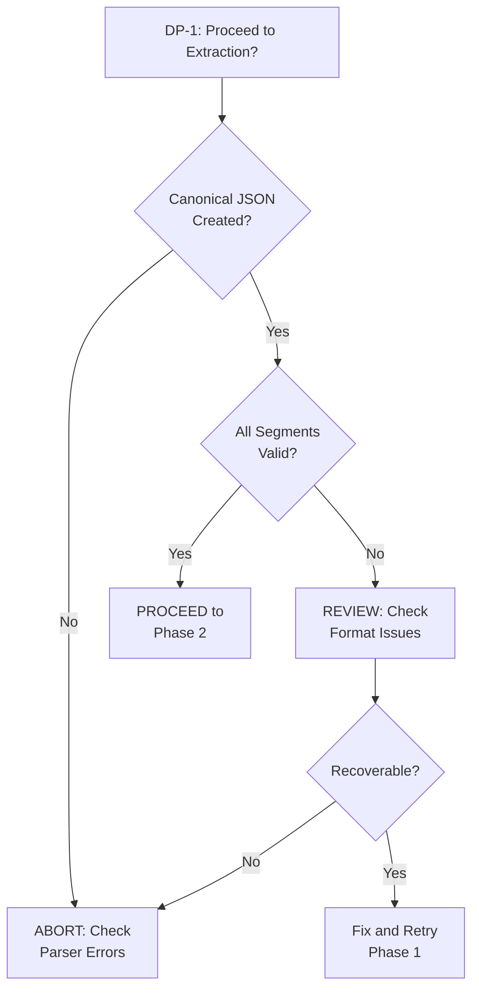
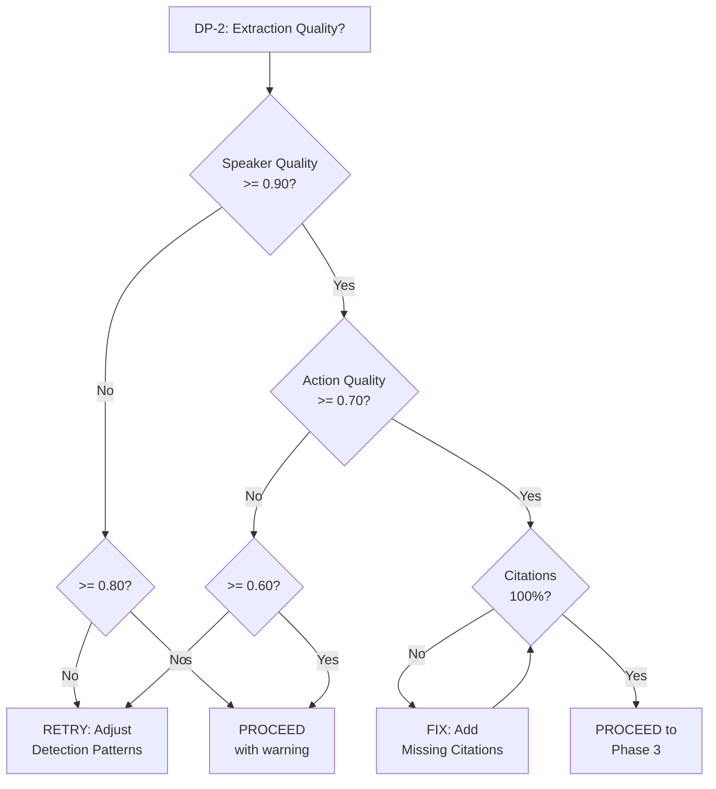
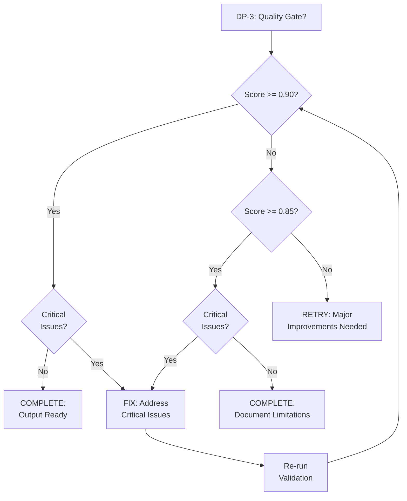

# Playbook: Transcript Skill Design Documentation

<!--
TEMPLATE: Playbook
SOURCE: TASK-009 EN-005 PLAYBOOK
VERSION: 1.0.0
STATUS: ACTIVE
-->

---

## Frontmatter

```yaml
# === IDENTITY ===
id: "PB-TRANSCRIPT-001"
title: "Playbook: Transcript Skill Design Documentation"
version: "1.0.0"
status: "ACTIVE"

# === OWNERSHIP ===
owner: "Transcript Skill Team"
author: "ps-architect"
reviewers:
  - "ps-critic"
  - "User"

# === CLASSIFICATION ===
classification: "L1"
criticality: "HIGH"
change_type: "STANDARD"

# === TIMING ===
estimated_duration: "4-8 hours"
automation_level: "semi-automated"
review_cycle: "quarterly"

# === TIMESTAMPS ===
created: "2026-01-26T10:00:00Z"
updated: "2026-01-26T10:00:00Z"
last_tested: "2026-01-26T10:00:00Z"
next_review: "2026-04-26T00:00:00Z"

# === TRACEABILITY ===
work_items:
  epic: "EPIC-001"
  feature: "FEAT-001"
  enabler: "EN-005"

# === METADATA ===
tags:
  - "transcript-skill"
  - "design-documentation"
  - "phase-3"
```

---

## Table of Contents

1. [Quick Start (L0 - ELI5)](#1-quick-start-l0---eli5)
2. [Overview](#2-overview)
3. [RACI Matrix](#3-raci-matrix)
4. [Prerequisites](#4-prerequisites)
5. [Phase 1: Foundation](#5-phase-1-foundation)
6. [Phase 2: Core Extraction](#6-phase-2-core-extraction)
7. [Phase 3: Integration](#7-phase-3-integration)
8. [Phase 4: Validation](#8-phase-4-validation)
9. [Rollback Procedures](#9-rollback-procedures)
10. [Escalation](#10-escalation)
11. [Decision Points Summary](#11-decision-points-summary)
12. [Related Documentation](#12-related-documentation)
13. [Revision History](#13-revision-history)
14. [Requirements Traceability Matrix](#appendix-a-requirements-traceability-matrix)

---

## 1. Quick Start (L0 - ELI5)

### 1.1 What This Playbook Does

> **Simple Analogy:** This playbook is like a recipe for cooking a meal - it breaks
> down transcript processing into 4 phases: preparing ingredients (parsing),
> extracting the good stuff (speakers, actions), plating beautifully (formatting),
> and tasting to ensure quality (validation).

**In Plain Terms:**

This playbook guides you through processing meeting transcripts using the Transcript
Skill. By the end, you'll have a structured Markdown packet with action items,
decisions, speakers, and questions - all with citations back to the original transcript.

### 1.2 Who Should Use It

| Role | Why They Need This |
|------|-------------------|
| Claude Code Users | Execute transcript processing via `/transcript` command |
| Developers | Understand the agent pipeline for debugging |
| Architects | Validate adherence to ADR decisions and patterns |

### 1.3 Expected Outcome

**Before Running This Playbook:**
- Raw transcript file (VTT, SRT, or plain text)
- Unstructured meeting content

**After Running This Playbook:**
- Structured transcript packet (8 Markdown files)
- Extracted action items with assignees
- Identified speakers with contribution statistics
- Decisions, questions, and topics categorized
- Quality score >= 0.90 verified

### 1.4 Time Commitment

| Phase | Duration | Can Be Interrupted? |
|-------|----------|---------------------|
| Foundation | ~30 seconds | Yes |
| Core Extraction | ~2-5 minutes | Yes |
| Integration | ~1-2 minutes | Yes |
| Validation | ~30 seconds | Yes |
| **Total** | **~5-10 minutes** | |

### 1.5 Risk Level

- **Risk Level:** MEDIUM
- **Rollback Available:** Yes (intermediate files preserved)
- **Downtime Required:** No

---

## 2. Overview

### 2.1 Purpose

Execute the Transcript Skill design documentation workflow, following the 4-phase
implementation approach defined in DEC-001-007.

**This playbook addresses:**
- Phase-based execution of transcript processing
- Verification checkpoints at each phase boundary
- Error handling and recovery procedures

### 2.2 Scope

**In Scope:**
- VTT, SRT, and plain text transcript formats
- Speaker identification and extraction
- Action items, decisions, questions, topics
- Markdown packet generation with navigation

**Out of Scope:**
- Audio/video recording processing
- Real-time transcription
- Cross-meeting analysis

### 2.3 Audience

| Audience | Level | Sections to Read |
|----------|-------|------------------|
| Executive/Manager | L0 | Quick Start, Outcome |
| Operator/Engineer | L1 | All procedure sections |
| Architect/Lead | L2 | Context & Rationale, Decision Points |

### 2.4 When to Use This Playbook

**Use this playbook when:**
- [ ] Processing a meeting transcript from Zoom, Teams, or other platforms
- [ ] Extracting action items and decisions from recorded meetings
- [ ] Converting VTT/SRT subtitle files to structured notes

**Do NOT use this playbook when:**
- Transcript is corrupted or unreadable - Use manual review first
- Real-time transcription needed - This is batch processing only

---

## 3. RACI Matrix

### 3.1 Roles Definition

| Role | Description | Contact |
|------|-------------|---------|
| User | Initiates transcript processing | Claude Code user |
| ts-parser | Parses raw transcript to canonical JSON | Haiku model |
| ts-extractor | Extracts semantic entities | Sonnet model |
| ts-formatter | Generates Markdown output | Sonnet model |
| ps-critic | Reviews quality | Sonnet model |

### 3.2 Responsibility Matrix

| Activity | User | ts-parser | ts-extractor | ts-formatter | ps-critic |
|----------|------|-----------|--------------|--------------|-----------|
| Provide input file | R/A | I | I | I | I |
| Parse transcript | I | R | I | I | I |
| Extract entities | I | C | R | I | I |
| Generate output | I | C | C | R | I |
| Verify quality | A | I | I | I | R |
| Approve final output | R/A | I | I | I | C |

---

## 4. Prerequisites

### 4.1 Prerequisites Checklist

**Complete ALL items before proceeding. Do not skip any item.**

- [ ] Transcript file available (VTT, SRT, or TXT format)
- [ ] File is readable and properly encoded (UTF-8 preferred)
- [ ] Output directory is writable
- [ ] Claude Code session active
- [ ] Required tools available (Read, Write, Glob, Task)

### 4.2 Required Tools

| Tool | Purpose | How to Obtain |
|------|---------|---------------|
| Read | Read transcript file | Built into Claude Code |
| Write | Create output files | Built into Claude Code |
| Glob | Find existing files | Built into Claude Code |
| Task | Invoke worker agents | Built into Claude Code |

### 4.3 Input File Verification

```bash
# Verify file exists and is readable
ls -la <transcript-file>

# Check encoding (should be UTF-8)
file <transcript-file>

# Preview first 10 lines
head -10 <transcript-file>
```

**Expected Format Indicators:**

| Format | Signature |
|--------|-----------|
| VTT | First line: `WEBVTT` |
| SRT | First line: `1` (sequence number) |
| Plain Text | No specific header, `Speaker:` prefixes |

---

## 5. Phase 1: Foundation

### 5.1 Entry Criteria

Before starting Phase 1, verify ALL conditions:

- [ ] Input file path known and accessible
- [ ] Format identified (VTT, SRT, or TXT)
- [ ] Output directory configured

**If any entry criteria not met:** STOP - Do not proceed. Address missing criteria first.

### 5.2 Requirements Covered

| ID | Requirement | Priority |
|----|-------------|----------|
| FR-001 | VTT Parsing | MUST |
| FR-002 | SRT Parsing | MUST |
| FR-003 | Plain Text Parsing | SHOULD |
| FR-004 | Format Auto-Detection | SHOULD |
| NFR-006 | Timestamp Normalization | MUST |
| NFR-007 | Encoding Detection | MUST |
| IR-001 | CLI Interface | MUST |
| IR-002 | POSIX Conventions | MUST |
| IR-003 | Exit Codes | MUST |

### 5.3 Procedure Steps

#### Step 1.1: Invoke ts-parser Agent

**Purpose:** Parse raw transcript to canonical JSON format.

**L2 Context:** PAT-002 (Defensive Parsing) - Accept liberally, process consistently.

**Invocation:**

```markdown
Invoke ts-parser with:
- Input: <transcript-file-path>
- Format: auto-detect (or specify: vtt, srt, txt)
```

**Expected Output:**

```json
{
  "version": "1.0",
  "source": "<original-file>",
  "format_detected": "vtt",
  "segments": [
    {
      "id": 1,
      "start_ms": 0,
      "end_ms": 5000,
      "speaker": "Alice",
      "text": "Good morning everyone."
    }
  ]
}
```

**Verification:**
- [ ] `canonical-transcript.json` created
- [ ] JSON schema validates
- [ ] All utterances captured (compare segment count)
- [ ] Timestamps normalized to milliseconds

**If Verification Fails:**
1. Check error logs for parsing failures
2. Verify input file encoding
3. Try explicit format specification
4. See RUNBOOK-en005.md Section R-002 for timestamp issues

---

#### Step 1.2: Validate Canonical JSON

**Purpose:** Ensure parser output is complete and well-formed.

**Command:**

```python
# Validate JSON structure
import json
with open('canonical-transcript.json') as f:
    data = json.load(f)

# Check required fields
assert 'version' in data
assert 'segments' in data
assert len(data['segments']) > 0
```

**Verification:**
- [ ] JSON parses without errors
- [ ] `version` field present
- [ ] `segments` array non-empty
- [ ] Each segment has: id, start_ms, end_ms, text

---

### 5.4 Phase 1 Checkpoint

**Phase 1 Completion Checklist:**
- [ ] ts-parser completed successfully
- [ ] canonical-transcript.json created
- [ ] JSON validation passed
- [ ] Segment count matches expected
- [ ] Ready for Phase 2

### 5.5 Exit Criteria

Phase 1 is complete when ALL conditions are met:

- [ ] Canonical JSON exists at expected path
- [ ] All segments have valid timestamps
- [ ] No parsing errors in output

### 5.6 Decision Point: DP-1

#### DP-1: Proceed to Extraction Phase?

**Decision Criteria:**

| Condition | Action |
|-----------|--------|
| All Phase 1 exit criteria met | **PROCEED** to Phase 2 |
| Parse errors but partial output | **REVIEW** errors, then decide |
| Complete parsing failure | **ABORT** - Check input file |

**Decision Tree:**



---

## 6. Phase 2: Core Extraction

### 6.1 Entry Criteria

Before starting Phase 2, verify:

- [ ] DP-1 decision: PROCEED
- [ ] canonical-transcript.json available
- [ ] ts-extractor agent ready

### 6.2 Requirements Covered

| ID | Requirement | Priority |
|----|-------------|----------|
| FR-005 | Voice Tag Extraction | MUST |
| FR-006 | Pattern-based Speaker ID | MUST |
| FR-007 | Action Item Extraction | MUST |
| FR-010 | Standard NER | MUST |
| FR-011 | Confidence Scores | MUST |
| NFR-003 | Speaker F1 >= 0.95 | MUST |
| NFR-004 | Action F1 >= 0.80 | MUST |
| NFR-008 | 4+ Speaker Patterns | MUST |

### 6.3 Procedure Steps

#### Step 2.1: Invoke ts-extractor Agent

**Purpose:** Extract speakers, actions, decisions, questions, topics.

**L2 Context (Architect):**
- PAT-001 (Tiered Extraction): Rule → ML → LLM
- PAT-003 (Multi-Pattern Speaker Detection): 4-pattern chain
- PAT-004 (Citation-Required): All entities cite source

**Invocation:**

```markdown
Invoke ts-extractor with:
- Input: canonical-transcript.json
- Confidence threshold: 0.7
```

**Expected Output:**

```json
{
  "extraction_version": "1.0",
  "speakers": [
    {"id": "spk-alice", "name": "Alice", "segment_count": 15, "confidence": 0.95}
  ],
  "action_items": [
    {"id": "act-001", "text": "Review PR by Friday", "assignee": "spk-bob", "confidence": 0.85, "source_segment": 42}
  ],
  "decisions": [...],
  "questions": [...],
  "topics": [...]
}
```

**Verification:**
- [ ] extraction-report.json created
- [ ] All entity types extracted (speakers, actions, decisions, questions, topics)
- [ ] Confidence scores present (0.0-1.0)
- [ ] Source citations (segment IDs) included

**Error Indicators:**
- `confidence < 0.7` - Low confidence extraction, flag for review
- `source_segment: null` - Citation missing (PAT-004 violation)

---

#### Step 2.2: Validate Extraction Quality

**Purpose:** Ensure extraction meets quality thresholds.

**Verification Commands:**

```python
# Check speaker confidence
speakers = data['speakers']
high_conf_speakers = [s for s in speakers if s['confidence'] >= 0.95]
speaker_quality = len(high_conf_speakers) / len(speakers)

# Check action item confidence
actions = data['action_items']
high_conf_actions = [a for a in actions if a['confidence'] >= 0.70]
action_quality = len(high_conf_actions) / len(actions)

# Verify citations
missing_citations = [a for a in actions if a.get('source_segment') is None]
```

**Quality Thresholds:**

| Metric | Minimum | Target |
|--------|---------|--------|
| Speaker confidence average | 0.90 | 0.95 |
| Action item confidence average | 0.70 | 0.85 |
| Citation coverage | 100% | 100% |

---

### 6.4 Phase 2 Checkpoint

**Phase 2 Completion Checklist:**
- [ ] extraction-report.json created
- [ ] Speakers identified with names
- [ ] Action items extracted with assignees
- [ ] Decisions and questions extracted
- [ ] All entities have confidence scores
- [ ] All entities have source citations

### 6.5 Exit Criteria

Phase 2 is complete when ALL conditions are met:

- [ ] extraction-report.json exists
- [ ] Speaker identification quality >= 0.90
- [ ] Action extraction quality >= 0.70
- [ ] 100% citation coverage

### 6.6 Decision Point: DP-2

#### DP-2: Extraction Quality Acceptable?

**Decision Criteria:**

| Condition | Action |
|-----------|--------|
| All quality metrics met | **PROCEED** to Phase 3 |
| Quality below threshold but reasonable | **PROCEED** with warnings |
| Critical quality failure | **RETRY** with different settings |

**Go/No-Go Criteria:**

| Criterion | Go | No-Go |
|-----------|-----|-------|
| Speaker confidence | >= 0.90 | < 0.80 |
| Action confidence | >= 0.70 | < 0.60 |
| Citation coverage | 100% | < 90% |

**Decision Tree:**



---

## 7. Phase 3: Integration

### 7.1 Entry Criteria

Before starting Phase 3, verify:

- [ ] DP-2 decision: PROCEED
- [ ] canonical-transcript.json available
- [ ] extraction-report.json available
- [ ] Output directory writable

### 7.2 Requirements Covered

| ID | Requirement | Priority |
|----|-------------|----------|
| FR-008 | Decision Extraction | SHOULD |
| FR-009 | Question Extraction | SHOULD |
| FR-012 | Markdown Output | MUST |
| FR-013 | JSON Output | MUST |
| FR-014 | Source Citations | MUST |
| FR-015 | Entity Filtering | SHOULD |
| IR-004 | SKILL.md Interface | MUST |
| IR-005 | Hexagonal Architecture | MUST |
| NFR-009 | Schema Versioning | MUST |
| NFR-010 | LLM Citation Validation | MUST |

### 7.3 Procedure Steps

#### Step 3.1: Invoke ts-formatter Agent

**Purpose:** Generate Markdown packet with navigation and backlinks.

**L2 Context (Architect):**
- ADR-002: 8-file packet structure
- ADR-003: Anchor registry and backlinks
- ADR-004: File splitting at 31.5K tokens

**Invocation:**

```markdown
Invoke ts-formatter with:
- Input: canonical-transcript.json
- Input: extraction-report.json
- Output directory: ./transcript-{id}/
```

**Expected Output Structure:**

```
transcript-{id}/
├── 00-index.md          # Navigation hub (~2K tokens)
├── 01-summary.md        # Executive summary (~5K tokens)
├── 02-transcript.md     # Full transcript (may split)
├── 03-speakers.md       # Speaker directory
├── 04-action-items.md   # Action items with citations
├── 05-decisions.md      # Decisions with context
├── 06-questions.md      # Open questions
├── 07-topics.md         # Topic segments
└── _anchors.json        # Anchor registry
```

**Verification:**
- [ ] All 8 files created
- [ ] 00-index.md has navigation links
- [ ] _anchors.json contains all anchor IDs
- [ ] No file exceeds 35K tokens

---

#### Step 3.2: Validate Packet Structure

**Purpose:** Ensure all files created and linked correctly.

**Verification Commands:**

```bash
# Check all files exist
ls -la transcript-{id}/

# Verify file count
find transcript-{id}/ -name "*.md" | wc -l
# Expected: 8+ files

# Check anchor registry
cat transcript-{id}/_anchors.json | jq '.anchors | length'
```

**Verification:**
- [ ] 8 base files exist (00-index through 07-topics)
- [ ] _anchors.json exists with anchors array
- [ ] All internal links resolve
- [ ] Backlinks sections populated

---

### 7.4 Phase 3 Checkpoint

**Phase 3 Completion Checklist:**
- [ ] All 8 packet files created
- [ ] Navigation index functional
- [ ] Anchor registry complete
- [ ] No files exceed token limits
- [ ] Backlinks generated for all entities

### 7.5 Exit Criteria

Phase 3 is complete when ALL conditions are met:

- [ ] Packet directory created with all files
- [ ] All files under 35K token limit
- [ ] All internal links valid
- [ ] Anchor registry complete

---

## 8. Phase 4: Validation

### 8.1 Entry Criteria

Before starting Phase 4, verify:

- [ ] Phase 3 exit criteria met
- [ ] All packet files accessible
- [ ] ps-critic agent available

### 8.2 Requirements Covered

| ID | Requirement | Priority |
|----|-------------|----------|
| NFR-001 | Performance Validation | MUST |
| NFR-002 | Memory Validation | MUST |
| NFR-005 | Hallucination Rate Test | MUST |

### 8.3 Procedure Steps

#### Step 4.1: Invoke ps-critic Agent

**Purpose:** Validate quality meets >= 0.90 threshold.

**Invocation:**

```markdown
Invoke ps-critic with:
- Input: All packet files
- Quality threshold: 0.90
- Check: ADR compliance, citation coverage, token limits
```

**Expected Output:**

```yaml
quality_review:
  overall_score: 0.92
  passed: true
  component_scores:
    structure_compliance: 0.95
    citation_coverage: 1.00
    token_compliance: 1.00
    navigation_quality: 0.88
    content_accuracy: 0.90
  issues: []
  recommendations:
    - "Consider adding more context to decision D-002"
```

**Verification:**
- [ ] Overall score >= 0.90
- [ ] `passed: true`
- [ ] No critical issues

---

#### Step 4.2: Address Quality Issues (if needed)

**Purpose:** Fix any issues identified by ps-critic.

**If score < 0.90:**

1. Review issues list
2. Identify critical vs. minor issues
3. Fix critical issues and re-run validation
4. Document minor issues as known limitations

---

### 8.4 Phase 4 Checkpoint

**Phase 4 Completion Checklist:**
- [ ] ps-critic review completed
- [ ] Quality score >= 0.90
- [ ] All critical issues addressed
- [ ] Minor issues documented

### 8.5 Exit Criteria

Phase 4 is complete when ALL conditions are met:

- [ ] Quality score >= 0.90
- [ ] No critical quality issues
- [ ] Review report generated

### 8.6 Decision Point: DP-3

#### DP-3: Quality Gate Passed?

**Decision Criteria:**

| Condition | Action |
|-----------|--------|
| Score >= 0.90, no critical issues | **COMPLETE** - Output ready for use |
| Score 0.85-0.90, minor issues only | **COMPLETE** with documented limitations |
| Score < 0.85 or critical issues | **RETRY** - Fix issues and re-validate |

**Decision Tree:**



---

## 9. Rollback Procedures

### 9.1 Rollback Triggers

**Initiate rollback if ANY of these conditions occur:**

| Trigger | Description | Action |
|---------|-------------|--------|
| Parser failure | Cannot create canonical JSON | Retry with explicit format |
| Extraction failure | No entities extracted | Check input quality |
| Formatter failure | Cannot create output files | Check disk space |
| Quality failure | Score < 0.85 after 3 attempts | Manual review required |

### 9.2 Rollback Steps

**Intermediate files are preserved for recovery:**

1. **Phase 1 Rollback:** Delete corrupted canonical-transcript.json, retry parsing
2. **Phase 2 Rollback:** Keep canonical JSON, delete extraction-report.json, retry extraction
3. **Phase 3 Rollback:** Keep intermediate files, delete packet directory, retry formatting
4. **Phase 4 Rollback:** Keep packet, re-run quality review with adjusted thresholds

### 9.3 Data Recovery

All intermediate files are preserved:
- `canonical-transcript.json` - Parser output
- `extraction-report.json` - Extractor output
- `transcript-{id}/` - Formatter output

---

## 10. Escalation

### 10.1 Escalation Triggers

**Escalate when:**
- Parser cannot detect format after explicit specification
- Extraction confidence consistently below 0.60
- Quality score below 0.80 after multiple attempts
- Unknown error messages or failures

### 10.2 Escalation Contacts

| Level | Role | Action |
|-------|------|--------|
| L1 | User | Review error messages, retry with different settings |
| L2 | Developer | Check agent definitions, patterns, thresholds |
| L3 | Architect | Review ADR compliance, update patterns |

### 10.3 Escalation Procedure

1. **Document the issue:**
   - Input file characteristics
   - Error messages
   - Attempted resolutions

2. **Check RUNBOOK-en005.md** for known issues

3. **Create bug report** if issue is new

---

## 11. Decision Points Summary

### 11.1 All Decision Points

| ID | Location | Decision | Options |
|----|----------|----------|---------|
| DP-1 | Section 5.6 | Proceed to Extraction? | PROCEED / REVIEW / ABORT |
| DP-2 | Section 6.6 | Extraction Quality Acceptable? | PROCEED / PROCEED with warning / RETRY |
| DP-3 | Section 8.6 | Quality Gate Passed? | COMPLETE / COMPLETE with limitations / RETRY |

### 11.2 Branching Paths

| From | Decision | Navigate To |
|------|----------|-------------|
| DP-1 | PROCEED | Phase 2 (Core Extraction) |
| DP-1 | REVIEW | Check format issues, then DP-1 |
| DP-1 | ABORT | End - Manual intervention |
| DP-2 | PROCEED | Phase 3 (Integration) |
| DP-2 | PROCEED with warning | Phase 3 with documented limitations |
| DP-2 | RETRY | Phase 2 with adjusted settings |
| DP-3 | COMPLETE | End - Output ready |
| DP-3 | COMPLETE with limitations | End - Document limitations |
| DP-3 | RETRY | Phase 4 after fixes |

---

## 12. Related Documentation

### 12.1 Related Documents

| Document | Location | Purpose |
|----------|----------|---------|
| SKILL.md | EN-005/SKILL.md | Skill definition |
| RUNBOOK-en005.md | EN-005/docs/RUNBOOK-en005.md | Troubleshooting |
| TDD-transcript-skill.md | EN-005/docs/TDD-transcript-skill.md | Architecture overview |
| ADR-001 | EN-004/docs/adrs/adr-001.md | Agent Architecture |
| ADR-002 | EN-004/docs/adrs/adr-002.md | Artifact Structure |
| ADR-003 | EN-004/docs/adrs/adr-003.md | Bidirectional Linking |
| ADR-004 | EN-004/docs/adrs/adr-004.md | File Splitting |
| ADR-005 | EN-004/docs/adrs/adr-005.md | Agent Implementation |

### 12.2 Agent Definitions

| Agent | Location |
|-------|----------|
| ts-parser | agents/ts-parser/AGENT.md |
| ts-extractor | agents/ts-extractor/AGENT.md |
| ts-formatter | agents/ts-formatter/AGENT.md |

---

## 13. Revision History

| Version | Date | Author | Changes |
|---------|------|--------|---------|
| 1.0.0 | 2026-01-26 | ps-architect | Initial version with 4 phases |

---

## Appendix A: Requirements Traceability Matrix

### A.1 Phase-to-Requirements Mapping

| Phase | Requirements | Count |
|-------|--------------|-------|
| Phase 1: Foundation | FR-001..004, NFR-006, NFR-007, IR-001..003 | 9 |
| Phase 2: Core Extraction | FR-005..007, FR-010, FR-011, NFR-003, NFR-004, NFR-008 | 8 |
| Phase 3: Integration | FR-008, FR-009, FR-012..015, IR-004, IR-005, NFR-009, NFR-010 | 10 |
| Phase 4: Validation | NFR-001, NFR-002, NFR-005 | 3 |
| **Total** | | **30** |

### A.2 Risk Coverage

| Risk ID | Risk | Phase | Mitigation |
|---------|------|-------|------------|
| R-002 | SRT Timestamp Issues | Phase 1 | NFR-006 normalization |
| R-004 | Missing Speaker ID | Phase 2 | NFR-008 multi-pattern |
| R-006 | Low Action Precision | Phase 2 | NFR-004 confidence threshold |
| R-007 | Low Action Recall | Phase 2 | FR-011 multi-strategy |
| R-008 | Hallucination | Phase 3 | NFR-010 citation validation |
| R-014 | Schema Breaking | Phase 3 | NFR-009 versioning |

---

*Playbook Version: 1.0.0*
*Constitutional Compliance: P-002 (persisted), P-003 (single nesting), P-004 (provenance)*
*Created: 2026-01-26*
