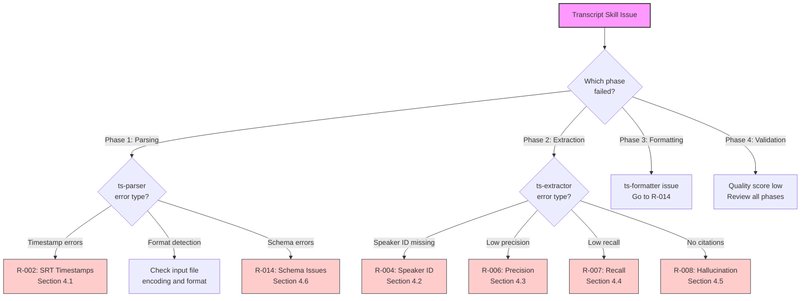
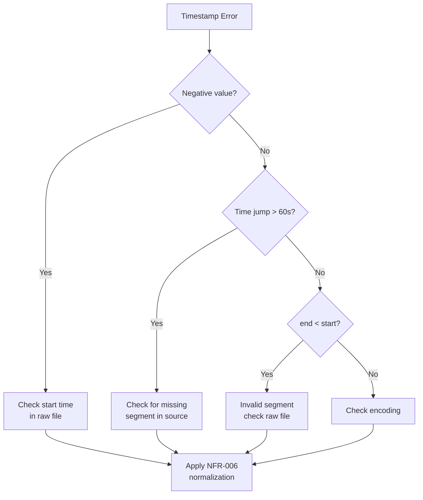
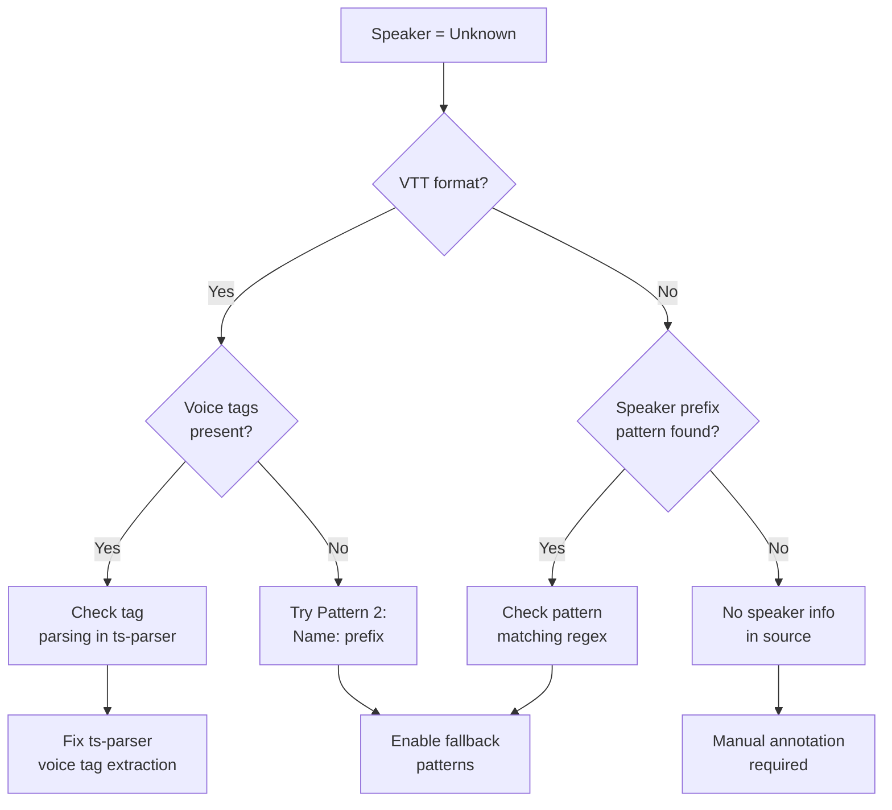
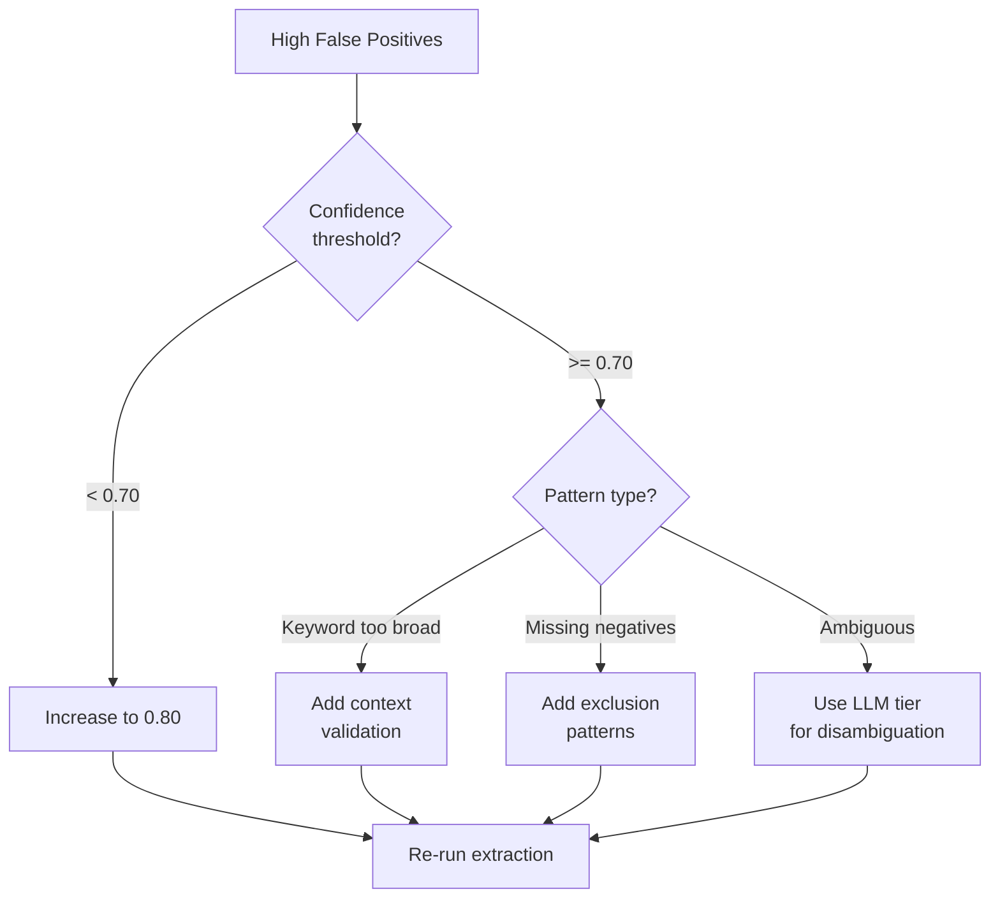
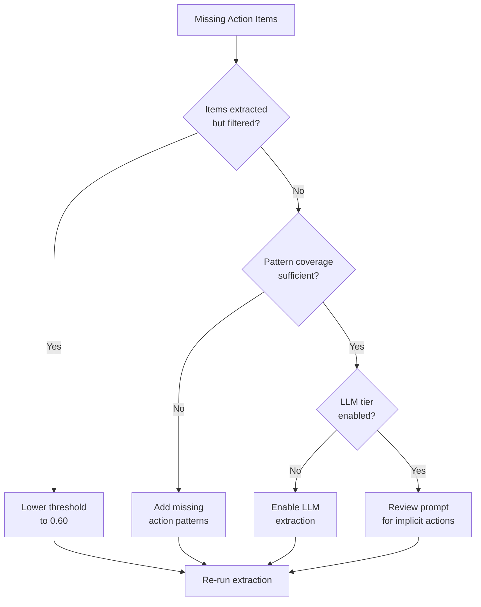
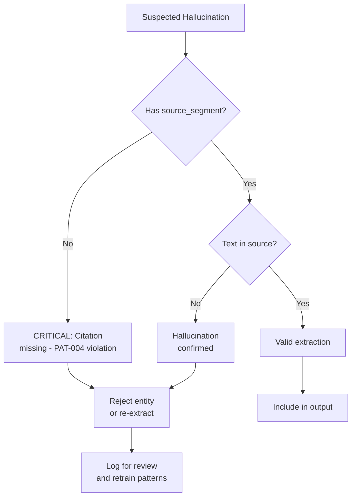
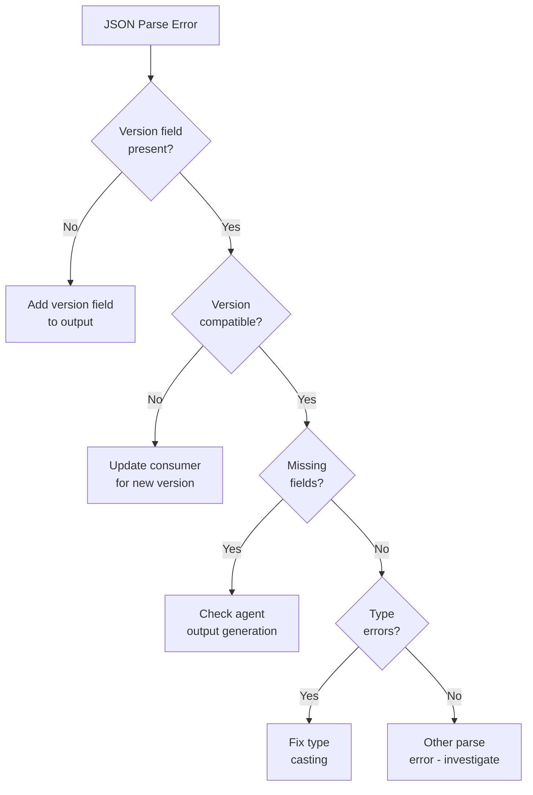

# Runbook: Transcript Skill Troubleshooting

<!--
TEMPLATE: Runbook
SOURCE: TASK-010 EN-005 RUNBOOK
VERSION: 1.0.0
STATUS: ACTIVE
-->

---

## Frontmatter

```yaml
# === IDENTITY ===
id: "RB-TRANSCRIPT-001"
title: "Runbook: Transcript Skill Troubleshooting"
work_type: RUNBOOK
version: "1.0.0"
status: "ACTIVE"

# === OWNERSHIP ===
owner: "Transcript Skill Team"
author: "ps-architect"

# === OPERATIONAL METADATA ===
automation_level: "manual"
estimated_duration: "5-30 minutes"
review_cycle: "quarterly"

# === TIMESTAMPS ===
created: "2026-01-26T10:00:00Z"
updated: "2026-01-26T10:00:00Z"
last_tested: "2026-01-26T10:00:00Z"

# === SCOPE ===
systems:
  - "ts-parser"
  - "ts-extractor"
  - "ts-formatter"
severity_applicability:
  - "P2"
  - "P3"

# === TRACEABILITY ===
work_items:
  epic: "EPIC-001"
  feature: "FEAT-001"
  enabler: "EN-005"
related_playbooks:
  - "PB-TRANSCRIPT-001"

# === TAGS ===
tags:
  - "transcript-skill"
  - "troubleshooting"
  - "fmea-risks"
```

---

## L0: Operational Overview

### What This Runbook Covers

This runbook helps you troubleshoot the 6 YELLOW risks identified in the FMEA analysis
for the Transcript Skill. Think of it like a doctor's diagnostic guide - we'll help
you identify symptoms, find the root cause, and apply the right treatment.

### When to Use This Runbook

Use this runbook when:

- [ ] ts-parser reports timestamp errors or format detection failures
- [ ] ts-extractor shows low confidence scores for speakers
- [ ] ts-extractor shows low confidence for action items
- [ ] Extracted entities appear to be hallucinated (no source citation)
- [ ] JSON output schema is incompatible with downstream tools

Do **NOT** use this runbook when:

- Input file is corrupted or empty - Verify file first
- Agent completely fails to respond - Check Claude Code session
- Output directory not writable - Check permissions

### Expected Outcome

After completing this runbook:

1. Root cause identified for the specific YELLOW risk
2. Resolution applied or workaround documented
3. Quality restored to acceptable levels (>= 0.85)

### Emergency Contacts

| Role | Contact Method | When to Use |
|------|----------------|-------------|
| User | Review error messages | First response |
| Developer | Check agent definitions | Persistent issues |
| Architect | Review ADR patterns | Pattern violations |

---

## L2: System Context

### Architecture Overview

```
TRANSCRIPT SKILL ARCHITECTURE
=============================

USER INPUT (VTT/SRT/TXT)
        │
        ▼
┌──────────────────┐
│    ts-parser     │ ◄── R-002: Timestamp Issues
│   (haiku)        │     R-014: Schema Issues
└────────┬─────────┘
         │ canonical-transcript.json
         ▼
┌──────────────────┐
│  ts-extractor    │ ◄── R-004: Speaker ID Issues
│   (sonnet)       │     R-006: Low Precision
└────────┬─────────┘     R-007: Low Recall
         │               R-008: Hallucination
         │ extraction-report.json
         ▼
┌──────────────────┐
│  ts-formatter    │ ◄── R-014: Schema Issues
│   (sonnet)       │
└────────┬─────────┘
         │ transcript-{id}/
         ▼
┌──────────────────┐
│   ps-critic      │ ◄── Quality validation
│   (sonnet)       │
└──────────────────┘
```

### Risk Overview

| Risk ID | Risk Name | RPN Score | Status | Primary Agent |
|---------|-----------|-----------|--------|---------------|
| R-002 | SRT Timestamp Malformation | 8 | YELLOW | ts-parser |
| R-004 | Missing Speaker Identification | 12 | YELLOW | ts-extractor |
| R-006 | Low Action Item Precision | 12 | YELLOW | ts-extractor |
| R-007 | Low Action Item Recall | 12 | YELLOW | ts-extractor |
| R-008 | LLM Hallucination | 12 | YELLOW | ts-extractor |
| R-014 | JSON Schema Breaking | 9 | YELLOW | ts-parser/ts-formatter |

---

## Troubleshooting Decision Tree

### Master Decision Tree

Use this decision tree to navigate to the appropriate resolution:



### Symptom-Cause-Resolution Table

| Symptom | Likely Cause | Verification | Resolution | See Section | Escalate? |
|---------|--------------|--------------|------------|-------------|-----------|
| Negative timestamps | SRT comma/period separator | Check raw file | NFR-006 normalization | 4.1 | L1 > 5min |
| Speaker = "Unknown" | Missing voice tags | Check VTT format | Use pattern fallback | 4.2 | L2 if all unknown |
| Many false positives | Over-triggering keywords | Check action patterns | Adjust thresholds | 4.3 | L2 |
| Missing action items | Conservative patterns | Check recall patterns | Lower threshold | 4.4 | L2 |
| Entities without citations | LLM extraction | Check source_segment | PAT-004 enforcement | 4.5 | L2 immediate |
| JSON parse errors | Schema version mismatch | Check version field | Update consumer | 4.6 | L2 |

---

## L1: Diagnostic Procedures

### 4.1 R-002: SRT Timestamp Malformation

**Risk Score:** 8 (YELLOW)
**Primary Agent:** ts-parser
**Requirement:** NFR-006

#### Symptoms

- Timestamps show negative values
- Time jumps > 60 seconds between adjacent utterances
- Duration calculation errors (end < start)
- Parse errors mentioning "timestamp"

#### Root Causes

| Cause | Likelihood | Impact | Detection |
|-------|------------|--------|-----------|
| Comma vs period millisecond separator | HIGH | MEDIUM | Check raw file |
| Invalid time format | MEDIUM | HIGH | Parse error message |
| Missing start/end time | LOW | HIGH | Empty timestamp field |
| Encoding issues affecting digits | LOW | MEDIUM | Garbled numbers |

#### Diagnosis

**Step 1: Check SRT file format**

```bash
# View first 10 lines of SRT file
head -20 <transcript.srt>

# Check for timestamp format
grep -E "^[0-9]{2}:[0-9]{2}:[0-9]{2}" <transcript.srt> | head -5
```

**Expected Format:**
```
00:00:05,123 --> 00:00:08,456
```

**Common Variations:**
```
00:00:05.123 --> 00:00:08.456  # Period instead of comma (European format)
0:00:05,123 --> 0:00:08,456    # Missing leading zero
```

**Step 2: Check canonical JSON output**

```python
import json
with open('canonical-transcript.json') as f:
    data = json.load(f)

# Check for negative or invalid timestamps
for seg in data['segments']:
    if seg['start_ms'] < 0 or seg['end_ms'] < 0:
        print(f"Negative timestamp: Segment {seg['id']}")
    if seg['end_ms'] < seg['start_ms']:
        print(f"Invalid duration: Segment {seg['id']}")
```

#### Resolution Steps

1. **Enable defensive parsing (PAT-002):**
   - ts-parser should auto-normalize both `.` and `,` separators
   - If not working, check AGENT.md configuration

2. **Manual timestamp fix:**
   ```bash
   # Convert European format to standard
   sed 's/\([0-9]\{2\}\):\([0-9]\{2\}\):\([0-9]\{2\}\)\.\([0-9]\{3\}\)/\1:\2:\3,\4/g' input.srt > fixed.srt
   ```

3. **Re-run ts-parser** with corrected file

#### Decision Tree



#### Escalation

- L1: User can fix by checking raw file format
- L2: If auto-normalization fails, check ts-parser AGENT.md

---

### 4.2 R-004: Missing Speaker Identification

**Risk Score:** 12 (YELLOW)
**Primary Agent:** ts-extractor
**Requirements:** FR-005, FR-006, NFR-008

#### Symptoms

- All or most speakers show as "Unknown"
- Speaker confidence < 0.80
- Only one speaker detected in multi-speaker transcript
- Speaker names are garbled or partial

#### Root Causes

| Cause | Likelihood | Impact | Detection |
|-------|------------|--------|-----------|
| Missing VTT voice tags | HIGH | HIGH | Check `<v>` tags in source |
| No speaker prefixes in plain text | HIGH | HIGH | Check "Name:" patterns |
| Name normalization failure | MEDIUM | MEDIUM | Check speaker variations |
| Non-standard naming format | MEDIUM | MEDIUM | Check speaker format |

#### Diagnosis

**Step 1: Check source format for speaker indicators**

```bash
# For VTT files - check for voice tags
grep -c "<v " <transcript.vtt>

# For SRT/TXT - check for speaker prefixes
grep -E "^[A-Z][a-z]+:" <transcript.srt> | head -5
grep -E "^\[[A-Za-z]+\]" <transcript.srt> | head -5
grep -E "^[A-Z]+:" <transcript.srt> | head -5
```

**Step 2: Check extraction report**

```python
import json
with open('extraction-report.json') as f:
    data = json.load(f)

# Check speaker detection results
for speaker in data['speakers']:
    print(f"Speaker: {speaker['name']}, Confidence: {speaker['confidence']}, Pattern: {speaker.get('detection_method', 'unknown')}")
```

#### Resolution Steps

**PAT-003 (Multi-Pattern Speaker Detection) - 4 Pattern Chain:**

1. **Pattern 1: VTT Voice Tags**
   - Format: `<v Speaker Name>`
   - Highest confidence (0.95)

2. **Pattern 2: Prefix Pattern**
   - Format: `Speaker Name:` at line start
   - High confidence (0.90)

3. **Pattern 3: Bracket Pattern**
   - Format: `[Speaker Name]` at segment start
   - Medium confidence (0.85)

4. **Pattern 4: ALL-CAPS Pattern**
   - Format: `SPEAKER NAME:` (all uppercase)
   - Medium confidence (0.80)

**If all patterns fail:**

1. Check if transcript has any speaker indicators at all
2. Consider manual speaker annotation
3. Use contextual clues (turn-taking analysis)

#### Decision Tree



#### Escalation

- L1: Check source file has speaker indicators
- L2: If patterns not detecting, check ts-extractor AGENT.md PAT-003 config
- L3: Add new pattern if unique format found

---

### 4.3 R-006: Low Action Item Precision

**Risk Score:** 12 (YELLOW)
**Primary Agent:** ts-extractor
**Requirements:** FR-007, FR-011, NFR-004

#### Symptoms

- Many extracted action items are false positives
- Confidence scores mostly < 0.70
- Generic statements marked as action items
- Questions incorrectly classified as action items

#### Root Causes

| Cause | Likelihood | Impact | Detection |
|-------|------------|--------|-----------|
| Overly broad keyword patterns | HIGH | MEDIUM | Check action patterns |
| Missing context validation | MEDIUM | MEDIUM | Check surrounding text |
| Threshold too low | MEDIUM | LOW | Check confidence threshold |
| Ambiguous language | LOW | HIGH | Manual review needed |

#### Diagnosis

**Step 1: Review false positive examples**

```python
import json
with open('extraction-report.json') as f:
    data = json.load(f)

# Find low-confidence action items
for action in data['action_items']:
    if action['confidence'] < 0.70:
        print(f"Low confidence action:")
        print(f"  Text: {action['text']}")
        print(f"  Confidence: {action['confidence']}")
        print(f"  Source: Segment {action['source_segment']}")
```

**Step 2: Check extraction patterns**

Common false positive triggers:
- "we should..." (opinion, not commitment)
- "could you..." (question, not action)
- "it would be nice..." (wish, not action)

#### Resolution Steps

**PAT-001 (Tiered Extraction) - Adjust Tiers:**

1. **Increase confidence threshold:**
   - Current: 0.70
   - Recommended for high precision: 0.80

2. **Review tier assignments:**
   - Rule-based should catch explicit actions ("I will...", "Action item:")
   - LLM should handle implicit actions

3. **Add negative patterns:**
   - Exclude questions ("?")
   - Exclude hypotheticals ("would", "could", "might")
   - Exclude opinions ("should" without subject)

#### Decision Tree



#### Escalation

- L1: Adjust confidence threshold
- L2: Modify extraction patterns in ts-extractor AGENT.md
- L3: Review PAT-001 tier boundaries

---

### 4.4 R-007: Low Action Item Recall

**Risk Score:** 12 (YELLOW)
**Primary Agent:** ts-extractor
**Requirements:** FR-007, FR-011, NFR-004

#### Symptoms

- Known action items not extracted
- Low total action count despite action-heavy meeting
- Confidence threshold filtering too many items
- Implicit actions missed entirely

#### Root Causes

| Cause | Likelihood | Impact | Detection |
|-------|------------|--------|-----------|
| Threshold too high | HIGH | HIGH | Many items filtered |
| Missing action patterns | MEDIUM | HIGH | Check pattern coverage |
| Implicit actions not recognized | MEDIUM | HIGH | Review missed examples |
| Context window limitations | LOW | MEDIUM | Long transcripts |

#### Diagnosis

**Step 1: Manual spot check**

1. Review original transcript
2. Identify obvious action items
3. Compare against extraction report

**Step 2: Check confidence distribution**

```python
import json
with open('extraction-report.json') as f:
    data = json.load(f)

# Confidence histogram
from collections import Counter
conf_buckets = Counter()
for action in data['action_items']:
    bucket = int(action['confidence'] * 10) / 10
    conf_buckets[bucket] += 1

for bucket in sorted(conf_buckets.keys()):
    print(f"Confidence {bucket:.1f}: {'#' * conf_buckets[bucket]}")
```

#### Resolution Steps

1. **Lower confidence threshold:**
   - Current: 0.70
   - For higher recall: 0.60

2. **Enable all extraction tiers:**
   - Ensure LLM tier is active for implicit actions

3. **Add action patterns:**
   - "will follow up"
   - "taking that action"
   - "on my list"
   - "by [date]"

4. **Review filtered items:**
   - Check items between 0.50-0.70 confidence
   - Manually assess quality

#### Decision Tree



#### Escalation

- L1: Adjust threshold
- L2: Add patterns in ts-extractor AGENT.md
- L3: Review PAT-001 LLM tier prompts

---

### 4.5 R-008: LLM Hallucination

**Risk Score:** 12 (YELLOW)
**Primary Agent:** ts-extractor
**Requirements:** FR-014, NFR-005, NFR-010

#### Symptoms

- Extracted entities have no `source_segment` citation
- Action items don't appear in transcript
- Speaker names not in original file
- Confidence scores high but content fabricated

#### Root Causes

| Cause | Likelihood | Impact | Detection |
|-------|------------|--------|-----------|
| Citation requirement not enforced | HIGH | CRITICAL | Check source_segment |
| LLM generating without grounding | MEDIUM | CRITICAL | Verify against source |
| Context truncation | LOW | HIGH | Long transcripts |

#### Diagnosis

**Step 1: Check citation coverage**

```python
import json
with open('extraction-report.json') as f:
    data = json.load(f)

# Find entities without citations
for entity_type in ['action_items', 'decisions', 'questions']:
    entities = data.get(entity_type, [])
    missing_citations = [e for e in entities if not e.get('source_segment')]
    if missing_citations:
        print(f"{entity_type}: {len(missing_citations)} missing citations")
        for e in missing_citations[:3]:
            print(f"  - {e.get('text', 'N/A')[:50]}...")
```

**Step 2: Verify against source**

```python
# Load canonical transcript
with open('canonical-transcript.json') as f:
    transcript = json.load(f)

segments_text = {s['id']: s['text'] for s in transcript['segments']}

# Verify action item exists in cited segment
for action in data['action_items']:
    seg_id = action.get('source_segment')
    if seg_id and seg_id in segments_text:
        source_text = segments_text[seg_id]
        # Check if action text appears in source (fuzzy match)
        if action['text'][:30].lower() not in source_text.lower():
            print(f"Potential hallucination: {action['text'][:50]}...")
```

#### Resolution Steps

**PAT-004 (Citation-Required Extraction):**

1. **Enforce mandatory citations:**
   - All extracted entities MUST have `source_segment`
   - Reject extractions without citations

2. **Add verification step:**
   - Cross-reference extracted text against source
   - Flag entities that don't appear in cited segment

3. **Use conservative extraction:**
   - Prefer rule-based tier for factual extraction
   - Use LLM only for interpretation

4. **Implement hallucination rate check:**
   ```python
   # Target: <= 2% hallucination rate
   total_entities = len(action_items) + len(decisions) + len(questions)
   uncitable = sum(1 for e in all_entities if not e.get('source_segment'))
   hallucination_rate = uncitable / total_entities

   if hallucination_rate > 0.02:
       raise QualityError(f"Hallucination rate {hallucination_rate:.2%} exceeds 2% threshold")
   ```

#### Decision Tree



#### Escalation

- L1: Remove entities without citations immediately
- L2: Review ts-extractor PAT-004 enforcement
- L3: Adjust LLM prompts to emphasize grounding

**CRITICAL:** Any hallucination detection should trigger immediate L2 escalation.

---

### 4.6 R-014: JSON Schema Breaking Changes

**Risk Score:** 9 (YELLOW)
**Primary Agent:** ts-parser, ts-formatter
**Requirement:** NFR-009

#### Symptoms

- Downstream consumers fail to parse output
- Missing required fields in JSON
- Type mismatches (string vs number)
- Version field missing or incorrect

#### Root Causes

| Cause | Likelihood | Impact | Detection |
|-------|------------|--------|-----------|
| Schema version mismatch | HIGH | HIGH | Check version field |
| Missing required fields | MEDIUM | HIGH | JSON validation error |
| Type changes | MEDIUM | HIGH | Type error in consumer |
| Field renamed | LOW | CRITICAL | KeyError in consumer |

#### Diagnosis

**Step 1: Check schema version**

```python
import json

# Check canonical transcript version
with open('canonical-transcript.json') as f:
    data = json.load(f)
    print(f"Canonical version: {data.get('version', 'MISSING')}")

# Check extraction report version
with open('extraction-report.json') as f:
    data = json.load(f)
    print(f"Extraction version: {data.get('extraction_version', 'MISSING')}")
```

**Step 2: Validate against schema**

```python
# Define expected schema
CANONICAL_SCHEMA = {
    "required": ["version", "source", "segments"],
    "segment_required": ["id", "start_ms", "end_ms", "text"]
}

# Validate
missing = [f for f in CANONICAL_SCHEMA["required"] if f not in data]
if missing:
    print(f"Missing required fields: {missing}")

for seg in data.get('segments', []):
    seg_missing = [f for f in CANONICAL_SCHEMA["segment_required"] if f not in seg]
    if seg_missing:
        print(f"Segment {seg.get('id', '?')} missing: {seg_missing}")
```

#### Resolution Steps

**PAT-005 (Versioned Schema Evolution):**

1. **Always include version:**
   ```json
   {
     "version": "1.0",
     "extraction_version": "1.0"
   }
   ```

2. **Maintain backward compatibility:**
   - Never remove required fields
   - Add new fields as optional
   - Use deprecation before removal

3. **Consumer updates:**
   - Check version before processing
   - Handle both old and new schemas during transition

4. **Schema documentation:**
   - Document all fields and types
   - Track changes in CHANGELOG

#### Decision Tree



#### Escalation

- L1: Check version compatibility
- L2: Update agent to include missing fields
- L3: Schema breaking change requires migration plan

---

## Recovery Procedures

### Service Restoration Order

```
RECOVERY PRIORITY
=================

1. ts-parser (Foundation)
   └── All other agents depend on canonical JSON

2. ts-extractor (Core)
   └── Formatter depends on extraction report

3. ts-formatter (Integration)
   └── Quality depends on packet

4. ps-critic (Validation)
   └── Final quality gate
```

### Recovery Time Objectives

| Agent | RTO | Recovery Priority |
|-------|-----|-------------------|
| ts-parser | 1 minute | Critical |
| ts-extractor | 2 minutes | High |
| ts-formatter | 2 minutes | High |
| ps-critic | 1 minute | Medium |

### Scenario 1: Complete Pipeline Failure

**Detection:**
- No output files created
- Agent invocation errors

**Recovery Steps:**

1. Verify input file exists and is readable
2. Check Claude Code session is active
3. Retry with explicit parameters
4. If persists, check agent definitions

### Scenario 2: Partial Output Recovery

**Detection:**
- Some intermediate files exist
- Later phase failed

**Recovery Steps:**

1. Identify last successful phase
2. Resume from that phase
3. Use existing intermediate files

---

## Escalation

### Tiered Escalation Matrix

| Tier | Role | Responsibilities | Response Time |
|------|------|------------------|---------------|
| L1 | User | Check inputs, retry with different settings | 5 min |
| L2 | Developer | Check agent configs, patterns, thresholds | 15 min |
| L3 | Architect | Review ADR compliance, update patterns | 30 min |

### Severity-Based Triggers

| Issue | Severity | Initial Tier | Auto-Escalate |
|-------|----------|--------------|---------------|
| Hallucination detected | P1 | L2 | L3 after 15 min |
| All speakers unknown | P2 | L1 | L2 after 5 min |
| Low confidence scores | P3 | L1 | L2 after 10 min |
| Schema errors | P2 | L2 | L3 after 15 min |

### Escalation Communication Template

```
ESCALATION: Transcript Skill - [RISK_ID]
================================================
Risk ID:         R-00X
Severity:        YELLOW
Start Time:      [ISO_TIMESTAMP]

Symptom:
- [Description of what is failing]

Diagnosis:
- [Steps already taken]
- [Commands run and output]

Impact:
- [What functionality is affected]

Help Needed:
- [Specific request]
================================================
```

---

## Verification

### Success Criteria

The runbook is successful when:

- [ ] Root cause identified
- [ ] Resolution applied
- [ ] Quality score >= 0.85 restored
- [ ] Issue documented for future reference

### Post-Resolution Checklist

- [ ] Intermediate files cleaned up
- [ ] Final output verified
- [ ] Quality review passed
- [ ] Resolution documented
- [ ] Patterns updated if needed

---

## Related Documentation

### Related Runbooks

| Document | Purpose |
|----------|---------|
| PLAYBOOK-en005.md | Step-by-step execution guide |

### Reference Documentation

| Document | Location | Purpose |
|----------|----------|---------|
| TDD-ts-parser.md | docs/ | Parser architecture |
| TDD-ts-extractor.md | docs/ | Extractor architecture |
| TDD-ts-formatter.md | docs/ | Formatter architecture |
| FMEA-ANALYSIS.md | EN-003/ | Full risk analysis |
| ADR-001..005 | EN-004/docs/adrs/ | Architecture decisions |

---

## Revision History

| Version | Date | Author | Changes |
|---------|------|--------|---------|
| 1.0.0 | 2026-01-26 | ps-architect | Initial version covering 6 YELLOW risks |

---

## Requirements Traceability Matrix

| Risk ID | Requirement Coverage | Runbook Section |
|---------|---------------------|-----------------|
| R-002 | NFR-006 | 4.1 |
| R-004 | FR-005, FR-006, NFR-008 | 4.2 |
| R-006 | FR-007, FR-011, NFR-004 | 4.3 |
| R-007 | FR-007, FR-011, NFR-004 | 4.4 |
| R-008 | FR-014, NFR-005, NFR-010 | 4.5 |
| R-014 | NFR-009 | 4.6 |

---

*Runbook Version: 1.0.0*
*Constitutional Compliance: P-002 (persisted), P-004 (provenance)*
*Risk Coverage: 6/6 YELLOW risks from FMEA*
*Created: 2026-01-26*
