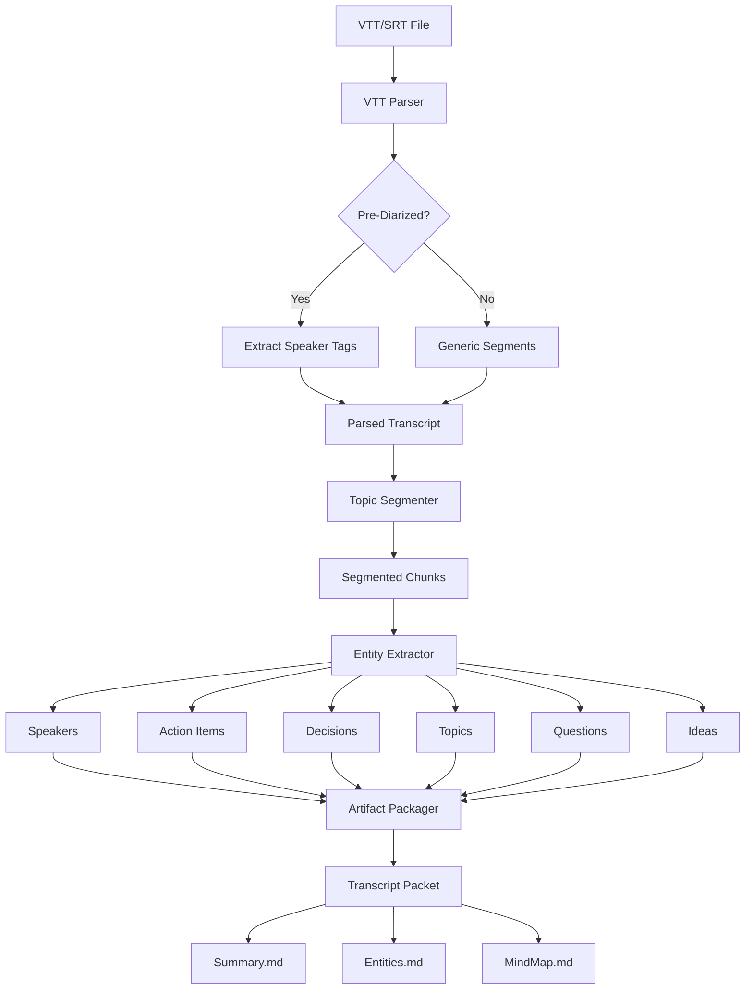
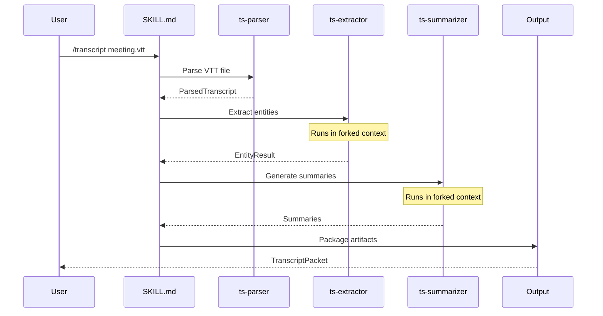

# EN-005 Implementation Research: Transcript Skill Best Practices

> **Research ID:** EN-005-RESEARCH-001
> **Date:** 2026-01-26
> **Author:** ps-researcher (Claude Opus 4.5)
> **Status:** COMPLETE
> **Traceability:** EN-005 Design Documentation -> FEAT-001 Analysis & Design -> EPIC-001

---

## Document Audience (Triple-Lens)

| Level | Audience | Focus Areas |
|-------|----------|-------------|
| **L0 (ELI5)** | Stakeholders, New Users | Executive Summary, Key Takeaways |
| **L1 (Engineer)** | Developers implementing the skill | Technical Patterns, Code Examples, Libraries |
| **L2 (Architect)** | System designers, Decision makers | Strategic Implications, Trade-offs, Quality Metrics |

---

## Executive Summary (L0)

### What This Research Covers

This document compiles industry best practices and technical guidance for implementing a Claude Code skill that analyzes meeting transcripts. Think of it as a "cookbook" that tells us exactly how to build each ingredient of our transcript analysis system.

**Simple Analogy:** We're building an intelligent assistant that can read meeting notes (like a court reporter's transcript) and automatically extract:
- Who said what (speaker identification)
- What topics were discussed (theme extraction)
- What needs to be done next (action items)
- Key decisions that were made

### Key Takeaways

1. **Skills are recipe cards** - Claude Code skills are modular playbooks stored in files that teach Claude how to perform specific tasks
2. **Progressive disclosure saves tokens** - Load information in stages, not all at once (50% token savings achievable)
3. **VTT/SRT parsing is solved** - Use `webvtt-py` or `pysrt` libraries; don't reinvent the wheel
4. **Speaker diarization needs quality audio** - 80-95% accuracy typical; plan for post-processing
5. **Action item extraction uses chain-of-thought** - LLMs perform better with step-by-step reasoning
6. **Quality metrics matter** - Precision, Recall, and F1-Score are the industry standards for NER evaluation

---

## 1. Agent Design Patterns (L1/L2)

### 1.1 Claude Code Skill Architecture

#### Skill Directory Structure

Based on research from [Anthropic Claude Code documentation](https://code.claude.com/docs/en/skills) and the [Claude Code GitHub repository](https://github.com/anthropics/claude-code), the recommended structure for a complex skill is:

```
transcript/
├── SKILL.md                    # Main skill entry point (< 500 lines)
├── agents/
│   ├── ts-parser.md            # VTT/SRT parsing agent
│   ├── ts-diarizer.md          # Speaker identification agent
│   ├── ts-extractor.md         # Entity extraction agent
│   └── ts-summarizer.md        # Summary generation agent
├── templates/
│   ├── extraction-schema.json  # Output schema for entities
│   └── summary-template.md     # Output template for summaries
├── reference/
│   ├── vtt-format.md           # VTT specification reference
│   ├── entity-patterns.md      # Entity extraction patterns
│   └── quality-metrics.md      # QA metrics reference
└── scripts/
    ├── parse_vtt.py            # VTT parser utility
    ├── validate_output.py      # Output validation
    └── test_extraction.py      # Extraction tests
```

**Source:** [Claude Code Plugin Structure](https://github.com/anthropics/claude-code/blob/main/plugins/plugin-dev/skills/plugin-structure/references/component-patterns.md)

#### SKILL.md Best Practices

```yaml
---
name: transcript
description: >
  Analyzes meeting transcripts (VTT, SRT, TXT) to extract speakers, topics,
  action items, decisions, and key ideas. Use when the user provides a
  transcript file, asks to "analyze a meeting", "extract action items from
  transcript", or "summarize what was discussed".
version: 1.0.0
allowed-tools: Read, Grep, Glob, Write, Bash(python:*)
---
```

**Critical Rules from [Anthropic Skill Best Practices](https://www.anthropic.com/engineering/claude-code-best-practices):**

| Rule | Rationale |
|------|-----------|
| Keep SKILL.md under 500 lines | Larger content causes context bloat |
| Write descriptions in third person | "Analyzes transcripts" not "I can analyze" |
| Include trigger phrases in description | Description is loaded BEFORE body |
| All "when to use" info in description | Body loads only AFTER triggering |
| One level deep references | Don't nest reference -> reference |

### 1.2 Entity Extraction Agent Patterns

#### Tool-Based Structured Output

From the [Anthropic Cookbook](https://github.com/anthropics/anthropic-cookbook/blob/main/tool_use/extracting_structured_json.ipynb):

```python
tools = [
    {
        "name": "extract_entities",
        "description": "Extracts named entities from transcript text.",
        "input_schema": {
            "type": "object",
            "properties": {
                "speakers": {
                    "type": "array",
                    "items": {
                        "type": "object",
                        "properties": {
                            "name": {"type": "string"},
                            "role": {"type": "string"},
                            "speaking_time_percent": {"type": "number"}
                        },
                        "required": ["name"]
                    }
                },
                "topics": {
                    "type": "array",
                    "items": {
                        "type": "object",
                        "properties": {
                            "topic": {"type": "string"},
                            "start_timestamp": {"type": "string"},
                            "end_timestamp": {"type": "string"},
                            "summary": {"type": "string"}
                        },
                        "required": ["topic", "summary"]
                    }
                },
                "action_items": {
                    "type": "array",
                    "items": {
                        "type": "object",
                        "properties": {
                            "task": {"type": "string"},
                            "assignee": {"type": "string"},
                            "due_date": {"type": "string"},
                            "priority": {"type": "string", "enum": ["high", "medium", "low"]}
                        },
                        "required": ["task"]
                    }
                },
                "decisions": {
                    "type": "array",
                    "items": {
                        "type": "object",
                        "properties": {
                            "decision": {"type": "string"},
                            "context": {"type": "string"},
                            "participants": {"type": "array", "items": {"type": "string"}}
                        },
                        "required": ["decision"]
                    }
                }
            },
            "required": ["speakers", "topics", "action_items", "decisions"]
        }
    }
]
```

**Source:** [Anthropic Courses - Entity Extraction](https://github.com/anthropics/courses/blob/master/tool_use/03_structured_outputs.ipynb)

#### XML Tag Extraction Pattern

From [Anthropic Cookbook](https://github.com/anthropics/anthropic-cookbook/blob/main/misc/how_to_enable_json_mode.ipynb):

```python
import re

def extract_between_tags(tag: str, string: str, strip: bool = False) -> list[str]:
    """Extract content between XML tags."""
    ext_list = re.findall(f"<{tag}>(.+?)</{tag}>", string, re.DOTALL)
    if strip:
        ext_list = [e.strip() for e in ext_list]
    return ext_list

# Usage in prompt:
"""
Analyze this transcript and extract:

<thinking>
Your analysis process here
</thinking>

<speakers>
JSON array of speakers
</speakers>

<action_items>
JSON array of action items
</action_items>
"""
```

### 1.3 Multi-Agent Orchestration

#### Sub-Agent Architecture

From [Claude Code Best Practices](https://www.anthropic.com/engineering/claude-code-best-practices):

```
┌─────────────────────────────────────────────────────────────────────┐
│                    TRANSCRIPT SKILL ARCHITECTURE                      │
├─────────────────────────────────────────────────────────────────────┤
│                                                                      │
│  ┌──────────────┐                                                    │
│  │   SKILL.md   │ ← Main orchestrator (stays in main context)        │
│  │  (Conductor) │                                                    │
│  └──────┬───────┘                                                    │
│         │                                                            │
│         ├───────────────────────────────────────────────────────┐   │
│         │                                                        │   │
│         ▼                                                        ▼   │
│  ┌──────────────┐    ┌──────────────┐    ┌──────────────┐      │   │
│  │  ts-parser   │    │ ts-extractor │    │ ts-summarizer│      │   │
│  │   (Haiku)    │    │   (Sonnet)   │    │   (Sonnet)   │      │   │
│  │              │    │              │    │              │      │   │
│  │ VTT parsing  │    │ Entity NER   │    │ Summaries    │      │   │
│  │ Timestamps   │    │ Topics       │    │ Action items │      │   │
│  │ Speaker IDs  │    │ Questions    │    │ Mind maps    │      │   │
│  └──────────────┘    └──────────────┘    └──────────────┘      │   │
│                                                                  │   │
│  ← Subagents run in isolated context, return results to main →  │   │
│                                                                      │
└─────────────────────────────────────────────────────────────────────┘
```

**Key Design Decisions:**

| Agent | Model | Rationale |
|-------|-------|-----------|
| ts-parser | Haiku 4.5 | Deterministic parsing, cost-effective |
| ts-extractor | Sonnet 4.5 | NER requires reasoning capability |
| ts-summarizer | Sonnet 4.5 | Summarization needs comprehension |

**Source:** [Agent Design Patterns](https://rlancemartin.github.io/2026/01/09/agent_design/)

#### Context Forking for Subagents

```yaml
---
name: ts-extractor
description: Extracts entities from parsed transcript segments
context: fork
agent: Explore
model: sonnet
allowed-tools: Read, Grep
---
```

The `context: fork` directive runs the agent in an isolated context window, preventing context pollution.

**Source:** [Claude Code Skills Documentation](https://code.claude.com/docs/en/skills)

### 1.4 Output Formatting Best Practices

#### Hierarchical Output Structure

From [LLM Meeting Recap Research](https://arxiv.org/html/2307.15793v2):

```json
{
  "metadata": {
    "transcript_file": "meeting-2026-01-26.vtt",
    "duration_minutes": 45,
    "participant_count": 4,
    "processing_timestamp": "2026-01-26T10:30:00Z"
  },
  "highlights": {
    "key_decisions": [...],
    "critical_action_items": [...],
    "notable_quotes": [...]
  },
  "hierarchical": {
    "sections": [
      {
        "title": "Project Status Update",
        "timestamp_range": "00:00:00 - 00:12:30",
        "summary": "...",
        "speakers": ["Alice", "Bob"],
        "action_items": [...]
      }
    ]
  },
  "extracted_entities": {
    "speakers": [...],
    "topics": [...],
    "action_items": [...],
    "decisions": [...],
    "questions": [...],
    "ideas": [...]
  }
}
```

**Research Finding:** "Highlights and hierarchical representations serve complementary recap needs. Participants preferred highlights for quick overviews and sharing key decisions, and hierarchical for understanding discussions."

**Source:** [Summaries, Highlights, and Action Items Paper](https://arxiv.org/abs/2307.15793)

---

## 2. Transcript Processing (L1)

### 2.1 VTT/SRT Parsing Techniques

#### WebVTT Format Specification

```
WEBVTT

NOTE This is a comment

00:00:00.000 --> 00:00:05.000
<v Alice>Hello everyone, let's get started.

00:00:05.500 --> 00:00:10.000
<v Bob>Thanks Alice. I have updates on the Q1 roadmap.

00:00:10.500 --> 00:00:15.000 align:start position:10%
<v Alice>Great, please go ahead.
```

**Key VTT Features:**

| Feature | Syntax | Description |
|---------|--------|-------------|
| Speaker ID | `<v Speaker>` | Voice/speaker tag |
| Timestamp | `HH:MM:SS.mmm --> HH:MM:SS.mmm` | Start and end time |
| Positioning | `position:X%` | Horizontal position |
| Alignment | `align:start/center/end` | Text alignment |
| Styling | `<c.classname>` | CSS class application |

**Source:** [W3C WebVTT Specification](https://www.w3.org/TR/webvtt1/)

#### Python Parsing Libraries

**webvtt-py (Recommended)**

```python
import webvtt

# Parse VTT file
for caption in webvtt.read('meeting.vtt'):
    print(f"{caption.start} --> {caption.end}")
    print(caption.text)
    print("---")

# Convert from SRT
vtt = webvtt.from_srt('meeting.srt')
vtt.save('meeting.vtt')

# Parse from string buffer
from io import StringIO
buffer = StringIO(vtt_content)
for caption in webvtt.from_buffer(buffer, format='vtt'):
    process_caption(caption)
```

**Source:** [webvtt-py Documentation](https://webvtt-py.readthedocs.io/en/latest/usage.html)

**pysrt (SRT-focused)**

```python
import pysrt

subs = pysrt.open('meeting.srt')
for sub in subs:
    print(f"[{sub.start} -> {sub.end}] {sub.text}")
```

**Source:** [pysrt PyPI](https://pypi.org/project/pysrt/)

#### Transcript Structure After Parsing

```python
@dataclass
class TranscriptSegment:
    """Parsed transcript segment."""
    index: int
    start_time: str          # "00:05:23.500"
    end_time: str            # "00:05:28.000"
    speaker: str | None      # "Alice" (extracted from <v> tag)
    text: str                # Raw text content
    duration_seconds: float  # 4.5
    word_count: int          # 25

@dataclass
class ParsedTranscript:
    """Complete parsed transcript."""
    segments: list[TranscriptSegment]
    metadata: dict
    speakers: list[str]
    total_duration: float
    word_count: int
```

### 2.2 Speaker Diarization Approaches

#### Diarization Accuracy Expectations

From [Speaker Diarization Research](https://www.recall.ai/blog/speaker-labels-and-speaker-diarization-explained-how-to-obtain-and-use-them-for-accurate-transcription):

| Scenario | Expected Accuracy | Notes |
|----------|-------------------|-------|
| 2 distinct speakers, good audio | 90-95% | Optimal case |
| 3-4 speakers, good audio | 85-92% | Recommended limit |
| 5+ speakers | 75-85% | Significant degradation |
| Overlapping speech | 60-80% | Major challenge |
| Poor audio quality | 50-75% | Preprocessing helps |

**Best Practices for Better Diarization:**

1. Use clean recording techniques (closer mics, quiet rooms)
2. Minimize crosstalk; avoid simultaneous speaking
3. Prefer mono or well-balanced stereo
4. Long pauses between turns improve segmentation

**Source:** [BrassTranscripts Multi-Speaker Formats](https://brasstranscripts.com/blog/multi-speaker-transcript-formats-srt-vtt-json)

#### Pre-Diarized Transcript Handling

When VTT files already contain speaker tags:

```python
import re

def extract_speaker(text: str) -> tuple[str | None, str]:
    """Extract speaker from VTT voice tag."""
    match = re.match(r'<v\s+([^>]+)>(.+)', text, re.DOTALL)
    if match:
        return match.group(1).strip(), match.group(2).strip()
    return None, text

# Example usage
speaker, content = extract_speaker("<v Alice>Hello everyone")
# speaker = "Alice", content = "Hello everyone"
```

#### Post-Processing Speaker Labels

From [SafeScriber Speaker Diarization](https://safescriber.com/blog/speaker-diarization-speaker-detection):

1. **Label with actual names** rather than generic labels (Speaker 1, Speaker 2)
2. **Look for patterns in errors** - one speaker consistently split into two labels
3. **Merge incorrectly split speaker IDs** based on acoustic similarity
4. **Review time typically 10-20%** of original content length

### 2.3 Topic Extraction Methods

#### Semantic Similarity-Based Segmentation

From [Action-Item-Driven Meeting Summarization](https://arxiv.org/abs/2312.17581):

```python
from sentence_transformers import SentenceTransformer
import numpy as np

model = SentenceTransformer('all-mpnet-base-v2')

def segment_topics(turns: list[str], similarity_threshold: float = 0.5) -> list[list[str]]:
    """Segment transcript into topic chunks using cosine similarity."""
    embeddings = model.encode(turns)
    segments = []
    current_segment = [turns[0]]

    for i in range(1, len(turns)):
        similarity = np.dot(embeddings[i-1], embeddings[i]) / (
            np.linalg.norm(embeddings[i-1]) * np.linalg.norm(embeddings[i])
        )
        if similarity > similarity_threshold:
            current_segment.append(turns[i])
        else:
            segments.append(current_segment)
            current_segment = [turns[i]]

    if current_segment:
        segments.append(current_segment)

    return segments
```

**Source:** [Hamel's Transcribe & Diarize Guide](https://hamel.dev/notes/web-scraping/transcribe-diarize.html)

#### LLM-Based Topic Identification

```python
TOPIC_EXTRACTION_PROMPT = """
Analyze the following transcript segment and identify:

1. Main topic being discussed
2. Sub-topics or related themes
3. Key terms and concepts mentioned

<transcript_segment>
{segment_text}
</transcript_segment>

Output as JSON:
{
  "main_topic": "string",
  "sub_topics": ["array", "of", "strings"],
  "key_terms": ["array", "of", "strings"],
  "confidence": 0.0-1.0
}
"""
```

### 2.4 Named Entity Recognition Patterns

#### spaCy Pipeline for Transcript NER

```python
import spacy

nlp = spacy.load("en_core_web_sm")

def extract_entities(text: str) -> dict:
    """Extract named entities using spaCy."""
    doc = nlp(text)
    entities = {
        "PERSON": [],
        "ORG": [],
        "DATE": [],
        "TIME": [],
        "MONEY": [],
        "PRODUCT": [],
        "EVENT": []
    }

    for ent in doc.ents:
        if ent.label_ in entities:
            entities[ent.label_].append({
                "text": ent.text,
                "start": ent.start_char,
                "end": ent.end_char,
                "label": ent.label_
            })

    return entities
```

**Source:** [spaCy NER Documentation](https://spacy.io/usage/linguistic-features)

#### Transformers Pipeline for Token Classification

```python
from transformers import pipeline

# Initialize NER pipeline
ner = pipeline("ner", model="dslim/bert-base-NER", aggregation_strategy="simple")

# Process text
results = ner("John discussed the Q1 roadmap with Google's team in New York.")

# Output:
# [
#   {'entity_group': 'PER', 'score': 0.99, 'word': 'John', ...},
#   {'entity_group': 'ORG', 'score': 0.98, 'word': 'Google', ...},
#   {'entity_group': 'LOC', 'score': 0.97, 'word': 'New York', ...}
# ]
```

**Source:** [HuggingFace Token Classification](https://github.com/huggingface/transformers/blob/main/docs/source/en/tasks/token_classification.md)

---

## 3. Technical Design Documentation (L1/L2)

### 3.1 Documentation Depth Levels

#### C4 Model Approach

From [Software Architecture Documentation Best Practices](https://lucamezzalira.medium.com/how-to-document-software-architecture-techniques-and-best-practices-2556b1915850):

```
┌─────────────────────────────────────────────────────────────────────┐
│                    C4 MODEL DOCUMENTATION LEVELS                     │
├─────────────────────────────────────────────────────────────────────┤
│                                                                      │
│  LEVEL 1: CONTEXT                                                    │
│  ┌────────────────────────────────────────────────────────────┐    │
│  │ Target: All stakeholders (including non-technical)          │    │
│  │ Shows: System in its environment, external dependencies     │    │
│  │ Example: "Transcript Skill processes VTT files for users"   │    │
│  └────────────────────────────────────────────────────────────┘    │
│                              ↓                                       │
│  LEVEL 2: CONTAINER                                                  │
│  ┌────────────────────────────────────────────────────────────┐    │
│  │ Target: Technical teams, architects                         │    │
│  │ Shows: High-level technology choices, data flow             │    │
│  │ Example: "Parser component, Extraction pipeline, Output"    │    │
│  └────────────────────────────────────────────────────────────┘    │
│                              ↓                                       │
│  LEVEL 3: COMPONENT                                                  │
│  ┌────────────────────────────────────────────────────────────┐    │
│  │ Target: Developers                                          │    │
│  │ Shows: Individual components, interfaces, responsibilities  │    │
│  │ Example: "VTTParser class, EntityExtractor agent"           │    │
│  └────────────────────────────────────────────────────────────┘    │
│                              ↓                                       │
│  LEVEL 4: CODE                                                       │
│  ┌────────────────────────────────────────────────────────────┐    │
│  │ Target: Developers (rarely needed)                          │    │
│  │ Shows: Class diagrams, sequence diagrams                    │    │
│  │ Example: "Method signatures, data structures"               │    │
│  └────────────────────────────────────────────────────────────┘    │
│                                                                      │
└─────────────────────────────────────────────────────────────────────┘
```

**Source:** [Imaginary Cloud Architecture Documentation](https://www.imaginarycloud.com/blog/software-architecture-documentation)

#### Jerry Framework L0/L1/L2 Mapping

| Jerry Level | C4 Equivalent | Audience | Content Focus |
|-------------|---------------|----------|---------------|
| **L0 (ELI5)** | Context (L1) | Stakeholders, new users | Simple analogies, key takeaways |
| **L1 (Engineer)** | Container + Component (L2-L3) | Developers | Technical details, code examples |
| **L2 (Architect)** | Cross-cutting | Decision makers | Trade-offs, rationale, future considerations |

### 3.2 Component Design Document Template

Based on the existing EN-005 template and [Microsoft's Design Document Guidance](https://learn.microsoft.com/en-us/dynamics365/guidance/patterns/create-functional-technical-design-document):

```markdown
# Component: {Component Name}

## L0: ELI5 (Simple Explanation)

**What it does:** {One sentence, non-technical explanation}

**Analogy:** {Real-world comparison}

---

## L1: Engineer (Technical Details)

### Purpose

{What problem does this component solve?}

### Inputs

| Input | Type | Description | Required | Token Budget |
|-------|------|-------------|----------|--------------|
| | | | | |

### Outputs

| Output | Type | Description | Token Budget |
|--------|------|-------------|--------------|
| | | | |

### Processing Logic

1. **Step 1:** {Description}
2. **Step 2:** {Description}
3. ...

### Agent Prompt Template

```yaml
name: {agent-name}
description: {What this agent does}
allowed-tools: {Tool list}
model: {sonnet/haiku/opus}
```

### Error Handling

| Error Case | Detection | Recovery Strategy |
|------------|-----------|-------------------|
| | | |

### Dependencies

| Dependency | Type | Version | Notes |
|------------|------|---------|-------|
| | | | |

---

## L2: Architect (Strategic Context)

### Design Rationale

{Why was this approach chosen over alternatives?}

### Trade-offs

| Aspect | Option A | Option B | Decision | Rationale |
|--------|----------|----------|----------|-----------|
| | | | | |

### Integration Points

| Integration | Protocol | Data Format | Frequency |
|-------------|----------|-------------|-----------|
| | | | |

### Performance Considerations

| Metric | Target | Measurement Method |
|--------|--------|-------------------|
| Token usage | < X tokens | Prompt size analysis |
| Latency | < X seconds | End-to-end timing |

### Future Considerations

- {What might change?}
- {How is the design prepared for change?}

### References

- ADR-XXX: {Link}
- Research: {Link}
```

### 3.3 Architecture Decision Records (ADRs)

From [ADR Best Practices](https://github.com/joelparkerhenderson/architecture-decision-record):

```markdown
# ADR-{NNN}: {Title}

## Status

{Proposed | Accepted | Deprecated | Superseded by ADR-XXX}

## Context

{What is the issue that we're seeing that motivates this decision?}

## Decision

{What is the change we're proposing and/or doing?}

## Consequences

### Positive

- {Benefit 1}
- {Benefit 2}

### Negative

- {Trade-off 1}
- {Risk 1}

### Neutral

- {Observation 1}

## References

- {Link to research}
- {Link to related ADRs}
```

**Source:** [Joel Parker Henderson ADR Repository](https://github.com/joelparkerhenderson/architecture-decision-record)

---

## 4. Quality Assurance (L1/L2)

### 4.1 Testing Transcript Skills

#### Test Pyramid for Skills

```
                    ┌─────────────┐
                    │    E2E      │ ← Full workflow (5%)
                   ┌┴─────────────┴┐
                   │  Integration   │ ← Agent interaction (15%)
                  ┌┴───────────────┴┐
                  │      Unit       │ ← Parser, validators (80%)
                  └─────────────────┘
```

#### Unit Test Examples

```python
import pytest
from transcript_skill.parser import VTTParser

class TestVTTParser:
    def test_parse_simple_vtt(self):
        """Parse basic VTT content."""
        vtt_content = """WEBVTT

00:00:00.000 --> 00:00:05.000
Hello world"""

        parser = VTTParser()
        result = parser.parse(vtt_content)

        assert len(result.segments) == 1
        assert result.segments[0].text == "Hello world"
        assert result.segments[0].start_time == "00:00:00.000"

    def test_extract_speaker_from_voice_tag(self):
        """Extract speaker name from <v> tag."""
        text = "<v Alice>Hello everyone"

        speaker, content = extract_speaker(text)

        assert speaker == "Alice"
        assert content == "Hello everyone"

    def test_handle_missing_speaker(self):
        """Handle text without speaker tag."""
        text = "Just plain text"

        speaker, content = extract_speaker(text)

        assert speaker is None
        assert content == "Just plain text"
```

#### Integration Test Examples

```python
class TestEntityExtraction:
    def test_extract_action_items_from_transcript(self):
        """Extract action items from real transcript segment."""
        transcript = """
        Alice: We need to update the documentation by Friday.
        Bob: I'll handle the API docs, can you do the user guide?
        Alice: Sure, I'll have it done by Thursday.
        """

        extractor = EntityExtractor()
        result = extractor.extract(transcript)

        assert len(result.action_items) >= 2
        assert any("documentation" in item.task.lower() for item in result.action_items)
```

### 4.2 Entity Extraction Evaluation Metrics

From [Microsoft Custom NER Evaluation](https://learn.microsoft.com/en-us/azure/ai-services/language-service/custom-named-entity-recognition/concepts/evaluation-metrics) and [Named Entity Evaluation Research](https://www.davidsbatista.net/blog/2018/05/09/Named_Entity_Evaluation/):

#### Core Metrics

| Metric | Formula | Interpretation |
|--------|---------|----------------|
| **Precision** | TP / (TP + FP) | Of predicted entities, how many are correct? |
| **Recall** | TP / (TP + FN) | Of actual entities, how many were found? |
| **F1 Score** | 2 * (P * R) / (P + R) | Harmonic mean of precision and recall |

**Where:**
- TP = True Positives (correctly identified entities)
- FP = False Positives (incorrectly identified as entity)
- FN = False Negatives (missed entities)

#### Entity-Level vs Model-Level Evaluation

```python
def evaluate_ner(predicted: list[Entity], gold: list[Entity]) -> dict:
    """Evaluate NER predictions against gold standard."""
    results = {}

    # Per-entity-type evaluation
    for entity_type in ["PERSON", "ORG", "ACTION_ITEM", "DECISION"]:
        pred_of_type = [e for e in predicted if e.type == entity_type]
        gold_of_type = [e for e in gold if e.type == entity_type]

        tp = count_matches(pred_of_type, gold_of_type)
        fp = len(pred_of_type) - tp
        fn = len(gold_of_type) - tp

        precision = tp / (tp + fp) if (tp + fp) > 0 else 0
        recall = tp / (tp + fn) if (tp + fn) > 0 else 0
        f1 = 2 * precision * recall / (precision + recall) if (precision + recall) > 0 else 0

        results[entity_type] = {
            "precision": precision,
            "recall": recall,
            "f1": f1
        }

    # Model-level (micro-average)
    total_tp = sum(r.get("tp", 0) for r in results.values())
    total_fp = sum(r.get("fp", 0) for r in results.values())
    total_fn = sum(r.get("fn", 0) for r in results.values())

    results["overall"] = {
        "precision": total_tp / (total_tp + total_fp),
        "recall": total_tp / (total_tp + total_fn),
        "f1": calculate_f1(total_tp, total_fp, total_fn)
    }

    return results
```

**Source:** [Amazon Comprehend Custom Entity Metrics](https://docs.aws.amazon.com/comprehend/latest/dg/cer-metrics.html)

#### Scoring Considerations

From [Babel Street NER Evaluation](https://www.babelstreet.com/blog/evaluating-nlp-annotating-evaluation-data-and-scoring-results):

1. **Exact Match vs Partial Match**
   - Exact: "action items" must match "action items" exactly
   - Partial: "create action items" gets partial credit for "action items"

2. **Token-Level vs Entity-Level**
   - Token: Scored word-by-word
   - Entity: Scored as complete units

3. **Cost of Errors**
   - For PII redaction: High recall preferred (don't miss anything)
   - For action item extraction: Precision/recall balance

### 4.3 Quality Metrics for Transcript Analysis

#### Accuracy Targets

| Entity Type | Target F1 | Priority | Notes |
|-------------|-----------|----------|-------|
| Speakers | 95%+ | High | Should be very accurate from VTT tags |
| Action Items | 85%+ | High | Critical for user value |
| Decisions | 80%+ | High | Important but context-dependent |
| Topics | 75%+ | Medium | Subjective, harder to evaluate |
| Questions | 80%+ | Medium | Generally clear from syntax |
| Ideas | 70%+ | Low | Highly subjective |

#### Quality Gates

From [i2 Accuracy Metrics for Entity Extraction](https://i2group.com/hubfs/Whitepapers/Accuracy-Metrics-for-Entity-Extraction-Enochson-Roberts.pdf):

```python
QUALITY_GATES = {
    "minimum_viable": {
        "speaker_f1": 0.90,
        "action_item_f1": 0.75,
        "overall_f1": 0.70
    },
    "production_ready": {
        "speaker_f1": 0.95,
        "action_item_f1": 0.85,
        "overall_f1": 0.80
    },
    "excellent": {
        "speaker_f1": 0.98,
        "action_item_f1": 0.90,
        "overall_f1": 0.85
    }
}
```

### 4.4 Prompt Evaluation Strategies

From [Anthropic Skill Best Practices](https://platform.claude.com/docs/en/agents-and-tools/agent-skills/best-practices):

> "Build evaluations first. Create tests BEFORE documentation."

#### Evaluation Dataset Structure

```json
{
  "test_cases": [
    {
      "id": "TC-001",
      "description": "Simple meeting with clear action items",
      "input": {
        "transcript_file": "test_data/simple_meeting.vtt"
      },
      "expected_output": {
        "speakers": ["Alice", "Bob"],
        "action_items": [
          {"task": "Update documentation", "assignee": "Bob"}
        ],
        "decisions": [
          {"decision": "Use VTT format for all transcripts"}
        ]
      },
      "evaluation_criteria": {
        "speaker_match": "exact",
        "action_item_match": "semantic_similarity > 0.8",
        "decision_match": "semantic_similarity > 0.7"
      }
    }
  ]
}
```

#### Multi-Model Testing

| Model | Expectation | Notes |
|-------|-------------|-------|
| Haiku 4.5 | May need more detailed prompts | Test with explicit examples |
| Sonnet 4.5 | Baseline performance | Primary development target |
| Opus 4.5 | May over-engineer | Test for unnecessary complexity |

**Source:** [Claude Code Best Practices](https://www.anthropic.com/engineering/claude-code-best-practices)

---

## 5. Implementation Recommendations

### 5.1 Phased Implementation Approach

```
Phase 1: Core Parser (Week 1)
├── VTT parser implementation
├── Speaker extraction from <v> tags
├── Timestamp normalization
└── Unit tests (90% coverage target)

Phase 2: Entity Extraction (Week 2)
├── ts-extractor agent implementation
├── Action item extraction prompts
├── Decision extraction prompts
├── Integration tests

Phase 3: Topic Analysis (Week 3)
├── Semantic segmentation
├── Topic labeling prompts
├── Summary generation
└── End-to-end tests

Phase 4: Output & Integration (Week 4)
├── Mind map generation
├── Artifact packaging
├── Worktracker integration
└── Quality gate validation
```

### 5.2 Risk Mitigation

| Risk | Probability | Impact | Mitigation |
|------|-------------|--------|------------|
| Token budget exceeded | High | High | Progressive loading, chunking strategy |
| Poor speaker accuracy | Medium | High | Pre-diarized input requirement |
| Action item false positives | Medium | Medium | Confidence thresholds, user review |
| Context rot in long transcripts | High | Medium | Hierarchical summarization |

### 5.3 Success Criteria

| Criterion | Minimum | Target | Stretch |
|-----------|---------|--------|---------|
| Speaker F1 | 90% | 95% | 98% |
| Action Item F1 | 75% | 85% | 90% |
| Processing time (10min meeting) | < 60s | < 30s | < 15s |
| Token efficiency | 50K tokens | 35K tokens | 25K tokens |
| User satisfaction | 3.5/5 | 4.0/5 | 4.5/5 |

---

## Sources and Citations

### Primary Sources

1. **Anthropic Official Documentation**
   - [Claude Code Skills](https://code.claude.com/docs/en/skills)
   - [Skill Authoring Best Practices](https://platform.claude.com/docs/en/agents-and-tools/agent-skills/best-practices)
   - [Claude Code Best Practices](https://www.anthropic.com/engineering/claude-code-best-practices)
   - [Anthropic Cookbook - Entity Extraction](https://github.com/anthropics/anthropic-cookbook/blob/main/tool_use/extracting_structured_json.ipynb)
   - [Anthropic Courses - Structured Outputs](https://github.com/anthropics/courses/blob/master/tool_use/03_structured_outputs.ipynb)

2. **Transcript Processing**
   - [webvtt-py Documentation](https://webvtt-py.readthedocs.io/en/latest/usage.html)
   - [webvtt-py GitHub](https://github.com/glut23/webvtt-py)
   - [W3C WebVTT Specification](https://www.w3.org/TR/webvtt1/)
   - [BrassTranscripts Multi-Speaker Formats](https://brasstranscripts.com/blog/multi-speaker-transcript-formats-srt-vtt-json)

3. **NLP and Entity Recognition**
   - [spaCy NER Documentation](https://spacy.io/usage/linguistic-features)
   - [HuggingFace Token Classification](https://github.com/huggingface/transformers/blob/main/docs/source/en/tasks/token_classification.md)
   - [spaCy Pipeline Configuration](https://spacy.io/usage/processing-pipelines)

### Secondary Sources

4. **Meeting Analysis Research**
   - [Summaries, Highlights, and Action Items](https://arxiv.org/abs/2307.15793) - LLM meeting recap system design
   - [Action-Item-Driven Summarization](https://arxiv.org/abs/2312.17581) - Topic segmentation approaches
   - [MeetStream NLP Blog](https://blog.meetstream.ai/extracting-action-items-and-tasks-using-nlp/)
   - [AssemblyAI Meeting Summarization](https://www.assemblyai.com/blog/summarize-meetings-llms-python)

5. **Speaker Diarization**
   - [Recall.ai Speaker Labels](https://www.recall.ai/blog/speaker-labels-and-speaker-diarization-explained-how-to-obtain-and-use-them-for-accurate-transcription)
   - [SafeScriber Diarization](https://safescriber.com/blog/speaker-diarization-speaker-detection)
   - [whisper-diarization GitHub](https://github.com/MahmoudAshraf97/whisper-diarization)

6. **Quality Metrics**
   - [Microsoft Custom NER Evaluation](https://learn.microsoft.com/en-us/azure/ai-services/language-service/custom-named-entity-recognition/concepts/evaluation-metrics)
   - [Named Entity Evaluation Research](https://www.davidsbatista.net/blog/2018/05/09/Named_Entity_Evaluation/)
   - [Amazon Comprehend Metrics](https://docs.aws.amazon.com/comprehend/latest/dg/cer-metrics.html)
   - [i2 Accuracy Metrics Whitepaper](https://i2group.com/hubfs/Whitepapers/Accuracy-Metrics-for-Entity-Extraction-Enochson-Roberts.pdf)

7. **Technical Documentation**
   - [Software Architecture Documentation Best Practices](https://lucamezzalira.medium.com/how-to-document-software-architecture-techniques-and-best-practices-2556b1915850)
   - [ADR Best Practices](https://github.com/joelparkerhenderson/architecture-decision-record)
   - [Atlassian Software Design Document](https://www.atlassian.com/work-management/knowledge-sharing/documentation/software-design-document)
   - [Microsoft Design Document Guidance](https://learn.microsoft.com/en-us/dynamics365/guidance/patterns/create-functional-technical-design-document)

8. **Agent Design Patterns**
   - [Agent Design Patterns Blog](https://rlancemartin.github.io/2026/01/09/agent_design/)
   - [ClaudeLog Agent Engineering](https://claudelog.com/mechanics/agent-engineering/)
   - [Claude Skills vs Sub-agents](https://medium.com/@SandeepTnvs/claude-skills-vs-sub-agents-architecture-use-cases-and-effective-patterns-3e535c9e0122)

---

## Appendix A: Mermaid Diagrams

### A.1 Transcript Processing Pipeline



### A.2 Agent Orchestration



---

## Appendix B: Sample Prompts

### B.1 Action Item Extraction Prompt

```markdown
You are analyzing a meeting transcript to extract action items.

<transcript>
{transcript_segment}
</transcript>

Extract all action items following this process:

<thinking>
1. Identify sentences that indicate tasks or commitments
2. Look for phrases like "will do", "need to", "should", "by Friday", etc.
3. Identify the assignee (who should do it)
4. Identify any due dates or deadlines
5. Assess the priority based on context
</thinking>

<action_items>
[
  {
    "task": "Description of what needs to be done",
    "assignee": "Person responsible (or null if unclear)",
    "due_date": "Date if mentioned (or null)",
    "priority": "high|medium|low",
    "source_quote": "Original text that indicates this action item"
  }
]
</action_items>
```

### B.2 Decision Extraction Prompt

```markdown
You are analyzing a meeting transcript to extract decisions made.

<transcript>
{transcript_segment}
</transcript>

Extract all decisions following this process:

<thinking>
1. Look for phrases indicating agreement or finalization
2. "We decided", "Let's go with", "The plan is", "We'll use"
3. Identify the decision and its context
4. Note who was involved in making the decision
</thinking>

<decisions>
[
  {
    "decision": "What was decided",
    "context": "Why this decision was made",
    "participants": ["Person1", "Person2"],
    "source_quote": "Original text indicating the decision"
  }
]
</decisions>
```

---

*Research Document Version: 1.0.0*
*Last Updated: 2026-01-26*
*Constitutional Compliance: Jerry Constitution v1.0 (P-001, P-002, P-004, P-011)*
