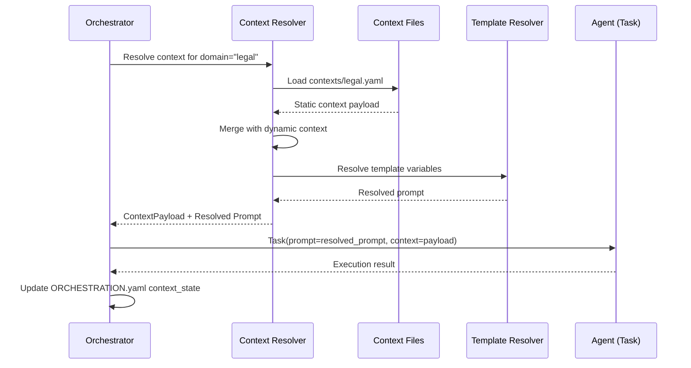
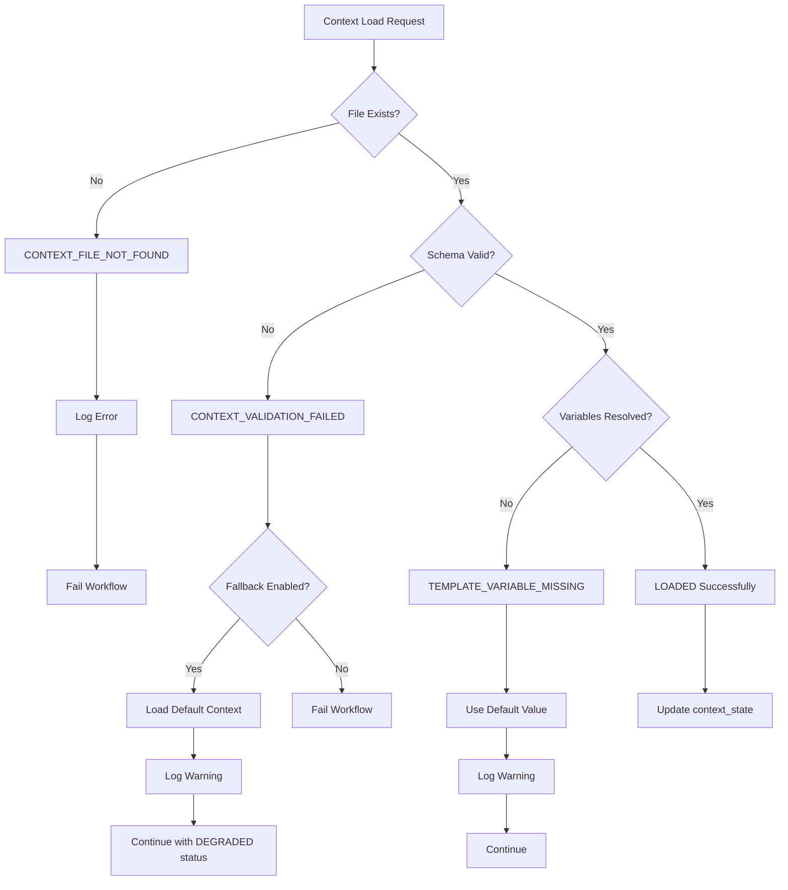
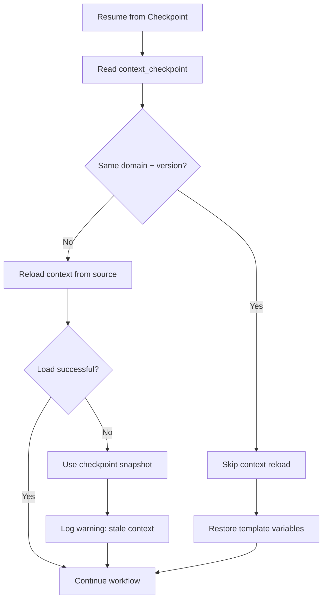

# EN-006: Orchestration Integration Design

<!--
DOCUMENT: en006-orchestration-integration.md
VERSION: 1.0.0
STATUS: DRAFT
TASK: TASK-036 (Phase 3)
AUTHOR: ps-architect
PURPOSE: Define how context injection integrates with Jerry's orchestration system
-->

---

## Document Control

| Attribute | Value |
|-----------|-------|
| **Document ID** | EN006-OID-001 |
| **Version** | 1.0.0 |
| **Status** | DRAFT |
| **Created** | 2026-01-27 |
| **Author** | ps-architect |
| **Task** | TASK-036 (Phase 3) |

### Revision History

| Version | Date | Author | Description |
|---------|------|--------|-------------|
| 1.0.0 | 2026-01-27 | ps-architect | Initial orchestration integration design |

### Document Relationships

| Relationship | Document | Purpose |
|--------------|----------|---------|
| **Complements** | TDD-context-injection.md | TDD provides technical design |
| **Complements** | SPEC-context-injection.md | SPEC provides implementation details |
| **Extends** | ORCHESTRATION.yaml | Schema extensions for context tracking |
| **Implements** | EN-006:DEC-002 | Claude Code Skills implementation approach |

---

## L0: Executive Summary (ELI5)

### What is Orchestration Integration?

Think of orchestration like a **movie director** who coordinates all the actors, camera operators, and crew. The director needs to tell each person:
- What scene they're in (domain context)
- What their role is (agent persona)
- What props they need (context files)
- How to react to problems (error handling)

**Orchestration integration** defines how the "director" (Jerry's orchestration system) tells agents about their context.

### The Three Integration Points

```
ORCHESTRATION INTEGRATION (Like a Movie Set)
============================================

1. SCRIPT NOTES (SKILL.md)
   ┌─────────────────────────────────────┐
   │ "This skill supports legal,         │
   │  sales, and engineering contexts"   │
   └─────────────────────────────────────┘
              │
              ▼
2. SHOOTING SCHEDULE (ORCHESTRATION_PLAN.yaml)
   ┌─────────────────────────────────────┐
   │ Phase 1: Load legal context         │
   │ Phase 2: Run extraction agents      │
   │ Phase 3: Format output              │
   └─────────────────────────────────────┘
              │
              ▼
3. DAILY LOG (ORCHESTRATION.yaml)
   ┌─────────────────────────────────────┐
   │ Context loaded: ✓ legal-v1.2.0     │
   │ Agents executed: ts-parser, ...    │
   │ Status: IN_PROGRESS                 │
   └─────────────────────────────────────┘
```

### Key Benefits

| Before Integration | After Integration |
|-------------------|-------------------|
| Manually specify context in each prompt | Declare once in skill, use everywhere |
| No visibility into context state | Full tracking in ORCHESTRATION.yaml |
| Error handling ad-hoc | Standardized error propagation |
| Restart loses context | Checkpoint recovery preserves context |

---

## L1: Technical Design (Software Engineer)

### 1. Integration Points Overview

```mermaid
flowchart TB
    subgraph SKILL["SKILL.md (Declaration)"]
        S1[context_injection section]
        S2[supported domains]
        S3[schema reference]
    end

    subgraph PLAN["ORCHESTRATION_PLAN.yaml (Planning)"]
        P1[context_injection config]
        P2[domain selection]
        P3[file mappings]
    end

    subgraph STATE["ORCHESTRATION.yaml (Runtime)"]
        ST1[context_status]
        ST2[loaded_domains]
        ST3[error_state]
    end

    subgraph AGENTS["Agent Invocation"]
        A1[Context Resolution]
        A2[Prompt Merging]
        A3[Task() call]
    end

    SKILL --> PLAN
    PLAN --> STATE
    STATE --> AGENTS
    A3 -->|execution results| STATE
```

### 2. SKILL.md Context Injection Section

#### 2.1 Schema Definition

```yaml
# SKILL.md context_injection section schema
context_injection:
  # Required: Enable/disable context injection for this skill
  enabled: boolean  # default: false

  # Required when enabled: List of supported domains
  supported_domains:
    - domain: string          # domain identifier (e.g., "legal")
      display_name: string    # human-readable name
      context_file: string    # path to contexts/{domain}.yaml
      required: boolean       # true if this domain must be explicitly selected

  # Optional: Default domain if none specified
  default_domain: string | null

  # Optional: Schema for validation
  schema_ref: string  # path to JSON Schema (e.g., "schemas/context-injection-schema.json")

  # Optional: Template variable definitions
  template_variables:
    - name: string            # variable name (used as {{$name}})
      source: string          # "static" | "dynamic" | "computed"
      required: boolean       # is this variable required?
      default: any           # default value if not provided

  # Optional: Injection behavior
  behavior:
    merge_strategy: string    # "replace" | "append" | "prepend"
    fallback_enabled: boolean # use default context on load failure
    validation_level: string  # "strict" | "warn" | "none"
```

#### 2.2 SKILL.md Example

```markdown
<!-- SKILL.md for transcript skill -->

## Context Injection

This skill supports domain-specific context injection for specialized transcript analysis.

### Supported Domains

| Domain | Description | Context File |
|--------|-------------|--------------|
| software-engineering | Standups, sprint planning, code reviews | `contexts/software-engineering.yaml` |
| software-architecture | Architecture reviews, ADR discussions | `contexts/software-architecture.yaml` |
| product-management | Product strategy, roadmap planning | `contexts/product-management.yaml` |
| user-experience | UX research interviews, usability testing | `contexts/user-experience.yaml` |
| cloud-engineering | Incident post-mortems, capacity planning | `contexts/cloud-engineering.yaml` |
| security-engineering | Security audits, threat modeling | `contexts/security-engineering.yaml` |

### Usage

To invoke with a specific domain:

```bash
/transcript --domain software-engineering
```

### Template Variables

| Variable | Description | Source |
|----------|-------------|--------|
| `{{$domain}}` | Active domain identifier | Runtime |
| `{{$entities}}` | Entity definitions from context | Static |
| `{{$extraction_rules}}` | Domain-specific extraction rules | Static |
| `{{$prompt_guidance}}` | Expert extraction guidance | Static |
```

### 3. ORCHESTRATION_PLAN.yaml Extension

#### 3.1 Schema Extension

```yaml
# ORCHESTRATION_PLAN.yaml context_injection section
context_injection:
  # Enable context injection for this workflow
  enabled: boolean

  # Domain selection
  domain: string              # selected domain from SKILL.md supported_domains

  # Optional: Override default context files
  context_overrides:
    - type: string            # "entity_definitions" | "extraction_rules" | "prompt_template"
      path: string            # override file path

  # Optional: Additional prompt overrides per agent
  prompt_overrides:
    agent_id:                 # e.g., "ts-extractor"
      template: string        # path to custom prompt template
      variables: object       # additional template variables

  # Injection points configuration
  injection_points:
    orchestration_plan: boolean  # inject at plan level (default: true)
    agent_invocation: boolean    # inject at each agent call (default: true)
    artifact_metadata: boolean   # inject in artifact headers (default: false)
```

#### 3.2 ORCHESTRATION_PLAN.yaml Example

```yaml
# ORCHESTRATION_PLAN.yaml for legal transcript analysis
workflow:
  id: "transcript-legal-20260127-001"
  name: "Legal Transcript Analysis"

context_injection:
  enabled: true
  domain: "legal"

  context_overrides:
    - type: "prompt_template"
      path: "prompts/custom-legal-extraction.md"

  prompt_overrides:
    ts-extractor:
      template: "prompts/legal-party-extraction.md"
      variables:
        jurisdiction: "US"
        confidentiality_level: "high"

  injection_points:
    orchestration_plan: true
    agent_invocation: true
    artifact_metadata: true

phases:
  - id: 1
    name: "Parse & Extract"
    agents:
      - id: "ts-parser"
        # Context automatically injected via injection_points.agent_invocation
      - id: "ts-extractor"
        # Custom prompt override applied from prompt_overrides.ts-extractor
```

### 4. ORCHESTRATION.yaml State Tracking

#### 4.1 Schema Extension

```yaml
# ORCHESTRATION.yaml context_injection state section
context_state:
  # Current context status
  status: string              # "NOT_LOADED" | "LOADING" | "LOADED" | "FAILED" | "DEGRADED"

  # Loaded domain information
  loaded_domain:
    id: string                # domain identifier
    version: string           # schema version from context file
    loaded_at: datetime       # ISO 8601 timestamp
    source: string            # path to loaded context file

  # Validation results
  validation:
    status: string            # "PASSED" | "FAILED" | "SKIPPED"
    errors: array[string]     # list of validation errors
    warnings: array[string]   # list of validation warnings

  # Error state (if status is FAILED or DEGRADED)
  error:
    type: string              # error classification
    message: string           # human-readable error message
    recoverable: boolean      # can workflow continue?
    fallback_used: boolean    # was fallback context used?

  # Per-agent context usage
  agent_context_usage:
    agent_id:
      context_injected: boolean
      template_variables_resolved: array[string]
      injection_timestamp: datetime
```

#### 4.2 ORCHESTRATION.yaml State Example

```yaml
# ORCHESTRATION.yaml runtime state
workflow:
  id: "transcript-legal-20260127-001"
  status: "ACTIVE"

context_state:
  status: "LOADED"

  loaded_domain:
    id: "legal"
    version: "1.2.0"
    loaded_at: "2026-01-27T10:15:00Z"
    source: "contexts/legal.yaml"

  validation:
    status: "PASSED"
    errors: []
    warnings:
      - "Optional field 'confidence_thresholds' not specified; using defaults"

  error: null

  agent_context_usage:
    ts-parser:
      context_injected: true
      template_variables_resolved:
        - "domain"
        - "entities"
      injection_timestamp: "2026-01-27T10:15:05Z"
    ts-extractor:
      context_injected: true
      template_variables_resolved:
        - "domain"
        - "entities"
        - "extraction_rules"
        - "prompt_guidance"
      injection_timestamp: "2026-01-27T10:15:10Z"

checkpoints:
  - id: "cp-001"
    timestamp: "2026-01-27T10:15:00Z"
    trigger: "CONTEXT_LOADED"
    context_snapshot:
      domain: "legal"
      version: "1.2.0"
```

### 5. Agent Invocation Interface

#### 5.1 Context Resolution Flow



#### 5.2 Task() Invocation Pattern

```python
# Pseudocode for context-injected agent invocation
def invoke_agent_with_context(agent_id: str, workflow_context: WorkflowContext):
    # Step 1: Resolve context from ORCHESTRATION_PLAN
    plan = workflow_context.orchestration_plan
    domain = plan.context_injection.domain

    # Step 2: Load static context
    context_file = f"contexts/{domain}.yaml"
    static_context = load_context_file(context_file)

    # Step 3: Apply prompt overrides if configured
    overrides = plan.context_injection.prompt_overrides.get(agent_id, {})
    custom_template = overrides.get("template")
    extra_variables = overrides.get("variables", {})

    # Step 4: Resolve template variables
    template_vars = {
        "$domain": domain,
        "$entities": static_context.entity_definitions,
        "$extraction_rules": static_context.extraction_rules,
        "$prompt_guidance": static_context.prompt_guidance,
        **extra_variables
    }

    # Step 5: Get base prompt (from AGENT.md or custom template)
    base_prompt = load_agent_prompt(agent_id, custom_template)
    resolved_prompt = resolve_template(base_prompt, template_vars)

    # Step 6: Invoke agent with context
    result = Task(
        description=f"{agent_id} execution",
        prompt=resolved_prompt,
        subagent_type="general-purpose"
    )

    # Step 7: Update state tracking
    update_context_state(workflow_context, agent_id, template_vars)

    return result
```

#### 5.3 AGENT.md Context Integration

AGENT.md files can reference context injection through template variables:

```markdown
<!-- AGENT.md for ts-extractor -->

# ts-extractor Agent

## Context

This agent operates within the **{{$domain}}** domain.

## Entity Definitions

The following entities are configured for extraction:

{{$entities}}

## Extraction Rules

Apply these rules in order:

{{$extraction_rules}}

## Expert Guidance

{{$prompt_guidance}}

## Execution

Given the above context, extract all relevant entities from the provided transcript segment.
```

### 6. Error Propagation Flow

#### 6.1 Error Classification

| Error Type | Severity | Recoverable | Action |
|------------|----------|-------------|--------|
| `CONTEXT_FILE_NOT_FOUND` | CRITICAL | No | Fail workflow, report error |
| `CONTEXT_VALIDATION_FAILED` | HIGH | Conditional | Use fallback if enabled, else fail |
| `TEMPLATE_VARIABLE_MISSING` | MEDIUM | Yes | Use default value, log warning |
| `CONTEXT_LOAD_TIMEOUT` | MEDIUM | Yes | Retry with exponential backoff |
| `SCHEMA_VERSION_MISMATCH` | LOW | Yes | Log warning, continue with validation |

#### 6.2 Error Propagation Diagram



#### 6.3 Error State in ORCHESTRATION.yaml

```yaml
context_state:
  status: "DEGRADED"

  error:
    type: "CONTEXT_VALIDATION_FAILED"
    message: "Field 'entity_definitions.party.attributes' missing required 'jurisdiction'"
    recoverable: true
    fallback_used: true

  validation:
    status: "FAILED"
    errors:
      - "entity_definitions.party.attributes: missing required field 'jurisdiction'"
    warnings: []

  loaded_domain:
    id: "legal"
    version: "1.1.0"  # fallback version
    loaded_at: "2026-01-27T10:15:00Z"
    source: "contexts/legal-fallback.yaml"
```

### 7. P-003 Compliance (Single Agent Nesting)

#### 7.1 Compliance Requirements

Per Jerry Constitution P-003, context injection must NOT create additional agent nesting levels:

```
ALLOWED:
┌──────────────────────────────────────────────────────────┐
│  Main Context (Claude)                                    │
│       │                                                   │
│       ├──► Context Resolver (function, NOT agent)        │
│       │                                                   │
│       └──► ts-extractor (ONE level of nesting)           │
│                                                           │
└──────────────────────────────────────────────────────────┘

NOT ALLOWED:
┌──────────────────────────────────────────────────────────┐
│  Main Context (Claude)                                    │
│       │                                                   │
│       └──► Context Loader Agent (violation!)             │
│                 │                                         │
│                 └──► ts-extractor (second nesting!)      │
│                                                           │
└──────────────────────────────────────────────────────────┘
```

#### 7.2 Implementation Constraints

| Component | Implementation | P-003 Status |
|-----------|----------------|--------------|
| Context Resolution | Synchronous function call | COMPLIANT |
| File Loading | Direct filesystem read | COMPLIANT |
| Schema Validation | JSON Schema validation function | COMPLIANT |
| Template Resolution | String interpolation function | COMPLIANT |
| Agent Invocation | Single Task() call | COMPLIANT |

### 8. Checkpoint and Recovery

#### 8.1 Context Checkpoint Data

When creating checkpoints, include context state for recovery:

```yaml
checkpoints:
  - id: "cp-003"
    timestamp: "2026-01-27T10:30:00Z"
    trigger: "PHASE_COMPLETE"
    phase_completed: 2

    # Context checkpoint data
    context_checkpoint:
      domain: "legal"
      version: "1.2.0"
      source: "contexts/legal.yaml"
      status: "LOADED"
      template_variables_snapshot:
        domain: "legal"
        entities: "sha256:abc123..."  # hash of entity definitions
        extraction_rules: "sha256:def456..."
```

#### 8.2 Recovery Flow



---

## L2: Architectural Implications (Principal Architect)

### 9. Trade-offs and Decisions

#### 9.1 Context Resolution Timing

| Option | Pros | Cons | Decision |
|--------|------|------|----------|
| **Eager (at workflow start)** | Single load, consistent across agents | Stale if context files change mid-workflow | **SELECTED** |
| Lazy (at each agent invocation) | Always fresh | Higher latency, potential inconsistency | Rejected |
| Hybrid (eager + refresh triggers) | Balance freshness/performance | Complexity, state management | Future enhancement |

**Rationale:** Eager loading ensures all agents see consistent context. Workflows are typically short-lived, so staleness is unlikely.

#### 9.2 Fallback Strategy

| Option | Pros | Cons | Decision |
|--------|------|------|----------|
| **Graceful degradation** | Workflow continues, partial results | May produce lower-quality output | **SELECTED for non-critical** |
| Fail fast | Clear error, no ambiguity | Workflow stops entirely | **SELECTED for critical** |
| No fallback | Simple implementation | Poor user experience | Rejected |

**Rationale:** Configurable per-workflow via `behavior.fallback_enabled`. Critical domains (legal, security) default to fail-fast; others use graceful degradation.

#### 9.3 Backward Compatibility

| Concern | Mitigation |
|---------|------------|
| Existing skills without context_injection | Section is optional; skills work unchanged |
| Existing ORCHESTRATION_PLAN.yaml without context | context_injection defaults to `enabled: false` |
| Existing ORCHESTRATION.yaml without context_state | context_state added dynamically when needed |
| Old context file versions | Schema version validation with clear error messages |

### 10. Integration Testing Strategy

#### 10.1 Test Scenarios

| Scenario | Test Type | Validation |
|----------|-----------|------------|
| Happy path: context loads successfully | Integration | context_state.status == "LOADED" |
| Context file not found | Negative | workflow fails with clear error |
| Schema validation failure with fallback | Negative | context_state.status == "DEGRADED" |
| Template variable missing with default | Edge | warning logged, default used |
| Checkpoint recovery with stale context | Recovery | warning logged, workflow continues |
| P-003 compliance | Architecture | no nested agent invocations |

#### 10.2 Test Data

Test context files located at:
- `tests/fixtures/contexts/valid-legal.yaml`
- `tests/fixtures/contexts/invalid-schema.yaml`
- `tests/fixtures/contexts/missing-fields.yaml`

---

## Acceptance Criteria Verification

| AC ID | Criterion | Status | Evidence |
|-------|-----------|--------|----------|
| AC-001 | SKILL.md context_injection section schema defined | ✅ | Section 2.1, 2.2 |
| AC-002 | ORCHESTRATION_PLAN.yaml extension documented | ✅ | Section 3.1, 3.2 |
| AC-003 | ORCHESTRATION.yaml state tracking designed | ✅ | Section 4.1, 4.2 |
| AC-004 | Agent invocation interface specified | ✅ | Section 5.1, 5.2, 5.3 |
| AC-005 | Error propagation flow documented | ✅ | Section 6.1, 6.2, 6.3 |
| AC-006 | P-003 (single nesting) compliance verified | ✅ | Section 7.1, 7.2 |
| AC-007 | Mermaid diagrams for integration flow | ✅ | Sections 1, 5.1, 6.2, 8.2 |
| AC-008 | Example configurations provided | ✅ | Sections 2.2, 3.2, 4.2 |
| AC-009 | Backward compatibility addressed | ✅ | Section 9.3 |

---

## References

| Document | Relationship |
|----------|--------------|
| [TDD-context-injection.md](./TDD-context-injection.md) | Technical design source |
| [SPEC-context-injection.md](../specs/SPEC-context-injection.md) | Implementation specification |
| [EN-006:DEC-002](../EN-006--DEC-002-implementation-approach.md) | Claude Code Skills decision |
| [context-injection-schema.json](../specs/schemas/context-injection-schema.json) | JSON Schema for validation |
| [Jerry Constitution](../../../../../../docs/governance/JERRY_CONSTITUTION.md) | P-003 compliance source |

---

*Document ID: EN006-OID-001*
*Task: TASK-036*
*Phase: 3 (Integration, Risk & Examples)*
*Author: ps-architect*
*Created: 2026-01-27*
