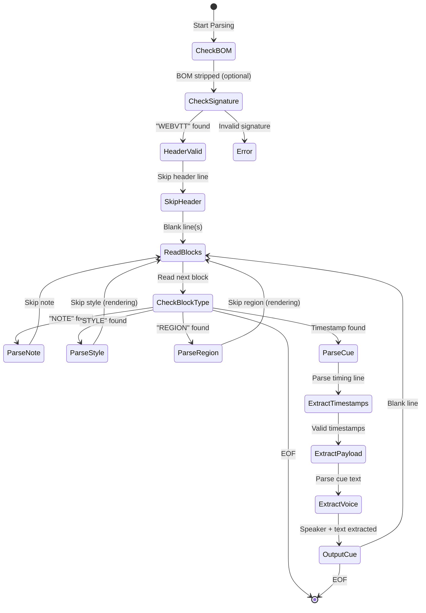
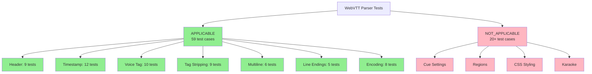

# WebVTT Test Suites and Edge Cases Research

> **Document ID:** EN-007-research-e-001
> **PS ID:** EN-007-research
> **Entry ID:** e-001
> **Author:** ps-researcher agent
> **Date:** 2026-01-27
> **Status:** COMPLETE

---

## Executive Summary

This document synthesizes research on WebVTT test suites, edge cases, and parsing challenges. It provides categorized test cases filtered for transcript parsing applicability (vs. rendering-only concerns) and recommends specific test vectors for adoption.

---

## L0: Simple Summary (ELI5)

Think of WebVTT files like a recipe card for video captions. The W3C (the people who make web standards) created a "checklist" to make sure everyone reads these recipe cards the same way.

There are **three main checklists** we found:
1. **web-platform-tests (WPT)** - The "official" checklist used by all browsers
2. **Mozilla vtt.js** - Firefox's personal checklist
3. **W3C webvtt.js** - A special checker that runs in your browser

For our transcript skill, we only care about:
- Reading who is speaking (like `<v John>Hello</v>`)
- Reading the timestamps (when things are said)
- Reading the actual words

We DON'T care about:
- Making things look pretty (colors, fonts, position)
- Karaoke effects (word-by-word highlighting)
- Where subtitles appear on screen

---

## L1: Technical Details (Engineer)

### 1. Authoritative Test Suites Identified

| Repository | Purpose | Location | Maintainer |
|------------|---------|----------|------------|
| **web-platform-tests/wpt** | Cross-browser interoperability | [github.com/web-platform-tests/wpt/tree/master/webvtt](https://github.com/web-platform-tests/wpt/tree/master/webvtt) | W3C + Browser Vendors |
| **w3c/webvtt.js** | Reference parser + validator | [github.com/w3c/webvtt.js](https://github.com/w3c/webvtt.js) | W3C |
| **mozilla/vtt.js** | Firefox implementation | [github.com/mozilla/vtt.js](https://github.com/mozilla/vtt.js) | Mozilla |

### 2. WPT Test Categories

The web-platform-tests WebVTT suite contains **43+ test files** organized by category:

| Category | Count | Description | Applicable? |
|----------|-------|-------------|-------------|
| Signature Tests | 6 | WebVTT file header validation (BOM, spaces, tabs, newlines) | **YES** |
| Timing Tests | 7 | Timestamp parsing, edge cases, format compliance | **YES** |
| Cue Settings Tests | 7 | Alignment, positioning, sizing, regions, text direction | NO |
| Region Tests | 6 | Region definitions, anchoring, scrolling behavior | NO |
| Parsing Edge Cases | 5+ | Comments, newline handling, null characters, whitespace | **YES** |
| Content/Rendering Tests | 3+ | Arrows, stylesheets, visual rendering | NO |

### 3. WebVTT Header Edge Cases

**Specification Requirements:**
- Must begin with `WEBVTT` (exactly 6 characters)
- If >6 characters, 7th must be SPACE, TAB, or LF
- Optional UTF-8 BOM (U+FEFF, encoded as `0xEF 0xBB 0xBF`)

**Test Cases (APPLICABLE):**

| ID | Test Case | Expected Behavior |
|----|-----------|-------------------|
| HDR-001 | `WEBVTT` only (no trailing content) | Valid |
| HDR-002 | `WEBVTT\n` (with LF) | Valid |
| HDR-003 | `WEBVTT\r\n` (with CRLF) | Valid |
| HDR-004 | `WEBVTT description` (with space + text) | Valid |
| HDR-005 | `WEBVTT\ttab-description` (with tab + text) | Valid |
| HDR-006 | UTF-8 BOM + `WEBVTT` | Valid |
| HDR-007 | `WEBVTT1` (invalid - no separator after 6 chars) | Invalid |
| HDR-008 | `webvtt` (lowercase) | Invalid |
| HDR-009 | ` WEBVTT` (leading space) | Invalid |

### 4. Timestamp Format Edge Cases

**Specification (per MDN and W3C):**
- Format: `[hh:]mm:ss.ttt` where hours are optional
- Hours: >=2 digits (can exceed 2, e.g., `9999:00:00.000`)
- Minutes: 00-59 inclusive
- Seconds: 00-59 inclusive
- Milliseconds: 000-999 inclusive (dot separator, NOT comma)
- Arrow: ` --> ` (with spaces)

**Test Cases (APPLICABLE):**

| ID | Test Case | Expected Behavior |
|----|-----------|-------------------|
| TS-001 | `00:00.000 --> 00:01.000` (no hours) | Valid |
| TS-002 | `00:00:00.000 --> 00:00:01.000` (with hours) | Valid |
| TS-003 | `9999:00:00.000 --> 9999:00:01.000` (>2 hour digits) | Valid |
| TS-004 | `00:59.999 --> 01:00.000` (minute boundary) | Valid |
| TS-005 | `00:00:59.999 --> 00:01:00.000` (minute boundary with hours) | Valid |
| TS-006 | `00:00.000-->00:01.000` (no spaces around arrow) | **Browser-dependent** |
| TS-007 | `0:00.000 --> 0:01.000` (single-digit minutes) | Invalid |
| TS-008 | `00:60.000 --> 00:61.000` (invalid minute) | Invalid |
| TS-009 | `00:00,000 --> 00:01,000` (comma separator - SRT style) | Invalid |
| TS-010 | `.5 --> 1.0` (malformed - no minutes) | Invalid |
| TS-011 | `5. --> 6.` (malformed - no milliseconds) | Invalid |
| TS-012 | `00:01.000 --> 00:00.000` (end < start) | Invalid (but may parse) |

### 5. Voice Tag Edge Cases

**Specification:**
- Format: `<v annotation>text</v>`
- The annotation represents the speaker name
- End tag may be omitted if voice span is entire cue
- Can include classes: `<v.loud Mary>text</v>`

**Test Cases (APPLICABLE):**

| ID | Test Case | Expected Behavior |
|----|-----------|-------------------|
| VT-001 | `<v John>Hello</v>` | Speaker: "John", Text: "Hello" |
| VT-002 | `<v John Smith>Hello</v>` | Speaker: "John Smith" |
| VT-003 | `<v>Hello</v>` (empty annotation) | Speaker: "" (empty string) |
| VT-004 | `<v John>Hello` (no closing tag) | Valid if entire cue |
| VT-005 | `<v John>Hello</v> more text` | Speaker: "John" applies to "Hello" only |
| VT-006 | `<v.loud John>Hello</v>` (with class) | Speaker: "John", Class: "loud" |
| VT-007 | `<v.first.loud Mary>Hi!</v>` (multiple classes) | Speaker: "Mary" |
| VT-008 | Nested: `<v John><b>Bold</b></v>` | Speaker: "John", Text: "Bold" |
| VT-009 | Multiple: `<v John>Hi</v> <v Mary>Hello</v>` | Extract both speakers |
| VT-010 | Multiline voice: `<v John>Line1\nLine2</v>` | Speaker spans lines |

### 6. Cue Text Tag Stripping

**Tags to Strip (for plain text extraction):**

| Tag | Purpose | Strip? |
|-----|---------|--------|
| `<b>` | Bold | YES |
| `<i>` | Italic | YES |
| `<u>` | Underline | YES |
| `<c>` | Class span | YES |
| `<lang>` | Language | YES |
| `<v>` | Voice | YES (but extract speaker name) |
| `<ruby>`, `<rt>` | Ruby characters | YES |
| `<timestamp>` | Karaoke timing | YES |

**Test Cases (APPLICABLE):**

| ID | Test Case | Expected Text Output |
|----|-----------|---------------------|
| TT-001 | `<b>Bold</b> text` | "Bold text" |
| TT-002 | `<i>Italic</i>` | "Italic" |
| TT-003 | `<u>Under</u>line` | "Underline" |
| TT-004 | `<c.highlight>Class</c> text` | "Class text" |
| TT-005 | `<lang en>English</lang>` | "English" |
| TT-006 | `<ruby>Base<rt>annotation</rt></ruby>` | "Baseannotation" or "Base" |
| TT-007 | `Text <00:01.500>with timestamp` | "Text with timestamp" |
| TT-008 | Nested: `<b><i>Bold Italic</i></b>` | "Bold Italic" |
| TT-009 | Malformed: `<b>No close` | "No close" |

### 7. Multiline Cue Handling

**Specification:**
- Payload can span multiple lines
- Line separators preserved in display
- Blank line (two consecutive newlines) terminates cue
- Single newlines within payload are valid

**Test Cases (APPLICABLE):**

| ID | Test Case | Expected Behavior |
|----|-----------|-------------------|
| ML-001 | `Line1\nLine2` | Text: "Line1 Line2" (joined with space per our spec) |
| ML-002 | `Line1\r\nLine2` (CRLF) | Text: "Line1 Line2" |
| ML-003 | `Single line` | Text: "Single line" |
| ML-004 | `   Indented` (leading whitespace) | Text: "Indented" (trimmed) |
| ML-005 | `Trailing   ` (trailing whitespace) | Text: "Trailing" (trimmed) |
| ML-006 | `Line1\n\nLine2` (blank line) | Second line is next cue! |

### 8. Line Terminator Edge Cases

**Specification:**
- Valid terminators: LF (`\n`), CR (`\r`), CRLF (`\r\n`)
- Many parsers only handle LF correctly (implementation bug)

**Test Cases (APPLICABLE):**

| ID | Test Case | Expected Behavior |
|----|-----------|-------------------|
| LT-001 | Unix line endings (LF) | Valid |
| LT-002 | Windows line endings (CRLF) | Valid |
| LT-003 | Old Mac line endings (CR only) | Valid |
| LT-004 | Mixed LF and CRLF | Valid |
| LT-005 | CRLF split across chunks (streaming) | Valid (but tricky) |

### 9. Character Encoding and Escaping

**Specification:**
- MUST be UTF-8
- Forbidden in payloads: `-->`, raw `&`, raw `<`
- Required escapes: `&amp;`, `&lt;`, `&gt;`

**Test Cases (APPLICABLE):**

| ID | Test Case | Expected Behavior |
|----|-----------|-------------------|
| CE-001 | UTF-8 with BOM | Valid, BOM stripped |
| CE-002 | UTF-8 without BOM | Valid |
| CE-003 | Non-ASCII: `Caf\xc3\xa9` (UTF-8 "Caf") | Valid, decoded correctly |
| CE-004 | Unicode: `\u4e2d\u6587` (Chinese) | Valid |
| CE-005 | `&amp;` in text | Text: "&" |
| CE-006 | `&lt;` in text | Text: "<" |
| CE-007 | `&nbsp;` in text | Text: " " (non-breaking space) |
| CE-008 | Raw `&` in text | Invalid (but may parse) |

### 10. Cue Identifier Edge Cases

**Specification:**
- Optional identifier on line before timestamps
- Cannot contain `-->` or newlines
- Used for linking/scripting (not for parsing transcripts)

**Test Cases (APPLICABLE - for validation, not extraction):**

| ID | Test Case | Expected Behavior |
|----|-----------|-------------------|
| CI-001 | `Cue1\n00:00.000 --> 00:01.000` | Valid, identifier "Cue1" |
| CI-002 | `123\n00:00.000 --> 00:01.000` | Valid, numeric identifier |
| CI-003 | No identifier (timestamps first) | Valid |
| CI-004 | Empty identifier (blank line before timestamps) | Valid |
| CI-005 | Identifier with `-->` | Invalid |

---

## L2: Architectural Recommendations (Architect)

### 1. Test Strategy Matrix

```
                          ┌─────────────────────────────────────┐
                          │     WebVTT Test Coverage Matrix     │
                          └─────────────────────────────────────┘

    ┌──────────────────────────────────────────────────────────────────┐
    │                        APPLICABLE                                 │
    │  ┌─────────────┐  ┌─────────────┐  ┌─────────────┐  ┌──────────┐ │
    │  │   Header    │  │  Timestamp  │  │  Voice Tag  │  │   Cue    │ │
    │  │  Signature  │  │   Format    │  │   Parsing   │  │   Text   │ │
    │  │   9 tests   │  │  12 tests   │  │  10 tests   │  │ 9 tests  │ │
    │  └─────────────┘  └─────────────┘  └─────────────┘  └──────────┘ │
    │  ┌─────────────┐  ┌─────────────┐  ┌─────────────┐              │
    │  │  Multiline  │  │    Line     │  │  Encoding/  │              │
    │  │   Payload   │  │ Terminator  │  │  Escaping   │              │
    │  │   6 tests   │  │   5 tests   │  │   8 tests   │              │
    │  └─────────────┘  └─────────────┘  └─────────────┘              │
    └──────────────────────────────────────────────────────────────────┘

    ┌──────────────────────────────────────────────────────────────────┐
    │                      NOT APPLICABLE                               │
    │  ┌─────────────┐  ┌─────────────┐  ┌─────────────┐  ┌──────────┐ │
    │  │    Cue      │  │   Region    │  │   CSS/      │  │ Karaoke  │ │
    │  │  Settings   │  │ Definition  │  │  Styling    │  │ Effects  │ │
    │  │ (position,  │  │ (viewport,  │  │ (colors,    │  │(word-by- │ │
    │  │  align)     │  │  scroll)    │  │  fonts)     │  │  word)   │ │
    │  └─────────────┘  └─────────────┘  └─────────────┘  └──────────┘ │
    └──────────────────────────────────────────────────────────────────┘
```

### 2. Recommended Test Vectors for Adoption

#### 2.1 Priority 1: Core Parsing (MUST HAVE)

**From WPT Repository:**
```
wpt/webvtt/parsing/file-parsing/tests/
├── signature-*.vtt                    # Header validation
├── timings-*.vtt                      # Timestamp parsing
├── header-*.vtt                       # Header edge cases
└── (derive voice tag tests locally)   # WPT lacks comprehensive voice tests
```

**Create Derivative Files For:**
1. Voice tag variations (VT-001 through VT-010)
2. Multiline payload joining (ML-001 through ML-006)
3. Tag stripping (TT-001 through TT-009)

#### 2.2 Priority 2: Robustness (SHOULD HAVE)

- Line terminator variations (LT-001 through LT-005)
- Character encoding (CE-001 through CE-008)
- Cue identifier handling (CI-001 through CI-005)

#### 2.3 Priority 3: Edge Cases (NICE TO HAVE)

- Malformed timestamps that parsers tolerate
- Real-world files from popular platforms (YouTube, Zoom, Teams)

### 3. Gap Analysis

| Category | WPT Coverage | Our Need | Gap |
|----------|-------------|----------|-----|
| Header | Excellent | Header validation | None |
| Timestamps | Good | Timestamp normalization | Minor |
| Voice Tags | **Poor** | Speaker extraction | **MAJOR** |
| Tag Stripping | Limited | Plain text extraction | Moderate |
| Multiline | Limited | Payload joining | Moderate |
| Encoding | Good | UTF-8 handling | None |

### 4. Tradeoffs and Decisions

| Decision | Tradeoff | Recommendation |
|----------|----------|----------------|
| Adopt WPT tests wholesale vs. cherry-pick | Maintenance burden vs. coverage | **Cherry-pick** - only parsing tests |
| Create own voice tag tests vs. use existing | Effort vs. spec alignment | **Create own** - WPT gap is significant |
| Strict vs. lenient parsing | Correctness vs. real-world compat | **Lenient** - real files are messy |
| Test with browser engines vs. standalone | Dependency vs. authority | **Standalone** - our parser is Python |

### 5. Performance Implications

| Test Type | Time Impact | Resource Impact |
|-----------|-------------|-----------------|
| Unit tests (parsing) | ~1ms per file | Minimal |
| Property-based tests | ~100ms per property | CPU-intensive |
| Real-world corpus | ~10ms per file | I/O-bound |
| Fuzzing | Hours | Memory-intensive |

**Recommendation:** Start with deterministic unit tests, add property-based tests for robustness, defer fuzzing to hardening phase.

---

## Test Case Inventory

### Categorized Test Cases: APPLICABLE vs NOT_APPLICABLE

| ID | Name | Category | Applicable? | Rationale |
|----|------|----------|-------------|-----------|
| HDR-001 | Minimal WEBVTT header | Header | **YES** | Required for file validation |
| HDR-002 | WEBVTT with LF | Header | **YES** | Required for file validation |
| HDR-003 | WEBVTT with CRLF | Header | **YES** | Required for file validation |
| HDR-004 | WEBVTT with description | Header | **YES** | Required for file validation |
| HDR-005 | WEBVTT with tab | Header | **YES** | Required for file validation |
| HDR-006 | UTF-8 BOM + WEBVTT | Header | **YES** | Required for file validation |
| HDR-007 | Invalid - no separator | Header | **YES** | Error handling |
| HDR-008 | Invalid - lowercase | Header | **YES** | Error handling |
| HDR-009 | Invalid - leading space | Header | **YES** | Error handling |
| TS-001 | No hours timestamp | Timestamp | **YES** | Core parsing |
| TS-002 | With hours timestamp | Timestamp | **YES** | Core parsing |
| TS-003 | Extended hours (>2 digits) | Timestamp | **YES** | Edge case |
| TS-004 | Minute boundary | Timestamp | **YES** | Edge case |
| TS-005 | Minute boundary with hours | Timestamp | **YES** | Edge case |
| TS-006 | No spaces around arrow | Timestamp | **YES** | Lenient parsing |
| TS-007 | Single-digit minutes | Timestamp | **YES** | Error handling |
| TS-008 | Invalid minute (60) | Timestamp | **YES** | Error handling |
| TS-009 | Comma separator (SRT style) | Timestamp | **YES** | Format detection |
| TS-010 | Malformed - no minutes | Timestamp | **YES** | Error handling |
| TS-011 | Malformed - no milliseconds | Timestamp | **YES** | Error handling |
| TS-012 | End before start | Timestamp | **YES** | Validation |
| VT-001 | Basic voice tag | Voice | **YES** | Core feature |
| VT-002 | Voice with spaces | Voice | **YES** | Core feature |
| VT-003 | Empty annotation | Voice | **YES** | Edge case |
| VT-004 | No closing tag | Voice | **YES** | Lenient parsing |
| VT-005 | Partial cue | Voice | **YES** | Scope handling |
| VT-006 | Voice with class | Voice | **YES** | Class stripping |
| VT-007 | Multiple classes | Voice | **YES** | Class stripping |
| VT-008 | Nested tags | Voice | **YES** | Tag stripping |
| VT-009 | Multiple speakers | Voice | **YES** | Multi-speaker |
| VT-010 | Multiline voice | Voice | **YES** | Payload handling |
| TT-001 | Bold tag | Tags | **YES** | Tag stripping |
| TT-002 | Italic tag | Tags | **YES** | Tag stripping |
| TT-003 | Underline tag | Tags | **YES** | Tag stripping |
| TT-004 | Class tag | Tags | **YES** | Tag stripping |
| TT-005 | Language tag | Tags | **YES** | Tag stripping |
| TT-006 | Ruby annotation | Tags | **YES** | Tag stripping |
| TT-007 | Karaoke timestamp | Tags | **YES** | Tag stripping |
| TT-008 | Nested tags | Tags | **YES** | Tag stripping |
| TT-009 | Malformed tag | Tags | **YES** | Error handling |
| ML-001 | LF multiline | Multiline | **YES** | Payload joining |
| ML-002 | CRLF multiline | Multiline | **YES** | Payload joining |
| ML-003 | Single line | Multiline | **YES** | Baseline |
| ML-004 | Leading whitespace | Multiline | **YES** | Trimming |
| ML-005 | Trailing whitespace | Multiline | **YES** | Trimming |
| ML-006 | Blank line (cue split) | Multiline | **YES** | Cue termination |
| LT-001 | Unix LF | Line Endings | **YES** | Compatibility |
| LT-002 | Windows CRLF | Line Endings | **YES** | Compatibility |
| LT-003 | Old Mac CR | Line Endings | **YES** | Compatibility |
| LT-004 | Mixed endings | Line Endings | **YES** | Edge case |
| LT-005 | Chunked CRLF | Line Endings | **YES** | Streaming edge |
| CE-001 | UTF-8 with BOM | Encoding | **YES** | Core feature |
| CE-002 | UTF-8 without BOM | Encoding | **YES** | Core feature |
| CE-003 | Non-ASCII (Latin) | Encoding | **YES** | i18n |
| CE-004 | Unicode (CJK) | Encoding | **YES** | i18n |
| CE-005 | Amp entity | Encoding | **YES** | Entity decoding |
| CE-006 | Lt entity | Encoding | **YES** | Entity decoding |
| CE-007 | Nbsp entity | Encoding | **YES** | Entity decoding |
| CE-008 | Raw ampersand | Encoding | **YES** | Lenient parsing |
| CI-001 | Named identifier | Cue ID | **YES** | Validation |
| CI-002 | Numeric identifier | Cue ID | **YES** | Validation |
| CI-003 | No identifier | Cue ID | **YES** | Baseline |
| CI-004 | Empty identifier | Cue ID | **YES** | Edge case |
| CI-005 | Invalid identifier | Cue ID | **YES** | Error handling |
| SET-* | Cue settings (align, position, size) | Settings | NO | Rendering only |
| REG-* | Region definitions | Regions | NO | Rendering only |
| CSS-* | CSS styling | Styling | NO | Rendering only |
| KAR-* | Karaoke word timing | Karaoke | NO | Rendering only |
| RND-* | Visual rendering tests | Rendering | NO | Rendering only |

**Summary:**
- **APPLICABLE:** 59 test cases
- **NOT_APPLICABLE:** 20+ test cases (WPT rendering, region, styling tests)

---

## Recommended Test Vectors for Adoption

### From web-platform-tests (WPT)

Adopt the following test files from [github.com/web-platform-tests/wpt/tree/master/webvtt](https://github.com/web-platform-tests/wpt/tree/master/webvtt):

```
webvtt/parsing/file-parsing/tests/
├── signature-valid.vtt
├── signature-bom.vtt
├── signature-space.vtt
├── signature-tab.vtt
├── signature-newline.vtt
├── signature-invalid.vtt
├── header-no-newline.vtt
├── header-newline.vtt
├── timings-garbage.vtt
├── timings-60.vtt
├── timings-eof.vtt
└── timings-* (all timing tests)
```

### Create Derivative Test Files

Due to WPT gaps in voice tag coverage, create these files locally:

**File: `test_data/vtt/voice_tag_basic.vtt`**
```webvtt
WEBVTT

00:00.000 --> 00:01.000
<v John>Hello world</v>

00:01.000 --> 00:02.000
<v Mary Smith>How are you?</v>
```

**File: `test_data/vtt/voice_tag_no_close.vtt`**
```webvtt
WEBVTT

00:00.000 --> 00:01.000
<v John>This is the entire cue
```

**File: `test_data/vtt/voice_tag_with_class.vtt`**
```webvtt
WEBVTT

00:00.000 --> 00:01.000
<v.loud.angry Boss>Where is the report?</v>
```

**File: `test_data/vtt/multi_speaker.vtt`**
```webvtt
WEBVTT

00:00.000 --> 00:02.000
<v John>Hello</v>
<v Mary>Hi there</v>
```

**File: `test_data/vtt/nested_formatting.vtt`**
```webvtt
WEBVTT

00:00.000 --> 00:01.000
<v Speaker><b>Bold</b> and <i>italic</i></v>
```

**File: `test_data/vtt/multiline_payload.vtt`**
```webvtt
WEBVTT

00:00.000 --> 00:02.000
First line
Second line
Third line
```

**File: `test_data/vtt/unicode_speakers.vtt`**
```webvtt
WEBVTT

00:00.000 --> 00:01.000
<v >Chinese greeting</v>

00:01.000 --> 00:02.000
<v >Arabic greeting</v>
```

**File: `test_data/vtt/entity_escapes.vtt`**
```webvtt
WEBVTT

00:00.000 --> 00:01.000
Tom &amp; Jerry

00:01.000 --> 00:02.000
3 &lt; 5 &gt; 2
```

---

## Sources and Citations

### Authoritative Sources

1. **W3C WebVTT Specification (TR)**
   [https://www.w3.org/TR/webvtt1/](https://www.w3.org/TR/webvtt1/)
   Candidate Recommendation - defines normative parsing behavior

2. **MDN WebVTT Format Reference**
   [https://developer.mozilla.org/en-US/docs/Web/API/WebVTT_API/Web_Video_Text_Tracks_Format](https://developer.mozilla.org/en-US/docs/Web/API/WebVTT_API/Web_Video_Text_Tracks_Format)
   Developer-friendly specification interpretation

3. **web-platform-tests WebVTT Suite**
   [https://github.com/web-platform-tests/wpt/tree/master/webvtt](https://github.com/web-platform-tests/wpt/tree/master/webvtt)
   Browser interoperability test suite (~43 tests)

4. **W3C WebVTT Implementation Report**
   [https://www.w3.org/wiki/TimedText/WebVTT_Implementation_Report](https://www.w3.org/wiki/TimedText/WebVTT_Implementation_Report)
   Browser compliance status and known issues

### Parser Implementations

5. **w3c/webvtt.js** - W3C Reference Parser
   [https://github.com/w3c/webvtt.js](https://github.com/w3c/webvtt.js)
   Live validator: [https://w3c.github.io/webvtt.js/parser.html](https://w3c.github.io/webvtt.js/parser.html)

6. **mozilla/vtt.js** - Firefox Implementation
   [https://github.com/mozilla/vtt.js](https://github.com/mozilla/vtt.js)
   Used in Firefox/Gecko rendering engine

7. **osk/node-webvtt** - Node.js Parser
   [https://github.com/osk/node-webvtt](https://github.com/osk/node-webvtt)
   Shows strict vs. lenient parsing modes

### Edge Case Discussions

8. **WebVTT Line Terminator Issue #303**
   [https://github.com/w3c/webvtt/issues/303](https://github.com/w3c/webvtt/issues/303)
   Line terminator ambiguity between header and cues

9. **WebVTT BOM Issue #292**
   [https://github.com/w3c/webvtt/issues/292](https://github.com/w3c/webvtt/issues/292)
   UTF-8 BOM encoding clarification

10. **hls.js BOM Issue #1286**
    [https://github.com/video-dev/hls.js/issues/1286](https://github.com/video-dev/hls.js/issues/1286)
    Real-world BOM parsing failure

11. **vtt.js CRLF Streaming Issue #125**
    [https://github.com/mozilla/vtt.js/issues/125](https://github.com/mozilla/vtt.js/issues/125)
    CRLF edge case when chunked streaming

---

## Appendix: Mermaid Diagrams

### WebVTT Parsing State Machine (Simplified)



### Test Coverage Hierarchy



---

## Related Documents

- **Parent Enabler:** `EN-007-vtt-parser.md`
- **Discovery:** `EN-007--DISC-001-vtt-voice-tag-gaps.md`
- **TDD Document:** `skills/transcript/docs/TDD-ts-parser.md`
- **Agent Definition:** `skills/transcript/agents/ts-parser.md`
