# EN-014: Schema Extension Workflow

<!--
DOCUMENT: Workflow Visualization
VERSION: 2.0.0
CREATED: 2026-01-29
UPDATED: 2026-01-29
PURPOSE: Visualize the iterative research/analysis/design workflow for domain schema extension
TRIGGER: Discovery that EN-006 artifacts contain features not supported by current domain-schema.json
CHANGE_LOG:
  - v1.0.0: Initial workflow with ps-critic single reviewer
  - v2.0.0: Added dual-reviewer (ps-critic + nse-qa), corrected task IDs to TASK-164..169
-->

---

## Executive Summary

This document visualizes the workflow for properly extending `domain-schema.json` to support EN-006 domain features (relationships, metadata, context_rules, validation) before transforming domain artifacts (TASK-150..159).

**Key Principles:**
1. **Iterative Self-Feedback Loop** - Adversarial review after each task, allowing upstream artifact revision
2. **Dual-Reviewer Strategy** - Both ps-critic AND nse-qa must pass (Logical AND)
3. **Mission-Critical Quality** - No shortcuts, no hacks; evidence-based decisions only

### Dual-Reviewer Rationale

| Reviewer | Skill | Focus | Why Complementary |
|----------|-------|-------|-------------------|
| **ps-critic** | @problem-solving | Quality and completeness (generalist) | "Is this good enough?" |
| **nse-qa** | @nasa-se | Process compliance and rigor (NPR 7123.1D) | "Did we follow the right process?" |
| **nse-reviewer** | @nasa-se | Technical review gates (ADR only) | "Does the decision meet mission-grade bar?" |

**Pass Criteria:** Both reviewers must achieve ≥ 0.85 (Logical AND). If either fails, the task requires revision.

---

## 1. Gap Overview

### Identified Schema Gaps

| Gap | EN-006 Source | Current Schema Support | Impact |
|-----|---------------|------------------------|--------|
| **Relationships** | Entity-to-entity links (blocks, resolves, triggers) | ❌ Not supported | Loss of semantic connections |
| **Metadata** | target_users, transcript_types, key_use_cases | ❌ Not supported | Loss of domain context |
| **Context Rules** | Meeting-type-specific extraction focus | ❌ Not supported | Loss of contextual intelligence |
| **Validation** | min_entities, required_entities | ❌ Not supported | No schema-level validation |

### Source Example (EN-006 software-engineering)

```yaml
# Features NOT in current domain-schema.json:

metadata:
  target_users: ["Software Engineers", "Tech Leads"]
  transcript_types: ["Daily standup", "Sprint planning"]
  key_use_cases: ["Track commitments", "Surface blockers"]

entities:
  blocker:
    relationships:                    # ← NOT SUPPORTED
      - type: "blocks"
        target: "commitment"
      - type: "resolved_by"
        target: "action_item"

context_rules:                        # ← NOT SUPPORTED
  standup:
    primary_entities: [commitment, blocker]
    secondary_entities: [action_item]

validation:                           # ← NOT SUPPORTED
  min_entities: 4
  required_entities: [commitment, blocker, action_item]
```

---

## 2. Workflow Overview

```mermaid
flowchart TD
    subgraph Discovery["📋 DISCOVERY PHASE"]
        DISC006["DISC-006<br/>Schema Gap Analysis"]
    end

    subgraph Research["🔬 RESEARCH PHASE"]
        T164["TASK-164<br/>Research: Schema Extensibility Patterns"]
        T164C["ps-critic + nse-qa<br/>Dual Review #1"]
        T164R{{"BOTH ≥ 0.85?"}}
    end

    subgraph Analysis["📊 ANALYSIS PHASE"]
        T165["TASK-165<br/>Analysis: Gap Impact Assessment"]
        T165C["ps-critic + nse-qa<br/>Dual Review #2"]
        T165R{{"BOTH ≥ 0.85?"}}
    end

    subgraph Architecture["🏛️ ARCHITECTURE PHASE"]
        T166["TASK-166<br/>ADR: Schema Extension Strategy"]
        T166C["ps-critic + nse-reviewer<br/>ADR Gate Review"]
        T166R{{"BOTH ≥ 0.85?"}}
    end

    subgraph Design["📐 DESIGN PHASE"]
        T167["TASK-167<br/>TDD: Schema V2 Design"]
        T167C["ps-critic + nse-qa<br/>Dual Review #4"]
        T167R{{"BOTH ≥ 0.85?"}}
    end

    subgraph Quality["✅ QUALITY PHASE"]
        T168["TASK-168<br/>Final Adversarial Review"]
        T168C["ps-critic + nse-qa + nse-reviewer<br/>Triple Review"]
        T168R{{"ALL ≥ 0.90?"}}
    end

    subgraph Approval["👤 APPROVAL PHASE"]
        T169["TASK-169<br/>GATE: Human Approval"]
        T169R{{"Approved?"}}
    end

    subgraph Implementation["🔧 IMPLEMENTATION PHASE"]
        T150["TASK-150..159<br/>Domain YAML Creation"]
    end

    DISC006 --> T164
    T164 --> T164C --> T164R
    T164R -->|Yes| T165
    T164R -->|No| T164

    T165 --> T165C --> T165R
    T165R -->|Yes| T166
    T165R -->|No, revise 165| T165
    T165R -.->|No, revise 164| T164

    T166 --> T166C --> T166R
    T166R -->|Yes| T167
    T166R -->|No, revise 166| T166
    T166R -.->|No, revise upstream| T165

    T167 --> T167C --> T167R
    T167R -->|Yes| T168
    T167R -->|No, revise 167| T167
    T167R -.->|No, revise upstream| T166

    T168 --> T168C --> T168R
    T168R -->|Yes| T169
    T168R -->|No| T167

    T169 --> T169R
    T169R -->|Yes| T150
    T169R -->|No, rework| T166

    style DISC006 fill:#e1f5fe
    style T164 fill:#fff3e0
    style T165 fill:#f3e5f5
    style T166 fill:#e8f5e9
    style T167 fill:#fff8e1
    style T168 fill:#ffebee
    style T169 fill:#e0f2f1
    style T150 fill:#c8e6c9
```



---

## 3. Detailed Task Flow

### Phase 0: Discovery


**Deliverable:** `EN-014--DISC-006-schema-gap-analysis.md`

---

### Phase 1: Research (TASK-164)


**Skills Used:** `@problem-solving` (ps-researcher)

**Dual Reviewers:**
| Reviewer | Evaluates |
|----------|-----------|
| ps-critic | Source quality, coverage, relevance, synthesis quality |
| nse-qa | NPR 7123.1D Process 14-16 compliance, artifact completeness |

**Research Topics:**
1. Industry patterns for entity relationships in domain schemas
2. JSON Schema extensions for semantic relationships
3. Context-aware extraction rule patterns
4. Schema validation best practices

**Deliverable:** `EN-014--RESEARCH-schema-extensibility.md`

---

### Phase 2: Analysis (TASK-165)

```mermaid
flowchart TD
    subgraph T165["TASK-165: Analysis"]
        direction TB
        A1["5W2H Analysis:<br/>Schema Extension"]
        A2["Ishikawa Diagram:<br/>Root Causes"]
        A3["FMEA:<br/>Risk Assessment"]
        A4["Gap-by-Gap<br/>Impact Analysis"]
        A5["Synthesize<br/>Recommendations"]
    end

    subgraph DualReview2["DUAL REVIEW #2"]
        direction TB
        C2A["ps-critic:<br/>Analysis Rigor"]
        C2B["nse-qa:<br/>Framework Compliance"]
        C2D{{"BOTH ≥ 0.85?"}}
    end

    A1 --> A5
    A2 --> A5
    A3 --> A5
    A4 --> A5
    A5 --> C2A
    A5 --> C2B
    C2A --> C2D
    C2B --> C2D
    C2D -->|No, revise analysis| A1
    C2D -->|No, revise research| ReviseT164["← Revise TASK-164"]
    C2D -->|Yes| Next2["→ TASK-166"]
```



**Skills Used:** `@problem-solving` (ps-analyst), `@nasa-se`

**Dual Reviewers:**
| Reviewer | Evaluates |
|----------|-----------|
| ps-critic | Analysis rigor, evidence quality, recommendations |
| nse-qa | 5W2H completeness, Ishikawa structure, FMEA severity ratings |

**Analysis Frameworks:**
- 5W2H: What, Why, When, Where, Who, How, How Much
- Ishikawa: Root cause analysis
- FMEA: Failure modes and risk assessment
- Pareto: 80/20 prioritization

**Deliverable:** `EN-014--ANALYSIS-schema-gap-impact.md`

---

### Phase 3: Architecture Decision (TASK-166)


**Skills Used:** `@problem-solving` (ps-architect)

**Dual Reviewers (Special ADR Gate):**
| Reviewer | Evaluates |
|----------|-----------|
| ps-critic | Options coverage, trade-off analysis, decision rationale |
| nse-reviewer | Technical review entrance/exit criteria, mission-grade bar |

**ADR Structure (Nygard Format):**
- Title
- Status
- Context
- Decision
- Consequences
- L0/L1/L2 explanations

**Deliverable:** `EN-014/docs/adrs/ADR-EN014-001-schema-extension.md`

---

### Phase 4: Technical Design (TASK-167)


**Skills Used:** `@problem-solving` (ps-architect), technical design

**Dual Reviewers:**
| Reviewer | Evaluates |
|----------|-----------|
| ps-critic | Technical feasibility, completeness, ADR alignment |
| nse-qa | Design artifact compliance, traceability to requirements |

**Deliverable:** `EN-014/docs/TDD-domain-schema-v2.md`

---

### Phase 5: Final Adversarial Review (TASK-168)


**Triple Reviewers (Higher Bar - 0.90):**
| Reviewer | Evaluates |
|----------|-----------|
| ps-critic | Overall quality and completeness of all artifacts |
| nse-qa | End-to-end process compliance and artifact rigor |
| nse-reviewer | Final technical gate entrance/exit criteria |

**Review Checklist:**
- [ ] Research covers all 4 gaps (relationships, metadata, context_rules, validation)
- [ ] Analysis uses proper frameworks (5W2H, Ishikawa, FMEA)
- [ ] ADR considers at least 3 options with trade-offs
- [ ] TDD is implementable and backward-compatible
- [ ] All artifacts have proper citations and evidence
- [ ] Traceability from requirements to design
- [ ] Dual reviewers passed for each prior task (Logical AND)

---

### Phase 6: Human Approval Gate (TASK-169)


**Human Approval Criteria:**
- [ ] Schema extension approach is sound
- [ ] Backward compatibility preserved
- [ ] Implementation path is clear
- [ ] Risk assessment is acceptable
- [ ] All dual/triple reviews passed (documented evidence)
- [ ] Citations and evidence are verifiable

---

## 4. Dependency Chain

```mermaid
flowchart LR
    subgraph Blocking["🚫 BLOCKING TASKS (TASK-164..169)"]
        DISC006["DISC-006"]
        T164["TASK-164<br/>Research"]
        T165["TASK-165<br/>Analysis"]
        T166["TASK-166<br/>ADR"]
        T167["TASK-167<br/>TDD"]
        T168["TASK-168<br/>Final Review"]
        T169["TASK-169<br/>Human Gate"]
    end

    subgraph Blocked["⏸️ BLOCKED TASKS (TASK-150..159)"]
        T150["TASK-150"]
        T151["TASK-151"]
        T152["TASK-152"]
        T153["TASK-153"]
        T154["TASK-154"]
        T155["TASK-155"]
        T156["TASK-156"]
        T157["TASK-157"]
        T158["TASK-158"]
        T159["TASK-159"]
    end

    DISC006 --> T164 --> T165 --> T166 --> T167 --> T168 --> T169
    T169 --> T150
    T169 --> T151
    T169 --> T152
    T169 --> T153
    T169 --> T154
    T169 --> T155
    T169 --> T156
    T169 --> T157
    T169 --> T158
    T169 --> T159
```



### Task ID Allocation Note

Per **FEAT-004:DEC-010**, TASK-160..163 are allocated to EN-019 (Dataset Extension).
This workflow uses **TASK-164..169** to avoid ID conflict.

---

## 5. Upstream Revision Rules

When dual reviewers (ps-critic + nse-qa) identify issues, the following revision rules apply:

| Issue Type | Action | Affected Tasks |
|------------|--------|----------------|
| Missing research source | Revise TASK-164 | 164 only |
| Process compliance gap | Revise current task | nse-qa feedback |
| Flawed analysis | Revise TASK-165 | 165, may cascade to 164 |
| ADR option not considered | Revise TASK-166 | 166, may cascade to 165 |
| TDD technical flaw | Revise TASK-167 | 167, may cascade to 166 |
| Fundamental approach wrong | Major rework | 164-167 |

### Cascade Rules


### Dual-Reviewer Failure Handling

| Scenario | Action |
|----------|--------|
| ps-critic fails, nse-qa passes | Address quality/completeness issues |
| ps-critic passes, nse-qa fails | Address process compliance issues |
| Both fail | Address all issues before retry |
| Either fails at 0.90 threshold (TASK-168) | Identify specific artifact to rework |

---

## 6. Quality Thresholds

| Task | Minimum Score | Primary Reviewer | Secondary Reviewer | Logic |
|------|---------------|------------------|-------------------|-------|
| TASK-164 Research | 0.85 | ps-critic | nse-qa | AND |
| TASK-165 Analysis | 0.85 | ps-critic | nse-qa | AND |
| TASK-166 ADR | 0.85 | ps-critic | nse-reviewer | AND |
| TASK-167 TDD | 0.85 | ps-critic | nse-qa | AND |
| TASK-168 Final Review | **0.90** | ps-critic + nse-qa + nse-reviewer | (Triple) | ALL |
| TASK-169 Human Gate | N/A | Human | - | Approval |

### Pass Criteria

```
DUAL REVIEW PASS CONDITION:
===========================
(ps-critic.score >= threshold) AND (secondary_reviewer.score >= threshold)

Example for TASK-164:
  ps-critic.score = 0.87  ✓ (>= 0.85)
  nse-qa.score = 0.83     ✗ (< 0.85)
  RESULT: FAIL (both must pass)

TRIPLE REVIEW PASS CONDITION (TASK-168):
========================================
(ps-critic.score >= 0.90) AND (nse-qa.score >= 0.90) AND (nse-reviewer.score >= 0.90)
```

---

## 7. Deliverables Summary

| Task | Deliverable | Location | Reviewers |
|------|-------------|----------|-----------|
| DISC-006 | Schema Gap Analysis | `EN-014--DISC-006-schema-gap-analysis.md` | - |
| TASK-164 | Research Document | `EN-014--RESEARCH-schema-extensibility.md` | ps-critic + nse-qa |
| TASK-165 | Analysis Document | `EN-014--ANALYSIS-schema-gap-impact.md` | ps-critic + nse-qa |
| TASK-166 | Architecture Decision Record | `docs/adrs/ADR-EN014-001-schema-extension.md` | ps-critic + nse-reviewer |
| TASK-167 | Technical Design Document | `docs/TDD-domain-schema-v2.md` | ps-critic + nse-qa |
| TASK-168 | Quality Review Report | `qa/EN-014-quality-review.md` | TRIPLE (all three) |
| TASK-169 | Human Approval | Status update in enabler | Human |

### Quality Artifacts (Created During Reviews)

| Phase | Artifact | Purpose |
|-------|----------|---------|
| Each Dual Review | `critiques/TASK-{id}-ps-critic.md` | ps-critic quality evaluation |
| Each Dual Review | `critiques/TASK-{id}-nse-qa.md` | nse-qa compliance evaluation |
| TASK-166 Review | `critiques/TASK-166-nse-reviewer.md` | ADR gate evaluation |
| TASK-168 | `qa/EN-014-quality-review.md` | Consolidated final review |

---

## 8. Timeline Estimate

| Phase | Tasks | Estimated Effort | Dual Review Overhead |
|-------|-------|------------------|---------------------|
| Discovery | DISC-006 | 0.5 SP | - |
| Research | TASK-164 + dual review | 2.5 SP | +0.5 SP for nse-qa |
| Analysis | TASK-165 + dual review | 2.5 SP | +0.5 SP for nse-qa |
| Architecture | TASK-166 + ADR gate | 2 SP | +0.5 SP for nse-reviewer |
| Design | TASK-167 + dual review | 2.5 SP | +0.5 SP for nse-qa |
| Final Review | TASK-168 (triple) | 1.5 SP | Triple review |
| Approval | TASK-169 | 0.5 SP | - |
| **Total** | | **12 SP** | +2.5 SP for rigor |

**Note:** Dual-reviewer approach adds ~25% overhead but significantly improves quality assurance. Includes iteration time for feedback loops where both reviewers must pass.

---

## Document History

| Date | Version | Author | Change |
|------|---------|--------|--------|
| 2026-01-29 | 1.0.0 | Claude | Created workflow visualization per user request |
| 2026-01-29 | 2.0.0 | Claude | Added dual-reviewer (ps-critic + nse-qa), corrected task IDs to TASK-164..169, added triple review for final gate |

---

## Metadata

```yaml
id: "EN-014--WORKFLOW-schema-extension"
parent_id: "EN-014"
work_type: WORKFLOW
status: DRAFT
priority: high
version: "2.0.0"
created_by: "Claude"
created_at: "2026-01-29T00:00:00Z"
updated_at: "2026-01-29T00:00:00Z"
tags:
  - "workflow"
  - "schema-extension"
  - "iterative-review"
  - "dual-reviewer"
  - "ps-critic"
  - "nse-qa"
  - "nse-reviewer"
  - "logical-and"
reviewers:
  primary: "ps-critic"
  secondary: ["nse-qa", "nse-reviewer"]
  logic: "AND"
task_range: "TASK-164..169"
blocks: "TASK-150..159"
```
