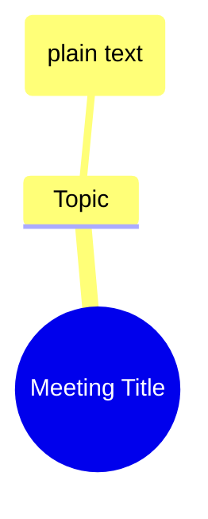

# DISC-002: Mermaid Mindmap Syntax Limitations

> **Discovery ID:** EN-024--DISC-002
> **Status:** RESOLVED
> **Discovered:** 2026-01-30
> **Resolved:** 2026-01-30
> **Impact:** ts-mindmap-mermaid agent definition contained invalid syntax

---

## Summary

During live test execution of EN-024 Mindmap Pipeline Integration, the generated `mindmap.mmd` file failed to render in Mermaid due to invalid syntax. The agent definition `ts-mindmap-mermaid.md` contained incorrect examples showing markdown link syntax inside mindmap nodes.

## Discovery Context

**Trigger:** User validation during EN-024 live test
**Error Message:**
```
Parse error on line 4:
...ily Standup Updates](02-transcript.md#se
-----------------------^
Expecting 'SPACELINE', 'NL', 'EOF', got 'NODE_DSTART'
```

## Root Cause

**Mermaid mindmaps only support plain text nodes.** They do NOT support:
- Markdown links: `[text](url)`
- Anchor references: `[text](#anchor)`
- HTML elements

The original agent definition at v1.0.1 showed examples like:
```mermaid
[Action: Send updated projections to finance](#act-001)  ← INVALID
```

## Resolution

### 1. Fixed Agent Definition (ts-mindmap-mermaid.md v1.1.0)

Updated to use plain text nodes only:


### 2. Deep Link Strategy for ADR-003 Compliance

Since Mermaid cannot embed links, ADR-003 compliance is achieved through:

1. **ASCII Visualization** - `mindmap.ascii.txt` contains full deep links in `──►seg-NNN` format
2. **Comment Reference Block** - Appended to `.mmd` file as Mermaid comments (`%%`)

Example reference block:
```mermaid
%% === DEEP LINK REFERENCE (ADR-003 Compliance) ===
%% Action Items:
%%   act-001 → seg-006 (Send API Swagger docs)
%% Decisions:
%%   dec-001 → seg-010 (Thursday afternoon review)
%% ================================================
```

## Affected Files

| File | Change |
|------|--------|
| `skills/transcript/agents/ts-mindmap-mermaid.md` | Updated to v1.1.0 with correct syntax |
| `live-test-en024-mindmap-verification/08-mindmap/mindmap.mmd` | Fixed with plain text + reference block |

## Lessons Learned

1. **Always validate output syntax** - Mermaid syntax should be tested before finalizing agent definitions
2. **Document format limitations** - Agent definitions should explicitly state what syntax is NOT supported
3. **Provide alternative traceability** - When primary format cannot support links, document alternative approaches

## References

- [Mermaid Mindmap Documentation](https://mermaid.js.org/syntax/mindmap.html)
- [ADR-003: Bidirectional Deep Linking](../../../FEAT-001-analysis-design/EN-004-architecture-decisions/docs/adrs/adr-003.md)
- [ts-mindmap-mermaid.md v1.1.0](../../../../../skills/transcript/agents/ts-mindmap-mermaid.md)

---

*Discovery documented per Jerry Constitution P-002 (File Persistence)*
