# ORCHESTRATION_PLAN.md

> **Document ID:** PROJ-009-ORCH-PLAN
> **Project:** PROJ-009-oss-release
> **Workflow ID:** `oss-release-20260131-001`
> **Status:** APPROVED
> **Version:** 3.1.0
> **Created:** 2026-01-31
> **Last Updated:** 2026-01-31
> **Approved:** 2026-01-31T19:00:00Z

## Changelog (v3.1.0)

| Decision | Description |
|----------|-------------|
| DEC-OSS-001 | Quality thresholds increased to ≥0.92 for ALL gates (was 0.85/0.88/0.90) |
| DEC-OSS-002 | Tiered execution within phases to respect data dependencies |
| DEC-OSS-003 | Checkpoint with user after each quality gate |
| DEC-OSS-004 | Auto-retry quality gates 2x before user escalation |

---

## 1. Executive Summary

### L0: ELI5 Summary

We're preparing Jerry to be shared with the world as open-source software. Think of it like preparing a house for sale - we need to:

1. **Explore all options** (What's the best way to present the house?)
2. **Research what buyers want** (What do developers expect from OSS projects?)
3. **Understand our house** (What does Jerry look like today?)
4. **Plan the renovation** (What needs to change?)
5. **Do the work** (Make the changes)
6. **Inspect everything** (Quality checks at every step)

We have **19 specialized workers** (agents) who each do one job really well. Some research, some analyze, some design, some check quality. They all work together, sharing their findings so nothing gets missed.

**Key Safety Features:**
- Every step has TWO quality inspectors (one strict critic, one NASA-style auditor)
- A risk manager watches for problems at EVERY phase
- Full reports are generated after each phase so you know exactly what's happening

### L1: Engineer Summary

This orchestration coordinates a comprehensive multi-phase workflow using ALL available agents from `/problem-solving` (9 agents) and `/nasa-se` (10 agents) skills to prepare Jerry for OSS release.

**Architecture:**
- **2 Parallel Pipelines:** Pipeline A (Problem-Solving) and Pipeline B (NASA SE)
- **5 Sequential Phases:** Each phase has parallel agent execution within pipelines
- **Dual Quality Gates:** ps-critic (adversarial DISC-002) + nse-qa at each phase
- **Dual Reporting:** ps-reporter + nse-reporter at each phase completion
- **Continuous Risk Management:** nse-risk runs at every phase
- **Full Artifact Pass-Through:** Upstream artifacts passed downstream (not summaries)

**Agent Distribution (19 Total):**
- Phase 0: 5 agents (exploration, initial research)
- Phase 1: 5 agents (deep research, investigation)
- Phase 2: 6 agents (requirements, architecture)
- Phase 3: 5 agents (validation, synthesis)
- Phase 4: 5 agents (final V&V, reporting)
- Quality Gates: ps-critic + nse-qa at each phase (10 invocations)
- Reports: ps-reporter + nse-reporter at each phase (10 invocations)

### L2: Architect Summary

**Orchestration Pattern:** Cross-Pollinated Pipeline with Dual Quality Gates and Continuous Risk Management

**Key Architectural Decisions:**
1. **Divergent-then-Convergent:** Phase 0 uses nse-explorer for divergent thinking before converging on specific paths
2. **Dual Quality Perspective:** Combining adversarial prompting (ps-critic with DISC-002) and NASA QA rigor (nse-qa) provides defense in depth
3. **Risk-Driven Execution:** nse-risk maintains evolving risk register throughout, enabling risk-informed decisions
4. **Configuration Baselines:** nse-configuration establishes baselines after requirements (Phase 2) and after design (Phase 3)
5. **Full Artifact Traceability:** No summarization at barriers - full artifacts passed to maintain fidelity

**Constitutional Compliance:**
- P-002 (File Persistence): All agent outputs persisted
- P-003 (No Recursion): Main context → worker agents only
- P-020 (User Authority): User approval required at each quality gate
- P-022 (No Deception): Transparent reasoning, honest quality scores

**Current State:** APPROVED - Ready for execution with ≥0.92 quality threshold

---

## 2. Workflow Identification

| Field | Value | Source |
|-------|-------|--------|
| Workflow ID | `oss-release-20260131-001` | auto |
| ID Format | `{purpose}-{YYYYMMDD}-{NNN}` | semantic-date-seq |
| Base Path | `projects/PROJ-009-oss-release/orchestration/oss-release-20260131-001/` | Dynamic |
| Total Agents | 19 (9 PS + 10 NSE) | Full coverage |
| Total Phases | 5 | Sequential with parallel tracks |
| Quality Gates | 5 (dual: ps-critic + nse-qa each) | Every phase |
| Barriers | 4 | Between each phase |

**Artifact Output Locations:**
```
projects/PROJ-009-oss-release/orchestration/oss-release-20260131-001/
├── ps/                        # Pipeline A (Problem-Solving) artifacts
├── nse/                       # Pipeline B (NASA SE) artifacts
├── cross-pollination/         # Barrier handoff artifacts
├── quality-gates/             # Dual QG artifacts (ps-critic + nse-qa)
├── reports/                   # Phase completion reports
└── risks/                     # Evolving risk register
```

---

## 3. Agent Registry

### 3.1 Problem-Solving Agents (9)

| ID | Agent | Role | Phase(s) | Output |
|----|-------|------|----------|--------|
| PS-01 | `ps-researcher` | Research Specialist | 0, 1 | Research reports with citations |
| PS-02 | `ps-analyst` | Analysis Specialist | 0, 1 | Gap analysis, 5 Whys, FMEA, trade-offs |
| PS-03 | `ps-architect` | Architecture Specialist | 2 | ADRs (Nygard format) |
| PS-04 | `ps-critic` | Quality Evaluator | QG 0-4 | Adversarial quality reviews (DISC-002) |
| PS-05 | `ps-validator` | Validation Specialist | 3 | Constraint verification with evidence |
| PS-06 | `ps-synthesizer` | Synthesis Specialist | 3 | Pattern extraction, knowledge synthesis |
| PS-07 | `ps-reviewer` | Review Specialist | 3 | Design/architecture review |
| PS-08 | `ps-investigator` | Investigation Specialist | 1 | Failure analysis, root cause |
| PS-09 | `ps-reporter` | Reporting Specialist | 0-4 | Phase status reports |

### 3.2 NASA SE Agents (10)

| ID | Agent | Role | Phase(s) | Output |
|----|-------|------|----------|--------|
| NSE-01 | `nse-requirements` | Requirements Engineer | 0, 2 | Shall-statements, traceability |
| NSE-02 | `nse-verification` | V&V Specialist | 1, 4 | VCRM, test planning |
| NSE-03 | `nse-risk` | Risk Manager | 0-4 | 5x5 risk matrix, risk register |
| NSE-04 | `nse-reviewer` | Technical Review Gate | 3 | Technical review findings |
| NSE-05 | `nse-integration` | System Integration | 2 | Interface control, integration plan |
| NSE-06 | `nse-configuration` | Config Management | 2, 3 | Baseline control, change mgmt |
| NSE-07 | `nse-architecture` | Technical Architect | 2 | Design decisions, decomposition |
| NSE-08 | `nse-explorer` | Exploration Engineer | 0 | Divergent alternatives, trade studies |
| NSE-09 | `nse-qa` | QA Specialist | QG 0-4 | Compliance audit, artifact validation |
| NSE-10 | `nse-reporter` | SE Status Reporter | 0-4 | SE metrics, health status |

### 3.3 Agent Phase Assignment Matrix

```
                    │ Phase 0 │ Phase 1 │ Phase 2 │ Phase 3 │ Phase 4 │
────────────────────┼─────────┼─────────┼─────────┼─────────┼─────────┤
ps-researcher       │    ●    │    ●    │         │         │         │
ps-analyst          │    ●    │    ●    │         │         │         │
ps-architect        │         │         │    ●    │         │         │
ps-critic (QG)      │    ◆    │    ◆    │    ◆    │    ◆    │    ◆    │
ps-validator        │         │         │         │    ●    │         │
ps-synthesizer      │         │         │         │    ●    │         │
ps-reviewer         │         │         │         │    ●    │         │
ps-investigator     │         │    ●    │         │         │         │
ps-reporter         │    ○    │    ○    │    ○    │    ○    │    ○    │
────────────────────┼─────────┼─────────┼─────────┼─────────┼─────────┤
nse-requirements    │    ●    │         │    ●    │         │         │
nse-verification    │         │    ●    │         │         │    ●    │
nse-risk            │    ●    │    ●    │    ●    │    ●    │    ●    │
nse-reviewer        │         │         │         │    ●    │         │
nse-integration     │         │         │    ●    │         │         │
nse-configuration   │         │         │    ●    │    ●    │         │
nse-architecture    │         │         │    ●    │         │         │
nse-explorer        │    ●    │         │         │         │         │
nse-qa (QG)         │    ◆    │    ◆    │    ◆    │    ◆    │    ◆    │
nse-reporter        │    ○    │    ○    │    ○    │    ○    │    ○    │

Legend: ● = Phase work  ◆ = Quality Gate  ○ = Phase Report
```

---

## 4. Workflow Diagram (Mermaid)

```mermaid
flowchart TB
    subgraph APPROVAL["🔒 APPROVAL GATE"]
        START([User Approves Plan])
    end

    subgraph PHASE0["📊 PHASE 0: DIVERGENT EXPLORATION & INITIAL RESEARCH"]
        direction TB

        subgraph P0_PS["Pipeline A: Problem-Solving"]
            P0_PS_R[ps-researcher<br/>External Best Practices]
            P0_PS_A[ps-analyst<br/>Current Architecture Analysis]
        end

        subgraph P0_NSE["Pipeline B: NASA SE"]
            P0_NSE_E[nse-explorer<br/>DIVERGENT: Explore All Options]
            P0_NSE_REQ[nse-requirements<br/>Current State Inventory]
            P0_NSE_RISK[nse-risk<br/>Initial Risk Identification]
        end

        P0_PS_R --> P0_QG
        P0_PS_A --> P0_QG
        P0_NSE_E --> P0_QG
        P0_NSE_REQ --> P0_QG
        P0_NSE_RISK --> P0_QG
    end

    subgraph QG0["🚫 QUALITY GATE 0"]
        P0_QG{{"ps-critic (ADVERSARIAL)<br/>+ nse-qa (NASA QA)<br/>Score ≥ 0.85"}}
        P0_RPT[ps-reporter + nse-reporter<br/>Phase 0 Reports]
    end

    subgraph BARRIER1["⇄ BARRIER 1: Full Artifact Cross-Pollination"]
        B1_PS_NSE[PS → NSE: Research findings]
        B1_NSE_PS[NSE → PS: Exploration alternatives, risks]
    end

    subgraph PHASE1["🔬 PHASE 1: DEEP RESEARCH & INVESTIGATION"]
        direction TB

        subgraph P1_PS["Pipeline A: Problem-Solving"]
            P1_PS_R[ps-researcher<br/>Deep Dive Research]
            P1_PS_A[ps-analyst<br/>Gap Analysis, FMEA, 5 Whys]
            P1_PS_I[ps-investigator<br/>Problem Investigation]
        end

        subgraph P1_NSE["Pipeline B: NASA SE"]
            P1_NSE_V[nse-verification<br/>V&V Planning]
            P1_NSE_RISK[nse-risk<br/>Risk Register Update]
        end
    end

    subgraph QG1["🚫 QUALITY GATE 1"]
        P1_QG{{"ps-critic (ADVERSARIAL)<br/>+ nse-qa (NASA QA)<br/>Score ≥ 0.85"}}
        P1_RPT[ps-reporter + nse-reporter<br/>Phase 1 Reports]
    end

    subgraph BARRIER2["⇄ BARRIER 2: Full Artifact Cross-Pollination"]
        B2_PS_NSE[PS → NSE: Gap analysis, investigation findings]
        B2_NSE_PS[NSE → PS: V&V gaps, updated risks]
    end

    subgraph PHASE2["📐 PHASE 2: REQUIREMENTS & ARCHITECTURE"]
        direction TB

        subgraph P2_PS["Pipeline A: Problem-Solving"]
            P2_PS_ARCH[ps-architect<br/>ADRs: CLAUDE.md, Skills, Migration]
        end

        subgraph P2_NSE["Pipeline B: NASA SE"]
            P2_NSE_REQ[nse-requirements<br/>Formal Requirements Spec]
            P2_NSE_ARCH[nse-architecture<br/>Architecture Decisions]
            P2_NSE_INT[nse-integration<br/>Integration Planning]
            P2_NSE_CFG[nse-configuration<br/>Requirements Baseline]
            P2_NSE_RISK[nse-risk<br/>Risk Register Update]
        end
    end

    subgraph QG2["🚫 QUALITY GATE 2"]
        P2_QG{{"ps-critic (ADVERSARIAL)<br/>+ nse-qa (NASA QA)<br/>Score ≥ 0.85"}}
        P2_RPT[ps-reporter + nse-reporter<br/>Phase 2 Reports]
    end

    subgraph BARRIER3["⇄ BARRIER 3: Full Artifact Cross-Pollination"]
        B3_PS_NSE[PS → NSE: ADRs for V&V test design]
        B3_NSE_PS[NSE → PS: Requirements for validation]
    end

    subgraph PHASE3["✅ PHASE 3: VALIDATION & SYNTHESIS"]
        direction TB

        subgraph P3_PS["Pipeline A: Problem-Solving"]
            P3_PS_V[ps-validator<br/>Constraint Verification]
            P3_PS_S[ps-synthesizer<br/>Pattern Synthesis]
            P3_PS_REV[ps-reviewer<br/>Design Review]
        end

        subgraph P3_NSE["Pipeline B: NASA SE"]
            P3_NSE_REV[nse-reviewer<br/>Technical Review Gate]
            P3_NSE_CFG[nse-configuration<br/>Design Baseline]
            P3_NSE_RISK[nse-risk<br/>Risk Register Update]
        end
    end

    subgraph QG3["🚫 QUALITY GATE 3"]
        P3_QG{{"ps-critic (ADVERSARIAL)<br/>+ nse-qa (NASA QA)<br/>Score ≥ 0.88"}}
        P3_RPT[ps-reporter + nse-reporter<br/>Phase 3 Reports]
    end

    subgraph BARRIER4["⇄ BARRIER 4: Full Artifact Cross-Pollination"]
        B4_PS_NSE[PS → NSE: Validation results, synthesis]
        B4_NSE_PS[NSE → PS: Review findings, baseline status]
    end

    subgraph PHASE4["📋 PHASE 4: FINAL V&V & REPORTING"]
        direction TB

        subgraph P4_PS["Pipeline A: Problem-Solving"]
            P4_PS_RPT[ps-reporter<br/>Final Status Report]
        end

        subgraph P4_NSE["Pipeline B: NASA SE"]
            P4_NSE_V[nse-verification<br/>Final V&V]
            P4_NSE_QA[nse-qa<br/>Comprehensive QA Audit]
            P4_NSE_RPT[nse-reporter<br/>Final SE Report]
            P4_NSE_RISK[nse-risk<br/>Final Risk Assessment]
        end
    end

    subgraph QG4["🚫 QUALITY GATE 4 (FINAL)"]
        P4_QG{{"ps-critic (ADVERSARIAL)<br/>+ nse-qa (NASA QA)<br/>Score ≥ 0.90"}}
    end

    subgraph COMPLETE["✨ WORKFLOW COMPLETE"]
        DONE([Ready for Implementation])
    end

    START --> PHASE0
    PHASE0 --> QG0
    QG0 --> P0_QG
    P0_QG -->|PASS| P0_RPT
    P0_RPT --> BARRIER1
    P0_QG -->|FAIL| PHASE0

    BARRIER1 --> PHASE1
    PHASE1 --> QG1
    QG1 --> P1_QG
    P1_QG -->|PASS| P1_RPT
    P1_RPT --> BARRIER2
    P1_QG -->|FAIL| PHASE1

    BARRIER2 --> PHASE2
    PHASE2 --> QG2
    QG2 --> P2_QG
    P2_QG -->|PASS| P2_RPT
    P2_RPT --> BARRIER3
    P2_QG -->|FAIL| PHASE2

    BARRIER3 --> PHASE3
    PHASE3 --> QG3
    QG3 --> P3_QG
    P3_QG -->|PASS| P3_RPT
    P3_RPT --> BARRIER4
    P3_QG -->|FAIL| PHASE3

    BARRIER4 --> PHASE4
    PHASE4 --> QG4
    QG4 --> P4_QG
    P4_QG -->|PASS| DONE
    P4_QG -->|FAIL| PHASE4

    style APPROVAL fill:#fff3cd,stroke:#856404
    style PHASE0 fill:#d4edda,stroke:#155724
    style PHASE1 fill:#cce5ff,stroke:#004085
    style PHASE2 fill:#e2d5f1,stroke:#6f42c1
    style PHASE3 fill:#d1ecf1,stroke:#0c5460
    style PHASE4 fill:#f8d7da,stroke:#721c24
    style QG0 fill:#fff,stroke:#dc3545,stroke-width:3px
    style QG1 fill:#fff,stroke:#dc3545,stroke-width:3px
    style QG2 fill:#fff,stroke:#dc3545,stroke-width:3px
    style QG3 fill:#fff,stroke:#dc3545,stroke-width:3px
    style QG4 fill:#fff,stroke:#dc3545,stroke-width:3px
    style COMPLETE fill:#d4edda,stroke:#155724,stroke-width:3px
```



---

## 5. Phase Definitions

### 5.1 Phase 0: Divergent Exploration & Initial Research (BLOCKING)

**Objective:** Explore ALL options before converging. Gather initial research and understand current state.

**This phase MUST complete before any subsequent phases begin.**

#### Pipeline A: Problem-Solving

| Agent | Focus | Inputs | Outputs |
|-------|-------|--------|---------|
| **ps-researcher** | External best practices research | Transcript action items, CLAUDE.md context | `ps/phase-0/ps-researcher/best-practices-research.md` |
| **ps-analyst** | Current architecture analysis | Jerry codebase, CLAUDE.md, skills/ | `ps/phase-0/ps-analyst/current-architecture-analysis.md` |

**ps-researcher Focus Areas:**
- Claude Code plugin best practices (Context7, Anthropic docs)
- Skill authoring patterns and conventions
- CLAUDE.md file conventions and decomposition patterns
- OSS project documentation patterns
- Multi-persona documentation (L0/L1/L2)

**ps-analyst Focus Areas:**
- Current CLAUDE.md structure and content analysis
- Skills inventory (transcript, orchestration, problem-solving, nasa-se, worktracker)
- Work tracker functionality embedded in CLAUDE.md
- Dependency graph and coupling analysis

#### Pipeline B: NASA SE

| Agent | Focus | Inputs | Outputs |
|-------|-------|--------|---------|
| **nse-explorer** | DIVERGENT exploration of all options | Transcript decisions, project scope | `nse/phase-0/nse-explorer/divergent-alternatives.md` |
| **nse-requirements** | Current state inventory | Jerry codebase, CLAUDE.md | `nse/phase-0/nse-requirements/current-state-inventory.md` |
| **nse-risk** | Initial risk identification | All Phase 0 outputs | `risks/phase-0-risk-register.md` |

**nse-explorer DIVERGENT Thinking Areas:**
- Repository structure alternatives (monorepo vs multi-repo vs current)
- CLAUDE.md decomposition strategies (import patterns, skill references, etc.)
- Documentation organization options
- Work tracker extraction approaches
- Migration path alternatives

**nse-requirements Inventory Scope:**
- CLAUDE.md sections inventory with token counts
- Skills inventory with completeness assessment
- Missing documentation gaps
- Template compliance status

#### Phase 0 Quality Gate

| Component | Threshold | Criteria |
|-----------|-----------|----------|
| **ps-critic** (ADVERSARIAL) | ≥0.85 | DISC-002 protocol, ≥3 findings per artifact, citations required |
| **nse-qa** (NASA QA) | ≥0.85 | NPR compliance, artifact completeness, traceability |

#### Phase 0 Reports

| Agent | Output |
|-------|--------|
| **ps-reporter** | `reports/phase-0/ps-status-report.md` |
| **nse-reporter** | `reports/phase-0/nse-status-report.md` |

#### Phase 0 Execution Tiers (DEC-OSS-002)

> **Rationale:** nse-risk cannot identify risks without seeing exploration/research outputs first.

```
PHASE 0 TIERED EXECUTION
========================

TIER 1 (Parallel - No Dependencies):
┌─────────────────────┐  ┌─────────────────────┐  ┌─────────────────────┐  ┌─────────────────────┐
│   ps-researcher     │  │    ps-analyst       │  │   nse-explorer      │  │  nse-requirements   │
└──────────┬──────────┘  └──────────┬──────────┘  └──────────┬──────────┘  └──────────┬──────────┘
           │                        │                        │                        │
           └────────────────────────┴────────────────────────┴────────────────────────┘
                                                    │
                                                    ▼
TIER 2 (Sequential - Depends on Tier 1):
                         ┌──────────────────────────────────────────┐
                         │              nse-risk                    │
                         │  (reads all Tier 1 outputs to identify   │
                         │   risks from exploration & research)     │
                         └────────────────────┬─────────────────────┘
                                              │
                                              ▼
TIER 3 (Parallel - Depends on Tier 2):
                         ┌──────────────────────────────────────────┐
                         │    ps-critic + nse-qa (DUAL QG)          │
                         │    Threshold: ≥0.92 (DEC-OSS-001)        │
                         └────────────────────┬─────────────────────┘
                                              │
                                              ▼
TIER 4 (Parallel - Depends on QG passing):
                         ┌──────────────────────────────────────────┐
                         │    ps-reporter + nse-reporter            │
                         └────────────────────┬─────────────────────┘
                                              │
                                              ▼
                              BARRIER 1 (Cross-Pollination)
```

---

### 5.2 Phase 1: Deep Research & Investigation

**Objective:** Deep dive into identified areas. Investigate current problems. Plan verification approach.

#### Pipeline A: Problem-Solving

| Agent | Focus | Inputs | Outputs |
|-------|-------|--------|---------|
| **ps-researcher** | Deep dive into prioritized areas | Phase 0 findings, barrier-1 artifacts | `ps/phase-1/ps-researcher/deep-research.md` |
| **ps-analyst** | Gap analysis, FMEA, 5 Whys, trade-offs | Phase 0 findings, barrier-1 artifacts | `ps/phase-1/ps-analyst/gap-analysis.md`, `ps/phase-1/ps-analyst/fmea-analysis.md`, `ps/phase-1/ps-analyst/root-cause-5whys.md` |
| **ps-investigator** | Investigate current problems | ACT-010, ACT-011 (transcript issues) | `ps/phase-1/ps-investigator/problem-investigation.md` |

**ps-researcher Deep Dive Areas:**
- Decomposition with imports pattern (detailed implementation)
- Multi-persona documentation authoring (L0/L1/L2 writing guidelines)
- OSS repository structure best practices

**ps-analyst Frameworks Applied:**
- **5W2H:** Who, What, When, Where, Why, How, How Much for each gap
- **Ishikawa (Fishbone):** Root cause categorization
- **FMEA:** Failure Mode and Effects Analysis for risks
- **8D:** Eight Disciplines problem solving
- **Pareto (80/20):** Prioritize high-impact gaps

**ps-investigator Investigation Targets:**
- Transcript skill output inconsistency (Sonnet vs Opus)
- Current CLAUDE.md maintainability issues
- Work tracker skill incompleteness

#### Pipeline B: NASA SE

| Agent | Focus | Inputs | Outputs |
|-------|-------|--------|---------|
| **nse-verification** | V&V planning for identified gaps | Gap analysis, requirements | `nse/phase-1/nse-verification/vv-planning.md` |
| **nse-risk** | Risk register update | All Phase 1 findings | `risks/phase-1-risk-register.md` |

#### Phase 1 Quality Gate

| Component | Threshold | Criteria |
|-----------|-----------|----------|
| **ps-critic** (ADVERSARIAL) | ≥0.85 | DISC-002 protocol, ≥3 findings per artifact, frameworks applied |
| **nse-qa** (NASA QA) | ≥0.85 | Analysis completeness, risk coverage, V&V alignment |

#### Phase 1 Reports

| Agent | Output |
|-------|--------|
| **ps-reporter** | `reports/phase-1/ps-status-report.md` |
| **nse-reporter** | `reports/phase-1/nse-status-report.md` |

---

### 5.3 Phase 2: Requirements & Architecture

**Objective:** Define formal requirements. Create architecture decisions (ADRs). Establish requirements baseline.

#### Pipeline A: Problem-Solving

| Agent | Focus | Inputs | Outputs |
|-------|-------|--------|---------|
| **ps-architect** | Architecture Decision Records | Phase 1 analysis, barrier-2 artifacts | `ps/phase-2/ps-architect/ADR-OSS-001-through-007.md` |

**ps-architect ADRs to Create:**
1. **ADR-OSS-001:** CLAUDE.md Decomposition Strategy
2. **ADR-OSS-002:** Skill Import Pattern
3. **ADR-OSS-003:** Work Tracker Skill Extraction
4. **ADR-OSS-004:** Multi-Persona Documentation Strategy
5. **ADR-OSS-005:** Repository Migration Strategy (jerry → source-repository → public jerry)
6. **ADR-OSS-006:** Transcript Skill Template Standardization
7. **ADR-OSS-007:** OSS Release Checklist

Each ADR includes L0/L1/L2 sections.

#### Pipeline B: NASA SE

| Agent | Focus | Inputs | Outputs |
|-------|-------|--------|---------|
| **nse-requirements** | Formal requirements specification | Gap analysis, ADRs | `nse/phase-2/nse-requirements/requirements-spec.md` |
| **nse-architecture** | Architecture decisions (NASA SE format) | ADRs, requirements | `nse/phase-2/nse-architecture/architecture-decisions.md` |
| **nse-integration** | Integration planning | Architecture, interfaces | `nse/phase-2/nse-integration/integration-plan.md` |
| **nse-configuration** | Requirements baseline | Requirements spec | `nse/phase-2/nse-configuration/requirements-baseline.md` |
| **nse-risk** | Risk register update | All Phase 2 outputs | `risks/phase-2-risk-register.md` |

**nse-requirements Shall-Statements:**
- REQ-OSS-001 through REQ-OSS-NNN
- Verification method for each requirement
- Parent traceability to action items
- Acceptance criteria

**nse-integration Planning:**
- Interface between CLAUDE.md and skills
- Interface between work tracker skill and work items
- Migration interface (jerry → source-repository)

#### Phase 2 Quality Gate

| Component | Threshold | Criteria |
|-----------|-----------|----------|
| **ps-critic** (ADVERSARIAL) | ≥0.85 | ADRs complete with L0/L1/L2, DISC-002, ≥3 findings |
| **nse-qa** (NASA QA) | ≥0.85 | Requirements traceable, baseline established, NPR compliance |

#### Phase 2 Reports

| Agent | Output |
|-------|--------|
| **ps-reporter** | `reports/phase-2/ps-status-report.md` |
| **nse-reporter** | `reports/phase-2/nse-status-report.md` |

---

### 5.4 Phase 3: Validation & Synthesis

**Objective:** Validate constraints. Synthesize patterns. Conduct design reviews. Establish design baseline.

#### Pipeline A: Problem-Solving

| Agent | Focus | Inputs | Outputs |
|-------|-------|--------|---------|
| **ps-validator** | Constraint verification | Requirements, ADRs | `ps/phase-3/ps-validator/constraint-validation.md` |
| **ps-synthesizer** | Pattern synthesis | All prior artifacts | `ps/phase-3/ps-synthesizer/pattern-synthesis.md` |
| **ps-reviewer** | Design review | ADRs, architecture | `ps/phase-3/ps-reviewer/design-review.md` |

**ps-validator Constraints to Verify:**
- Jerry Constitution compliance (P-001 through P-022)
- OSS licensing requirements (MIT)
- Documentation completeness (L0/L1/L2 coverage)
- Work tracker skill requirements

**ps-synthesizer Synthesis Areas:**
- Cross-artifact patterns
- Implementation roadmap prioritization
- Knowledge consolidation for downstream work

**ps-reviewer Review Scope:**
- ADR quality and completeness
- Architecture coherence
- Risk mitigation adequacy

#### Pipeline B: NASA SE

| Agent | Focus | Inputs | Outputs |
|-------|-------|--------|---------|
| **nse-reviewer** | Technical review gate | All Phase 2 outputs | `nse/phase-3/nse-reviewer/technical-review.md` |
| **nse-configuration** | Design baseline | Approved designs | `nse/phase-3/nse-configuration/design-baseline.md` |
| **nse-risk** | Risk register update | Review findings | `risks/phase-3-risk-register.md` |

**nse-reviewer Technical Review:**
- SRR/PDR-style entrance criteria evaluation
- Action item generation
- Recommendation for proceeding

#### Phase 3 Quality Gate

| Component | Threshold | Criteria |
|-----------|-----------|----------|
| **ps-critic** (ADVERSARIAL) | ≥0.88 | Validation complete, synthesis coherent, DISC-002 |
| **nse-qa** (NASA QA) | ≥0.88 | Review findings addressed, baselines established |

#### Phase 3 Reports

| Agent | Output |
|-------|--------|
| **ps-reporter** | `reports/phase-3/ps-status-report.md` |
| **nse-reporter** | `reports/phase-3/nse-status-report.md` |

---

### 5.5 Phase 4: Final V&V & Reporting

**Objective:** Final verification and validation. Comprehensive QA audit. Final status reports. Final risk assessment.

#### Pipeline A: Problem-Solving

| Agent | Focus | Inputs | Outputs |
|-------|-------|--------|---------|
| **ps-reporter** | Final comprehensive status report | All artifacts | `reports/phase-4/ps-final-report.md` |

**ps-reporter Final Report Contents:**
- Executive summary (L0)
- Technical implementation roadmap (L1)
- Strategic recommendations (L2)
- Metrics and health status
- Lessons learned

#### Pipeline B: NASA SE

| Agent | Focus | Inputs | Outputs |
|-------|-------|--------|---------|
| **nse-verification** | Final V&V | All requirements, validation results | `nse/phase-4/nse-verification/final-vv.md` |
| **nse-qa** | Comprehensive QA audit | All artifacts | `nse/phase-4/nse-qa/comprehensive-qa-audit.md` |
| **nse-reporter** | Final SE status report | All SE artifacts | `reports/phase-4/nse-final-report.md` |
| **nse-risk** | Final risk assessment | All risks | `risks/phase-4-final-risk-assessment.md` |

**nse-verification Final V&V:**
- Verification Cross-Reference Matrix (VCRM) completion
- All requirements verified
- Evidence documented

**nse-qa Comprehensive Audit:**
- All artifacts validated
- NPR compliance confirmed
- Traceability complete
- Quality metrics calculated

#### Phase 4 Quality Gate (FINAL)

| Component | Threshold | Criteria |
|-----------|-----------|----------|
| **ps-critic** (ADVERSARIAL) | ≥0.90 | All deliverables complete, implementation roadmap actionable |
| **nse-qa** (NASA QA) | ≥0.90 | Full NPR compliance, VCRM complete, audit passed |

---

## 6. Quality Gate Protocol (DISC-002)

### 6.1 Adversarial Prompting Protocol (ps-critic)

Each quality gate uses ps-critic in **ADVERSARIAL MODE** with the following patterns:

| Pattern | Description | Enforcement |
|---------|-------------|-------------|
| **Red Team Framing** | Critic assumes "find problems" mindset | Required |
| **Mandatory Findings Quota** | ≥3 findings per artifact (no free passes) | Hard requirement |
| **Devil's Advocate Protocol** | Challenge ALL assumptions explicitly | Required |
| **Checklist Enforcement** | No partial credit on criteria - binary pass/fail | Enforced |
| **Counter-Example Seeking** | Actively look for exceptions and edge cases | Required |
| **Score Calibration** | Anchored scoring with explicit thresholds | Enforced |

### 6.2 NASA QA Audit Protocol (nse-qa)

Each quality gate uses nse-qa with NASA-style rigor:

| Aspect | Description | Enforcement |
|--------|-------------|-------------|
| **Artifact Completeness** | All required sections present | Required |
| **Traceability** | Bidirectional links verified | Required |
| **NPR Compliance** | Alignment with NPR 7123.1D | Checked |
| **Evidence Documentation** | All claims supported by evidence | Required |
| **Configuration Status** | Baseline alignment verified | Checked |

### 6.3 Quality Gate Thresholds

> **DEC-OSS-001:** Quality thresholds increased to ≥0.92 for ALL gates.
> **Rationale:** Mission-critical software - quality is king.

| Gate | Phase | ps-critic Threshold | nse-qa Threshold | Special Criteria |
|------|-------|---------------------|------------------|------------------|
| QG-0 | Phase 0 | ≥0.92 | ≥0.92 | Divergent exploration complete, risks identified |
| QG-1 | Phase 1 | ≥0.92 | ≥0.92 | Frameworks applied (5W2H, FMEA, 8D), investigation complete |
| QG-2 | Phase 2 | ≥0.92 | ≥0.92 | ADRs complete, requirements baselined |
| QG-3 | Phase 3 | ≥0.92 | ≥0.92 | Validation complete, design baseline established |
| QG-4 | Phase 4 | ≥0.92 | ≥0.92 | VCRM complete, comprehensive audit passed |

### 6.4 Quality Gate Failure Protocol

If either ps-critic OR nse-qa fails the threshold:
1. Generate specific improvement recommendations
2. Return artifacts to originating agents for revision
3. Maximum 2 revision cycles before escalation to user
4. User may override with documented rationale
5. All failures and overrides logged in risk register

---

## 7. Sync Barrier Protocol

### 7.1 Full Artifact Pass-Through

**CRITICAL:** Barriers pass FULL ARTIFACTS, not summaries. This ensures:
- Complete information fidelity
- No loss of nuance or detail
- Downstream agents have full context
- Traceability maintained

### 7.2 Barrier Definitions

| Barrier | After | PS → NSE Artifacts | NSE → PS Artifacts |
|---------|-------|--------------------|--------------------|
| Barrier 1 | Phase 0 | Research findings, architecture analysis | Divergent alternatives, inventory, risks |
| Barrier 2 | Phase 1 | Gap analysis, FMEA, investigation | V&V planning, updated risks |
| Barrier 3 | Phase 2 | ADRs (all 7) | Requirements spec, architecture, integration plan, baseline |
| Barrier 4 | Phase 3 | Validation, synthesis, review | Technical review, design baseline, risks |

### 7.3 Cross-Pollination Artifact Structure

```
cross-pollination/barrier-N/
├── ps-to-nse/
│   ├── handoff-manifest.md       # List of artifacts being passed
│   └── artifacts/                # Symlinks or copies of full artifacts
└── nse-to-ps/
    ├── handoff-manifest.md
    └── artifacts/
```

---

## 8. Risk Management

### 8.1 Continuous Risk Tracking

**nse-risk runs at EVERY phase** to maintain an evolving risk register:

| Phase | Risk Focus |
|-------|------------|
| Phase 0 | Initial risk identification from exploration |
| Phase 1 | Risks from gap analysis and investigation findings |
| Phase 2 | Architecture and integration risks |
| Phase 3 | Validation and review-identified risks |
| Phase 4 | Final risk assessment and residual risks |

### 8.2 Risk Register Structure

```
risks/
├── phase-0-risk-register.md
├── phase-1-risk-register.md
├── phase-2-risk-register.md
├── phase-3-risk-register.md
├── phase-4-final-risk-assessment.md
└── risk-register-consolidated.md   # Cumulative view
```

### 8.3 Risk Categories

| Category | Examples |
|----------|----------|
| Technical | Decomposition complexity, skill coupling, migration failure |
| Schedule | Research taking longer than expected, revision cycles |
| Quality | Documentation gaps, inconsistent outputs |
| Scope | Scope creep, missing requirements |
| External | Dependency changes, API changes |

---

## 9. Configuration Management

### 9.1 Baseline Strategy

**nse-configuration establishes baselines at optimal points:**

| Baseline | Phase | Contents | Purpose |
|----------|-------|----------|---------|
| Requirements Baseline | Phase 2 | Approved requirements spec | Control requirements changes |
| Design Baseline | Phase 3 | Approved ADRs and architecture | Control design changes |

### 9.2 Change Control

After baseline establishment:
1. Changes require documented change request
2. Impact analysis performed by nse-risk
3. Approval by user before implementation
4. Baseline updated with change history

---

## 10. Execution Constraints

### 10.1 Hard Constraints (Jerry Constitution)

| Constraint | ID | Enforcement |
|------------|----|----|
| Single agent nesting | P-003 | Main context → Worker agents only |
| File persistence | P-002 | All outputs persisted to filesystem |
| No deception | P-022 | Transparent reasoning, honest scores |
| User authority | P-020 | User approves quality gates |

### 10.2 Soft Constraints

| Constraint | Value | Rationale |
|------------|-------|-----------|
| Max concurrent agents | 5 | Resource management |
| Max QG retries | 2 | Prevent infinite loops |
| Checkpoint frequency | PHASE | Balance recovery vs overhead |
| Artifact size limit | None | Full pass-through required |

---

## 11. Scope Coverage (Transcript Action Items)

### 11.1 Action Items to Phase Mapping

| ACT | Description | Phase | Agent(s) |
|-----|-------------|-------|----------|
| ACT-001 | Research Claude Code plugin, skill, CLAUDE.md best practices | 0, 1 | ps-researcher |
| ACT-002 | Research transcript format best practices | 0, 1 | ps-researcher |
| ACT-003 | Optimize CLAUDE.md (decomposition/imports) | 2 | ps-architect (ADR-OSS-001) |
| ACT-004 | Optimize all skills (decomposition/imports) | 2 | ps-architect (ADR-OSS-002) |
| ACT-005 | Separate optimization from documentation | 2 | ps-architect (ADR-OSS-004) |
| ACT-006 | Extract work tracker into skill | 2 | ps-architect (ADR-OSS-003) |
| ACT-007 | Automate work tracker document generation | 2 | nse-requirements, ps-architect |
| ACT-008 | Create multi-persona documentation (L0/L1/L2) | 2 | ps-architect (ADR-OSS-004) |
| ACT-009 | Plan repository migration | 2 | ps-architect (ADR-OSS-005) |
| ACT-010 | Gap analysis (current vs desired) | 1 | ps-analyst |
| ACT-011 | Investigate transcript skill problems | 1 | ps-investigator |
| ACT-012 | Create consistent output templates | 2 | ps-architect (ADR-OSS-006) |

### 11.2 Decisions Already Made

| Decision | Status | Impact on Orchestration |
|----------|--------|-------------------------|
| MIT License | DECIDED | No further research needed |
| Dual repository (jerry → source-repository) | DECIDED | Migration planning in Phase 2 |
| Internal repo name: source-repository | DECIDED | Used in ADR-OSS-005 |
| Orchestration with PS + NASA SE | DECIDED | This plan |

---

## 12. Success Criteria

### 12.1 Phase Exit Criteria

| Phase | Exit Criteria |
|-------|---------------|
| Phase 0 | Divergent exploration complete, initial research done, risks identified, QG-0 passed |
| Phase 1 | Deep research complete, gap analysis done, investigation complete, QG-1 passed |
| Phase 2 | All ADRs approved, requirements baselined, architecture decisions made, QG-2 passed |
| Phase 3 | Validation complete, synthesis done, reviews passed, design baseline established, QG-3 passed |
| Phase 4 | Final V&V complete, comprehensive QA audit passed, final reports generated, QG-4 passed |

### 12.2 Workflow Completion Criteria

| Criterion | Validation Method |
|-----------|-------------------|
| All phases complete | All phase status = COMPLETE |
| All quality gates passed | All QG scores ≥ threshold |
| All barriers synced | All barrier status = COMPLETE |
| All risks assessed | Final risk assessment exists |
| All reports generated | 10 reports exist (2 per phase) |
| Implementation roadmap ready | ps-synthesizer output exists |
| User approval obtained | User sign-off documented |

---

## 13. Resumption Context

### 13.1 Current Execution State

```
WORKFLOW STATUS AS OF 2026-01-31
================================

Status: PENDING_APPROVAL

Phase 0 (Exploration & Research):   PENDING
Phase 1 (Deep Research):            BLOCKED
Phase 2 (Requirements & Arch):      BLOCKED
Phase 3 (Validation & Synthesis):   BLOCKED
Phase 4 (Final V&V & Reporting):    BLOCKED

Quality Gates:
  QG-0: PENDING
  QG-1: BLOCKED
  QG-2: BLOCKED
  QG-3: BLOCKED
  QG-4: BLOCKED

Barriers:
  Barrier 1: PENDING
  Barrier 2: BLOCKED
  Barrier 3: BLOCKED
  Barrier 4: BLOCKED

Agents Executed: 0/19
Reports Generated: 0/10
Risk Registers: 0/5
```

### 13.2 Next Actions (After Approval)

1. **Execute Phase 0 agents in parallel (within pipelines):**
   - Pipeline A: ps-researcher, ps-analyst
   - Pipeline B: nse-explorer, nse-requirements, nse-risk

2. **Quality Gate 0:** ps-critic + nse-qa evaluation

3. **Reports:** ps-reporter + nse-reporter

4. **Barrier 1:** Full artifact cross-pollination

5. Continue sequential phase execution

---

## 14. Related Documents

- **ASCII Diagram:** `ORCHESTRATION_DIAGRAM_ASCII.md` (detailed ASCII visualization)
- **Machine State:** `ORCHESTRATION.yaml` (SSOT)
- **Execution Tracker:** `ORCHESTRATION_WORKTRACKER.md` (tactical tracking)
- **DISC-002 Protocol:** `../../../PROJ-008-transcript-skill/work/EPIC-001-transcript-skill/FEAT-003-future-enhancements/FEAT-003--DISC-002-adversarial-prompting-protocol.md`

---

## 15. Approval Request

**This orchestration plan requires user approval before execution begins.**

### Review Checklist

- [ ] All 19 agents included and appropriately placed
- [ ] Divergent exploration (nse-explorer) positioned early
- [ ] Risk management (nse-risk) at every phase
- [ ] Dual quality gates (ps-critic + nse-qa) at every phase
- [ ] Dual reports (ps-reporter + nse-reporter) at every phase
- [ ] Configuration baselines at optimal points
- [ ] Full artifact pass-through (not summaries)
- [ ] Phase structure aligns with project goals
- [ ] Quality gate thresholds acceptable
- [ ] Scope coverage complete (all action items mapped)

**To approve:** Confirm this plan is acceptable and execution may begin.

**To revise:** Specify which sections need modification.

---

*Document ID: PROJ-009-ORCH-PLAN*
*Workflow ID: oss-release-20260131-001*
*Version: 3.0.0*
*Status: PENDING_APPROVAL*
*Cross-Session Portable: All paths are repository-relative*
