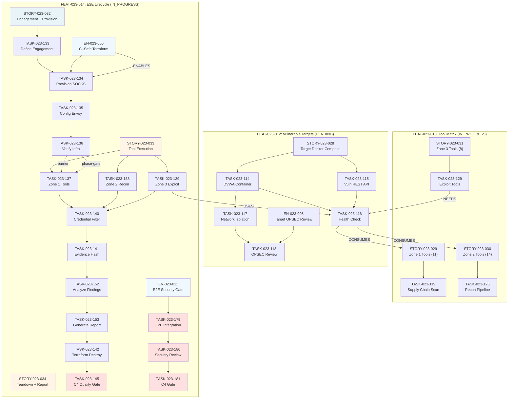

# EPIC-023-010 Remaining Work Dependency Graph

**Generated:** 2026-04-21
**Scope:** Non-done features under EPIC-023-010 (FEAT-023-012, FEAT-023-013, FEAT-023-014)
**Excluded:** FEAT-023-015 (Gate System — completed)

---

## Dependency Graph

---

## Critical Path Analysis

### Longest Chain (Blocking the Release)

**Path:** FEAT-023-012 → FEAT-023-014 execution phase → teardown → C4 gate

1. **FEAT-023-012 (Vulnerable Targets)** — 7 points
   - Blocks both FEAT-023-013 (Zone 3 tools need targets) and FEAT-023-014 (E2E execute phase)
   - Critical path item: No parallelization opportunity here
   - Tasks: T114, T115 (2+2=4 points, parallel) → T116 (1 point) → T117 (1 point) → T118 (1 point)
   - **Critical:** T116 (health check) is the gate for entire FEAT-023-014 execution phase

2. **FEAT-023-014 Provision Phase** — 8 points
   - T133 (define, 2) → T134 (provision, 3, blocked by EN-023-006) → T135 (config, 2) → T136 (verify, 1)
   - **Blocker:** EN-023-006 (CI-Safe Terraform) must complete BEFORE T134 can start
   - EN-023-006 status: `completed` (2026-03-28) — unblocked
   - Sequence is strictly sequential; no parallelization

3. **FEAT-023-014 Execution Phase** — 8 points
   - T137, T138, T139 (3+3+3 = 9 points, parallel), all require T136 verification
   - **Phase gate:** T136 → T137/138/139 (all start together)
   - T137, T138, T139 all feed into T140 (credential filter)
   - T140 → T141 (evidence hash) → T152 (analyze)

4. **FEAT-023-014 Teardown + C4 Phase** — 7 points
   - T153 (report, 2) → T142 (destroy, 1) → T145 (C4 gate, 2)
   - **Critical:** T145 (C4 quality gate >= 0.95) is the ultimate release blocker
   - EN-023-011 parallel path: T179 (E2E, 2) → T180 (security, 2) → T181 (C4, 1)

### Total Critical Path Length

**FEAT-023-012 + FEAT-023-014 provision + execution + teardown/C4:**
- FEAT-023-012: 7 points (all sequential except T114||T115)
- FEAT-023-014 provision: 8 points (strictly sequential)
- FEAT-023-014 execution: T137||T138||T139 (max 3) → T140 (2) → T141 (2) → T152 (2) → T153 (2) = 11 points wall-clock
- FEAT-023-014 teardown: T142 (1) → T145 (2) = 3 points
- EN-023-011 parallel: T179 (2) → T180 (2) → T181 (1) = 5 points

**Wall-clock critical path ≈ 7 + 8 + 11 + 5 = 31 effort points if fully sequential**

### Parallelization Opportunities

1. **FEAT-023-013 (Tool Matrix)** runs independently in parallel with FEAT-023-014, but T129 (Zone 3 tools) depends on FEAT-023-012 targets (T116)
   - Can start STORY-023-029 (Zone 1) and STORY-023-030 (Zone 2) immediately
   - STORY-023-031 (Zone 3) blocked by T116

2. **EN-023-011 parallel path** — T179, T180, T181 can run in parallel with FEAT-023-014 teardown
   - Must complete before final release (C4 gate >= 0.95 gates acceptance)

3. **FEAT-023-012 internal parallelization:**
   - T114 and T115 can build containers in parallel (2 effort each)
   - T117 can run in parallel with T116 (both depend on T114, but are independent)
   - **Real wall-clock: 1 (T114 || T115) + 1 (T116 || T117) + 1 (T118) = 3 points** vs. 7 points if sequential

---

## Ready-to-Start Items (Zero Remaining Dependencies)

### Immediately Available (No Blockers)

- **FEAT-023-012:**
  - TASK-023-114 (DVWA container)
  - TASK-023-115 (Vulnerable REST API)
  - Both can start now in parallel

- **FEAT-023-013:**
  - TASK-023-119 (Zone 1 tools: syft, grype, osv-scanner)
  - TASK-023-125 (Zone 2 recon tools: subfinder, httpx, dnsx, naabu, katana, nuclei)
  - Can start now; do not depend on FEAT-023-012 targets yet

- **FEAT-023-014 Provision Phase:**
  - TASK-023-133 (define engagement) — can start now
  - Once T133 completes: T134 unblocks (EN-023-006 is done)

### Blocked (Waiting for Dependencies)

- **FEAT-023-012:**
  - TASK-023-116 → needs T114 + T115
  - TASK-023-117 → needs T114
  - TASK-023-118 → needs T117

- **FEAT-023-013:**
  - TASK-023-129 (Zone 3 exploit) → blocked by FEAT-023-012 targets (T116)

- **FEAT-023-014 Execution Phase:**
  - T137, T138, T139 → blocked by T136 (infrastructure verification)

- **FEAT-023-014 Teardown + C4:**
  - T145 (C4 gate) → blocked by T141 (evidence hash complete)

---

## Summary

| Feature | Status | Blocking Item | Est. Days to Unblock |
|---------|--------|---------------|---------------------|
| FEAT-023-012 | pending | EN-023-011 (already started) | 2-3 days (wall-clock) |
| FEAT-023-013 | in_progress | T116 (FEAT-023-012 targets) | 2-3 days after T116 |
| FEAT-023-014 | in_progress | T145 (final C4 gate) | 7-8 days critical path |

**Recommended Execution Order:**
1. **Now:** T114, T115 (DVWA + REST API, parallel), T119 (Zone 1), T125 (Zone 2), T133 (engagement define)
2. **Day 1-2:** T116, T117, T118 (target readiness), T135, T134 (Envoy config, provision)
3. **Day 2-3:** T137, T138, T139 (tool execution, parallel), T129 (Zone 3 tools)
4. **Day 3-4:** T140, T141 (credential filter, evidence hash)
5. **Day 4-5:** T152, T153, T142 (analyze, report, destroy)
6. **Day 5-6:** T179, T180 (E2E tests, security review, parallel)
7. **Day 6+:** T181, T145 (C4 gates, final verification)

*Generated by wt-visualizer v1.0.0 — P-002: file-persisted artifact*
