# PROJ-023 Open Items Dependency Graph

> **ARCHIVAL SNAPSHOT — dated 2026-04-13.** Any `STORY-023-035` reference in this document has been renumbered to **STORY-023-037** (eBPF Developer Documentation). Any `STORY-023-036` reference has been renumbered to **STORY-023-038** (HTTP CONNECT Upstream Tunneling). Renumbering occurred 2026-04-21 per audit C-002 (ID collision with FEAT-023-015/STORY-023-035/036). This snapshot is preserved as a historical artifact; see `remaining-work-dependency-graph-2026-04-21.md` for the current dependency graph.

**Generated:** 2026-04-13
**Project:** PROJ-023 - Rainbow Series Cybersecurity Skill Suite
**Scope:** All pending, in_progress, and blocked items
**Goal:** Clean production architecture

---

## Dependency Graph

```mermaid
flowchart TD
    subgraph Epic["EPIC-023-010: E2E Engagement Validation"]
        FEAT014["FEAT-023-014: Real E2E Engagement Lifecycle<br/>(IN_PROGRESS)"]
        FEAT012["FEAT-023-012: Vulnerable Target Infrastructure<br/>(PENDING)"]
        FEAT013["FEAT-023-013: Full 33-Tool Smoke Test<br/>(PENDING)"]
        STORY035["STORY-023-035: eBPF Developer Docs<br/>(COMPLETED)"]
        STORY036["STORY-023-036: SOCKS5 E2E Tests<br/>(PENDING)"]
        EN11["EN-023-011: E2E Verification + Security<br/>(PENDING)"]

        TASK182["TASK-023-182: Ref doc split-cgroup<br/>(PENDING, Effort 1)"]
        TASK183["TASK-023-183: Ref doc hybrid RBAC<br/>(PENDING, Effort 1)"]
        TASK184["TASK-023-184: Tutorial unified stack<br/>(PENDING, Effort 2)"]
        TASK185["TASK-023-185: How-to split-cgroup<br/>(PENDING, Effort 1)"]
        TASK186["TASK-023-186: Fix test count 5→6<br/>(PENDING, Effort 1)"]
        TASK187["TASK-023-187: Fix DEC-023-001 paths<br/>(PENDING, Effort 1)"]
        TASK188["TASK-023-188: Unit tests scope_translator<br/>(PENDING, Effort 2)"]
        TASK189["TASK-023-189: Unit tests BpfManager<br/>(PENDING, Effort 2)"]

        STORY035 --> TASK182
        STORY035 --> TASK183
        STORY035 --> TASK184
        STORY035 --> TASK185
        STORY035 --> TASK186
        FEAT014 --> TASK187
        FEAT014 --> TASK188
        FEAT014 --> TASK189
        FEAT014 --> STORY036
        FEAT014 --> EN11
        EN11 -.->|requires C4 >= 0.95| FEAT014
    end

    subgraph Terraform["FEAT-023-004: Hands-Free Engagement Pipeline"]
        STORY024["STORY-023-024: Terraform DO Provider<br/>(COMPLETED)"]
        STORY025["STORY-023-025: Terraform Vultr Provider<br/>(PENDING)"]
        STORY026["STORY-023-026: Terraform Hetzner Provider<br/>(PENDING)"]
        STORY027["STORY-023-027: Legacy Cleanup pydo<br/>(PENDING)"]
        EN004["EN-023-004: Terraform Operator Docs<br/>(PENDING)"]
        STORY023["STORY-023-023: Scripts CLI Migration<br/>(PENDING)"]

        TASK107["TASK-023-107: Vultr HCL template<br/>(PENDING, Effort 2)"]
        TASK108["TASK-023-108: Vultr integration test<br/>(PENDING, Effort 1)"]
        TASK109["TASK-023-109: Hetzner HCL template<br/>(PENDING, Effort 2)"]
        TASK110["TASK-023-110: Hetzner integration test<br/>(PENDING, Effort 1)"]
        TASK111["TASK-023-111: Delete pydo adapter<br/>(PENDING, Effort 1)"]
        TASK112["TASK-023-112: How-to: Provisioning<br/>(PENDING, Effort 2)"]
        TASK113["TASK-023-113: Reference docs TF API<br/>(PENDING, Effort 2)"]
        TASK082["TASK-023-082: Migrate validate_proxy_infra<br/>(PENDING, GREEN)"]
        TASK083["TASK-023-083: Scripts cleanup<br/>(PENDING, LOW priority)"]

        STORY024 --> STORY025
        STORY025 --> TASK107
        STORY025 --> TASK108
        STORY025 --> STORY026
        STORY026 --> TASK109
        STORY026 --> TASK110
        STORY026 --> STORY027
        STORY027 --> TASK111
        STORY024 --> EN004
        EN004 --> TASK112
        EN004 --> TASK113
        STORY024 -.->|completed, unblocks next phase| STORY025
        STORY025 -.->|unblocks phase 3| STORY026
        STORY026 -.->|unblocks cleanup| STORY027
    end

    subgraph Creds["EPIC-023-009: Credential Management"]
        FEAT008["FEAT-023-008: 1Password CLI<br/>(PENDING)"]
        FEAT009["FEAT-023-009: Bitwarden CLI<br/>(PENDING)"]
        FEAT010["FEAT-023-010: age/sops Encrypted<br/>(PENDING)"]
        FEAT011["FEAT-023-011: Credential Rotation<br/>(PENDING)"]

        FEAT008 -.->|depends on| STORY010["STORY-023-010<br/>(COMPLETED)"]
        FEAT009 -.->|depends on| STORY010
        FEAT010 -.->|depends on| STORY010
        FEAT011 -.->|depends on| STORY010
    end

    subgraph Framework["EPIC-023-002: Framework Catalog"]
        TASK005["TASK-023-005: Phase 1 C4 Tournament<br/>(IN_PROGRESS)"]
        BUG001["BUG-023-001: Phase 2 threshold<br/>(IN_PROGRESS, MAJOR)"]

        BUG001 -.->|discovered at| TASK005
    end

    subgraph Stale["STORY-023-001: CLM Implementation"]
        STORY001["STORY-023-001: ContainerLifecycleManager<br/>(IN_PROGRESS)"]
        TASK007["TASK-023-007: CLM Test Standards<br/>(IN_PROGRESS)"]

        STORY001 --> TASK007
    end

    %% Cross-epic dependencies
    STORY036 -.->|blocks until done| EN11
    EN11 -.->|C4 quality gate blocks release| FEAT014
    TASK187 -.->|must fix before| STORY036
    TASK188 -.->|blocks| STORY036
    TASK189 -.->|blocks| STORY036

    %% Color coding
    style FEAT014 fill:#FFD700,stroke:#FF8C00,stroke-width:2px
    style FEAT012 fill:#D3D3D3,stroke:#666,stroke-width:1px
    style FEAT013 fill:#D3D3D3,stroke:#666,stroke-width:1px
    style STORY036 fill:#FFD700,stroke:#FF8C00,stroke-width:2px
    style EN11 fill:#FFD700,stroke:#FF8C00,stroke-width:2px

    style STORY025 fill:#FFD700,stroke:#FF8C00,stroke-width:2px
    style STORY026 fill:#D3D3D3,stroke:#666,stroke-width:1px
    style STORY027 fill:#D3D3D3,stroke:#666,stroke-width:1px
    style EN004 fill:#FFD700,stroke:#FF8C00,stroke-width:2px
    style STORY023 fill:#FFD700,stroke:#FF8C00,stroke-width:2px

    style FEAT008 fill:#D3D3D3,stroke:#666,stroke-width:1px
    style FEAT009 fill:#D3D3D3,stroke:#666,stroke-width:1px
    style FEAT010 fill:#D3D3D3,stroke:#666,stroke-width:1px
    style FEAT011 fill:#D3D3D3,stroke:#666,stroke-width:1px

    style TASK005 fill:#FFD700,stroke:#FF8C00,stroke-width:2px
    style BUG001 fill:#FF6B6B,stroke:#8B0000,stroke-width:2px

    style STORY001 fill:#FF6B6B,stroke:#8B0000,stroke-width:2px
    style TASK007 fill:#FF6B6B,stroke:#8B0000,stroke-width:2px

    style STORY010 fill:#90EE90,stroke:#228B22,stroke-width:2px
    style STORY024 fill:#90EE90,stroke:#228B22,stroke-width:2px
```



---

## Status Legend

| Color | Status | Meaning |
|-------|--------|---------|
| Green (#90EE90) | Completed | Dependency source, unblocks downstream |
| Blue (#4169E1) | Unblocked, Ready | Can start immediately |
| Orange (#FFD700) | Blocked, Critical Path | Ready to start but blocked by predecessor OR critical to goal |
| Red (#FF6B6B) | Stale In-Progress | Needs investigation; may be stalled |
| Gray (#D3D3D3) | Pending | Waiting for predecessor; can be staged |

---

## Work Streams Analysis

### Stream 1: eBPF Architecture (Session 3 Follow-Up + Session 4)

**Status:** IN_PROGRESS with 8 blocking tasks pending

**What's Completed:**
- EN-023-009: Three-Program BPF Implementation (Commit 7af9bb9d)
- EN-023-010: Envoy Unified Traffic Path (Commit 22744d6d)
- STORY-023-035: eBPF Developer Documentation (4 Diataxis docs, Commit 37b3d6d5)

**What's Blocked:**
| Task ID | Title | Blocker | Effort | Impact |
|---------|-------|---------|--------|--------|
| TASK-023-182 | Ref doc: split-cgroup BpfManager API | **None - UNBLOCKED** | 1 | Documentation update only |
| TASK-023-183 | Ref doc: hybrid RBAC scope enforcement | **None - UNBLOCKED** | 1 | Documentation update only |
| TASK-023-184 | Tutorial: unified compose stack | **None - UNBLOCKED** | 2 | Documentation update only |
| TASK-023-185 | How-to: split-cgroup + CAP_NET_ADMIN | **None - UNBLOCKED** | 1 | Documentation update only |
| TASK-023-186 | Fix test count 5 → 6 | **None - UNBLOCKED** | 1 | Minor test enumeration fix |
| TASK-023-187 | Fix DEC-023-001 pin path references | **None - UNBLOCKED** | 1 | ADR path correction (critical for STORY-023-036) |
| TASK-023-188 | Unit tests: scope_translator helpers | **None - UNBLOCKED** | 2 | Blocks STORY-023-036 |
| TASK-023-189 | Unit tests: BpfManager split-cgroup | **None - UNBLOCKED** | 2 | Blocks STORY-023-036 |
| STORY-023-036 | E2E tests SOCKS5 proxy integration | Blocked by: TASK-023-187, TASK-023-188, TASK-023-189 | 5 | **CRITICAL: Final validation of unified architecture** |
| EN-023-011 | E2E Verification + Security + C4 Gate | Blocked by: STORY-023-036 | 3+ | **CRITICAL: C4 >= 0.95 required for release** |

**Critical Path:** TASK-023-187 → TASK-023-188 → TASK-023-189 → STORY-023-036 → EN-023-011

**Total Effort to Complete:** 7 + 2 + 2 + 5 + 3 = **19 story points**

**Recommendation:** All TASK-023-182/183/184/185/186/187 are **UNBLOCKED NOW**. Start immediately. Parallelize:
- Group A: TASK-023-182, 183, 184, 185, 186 (documentation, no code dependencies)
- Group B: TASK-023-187, 188, 189 (code-heavy, sequential: 187 first, then 188+189 parallel, then 036)

---

### Stream 2: Terraform Pipeline (FEAT-023-004)

**Status:** IN_PROGRESS, clear critical path defined

**What's Completed:**
- STORY-023-024: Terraform DO Provider (7/7 tasks done, 79 tests, Commit 3bf3a904)

**What's Pending (Sequential Chain):**

| Phase | Item | Blocker | Effort | Status |
|-------|------|---------|--------|--------|
| **Phase 2** | STORY-023-025: Vultr Provider | Blocked by: STORY-023-024 (completed) | 3 | **UNBLOCKED NOW** |
| | TASK-023-107: Vultr HCL + generator | Blocked by: STORY-023-025 | 2 | Unblocked when STORY-023-025 starts |
| | TASK-023-108: Vultr integration test | Blocked by: TASK-023-107 | 1 | Conditional on Vultr creds |
| **Phase 3** | STORY-023-026: Hetzner Provider | Blocked by: STORY-023-025 | 3 | Pending Phase 2 |
| | TASK-023-109: Hetzner HCL + generator | Blocked by: STORY-023-026 | 2 | Pending Phase 2 |
| | TASK-023-110: Hetzner integration test | Blocked by: TASK-023-109 | 1 | Pending Phase 2 |
| **Phase 4** | STORY-023-027: Legacy pydo Cleanup | Blocked by: STORY-023-026 | 1 | Pending Phase 3 |
| | TASK-023-111: Delete adapter + remove pydo | Blocked by: STORY-023-027 | 1 | Pending Phase 3 |
| **Docs** | EN-023-004: Terraform Operator Docs | Blocked by: STORY-023-024 (completed) | 4 | **UNBLOCKED NOW** |
| | TASK-023-112: How-to provisioning | Blocked by: EN-023-004 | 2 | Unblocked when EN-023-004 starts |
| | TASK-023-113: Reference docs TF API | Blocked by: EN-023-004 | 2 | Unblocked when EN-023-004 starts |

**Critical Path:** STORY-023-025 (Phase 2) → STORY-023-026 (Phase 3) → STORY-023-027 (Phase 4)

**Parallel Work:** EN-023-004 (Docs) can proceed immediately alongside Phase 2

**Total Effort to Complete:** 3 + 2 + 1 + 3 + 2 + 1 + 1 + 1 + 4 + 2 + 2 = **22 story points**

**Recommendation:**
1. Start STORY-023-025 and EN-023-004 **TODAY** (both unblocked, non-dependent)
2. Pipeline phases 2→3→4 sequentially
3. Complete TASK-023-082 (Scripts migration) in parallel with Phase 2; it depends on STORY-023-022 which is already completed

---

### Stream 3: E2E Validation (EPIC-023-010)

**Status:** IN_PROGRESS, complex multi-feature coordination

**What's Completed:**
- FEAT-023-015: Engagement Gate System (18 tests, Commit 95fa2736)

**What's In Progress:**
- FEAT-023-014: Real E2E Engagement Lifecycle (multiple sub-stories in flight)

**What's Pending:**
- FEAT-023-012: Vulnerable Target Infrastructure
- FEAT-023-013: Full 33-Tool Smoke Test Matrix

**Blocking Chain:**

```
EN-023-011 (E2E Verification + Security + C4 Gate)
    ↑ BLOCKED BY
    STORY-023-036 (E2E tests SOCKS5 + unified BPF)
        ↑ BLOCKED BY
        TASK-023-187 (Fix pin paths)
        TASK-023-188 (Unit tests scope_translator)
        TASK-023-189 (Unit tests BpfManager)
```

**Recommendation:** See Stream 1 analysis above. The critical path is TASK-023-187 → 188 → 189 → STORY-023-036 → EN-023-011.

---

### Stream 4: Credential Management (EPIC-023-009)

**Status:** PENDING, all 4 features blocked by STORY-023-010 (completed)

**What's Completed:**
- STORY-023-010: macOS Keychain Credential Store (17 tests, ADR + docs, Commit beea615a)

**What's Pending (All UNBLOCKED, parallelizable):**

| Feature | Child Stories | Child Tasks | Effort | Blocker |
|---------|---------------|-------------|--------|---------|
| FEAT-023-008: 1Password CLI | TBD | TBD | TBD | STORY-023-010 ✓ |
| FEAT-023-009: Bitwarden CLI | TBD | TBD | TBD | STORY-023-010 ✓ |
| FEAT-023-010: age/sops Encrypted | TBD | TBD | TBD | STORY-023-010 ✓ |
| FEAT-023-011: Credential Rotation | TBD | TBD | TBD | STORY-023-010 ✓ + TASK-023-046 ✓ |

**Critical Dependencies:** None. All 4 features have their blocker satisfied (STORY-023-010 completed).

**Recommendation:**
- These features are **UNBLOCKED** and can be started in parallel
- Establish feature stories/tasks NOW (entity files exist but story/task decomposition TBD)
- Schedule across remaining development time; no ordering constraints between features

---

### Stream 5: Stale In-Progress Items

**Status:** RED - Requires Investigation

| Item | Status | Duration | Issue |
|------|--------|----------|-------|
| STORY-023-001 | IN_PROGRESS | Unknown | ContainerLifecycleManager implementation |
| TASK-023-007 | IN_PROGRESS | Unknown | CLM test standards remediation |
| TASK-023-005 | IN_PROGRESS | Since 2026-03-12 | Phase 1 C4 tournament quality gate |
| BUG-023-001 | IN_PROGRESS | Since 2026-03-12 | Orchestrator accepted Phase 2 at 0.920 (below 0.95 threshold) |

**Questions:**
1. **STORY-023-001/TASK-023-007:** Are these still actively being worked? Were they superseded by later features (FEAT-023-014 E2E)?
2. **TASK-023-005/BUG-023-001:** Is Phase 2 catalog research blocked on C4 gate completion? Status of tournament review?

**Recommendation:**
- Schedule synchronization call to clarify blockers
- If STORY-023-001 is complete/superseded, mark as such
- If TASK-023-005 is awaiting tournament results, indicate timeline
- If BUG-023-001 is a known acceptance below threshold, document the decision rationale

---

## Critical Path Analysis: "Clean Production Architecture"

**Goal:** Ship a production-ready framework with:
1. Unified eBPF + Envoy architecture validated (E2E tests passing, C4 >= 0.95)
2. Multi-cloud provisioning via Terraform (DO, Vultr, Hetzner)
3. Secure credential management (Keychain + extensible to 1Password, Bitwarden, age/sops)
4. Full tool coverage (33-tool smoke test passing)
5. Operator documentation complete (how-to, reference, tutorials)

**Shortest Path (Minimum Effort):**

### Phase 1: eBPF Architecture Validation (Duration: ~1 week, 19 SP)

**Start immediately (UNBLOCKED):**
1. TASK-023-182 through TASK-023-186 (documentation, 7 SP total) — **Parallelize all 5**
2. TASK-023-187 (fix pin paths, 1 SP) — **Start after 182-186 in parallel**
3. TASK-023-188, 189 (unit tests, 4 SP) — **Start after 187**
4. STORY-023-036 (E2E tests, 5 SP) — **Start after 188, 189**
5. EN-023-011 (C4 gate, 3 SP) — **Start after 036**

**Parallelization potential:**
- Days 1-2: TASK-023-182/183/184/185/186 (all doc tasks, no code dependencies)
- Days 2-3: TASK-023-187 + TASK-023-188/189
- Days 4-6: STORY-023-036
- Days 7: EN-023-011 (C4 tournament review)

**Blocker for next phase:** EN-023-011 C4 scoring must reach >= 0.95

---

### Phase 2: Terraform Multi-Cloud (Duration: ~3 weeks, 22 SP)

**Start immediately (UNBLOCKED after Phase 1 doc tasks):**
1. **Parallel Track A:** STORY-023-025 (Vultr, 3 SP) → STORY-023-026 (Hetzner, 3 SP) → STORY-023-027 (Cleanup, 1 SP)
   - Days 8-10: STORY-023-025 + TASK-023-107, 108
   - Days 11-13: STORY-023-026 + TASK-023-109, 110
   - Days 14: STORY-023-027 + TASK-023-111

2. **Parallel Track B:** EN-023-004 (Docs, 4 SP) — Start day 8
   - Days 8-12: TASK-023-112, 113 (how-to + reference, 4 SP)

3. **Parallel Track C:** STORY-023-023 (Scripts migration, 2 SP) — Start day 8
   - Days 8-9: TASK-023-082 (validate_proxy_infra migration)
   - Days 9-10: TASK-023-083 (scripts cleanup, LOW priority)

**Blocker for next phase:** All Terraform providers implemented + docs complete

---

### Phase 3: Credential Management Extensibility (Duration: ~2 weeks, TBD SP)

**Start immediately (UNBLOCKED, blocker STORY-023-010 satisfied):**
1. Establish feature stories for FEAT-023-008/009/010/011
2. Parallelize across 4 features (no inter-feature dependencies)
3. Recommend staggering: 1Password → Bitwarden → age/sops → Rotation (allow learning from each)

**Blocker for next phase:** All credential adapters implemented + tests passing

---

### Phase 4: Full Tool Coverage + Release (Duration: ~1 week, 3+ SP)

**Parallel work:**
1. FEAT-023-012: Vulnerable Target Infrastructure (DVWA setup)
2. FEAT-023-013: Full 33-Tool Smoke Test Matrix (enhance E2E tests)
3. Final integration testing and release preparation

**Blocker for release:** All 33 tools smoke test passing, C4 >= 0.95

---

## Schedule Summary

| Phase | Work Items | Duration | End Date | Output |
|-------|-----------|----------|----------|--------|
| **Phase 1** | eBPF docs + E2E tests + C4 gate | 1 week | ~2026-04-20 | Unified architecture validated, C4 >= 0.95 |
| **Phase 2** | Vultr + Hetzner + Terraform docs + scripts | 3 weeks | ~2026-05-11 | Multi-cloud provisioning, operator docs |
| **Phase 3** | Credential adapters (1Pass, Bitwarden, age/sops) | 2 weeks | ~2026-05-25 | Extensible credential management |
| **Phase 4** | Full tool coverage + release prep | 1 week | ~2026-06-01 | Production-ready framework |
| **TOTAL** | | **7 weeks** | **~2026-06-01** | Clean production architecture |

---

## Dependency Details: Every Task and Its Blocker

### eBPF Architecture Stream

```
✓ EN-023-009 (completed)
  ↓ unblocks
TASK-023-182 (ref doc split-cgroup) ← UNBLOCKED, can start NOW
TASK-023-183 (ref doc hybrid RBAC) ← UNBLOCKED, can start NOW
TASK-023-184 (tutorial) ← UNBLOCKED, can start NOW
TASK-023-185 (how-to split-cgroup) ← UNBLOCKED, can start NOW
TASK-023-186 (test count fix) ← UNBLOCKED, can start NOW
TASK-023-187 (fix pin paths) ← UNBLOCKED, can start NOW
  ↓ unblocks
TASK-023-188 (scope_translator unit tests)
TASK-023-189 (BpfManager split-cgroup tests)
  ↓ unblocks
STORY-023-036 (E2E SOCKS5 tests)
  ↓ unblocks
EN-023-011 (C4 >= 0.95 quality gate)
  ↓
RELEASE GATE 1: Unified eBPF architecture validated
```

### Terraform Pipeline Stream

```
✓ STORY-023-024 (completed)
  ↓ unblocks
STORY-023-025 (Vultr provider) ← UNBLOCKED, can start NOW
  ├─ TASK-023-107 (HCL template)
  └─ TASK-023-108 (integration test)
  ↓ unblocks
STORY-023-026 (Hetzner provider)
  ├─ TASK-023-109 (HCL template)
  └─ TASK-023-110 (integration test)
  ↓ unblocks
STORY-023-027 (pydo cleanup)
  └─ TASK-023-111 (delete adapter)
  ↓
RELEASE GATE 2: Multi-cloud provisioning ready

✓ STORY-023-024 (completed)
  ↓ unblocks
EN-023-004 (Terraform operator docs) ← UNBLOCKED, can start NOW
  ├─ TASK-023-112 (how-to)
  └─ TASK-023-113 (reference)
```

### Credential Management Stream

```
✓ STORY-023-010 (macOS Keychain, completed)
  ↓ unblocks (all 4 features, PARALLELIZABLE)
FEAT-023-008 (1Password) ← UNBLOCKED, can start NOW
FEAT-023-009 (Bitwarden) ← UNBLOCKED, can start NOW
FEAT-023-010 (age/sops) ← UNBLOCKED, can start NOW
FEAT-023-011 (Credential Rotation) ← UNBLOCKED, can start NOW
  ↓
RELEASE GATE 3: Extensible credential management
```

### E2E Validation Stream

```
✓ FEAT-023-015 (Gate system, completed)
  ↓ unblocks
FEAT-023-014 (Real E2E lifecycle) [IN_PROGRESS]
  ├─ FEAT-023-012 (Vulnerable targets) [PENDING, no blocker]
  └─ FEAT-023-013 (33-tool matrix) [PENDING, no blocker]

✓ EN-023-009, EN-023-010 (eBPF architecture, completed)
  ↓ depends on
STORY-023-036 (SOCKS5 E2E tests) [PENDING, blocked by 182-189]
  ↓ unblocks
EN-023-011 (C4 quality gate) [PENDING]
  ↓
RELEASE GATE 4: E2E validation complete, C4 >= 0.95
```

---

## Immediate Action Items (Next 3 Days)

### Start TODAY (No Blockers):

1. **eBPF Documentation (5 parallel tasks)**
   - TASK-023-182: Ref doc split-cgroup BpfManager API (Effort 1)
   - TASK-023-183: Ref doc hybrid RBAC scope enforcement (Effort 1)
   - TASK-023-184: Tutorial unified compose stack (Effort 2)
   - TASK-023-185: How-to split-cgroup + CAP_NET_ADMIN (Effort 1)
   - TASK-023-186: Fix test count 5 → 6 (Effort 1)
   **→ Assign across team; should complete in 1-2 days**

2. **Terraform Provisioner Docs**
   - EN-023-004: Establish story structure (TBD)
   - TASK-023-112: How-to provisioning (Effort 2)
   - TASK-023-113: Reference docs TF API (Effort 2)
   **→ Can proceed in parallel with documentation stream**

3. **Terraform Phase 2 Planning**
   - STORY-023-025: Vultr provider (establish task breakdown)
   - TASK-023-107: Vultr HCL template (can start immediately after 025 story created)
   **→ Schedule 4 hours for planning, then start implementation**

4. **Credential Management Feature Planning**
   - Establish stories/tasks for FEAT-023-008/009/010/011
   - Recommend: 1 person per feature, parallel execution
   **→ 2 hours planning meeting → divide work**

### Hold/Investigate (By Next Sync):

1. **TASK-023-005 (C4 Tournament) & BUG-023-001**
   - Status of Phase 2 C4 review?
   - When will tournament results be available?
   - Is this blocking any downstream work?

2. **STORY-023-001 & TASK-023-007**
   - Still active?
   - Superseded by FEAT-023-014?
   - Clear blocker and completion criteria?

---

## Metrics & Gate Criteria

### Phase 1 Gate (eBPF Architecture)
- ✓ TASK-023-182: Documentation deliverable exists
- ✓ TASK-023-183: Documentation deliverable exists
- ✓ TASK-023-184: Documentation deliverable exists
- ✓ TASK-023-185: Documentation deliverable exists
- ✓ TASK-023-186: Test count updated 5 → 6
- ✓ TASK-023-187: ADR pin paths corrected
- ✓ TASK-023-188: 5 new unit tests passing
- ✓ TASK-023-189: 4 new unit tests passing
- ✓ STORY-023-036: 3 E2E tests passing, microsocks + Envoy integration
- ✓ EN-023-011: C4 adversarial review >= 0.95 PASS

### Phase 2 Gate (Multi-Cloud Provisioning)
- ✓ STORY-023-025: Vultr provider 7/7 tasks done, 20+ tests passing
- ✓ STORY-023-026: Hetzner provider 7/7 tasks done, 20+ tests passing
- ✓ STORY-023-027: pydo adapter deleted, full test suite passing post-deletion
- ✓ EN-023-004: How-to + reference documentation exists, MkDocs integration
- ✓ TASK-023-082: Scripts migration complete, validate_proxy_infra removed from codebase

### Phase 3 Gate (Credential Management)
- ✓ FEAT-023-008: 1Password CLI integration tested
- ✓ FEAT-023-009: Bitwarden CLI integration tested
- ✓ FEAT-023-010: age/sops encrypted files tested
- ✓ FEAT-023-011: Credential rotation + TTL expiry tested

### Phase 4 Gate (Full Tool Coverage)
- ✓ FEAT-023-012: DVWA + vulnerable API Compose stack deployed
- ✓ FEAT-023-013: All 33 tools smoke test matrix passing
- ✓ Full integration test suite passing
- ✓ Zero critical/major bugs open

### Release Gate
- ✓ All phase gates PASS
- ✓ No open critical/major bugs
- ✓ Documentation complete (all Diataxis quadrants covered)
- ✓ C4 >= 0.95 on final delivery

---

*Generated by wt-visualizer v1.0.0 for PROJ-023-exploit-framework*
*Diagram shows all open items as of 2026-04-13. Statuses checked against WORKTRACKER.md*
