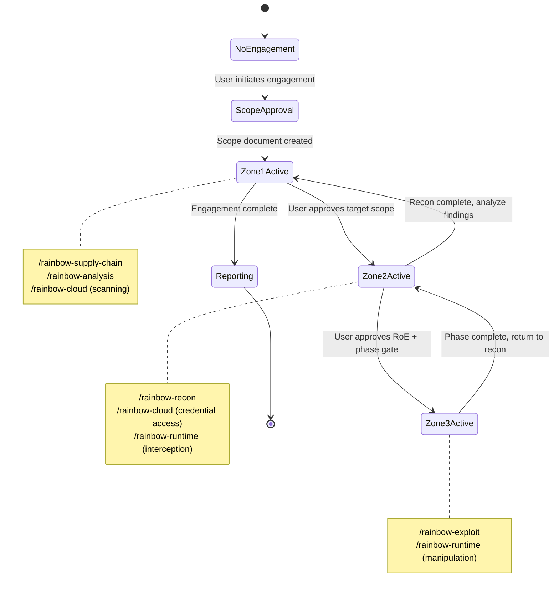

# Phase 3 Exploration: Composable Sub-Skill Architecture (Option B)

> **Agent:** explore-composable-001 | **Model:** Opus 4.6 (1M context) | **Date:** 2026-03-12
> **Project:** PROJ-023 Rainbow Series -- Phase 3, Stage 1 (Exploration)
> **Role:** ADVOCATE for the composable sub-skill architecture
> **Inputs:** Integration assessment (Phase 2), framework catalog (Phase 1), `/user-experience` skill (precedent), `/red-team` skill (context)
> **Output purpose:** Feed into ps-architect synthesis alongside Options A and C explorations

## Document Sections

| Section | Purpose |
|---------|---------|
| [L0: Executive Summary](#l0-executive-summary) | Top-line case for the composable approach |
| [L1: Sub-Skill Boundary Design](#l1-sub-skill-boundary-design) | Partitioning principle and boundary definitions |
| [L1: Parent Orchestrator Design](#l1-parent-orchestrator-design) | `/rainbow` routing, trigger map, lifecycle management |
| [L1: Sub-Skill Independence Model](#l1-sub-skill-independence-model) | Direct vs. parent-mediated invocation |
| [L1: Context Budget Analysis](#l1-context-budget-analysis) | Token efficiency gains from decomposition |
| [L1: Security Zone Enforcement](#l1-security-zone-enforcement) | Zone-to-sub-skill mapping and guardrail inheritance |
| [L1: DEC-006 Alignment](#l1-dec-006-alignment) | Execution tier handling per sub-skill |
| [L1: Precedent Analysis](#l1-precedent-analysis) | `/user-experience` pattern comparison |
| [L1: Strengths](#l1-strengths) | Core advantages of the composable approach |
| [L1: Weaknesses and Mitigations](#l1-weaknesses-and-mitigations) | Honest assessment with concrete mitigations |
| [L1: Phase 3 MVP Scope](#l1-phase-3-mvp-scope) | Incremental delivery path |
| [L2: Strategic Implications](#l2-strategic-implications) | Long-term architectural consequences |

---

## L0: Executive Summary

The composable sub-skill architecture proposes a parent `/rainbow` orchestrator skill that composes six independent sub-skills, each covering a coherent security domain with its own SKILL.md, agents, rules, and templates. This is the same architectural pattern proven by `/user-experience` (1 parent + 10 sub-skills), adapted for the security tool integration domain.

**Core thesis:** Security tools cluster naturally into pipeline-oriented suites and security domains. A composable architecture respects these natural boundaries, delivers focused context windows per domain, enables incremental delivery of sub-skills independently, and provides the cleanest enforcement boundary for the three-zone security model identified in Phase 2.

**Proposed sub-skills (6):**

| Sub-Skill | Domain | Tools (count) | Primary Zone | MVP Priority |
|-----------|--------|---------------|-------------|-------------|
| `/rainbow-recon` | Reconnaissance pipeline | 8 | Zone 2 | P0 |
| `/rainbow-supply-chain` | SBOM + vulnerability + signing | 7 | Zone 1 | P0 |
| `/rainbow-cloud` | Cloud security posture | 5 | Zone 1/2 | P1 |
| `/rainbow-exploit` | Offensive operations | 7 | Zone 3 | P2 |
| `/rainbow-analysis` | Static analysis / reverse engineering | 3 | Zone 1 | P0 |
| `/rainbow-runtime` | Dynamic instrumentation / interception | 2 | Zone 2/3 | P2 |

**Key advantages:** (1) Each sub-skill loads only its domain-specific context (~2,000-4,000 tokens) rather than all 31 tools (~15,000+ tokens), achieving 4-8x context efficiency. (2) Sub-skills ship independently -- `/rainbow-supply-chain` and `/rainbow-analysis` can ship in Week 1 while `/rainbow-exploit` waits for Zone 3 infrastructure. (3) Security zone enforcement maps cleanly to sub-skill boundaries, with each sub-skill declaring its zone's guardrail profile. (4) Proven precedent: `/user-experience` validates this exact pattern at the same scale (11 agents across 10 sub-skills, wave-gated deployment).

---

## L1: Sub-Skill Boundary Design

### Partitioning Principle

Sub-skills are partitioned by a **dual criterion**: (1) workflow coherence -- tools that compose into pipelines or share data formats belong together, and (2) security zone alignment -- tools sharing a guardrail profile belong together. When these two criteria conflict, security zone alignment takes precedence because guardrail misconfiguration has higher blast radius than workflow friction.

This dual criterion is derived directly from the Phase 2 integration assessment, which independently identified both suite-level adapter groupings (R-01) and security zone classifications (R-02) as the two primary architectural organizers.

### Boundary Definitions

#### `/rainbow-recon` -- Reconnaissance Pipeline

**Principle:** Tools that compose into the target-in/findings-out reconnaissance workflow. All share CLI + JSON output, STDIN/STDOUT piping, and Zone 2 scope-validation controls.

| Tool | Composite | Integration Path | DEC-006 |
|------|-----------|-----------------|---------|
| Subfinder (#13) | 8.34 | CLI | Execution-ready |
| httpx (#14) | 8.40 | CLI | Execution-ready |
| dnsx (#18) | 8.32 | CLI | Execution-ready |
| Naabu (#16) | 8.15 | CLI | Execution-ready |
| Katana (#77) | 8.28 | CLI | Execution-ready |
| Nuclei (#20) -- detection templates | 9.02 | CLI + SDK | Execution-ready |
| OWASP Amass (#15) | 7.29 | CLI + gRPC | Guide-then-execute |
| Maigret (#131) | 6.45 | CLI | Execution-ready |

**Workflow:** `Subfinder -> httpx -> dnsx -> Naabu -> Katana -> Nuclei (detection)` forms the ProjectDiscovery pipeline. OWASP Amass provides alternative/supplementary subdomain enumeration. Maigret provides OSINT username enumeration. A single CLI-wrapper adapter pattern serves 6 of the 8 tools (the ProjectDiscovery suite), achieving the highest tool-count-per-adapter-effort ratio in the entire catalog.

**Agents (2-3):**
- `rainbow-recon-pipeline` -- Orchestrates the PD reconnaissance pipeline; systematic cognitive mode; T2 tool tier with scope validation middleware
- `rainbow-recon-osint` -- OWASP Amass + Maigret for passive/OSINT reconnaissance; divergent cognitive mode; T2 tool tier
- (Optional) `rainbow-recon-lead` -- Sub-skill orchestrator if the two agents need coordination; T5 tool tier

**Security zone:** Zone 2 (Reconnaissance). All tools perform active network interaction requiring scope approval before first invocation.

#### `/rainbow-supply-chain` -- SBOM-to-Vulnerability Pipeline

**Principle:** Tools that compose into the artifact-in/findings-out supply chain security workflow. All produce structured SARIF/CycloneDX/JSON output. Primarily Zone 1 (read-only analysis) with one Zone 2 tool (Snyk CLI requires API key).

| Tool | Composite | Integration Path | DEC-006 |
|------|-----------|-----------------|---------|
| Syft (#102) | 9.54 | CLI + Lib | Execution-ready |
| Grype (#101) | 9.33 | CLI + Lib | Execution-ready |
| OSV-Scanner (#22) | 9.37 | CLI + MCP | Execution-ready |
| Cosign (#103) -- verification | 8.26 | CLI + Lib | Execution-ready |
| Trivy (#99) | 9.45 | CLI | Execution-ready |
| Checkov (#93) | 9.58 | CLI + Lib | Execution-ready |
| Snyk CLI (#25) | 8.28 | CLI + API | Guide-then-execute |

**Workflow:** `Syft (SBOM) -> Grype (vuln match)` is the anchor pipeline. Trivy and OSV-Scanner provide complementary scanning. Checkov provides IaC policy scanning. Cosign provides supply chain verification. Snyk CLI provides commercial vulnerability database access.

**Agents (2):**
- `rainbow-sc-scanner` -- Executes SBOM generation, vulnerability scanning, and IaC policy checks; systematic cognitive mode; T2 tool tier
- `rainbow-sc-verifier` -- Cosign verification, Snyk analysis, supply chain attestation validation; systematic cognitive mode; T2 tool tier

**Security zone:** Primarily Zone 1 (Analysis). Cosign signing operations are Zone 3 (guide-then-execute). Snyk CLI requires API key injection (Zone 2 credential isolation).

#### `/rainbow-cloud` -- Cloud Security Posture

**Principle:** Tools that audit cloud infrastructure configuration and Kubernetes clusters. All require credential injection and produce JSON/SARIF compliance reports.

| Tool | Composite | Integration Path | DEC-006 |
|------|-----------|-----------------|---------|
| Prowler (#89) | 8.26 | CLI + API | Execution-ready (async) |
| Kubescape (#105) | 8.67 | CLI + API | Execution-ready / Guide-then-execute |
| Kyverno (#109) -- validation | 8.17 | CLI + K8s | Guide-then-execute |
| Cartography (#96) | 6.62 | CLI + Neo4j | Methodology-primary |
| Checkov (#93) | 9.58 | CLI + Lib | Execution-ready |

**Note:** Checkov appears in both `/rainbow-supply-chain` (IaC scanning for supply chain artifacts) and `/rainbow-cloud` (IaC scanning for cloud posture). This is deliberate: Checkov serves two distinct workflows. The adapter is shared; the invocation context differs. The sub-skill SKILL.md documents this dual-membership explicitly.

**Agents (2):**
- `rainbow-cloud-auditor` -- Prowler, Kubescape, Checkov, Kyverno (validation) for compliance scanning; systematic cognitive mode; T2 with credential injection middleware
- `rainbow-cloud-mapper` -- Cartography for cloud infrastructure graph mapping; divergent cognitive mode; T2 + Neo4j dependency

**Security zone:** Zone 1 (validation/scanning) and Zone 2 (cloud credential access). Kyverno mutation policies are Zone 3 (excluded from MVP).

#### `/rainbow-exploit` -- Offensive Operations

**Principle:** Tools that interact with, exploit, or compromise target systems. All require Zone 3 full guardrail set (RoE gates, phase gates, credential vault, artifact quarantine, per-operation human approval).

| Tool | Composite | Integration Path | DEC-006 |
|------|-----------|-----------------|---------|
| Metasploit (#1) | 6.16 | Compound (RPC) | Methodology-primary |
| pwntools (#3) | 7.15 | Library | Execution-ready / Methodology |
| Impacket (#36) | 7.06 | Library | Execution-ready / Methodology |
| BloodHound CE (#34) | 5.88 | API + Neo4j | Methodology-primary |
| Empire (#6) | 5.87 | API (REST) | Methodology-primary |
| Mythic (#5) | 5.78 | API (GraphQL) | Methodology-primary |
| Donut (#27) | 5.93 | CLI + Lib | Execution-ready |

**Workflow:** No single pipeline -- these tools operate across multiple kill chain phases (Exploitation, Post-Exploitation, Lateral Movement, Persistence, C2). The `/rainbow-exploit` sub-skill is organized by kill chain phase rather than by pipeline.

**Agents (3-4):**
- `rainbow-exploit-ops` -- pwntools, Impacket, Donut for direct exploitation and payload generation; convergent cognitive mode; T2 with Zone 3 full guardrail set
- `rainbow-exploit-c2` -- Empire, Mythic for C2 infrastructure methodology; convergent cognitive mode; T2 with Zone 3 full guardrail set
- `rainbow-exploit-ad` -- Impacket (AD-specific), BloodHound CE for Active Directory attack paths; forensic cognitive mode; T2 with Zone 3 full guardrail set
- (Optional) `rainbow-exploit-msf` -- Metasploit methodology guidance; convergent cognitive mode; T2

**Security zone:** Zone 3 (Exploitation). ALL tools require per-operation human approval, engagement-scoped credential vault, and artifact quarantine.

#### `/rainbow-analysis` -- Static Analysis / Reverse Engineering

**Principle:** Tools that perform local file analysis with zero network interaction. All operate on local artifacts (binaries, malware samples, APKs) and produce analysis reports. Lowest security risk in the entire catalog.

| Tool | Composite | Integration Path | DEC-006 |
|------|-----------|-----------------|---------|
| YARA-X (#45) | 8.77 | CLI + Lib (Python) | Execution-ready |
| Ghidra (#51) | 7.36 | Headless + PyGhidra | Methodology-primary |
| JADX (#114) | 7.39 | CLI | Execution-ready |

**Workflow:** Independent tools -- each performs a distinct analysis type (pattern matching, binary RE, APK decompilation). Pipeline composition is possible (YARA-X triages samples -> Ghidra performs deep analysis on matches) but not required.

**Agents (1-2):**
- `rainbow-analysis-static` -- YARA-X + JADX for pattern matching and decompilation; systematic cognitive mode; T2 tool tier
- (Optional) `rainbow-analysis-re` -- Ghidra headless analysis methodology; systematic cognitive mode; T2 + Java runtime dependency

**Security zone:** Zone 1 (Analysis). Audit logging sufficient. No network interaction, no credential handling, no target modification.

#### `/rainbow-runtime` -- Dynamic Instrumentation / Interception

**Principle:** Tools that perform runtime interception and manipulation of live processes or network traffic. Both require device/infrastructure setup and operate in Zone 2/3.

| Tool | Composite | Integration Path | DEC-006 |
|------|-----------|-----------------|---------|
| mitmproxy (#61) | 7.47 | CLI + Lib (Python) | Guide-then-execute |
| Frida (#110) | 6.95 | Library (Python) | Guide-then-execute |

**Agents (1):**
- `rainbow-runtime-instrument` -- mitmproxy and Frida methodology and invocation; convergent cognitive mode; T2 with Zone 2/3 guardrails depending on operation

**Security zone:** Zone 2 (traffic interception) and Zone 3 (process manipulation). Credential filtering required for intercepted traffic.

### Sub-Skill Boundary Diagram

```mermaid
graph TB
    subgraph "Parent Skill: /rainbow"
        ORCH["rainbow-orchestrator<br/>(T5, Opus, Integrative)"]
    end

    subgraph "/rainbow-recon [Zone 2]"
        RR1["rainbow-recon-pipeline<br/>PD Suite: Subfinder, httpx,<br/>dnsx, Naabu, Katana, Nuclei"]
        RR2["rainbow-recon-osint<br/>OWASP Amass, Maigret"]
    end

    subgraph "/rainbow-supply-chain [Zone 1]"
        SC1["rainbow-sc-scanner<br/>Syft, Grype, Trivy,<br/>OSV-Scanner, Checkov"]
        SC2["rainbow-sc-verifier<br/>Cosign, Snyk CLI"]
    end

    subgraph "/rainbow-cloud [Zone 1/2]"
        CL1["rainbow-cloud-auditor<br/>Prowler, Kubescape,<br/>Checkov, Kyverno"]
        CL2["rainbow-cloud-mapper<br/>Cartography"]
    end

    subgraph "/rainbow-exploit [Zone 3]"
        EX1["rainbow-exploit-ops<br/>pwntools, Impacket, Donut"]
        EX2["rainbow-exploit-c2<br/>Empire, Mythic"]
        EX3["rainbow-exploit-ad<br/>Impacket, BloodHound CE"]
    end

    subgraph "/rainbow-analysis [Zone 1]"
        AN1["rainbow-analysis-static<br/>YARA-X, JADX"]
        AN2["rainbow-analysis-re<br/>Ghidra"]
    end

    subgraph "/rainbow-runtime [Zone 2/3]"
        RT1["rainbow-runtime-instrument<br/>mitmproxy, Frida"]
    end

    ORCH -->|Task| RR1
    ORCH -->|Task| RR2
    ORCH -->|Task| SC1
    ORCH -->|Task| SC2
    ORCH -->|Task| CL1
    ORCH -->|Task| CL2
    ORCH -->|Task| EX1
    ORCH -->|Task| EX2
    ORCH -->|Task| EX3
    ORCH -->|Task| AN1
    ORCH -->|Task| AN2
    ORCH -->|Task| RT1
```



---

## L1: Parent Orchestrator Design

### The `/rainbow` Orchestrator

The parent `/rainbow` skill provides a single entry point for all security tool integration requests. The orchestrator (`rainbow-orchestrator`) is a T5 agent with Integrative cognitive mode running on Opus. Its responsibilities:

1. **Request classification:** Determine which security domain the request targets
2. **Zone enforcement:** Verify engagement authorization before routing to Zone 2/3 sub-skills
3. **Sub-skill routing:** Delegate to the appropriate sub-skill via Task tool
4. **Cross-sub-skill coordination:** When a workflow spans multiple sub-skills (e.g., reconnaissance findings feeding exploitation), the orchestrator sequences the delegation
5. **Engagement lifecycle management:** Maintain engagement state (scope document, RoE, phase gates) that sub-skills inherit

### Trigger Map

The `/rainbow` skill registers in `mandatory-skill-usage.md` with a consolidated trigger map. Sub-skills do NOT register independently in the global trigger map -- they are parent-routed (following the `/user-experience` precedent per H-26(c)).

| Detected Keywords | Negative Keywords | Priority | Compound Triggers | Skill |
|---|---|---|---|---|
| SBOM, vulnerability scan, supply chain, dependency scan, IaC scan, container scan, image scan, CVE, SARIF, CycloneDX, Syft, Grype, Trivy, Checkov, OSV, Cosign, Snyk, security scan, composition analysis, software bill of materials | penetration, exploit, red team, engagement, adversarial quality, quality gate | 10 | "supply chain security" OR "vulnerability scan" OR "dependency scan" OR "container security" OR "IaC security" (phrase match) | `/rainbow` |
| recon pipeline, subdomain enumeration, port scan, HTTP probing, web crawling, OSINT, username enumeration, attack surface mapping, ProjectDiscovery, Subfinder, httpx, Nuclei, Naabu, Amass, target discovery | adversarial quality, quality gate, code review, documentation | 10 | "attack surface" AND ("scan" OR "map" OR "discover") | `/rainbow` |
| cloud security, cloud posture, CSPM, Kubernetes security, K8s audit, CIS benchmark, Prowler, Kubescape, Kyverno, cloud compliance, infrastructure graph | adversarial quality, quality gate, code review | 10 | "cloud security" OR "Kubernetes security" OR "cloud compliance" (phrase match) | `/rainbow` |
| binary analysis, malware analysis, YARA, reverse engineering, decompile, APK analysis, Ghidra, JADX, static analysis for security, pattern matching | adversarial quality, quality gate, documentation, code review for quality | 10 | "reverse engineering" OR "malware analysis" OR "binary analysis" (phrase match) | `/rainbow` |
| exploit framework, Metasploit, pwntools, Impacket, BloodHound, Empire, Mythic, C2 setup, payload generation, shellcode, AD attack, kill chain execution | adversarial quality, quality gate, penetration test methodology | 10 | "exploit development" OR "payload generation" OR "C2 infrastructure" (phrase match) | `/rainbow` |
| traffic interception, dynamic instrumentation, mitmproxy, Frida, runtime analysis, process hooking, proxy interception | adversarial quality, quality gate, code review | 10 | "traffic interception" OR "dynamic instrumentation" (phrase match) | `/rainbow` |

**Routing disambiguation with `/red-team`:** The `/red-team` skill provides methodology guidance for penetration testing engagements. `/rainbow` provides tool integration -- invoking actual security tools and parsing their output. When both match:
- If the request is about HOW to conduct an engagement (methodology, PTES phases, reporting) -> `/red-team`
- If the request is about RUNNING a specific tool or pipeline against a target -> `/rainbow`
- If ambiguous -> H-31 clarification

**Internal routing (within `/rainbow`):** Once the orchestrator receives a request, it classifies the target sub-skill using a simpler keyword match against the sub-skill routing table:

| Sub-Skill | Internal Keywords | Zone Check |
|-----------|------------------|-----------|
| `/rainbow-recon` | subdomain, port scan, HTTP probe, crawl, OSINT, username, recon, target discovery | Zone 2: scope document required |
| `/rainbow-supply-chain` | SBOM, CVE, vulnerability, dependency, IaC, container image, supply chain, signing, attestation | Zone 1: no gate |
| `/rainbow-cloud` | cloud, AWS, Azure, GCP, Kubernetes, K8s, CIS, CSPM, compliance, infrastructure graph | Zone 1/2: credential check |
| `/rainbow-exploit` | exploit, Metasploit, pwntools, Impacket, BloodHound, C2, Empire, Mythic, payload, shellcode, AD attack | Zone 3: RoE + phase gate required |
| `/rainbow-analysis` | YARA, binary, decompile, APK, reverse engineer, malware, static analysis | Zone 1: no gate |
| `/rainbow-runtime` | mitmproxy, Frida, traffic, intercept, instrument, hook, proxy | Zone 2/3: scope check |

### Engagement Lifecycle Integration

The orchestrator maintains engagement state that sub-skills inherit. This is critical for Zone 2 and Zone 3 sub-skills that require authorization:



---

## L1: Sub-Skill Independence Model

### Direct Invocation vs. Parent-Mediated

Sub-skills CAN be invoked directly by name (e.g., `/rainbow-supply-chain`) but SHOULD be invoked through the parent orchestrator for Zone 2/3 operations. This follows the `/user-experience` precedent where sub-skills like `/ux-heuristic-eval` are independently invocable but are typically routed through `ux-orchestrator`.

**Zone 1 sub-skills (`/rainbow-supply-chain`, `/rainbow-analysis`):** Direct invocation is safe and encouraged. These sub-skills operate on local artifacts with no security gate requirements. A user asking "scan this container image for vulnerabilities" can route directly to `/rainbow-supply-chain` without orchestrator overhead.

**Zone 2/3 sub-skills (`/rainbow-recon`, `/rainbow-cloud`, `/rainbow-exploit`, `/rainbow-runtime`):** Direct invocation is permitted but the sub-skill's own SKILL.md enforces scope validation. The sub-skill checks for an active engagement scope document before proceeding. If none exists, it escalates to the user per H-31. The orchestrator provides a smoother experience (engagement state is already loaded), but the guardrails are not bypassed by direct invocation.

### Independence Benefits

1. **Selective loading:** A user who only needs supply chain scanning never loads exploit tool context
2. **Independent versioning:** `/rainbow-recon` can ship v1.1 with new tool support while `/rainbow-exploit` remains at v1.0
3. **Independent testing:** Each sub-skill's agents can be tested in isolation with their own test fixtures
4. **Focused ownership:** Different team members can own different sub-skills without coordination overhead
5. **Graceful degradation:** If `/rainbow-cloud` is broken or in development, all other sub-skills continue operating

---

## L1: Context Budget Analysis

### The Context Efficiency Argument

Context budget is the strongest quantitative argument for the composable approach. The Phase 2 integration assessment documents 31 tools across 6 domains. Loading ALL tool context into a single skill's agents violates CB-02 (tool results should not exceed 50% of context window) and creates the exact context rot problem Jerry is designed to solve.

### Token Estimates by Sub-Skill

| Sub-Skill | Tool Count | Est. SKILL.md Tokens | Est. Agent Tokens (per agent) | Total Context Load |
|-----------|-----------|---------------------|------------------------------|-------------------|
| `/rainbow-recon` | 8 | ~2,500 | ~3,000-4,000 | ~5,500-6,500 |
| `/rainbow-supply-chain` | 7 | ~2,200 | ~2,500-3,500 | ~4,700-5,700 |
| `/rainbow-cloud` | 5 | ~2,000 | ~2,500-3,500 | ~4,500-5,500 |
| `/rainbow-exploit` | 7 | ~3,000 | ~4,000-5,000 | ~7,000-8,000 |
| `/rainbow-analysis` | 3 | ~1,500 | ~2,000-2,500 | ~3,500-4,000 |
| `/rainbow-runtime` | 2 | ~1,200 | ~1,500-2,000 | ~2,700-3,200 |

**Comparison: monolithic loading.** If all 31 tools were loaded into a single skill context:
- SKILL.md with all tool descriptions, adapter patterns, security zones, and guardrails: ~12,000-15,000 tokens
- Per-agent context with all tool references: ~8,000-12,000 tokens
- Total: ~20,000-27,000 tokens

**Efficiency ratio:** A composable sub-skill loads 2,700-8,000 tokens vs. 20,000-27,000 for the monolithic equivalent. This is a **3-8x context efficiency improvement**, keeping every agent well within CB-02's 50% tool result allocation guideline.

### Progressive Disclosure Alignment

The composable architecture naturally implements the three-tier progressive disclosure model (agent-development-standards.md):

| Tier | Composable Approach | Content |
|------|-------------------|---------|
| **Tier 1: Metadata** | `/rainbow` SKILL.md description + sub-skill descriptions | ~800 tokens total for routing decisions |
| **Tier 2: Core** | Individual sub-skill SKILL.md + agent definitions | ~3,000-8,000 tokens per sub-skill (loaded on demand) |
| **Tier 3: Supplementary** | Tool adapter documentation, output templates, engagement templates | Loaded via Read during execution |

The critical insight: Tier 1 (routing) is cheap (~800 tokens for the parent + 6 sub-skill descriptions). Tier 2 (execution) is loaded ONLY for the invoked sub-skill. A monolithic architecture forces Tier 2 loading of ALL 31 tools regardless of which domain the user needs.

---

## L1: Security Zone Enforcement

### Zone-to-Sub-Skill Mapping

The three-zone security model from the Phase 2 integration assessment maps cleanly (though not 1:1) to sub-skill boundaries:

| Zone | Sub-Skills | Guardrail Profile |
|------|-----------|-------------------|
| **Zone 1: Analysis** | `/rainbow-supply-chain`, `/rainbow-analysis`, `/rainbow-cloud` (scanning only) | Minimal: audit logging + API key isolation for Snyk CLI |
| **Zone 2: Reconnaissance** | `/rainbow-recon`, `/rainbow-cloud` (credential access), `/rainbow-runtime` (interception) | Moderate: scope validation + IP allowlist + rate limiting |
| **Zone 3: Exploitation** | `/rainbow-exploit`, `/rainbow-runtime` (manipulation), Cosign signing, Kyverno mutation, Nuclei exploit templates | Full: RoE gates + phase gates + credential vault + artifact quarantine + per-operation human approval |

**Many-to-one mapping:** The relationship is not strictly 1:1 -- `/rainbow-cloud` spans Zone 1 and Zone 2, `/rainbow-runtime` spans Zone 2 and Zone 3. This is handled within each sub-skill's guardrail rules:

```yaml
# Example: /rainbow-cloud guardrails
zone_enforcement:
  default_zone: 1  # Scanning is Zone 1
  zone_2_triggers:
    - tool: Prowler
      condition: "cloud_credentials_required"
    - tool: Cartography
      condition: "api_access_required"
  zone_3_triggers:
    - tool: Kyverno
      condition: "mutation_policy"
      gate: "per_operation_human_approval"
```

### Guardrail Inheritance

Each sub-skill declares its own guardrail profile in its SKILL.md. The parent orchestrator enforces engagement-level gates (scope document, RoE). Sub-skills enforce tool-level gates (credential isolation, output filtering). This is a layered enforcement model:

```
Layer 1: Parent /rainbow orchestrator
  - Engagement scope validation
  - Zone transition authorization
  - Cross-sub-skill coordination

Layer 2: Sub-skill SKILL.md rules
  - Tool-specific guardrails
  - Zone-appropriate approval gates
  - Output filtering (credential filter pipeline)

Layer 3: Agent-level guardrails
  - Constitutional compliance (P-003, P-020, P-022)
  - Per-invocation scope checking
  - Credential vault reference-only access
```

### Advantage Over Monolithic Zone Enforcement

In a monolithic skill, Zone 3 guardrails (the heaviest) must be loaded even when the user is running Zone 1 analysis tools. The composable approach loads Zone 3 guardrails ONLY when `/rainbow-exploit` is invoked. This reduces both context consumption and cognitive load for the LLM -- an agent focused on YARA-X scanning does not need to reason about C2 credential vault architecture.

---

## L1: DEC-006 Alignment

### Per-Sub-Skill Execution Tier

DEC-006 (the methodology-vs-execution boundary decision) applies differently across sub-skills. The composable architecture makes this explicit rather than mixing execution tiers within a single skill:

| Sub-Skill | Primary DEC-006 Tier | Rationale |
|-----------|---------------------|-----------|
| `/rainbow-supply-chain` | **Tier A (Execute)** | All 7 tools are execution-ready. Single Bash command + JSON parse. |
| `/rainbow-analysis` | **Tier A (Execute)** | YARA-X and JADX are execution-ready. Ghidra is methodology-primary. |
| `/rainbow-recon` | **Tier A (Execute)** | 7 of 8 tools execution-ready. OWASP Amass is guide-then-execute. |
| `/rainbow-cloud` | **Tier A/B (Mixed)** | Checkov execution-ready. Prowler/Kubescape guide-then-execute. Cartography methodology-primary. |
| `/rainbow-runtime` | **Tier B (Guide-then-Execute)** | Both tools require infrastructure setup before invocation. |
| `/rainbow-exploit` | **Tier B/C (Mixed)** | pwntools/Impacket/Donut execution-ready. Metasploit/Empire/Mythic/BloodHound methodology-primary. |

**Key insight:** The composable architecture lets each sub-skill declare its DEC-006 tier independently. `/rainbow-supply-chain` is almost entirely execution-ready and can operate with a lightweight agent that simply invokes tools and parses output. `/rainbow-exploit` requires heavy methodology guidance and can operate with a rich agent that provides step-by-step guidance. A monolithic architecture would need to handle both modes within a single agent, increasing prompt complexity and reducing tool selection accuracy (AP-07 Tool Overload Creep).

### DEC-006 Evolution Path

As DEC-006 evolves from methodology-only to tiered execution (per Phase 2 R-04):

1. **Phase 3.0 MVP:** `/rainbow-supply-chain` and `/rainbow-analysis` ship with Tier A execution. `/rainbow-recon` ships with Tier A execution within approved scope. All other sub-skills ship with methodology guidance only.
2. **Phase 3.1:** `/rainbow-cloud` adds Tier A execution for Checkov/Kubescape CLI scanning. `/rainbow-recon` adds Tier B for OWASP Amass gRPC setup.
3. **Phase 3.2:** `/rainbow-exploit` adds Tier A execution for pwntools/Donut within approved RoE. `/rainbow-runtime` adds Tier B for mitmproxy setup.
4. **Phase 4+:** `/rainbow-exploit` evaluates Tier B for Metasploit RPC, Empire REST, Mythic GraphQL.

Each phase transition is scoped to a specific sub-skill, not the entire architecture. This is incremental delivery at its finest.

---

## L1: Precedent Analysis

### `/user-experience` Pattern Comparison

The `/user-experience` skill is the direct precedent for the composable architecture. Here is the structural comparison:

| Dimension | `/user-experience` | `/rainbow` (proposed) |
|-----------|--------------------|-----------------------|
| Parent skill | `skills/user-experience/` | `skills/rainbow/` |
| Sub-skill count | 10 | 6 |
| Agent count | 11 (1 orchestrator + 10 workers) | 13-16 (1 orchestrator + 12-15 workers) |
| Sub-skill directories | `skills/ux-{framework}/` | `skills/rainbow-{domain}/` |
| Orchestrator tier | T5, Opus, Integrative | T5, Opus, Integrative |
| Worker tiers | T2-T3 | T2 (with zone-appropriate middleware) |
| Deployment model | 5 criteria-gated waves | Zone-gated incremental delivery |
| Global trigger map | Single `/user-experience` entry, parent-routed | Single `/rainbow` entry, parent-routed |
| Sub-skill registration | H-26(c) parent-routed; sub-skills in parent SKILL.md | Same pattern |
| Internal routing | Lifecycle-stage triage | Security-domain triage + zone enforcement |

### What Works in the UX Precedent

1. **Parent-routed registration (H-26(c)):** Sub-skills do not register independently in `mandatory-skill-usage.md`. The parent skill handles all global routing. This prevents trigger map explosion (AP-02 Bag of Triggers) when adding 6 new sub-skills.

2. **Wave-gated deployment:** UX deploys sub-skills in 5 waves with criteria gates. Rainbow deploys by zone priority (Zone 1 first, Zone 3 last). The gating mechanism is equivalent -- controlled incremental delivery with quality checkpoints.

3. **Independent sub-skill SKILL.md files:** Each UX sub-skill has its own `SKILL.md` with purpose, methodology, agents, and output specification. This proven pattern provides focused context loading and clean documentation boundaries.

4. **Orchestrator lifecycle routing:** The UX orchestrator routes by product lifecycle stage. The Rainbow orchestrator routes by security domain + zone enforcement. Both use deterministic triage logic, not LLM-based routing.

5. **Cross-framework integration points:** The UX skill defines integration points with `/eng-team`, `/red-team`, `/adversary`. Rainbow similarly defines integration with `/red-team` (methodology guidance), `/eng-team` (defensive hardening), and `/adversary` (quality review of tool outputs).

### What Rainbow Adds Beyond UX Precedent

1. **Security zone enforcement:** UX has no security zone concept -- all sub-skills operate at the same trust level. Rainbow introduces layered zone enforcement that determines which sub-skills require engagement authorization.

2. **Tool adapter sharing:** UX sub-skills are methodologically independent (Nielsen heuristics have no tool overlap with HEART metrics). Rainbow sub-skills share tool adapters (Checkov appears in both supply-chain and cloud sub-skills), requiring explicit dual-membership documentation.

3. **Engagement lifecycle state:** UX sub-skills are stateless (each evaluation is independent). Rainbow sub-skills share engagement state (scope document, target lists, findings), requiring the orchestrator to maintain and pass engagement context.

4. **Credential isolation:** UX sub-skills handle no credentials. Rainbow sub-skills in Zone 2/3 require credential vault integration, making the sub-skill boundary a natural credential isolation boundary.

---

## L1: Strengths

### S1: Natural Domain Boundaries

Security tools cluster into coherent domains validated by decades of security practice. The reconnaissance pipeline, supply chain analysis workflow, cloud security posture management, and offensive operations are distinct disciplines with distinct practitioners, distinct output formats, and distinct guardrail requirements. The composable architecture respects these natural boundaries rather than imposing artificial ones.

### S2: Context Efficiency (3-8x Improvement)

Each sub-skill loads only its domain's tools (~2,700-8,000 tokens) instead of all 31 tools (~20,000-27,000 tokens). This is the single most important architectural benefit for LLM-based agents, directly addressing the context rot problem (R-T01, RPN 392) that Jerry was designed to solve.

### S3: Incremental Delivery

Sub-skills ship independently. The Phase 3 MVP can deliver `/rainbow-supply-chain`, `/rainbow-analysis`, and `/rainbow-recon` while `/rainbow-exploit` waits for Zone 3 infrastructure. Each sub-skill is a self-contained deliverable with its own SKILL.md, agents, rules, and tests.

### S4: Suite-Level Adapter Reuse

The ProjectDiscovery suite (6 tools) shares a single CLI-wrapper adapter pattern. This adapter is defined once in `/rainbow-recon` and serves all 6 tools. Similarly, the Anchore supply chain pair (Syft + Grype) shares a single adapter in `/rainbow-supply-chain`. Suite-level adapter reuse is a natural consequence of domain-coherent sub-skill boundaries.

### S5: Clean Security Zone Enforcement

Zone boundaries align with sub-skill boundaries. Zone 1 sub-skills (`/rainbow-supply-chain`, `/rainbow-analysis`) never load Zone 3 guardrail context. Zone 3 sub-skills (`/rainbow-exploit`) always load the full guardrail set. This prevents guardrail under-loading (a Zone 1 agent accidentally missing Zone 3 controls) and guardrail over-loading (a Zone 3 agent's heavy guardrails consuming context for a Zone 1 task).

### S6: Independent Evolution

Each sub-skill evolves at its own pace. When the OSV-Scanner MCP server matures, `/rainbow-supply-chain` can adopt it without touching any other sub-skill. When Nuclei releases a new major version with breaking template format changes, only `/rainbow-recon` needs updating. This decoupling reduces change blast radius.

### S7: Proven Precedent

The `/user-experience` skill validates this exact pattern at comparable scale (11 agents, 10 sub-skills, wave-gated deployment, parent-routed registration). The composable pattern is not speculative -- it is the established Jerry approach for multi-domain skills with more than ~5 agents.

### S8: Tool Overload Prevention (AP-07)

Agent-development-standards.md recommends alerting at 15 tools per agent. A monolithic architecture with 31 tools and 3-4 agents risks exceeding this threshold. The composable approach naturally keeps tool counts per agent between 2-8, well below the 15-tool alert threshold.

---

## L1: Weaknesses and Mitigations

### W1: Cross-Sub-Skill Coordination Overhead

**Weakness:** When a workflow spans multiple sub-skills (e.g., reconnaissance findings from `/rainbow-recon` feeding exploitation planning in `/rainbow-exploit`), the orchestrator must coordinate data passing between sub-skills via handoffs.

**Severity:** MEDIUM. This is the most common objection to composable architectures, but Jerry's handoff protocol (agent-development-standards.md) is designed precisely for this pattern.

**Mitigation:** The orchestrator uses the structured handoff schema (handoff-v2.schema.json) with file-path references per CP-01. Reconnaissance findings are persisted to `skills/rainbow-recon/output/{engagement-id}/` and passed to `/rainbow-exploit` as artifact paths. The handoff payload is ~500 tokens (CB-04) regardless of the findings file size. This is the same mechanism used in `/orchestration` for multi-phase workflows.

**Mitigation effectiveness:** The Phase 2 integration assessment already defines the cross-sub-skill data contracts: reconnaissance produces JSON target lists; supply chain produces SARIF/CycloneDX findings; exploitation consumes target lists + scope documents. These data contracts are file-based and format-standardized, minimizing handoff friction.

### W2: Routing Complexity (6 Sub-Skills + Internal Routing)

**Weakness:** The parent orchestrator must route to 6 sub-skills, and each sub-skill may have 2-4 agents. Two-level routing introduces latency and potential misrouting.

**Severity:** LOW. The routing algorithm (agent-routing-standards.md) already handles multi-skill combination, and the internal routing within each sub-skill is a simple keyword match against 2-4 agents.

**Mitigation:** Level 1 routing (user -> `/rainbow`) uses the global trigger map with negative keywords to disambiguate from `/red-team` and `/eng-team`. Level 2 routing (`/rainbow` -> sub-skill) is deterministic keyword matching within the orchestrator's methodology section. Level 3 routing (sub-skill -> agent) follows the same pattern as any multi-agent skill. Total routing depth: 3 hops maximum (user -> orchestrator -> sub-skill orchestrator -> agent), within H-36's circuit breaker limit.

**Note on P-003 compliance:** The composable architecture MUST NOT introduce recursive nesting. The parent `/rainbow` orchestrator delegates to sub-skill agents via Task. Sub-skill agents MUST NOT have Task tool access (H-34/H-35). If a sub-skill needs internal coordination (e.g., `/rainbow-recon` coordinating pipeline and OSINT agents), the parent orchestrator handles that coordination directly rather than through a sub-skill orchestrator. This maintains strict single-level nesting.

### W3: Registration Overhead (7 SKILL.md Files)

**Weakness:** Creating 7 SKILL.md files (1 parent + 6 sub-skills) plus 13-16 agent definitions plus governance YAML files is more initial development effort than alternatives.

**Severity:** LOW. The effort is front-loaded and follows established templates. The `/user-experience` skill created 11 SKILL.md files and 11 agent definitions -- the pattern and templates already exist.

**Mitigation:** Templates from `/user-experience` sub-skills (e.g., `skills/ux-heuristic-eval/SKILL.md`) provide the structural pattern. Agent definition templates exist in `.context/templates/`. The initial overhead is ~2-3 person-days of boilerplate, amortized across the entire skill lifecycle. Each sub-skill's SKILL.md is 200-400 lines, not 2,000+ lines.

### W4: Dual-Zone Tool Handling (3 Tools Span Zones)

**Weakness:** Nuclei (detection vs. exploit templates), Cosign (verify vs. sign), and Kyverno (validate vs. mutate) operate in different zones depending on the operation type. These tools appear in sub-skills that default to different zone levels.

**Severity:** MEDIUM. This is an inherent complexity of the three-zone model, not specific to the composable architecture.

**Mitigation:** Each dual-zone tool has a SINGLE sub-skill home based on its primary use case. The zone-sensitive operations are documented in the sub-skill's guardrail rules with operation-mode-aware zone selection:

| Tool | Primary Sub-Skill | Default Zone | Elevated Operation | Elevated Zone |
|------|------------------|-------------|-------------------|---------------|
| Nuclei | `/rainbow-recon` | Zone 2 | Exploitation templates | Zone 3 |
| Cosign | `/rainbow-supply-chain` | Zone 1 | Signing operations | Zone 3 |
| Kyverno | `/rainbow-cloud` | Zone 1 | Mutation policies | Zone 3 |

When a dual-zone tool needs its elevated zone, the sub-skill's agent requests human approval (P-020) before proceeding. The orchestrator does not need to re-route to a different sub-skill -- the guardrail elevation happens within the sub-skill's own rules.

### W5: Potential for Sub-Skill Sprawl

**Weakness:** As new tools are added in future phases, the temptation exists to create additional sub-skills, potentially exceeding the manageable threshold.

**Severity:** LOW. This is a future risk, not a current one.

**Mitigation:** Define a sub-skill creation criterion: a new sub-skill is justified ONLY when (a) the proposed tools share a distinct workflow pipeline AND a distinct security zone profile, AND (b) the tool count exceeds the capacity of an existing sub-skill (more than 10 tools in one sub-skill). The 6 proposed sub-skills cover the 15 original categories in the framework catalog, and new tools are far more likely to fit into existing sub-skills than to require new ones.

---

## L1: Phase 3 MVP Scope

### Delivery Waves

Following the `/user-experience` wave-gated deployment model, Rainbow sub-skills deploy in priority order:

| Wave | Sub-Skill(s) | Tool Count | Zone | Effort Est. | Depends On |
|------|-------------|-----------|------|-------------|-----------|
| **Wave 0** | `/rainbow` parent + orchestrator | 0 (routing only) | N/A | 1-2 pw | Architecture ADR accepted |
| **Wave 1** | `/rainbow-supply-chain` + `/rainbow-analysis` | 10 | Zone 1 | 2-3 pw | Wave 0 |
| **Wave 2** | `/rainbow-recon` | 8 | Zone 2 | 2-3 pw | Wave 0 + engagement lifecycle model |
| **Wave 3** | `/rainbow-cloud` | 5 | Zone 1/2 | 2-3 pw | Wave 1 + cloud credential pattern |
| **Wave 4** | `/rainbow-runtime` + `/rainbow-exploit` | 9 | Zone 2/3 | 3-5 pw | Full Zone 3 infrastructure |

**Total estimated effort:** 10-16 person-weeks for full deployment. 3-5 person-weeks for Wave 0+1 MVP.

### Wave 1 MVP: What Ships First

Wave 1 delivers the highest-value, lowest-risk sub-skills:

**`/rainbow-supply-chain` (7 tools, all Tier A composite >= 8.26):**
- Syft + Grype SBOM-to-vulnerability pipeline
- Trivy broadest scanner
- OSV-Scanner (with MCP evolution path)
- Checkov IaC scanning
- Cosign verification
- Snyk CLI commercial database

**`/rainbow-analysis` (3 tools, all Zone 1):**
- YARA-X malware pattern matching
- JADX APK decompilation
- Ghidra binary RE (methodology-primary initially)

**Why these first:**
1. All tools are Zone 1 (Analysis) -- no engagement lifecycle, no scope documents, no RoE gates needed
2. All produce structured output (JSON, SARIF, CycloneDX) -- adapter development is straightforward
3. Top 5 tools by composite score are ALL in `/rainbow-supply-chain` (Checkov 9.58, Syft 9.54, Trivy 9.45, OSV-Scanner 9.37, Grype 9.33)
4. Immediate value: supply chain scanning is the most broadly applicable security capability (every project has dependencies)

### Wave 2: Reconnaissance Pipeline

Wave 2 adds `/rainbow-recon` with the ProjectDiscovery suite. This requires the engagement lifecycle model (scope document, target approval) because Zone 2 tools perform active network interaction. The single CLI-wrapper adapter pattern serves 6 of the 8 tools.

### Wave 3: Cloud Posture

Wave 3 adds `/rainbow-cloud` with credential injection patterns for cloud provider access. This depends on the cloud credential isolation architecture from Wave 1's learnings.

### Wave 4: Offensive Operations + Runtime

Wave 4 adds the Zone 3 sub-skills requiring the full security infrastructure (credential vault, artifact quarantine, per-operation approval). This is deliberately last because:
1. Zone 3 tools have the lowest composite scores (5.78-7.15)
2. Zone 3 requires the most guardrail infrastructure
3. Zone 3 tools are primarily methodology-primary rather than execution-ready
4. The `/red-team` skill already provides methodology guidance for these tools

---

## L2: Strategic Implications

### Implication 1: Establishing the Composable Pattern as Jerry's Standard for Multi-Domain Skills

If Rainbow succeeds, the composable sub-skill architecture becomes the established pattern for any Jerry skill that spans multiple coherent domains. The pattern -- parent orchestrator + domain sub-skills + zone-gated deployment -- is generalizable beyond security tools. Future skills covering multi-domain capabilities (e.g., a hypothetical `/data-engineering` skill spanning ETL, data quality, and data governance) would follow the same structural template.

### Implication 2: Context Budget Discipline

The composable architecture enforces context budget discipline by construction. Each sub-skill SKILL.md is self-contained at ~1,500-3,000 tokens. Agents load only their sub-skill's context. This prevents the gradual context bloat that occurs when a monolithic skill grows from 5 tools to 31 tools over multiple releases. The architectural boundary is the context budget enforcement mechanism.

### Implication 3: DEC-006 Evolutionary Safety

The tiered DEC-006 evolution (methodology-only -> guide-then-execute -> execution-ready) is safer in a composable architecture because each evolution step is scoped to a single sub-skill. Promoting `/rainbow-supply-chain` to Tier A execution affects 7 tools in Zone 1. If the promotion reveals issues, the blast radius is contained to one sub-skill. A monolithic architecture would promote all 31 tools simultaneously or require complex per-tool gating within a single skill.

### Implication 4: Trigger Map Growth Management

Adding 6 sub-skills to the global trigger map as individual entries would increase the trigger map by ~40% (currently 13 skills with ~150 keywords). The parent-routed registration model (H-26(c)) adds only ONE entry to the global trigger map regardless of sub-skill count. Internal routing is handled within the `/rainbow` skill's own methodology, not in the global routing infrastructure.

### Implication 5: Red Team Integration Clarity

The relationship between `/rainbow` (tool integration) and `/red-team` (methodology guidance) becomes architecturally clean:
- `/red-team` agents describe WHAT to do and WHY (PTES methodology, MITRE ATT&CK mapping, engagement planning)
- `/rainbow` agents describe HOW to do it with WHICH tools (tool invocation, output parsing, pipeline composition)
- Cross-skill integration: `/red-team` agents reference `/rainbow` sub-skills for tool execution. `/rainbow` agents reference `/red-team` methodology for engagement context.

This separation of concerns means neither skill becomes bloated with the other's responsibilities.

### Implication 6: Scaling to 50+ Tools

The Phase 2 integration assessment evaluated 31 tools from 76 Tier 1 candidates from 139 total. Future phases may add tools from the excluded candidates (Dalfox, CALDERA, Semgrep) or new tools entirely. The composable architecture absorbs new tools into existing sub-skills without architectural changes. A new web application testing tool (Dalfox) would be added to `/rainbow-recon`. A new SAST tool (Semgrep) would be added to `/rainbow-supply-chain` or `/rainbow-analysis`. Only if an entirely new security domain emerges (e.g., quantum-resistant cryptography testing) would a new sub-skill be warranted.

---

*Exploration Version: 1.0.0*
*Agent: explore-composable-001*
*Source: PROJ-023 Phase 2 Integration Assessment, Phase 1 Framework Catalog, /user-experience SKILL.md precedent*
*Constitutional compliance: P-003 (single-level nesting enforced in all sub-skill designs), P-020 (zone-gated human approval), P-022 (confidence limitations noted throughout)*
