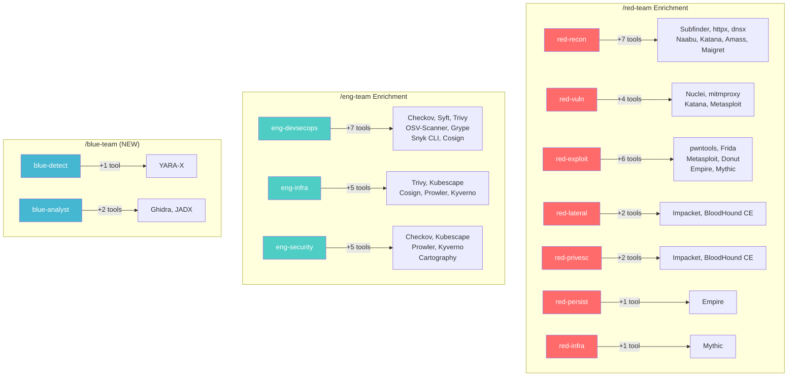
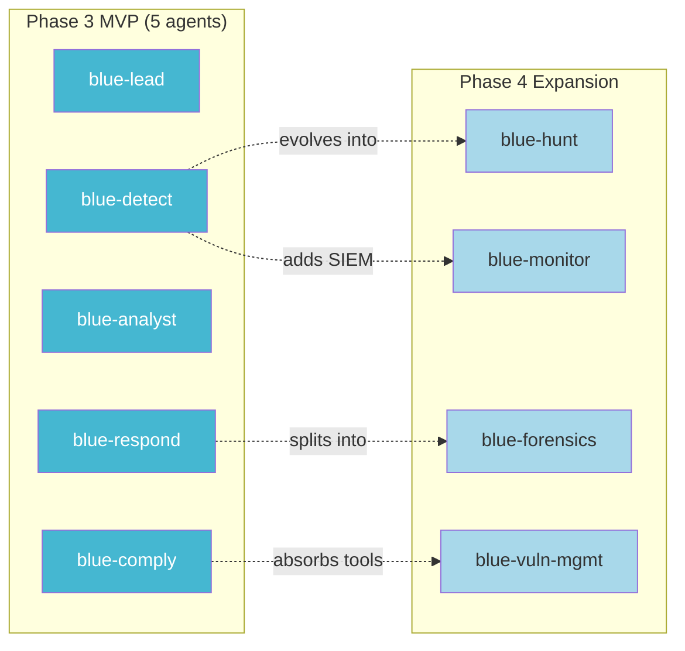
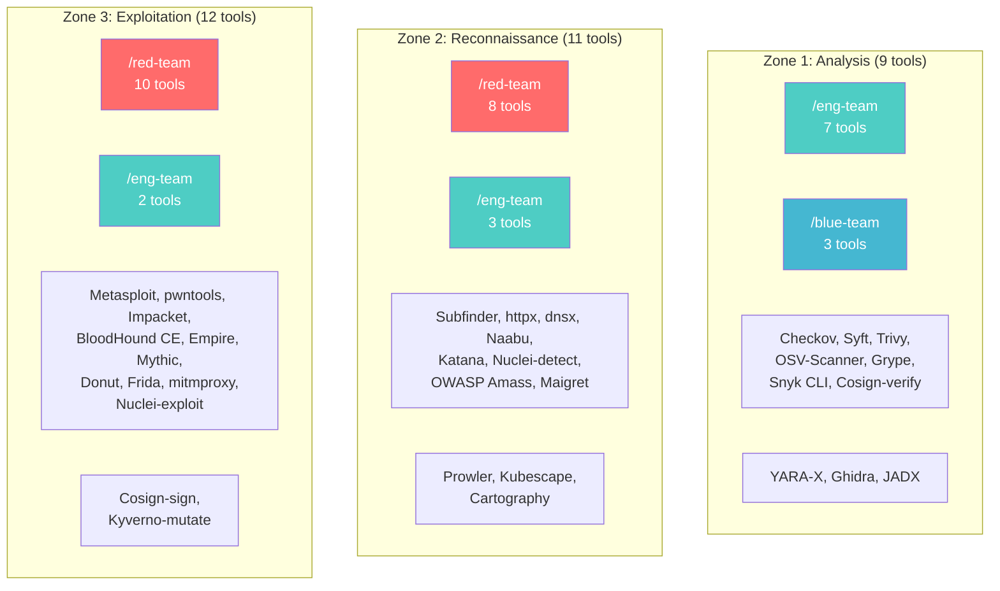
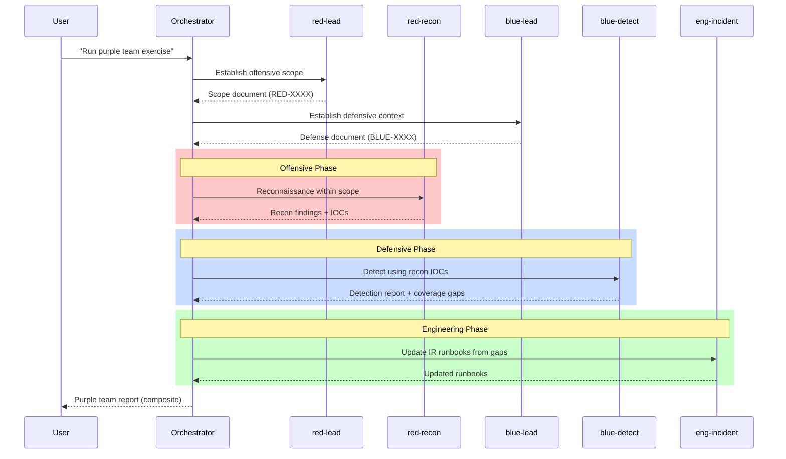

# Phase 3 Architecture Exploration: Option C -- Federated Extension Architecture

> **Agent:** explore-federated-001 | **Model:** Opus 4.6 (1M context) | **Date:** 2026-03-12
> **Project:** PROJ-023 Rainbow Series | **Phase:** 3, Stage 1 (Architecture Exploration)
> **Advocacy Position:** This document advocates FOR the Federated Extension Architecture.
> **Inputs:** Integration Assessment (Phase 2), Framework Catalog (Phase 1), /red-team SKILL.md, /eng-team SKILL.md

## Document Sections

| Section | Purpose |
|---------|---------|
| [L0: Executive Summary](#l0-executive-summary) | Top-line case for the federated approach |
| [L1: Tool-to-Skill Assignment](#l1-tool-to-skill-assignment) | Complete 31-tool mapping with rationale |
| [L1: Agent Enrichment Model](#l1-agent-enrichment-model) | How existing agents absorb tool knowledge |
| [L1: Blue-Team Skill Design](#l1-blue-team-skill-design) | New /blue-team skill architecture |
| [L1: DEC-006 Evolution](#l1-dec-006-evolution) | Per-skill methodology/execution boundary |
| [L1: Security Zone Mapping](#l1-security-zone-mapping) | Zone-to-skill distribution |
| [L1: Routing Impact](#l1-routing-impact) | Trigger map changes and disambiguation |
| [L1: Purple Team Composition](#l1-purple-team-composition) | Cross-skill composition for purple team exercises |
| [L1: Phase 3 MVP Scope](#l1-phase-3-mvp-scope) | Minimum viable extension definition |
| [L2: Strengths](#l2-strengths) | Architectural advantages of the federated approach |
| [L2: Weaknesses and Mitigations](#l2-weaknesses-and-mitigations) | Known risks with concrete mitigations |
| [L2: Strategic Implications](#l2-strategic-implications) | Long-term architectural trajectory |

---

## L0: Executive Summary

The Federated Extension Architecture distributes 31 assessed tools across three skills based on **natural domain affinity**: offensive tools enrich `/red-team` (17 tools across 8 agents), defensive DevSecOps and cloud tools enrich `/eng-team` (11 tools across 4 agents), and a new `/blue-team` skill (3 tools, 4-5 agents) fills the defensive operations gap that neither existing skill covers -- threat detection, malware analysis, reverse engineering, and incident response triage.

**The core thesis:** Tools belong where the expertise already lives. A reconnaissance tool belongs with the reconnaissance specialist. An SBOM scanner belongs with the DevSecOps pipeline engineer. Introducing a new umbrella skill to house tools that already have natural agent homes creates an unnecessary indirection layer that violates the principle of least surprise and adds routing complexity without architectural benefit.

**Key advantages:**
- **Zero disruption to existing skills.** Both /red-team (11 agents) and /eng-team (10 agents) continue operating identically. Tool integration is additive -- it enriches existing agent methodologies without changing agent identities, orchestration flows, or authorization models.
- **Leverage existing agent expertise.** red-recon already provides methodology guidance for Subfinder, httpx, and Naabu. eng-devsecops already recommends Trivy and Grype. The integration assessment's "Target Agent(s)" column explicitly maps 26 of 31 tools to existing agents. This is not a coincidence -- it reflects that the tools were designed for the workflows these agents already guide.
- **Independent evolution.** Each skill can evolve its DEC-006 boundary (methodology vs. execution) at its own pace. /eng-team Zone 1 tools can move to execution-ready immediately while /red-team Zone 3 tools remain methodology-primary. No artificial coupling.
- **Minimal routing impact.** No new `/rainbow` keyword collision space. /blue-team adds a clean, non-overlapping keyword domain. Existing routing for /red-team and /eng-team is unchanged.

**What gets created:**
- 1 new skill: `/blue-team` (4-5 agents for defensive operations)
- 0 new agents in /red-team or /eng-team (tool knowledge enriches existing agents)
- 3 suite-level adapter definitions (ProjectDiscovery, Anchore, Cloud Security Posture)
- Per-agent methodology updates for tool invocation guidance

---

## L1: Tool-to-Skill Assignment

### Complete 31-Tool Mapping

The assignment follows two principles: (1) match tools to the agent whose methodology already covers that tool's function, and (2) respect the integration assessment's "Target Agent(s)" recommendations, which were derived from domain analysis.

#### /red-team -- Offensive Operations (17 tools)

| Tool | Composite | Tier | Zone | Target Agent(s) | Rationale |
|------|-----------|------|------|-----------------|-----------|
| Nuclei | 9.02 | A | 2/3 | red-vuln | Vulnerability scanning is red-vuln's core function; template allowlisting determines zone |
| httpx | 8.40 | A | 2 | red-recon | HTTP probing in the recon pipeline; red-recon already guides this workflow |
| Subfinder | 8.34 | A | 2 | red-recon | Subdomain enumeration; entry point of the recon pipeline red-recon guides |
| dnsx | 8.32 | A | 2 | red-recon | DNS resolution; middleware in the recon pipeline |
| Katana | 8.28 | A | 2 | red-recon, red-vuln | Web crawling feeds both recon mapping and vuln scanning |
| Naabu | 8.15 | A | 2 | red-recon | Port scanning; core recon function |
| OWASP Amass | 7.29 | B | 2 | red-recon | Subdomain enumeration; alternative to Subfinder |
| mitmproxy | 7.47 | B | 2/3 | red-vuln | Traffic interception for vulnerability analysis |
| pwntools | 7.15 | B | 3 | red-exploit | Exploit development library; red-exploit's core domain |
| Impacket | 7.06 | B | 3 | red-lateral, red-privesc | AD protocol attacks; directly maps to lateral movement and privilege escalation |
| Frida | 6.95 | B | 3 | red-exploit | Dynamic instrumentation for mobile/desktop exploitation |
| Maigret | 6.45 | C | 2 | red-recon | OSINT username enumeration; feeds reconnaissance |
| Metasploit | 6.16 | C | 3 | red-exploit, red-vuln | Industry-standard exploitation framework |
| Donut | 5.93 | C | 3 | red-exploit | Shellcode generation; payload delivery for exploitation |
| BloodHound CE | 5.88 | C | 3 | red-privesc, red-lateral | AD attack path analysis; directly maps to privesc/lateral agents |
| Empire | 5.87 | C | 3 | red-exploit, red-persist | C2 framework; post-exploitation persistence |
| Mythic | 5.78 | C | 3 | red-exploit, red-infra | C2 framework; infrastructure and tooling |

**Agent tool distribution:**

| Agent | Tools Assigned | Zone Coverage |
|-------|---------------|---------------|
| red-recon | Subfinder, httpx, dnsx, Naabu, Katana, OWASP Amass, Maigret (7) | Zone 2 |
| red-vuln | Nuclei, mitmproxy, Katana, Metasploit (4, Katana shared) | Zone 2/3 |
| red-exploit | pwntools, Frida, Metasploit, Donut, Empire, Mythic (6, Metasploit shared) | Zone 3 |
| red-lateral | Impacket, BloodHound CE (2) | Zone 3 |
| red-privesc | Impacket, BloodHound CE (2, shared with red-lateral) | Zone 3 |
| red-persist | Empire (1) | Zone 3 |
| red-infra | Mythic (1, shared with red-exploit) | Zone 3 |
| red-social | -- (0, methodology-only per integration assessment gap analysis) | N/A |
| red-lead | -- (0, orchestration/authorization agent) | N/A |
| red-exfil | -- (0, methodology-only) | N/A |
| red-reporter | -- (0, reporting agent) | N/A |

#### /eng-team -- Defensive Engineering & DevSecOps (11 tools)

| Tool | Composite | Tier | Zone | Target Agent(s) | Rationale |
|------|-----------|------|------|-----------------|-----------|
| Checkov | 9.58 | A | 1 | eng-devsecops, eng-security | IaC scanning; eng-devsecops already recommends Checkov |
| Syft | 9.54 | A | 1 | eng-devsecops | SBOM generation; core supply chain security function |
| Trivy | 9.45 | A | 1 | eng-devsecops, eng-infra | Broadest scanner; eng-devsecops already references Trivy |
| OSV-Scanner | 9.37 | A | 1 | eng-devsecops | Dependency vulnerability scanning; SCA pipeline |
| Grype | 9.33 | A | 1 | eng-devsecops | SBOM-to-vuln matching; pairs with Syft |
| Kubescape | 8.67 | A | 1 | eng-infra, eng-security | K8s security posture; eng-infra handles infrastructure |
| Snyk CLI | 8.28 | A | 1 | eng-devsecops | SCA scanning; eng-devsecops pipeline integration |
| Cosign | 8.26 | A | 1/3 | eng-devsecops, eng-infra | Supply chain signing; verification = Zone 1, signing = Zone 3 |
| Prowler | 8.26 | A | 2 | eng-security, eng-infra | Multi-cloud CSPM; eng-infra handles cloud infrastructure |
| Kyverno | 8.17 | A | 1/3 | eng-infra, eng-security | K8s policy; validation = Zone 1, mutation = Zone 3 |
| Cartography | 6.62 | B | 2 | eng-security, red-recon | Cloud graph mapping; eng-security for defensive posture |

**Agent tool distribution:**

| Agent | Tools Assigned | Zone Coverage |
|-------|---------------|---------------|
| eng-devsecops | Checkov, Syft, Trivy, OSV-Scanner, Grype, Snyk CLI, Cosign (7) | Zone 1 |
| eng-infra | Trivy, Kubescape, Cosign, Prowler, Kyverno (5, Trivy/Cosign shared) | Zone 1/2 |
| eng-security | Checkov, Kubescape, Prowler, Kyverno, Cartography (5, shared) | Zone 1/2 |
| eng-architect | -- (0, architecture decisions, not tool execution) | N/A |
| eng-lead | -- (0, standards enforcement) | N/A |
| eng-backend | -- (0, implementation focus) | N/A |
| eng-frontend | -- (0, implementation focus) | N/A |
| eng-qa | -- (0, testing focus) | N/A |
| eng-reviewer | -- (0, review gate) | N/A |
| eng-incident | -- (0, IR runbooks; but receives /blue-team threat intelligence) | N/A |

#### /blue-team (NEW) -- Defensive Operations (3 tools)

| Tool | Composite | Tier | Zone | Target Agent(s) | Rationale |
|------|-----------|------|------|-----------------|-----------|
| YARA-X | 8.77 | A | 1 | blue-detect | Malware identification; pattern matching for threat detection |
| Ghidra | 7.36 | B | 1 | blue-analyst | Binary reverse engineering; malware analysis |
| JADX | 7.39 | B | 1 | blue-analyst | Android decompilation; mobile malware analysis |

**Why these three tools need a new skill:** YARA-X, Ghidra, and JADX serve a defensive operations domain that neither /red-team nor /eng-team covers. /red-team is offensive; using YARA-X for malware detection is defensive. /eng-team builds secure software; binary reverse engineering and malware analysis are operational security functions. These tools inhabit the "threat detection and response" space -- a distinct operational domain that deserves its own skill with its own methodology, agents, and orchestration flow.

### Cross-Skill Tool Sharing

Three tools have legitimate dual-skill assignments:

| Tool | Primary Skill | Secondary Skill | Sharing Rationale |
|------|--------------|-----------------|-------------------|
| Cartography | /eng-team (eng-security) | /red-team (red-recon, cloud context) | Defensive posture mapping vs. offensive cloud recon |
| Nuclei | /red-team (red-vuln) | /eng-team (eng-devsecops, detection templates) | Exploitation templates = offensive; detection templates = defensive pipeline |
| Katana | /red-team (red-recon) | /red-team (red-vuln) | Within-skill sharing; web crawl feeds both recon and vuln |

Cross-skill tool sharing is handled by adapter-level abstraction: both skills reference the same adapter definition. The adapter is skill-agnostic -- it wraps CLI invocation and JSON parsing. The skill-specific logic (zone controls, scope validation, template allowlisting) is in the agent methodology, not the adapter.

---

## L1: Agent Enrichment Model

### Enrichment Principle: Additive Methodology Extension

Tool integration enriches existing agents by adding tool invocation knowledge to their `<methodology>` sections. This is NOT a new capability -- it is a formalization of what agents already do informally. red-recon already mentions Nmap, Shodan, and Amass in its methodology. eng-devsecops already references Trivy, Grype, and Semgrep. Tool integration replaces these informal references with structured invocation patterns.

### Enrichment Structure Per Agent

Each enriched agent receives three additions to its definition:

**1. Tool Invocation Appendix** (added to `<methodology>` section):

```markdown
### Tool Integration (DEC-006 Tier A/B/C)

#### Subfinder -- Passive Subdomain Enumeration
- **Invocation:** `subfinder -d {target_domain} -json -silent`
- **Output:** JSON-lines, one subdomain per line
- **Zone:** 2 (scope validation required before first invocation)
- **DEC-006:** Execution-ready (Tier A)
- **Pipeline Position:** Entry point -> feeds httpx -> feeds Naabu -> feeds Nuclei
- **Guardrails:** Target domain MUST be in scope document authorized_targets

#### httpx -- HTTP Probing
- **Invocation:** `echo {targets} | httpx -json -silent`
- **Output:** JSON with status, tech, title, content-length
- **Zone:** 2 (scope validation required)
- **DEC-006:** Execution-ready (Tier A)
- **Pipeline Position:** Receives Subfinder output -> feeds Naabu/Nuclei
```

**2. Governance Update** (in `.governance.yaml`):

```yaml
capabilities:
  tool_integrations:
    - tool: subfinder
      dec_006_tier: A  # execution-ready
      zone: 2
      adapter: projectdiscovery-cli
    - tool: httpx
      dec_006_tier: A
      zone: 2
      adapter: projectdiscovery-cli
```

**3. Tool Tier Adjustment** (if needed):

Agents receiving execution-ready tools may need a tool tier adjustment. Currently, all /red-team and /eng-team agents have T3 (External) tier via WebSearch/WebFetch. Tool execution via Bash subprocess is already within T2 (Read-Write), which T3 subsumes. Therefore, **no tier escalation is needed** for execution-ready tools. Methodology-primary tools (Tier C) require no tier change since agents only produce guidance, not invocations.

### Agent-by-Agent Enrichment Plan



### Impact on Agent Definition Token Budget

Each tool invocation appendix adds approximately 100-200 tokens per tool to the agent's `<methodology>` section. The heaviest enrichment is red-recon (+7 tools, ~1,000-1,400 tokens) and eng-devsecops (+7 tools, ~1,000-1,400 tokens). Given typical agent definitions of 3,000-5,000 tokens, this represents a 20-35% increase for the most enriched agents. This is within CB-02 (tool results SHOULD NOT exceed 50% of context) since methodology text is loaded once at agent invocation, not per-tool-call.

For agents receiving 5+ tools, the enrichment appendix SHOULD use progressive disclosure: the tool invocation appendix lists all tools with one-line summaries at Tier 2, and full invocation patterns are deferred to Tier 3 (loaded via Read when the agent selects a specific tool for a task). This keeps the base definition under the ~5,000 token guideline.

---

## L1: Blue-Team Skill Design

### Rationale for a New Skill

The gap analysis from Phase 2 reveals that neither /red-team nor /eng-team covers:
- **Threat detection and triage** -- identifying malicious artifacts, IOCs, and threat patterns
- **Malware analysis** -- static and dynamic analysis of malicious binaries and mobile apps
- **Vulnerability management operations** -- ongoing monitoring, patching prioritization, and posture assessment beyond initial pipeline scanning
- **Compliance auditing** -- continuous compliance posture assessment against CIS, NIST, PCI DSS frameworks

These functions constitute **defensive operations** -- the operational arm of cybersecurity that /eng-team's engineering focus and /red-team's offensive focus do not cover. The analogy: /eng-team builds the castle, /red-team attacks it, /blue-team defends it during operation.

### Agent Roster

| Agent | Role | Tools | Model | Cognitive Mode |
|-------|------|-------|-------|----------------|
| `blue-lead` | Blue Team Lead & Engagement Authority | -- (orchestration) | opus | convergent |
| `blue-detect` | Threat Detection Specialist | YARA-X | sonnet | forensic |
| `blue-analyst` | Malware & Reverse Engineering Analyst | Ghidra, JADX | sonnet | forensic |
| `blue-respond` | Incident Response Coordinator | -- (methodology) | sonnet | systematic |
| `blue-comply` | Compliance Auditor | -- (methodology, could absorb Prowler/Kubescape in future) | sonnet | systematic |

**Agent count: 5** -- This is intentionally lean. The /blue-team MVP starts with the minimum viable agent set. Additional agents (e.g., `blue-hunt` for threat hunting, `blue-forensics` for digital forensics, `blue-vuln-mgmt` for vulnerability management operations) can be added in Phase 4 based on observed usage patterns without affecting the existing agent topology.

### Agent Descriptions

**blue-lead:** Blue team engagement authority. Establishes defensive engagement context (what are we protecting, against what threat model, within what compliance frameworks). Analogous to red-lead for the offensive side. All /blue-team operations require blue-lead to establish a defensive context document before other agents operate.

**blue-detect:** Threat detection using YARA-X for malware identification and IOC matching. Produces detection reports with matched rules, confidence scores, and recommended response actions. Consumes red-recon and red-vuln outputs for threat-informed detection tuning (Integration Point 5).

**blue-analyst:** Binary and mobile application analysis using Ghidra (headless decompilation + PyGhidra scripting) and JADX (Android APK decompilation). Produces analysis reports with control flow graphs, suspicious function identification, and malware family classification. Deep forensic cognitive mode -- traces backward from indicators to root cause.

**blue-respond:** Incident response methodology guidance following NIST SP 800-61 (Incident Handling) and SANS PICERL (Preparation, Identification, Containment, Eradication, Recovery, Lessons Learned). Coordinates with eng-incident for response runbook execution. Produces IR timeline reconstructions and containment recommendations.

**blue-comply:** Compliance posture auditing against CIS Benchmarks, NIST CSF, PCI DSS, HIPAA, and SOC 2 frameworks. Produces compliance gap assessments and remediation roadmaps. Methodology-only in MVP; Phase 4 could add Prowler and Kubescape execution for automated compliance scanning.

### Relationship to Phase 4 Blue-Team Design

The /blue-team skill is designed for incremental growth:



Phase 4 agents are additive -- they do not replace or restructure the Phase 3 agents. This is the same pattern /eng-team used: eng-devsecops was added to absorb automated tooling from eng-security, splitting the domain into human-review and automated-scanning concerns without restructuring existing agents.

### /blue-team SKILL.md Outline

The SKILL.md follows the same structure as /red-team and /eng-team:

1. **Authorization model:** blue-lead establishes a defensive engagement context (analogous to red-lead's scope document). Context specifies: what systems/networks are being defended, threat model assumptions, compliance frameworks applicable, authorized response actions.
2. **Orchestration flow:** Non-linear, like /red-team. Detection findings may trigger analysis, analysis may trigger response, response lessons may improve detection. blue-lead coordinates.
3. **Cross-skill integration:** 2 new integration points with /red-team and 1 with /eng-team (see [Purple Team Composition](#l1-purple-team-composition)).
4. **DEC-006 boundary:** Execution-ready for YARA-X (local pattern matching, Zone 1). Methodology-primary for Ghidra (infrastructure-heavy). Guide-then-execute for JADX (CLI decompilation).

---

## L1: DEC-006 Evolution

### Per-Skill Boundary Evolution

The federated architecture's key advantage for DEC-006 is that each skill evolves its execution boundary independently, without cross-skill coordination overhead.

| Skill | Phase 3.0 (MVP) | Phase 3.1 | Phase 3.2 | Phase 4+ |
|-------|-----------------|-----------|-----------|----------|
| **/eng-team** | **Tier A execution for Zone 1** (9 tools: Checkov, Syft, Trivy, OSV-Scanner, Grype, YARA-X -- wait, YARA-X is /blue-team. 7 tools: Checkov, Syft, Trivy, OSV-Scanner, Grype, Snyk CLI, Cosign-verify). Direct CLI invocation via Bash. | Add Zone 2 execution: Prowler, Kubescape with credential injection approval gates. | Add Kyverno mutation, Cosign signing with human approval gates. | Cartography with Neo4j setup guidance. |
| **/red-team** | **Tier A execution for Zone 2 recon pipeline** (6 ProjectDiscovery tools: Subfinder, httpx, dnsx, Naabu, Katana, Nuclei detection templates). Requires engagement scope approval from red-lead. | Add Zone 2 remaining: Maigret, OWASP Amass. Add guide-then-execute for Zone 2+ tools with credential setup. | mitmproxy guide-then-execute. pwntools, Impacket guide-then-execute with credential vault. | Zone 3 methodology-primary: Metasploit, Empire, Mythic, BloodHound CE, Donut with full engagement lifecycle. |
| **/blue-team** | **Tier A execution for YARA-X** (local pattern matching, zero network risk). JADX CLI decompilation as guide-then-execute. Ghidra methodology-primary. | Ghidra headless analysis with memory/Java requirements guidance. | blue-comply absorbs automated compliance scanning tools. | blue-detect integrates with SIEM/SOAR for detection-response loops. |

### Why Independent Evolution Matters

Consider the scenario where /eng-team wants to move Checkov to execution-ready (Tier A) -- this is a low-risk change affecting Zone 1 tools with minimal security guardrails. Under a federated architecture, this change requires:
1. Update eng-devsecops methodology section
2. Update eng-devsecops.governance.yaml with tool_integrations
3. Test Checkov CLI invocation
4. ADR at C3 (touches agent definition per AE-002)

This change has zero impact on /red-team's DEC-006 boundary. /red-team can continue in methodology-primary mode for its Zone 3 tools without being dragged into an execution-readiness review for defensive scanning tools.

In contrast, a unified skill would require evaluating whether the DEC-006 change creates precedent for Zone 3 tools, coordinating with all agents in the unified skill, and managing the risk that a Tier A execution gate for Checkov is misapplied to Metasploit by agents that share the same skill context.

---

## L1: Security Zone Mapping

### Zone-to-Skill Distribution



### Zone Guardrail Enforcement by Skill

| Zone | Guardrail Level | /red-team Enforcement | /eng-team Enforcement | /blue-team Enforcement |
|------|-----------------|----------------------|----------------------|----------------------|
| **Zone 1** | Minimal: audit logging | N/A (no Zone 1 tools) | Automatic execution within project scope | Automatic execution for local file analysis |
| **Zone 2** | Moderate: scope validation | red-lead scope document required; IP allowlist; rate limiting | Cloud credentials via env vars; project scope approval | N/A (no Zone 2 tools in MVP) |
| **Zone 3** | Full: RoE gates + credential vault | Per-operation human approval; engagement-scoped credential vault; artifact quarantine | Human approval for signing (Cosign) and mutation (Kyverno) operations | N/A (no Zone 3 tools) |

**Key insight:** Zone enforcement maps cleanly to existing authorization models. /red-team already has the red-lead scope document authorization architecture -- Zone 2 and Zone 3 guardrails plug directly into this model. /eng-team operates within project scope boundaries -- Zone 1 tools execute automatically; Zone 3 operations (signing, mutation) require explicit user approval per P-020. /blue-team operates on local artifacts (malware samples, binaries) -- Zone 1 guardrails are sufficient for MVP.

### Dual-Zone Tool Handling

Three tools span two zones depending on operation type:

| Tool | Zone 1/2 Operation | Zone 3 Operation | Enforcement |
|------|-------------------|------------------|-------------|
| Nuclei | Detection templates (scan, identify) | Exploitation templates (modify target state) | Template allowlist in agent methodology; red-vuln checks template category before invocation |
| Cosign | Verify signatures (read-only) | Sign artifacts (immutable trust chain modification) | eng-devsecops/eng-infra methodology gates signing behind human approval |
| Kyverno | Validate policies (assessment) | Mutate resources (modify K8s state) | eng-infra/eng-security methodology gates mutation behind human approval |

The enforcement is agent-level, not skill-level. The agent's methodology section defines which operations are automatic vs. approval-gated. This is simpler than skill-level zone enforcement because the agent already knows its operational context.

---

## L1: Routing Impact

### Trigger Map Changes

The federated approach requires adding ONE new skill entry to `mandatory-skill-usage.md` and modifying ZERO existing entries.

**New entry for /blue-team:**

| Detected Keywords | Negative Keywords | Priority | Compound Triggers | Skill |
|---|---|---|---|---|
| threat detection, malware analysis, YARA, IOC, indicator of compromise, reverse engineering, binary analysis, malware family, blue team defense, defensive operations, compliance audit, CIS benchmark audit, NIST CSF assessment, incident triage, detection rules, threat hunting | penetration test, exploit, offensive, reconnaissance, red team, attack surface, code review, architecture, implementation, adversarial quality review, quality gate | 10 | "malware analysis" OR "threat detection" OR "compliance audit" OR "incident triage" OR "reverse engineering" (phrase match) | `/blue-team` |

**Disambiguation between /red-team and /blue-team:**

The "red team" vs. "blue team" disambiguation is handled by the negative keywords above:
- "/red-team" negative keywords already exclude: `adversarial quality review, quality gate, quality scoring` (disambiguation from /adversary)
- "/blue-team" negative keywords exclude: `penetration test, exploit, offensive, reconnaissance, red team, attack surface`
- The phrase "red team" routes to /red-team (no blue-team positive match)
- The phrase "blue team defense" routes to /blue-team (positive match + no negative hit)
- The phrase "threat detection" routes to /blue-team (positive match on /blue-team, no match on /red-team)

**No changes to /red-team or /eng-team routing:**
- /red-team keywords remain unchanged. Tool names (Subfinder, Nuclei, etc.) are not routing keywords -- they are implementation details within the skill.
- /eng-team keywords remain unchanged. Checkov, Trivy, etc. are not routing keywords.
- The existing routing disambiguation between /red-team and /eng-team is preserved unchanged.

### Routing Complexity Assessment

| Metric | Before | After | Delta |
|--------|--------|-------|-------|
| Skills in trigger map | 13 | 14 | +1 |
| Total positive keywords | ~160 | ~175 | +15 |
| Collision zones | ~8 | ~9 | +1 (blue-team/eng-team on "CIS benchmark") |
| Phase 2 threshold (15+ skills triggers decision tree) | No | No | Still below |

The single new collision zone ("CIS benchmark" appears in both /eng-team and /blue-team) is resolved by negative keywords: /eng-team uses "CIS benchmark" in the context of building compliant systems (positive keyword for eng-team: "CIS benchmark"), while /blue-team uses it for compliance auditing (compound trigger: "CIS benchmark audit"). The compound trigger provides disambiguation per Step 2 of the routing algorithm.

---

## L1: Purple Team Composition

### Existing Integration Points (Preserved)

The four existing /red-team to /eng-team integration points are unchanged:

| # | Source | Target | Data Flow |
|---|--------|--------|-----------|
| IP-1 | red-recon | eng-architect | Threat intelligence for STRIDE/DREAD |
| IP-2 | red-recon, red-vuln | eng-infra, eng-devsecops | Attack surface validation results |
| IP-3 | red-exploit, red-privesc | eng-security, eng-backend, eng-frontend | Exploitation results against hardened code |
| IP-4 | red-persist, red-lateral, red-exfil | eng-incident | IR exercise results |

### New Integration Points (Federated Purple Team)

The federated architecture adds two new cross-skill integration points:

**Integration Point 5: Threat-Informed Detection** (NEW)

| Attribute | Value |
|-----------|-------|
| **Source** | red-recon, red-vuln, red-exploit |
| **Target** | blue-detect |
| **Data Exchanged** | Discovered TTPs, exploitation artifacts, IOC patterns |
| **Value** | Detection tuning informed by actual offensive findings; YARA rules derived from observed malware patterns |
| **Workflow** | Red team engagement produces artifacts; blue-detect ingests artifacts to create/refine YARA detection rules |

**Integration Point 6: Detection Validation** (NEW)

| Attribute | Value |
|-----------|-------|
| **Source** | blue-detect, blue-analyst |
| **Target** | eng-incident, eng-devsecops |
| **Data Exchanged** | Detection coverage reports, analysis findings, IOC feeds |
| **Value** | Engineering team hardens systems based on detected threats; IR runbooks updated with observed attack patterns |
| **Workflow** | Blue team detection and analysis feeds engineering improvements; closes the detection-hardening loop |

### Purple Team Exercise Orchestration

A purple team exercise composes all three skills:



The orchestrator (main context or /orchestration skill) coordinates the three skills. Each skill operates within its own authorization boundary:
- /red-team: red-lead scope document governs what the red team can do
- /blue-team: blue-lead defensive context governs what the blue team monitors
- /eng-team: project scope governs what engineering changes are authorized

This composition is P-003 compliant: the orchestrator invokes agents from each skill as workers. No skill invokes agents from another skill. Cross-skill data flows through file artifacts (CB-03: file-path references, not inline content).

---

## L1: Phase 3 MVP Scope

### Minimum Viable Extension Definition

The MVP prioritizes the highest-value, lowest-risk integrations first.

#### MVP Wave 1: /eng-team Zone 1 (7 tools, ~3-4 person-weeks)

| Tool | Agent | DEC-006 Tier | Adapter | Priority |
|------|-------|-------------|---------|----------|
| Checkov | eng-devsecops | A (execute) | Cloud Security Posture | P0 |
| Syft | eng-devsecops | A (execute) | Anchore Supply Chain | P0 |
| Grype | eng-devsecops | A (execute) | Anchore Supply Chain | P0 |
| Trivy | eng-devsecops, eng-infra | A (execute) | Cloud Security Posture | P0 |
| OSV-Scanner | eng-devsecops | A (execute) | Standalone (MCP future) | P0 |
| Snyk CLI | eng-devsecops | A (execute) | Standalone | P1 |
| Cosign (verify) | eng-devsecops, eng-infra | A (execute) | Standalone | P1 |

**Deliverables:** 2 adapter definitions (Anchore, Cloud Security Posture), 2 agent methodology updates (eng-devsecops, eng-infra), 7 tool invocation appendices.

**Why /eng-team first:** All 7 tools are Zone 1 (minimal guardrails), Tier A (integration-ready), and execution-ready (Tier A DEC-006). The eng-devsecops agent already references these tools by name in its methodology. This wave proves the enrichment model with the lowest possible risk.

#### MVP Wave 2: /red-team Zone 2 Recon Pipeline (6 tools, ~2-3 person-weeks)

| Tool | Agent | DEC-006 Tier | Adapter | Priority |
|------|-------|-------------|---------|----------|
| Subfinder | red-recon | A (execute) | ProjectDiscovery CLI | P0 |
| httpx | red-recon | A (execute) | ProjectDiscovery CLI | P0 |
| dnsx | red-recon | A (execute) | ProjectDiscovery CLI | P0 |
| Naabu | red-recon | A (execute) | ProjectDiscovery CLI | P0 |
| Katana | red-recon | A (execute) | ProjectDiscovery CLI | P0 |
| Nuclei (detection) | red-vuln | A (execute) | ProjectDiscovery CLI | P0 |

**Deliverables:** 1 adapter definition (ProjectDiscovery CLI -- serves all 6 tools), 2 agent methodology updates (red-recon, red-vuln), 6 tool invocation appendices, template allowlist for Nuclei (detection-only templates).

**Why Wave 2:** The ProjectDiscovery suite shares a single adapter pattern (`-json -silent` + STDIN/STDOUT piping). One adapter serves six tools -- the highest value-per-effort ratio in the catalog. Requires engagement scope authorization from red-lead (Zone 2 controls), which /red-team already has.

#### MVP Wave 3: /blue-team Foundation (3 tools, ~2-3 person-weeks)

| Tool | Agent | DEC-006 Tier | Adapter | Priority |
|------|-------|-------------|---------|----------|
| YARA-X | blue-detect | A (execute) | Standalone (Python binding) | P1 |
| JADX | blue-analyst | B (guide-then-execute) | Standalone CLI | P2 |
| Ghidra | blue-analyst | C (methodology) | Headless + PyGhidra | P2 |

**Deliverables:** /blue-team SKILL.md, 5 agent definitions (blue-lead, blue-detect, blue-analyst, blue-respond, blue-comply), 2 governance YAMLs for tool-equipped agents, YARA-X adapter definition.

**Why Wave 3:** /blue-team is a new skill requiring full SKILL.md, agent definitions, and governance structure. This is more effort than enriching existing agents, which is why it follows the enrichment waves. However, YARA-X (Zone 1, composite 8.77, execution-ready) is one of the lowest-risk integrations in the entire catalog.

### Total MVP Effort Estimate

| Wave | Skill | Tools | Adapters | Agent Updates | New Agents | Est. Person-Weeks |
|------|-------|-------|----------|---------------|------------|-------------------|
| 1 | /eng-team | 7 | 2 | 2 | 0 | 3-4 |
| 2 | /red-team | 6 | 1 | 2 | 0 | 2-3 |
| 3 | /blue-team | 3 | 1 | 0 | 5 | 2-3 |
| **Total** | **3 skills** | **16** | **4** | **4** | **5** | **7-10** |

This aligns with the integration assessment's 7.5-13 person-week estimate for 20 Zone 1+2 tools (we scope 16 tools in the MVP, covering all Zone 1 and the high-value Zone 2 recon pipeline).

---

## L2: Strengths

### S-1: Minimal Architectural Disruption

The federated approach is the **least disruptive option** because:
- /red-team's 11 agents, orchestration flow, authorization model, cross-skill integration points, and SKILL.md are unchanged. Tool enrichment is purely additive.
- /eng-team's 10 agents, 8-step workflow, layered SDLC governance, and SKILL.md are unchanged.
- The mandatory-skill-usage.md trigger map gains one entry, not a restructured routing topology.
- No existing agent definitions are deprecated, merged, or restructured.

**Quantification:** 0 agents deprecated, 0 agents restructured, 4 agents enriched with methodology updates, 5 new agents created (all in /blue-team). Compare this to any approach that creates a new umbrella skill, which must either duplicate agent expertise from existing skills or create cross-skill delegation patterns that add routing complexity.

### S-2: Natural Tool-to-Agent Affinity

The integration assessment's "Target Agent(s)" column was derived from domain analysis -- it maps each tool to the agent whose methodology already covers that tool's function. The federated approach directly implements these mappings:

- red-recon already guides Subfinder/httpx/Naabu usage -> enrichment formalizes this
- eng-devsecops already recommends Trivy/Grype/Checkov -> enrichment formalizes this
- red-exploit is the exploitation specialist -> pwntools/Metasploit belong here
- red-lateral handles AD lateral movement -> Impacket belongs here

This is not arbitrary assignment -- it reflects that the tools were designed for the workflows these agents already reason about. Moving them to a different skill creates an indirection: the user asks about "SBOM scanning," the router finds `/eng-team` (where eng-devsecops lives), but the tool lives in a separate `/rainbow` skill. The user now needs to know that SBOM scanning methodology is in /eng-team but SBOM scanning execution is in /rainbow. This cognitive split violates the principle of least surprise.

### S-3: Independent Skill Evolution

Each skill is a self-contained unit with its own:
- DEC-006 boundary (methodology vs. execution)
- Security zone controls
- Authorization model
- Tool tier assignments
- Version cadence

This means:
- /eng-team can ship execution-ready Checkov in Phase 3.0 without waiting for /red-team to resolve Zone 3 guardrails for Metasploit.
- /red-team can evolve its Zone 2 recon pipeline to execution-ready while keeping Zone 3 tools methodology-primary indefinitely.
- /blue-team can be designed from scratch with execution-first in mind (YARA-X is Zone 1) without inheriting the baggage of offensive tool guardrails.

### S-4: Leverage Existing Authorization Models

/red-team already has a sophisticated authorization architecture (red-lead scope document, engagement ID, target allowlists, technique authorization, RoE gates). Zone 2 and Zone 3 tool execution plugs directly into this model:
- Zone 2 tools (recon pipeline) execute after scope approval, within authorized targets
- Zone 3 tools (exploitation) execute with per-operation approval via RoE gates

No new authorization model needs to be designed. The existing architecture was built for exactly this purpose -- it anticipated tool execution within engagement boundaries.

Similarly, /eng-team operates within project scope boundaries. Zone 1 tools (IaC scanning, SBOM generation) are authorized by the project context. Zone 3 operations (signing, mutation) require user approval per P-020. This is the same authorization model eng-devsecops already uses when recommending pipeline configuration.

### S-5: Alignment with Integration Assessment Recommendations

The integration assessment's R-01 (Suite-First Integration) and R-04 (DEC-006 Boundary) recommendations are fully implementable in the federated architecture:
- Suite adapters (ProjectDiscovery, Anchore, Cloud Security Posture) are adapter-level constructs, not skill-level. They work identically whether the tools live in one skill or three.
- DEC-006 tiers (A/B/C) map to per-agent methodology updates, which are more natural in the federated model (each agent knows its own tier) than in a unified model (a central skill must track 31 tools across 3 tiers).

### S-6: Clean Agent Count Management

The federated approach adds 5 new agents (all in /blue-team) to the framework's total. /red-team stays at 11 agents. /eng-team stays at 10 agents. /blue-team starts at 5 agents. Total: 26 agents across 3 security skills.

By comparison, a unified approach that creates a new umbrella skill must either: (a) create new agents that duplicate expertise from existing skills (inflating total agent count), or (b) rely on cross-skill delegation (adding routing complexity and violating the principle that tool knowledge lives with the domain expert).

### S-7: Cross-Pollination Without Coupling

Purple team exercises compose /red-team, /blue-team, and /eng-team through file-artifact exchange and orchestrator coordination (see Integration Points 5 and 6). The skills are loosely coupled:
- /red-team does not need to know /blue-team exists to function
- /blue-team can consume /red-team artifacts without importing offensive methodology
- /eng-team receives improvement signals from both without changing its engineering focus

This loose coupling means each skill can be developed, tested, and released independently. A bug in /blue-team detection logic does not affect /red-team engagement operations.

---

## L2: Weaknesses and Mitigations

### W-1: Tool Fragmentation Across Skills

**Weakness:** Tools are distributed across 3 skills. A user wanting "all security tools" must understand which skill owns which tools. Cross-skill tool discovery is harder than single-skill tool discovery.

**Mitigation:**
1. **Routing handles discovery.** Users do not need to know which skill owns a tool -- they describe what they want ("scan this container image for vulnerabilities") and the trigger map routes to the right skill (/eng-team -> eng-devsecops -> Trivy). Tool names are implementation details, not routing keywords.
2. **AGENTS.md registry.** The framework-level AGENTS.md already provides a cross-skill agent registry. Adding a "Tool Integrations" column provides tool-to-agent discoverability without requiring users to explore individual skills.
3. **Tool catalog artifact.** A framework-level tool catalog document (`docs/knowledge/tool-integrations.md`) can provide a single-page view of all 31 tools, their skill assignments, and their DEC-006 tiers. This is a documentation artifact, not an architectural requirement.

### W-2: Cross-Skill Coordination for Purple Team

**Weakness:** Purple team exercises require coordinating agents from 3 different skills. This is more complex than coordinating agents within a single skill.

**Mitigation:**
1. **Orchestrator pattern.** The /orchestration skill already coordinates multi-skill workflows (RT-M-006 ordering protocol). Purple team exercises are a specific instance of multi-skill combination, handled by the same orchestration mechanisms.
2. **File-artifact exchange.** Cross-skill data flows through file artifacts in engagement directories (CP-01: file paths only in handoffs). Each skill produces output in its standard location; the orchestrator references these paths when invoking agents from other skills.
3. **Integration points are well-defined.** The 6 integration points (4 existing + 2 new) define explicit data contracts between skills. This is more maintainable than implicit coordination within a monolithic skill.
4. **P-003 compliance is natural.** Cross-skill coordination happens at the orchestrator level (main context), not between agents. No agent invokes an agent from another skill. The topology remains strictly orchestrator -> worker.

### W-3: Agent Definition Growth for Heavily Enriched Agents

**Weakness:** red-recon (+7 tools, ~1,000-1,400 tokens) and eng-devsecops (+7 tools, ~1,000-1,400 tokens) experience significant methodology section growth, potentially impacting context budget.

**Mitigation:**
1. **Progressive disclosure.** Tool invocation appendices use the three-tier structure (CB-05 alignment): Tier 2 loads tool names + one-line summaries (~200 tokens total); Tier 3 loads full invocation patterns only when the agent selects a specific tool for a task (~150-200 tokens per tool via Read).
2. **Adapter abstraction.** Suite-level adapters (ProjectDiscovery CLI adapter) reduce per-tool documentation. red-recon's 7 tools share one adapter pattern; the appendix references the adapter once, then lists tool-specific flags. This compresses ~1,400 tokens to ~500 tokens.
3. **CB-02 compliance.** Even at maximum enrichment, the tool invocation appendix is methodology content loaded once at agent invocation (Tier 2). It does not grow with each tool call. The 50% tool-result budget (CB-02) applies to Read/Grep/Bash output during execution, which is unaffected by methodology section size.

### W-4: /blue-team is a New Skill (Setup Overhead)

**Weakness:** Creating /blue-team requires a full SKILL.md, 5 agent definitions with governance YAMLs, trigger map entry, AGENTS.md registration, and H-25/H-26 compliance. This is more work than enriching existing agents.

**Mitigation:**
1. **Justified by domain gap.** The integration assessment identifies that neither /red-team nor /eng-team covers threat detection, malware analysis, or compliance auditing operations. This is not "creating a skill to house tools" -- it is filling a genuine capability gap that would exist even without tool integration.
2. **Lean MVP.** /blue-team starts with 5 agents (compare: /red-team 11, /eng-team 10). Only 2 agents receive tools (blue-detect, blue-analyst). The remaining 3 are methodology-only agents that can ship without any tool integration work.
3. **Reusable patterns.** /blue-team's SKILL.md follows the exact same structure as /red-team and /eng-team. Agent definitions follow the same dual-file architecture (H-34). Governance YAMLs follow the same schema. The "new skill overhead" is a one-time cost that follows well-established patterns.
4. **Phase 3 Wave 3 sequencing.** /blue-team is Wave 3 of the MVP, after /eng-team and /red-team enrichment. If Phase 3 capacity is constrained, Waves 1 and 2 deliver 13 tool integrations without /blue-team.

### W-5: Dual-Skill Tool Assignments Create Ambiguity

**Weakness:** Nuclei, Cartography, and the shared Impacket/BloodHound CE tools appear in multiple agent assignments. Which agent "owns" the tool?

**Mitigation:**
1. **Primary assignment is unambiguous.** Each tool has a primary skill assignment (see the mapping table). Nuclei's primary is /red-team (red-vuln); Cartography's primary is /eng-team (eng-security). Secondary assignments are usage contexts, not ownership.
2. **Adapter is skill-agnostic.** The adapter definition (CLI invocation wrapper, JSON parser) is a shared infrastructure component. It does not belong to any skill -- it belongs to the framework's adapter layer. Both /red-team and /eng-team reference the same adapter definition.
3. **Zone controls are agent-specific.** When eng-devsecops invokes Nuclei (detection templates), Zone 2 controls apply. When red-vuln invokes Nuclei (exploitation templates), Zone 3 controls apply. The zone determination is in the agent methodology, not the adapter.

### W-6: No Single "Security Tool Status" View

**Weakness:** There is no single skill where an operator can see "what security tools are available and what state are they in." Tool status is distributed across 3 skills.

**Mitigation:**
1. **Framework-level tool registry.** A `TOOL_REGISTRY.yaml` (similar to the existing MCP tool registry in `mcp-tool-standards.md`) provides a single machine-readable view of all tool integrations: tool name, adapter, assigned skill, assigned agent(s), DEC-006 tier, zone, and health status. This is a configuration artifact, not a skill.
2. **Operational reality.** In practice, users do not think "show me all security tools." They think "scan this image" or "test this target." Routing handles tool selection transparently. The unified view is an administrative concern (quarterly tool health reviews), not an operational one.

---

## L2: Strategic Implications

### Architectural Trajectory

The federated approach positions the Jerry framework for long-term growth in two ways:

**1. Skill specialization scales naturally.** As the Jerry skill catalog grows beyond 15-20 skills (Phase 2 routing threshold), the federated model maintains clean domain boundaries. Each security skill (/red-team, /eng-team, /blue-team) is an independent domain with its own routing keywords, agent roster, and authorization model. Adding a fourth security skill (e.g., `/purple-team` for dedicated purple team orchestration) is additive -- it follows the same pattern as adding /blue-team.

**2. Tool count scales within agents.** The enrichment model (tool invocation appendix in agent methodology) supports 5-10 tools per agent before progressive disclosure limits are reached. With 8 enriched agents across 3 skills, the framework can absorb 40-80 tools without structural changes. At the current 31-tool scope, the heaviest agent (red-recon, eng-devsecops at 7 tools each) is well within this bound.

### DEC-006 Strategic Path

The federated approach provides the cleanest path to DEC-006 evolution because each skill represents a coherent security domain with a homogeneous risk profile:

- /eng-team tools are predominantly Zone 1 (analysis, scanning) -- the DEC-006 boundary can shift to execution-ready with minimal guardrail infrastructure.
- /red-team tools span Zone 2 (recon) and Zone 3 (exploitation) -- the DEC-006 boundary shifts per-zone, with recon moving to execution first and exploitation remaining methodology-primary until the full engagement lifecycle is implemented.
- /blue-team tools are Zone 1 (local analysis) -- execution-ready from day one.

A unified skill would mix these risk profiles, forcing a single DEC-006 boundary that either (a) constrains the entire skill to methodology-primary (holding back Zone 1 tools that are ready for execution) or (b) creates an inconsistent boundary within the skill (some agents execute, others guide, with no architectural separator between them).

### Alignment with PROJ-010 Architecture Decisions

The federated approach directly extends the architecture established in PROJ-010 (Cyber Ops):
- ADR-PROJ010-001 (Agent Team Architecture) designed /red-team and /eng-team as independent domain skills with cross-skill integration points.
- ADR-PROJ010-006 (Authorization & Scope Control) designed the red-lead scope document model.
- The federated approach adds tool integration to these skills without revising the architecture decisions that created them. Every ADR baseline decision remains valid.

A unified approach would require revising ADR-PROJ010-001 to account for a new organizational structure where tools are decoupled from the agents that reason about them. This is a backward-incompatible change to a baselined ADR, triggering AE-004 (auto-C4 for baselined ADR modification).

### Future /purple-team Skill

If purple team exercises become a frequent workflow, a dedicated `/purple-team` skill could be added in Phase 4+ as a **coordination skill** (like /orchestration) rather than an agent skill. This skill would:
- Contain purple team orchestration templates (not agents)
- Reference /red-team, /blue-team, and /eng-team agents
- Define purple team exercise workflows (attack -> detect -> harden loops)
- NOT duplicate agent expertise from any skill

This is only justified if purple team exercises become common enough to warrant skill-level routing. Until then, /orchestration handles purple team coordination as a multi-skill workflow.

---

*Exploration Version: 1.0.0*
*Agent: explore-federated-001*
*Position: ADVOCATE for Federated Extension Architecture*
*Confidence: 0.82 -- High confidence in the architectural analysis; moderate uncertainty on /blue-team agent roster sizing and purple team coordination complexity until validated by implementation.*
*Source: Integration Assessment (Phase 2), Framework Catalog (Phase 1), /red-team SKILL.md v1.0.0, /eng-team SKILL.md v1.0.0*
