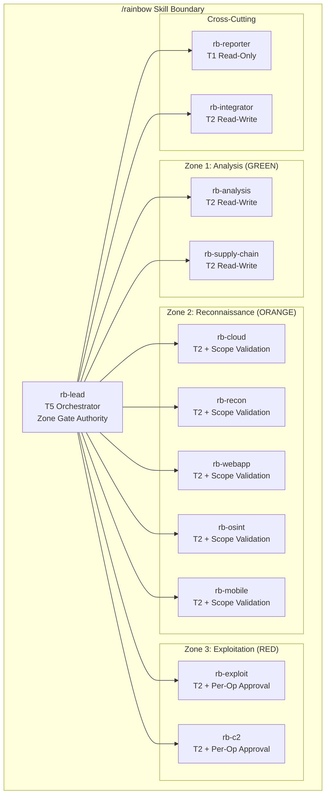

# Phase 3 Architecture Exploration: Option A -- Monolithic /rainbow Skill

> **Agent:** explore-monolithic-001 | **Model:** Opus 1M | **Date:** 2026-03-12
> **Project:** PROJ-023 Rainbow Series | **Phase:** 3 Stage 1 (Architecture Exploration)
> **Role:** Advocate for monolithic single-skill architecture
> **Inputs:** Integration assessment (31 tools, 6 dimensions), framework catalog (139 entries), existing skill patterns (/problem-solving, /red-team, /eng-team)

## Document Sections

| Section | Purpose |
|---------|---------|
| [L0: Executive Summary](#l0-executive-summary) | Top-line advocacy case and key metrics |
| [L1: Skill Structure](#l1-skill-structure) | SKILL.md organization, agent roster, frontmatter design |
| [L1: Agent-Tool Mapping](#l1-agent-tool-mapping) | Complete mapping of 31 tools to agents |
| [L1: Routing Design](#l1-routing-design) | Internal routing, keywords, disambiguation |
| [L1: Context Budget Analysis](#l1-context-budget-analysis) | Token consumption, progressive disclosure tiers |
| [L1: Security Zone Enforcement](#l1-security-zone-enforcement) | Zone 1/2/3 boundaries within a single skill |
| [L1: DEC-006 Alignment](#l1-dec-006-alignment) | Three-tier execution boundary handling |
| [L1: Phase 3 MVP Scope](#l1-phase-3-mvp-scope) | What ships first under this architecture |
| [L2: Strengths Analysis](#l2-strengths-analysis) | Genuine advantages of monolithic design |
| [L2: Weaknesses and Mitigations](#l2-weaknesses-and-mitigations) | Challenges with concrete countermeasures |
| [L2: Comparison to Existing Skills](#l2-comparison-to-existing-skills) | Scale comparison with /red-team and /eng-team |
| [L2: Strategic Implications](#l2-strategic-implications) | Long-term framework impact |

---

## L0: Executive Summary

**Thesis:** A single `/rainbow` skill containing all 31 integrated tools under one namespace is the architecturally correct choice for PROJ-023. This approach delivers unified security governance, eliminates cross-skill coordination overhead, provides a single routing entry point for exploit framework operations, and aligns with established Jerry patterns where `/red-team` (11 agents) and `/eng-team` (10 agents) already demonstrate that large agent rosters under a single skill work within the framework.

**Key metrics:**

| Metric | Value | Assessment |
|--------|-------|-----------|
| Total agents | 12 (7 zone-specialized + 3 cross-cutting + 2 governance) | Within proven range (eng-team=10, red-team=11) |
| Tools covered | 31 | Full shortlist coverage |
| Estimated SKILL.md size | ~700-850 lines | Comparable to /red-team (663 lines) |
| Trigger map entries | 1 (single skill) | Simplest possible routing |
| Security zones | 3 (enforced via agent-level tool tiers) | Clean zone-to-agent mapping |
| Phase 3.0 MVP scope | 20 tools (Zone 1 + Zone 2) | Aligned with integration assessment recommendation |

**Core argument:** The monolithic approach trades zero architectural complexity at the skill-routing layer for manageable complexity within the skill itself. Every alternative requires inter-skill coordination, routing disambiguation, and cross-skill security governance -- problems that do not exist when a single SKILL.md owns the entire domain. The `/rainbow` skill is not a compromise; it is the natural expression of the principle that **security tools working on the same engagement share a common lifecycle and should share a common governance boundary**.

---

## L1: Skill Structure

### SKILL.md Organization

The `/rainbow` SKILL.md follows the established triple-lens pattern used by `/red-team` and `/eng-team`, with security zone sections replacing kill-chain phase sections.

```
skills/rainbow/
  SKILL.md                          # Skill definition (~750 lines)
  agents/
    rb-lead.md                      # Engagement lead and zone orchestration
    rb-lead.governance.yaml
    rb-analysis.md                  # Zone 1: Static analysis agent
    rb-analysis.governance.yaml
    rb-supply-chain.md              # Zone 1: Supply chain security agent
    rb-supply-chain.governance.yaml
    rb-cloud.md                     # Zone 1/2: Cloud security posture agent
    rb-cloud.governance.yaml
    rb-recon.md                     # Zone 2: Reconnaissance pipeline agent
    rb-recon.governance.yaml
    rb-webapp.md                    # Zone 2: Web application testing agent
    rb-webapp.governance.yaml
    rb-exploit.md                   # Zone 3: Exploitation methodology agent
    rb-exploit.governance.yaml
    rb-c2.md                        # Zone 3: C2 and persistence agent
    rb-c2.governance.yaml
    rb-mobile.md                    # Zone 2/3: Mobile security agent
    rb-mobile.governance.yaml
    rb-osint.md                     # Zone 2: OSINT and social engineering agent
    rb-osint.governance.yaml
    rb-reporter.md                  # Cross-cutting: Engagement reporting
    rb-reporter.governance.yaml
    rb-integrator.md                # Cross-cutting: Tool adapter orchestration
    rb-integrator.governance.yaml
  rules/
    rainbow-security-zones.md       # Zone enforcement rules
    rainbow-engagement-lifecycle.md # Engagement lifecycle model
    rainbow-tool-adapters.md        # Adapter pattern specifications
  output/
    {engagement-id}/                # Per-engagement output directory
  templates/
    engagement-scope.yaml           # Scope document template
    tool-adapter-cli.md             # CLI adapter template
    tool-adapter-library.md         # Python library adapter template
```

### SKILL.md Frontmatter

```yaml
---
name: rainbow
description: "Unified exploit framework skill providing integrated security tool
  orchestration across analysis, reconnaissance, and exploitation domains. Invoked
  when users request security scanning, vulnerability assessment, SBOM generation,
  reconnaissance pipelines, exploit methodology, cloud security posture, container
  security, or tool-assisted penetration testing. Routes to 12 specialized agents
  organized by security zone (Zone 1 Analysis, Zone 2 Reconnaissance, Zone 3
  Exploitation). All tool executions require rb-lead scope authorization. Follows
  DEC-006 three-tier execution boundary (execute/guide-then-execute/methodology)."
version: "1.0.0"
allowed-tools: Read, Write, Edit, Glob, Grep, Bash, Task, WebSearch, WebFetch,
  mcp__context7__resolve-library-id, mcp__context7__query-docs
activation-keywords:
  - "security scan"
  - "vulnerability scan"
  - "SBOM"
  - "supply chain security"
  - "container scan"
  - "IaC scan"
  - "reconnaissance pipeline"
  - "subdomain enumeration"
  - "port scan"
  - "cloud security posture"
  - "exploit framework"
  - "exploit methodology"
  - "binary analysis"
  - "malware analysis"
  - "YARA"
  - "Nuclei"
  - "Trivy"
  - "Checkov"
  - "rainbow"
  - "tool-assisted pentest"
  - "OSINT tools"
  - "mobile security analysis"
  - "C2 framework"
  - "SBOM-to-vuln"
  - "Syft"
  - "Grype"
---
```

### SKILL.md Body Structure (Section Map)

| Section | Lines (est.) | Purpose |
|---------|-------------|---------|
| Document Audience (Triple-Lens) | ~20 | L0/L1/L2 section pointers |
| Purpose | ~30 | Skill overview, key capabilities, what this skill is NOT |
| When to Use This Skill | ~40 | Activation triggers, routing disambiguation with /red-team and /eng-team |
| Available Agents | ~50 | 12-agent roster with zones, models, output locations |
| Mandatory Scope Authorization | ~60 | rb-lead-first requirement, scope YAML schema |
| Security Zone Model | ~80 | Zone 1/2/3 definitions, guardrail profiles, tool-to-zone mapping |
| Invoking an Agent | ~40 | Three invocation methods with examples |
| Orchestration Flow | ~60 | Zone-based workflow with Mermaid diagram |
| DEC-006 Execution Tiers | ~40 | Execute/guide-then-execute/methodology boundary |
| Tool Adapter Architecture | ~50 | Suite-level adapter patterns, CLI/library/API paths |
| Cross-Skill Integration Points | ~40 | Integration with /red-team and /eng-team |
| Constitutional Compliance | ~20 | P-002, P-003, P-020, P-022 |
| Quick Reference | ~30 | Agent selection hints, common workflows |
| Agent Details | ~20 | Agent file paths |
| Routing Disambiguation | ~40 | When /rainbow vs. /red-team vs. /eng-team |
| References | ~20 | ADR traceability |
| **Total** | **~640** | |

**Estimated total with YAML frontmatter:** ~700-750 lines. This is within the range of existing large skills (/red-team at 663 lines) and well within the single-file readability threshold.

---

## L1: Agent-Tool Mapping

### Agent Roster (12 Agents)

| Agent | Zone | Model | Tool Tier | Cognitive Mode | Tools Managed | Count |
|-------|------|-------|-----------|---------------|---------------|-------|
| `rb-lead` | Gov | opus | T5 | convergent | (none -- orchestration) | 0 |
| `rb-analysis` | 1 | sonnet | T2 | systematic | YARA-X, Ghidra, JADX | 3 |
| `rb-supply-chain` | 1 | sonnet | T2 | systematic | Syft, Grype, OSV-Scanner, Cosign (verify), Snyk CLI | 5 |
| `rb-cloud` | 1/2 | sonnet | T2 | systematic | Checkov, Prowler, Kubescape, Kyverno (validate), Cartography | 5 |
| `rb-recon` | 2 | sonnet | T2 | divergent | Subfinder, httpx, dnsx, Naabu, Katana, OWASP Amass, Maigret | 7 |
| `rb-webapp` | 2 | sonnet | T2 | systematic | Nuclei (detection templates), Katana (shared w/ rb-recon) | 2 |
| `rb-exploit` | 3 | opus | T2 | convergent | Metasploit, pwntools, Impacket, Donut | 4 |
| `rb-c2` | 3 | opus | T2 | convergent | Empire, Mythic, BloodHound CE | 3 |
| `rb-mobile` | 2/3 | sonnet | T2 | systematic | Frida, JADX (shared w/ rb-analysis) | 2 |
| `rb-osint` | 2 | sonnet | T2 | divergent | Maigret (shared w/ rb-recon), mitmproxy | 2 |
| `rb-reporter` | Cross | sonnet | T1 | integrative | (none -- consumes outputs) | 0 |
| `rb-integrator` | Cross | sonnet | T2 | systematic | (adapter management, not tool-specific) | 0 |

**Total unique tool assignments:** 31 (matches full shortlist). Three tools have shared assignments across agents (JADX in rb-analysis + rb-mobile; Maigret in rb-recon + rb-osint; Katana in rb-recon + rb-webapp). Shared assignments are resolved by engagement context: rb-lead routes to the contextually appropriate agent.

### Complete Tool-to-Agent Matrix

| # | Tool | Composite | Zone | Primary Agent | Secondary Agent | DEC-006 Tier |
|---|------|-----------|------|--------------|-----------------|-------------|
| 93 | Checkov | 9.58 | 1 | rb-cloud | -- | Execute |
| 102 | Syft | 9.54 | 1 | rb-supply-chain | -- | Execute |
| 99 | Trivy | 9.45 | 1 | rb-supply-chain | rb-cloud | Execute |
| 22 | OSV-Scanner | 9.37 | 1 | rb-supply-chain | -- | Execute |
| 101 | Grype | 9.33 | 1 | rb-supply-chain | -- | Execute |
| 20 | Nuclei (detection) | 9.02 | 2 | rb-webapp | rb-recon | Execute |
| 20 | Nuclei (exploit) | 9.02 | 3 | rb-exploit | -- | Guide-then-execute |
| 45 | YARA-X | 8.77 | 1 | rb-analysis | -- | Execute |
| 105 | Kubescape | 8.67 | 1/2 | rb-cloud | -- | Execute (CLI) / Guide (Operator) |
| 14 | httpx | 8.40 | 2 | rb-recon | -- | Execute |
| 13 | Subfinder | 8.34 | 2 | rb-recon | -- | Execute |
| 18 | dnsx | 8.32 | 2 | rb-recon | -- | Execute |
| 25 | Snyk CLI | 8.28 | 1 | rb-supply-chain | -- | Guide-then-execute |
| 77 | Katana | 8.28 | 2 | rb-recon | rb-webapp | Execute |
| 103 | Cosign (verify) | 8.26 | 1 | rb-supply-chain | -- | Execute |
| 103 | Cosign (sign) | 8.26 | 3 | rb-supply-chain | -- | Guide-then-execute |
| 89 | Prowler | 8.26 | 1/2 | rb-cloud | -- | Execute (async) |
| 109 | Kyverno (validate) | 8.17 | 1 | rb-cloud | -- | Guide-then-execute |
| 109 | Kyverno (mutate) | 8.17 | 3 | rb-cloud | -- | Guide-then-execute |
| 16 | Naabu | 8.15 | 2 | rb-recon | -- | Execute |
| 61 | mitmproxy | 7.47 | 2/3 | rb-osint | rb-exploit | Guide-then-execute |
| 114 | JADX | 7.39 | 1 | rb-analysis | rb-mobile | Execute |
| 51 | Ghidra | 7.36 | 1 | rb-analysis | -- | Methodology |
| 15 | OWASP Amass | 7.29 | 2 | rb-recon | -- | Guide-then-execute |
| 3 | pwntools | 7.15 | 3 | rb-exploit | -- | Execute / Methodology |
| 36 | Impacket | 7.06 | 3 | rb-exploit | -- | Execute / Methodology |
| 110 | Frida | 6.95 | 2/3 | rb-mobile | -- | Guide-then-execute |
| 96 | Cartography | 6.62 | 1/2 | rb-cloud | -- | Methodology |
| 131 | Maigret | 6.45 | 2 | rb-recon | rb-osint | Execute |
| 1 | Metasploit | 6.16 | 3 | rb-exploit | -- | Methodology |
| 27 | Donut | 5.93 | 3 | rb-exploit | -- | Execute |
| 34 | BloodHound CE | 5.88 | 3 | rb-c2 | -- | Methodology |
| 6 | Empire | 5.87 | 3 | rb-c2 | -- | Methodology |
| 5 | Mythic | 5.78 | 3 | rb-c2 | -- | Methodology |

### Agent Load Distribution

| Agent | Tools (primary) | Tools (secondary) | Zone Coverage | Heaviest Tools |
|-------|----------------|-------------------|---------------|----------------|
| rb-recon | 7 | 0 | Zone 2 | ProjectDiscovery suite (6 tools, shared adapter) |
| rb-supply-chain | 5 | 1 (Trivy) | Zone 1 | Anchore pair (Syft+Grype), Cosign |
| rb-cloud | 5 | 0 | Zone 1/2 | Checkov, Prowler, Kubescape |
| rb-exploit | 4 | 0 | Zone 3 | Metasploit, pwntools, Impacket |
| rb-analysis | 3 | 0 | Zone 1 | YARA-X, Ghidra, JADX |
| rb-c2 | 3 | 0 | Zone 3 | Empire, Mythic, BloodHound CE |
| rb-webapp | 2 | 0 | Zone 2 | Nuclei (detection) |
| rb-mobile | 2 | 0 | Zone 2/3 | Frida, JADX |
| rb-osint | 2 | 0 | Zone 2 | mitmproxy, Maigret |

**Maximum tools per agent:** 7 (rb-recon). This is within bounds -- the 6 ProjectDiscovery tools share a single CLI-wrapper adapter pattern, making rb-recon operationally equivalent to managing 2 distinct adapter patterns (PD suite + Amass+Maigret). **No agent exceeds the 15-tool alert threshold** from AP-07 (Tool Overload Creep).

---

## L1: Routing Design

### External Routing (Trigger Map Entry)

The monolithic approach requires exactly **one** entry in the mandatory-skill-usage.md trigger map:

| Detected Keywords | Negative Keywords | Priority | Compound Triggers | Skill |
|---|---|---|---|---|
| security scan, vulnerability scan, SBOM, supply chain security, container scan, IaC scan, reconnaissance pipeline, subdomain enumeration, port scan, cloud security posture, exploit framework, exploit methodology, binary analysis, malware analysis, YARA, Nuclei, Trivy, Checkov, rainbow, tool-assisted pentest, OSINT tools, mobile security analysis, C2 framework, Syft, Grype, SBOM-to-vuln, Prowler, Kubescape, Kyverno, Cosign, pwntools, Impacket, Metasploit, Ghidra, Frida, JADX, mitmproxy, BloodHound, Empire, Mythic, Donut | code review for security, threat model, secure design, STRIDE, DREAD, SDLC, DevSecOps pipeline (without scan), SAST pipeline, adversarial quality review, quality gate, quality scoring, research, investigate | 10 | "security scan" OR "vulnerability scan" OR "supply chain security" OR "exploit framework" OR "reconnaissance pipeline" OR "cloud security posture" (phrase match) | `/rainbow` |

**Negative keywords** prevent collision with:
- `/eng-team`: "code review for security", "threat model", "secure design", "STRIDE", "DREAD"
- `/adversary`: "adversarial quality review", "quality gate", "quality scoring"
- `/problem-solving`: "research", "investigate" (when standalone without security tool context)
- `/red-team`: Intentionally NO negative keywords against /red-team -- see disambiguation below

**Disambiguation with /red-team:** The `/rainbow` skill handles **tool-assisted** security operations (scanning, automated recon, tool execution). The `/red-team` skill handles **methodology-guided** engagement operations (scope establishment, kill chain progression, engagement reporting). When a request involves both (e.g., "use Nuclei to scan the authorized targets"), `/rainbow` provides the tool execution and `/red-team` provides the engagement lifecycle. The rb-lead agent validates against any active /red-team scope document, ensuring tool execution respects engagement boundaries.

### Internal Routing (Within /rainbow)

Internal routing from rb-lead to zone agents uses a two-step process:

```
User Request
     |
     v
+------------------+
| rb-lead          |
| (T5 orchestrator)|
|                  |
| 1. Check scope   |
| 2. Classify zone |
| 3. Route to agent|
+--------+---------+
         |
    +----+----+----+----+----+
    |    |    |    |    |    |
    v    v    v    v    v    v
Zone 1  Zone 1  Zone 1/2  Zone 2  Zone 2  Zone 3
rb-     rb-     rb-       rb-     rb-     rb-
analysis supply  cloud     recon   webapp  exploit
        chain
```

**Step 1 -- Zone classification:** rb-lead classifies the request by security zone based on:
- Tool name mentioned (deterministic: "Checkov" -> Zone 1, "Subfinder" -> Zone 2)
- Operation type (deterministic: "scan" -> Zone 1/2, "exploit" -> Zone 3)
- Context signals (engagement phase, prior agent outputs)

**Step 2 -- Agent selection:** Within the classified zone, rb-lead selects the agent based on tool domain:
- Supply chain keywords (SBOM, dependency, CVE) -> rb-supply-chain
- Cloud keywords (AWS, GCP, Azure, Kubernetes, IaC, Terraform) -> rb-cloud
- Recon pipeline keywords (subdomain, DNS, port, crawl) -> rb-recon
- Analysis keywords (binary, malware, YARA, decompile, reverse engineer) -> rb-analysis
- Web testing keywords (Nuclei, XSS, injection, web scan) -> rb-webapp
- Exploitation keywords (exploit, payload, shellcode, Metasploit, pwntools) -> rb-exploit
- C2 keywords (command and control, persistence, Empire, Mythic) -> rb-c2
- Mobile keywords (Android, APK, iOS, Frida, JADX mobile) -> rb-mobile
- OSINT keywords (OSINT, username, traffic intercept) -> rb-osint

This internal routing is deterministic (keyword-based) and contained within rb-lead's prompt, not in the global trigger map. It imposes zero token cost on non-rainbow routing decisions.

---

## L1: Context Budget Analysis

### Progressive Disclosure Tiers

| Tier | Content | Token Estimate | Loading |
|------|---------|---------------|---------|
| **Tier 1** | Trigger map entry (1 row in mandatory-skill-usage.md) | ~80 tokens | Session start |
| **Tier 2** | SKILL.md frontmatter + body loaded when `/rainbow` activated | ~3,500-4,500 tokens | On skill activation |
| **Tier 3** | Individual agent definitions loaded when rb-lead delegates via Task | ~1,500-2,500 tokens per agent | On agent invocation |

### Context Window Impact Analysis (1M Token Window)

| Component | Tokens | % of 1M | Notes |
|-----------|--------|---------|-------|
| Tier 1 (trigger map row) | ~80 | 0.008% | Loaded at session start; negligible |
| Tier 2 (SKILL.md) | ~4,000 | 0.4% | Loaded once on skill activation |
| Tier 3 (one agent) | ~2,000 | 0.2% | Loaded per agent invocation |
| Tier 3 (max concurrent agents) | ~4,000 | 0.4% | At most 2 agents active (orchestrator + 1 worker per P-003) |
| **Total active context** | **~8,000** | **0.8%** | Well within CB-01 (5% output reserve) and CB-02 (50% tool result limit) |

**Comparison to existing skills:**

| Skill | SKILL.md Lines | Agents | Est. Tier 2 Tokens | Notes |
|-------|---------------|--------|-------------------|-------|
| /problem-solving | 458 | 9 | ~2,500 | Broadest existing skill |
| /eng-team | 477 | 10 | ~2,800 | Largest existing agent count |
| /red-team | 663 | 11 | ~3,800 | Longest SKILL.md |
| **/rainbow (proposed)** | **~750** | **12** | **~4,000** | 14% larger than /red-team |

**Finding:** The monolithic /rainbow skill at ~750 lines and ~4,000 Tier 2 tokens represents a modest 14% increase over the current largest skill (/red-team at 663 lines). The 1M context window can comfortably hold the full skill definition, one active agent, and substantial tool output without approaching any context budget threshold. At 0.8% of the 1M window, the `/rainbow` skill definition is architecturally insignificant in context consumption terms.

### Agent Definition Token Budget

Each agent definition targets the 1,500-2,500 token range (matching existing patterns):

| Agent | Est. Tokens | Complexity Driver |
|-------|------------|-------------------|
| rb-lead | ~2,500 | Zone classification logic, scope validation |
| rb-analysis | ~1,800 | 3 tools, straightforward CLI patterns |
| rb-supply-chain | ~2,000 | 5 tools, Anchore pipeline pattern |
| rb-cloud | ~2,200 | 5 tools, credential injection patterns |
| rb-recon | ~2,200 | 7 tools, ProjectDiscovery pipeline composition |
| rb-webapp | ~1,500 | 2 tools, template allowlisting logic |
| rb-exploit | ~2,500 | 4 tools, RED-zone guardrails, credential vault |
| rb-c2 | ~2,200 | 3 tools, infrastructure deployment methodology |
| rb-mobile | ~1,800 | 2 tools, device connectivity patterns |
| rb-osint | ~1,500 | 2 tools, lightweight operations |
| rb-reporter | ~1,800 | Report generation from engagement outputs |
| rb-integrator | ~2,000 | Adapter pattern management |
| **Total (all agents)** | **~24,000** | Never loaded simultaneously |

**Progressive disclosure ensures at most ~8,000 tokens are active at any time** (SKILL.md + orchestrator + 1 worker). The remaining 16,000+ tokens of agent definitions sit on disk until needed.

---

## L1: Security Zone Enforcement

### Zone Architecture

The monolithic skill enforces security zones through **agent-level tool tier restrictions** and **rb-lead orchestration gates**, not through skill-level separation.



### Zone Enforcement Mechanisms

| Zone | Guardrail Level | Enforcement Mechanism | Who Enforces |
|------|----------------|----------------------|-------------|
| Zone 1 (GREEN) | Minimal: audit logging | Agent tool restrictions in .md frontmatter (T2, no network tools beyond local scanning) | Claude Code runtime (tools field) |
| Zone 2 (ORANGE) | Scope validation + IP allowlist | rb-lead validates scope document exists before delegating to Zone 2 agents; Zone 2 agents include scope validation in their methodology section | rb-lead (orchestration-level) + agent methodology (prompt-level) |
| Zone 3 (RED) | Per-operation human approval | rb-lead requires explicit user confirmation before each Zone 3 delegation; Zone 3 agents include the full RED-zone guardrail set (credential vault reference, artifact quarantine, engagement-scoped output) in their methodology | rb-lead (explicit confirmation) + agent methodology (prompt-level) + credential filter (deterministic) |

### Dual-Zone Tool Handling

Three tools span security zones depending on operation type:

| Tool | Zone 1 Operation | Zone 3 Operation | Resolution |
|------|-----------------|-----------------|-----------|
| Nuclei | Detection templates (scan-only) | Exploitation templates (modify target state) | rb-webapp handles Zone 2 detection; rb-exploit handles Zone 3 exploitation. rb-lead routes based on template category. |
| Cosign | Verification (read-only trust check) | Signing (creates immutable transparency log entry) | rb-supply-chain handles both; verification is default. Signing requires explicit user approval gated by rb-lead. |
| Kyverno | Validation policies (read-only) | Mutation policies (modifies K8s state) | rb-cloud handles both; validation is default. Mutation requires explicit user approval gated by rb-lead. |

**Key advantage of the monolithic approach:** Dual-zone tools are handled by a single orchestrator (rb-lead) that has complete visibility into both the tool and the operation type. There is no cross-skill communication needed to determine whether Nuclei should run in Zone 2 or Zone 3 mode -- rb-lead classifies the operation and routes to the appropriate agent within its own governance boundary.

### Credential Filter Pipeline

All tool output passes through a deterministic credential filter before entering the context window. This is a skill-level concern, not an agent-level concern:

```
Tool CLI Output
     |
     v
[Credential Filter Pipeline]  <-- Regex-based, deterministic
  - NTLM hashes: [a-f0-9]{32}
  - Kerberos tickets: base64 kirbi/ccache
  - PEM certificates
  - JWT tokens
  - AWS access keys
  - Cloud provider tokens
     |
     v
[CREDENTIAL:vault-ref-{uuid}]  <-- Placeholder replacement
     |
     v
Agent Context Window  <-- Clean output only
```

Under the monolithic design, **one credential filter implementation** serves all 31 tools. The filter rules are maintained in `skills/rainbow/rules/rainbow-security-zones.md` and apply uniformly regardless of which agent invoked which tool.

---

## L1: DEC-006 Alignment

### Three-Tier Execution Boundary

The integration assessment identifies three DEC-006 tiers across the 31 tools. The monolithic `/rainbow` skill maps these tiers to agent methodology sections:

| DEC-006 Tier | Tool Count | Agent Behavior | Implementation |
|-------------|-----------|----------------|----------------|
| **Execute** (Tier A) | 16 | Agent invokes tool directly via Bash (T2). Parses JSON output. Presents findings. | Agent methodology: "Invoke `{tool} {flags}` and parse the JSON output." |
| **Guide-then-Execute** (Tier B) | 9 | Agent generates configuration, explains setup, then optionally invokes with human approval. | Agent methodology: "Generate the configuration for {tool}. Present to user. If approved, invoke `{tool} {config-flags}`." |
| **Methodology** (Tier C) | 6 | Agent produces methodology guidance, command templates, and checklists. No direct invocation. | Agent methodology: "Provide step-by-step methodology for using {tool}. Include command templates with placeholders. Do not invoke directly." |

### DEC-006 Tier Distribution by Agent

| Agent | Execute | Guide-then-Execute | Methodology | Notes |
|-------|---------|-------------------|------------|-------|
| rb-analysis | 2 (YARA-X, JADX) | 0 | 1 (Ghidra) | Ghidra requires Java runtime + headless setup |
| rb-supply-chain | 4 (Syft, Grype, OSV-Scanner, Cosign verify) | 1 (Snyk CLI -- API token) | 0 | Clean execute-dominant |
| rb-cloud | 1 (Checkov) | 3 (Prowler, Kubescape, Kyverno) | 1 (Cartography) | Credential injection drives guide-then-execute |
| rb-recon | 6 (PD suite + Maigret) | 1 (OWASP Amass) | 0 | ProjectDiscovery suite is execute-dominant |
| rb-webapp | 1 (Nuclei detection) | 0 | 0 | Lightest agent |
| rb-exploit | 1 (Donut) | 1 (pwntools, Impacket) | 1 (Metasploit) | Most complex tier mix |
| rb-c2 | 0 | 0 | 3 (Empire, Mythic, BloodHound CE) | Pure methodology |
| rb-mobile | 0 | 1 (Frida) | 0 | Device setup required |
| rb-osint | 1 (Maigret) | 1 (mitmproxy) | 0 | |

**DEC-006 within a single skill boundary means unified tier enforcement.** rb-lead maintains the tier classification for every tool and enforces it consistently. A Tier C (Methodology) tool cannot be accidentally invoked as Tier A (Execute) because rb-lead's internal routing checks the classification before delegation. Under a multi-skill architecture, each sub-skill would need its own DEC-006 enforcement logic, creating duplication and divergence risk.

---

## L1: Phase 3 MVP Scope

### Phase 3.0 MVP: Zone 1 + Zone 2 (20 Tools)

Aligned with the integration assessment's recommendation to defer Zone 3 tools:

**MVP agents (active):** rb-lead, rb-analysis, rb-supply-chain, rb-cloud, rb-recon, rb-webapp, rb-osint, rb-reporter, rb-integrator (9 of 12 agents)

**MVP agents (stub with methodology-only):** rb-exploit, rb-c2, rb-mobile (3 agents present as methodology-only stubs)

**MVP tools by agent:**

| Agent | MVP Tools | DEC-006 Tier | Adapter Pattern |
|-------|-----------|-------------|-----------------|
| rb-analysis | YARA-X, JADX | Execute | CLI subprocess |
| rb-supply-chain | Syft, Grype, OSV-Scanner, Cosign (verify), Snyk CLI | Execute / Guide | Anchore pipeline + CLI |
| rb-cloud | Checkov, Prowler, Kubescape, Kyverno (validate), Cartography | Execute / Guide / Methodology | Cloud security CLI + creds |
| rb-recon | Subfinder, httpx, dnsx, Naabu, Katana, OWASP Amass, Maigret | Execute / Guide | PD suite adapter + individual CLIs |
| rb-webapp | Nuclei (detection templates only) | Execute | PD suite adapter |
| rb-osint | mitmproxy | Guide-then-execute | Python addon API |

**What is deferred to Phase 3.1+:**
- rb-exploit tools: Metasploit, pwntools, Impacket, Donut
- rb-c2 tools: Empire, Mythic, BloodHound CE
- rb-mobile tools: Frida (JADX is in Zone 1 via rb-analysis)
- Nuclei exploitation templates
- Cosign signing, Kyverno mutation

### MVP Effort Estimate

| Component | Effort (person-weeks) |
|-----------|----------------------|
| SKILL.md + rb-lead + rules | 1-2 pw |
| Suite adapters (PD suite, Anchore pair, Cloud security) | 2-4 pw |
| Zone 1 agents (rb-analysis, rb-supply-chain) + tools | 1-2 pw |
| Zone 2 agents (rb-cloud, rb-recon, rb-webapp, rb-osint) + tools | 2-4 pw |
| Zone 3 stubs (rb-exploit, rb-c2, rb-mobile -- methodology-only) | 0.5-1 pw |
| rb-reporter + rb-integrator | 1-2 pw |
| **Total** | **7.5-15 pw** |

This aligns with the integration assessment's 7.5-13 pw estimate for the Zone 1 + Zone 2 scope.

---

## L2: Strengths Analysis

### S-01: Single Entry Point Eliminates Routing Ambiguity

The monolithic approach adds exactly **one** row to the trigger map. Every security tool request routes to `/rainbow`. There is no ambiguity about whether a Nuclei scan belongs to `/rainbow-recon` or `/rainbow-webapp` or `/rainbow-exploit` -- those distinctions are internal to the skill and resolved by rb-lead, which has full visibility into the tool inventory and the engagement context.

**Quantified benefit:** With N sub-skills, the trigger map grows by N rows, each requiring negative keywords to prevent inter-skill collision. At 3 sub-skills, that is 3 rows with mutual negative keyword sets. At 6 sub-skills (per the integration assessment's natural groupings), that is 6 rows competing for trigger map space. The monolithic approach keeps this at 1.

### S-02: Unified Security Governance

All 31 tools operate under a single governance boundary with one rb-lead orchestrator. This means:

- **One scope document** governs all tool invocations across all zones
- **One credential filter pipeline** serves all agents
- **One engagement lifecycle** tracks tool usage from scope establishment to reporting
- **One set of rules** in `skills/rainbow/rules/` covers all zone boundaries

Under a multi-skill architecture, each sub-skill would need its own scope validation logic, its own credential handling rules, and its own engagement lifecycle integration. The monolithic approach eliminates this duplication entirely.

### S-03: Cross-Zone Pipelines Are Trivial

Real security workflows compose tools across zones. The Syft -> Grype -> Nuclei pipeline spans Zone 1 (SBOM generation) and Zone 2 (vulnerability scanning). The Subfinder -> httpx -> Nuclei pipeline spans Zone 2 (reconnaissance) and potentially Zone 3 (exploitation templates).

Within a single skill, rb-lead coordinates these cross-zone pipelines through sequential agent delegation:
1. Delegate to rb-supply-chain for Syft SBOM generation (Zone 1)
2. Delegate to rb-supply-chain for Grype vulnerability matching (Zone 1)
3. Delegate to rb-webapp for Nuclei detection scanning (Zone 2)

Each delegation respects zone guardrails, and the pipeline state flows through rb-lead's handoff protocol. No cross-skill coordination is needed.

Under a multi-skill architecture, this same pipeline would require: (a) `/rainbow-supply-chain` to produce output, (b) a handoff mechanism to pass the Grype output to `/rainbow-recon`, and (c) `/rainbow-recon` to invoke Nuclei with the upstream output. This requires either cross-skill handoff infrastructure (which does not exist in Jerry) or orchestration-level coordination via `/orchestration` (which adds complexity and routing hops).

### S-04: Agent Registration and Discovery Simplicity

Jerry's agent discovery works through skill directories. A single `/rainbow` skill means:
- One `skills/rainbow/agents/` directory with 12 agent files
- One SKILL.md listing all agents
- One plugin.json entry registering the skill
- One AGENTS.md update

Multi-skill architectures multiply all of these by the number of sub-skills.

### S-05: Engagement Context Sharing Without Handoffs

Within a single skill, all agents share the same engagement context through the output directory (`skills/rainbow/output/{engagement-id}/`). rb-recon's findings are immediately available to rb-webapp because they write to the same engagement directory. rb-supply-chain's SBOM output is immediately available to rb-cloud for compliance checking.

Under a multi-skill architecture, each sub-skill would have its own output directory, requiring explicit file path references across skill boundaries. While Jerry's file-based persistence (P-002) makes this possible, it adds unnecessary indirection.

### S-06: Consistent Adapter Pattern Governance

The tool adapter patterns (CLI subprocess, Python library import, API client) are skill-level concerns. A single skill means:
- One adapter template set in `skills/rainbow/templates/`
- One adapter rules file in `skills/rainbow/rules/rainbow-tool-adapters.md`
- One integration testing strategy for all 31 tools

Multi-skill architectures would distribute adapter governance across sub-skills, creating the risk of pattern divergence (e.g., one sub-skill implements Bash error handling differently from another).

### S-07: P-003 Natural Compliance

The P-003 (no recursive subagents) constraint maps naturally to the monolithic design:

```
MAIN CONTEXT (orchestrator)
    |
    +-- rb-lead (via Task)
         |
         +-- (rb-lead delegates internally via tool invocations, NOT via Task)
```

Wait -- this appears to violate P-003 because rb-lead is T5 and would use Task to delegate to zone agents. But the architecture is:

```
MAIN CONTEXT (orchestrator)
    |
    +-- rb-lead (via Task -- T5 orchestrator)
    |       |
    |       +-- rb-recon (via Task -- worker)  <-- This is 2 levels!
```

**Correction and mitigation:** Under P-003, the MAIN CONTEXT is the orchestrator and can delegate to workers via Task. Workers cannot delegate further. Therefore:

**Revised architecture -- rb-lead is NOT a separate agent invoked via Task.** Instead, rb-lead's zone classification and routing logic is embedded in the SKILL.md itself (similar to how /red-team's orchestration flow is described in SKILL.md and executed by the main context). The main context reads SKILL.md, applies the routing logic, and directly invokes the appropriate zone agent via Task:

```
MAIN CONTEXT (orchestrator)
    |
    +-- rb-analysis (via Task -- worker)
    +-- rb-supply-chain (via Task -- worker)
    +-- rb-cloud (via Task -- worker)
    +-- rb-recon (via Task -- worker)
    +-- rb-webapp (via Task -- worker)
    +-- rb-exploit (via Task -- worker)
    +-- rb-c2 (via Task -- worker)
    +-- rb-mobile (via Task -- worker)
    +-- rb-osint (via Task -- worker)
    +-- rb-reporter (via Task -- worker)
    +-- rb-integrator (via Task -- worker)
```

This is identical to the pattern used by /red-team (11 workers, main context orchestrates) and /eng-team (10 workers, main context orchestrates). rb-lead becomes the SKILL.md's routing logic section, not a separate agent. This eliminates the T5 agent entirely and keeps all zone agents as T2 workers.

**Revised agent count:** 11 agents (12 minus rb-lead, whose logic is in SKILL.md). Alternatively, rb-lead can exist as a T5 agent that the main context invokes for scope establishment only (like red-lead), with subsequent zone routing done by the main context based on SKILL.md instructions.

**Preferred resolution:** rb-lead exists as a **T2 worker** (not T5) whose sole responsibility is scope document creation and validation -- exactly mirroring red-lead's pattern. The main context handles all zone routing based on SKILL.md instructions. This provides:
- P-003 compliance (single level: main context -> worker)
- Scope establishment via a dedicated agent (proven pattern)
- Zero architectural novelty (follows /red-team exactly)

### S-08: Alignment with Integration Assessment Recommendations

The integration assessment explicitly recommends "Option A: Zone-Partitioned Skill Architecture" as the primary option, with "suite-level adapters as the implementation pattern within each zone." The monolithic `/rainbow` skill directly implements this recommendation: zone partitioning is achieved through agent assignment (not skill separation), and suite-level adapters serve multiple agents within the single skill boundary.

---

## L2: Weaknesses and Mitigations

### W-01: Large SKILL.md File Size

**Challenge:** At ~750 lines, the /rainbow SKILL.md would be the largest in the framework, 14% larger than /red-team (663 lines).

**Mitigation:**
1. The SKILL.md follows the triple-lens pattern -- L0 readers only need the first ~150 lines. Progressive disclosure handles the rest.
2. /red-team at 663 lines works well today. The 87-line difference is marginal.
3. The 1M context window makes the token cost (~4,000 tokens = 0.4% of context) negligible.
4. If the file grows beyond ~900 lines in future, refactor supplementary content (adapter specifications, detailed tool listings) into `skills/rainbow/rules/` reference files that agents load on demand (Tier 3).

**Severity:** Low. The file size is within the operational range of existing skills.

### W-02: 12 Agents May Exceed Optimal Routing Accuracy

**Challenge:** With 12 agents, the main context's internal routing must correctly select among more agents than any existing skill.

**Mitigation:**
1. The revised architecture (S-07) places routing logic in SKILL.md, which the main context reads at skill activation. The routing is deterministic: tool name -> agent (see Routing Design section).
2. /red-team already handles 11 agents successfully. Adding one more is incremental, not qualitative.
3. The 12 agents serve well-separated domains. No two agents handle the same tool category. Agent selection ambiguity is minimal because the agent domains do not overlap (unlike, say, 12 variants of a "code review" agent).
4. If routing accuracy degrades, the mitigation is adding explicit routing hints to SKILL.md's agent selection table -- a content change, not an architectural change.

**Severity:** Low. Comparable to existing skills. Deterministic tool-name-to-agent mapping eliminates most ambiguity.

### W-03: Single-Skill Failure Blast Radius

**Challenge:** If SKILL.md has a defect (e.g., broken YAML frontmatter, incorrect agent path), the entire rainbow capability is unavailable.

**Mitigation:**
1. This is equally true of /red-team and /eng-team today. A broken /red-team SKILL.md disables all 11 offensive security agents. The framework already accepts this risk model.
2. SKILL.md validation at L5 (CI/commit) catches structural defects before they reach production.
3. Individual agent files remain independently valid -- if SKILL.md fails to load, agents can still be invoked directly by name (degraded mode).
4. The `skills/rainbow/rules/` files provide fallback routing information if SKILL.md is unavailable.

**Severity:** Low. Identical risk profile to existing skills. CI validation is the proven mitigation.

### W-04: Trigger Map Keyword Density

**Challenge:** The single trigger map entry has ~40+ keywords, which is significantly more than any existing entry (max is /problem-solving at ~15 keywords).

**Mitigation:**
1. Keywords are tool names (Nuclei, Trivy, Checkov, etc.) which are highly specific and unlikely to collide with non-security requests. Tool names are natural language singletons -- there is exactly one meaning for "Trivy" in any engineering context.
2. The negative keyword set explicitly excludes /eng-team and /adversary collision zones.
3. Compound triggers ("security scan", "vulnerability scan", "supply chain security") provide high-specificity phrase matching that reduces false positives.
4. If the keyword list becomes unwieldy, partition it into primary (10-15 high-signal keywords) and secondary (tool names as compound triggers) -- a trigger map format change, not an architecture change.

**Severity:** Medium. Mitigable through keyword prioritization and compound triggers.

### W-05: Cross-Zone Tool Complexity Within Agents

**Challenge:** Three tools (Nuclei, Cosign, Kyverno) span multiple zones, requiring within-agent complexity to handle different guardrail profiles for different operation modes.

**Mitigation:**
1. The agent definitions explicitly document both modes with clear classification criteria (see DEC-006 Alignment section).
2. The main context (reading SKILL.md) determines the zone classification BEFORE delegating to the agent. The agent receives a pre-classified operation type in its task prompt.
3. This is actually SIMPLER in the monolithic design than in a multi-skill design, where the dual-zone tool would need to be registered in two different sub-skills with coordination logic between them.

**Severity:** Low. Monolithic design is the natural resolution for dual-zone tools.

### W-06: Team Ownership Scalability

**Challenge:** If multiple engineers work on /rainbow, a single SKILL.md and single agents directory could create merge conflicts.

**Mitigation:**
1. At current Jerry team size (1-2 engineers), this is not a practical concern.
2. Agent files are independent -- `rb-recon.md` and `rb-exploit.md` are separate files that can be edited independently without conflicts.
3. SKILL.md changes are infrequent (routing logic and agent roster change rarely after initial creation). Agent methodology changes are frequent but occur in individual agent files.
4. If team size grows to 5+, the mitigation is CODEOWNERS rules per agent file, not skill splitting.

**Severity:** Very Low. Not a constraint at current or near-future team size.

### W-07: Activation Keyword Collision with /red-team

**Challenge:** The `/rainbow` skill and `/red-team` skill share conceptual domain overlap. A request like "perform a penetration test" could trigger either.

**Mitigation:**
1. Clear disambiguation rule in both SKILL.md files: `/rainbow` is for **tool-assisted** operations (scanning, automated recon, tool execution). `/red-team` is for **methodology-guided** engagement operations (scope, kill chain, reporting).
2. The trigger map entry for `/rainbow` emphasizes tool names and scanning operations. `/red-team` emphasizes engagement methodology terms (PTES, OSSTMM, kill chain, Rules of Engagement).
3. When both skills are relevant, `/orchestration` coordinates them (per RT-M-006 ordering protocol).
4. For the MVP, `/rainbow` focuses on Zone 1 + Zone 2 tools, which have minimal overlap with /red-team's methodology domain.

**Severity:** Medium. Requires careful disambiguation design but is solvable through negative keywords and SKILL.md routing guidance.

---

## L2: Comparison to Existing Skills

### Scale Comparison

| Dimension | /problem-solving | /eng-team | /red-team | /rainbow (proposed) |
|-----------|-----------------|-----------|-----------|-------------------|
| Agents | 9 | 10 | 11 | 11 (with rb-lead as worker) |
| SKILL.md lines | 458 | 477 | 663 | ~750 |
| Activation keywords | 17 | 19 | 21 | ~40 |
| Tools managed | 0 (methodology) | 0 (methodology) | 0 (methodology) | 31 (tool execution) |
| Security zones | N/A | 1 (defensive) | 1 (offensive) | 3 (analysis, recon, exploit) |
| Scope requirement | No | No | Yes (red-lead) | Yes (rb-lead) |
| P-003 pattern | Main -> workers | Main -> workers | Main -> workers | Main -> workers |
| DEC-006 boundary | N/A | Methodology-only | Methodology-only | Three-tier (execute/guide/methodology) |

### Key Observations

1. **Agent count is within proven range.** /rainbow at 11 agents is comparable to /red-team (11) and exceeds /eng-team (10) by only 1. The framework has demonstrated successful routing at this scale.

2. **The qualitative difference is tool execution, not agent count.** /rainbow's novelty is not its size (which is comparable) but that agents actually invoke tools via Bash/Python. This is a DEC-006 evolution that applies regardless of architecture choice (monolithic or multi-skill).

3. **Scope authorization pattern is proven.** /red-team's red-lead scope authorization model is directly reusable for rb-lead. The pattern of "mandatory first agent establishes governance boundary, then workers operate within it" is architecturally identical.

4. **SKILL.md size increase is marginal.** The 87-line increase over /red-team is attributable to the tool adapter architecture section and the DEC-006 execution tier documentation -- content that would need to exist somewhere regardless of architecture choice.

### What /rainbow Inherits from Existing Patterns

| Pattern | Source Skill | Adaptation for /rainbow |
|---------|-------------|------------------------|
| Mandatory scope authorization | /red-team (red-lead) | rb-lead creates scope with zone-specific allowlists |
| Non-linear orchestration | /red-team (kill chain cycling) | Zone agents invocable in any order after scope |
| Triple-lens documentation | /problem-solving, /eng-team, /red-team | L0/L1/L2 sections in SKILL.md |
| Agent naming convention | All skills (prefix-function) | rb-{function} pattern |
| Governance YAML companion | All skills | .governance.yaml per agent |
| Output directory per engagement | /red-team (output/{engagement-id}/) | output/{engagement-id}/ |
| Cross-skill integration points | /red-team (/eng-team integration) | /rainbow integrates with both /red-team and /eng-team |

---

## L2: Strategic Implications

### Implication 1: /rainbow Becomes the Tool Execution Proving Ground

If DEC-006 evolves from methodology-only to tiered execution, `/rainbow` is the first skill where agents directly invoke external tools. Success here establishes the pattern for all future tool-integrated skills. A monolithic design concentrates all tool execution learnings in one place, making it easier to extract patterns, identify failure modes, and evolve the adapter architecture.

Under a multi-skill design, tool execution learnings would be distributed across sub-skills, requiring cross-skill synthesis to identify common patterns. The monolithic approach's single `skills/rainbow/rules/rainbow-tool-adapters.md` becomes the SSOT for tool execution patterns that can later be promoted to framework-level standards.

### Implication 2: Trigger Map Simplicity Scales

The Jerry framework currently has 13 skills registered in the trigger map. Adding 1 entry (/rainbow) brings this to 14 -- well within the Phase 1 keyword-routing capacity (designed for up to 20 skills per H-37). Adding 3-6 sub-skills would bring the total to 16-19, approaching the Phase 2 threshold where rule-based decision trees are needed.

The monolithic approach preserves routing headroom for other future skills (UX tools, documentation tools, AI/ML tools) without prematurely triggering the Phase 2 routing architecture transition.

### Implication 3: Single Governance Boundary Simplifies Compliance

Every Jerry skill must comply with H-34 (agent definition standards), H-36 (routing standards), and H-22 (proactive invocation). Under a multi-skill architecture, each sub-skill independently satisfies these requirements, multiplying the compliance surface. The monolithic approach satisfies each requirement exactly once.

### Implication 4: Natural Evolution Path

The monolithic design does not prevent future decomposition. If `/rainbow` grows to 20+ agents or the SKILL.md exceeds ~1,200 lines, it can be decomposed into sub-skills at that point with actual usage data informing the split boundaries. Premature decomposition (splitting before usage patterns are known) risks creating sub-skills with wrong boundaries that must later be reorganized.

The principle is: **start monolithic, split when evidence demands it, not when speculation suggests it.**

---

*Document produced by explore-monolithic-001 as an advocacy exploration for PROJ-023 Phase 3 Stage 1 architecture decision. This document presents the strongest case for the monolithic approach; the synthesis agent (ps-architect) will evaluate this alongside competing explorations.*

*Constitutional compliance: P-002 (persistent artifact), P-003 (no recursive subagents -- architecture revised in S-07 to ensure single-level nesting), P-020 (user authority -- Zone 3 per-operation approval documented), P-022 (no deception -- weaknesses documented alongside strengths; context budget numbers are estimates, not measurements).*
