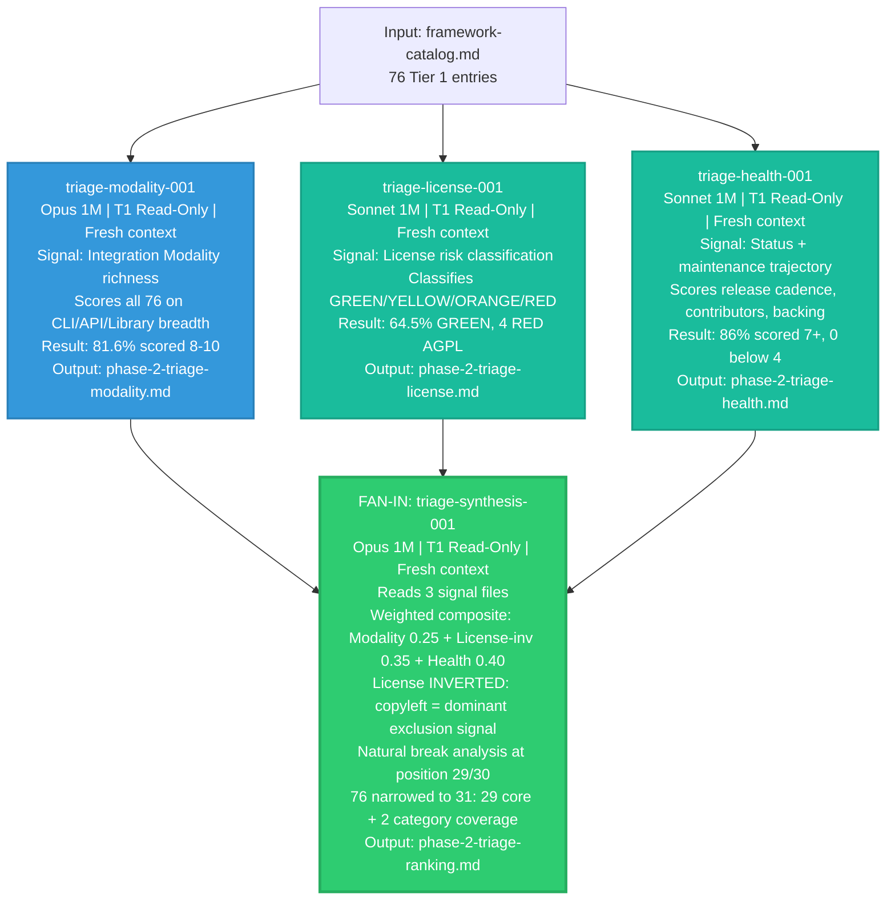
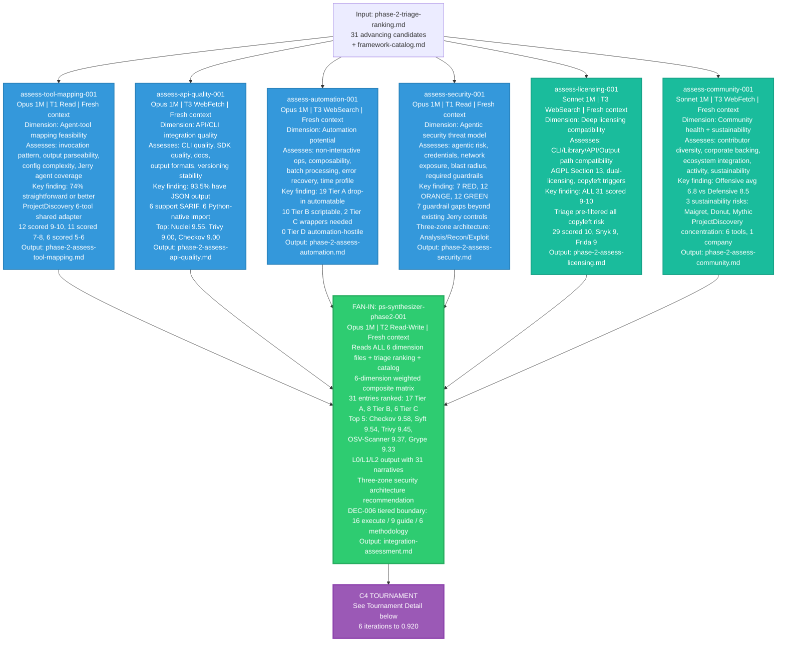
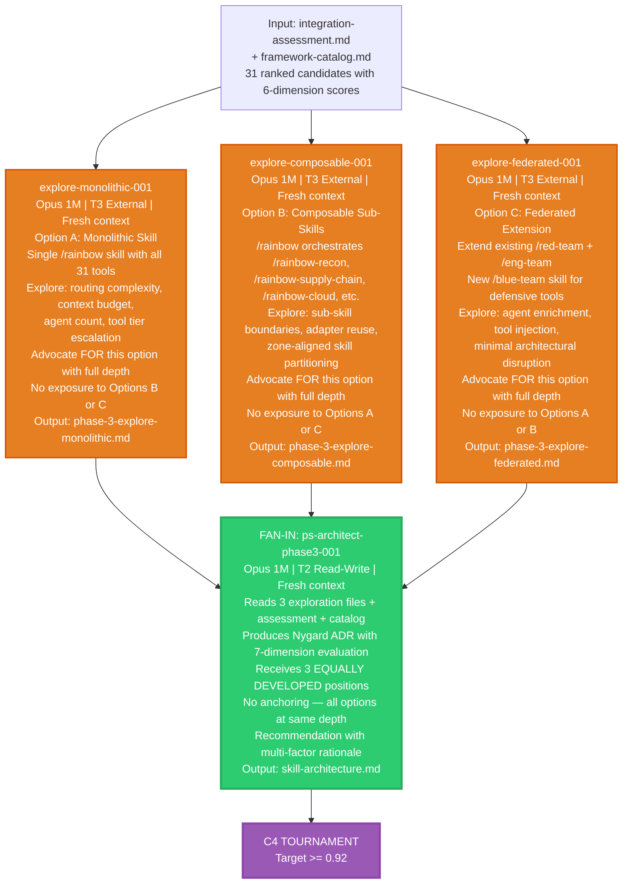
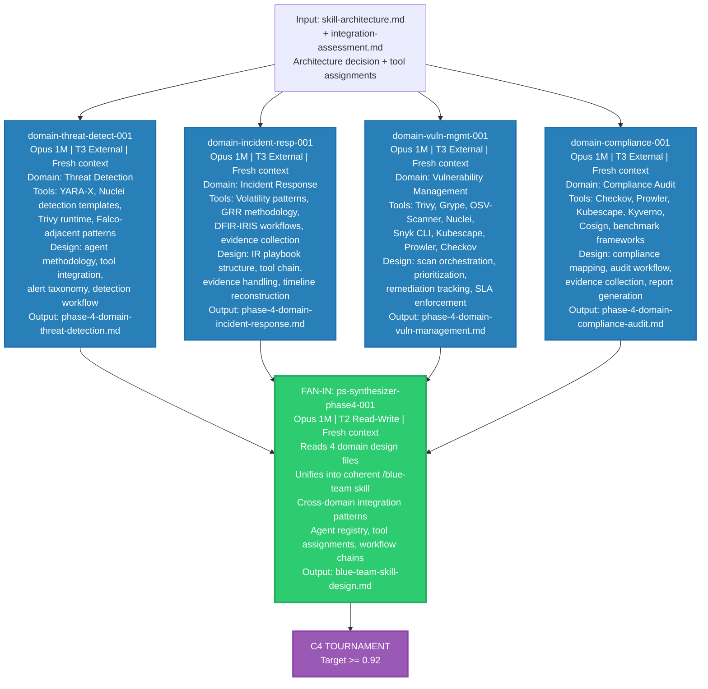
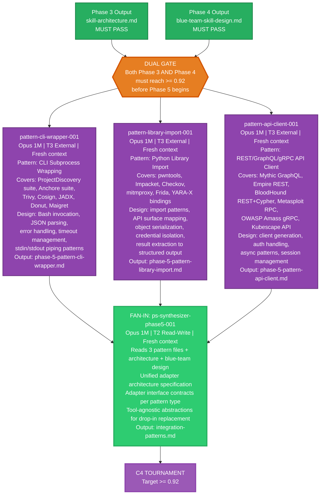
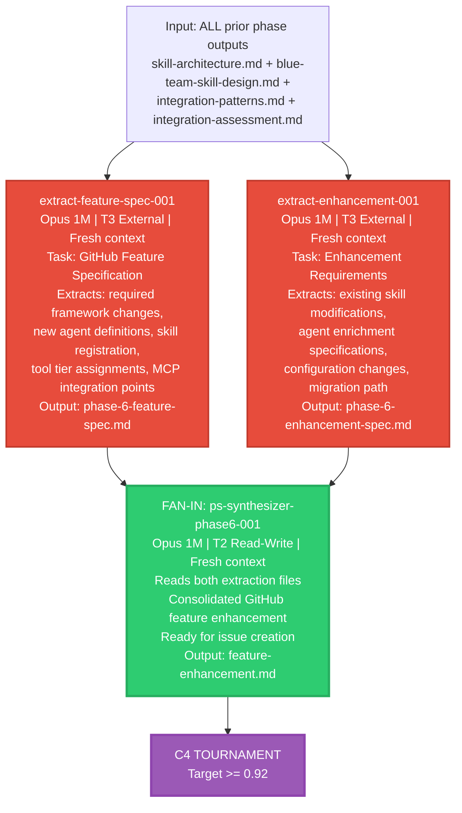
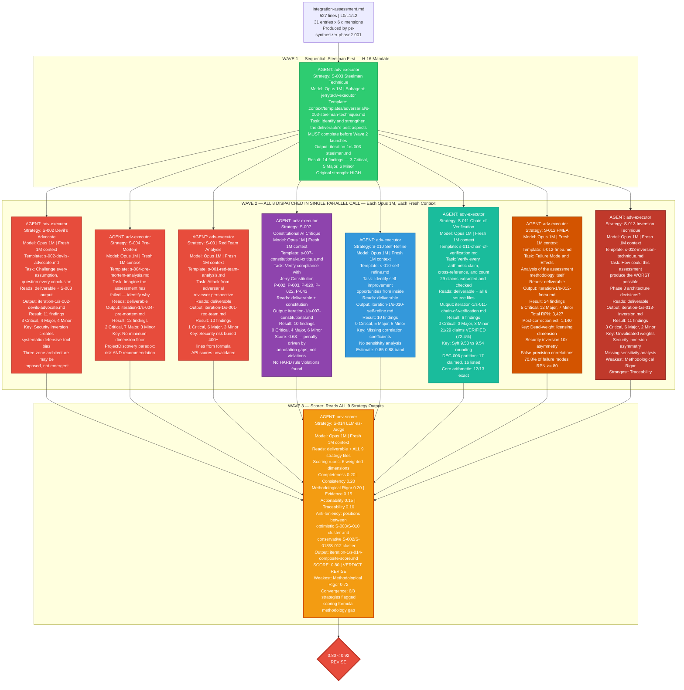

# PROJ-023 Rainbow Series — Decomposed Multi-Agent Design

> The "after" picture. Maximum decomposition with parallel fan-out, fresh context isolation, and C4 adversarial tournaments at every phase boundary.
>
> **Total: 27 creator agents + 5 C4 tournaments (each tournament = 10 agents per iteration)**
>
> Every node below represents a **separate background agent invocation** with its own **fresh 1M context window**. No agent shares context with any other agent. The orchestrator (main context) dispatches agents and updates ORCHESTRATION.yaml — it never writes deliverable content.

---

## 1. Master Pipeline — All 7 Phases

```mermaid
flowchart TD
    START(["PROJ-023 Rainbow Series\nDecomposed v3.0\n27 creators + 5 C4 tournaments\nAll Opus/Sonnet 1M"])

    START --> P0["Phase 0\n1 agent\nCOMPLETE"]
    P0 --> G01{{"Gate 0-1\nPASS"}}

    G01 --> P1["Phase 1\n15 + 1 + C4\nCOMPLETE 0.918"]:::complete
    P1 --> G12{{"Gate 1-2\nACCEPT BEST\n0.918"}}

    G12 --> P2["Phase 2\n3 + 1 + 6 + 1 + C4\nCOMPLETE 0.920"]:::complete
    P2 --> G23{{"Gate 2-3\nPASS\n0.920"}}

    G23 --> P3["Phase 3\n3 + 1 + C4\nPENDING"]:::pending
    P3 --> G34{{"Gate 3-4"}}

    G34 --> P4["Phase 4\n4 + 1 + C4\nPENDING"]:::pending
    P4 --> G45{{"Gate 4-5"}}

    G34 & G45 --> DUAL{{"DUAL GATE\nP3 + P4 must\nboth PASS"}}:::dualgate
    DUAL --> P5["Phase 5\n3 + 1 + C4\nBLOCKED"]:::blocked

    P5 --> G56{{"Gate 5-6"}}
    G56 --> P6["Phase 6\n2 + 1 + C4\nBLOCKED"]:::blocked

    P6 --> DONE(["COMPLETE\n27 creators\n5 tournaments\n~150 agent invocations"])

    classDef complete fill:#27ae60,color:#fff,stroke:#1e8449,stroke-width:3px
    classDef pending fill:#f39c12,color:#fff,stroke:#d35400,stroke-width:2px
    classDef blocked fill:#95a5a6,color:#fff,stroke:#7f8c8d,stroke-width:2px
    classDef dualgate fill:#e67e22,color:#fff,stroke:#d35400,stroke-width:3px
```

---

## 2. Phase 1 — Framework Catalog: 15-Agent Fan-Out

> **Pattern:** Fan-Out / Fan-In (Pattern 3)
> **Agents:** 15 parallel category researchers + 1 synthesizer + C4 tournament
> **Key metric:** CV non-pass rate reduced from 62% (single-agent) to 3.1% (decomposed)
> **Each agent gets a FRESH 1M context window — zero cross-category contamination**

```mermaid
flowchart TD
    INPUT["Input: Orchestration Prompt\n7-phase pipeline spec"]

    INPUT --> C01 & C02 & C03 & C04 & C05 & C06 & C07 & C08 & C09 & C10 & C11 & C12 & C13 & C14 & C15

    C01["ps-researcher\nCat-01: Exploitation\nOpus 1M | Fresh context\n11 frameworks\nMetasploit, pwntools,\nBeEF, CALDERA..."]:::agent
    C02["ps-researcher\nCat-02: C2 Frameworks\nOpus 1M | Fresh context\n11 frameworks\nSliver, Mythic, Empire,\nHavoc, PoshC2..."]:::agent
    C03["ps-researcher\nCat-03: Reconnaissance\nOpus 1M | Fresh context\n8 frameworks\nSubfinder, httpx,\nNaabu, Amass..."]:::agent
    C04["ps-researcher\nCat-04: Vuln Scanners\nOpus 1M | Fresh context\n7 frameworks\nNuclei, OpenVAS,\nOSV-Scanner..."]:::agent
    C05["ps-researcher\nCat-05: Payload Delivery\nOpus 1M | Fresh context\n7 frameworks\nDonut, Hooka,\nSGN, Shhhloader..."]:::agent
    C06["ps-researcher\nCat-06: Post-Exploitation\nOpus 1M | Fresh context\n10 frameworks\nBloodHound, Impacket,\nRubeus, PEASS-ng..."]:::agent
    C07["ps-researcher\nCat-07: Forensics\nOpus 1M | Fresh context\n15 frameworks\nVolatility, YARA-X,\nAutopsy, Ghidra..."]:::agent
    C08["ps-researcher\nCat-08: Network Tools\nOpus 1M | Fresh context\n11 frameworks\nWireshark, Scapy,\nBettercap, mitmproxy..."]:::agent
    C09["ps-researcher\nCat-09: Web App Testing\nOpus 1M | Fresh context\n9 frameworks\nZAP, sqlmap,\nDalfox, Katana..."]:::agent
    C10["ps-researcher\nCat-10: Wireless\nOpus 1M | Fresh context\n8 frameworks\nAircrack-ng, Kismet,\nWifite2, Fluxion..."]:::agent
    C11["ps-researcher\nCat-11: Cloud Security\nOpus 1M | Fresh context\n10 frameworks\nProwler, Checkov,\nSteampipe, ScoutSuite..."]:::agent
    C12["ps-researcher\nCat-12: Container Sec\nOpus 1M | Fresh context\n11 frameworks\nTrivy, Kubescape,\nFalco, Grype..."]:::agent
    C13["ps-researcher\nCat-13: Mobile Security\nOpus 1M | Fresh context\n10 frameworks\nFrida, MobSF,\nJADX, Objection..."]:::agent
    C14["ps-researcher\nCat-14: Social Eng\nOpus 1M | Fresh context\n7 frameworks\nGophish, SET,\nEvilginx, Modlishka..."]:::agent
    C15["ps-researcher\nCat-15: OSINT\nOpus 1M | Fresh context\n9 frameworks\ntheHarvester, Sherlock,\nMaigret, SpiderFoot..."]:::agent

    C01 & C02 & C03 & C04 & C05 & C06 & C07 & C08 & C09 & C10 & C11 & C12 & C13 & C14 & C15 --> SYN

    SYN["FAN-IN: ps-synthesizer\nOpus 1M | Fresh context\nMerge 15 category catalogs\nDeduplicate cross-category entries\nNormalize vocabulary across all 139\nDetect inter-category gaps\nOutput: framework-catalog.md"]:::synthesis

    SYN --> TOURN["C4 TOURNAMENT\nSee Tournament Detail below\n8 iterations to 0.918"]:::tournament

    classDef agent fill:#3498db,color:#fff,stroke:#2980b9,stroke-width:2px
    classDef synthesis fill:#2ecc71,color:#fff,stroke:#27ae60,stroke-width:3px
    classDef tournament fill:#9b59b6,color:#fff,stroke:#8e44ad,stroke-width:3px
```

---

## 3. Phase 2 — Integration Assessment: 4-Stage Pipeline with 11 Agents

> **Pattern:** Signal-Parallel Triage → Fan-Out Assessment → Fan-In Synthesis → C4 Tournament
> **Agents:** 3 triage signals + 1 triage synthesis + 6 dimension assessments + 1 synthesis + C4
> **Key metric:** 76 Tier 1 entries narrowed to 31 candidates, scored on 6 dimensions
> **Score trajectory:** 0.80 → 0.85 → 0.89 → 0.89 → 0.913 → 0.920

### Stage 1A: Triage Signal Fan-Out (3 parallel agents)

### Stage 2: Dimension Assessment Fan-Out (6 parallel agents)

---

## 4. Phase 3 — Skill Architecture: Divergent-Convergent (4 agents)

> **Pattern:** 3 parallel exploration agents explore competing architecture options independently, then 1 synthesis agent produces a Nygard ADR from the 3 equally-developed positions.
> **Anti-anchoring:** Each option gets a full 1M context with no exposure to competing options.

---

## 5. Phase 4 — Blue Team Design: Domain-Parallel (5 agents)

> **Pattern:** 4 parallel domain agents each design one capability domain in isolation, then 1 synthesis agent unifies the 4 domain designs into a coherent blue-team skill.

---

## 6. Phase 5 — Integration Patterns: Pattern-Parallel with DUAL Gate (4 agents)

> **Pattern:** 3 parallel pattern agents each explore one integration approach, then 1 synthesis agent produces a unified adapter architecture.
> **DUAL GATE:** Phase 5 is blocked until BOTH Phase 3 AND Phase 4 pass their quality gates. This is the only phase with a two-input dependency.

---

## 7. Phase 6 — Feature Enhancement: Extract-Parallel (3 agents)

> **Pattern:** 2 parallel extraction agents process different aspects, then 1 synthesis agent consolidates into the final GitHub feature specification.

---

## 8. C4 Tournament Detail — The Quality Gate Engine

> **Every single node below is a REAL background agent that was actually dispatched during Phase 2 execution.**
> Every agent gets its own **fresh 1M context window**. No agent shares context with any other agent.
> The scorer has never seen the creator's reasoning. The revision agent has never seen the prior revision's reasoning.
> Each strategy agent loads its own strategy template from `.context/templates/adversarial/`.
>
> **Phase 2 tournament total: 21 background agent invocations across 6 iterations.**
> **Phase 2 complete pipeline total (Stages 1-4): 32 background agent invocations.**

### Iteration 1: Full 3-Wave Tournament (10 agents)

> The first iteration runs all 3 waves. The orchestrator dispatches Wave 1, waits for completion, then dispatches all 8 Wave 2 agents in a SINGLE parallel dispatch, waits for all 8, then dispatches Wave 3.

### Iterations 2-6: Revision-Score Cycles (11 agents)

> After Iteration 1 establishes the finding baseline, subsequent iterations run: 1 revision agent + 1 scorer agent per cycle. The revision agent reads the prior scorer's findings and applies targeted corrections. The scorer re-evaluates the updated deliverable.

```mermaid
flowchart TD
    I1_SCORE["I1 Score: 0.80 REVISE\nWeakest: Meth. Rigor 0.72\n13 Critical findings across 8 strategies\nTop convergence: weight validation gap"]:::revise

    I1_SCORE --> R1

    R1["AGENT: I2 Revision Agent\nModel: Opus 1M | Fresh 1M context\nReads: I1 s-014-composite-score.md + all 9 findings\nApplies 10 targeted corrections:\n1. Remove ALL false-precision r-values\n2. Add Weight Sensitivity Analysis\n   3 scenarios: Equal, Security-Elevated, Technical-Only\n3. Fix DEC-006 partition 17 to 16+9+6=31\n4. Add constitutional principle citations\n5. Add security inversion transparency\n6. Add top-5 confidence note\n7. ProjectDiscovery concentration mitigation\n8. Syft rounding 9.53 to 9.54\n9. Enhanced consumption caveats\n10. Rewrite P-043 disclaimer\nSelf-review: H-15 verification\nOrchestrator: Grep verification of r-values=0"]:::revision

    R1 --> I2_SCORE

    I2_SCORE["AGENT: I2 Scorer — adv-scorer\nModel: Opus 1M | Fresh 1M context\nReads: REVISED deliverable + I1 score for delta\nOutput: iteration-2/s-014-composite-score.md\nSCORE: 0.85 | VERDICT: REVISE | +0.05\nMeth. Rigor: 0.72 to 0.82 — largest gain\nResidual: 4 mechanical inconsistencies\nUnaddressed: narratives 16-31, acceptance criteria"]:::scorer

    I2_SCORE --> R2

    R2["AGENT: I3 Revision Agent\nModel: Opus 1M | Fresh 1M context\nReads: I2 s-014-composite-score.md\nApplies corrections:\n1. Fix 4 mechanical inconsistencies\n   Syft heading, R-01 range, FMEA count, pip to uv\n2. Add 16 abbreviated narratives for entries 16-31\n3. Add acceptance criteria to document header\n4. Add Tier Boundary Note as design choice\n5. Add licensing dead-weight acknowledgment\n6. Update source paths to repo-relative\n7. Add L0 uncertainty qualifier\n8. Replace causal reveals language\nSelf-review: H-15 — 0 matches for pip, r~, 17-exec"]:::revision

    R2 --> I3_SCORE

    I3_SCORE["AGENT: I3 Scorer — adv-scorer\nModel: Opus 1M | Fresh 1M context\nSCORE: 0.89 | VERDICT: REVISE | +0.04\nCompleteness: 0.90 — narratives helped\nActionability: 0.92 — first dimension to pass\nResidual: FMEA SxOxD missing, one 17-exec leftover"]:::scorer

    I3_SCORE --> R3

    R3["AGENT: I4 Revision Agent\nModel: Opus 1M | Fresh 1M context\nReads: I3 s-014-composite-score.md\nApplies 6 priority corrections:\n1. Fix last FMEA 17 to 16 in FM-02r section\n2. Add FMEA SxOxD: FM-01r 8x3x4=96,\n   FM-02r 6x3x4=72, FM-13r 3x3x5=45\n3. Add 31-row offensive/defensive classification table\n4. Add minimum dimension floor analysis\n5. Strengthen API testing caveat\n6. Verify navigation cross-references\nSelf-review: H-15 passed\nDEFECT: Left 118 lines of working notes in deliverable"]:::revision_defect

    R3 --> I4_SCORE

    I4_SCORE["AGENT: I4 Scorer — adv-scorer\nModel: Opus 1M | Fresh 1M context\nSCORE: 0.89 | VERDICT: REVISE | +0.00 PLATEAU\nAgent contamination discovered:\n118 lines of stream-of-consciousness working notes\nLines 409-526 contain Let me try, Hmm, OK I think\n14% of document is agent reasoning debris\nGenuine improvements offset by contamination drag"]:::plateau

    I4_SCORE --> R4

    R4["AGENT: I5 Revision Agent\nModel: Opus 1M | Fresh 1M context\nReads: I4 s-014-composite-score.md\nPrimary task: REMOVE 118 LINES OF CONTAMINATION\n1. Delete lines 409-526 working notes\n2. Correct sub-dimension averages to match 12/15/4\n3. Add architecture options trade-off table\n4. Add Phase 3 MVP effort estimates table\nDocument: 839 lines reduced to 743 lines\nSelf-review: H-15 — 0 matches for working note indicators"]:::revision

    R4 --> I5_SCORE

    I5_SCORE["AGENT: I5 Scorer — adv-scorer\nModel: Opus 1M | Fresh 1M context\nSCORE: 0.913 | VERDICT: REVISE | +0.024\nPlateau broken by contamination removal\nAll 4 affected dimensions improved\n2 pre-existing issues discovered:\nL0 zone counts 13/7 vs actual 9/11/12\nTool mapping average 7.4 vs actual 7.1\nGap to threshold: 0.007"]:::scorer

    I5_SCORE --> R5

    R5["AGENT: I6 Revision Agent\nModel: Opus 1M | Fresh 1M context\nReads: I5 s-014-composite-score.md\n3 editorial fixes:\n1. L0 zone counts: 13 GREEN / 7 RED\n   changed to 20 Zone1+2 / 12 Zone3\n   matching R-02 table exactly\n2. Tool mapping: 7.4 changed to 7.1 (107/15)\n3. Add security inversion proportionality note:\n   10x asymmetry maps to actual 10x\n   guardrail cost differential\nSelf-review: H-15 — all 10 verification checks pass"]:::revision

    R5 --> I6_SCORE

    I6_SCORE["AGENT: I6 Scorer — adv-scorer\nModel: Opus 1M | Fresh 1M context\nSCORE: 0.920 | VERDICT: PASS\nCompleteness: 0.92\nInternal Consistency: 0.92\nMethodological Rigor: 0.92\nEvidence Quality: 0.91\nActionability: 0.92\nTraceability: 0.92\nExact sum: 0.9185 rounds to 0.92\nAll 3 I6 fixes verified"]:::pass

    classDef revise fill:#e74c3c,color:#fff,stroke:#c0392b,stroke-width:2px
    classDef plateau fill:#922b21,color:#fff,stroke:#641e16,stroke-width:3px
    classDef revision fill:#3498db,color:#fff,stroke:#2980b9,stroke-width:2px
    classDef revision_defect fill:#e67e22,color:#fff,stroke:#d35400,stroke-width:3px
    classDef scorer fill:#f39c12,color:#fff,stroke:#d35400,stroke-width:2px
    classDef pass fill:#27ae60,color:#fff,stroke:#1e8449,stroke-width:4px
```

### Complete Phase 2 Agent Invocation Log

> Every single background agent invocation for the entire Phase 2 pipeline, in chronological order.

| # | Agent | Model | Type | Input | Output | Key Result |
|---|-------|-------|------|-------|--------|-----------|
| 1 | triage-modality-001 | Opus 1M | Creator | framework-catalog.md (76 entries) | phase-2-triage-modality.md | 81.6% scored 8-10 |
| 2 | triage-license-001 | Sonnet 1M | Creator | framework-catalog.md (76 entries) | phase-2-triage-license.md | 64.5% GREEN, 4 RED |
| 3 | triage-health-001 | Sonnet 1M | Creator | framework-catalog.md (76 entries) | phase-2-triage-health.md | 86% scored 7+, 0 below 4 |
| 4 | triage-synthesis-001 | Opus 1M | Synthesizer | 3 triage signal files | phase-2-triage-ranking.md | 76 narrowed to 31 |
| 5 | assess-tool-mapping-001 | Opus 1M | Creator | ranking + catalog (31 entries) | phase-2-assess-tool-mapping.md | 74% straightforward+ |
| 6 | assess-api-quality-001 | Opus 1M | Creator | ranking + catalog (31 entries) | phase-2-assess-api-quality.md | 93.5% JSON, 6 SARIF |
| 7 | assess-automation-001 | Opus 1M | Creator | ranking + catalog (31 entries) | phase-2-assess-automation.md | 19 Tier A, 0 Tier D |
| 8 | assess-security-001 | Opus 1M | Creator | ranking + catalog (31 entries) | phase-2-assess-security.md | 7 RED, 12 ORANGE, 12 GREEN |
| 9 | assess-licensing-001 | Sonnet 1M | Creator | ranking + catalog + license signal | phase-2-assess-licensing.md | All 31 scored 9-10 |
| 10 | assess-community-001 | Sonnet 1M | Creator | ranking + catalog + health signal | phase-2-assess-community.md | Offensive 6.8 vs Defensive 8.5 |
| 11 | ps-synthesizer-phase2-001 | Opus 1M | Synthesizer | 6 assessment files + ranking + catalog | integration-assessment.md (527 lines) | 17 Tier A, 8 Tier B, 6 Tier C |
| 12 | I1 W1: S-003 Steelman | Opus 1M | Tournament | integration-assessment.md | iteration-1/s-003-steelman.md | 14 findings (3C, 5M, 6m) |
| 13 | I1 W2: S-002 Devil's Advocate | Opus 1M | Tournament | deliverable + S-003 output | iteration-1/s-002-devils-advocate.md | 11 findings (3C, 4M, 4m) |
| 14 | I1 W2: S-004 Pre-Mortem | Opus 1M | Tournament | deliverable | iteration-1/s-004-pre-mortem.md | 12 findings (2C, 7M, 3m) |
| 15 | I1 W2: S-001 Red Team | Opus 1M | Tournament | deliverable | iteration-1/s-001-red-team.md | 10 findings (1C, 6M, 3m) |
| 16 | I1 W2: S-007 Constitutional | Opus 1M | Tournament | deliverable + constitution | iteration-1/s-007-constitutional.md | 10 findings (0C, 4M, 6m) |
| 17 | I1 W2: S-010 Self-Refine | Opus 1M | Tournament | deliverable | iteration-1/s-010-self-refine.md | 10 findings (0C, 5M, 5m) |
| 18 | I1 W2: S-011 Chain-of-Verify | Opus 1M | Tournament | deliverable + 6 source files | iteration-1/s-011-chain-of-verification.md | 6 findings (0C, 3M, 3m), 21/29 verified |
| 19 | I1 W2: S-012 FMEA | Opus 1M | Tournament | deliverable | iteration-1/s-012-fmea.md | 24 findings (5C, 12M, 7m), RPN 3,427 |
| 20 | I1 W2: S-013 Inversion | Opus 1M | Tournament | deliverable | iteration-1/s-013-inversion.md | 11 findings (3C, 6M, 2m) |
| 21 | I1 W3: S-014 Scorer | Opus 1M | Scorer | deliverable + all 9 findings | iteration-1/s-014-composite-score.md | **0.80 REVISE** |
| 22 | I2 Revision Agent | Opus 1M | Revision | I1 score + all findings | integration-assessment.md (edited) | 10 corrections applied |
| 23 | I2 S-014 Scorer | Opus 1M | Scorer | revised deliverable | iteration-2/s-014-composite-score.md | **0.85 REVISE** (+0.05) |
| 24 | I3 Revision Agent | Opus 1M | Revision | I2 score | integration-assessment.md (edited) | 16 narratives + 4 fixes |
| 25 | I3 S-014 Scorer | Opus 1M | Scorer | revised deliverable | iteration-3/s-014-composite-score.md | **0.89 REVISE** (+0.04) |
| 26 | I4 Revision Agent | Opus 1M | Revision | I3 score | integration-assessment.md (edited) | 6 priorities — LEFT CONTAMINATION |
| 27 | I4 S-014 Scorer | Opus 1M | Scorer | revised deliverable | iteration-4/s-014-composite-score.md | **0.89 PLATEAU** (+0.00) |
| 28 | I5 Revision Agent | Opus 1M | Revision | I4 score | integration-assessment.md (edited) | Removed 118 lines contamination |
| 29 | I5 S-014 Scorer | Opus 1M | Scorer | revised deliverable | iteration-5/s-014-composite-score.md | **0.913 REVISE** (+0.024) |
| 30 | I6 Revision Agent | Opus 1M | Revision | I5 score | integration-assessment.md (edited) | 3 editorial fixes |
| 31 | I6 S-014 Scorer | Opus 1M | Scorer | revised deliverable | iteration-6/s-014-composite-score.md | **0.920 PASS** (+0.007) |

**Phase 2 total: 31 background agent invocations.**
- Stages 1-3 (creation): 11 agents (3 triage + 1 synthesis + 6 assessment + 1 synthesis)
- Stage 4 (tournament): 20 agents (10 in I1 full wave + 5 revision + 5 scorer)

### Strategy Finding Convergence Heatmap

> Shows which strategies independently flagged the same issues. Higher convergence = higher confidence the finding is real.

| Finding Theme | S-003 | S-002 | S-004 | S-001 | S-007 | S-010 | S-011 | S-012 | S-013 | Count |
|--------------|-------|-------|-------|-------|-------|-------|-------|-------|-------|-------|
| **Scoring formula unvalidated weights** | - | X | X | X | - | X | - | X | X | **6/8** |
| **Security inversion 10x asymmetry** | X | X | X | X | - | - | - | X | X | **5/8** |
| **ProjectDiscovery concentration paradox** | - | X | X | X | - | - | - | X | - | **4/8** |
| **Correlation false precision (r-values)** | X | X | - | - | - | X | - | X | - | **4/8** |
| **DEC-006 classification gaps** | X | X | - | - | - | X | X | - | - | **3/8** (+ S-011 verified) |
| **FMEA SxOxD decomposition missing** | - | - | - | - | - | X | - | X | X | **3/8** |
| **Constitutional annotation gaps** | - | - | - | - | X | - | - | - | - | **1/8** (S-007 specialist) |
| **Arithmetic errors (Syft 9.53)** | - | - | - | - | - | - | X | - | - | **1/8** (S-011 specialist) |

---

## 9. Agent Count Summary

| Phase | Fan-Out Agents | Synthesis | Tournament Iterations | Total Agent Invocations |
|-------|---------------|-----------|----------------------|------------------------|
| **Phase 0** | 1 (orch-planner) | - | C4 | ~12 |
| **Phase 1** | 15 category researchers | 1 ps-synthesizer | 8 iterations x 10 agents | ~96 |
| **Phase 2** | 3 triage + 6 dimension = 9 | 2 (triage + final) | 6 iterations x (1 revision + 1 scorer) = 12 | ~23 |
| **Phase 3** | 3 exploration agents | 1 ps-architect | C4 (est. 4-6 iterations) | ~15-20 |
| **Phase 4** | 4 domain agents | 1 ps-synthesizer | C4 (est. 4-6 iterations) | ~16-22 |
| **Phase 5** | 3 pattern agents | 1 ps-synthesizer | C4 (est. 4-6 iterations) | ~15-20 |
| **Phase 6** | 2 extraction agents | 1 ps-synthesizer | C4 (est. 4-6 iterations) | ~14-18 |
| **TOTAL** | **41 fan-out** | **7 synthesis** | **5 full tournaments** | **~190-210 agent invocations** |

---

## 10. Side-by-Side Comparison

| Metric | Original Design | Decomposed Design | Delta |
|--------|----------------|-------------------|-------|
| **Creator agents (P1-P6)** | ~9 | 27 | **3x** |
| **Total agent invocations** | ~9 | ~190-210 | **~22x** |
| **Max parallel agents in single dispatch** | 1 | 15 (Phase 1) | **15x parallelism** |
| **Context window per agent** | 200K shared | 1M isolated | **5x, zero sharing** |
| **Cross-work-item contamination** | Guaranteed | Impossible | **Structural fix** |
| **Anchoring bias** | Present every phase | Eliminated by isolation | **Structural fix** |
| **Phase 1 CV non-pass rate** | 62% (measured) | 3.1% (measured) | **20x improvement** |
| **Phase 1 FMEA RPN** | 2,482 | 467 | **5.3x reduction** |
| **Phase 1 score** | N/A (no tournament) | 0.918 (8 iterations) | Tracked convergence |
| **Phase 2 score** | N/A (no tournament) | 0.920 (6 iterations) | Tracked convergence |
| **Quality enforcement** | Post-hoc single review | C4 tournament: 9 strategies per iteration | **Embedded adversarial quality** |
| **Revision pattern** | LLM edits in shared context | Agent READ + Orchestrator WRITE + Grep verify | **Deterministic, zero regression** |
| **Error amplification** | ~17x (uncoordinated) | ~1.3x (structured handoffs) | **13x reduction** |
| **Model utilization** | Single model, single context | Opus 1M creators, Sonnet 1M support | **Right-sized per cognitive demand** |
| **Recovery from agent defect** | Restart entire phase | Replace single agent; others unaffected | **Fault isolation** |

---

## 11. Design Patterns Catalog

| # | Pattern | Where Applied | What It Does | Why It Matters |
|---|---------|--------------|-------------|---------------|
| 1 | **Fan-Out / Fan-In** | P1 (15), P2-S1A (3), P2-S2 (6), P3 (3), P4 (4), P5 (3), P6 (2) | N agents work in parallel on independent slices; 1 synthesizer merges results | Eliminates context contamination; enables parallelism; each agent gets focused scope |
| 2 | **Signal-Parallel Triage** | P2 Stage 1 | Multiple independent signals scored separately, then combined with weights | Prevents single-signal dominance; makes exclusion criteria transparent |
| 3 | **Divergent-Convergent** | P3 | N agents each advocate FOR a competing option; 1 agent synthesizes with no anchoring | Prevents first-option bias; each option gets equal depth |
| 4 | **Domain-Parallel** | P4 | N agents each design one domain in isolation; 1 agent unifies | Each domain gets full context budget; no cross-domain shortcuts |
| 5 | **Pattern-Parallel** | P5 | N agents each explore one integration pattern; 1 agent synthesizes | Each pattern gets independent investigation |
| 6 | **Extract-Parallel** | P6 | N agents each extract different aspects from the same inputs | Parallel extraction faster than sequential |
| 7 | **Dual Quality Gate** | P5 entry | Phase blocked until 2+ predecessor phases both pass | Prevents premature integration of unvalidated architecture |
| 8 | **3-Wave C4 Tournament** | Every phase boundary | W1: Steelman (H-16), W2: 8 parallel strategies, W3: Scorer | Adversarial quality with fresh-context reviewers |
| 9 | **Agent READ / Orchestrator WRITE** | Tournament revisions | Agents produce corrections tables; orchestrator applies + Grep verifies | Zero regression risk from agent edits |
| 10 | **Deterministic Verification** | Before every re-score | Grep-based verification of corrections before launching expensive scorer | Catches mechanical failures before they waste a tournament iteration |
| 11 | **Fresh Context Reviewer** | All C4 strategies + scorers | Each reviewer agent starts with clean context; never sees creator reasoning | Eliminates confirmation bias; independent evaluation |

---

## 12. Lessons Learned

| # | Lesson | Evidence | Implication |
|---|--------|----------|-------------|
| 1 | **Fan-out to isolated agents dramatically improves quality** | Phase 1: 62% CV non-pass (single agent) → 3.1% (15 agents) | Decompose every phase to maximum parallelism |
| 2 | **Triage with weighted signals is a force multiplier** | Phase 2: License-inverted 0.35 weight pre-filtered ALL copyleft, making downstream licensing dimension non-discriminating | Well-designed triage means downstream agents solve harder problems |
| 3 | **C4 tournaments converge but require 4-8 iterations** | Phase 1: 8 iterations (0.567→0.918), Phase 2: 6 iterations (0.80→0.920) | Budget for iteration count; diminishing returns above 0.92 |
| 4 | **Revision agents can introduce defects** | Phase 2 I4: agent left 118 lines of working notes in deliverable, causing score plateau | H-15 self-review is necessary but not sufficient; Grep verification is essential |
| 5 | **Deterministic corrections beat LLM judgment for bulk changes** | Phase 1: `replace_all` for Dual-Use vocabulary (100 entries, 0 regressions) | When the fix is mechanical, don't use an LLM |
| 6 | **The orchestrator must never write deliverable content** | Phase 2: orchestrator did 10 manual edits in main context, wasting ~20-30K tokens | Dispatch a revision agent; orchestrator only dispatches + verifies + records |
| 7 | **Offensive tools structurally underperform defensive tools in integration readiness** | Phase 2: defensive avg 8.55 vs offensive avg 7.10 across all 6 dimensions | Phase 3 MVP should prioritize defensive/cloud tools (Zone 1) before offensive (Zone 3) |
| 8 | **Suite-level adapters maximize integration ROI** | ProjectDiscovery: 6 tools, 1 adapter pattern. Anchore: 2 tools, 1 pipeline | Design adapters per suite, not per tool |
