# PROJ-023 Rainbow Series — Original Single-Agent Design

> The "before" picture. Each phase bottlenecks on a single agent processing everything in one context window.

```mermaid
flowchart TD
    START(["PROJ-023 Rainbow Series\nORIGINAL DESIGN\n~9 agents | 100% sequential | 0 parallelism"])

    START --> P0["Phase 0: Orchestration Plan\n1x orch-planner"]
    P0 --> G0{{"Quality Gate"}}
    G0 --> P1

    P1["Phase 1: Framework Catalog Research\n-----------------------------------------------\n1 SINGLE AGENT in 200K context\n15 security categories x 139 frameworks\nNo category isolation\nCross-category contamination\n-----------------------------------------------\nCV non-pass rate: 62%\nContext exhaustion by category 10"]:::bottleneck

    P1 --> G1{{"Quality Gate"}}
    G1 --> P2

    P2["Phase 2: Deep Integration Assessment\n-----------------------------------------------\n1 SINGLE AGENT in 200K context\n6 dimensions x ~30 candidates = 180 evaluations\nFirst-dimension anchoring biases all subsequent\nNo dimensional isolation\n-----------------------------------------------\nAnchoring bias compounds across dimensions"]:::bottleneck

    P2 --> G2{{"Quality Gate"}}
    G2 --> P3

    P3["Phase 3: Hybrid Skill Architecture\n-----------------------------------------------\n1 SINGLE AGENT evaluates 3 options\nFirst option explored deepest\nOptions B and C get residual context\n-----------------------------------------------\nFirst-option anchoring bias"]:::bottleneck

    P3 --> G3{{"Quality Gate"}}
    G3 --> P4

    P4["Phase 4: Blue Team Skill Design\n-----------------------------------------------\n1 SINGLE AGENT designs 4 capability domains\nThreat Detection + Incident Response +\nVulnerability Mgmt + Compliance Audit\nAll in single context, no domain isolation"]:::bottleneck

    P4 --> G4{{"Quality Gate"}}
    G4 --> P5

    P5["Phase 5: Integration Pattern Design\n-----------------------------------------------\n1 SINGLE AGENT\nAll integration patterns in one pass\nCLI + Library + API patterns conflated"]:::bottleneck

    P5 --> G5{{"Quality Gate"}}
    G5 --> P6

    P6["Phase 6: Feature Enhancement\n2 agents, strictly sequential\nNo parallel extraction"]

    P6 --> RESULT(["RESULT\n-----------------------------------------------\n~9 agents total across 7 phases\nZero parallelism — fully sequential\nZero context isolation between work items\nSingle point of failure per phase\nNo fresh-context reviewer pattern\n-----------------------------------------------\nExpected quality: POOR\nExpected CV non-pass rate: 40-60%\nExpected tournament iterations: 10+ per phase"]):::fail

    classDef bottleneck fill:#e74c3c,color:#fff,stroke:#c0392b,stroke-width:3px
    classDef fail fill:#922b21,color:#fff,stroke:#641e16,stroke-width:4px
```

## Why This Design Fails

| Problem | Impact | Root Cause |
|---------|--------|-----------|
| **Single-agent bottleneck** | Context window exhausted by category 10 of 15; remaining categories get degraded output | One agent cannot hold 139 framework entries across 15 domains in 200K tokens |
| **Cross-category contamination** | Exploitation framework patterns bleed into OSINT assessment; vocabulary conflation | No isolation boundary between unrelated security domains |
| **First-dimension anchoring** | Phase 2: whichever dimension is assessed first biases scores for all subsequent dimensions | Sequential dimension evaluation in single context creates anchoring bias |
| **First-option anchoring** | Phase 3: the first architecture option explored gets disproportionate depth | Single-agent exploration cannot give equal depth to competing options |
| **No parallel execution** | Total wall-clock time = sum of all phases; no speedup from independence | Pipeline is fully sequential with no fan-out |
| **No fresh-context review** | Tournament reviewers share context with creator — confirmation bias | Same context window for creation and critique |
| **62% CV non-pass rate** | Measured baseline from Phase 1 single-agent attempt | All of the above compounding |
