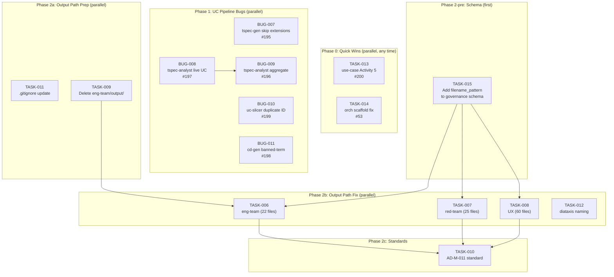

# EPIC-002: Issue Triage Batch — UC Pipeline Bugs, Output Path Remediation, Quick Wins

> **Type:** epic
> **Status:** in_progress
> **Priority:** high
> **Impact:** high
> **Created:** 2026-03-31
> **Parent:** PROJ-024
> **Branch:** `feat/PROJ-024-tactical-work-2`

---

## Document Sections

| Section | Purpose |
|---------|---------|
| [Summary](#summary) | What this batch covers and why |
| [Children Features/Capabilities](#children-featurescapabilities) | Work streams decomposed from this epic |
| [Progress Summary](#progress-summary) | Phase completion status |
| [Work Items](#work-items) | All items with status, project, and dependencies |
| [Dependency Graph](#dependency-graph) | Mermaid execution order diagram |
| [Execution Phases](#execution-phases) | Ordered phases for session planning |
| [Cross-Session Resumption](#cross-session-resumption) | How to pick up work in a new session |
| [Related Issues](#related-issues) | GitHub issue cross-references |

---

## Summary

Coordinate execution of 14 work items identified during 2026-03-31 issue triage across two projects (PROJ-024, PROJ-030). Items fall into three categories:

1. **UC Pipeline Bugs** (5 items) — Defects in tspec-generator, tspec-analyst, uc-slicer, cd-generator
2. **Output Path Remediation** (1 bug + 7 tasks) — `skills/*/output/` hardcoded paths across 13 skills
3. **Quick Wins** (2 items) — Low-effort fixes with immediate value

This Epic is the **cross-session resumption artifact**. Any session on the `feat/PROJ-024-tactical-work-2` branch should read this file first to determine what to work on next.

---

## Children Features/Capabilities

| Work Stream | Items | Project | Description |
|-------------|-------|---------|-------------|
| UC Pipeline Bugs | BUG-007, BUG-008, BUG-009, BUG-010, BUG-011 | PROJ-030 | 5 bugs in tspec-generator, tspec-analyst, uc-slicer, cd-generator |
| Output Path Remediation | BUG-006, TASK-006, TASK-007, TASK-008, TASK-009, TASK-010, TASK-011, TASK-012 | PROJ-030 | 1 bug + 7 tasks remediating hardcoded `skills/*/output/` paths across 13 skills |
| Quick Wins | TASK-013, TASK-014 | PROJ-024 | 2 low-effort tasks with immediate value |

---

## Progress Summary

| Phase | Description | Status |
|-------|-------------|--------|
| Phase 0 | Quick Wins (TASK-013, TASK-014) | completed |
| Phase 1 | UC Pipeline Bugs (BUG-007 through BUG-011) | completed |
| Phase 2 | Output Path Remediation (BUG-006, TASK-006 through TASK-012) | pending |

---

## Work Items

| ID | Type | Title | Status | Project | GH# | Phase | Depends On |
|----|------|-------|--------|---------|-----|-------|------------|
| **UC Pipeline Bugs** | | | | | | | |
| BUG-007 | Bug | tspec-generator silently skips unrecognized extensions | completed | PROJ-030 | #195 | 1 | — |
| BUG-008 | Bug | tspec-analyst uses live UC as coverage denominator | completed | PROJ-030 | #197 | 1 | — |
| BUG-009 | Bug | tspec-analyst has no cross-slice aggregate coverage | completed | PROJ-030 | #196 | 1 | BUG-008 |
| BUG-010 | Bug | uc-slicer lacks duplicate slice_id conflict detection | completed | PROJ-030 | #199 | 1 | — |
| BUG-011 | Bug | cd-generator banned-term false positives under 60 chars | completed | PROJ-030 | #198 | 1 | — |
| **Output Path Remediation** | | | | | | | |
| BUG-006 | Bug | Agent output paths hardcoded to skill directories | pending | PROJ-030 | #230 | 2 | — |
| TASK-015 | Task | Add filename_pattern to governance schema | pending | PROJ-030 | — | 2-pre | — |
| TASK-011 | Task | Update .gitignore for skills/*/output/ | pending | PROJ-030 | — | 2a | — |
| TASK-009 | Task | Remove committed eng-team/output/ (28 files) | pending | PROJ-030 | — | 2a | — |
| TASK-006 | Task | eng-team: governance YAML + agent .md + SKILL.md + template (22 files) | pending | PROJ-030 | — | 2b | TASK-015, TASK-009 |
| TASK-007 | Task | red-team: governance YAML + agent .md + SKILL.md + templates (25 files) | pending | PROJ-030 | — | 2b | TASK-015 |
| TASK-008 | Task | UX: governance YAML + agent .md + SKILL.md + templates + rules (60 files) | pending | PROJ-030 | — | 2b | TASK-015 |
| TASK-012 | Task | Fix diataxis naming inconsistencies | pending | PROJ-030 | — | 2b | — |
| TASK-010 | Task | Add AD-M-011 standard to agent-development-standards.md | pending | PROJ-030 | — | 2c | TASK-006, TASK-007, TASK-008 |
| **Quick Wins** | | | | | | | |
| TASK-013 | Task | use-case SKILL.md missing Activity 5 entry | completed | PROJ-024 | #200 | 0 | — |
| TASK-014 | Task | Orchestration scaffold cartesian product dirs | completed | PROJ-024 | #53 | 0 | — |

---

## Dependency Graph



---

## Execution Phases

Sessions should work through phases in order. Items within a phase can be parallelized.

### Phase 0: Quick Wins (any time, ~10 min total)

| Item | Effort | Notes |
|------|--------|-------|
| TASK-013 (#200) | ~5 min | Add Activity 5 entry to use-case SKILL.md Common Workflows |
| TASK-014 (#53) | ~15 min | Fix orchestration scaffold directory creation |

### Phase 1: UC Pipeline Bugs (~1-2 sessions)

All 5 bugs are in agent definition `.md` files and transformation rule files — no Python code changes.

| Item | Effort | Notes |
|------|--------|-------|
| BUG-007 (#195) | Small | Add RULE-OT-04 fallback to clark-transformation-rules.md |
| BUG-008 (#197) | Medium | Add staleness detection to tspec-analyst methodology |
| BUG-009 (#196) | Medium | Add cross-slice aggregation; depends on BUG-008 denominator fix |
| BUG-010 (#199) | Small | Add validation step to uc-slicer 8-step methodology + schema uniqueItems |
| BUG-011 (#198) | Small | Tighten word-boundary spec in cd-generator banned-term check |

### Phase 2: Output Path Remediation (~2-3 sessions)

Per [ADR-EPIC002-001](../../../docs/design/ADR-EPIC002-001-unified-output-path-resolution.md) migration guide:

**2-pre (schema):** TASK-015 — add `filename_pattern` to governance schema. MUST execute first so YAML validation accepts the new field.

**2a (prep):** TASK-011 (.gitignore) and TASK-009 (delete eng-team/output/) — prevent accumulation during remediation.

**2b (fix):** TASK-006 (eng, 22 files), TASK-007 (red, 25 files), TASK-008 (UX, 60 files), TASK-012 (diataxis) — each task now covers governance YAML + agent .md + SKILL.md + templates per ADR Steps 1-4. Can parallelize across sessions.

**2c (standard):** TASK-010 — codify AD-M-011 in agent-development-standards.md after all path fixes validated.

---

## Cross-Session Resumption

**To resume in a new session:**

1. Read this file: `projects/PROJ-024-tactical-work/work/EPIC-002-issue-triage-batch/EPIC-002-issue-triage-batch.md`
2. Check the Work Items table — find the first `pending` item in the lowest incomplete phase
3. Update status to `in_progress` before starting work
4. When complete, update status to `completed` and set the next item to `in_progress`
5. Update PROJ-030 WORKTRACKER.md for bug/task status changes

**Session entry prompt:**

```
Resume work on EPIC-002 (Issue Triage Batch).
Read: projects/PROJ-024-tactical-work/work/EPIC-002-issue-triage-batch/EPIC-002-issue-triage-batch.md
Find the next pending item and execute it.
```

---

## Related Issues

| GitHub Issue | Worktracker Entity | Status |
|---|---|---|
| [#195](https://github.com/geekatron/jerry/issues/195) | BUG-007 (PROJ-030) | completed |
| [#196](https://github.com/geekatron/jerry/issues/196) | BUG-009 (PROJ-030) | completed |
| [#197](https://github.com/geekatron/jerry/issues/197) | BUG-008 (PROJ-030) | completed |
| [#198](https://github.com/geekatron/jerry/issues/198) | BUG-011 (PROJ-030) | completed |
| [#199](https://github.com/geekatron/jerry/issues/199) | BUG-010 (PROJ-030) | completed |
| [#200](https://github.com/geekatron/jerry/issues/200) | TASK-013 (PROJ-024) | completed |
| [#53](https://github.com/geekatron/jerry/issues/53) | TASK-014 (PROJ-024) | completed |
| [#230](https://github.com/geekatron/jerry/issues/230) | BUG-006 (PROJ-030) | pending |
| [#231](https://github.com/geekatron/jerry/issues/231) | Future: deterministic CLI resolver | pending |
