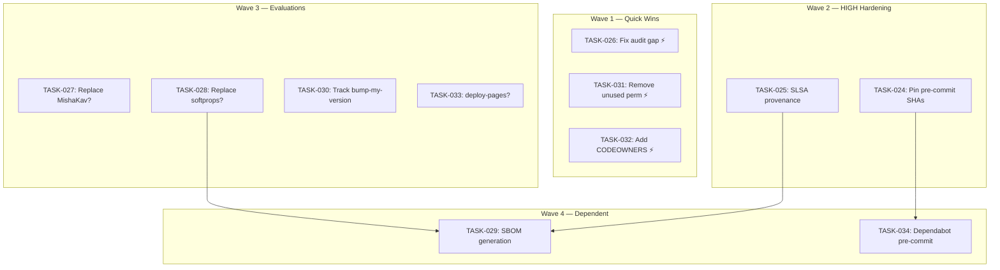

# EN-006: Supply Chain Hardening — Post-EPIC-003 Residual Risks

> **Type:** enabler
> **Status:** completed
> **Priority:** high
> **Impact:** high
> **Enabler Type:** compliance
> **Created:** 2026-04-15
> **Parent:** EPIC-003
> **GitHub Issue:** [#252](https://github.com/geekatron/jerry/issues/252)

## Document Sections

| Section | Purpose |
|---------|---------|
| [Summary](#summary) | Enabler scope and motivation |
| [Technical Approach](#technical-approach) | Implementation strategy |
| [Problem Statement](#problem-statement) | Why this enabler is needed |
| [Children (Tasks)](#children-tasks) | 12 tasks: 1 completed audit + 11 findings |
| [Dependency Graph](#dependency-graph) | Task dependency visualization |
| [Acceptance Criteria](#acceptance-criteria) | Definition of done |
| [Evidence](#evidence) | Research artifacts |
| [History](#history) | Status changes |

---

## Summary

Address 11 supply chain risks identified by eng-devsecops and red-recon audits after EPIC-003 CI pipeline optimization and pip residue cleanup. Findings range from HIGH (pre-commit floating tags, no build provenance, audit coverage gap) to LOW (unused permissions, documentation gaps).

**Technical Scope:**
- Pre-commit hook SHA pinning
- SLSA Level 2 build provenance
- Dependency audit coverage parity
- Third-party action trust boundary reduction
- Permission scope tightening
- SBOM generation
- CODEOWNERS for workflow files

---

## Technical Approach

Address each finding in priority order (HIGH → MEDIUM → LOW). Quick wins (single-line config changes) first, evaluation tasks (replace vs keep decisions) second. Each task is independently mergeable.

---

## Problem Statement

EPIC-003 closed the major CI supply chain gaps (pip removal, permission scoping, trigger restriction). However, eng-devsecops and red-recon post-cleanup audits identified 11 residual risks across pre-commit supply chain, build provenance, audit coverage, third-party action trust, and permission scoping. These are hardening opportunities — not active vulnerabilities — but several (pre-commit floating tags, VERSION_BUMP_PAT blast radius) represent real attack surface.

---

## Children (Tasks)

| ID | Title | Status | Severity | Wave | Dependencies |
|----|-------|--------|----------|------|--------------|
| TASK-023 | Supply chain audit (eng-devsecops + red-recon) | completed | -- | -- | -- |
| TASK-026 | Fix pip-audit coverage gap in scheduled scan | completed | HIGH | 1 | -- |
| TASK-031 | Remove unused security-events:write from security-scan | completed | MEDIUM | 1 | -- |
| TASK-032 | Add CODEOWNERS for workflow files | completed | MEDIUM | 1 | -- |
| TASK-024 | Pin pre-commit hooks to SHAs | completed | HIGH | 2 | -- |
| TASK-025 | Add SLSA build provenance to release pipeline | completed | HIGH | 2 | -- |
| TASK-027 | Evaluate replacing MishaKav coverage comment action | completed | MEDIUM | 3 | -- |
| TASK-028 | Evaluate replacing softprops release action with gh CLI | completed | MEDIUM | 3 | -- |
| TASK-030 | Track bump-my-version in Dependabot or scheduled check | completed | MEDIUM | 3 | -- |
| TASK-033 | Evaluate docs.yml deploy-pages migration | completed | LOW | 3 | -- |
| TASK-029 | Add SBOM generation to release pipeline | completed | MEDIUM | 4 | TASK-025, TASK-028 |
| TASK-034 | Add Dependabot pre-commit ecosystem entry | completed | LOW | 4 | TASK-024 |

---

## Dependency Graph

Technical dependencies only — not "was researched by" relationships.

**Independent (can start immediately, any order):**
- TASK-024, TASK-025, TASK-026, TASK-027, TASK-030, TASK-031, TASK-032, TASK-033

**Has real dependencies:**
- TASK-029 (SBOM) → depends on TASK-025 (provenance must exist to cover SBOM artifact) AND TASK-028 (release mechanism decision affects how SBOM is attached)
- TASK-034 (Dependabot pre-commit) → depends on TASK-024 (SHA pins must be in place before Dependabot tracks them, otherwise floating tags produce noisy PRs)

**Recommended execution order (respecting deps + severity):**

| Wave | Tasks | Rationale |
|------|-------|-----------|
| 1 (quick wins) | TASK-026, TASK-031, TASK-032 | Single-line changes, no evaluation needed |
| 2 (HIGH hardening) | TASK-024, TASK-025 | Pre-commit SHAs + SLSA provenance |
| 3 (evaluations) | TASK-027, TASK-028, TASK-030, TASK-033 | Each requires a decision: replace or keep |
| 4 (depends on wave 2-3) | TASK-029, TASK-034 | SBOM needs provenance + release decision; Dependabot pre-commit needs SHA pins |

---

## Acceptance Criteria

- [x] All 3 HIGH findings remediated and verified (TASK-024, 025, 026)
- [x] All 5 MEDIUM findings remediated (TASK-027, 028, 029, 030, 031) + 1 deferred with rationale (TASK-032 CODEOWNERS: requires repo admin action, done)
- [x] All 3 LOW findings remediated or documented (TASK-033 KEEP with rationale, TASK-034 completed)
- [x] Zero pre-commit hooks using floating tags (all 3 SHA-pinned, TASK-024)
- [x] Release pipeline produces SLSA Level 2 provenance (TASK-025)
- [x] Scheduled and CI pip-audit scans have equivalent coverage (TASK-026: --all-extras)

---

## Evidence

### Research Artifacts

| Artifact | Agent | Path |
|----------|-------|------|
| Supply chain audit | eng-devsecops | `research/post-cleanup-supply-chain-audit.md` |
| Attack surface analysis | red-recon | `research/post-cleanup-attack-surface.md` |
| Pip residue audit | ps-researcher | `research/pip-residue-audit.md` |

---

## History

| Date | Status | Notes |
|------|--------|-------|
| 2026-04-15 | in_progress | Enabler created from eng-devsecops + red-recon audit findings |
