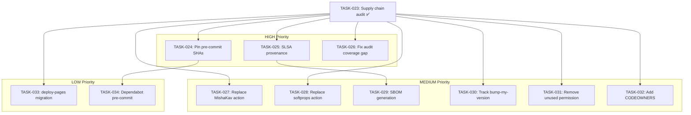

# EN-006: Supply Chain Hardening — Post-EPIC-003 Residual Risks

> **Type:** enabler
> **Status:** in_progress
> **Priority:** high
> **Impact:** high
> **Enabler Type:** compliance
> **Created:** 2026-04-15
> **Parent:** EPIC-003
> **GitHub Issue:** [#252](https://github.com/geekatron/jerry/issues/252)

## Document Sections

| Section | Purpose |
|---------|---------|
| [Summary](#summary) | Enabler scope and motivation |
| [Technical Approach](#technical-approach) | Implementation strategy |
| [Problem Statement](#problem-statement) | Why this enabler is needed |
| [Children (Tasks)](#children-tasks) | 12 tasks: 1 completed audit + 11 findings |
| [Dependency Graph](#dependency-graph) | Task dependency visualization |
| [Acceptance Criteria](#acceptance-criteria) | Definition of done |
| [Evidence](#evidence) | Research artifacts |
| [History](#history) | Status changes |

---

## Summary

Address 11 supply chain risks identified by eng-devsecops and red-recon audits after EPIC-003 CI pipeline optimization and pip residue cleanup. Findings range from HIGH (pre-commit floating tags, no build provenance, audit coverage gap) to LOW (unused permissions, documentation gaps).

**Technical Scope:**
- Pre-commit hook SHA pinning
- SLSA Level 2 build provenance
- Dependency audit coverage parity
- Third-party action trust boundary reduction
- Permission scope tightening
- SBOM generation
- CODEOWNERS for workflow files

---

## Technical Approach

Address each finding in priority order (HIGH → MEDIUM → LOW). Quick wins (single-line config changes) first, evaluation tasks (replace vs keep decisions) second. Each task is independently mergeable.

---

## Problem Statement

EPIC-003 closed the major CI supply chain gaps (pip removal, permission scoping, trigger restriction). However, eng-devsecops and red-recon post-cleanup audits identified 11 residual risks across pre-commit supply chain, build provenance, audit coverage, third-party action trust, and permission scoping. These are hardening opportunities — not active vulnerabilities — but several (pre-commit floating tags, VERSION_BUMP_PAT blast radius) represent real attack surface.

---

## Children (Tasks)

| ID | Title | Status | Severity | Dependencies |
|----|-------|--------|----------|--------------|
| TASK-023 | Supply chain audit (eng-devsecops + red-recon) | completed | -- | -- |
| TASK-024 | Pin pre-commit hooks to SHAs | pending | HIGH | -- |
| TASK-025 | Add SLSA build provenance to release pipeline | pending | HIGH | -- |
| TASK-026 | Fix pip-audit coverage gap in scheduled scan | pending | HIGH | -- |
| TASK-027 | Evaluate replacing MishaKav coverage comment action | pending | MEDIUM | -- |
| TASK-028 | Evaluate replacing softprops release action with gh CLI | pending | MEDIUM | -- |
| TASK-029 | Add SBOM generation to release pipeline | pending | MEDIUM | TASK-025 |
| TASK-030 | Track bump-my-version in Dependabot or scheduled check | pending | MEDIUM | -- |
| TASK-031 | Remove unused security-events:write from security-scan | pending | MEDIUM | -- |
| TASK-032 | Add CODEOWNERS for workflow files | pending | MEDIUM | -- |
| TASK-033 | Evaluate docs.yml deploy-pages migration | pending | LOW | -- |
| TASK-034 | Add Dependabot pre-commit ecosystem entry | pending | LOW | TASK-024 |

---

## Dependency Graph

---

## Acceptance Criteria

- [ ] All 3 HIGH findings remediated and verified
- [ ] All 5 MEDIUM findings either remediated or explicitly deferred with documented rationale
- [ ] All 3 LOW findings either remediated or documented as accepted risk
- [ ] Zero pre-commit hooks using floating tags
- [ ] Release pipeline produces SLSA Level 2 provenance
- [ ] Scheduled and CI pip-audit scans have equivalent coverage

---

## Evidence

### Research Artifacts

| Artifact | Agent | Path |
|----------|-------|------|
| Supply chain audit | eng-devsecops | `research/post-cleanup-supply-chain-audit.md` |
| Attack surface analysis | red-recon | `research/post-cleanup-attack-surface.md` |
| Pip residue audit | ps-researcher | `research/pip-residue-audit.md` |

---

## History

| Date | Status | Notes |
|------|--------|-------|
| 2026-04-15 | in_progress | Enabler created from eng-devsecops + red-recon audit findings |
