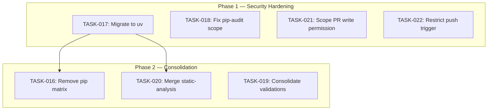

# EPIC-003: CI Pipeline Optimization — Remove Pip Matrix, Fix Supply Chain Gaps, Consolidate Jobs

> **Type:** epic
> **Status:** completed
> **Priority:** high
> **Impact:** high
> **Created:** 2026-04-13
> **Completed:** 2026-08-06
> **Parent:** PROJ-024
> **Branch:** `feat/PROJ-024-tactical-work-3`
> **GitHub Issue:** [#252](https://github.com/geekatron/jerry/issues/252)

## Document Sections

| Section | Purpose |
|---------|---------|
| [Summary](#summary) | Epic scope and motivation |
| [Children Features/Capabilities](#children-featurescapabilities) | Work streams decomposed from this epic |
| [Progress Summary](#progress-summary) | Current status of all work items |
| [Work Items](#work-items) | Task decomposition table |
| [Dependency Graph](#dependency-graph) | Task dependency visualization |
| [Execution Phases](#execution-phases) | Phased execution plan |

---

## Children Features/Capabilities

| ID | Type | Title | Status |
|----|------|-------|--------|
| EN-009 | Enabler | CI Pipeline Optimization Tasks (TASK-016 through TASK-022) | completed |
| EN-010 | Enabler | Ruff 0.16.1 Formatting Alignment (Dependabot PR #334, GH #339) | completed |
| EN-006 | Enabler | Supply Chain Hardening — Post-EPIC-003 Residual Risks (TASK-023 through TASK-034) | completed |

> **Containment note (2026-08-05):** EN-009 is a retroactive container created per audit finding E-014 — TASK-016..022 previously declared EPIC-003 as their parent directly, violating Epic→Task containment rules. They are now children of EN-009 in `EN-009-ci-pipeline-optimization-tasks/`.

### Enabler Links

- [EN-009: CI Pipeline Optimization Tasks](./EN-009-ci-pipeline-optimization-tasks/EN-009-ci-pipeline-optimization-tasks.md)
- [EN-006: Supply Chain Hardening](./EN-006-supply-chain-hardening.md)

---

## Summary

The Jerry CI pipeline has 29 jobs per PR run. A cross-skill assessment (eng-devsecops, problem-solving, red-team, user-experience) identified 7 remediations that reduce this to ~19 jobs while closing 3 supply chain gaps, eliminating 4 H-05 violations, and reducing compute cost by ~30 min per run.

**Assessment reports** are stored in `research/` within this epic directory, copied from the original PROJ-030 review location.

| Metric | Before | After |
|--------|--------|-------|
| Total jobs | 29 | ~19 |
| H-05 violations | 4 | 0 |
| Supply chain gaps | 3 (type-check live PyPI, pip-audit scope, pip matrix) | 0 |
| Compute per run | ~45 min | ~15 min |
| PR status checks | 29 | ~19 |

---

## Progress Summary

| Phase | Tasks | Status |
|-------|-------|--------|
| Phase 1 — Security Hardening | TASK-017, TASK-018, TASK-021, TASK-022 | completed |
| Phase 2 — Consolidation | TASK-016, TASK-019, TASK-020 | completed |
| Phase 3 — Supply Chain Hardening | EN-006 (12 tasks) | completed |
| Phase 4 — Ruff 0.16.1 Formatting Alignment | EN-010 / TASK-036 (Dependabot PR #334, GH #339) | completed |

> **Reopen/re-close note (2026-08-05/06):** epic was reopened from `completed` (original completion 2026-04-16, Phases 1–3) to host EN-010 — ruff 0.16's formatter behavior change had turned Dependabot PR #334's formatting check red. Initial delivery (commits 028f5294 + f891861d) included a projects/** formatter exclusion that the owner rejected in PR #340 review as a shortcut; corrected 2026-08-06 via commit 63dee470 (exclusion reverted, all projects/ files reformatted, 8 legacy entities schema-conformed, 3 misnamed reports renamed). PR #334 15/15 checks green with zero formatter exclusions; GH #339 closed. Full reopen window and the rejected-shortcut correction documented here for auditability.

---

## Work Items

| ID | Type | Title | Status | Phase | Parent | Dependencies |
|----|------|-------|--------|-------|--------|--------------|
| EN-009 | Enabler | CI Pipeline Optimization Tasks | completed | 1-2 | EPIC-003 | -- |
| TASK-016 | Task | Remove pip test matrix (8 jobs) | completed | 2 | EN-009 | TASK-017 |
| TASK-017 | Task | Migrate lint, type-check, security to uv | completed | 1 | EN-009 | -- |
| TASK-018 | Task | Fix pip-audit to scan full dependency tree | completed | 1 | EN-009 | -- |
| TASK-019 | Task | Consolidate 6 validation jobs into 1 | completed | 2 | EN-009 | -- |
| TASK-020 | Task | Merge lint + type-check into static-analysis | completed | 2 | EN-009 | TASK-017 |
| TASK-021 | Task | Scope pull-requests:write to coverage-report only | completed | 1 | EN-009 | -- |
| TASK-022 | Task | Restrict push trigger to protected branches only | completed | 1 | EN-009 | -- |
| EN-006 | Enabler | Supply Chain Hardening — Post-EPIC-003 Residual Risks | completed | 3 | EPIC-003 | -- |

---

## Dependency Graph

---

## Execution Phases

### Phase 1 — Security Hardening (independent, parallelizable)

| Task | Description |
|------|-------------|
| TASK-017 | Migrate lint, type-check, security jobs from pip to uv |
| TASK-018 | Fix pip-audit to scan full dependency tree |
| TASK-021 | Scope pull-requests:write to coverage-report job only |
| TASK-022 | Restrict push trigger to protected branches (main, master) |

These 4 tasks are independent and can be executed in parallel. They address security hardening and H-05 compliance with no functional changes to pipeline behavior.

### Phase 2 — Consolidation (after Phase 1 dependencies)

| Task | Description | Dependency |
|------|-------------|------------|
| TASK-016 | Remove pip test matrix (8 jobs) | TASK-017 must complete first |
| TASK-019 | Consolidate 6 validation jobs into 1 | Independent |
| TASK-020 | Merge lint + type-check into static-analysis | TASK-017 must complete first |

Phase 2 tasks perform job consolidation. TASK-016 and TASK-020 depend on TASK-017 (uv migration) completing first. TASK-019 is independent.

All 7 tasks can be delivered in a single PR.
