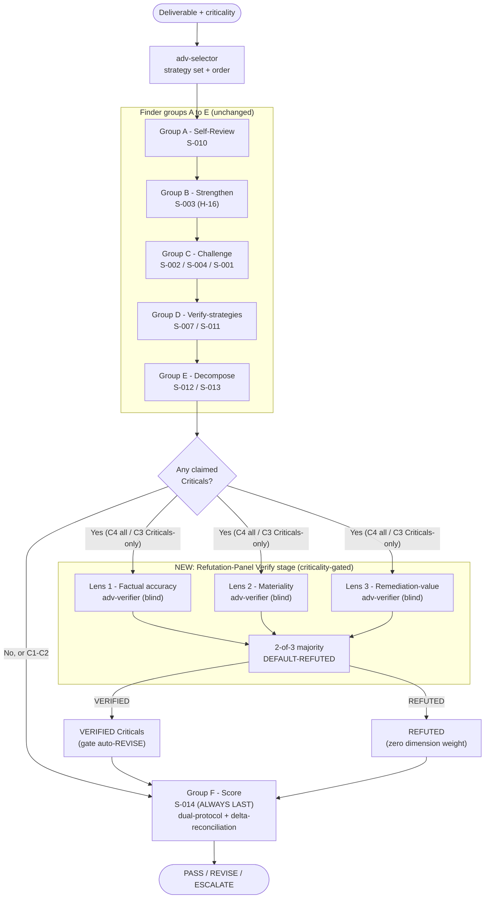
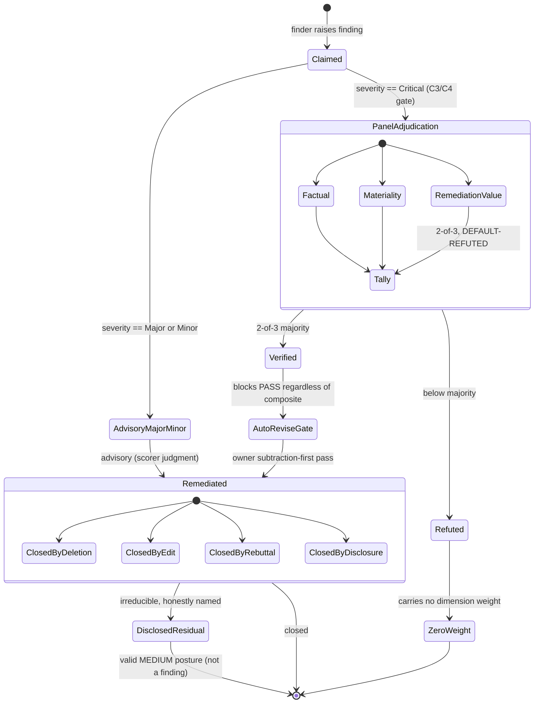
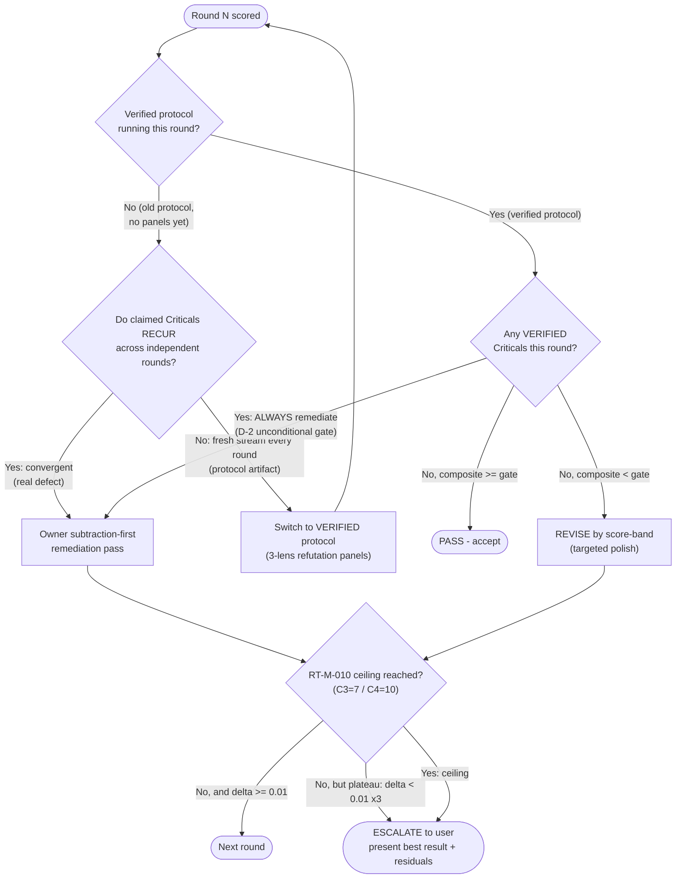
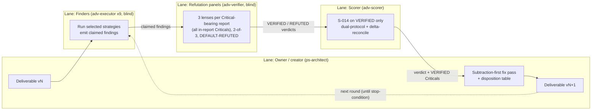

<!-- Scheme B dogfood (see Meta-Note): this is the FIRST ADR authored under the ratified
     ADR-PROJ031-004 convention. The id is subject-encoded and canonical from birth, so
     promotion project->framework is a pure `git mv` requiring no id change and no citation
     re-pointing. This ADR both USES that convention and, by improving the very tournament
     process that hardened it, closes the loop. -->

# ADR-adversary-tournament-protocol-001: Verified-Criticals Tournament Methodology for the /adversary Skill

> **PS:** PROJ-031-cowork-skeleton
> **Commission:** FU.12 (2026-07-07)
> **Created:** 2026-07-07
> **Status:** PROPOSED
> **Agent:** ps-architect
> **Supersedes:** none
> **Superseded By:** none

---

## Navigation

| Section | Purpose |
|---------|---------|
| [L0 Executive Summary](#l0-executive-summary) | Plain-language what and why |
| [Status](#status) | Ratification state |
| [Context](#context) | The 18-round empirical record that motivates this decision |
| [Constraints](#constraints) | Hard boundaries the decision must satisfy |
| [Forces](#forces) | Tensions in tension |
| [Options Considered](#options-considered) | Option-by-option analysis for D-1 through D-6 (Nygard, steelman-first) |
| [Decision](#decision) | Chosen options, rationale, alignment |
| [Design Diagrams](#design-diagrams) | Four mmdc-validated figures |
| [L1 Technical Implementation](#l1-technical-implementation) | Concrete change surface |
| [L2 Architectural Implications](#l2-architectural-implications) | Systemic consequences and evolution path |
| [Consequences](#consequences) | Positive, negative, neutral |
| [Risks](#risks) | Risk register with mitigations |
| [Work-Item Decomposition](#work-item-decomposition-proposed) | Stories/enablers + draft GH issues (PROPOSED) |
| [Related Decisions](#related-decisions) | Linked ADRs |
| [PS Integration](#ps-integration) | Worktracker linkage |
| [Meta-Note: Scheme B Dogfooding](#meta-note-scheme-b-dogfooding) | First-ADR-born-canonical record |
| [Changelog](#changelog) | Version history incl. iteration-1 remediation |

---

## L0 Executive Summary

Jerry's `/adversary` skill runs "tournaments": blind reviewer agents attack a document, an owner
fixes what they find, and a scorer grades the result — repeating until the document passes. Over
18 real tournament rounds on two hard governance packages (roughly 250 agent runs — order-of-magnitude:
~14 non-panel rounds × ~9–10 finder+scorer invocations, plus 4 verified-protocol rounds × ~21–25
invocations each incl. refutation-panel files, plus ~18 owner-remediation passes ≈ 230–270; SM-001-iter4),
we learned
that the tournament had a structural flaw: **it counted every alleged problem as a real problem.**
Because reviewers are rewarded for finding things, they kept finding *new* things every round —
even after the previous round's problems were all fixed. On one package the score *drifted downward*
across six rounds (it ticked up by about 0.01 in one round before declining across the rest) even
though no old problem ever came back. Reviewers were, in effect, chasing
their own tails, and at least one "verified" claim was simply false and survived four rounds before
anyone checked it.

The fix, discovered mid-engagement and proven across four later rounds, is to add a **verification
stage** between "a reviewer claims a problem" and "the scorer counts it." Three independent, blind
mini-reviewers each judge a claimed Critical problem from a different angle — is it factually true,
does it actually matter, and is it worth fixing — and a claim only counts if two of the three agree
(default is: does not count). This single change lifted verified composites out of misleading
old-protocol figures (e.g. 0.68) into an honest **0.72–0.88 band across the four rounds that ran it**
— and honestly *non-monotonically*, not a clean climb: one package's two verified rounds moved
**0.83 → 0.72** as a *larger* crop of genuine, panel-confirmed Criticals (6 vs. 4, including a
fix-introduced regression) surfaced on a fresh blind pass — newly-found real defects, not old ones
returning and not a protocol regression (see Context; all four rounds are named there and the decline
is reconciled per CV-001-20260707iter3). It correctly *kept* the genuinely broken items (including that
just-introduced bug, panel-confirmed 3-of-3) and correctly *discarded* restatements of already-known
limitations. (Separately, a *fabricated* "verified" claim that the old process let survive four rounds
was exposed not by this new stage but by ordinary blind reviewer rotation — the same
independence property the stage makes reliable rather than luck-of-the-rotation.)

This ADR proposes to make that verification stage a permanent, optional-by-criticality part of the
`/adversary` tournament, alongside four supporting decisions: only truly-verified Critical problems
force a rewrite; problems are closed by *removing* complexity rather than *adding* it; the
tournament knows when to stop rather than looping forever; and the scorer must explicitly reconcile
each round against the last. Everything here is a MEDIUM-tier process change — **no HARD rule is
touched and the 25/25 HARD-rule ceiling is untouched.** Nothing is implemented by this ADR; it
specifies the changes so the team can review them and open work items and GitHub issues.

---

## Status

**PROPOSED.** Awaiting user ratification (P-020). No file under `.context/`, `skills/`, or `docs/`
is modified by this ADR; it is a decision record plus a work-item proposal. On approval, this ADR
promotes to `docs/design/` by pure `git mv` per the Scheme B convention it dogfoods (see
[Meta-Note](#meta-note-scheme-b-dogfooding)).

---

## Context

### The problem being solved

The `/adversary` skill (`skills/adversary/SKILL.md`) executes adversarial tournaments: `adv-selector`
picks a strategy set by criticality, `adv-executor` runs blind finder strategies (Groups A–E), and
`adv-scorer` produces an S-014 composite with a PASS/REVISE/ESCALATE verdict. The current
acceptance rule is unconditional: *"Any Critical finding from adv-executor reports → automatic REVISE
regardless of score"* (`skills/adversary/agents/adv-scorer.md:166`). Every claimed Critical, at
face value, blocks acceptance.

Two C4 governance packages in PROJ-031 were driven through this tournament to a combined **18
rounds** (~250 agent invocations). The record is unusually complete and is the primary evidence for
this ADR.

### Evidence chain — the additive-remediation spiral

**Iteration 5 (ADR-convention thread), score 0.66 REVISE.** Four blind reviewers produced **10
unresolved Criticals**. The scorer's own root-cause read: iterations 1–5 had answered findings by
*adding* machinery (an 18-rule lint, a waiver ledger, a two-tier ratification split, CODEOWNERS
gating), and *"each addition became new attack surface — the reviewers then attacked the additions"*
(`projects/PROJ-031-cowork-skeleton/orchestration/adr-convention-20260702-001/subtraction-pass-notes.md:28`;
survey at `.../adversary/iteration-005/s-014-quality-score.md:186-205`).

**Iteration 8 (ADR-convention thread), score 0.62 REVISE.** After a subtraction pass, **all 10
prior Criticals were verifiably closed (8 by deletion, 2 by edit, 0 recurred)** — yet the same round
surfaced **7 brand-new Criticals**
(`.../adversary/iteration-008/s-014-quality-score.md:50, 195-208`). Closing everything did not lower
the fresh-finding rate. This is the signature of a **non-convergent fresh stream**: a blind
tournament with no verification gate manufactures a roughly constant volume of Critical-severity
claims per round independent of the document's actual defect count.

**Iteration 6 (FU-log thread), score 0.46 — declining, ESCALATE.** The parallel package showed the
same pattern more starkly: **six consecutive rounds of zero regressions plus a fresh crop of
Criticals each round**, with the composite *drifting downward* (0.468 → 0.460), not up
(`projects/PROJ-031-cowork-skeleton/orchestration/fu-log-convention-20260705-001/adversary/iteration-006/s-014-quality-score.md:19-20, 56`).
The scorer named the systemic gap directly: a wording-only remediation *"reliably closes the specific
instance of each finding … but has not yet closed the class of problem that keeps producing fresh
Critical-severity instances on each new blind pass"* (`.../iteration-006/s-014-quality-score.md:56`).

### Evidence chain — the verified protocol converges

Mid-engagement, a **VERIFIED-CRITICALS protocol** was introduced: each claimed Critical is
adjudicated by a 3-lens refutation panel (factual-accuracy / materiality / remediation-value), and
only findings that survive a **2-of-3 majority** are counted; default is REFUTED.

**Iteration 9 (ADR-convention), verified 0.86 vs old-protocol 0.68.** Of 10 claimed Criticals, **5
were VERIFIED and 5 REFUTED**
(`.../adversary/iteration-009/s-014-quality-score.md:36-37, 128-135`). The scorer quantified the
panel's value: *"The ~0.18-point difference between the two protocols is the quantified value of the
VERIFIED-CRITICALS refutation panel"* — because half the claimed Criticals were restatements of
already-disclosed residuals, out-of-mandate, or materiality overreach
(`.../iteration-009/s-014-quality-score.md:135`).

**Iteration 7 (FU-log), verified 0.83 vs old-protocol 0.54, REVISE.** The panels adjudicated 7
claimed Criticals and **VERIFIED 4** (the most material an undisclosed git-history secret-retention
gap), after a Restore pass had closed all 6 iteration-6 Criticals with zero regression
(`.../fu-log-convention-20260705-001/adversary/iteration-007/s-014-quality-score.md:21, 65-66, 73`).
This is the **fourth** VERIFIED-CRITICALS-scored round (the other three being ADR-convention iter-9/10
and FU-log iter-8), and the panel again produced a large protocol delta (0.83 verified vs. 0.54 naive),
consistent with the other rounds.

**Reconciling the 0.83 → 0.72 movement into iteration 8 (disclosure per CV-001-20260707iter3, D-3
doctrine; and exactly the discontinuity D-5 exists to make explicit).** The next round on this same
package (FU-log iter-8, below) scored **lower** (0.72) under the *identical* protocol — a decline the
source corpus never reconciled, because iteration-8's own delta table compares against iteration-6
(0.46), silently skipping iteration-7 (0.83)
(`.../fu-log-convention-20260705-001/adversary/iteration-008/s-014-quality-score.md`, delta section).
This ADR surfaces rather than inherits that gap: the movement is **not** a regression of prior fixes —
iteration-8's fresh blind pass simply VERIFIED a *larger* crop of genuine Criticals (**6 vs. 4**),
including the fix-introduced regression `DA-002-i8` (3-of-3). More real defects found on a fresh
rotation lowers the composite honestly; it is the D-4 "fresh stream of genuine, non-recurring defects"
pattern, not the old-protocol "manufactured constant stream," and it is precisely why D-5 mandates
per-round delta-reconciliation so such a movement is explained rather than glossed. The verified
protocol still clearly outperformed naive counting in *both* rounds (0.83 vs. 0.54; 0.72 vs. 0.51).

**Iteration 8 (FU-log), verified 0.72 vs old 0.51.** The panels **CONFIRMED 6 real Criticals** —
including `DA-002-i8`, a **regression introduced by a prior fix** (a dedup check keyed on location
only, silently dropping edited feedback), caught **unanimously 3-of-3**
(`.../fu-log-convention-20260705-001/adversary/iteration-008/s-014-quality-score.md:67, 73`;
detail at `.../iteration-008/post-tournament-fix-notes.md:35-44`). The same panel **REFUTED
`PM-001-iter8` 0-of-3** as a restatement of iteration-3's already-closed `FM-006`
(`.../iteration-008/s-014-quality-score.md:68, 75`). The panel simultaneously prevented a
manufactured non-issue from inflating the count *and* preserved a genuine fix-introduced regression.

> **Disclosed correction (D-3 disclosure doctrine, iteration-1 remediation).** An earlier draft of
> this ADR cited "18 verification-panel files" for this round in three places. Direct filesystem
> enumeration of `.../fu-log-convention-20260705-001/adversary/iteration-008/verify/` returns **12**
> files (= 3 lenses × 4 Critical-bearing reports). The "18" figure was propagated from a
> self-contradictory line in the cited source score report (which wrote "18 … × 4 Critical-bearing
> reports", i.e. 3 × 4 = 12) without independent verification — the exact "verify before you count"
> failure this ADR argues against. All three sites now read **12**, and the empirical range is
> corrected from "~15–18" to "~12–15". Disclosed rather than silently edited, per D-3.
> *Source-hygiene note (SM-003-20260707):* the cited source score report's own footer still carries a
> separate, differently-inconsistent arithmetic for the same round; that residual is a **source
> artifact** and is **not** re-propagated into this ADR — this ADR's "12" is derived from direct
> filesystem enumeration, not from the source footer.

**Iteration 10 (ADR-convention), verified 0.88, 0 VERIFIED Criticals, reached the RT-M-010 ceiling.**
All 6 claimed Criticals were REFUTED 2-of-3; the C4 tournament stopped cleanly at its 10-round
ceiling (`.../adversary/iteration-010/s-014-quality-score.md:45, 58`). Notably, four independent
strategies re-derived the *same* grandfather-exemption seam. **Three** of those four findings' factual
lenses confirmed the underlying textual tension is real (though immaterial); the **fourth (013-001)**
was refuted even at the factual layer — its own factual lens concluded the apparent tension "is
resolved in the same section" and does not establish a genuine contradiction
(`.../iteration-010/s-014-quality-score.md:56`;
`.../iteration-010/verify/s-013 inversion technique-refutation-factual.md`). The recurrence signal is
therefore about the *seam being re-derived across strategies*, not about unanimous factual
confirmation — corrected here per CV-003-20260707. Recurrence, not raw count, is the signal.

### Evidence chain — the fabricated-verification incident

A concrete failure shows why *independence* (not self-attestation) is the load-bearing property. A
claim that `.github/PULL_REQUEST_TEMPLATE.md` did not exist — asserted as **"Glob-verified"** — was
**false**: a PR template existed at the lowercase `.github/pull_request_template.md` since 2026-02-18.
The false negative came from an exact-uppercase-case search and was **independently re-verified in
exactly two checks — FM-010 (S-012) at iter-6 and VQ-019 (S-011) at iter-7 —
then carried unchallenged — but *not* independently re-checked — through iterations 8 and 9**
(**this is the single authoritative count for this incident; RSK-2 and Positive Consequence #2 use it
identically**. Both primary sources state two: `.../iteration-010/post-ceiling-fix-notes.md:57`
("reaffirmed at iter-6 (FM-010), iter-7 (VQ-019)") and the primary incident source
`.../iteration-010/s-001-findings.md:37` (RT-001-iter010: "two independent prior 'Glob-verified
absent' checks (S-012 iteration-6 FM-010, S-011 iteration-7 VQ-019)"). Corrected per
**CV-001-20260707iter5**: an earlier draft's "three checks … PM-001-iter007" wrongly attributed a
third re-verification to `PM-001-iter007`, which is in fact an unrelated
Pre-Mortem-table-completeness finding (`.../iteration-007/s-004-findings.md:39,49`) that never
examined the PR-template claim; the prior CV-001-20260707iter4 fix corrected the "reaffirmed across
iterations 6, 7, 8, and 9" phrasing but left this miscount uncaught). It was finally exposed in
iteration 10 — but the correct
attribution matters, and an
earlier draft of this ADR got it wrong (**re-attributed here per CV-001-20260707, iteration-2
review**). The catch was **not** made by the new refutation panel: the panels in iteration 10
adjudicated exactly six *Criticals* (002-001, 002-002, 004-001, 012-004, 013-001, CV-001-i010), none
of which was the PR-template claim. The stale claim was exposed by an ordinary **blind S-001 Red Team
finder pass** (tracked as `RT-001-iter010`, logged as an unrefuted **Major** that — per the protocol's
"panels adjudicate Criticals only" rule — never entered any panel)
(`.../adversary/iteration-010/post-ceiling-fix-notes.md:55-65`;
`.../iteration-010/s-014-quality-score.md`, Unrefuted-Majors table). The honest lesson is therefore
*narrower but still decisive*: a self-attested "verified" claim persisted across four blind rounds
(independently re-checked in only two of them, iter-6/iter-7 — the authoritative count stated above,
per CV-001-20260707iter5), and it took
**an independent blind re-examination** — here, a different finder strategy on a fresh rotation — to
expose it. That is the general property (blind independence) the Verify stage makes *architectural and
repeatable* rather than incidental to which finder strategies happen to rotate in on a given round; the
directly panel-adjudicated proof of that property is the fix-introduced regression `DA-002-i8`
(iteration-8 FU-log), which a factual/materiality/remediation panel confirmed **3-of-3** (see the
verified-protocol evidence chain above), not this incident.

### The disposition-table discipline

Across both threads, remediation was recorded in an owner-authored disposition table that tags every
finding CLOSED-BY-DELETION / CLOSED-BY-EDIT / CLOSED-BY-DISCLOSURE / REBUTTED / RESIDUAL-DISCLOSED,
with a running residual register (R-1 … R-18)
(`.../adr-convention-20260702-001/subtraction-pass-notes.md:82-101, 123-137`). This artifact is what
let later scorers verify continuity (*"10 of 10 prior Criticals verified closed … 0 recurred"*,
`.../iteration-008/s-014-quality-score.md:206-208`). It is currently an ad-hoc convention; this ADR
proposes to make it a first-class tournament artifact.

### What this ADR is NOT

This ADR proposes **no HARD-rule changes**. H-13 (≥0.92 for C2+), H-14 (min 3 iterations), H-16
(Steelman before Devil's Advocate), and RT-M-010 (iteration ceilings C1=3/C2=5/C3=7/C4=10) are all
retained verbatim. The HARD-rule ceiling stays at **25/25**
(`.context/rules/quality-enforcement.md`, HARD Rule Index and Two-Tier Enforcement Model). Every
change is MEDIUM-tier and lives in the `/adversary` skill, its agent definitions, one new strategy
template, and a pointer in the `quality-enforcement.md` Implementation section.

---

## Constraints

| ID | Constraint | Source |
|----|------------|--------|
| c-001 | No HARD-rule additions, deletions, or edits; ceiling stays 25/25. | Commission (FU.12); `.context/rules/quality-enforcement.md` HARD Rule Ceiling Derivation |
| c-002 | Changes are MEDIUM-tier and reversible; SSOT constants (weights, threshold, criticality sets) are referenced, never redefined. | `.context/templates/adversarial/TEMPLATE-FORMAT.md:50, 328` |
| c-003 | P-003: no recursive subagents; every new agent is a single-level worker with no Agent/Task tool. | H-01/P-003; `skills/adversary/SKILL.md:111-133` |
| c-004 | The token cost of verification MUST be proportionate to criticality (panels ≈ 3 agent runs — one per lens — per Critical-bearing **report**, with every claimed Critical in that report adjudicated inside those same 3 invocations; panels are *gated and costed* at the report level, i.e. only Critical-bearing reports are panelled). | Empirical panel-file counts (iter-9: 15 files = 3 lenses × 5 Critical-bearing reports, adjudicating 10 claimed Criticals; iter-8 FU: 12 files = 3 lenses × 4 Critical-bearing reports, adjudicating 7 claimed Criticals) |
| c-005 | The decision must be evidence-led and cite the tournament record; disclosed residuals are valid posture, not defects. | Commission; `.../iteration-009/s-014-quality-score.md:137-139` |
| c-006 | H-16 ordering (Steelman before Devil's Advocate) and Group F (S-014 always last) are preserved. | `skills/adversary/agents/adv-selector.md:112-128` |
| c-007 | This ADR itself is auto-C3 minimum (AE-003 new ADR; AE-002 touches `.context/` surfaces on implementation). | `.context/rules/quality-enforcement.md` Auto-Escalation Rules |

---

## Forces

1. **Finder incentive vs. truth.** Blind finders are rewarded for volume; without a counter-force
   they manufacture a steady stream of Critical claims regardless of the document's real state
   (iteration 6 declining-score evidence).
2. **Independence vs. cost.** The property that caught the fix-introduced regression *and* the
   fabricated claim is *blind independence* — but independence costs ~3 extra agent runs per
   Critical-bearing report. Cheaper, non-independent verification loses the exact property that made
   it work.
3. **Rigor vs. termination.** More rounds find more (manufactured) issues; but H-14 needs a minimum
   of 3 and quality needs convergence. The tournament must know the difference between "still
   improving" and "chasing its own tail."
4. **Subtraction vs. completeness.** Each new mitigation is new attack surface. Yet reviewers
   legitimately want coverage. The doctrine must bias toward removing exposure while still allowing
   honest disclosure of what is uncovered.
5. **Continuity vs. anchoring.** A scorer that ignores the prior round mis-reads fresh streams as
   regressions; a scorer that anchors to the prior score under-reacts to genuine new gaps. Delta
   reconciliation must be explicit and independent.
6. **Trust in "verified."** A self-attested verification is worth little (the fabricated-claim
   incident). Verification must be performed by an agent that did not author the claim.

---

## Options Considered

Per Nygard, each decision is analyzed option-by-option. Rejected options are **steelmanned first**
(H-16/S-003) before the chosen option is defended.

> **Note on the 1–10 option scores (DA-006-i2):** the numeric scores below are **relative
> preference orderings under each decision's stated cost/independence assumptions**, not
> confidence levels derived from the (all-C4) evidence base. A gap such as D-1's C=9 vs. B=6
> encodes "C is preferred given the cost-proportionality argument," not "C is 50% more likely
> correct" — consistent with the prose, which explicitly rests the B-vs-C choice on a *reasoned
> default* rather than an empirical finding.

### D-1 — Where and how to verify claimed findings

| Option | Pros | Cons | Score (1–10) |
|--------|------|------|--------------|
| **A. Status quo** (no verify; count all claimed Criticals) | Zero added cost; simplest. | Produced the additive spiral, declining scores, and let a fabricated claim survive 4 rounds. | 2 |
| **B. Always-on verify** (3-lens panels on every Critical at every criticality) | Maximum protection; one uniform rule; no branching; forecloses criticality mis-gating everywhere. | Token cost disproportionate at C1/C2 (reversible-in-a-day, ≤10-file work); over-engineers low-risk work. *Note: the record contains no C1/C2 rounds, so B-vs-C is not empirically separable — see "Why C is chosen".* | 6 |
| **C. Criticality-proportional verify** (C4 full panels; C3 panels on Criticals only; C1–C2 none) | Concentrates cost at C4, where the spiral was actually observed; extends to C3 as a reasoned precaution; preserves the property that worked. | Adds a branch to the pipeline; C3 still pays per-Critical cost; the C3 boundary is a provisional extrapolation pending WI-8 validation. | **9** |
| **D. Scorer-side verification** (scorer re-checks its own Criticals) | Cheapest — one agent; scorer already reads all reports. | **Not independent** — same context/anchoring; the empirical scorer needed the *panel files* as input and could not self-distinguish 5 verified from 5 refuted; the fabricated claim survived multiple scorer passes. | 4 |

**Steelman of B (always-on):** uniform application is the most defensible *rule design* — no
criticality mis-classification can ever skip verification, and the fabricated-claim failure mode is
foreclosed everywhere, not just at C3+. If token budgets were free, B would dominate C.

**Steelman of D (scorer-side):** the scorer is already the anti-leniency authority
(`skills/adversary/agents/adv-scorer.md:68-91`), already reads every finder report, and re-using it
avoids a fourth agent. In a world where the scorer's own context were untainted by the claims it
grades, D would be the minimal-machinery choice — and minimal machinery is itself the doctrine of
this very engagement.

**Why C is chosen:** independence is the load-bearing property (Force 6). The record shows the
scorer, even under an explicit anti-leniency mandate, computed its verdict *from the panel files*
rather than replacing them (`.../iteration-009/s-014-quality-score.md:21`), and the fabricated claim
survived every non-independent pass. That rules out D. The choice between B and C, however, rests on a
**reasoned default, not an empirical finding, and the scope of the evidence must be stated honestly:
100% of the 18 cited tournament rounds were *scored* at C4** — there are **zero C1, C2, or C3 rounds
in the operative record** (a grep across every `Criticality Level` declaration in both packages returns
**five `C3` hits**, all from S-010 self-refine's own report in FU-log iterations 1–5, each explicitly
discounted by that round's scorer as an internal labeling inconsistency *not scored against the
deliverable*; every round's own composite and verdict treated the criticality as C4 — corrected here
per CV-002-20260707iter3, since a literal grep does *not* "confirm all-C4" without this qualification,
and this ADR's own subject is not trusting unqualified "verified" claims). At an
all-C4 evidence base the "always-on" (B) and "criticality-gated" (C) options are **empirically
indistinguishable**, so C is selected on a proportionality argument rather than an observation: the
spiral was *observed only at C4*; extending panels to **C3** is a **reasoned precaution** because C3
shares the surface that drives the spiral (>1 day to reverse, >10 files, API/governance changes — the
very profile AE-003 already auto-escalates ADRs into), while the **C1–C2 exemption is a
cost-proportionality default** (C1–C2 work is reversible in a day, ≤10 files, and cannot afford ~3
agents per Critical), **not** a finding that C1–C2 "did not spiral." The C3 boundary is therefore
**provisional**: **WI-8 is scheduled to run a C3 tournament and validate it before it is treated as
settled** (see [Work-Item Decomposition](#work-item-decomposition-proposed)). C spends the
independence budget where the evidence *and* a conservative extrapolation agree it is most likely to
pay, and commits to validating the one boundary the evidence cannot yet confirm.

### D-2 — What a verified finding does to the verdict

| Option | Pros | Cons | Score |
|--------|------|------|-------|
| **A. Status quo** (any claimed Critical → auto-REVISE) | Simple; already implemented. | Refuted/restated/immaterial claims block acceptance; drives the spiral. | 2 |
| **B. Verified-only gating** (only panel-VERIFIED Criticals auto-REVISE; refuted carry zero weight; disclosed residuals are valid posture; dual-protocol transparency during transition) | Matches the evidence; stops manufactured blocks; preserves genuine ones; auditable. | Requires the D-1 panel to exist; adds a dual-score reporting obligation during transition; because D-1 runs **no panel at C1–C2**, a bare "verified-only" rule would leave the hard gate *unreachable* there — so B MUST be paired with an explicit C1–C2 fallback to the pre-existing unconditional rule (DA-001-i3). | **9** |
| **C. Verified Criticals + verified Majors gating** | Even stricter coverage of Majors. | Majors were adequately handled as advisory across all verified rounds; panelling them ~doubles cost for little marginal signal. | 6 |

**Steelman of C (also-panel-Majors):** several genuine gaps were Major, not Critical (e.g. the
declining-score package's propagation-gap Majors); panelling Majors would give them the same
independent adjudication and might catch a Major that should have been Critical. If materiality
misclassification between Major and Critical were common, C would be safer.

**Why B is chosen:** across every verified round, unrefuted Majors were correctly handled as
*advisory* input to scoring without blocking the gate
(`.../fu-log-convention-20260705-001/adversary/iteration-008/s-014-quality-score.md:35, 146`), and
no round showed a Major that a panel would have promoted to a gate-blocking Critical. C pays double
for signal the evidence says is already captured. B also encodes the two hard-won distinctions:
**refuted = zero dimension weight** and **disclosed residual = valid MEDIUM posture, not a finding**
(`.../iteration-009/s-014-quality-score.md:137-139`). The **dual-protocol transparency** clause
(report both the verified composite and the old-protocol composite during transition) is retained
because both verified rounds reported it and it is what makes the ~0.18–0.21 protocol delta
auditable rather than a black-box jump. **C1–C2 fallback (DA-001-i3):** because D-1 deliberately runs
*no* panel below C3, a naive reading of "only panel-VERIFIED Criticals auto-REVISE" would make the
hard gate structurally *unreachable* at C1–C2 — silently regressing the pre-existing unconditional
control at exactly the "Standard" tier where S-002 is a required strategy. B is therefore scoped as
*verified-only gating **where a panel ran***: at C3/C4 the panel decides; **at C1–C2 the pre-existing
unconditional rule (`adv-scorer.md:166`) remains in force unchanged.** This is a clarifying
scope-narrowing, not new machinery (consistent with D-3), and it means the verified-only rule *adds*
a verification precondition at C3/C4 without *subtracting* any gate at C1–C2.

### D-3 — How findings are remediated

| Option | Pros | Cons | Score |
|--------|------|------|-------|
| **A. Additive** (answer findings by adding machinery) | Feels responsive; visibly "does something." | This *is* the spiral: each addition is new attack surface (`subtraction-pass-notes.md:28`). | 1 |
| **B. Subtraction-first** (close by deletion/edit/rebuttal/disclosure; adding machinery requires deleting something bigger; owner disposition table as a first-class artifact) | Directly counters the spiral; shrinks attack surface; 8 of 10 iter-5 Criticals closed by deletion with 0 recurrence. | Requires discipline; some gaps become honest residuals rather than fixes. | **9** |
| **C. Freeze** (score only, no remediation between rounds) | No new attack surface at all. | Cannot converge or demonstrate fixes; abandons H-14's revision intent. | 3 |

**Steelman of C (freeze):** if remediation itself manufactures attack surface, the safest move is to
stop remediating and let the owner accept-or-reject the artifact as-is. For a genuinely finished
document, further edits carry only downside risk (the `DA-002-i8` regression was *introduced by a
fix*).

**Why B is chosen:** the disposition record proves subtraction converges where addition did not —
*"lint cut 18→5 rules … monotonic-growth threat removed at the root"*
(`subtraction-pass-notes.md:97`), and the fix-introduced-regression risk C worries about is
*managed* by B's rule that a change must delete more surface than it adds, not avoided by refusing to
improve. The **owner disposition table** is promoted to a required tournament artifact so that
continuity checks (D-5) have a stable input.

### D-4 — When the tournament stops

| Option | Pros | Cons | Score |
|--------|------|------|-------|
| **A. Status quo** (RT-M-010 ceilings + plateau only) | Already defined; HARD-adjacent. | Blind to the fresh-stream artifact; can burn all 10 C4 rounds chasing manufactured Criticals. | 5 |
| **B. Convergence discriminator + verified-protocol switch** (recurring-across-rounds = real → remediate; non-convergent fresh stream = artifact → switch to verified protocol or stop; keep RT-M-010 + plateau; escalate-to-user at ceiling) | Names the exact failure the record exhibits; gives a deterministic branch out of the spiral; RT-M-010 unchanged. | Requires cross-round finding comparison (needs the disposition table from D-3). | **9** |
| **C. Hard stop after N rounds regardless** | Bounded cost, trivial. | Throws away genuinely-improving runs; ignores convergence signal entirely. | 4 |

**Steelman of C (hard stop):** a fixed budget is the only truly spiral-proof rule — if you cannot
add rounds, you cannot loop forever, and RT-M-010 already encodes exactly this ceiling. Simplicity
has real value in a governance mechanism.

**Why B is chosen:** RT-M-010 (which B keeps) already provides C's hard ceiling; the missing piece
is *earlier* exit when the stream is non-convergent. The record gives the discriminator directly —
recurrence across *independent* rounds marks a real defect (the grandfather seam re-derived by 4
strategies, `.../iteration-010/s-014-quality-score.md:56`; the fix-introduced regression), while a
fresh non-overlapping crop every round marks a protocol artifact (10 closed / 7 new,
`.../iteration-008/s-014-quality-score.md:50`). B routes the first to remediation and the second to
"switch to the verified protocol, or stop," which is precisely the move that turned 0.68 into 0.86.

### D-5 — Scorer continuity across rounds

| Option | Pros | Cons | Score |
|--------|------|------|-------|
| **A. Status quo** (`Prior Score` an optional context field) | Minimal obligation. | Lets the scorer mis-read a fresh stream as a regression, or anchor to the prior number. | 4 |
| **B. Mandatory delta-reconciliation** (per-dimension delta justified against the prior iteration; anti-leniency retained for genuine gaps) | Every verified round already did this and it demonstrably prevented variance-anchoring; makes score movement auditable. | One more required section in the score report. | **9** |

**Steelman of A (optional):** a scorer that re-derives each round from scratch is maximally
independent of prior framing; mandating reconciliation risks importing last round's errors. Fresh
scoring has a purity argument.

**Why B is chosen:** the verified rounds show reconciliation done *without* anchoring — *"scored
independently from current-iteration evidence, then compared"*
(`.../iteration-008/s-014-quality-score.md:214`) — and it is what let the scorer explain a −0.04
composite move as "not remediation regressing" but a comparably-severe fresh crop
(`.../iteration-008/s-014-quality-score.md:222`). Mandating it captures the benefit; the retained
anti-leniency rule (`adv-scorer.md:79`) prevents the anchoring A worries about.

### D-6 — Implementation surface (verifier role)

| Option | Pros | Cons | Score |
|--------|------|------|-------|
| **A. New `adv-verifier` agent** (nominal T2 Read-Write category, tools restricted to `Read, Glob, Grep, Write` — no `Edit`/`Bash`/spawn; blind; one invocation per lens per report; single responsibility) | Clean specialist (Pattern 1); fresh-context independence guaranteed per invocation; lenses provably blind to each other; matches the panel-file structure already used. | Adds a 4th agent to the skill; new template + registration. | **9** |
| **B. Verification mode of `adv-executor`** | No new agent; reuse existing sonnet worker. | Conflates finder and verifier roles; a finder adjudicating findings blurs the independence the whole mechanism depends on; blindness harder to guarantee within one agent. | 5 |

**Steelman of B (executor mode):** `adv-executor` already loads strategy templates and produces
structured findings; a "verify" template is just another strategy it runs, and re-use honors the
minimal-machinery doctrine (no new agent, no new tool tier). One agent is easier to register,
version, and reason about.

**Why A is chosen:** the empirical panels are *separate blind files per lens, one set per
Critical-bearing report* (`.../iteration-009/`: 15 refutation-panel files = 3 lenses × 5
Critical-bearing reports, adjudicating 10 individual claimed Criticals across those reports;
`.../fu-log .../iteration-008/`: 12 verification-panel files = 3 lenses × 4 Critical-bearing reports,
adjudicating 7 claimed Criticals). Each per-report, per-lens file renders an independent
VERIFIED/REFUTED verdict for every claimed Critical the target report raised (see e.g.
`.../iteration-009/verify/s-001-refutation-factual.md`, which adjudicates both RT-001-iter009 and
RT-002-iter009 in one factual-accuracy pass). A dedicated agent that only reads and writes-new-verdict-files
(no `Edit`, no `Bash`, no spawn), invoked once per lens per report, is the faithful implementation of
that structure and the cleanest guarantee that the factual/materiality/remediation lenses cannot see
each other or the scorer. The cost is one agent definition — small against the independence it secures
(Force 6). All strategy constants remain in the SSOT; the new `s-016-refutation-panel.md` template
conforms to the existing 8-section `TEMPLATE-FORMAT.md`.

---

## Decision

We adopt the **Verified-Criticals Tournament Methodology**: six coordinated decisions that insert an
independent, criticality-proportional verification stage into the `/adversary` tournament and align
remediation, stopping, and scoring around it.

| # | Decision | Chosen option |
|---|----------|---------------|
| **D-1** | Verify stage | **C — criticality-proportional 3-lens refutation panels.** **C3 and C4 panel *every* claimed Critical identically** — the panelling rule is the same at both tiers; the "C4 all / C3 Criticals-only" shorthand denotes the *finder strategy set and iteration ceiling* (which differ by tier), **not** a per-Critical panelling-rate gradient (DA-005-iter4). C1–C2 run no panel. Lenses: factual-accuracy / materiality / remediation-value. **2-of-3 majority, DEFAULT-REFUTED, blind to each other.** |
| **D-2** | Severity gating | **B — verified-only gating (where a panel ran).** Only panel-VERIFIED Criticals trigger automatic-REVISE **at C3/C4, where D-1 runs a panel**. **At C1–C2, where D-1 runs no panel, the pre-existing unconditional any-Critical→REVISE rule (`adv-scorer.md:166`) remains in force as a fallback** — so no tier loses its hard Critical-severity gate (DA-001-i3). Refuted claims (at C3/C4) carry zero dimension weight. Disclosed residuals are valid MEDIUM posture, not findings. Report both verified and old-protocol composites during transition. |
| **D-3** | Remediation doctrine | **B — subtraction-first.** Close by deletion / edit / rebuttal / disclosure; adding machinery requires deleting something larger. Owner disposition table is a first-class tournament artifact. Owner-first routing unchanged. |
| **D-4** | Stop conditions | **B — convergence discriminator + verified-protocol switch.** Recurrence across independent rounds = real (remediate); non-convergent fresh stream = artifact (switch to verified protocol, or stop). RT-M-010 ceilings and plateau detection unchanged; escalate-to-user at ceiling. |
| **D-5** | Scorer continuity | **B — mandatory delta-reconciliation** against the prior iteration; anti-leniency retained for genuine gaps. |
| **D-6** | Implementation surface | **A — new `adv-verifier` agent** (nominal T2 Read-Write category, tools restricted to `Read, Glob, Grep, Write` — no `Edit`/`Bash`/spawn; blind; one invocation per lens per report) + new `s-016-refutation-panel.md` template + SKILL/adv-scorer/adv-selector edits + `quality-enforcement.md` Implementation-section pointer. MEDIUM-tier; zero HARD-rule change. |

### Rationale (one paragraph)

The 18-round record shows a blind tournament without a verification gate does not converge: it
manufactures a roughly constant Critical stream, drives scores flat-or-down despite zero
regressions, and — under self-attestation — can let a fabricated "verified" claim survive four rounds
(exposed only by an *independent* blind re-examination, an S-001 Red Team pass, not by self-review).
Adding an *independent* 3-lens refutation gate is the single intervention that demonstrably reversed
the convergence failure (0.68 → 0.86/0.88): it correctly *kept* a fix-introduced regression
(`DA-002-i8`, panel-confirmed 3-of-3) and correctly *discarded* restatements of already-disclosed
residuals (e.g. `PM-001-iter8`, refuted 0-of-3). The gate does not claim credit for the PR-template
catch — that was ordinary blind finder rotation — but it makes that same blind-independence property
*architectural and repeatable* rather than dependent on which finder strategy happens to rotate in.
The remaining five decisions are the minimum scaffolding that makes the gate coherent:
verified-only gating (so the gate has teeth), subtraction-first remediation (so fixes stop
generating attack surface), the convergence discriminator (so the tournament exits the spiral),
mandatory delta-reconciliation (so score movement is honest across rounds), and a dedicated blind
verifier agent (so the independence the gate depends on is architecturally guaranteed).

### Alignment

| Criterion | Score | Notes |
|-----------|-------|-------|
| Constraint Satisfaction | HIGH | Zero HARD-rule change (c-001); MEDIUM-tier, reversible (c-002); P-003-safe worker (c-003); cost gated by criticality (c-004). |
| Risk Level | MED | Primary risk is verifier leniency/collusion; mitigated by blindness + default-REFUTED + 2-of-3 (see [Risks](#risks)). |
| Implementation Effort | M–L aggregate | All **8** backlog items (CC-001-iter3): one new agent (WI-1), one new template (WI-2), three edited agent/skill artifacts (WI-3/WI-4/WI-5), one new guidance doc (WI-6), one SSOT pointer (WI-7), and one operational validation pass (WI-8, an actual C3 tournament incl. a non-ADR genre). No code, no HARD-rule work; the two "M"-sized items beyond the change-surface are the runner guide (WI-6) and the validation pass (WI-8). |
| Reversibility | HIGH | Remove the `adv-verifier` invocation and the pipeline reverts to status quo; no data migration. |

---

## Design Diagrams

All four figures were rendered and validated with `mmdc` 11.12.0 (Mermaid CLI). Rendered SVGs are
persisted alongside their sources at
`projects/PROJ-031-cowork-skeleton/orchestration/adversary-protocol-adr-20260707-001/diagrams/`.

### Figure 1 — Target tournament pipeline (Groups A→F with the Verify stage inserted)

*Fig. 1 — The refutation-panel Verify stage sits between the finder groups (A–E) and Group F
(scoring), gated on criticality; only VERIFIED Criticals reach the scorer with gate-blocking weight.
The `No, or C1-C2 → F` edge routes claims straight to the scorer at C1–C2 (and whenever no Critical is
claimed); at C1–C2 the scorer applies the pre-existing **unconditional** any-Critical→REVISE rule
retained as the D-2 fallback (DA-001-i3), so that edge does not represent a lost gate. The
`Yes (C4 all / C3 Criticals-only)` edge label is shorthand: **both C3 and C4 panel every claimed
Critical** — the tier difference is the finder strategy set and iteration ceiling, not the panelling
rate (DA-005-iter4).*

### Figure 2 — Finding lifecycle (claimed → verified/refuted → remediated/disclosed)

*Fig. 2 — Only VERIFIED Criticals reach the automatic-REVISE gate; refuted claims carry zero weight;
remediation closes by subtraction, and an irreducible gap becomes a disclosed residual — a valid
posture, not a finding.*

### Figure 3 — Stop-condition / convergence decision tree

*Fig. 3 — The recurrence discriminator applies only in the **pre-verified (old-protocol) mode**, where
it decides whether to switch to the verified protocol; once the verified protocol is running, **any
VERIFIED Critical routes unconditionally to remediation (FIX)** — no VERIFIED Critical can reach the
ceiling check without first passing through FIX, matching D-2's unconditional gate and Figure 2's
pathway (corrected per CV-002-20260707). RT-M-010 ceilings and plateau detection are unchanged.*

### Figure 4 — One-iteration sequence (owner / finders / panels / scorer)

*Fig. 4 — A single tournament iteration flows owner → finders → refutation panels → scorer → owner;
the panels are the new blind lane between finding and scoring.*

---

## L1 Technical Implementation

**Change surface (all MEDIUM-tier; nothing implemented by this ADR):**

1. **New agent `skills/adversary/agents/adv-verifier.md`** (companion `adv-verifier.governance.yaml`
   per H-34 dual-file architecture).
   - **`tool_tier: T2`** (the nominal *Read-Write* risk category, per the governance schema's
     nominal-enum semantics) **with `tools` deliberately restricted to `Read, Glob, Grep, Write`** —
     i.e. **T1 (`Read, Glob, Grep`) + `Write` (write-of-new-files only), *without* the `Edit` and
     `Bash` that the canonical T2 definition adds** (`agent-development-standards.md` Tool Security
     Tiers: "T2 = T1 + Write, Edit, Bash"). **Honest-labeling note (CC-002-iter4):** this exact tool
     set is neither the canonical T1 (which excludes `Write`) nor the canonical T2 (which includes
     `Edit`+`Bash`); it is a documented *restriction* of T2, flagged explicitly here — and enforced by
     `disallowedTools` (`Edit`, `Bash`, `Agent`/`Task`) plus a guardrail — so an H-34 compliance audit
     reads it as an **intentional restriction, not a mislabel**, without needing any amendment to the
     canonical tier table (which this ADR does not touch). The verifier must persist a *new* per-lens
     verdict file (which requires `Write`) but must NEVER `Edit` the deliverable or any prior verdict
     file, NEVER run `Bash`, and NEVER hold `Agent`/`Task`. *Rationale (CC-001-iter2):* the
     load-bearing property is "must not **edit** or **spawn**," a restriction on `Edit`/`Bash`/`Agent`,
     **not** on `Write`; creating a new file at a fresh `verify/` path is non-destructive. A pure-`T1`
     tool set structurally excludes `Write` and so could not satisfy this agent's own persistence
     contract. P-003 safety (no spawn) and blindness are preserved by the
     `disallowedTools`/`forbidden_actions` set, not by withholding `Write`.
   - Cognitive mode **`forensic`** (single-enum value per the schema; tie-break over `convergent`
     recorded because the agent's role is adjudicating claims for factual/remediation truth by tracing
     evidence, not selecting among alternatives — CC-003-iter4).
   - Invocation contract: the **unit of verification work is one Critical-bearing report**, adjudicated
     by **one invocation per lens** — i.e. **3 lens-invocations per Critical-bearing report**, each
     invocation individually adjudicating **every** claimed Critical that report raised (a report with
     *k* claimed Criticals still produces 3 verifier runs, each returning *k* verdicts). Panels are
     *gated and costed* at the report level (only Critical-bearing reports are panelled) — this is the
     invocation contract every cited empirical round actually used, confirmed against the primary
     `verify/` artifacts (e.g. `.../iteration-009/verify/s-001-refutation-factual.md` renders both
     RT-001-iter009 and RT-002-iter009 in one factual-accuracy pass), not merely their score-report
     descriptions. Input to a single invocation = the target report's claimed Criticals (each with id,
     severity, evidence, affected dimension) + the deliverable path + the lens name. The agent MUST NOT
     receive the other lenses' verdicts or the scorer's context (blindness).
   - Output = one per-report, per-lens file `.../adversary/iteration-NNN/verify/{report-id}-{lens}.md`
     containing a `VERIFIED | REFUTED` verdict section **per claimed Critical** in that report, each
     with a one-paragraph justification and a file+line citation. (This matches the empirical file
     naming, e.g. `s-001-refutation-factual.md`, not a per-finding-id file.)
   - Default rule: **REFUTED on uncertainty** (the anti-inflation default).
   - **Blindness ordering (CC-002-iter2; scope-corrected SM-003-iter4):** because the agent holds
     `Read`/`Glob` and the `verify/` directory is on its readable path, the three lens invocations for
     a given report MUST be dispatched **before any of their outputs is read by a sibling lens**; a
     lens invocation MUST NOT read another in-flight lens's verdict file. **True parallel dispatch**
     (single-turn, multiple invocations) is the **structural** form of this guarantee — the *only*
     branch that makes cross-lens blindness architectural rather than behavioral, consistent with this
     ADR's own L2 "independence as architecture, not discipline" doctrine — and is REQUIRED wherever
     the orchestrating context supports it. Where true parallelism is unavailable, a **documented
     sequential-dispatch-with-no-interleaved-read barrier** MAY substitute, but this fallback is a
     **procedural control** (behavioral — in kind like a prompt instruction, not a tool-level
     restriction) and MUST be named as such in the runner guide (WI-6), **not** described as an
     equivalent structural guarantee. Only the true-parallelism branch is a dispatch-ordering guarantee
     in the structural sense.
   - Constitutional triplet (P-003/P-020/P-022) + ≥3 forbidden actions per H-34(b) (the retired H-35
     folded into H-34 sub-item b per EN-002, 2026-02-21).
2. **New template `.context/templates/adversarial/s-016-refutation-panel.md`**, conforming to the
   8-section `TEMPLATE-FORMAT.md`. Defines the three lens rubrics:
   - **Factual-accuracy lens** — does the claim's cited evidence resolve as stated? (This lens
     *generalizes and makes repeatable*, at the gate, the kind of independent evidence re-check that a
     blind S-001 Red Team pass happened to perform on the fabricated PR-template claim in iteration 10;
     the Phase-2 deterministic pre-panel factual lens, L2, is the zero-token structural form of the
     same check.)
   - **Materiality lens** — does the finding threaten a stated purpose/pillar of the deliverable, or
     is it an edge case / restatement of a disclosed residual?
   - **Remediation-value lens** — **gating criterion (the *only* thing that decides VERIFIED/REFUTED):**
     would fixing it change observable behavior? A genuine Critical that happens to be *expensive* to fix
     MUST still be VERIFIED. **Doctrinal annotation (non-gating, records remediation *style* only,
     SM-002-iter3):** whether it can be closed by subtraction (deletion/edit/rebuttal/disclosure) or
     would require adding machinery — this informs *how* the owner should remediate (D-3) but MUST NOT
     lower the verdict. Splitting these prevents a subtraction-doctrine bias from being baked into the
     verification gate, where a real defect whose only fix is additive could otherwise be wrongly
     refuted.
   - Finding-prefix and execution-scoped ID rules per `TEMPLATE-FORMAT.md:85-89`.
3. **Edit `skills/adversary/agents/adv-scorer.md`** — **criticality-scope** (not blanket-replace) the
   unconditional rule at **line 166** (the any-Critical→REVISE special case; the adjacent
   score≥0.92-but-unresolved-Critical case at line 167 is scoped the same way) to: *where a panel ran
   (C3/C4), automatic-REVISE fires only on
   panel-VERIFIED Criticals; refuted findings carry zero dimension weight; disclosed residuals are
   excluded from dimension scoring; a Delta-Reconciliation section and a dual-protocol (verified + old)
   composite are REQUIRED for any round that used panels.* **At C1–C2, where D-1 runs no panel, the
   existing unconditional "any Critical → automatic-REVISE" rule is retained verbatim as a fallback**
   so the hard Critical-severity gate is never lost at those tiers (DA-001-i3). The net effect is that
   verified-only gating *adds* a verification precondition at C3/C4 and *changes nothing* at C1–C2.
4. **Edit `skills/adversary/agents/adv-selector.md`** — add a **Refutation-Panel Verify stage** to
   the recommended order (between Groups E and F) and a criticality gate: emit `adv-verifier`
   invocations for C4 (all Criticals) and C3 (Criticals only); none for C1–C2. *Naming note (avoid
   collision):* the existing **Group D "verify-strategies"** (S-007/S-011) are *finder* strategies that
   *raise* claims; the new **Refutation-Panel Verify stage** is a distinct downstream *adjudication*
   stage that *tests* those claims. The stage is always referred to with the "Refutation-Panel"
   qualifier in SKILL.md and adv-selector to keep the two senses of "verify" separate.
5. **Edit `skills/adversary/SKILL.md`** — document the Verify stage in Tournament Mode, add
   `adv-verifier` to the Available Agents table, update the P-003 hierarchy diagram (4 workers),
   and add the convergence/stop-condition guidance (D-4).
6. **New guidance doc `skills/adversary/references/tournament-runner-guide.md`** — the runner's
   playbook: subtraction-first doctrine, disposition-table format, convergence discriminator,
   dual-protocol reporting, and the worked 18-round case study distilled from this ADR's evidence.
7. **Edit `.context/rules/quality-enforcement.md` (Implementation section only)** — add a pointer to
   the verified-criticals protocol and this ADR. **No HARD rule, weight, threshold, or criticality
   set is changed** (c-001). **Strategy-Catalog note (CC-004-iter3):** the Strategy Catalog table
   (S-001..S-014 selected/excluded) is deliberately left **unmodified** — `s-016-refutation-panel.md`
   is an *adjudication-stage* template, **not** an 11th scored/selected finder strategy, so it does not
   belong in the finder catalog; this one-line disclosure records why the template directory carries an
   S-016 the catalog does not enumerate (and why the numbering skips the excluded S-015).

**Blindness & P-003 (Fig. 4 lanes):** the MAIN CONTEXT orchestrator invokes finders, then verifiers,
then the scorer as single-level workers. No worker invokes another (c-003). Each `adv-verifier` call
is a fresh context receiving only its one report's claimed Criticals, its lens, and the deliverable —
the architectural guarantee of the independence that panel-caught the fix-introduced regression
(`DA-002-i8`, 3-of-3), and that makes *repeatable* the same blind-independence by which an ordinary
finder rotation exposed the fabricated PR-template claim.

**Cost model (c-004):** panels are *gated and costed* at the report level (only Critical-bearing
reports are panelled). Per round, cost ≈ **3 × (number of Critical-bearing reports)** at C4, the same
at C3, **0** at C1–C2 — one invocation per lens per report, each invocation adjudicating every claimed
Critical in that report and returning one verdict per Critical. This matches the L1 invocation
contract, Fig. 4's "3 lenses per Critical-bearing report" label, and the `{report-id}-{lens}.md`
output-file naming. Empirically ~**12–15** verifier files per C4 round (iter-8 FU = 3 lenses × 4
reports = 12 files, adjudicating 7 claimed Criticals; iter-9 = 3 lenses × 5 reports = 15 files,
adjudicating 10 claimed Criticals) (`.../iteration-009/`, `.../fu-log .../iteration-008/`). The file
count tracks **report** count, not claimed-Critical count: a round with the same claimed-Critical
total spread across fewer reports costs *less*, not more — an important cost property that the earlier
"per claimed Critical" wording (corrected here, DA-001-i2/SM-001) had inverted, and which would have
understated cost only if reports routinely carried a single Critical each (they do not).

**Cost in the framework's native unit — context/tokens, not just invocations (DA-003-i3):** the
invocation count above understates true cost for *large* artifacts because each of the 3 blind lenses
independently reloads the deliverable plus the report's cited evidence files (blindness forbids sharing
a warm context). As an order-of-magnitude estimate, per Critical-bearing report the panel cost ≈
`3 lenses × (deliverable size + cited-evidence size + rubric)` in input tokens. **The worked figure
below prices only the *deliverable-size* term and is therefore an explicit lower bound (DA-003-iter4):**
for an ADR of this document's current size (~1,090 lines, ~34–39k tokens; the estimate scales linearly
and is intentionally order-of-magnitude, so it needs no re-truing on each remediation pass, SM-002-iter4),
the deliverable term alone is roughly **~100–115k input tokens per Critical-bearing report** (3 × ~35k),
before output. The **cited-evidence
term is additive and can dominate** for a citation-dense governance ADR — the factual lens must open
each cited file, and this ADR alone cites ~18 evidence files, several substantial — so true per-report
cost may run **2–5× the deliverable-only figure**; a C4 round with 4–5 such reports therefore runs on
the order of **0.4–0.5M input tokens as a floor** for the Verify stage alone, materially higher once
cited-evidence reload is counted. This is the unit the rest of the framework budgets in
(`agent-development-standards.md` CB-01–CB-05 measure context in tokens, not invocations), and it is
why RSK-4's per-round ceiling and the subtraction-first drive to shrink both the artifact *and* the
Critical count matter for cost, not only for attack surface. The estimate is deliberately
order-of-magnitude (actual tokens vary with deliverable and evidence-file size); WI-8 is asked to
record observed token volume alongside the invocation count so the two units can be reconciled from
real data.

---

## L2 Architectural Implications

- **A new quality primitive: verified severity.** Today "Critical" is a finder's self-assigned
  label. This ADR makes gate-blocking severity a *panel-adjudicated* property. That is a durable
  shift in what the quality gate consumes: the H-13 threshold and the auto-REVISE special case now
  operate on *verified* Criticals, closing the gap the 18-round record exposed without touching H-13
  itself.
- **Independence as architecture, not discipline.** The fabricated-claim incident shows that
  self-attested verification is unreliable under context pressure. Encoding verification as a
  separate blind agent (read + write-new-files only; no edit, no spawn) makes the property structural
  (survives context rot) rather than
  behavioral (degrades with fill) — consistent with Jerry's L2/L3 "immune vs. vulnerable" enforcement
  model (`.context/rules/quality-enforcement.md`, Enforcement Architecture).
- **Convergence becomes observable.** The disposition table + delta-reconciliation turn "is the
  tournament making progress?" into a checkable question (recurrence vs. fresh stream), which is the
  precondition for the stop-condition automation in D-4 and for future L4/L5 instrumentation
  (e.g., a `jerry adversary convergence` report).
- **Evolution path.** Phase 1 (this ADR): human/agent-run panels, MEDIUM-tier. Phase 2 (future, out
  of scope for *this* ADR but **trigger-gated**, not open-ended): a deterministic pre-panel factual
  lens — a script that resolves every "verified" file+line citation before the LLM lenses run,
  catching fabricated-absence claims at zero token cost. **Trigger — honest observability scope
  (DA-001-iter5): a false *refutation* is not automatically detectable — refuted Criticals carry zero
  weight (D-2) and the D-3 disposition table records only owner-actioned findings, so no counter
  auto-fires. It is observable only *opportunistically*, against records the tournament already
  persists: every panel verdict (VERIFIED *and* REFUTED, per claimed Critical) is written to the
  per-round `verify/{report-id}-{lens}.md` files and re-tabulated in each score report's
  panel-reconciliation table. Concretely, open Phase 2 as a work item if, in ≥1 of the first 3
  post-ratification C3/C4 tournaments, a later blind finder rotation independently re-raises the
  substance of a previously-REFUTED Critical and the panel VERIFIES it — at which point the owner's
  mandatory D-5 delta-reconciliation (which already reads the prior round) cross-references the
  persisted prior-round REFUTED verdict in those `verify/` files and records the trigger as fired.
  Absent such an independent re-raising, this residual is disclosed as currently *unmonitored*, not
  merely "mitigated." No new disposition-table category is added: the REFUTED verdicts already persist
  in the `verify/` files (RSK-2, "persisted as separate files for audit"), so a `PANEL-REFUTED` tag
  would add attack surface (D-3 subtraction-first) without making an un-re-raised false negative any
  more detectable, and could risk re-introducing the cross-round memory the panel is deliberately
  blind to (RSK-1).** Phase 3 (future):
  if verified-criticals proves out framework-wide, consider whether the ps-critic embedded loop should
  adopt the same gate — a separate ADR when evidence warrants.
- **Blast radius / reversibility.** The change is contained to the `/adversary` skill and one SSOT
  pointer. Removing the verifier invocation reverts to status quo with no migration. No other skill
  depends on the internal tournament structure; `ps-critic` (the embedded-loop cousin) is
  deliberately left unchanged (Force-managed scope).
- **Interaction with H-14 and RT-M-010.** Verified-only gating does not reduce the minimum 3
  iterations (H-14) nor raise the ceilings (RT-M-010); it changes only *which* findings force a
  revision within those bounds. This keeps the ADR strictly inside MEDIUM-tier process space.

---

## Consequences

### Positive

1. **Convergence restored.** The gate now blocks on real defects, not manufactured ones — the
   mechanism that moved 0.68 → 0.86/0.88 becomes standard.
2. **Fabricated claims caught, repeatably.** Under the status quo, a false "verified" assertion
   persisted through four blind rounds (independently re-checked in only two of them, iter-6/iter-7 —
   authoritative count stated in the Context incident, per CV-001-20260707iter5) and was exposed only
   incidentally (by whichever finder strategy next
   rotated in — here an S-001 Red Team pass). A dedicated, always-run factual lens institutionalizes
   that independent evidence re-check at the gate instead of leaving it to finder-rotation luck.
3. **Genuine regressions preserved.** Fix-introduced regressions (e.g. `DA-002-i8`, 3-of-3) still
   pass the panel and still block acceptance.
4. **Cost proportionality.** C1–C2 work pays nothing; the panel budget concentrates on C3/C4
   governance, where the spiral was actually *observed* in the record. Per D-1, the C1–C2 exemption is
   a cost-proportionality decision, **not** an evidence-based finding that C1–C2 tournaments do not
   exhibit the same (criticality-agnostic, per Forces #1) spiral.
5. **Auditable scoring.** Dual-protocol reporting + delta-reconciliation make every composite move
   explainable and every protocol jump auditable.
6. **Reduced attack surface.** Subtraction-first remediation shrinks the document rather than growing
   new machinery to be attacked next round.

### Negative

1. **Higher per-round cost at C3/C4.** ~3 extra agent runs per Critical-bearing report (c-004) — one
   lens-invocation triplet per report, adjudicating all of that report's Criticals. In the framework's
   native context/token unit (DA-003-i3), that is a **lower bound of ~100–115k input tokens per
   Critical-bearing report** (deliverable term only) for a large (~1,090-line) artifact — cited-evidence
   reload is additive and can push true cost 2–5× higher (see Cost model, DA-003-iter4) — since each
   blind lens reloads the deliverable and its cited evidence independently. A round with many
   Critical-bearing reports is materially more expensive than status quo (bounded by RSK-4's ceiling).
2. **New failure surface: the verifier itself.** A lenient or mis-calibrated panel could refute a
   real Critical (a false-negative that *hides* a genuine defect) — the mirror risk of the problem
   being solved. Mitigated but not eliminated (see [Risks](#risks)).
3. **More moving parts.** A 4th agent, a new template, and a runner guide add maintenance and
   registration overhead (H-25/H-26/H-34 compliance for the new agent).
4. **Transition ambiguity.** During dual-protocol reporting, two composites coexist; a reader could
   quote the wrong one. Mitigated by always labeling which is the operative verdict.
5. **Judgment load on the "materiality" lens.** Materiality is inherently more subjective than
   factual accuracy; panels disagreed most on this lens (5 of 6 surviving iter-8 Criticals were
   materiality-refuted yet still passed 2-of-3), so the 2-of-3 rule is doing real work and must be
   preserved.

### Neutral

1. The finder strategies (Groups A–E), H-16 ordering, and Group F "always last" are unchanged;
   finders keep over-generating — the change is downstream adjudication, not finder behavior.
2. `ps-critic` and the `/problem-solving` embedded loop are untouched; this ADR is scoped to
   `/adversary` tournaments only.
3. **C1–C2 gating is unchanged (DA-001-i3).** Because D-1 runs no panel below C3, verified-only
   gating (D-2) applies *only* at C3/C4; at C1–C2 the pre-existing unconditional "any Critical →
   automatic-REVISE" rule remains in force verbatim. No tier gains or loses a hard Critical-severity
   gate; C3/C4 merely gain a verification precondition in front of it. This is a deliberate scope,
   explicitly stated here so the D-1/D-2 combination cannot be read as silently disabling the C1–C2
   gate.

---

## Risks

| ID | Risk | Probability | Impact | Mitigation |
|----|------|-------------|--------|------------|
| RSK-1 | **Verifier leniency false-negative** — a real Critical is refuted and slips the gate. | MED | HIGH | *Honest framing:* DEFAULT-REFUTED is deliberately **discard-biased** (an uncertain claim does **not** count), so it **trades false-positive suppression for residual false-negative exposure** — it is the source of this risk, not a mitigation for it. The actual (partial) counterweights are: **(1)** the **2-of-3 majority** means a single lenient lens cannot refute a real Critical — two of three independent lenses must both fail **(though see RSK-2: this independence is *architectural / context*-based, not a guarantee against correlated model-*reasoning* errors, DA-002-iter4)**; **(2)** the **factual lens is evidence-anchored** to file+line, so a well-evidenced Critical is hard to refute on the factual axis; **(3)** the **convergence discriminator (D-4)** re-surfaces a genuinely recurring defect **— but *only during the pre-verified-protocol transition window*; per Figure 3 the recurrence check (`Q2`) lives solely in the old-protocol branch, so once the verified protocol is running a REFUTED claim has *no* cross-round recurrence path and this counterweight does NOT apply to a false-negative produced *under* the verified protocol — such a claim would have to be independently re-raised by a fresh finder pass and re-panelled from scratch, with no cross-round memory feeding the panel (DA-001-iter4, VERIFIED 3-of-3)**; **(4)** the **anti-leniency mandate** inherited from `adv-scorer.md:68-91`. **Honest re-pricing (DA-001-iter4):** in *steady-state* verified-protocol operation — the only regime in which a REFUTED claim (hence a false negative) can exist at all — the residual is bounded by counterweights **(1), (2), and (4) only**; counterweight (3) does not reduce it, so the honest false-negative bound is weaker than a naive four-counterweight reading suggests. Residual exposure is **mitigated, not eliminated, and accepted for now**: the deterministic pre-panel factual lens (L2 Phase 2) is a *potential* structural closure but is **not scheduled** — it is trigger-gated (opened only if this residual is actually observed in the first 3 post-ratification C3/C4 rounds — and per DA-001-iter5 that observation is only *opportunistic*: a false negative is detectable solely when a later blind rotation independently re-raises and VERIFIES the same substance, cross-referenced against the persisted per-round `verify/` verdict files; absent such re-raising the residual is **unmonitored**, per the honestly-scoped L2 Evolution-path trigger), so it must not be read as a committed near-term bound. |
| RSK-2 | **Lens collusion / correlated error** — lenses converge because they share framing *or the same base model and rubric family*. | MED | HIGH | Blindness is enforced architecturally (separate blind invocations dispatched before any sibling verdict is readable — see L1 blindness-ordering clause, no shared context, no scorer context) and distinct rubrics per lens; verdicts persisted as separate files for audit. **Honest caveat:** context isolation delivers *context* independence, **not** *reasoning* independence — the lenses run on the same model class, so a systematic model bias can produce **correlated errors** that blindness alone cannot rule out. The fabricated PR-template claim — independently re-derived in two *context-isolated* rounds (iter-6, iter-7) and then persisting unchecked through two more (iter-8, iter-9) before an independent finder rotation exposed it in iter-10, per CV-001-20260707iter5 (authoritative count in the Context incident) — is direct evidence of this residual. A *potential* structural closure for the highest-value case is the **deterministic pre-panel factual lens (L2 Phase 2)**, which resolves cited file+line evidence by script (zero model judgment) before the LLM lenses run — but that phase is **trigger-gated, not scheduled** (L2 Evolution path); until then this correlated-error exposure is disclosed and accepted, bounded only by the operative controls above. |
| RSK-3 | **Criticality mis-gating** — a genuinely C4 artifact is run at C2, skipping panels. | LOW | MED | AE-002/AE-003/AE-004 auto-escalation already forces C3/C4 for ADRs and `.context/` changes; adv-selector re-checks AE rules (`adv-selector.md:89-107`). |
| RSK-4 | **Cost blow-up on Critical-heavy rounds.** | MED | MED | Panels run only on Critical-bearing reports; subtraction-first remediation drives Critical counts down over rounds; RT-M-010 ceiling caps total rounds. **Explicit per-round bound (DA-005-i2):** because cost is 3 × (Critical-bearing reports) and the finder set is itself bounded by the criticality strategy set (**at most 9** finder reports at C4 — the 9 Group A–E finder strategies; S-014 is the scorer, not a finder, CC-004-iter4), a single round's panel cost is capped at ≈ 3 × (number of selected finder strategies). If *every* finder report in a round carries a Critical (the worst case, itself a strong non-convergence signal per D-4), the runner MUST **escalate to the user** rather than panelling unboundedly — the same escalate-to-user posture RT-M-010 uses at the round ceiling. |
| RSK-5 | **Doctrine drift** — teams revert to additive remediation under pressure. | MED | MED | Runner guide + disposition-table-as-required-artifact make subtraction the path of least resistance; the 18-round case study is the cautionary evidence. |
| RSK-6 | **Dual-protocol confusion during transition.** | MED | LOW | Operative verdict always labeled; sunset the old-protocol composite once the team is calibrated. |
| RSK-7 | **External-validity of the evidence base** — the entire record is **n=2 governance/ADR-genre packages**, same author role, same reviewer roster, same project, days apart (maximally correlated, not merely small-n), yet the six decisions generalize framework-wide to *all* C3/C4 deliverable genres (security architecture, API contracts, code review). The spiral and the verified-protocol fix may not transfer identically to non-ADR-genre pipelines. | MED (**honest caveat, DA-004-i3:** given the "maximally correlated" base this could defensibly be rated HIGH; it is held at MED only because the reversible escape-hatch below caps the *cost* of a transfer failure, not its *likelihood*) | MED | **Honest scoping of what WI-8 actually gates (DA-002-i3).** *Correcting an earlier over-claim:* WI-8 is **not** a pre-deployment gate on the mechanism. The mechanism (WI-1 `adv-verifier`, WI-2 template, WI-3 scorer gating, WI-4 selector Verify-stage, WI-5 SKILL docs) is **genre-agnostic and goes live for every C3/C4 tournament of any genre the moment WI-1–WI-5 ship** — `adv-selector`'s AE gating keys on path/content, never on deliverable genre (`adv-selector.md:89-107`). The **only** thing formally gated behind WI-8 is WI-7's SSOT-pointer *declaration* that the protocol is "framework-general" (WI-7 `Depends on` WI-8). WI-8 is therefore **post-deployment validation**, run on ≥1 **non-ADR-genre** C3/C4 deliverable, whose purpose is to *catch* a transfer failure early rather than to *prevent* first exposure. The safeguard against premature over-generalization is the **MEDIUM-tier reversibility**, which **bounds the *cost* of a transfer failure, not its *likelihood* (DA-004-iter4)** — consistent with the probability caveat above: a single non-ADR WI-8 sample cannot establish that D-1–D-6's specific parameters (2-of-3 majority, three named lenses, DEFAULT-REFUTED) generalize; it can only catch a gross transfer failure *cheaply and after the fact*. Any genre where WI-8 (or early field use) shows the protocol underperforms can be **exempted by a one-line `adv-selector` gate edit, no HARD-rule churn** — the runner guide (WI-6) documents this exemption path. Disclosed as a named limitation, not hidden (D-3); L2 Phase 3 defers any ps-critic-wide adoption to a separate ADR "when evidence warrants." |

---

## Work-Item Decomposition (PROPOSED)

> All items are **PROPOSED pending user review** (P-020). Sizing is relative (S/M/L). On approval,
> each becomes a worktracker entity and a GitHub Issue per H-32 parity. Suggested parent: an Enabler
> "EN — Verified-Criticals Tournament Methodology" under PROJ-031, or a new framework project if the
> team prefers to scope it outside the cowork skeleton.

### Proposed backlog

| # | Type | Title | Size | Acceptance criteria (summary) | Depends on |
|---|------|-------|------|-------------------------------|------------|
| WI-1 | Story | `adv-verifier` agent + 3-lens refutation contract | M | `skills/adversary/agents/adv-verifier.md` + `.governance.yaml` created; tools restricted to `Read, Glob, Grep, Write` (T2 minus `Edit`/`Bash`; no `Agent`/`Task`), with a `forbidden_actions` guardrail "NEVER edit the deliverable or any prior verdict file"; H-34 (incl. sub-item b, ex-H-35) schema-valid; one-invocation-per-lens-per-Critical-bearing-report contract, each invocation adjudicating every claimed Critical in that report to its own verdict; DEFAULT-REFUTED; per-report-per-lens verdict files persisted (per-finding verdict sections); P-003 self-check present. | WI-2 |
| WI-2 | Enabler | `s-016-refutation-panel.md` strategy template | M | Conforms to all 8 sections of `TEMPLATE-FORMAT.md`; three lens rubrics (factual / materiality / remediation-value); 2-of-3 majority rule; execution-scoped finding IDs; ≤500 lines; nav table (H-23). | — |
| WI-3 | Story | `adv-scorer` verified-only gating + dual-protocol + delta-reconciliation | S | Lines 166–167 rule **criticality-scoped, not blanket-replaced**: verified-only gating applies **where a panel ran (C3/C4)**; the pre-existing unconditional "any Critical → automatic-REVISE" rule is **retained verbatim as the C1–C2 fallback** (DA-001-i3), so no tier loses its hard gate; refuted = zero weight; disclosed residuals excluded from scoring; Delta-Reconciliation section REQUIRED; dual-protocol composite REQUIRED when panels used; leniency check retained. | WI-1 |
| WI-4 | Story | `adv-selector` Verify-stage insertion + criticality gate | S | Verify stage added between Groups E and F; C4 = all Criticals, C3 = Criticals only, C1–C2 = none; H-16 and Group-F-last preserved; AE re-check documents gating. | WI-2 |
| WI-5 | Story | `SKILL.md` tournament-mode + stop-condition + P-003 diagram update | S | Verify stage documented in Tournament Mode; `adv-verifier` in Available Agents; P-003 hierarchy shows 4 workers; convergence/stop-condition (D-4) documented; version bump. | WI-1, WI-3, WI-4 |
| WI-6 | Enabler | Tournament-runner guidance doc (subtraction doctrine + disposition table + convergence) | M | `skills/adversary/references/tournament-runner-guide.md` created; subtraction-first doctrine; disposition-table format; convergence discriminator; dual-protocol reporting; 18-round case study; nav table. | WI-3 |
| WI-7 | Task | `quality-enforcement.md` Implementation-section pointer | XS | Implementation section points to this ADR + the verified-criticals protocol; **zero** change to HARD rules, weights, thresholds, criticality sets, or ceiling (verified by diff). **Precondition (RSK-7/DA-002-i3): the SSOT pointer — the *formal declaration* that the protocol is framework-general — MUST NOT land until WI-8's non-ADR-genre validation has run and its results are attached. Honest scope: this gates the *declaration only*, not the mechanism — the mechanism (WI-1–WI-5) goes live for all C3/C4 genres when those items ship, so WI-8 is post-deployment validation and a genre that underperforms is exempted via a one-line `adv-selector` gate edit (see RSK-7).** | WI-2, WI-3, **WI-8** |
| WI-8 | Task | Validation pass — dogfood the new protocol on a sample deliverable, including one **non-ADR-genre** case | M | Run one **C3** tournament using `adv-verifier` to validate the provisional C3 boundary (D-1); **at least one validation deliverable MUST be a non-ADR genre** (e.g. security architecture, API contract, or code review) to test external validity beyond the ADR/governance evidence base (RSK-7); confirm ≥1 claimed Critical is correctly refuted and ≥1 correctly verified; **boundary validation (SM-003-iter3): the AC MUST be able to *falsify* the C3 boundary, not merely confirm the mechanism works (already demonstrated at C4) — include a recurrence-signature check (does a C3 blind rotation reproduce the fresh-stream vs. recurrence pattern that justified panels at C4?) and, where feasible, a C1/C2 counterfactual, so the pass can distinguish "C3 needs panels" from "the panel merely functions at C3"**; **confirm the built `adv-verifier`'s per-round invocation count matches the stated cost formula (3 × number of Critical-bearing reports) AND record observed input-token volume per report to reconcile the invocation-count and token-cost units (SM-002 / DA-003-i3), correcting any mismatch in the ADR or agent definition before sign-off**; disposition table produced; dual-protocol composites reported. **Sizing note (SM-004-iter4):** this "M" spans three orthogonal validation axes (C3-boundary falsification, non-ADR-genre external validity, cost-unit reconciliation) and MAY be split into WI-8a (boundary/genre validation) + WI-8b (cost-unit reconciliation) during worktracker conversion, per the backlog's own "sizing is relative" framing. | WI-1..WI-5 |

### Draft GitHub issues (titles + bodies, PROPOSED)

> Bodies are drafts for the user's review → GH-issue pass; each links back to this ADR and its
> worktracker entity per H-32.

- **Issue A — `feat(adversary): add adv-verifier agent for 3-lens refutation panels`** (WI-1)
  Body: "Implements D-6/D-1 of ADR-adversary-tournament-protocol-001. Adds a blind `adv-verifier`
  worker (tools: `Read, Glob, Grep, Write`; no `Edit`/`Bash`/spawn) invoked once per lens per
  Critical-bearing report (factual / materiality / remediation-value), each invocation adjudicating
  every claimed Critical in that report, 2-of-3 majority, DEFAULT-REFUTED. Guarantees the independence
  that verified a fix-introduced regression (DA-002-i8, 3-of-3) — the same blind-independence property
  by which an ordinary S-001 Red Team finder pass exposed a fabricated 'verified' claim across the
  18-round record. AC: agent + governance.yaml schema-valid (H-34, incl. sub-item b, ex-H-35); tools
  = `Read, Glob, Grep, Write` with a 'NEVER edit deliverable/prior verdict files' guardrail;
  per-report-per-lens verdict files persisted; P-003 self-check. Worktracker: WI-1."
- **Issue B — `feat(adversary): s-016 refutation-panel strategy template`** (WI-2)
  Body: "Implements D-1/D-6. New `.context/templates/adversarial/s-016-refutation-panel.md`
  conforming to TEMPLATE-FORMAT.md (8 sections). Defines the three lens rubrics and the 2-of-3
  majority / DEFAULT-REFUTED rule. AC: format-valid, ≤500 lines, nav table. Worktracker: WI-2."
- **Issue C — `feat(adversary): verified-only gating + dual-protocol scoring in adv-scorer`** (WI-3)
  Body: "Implements D-2/D-5. Replaces the unconditional 'any Critical → REVISE' rule
  (adv-scorer.md:166) with verified-only gating; refuted findings carry zero dimension weight;
  disclosed residuals excluded from scoring; mandatory Delta-Reconciliation + dual-protocol
  composite. AC: rule replaced; reconciliation + dual-protocol sections required; leniency check
  retained. Worktracker: WI-3."
- **Issue D — `feat(adversary): insert criticality-gated Verify stage in adv-selector`** (WI-4)
  Body: "Implements D-1. Adds the Verify stage between Groups E and F with a criticality gate (C4 all
  / C3 Criticals-only / C1–C2 none), preserving H-16 and Group-F-last. AC: order updated; gate
  documented; AE re-check. Worktracker: WI-4."
- **Issue E — `docs(adversary): tournament-mode + stop-condition + runner guide`** (WI-5, WI-6)
  Body: "Implements D-3/D-4. Updates SKILL.md (Verify stage, 4-worker P-003 diagram, convergence
  stop-conditions) and adds tournament-runner-guide.md (subtraction doctrine, disposition-table
  format, convergence discriminator, 18-round case study). AC: docs updated; nav tables; version
  bump. Worktracker: WI-5, WI-6."
- **Issue F — `chore(quality): point Implementation section at verified-criticals protocol`** (WI-7)
  Body: "Implements D-6 SSOT pointer. Adds a reference in quality-enforcement.md Implementation
  section to ADR-adversary-tournament-protocol-001. Explicitly NO change to HARD rules, weights,
  thresholds, criticality sets, or the 25/25 ceiling (verified by diff). **Precondition: MUST NOT land
  until Issue G (WI-8) validation has run and its results are attached — see Issue G.** Worktracker: WI-7."
- **Issue G — `test(adversary): validate verified-criticals protocol via C3 tournament incl. non-ADR-genre deliverable`** (WI-8)
  Body: "Implements the RSK-7/D-1 validation pass (CC-002-iter3: the one backlog item previously missing
  a drafted issue). Runs one **C3** tournament using the built `adv-verifier` to validate the provisional
  C3 boundary (D-1), on **≥1 non-ADR-genre** deliverable (security architecture, API contract, or code
  review) to test external validity beyond the ADR/governance evidence base (RSK-7). AC: ≥1 claimed
  Critical correctly refuted and ≥1 correctly verified; a recurrence-signature/boundary check that would
  distinguish 'C3 needs panels' from 'the panel merely functions' (SM-003-iter3); per-round invocation
  count reconciled against the cost formula 3 × (Critical-bearing reports) (SM-002); disposition table +
  dual-protocol composites produced. **This issue is the explicit precondition of Issue F (WI-7); the
  SSOT-pointer declaration MUST NOT land until this validation is attached.** Worktracker: WI-8."

---

## Related Decisions

| ADR | Relationship | Notes |
|-----|--------------|-------|
| ADR-PROJ031-004 (ADR Identifier, Location, and Promotion Convention) | RELATED_TO / uses | This ADR is the first artifact born under that convention (Scheme B); it also improves the tournament that hardened ADR-PROJ031-004 across 18 rounds. |
| ADR-EPIC002-001 (Strategy Selection) | DEPENDS_ON | Strategy catalog, composite scores, and the 10 selected strategies the tournament runs. |
| ADR-EPIC002-002 (Enforcement Architecture) | RELATED_TO | The L1–L5 immune-vs-vulnerable model this ADR invokes to justify verification-as-architecture. |

---

## PS Integration

| Action | Command | Status |
|--------|---------|--------|
| Exploration Entry | `add-entry PROJ-031 "Decision: Verified-Criticals Tournament Methodology"` | PENDING (user review) |
| Entry Type | `--type DECISION` | PENDING |
| Artifact Link | `link-artifact PROJ-031 {entry} FILE "projects/PROJ-031-cowork-skeleton/decisions/ADR-adversary-tournament-protocol-001-verified-criticals-methodology.md"` | PENDING |
| GitHub Issue parity (H-32) | draft issues A–G above (one per WI-1..WI-8; E covers WI-5+WI-6) | PROPOSED |

---

## Meta-Note: Scheme B Dogfooding

This ADR is the **first ADR authored under the ratified Scheme B convention** (ADR-PROJ031-004,
ratified FU.0 2026-07-05). Three properties are exercised deliberately:

1. **Subject-encoded, canonical-from-birth id.** The `id:` is `ADR-adversary-tournament-protocol-001`
   — a descriptive subject slug, not a project-sequence number. It is canonical at creation, so no
   remap is ever required.
2. **Born in the project, promotes by pure `git mv`.** The file lives at
   `projects/PROJ-031-cowork-skeleton/decisions/`. Because the id is already canonical and the
   filename carries it, promotion to the framework home `docs/design/` on approval is a pure
   `git mv` with **no id change and no citation re-pointing** — the exact citation-stability property
   Scheme B was chosen for. `promoted_to:` will be set to the `docs/design/` path at that time.
3. **Frontmatter completeness.** The YAML block is real, byte-0, standard-parseable ADR frontmatter
   with the full Scheme B field set (`id`, `type`, `status`, `scope`, `origin_project`, lifecycle
   fields), satisfying the convention this ADR's own subject matter (tournament rigor) demands of
   every governance artifact.
4. **Scope tracks location, not intent, until promotion (CC-003-iter3).** As the convention's *first*
   dogfood case, this ADR must resolve the latent tension between ADR-M-007 ("scope is expressed by
   location — may change") and ADR-M-013 ("declare scope at authoring time by intent"). It resolves it
   in favor of the **descriptive (location) reading**, matching the convention's own Promotion Process
   table, which lists `scope: framework` as an outcome the promotion `git mv` *sets*. Therefore
   `scope: project` while the file lives at `projects/PROJ-031-cowork-skeleton/decisions/`, flipping to
   `scope: framework` at promotion — even though author-intent is framework-wide from birth. Naming the
   resolution here (rather than silently declaring `framework` pre-promotion, as an earlier draft did)
   sets a citable precedent instead of an unstated one; the canonical, subject-encoded `id` still
   "promotes for free," which is the property Scheme B actually guarantees — scope is a separate,
   location-tracking field.

The loop is intentional: the tournament methodology that hardened ADR-PROJ031-004 across 18 rounds
is itself now improved by an ADR that is born under ADR-PROJ031-004's convention.

---

## Changelog

| Version | Date | Change |
|---------|------|--------|
| 0.1 | 2026-07-07 | Initial draft (iteration 1). |
| 0.2 | 2026-07-07 | **Iteration-1 remediation** (S-014 0.66 → target ≥0.92; 8-of-8 panel-VERIFIED Criticals + high-value advisory Majors/Minors, subtraction-first). **D1** (Evidence Quality, DA-001/CV-001): corrected false "18 verification-panel files" → **12** at all three sites (c-004, D-6 rationale, Cost model); range "~15–18" → "~12–15"; added a **disclosed-correction footnote** (D-3 doctrine) in Context. **D2** (Internal Consistency/Rigor/Actionability, DA-002/CC-002/CV-002): standardized the verification unit on **one invocation per lens per claimed Critical** (3 × claimed Criticals), gated at report level, and made L1 item 1, c-004, the Cost model, Fig. 4's label, and the `{finding-id}-{lens}` file-naming all state it identically. **D3** (Internal Consistency, DA-004/CC-001): rewrote RSK-1's mitigation — DEFAULT-REFUTED is honestly disclosed as **discard-biased** (source of the risk, not a mitigation); named the real partial counterweights (2-of-3, evidence-anchored factual lens, convergence discriminator, anti-leniency mandate). **D4** (Methodological Rigor, DA-003): relabeled the C1–C2 exemption and C3-vs-C4 split as a **reasoned default, not an evidence-led finding**; disclosed that 100% of the 18 cited rounds are C4; made the C3 boundary provisional pending **WI-8** validation; adjusted D-1 Option B/C con cells. **Advisory:** CV-003 — L0 "kept declining across six rounds" → accurate non-monotonic framing; DA-005 — added **RSK-7** external-validity limitation and required a **non-ADR-genre** case in WI-8; DA-006 — RSK-2 upgraded to LOW→MED with honest "context isolation ≠ reasoning independence" caveat; CC-005 — "per H-35" → "per H-34(b)" at 3 sites; CC-004 — added a naming-collision note distinguishing Group D "verify-strategies" from the Refutation-Panel Verify stage. **No HARD rule, weight, threshold, criticality set, decision (D-1..D-6), or diagram source changed; 25/25 ceiling untouched.** Disposition record: `orchestration/adversary-protocol-adr-20260707-001/review/iteration-001/remediation-notes.md`. |
| 0.3 | 2026-07-07 | **Iteration-2 remediation** (S-014 0.65 → target ≥0.92; 6 panel-VERIFIED Criticals + high-value advisory Majors, subtraction-first). **DA-001-i2/SM-001** (Internal Consistency/Evidence Quality): the cost-model unit is corrected from "per claimed Critical" to **"per Critical-bearing report"** at all sites (c-004, D-6 rationale + option table, D-6 decision row, L1 item 1, Cost model, Fig. 4 label + `.mmd`, WI-1 AC, Issue A, Negative Consequence #1) — the empirical file counts (12/15) were always report-counts (4/5 reports adjudicating 7/10 Criticals); the earlier wording had *inverted* the cost property. **CC-001-iter2** (Methodological Rigor/Actionability): the `adv-verifier` tool tier is corrected from self-contradictory "T1 read-only + must persist files" to **`Read, Glob, Grep, Write`** (T2 minus `Edit`/`Bash`; no spawn) + a "NEVER edit deliverable/prior verdict files" guardrail, at all 3 sites (L1 item 1, WI-1, Issue A) and the two D-6 tables. **CV-001-20260707** (Evidence Quality): the fabricated-PR-template catch is **re-attributed** from "the iteration-10 refutation panel's factual lens" to the ordinary blind **S-001 Red Team** finder pass (`RT-001-iter010`, an unrefuted Major that never entered a panel), at all 3 sites (Context incident, L1 item 2, Decision Rationale) + Positive Consequence #2; the directly panel-adjudicated proof is repointed to `DA-002-i8` (3-of-3). **CV-002-20260707** (Internal Consistency/Rigor): **Figure 3 redrawn** (ADR block + `fig3-stopcondition.mmd`, re-rendered with mmdc 11.12.0) — the recurrence discriminator now applies **only in pre-verified mode**; under the verified protocol any VERIFIED Critical routes **unconditionally to FIX**, closing the branch that let a VERIFIED Critical bypass remediation (now matches D-2 + Figure 2). **DA-002-i2** (Internal Consistency): Positive Consequence #4 hedged to D-1's "cost decision, not a finding" framing. **DA-003-i2** (Traceability): **WI-7 now depends on WI-8** with an explicit "SSOT pointer MUST NOT land until non-ADR-genre validation runs" precondition, enforcing RSK-7's mitigation. **Advisory Majors:** DA-004 — RSK-1/RSK-2 "structural closure" softened to a **trigger-gated** Phase 2 (trigger added to L2 Evolution path); DA-005 — RSK-4 given an explicit per-round ceiling (3 × selected strategies) + escalate-to-user rule; SM-002 — WI-8 AC gains an invocation-count reconciliation clause; CV-003 — grandfather-seam "every panel confirmed" corrected to "3 of 4" (013-001 refuted at factual layer). **Minors:** DA-006 — added a note on 1–10 option-score semantics (relative preference, not confidence); SM-003 — disclosed-correction footnote notes the source-footer residual is not re-propagated. **CC-002/CC-003/CC-004-iter2 REFUTED by the S-007 materiality panel → zero weight, no edit** (except a small, honest cross-lens blindness-ordering clause added to L1 item 1). **No HARD rule, weight, threshold, criticality set, or chosen decision (D-1..D-6) changed; 25/25 ceiling untouched.** Disposition record: `orchestration/adversary-protocol-adr-20260707-001/review/iteration-002/remediation-notes.md`. |
| 0.4 | 2026-07-07 | **Iteration-3 remediation** (S-014 0.72 → target ≥0.92; 3 panel-VERIFIED Criticals + high-value advisory Majors/Minors, subtraction-first). **DA-001-i3** (Internal Consistency/Completeness, VERIFIED 3-of-3): the D-1 (no panel at C1–C2) + D-2 (verified-only gating) combination would have left the hard Critical-severity auto-REVISE gate **structurally unreachable at C1–C2** — closed by **scoping** verified-only gating to *where a panel ran (C3/C4)* and **retaining the pre-existing unconditional any-Critical→REVISE rule verbatim as the C1–C2 fallback**, stated at the D-2 decision row, D-2 Option-B con cell, D-2 "Why B" rationale, L1 item 3, WI-3 AC, Fig. 1 caption, and a new Neutral Consequence #3 (clarification, no new machinery). **DA-002-i3** (Internal Consistency/Traceability/Actionability, VERIFIED 3-of-3): RSK-7's "non-ADR-genre validation gate" over-claimed — only WI-7 (a doc pointer) depends on WI-8 while the *mechanism* (WI-1–WI-5) ships genre-agnostically; **rewrote RSK-7's mitigation and WI-7's precondition to honestly scope WI-8 as post-deployment validation of the SSOT *declaration* only** (not a pre-deployment gate on the mechanism), naming the MEDIUM-tier `adv-selector` exemption path as the genuine safeguard. **CV-001-20260707iter3** (Evidence Quality/Internal Consistency, VERIFIED 2-of-3): the evidence chain omitted FU-log **iteration-007 (0.83 verified / 0.54 old)** and its unreconciled **0.83→0.72** decline; **added the iteration-7 paragraph + an explicit reconciliation** (the decline is a larger *fresh* crop of genuine Criticals — 6 vs. 4, incl. `DA-002-i8` — not a recurrence; the D-4/D-5 pattern) and **corrected the L0 range from "0.86–0.88" to the honest "0.72–0.88, non-monotonic across four named rounds."** **Advisory Majors:** CV-002-i3 — qualified "grep confirms all-C4" to *operative/scored* criticality, disclosing the 5 `C3` self-refine hits; CC-001-i3 — Alignment "Implementation Effort" now enumerates all **8** backlog items; CC-002-i3 — added **draft Issue G** for WI-8 (H-32 parity) and updated PS-Integration A–F→A–G; CC-003-i3 — set frontmatter **`scope: project`** (descriptive/ADR-M-007, flips to `framework` at promotion) + new Meta-Note bullet #4 naming the M-007/M-013 resolution; DA-003-i3 — added a **token/context-volume cost estimate** (~90–105k input tokens per Critical-bearing report) alongside the invocation count in the Cost model + Negative Consequence #1; SM-002-i3 — split the remediation-value lens's **gating** criterion (behavior change) from its **doctrinal** annotation (subtraction style, non-gating); SM-003-i3 — added a **boundary-falsification** sub-criterion (recurrence-signature + C1/C2 counterfactual) to WI-8's AC. **Minors:** CC-004-i3 — one-line Strategy-Catalog disclosure that S-016 is an adjudication template, not an 11th finder strategy; DA-004-i3 — RSK-7 probability caveat acknowledging the correlated-base tension. **No HARD rule, weight, threshold, criticality set, chosen decision (D-1..D-6), or Mermaid diagram source changed; 25/25 ceiling untouched.** Disposition record: `orchestration/adversary-protocol-adr-20260707-001/review/iteration-003/remediation-notes.md`. |
| 0.6 | 2026-07-07 | **Iteration-5 post-review fix** (S-014 0.74 REVISE; **2 panel-VERIFIED Criticals fixed post-review — no re-score claimed**; subtraction-first, primary-source-verified). **CV-001-20260707iter5** (Evidence Quality / Internal Consistency, VERIFIED 3-of-3): the flagship "fabricated-verification incident" narrative miscounted the independent re-verification events — the Context section read "three checks … PM-001-iter007 and VQ-019 at iter-7," but `PM-001-iter007` is an *unrelated* Pre-Mortem-table-completeness finding (`.../iteration-007/s-004-findings.md:39,49`) that never examined the PR-template claim. **Verified against primary sources** (not against either internal claim): both `.../iteration-010/post-ceiling-fix-notes.md:57` ("reaffirmed at iter-6 (FM-010), iter-7 (VQ-019)") and the primary incident source `.../iteration-010/s-001-findings.md:37` (RT-001-iter010: "two independent prior 'Glob-verified absent' checks (S-012 iteration-6 FM-010, S-011 iteration-7 VQ-019)") state **two**. Corrected the Context incident to **"exactly two checks — FM-010 (S-012) at iter-6 and VQ-019 (S-011) at iter-7"** as the **single authoritative statement**, with RSK-2 and Positive Consequence #2 re-pointed to reference it (marker updated iter4→iter5). **DA-001-iter5** (Internal Consistency, VERIFIED 2-of-3; materiality lens REFUTED): the Phase-2 escalation trigger presupposed a persistent panel-REFUTED record the D-3 disposition-table taxonomy (`:251-253`) does not define. **Chosen fix: re-word the trigger to use records the tournament already persists** (per-round `verify/{report-id}-{lens}.md` verdict files + score-report panel-reconciliation tables), **not** add a `PANEL-REFUTED` disposition-table category. *Justification:* the REFUTED verdicts already persist in the `verify/` files (RSK-2, "persisted as separate files for audit"; confirmed by the finding's own materiality lens), so a new taxonomy field is additive attack surface (violates D-3 subtraction-first) that would not make an un-re-raised false negative any more detectable and could re-introduce the cross-round memory the panel is deliberately blind to (RSK-1). The re-worded trigger honestly scopes a false refutation as **observable only opportunistically** (a later blind rotation independently re-raises + VERIFIES the same substance, cross-referenced via D-5 delta-reconciliation) and **otherwise unmonitored**; RSK-1's mitigation prose updated to match. **No HARD rule, weight, threshold, criticality set, chosen decision (D-1..D-6), or Mermaid diagram source changed; 25/25 ceiling untouched; 18-section nav intact.** Disposition record: `orchestration/adversary-protocol-adr-20260707-001/review/iteration-005/post-review-fix-notes.md`. |
| 0.5 | 2026-07-07 | **Iteration-4 remediation** (S-014 0.75 → target ≥0.92; **1 panel-VERIFIED Critical** [`DA-001-iter4`, 3-of-3] + high-value advisory Majors/Minors, subtraction-first; `CC-001-iter4` REFUTED 0-of-3 → zero weight, no edit). **DA-001-iter4** (Internal Consistency / Methodological Rigor, VERIFIED 3-of-3): RSK-1 mitigation #3 claimed the convergence discriminator (D-4) "re-surfaces a wrongly-refuted defect in a later round," but Figure 3's own (iteration-2-corrected) scope confines the recurrence check to the old-protocol branch — so it does **not** apply once the verified protocol is running, the only regime in which a REFUTED claim can exist. **Reconciled the RSK-1 prose *to* the already-correct Figure 3** (no diagram change): mitigation #3 narrowed to the pre-verified-protocol transition window, plus an explicit **honest re-pricing** that steady-state residual is bounded by counterweights (1),(2),(4) only. **Advisory Majors:** **DA-002-iter4** — added an RSK-1 mitigation #1 → RSK-2 cross-reference qualifying "independent lenses" as *context*-independence, not *reasoning*-independence; **SM-003-iter4** — scoped the L1 blindness-ordering "structural guarantee" to the **true-parallelism branch only**, naming the ordering-barrier branch a **procedural** control per the ADR's own "architecture, not discipline" doctrine; **DA-003-iter4** — disclosed the cost worked-example as a **deliverable-term-only lower bound** (cited-evidence term additive, can dominate → 2–5×), re-truing the stale "~950-line/~90–105k" figures to "~1,055-line/~100–115k" at the Cost model + Negative Consequence #1 (folds in SM-002-iter4); **CV-001-iter4** — corrected "reaffirmed across iterations 6, 7, 8, and 9" to **2 genuine re-verifications (iter-6/7) + 2 unchecked rounds (iter-8/9)** at the Context incident, RSK-2, and Positive Consequence #2, per the ADR's own `post-ceiling-fix-notes.md:57`; **SM-001-iter4** — added a one-line order-of-magnitude derivation (~230–270) for "~250 agent runs" at L0 + footer; **CC-002-iter4** — relabelled `adv-verifier` honestly (nominal T2 Read-Write category, `tools` restricted to `Read, Glob, Grep, Write`, no `Edit`/`Bash`) so an H-34 audit reads an intentional restriction, not a mislabel; **DA-004-iter4** — softened RSK-7's "genuine safeguard" to **bound *cost* of a transfer failure, not its *likelihood***. **Minors:** DA-005-iter4 — clarified D-1 row + Fig.1 caption that C3/C4 panel every claimed Critical identically (shorthand = strategy-set/ceiling, not a panelling-rate gradient); CC-003-iter4 — resolved compound `forensic/convergent` to single-enum `forensic`; CC-004-iter4 / CV-002-iter4 — narrowed the `adv-scorer.md:166-167` quote citations to `:166` and RSK-4's "~9–10 reports" to "at most 9"; SM-004-iter4 — added a split-permitted sizing note to WI-8. **No HARD rule, weight, threshold, criticality set, chosen decision (D-1..D-6), or Mermaid diagram source changed; 25/25 ceiling untouched.** Disposition record: `orchestration/adversary-protocol-adr-20260707-001/review/iteration-004/remediation-notes.md`. |

---

**Generated by:** ps-architect agent
**Format:** Michael Nygard's ADR Format (2011), with L0/L1/L2 audience levels
**Diagrams:** 4 figures, all rendered and validated with mmdc 11.12.0
**Evidence base:** 18 tournament rounds across 2 PROJ-031 governance packages (~250 agent runs, order-of-magnitude ~230–270; derivation at L0)
