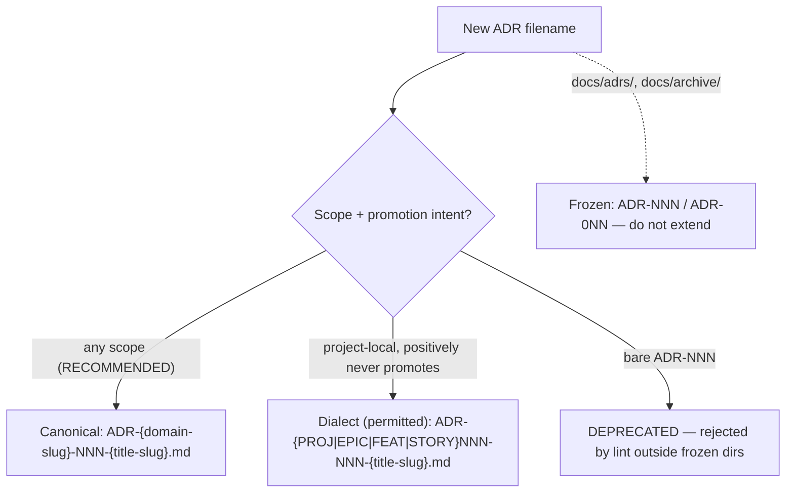
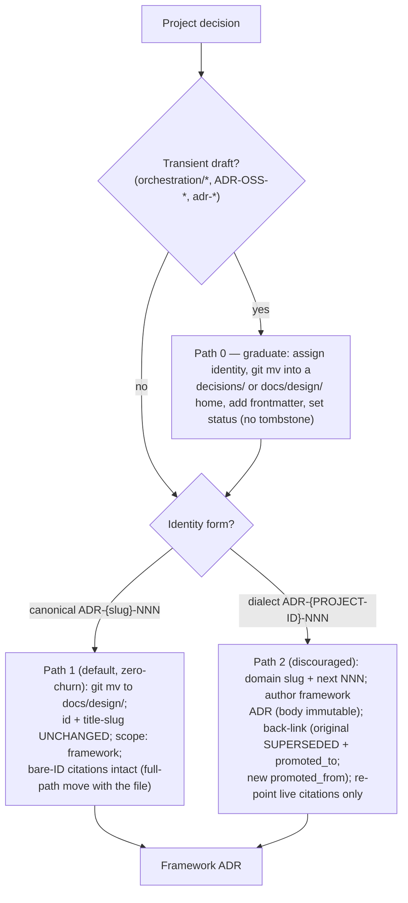
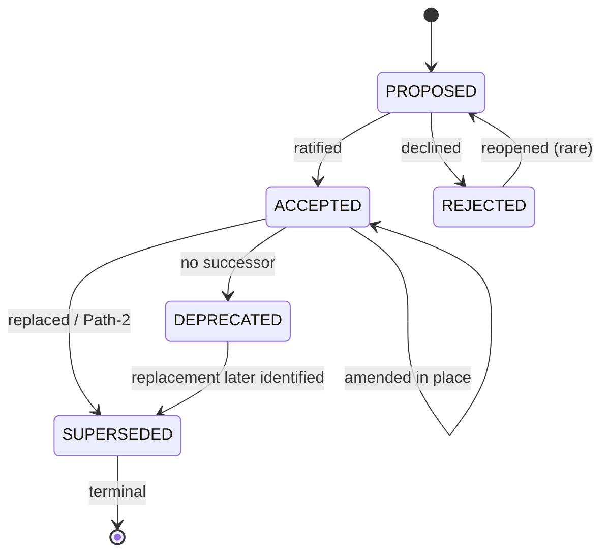

# DRAFT — Proposed `.context/rules/adr-standards.md`

> **REVIEW DRAFT of a ratified convention.** Proposed content of `.context/rules/adr-standards.md`, companion to `ADR-PROJ031-004` (canonical `ADR-adr-convention-001`). Scheme B was **ratified 2026-07-05** (FEEDBACK-LOG FU.0). On the M-2 move this content — **minus this wrapper, and minus the inline tournament-provenance tags** (`RT-*-iterN`, `FM-*-iterN`, `012-*-iter9`, …, stripped or relocated to a trailing footnote so the shipped rule is self-contained — 003-001/SM-001, the tags' glossary lives only in the parent ADR and does not travel here) — becomes `.context/rules/adr-standards.md` and auto-loads via the `.claude/rules -> ../.context/rules` directory symlink. **Tier:** MEDIUM only (SHOULD/RECOMMENDED, override with justification; dialect-permission is SOFT `MAY`); no HARD rule (ceiling 25/25). `ADR-M-###` IDs are internal, never filenames.

---

# ADR Standards

> Conventions for Architecture Decision Record (ADR) identifiers, location, promotion, superseding, and amendment. MEDIUM-tier: SHOULD/RECOMMENDED, override with documented justification. Enforced by a small deterministic L5 CI lint (5 rules), not a HARD invariant.

## Document Sections

| Section | Purpose |
|---------|---------|
| [Tier and Scope](#tier-and-scope) | What this governs and how strongly |
| [MEDIUM Standards](#medium-standards) | ADR-M-001 … ADR-M-013 |
| [ID Scheme](#id-scheme) | Canonical, dialect, deprecated, frozen grammars |
| [Canonical Location Model](#canonical-location-model) | Where each scope lives |
| [Frozen and Grandfathered Legacy](#frozen-and-grandfathered-legacy) | Do-not-extend vs valid-in-place |
| [Frontmatter Schema](#frontmatter-schema) | Provenance and relationship fields |
| [Promotion Process](#promotion-process) | Project → framework, both paths |
| [Supersede and Amend](#supersede-and-amend) | Which mechanism, when |
| [Status Vocabulary](#status-vocabulary) | Permitted lifecycle states |
| [L5 CI Lint Specification](#l5-ci-lint-specification) | The 5 deterministic checks |
| [Relationship to Worktracker DEC-NNN](#relationship-to-worktracker-dec-nnn) | Non-conflation |
| [Producer Fixes](#producer-fixes) | Template, SKILL, and agent edits |
| [References](#references) | Source traceability |
| [Changelog](#changelog) | Version history |

---

## Tier and Scope

Governs **ADRs only** — records under `docs/design/`, `projects/*/decisions/`, and the frozen legacy sets. Does **not** govern the worktracker `DEC-NNN` Decision-File entity (see [Relationship to Worktracker DEC-NNN](#relationship-to-worktracker-dec-nnn)).

All standards are **MEDIUM-tier** (SHOULD/RECOMMENDED, override with documented justification per `.context/rules/quality-enforcement.md` Tier Vocabulary). Rationale for MEDIUM: ID/location consistency is a discoverability standard, not a safety invariant, and the HARD ceiling is at 25/25.

**Enforcement story — guidance first, minimal lint second.** The guidance below delivers value with **zero tooling** — an author can follow it today. The 5-rule lint ([below](#l5-ci-lint-specification)) is a designed-not-built enhancement, not a precondition for the convention's value.

---

## MEDIUM Standards

| ID | Standard |
|----|----------|
| **ADR-M-001** | New ADRs SHOULD use **subject-encoded identity** `ADR-{domain-slug}-NNN`, `{domain-slug}` naming the subject in kebab-case, `NNN` a 3-digit per-slug sequence, never reused. Origin is a birth fact, not an identity. The frontmatter `id:` value **SHOULD exactly equal this filename-derived identity string** (RT-002-iter8); no lint in the 5-rule core checks the two agree or that `id:` is corpus-unique — a disclosed residual (**R-15** in the parent ADR's Risks register). |
| **ADR-M-002** | ADR origin SHOULD be recorded in **frontmatter** (`origin_project`, optional `origin_entity`) and SHOULD NOT appear in the identifier. |
| **ADR-M-003** | A tactical, project-local ADR the author judges *with positive certainty* will never promote **MAY** use the dialect `ADR-{PREFIX}-NNN`, `{PREFIX}` from the closed set `{PROJ\|EPIC\|FEAT\|STORY}\d{3}`. Under any uncertainty the default SHOULD be the canonical slug (scope-agnostic: free to keep, free to `git mv`). A framework-wide ADR SHOULD NOT use the dialect. (`MAY` = SOFT permission.) |
| **ADR-M-004** | New ADRs SHOULD NOT use bare `ADR-NNN`. Bare numbering is the documented collision source and is DEPRECATED. |
| **ADR-M-005** | `NNN` SHOULD be 3-digit, zero-padded, monotonic within its namespace, never reused — reversal is by supersession, not renumbering. |
| **ADR-M-006** | The separator SHOULD be a hyphen; underscores (`ADR_NNN`) SHOULD NOT be used. A `title-slug` tail MAY follow the ID. |
| **ADR-M-007** | A framework-governing ADR SHOULD live in `docs/design/`; a project ADR in `projects/PROJ-NNN-*/decisions/`. Scope is expressed by **location** (may change); identity SHOULD NOT change when location changes. |
| **ADR-M-008** | Promotion of a canonical ADR SHOULD be a pure `git mv`, no identifier change (Path 1). Only a dialect ADR SHOULD incur a rename + tombstone (Path 2). |
| **ADR-M-009** | Accepted ADRs SHOULD be treated as immutable. A minor clarification SHOULD use a dated in-body `AMENDED YYYY-MM-DD` block; a reversal SHOULD be a new superseding ADR. Separate-amendment-file style SHOULD NOT be used. |
| **ADR-M-010** | ADR status SHOULD be drawn from `PROPOSED \| ACCEPTED \| REJECTED \| DEPRECATED \| SUPERSEDED`; new ADRs default to `PROPOSED`. |
| **ADR-M-011** | ADRs are the one Jerry class whose identifier encodes **subject, not scope**, because they are the one class whose **scope is mutable**. State this ontology exception wherever ADR conventions are taught. |
| **ADR-M-012** | Legacy/archived and existing scope-prefixed project ADRs SHOULD be grandfathered in place; SHOULD NOT be renumbered in a big-bang migration. |
| **ADR-M-013** | Every new ADR SHOULD declare `scope` (`framework \| project`) in frontmatter at authoring time. When uncertain, default to `scope: project` with a **canonical domain-slug identity** (promotes for free), NOT the dialect. |

---

## ID Scheme



*ID scheme (see ADR Fig. 1): canonical is the default; dialect is the discouraged local escape hatch; bare is deprecated; frozen sets are closed.*

A filename PASSES if it matches **canonical OR dialect** (a lowercase-only regex would wrongly reject grandfathered uppercase dialect ADRs):

- **Canonical:** `^ADR-[a-z][a-z0-9]*(-[a-z0-9]+)*-\d{3}(-[a-z0-9-]+)?\.md$` — the leading slug token has to begin with a letter (so a *new* `ADR-150-001` is not a canonical slug; the pre-existing one PASSES L-1 as grandfather-exempt on the baseline — see the single authoritative [D-4 exemption rule](../decisions/ADR-PROJ031-004-adr-identifier-convention.md#decision)).
- **Dialect:** `^ADR-(PROJ|EPIC|FEAT|STORY)\d{3}-\d{3}(-[a-z0-9-]+)?\.md$` — closed prefix set, matching ADR-M-003. Bare-detection: `^ADR-\d`.

---

## Canonical Location Model

| Scope | Canonical home | ID form | State |
|---|---|---|---|
| Framework | `docs/design/` | `ADR-{domain-slug}-NNN` | Active |
| Project (recommended) | `projects/PROJ-NNN-*/decisions/` | `ADR-{domain-slug}-NNN` | Active |
| Repository-based project (alt topology) | `{RepositoryRoot}/decisions/` | `ADR-{domain-slug}-NNN` | Active |
| Project (permitted dialect) | `projects/PROJ-NNN-*/decisions/` | `ADR-PROJ{NNN}-NNN` | Active (dialect) |
| Entity-embedded (permitted) | `projects/.../work/.../{ENTITY}/` | `ADR-{PROJ\|EPIC\|FEAT\|STORY}NNN-NNN` | Active (dialect) |
| Legacy (transcript) | `docs/adrs/` | `ADR-NNN` | Frozen |
| Archived | `docs/archive/.../decisions/` | `ADR-0NN` | Frozen |
| Orchestration drafts | `projects/*/orchestration/.../` | `ADR-OSS-NNN`, `adr-*` | Transient (non-canonical) |

The worktracker SSOT defines two `ONE-OF` topologies (project-based and repository-based). The canonical domain-slug form is **topology-agnostic**; the dialect presumes the project-based tree and SHOULD NOT be used in repository-based repos. **Entity-prefix dialect in a project `decisions/` dir (002-001/CV-001-iter010):** the two pre-existing `ADR-EPIC002-001/002` live in `PROJ-001-oss-release/decisions/` (an `EPIC` prefix in a *project* `decisions/` dir, not an entity `work/.../{ENTITY}/` dir) — grandfathered legacy instances on the ratification baseline, L-4-exempt; no fresh *permitted* row is added for this pairing (new entity-prefix dialects SHOULD use the `work/` home or a canonical slug). `docs/decisions/` SHOULD NOT be introduced (a MADR name inherited by accident). RECOMMENDED: add `docs/design/README.md` (framework index) and `docs/adrs/README.md` (frozen banner).

---

## Frozen and Grandfathered Legacy

**Frozen** sets (`docs/adrs/`, `docs/archive/`) are closed to new entries **by convention (SHOULD-NOT extend)** — this is *not* lint-enforced: L-9 was removed in the subtraction pass and L-2 exempts frozen dirs, so a new bare file added under them (including a colliding one) is a disclosed residual (**R-14** in the parent ADR's Risks register), not a lint stop. **Grandfathered** dialect families (`PROJ010`×6/`PROJ022`×2/`PROJ031`×4/`EPIC002`×2/`STORY015`×1/`150`×1 = the **16-file whole dialect corpus**, all locations) remain valid in place, extendable within their dialect; re-slug only if promoted. **PROJ-014's bare `ADR-001..004` are transient bare drafts** (deprecated Scheme-E numbering, **not** a recognized dialect) — grandfathered only as historical artifacts, to be re-slugged if ever promoted. Of that 16-file dialect corpus + 3 canonical ADRs, the **18 reachable by the `projects/*/decisions/` + `docs/design/` scan path** (16 dialect − 1 out-of-scan `ADR-STORY015-001` = 15 dialect-reachable, + 3 canonical) pass the grandfather regression test — see the single authoritative [grandfather-count reconciliation](../decisions/ADR-PROJ031-004-adr-identifier-convention.md#decision) (parent ADR D-4, FM-001-iter8); the entity-embedded `ADR-STORY015-001` is out-of-scan (R-10).

---

## Frontmatter Schema

```yaml
---
id: ADR-plugin-distribution-001     # canonical subject identity (ADR-M-001)
type: adr
status: PROPOSED                     # ADR-M-010
scope: framework                     # framework | project (ADR-M-007/M-013)
origin_project: PROJ-031             # birth project — immutable (ADR-M-002)
origin_entity: EPIC-003              # optional finer origin
created: 2026-07-05
supersedes: []
superseded_by: null
amends: null
amended_by: []
promoted_from: null                  # set on Path-2 promotion
promoted_to: null
canonical_id: null                   # OPTIONAL advisory (a dialect ADR MAY declare its Path-2 destination)
---
```

The lint parses this YAML `---` block (distinct from `jerry ast frontmatter`, which parses blockquote frontmatter; both coexist). `canonical_id` is advisory-only.

---

## Promotion Process

Elevates a project decision to framework scope — two paths plus a Path-0 graduation:



*Promotion flow (see ADR Fig. 3). Path-2 re-point: `grep -rl "ADR-PROJ{NNN}-NNN"` **in live documents only** (exclude append-only history — CHANGELOGs, commits, releases; optionally sweep GitHub Issues, which the lint does not scan). Full-path Path-1 citations move with the file (see the [descoped note](#l5-ci-lint-specification)).*

A `DEC-NNN` SHOULD NOT be renamed into an ADR; author a new ADR and cross-link instead.

**AE-004 scoping.** A Path-1 promotion changes only **location** + the `scope` field (immutable body) — a governed lifecycle move at the **C3** floor; it does not trip AE-004's C4. A **Path-2 promotion flips a baselined ADR's `status` to `SUPERSEDED`** — a supersession-class change to a baselined ADR, so it **IS subject to AE-004 auto-C4**, as is any edit changing a baselined ADR's decision content.

---

## Supersede and Amend

| Situation | Mechanism | Identity | Status | Links |
|---|---|---|---|---|
| Minor clarification (decision unchanged) | In-body dated `**AMENDED YYYY-MM-DD:**` block | Same ID | Stays `ACCEPTED` | `amends`/`amended_by` |
| Decision reversal / replacement | New superseding ADR; the old body SHOULD NOT be edited | New ID | Old → `SUPERSEDED`; new → `ACCEPTED` | `superseded_by` ↔ `supersedes` |
| Scope elevation | Promotion (Path 1/2) | Path 1: unchanged; Path 2: new slug | Path 2 old → `SUPERSEDED` | `promoted_from`/`promoted_to` |

An amendment SHOULD NOT change an ADR's `scope`, `origin_project`/`origin_entity`, or location — those transitions belong to the Promotion Process, and origin is an immutable birth fact.

**Honest limit ([INHERENT]).** No rule in the minimal core detects an **in-place frontmatter mutation** of an unmoved file (e.g. editing `scope:` as a "minor clarification"): nothing moves, no ID changes, no citation goes stale, so there is nothing structural to catch. This boundary rests on SHOULD-NOT guidance and immutability discipline, not on a lint — stated plainly rather than backed by a mechanism that cannot see the violation.

**Concurrent-supersession race ([INHERENT], FM-003-iter8 — disclosed, no lint).** `superseded_by` is single-valued and `supersedes`/`amends`/`amended_by` are unchecked by L-7 (R-11), so two branches that each author a *different* successor for the *same* predecessor collide only at merge — last-write-wins on `superseded_by`, silently orphaning the other successor. This is the supersession-lifecycle analog of the creation-time race R-6; mitigated by PR-review discipline, not a supersession-graph checker (which would re-add machinery the doctrine declines). Registered as **R-17** in the parent ADR's Risks register.

---

## Status Vocabulary

`PROPOSED` (not in force; default) · `ACCEPTED` (in effect) · `REJECTED` (declined) · `DEPRECATED` (no longer applies, no specific successor) · `SUPERSEDED` (replaced by a specific newer ADR; also terminal after Path-2).



*Lifecycle (see ADR Fig. 4). **`SUPERSEDED` is the one terminal state** (a revived decision is a new ADR). `DEPRECATED` has no forward-link field by design — it names no successor — but is **not** terminal: acquiring a specific replacement moves it to `SUPERSEDED` (which carries the link).*

---

## L5 CI Lint Specification

> **Claim-Status: DESIGNED, NOT BUILT.** As of 2026-07-05, `scripts/lint_adr_convention.py` does not exist (Glob-verified). Until it ships with a green grandfather regression test wired into CI (Migration-Plan M-6), **enforcement is advisory-only** and the guidance stands on its own — following the [Claim-Status Convention](../decisions/ADR-PROJ031-003-credential-protection-supply-chain.md#claim-status-convention-p-022--foundational) precedent (designed-but-unvalidated controls are labeled, never asserted as achieved).

Deterministic, zero-token, run via `uv run` in CI. **MEDIUM-tier override:** a FAIL is overridable with a documented justification in the PR description (the standard MEDIUM mechanism) — no waiver ledger, no CODEOWNERS gate, no "non-bypassable" rule. The collision/grammar rules are rarely overridden because a compliant `NNN`/slug is always available.

**The 5-rule core (all FAIL, all overridable-with-justification):**

> **Reading the "must" in the rules below (CC-001 scoping).** Where a rule row says a file "must"/"must not" match a pattern, that is the **lint's own pass/fail trigger condition** (tool mechanics), not a HARD author obligation — the author-facing tier stays MEDIUM (SHOULD, override-with-justification).

| Rule | Checks (git-added/modified files; pre-adoption grandfathered) |
|---|---|
| **L-1 Grammar** | Filename matches **canonical OR dialect OR is present on the ratification-time grandfather baseline** ([ID Scheme](#id-scheme); baseline per the single authoritative [D-4 exemption rule](../decisions/ADR-PROJ031-004-adr-identifier-convention.md#decision)) — a *newly-minted* malformed or numeric-leading slug (`ADR-150-001`) is rejected, but the **pre-existing `ADR-150-001` on the baseline PASSES via the third disjunct** (this is why the grandfather regression test can go green). It does **not** structurally reject a lowercase slug that case-folds to a dialect prefix (`ADR-proj031-001` shadowing `ADR-PROJ031-001`) — that is SHOULD-NOT guidance, a disclosed residual (R-9), not a lint stop. `projects/*/decisions/`, `docs/design/`. |
| **L-2 No new bare** | A git-added file **that is absent from the ratification-time grandfather baseline** must not match `^ADR-\d`, anywhere except frozen dirs (`docs/adrs/`, `docs/archive/`). The "absent from the baseline" scoping ([D-4 exemption rule](../decisions/ADR-PROJ031-004-adr-identifier-convention.md#decision)) prevents a false positive on a later `git`-modify of a *pre-existing* non-frozen bare draft (e.g. PROJ-014's `ADR-001..004`). |
| **L-3 No duplicate ID** | Extract `{slug}-NNN` (canonical **and** uppercase-dialect) of all non-frozen ADRs; `sort \| uniq -d` must be empty. **Across the scanned roots** (`projects/*/decisions/` + `docs/design/`) — the repository-based `{RepositoryRoot}/decisions/` home is out-of-scan (R-10); cross-installation collision out-of-scan (R-18); title-slug-tail extraction caveat R-13. |
| **L-4 ID↔location** | For a file **absent from the ratification-time grandfather baseline**, a `PROJ{NNN}`/`EPIC{NNN}`/`FEAT{NNN}`/`STORY{NNN}` dialect prefix (full closed set) matches its containing project/entity dir. **Baseline files are exempt, not misfired** ([D-4 exemption rule](../decisions/ADR-PROJ031-004-adr-identifier-convention.md#decision)): the two pre-existing `ADR-EPIC002-001/002` in `PROJ-001-oss-release/decisions/` (an `EPIC` prefix in a project `decisions/` dir) are on the baseline, so L-4 does not fire on them. **Project-based topology only — zero operative effect under the repository-based topology** (no `projects/` dir to match). |
| **L-7 Relationship target resolves** | `superseded_by`/`promoted_to`/`promoted_from` targets resolve to an existing ADR — catches a **forward-looking** half-completed Path-2 that sets a relationship field but leaves its target missing. **Not** the historical `ADR-PROJ007-*` case (those files no longer exist to inspect — that was free-text citation staleness, R-B). Existence only, not bidirectional/semantic correctness; `supersedes`/`amends`/`amended_by` are **not** checked — a disclosed 3-of-6 asymmetry (R-11). Scanned roots only (`{RepositoryRoot}/decisions/` out-of-scan — R-10). **Prospective coverage only (FM-002-iter8):** L-7 can inspect only ADRs that carry a YAML `---` relationship block, so its real surface against today's corpus is empty — this project's own executed chain `ADR-PROJ031-002`→`003` is blockquote-only, no YAML (verified 2026-07-06); disclosed as R-16. |

A **grandfather regression test** must be green before the lint ships: the **18 files reachable by the two-clause scan path** (nested `*/decisions/*` + flat `docs/design/ADR-*.md`, RT-001-iter9: 15 dialect files in `decisions/` dirs + 3 canonical framework ADRs — per the single authoritative [grandfather-count reconciliation](../decisions/ADR-PROJ031-004-adr-identifier-convention.md#decision), parent ADR D-4) pass L-1 — the dry-run-against-the-real-corpus step whose absence caused an earlier lowercase-only defect. The earlier single `-path '*/decisions/*'` reached only the 15 dialect files, excluding the 3 flat `docs/design/` framework ADRs (RT-001-iter9, filesystem-verified 2026-07-06); the pre-flight `find` below is the corrected two-clause form. The 1 entity-embedded `ADR-STORY015-001` (in `work/.../STORY-015.../`, no `decisions/` segment) is **outside the `projects/*/decisions/` scan path** — grandfathered in place but out-of-scan, a disclosed residual (R-10), not lint-covered.

**How "pre-adoption grandfathered" is resolved on a *subsequent* edit (IN-001-iter8 — L-1 spec wording, not a sixth rule).** The per-rule note "(git-added/modified files; pre-adoption grandfathered)" is resolved against a **static baseline fixed at ratification time (2026-07-05/06), not lint-ship time**: the enumerable set of ADR files present as of ratification (the **18 reachable above plus the out-of-scan `ADR-STORY015-001`**, and — for L-2 false-positive-prevention — any other pre-existing non-frozen bare/transient ADR such as PROJ-014's `ADR-001..004`; the 18-file subset is what the L-1 regression runs), captured **once** as a data list in M-6 — a one-time artifact, not standing machinery. **Baseline capture procedure — who / where / what-changes-it (004-002 · 012-005 · 013-002, iter-010):** governance/owner captures it **at ratification** (one-time) as a checked-in artifact `scripts/adr-grandfather-baseline-20260705.txt` (one path per line, from the two-clause `find`) **plus** the ratification commit SHA recorded in the [parent ADR Changelog](../decisions/ADR-PROJ031-004-adr-identifier-convention.md#changelog); M-6 reads that pinned list, **not** a live `find` over the working tree at build time. It changes only via a superseding/amending ADR that regenerates the artifact against a newly-pinned commit — never a silent re-scan. This makes the ratification anchor executable (not merely stateable), closing the policy-without-procedure gap without a new rule. Anchoring to ratification (not the undated lint-ship, M-6) prevents a growing post-ratification amnesty window (012-003-iter9): a post-ratification *dialect* ID passes L-1 as a valid dialect on its own merits, while a post-ratification *bare/numeric-leading* ID is held to L-1/L-2 as new, not grandfathered. A git-modified file **already on that baseline** is grandfathered-exempt from L-1/L-2, **not** treated as newly minted. This closes the gap the deleted L-12 allowlist covered: without it, the numeric-leading `ADR-150-001` (matching *neither* canonical nor dialect grammar) would FAIL L-1 and risk a false-positive L-2 bare flag on its next `git`-modify (a typo fix, an `AMENDED` block). Only files **absent** from the baseline are held to L-1/L-2 as "new," making the "18 files pass L-1" claim durable across future edits, not merely at the initial dry run. No rule added — the core stays L-1/L-2/L-3/L-4/L-7.

**Pre-flight collision check (runnable today, zero tooling)** — exactly what L-3 runs in CI:

```bash
find projects docs/design -name 'ADR-*.md' \
  \( -path '*/decisions/*' -o -path '*docs/design/ADR-*.md' \) \
  -not -path '*/docs/adrs/*' -not -path '*/docs/archive/*' \
  | sed -E 's#.*/(ADR-.*)\.md#\1#' \
  | grep -E '^ADR-[A-Za-z0-9-]+-[0-9]{3}' \
  | sed -E 's/^(ADR-[A-Za-z0-9-]+-[0-9]{3}).*/\1/' \
  | sort | uniq -d
# Two-clause scan (RT-001-iter9): `*/decisions/*` reaches the 15 project dialect ADRs; the flat
#   `docs/design/ADR-*.md` clause reaches the 3 canonical framework ADRs = all 18 reachable
#   (filesystem-verified 2026-07-06). Single `-path '*/decisions/*'` returned only 15 (docs/design excluded).
#   Repository-based topology: substitute `${RepositoryRoot}/decisions` for `projects` (RT-002-iter9).
# [A-Za-z] covers canonical (lowercase-slug) AND uppercase-dialect (ADR-PROJ031-005) IDs.
# R-13 (empirically confirmed): the greedy extraction over-captures a title-slug tail carrying a
#   standalone 3-digit token (e.g. -443-, -2021-); SHOULD-NOT use such tails. No regex is provably
#   complete here (the grammar admits numeric tokens), so this is disclosed guidance, not a lint fix.
# Empty = no collision. Any line = a duplicate identity to resolve before commit.
```

**Descoped, honestly (not phased, not committed).** Left out of the minimal core to keep it buildable by a solo maintainer and free of overclaimed coverage: provenance/framework-home WARNs, provenance-correctness checks, **repo-wide free-text citation scanning** (incl. GitHub Issues, full-path citations, config), taxonomy-synonymy matching, producer-drift monitoring, supersession separation-of-duties, repository-topology dialect rejection, entity-embedded-ADR scanning (R-10), and **cross-installation collision detection** across independent Jerry installs (the [INHERENT] residual R-18 in the parent ADR — single-tree lint/pre-flight cannot see a slug claimed in a separate installation; manual union-of-trees check at contribution-back time). The citation-scan omission is an **[INHERENT] residual R-B** — the core detects only structural frontmatter links; Path-1's ID-stable move avoids the churn for the bare-ID majority, and a manual `grep`/`gh issue list` sweep is the fallback (**owner: governance; cadence: at each Path-1/Path-2 promotion**). None is promised for a later release; a future amendment MAY add a single targeted rule if a gap causes real pain. ("Not committed" scopes descoped *lint rules* only — the parent ADR's R-6/R-7/PM-009 residual-monitoring commitments are a separate, watched category; DA-005-iter7.)

*Notes (P-022): L-5/L-6 were retired in the subtraction pass; the 5 retained IDs keep their original numbers so changelog cross-refs stay resolvable (FM-007). L1 budget (CC-002): the SSOT's ~12,500-token L1 figure is a curated/re-injected subset, not a raw corpus sum. This file measures **~6.47k tokens / 283 lines** (`wc` 2026-07-06, this row counted) — above the ~2.5k soft target but a bounded, comparable size; per-iteration history is in the [Changelog](#changelog).*

---

## Relationship to Worktracker DEC-NNN

The worktracker `DEC-NNN` "Decision File" entity is distinct: permanently parent-scoped, never migrates, correctly scope-prefixed. A `DEC-NNN` SHOULD NOT be renamed into an ADR; architectural decisions SHOULD be authored as ADRs and cross-linked. The lint keys strictly on the `ADR-` filename prefix, so a co-located `DEC-*` file is not linted as an ADR.

---

## Producer Fixes

One-time edits on ratification (parent ADR M-3/M-4/M-12); **not applied by this draft (P-020)**. Until applied, the producing agent emits non-canonical IDs — a **designed-not-built residual**, disclosed, not gated behind machinery.

- **`docs/knowledge/exemplars/templates/adr.md`:** title `# ADR-{NUMBER}` → `# ADR-{DOMAIN-SLUG}-{NNN}`; add `REJECTED`; add the YAML frontmatter block; dangling `docs/decisions/` path → real home.
- **`skills/architecture/SKILL.md`:** `ADR_NNN` → `ADR-{domain-slug}-NNN`; output location project-first or framework, not hardcoded.
- **`skills/problem-solving/agents/ps-architect.md` (Fix 3):** title and output grammar → canonical `ADR-{domain-slug}-{NNN}-*.md` (PS linkage → frontmatter); phantom `templates/adr.md`/`python3 scripts/cli.py` → real path and `uv run jerry` (H-05); default the authored ID to the canonical slug.

Also (parent ADR M-14): document `decisions/` (both topologies) in the worktracker scaffold SSOT.

---

## References

| Source | Content |
|--------|---------|
| `ADR-PROJ031-004` (canonical `ADR-adr-convention-001`) | Parent decision, rationale, sensitivity analysis, migration plan, and the **full residual register** (R-1…R-17, R-A/R-B/R-C) — the `R-N` shorthand used above resolves there |
| `.context/rules/quality-enforcement.md` | Tier vocabulary; HARD ceiling 25/25 → MEDIUM mandate |
| `ADR-PROJ031-003` | Claim-Status Convention precedent (designed-but-not-built labeling) |
| `skills/worktracker/rules/worktracker-directory-structure.md` | `DEC-NNN` entity (non-conflation); two topologies |
| `projects/PROJ-031-cowork-skeleton/FEEDBACK-LOG.md` (FU.0) | Scheme B ratification, 2026-07-05 |

---

## Changelog

| Version | Date | Change |
|---------|------|--------|
| 1.0–1.5 | 2026-07-02 | Iterative adversarial remediation (see parent ADR Changelog 1.0–1.6 and `adversary/iteration-00N/` for the full trail). |
| **1.7** | **2026-07-05** | **Ratification fold-in + subtraction pass (FU.1).** Scheme B ratified (FU.0); review-draft framing → ratified. Lint cut 18→**5 rules** (L-1/L-2/L-3/L-4/L-7). **Deleted outright:** waiver ledger, two-tier ratification, all CODEOWNERS-dependent and "non-bypassable" language, 13 lower-value rules. Override reverts to the standard MEDIUM documented-justification path; `PERMITTED` pseudo-tier removed; dialect permission is SOFT `MAY`. Descoped items in one honest note; citation-staleness and in-place amendment mutation disclosed as [INHERENT] residuals; AE-004 Path-2 scoping explicit; token budget ~10.3k→**~3.3k** (233 lines; `wc -w`×1.35 measured — ~30% above the ~2.5k soft target but under the 250–350-line guidance; the residual is irreducible normative content, honestly disclosed rather than cut into an incomplete rule). Disposition: `../orchestration/adr-convention-20260702-001/subtraction-pass-notes.md`. |
| **1.8** | **2026-07-05** | **Subtraction-doctrine pass 2 (iteration-6 remediation).** Overclaim-correction, no new machinery. **FIX-BUG:** L-3 dedup one-liner `[a-z0-9-]`→`[A-Za-z0-9-]` (grep+sed) so it actually catches dialect-ID duplicates (RT-101/DA-001) — a character-class widening of the existing rule, not a new mechanism. **DELETE:** false "case-folded look-alikes are rejected" claim from L-1 (RT-102) — disclosed as R-9 guidance. **EDIT:** frozen-dir "closed to new entries" → "by convention, not lint-enforced" (DA-002); PROJ-014 bare drafts separated from grandfathered dialects (FM-004); grandfather test narrowed 19→18 reachable, STORY015 disclosed out-of-scan R-10 (FM-002); lowercase "never" (ADR-M-002, DEC-NNN, Supersede table) → SHOULD-NOT (CC-001); L5 preamble scopes mechanism "must". **DISCLOSE:** L-7 3-of-6 field + existence-only asymmetry R-11 (FM-003/RT-103); R-B owner+cadence (FM-009); L-5/L-6 numbering footnote (FM-007); L1-aggregate budget note (CC-002); line count corrected 232→233 (CC-003). Full disposition: `../orchestration/adr-convention-20260702-001/adversary/iteration-006/remediation-notes.md`. |
| **1.9** | **2026-07-06** | **Subtraction-doctrine pass 3 (iteration-7) — overclaim-correction, no new machinery.** DELETE-OVERCLAIM: `DEPRECATED` removed from "terminal states" (FM-001); L-7's historical `ADR-PROJ007-*` attribution → forward-orphan-only (CC-001); unqualified "Repo-wide" on L-3/L-7 → scanned-root scope + `{RepositoryRoot}/decisions/` out-of-scan (RT-001). CORRECT: `FEAT{NNN}` added to L-4 (FM-003); L-4 zero-effect under repository topology (DA-004). DISCLOSE: R-13 (L-3 title-slug-tail extraction false-negative, empirically confirmed; SHOULD-NOT guidance, awk rewrite tested-and-declined); "not committed" scoped to lint rules vs the parent ADR's R-6/R-7/PM-009 monitoring (DA-005). RECONCILE (CV-001): self-measurement set to the single current figure below. No rule/ledger/gate added. Full disposition: `../orchestration/adr-convention-20260702-001/adversary/iteration-007/remediation-notes.md`. |
| **1.10** | **2026-07-06** | **Subtraction-doctrine pass 4 (iteration-8) — text/disclosure only, no new machinery; the 5-rule core is unchanged.** **EDIT:** ADR-M-001 gained the `id:`-SHOULD-equal-filename clause (RT-002/RT-001-iter8, disclosed as R-15); L-1 spec gained the grandfather-baseline clause so a later-edited legacy file (`ADR-150-001`) is exempt rather than new-bare, closing the deleted-L-12 gap by wording (IN-001); grandfather counts aligned to the single authoritative parent-ADR [D-4 reconciliation](../decisions/ADR-PROJ031-004-adr-identifier-convention.md#decision) (16 whole dialect corpus / 15 reachable / 3 canonical / 18 regression; FM-001-iter8); L-7 row disclosed as forward-looking with zero real YAML targets in the blockquote-only `ADR-PROJ031-002`→`003` chain (FM-002-iter8, R-16). **DISCLOSE:** frozen-dir new-file collision residual reference (DA-002, R-14); concurrent-supersession race in Supersede-and-Amend (FM-003-iter8, R-17); residual register range updated R-1…R-17. **RE-MEASURED (honest):** ~4.3k/242 → **~5.0k tokens / 247 lines** (`wc` 2026-07-06, ~3.7k words × 1.35), still within the 250-line guidance, above the ~2.5k soft target — disclosed. Full disposition: `../orchestration/adr-convention-20260702-001/adversary/iteration-008/post-tournament-fix-notes.md`. |
| **1.11** | **2026-07-06** | **Owner-first remediation after iteration-9 (verified-protocol score 0.86, gate 0.95) — only the 5 panel-VERIFIED Criticals fixed; text/disclosure only, no new machinery; 5-rule core unchanged.** **RT-001 (command correction):** the pre-flight/L-3 `find` corrected from single `-path '*/decisions/*'` (reached only 15 files) to a **two-clause scan** `\( -path '*/decisions/*' -o -path '*docs/design/ADR-*.md' \)` reaching all **18** (15 dialect + 3 flat `docs/design/` framework ADRs), filesystem-verified 2026-07-06 — making the twice-stated "18 reachable" claim true (a character-of-the-existing-command fix, not a new rule, parallel to the iter-6 regex precedent). **RT-002 (scope-correction):** the pre-flight command comment now names the `${RepositoryRoot}/decisions` substitution required for the repository-based topology (the one-liner as written does not reach that home). **012-003 (temporal anchor):** the grandfather baseline re-anchored from "when the lint ships" to **ratification time (2026-07-05/06)**, closing the post-ratification amnesty-window inconsistency with D-4. Two-clause + ratification-anchor disclosures are the only changes here. **RE-MEASURED (honest):** ~5.0k/247 → **~5.5k tokens / 253 lines** (`wc` 2026-07-06, ~4.1k words × 1.35, this row counted), now marginally above the 250-line self-guidance (within the original ~250–350 range), above the ~2.5k soft target — disclosed. DA-002 and 012-001 were ADR-only fixes (Migration Plan M-2 link enumeration; Downstream-disclosure caveat). Full disposition: `../orchestration/adr-convention-20260702-001/adversary/iteration-009/remediation-notes.md`. |
| **1.12** | **2026-07-06** | **Post-ceiling artifact-hygiene pass after iteration-010 (VERIFIED-CRITICALS protocol; score 0.88, gate 0.95; zero VERIFIED Criticals — no re-score claimed).** Text/disclosure only; the **5-rule core (L-1/L-2/L-3/L-4/L-7) is unchanged**. **Cluster 1 (row-vs-grandfather seam):** L-1 gains the third disjunct "canonical OR dialect OR present on the ratification-time grandfather baseline" (referencing the single authoritative parent-ADR [D-4 exemption rule](../decisions/ADR-PROJ031-004-adr-identifier-convention.md#decision)); L-2 scoped to files **absent from the baseline** (no false-positive on PROJ-014's pre-existing bare drafts); L-4 gains the `EPIC002`-in-project-`decisions/` grandfather-exempt note; ID-Scheme grandfathered gloss + Location Model note reference D-4. **Cluster 2 (baseline procedure):** the grandfather-baseline clause gains the who/where/what-changes-it capture procedure — checked-in `scripts/adr-grandfather-baseline-20260705.txt` + the ratification commit SHA, changed only via a superseding/amending ADR. **Cluster 4:** cross-installation collision (parent-ADR residual **R-18**) added to the L-3 row scope + the descoped note. **Cluster 5 (003-001/SM-001):** the wrapper note now names inline tournament-tag stripping/relocation on the M-2 move, so the shipped `.context/rules/adr-standards.md` is self-contained (its tag glossary lives only in the parent ADR and does not travel). **RE-MEASURED (honest):** 253 → **254 lines / ~4.76k words / ~6.4k tokens** (`wc` 2026-07-06, this self-referential row counted) — above the ~2.5k soft target and marginally above the 250-line guidance; the +1 line and word growth are irreducible honesty-disclosure content (the D-4 exemption references, the baseline capture procedure, R-18, and the tag-stripping clause) that cannot be cut without dropping a disclosure. Full disposition: `../orchestration/adr-convention-20260702-001/adversary/iteration-010/post-ceiling-fix-notes.md`. |
| **1.13** | **2026-07-06** | **Visual layer per FU.10 — prose consolidated into diagrams; representation only, zero content-decision changes; 5-rule core (L-1…L-7) unchanged.** Added **3 compact Mermaid diagrams** (each below its section, one-line caption): ID-scheme tree ([ID Scheme](#id-scheme)) replacing the form-bullets; promotion flow ([Promotion Process](#promotion-process)) replacing the Path 0/1/2 paragraphs; lifecycle machine ([Status Vocabulary](#status-vocabulary)) replacing the `Transitions:` sentence. The bloated size-note was compressed (FM-007/CC-002 kept) to offset the diagrams. Valid `mermaid`; no `##` section changed (H-23 nav intact). **RE-MEASURED (`wc`):** 254 lines / 4,757 words (~6.42k tokens) → **283 lines / 4,792 words (~6.47k tokens)**, net **+35 words (+0.7%, flat)** — 3 diagrams offset by the replaced prose + size-note compression. Notes: `../orchestration/adr-convention-20260702-001/visual-layer-notes.md`. |

*Proposed home on ratification: `.context/rules/adr-standards.md` · Tier: MEDIUM only · No HARD rule added.*
