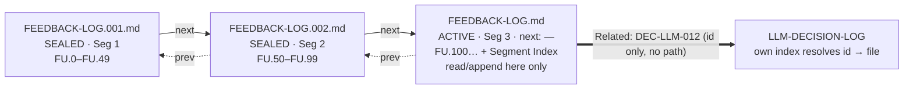

# Design: FEEDBACK-LOG + LLM-DECISION-LOG Jerry Convention

> **PS Context:** PROJ-031-cowork-skeleton · ps-architect (convergent, opus) · Design for user requirement **FU.2** (2026-07-05).
> **Status:** DRAFT for user sign-off. P-020: nothing here writes into framework paths; all artifacts land under `projects/PROJ-031-cowork-skeleton/`. Install is AE-002/AE-003 auto-C3 (adversary gate) **after** approval.
> **Inputs:** `research/feedback-decision-log-research.md` (verbatim [internal-kb] rules + Jerry automation inventory), the two bootstrap logs (`FEEDBACK-LOG.md`, `LLM-DECISION-LOG.md`), `.context/rules/quality-enforcement.md` (HARD ceiling 25/25 → this convention MUST be MEDIUM-tier), `.context/rules/markdown-navigation-standards.md` (H-23).
> **Method:** Direct extraction. Quotes carry paths; inference is labelled `[INFERENCE]`.

## Navigation

| Section | Purpose |
|---------|---------|
| [L0: Executive Summary](#l0-executive-summary) | What we are building + the FU.5/6/8 revision and improvements over [internal-kb] |
| [L1: Full Design](#l1-full-design) | Schemas, id scheme, capture triggers, scoping, automation |
| [L1.1 FEEDBACK-LOG](#l11-feedback-log) | Entry schema, id scheme, disposition, triggers, scoping |
| [L1.2 LLM-DECISION-LOG](#l12-llm-decision-log) | Entry schema, verbatim tradeoff, DEC/ADR boundary, scoping |
| [L1.3 Automation](#l13-automation-hook-assisted-capture) | Automatable metadata + hook-assisted design (design-only) |
| [L1.4 Segment Rotation](#l14-segment-rotation-fu5) | Capped-collection linked-list for log growth (FU.5) |
| [L2: Governance & Migration](#l2-governance--migration) | MEDIUM rule file, L5 lint, H-32 interplay, adoption plan |
| [Improvement Ledger](#improvement-ledger-vs-internal-kb) | Per-item [internal-kb]→Jerry rationale |
| [Proposed Defaults (Pending Ratification)](#proposed-defaults-pending-ratification) | Q1–Q5 with PROPOSED-DEFAULTs (Q5 = disclosed residual) |
| [UX Findings Disposition](#ux-findings-disposition) | Fold/rebut of the heuristic evaluation |
| [Staged Artifacts](#staged-artifacts) | Drafts ready to install post-approval |
| [Revision Changelog](#revision-changelog) | Round-by-round changes |
| [References](#references) | Source paths |

---

## L0: Executive Summary

We are turning an un-codified, entirely-manual [internal-kb] pattern into a real, lightweight Jerry convention: **two append-only markdown ledgers** so that user feedback and human↔LLM decisions, **once captured, survive** context compaction, session boundaries, and model swaps. (Scope note, three explicit boundaries: (i) the ledgers persist *what is logged*; they do not by themselves guarantee that every turn gets logged — capture stays a **MEDIUM (SHOULD)** discipline until the fail-open hook of [Q3](#proposed-defaults-pending-ratification) ships (see L1.3). **There is no detector for a turn that *should* have been logged but was not** — a disclosed residual, now elevated to an explicit ratification item ([Q5](#proposed-defaults-pending-ratification)) so it carries the same P-020 visibility as Q1–Q4. (ii) **"Survive" means *once appended AND committed*.** An uncommitted append carries the same exposure as any other uncommitted change in the repo — a `git checkout`/`clean`/`reset` before the next commit erases it, with no backstop — so the standing commit-cadence directive (`FEEDBACK-LOG.md` FU.3) is the current sole mitigation and SHOULD fire at least once per session that touched either log. (iii) **Validated scope is a single operator per log**; team / multi-writer / concurrent-session use is an explicit out-of-scope extension (see L1.1).)

- **FEEDBACK-LOG** is the append target for every user feedback / follow-up item **that gets logged** (capture itself is a MEDIUM-tier discipline — scope note (i) above): the operator's text **verbatim** (typos preserved, secrets/PII excepted — see the redaction carve-out in L1.1) with an assistant summary, a 4-state disposition (`OPEN / IN-PROGRESS / DONE / WONTFIX`), and machine-stampable provenance (session, model-per-turn, turn anchor, source channel). Ids are **logger-assigned** (the operator's turn/document-local label is kept as an alias — FU.6); the file is a **capped collection** that rotates into linked segments so **each segment** stays within the LLM's read limit (per-segment capacity drifts *down* as the in-file index grows at scale — L1.4; FU.5).
- **LLM-DECISION-LOG** is the append target for every decision-bearing exchange **that is captured**: user verbatim (full) + assistant verbatim (excerpt + transcript pointer — see the ratification question), summary/consequences, and a crisp boundary to worktracker `DEC-NNN` and ADRs (cross-link, never duplicate).
- Both are **project-scoped when `JERRY_PROJECT` is set, else repo-root** (the user's decision-log scoping rule, applied symmetrically to both logs).

**The headline improvements over [internal-kb]** (`research §L1.A` critique; full list in the [Improvement Ledger](#improvement-ledger-vs-internal-kb)): (1) it becomes a **codified, installable convention** (rule + templates) — DRAFT now, installed after ratification (IN-004) — instead of an emergent wish (`[legacy-oi-id]` never shipped); (2) **logger-assigned ids + verbatim aliases** (FU.6) replace [internal-kb]'s drift-prone manual numbering — one id collision was directly observed (`[legacy-fu-id]`, in the decision-journal `DJ-NNN` scheme) and the same drift class is pre-empted for the sibling `R{round}-FU.{n}` scheme (the back-reference disambiguation cost this alias scheme introduces is disclosed in [L1.1](#l11-feedback-log)); (3) a **harness-stampable provenance schema** (the stamping hook is designed, [Q3](#proposed-defaults-pending-ratification) — shipped as a fast-follow) replaces hand-typed model/session labels that drifted (`claude-opus-4-8` vs the prose label `session (2026-06-10 architecture reconciliation)`); (4) a **turn model** (composite anchor + hook-maintained ordinal, Q3-deferred) replaces manually-declared "rounds" that fit turn-by-turn chat poorly; (5) a **project/root scoping rule + inline-doc source channel** replaces the single-artifact-only binding.

**The governing principle (from the research):** *what depends on the model remembering will eventually be forgotten.* Every field the harness can stamp deterministically (session id, timestamp, model-per-turn, turn anchor) is designed to be stamped by a fail-open hook; only judgment fields (which text is feedback, the summary, the disposition) remain model/human-authored.

**Design posture: start minimal.** The staged rule file targets **~1,500 tokens** (it now measures **~2,671 words** / ≈3,470–4,010 tokens after the iteration-5–6 propagation disclosures, the v9 FU.10 lifecycle diagram, and the v10 iteration-008 verified-Critical disclosures — clearly over the soft target, a disclosed **[USER-DECISION]** overage with the trade stated openly; exact token count to be re-confirmed at ratification — see [L2](#l2-governance--migration)) and **≤ 3** L5 lint checks — a deliberate correction of the ADR-convention over-engineering spiral (`design/adr-standards-rule-draft.md` hit a **~30k-token L1 auto-load** measurement in that spiral — PM-001, iteration-005 composite 0.66). Ship the smallest thing that makes "don't lose feedback" true, then grow only on evidence.

**Revision (2026-07-05, user review + UX heuristic evaluation).** This draft folds three confirmed defects: **FU.5** (append-only logs exceed LLM read limits → segment rotation, L1.4), **FU.6** (operator must never maintain a global counter → logger-assigned canonical ids + verbatim aliases), and **FU.8** (schema alone is not rationalizable → embedded worked examples in each template + an `examples-appendix.md`). The 31-finding heuristic evaluation was triaged **22 folded / 9 rebutted** ([UX Findings Disposition](#ux-findings-disposition)); rebuttals apply the **anti-bloat doctrine** — close findings by simplifying, never by adding machinery. The rule file stays lean by pointing at the appendix rather than embedding examples. The five ratification questions (Q1–Q5) now carry **PROPOSED-DEFAULTs** (still pending user ratification — P-020).

**Quick-Path to Ratification (SM-001).** The single action required is to confirm or override five PROPOSED-DEFAULTs (full detail in [Proposed Defaults](#proposed-defaults-pending-ratification)): **Q1** excerpt+pointer (not full paste), **Q2** `scope: framework` tag, **Q3** hook designed-now/shipped-later, **Q4** backfill supported/execution-gated, **Q5** accept the no-detector residual. Everything below is supporting rationale and process history.

---

## L1: Full Design

### L1.1 FEEDBACK-LOG

#### Entry schema

Each entry is a `## FU.N <slug> (alias: <operator-label or —>)` section with this body (fixed field order; `FU.N` logger-assigned, alias verbatim — see Id scheme below):

| Field | Content | Author | Rule |
|-------|---------|--------|------|
| **Verbatim** | User's exact words, **full — the complete text as given in that channel** (a chat message in full; a one-line inline marker as that line), typos/casing preserved. Blockquoted. When one message bundles **multiple distinct items**, each MAY be a separate entry whose Verbatim is that item's own text (not the whole combined message); note the split in Summary — this is a supported split (FM-003). | user (copied) | Word-for-word — verbatim means verbatim. The verbatim is the fidelity anchor: on any conflict, **verbatim wins**. |
| **Summary** | Assistant's normalization (1–3 sentences). | assistant | Does not replace or "correct" the verbatim. |
| **Disposition** | One of `OPEN / IN-PROGRESS / DONE / WONTFIX`. Terminal states (`DONE`,`WONTFIX`) SHOULD carry an **evidence link** (commit / file / `DEC-LLM-NNN` / worktracker id / ADR) or a one-line reason (lint check 3 asserts presence). Optional `Gating:` note if the item blocks a downstream step. | assistant/human | Lifecycle is human-owned; nothing auto-closes. Non-terminal (`OPEN`/`IN-PROGRESS`) entries are reviewed for staleness at the existing commit-cadence checkpoint — a nudge, not a mechanism. |
| **Context** | `datetime · session · model(s) · turn · agents/workflow · source`, where `source` = `chat` \| `inline-doc` \| `transcript` (for `inline-doc`, append the annotation's `path#heading-anchor` — the nearest preceding heading, which is edit-stable; a raw `:line` is a drift-prone fallback used only when no heading is near, FM-002-i008fmea). | harness-stampable (see L1.3) | Model(s) resolved **per turn** from the transcript (may vary within a session). **`source` is a Context sub-field — one representation, not a separate line** ([internal-kb] had no source at all). |

**Integrity is by convention, git-backstopped — the same for the ACTIVE file as for sealed segments.** "Append-only" and "verbatim wins" are disciplines, not filesystem-enforced locks; there is no technical guard preventing an existing entry from being reworded, and none of the ≤3 L5 lint checks verify content immutability. Git history is the backstop: a tampering edit surfaces as a reviewable diff on these files, not silent corruption. This caveat applies most to the ACTIVE (unsealed) file, which is the more-exposed surface (no seal, potentially mid-edit) — it enjoys the *same* convention-only integrity as sealed segments, not a stronger one. (A per-segment content-hash lint was considered and **declined as machinery** for a MEDIUM-tier convention — git already provides the tamper-evidence a hash field would duplicate, at added maintenance cost.)

**Secrets / PII carve-out — public-repo hygiene overrides "verbatim wins" (LOG-M-002 exception, DA-001/PM-001).** "Verbatim wins" is a *fidelity* rule, not a mandate to persist sensitive strings. Before an entry is appended, obvious secret-shaped tokens (credentials, API keys, passwords, connection strings, tokens) and employer-internal / PII references SHOULD be **redacted in place** — replaced with a `‹redacted: {what}›` marker, the entry carrying a one-line note naming the redaction **category** (credential / PII / employer-internal) and **approximate size** of the span. **Because the redaction is one of the *two sanctioned*, lower-scrutiny edits to a sealed entry (the other is the `Superseded by:` status pointer; both enumerated at L1.4, RT-001-iter7), it must carry the same "presence, not veracity" discipline every other trust-sensitive check does (lint 3; the `(backfilled)` tag): a redaction whose span is disproportionate to its stated category is a named signal to scrutinize at the next commit-cadence checkpoint, so this edit class cannot launder substantive content-tampering as "hygiene" (RT-001).** This is the exact pattern this project already exercised once (FEEDBACK-LOG `FU.4`, which sanitized 5 files before this log went public). Because the convention captures *more* verbatim text *more* often, hygiene must precede capture, not follow a leak. **Redaction is one of the two sanctioned edits to sealed-segment immutability (L1.4):** the unredacted original is never the log's job to keep; the JSONL transcript pointer is the only byte-exact record. **Redaction is irreversible in the repo, and that transcript carries the same unenforced-retention / cross-machine-portability dependency already disclosed for Q1 — so a false-positive redaction of non-secret text can become permanently unrecoverable (IN-002); surfacing the redaction in-turn before finalizing lets a false positive be caught while the transcript is still fresh.** **In-place redaction edits only the *current* file text — it does not remove a secret from git history (FM-001-i7fmea): if a real secret was captured verbatim and committed *before* it was redacted, its plaintext stays readable in that pre-redaction commit (`git show`/`git log -p`) indefinitely. True removal requires a separate out-of-band history rewrite, which is in tension with this package's own squash/rewrite-avoidance stance for sealed segments (L1.4) — so hygiene must precede the *commit*, and a secret already committed is a history-scrub task this convention does not itself perform.** No new lint is required (a regex secret-scan MAY be a future monitor, not a blocker — anti-bloat).

#### Id scheme — logger-assigned canonical ids + verbatim aliases (FU.6)

The operator **never maintains a global counter.** They restart at `FU.0` every turn and every reviewed document — that is their normal habit (FU.6 verbatim: *"Typically I re-start at FU.0. everytime a turn happens… I also start from FU.0. in every document"*). The convention absorbs that habit rather than fighting it:

- **Canonical id = `FU.N`, logger-assigned.** The LLM mints it, unique and **monotonic per log across all segments**, never resets. This is the durable key used for cross-references and the segment index.
- **Alias = the operator's raw label,** recorded **verbatim** as a heading suffix: `## FU.N <slug> (alias: <operator-label or —>)`. Aliases may repeat and restart freely (`FU.0`, `FU.0.1`, `FU.1`, …); **when the operator gives no label, the alias is `—`** (symmetric with the LLM-DECISION-LOG). They carry zero *write-time* maintenance burden (no counter to track); the cost shifts to *read-time* disambiguation, bounded by the H-31 enumeration below (DA-002). Alias text SHOULD avoid unbalanced `)` / backticks / newlines that would break the `(alias: X)` heading pattern — the logger normalizes or drops such characters before recording (FM-007).
- **Globally-unique reference = `<scope>:FU.N`** (`PROJ-031:FU.2` or `root:FU.5`) — file scope disambiguates across projects; monotonicity disambiguates within a log.
- **Back-reference disambiguation (H-31).** Because aliases repeat, a later *bare* reference (e.g. *"what's the status of FU.0?"*) is ambiguous — the same token maps to several ids across turns. The assistant **enumerates the candidates and asks which one is meant** (per H-31), rather than silently inferring from recency. The enumeration SHOULD check **both axes**: (a) entries whose **alias** matches the bare token, and (b) whether the bare token is itself a live **canonical** id (reported as its own distinct candidate) — because a user who followed the "prefer canonical" guidance below can otherwise be met with a candidate list that omits the entry they mean. Each candidate SHOULD show its **source (path/turn)**, not only its alias text, so entries from unrelated documents that reuse the same alias label are distinguishable (FM-008). Where the user's own reference carries disambiguating context ("three turns ago", a topic word), use it to narrow or rank candidates before presenting the list (DA-002). Cross-references SHOULD use the unambiguous canonical `FU.N` / `<scope>:FU.N`. (Worked single-segment case in `examples-appendix.md` → Common cases. **Once segment rotation has occurred, this enumeration degrades to a multi-segment heading scan** — the cost, and its optional alias-column mitigation, are disclosed in the L1.4 discovery-cost note; the two statements say the same thing.)
- **Bare `FU.N` is ambiguous outside a live turn (named limitation, by design).** Canonical ids and operator aliases share the *same* surface syntax (`FU.N`); the only structural disambiguator is the `(alias: …)` suffix in the entry heading itself. A bare `FU.N` in a commit message, external doc, or human-to-human note — with no assistant present to run the H-31 enumeration — cannot be resolved to canonical-vs-alias without reading the entry heading. This is accepted for the validated single-operator-with-continuous-assistant profile; it is a disclosed limitation, not a silent gap.
- **Machine anchor** (in Context) = composite `{session_id}#{promptId}` (fall back to `{session_id}@{timestamp}` for an inline-doc annotation harvested later). One anchor identifies a *turn*, not an entry — a single turn may legitimately yield several entries sharing one anchor (a multi-item message split into per-item entries); expected, not an ambiguity (FM-004).
- **Same rule for `DEC-LLM-NNN`.** This kills the [internal-kb] `R{round}-` prefix crutch and pre-empts the manual-numbering drift class that produced an observed id collision (`[legacy-fu-id]`, directly seen in the sibling `DJ-NNN` decision-journal scheme): canonical ids are logger-owned, so under a **single-writer-per-log append discipline** (LOG-M-005) the operator never tracks a number and same-turn ids do not clash.
- **Concurrent-writer residual risk (disclosed, and its backstop's real limit).** Two writers appending to the *same* log file (e.g. parallel/background agents) can race. The scheme is **collision-resistant, not collision-proof**. Be precise about what the id-integrity lint (L5 #2) does and does not catch: it detects a *duplicate id* or a *sequence gap*, but it does **not** catch the dominant last-write-wins case — where B reads the same stale tail A read, and B's whole-file write clobbers A's, leaving a file that is perfectly contiguous with A's entry simply gone. **The load-bearing safeguard is therefore the single-writer discipline itself, not the lint.** Making it procedural — a discipline, not a lint- or permission-enforced guard (no new machinery): appends happen only in the orchestrating/main context; worker and background agents return feedback/decision *candidates* via the existing P-003 orchestrator-worker handoff, and the orchestrator serializes the append. (A candidate is a short judgment-bearing text payload returned inline in the handoff's `key_findings`/summary — a stated exception to CP-01's file-paths-only preference, justified because a 1–3-line candidate does not warrant a separate file plus round-trip; the orchestrator appends it verbatim. **The candidate MUST carry the operator's original words *unaltered* as a distinct quoted sub-field, kept separate from any worker judgment note about why it is feedback; the orchestrator appends *that quoted text* as the entry's Verbatim — never the worker's paraphrase. `key_findings` is otherwise a summarization field (`agent-development-standards.md` CB-04), so without this rule a worker's paraphrase could silently become the "verbatim," breaking "verbatim means verbatim" at exactly the FU.2 background-agent pathway the design leans on most, RT-001-iter8.**) **This is what keeps the serialized-append discipline compatible with FU.2's "leverage background agents so we don't burn through the main context window":** the substantive work still runs in the background agent; only a 1–3-line candidate crosses back, so the main context pays the tiny append cost, not the work cost (see the Adoption-profile note below). **Crash recovery for a single candidate (FM-004):** unlike multi-step rotation, a single-entry append needs no parity procedure — if it is interrupted, the candidate still lives in the handoff / transcript and is simply re-appended; the id-integrity lint (L5 #2) catches the rare half-written duplicate. A single writer cannot race itself; the residual the lint *does* cover is the rare true-simultaneous duplicate-id case.
  - **Scope boundary (what this does NOT cover).** The single-writer discipline holds only *within one live orchestrating session*. Two independent top-level sessions on the same project (e.g. two terminal windows), a detached `background: true` task that outlives its orchestrator's turn, or a **direct human hand-edit** of the file all bypass the orchestrator append path and remain a full last-write-wins race — undefended by this convention and invisible to lint 2. **A structurally different *fourth* case is a git-worktree / branch-isolated session** (the framework's own `isolation: worktree` capability, into which a background task can be dispatched): two branches each appending to the same project-scoped log path do **not** race live on one file — they diverge asynchronously via git history and are reconciled by a later merge, which will conflict at the tail (both sides append there). **Its failure signature is worse than live clobber (FM-002-i7fmea):** if that conflict is resolved naively by taking one side ("ours"/"theirs"), the discarded side's entries vanish with **no id gap** left behind, so lint 2's contiguity check never notices — a clean-looking, fully contiguous file that is silently missing real feedback. **Conflict rule for these files: never discard a conflicting hunk — merge by keeping both sides' entries in canonical-id order; if ids collide, renumber the later-merged side to continue after the surviving maximum id and repair any `Superseded by:` / `Related:` references it carries** (documentation-only, same register as the rotation procedure; no new lint). **Disclosed residual (DA-001-i8): renumbering repairs only the renumbered entry's *own* outbound `Superseded by:`/`Related:` fields — it cannot reach *inbound* external citations to the old id (an ADR's `Reflected in:`, a worktracker DECISION's `Source:`, another sealed segment's `Related:`). A *graduated* id that gets renumbered therefore leaves those external pointers silently wrong, with no id gap for lint 2 to catch — the one failure mode the "ids never reset, a reference survives rotation" invariant (L1.4) exists to prevent. To keep that invariant true for the class it protects: on collision, the *graduated* side (the id already carrying a `Reflected in:` external cross-link) SHOULD be the surviving id so its durable external reference never moves; if renumbering a graduated id is unavoidable, the operator resolving the merge MUST `grep` the repository for the old id string and repair the external citations by hand — this is not automatic and is not covered by any lint.** Operators SHOULD NOT run concurrent sessions or direct hand-edits against the same log, and SHOULD resolve worktree/branch merge conflicts on log files by the never-discard rule above; these are named residuals, not covered cases. A before/after worked example is in `staging-feedback-logs/examples-appendix.md`.

#### Capture triggers (when an entry SHOULD be written)

Per the MEDIUM rule (LOG-M-001), an entry SHOULD be appended **in the same turn** the feedback is given, whenever the user:

1. Corrects, overrides, or redirects the assistant ("no", "actually", "instead", "don't", "stop", "that's wrong").
2. States a preference or standing instruction that should change future behavior ("I want", "I'd like", "from now on", "always/never").
3. Provides a follow-up item or ruling on an open question.
4. **Annotates a document inline** with the standardized `FU:` / `DEC:` marker (a **single line** beginning `FU:` for feedback, `DEC:` for a decision — a lightweight pointer for short annotations; substantive or multi-paragraph feedback belongs in chat, where LOG-M-002's full-verbatim capture has no line constraint; see the FEEDBACK-LOG template). When the assistant *reads* a doc containing such a marker, it SHOULD harvest it into the log with `source: inline-doc` + path + line, capturing the marker line verbatim (MEDIUM-tier, consistent with LOG-M-001).
5. **Poses a challenging or interrogative question that carries implicit feedback** ("why…", "what about…", "should we…", "wouldn't it be better…") — validated by a real project entry (FU.9, an interrogative a keyword-only list would have missed); the assistant SHOULD capture the implied feedback, not only literal directives.

**Coverage caveat (`[INFERENCE]`, disclosed residual):** inline-doc harvest is *opportunistic* and can miss a marker two ways: (1) the annotated file is **never revisited**, or (2) it *is* read but via a **partial/offset-limited Read** (the framework's own CB-05 large-file practice), so the annotated region is outside the window. Both are accepted anti-bloat trades (no background file-watcher, no full-file re-read mandate). A cheap operator backstop is an occasional project-open sweep: `grep -rn '^FU:\|^DEC:' .`. Symmetrically, the capture-trigger heuristics can also *over*-capture (a keyword match that is not real feedback) — a false positive costs one reviewable entry, never a lost one.

The rule is **MEDIUM (SHOULD)** — it cannot be HARD (ceiling 25/25) — and is **designed to be** backed by a fail-open capture hook (L1.3, **[Q3](#proposed-defaults-pending-ratification): designed, not yet shipped**) so the obligation need not depend on the model remembering. Until the hook ships, the SHOULD is model/human-executed.

#### Scoping

- `JERRY_PROJECT` set → `projects/<PROJECT_ID>/FEEDBACK-LOG.md`.
- `JERRY_PROJECT` unset → repo-root `FEEDBACK-LOG.md`.
- Symmetric with LLM-DECISION-LOG scoping (the user specified the rule for the decision log; we apply it to both for consistency). See [Proposed Defaults](#proposed-defaults-pending-ratification) Q2 for the framework-level-feedback-during-a-project edge case.
- **Multi-scope discovery caveat.** A feedback trail can span the project-scoped and repo-root logs (feedback given with `JERRY_PROJECT` set vs unset), and across several projects in one long session. If an expected item is not where you look, **check every scope you touched this session** (each project-scoped log and/or the repo-root log) — there is no unified cross-scope index (accepted anti-bloat trade: a handful of files are cheap to `grep`). A **repo-root** entry that concerns one specific project SHOULD name it with an optional `project: PROJ-NNN` trailing Context sub-field — reusing the same trailing-tag pattern as `scope: framework`, so no new field or line is introduced; a project-scoped log needs none, because its containing path *is* the attribution — so a later operator can `grep` "which project was this about" (RT-002).
- **Adoption profile (validated scope, a disclosed boundary — not a defect).** The convention is validated for a **single operator per log** with a continuously-mediating assistant session. Background agents remain fully usable for the substantive work (satisfying FU.2's "leverage background agents" — the id scheme does not narrow that): only the shared-log *append* is serialized through the orchestrator (L1.1 concurrent-writer bullet). **Team / multi-writer adoption is an explicit out-of-scope extension** — a multi-writer project would need a coordination rule beyond the current post-hoc lint; that machinery is deliberately not built for an unstated requirement. (The id/alias scheme is validated against *this* project's single operator only; whether it transfers to a different operator's labeling habit is untested `[INFERENCE]`, not a claim.)
- **Standing/global directives vs `MEMORY.md`.** FEEDBACK-LOG entries are project/root-scoped. A directive that should apply *across* projects SHOULD **also** be persisted to `MEMORY.md` (or equivalent cross-project store); the log is not a substitute for it. This keeps a standing directive rediscoverable from a later, unrelated project instead of being stranded in one project's log. **On divergence between the two (a dual-write split-state, IN-004),** the FEEDBACK-LOG entry is canonical — it carries the verbatim + provenance; `MEMORY.md` holds the short cross-project pointer/summary and defers to it. This is the same "the ledger holds the record; the pointer defers to it" precedence the DEC-LLM → worktracker-DECISION boundary already uses, applied so the fix does not re-introduce the split-state it closes.

### L1.2 LLM-DECISION-LOG

#### Entry schema

Each entry is a `## DEC-LLM-NNN <slug> (alias: <label or —>)` section (NNN **logger-assigned**, monotonic per log across all segments — same canonical-id/alias rule as FEEDBACK-LOG, FU.6):

| Field | Content | Author |
|-------|---------|--------|
| **Decision** | One sentence: what was decided. | assistant |
| **User verbatim** | User's exact words, **full** (user text is short and authoritative). If the user text already lives in FEEDBACK-LOG, single-source it there and link (`See FEEDBACK-LOG FU.N`). | user (copied) |
| **Assistant verbatim** | The **decision-relevant excerpt** (the recommendation / options / rationale / pushback) **+ a transcript pointer** `{session_id}#{uuid}` to the full turn. *(Default; see the ratification tradeoff below and Q1.)* | assistant |
| **Summary / consequences** | What follows from the decision; downstream effects. | assistant |
| **Context** | `datetime · session · model · agents/workflow · artifacts · Reflected in`. `Reflected in` carries the graduation cross-link (`DEC-NNN` / ADR) once the decision hardens. | harness-stampable |

**Reversal/supersession (RT-002).** When a later decision reverses an earlier `DEC-LLM-NNN`, mark the old entry `Superseded by: DEC-LLM-NNN` — a status pointer, one of the two sanctioned edits to a sealed entry (the other being an in-place hygiene redaction; L1.4, RT-001-iter7), symmetric with FEEDBACK-LOG's `Superseded by: FU.N`. This is distinct from `Reflected in` (outward graduation only), so a decision reversed *in-log* is not left without a forward pointer; a reader consulting a sealed entry in isolation sees that a reversal occurred.

#### The verbatim tradeoff (user asked for full; MUST be ratified)

The user requirement asks for *"your verbatim responses, my verbatim responses."* Assistant turns, unlike user turns, are large. Two options, with size math:

| Option | What the log stores | Size math (100 decisions) | Consequence |
|--------|--------------------|--------------------------|-------------|
| **A — full paste** | Entire assistant turn verbatim | Assistant turns run ~3k–15k tokens each → **~0.3M–1.5M tokens** in the log file | Literal compliance with the request, but the log becomes unloadable and **re-creates the context-rot problem Jerry exists to solve**. A single Read of the file would blow the context budget (violates CB-02/CB-05 spirit). |
| **B — excerpt + pointer** *(recommended default)* | Decision-relevant excerpt (~150–400 tokens) + `{session_id}#{uuid}` transcript pointer | **~15k–40k tokens** for the whole log; full turn recoverable from the JSONL transcript **while that transcript is retained** | Log stays lean and loadable; **full fidelity is recoverable *provided the JSONL transcript is retained and its pointer resolves on the reading machine*** (the transcript is the byte-exact source of record). That retention/cross-machine-portability dependency is **an assumption this convention does not itself enforce** (`[INFERENCE]`: no transcript-retention policy is cited) — the mitigation is the C3+ escape hatch below. Bootstrap's choice and the research recommendation. |

**PROPOSED-DEFAULT (Q1, pending ratification):** **Option B** — the transcript JSONL *is* the verbatim record; the log excerpts and points to it. This honors the intent (the full turn is one pointer away **for as long as the transcript is retained**) without defeating Jerry's core thesis. Because the user explicitly said "full," this stays a P-020 ratification question ([Proposed Defaults](#proposed-defaults-pending-ratification) Q1). **Escape hatch (and the mitigation for the retention/portability risk above):** full assistant verbatim is allowed — and recommended — for **C3+/ADR-graduating decisions** (rare, high-stakes) where a lost or unresolvable transcript would be unacceptable; there the verbatim is inlined and no longer depends on transcript retention. User verbatim stays full in both options (it is short).

#### Boundary to worktracker `DEC-NNN` and ADRs (cross-link, never duplicate)

The worktracker DECISION entity (`{ParentId}:DEC-NNN`, `.context/templates/worktracker/DECISION.md`) is *also* for "decisions made during work, including user-agent discussions" (`DECISION.md:9`; the directory-structure rules likewise scope the Decision file to user↔Claude decisions, `worktracker-directory-structure.md`) — a real overlap. Keep them distinct by **scope, ceremony, lifecycle**, connect by **graduation**:

| Dimension | LLM-DECISION-LOG (new) | Worktracker `{ParentId}:DEC-NNN` (exists) |
|-----------|----------------------|-------------------------------------------|
| Scope | Session/interaction-level; project-root **or** project-scoped | Work-item-scoped; **requires** Epic/Feature/Story/Enabler parent |
| Ceremony | Low; append-only ledger; provenance-first | High; `participants[]` required, co-located, **AST-validated (H-33)** |
| Lifecycle | Running capture (survives compaction) | State machine `PENDING→DOCUMENTED→ACCEPTED/SUPERSEDED` (terminal) |
| Authority on conflict | **Loses** to the formal artifact | **Wins** (ratified) |
| Id | `DEC-LLM-NNN` (distinct namespace) | `{ParentId}:DEC-NNN` |

**Boundary rule (LOG-M-004):** the LLM-DECISION-LOG is the **working provenance ledger**. When a decision hardens *and* attaches to a work item, it **graduates** into a worktracker DECISION and/or a Scheme-B ADR, with a bidirectional cross-link (`Reflected in:` here, `Source:` there). The log entry is **not itself** a DECISION entity (no parent, no state machine, no AST schema). The `DEC-LLM-` prefix keeps the two id spaces from colliding.

**Graduation trigger (concrete, low-ceremony):** an entry graduates when it **(a) attaches to a worktracker parent** *and* **(b) is ratified/durable** (has survived at least one review). The assistant proposes graduation at that point; the user authorizes (P-020). A hardened-but-not-yet-graduated item stays visible in the log with a `Reflected in:` placeholder. (This is a per-entry inline marker, `grep`-able as `Reflected in: —`, **not** a consolidated review table — the parity with the Backfill Queue is in *intent* (nothing hardens silently and then gets lost), not in structure.) **Graduation-review cadence (symmetric with FEEDBACK-LOG's staleness nudge):** work-item-attached, review-hardened decisions SHOULD be proposed for graduation at the next commit-cadence checkpoint; one left pending across several checkpoints carries a `Graduation: deferred — {reason}` note, **capped at the next milestone or ~3 months (whichever first)** — the same calendar bound the Q3 hook trigger carries — so an ungraduated decision cannot indefinitely and silently bypass the worktracker DECISION (H-33) / H-32 lifecycle. A **second consecutive** deferral SHOULD be flagged explicitly at the checkpoint (not renewed silently), so repeated deferral cannot become a quiet indefinite bypass (RT-005). Author/participant identity is captured **at graduation** (the DECISION entity's `participants[]`), not as a per-entry field — identity is a formal-artifact concern, and adding it to every low-ceremony log entry would be schema-creep at zero gain for the single-operator default.

#### Scoping

Identical rule to FEEDBACK-LOG: `projects/<PROJECT_ID>/LLM-DECISION-LOG.md` when `JERRY_PROJECT` set, else repo-root `LLM-DECISION-LOG.md` (this is the user's stated rule, verbatim FU.2).

### L1.3 Automation (hook-assisted capture)

#### What the harness can stamp deterministically (research §B-metadata)

| Field | Automatable? | Source |
|-------|-------------|--------|
| session id | **YES** | hook stdin `session_id` (SessionStart/PreCompact/SubagentStop) |
| transcript path | **YES** | hook stdin `transcript_path` |
| datetime | **YES** | transcript `timestamp` / system clock |
| project id + which log file | **YES** | `JERRY_PROJECT` env → selects project-scoped vs repo-root |
| cwd / gitBranch / CC version | **YES** | transcript fields |
| **model(s) per turn** | **YES, but only via transcript** | assistant record `message.model`; **not on hook stdin** `[INFERENCE]`; resolve per-turn (varies within a session) |
| turn reference | **YES (resolvable); no native number** | `{session_id}#{promptId}` + hook-maintained ordinal |
| agent id | **PARTIAL** | `SubagentStop` `agent_id`/`agent_transcript_path`; main-thread turns have none |
| verbatim / summary / disposition | **NO** | model/human judgment |

#### Hook-assisted design (design-only — no framework paths touched)

Principle: harness-executed capture is the durable path. Two fail-open seams, both reusing existing precedent (`hooks_prompt_submit_handler.py` already reads `transcript_path` and returns `additionalContext`):

1. **Provenance sidecar stamp (`UserPromptSubmit`)** — on each user prompt, write/append a small sidecar record keyed `{session_id}#{promptId}` to Jerry session state: `{turn_ordinal, timestamp, model_of_last_assistant_turn, project_id, transcript_path}`. When an entry is minted, its Context line **references the sidecar key** rather than hand-typing the metadata — this is what kills the `[legacy-fu-id]`-class drift. Turn ordinal is a harness-owned monotonic counter (the human-facing "turn N").
2. **Capture reminder / skeleton injection (`Stop` and `PreCompact`)** — at `Stop`, if the just-completed user turn matched feedback-signal heuristics (correction/preference keywords), inject a lightweight reminder ("unlogged feedback candidate this turn — append to FEEDBACK-LOG?") or a pre-stamped **skeleton entry stub** (Context pre-filled, Verbatim/Summary/Disposition blank). At `PreCompact` (imminent context loss), inject a stronger reminder to flush any pending entries. Fail-open always (never block a turn because logging failed — house style, `research §B.1`).

**Scope control:** the hook only *stamps provenance and reminds*; it never classifies or writes verbatim/summary/disposition (those need judgment). This keeps the automation small and within what the research proved is on hook stdin. Whether the hook ships in v1 or as a follow-up is [Q3](#proposed-defaults-pending-ratification).

### L1.4 Segment Rotation (FU.5)

**Problem (FU.5, confirmed).** Append-only logs eventually exceed the LLM's read limit. Evidence: the default Read tool window is ~2,000 lines; ~25k-token file truncation was observed **in this same project** — cited from the sibling adr-convention orchestration's iteration-005 finding PM-001 (a different deliverable, same PROJ-031). An unbounded FEEDBACK-LOG would re-create the context-rot Jerry exists to solve — the exact failure the user flagged.

**Mechanism: capped-collection with a linked-list of immutable-by-convention segments.** Minimal by construction (anti-bloat): no new lint, one new MEDIUM rule (LOG-M-006), one-line headers, and cross-navigation for free via canonical ids.

| Element | Design | Rationale |
|---------|--------|-----------|
| **Cap** | Seal the ACTIVE file when it first reaches **~50 entries or ~800 lines** (whichever first). Rotate *after* the crossing entry, so none is split. A single oversized entry that alone exceeds the cap seals its segment immediately after it lands (a one-entry segment is acceptable; never split an entry). | 800 lines ≈ **40% of the 2,000-line Read window (2.5× headroom)** and ≈ **8–12k tokens (2–3× under the ~25k truncation point)**. 50 entries is the human-eyeballable trip-wire; measured ~12–18 lines/entry lands the two thresholds together. Wide margin is deliberate. **Interim in-session detection (pre-Q3-hook):** cap-crossing is otherwise detected only by the commit-time lint (which a `--no-verify` commit skips, and which does not run mid-session), so until the Q3 cap-reminder hook ships the assistant SHOULD self-count entries/lines in the ACTIVE file as it appends and proactively propose rotation on approaching the cap. This self-count is a **deliberate, temporary exception to the governing principle** (*what depends on the model remembering will eventually be forgotten*) — accepted only until the Q3 hook makes counting harness-owned. **No automated cumulative-size backstop covers a forgotten count: AE-006e fires on *compaction* (a context-fill event), not on the log's line-growth across many short sessions, so it does not detect cap-crossing (PM-001/IN-001, verified against `quality-enforcement.md` Auto-Escalation Rules) — the residual is disclosed, not backstopped, until the commit-time lint is wired.** Because line-count is only a proxy for tokens, a few unusually dense entries **in any field (verbatim, summary, or disposition — the live `FU.1` Disposition is one)** SHOULD trigger earlier rotation regardless of the count (FM-002). **At or near cap (within ~5 entries, PM-005), id-minting SHOULD derive the next id deterministically as _(the ACTIVE segment's starting canonical id, from its Segment-Index row) + (a `grep -c '^## FU\.'` / `'^## DEC-LLM-'` count of the ACTIVE file)_ — reusing the parity-check tool, no new lint — rather than an LLM Read of a file that may already be truncated past its tail (PM-002). The bare `grep -c` count is a *file-local* heading count, not the log's *global* canonical id, so it is correct only in Segment 1 (which starts at id 0); the Segment-Index starting-id offset is required for every segment after the first, or the shortcut would re-mint an id already used in an earlier segment (DA-001-iter7). Equivalently, drop the shortcut and read the ACTIVE file's actual last `## FU.N` heading — which carries the true global id and needs no arithmetic (the 2.5× headroom below makes that Read truncation-safe).** |
| **Stable ACTIVE name** | The tail always keeps the plain name `FEEDBACK-LOG.md` / `LLM-DECISION-LOG.md`; the operator/LLM always reads and appends here and never needs the current segment number. | Removes the "which file do I use?" burden entirely. |
| **Sealed segments** | `FEEDBACK-LOG.001.md`, `.002.md`, … — treated as **immutable by convention once sealed** (git history is the backstop; there is no filesystem lock), deterministic ascending names. **Exactly two edits are sanctioned** to a sealed entry (RT-001-iter7): (a) a *status pointer* (`Superseded by: FU.N` / disposition update) — routes a stale cross-reference forward; and (b) an in-place hygiene *redaction* (L1.1 / LOG-M-002) — removes a secret-shaped span. Both touch no *other* verbatim text; all remaining verbatim content stays immutable. | The immutability *convention* makes sealed segments cache-friendly and safe to skip on read; an accidental edit surfaces as a reviewable git diff, not silent corruption. **Caveat — the diff backstop has two preconditions:** (a) reasonably linear history — a squash-merge or history rewrite can collapse the per-edit tamper-evidence trail, so treat log files as squash-exempt where the workflow allows; and (b) commit granularity — an edit made and committed *together with* the original entry inside one milestone-cadence commit window produces no separate diff to review, so an entry whose verbatim or terminal disposition is changed after initial capture SHOULD be committed promptly, independent of the routine milestone cadence. |
| **Linked-list + cross-log nav** (diagram above) | Header carries `Segment N · prev · next` (`.NNN.md` names; ACTIVE `next = —`); **forward-nav:** from N go to `….{N+1:03d}.md` if it exists, else the stable ACTIVE file. Cross-log references use **canonical ids only** (`Related: <id>`, no paths). | `next` is written once at seal time — sealed segments never relink; ids never reset, so a reference survives rotation and each log's index resolves *id → file* (the id *is* the join key, FU.6's payoff). |
| **Segment index** | A small `segment · file · canonical-id-range` table lives **only in the ACTIVE file** (one row per rotation). Segment *files* are enumerable by `ls`; the id-*ranges* are read from each segment's first/last headings, not from filenames. | One authoritative index; sealed segments stay immutable and just carry prev/next. **Index growth is *rate*-bounded (a rate, not a size cap): ≈1 row / 50 entries** — a 10k-entry log yields ~200 rows (~200 lines). Because the index and Backfill Queue share the ACTIVE file's ~800-line cap, they **net against entry capacity** — at that scale a segment seals at ~40 (not ~50) entries; the cap still fires and no entry is lost, only the per-segment count drifts down as the log ages. **Re-assessment trigger (not open-ended), with a stated fallback:** if one ACTIVE segment's index+queue overhead ever exceeds ~100 lines, revisit at the same commit-cadence checkpoint used elsewhere — the fallback is to move the Segment Index to its own `*-INDEX.md` sidecar (deferred to that future revision; not built now). |

**Interpretation flag (FU.5, for confirmation like Q1–Q4).** FU.5's *"navigate forward and backwards between the decision and feedback logs"* is read as **two independent per-log linked-lists plus id-citation across them** (diagram above), *not* literal per-entry cross-log links — literal linking would mint a second pointer per entry (machinery) for a traversal a `grep` of the cited id already serves. If the user meant literal cross-log traversal, that is a bounded follow-up — flagged, not silently resolved.

**Rotation procedure (documented, not new enforcement).** Rotation is a multi-step content operation — treat it as a short **single-writer critical section**: no other append (incl. a background agent's — orchestrator-only-append, L1.1) may land between steps 1–4. A single writer cannot race itself (the structural mitigation for a concurrent append arriving mid-rotation). Required steps:

1. Copy the filled ACTIVE content to the next `.{NNN}.md` and mark it SEALED with prev/next. (The Backfill Queue and Segment Index sections are **not** copied — they live only in ACTIVE.)
2. Reset the ACTIVE file to a fresh segment-N+1 header, re-seed the Segment Index, and **carry forward any unresolved Backfill Queue rows** into the new ACTIVE (they live only in ACTIVE and are excluded from the sealed segment, so they must travel with it); continue canonical ids (FU.50, FU.51, …).
3. **Parity check (required, not optional):** confirm the sealed segment's entry count plus the new ACTIVE's count equals the pre-seal count — `grep -c '^## FU\.'` (or `'^## DEC-LLM-'` for the decision log) on both — **and** that the Backfill-Queue rows carried forward equal the pre-seal row count — so nothing was dropped or duplicated in the copy.
4. Only after the parity check passes, resume normal appends. **If rotation is interrupted mid-procedure** (a documented real scenario for this project — a session crash mid-workflow), **re-run the parity check first: if it already reconciles, the copy step completed and appends may resume; on a mismatch, halt and escalate — do not append over an unreconciled rotation.** **Persisted trigger (IN-003, so recovery does not depend on the model remembering a mid-flight rotation):** before the *first* append of any session, if the Segment Index's last row does not match the ACTIVE file's actual last heading, treat it as a possible interrupted rotation and run the parity check before proceeding — reusing the same `grep`, no new marker file.

A worked walkthrough is in `staging-feedback-logs/examples-appendix.md`; an optional cap reminder is `hook-design-note.md` Seam 3 (reminder only — sealing stays operator/assistant-driven, a git-visible content operation).

**Discovery-cost boundary (disclosed residual).** Rotation bounds any *single* Read's size; it does **not** provide cross-segment keyword search. An item named by canonical id resolves in one Segment-Index lookup, but finding "that feedback about X" with no known id still costs O(total history) — a `grep` across sealed segments (accepted anti-bloat trade). H-31 bare-alias enumeration (L1.1) likewise degrades to a multi-segment heading scan post-rotation; if that ever proves material the Segment Index could carry an optional alias column — not shipped now.

---

## L2: Governance & Migration

### MEDIUM-tier rule file

The HARD ceiling is **25/25 with zero headroom** (`quality-enforcement.md`), so a "MUST log" rule is impossible without a C4 ceiling-exception ADR. The convention ships as a **MEDIUM (SHOULD)** rule file — staged as `staging-feedback-logs/feedback-decision-logs-standards.md`, soft target **~1,500 tokens**. **Current measurement (iteration-8 verified-Critical fix pass, verifiable):** `wc -w` = **~2,671 words** ≈ **~3,470–4,010 tokens** (at ~1.3–1.5 tokens/word; iteration-5 was ~1,791, iteration-6 ~2,240, iteration-7 RESTORE ~2,281; the +390 over iteration-7 is the six iteration-008 verified-Critical disclosures landed in the shipping rule file — content-aware inline-doc dedup (DA-002-i8), the canonical `path#anchor` key form (FM-002-i008fmea), the candidate-verbatim-provenance clause (RT-001-iter8), and the external-citation-breakage residual on worktree renumbering (DA-001-i8) — all wording, zero new machinery). The word count grew again because iterations-5–6's Critical fixes are **propagation disclosures the adversary said belong in the shipped artifact** (SM-003 class): the Q5 "no detector" fact, the LOG-M-002 secrets/PII carve-out, the untested-generalization caveat, the commit-granularity precondition, the four L5-lint scope-limits, and the density/deterministic-count clauses. It is now clearly over the ~1,500 soft target; the exact token count **should be re-counted at ratification** (P-020), not trusted from this estimate. The overage is **re-ratified as the working budget** with the trade stated openly (P-022): the words over the soft target buy the Critical/Major closures **in the artifact that actually ships** — precisely where the adversary said they belong (SM-003: the rule file omitted disclosures the design doc carried): the orchestrator-only-append single-writer rule, the transcript-retention hedge, the rotation critical-section + required parity check, the lint scope-limits (last-write-wins, missing-segment, backfill), the single-operator adoption scope, and the graduation cadence. **No new machinery was added** (zero new lint, zero new file, zero new subsystem — the proposed content-hash lint was rebutted and declined); elaboration and worked examples stay in `examples-appendix.md`. The gap to the ~1,500 target (whether to trim the duplicated L5 scope-limits block / LOG-M-002 or re-baseline the target to the measured figure) is a standing P-020 [USER-DECISION]. With these rule ids:

| Id | Standard (MEDIUM / SHOULD) |
|----|---------------------------|
| LOG-M-001 | Feedback SHOULD be appended to the scoped FEEDBACK-LOG in the same turn it is given (chat or inline-doc). |
| LOG-M-002 | User feedback text SHOULD be captured **verbatim and full** — the complete text *as given in that channel* (chat in full; a one-line inline marker as that line); verbatim wins on conflict. |
| LOG-M-003 | Decision-bearing exchanges SHOULD be appended to the scoped LLM-DECISION-LOG (user verbatim full; assistant per the ratified verbatim policy). |
| LOG-M-004 | Log entries SHOULD cross-link (SHOULD NOT duplicate) worktracker `DEC-NNN` / ADRs; hardened decisions graduate. |
| LOG-M-005 | Ids are **logger-assigned** (`FU.N` / `DEC-LLM-NNN`), unique + monotonic per log **across all segments** (does not reset), under a **single-writer-per-log** append discipline — collision-resistant, not collision-proof: when background agents are active, only the orchestrating context appends (workers return candidates via the P-003 handoff); lint check 2 is a post-hoc backstop, not a guarantee. The operator's label is kept **verbatim as an alias** (no global counter). Provenance SHOULD reference the harness sidecar, not hand-typed values. (FU.6) |
| LOG-M-006 | At the **segment cap** (~50 entries or ~800 lines) the ACTIVE log SHOULD be sealed and a fresh ACTIVE started under the stable name; ids continue monotonically; segments link via prev/next + a segment index. (FU.5) |

### L5 lint candidates (cheap, ≤ 3)

Deliberately minimal — the ADR-convention failure was an 18-rule lint. Ship at most these three, all pure-text and fail-fast. Two new failure modes surfaced in review (cap-crossing detection, dropped-entry detection) are **folded into existing checks** rather than adding a fourth, to hold the ≤ 3 line:

1. **Nav table present + cap not exceeded** — if `FEEDBACK-LOG.md` / `LLM-DECISION-LOG.md` exists and is > 30 lines it MUST have a nav table (already H-23, scoped to the log filenames); the *same pass* also **flags the ACTIVE file when it exceeds the ~800-line cap or its `## FU.N` / `## DEC-LLM-NNN` heading count exceeds ~50** (LOG-M-006; the pass counts both lines and headings, so it covers both halves of the OR-cap — the two thresholds converge in practice per the ~12–18 lines/entry measurement). This gives segment rotation cap-crossing detection at zero extra checks.
2. **Id integrity: uniqueness + monotonicity + contiguity** — `FU.N` / `DEC-LLM-NNN` ids are unique, strictly increasing, and contiguous across all segments of each log. To check contiguity the pass must read every segment listed in the Segment Index, so a **missing/unreadable segment file fails this check** (closing the "sealed segment silently deleted" gap without a separate lint). The same pass also cross-checks disk against the index (`ls *-LOG.*.md`), flagging any on-disk segment file **absent from the Segment Index** as a silently-orphaned segment (CV-001 — matches the shipped rule file). A gap normally signals a dropped entry; the rare legitimate cause is a crash/retry, which SHOULD carry a one-line reason. **Scope limit (matches L1.1):** this catches duplicate ids and sequence gaps — it does **not** catch a last-write-wins overwrite (which leaves a contiguous file with an entry silently gone); the single-writer/orchestrator-only-append discipline, not this lint, is what prevents that. Backfilled entries are appended at the tail with the next id (see Backfill), so they extend the sequence rather than violating contiguity. Segment-aware, so rotation does not reset ids.
3. **Terminal disposition has evidence** — every `DONE`/`WONTFIX` entry has an evidence link or a reason line (presence only, not format; veracity is out of scope by design).

**Scope limits (the ≤3 checks do NOT verify — this list matches the shipped rule file's Scope-limits block, CV-002):** (a) per-entry field completeness; (b) heading-format drift (all three assume the exact `## FU.N` / `## DEC-LLM-NNN` pattern); (c) cross-log `Related: <id>` referential integrity; (d) `Reflected in` presence on graduated entries; (e) Segment Index display-vs-truth accuracy; (f) ongoing Backfill-Queue parity (checked only at rotation); (g) `(backfilled)`-tag removal. The authoritative statement lives in `feedback-decision-logs-standards.md` → L5 Lint.

**Enforcement-layer disclosure (`[INFERENCE]`).** Being MEDIUM-tier, this convention is enforced by L1 (session-start rule awareness) + these ≤3 L5 lint checks; it receives **no L2 per-prompt re-injection** (reserved for HARD rules) and has no `mandatory-skill-usage.md` trigger entry until install. It is therefore more context-rot-vulnerable than a HARD rule — which is exactly why the fail-open capture hook (Q3) is the intended compensating control. Disclosed rather than hidden; the hook (Q3 — designed, **not yet shipped**, no forcing function or owner until it is scheduled), not a new HARD rule (the ceiling is full at 25/25), is the **intended** remedy. Until Q3 ships, the framework's existing **AE-006e** checkpoint fires **only on a compaction event** — it can prompt flushing pending entries before context loss, but it does **not** detect cap-crossing or cumulative log growth (PM-001/IN-001); those have no automated interim backstop until the L5 lint is wired.

- **Lint-bypass residual (disclosed, mirrors the last-write-wins framing).** The ≤3 lint checks are a *backstop, not a guarantee*: they are not yet wired (install step below), and even once wired, `git commit --no-verify` skips them — this project has already exercised that exact pattern once (FEEDBACK-LOG.md FU.3, a `--no-verify` commit against a doc-convention check class). So cap-crossing (LOG-M-006) and id-drift (lint 2) detection depend on CI being both **wired and required** (branch-protected), not merely present.
- **Read-side gap (this disclosure is write-side only).** The context-rot vulnerability above concerns the assistant *remembering to write* new entries. A distinct **read-side** gap exists: nothing in the framework's session-start orientation makes a *new* session actually consult past entries (unlike `MEMORY.md`, which is force-loaded). That gap is closed by the install-step action added to the Adoption plan (step 3) — without it, "survive session boundaries" means only "bytes persist on disk," not "the next session knows about them."

### H-32 interplay

Do **not** mandate a GitHub Issue per feedback item — turn-by-turn capture would flood the issue tracker and defeat low-friction logging. The log itself is **not** an H-32-tracked entity. H-32 attaches only **after graduation**: if a feedback item becomes a worktracker Story/Bug/Enabler, that entity gets GH parity as usual. The log is the internal SSOT that *precedes* formalization.

### Adoption / migration plan

1. **Approve this design** — user sign-off on **each of Q1–Q5 individually** (confirmed one by one, not a blanket "LGTM", so the record shows which defaults were reviewed).
2. **Adversary gate** (AE-002/AE-003 auto-C3: install touches `.context/rules/` and adds an ADR) — blind review before any framework-path write.
3. **Install** (framework paths — separate authorized step, not this task): move `staging-feedback-logs/feedback-decision-logs-standards.md` → `.context/rules/`; register in CLAUDE.md skill/nav tables; add templates to `.context/templates/`; add the trigger to `mandatory-skill-usage.md` if a skill wraps it; **add `FEEDBACK-LOG.md` / `LLM-DECISION-LOG.md` to `project-workflow.md`'s session-start "Before" orientation row** (owner + acceptance below) so a new session is instructed to consult them for open items and standing decisions — this closes the read-side gap (without it, "survive session boundaries" means only "bytes persist on disk"); **implement and wire the ≤3 L5 lint checks into the existing CI/lint pipeline** (owner: the session/engineer executing this install step, tracked as an acceptance criterion on the install work item; acceptance: all three checks are **wired AND required** — branch-protected — pre-commit and in CI, so a locally `--no-verify`-bypassed commit is still caught before merge). The lint checks are the enforcement backstop for the disclosed residual risks above (id integrity, cap detection, terminal evidence) — they are not optional decoration.
4. **Adopt the two bootstrap files in place** — `PROJ-031/FEEDBACK-LOG.md` and `LLM-DECISION-LOG.md` already encode the schema (Disposition enum, scoping, DEC boundary, Backfill Queue — the two live Backfill tables now carry the `Added` column, brought to parity with the template this round) and the revised **"ACTIVE bootstrap"** banner. On ratification, swap it for the ratified-convention banner and add the segment header/index; **entries and ids are preserved** (FU.0–FU.4, DEC-LLM-001..003 keep their numbers); **heading suffixes are normalized to the ratified `(alias: X)` form at install time**: entries already carrying a `(user label: X)` suffix are renamed in place; of the 8 live entries that currently all carry **no suffix** (FU.0–FU.4, DEC-LLM-001..003), **5 receive `(alias: —)`** (FU.3, FU.4, DEC-LLM-001, DEC-LLM-002, DEC-LLM-003 — their captured text carries no self-label), while **FU.0, FU.1, and FU.2 receive their embedded self-label re-derived** as `(alias: FU.0)`, `(alias: FU.1)`, `(alias: FU.2)` — their verbatims open with a matching `FU.N.` self-label, so defaulting them to `—` would blank a derivable alias on the three highest-provenance entries (RT-003, verified against the live `FEEDBACK-LOG.md`). **Cross-log citations are also normalized to the labeled `Related: <canonical-id>` form** — the live `DEC-LLM-002` cites `FEEDBACK-LOG FU.1` as unlabeled prose while `DEC-LLM-001`/`003` use `Related:`; that drift is corrected in place at install. Also **resolve the `(PROPOSED-DEFAULT, pending ratification)` annotations** in LOG-M-003, the assistant-verbatim policy, and the Q2 scope-tag description to reflect the ratified choice before/at install (so the installed rule text does not retain stale provisional wording).
5. **Backfill** (optional, [Q4](#proposed-defaults-pending-ratification)) — the two Backfill Queues list pre-log items; adopt retroactively or leave forward-only.
6. **Hook** ([Q3](#proposed-defaults-pending-ratification)) — ship the provenance/reminder hook now or as a fast follow (its own gate; touches `hooks/`). **Re-assessment trigger (not an open-ended "someday"), with a proactive branch so the decision does not require a loss first:** revisit the deferral at the first segment rotation, **or** after a fixed cadence checkpoint (proactive — e.g. every ~N status/commit checkpoints), **or ~3 months of wall-clock time**, **or** the first time a missed capture is *discovered incidentally* (a later review, transcript audit, or user complaint — there is no proactive detector for silent non-capture, per the L0 scope note), whichever comes first. The calendar bound ensures the decision cannot be deferred purely by the absence of a rotation/checkpoint event. **Forcing function (PM-005):** at install, this Q3 re-assessment is recorded as a **dated worktracker item** (owner: the install work-item owner) so the sole compensating control for MEDIUM-tier capture has an accountable owner and a review date, not only narrative triggers — it does not depend on someone remembering to revisit it.
7. **ADR** — capture the whole convention as **`ADR-feedback-decision-logs-001`** (the first born-Scheme-B ADR; id already reserved in FEEDBACK-LOG FU.2 disposition and DEC-LLM-003).

**Install-stall re-assessment (whole-convention, not only the Q3 hook).** Ratification/install can stall — this project's own precedent (the sibling ADR-convention needed a multi-iteration subtraction pass) makes indefinite delay a real, evidenced outcome, and until install lands no fresh session auto-loads the rule. If the design is not ratified within a bounded window (**~3 sessions or 30 days since this review round, or the next milestone checkpoint — whichever comes first**, reusing the same concrete-bound pattern as the Q3 hook trigger; PM-002), the bootstrap logs keep operating under the informal FU.2-only convention **and the owner flags the stall at the next commit-cadence checkpoint** rather than letting it lapse silently. This is the install-timing analogue of the fallback/default branch every Q1–Q4 decision already carries.

**Remediation-convergence trigger (this design's own tournament trajectory — SM-002 / CV-003 / FM-008).** The adversary composite has declined across rounds (0.64 → 0.65 → 0.59 → 0.53 → 0.47) *even though every specific prior fix verified stable* — the driver each round has been the **same class of gap** (a disclosure existing somewhere in the package but not at the point of the claim, or not in the shipping artifact), not new substantive defects; every strategy across all five rounds agrees the design's *substance* is sound and every finding is closeable by a wording/propagation edit. Iteration 5 responded by running a **full propagation sweep** (Revision Changelog v7) — echoing each disclosure to the point of its claim and into the shipping rule file / templates — precisely to break the recurrence class rather than chase one more instance of it. Per the sibling ADR-convention effort's own precedent (it escalated to the user at its iteration ceiling rather than running additive rounds indefinitely) and RT-M-010's criticality-proportional ceiling, **if this sweep does not converge the composite, the standing fallback is to escalate to the user** with (a) the trajectory, (b) the residuals stated as explicitly accepted, and (c) a ratify-the-substance-vs-continue choice — not a sixth silent additive round.

**One shared dependency, named as such (accepted correlated risk, RT-003/PM-002).** **Five** safety functions — staleness review, graduation proposal, Backfill-Queue review, this install-stall re-assessment, **and the Segment-Index-overflow re-assessment (L1.4)** — all fire at the **same** commit-cadence checkpoint: a single, unenforced human ritual (**owner:** whoever performs the FU.3 commit/push at a milestone / phase boundary). If that checkpoint is skipped, all five miss *together*, not independently — this project's own history already shows the checkpoint is imperfect (a disclosed `--no-verify` commit; a large bulk commit). The correlation is **accepted, not papered over with new machinery**: the checkpoint is a nudge anchored to the existing FU.3 directive, and the calendar caps above (~3 months / next milestone) are the backstop for a checkpoint that never comes. The Segment-Index-overflow trigger is **explicitly exempt** from the Q3-style dated-worktracker forcing function (DA-001): unlike capture, a missed re-assessment **loses no entry** — the index and Backfill Queue simply net against entry capacity, so the segment seals earlier (~40 not ~50 entries, L1.4), and the overflow is fully recoverable by re-reading segment headings — so it needs no owned review date. (This exemption rests on that no-data-loss property, **not** on an automated check: lint 2 verifies id contiguity and orphaned segment files, and Segment-Index *display* accuracy is an explicitly **unchecked** scope-limit (e) in the rule file — so no lint detects Segment-Index overflow, FM-001-i008fmea / CV-001-i8.)

---

## Improvement Ledger (vs [internal-kb])

Explicit per-item rationale, as required. `[M]` = [internal-kb] behavior (research §L1.A); `[J]` = this design.

| # | [internal-kb] `[M]` | Jerry `[J]` improvement | Why better |
|---|-----------------|------------------------|------------|
| 1 | Emergent, un-codified; zero rule/template refs; `[legacy-oi-id]` "templatize" never shipped | Codified MEDIUM rule + 2 templates + optional hook | The user's goal ("so that we don't lose feedback") requires enforcement, not a wish. |
| 2 | Manual `R{round}-FU.{n}` (and the sibling `DJ-NNN`); `[legacy-fu-id]` records an id collision **in the `DJ-NNN` decision-journal scheme** | **Logger-assigned** `FU.N` / `DEC-LLM-NNN` (monotonic across segments) + operator label kept as a **verbatim alias** + `<scope>:` reference | Removes the round crutch and pre-empts the observed collision class (directly seen in `DJ-NNN`); the operator never tracks a counter (FU.6). Collision-resistant, not collision-proof: concurrent background-agent writes are a disclosed residual risk, mitigated by orchestrator-only-append (L1.1), not by the lint. |
| 3 | Hand-typed model/session (`claude-opus-4-8` vs prose `session (2026-06-10 …)`) | Harness-stamped provenance sidecar (**hook, Q3 — designed, not yet shipped**); model resolved per-turn from transcript | Kills exactly the metadata humans forget/mistype; handles mid-session model swaps (`claude-opus-4-8`→`claude-fable-5`). |
| 4 | "Rounds" (manual review-pass grouping) | Turn model: `{session_id}#{promptId}` + hook ordinal (**hook Q3-deferred**) | Fits the user's turn-by-turn requirement, which rounds model poorly. |
| 5 | Single-artifact-bound only | Project-scoped-or-root + `Source: chat\|inline-doc\|transcript` | Matches the user's scoping rule and the inline-doc capture requirement. |
| 6 | 5-state legend (Addressed/In progress/Planned/Deferred/Gating) | 4-state enum + orthogonal `Gating:` note; evidence required on terminal | Simpler lifecycle; "gating" is a flag, not a state; closure is auditable. |
| 7 | Full verbatim implied; no size discipline | Excerpt + transcript pointer (Option B) with size math + P-020 ratification | Preserves fidelity via the immutable transcript without re-creating context rot. |
| 8 | Journal vs `decisions.md` boundary informal | Formal boundary table + `DEC-LLM-` namespace + graduation rule; protects H-33 worktracker DECISION | Prevents shadowing the AST-validated DECISION entity. |
| 9 | Unbounded append-only files (would exceed read limits at scale) | **Capped-collection segment rotation** (~50 entries/~800 lines) with a stable ACTIVE name, immutable-by-convention linked segments, and an id-based segment index | Keeps every **segment** loadable in one Read (per-segment capacity drifts *down* as the in-file index grows at scale, sealing at ~40 not ~50 entries — the index-overflow sidecar fallback is named but not built; L1.4); cross-log navigation is free via canonical ids (bounds single-read size, not total-corpus search — see L1.4) (FU.5). |
| 10 | Schema-only docs (not rationalizable) | **Worked examples embedded in each template + `examples-appendix.md`**, rule file points at them | The operator can see a real entry before writing one, without bloating the lean rule (FU.8). |

**Null-alternative note (vs. the do-nothing baseline: `MEMORY.md` + raw transcripts only).** The Ledger benchmarks against [internal-kb] (the prior art FU.2 referenced). Against the null baseline, the convention *wins* on structured disposition/evidence tracking and DEC/ADR boundary, but is honestly *weaker* on two axes **today**: session-start rediscoverability (`MEMORY.md` is force-loaded; these logs are not) and uncommitted-loss durability (`MEMORY.md` lives outside the git working tree; these logs are ordinary tracked files). Neither axis is *closed* today, and the draft is precise about which is which: session-start rediscoverability has a **planned-but-ratification-gated** fix (the install-step session-start wiring, Adoption step 3) that has **not yet executed**; uncommitted-loss durability is **disclosed, not mechanically fixed** (L0 scope note (ii)) — the standing commit-cadence directive is the only mitigation, a deliberate anti-bloat choice, not a new mechanism. Both are handled with **no new machinery**. The convention also does not add value on raw completeness (the log is a curated subset of what the transcript already holds).

---

## Proposed Defaults (Pending Ratification)

> The design questions below now each carry a **PROPOSED-DEFAULT**. These are **proposals, not decisions** — the design proceeds on them provisionally, and each still requires explicit user ratification (P-020). Only questions that change the design (Q1–Q4) or name a consequential accepted residual (Q5) are listed.

| # | Question | PROPOSED-DEFAULT (pending ratification) | Alternative kept open |
|---|----------|------------------------------------------|-----------------------|
| **Q1** | Assistant-verbatim length policy | **Decision-relevant excerpt + `{session_id}#{uuid}` transcript pointer.** Full paste is **rejected-by-default** with size math (~0.3M–1.5M tokens over 100 decisions → re-creates context rot; ~15k–40k for excerpt+pointer). **Full verbatim optional for C3+/ADR-graduating decisions.** User verbatim stays full either way. | **A (full paste)** — literal reading of "full"; available as the C3+ escape hatch. |
| **Q2** | Framework-level feedback during an active project | **Active-project log with a `scope: framework` tag** appended to the Context line as a trailing sub-field (aggregatable later; default `scope: project` need not be written — absence implies project-scope) — one capture surface per session, no context-switching burden. | **(b)** always route to the repo-root log. |
| **Q3** | Automation timing | **Hook designed in v1** (`hook-design-note.md` stays) **but shipped as a separate gated change** (its own `hooks/` + AE-002 gate). Manual MEDIUM convention governs until it lands. | Ship the hook inside the v1 install. |
| **Q4** | Backfill | **Supported by the design** (BACKFILL-marked candidate rows in both Backfill Queues; mechanics + staleness trigger below); **execution pending user authorization** — not auto-adopted. | Forward-only from FU.0 / DEC-LLM-001 (leave the queues as history). |
| **Q5** | Silent non-capture (a turn that *should* have been logged but was not) | **Accept as a disclosed residual with no proactive detector until the Q3 hook ships.** The `Stop`/`PreCompact` reminder (best-effort, non-exhaustive — L1.3) is the only backstop; capture stays a MEDIUM discipline. Elevated from a scope-note aside to an explicit ratification item so it has the same per-item P-020 visibility as Q1–Q4. | Build a proactive non-capture detector now — **rejected**: it would require classifying which turns *should* have produced an entry, the exact judgment the hook is forbidden to make (machinery, and unreliable). |

**Backfill mechanics (id-assignment, chronology, staleness).** (a) A backfilled entry is **appended at the current tail with the next available canonical id** — the historical date is recorded in the entry body (Context `datetime`), never encoded in the id. Backfill therefore **extends** the sequence and is *exempt from, not a counterexample to,* the "contiguity / no gaps" lint (L5 #2); it does not renumber or move existing ids. (b) Because ids are assignment-order, not date-order, **sort by Context `datetime` for chronology**, not by canonical id. (c) **Staleness trigger (not open-ended):** Backfill Queue rows carry an added-date and are re-assessed at the same commit-cadence checkpoint as OPEN entries — **capped at the next milestone or ~3 months, whichever first** (the same calendar bound the Q3 hook and graduation triggers carry, so a row cannot linger purely for want of a checkpoint event) — or sooner if a row's source (a memory file or transcript, neither governed by this convention) is observed to have rotated. The 8 rows currently live across the two bootstrap queues are **candidates for a one-time authorization decision at a future checkpoint. Disclosure (P-022):** as of 2026-07-06 no checkpoint has yet actioned them — the 2026-07-05 commit+push (FU.3) was a *commit* event, and "checkpoint" here means a deliberate human *review*, a separate and currently-unenforced step; treat these rows as pending review, not as handled. (d) **Grandfathering:** if a PROPOSED-DEFAULT (Q1–Q4) is rejected *after* entries were already captured under it, those entries are grandfathered in place (not rewritten); the new default applies forward only — the same grandfathering precedent this project already set for the ADR scheme. (e) **Datetime corroboration — default-on flag (presence, not veracity — mirrors lint 3):** because backfill chronology trusts a free-text `datetime`, **every** backfilled row is tagged `(backfilled)` by default; the tag is dropped **only once** an independent reference (memory key, commit hash, transcript pointer) is actually cited in the row. So the anti-fabrication signal is default-on — a hostile or careless omission leaves the `(backfilled)` flag standing rather than silently passing as verified.

---

## UX Findings Disposition

The heuristic evaluation (`orchestration/fu-log-convention-20260705-001/ux/heuristic-evaluation.md`) enumerated **31 findings** (F-001…F-031). Triage: **22 folded, 9 rebutted.** Ground-truth findings (FU.5/6/8) all fold. The full per-finding table is in `orchestration/fu-log-convention-20260705-001/revision-notes.md`; the load-bearing **rebuttals** (declined findings, with evidence per P-022) are below. Rebuttals apply the **anti-bloat doctrine**: a UX finding that can only be closed by *adding machinery* is declined unless it is a stated requirement.

| Finding | Sev | Why declined |
|---------|-----|--------------|
| F-004 terminal-disposition confirmation | 2 | The written entry *is* the confirmation; a confirmation message is machinery. Operator re-reads. Eval itself rates it low. |
| F-005 at-a-glance state dashboard | 2 | A hand-maintained status summary **drifts** (the exact [internal-kb] failure mode this convention exists to fix); a hook-generated one is machinery. `grep 'Disposition: OPEN'` + the segment index cover triage at zero cost. |
| F-010 disposition state-machine validation | 2 | Lint check 3 already asserts terminal evidence is present (the concrete safeguard F-010 asks for); a full disposition state machine is out of scope for a MEDIUM-tier, low-ceremony log (that ceremony belongs to the worktracker DECISION entity when — and only when — an item graduates there, H-33). MEDIUM-tier is forced by the 25/25 ceiling. |
| F-019 open-vs-closed summary view | 2 | Same drift risk as F-005; `grep` suffices. |
| F-021 shorthand / quick-capture syntax | 1 | Extra syntaxes are the bloat class that sank the ADR convention; the inline `FU:` marker already *is* the quick capture. |
| F-022 unify Backfill Queue format | 1 | The queue is intentionally a lightweight **candidate** list, not full entries; promotion converts a row to a full entry. The format difference is meaningful. |
| F-023 expand Context to multi-line | 2 | Single-line Context is intentional density; multi-line expansion multiplies file size across every entry — directly worsening FU.5. The parallel field order (folded from F-013) gets the scannability win without the bulk. |
| F-027 make L5 lint preventive | 2 | Post-hoc commit-time lint is the right cheap enforcement for a MEDIUM convention; a real-time validator is machinery the MEDIUM tier does not warrant. Presence-only checking at commit time is an accepted trade for a low-ceremony log. |
| F-028 transcript-pointer validation | 1 | Pointer validation is machinery; hook stamping makes hand-typing the rare exception (the eval's own note). |

**Partial rebuttals folded elsewhere:** F-017 (evidence *examples* added to the appendix, but strict format validation declined — evidence is intentionally free-form); F-018 (segment index + H-23 nav table fold; tagging/search declined); F-026 (standardized syntax + in-turn announce fold; writing a `<!-- HARVESTED -->` comment back into the operator's source doc declined as intrusive); F-031 (a three-line "common cases" note added; a full FAQ declined).

## Staged Artifacts

All under `projects/PROJ-031-cowork-skeleton/design/staging-feedback-logs/` — drafts, ready to install post-approval. No framework path touched (P-020).

| File | Purpose | Target |
|------|---------|--------|
| `feedback-decision-logs-standards.md` | MEDIUM rule file draft (LOG-M-001..006 + ≤3 lint + entry-lifecycle diagram; ~2,671 words / ≈3,470–4,010 tokens, over soft target — disclosed [USER-DECISION]; re-count at ratification) | `.context/rules/` (post-approval) |
| `FEEDBACK-LOG.template.md` | Copy-to-start template: nav, segment header, id/alias teaching, standardized inline marker, one embedded worked example | `.context/templates/` |
| `LLM-DECISION-LOG.template.md` | Copy-to-start template: nav, segment header, boundary banner, verbatim-policy note, one embedded worked example | `.context/templates/` |
| `examples-appendix.md` | **NEW (FU.8)** — worked examples the rule file points at: id/alias before-after, FU + DEC exemplars, segment-rotation walkthrough, evidence-link formats, common cases | `.context/templates/` (alongside the templates) |
| `hook-design-note.md` | Design-only note for the provenance/reminder hook (Seams 1–3; Q3 default: designed v1, shipped separately) | `hooks/` (separate gate) |

---

## Revision Changelog

> **Finding-code legend (SM-002):** `SM`=Steelman(S-003) · `DA`=Devil's Advocate(S-002) · `PM`=Pre-Mortem(S-004) · `CC`=Constitutional AI(S-007) · `CV`=Chain-of-Verification(S-011) · `FM`=FMEA(S-012) · `IN`=Inversion(S-013) · `RT`=Red Team(S-001) · `SR`=Self-Refine(S-010). Full reports per round: `orchestration/fu-log-convention-20260705-001/adversary/iteration-{NNN}/`. History below is informational, not part of the ratifiable design.

| Round | Date | Change |
|-------|------|--------|
| v1 (draft) | 2026-07-05 | Initial design: two append-only ledgers, 5 improvements over [internal-kb], LOG-M-001..005, ≤3 lint, 4 open questions, 4 staged artifacts. |
| v2 (revision) | 2026-07-05 | **FU.5** — added L1.4 Segment Rotation (capped-collection linked-list; ~50-entry/~800-line cap justified against the 2,000-line Read window and ~25k-token truncation; stable ACTIVE name, immutable numbered segments, prev/next, id-based cross-log nav) + LOG-M-006. **FU.6** — id scheme reworked to logger-assigned canonical ids + verbatim aliases (operator never tracks a counter); LOG-M-005 revised; applied to `DEC-LLM-NNN`. **FU.8** — worked examples embedded in both templates + new `examples-appendix.md`; rule file points at them and stays ~1,584 tokens. **UX** — 31 heuristic findings triaged 22 folded / 9 rebutted (new UX Findings Disposition section; rebuttals cite the anti-bloat doctrine). **Open questions → PROPOSED-DEFAULTs** (Q1 excerpt+pointer with C3+ full escape hatch; Q2 `scope:framework` tag; Q3 hook designed-v1/shipped-separately; Q4 backfill supported/execution-gated) — still pending user ratification (P-020). Improvement Ledger rows 9–10 added. |
| v3 (adversary remediation) | 2026-07-06 | Iteration-1 tournament scored **0.64** (gate 0.95); weakest dimension Internal Consistency (0.46 → overclaims contradicting later disclosures). **All fixes are wording/deletion, no new machinery** (anti-bloat). **Internal Consistency:** softened "cannot collide" → collision-resistant under single-writer discipline + disclosed residual (RT-001/DA-001/PM-001/FM-006); scoped the L0 "guarantee … survive compaction" to *persistence of captured entries*, capture stays MEDIUM until the Q3 hook (RT-003/CC-001/IN-001); "immutable once sealed" → immutable-**by-convention** (git-backstopped) (RT-002/PM-002/FM-008); applied the Q3-deferred hedge at the present-tense hook outliers (CC-002); "never"→"SHOULD NOT"/"does not" in LOG-M-004/005 + entry-schema MUSTs→SHOULD (CC-003/SR-006); folded `source` into the Context line as one representation across all four artifacts (SR-001); reconciled the FU.0/FU.3 example (SM-001); added `(alias: —)` to the DEC worked example (SR-004); added `Reflected in` to the L1.2 schema row (SR-005). **Evidence:** reworded "full fidelity is preserved / byte-exact" to disclose the transcript-retention/portability dependency + foreground the C3+ full-paste mitigation (PM-003/FM-017); genericized residual internal ids `[legacy-fu-id]`/`[legacy-oi-id]` for public-repo hygiene (CC-004); fixed 3 CoVe citation-precision items (CV-001/003/004). **Completeness/Method:** added alias back-reference disambiguation (H-31, DA-002); `alias: —` fallback for FEEDBACK-LOG (DA-004); staleness-review nudge at the commit checkpoint (PM-006); inline-doc opportunistic-harvest disclosure + grep sweep (FM-003); folded cap-crossing detection into lint 1 and contiguity into lint 2 — **still ≤3 checks** (FM-008/IN-004); post-rotation parity check (IN-005); segment-index growth disclosure (DA-003); multi-scope discovery caveat (IN-006); hook interrogative cues + best-effort residual disclosure (FM-024); adoption-plan lint CI-wiring action + dated hook re-assessment trigger + concrete graduation trigger (PM-004/PM-005/FM-019/FM-023). **Rebutted (evidence):** author/participant field (DA-005) — identity is a *graduation-time* concern owned by the worktracker DECISION `participants[]`, not per-entry; adding a field is exactly the creep anti-bloat forbids. Rule file **ratified at ~1,690 tokens** (was ~1,584; +106 buys the consistency fixes; SR-007). INHERENT items (IN-007/RT-008, DA-007, PM-007/PM-009) accepted as disclosed trades — no action. Full trace: `orchestration/fu-log-convention-20260705-001/adversary/iteration-001/remediation-notes.md`. |
| v4 (adversary remediation, iter-2) | 2026-07-06 | Iteration-2 tournament scored **0.65** (gate 0.95), auto-REVISE on 10 Criticals whose root cause was the *recurrence* of the overclaim class in un-swept locations. This pass does the **package-wide overclaim sweep** across all 6 files. **All fixes are wording/clarification, no new machinery.** **Critical:** (C-1) corrected the Improvement-Ledger "survives background agents" self-contradiction and made single-writer **operational** via orchestrator-only-append reusing the existing P-003 handoff — closes DA-001/RT-001/PM-001/FM-001/IN-001; (C-2) propagated the transcript retention/portability hedge into the 3 downstream artifacts that asserted "byte-exact"/"not a loss of fidelity" (CC-001); (C-3) qualified the rule-file preamble to "once captured… capture is MEDIUM; hook designed-not-shipped" (FM-002); (C-4) extended the "by-convention, not enforced" integrity caveat to the ACTIVE file (RT-004) — **rebutted** the content-hash-lint machinery (git already provides tamper-evidence); (C-5) promoted the post-rotation parity check to a **required numbered step** + rotation-as-single-writer-critical-section (FM-003/PM-004); (C-6) added a whole-convention install-stall re-assessment trigger (PM-002). **Major:** single-operator adoption scope + team out-of-scope (DA-005); FEEDBACK-LOG↔MEMORY.md boundary (PM-005); graduation cadence in LOG-M-004 (RT-002); Backfill Queue review-cadence + id-assignment/contiguity reconciliation + chronology-by-datetime (RT-006/IN-002/CC-002/FM-006/FM-007); discovery-cost + alias-scan-post-rotation disclosures in L1.4 (DA-002/DA-003); bare-`FU.N`-ambiguous-outside-a-turn limitation (DA-004); L0 headline (3)/(4) Q3 hedge (SM-001); collision-resistant framing propagated into the rule file (SM-003); Q2 `scope` schema anchor (SM-006); proactive Q3 hook trigger + honest non-detectability (RT-005/IN-003); missing-segment via lint 2 + crash/retry gap (IN-005/FM-004); oversized-entry guard (FM-008); CB-05 harvest blind-spot + over-capture direction (FM-005/FM-009); no-L2-reinjection enforcement disclosure (PM-003); squash-merge backstop caveat (PM-008). **Minor:** F-027/F-010 rebuttal clean-ups (SM-005/SM-004); lint-1 entry-count precision (SM-007); `Superseded by:` marker (FM-010); heading-rename adoption action (SM-002); concrete lint owner (PM-009); human-mints-id case (DA-007); CV-001 path fix + CV-002 "immutable-by-convention" (S-011). Rule file **re-ratified ~2,150 tokens** (compressed 1,197→1,120 words to offset; trade stated at L2). **Rebutted:** content-hash lint (RT-004 machinery); new lint-1 file-existence assertion (IN-005 — closed via existing lint 2 instead). INHERENT/monitor: RT-003, FM-011, IN-004, IN-006, DA-006. Full trace: `orchestration/fu-log-convention-20260705-001/adversary/iteration-002/remediation-notes.md`. |
| v5 (adversary remediation, iter-3) | 2026-07-06 | Iteration-3 tournament scored **0.59** (gate 0.95), auto-REVISE on 10 Criticals of a more fundamental character (empirically-falsified claim, self-contradictory citation, session-read-side gap). **All fixes are wording/deletion, zero new machinery** (anti-bloat; the few additive clauses are offset by deletions/compressions — trade stated per item in `adversary/iteration-003/remediation-notes.md`). **Critical:** **CV-001** deleted the self-contradictory "~19 KB on disk" clause (kept the ~30k-token PM-001 citation alone). **PM-001** reworded the Backfill "rather than sitting indefinitely" claim to disclose the actual unreviewed state as of 2026-07-06 (a commit ≠ the separate review step). **RT-001/FM-002/PM-003** added a Scope boundary naming concurrent top-level sessions/windows and direct human hand-edits as an undefended last-write-wins race (design L1.1 + rule LOG-M-005). **RT-002** extended the git-backstop caveat with the commit-granularity precondition (alongside squash-merge). **RT-003** added the CI-wiring-required caveat **into the staged rule file's L5 Lint section** (so it travels with the installed artifact). **FM-001** rewrote capture-trigger item 4 to the standardized `FU:`/`DEC:` marker, deleting the stale `>AN: FU.n.`/"or any inline directive" language. **FM-005** added an interim in-session self-count discipline (LOG-M-006 + L1.4) pending the Q3 hook. **IN-001** added the "once appended AND committed" durability scope to L0. **IN-002** added the session-start read wiring as an install action (design-side; the `project-workflow.md` edit is deferred to install per P-020) + a read-side-gap disclosure. **Major:** CV-002 corrected the id-collision attribution to `DJ-NNN` (L0/L1.1/Ledger row 2); DA-001/DA-002 netted index overhead against entry capacity + added a re-assessment trigger; DA-003 named both H-31 search axes (alias + canonical); DA-005 surfaced single-operator scope at L0; RT-004 added a presence-only backfill-datetime norm; PM-002/PM-004 added the lint-bypass disclosure + branch-protection acceptance criterion; PM-005 added a ~3-month calendar bound to the Q3 trigger; CC-001 removed the hook-note "harness-guaranteed" overclaim; CC-002 added the pre-hook fallback to the LLM-DECISION template + LOG-M-005; FM-003 specified Backfill carry-forward at rotation; FM-004 extended lint 2 with an on-disk orphan-segment cross-check; FM-006 reconciled the P-003 candidate handoff with CP-01 (stated exception); FM-007 softened the Backfill/graduation parity claim; FM-008 added the interrogative capture trigger; IN-003 sanctioned status-pointer edits as the sealed-segment exception; IN-004 added a compact null-alternative note (full comparison table **rebutted** as bloat — its two substantive axes are IN-001/IN-002, already fixed); SM-001 added the `Added` column to both **live** bootstrap Backfill tables; SM-002 disclosed the rename/add-fresh adoption split. **Minor:** SM-003 alias colons; SM-004 Q2 scope example in both templates; SM-005 append-only caveat in the rule file; CC-004 PROPOSED-DEFAULT-resolution adoption action; RT-005 N-project discovery wording; RT-006 per-question ratification; DA-004 L0 disambiguation-cost cross-ref; DA-006 synthetic-example note; IN-005 AE-006e interim compaction backstop. **Rebutted (evidence):** **CC-003** (inline "SHOULD" on LOG-M-001/002/003/006) — the section banner already declares "All rows are SHOULD-tier," so MEDIUM tier is unambiguous; adding 4× "SHOULD" grows a rule file already over its stated budget (SR-003) for a readability nit the banner covers → declined per anti-bloat. **IN-004 full comparison table** — declined; a compact note suffices. **[USER-DECISION]:** **SR-003** — the rule file measures ~2,150 tokens vs its own ~1,500 "target"; this pass adds a handful of honesty disclosures to the shipped artifact (RT-003, FM-005, scope boundary) and compresses to offset, but the net remains modestly over — the ratify-target-at-~2,150 vs trim-toward-1,500 choice stays a P-020 call, not a silent scorer resolution. **INHERENT/monitor (no action):** FM-009 (backfill chronology tooling), PM-006 (checkpoint negative-record audit), IN-006 (transcript retention), IN-007 (silent non-capture). Full trace: `orchestration/fu-log-convention-20260705-001/adversary/iteration-003/remediation-notes.md`. |
| v6 (adversary remediation, iter-4) | 2026-07-06 | Iteration-4 tournament scored **0.53** (gate 0.95), auto-REVISE on **4 distinct unresolved root-cause Criticals**. The dominant failure mode this round was cross-artifact **propagation** of a fix, not the wording itself — so every fix below was swept across all sibling artifacts. **All fixes are wording / clarification / deletion, zero new machinery** (anti-bloat: no new lint/file/subsystem; the design doc net-deletes overclaims (DA-001, hook-note self-exemption), while the shipped rule file grew ~150 words to ~1,425 because the Critical fixes belong there — where the adversary said they belong). **Critical:** **FM-001** — resolved the inline-marker-vs-"verbatim and full" contradiction by clarifying "full" is **channel-relative** (chat = full message; a one-line inline marker = that line; substantive/multi-paragraph feedback routes to chat), propagated across rule LOG-M-002 + inline-marker bullet, design entry-schema + capture-trigger 4 + L2 summary, and both FEEDBACK-LOG artifacts. **SM-001/IN-002** — added the missing **"and committed"** durability qualifier + uncommitted-exposure clause to the **rule-file header** (the shipped artifact, no L2 re-injection), matching design L0 note (ii). **IN-001** — rewrote the Null-alternative note to distinguish "planned-but-gated" (rediscoverability) from "disclosed-not-mechanically-fixed" (durability); deleted the "addressed" overclaim. **DA-001** — **deleted** the unhedged "generalizes cleanly to any other single operator" claim; replaced with an `[INFERENCE]` single-operator-validated-only note. **RT-005** — elevated silent-non-capture from a scope-note aside to an explicit **Q5** PROPOSED-DEFAULT (same P-020 visibility as Q1–Q4). **Major:** RT-001 "operational"→"procedural"; RT-006 **deleted** the hook-note HARD-vocabulary self-exemption + lowercased its code-contract imperatives; DA-003 "bounded"→"rate-bounded" + named the index-overflow fallback (INDEX sidecar, deferred); PM-001 "is the remedy"→"intended remedy (Q3, not shipped)"; RT-002 flipped the backfill flag **default-on** (`(backfilled)` until a reference is cited); CC-001/SM-002 re-measured the rule file (**~1,425 words** `wc -w` ≈ ~1,850–2,150 tokens; the stale datum was iteration-2's "~1,120 words", not the token figure; re-count at ratification); RT-004 + FM-006 added ~3-month / next-milestone **calendar caps** to the graduation and backfill triggers; FM-002 added forward-nav fallback footnotes to both templates' Segment Index; RT-003/PM-002 named the correlated commit-cadence-checkpoint SPOF + owner (FU.3 directive); FM-007/IN-004 added rotation-interruption resume + halt-and-escalate; PM-003 extended the required parity check to Backfill-Queue rows; FM-003 stated the batch-harvest overshoot bound; DA-004 flagged the FU.5 cross-log-traversal interpretation for confirmation; IN-003 made the same-turn append obligation explicit for `SubagentStop`/background handoffs; FM-005 added cross-log `Related: <id>` normalization (rule + DEC template + Adoption step 4, correcting live `DEC-LLM-002` drift). **Minor:** CV-001 softened the "no turn-local label" adoption justification to "no `(alias:X)` suffix recorded." **Rebutted (evidence):** **DA-002** — the claimed live "FU.1 alias collision at entry FU.9" does not exist; `grep` shows the live FEEDBACK-LOG carries only FU.0–FU.4, no alias suffixes, no FU.9 — the synthetic example is honest and sufficient. **FM-004** (cross-channel dedup) — the existing `Superseded by:` status-pointer covers a noticed duplicate; a mandatory scan-before-mint is machinery. **Content-hash lint** — re-declined (git provides tamper-evidence). Full trace: `orchestration/fu-log-convention-20260705-001/adversary/iteration-004/remediation-notes.md`. |
| v7 (adversary remediation, iter-5) | 2026-07-06 | Iteration-5 tournament scored **0.47** (gate 0.95); the scorer recommended **ESCALATE** (composite < 0.50 after 4 cycles). Owner directed a fifth, **propagation-focused** remediation instead. Root cause (named by SM-002/CV-003/FM-008 and this pass): every round's driver has been the *same class* — a disclosure exists somewhere in the package but not at the point of the claim, or not in the shipping artifact. This pass runs a **full propagation sweep** to break the class, plus one genuinely new safety rule. **All fixes are wording / propagation / deletion, zero new machinery** (no new lint, file, or subsystem). To avoid re-committing DA-004's error, each fix below names the *specific* artifact it landed in rather than claiming a blanket sweep. **Critical (6 distinct root causes):** **DA-001/PM-001** (secrets/PII) — added a public-repo-hygiene **redaction carve-out** to LOG-M-002 (rule file) + design-doc L1.1 + both template banners/append-only lines, modeled on the project's own `FU.4` sanitization; verbatim is a fidelity rule, not a mandate to persist secrets, and redaction is the one sanctioned edit to a sealed entry. **RT-001** — propagated Q5's "no detector for a turn that should have been logged but was not" into the **shipping rule-file header** (was design-doc-only). **CC-001** — reworded the two L0 "captures **every**…" bullets to "append target for every … *that gets logged / is captured*", matching the scope note three lines above; softened both template capability banners (CC-003). **DA-002** — cross-referenced L1.1's H-31 enumeration claim to L1.4's multi-segment degradation admission (both now say the same thing); softened the stray HARD "MUST check both axes" → "SHOULD check" (CC-002). **DA-003** — carried the scale-dependent hedge (segment seals at ~40 not ~50 at scale; sidecar fallback not built) forward to the **L0 headline** and **Improvement-Ledger row 9** (was L1.4-only). **DA-004** — propagated the untested-generalization `[INFERENCE]` caveat into the **rule-file Adoption-profile bullet** (the artifact iteration-4's changelog wrongly claimed already carried it). **Major (propagation/disclosure, per specific artifact):** background-agent/FU.2 reconciliation at the candidate-handoff bullet (PM-004/FM-002); single-writer collision caveat added to **both templates' Ids-&-aliases sections** (PM-006); `MEMORY.md` dual-write **precedence rule** — FEEDBACK-LOG canonical on divergence (IN-004); self-count named as a **deliberate temporary exception** to the governing principle + AE-006e backstop, and a deterministic `grep -c` id-count near cap (RT-004/FM-001/PM-002); L5-lint **scope-limits block** disclosing four blind spots at once — field-completeness (IN-003), heading-format drift (IN-001), cross-log `Related:` integrity (FM-003), `Reflected in` lint asymmetry (FM-005); commit-granularity precondition into the **rule-file** Segment-rotation section (RT-003); optional `project: PROJ-NNN` trailing-tag for repo-root cross-project entries, reusing the `scope:`-tag pattern (RT-002); `datetime` = `YYYY-MM-DD` format note (FM-007); token-density-variance earlier-rotation clause in LOG-M-006 (IN-002); single-candidate crash-recovery note (FM-004); second-consecutive-deferral flag (RT-005); Q3-hook forcing function as a dated worktracker item at install (PM-005); **remediation-convergence / escalate-to-user trigger** added to the Adoption section, and the 5-round trend synthesized in this changelog (SM-002/CV-003/FM-008). **Evidence:** reconciled the examples-appendix genericization-scope claim (line 4) with its own illustrative-ids disclaimer (line 36), closing the `FU.0` invented-alias (CV-002) and `FU.7`-for-`FU.5` relabel (CV-001) as *illustrative, disclosed at the point of the claim*. **Rebutted (evidence):** **PM-003** ("no de-correlation proposed" for the correlated commit-cadence SPOF) — the design *already* proposes the ~3-month/next-milestone calendar caps as the de-correlation backstop and names the owner (L2 "One shared dependency"); the residual skipped-checkpoint case is an accepted, disclosed anti-bloat trade. **PM-007 / SR-003** (rule-file token budget over its ~1,500 soft target) — the overage buys adversary-mandated *shipping-artifact* disclosures (the SM-003 class: "the rule file omitted disclosures the design doc carried"), not scope creep; it stays a P-020 **[USER-DECISION]** (ratify-at-current vs trim), as every prior iteration disclosed — not a silent scorer resolution. **PM-008** (single-operator drift undetectable) — **[INHERENT]**, accepted disclosed residual, no machinery. **Content-hash / real-time-validator lint** — re-declined (git tamper-evidence; MEDIUM tier). **Anti-bloat trade (stated, P-022):** the design doc net-reframes overclaims (deleting "every"/"never outgrows"/"MUST") while propagating disclosures; the shipping rule file grew modestly for the adversary-mandated disclosures above — this is the disclosed [USER-DECISION] overage, not new machinery. Full trace: `orchestration/fu-log-convention-20260705-001/adversary/iteration-005/remediation-notes.md`. |
| v8 (adversary remediation, iter-6) | 2026-07-06 | Iteration-6 tournament scored **0.46** (gate 0.95); scorer recommended ESCALATE (composite < 0.50, 5th cycle). Owner directed an **owner-first remediation** instead. **All fixes are wording / clarification / deletion, zero new machinery** (no new lint, file, field, or subsystem); rule-file additions offset by header + LOG-M-005 compression and the AE-006e-overclaim deletion. This round also runs a **bidirectional design-doc ↔ rule-file reconciliation** (the structural fix for the recurring propagation-gap class, not another one-directional sweep). **Critical (6 root causes):** **RT-001** — redaction carve-out now names redaction **category + approximate size** and carries the "presence, not veracity" scrutiny discipline every other trust-sensitive check has, so it cannot launder tampering as hygiene (rule LOG-M-002 + design L1.1). **DA-001/FM-006** — "Four safety functions" corrected to **Five** (segment-index-overflow added, with an explicit exemption from the Q3-style forcing function since lint 2 detects+recovers it). **PM-001/IN-001** — **deleted** the false AE-006e-as-cap-backstop claim (AE-006e fires on *compaction*, not on cumulative file growth; verified against `quality-enforcement.md`) in rule LOG-M-006, design L1.4, and narrowed the L2 mention to compaction-flush only. **PM-002** — install-stall `~N sessions` placeholder → concrete `~3 sessions or 30 days, or next milestone`. **FM-001** — inline-doc dedup: check for an existing entry with the same `source: inline-doc` path/anchor before minting (rule + FEEDBACK template + appendix), reusing the existing sub-field. **FM-003** — LOG-M-002 clarified: a multi-item message MAY split into per-item entries (matches the live FU.5–FU.9 practice), each Verbatim its own item's text, split noted in Summary. **Major:** RT-002 `Superseded by: DEC-LLM-NNN` supersession marker (rule + design L1.2 + DEC template); RT-003 alias-count corrected (5 get `—`; FU.0/1/2 self-labels re-derived, verified against live log); CV-001 orphan-check + CV-002 scope-limits block propagated to design L2; CV-003 `project: PROJ-NNN` tag propagated to rule Scoping + DEC template; DA-003 operator-transferability re-assessment trigger (reuses the FEEDBACK-LOG); IN-003 persisted interrupted-rotation trigger (session-start index-vs-tail check, reuses `grep`); IN-002 transcript-retention compounding hedge on the redaction carve-out; FM-002 density widened to "any field"; FM-005/PM-003/PM-004 added to L5 scope-limits (backfilled-tag removal, Segment-Index display drift, one-time Backfill parity); FM-007 alias-text sanitization; FM-008 candidate-source in H-31 enumeration; PM-005 numeric near-cap ("within ~5 entries"); PM-006 lint-wiring-persistence disclosure; RT-004 absence-≠-nothing caveat (rule header); DA-002 write-time/read-time hedge. **Minor:** FM-004 turn-anchor multiplicity note; IN-004 "shipped"→"installable"; SM-001 Quick-Path-to-Ratification pointer after L0; SM-002 finding-code legend. **Rebutted (evidence):** RT-005 (cross-log alias ambiguity) — subsumed by the FM-008 fix (each candidate now shows its source document, which names *which* log); RT-006 (model-swap trigger drift) — already covered by the disclosed best-effort MEDIUM capture posture + Q3 hook; naming model-swap adds words without changing the residual (anti-bloat); RT-007 (concurrent-writer race) — no new finding, disclosed residual (the strategy itself said so); PM-007 (segment-file proliferation) — **[INHERENT]** accepted anti-bloat trade (files are cheap to `ls`); PM-008 (inline-sweep no forcing function) — the sweep is a courtesy backstop to an already-MEDIUM opportunistic harvest; forcing a cadence on a backstop-of-a-backstop is machinery; FM-009 (numeric early-trigger) — addressed by PM-005 near-cap + FM-002 density-triggers-earlier. **[USER-DECISION] (unchanged from prior rounds):** rule-file token overage vs the ~1,500 soft target — additions are adversary-mandated *shipping-artifact* disclosures (SM-003 class), offset by compression where possible; ratify-at-current vs trim stays a P-020 call. Whether the propagation-gap class is now closed by this round's bidirectional reconciliation, or the deliverable should be ratified-as-substantively-sound with residuals accepted (all 7 strategies across 6 rounds agree the substance is sound), is the standing escalate-to-user choice named in the Adoption section. Full trace: `orchestration/fu-log-convention-20260705-001/adversary/iteration-006/remediation-notes.md`. |
| v9 (RESTORE pass, iter-7 endgame) | 2026-07-06 | Iteration-6 scored **0.46**; workflow `wf_89445d40-a95` then died mid-iteration-007 on API errors (live `FEEDBACK-LOG` FU.11), triggering the ratified **verified-criticals endgame**. This **RESTORE pass** (owner/ps-architect) did three things, **zero new machinery** (no new lint/file/field/subsystem): **(1) Confirmed the 6 iteration-006 Criticals closed** by text/disclosure — re-verified each against current text (RT-001 redaction category+size / "presence not veracity"; DA-001 "Five" safety functions; PM-001/IN-001 AE-006e-compaction disclosure; PM-002 concrete install-stall bound; FM-001 inline-doc dedup; FM-003 split-entry). PM-001/IN-001 is closed by *disclosing* the residual (no automated cumulative-size backstop until the lint/hook lands), the other five by wording — none needed a mechanism. **(2) Visual layer (FU.10** — user asked why "massive walls of text" carry no diagrams "for yourself and the human operator"): added **2 compact `mermaid` diagrams that replace equivalent prose** — (a) a `flowchart` of the segment-rotation linked-list (sealed `.001/.002` prev/next, stable ACTIVE tail `next: —`, Segment Index in ACTIVE, cross-log `Related: <id>` navigation) in **L1.4**, merging the former Linked-list + Cross-log-navigation table rows into one and compressing the rotation/interpretation/discovery prose; (b) a `stateDiagram-v2` of the entry lifecycle (capture chat/inline → logged canonical `FU.N` + `(alias)` → `OPEN`/`IN-PROGRESS` → `DONE`/`WONTFIX`, evidence on terminal) in the **shipped rule file** FEEDBACK-LOG section, folding the `source` sub-field into the intro and replacing the disposition enumeration. A diagram is a presentation of existing rules, not machinery — anti-bloat-compliant. **(3) Hygiene:** genericized 2 leftover employer-internal artifact-name tokens in the design doc (→ "single-artifact-bound"); confirmed zero absolute home-directory paths and zero other internal tokens across all 6 files. **Line accounting (P-022):** package **788 → 813 lines** (+25, ~3%); the growth is entirely the two user-requested diagrams (~25 source lines) partially offset by prose compression — net readability improves (scannable diagrams for dense prose walls), no content lost, no machinery added. The ~1,500-token rule-file overage remains the standing [USER-DECISION]. Restore notes: `orchestration/fu-log-convention-20260705-001/adversary/iteration-007/restore-notes.md`. |
| v10 (post-tournament fix pass, iter-8 verified-criticals) | 2026-07-06 | Iteration-8 (VERIFIED-CRITICALS protocol) scored **0.72** (REVISE; gate 0.95) with **6 panel-VERIFIED Criticals** — unlike the refuted-heavy prior rounds, these survived a 3-lens (factual/materiality/remediation-value) refutation panel with 2-of-3 majority (DA-002-i8 unanimous 3-of-3). The scorer confirmed all 6 are **wording-only, zero new machinery**. This owner fix pass closes all 6; **no re-score is claimed** (next steps are the user's call). **Fixes (each cites its panel disposition):** **DA-002-i8** (Completeness, 3-of-3) — the FM-001 inline-doc dedup keyed on `path:line/anchor` *location only*, silently dropping an **edited** marker (content changed, location same) as a duplicate — a regression from the iteration-7 Restore FM-001 fix that falsified the "over-capture, never lost" claim; now the check keys on location **and** marker text (compared to the entry's existing Verbatim), skips only a true unchanged re-read, and mints a **new** append-only entry (`Related: <old id>`) when the text changed — operator burden stays zero (the comparison is the assistant's), and an in-place Verbatim rewrite is deliberately not used (it would breach the two-sanctioned-edits rule); landed in rule inline bullet + `FEEDBACK-LOG.template.md` + `examples-appendix.md`. **FM-001-i008fmea** (Internal Consistency, 2-of-3) — the L2 "One shared dependency" paragraph claimed lint 2 "detects" Segment-Index overflow, contradicting the rule file's own Scope-limits (e) ("display accuracy not checked"); reworded to rest the Q3-forcing-function exemption on the **no-data-loss** property (segments seal earlier), explicitly stating no lint detects overflow (also closes advisory CV-001-i8, same defect/second strategy). **RT-001-iter8** (Internal Consistency, 2-of-3) — the P-003 background-agent "candidate" pathway (the one FU.2 leans on) had no verbatim-fidelity requirement, so a worker's paraphrase in `key_findings` (a summarization field) could silently become the "Verbatim"; added a clause requiring the candidate to quote the operator's original words unaltered as a distinct sub-field which the orchestrator appends as the Verbatim (design L1.1 + LOG-M-005 + both templates). **DA-001-i8** (Internal Consistency, 2-of-3) — worktree/branch merge renumbering repairs only the renumbered entry's *own* fields, not *inbound* external citations (ADR `Reflected in:`, DECISION `Source:`, another log's `Related:`), silently breaking a **graduated** id's provenance with no id gap; added a disclosed-residual clause (prefer keeping the graduated id as the surviving side; else operator `grep`s + repairs by hand) at the point of the "ids never reset" invariant (design L1.1 + LOG-M-005). **PM-002-iter8** (Completeness, 2-of-3) — the ~50-entry/~800-line cap lived only in the design doc + rule file, absent from the artifacts a session actually appends to; restated the numeric cap in both templates' Segment Index sections **and** both live bootstrap logs (`FEEDBACK-LOG.md` / `LLM-DECISION-LOG.md`). **FM-002-i008fmea** (Evidence Quality, 2-of-3) — the inline-doc dedup key had no canonical format and zero worked examples; canonicalized to `path#heading-anchor` (edit-stable; raw `:line` a drift-prone fallback) across design entry-schema + rule + template, and added a concrete worked Context-line example to `examples-appendix.md` Common cases. **Anti-bloat (P-022):** no new lint/file/field/subsystem; package **813 → 818 lines** (+5: +4 the PM-002 cap restatements in the two templates, +1 this v10 changelog row; the other five fixes landed within existing lines); rule file 2,281 → **2,671 words** (the six shipping-artifact disclosures, the standing [USER-DECISION] overage). The **1 refuted** Critical (PM-001-iter8, 0-of-3 — a restatement of iteration-3's already-closed FM-006) and all advisory Majors were left as settled per the verified-criticals protocol. Dispositions: `orchestration/fu-log-convention-20260705-001/adversary/iteration-008/post-tournament-fix-notes.md`. |

## References

`[R]` research = `projects/PROJ-031-cowork-skeleton/research/feedback-decision-log-research.md`; `[B]` bootstrap = `projects/PROJ-031-cowork-skeleton/{FEEDBACK-LOG.md,LLM-DECISION-LOG.md}`; `[U]` UX = `projects/PROJ-031-cowork-skeleton/orchestration/fu-log-convention-20260705-001/ux/heuristic-evaluation.md`; `[G]` governance = `.context/rules/{quality-enforcement.md,markdown-navigation-standards.md}`.

1. `[R] §L0/§L1.A` — [internal-kb] three-log pattern, `R{round}-FU.{n}`, verbatim-wins, DJ-NNN template, `[legacy-fu-id]` collision, `[legacy-oi-id]`.
2. `[R] §L1.B` — Jerry hooks stdin fields, `DECISION.md` boundary, transcript reality (no native turn), bootstrap files, H-32/H-23/ceiling.
3. `[R] §L2` — automatable-metadata table, DEC-NNN boundary, turn-reference options, install tier constraints.
4. `[B]` — bootstrap schemas (Disposition enum, scoping rule, DEC boundary, Backfill Queues) adopted here.
5. `[G] quality-enforcement.md` — HARD ceiling 25/25 (→ MEDIUM tier), AE-002/AE-003 (→ C3 install gate).
6. `[G] markdown-navigation-standards.md` — H-23 nav table requirement (templates comply).
