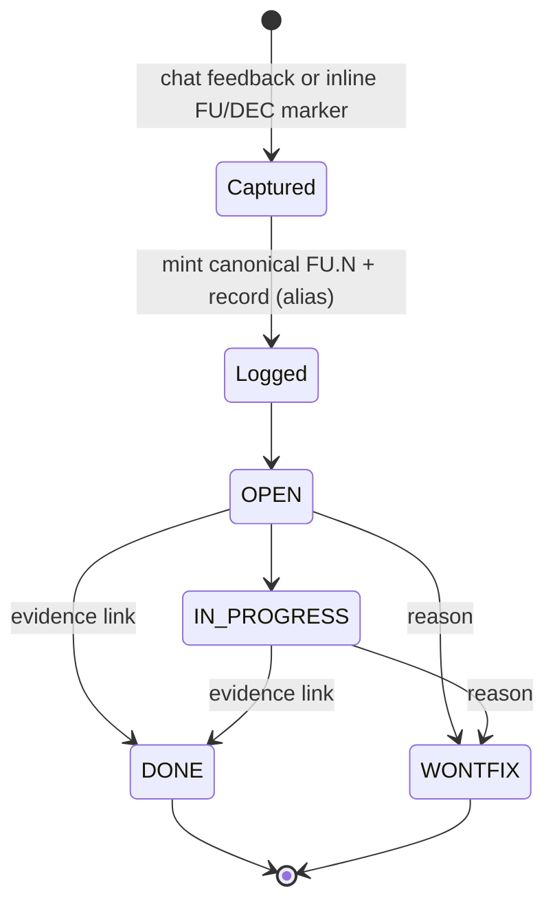

# Feedback & Decision Log Standards

> Two append-only, segment-rotating ledgers so that, **once captured and committed**, user feedback and human/LLM decisions survive compaction, sessions, and model swaps. (An *uncommitted* append is as fragile as any uncommitted change — a `git checkout`/`reset` before the next commit erases it; the standing commit-cadence directive is the sole mitigation.) Capture is a MEDIUM (SHOULD) discipline (HARD ceiling full at 25/25; nothing auto-closes); **there is no detector for a turn that should have been logged but was not** (Q5) until the Q3 fail-open hook ships (`hook-design-note.md`). **A missing entry is therefore not evidence that nothing happened that turn — treat a gap as unknown, not as negative confirmation (RT-004).** Worked examples: `examples-appendix.md` (per FU.8).

## Document Sections

| Section | Purpose |
|---------|---------|
| [MEDIUM Standards](#medium-standards) | LOG-M-001..006 |
| [FEEDBACK-LOG](#feedback-log) | Schema, ids and aliases, triggers |
| [LLM-DECISION-LOG](#llm-decision-log) | Schema, verbatim policy |
| [Segment rotation](#segment-rotation) | Capped-collection linked-list |
| [Scoping](#scoping) | Project-scoped vs repo-root |
| [L5 Lint](#l5-lint) | Three cheap checks |
| [Boundaries](#boundaries) | DEC-NNN, ADR, H-32 |

## MEDIUM Standards

> All rows are SHOULD-tier. Override requires documented justification.

| ID | Standard |
|----|----------|
| LOG-M-001 | Append feedback to the scoped FEEDBACK-LOG the **same turn** it is given (chat or inline-doc annotation). |
| LOG-M-002 | Capture user feedback **verbatim and full** (typos preserved) — the operator's complete text *as given in that channel* (a chat message in full; a one-line inline marker as that line). When one message bundles **multiple distinct items**, each MAY be a separate entry whose Verbatim is that item's own text (not the whole combined message); note the split in Summary (e.g. "1 of 5 items this turn") — FM-003. On any conflict, **verbatim wins**. **Exception — public-repo hygiene overrides verbatim-fidelity:** redact obvious secret-shaped tokens (credentials, keys, tokens, connection strings) and employer-internal / PII references **before** appending — replace the span with `‹redacted: {what}›` + a one-line note naming the **category** (credential / PII / employer-internal) and **approximate size** of the span, so a redaction disproportionate to its category is a named scrutiny signal at the next commit-cadence review (presence, not veracity — RT-001). Redaction is irreversible in the repo; its only recovery path is the out-of-repo transcript, which carries the same unenforced-retention dependency disclosed for Q1 (IN-002). This is **one of the two sanctioned edits to a sealed entry** — the other is the `Superseded by:` status pointer (design doc L1.1 / L1.4, modeled on the project's own `FU.4` sanitization; RT-001-iter7). **In-place redaction edits only the *current* file text, not git history: a secret captured verbatim and committed *before* redaction stays readable in that pre-redaction commit (`git show`) indefinitely — true removal requires a separate history rewrite, in tension with the squash-avoidance stance (design doc L1.4), so hygiene must precede the commit (FM-001-i7fmea).** Verbatim is a fidelity rule, not a mandate to persist secrets. |
| LOG-M-003 | Append decision-bearing exchanges to the scoped LLM-DECISION-LOG: user verbatim full; assistant verbatim as a decision-relevant excerpt + transcript pointer (PROPOSED-DEFAULT). |
| LOG-M-004 | **Cross-link, do not duplicate** worktracker `DEC-NNN` / ADRs (SHOULD NOT duplicate); a hardened, work-item-attached decision **graduates** into a DECISION entity and/or ADR. Graduation SHOULD be proposed at the next commit-cadence checkpoint (a long-deferred one carries `Graduation: deferred — {reason}`, capped at the next milestone or ~3 months, whichever first), so none silently and indefinitely bypasses the H-32/H-33 lifecycle. |
| LOG-M-005 | **Logger-assigned ids:** the LLM mints a canonical `FU.N` / `DEC-LLM-NNN` — unique, monotonic per log across segments (never resets) — under a **single-writer-per-log** discipline: only the orchestrating context appends; workers (incl. background handoffs) return short candidates inline via the P-003 handoff, appended the same turn (a stated exception to CP-01); **a candidate MUST quote the operator's original words unaltered as a distinct sub-field — the orchestrator appends that quoted text as the Verbatim, never a worker paraphrase (RT-001-iter8)**. This discipline — not lint 2 — prevents lost writes, and holds only **within one live session**: concurrent sessions/windows, direct hand-edits, or **git-worktree / branch-isolated sessions** are undefended (SHOULD NOT). The worktree/branch case is structurally different (FM-002-i7fmea) — it diverges via git rather than racing on one file, so a naively-resolved merge conflict on the log can silently drop entries with **no id gap** for lint 2 to catch; on conflict, keep both sides' entries in id order and **renumber** (never discard) any colliding id, repairing its `Superseded by:` / `Related:` references — **but renumbering reaches only that entry's *own* fields, not *inbound* external citations (an ADR `Reflected in:`, a DECISION `Source:`, another log's `Related:`); a renumbered *graduated* id leaves those silently wrong with no id gap, so keep a graduated id as the surviving side on collision, and if it must be renumbered the operator MUST `grep` the repo for the old id and repair external citations by hand (DA-001-i8)**. Collision-resistant, not collision-proof. The operator's label is kept **verbatim as an alias** (no global counter); alias text SHOULD avoid unbalanced `)` / backticks / newlines that would break the `(alias: X)` heading — the logger normalizes offending characters (FM-007). Provenance SHOULD reference the harness sidecar once available. |
| LOG-M-006 | At the **segment cap** (~50 entries or ~800 lines) seal the ACTIVE log and start a fresh ACTIVE under the stable name; ids continue monotonically; segments link via prev/next + a segment index. Until the Q3 cap-reminder hook ships, the assistant SHOULD self-count entries/lines when it appends and propose rotation on approaching the cap (count **before** a multi-marker inline-doc batch append, since a batch can overshoot by a whole batch; the commit-time lint runs only at commit and is `--no-verify`-skippable). This self-count is a temporary exception to the governing principle (design doc L1.4). **No automated cumulative-size backstop exists until that lint is wired or the hook ships — AE-006e fires on *compaction* (a context-fill event), not on a log's line-growth across many short sessions, so it does not detect cap-crossing** (PM-001/IN-001, verified against `quality-enforcement.md` AE-006e). The cap assumes ~12–18 lines/entry, so a few unusually verbose entries **in any field (verbatim, summary, or disposition)** SHOULD trigger **earlier** rotation regardless of the count (IN-002/FM-002); and at or near cap (within ~5 entries), derive the next id as *the ACTIVE segment's starting canonical id (from its Segment-Index row) + a `grep -c '^## FU\.'` / `'^## DEC-LLM-'` count* — the bare count is file-local, not the global id, so the offset is required after the first segment or the shortcut re-mints an earlier segment's id (DA-001-iter7) — not an LLM Read of a possibly-truncated file (PM-002). |

## FEEDBACK-LOG

Entry `## FU.N <slug> (alias: <operator-label or —>)`; fields in fixed order: **Verbatim** (full), **Summary** (does not replace the verbatim), **Disposition**, **Context** (provenance line, `datetime` as `YYYY-MM-DD`, includes `source` = `chat` / `inline-doc` (append path+anchor) / `transcript`). Worked entry: template + appendix.

Entry lifecycle (capture → logged → disposition):

- **Disposition** `OPEN / IN-PROGRESS / DONE / WONTFIX` (diagram): terminal states carry an evidence link (commit, file, `DEC-LLM-NNN`, worktracker id, or ADR) or a one-line reason; optional `Gating:` note; non-terminal entries get a staleness nudge at the commit-cadence checkpoint (no auto-close).
- **Inline marker:** a **single line** beginning `FU:` / `DEC:` — a lightweight pointer for short annotations; substantive/multi-paragraph feedback belongs in chat (full-verbatim, no line constraint). On reading a doc, harvest each marker with `source: inline-doc` + `path#heading-anchor` (the nearest preceding heading — edit-stable; a raw `:line` drifts as lines are inserted above, so use it only when no heading is near, FM-002-i008fmea) and announce in-turn (no doc mutated). **Before minting, check for an existing entry with the same `source: inline-doc` `path#anchor` *and* the same marker text (compare to that entry's Verbatim) — skip only when both location and text are unchanged** (a true re-read of an already-logged marker); this dedups repeat reads via the existing sub-field, no new field or doc-mutation (FM-001). **A marker whose text changed at the same location is new feedback, not a duplicate: mint a new entry for the edited text (append-only), noting `Related: <old FU.N>`; skipping on a location match alone would silently drop the edit (DA-002-i8). The content comparison is the assistant's, so operator burden stays zero; an in-place rewrite of the old entry's Verbatim is not used, because that would breach the two-sanctioned-edits rule for sealed entries.** Harvest is opportunistic (design doc: sweep backstop + CB-05 blind spot).
- **Capture triggers:** user corrects/redirects, states a preference/standing instruction, gives a follow-up or ruling, leaves an inline marker, or poses a challenging/interrogative question that implies feedback.
- **Corrections** are append-only (convention-only, git-backstopped — not a filesystem lock; see design doc L1.1): to fix a verbatim or reopen a `DONE`, add a follow-up entry referencing the old id; mark the old entry `Superseded by: FU.N` (one of the two sanctioned edits to a sealed entry — a status pointer, not a verbatim change; the other is an in-place hygiene redaction, LOG-M-002; see appendix).

## LLM-DECISION-LOG

Entry `## DEC-LLM-NNN <slug> (alias: <label or —>)`; fields: **Decision** (one sentence), **User verbatim** (full, or `See FEEDBACK-LOG FU.N`), **Assistant verbatim** (decision-relevant excerpt + transcript pointer `{session_id}#{uuid}`), **Summary / consequences**, **Context** (provenance line + `artifacts` + `Reflected in`; see template).

- **Reversal/supersession:** when a later decision reverses an earlier `DEC-LLM-NNN`, mark the old entry `Superseded by: DEC-LLM-NNN` (a status pointer — one of the two sanctioned edits to a sealed entry, symmetric with FEEDBACK-LOG's `Superseded by: FU.N`; the other is an in-place hygiene redaction, LOG-M-002). This is distinct from `Reflected in`, which is outward graduation only, so an in-log reversal is not left without a forward pointer (RT-002).

> **Assistant-verbatim policy (PROPOSED-DEFAULT):** excerpt + pointer (full paste re-creates context-rot); the JSONL is the byte-exact record while the transcript is retained and its pointer resolves — an unenforced dependency, mitigated by the C3+/ADR-graduating full-paste option. Rationale + size math: design doc Q1.

## Segment rotation

Append-only logs eventually exceed LLM read limits, so each log is a **capped collection** (FU.5). Formulae, margins + walkthrough: design doc L1.4 / `examples-appendix.md`.

- **Cap:** seal at **~50 entries or ~800 lines** (whichever first); rotate after the crossing entry so none is split (a lone oversized entry seals immediately). Rotation is a **single-writer critical section**; a **required** post-rotation parity check (`grep -c '^## FU\.'` — or `'^## DEC-LLM-'` for the decision log — on sealed + active = pre-seal count, **and** Backfill-Queue rows pre-seal = rows carried forward) confirms nothing dropped/duplicated before appends resume. **If rotation is interrupted, re-run the parity check first: if it already reconciles, the copy completed; on a mismatch, halt and escalate rather than append.** **Trigger (so recovery does not depend on memory):** before the *first* append of any session, if the Segment Index's last row does not match the ACTIVE file's actual last heading, treat it as a possible interrupted rotation and run the parity check before proceeding (IN-003, reuses the same `grep`). Backfill Queue and Segment Index stay in ACTIVE only (not copied into sealed segments; unresolved Backfill rows **carry forward** into the new ACTIVE at rotation).
- **Stable ACTIVE name:** always read/append `FEEDBACK-LOG.md` / `LLM-DECISION-LOG.md`; sealed segments are immutable-by-convention (git-backstopped), numbered `-LOG.001.md`, and so on. The git tamper-evidence backstop needs **commit granularity**: an entry whose verbatim or terminal disposition is changed after capture SHOULD be committed **promptly, independent of the milestone cadence** — an edit committed together with the original entry leaves no separate reviewable diff (RT-003).
- **Linked-list + index / cross-log nav** (design-doc L1.4 diagram): each header carries a `Segment N, prev, next` line (deterministic `.NNN.md` names; forward-nav falls back to the ACTIVE file); a small `segment, file, id-range` index lives in the ACTIVE file. Cross-log references use **canonical id only** as a labeled `Related: <id>` field (no ad-hoc prose, no paths); ids never reset, so a reference survives rotation and each log's index resolves id → file.

## Scoping

`JERRY_PROJECT` set: `projects/<PROJECT_ID>/{FEEDBACK-LOG,LLM-DECISION-LOG}.md`. Unset: repo-root. Framework-level feedback during an active project stays in the active-project log with a `scope: framework` tag **appended to the Context line as a trailing sub-field** (default `scope: project` need not be written; PROPOSED-DEFAULT, pending ratification). A **repo-root** entry naming one specific project MAY carry an optional `project: PROJ-NNN` trailing Context tag (same pattern as `scope:`); a project-scoped log needs none — its path is the attribution (CV-003/RT-002).

- **Adoption profile:** validated for a **single operator per log** (background agents work in parallel; only the append is orchestrator-serialized, LOG-M-005). Team/multi-writer use is an explicit **out-of-scope** extension. Whether the id/alias scheme transfers to a *different* operator's labeling habit is **untested** (`[INFERENCE]`, not a claim); re-assess once a second distinct operator has used this convention unmodified — capture their friction as a FEEDBACK-LOG entry against this convention itself, reusing the log rather than adding a mechanism (DA-003).
- **Cross-project directives** SHOULD **also** go to `MEMORY.md` — FEEDBACK-LOG entries are project/root-scoped only.

## L5 Lint

Cheap, fail-fast, pure-text. **Maximum three** (cap-crossing and dropped-entry detection folded into 1 and 2, not added). **These checks are documentation until wired:** they require a separate CI/pre-commit implementation step (design doc install plan) and confer no automated protection until wired *and* branch-protected — a `--no-verify` commit bypasses them. Once wired, nothing re-verifies that the wiring/branch-protection *persists* across later CI refactors; that persistence is unreviewed after install (PM-006-i6).
1. **Nav table + cap** — a `*-LOG.md` / `*-LOG.NNN.md` over 30 lines has a nav table (H-23); the same pass (counting both lines and `## FU.N` / `## DEC-LLM-NNN` headings) flags the ACTIVE file over the ~800-line **or** ~50-heading cap.
2. **Id integrity** — ids unique, strictly increasing, **and contiguous** across all segments (so a missing/unreadable indexed segment fails); the same pass also `ls *-LOG.*.md` and flags any on-disk segment **absent from the Segment Index** (a silently-orphaned segment). Catches duplicate ids and gaps; **not** a last-write-wins overwrite (single-writer discipline, LOG-M-005, prevents that). A legitimate crash/retry gap carries a one-line reason; backfilled entries tail-append.
3. **Terminal evidence** — every `DONE` / `WONTFIX` entry has an evidence link or a reason line (presence only; veracity is out of scope by design).

**Scope limits (accepted given the ≤3-lint ceiling — disclosed, not silently omitted).** The three checks do **not** verify: (a) **per-entry field completeness** — a partially-written entry (blank Verbatim/Summary/Disposition) passes unless it is also a terminal entry missing evidence; the entry schema's fixed field order, not a lint, is the convention (IN-003); (b) **heading-format drift** — all three assume the exact `## FU.N` / `## DEC-LLM-NNN` pattern, so a drifted heading is invisible to all three at once (IN-001); (c) **cross-log `Related: <id>` referential integrity** — lint 2 checks only intra-log contiguity, so a stale/mistyped cross-log id fails silently (FM-003); (d) **`Reflected in` presence** on graduated LLM-DECISION-LOG entries — deliberately asymmetric with lint 3's FEEDBACK-LOG terminal-evidence check, since a schema-specific fourth check would break the ≤3 ceiling (FM-005); (e) **Segment Index display accuracy** — the displayed `id-range` per row is not checked against the segment's true first/last heading (lint 2 derives contiguity from headings directly), so a stale index row can sit undetected (PM-003-i6); (f) **Backfill-Queue parity** — checked only at rotation time (LOG-M-006), not ongoing, so a skipped/interrupted rotation can drop Backfill rows with no later lint detection (PM-004-i6); (g) **`(backfilled)` tag removal** — unchecked, so premature removal (falsely implying independent verification) is undetectable — an accepted residual (FM-005-i6).

## Boundaries

- **Worktracker `{ParentId}:DEC-NNN`** — work-item-scoped, AST-validated (H-33), wins on conflict. The log **precedes and graduates into** it; a log entry is not itself a DECISION entity (so it needs no state machine). A ratified, durable decision also graduates to a Scheme-B ADR (`ADR-{domain-slug}-NNN`), cross-linked.
- **H-32 (GitHub parity)** — not per log entry (too heavy); attaches only after an item graduates into a worktracker Story/Bug/Enabler. Full boundary table: design doc.
