# CoWork Skeleton Branch: Orchestration Plan

> **Document ID:** PROJ-031-ORCH-PLAN
> **Workflow ID:** cowork-skeleton-20260626-001
> **Date:** 2026-06-26
> **Status:** PLANNED — PENDING USER APPROVAL
> **Criticality:** C4 (Critical — irreversible: branch creation + force-push + CI commit to main + public docs publication)
> **Quality Target:** >= 0.95 composite (C4 tournament, all 10 strategies)
> **Auto-Escalation Rules Applied:** AE-002 (CI touches `.github/`), AE-005 (security-relevant CI + token handling)

---

## Document Sections

| Section | Purpose |
|---------|---------|
| [L0: Workflow Overview](#l0-workflow-overview) | Stakeholder summary — what this does and why |
| [L1: Technical Plan](#l1-technical-plan) | Phase table, workflow diagram, sync barriers |
| [Phase Definitions](#phase-definitions) | Per-phase purpose, agents, artifacts, gates |
| [Adversarial Sub-Pipeline](#adversarial-sub-pipeline) | C4 tournament encoding — exact ordered execution |
| [L2: Implementation Details](#l2-implementation-details) | State schema, path config, recovery strategies |
| [Approval Gate](#approval-gate) | Explicit sign-off items before POST-APPROVAL phases |
| [Risk Register](#risk-register) | Identified risks with mitigations |
| [Disclaimer](#disclaimer) | Required P-043 notice |

---

## L0: Workflow Overview

Jerry cannot install as a Claude CoWork plugin today because the repository contains 6,344 tracked files and CoWork enforces a roughly 5,000-file limit. The `projects/` directory alone accounts for 4,600 of those files — it is internal work history that CoWork users never need. Removing it produces a clean 1,744-file tree that fits comfortably under the limit.

This workflow designs, reviews, implements, and validates a solution with three parts: (1) a `cowork-skeleton` branch that is a stripped derivative of `main` with `projects/` removed and a minimal stub put back so Jerry's bootstrap still works; (2) a GitHub Actions CI workflow that automatically regenerates the skeleton branch every time a new release tag `v*` is pushed, so it never drifts from `main`; and (3) Diataxis-compliant user documentation covering how to install Jerry via CoWork, how to stay current, and why the skeleton exists.

Every implementation decision — the script logic, the CI workflow YAML, the token strategy, the docs content — is peer-reviewed at quality level C4 (all ten adversarial strategies, composite score >= 0.95) before a single file is committed to `main` or the `cowork-skeleton` branch is touched. The user must explicitly approve the full pre-approval package before any irreversible action executes.

---

## L1: Technical Plan

### Phase Flow Diagram

```mermaid
flowchart TD
    START([Start]) --> P1

    subgraph PRE["PRE-APPROVAL  —  reversible design work"]
        P1["Phase 1: Requirements & Architecture\nps-researcher + nse-requirements + ps-architect"]
        G1{"QG-1\nC4 >= 0.95"}
        P1 --> G1
        G1 -->|REVISE| P1
        G1 -->|PASS| P2

        P2["Phase 2: Security & Threat Model\nred-lead + red-recon + eng-architect + eng-devsecops"]
        G2{"QG-2\nC4 >= 0.95"}
        P2 --> G2
        G2 -->|REVISE| P2
        G2 -->|PASS| P3

        P3["Phase 3: Skeleton + CI Design\neng-architect + eng-lead + eng-infra"]
        G3{"QG-3\nC4 >= 0.95"}
        P3 --> G3
        G3 -->|REVISE| P3
        G3 -->|PASS| P4

        P4["Phase 4: Diataxis Docs Authoring\ndiataxis agents + ux-heuristic-evaluator"]
        G4{"QG-4\nC4 >= 0.95"}
        P4 --> G4
        G4 -->|REVISE| P4
        G4 -->|PASS| AG
    end

    AG[["APPROVAL GATE\nUser sign-off on all pre-approval artifacts\nbefore any irreversible action"]]
    AG -->|Approved| P5
    AG -->|Changes requested| PRE

    subgraph POST["POST-APPROVAL  —  irreversible implementation"]
        P5["Phase 5: Skeleton Script Implementation\neng-lead + eng-infra + eng-qa"]
        G5{"QG-5\nC4 >= 0.95"}
        P5 --> G5
        G5 -->|REVISE| P5
        G5 -->|PASS| P6

        P6["Phase 6: CI Workflow Implementation\neng-devsecops + eng-infra + eng-qa + eng-reviewer"]
        G6{"QG-6\nC4 >= 0.95"}
        P6 --> G6
        G6 -->|REVISE| P6
        G6 -->|PASS| P7

        P7["Phase 7: Docs Commit to main\neng-lead + diataxis-auditor"]
        G7{"QG-7\nC4 >= 0.95"}
        P7 --> G7
        G7 -->|REVISE| P7
        G7 -->|PASS| P8

        P8["Phase 8: Skeleton Branch Creation & E2E Validation\neng-qa + eng-infra"]
        G8{"QG-8\nC4 >= 0.95"}
        P8 --> G8
        G8 -->|REVISE| P8
        G8 -->|PASS| END
    end

    END([WORKFLOW COMPLETE])
```



### Quality Gate Architecture (all gates)

```
 Phase Output
      │
      ▼
 ┌────────────────────────────────────────────────────────┐
 │  ADVERSARIAL TOURNAMENT (C4 — 10 strategies)           │
 │                                                        │
 │  [adv-selector]  Produces ordered execution list       │
 │                                                        │
 │  GROUP A  adv-executor: S-010 Self-Refine              │
 │  GROUP B  adv-executor: S-003 Steelman          ← H-16 │
 │  GROUP C  adv-executor: S-002 Devil's Advocate         │
 │  GROUP C  adv-executor: S-004 Pre-Mortem               │
 │  GROUP C  adv-executor: S-001 Red Team                 │
 │  GROUP D  adv-executor: S-007 Constitutional AI        │
 │  GROUP D  adv-executor: S-011 Chain-of-Verification    │
 │  GROUP E  adv-executor: S-012 FMEA                     │
 │  GROUP E  adv-executor: S-013 Inversion                │
 │  GROUP F  adv-scorer:   S-014 LLM-as-Judge  ← LAST    │
 │                                                        │
 │  Findings → CREATING AGENT (revision)                  │
 │  Adversaries NEVER edit the deliverable                │
 │  Re-score until >= 0.95 OR plateau OR C4 ceiling       │
 └────────────────────────────────────────────────────────┘
      │
 PASS (>= 0.95)
      │
      ▼
 Next Phase
```

### Phase Summary Table

| # | Stage | Purpose | Creator Agents | Key Artifacts | Gate | Approval |
|---|-------|---------|----------------|---------------|------|----------|
| 1 | PRE | Requirements & Architecture | ps-researcher, nse-requirements, ps-architect | recon-synthesis.md, requirements.md, ADR-PROJ031-001, ADR-PROJ031-002 | QG-1 C4 >= 0.95 | PRE |
| 2 | PRE | Security & Threat Model | red-lead, red-recon, eng-architect, eng-devsecops, eng-security | threat-model-scope.md, attack-surface.md, stride-analysis.md, remediation-plan.md | QG-2 C4 >= 0.95 | PRE |
| 3 | PRE | Skeleton + CI Design | eng-architect, eng-lead, eng-infra | skeleton-design.md, ci-workflow-design.md, stub-specification.md, implementation-spec.md | QG-3 C4 >= 0.95 | PRE |
| 4 | PRE | Diataxis Docs Authoring | diataxis-tutorial, diataxis-howto, diataxis-reference, diataxis-explanation, ux-heuristic-evaluator, diataxis-auditor | 5 doc drafts, ux-review.md, mkdocs-nav-patch.md | QG-4 C4 >= 0.95 | PRE |
| — | — | **APPROVAL GATE** | — | User sign-off | — | **USER** |
| 5 | POST | Skeleton Script Implementation | eng-lead, eng-infra, eng-qa | generate-cowork-skeleton.sh, validation-report.md | QG-5 C4 >= 0.95 | POST |
| 6 | POST | CI Workflow Implementation | eng-devsecops, eng-infra, eng-qa, eng-reviewer | cowork-skeleton.yml, ci-test-report.md, ci-review.md | QG-6 C4 >= 0.95 | POST |
| 7 | POST | Docs Commit to main | eng-lead, diataxis-auditor | commit-record.md, nav-audit.md | QG-7 C4 >= 0.95 | POST |
| 8 | POST | Branch Creation & E2E Validation | eng-qa, eng-infra | branch-creation-log.md, e2e-validation-report.md | QG-8 C4 >= 0.95 | POST |

---

## Phase Definitions

### Phase 1 — Requirements & Architecture (PRE-APPROVAL)

**Purpose:** Synthesize the recon findings into a complete, structured requirements document and two Architecture Decision Records (ADRs) that anchor all downstream design and implementation work. Resolve the two open questions from the recon (CoWork file-count scope, token strategy) before any engineering begins.

**Workstreams covered:** Skeleton generation (requirements), CI automation (requirements), initial security scoping.

**Entry criteria:** Recon report available at scratchpad path (verified — provided as input to this plan).

**Creator agents and handoff sequence:**

1. `jerry:ps-researcher` — Synthesizes recon report open questions. Outputs structured findings on: (a) hypothesis (a) confidence and recommended verification step; (b) trigger choice `push: tags: v*` vs `release: published`; (c) stub requirements for H-04 compatibility.
2. `jerry:nse-requirements` — Converts recon synthesis + settled decisions into a formal requirements document covering all five workstreams. Applies NASA-SE traceability (MRD → SRD → interface requirements).
3. `jerry:ps-architect` — Produces two ADRs in Nygard format:
   - ADR-PROJ031-001: Skeleton strategy (derived branch, deterministic rm + stub, idempotency proof)
   - ADR-PROJ031-002: Token strategy (PAT scope analysis vs GITHUB_TOKEN + branch protection exemption; risk/benefit matrix)

**Artifacts** (under `orchestration/cowork-skeleton-20260626-001/phase-1-requirements/`):

| Path | Producing Agent | Description |
|------|----------------|-------------|
| `ps-researcher-001/recon-synthesis.md` | ps-researcher | Open-question resolution + confidence ratings |
| `nse-requirements-001/requirements.md` | nse-requirements | Structured requirements, 5 workstreams, traceable |
| `ps-architect-001/ADR-PROJ031-001-skeleton-strategy.md` | ps-architect | Derived-branch strategy ADR (Nygard) |
| `ps-architect-001/ADR-PROJ031-002-token-strategy.md` | ps-architect | PAT vs GITHUB_TOKEN ADR (Nygard) |

**Exit criteria (QG-1):** All four artifacts score >= 0.95 composite on C4 tournament. ADRs must resolve both open questions to decision (no "TBD" sections). Requirements must be traceable to settled decisions.

**Handoff to Phase 2 (Handoff v2 fields):**
- `artifacts`: file paths above (CP-01 — no inline content)
- `key_findings`: [requirements.md location, ADR-PROJ031-001 skeleton decision, ADR-PROJ031-002 token decision, open-question resolutions, security scope items for Phase 2]
- `criticality`: C4 (propagates per CP-04)

---

### Phase 2 — Security & Threat Model (PRE-APPROVAL)

**Purpose:** Apply STRIDE threat modeling to the derived-branch CI pipeline and produce an actionable remediation plan that feeds directly into Phase 3 design. Cover the four primary threat surfaces: force-push mechanics, token/secret scope, supply-chain integrity of the skeleton branch, and branch-protection bypass.

**Workstreams covered:** Security & threat model (workstream 3).

**Entry criteria:** QG-1 PASS. ADR-PROJ031-002 token strategy available for threat analysis.

**Creator agents and handoff sequence:**

1. `jerry:red-lead` — Defines threat model scope and rules of engagement for the CI pipeline analysis.
2. `jerry:red-recon` — Maps the attack surface: GitHub Actions trust model, branch protection config on `cowork-skeleton`, PAT/GITHUB_TOKEN permission boundaries, workflow trigger conditions, force-push blast radius.
3. `jerry:eng-architect` — Executes STRIDE analysis against the attack surface map. Classifies threats by DREAD score.
4. `jerry:eng-devsecops` — Produces remediation plan: least-privilege token scope, branch-protection exemption mechanism, loop-safety implementation pattern, failure notification design, supply-chain controls (pinned Action versions, SHA-pinned deps, SLSA provenance).
5. `jerry:eng-security` — Derives security requirements from the remediation plan. These requirements become mandatory inputs to Phase 3 CI design (they are not optional).

**Artifacts** (under `orchestration/cowork-skeleton-20260626-001/phase-2-security/`):

| Path | Producing Agent | Description |
|------|----------------|-------------|
| `red-lead-001/threat-model-scope.md` | red-lead | Scope, rules of engagement, threat actors |
| `red-recon-001/attack-surface.md` | red-recon | Attack surface map, trust boundaries, entry points |
| `eng-architect-001/stride-analysis.md` | eng-architect | STRIDE/DREAD classification per threat |
| `eng-devsecops-001/remediation-plan.md` | eng-devsecops | Mitigations, implementation patterns, controls |
| `eng-security-001/security-requirements.md` | eng-security | Non-negotiable security requirements for Phase 3 |

**Exit criteria (QG-2):** Composite score >= 0.95 C4 tournament. STRIDE analysis must address all four threat surfaces. Remediation plan must be concrete (not generic recommendations). Security requirements must be implementation-testable.

**Handoff to Phase 3:** File paths to all five artifacts. Key finding: security-requirements.md contains blocking requirements — Phase 3 design cannot proceed without incorporating every item.

---

### Phase 3 — Skeleton + CI Design (PRE-APPROVAL)

**Purpose:** Design the skeleton generation script and the CI workflow YAML at a level of detail sufficient for direct implementation in Phase 5 and 6 without further design decisions. All security requirements from Phase 2 are baked in. The design is the primary approval artifact — the user approves the design, not the implementation.

**Workstreams covered:** Skeleton generation (design), CI automation (design).

**Entry criteria:** QG-2 PASS. `phase-2-security/eng-security-001/security-requirements.md` available.

**Creator agents and handoff sequence:**

1. `jerry:eng-architect` — Designs the skeleton generation script (`generate-cowork-skeleton.sh`): inputs, idempotency guarantee, `projects/` removal step, stub injection, file-count assertion (must land < 5,000), plugin surface integrity check (`.claude-plugin/`, `skills/`, `.claude/`, `.context/`, `src/`, `schemas/`, `hooks/` must survive), symlink validation (`.claude/rules`, `.claude/patterns`).
2. `jerry:eng-infra` — Designs the CI workflow YAML (`cowork-skeleton.yml`): trigger block (`push: tags: ['v*']` + `workflow_dispatch`), steps (checkout `main`, run `generate-cowork-skeleton.sh`, force-push `cowork-skeleton`), token strategy per ADR-PROJ031-002, branch protection exemption wiring, failure notification (GitHub Actions summary + optional Slack webhook), loop-safety proof (workflow does NOT listen to `cowork-skeleton` branch, mirrors `gh-pages` pattern from `docs.yml`). Also designs the minimal projects/ stub: directory + `README.md` (content spec: bootstrapper explanation, link to main repo, H-04 guidance for fresh installs).
3. `jerry:eng-lead` — Produces consolidated implementation specification binding skeleton script design + CI design + security requirements into a single spec that Phase 5 and 6 implementers follow. Specifies test acceptance criteria.

**Artifacts** (under `orchestration/cowork-skeleton-20260626-001/phase-3-design/`):

| Path | Producing Agent | Description |
|------|----------------|-------------|
| `eng-architect-001/skeleton-design.md` | eng-architect | Script design: pseudocode, idempotency proof, acceptance criteria |
| `eng-infra-001/ci-workflow-design.md` | eng-infra | CI YAML design: annotated workflow spec with security controls wired in |
| `eng-infra-001/stub-specification.md` | eng-infra | projects/ stub: directory structure + README content spec |
| `eng-lead-001/implementation-spec.md` | eng-lead | Consolidated spec: test acceptance, phase 5+6 work breakdown |

**Exit criteria (QG-3):** Composite score >= 0.95 C4 tournament. Design must be implementation-complete (no design decisions deferred to implementer). All security requirements from `phase-2-security/eng-security-001/security-requirements.md` must be traceable in the design. Idempotency proof must be explicit. Loop-safety must be formally argued (not asserted).

**Handoff to Phase 4:** The Phase 4 docs authoring team needs the skeleton design and stub specification to write accurate tutorial and reference content. File path references to all four artifacts.

---

### Phase 4 — Diataxis Docs Authoring (PRE-APPROVAL)

**Purpose:** Author all four Diataxis quadrant documents for the CoWork skeleton feature and wire them into the mkdocs.yml nav. A UX review of the install flow catches usability problems before the docs are published. These are drafts — they are persisted under the orchestration directory during PRE-APPROVAL and committed to `docs/` in Phase 7 after user approval.

**Workstreams covered:** Diataxis docs (workstream 4).

**Entry criteria:** QG-3 PASS. Skeleton design and stub specification available for accurate doc authoring.

**Creator agents and handoff sequence (fan-out, then fan-in):**

Fan-out (4 Diataxis writers run in parallel):
1. `jerry:diataxis-tutorial` — Tutorial: "Install Jerry as a Claude CoWork Plugin" — task-oriented, learning-by-doing. Covers: clone/download the cowork-skeleton branch, install in CoWork, verify the plugin loads, initial session start.
2. `jerry:diataxis-howto` — Two how-to guides: (a) "Keep Your Jerry CoWork Installation Current" (sync/update when a new skeleton is released), (b) "Troubleshoot CoWork File Limit Issues" (what to do if the limit error reappears, how to verify file count, how to report).
3. `jerry:diataxis-reference` — Reference: "cowork-skeleton Branch and Sync Workflow" — factual description of what the branch contains, what is stripped, what the CI workflow does, version alignment mechanism, relevant configuration keys.
4. `jerry:diataxis-explanation` — Explanation: "Why Jerry Uses a Skeleton Branch for CoWork" — conceptual rationale: CoWork file limits, why `projects/` is internal-only, why regeneration is safer than merging, trade-offs of the derived-branch approach.

Fan-in (two reviewers):
5. `jerry:ux-heuristic-evaluator` — Nielsen heuristic evaluation of the install flow end-to-end (tutorial + how-to combined). Applies minimum 3-evaluator methodology per feedback_verify_deployed_artifacts.md memory rule. Produces structured usability findings with severity ratings.
6. `jerry:diataxis-auditor` — Classifies all five documents against Diataxis quadrants, audits nav wiring, produces `mkdocs-nav-patch.md` (the exact YAML snippet to add to `mkdocs.yml` nav section for all five docs).

**Artifacts** (under `orchestration/cowork-skeleton-20260626-001/phase-4-docs/`):

| Path | Producing Agent | Description |
|------|----------------|-------------|
| `diataxis-tutorial-001/tutorial-cowork-install-draft.md` | diataxis-tutorial | Tutorial draft — CoWork install |
| `diataxis-howto-001/howto-sync-draft.md` | diataxis-howto | How-to — sync/update skeleton |
| `diataxis-howto-001/howto-troubleshoot-draft.md` | diataxis-howto | How-to — file limit troubleshooting |
| `diataxis-reference-001/reference-skeleton-branch-draft.md` | diataxis-reference | Reference — skeleton branch + CI workflow |
| `diataxis-explanation-001/explanation-why-skeleton-draft.md` | diataxis-explanation | Explanation — rationale for derived branch |
| `ux-heuristic-evaluator-001/ux-review.md` | ux-heuristic-evaluator | Nielsen heuristic evaluation, severity-classified findings |
| `diataxis-auditor-001/mkdocs-nav-patch.md` | diataxis-auditor | Exact mkdocs.yml nav YAML snippet for all 5 docs |

**Exit criteria (QG-4):** Composite score >= 0.95 C4 tournament on the docs package as a whole. UX review must show no Critical severity findings unresolved. All five docs must classify correctly in Diataxis audit. mkdocs-nav-patch.md must be syntactically valid YAML.

**Handoff to Approval Gate:** File path references to all seven artifacts. User reviews this complete pre-approval package before proceeding.

---

### APPROVAL GATE (between Phase 4 and Phase 5)

See [Approval Gate](#approval-gate) section for the explicit sign-off checklist.

---

### Phase 5 — Skeleton Script Implementation (POST-APPROVAL)

**Purpose:** Implement the `generate-cowork-skeleton.sh` script exactly as designed in Phase 3, validated by `eng-qa` against the acceptance criteria from `implementation-spec.md`. The script lives in `scripts/` in the main repo and is also the primary executable in the CI workflow.

**Workstreams covered:** Skeleton generation (implementation).

**Entry criteria:** User approval obtained at Approval Gate. `phase-3-design/eng-architect-001/skeleton-design.md` available.

**Creator agents:**
1. `jerry:eng-infra` — Implements `scripts/generate-cowork-skeleton.sh` per skeleton-design.md. Script must: (a) be idempotent (safe to re-run), (b) checkout main, (c) create a detached working copy, (d) `rm -rf projects/`, (e) inject minimal stub (dir + README), (f) assert tracked-file count < 5,000 (hard fail if not), (g) validate plugin surface integrity (check presence of `.claude-plugin/`, `skills/`, `.claude/`, `.context/`, `src/`, `schemas/`, `hooks/`), (h) validate symlinks (`.claude/rules`, `.claude/patterns` resolve), (i) force-push to `cowork-skeleton` branch with commit message including source `main` SHA.
2. `jerry:eng-lead` — Reviews implementation against design spec. Ensures no design decisions were silently changed during implementation.
3. `jerry:eng-qa` — Executes validation against `implementation-spec.md` acceptance criteria. Produces validation report: file count, plugin surface check, symlink check, idempotency test (run twice, same result).

**Artifacts** (under `orchestration/cowork-skeleton-20260626-001/phase-5-skeleton-impl/`):

| Path | Producing Agent | Description |
|------|----------------|-------------|
| `eng-infra-001/generate-cowork-skeleton.sh` | eng-infra | Implementation artifact (also copied to repo `scripts/`) |
| `eng-lead-001/implementation-review.md` | eng-lead | Design-vs-implementation diff review |
| `eng-qa-001/validation-report.md` | eng-qa | Acceptance criteria pass/fail, file count, surface check |

**Exit criteria (QG-5):** Composite score >= 0.95 C4 tournament. Validation report must show ALL acceptance criteria PASS. File count assertion must be demonstrated (< 5,000). No design deviations without documented justification.

---

### Phase 6 — CI Workflow Implementation (POST-APPROVAL)

**Purpose:** Implement the GitHub Actions workflow YAML that regenerates `cowork-skeleton` on every `v*` tag push. The workflow implements all security controls from Phase 2 and the design from Phase 3. It is reviewed at C4 quality before being committed to `.github/workflows/`.

**Workstreams covered:** CI automation (implementation).

**Entry criteria:** QG-5 PASS. `phase-5-skeleton-impl/eng-infra-001/generate-cowork-skeleton.sh` validated. `phase-2-security/eng-security-001/security-requirements.md` available.

**Creator agents:**
1. `jerry:eng-devsecops` — Implements `.github/workflows/cowork-skeleton.yml`. Must implement: (a) triggers `push: tags: ['v*']` + `workflow_dispatch`, (b) permissions block (minimum `contents: write`; derive from ADR-PROJ031-002 token decision), (c) steps: checkout `main` (full history for accurate `git ls-files`), run `scripts/generate-cowork-skeleton.sh`, force-push `cowork-skeleton`, (d) failure notification step (GitHub Actions job summary + optional notification), (e) loop-safety: workflow MUST NOT listen on `cowork-skeleton` branch in any trigger, (f) pinned Action versions (SHA-pinned `actions/checkout`), (g) concurrency group to prevent parallel regeneration runs.
2. `jerry:eng-infra` — Implements the branch-protection exemption for `cowork-skeleton` (documented approach; if branch protection exists, the skeleton branch must be exempted from push restrictions for the CI token).
3. `jerry:eng-qa` — Tests the workflow via `act` (local) or by tracing the logic manually against GitHub Actions semantics. Produces test report covering: trigger fires on tag, skips on branch push, force-push succeeds, failure notification fires on script failure.
4. `jerry:eng-reviewer` — Final code review of the workflow YAML against: security requirements compliance, loop-safety, no leaked secrets in logs, correct permissions scope, concurrency safety.

**Artifacts** (under `orchestration/cowork-skeleton-20260626-001/phase-6-ci-impl/`):

| Path | Producing Agent | Description |
|------|----------------|-------------|
| `eng-devsecops-001/cowork-skeleton.yml` | eng-devsecops | CI workflow YAML (also copied to `.github/workflows/`) |
| `eng-infra-001/branch-protection-config.md` | eng-infra | Branch protection exemption configuration |
| `eng-qa-001/ci-test-report.md` | eng-qa | Trigger/permission/failure-path test evidence |
| `eng-reviewer-001/ci-review.md` | eng-reviewer | Security + correctness code review |

**Exit criteria (QG-6):** Composite score >= 0.95 C4 tournament. CI review must show zero unresolved security findings. Loop-safety must be formally verified (not asserted). All security requirements from Phase 2 must be traceable in the implementation.

---

### Phase 7 — Docs Commit to main (POST-APPROVAL)

**Purpose:** Commit the approved Diataxis docs from Phase 4 to their final `docs/` locations in the main repo and wire them into `mkdocs.yml` nav. The `docs.yml` CI workflow will automatically build and publish the docs to `gh-pages` (jerry.geekatron.org) on the `main` push — this is irreversible publication.

**Workstreams covered:** Diataxis docs (commit and publish).

**Entry criteria:** QG-6 PASS. All five Phase 4 doc drafts at PASS status. `diataxis-auditor-001/mkdocs-nav-patch.md` available.

**Target file locations** (under `docs/` in the main repo):

| Source (Phase 4 draft) | Destination (committed to main) |
|------------------------|--------------------------------|
| `tutorial-cowork-install-draft.md` | `docs/tutorials/cowork-install.md` |
| `howto-sync-draft.md` | `docs/howto/cowork-sync.md` |
| `howto-troubleshoot-draft.md` | `docs/howto/cowork-troubleshoot.md` |
| `reference-skeleton-branch-draft.md` | `docs/reference/cowork-skeleton-branch.md` |
| `explanation-why-skeleton-draft.md` | `docs/explanation/cowork-why-skeleton.md` |
| `mkdocs-nav-patch.md` (patch content) | Applied to `mkdocs.yml` nav section |

**Creator agents:**
1. `jerry:eng-lead` — Commits the five docs and mkdocs.yml nav update to a feature branch, opens a pull request to `main`. Commit message follows conventional commits pattern (mirrors existing `docs.yml` path trigger structure).
2. `jerry:diataxis-auditor` — Final nav audit: verifies the committed files appear correctly in mkdocs.yml nav, no broken links, no orphaned pages, strict mode (`strict: true` in mkdocs.yml) will not reject them.

**Artifacts** (under `orchestration/cowork-skeleton-20260626-001/phase-7-docs-commit/`):

| Path | Producing Agent | Description |
|------|----------------|-------------|
| `eng-lead-001/commit-record.md` | eng-lead | Commit SHA, PR link, files committed |
| `diataxis-auditor-001/nav-audit.md` | diataxis-auditor | Final nav audit, mkdocs strict-mode compatibility |

**Exit criteria (QG-7):** Composite score >= 0.95 C4 tournament on the committed docs package. Nav audit must show zero broken links and strict-mode compatibility. Docs must be confirmed published to jerry.geekatron.org after `docs.yml` fires (or confirmed in progress with expected URL).

---

### Phase 8 — Skeleton Branch Creation & E2E Validation (POST-APPROVAL)

**Purpose:** Execute `generate-cowork-skeleton.sh` to create or regenerate the `cowork-skeleton` branch from the current `main` HEAD. Validate the result end-to-end: file count, plugin surface, CoWork install simulation, CI workflow trigger test.

**Workstreams covered:** All five (final integration and validation).

**Entry criteria:** QG-7 PASS. `.github/workflows/cowork-skeleton.yml` committed. `scripts/generate-cowork-skeleton.sh` committed. Docs committed.

**Creator agents:**
1. `jerry:eng-infra` — Executes `scripts/generate-cowork-skeleton.sh` against the current `main` HEAD. Records: source `main` SHA, resulting `cowork-skeleton` HEAD SHA, force-push confirmation.
2. `jerry:eng-qa` — Validates the `cowork-skeleton` branch: (a) `git ls-files` count < 5,000 on a clean checkout, (b) plugin surface intact (`.claude-plugin/`, `skills/`, `.claude/`, `.context/`, `src/`, `schemas/`, `hooks/`), (c) symlinks resolve, (d) `plugin.json` agent paths all resolve, (e) `marketplace.json` `source: "./"` is valid, (f) trigger simulation: manually triggers `workflow_dispatch` and verifies the CI workflow runs without error on the `cowork-skeleton` branch source, (g) confirms `cowork-skeleton` is NOT inadvertently listed in any workflow trigger to prevent loop.

**Artifacts** (under `orchestration/cowork-skeleton-20260626-001/phase-8-validation/`):

| Path | Producing Agent | Description |
|------|----------------|-------------|
| `eng-infra-001/branch-creation-log.md` | eng-infra | Source SHA, target SHA, force-push result, timestamp |
| `eng-qa-001/e2e-validation-report.md` | eng-qa | All acceptance criteria with PASS/FAIL status |

**Exit criteria (QG-8):** Composite score >= 0.95 C4 tournament. ALL acceptance criteria in e2e-validation-report.md must be PASS. Any FAIL halts the workflow and escalates to user.

---

## Adversarial Sub-Pipeline

> This section formally encodes the C4 tournament quality gate applied at every phase boundary (QG-1 through QG-8).

### Criticality Assessment

| Factor | Assessment | Level |
|--------|-----------|-------|
| Reversibility | CI commit to `main`, force-push to `cowork-skeleton`, public docs publication — none easily reversed | Irreversible |
| File scope | CI workflow + skeleton script + 5 docs + mkdocs.yml + potentially branch protection config | Architecture |
| Impact | Public/external: CoWork plugin users, Jerry's public plugin listing, jerry.geekatron.org docs | Public |
| Auto-escalation | AE-005 (security-relevant CI + token handling), AE-002 (touches `.github/`) | C4 confirmed |

**Confirmed criticality: C4.** Quality target per task specification: >= 0.95 (above the C4 minimum of 0.92).

### Execution Model

- **Orchestrator:** main context (Claude session) — P-003 compliant, single level
- **Workers:** all creator agents and adversary agents are Agent-tool workers
- **Parallelism:** adv-executor instances run as BACKGROUND agents wherever possible (9 executor invocations per gate)
- **Handoffs:** file-path references only (CP-01) — no inline content between agents
- **Persistence:** all artifacts to files immediately (P-002) — context rot prevention
- **MCP:** `mcp__memory-keeper__context_save` at each phase boundary if memory-keeper is available (MCP-002); fallback: `orchestration/cowork-skeleton-20260626-001/mcp-fallback/{phase}.md`

### Ordered C4 Tournament Execution List

Per `skills/adversary/SKILL.md` Tournament Mode and H-16 (Steelman BEFORE Devil's Advocate):

| Execution Order | Group | Strategy | Agent | Template Path |
|----------------|-------|----------|-------|---------------|
| 1 | A — Self-Review | S-010 Self-Refine | adv-executor | `.context/templates/adversarial/s-010-self-refine.md` |
| 2 | B — Strengthen | S-003 Steelman Technique | adv-executor | `.context/templates/adversarial/s-003-steelman.md` |
| 3 | C — Challenge | S-002 Devil's Advocate | adv-executor | `.context/templates/adversarial/s-002-devils-advocate.md` |
| 4 | C — Challenge | S-004 Pre-Mortem Analysis | adv-executor | `.context/templates/adversarial/s-004-pre-mortem.md` |
| 5 | C — Challenge | S-001 Red Team Analysis | adv-executor | `.context/templates/adversarial/s-001-red-team.md` |
| 6 | D — Verify | S-007 Constitutional AI Critique | adv-executor | `.context/templates/adversarial/s-007-constitutional-ai.md` |
| 7 | D — Verify | S-011 Chain-of-Verification | adv-executor | `.context/templates/adversarial/s-011-cove.md` |
| 8 | E — Decompose | S-012 FMEA | adv-executor | `.context/templates/adversarial/s-012-fmea.md` |
| 9 | E — Decompose | S-013 Inversion Technique | adv-executor | `.context/templates/adversarial/s-013-inversion.md` |
| 10 | F — Score | S-014 LLM-as-Judge | adv-scorer | `.context/templates/adversarial/s-014-llm-as-judge.md` |

**H-16 enforcement:** Step 2 (S-003 Steelman) MUST complete before Step 3 (S-002 Devil's Advocate). This is an ordered dependency — adv-selector produces this list with the ordering explicit. The orchestrator enforces the sequence; no step may be skipped.

**S-014 ALWAYS LAST:** adv-scorer with S-014 receives aggregated findings from all 9 executor runs as input evidence. It must not run before all executors complete.

### Creator-Critic-Revision Cycle (H-14)

```
Iteration N:
  Creating agent produces deliverable → persists to file
  ↓
  adv-selector (1x) → ordered execution list persisted to quality/{phase}-gate/adv-selector-001/
  ↓
  adv-executor (9x BACKGROUND) → findings persisted to quality/{phase}-gate/adv-executor-{N}-{strategy}/
  ↓
  adv-scorer (1x) → composite score persisted to quality/{phase}-gate/adv-scorer-{N}/
  ↓
  Score >= 0.95? → PASS → proceed to next phase
  Score < 0.95 AND iterations < 10?
    → Findings route to CREATING AGENT (not adversary)
    → Creating agent revises deliverable (adversaries NEVER edit)
    → Increment N, repeat
  Plateau (delta < 0.01 × 3 consecutive iterations)?
    → Halt, escalate to user with best result and critic findings
  Iterations = 10 (C4 ceiling)?
    → Halt, escalate to user with best result and recommendation
```

**Artifact paths for quality gates** (under `orchestration/cowork-skeleton-20260626-001/quality/`):

```
quality/
  phase-{N}-gate/
    adv-selector-001/
      strategy-selection.md
    adv-executor-001-s010/     # S-010 Self-Refine findings
    adv-executor-002-s003/     # S-003 Steelman findings
    adv-executor-003-s002/     # S-002 Devil's Advocate findings
    adv-executor-004-s004/     # S-004 Pre-Mortem findings
    adv-executor-005-s001/     # S-001 Red Team findings
    adv-executor-006-s007/     # S-007 Constitutional AI findings
    adv-executor-007-s011/     # S-011 Chain-of-Verification findings
    adv-executor-008-s012/     # S-012 FMEA findings
    adv-executor-009-s013/     # S-013 Inversion findings
    adv-scorer-001/
      quality-score-iter-{N}.md
```

### Scoring Dimensions (S-014, per quality-enforcement.md SSOT)

| Dimension | Weight |
|-----------|--------|
| Completeness | 0.20 |
| Internal Consistency | 0.20 |
| Methodological Rigor | 0.20 |
| Evidence Quality | 0.15 |
| Actionability | 0.15 |
| Traceability | 0.10 |

**Target: >= 0.95.** Score < 0.85 = REJECTED (significant rework). Score 0.85–0.94 = REVISE (targeted revision). Score >= 0.95 = PASS.

---

## L2: Implementation Details

### State Schema Preview (ORCHESTRATION.yaml)

The companion `ORCHESTRATION.yaml` file in this directory is the machine-readable SSOT for workflow state. Its quality section (initialized by this planner):

```yaml
workflow:
  id: "cowork-skeleton-20260626-001"
  name: "CoWork Skeleton Branch"
  project_id: "PROJ-031"
  status: "PLANNED"

quality:
  threshold: 0.95
  criticality: "C4"
  scoring_mechanism: "S-014"
  required_strategies:
    - "S-010"
    - "S-003"
    - "S-002"
    - "S-004"
    - "S-001"
    - "S-007"
    - "S-011"
    - "S-012"
    - "S-013"
    - "S-014"
  optional_strategies: []
  phase_scores: {}      # Populated by orch-tracker per phase
  barrier_scores: {}    # Not applicable (sequential pipeline — no cross-pollination barriers)
  workflow_quality: {}  # Populated by orch-tracker on completion
```

### Dynamic Path Configuration

All artifact paths are constructed from the workflow ID and phase identifiers. No hardcoded pipeline names.

| Component | Pattern | Example |
|-----------|---------|---------|
| Workflow base | `projects/PROJ-031-cowork-skeleton/orchestration/{workflow_id}/` | `…/cowork-skeleton-20260626-001/` |
| Phase artifacts | `{base}phase-{N}-{name}/{agent_id}/` | `…/phase-1-requirements/ps-researcher-001/` |
| Quality gates | `{base}quality/phase-{N}-gate/{adv_agent}/{artifact}` | `…/quality/phase-1-gate/adv-scorer-001/quality-score-iter-1.md` |
| MCP fallback | `{base}mcp-fallback/{phase}.md` | `…/mcp-fallback/phase-1.md` |

### Recovery Strategies

| Failure Mode | Recovery |
|-------------|----------|
| Phase agent fails mid-execution | Reload from last persisted artifact; orch-tracker reads ORCHESTRATION.yaml checkpoint; re-invoke the failed agent with artifact path references |
| Quality gate fails after 10 iterations | Halt; escalate to user with `quality/{phase}-gate/adv-scorer-001/quality-score-iter-10.md` and all critic findings; user decides: revise, descope, or accept below-threshold with documented exception |
| Plateau detected (delta < 0.01 × 3) | Surface to user with plateau evidence; suggest architectural revision rather than incremental edits |
| MCP memory-keeper unavailable | Write checkpoint to `mcp-fallback/{phase}.md`; note gap in ORCHESTRATION.yaml; continue (per MCP error handling standards) |
| POST-APPROVAL phase fails after commit | Halt; do NOT auto-revert; escalate to user with exact commit SHAs and failure evidence; user decides remediation action |
| force-push to `cowork-skeleton` fails | Halt CI; GitHub Actions failure notification fires; check branch protection exemption config (documented in `phase-6-ci-impl/eng-infra-001/branch-protection-config.md`) |
| Context fill reaches AE-006c (>= 0.80) | Auto-checkpoint: save current phase state to `mcp-fallback/` + ORCHESTRATION.yaml; reduce verbosity; continue |
| Context fill reaches AE-006d (>= 0.88) | Mandatory checkpoint; warn user; prepare session handoff (ORCHESTRATION.yaml contains full recovery state) |

---

## Approval Gate

> **This section defines exactly what the user must review and approve before Phase 5 (the first irreversible action) begins.**

The Approval Gate is a hard stop. No POST-APPROVAL phase may proceed until the user has explicitly confirmed each item below.

### Pre-Approval Package (items to be presented for sign-off)

| # | Artifact | Decision Required |
|---|----------|------------------|
| AG-01 | `phase-1-requirements/nse-requirements-001/requirements.md` | Confirm requirements are complete and correctly scoped for all 5 workstreams |
| AG-02 | `phase-1-requirements/ps-architect-001/ADR-PROJ031-001-skeleton-strategy.md` | Approve the derived-branch strategy (rm projects/, stub injection, force-push regeneration model) |
| AG-03 | `phase-1-requirements/ps-architect-001/ADR-PROJ031-002-token-strategy.md` | Approve the token strategy (PAT vs GITHUB_TOKEN; scope of permissions granted) |
| AG-04 | `phase-2-security/eng-architect-001/stride-analysis.md` + `phase-2-security/eng-devsecops-001/remediation-plan.md` | Accept the threat model findings and confirm the mitigations are sufficient before implementation |
| AG-05 | `phase-3-design/eng-architect-001/skeleton-design.md` | Approve the skeleton generation script design (idempotency, surface checks, stub spec) |
| AG-06 | `phase-3-design/eng-infra-001/ci-workflow-design.md` | Approve the CI workflow design (trigger, permissions, loop-safety, failure notification) |
| AG-07 | `phase-3-design/eng-infra-001/stub-specification.md` | Approve the minimal projects/ stub content (H-04 compatibility confirmed) |
| AG-08 | All five doc drafts in `phase-4-docs/` | Approve docs content before they are committed to main and published |
| AG-09 | `phase-4-docs/ux-heuristic-evaluator-001/ux-review.md` | Confirm all Critical UX findings are resolved (no unresolved Critical severity items) |
| AG-10 | `phase-4-docs/diataxis-auditor-001/mkdocs-nav-patch.md` | Approve the mkdocs.yml nav changes |

### Explicit Sign-Off Statements Required

The user must confirm:
1. **Skeleton strategy approved:** the `cowork-skeleton` branch may be created (or regenerated if it exists) and force-pushed.
2. **CI commit approved:** the `cowork-skeleton.yml` workflow file may be committed to `.github/workflows/` on `main`.
3. **Token strategy approved:** the specific PAT scope or GITHUB_TOKEN permissions in ADR-PROJ031-002 are authorized.
4. **Docs publication approved:** the five Diataxis docs may be committed to `docs/` and published automatically to jerry.geekatron.org via `docs.yml`.
5. **No scope changes:** if the user requests changes at the Approval Gate, the affected phases re-execute with the changes incorporated and the quality gates re-run before returning to the Approval Gate.

---

## Risk Register

| ID | Risk | Likelihood | Impact | Source | Mitigation |
|----|------|-----------|--------|--------|-----------|
| R-001 | CoWork counts local working-tree files (not clean clone), so `.venv/` (24,636 files) inflates the count and `projects/` removal has no effect | Medium (recon confidence: hypothesis (a) is HIGH but not verified by reproduction) | Critical — entire solution invalid | Recon open question 1 | Phase 1 requirements: add explicit verification step (reproduce the 5,000-file error on a clean clone vs. dev checkout). If (b) confirmed, strategy pivots to CoWork local-plugin configuration guidance, not branch stripping. |
| R-002 | `skills/transcript/test_data/` contains two ~908 KB `canonical-transcript.json` blobs that survive skeleton generation — not a file-count issue but a repo-weight and clone-speed concern for CoWork users | Low (not a file-count blocker) | Low-Medium — slow plugin load for CoWork users | Recon file distribution table | Phase 3 design: include optional flag in `generate-cowork-skeleton.sh` to also strip `skills/transcript/test_data/`. Gate behind separate ADR decision (not required for 5,000-file limit, but document the option). |
| R-003 | Force-push to `cowork-skeleton` overwrites any commits that were manually added to that branch between CI runs | Low (branch is CI-owned) | Medium — manual work lost without warning | Derived-branch semantics | Phase 6 CI design: document `cowork-skeleton` as a CI-owned derived branch in both the CI workflow header comment and the reference doc. Phase 5 stub README must warn users not to commit directly to this branch. |
| R-004 | PAT used for skeleton push has broader scope than required — token exfiltration via compromised workflow step leaks write access to the full repo | Medium (GitHub Actions supply-chain risk) | High — full repo write access compromised | Recon PAT analysis; Phase 2 threat model | Phase 2 STRIDE; Phase 6: SHA-pin all Actions, restrict PAT to minimum scope (ideally `contents: write` to `cowork-skeleton` ref only if fine-grained PAT available), use environment protection rules. |
| R-005 | CI loop: `cowork-skeleton.yml` inadvertently triggers itself or triggers `version-bump.yml` / `docs.yml` on the skeleton push | Low (mitigated by trigger design) | High — infinite push loop exhausts GitHub Actions minutes | Recon derived-branch considerations | Phase 3 + 6: Workflow MUST listen only to `push: tags: ['v*']` and `workflow_dispatch`. The skeleton push target is a branch (`cowork-skeleton`), not a tag, so it cannot retrigger tag-keyed workflows. `version-bump.yml` and `docs.yml` listen on `main` only — confirmed safe. Phase 6 loop-safety formal argument required. |
| R-006 | Branch protection on `cowork-skeleton` blocks the force-push from CI | Low-Medium (depends on repo config) | Medium — CI fails silently or with confusing error | Recon open question 2 | Phase 6: document and implement the branch-protection exemption for the `cowork-skeleton` ref. Mirror the `gh-pages` pattern (GitHub Pages auto-exempts its deploy token). If using GITHUB_TOKEN, ensure the workflow's `permissions: contents: write` is sufficient. |
| R-007 | Supply-chain: an attacker compromises the skeleton generation CI and injects malicious content into the `cowork-skeleton` branch, which CoWork users then install | Low (requires CI compromise) | Critical — malicious code delivered to plugin users | Phase 2 threat model | Phase 2 STRIDE; Phase 6: SHA-pin Actions, SLSA provenance where available, branch protection on `cowork-skeleton` (require CI status check to pass before content is "published"), periodic integrity audit of skeleton vs. main diff. |

---

## Disclaimer

> **P-043 MANDATORY NOTICE:** This orchestration plan was generated by the `orch-planner` agent (version 2.2.0) within the Jerry Framework. It is a planning artifact intended for human review and approval. It does not constitute an authorization to execute any POST-APPROVAL phase. Human review and explicit user sign-off at the Approval Gate are required before any irreversible action (CI commit, branch creation, force-push, or public docs publication) proceeds. All quality scores are targets — actual scores will be computed by `adv-scorer` during execution. This plan should be re-evaluated if project context, settled decisions, or risk factors change materially before execution begins.

---

*Plan generated by: jerry:orch-planner (v2.2.0)*
*Workflow ID: cowork-skeleton-20260626-001*
*Project: PROJ-031-cowork-skeleton*
*Date: 2026-06-26*
*Skill: orchestration v2.2.0*
